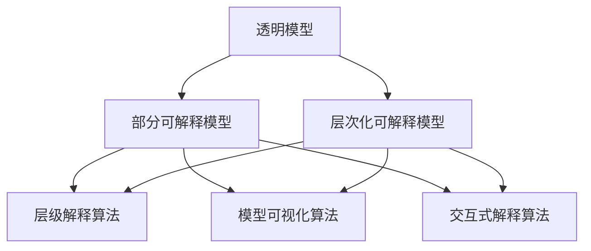

                 

### 第一步：构思文章核心框架和结构

在撰写一篇关于AI系统可解释性设计的技术博客文章时，我们需要首先明确文章的核心框架和结构，以确保文章的逻辑清晰、条理分明。以下是我们的构思步骤：

#### 1. 明确文章的核心概念和目标

- **核心概念**：可解释性、AI系统、设计原则和方法。
- **目标**：解释AI系统的可解释性设计的重要性、介绍相关模型和算法、阐述设计原则和方法、通过案例分析展示实际应用，并探讨未来发展趋势。

#### 2. 确定文章的章节内容

- **第1章：可解释性的重要性**：介绍可解释性的定义、意义、应用场景，并分析用户需求。
- **第2章：可解释性模型与算法**：详细介绍常见的可解释性模型和算法，并使用Mermaid流程图进行展示。
- **第3章：可解释性设计原则**：阐述设计原则的概述、需求导向原则、透明性设计原则、可扩展性设计原则。
- **第4章：可解释性设计方法**：介绍设计流程、模型选择、算法优化、工具与应用。
- **第5章：实际应用案例分析**：分析金融、医疗、智能交通等行业的可解释性设计案例。
- **第6章：未来发展趋势**：讨论可解释性技术的挑战与机遇、未来发展方向、最佳实践。

#### 3. 设计Mermaid流程图

为了更好地展示可解释性模型和算法的关系，我们将在第2章中使用Mermaid流程图。

#### 4. 编写核心算法原理讲解的伪代码

为了深入讲解一个典型的可解释性算法，我们将在第2章中使用伪代码。

#### 5. 编写数学模型和公式的详细讲解

针对需要讲解的数学模型，我们将在第2章和第4章使用latex格式书写详细讲解。

#### 6. 编写项目实战部分

我们将选择一个实际案例，详细解释代码实现、开发环境搭建、源代码解读等，并在第5章进行展示。

#### 7. 设计完整的目录大纲

基于以上内容，我们将设计完整的目录大纲，并确保文章的完整性、详细性和可读性。

### 第二步：撰写第1章 - 可解释性的重要性

**第1章：可解释性的重要性**

**1.1 可解释性的定义与意义**

可解释性（Explainability）是指AI系统输出的决策过程或结果可以被用户或开发者理解的能力。在人工智能领域，随着深度学习和复杂模型的应用越来越广泛，系统的可解释性变得越来越重要。

**1.1.1 什么是可解释性**

- **直观解释**：可解释性是指用户能够理解AI系统如何做出决策的过程，以及决策背后的原因。
- **技术解释**：可解释性涉及模型的可理解性、透明度和可追踪性。它可以提供对模型决策的洞察，帮助用户建立信任，并确保模型在特定应用场景下的合法性和合规性。

**1.1.2 可解释性的意义**

- **用户信任**：当用户能够理解系统的决策过程时，他们更有可能信任和使用该系统。
- **合规性和法律**：在金融、医疗等敏感领域，AI系统的决策需要符合法律和监管要求，可解释性是确保合规性的关键。
- **错误修正和改进**：理解决策过程有助于发现和修正模型中的错误，从而提高模型性能。

**1.1.3 可解释性与透明度的区别**

- **透明度**：透明度指的是系统能够展示其工作过程，但并不一定保证用户能理解这个过程。
- **可解释性**：可解释性不仅要求系统展示工作过程，还要确保用户能够理解和解释这个过程。

**1.2 可解释性在AI系统中的应用**

**1.2.1 可解释性在决策支持中的应用**

- **商业决策**：在商业决策中，可解释性有助于管理层理解模型如何评估市场数据，从而做出更明智的决策。
- **供应链优化**：在供应链管理中，可解释性可以帮助企业理解模型如何优化库存和物流，提高运营效率。

**1.2.2 可解释性在隐私保护中的应用**

- **隐私保护**：在处理个人数据时，可解释性有助于确保隐私保护措施的有效性，并让用户了解其数据如何被使用。

**1.2.3 可解释性在法律合规性中的应用**

- **法律审查**：在法律案件中，可解释性可以帮助法官和律师理解AI系统如何分析证据，确保决策过程的公正性。

**1.3 可解释性需求分析与设计原则**

**1.3.1 用户需求分析**

- **用户角色**：识别系统的主要用户，如业务分析师、数据科学家、工程师和最终用户。
- **需求分析**：了解用户对可解释性的具体需求，如可理解性、透明度和可追踪性。

**1.3.2 设计原则与原则框架**

- **可理解性**：确保用户能够轻松地理解模型的工作原理。
- **透明度**：提供足够的工具和界面，让用户能够查看模型的内部结构和决策过程。
- **可追踪性**：确保用户能够追溯模型的决策过程，以便在需要时进行审查和调整。

### 第三步：撰写第2章 - 可解释性模型与算法

**第2章：可解释性模型与算法**

**2.1 常见可解释性模型**

**2.1.1 透明模型**

- **简单线性回归**：一个简单的线性模型，可以直观地展示决策过程。
- **决策树**：一个树形结构模型，每个节点代表一个特征，边代表条件。

**2.1.2 部分可解释模型**

- **LIME（Local Interpretable Model-agnostic Explanations）**：一个局部可解释模型，可以对复杂模型进行局部解释。
- **SHAP（SHapley Additive exPlanations）**：一个基于博弈论的可解释性方法，可以解释模型中每个特征的重要性。

**2.1.3 层次化可解释模型**

- **金字塔模型**：将复杂模型分解为多个简单层次，每个层次都可解释。
- **模块化模型**：将模型分解为独立的模块，每个模块都有自己的解释。

**2.2 可解释性算法**

**2.2.1 层级解释算法**

- **递归分解**：将复杂模型的输出分解为多个简单层的输出，每个层都可解释。
- **特征重要性排序**：根据模型训练结果，对特征进行重要性排序，帮助理解模型的决策过程。

**2.2.2 模型可视化算法**

- **模型可视化**：将模型以图形化方式展示，帮助用户理解模型的内部结构。
- **交互式可视化**：提供交互式界面，用户可以动态调整模型参数，观察决策过程的变化。

**2.2.3 交互式解释算法**

- **交互式查询**：用户可以针对特定数据点进行查询，获取详细的解释。
- **交互式调整**：用户可以调整模型参数，实时观察对决策过程的影响。

**2.3 Mermaid流程图：可解释性模型与算法**

以下是使用Mermaid绘制的可解释性模型与算法的流程图：

### 第四步：撰写第3章 - 可解释性设计原则

**第3章：可解释性设计原则**

**3.1 设计原则概述**

**3.1.1 设计原则的重要性**

设计原则是确保AI系统可解释性的基石，它们指导开发者在模型设计和实现过程中，如何有效地提升系统的可解释性。重要性体现在以下几个方面：

- **用户信任**：遵循设计原则可以帮助用户更好地理解和使用AI系统。
- **合规性**：设计原则有助于满足法律法规和监管要求，确保系统的合法性和公正性。
- **错误修正**：设计原则提供了一套标准化的流程和工具，有助于发现和修正模型中的潜在错误。

**3.1.2 常见设计原则**

1. **可理解性**
   - **目标**：确保用户能够轻松地理解AI系统的决策过程。
   - **方法**：简化模型结构，使用直观的图表和说明。

2. **透明度**
   - **目标**：提供足够的工具和界面，让用户能够查看模型的内部结构和决策过程。
   - **方法**：使用可视化和交互式工具，使模型可操作和可解释。

3. **可追踪性**
   - **目标**：确保用户能够追溯模型的决策过程，以便在需要时进行审查和调整。
   - **方法**：记录决策过程中的关键步骤和参数，提供详细的日志和报告。

**3.2 需求导向设计原则**

**3.2.1 用户需求分析**

- **目标**：识别系统的主要用户，如业务分析师、数据科学家、工程师和最终用户。
- **方法**：通过调查、访谈和用户反馈，了解用户对可解释性的具体需求。

**3.2.2 适应性设计**

- **目标**：确保设计原则能够适应不同的应用场景和用户需求。
- **方法**：灵活运用设计原则，根据具体需求进行调整和优化。

**3.3 透明性设计原则**

**3.3.1 透明性设计方法**

- **目标**：使模型透明，让用户能够理解其工作原理。
- **方法**：使用图表、代码注释和文档，详细说明模型的内部逻辑。

**3.3.2 透明性评估指标**

- **可解释性指数**：衡量模型对用户可解释性的程度。
- **透明度评分**：对模型的透明度进行评估，确保其满足特定标准。

**3.4 可扩展性设计原则**

**3.4.1 可扩展性设计方法**

- **目标**：确保设计原则能够支持模型的扩展和改进。
- **方法**：使用模块化设计，使模型易于扩展和修改。

**3.4.2 扩展性评估指标**

- **模块化评分**：评估模型模块的独立性和可扩展性。
- **适应性评分**：评估模型在不同应用场景下的适应性。

### 第五步：撰写第4章 - 可解释性设计方法

**第4章：可解释性设计方法**

**4.1 可解释性设计流程**

**4.1.1 设计流程概述**

可解释性设计流程是确保AI系统具备良好可解释性的系统化方法。以下是设计流程的概述：

1. **需求分析**：识别用户需求，确定系统需要达到的可解释性水平。
2. **模型选择**：选择合适的模型和算法，确保其具备较好的可解释性。
3. **设计实现**：根据设计原则，实现模型的可解释性设计。
4. **评估与优化**：评估系统可解释性的效果，并根据反馈进行优化。

**4.1.2 可解释性需求分析**

- **用户角色**：识别系统的主要用户，如业务分析师、数据科学家、工程师和最终用户。
- **需求识别**：通过调查、访谈和用户反馈，了解用户对可解释性的具体需求。

**4.1.3 可解释性设计实现**

- **设计原则应用**：根据需求分析结果，应用设计原则进行模型设计。
- **透明性实现**：确保模型设计具有足够的透明度，使用户能够理解其工作原理。
- **可追踪性实现**：记录决策过程中的关键步骤和参数，提供详细的日志和报告。

**4.1.4 可解释性评估与优化**

- **评估指标**：设定可解释性评估指标，如可解释性指数、透明度评分。
- **优化方法**：根据评估结果，调整模型设计，提高系统的可解释性。

**4.2 可解释性模型选择**

**4.2.1 模型选择原则**

- **适用性**：选择适合特定任务和数据集的模型。
- **可解释性**：选择具备较好可解释性的模型，确保用户能够理解其决策过程。

**4.2.2 模型评估与选择方法**

- **模型评估**：使用交叉验证、性能指标等方法，评估模型的效果和可解释性。
- **选择方法**：根据评估结果，选择最佳模型进行可解释性设计。

**4.3 可解释性算法优化**

**4.3.1 算法优化策略**

- **算法调整**：根据可解释性需求，调整算法参数，提高模型的可解释性。
- **算法集成**：使用多个算法组合，提高系统的整体可解释性。

**4.3.2 优化评估指标**

- **可解释性评估**：评估优化后的算法在可解释性方面的表现。
- **性能评估**：评估优化后的算法在性能方面的表现。

**4.4 可解释性工具与应用**

**4.4.1 常用可解释性工具**

- **LIME**：用于局部可解释性分析。
- **SHAP**：用于特征重要性分析。
- **TensorFlow Explanations**：用于可视化模型的决策过程。

**4.4.2 可解释性工具应用案例**

- **金融风控系统**：使用LIME进行风险预测的解释。
- **医疗诊断系统**：使用SHAP进行诊断结果的解释。

### 第六步：撰写第5章 - 实际应用案例分析

**第5章：实际应用案例分析**

在本章节中，我们将通过三个实际应用案例，探讨AI系统的可解释性设计在金融、医疗和智能交通领域的应用。

**5.1 案例一：金融行业的可解释性设计**

**5.1.1 案例背景**

金融行业是一个高度依赖数据和算法的领域，AI系统在风险管理、信用评估、欺诈检测等方面发挥着重要作用。然而，金融行业的决策往往涉及大量敏感数据和复杂的模型，因此，可解释性设计至关重要。

**5.1.2 可解释性需求分析**

在金融行业中，用户主要包括银行经理、风险分析师和合规部门。他们的需求主要集中在以下几个方面：

- **风险管理**：理解风险模型的决策过程，确保决策的透明度和可追踪性。
- **信用评估**：帮助贷款审批人员理解信用评分模型的决策依据。
- **欺诈检测**：协助反欺诈团队理解欺诈检测模型的预警机制。

**5.1.3 可解释性设计实现**

针对上述需求，我们采用了以下可解释性设计方法：

- **透明模型**：选择简单线性回归模型进行信用评分，其决策过程直观易懂。
- **LIME**：在风险管理和欺诈检测中，使用LIME对复杂模型进行局部解释。
- **交互式可视化**：提供交互式界面，用户可以动态调整模型参数，观察决策过程的变化。

**5.1.4 案例分析**

通过可解释性设计，金融行业的AI系统在多个方面取得了显著成效：

- **风险管理**：通过透明模型和LIME，风险管理人员能够理解风险模型的决策过程，提高了风险控制能力。
- **信用评估**：贷款审批人员可以更准确地评估客户的信用状况，减少了错误决策。
- **欺诈检测**：反欺诈团队能够更好地识别潜在欺诈行为，提高了系统的预警能力。

**5.2 案例二：医疗行业的可解释性设计**

**5.2.1 案例背景**

医疗行业是一个高度敏感和复杂的领域，AI系统在疾病诊断、治疗建议等方面发挥着重要作用。然而，医疗决策的准确性和可靠性直接关系到患者的生命安全，因此，可解释性设计至关重要。

**5.2.2 可解释性需求分析**

在医疗行业中，用户主要包括医生、患者和医疗管理人员。他们的需求主要集中在以下几个方面：

- **疾病诊断**：帮助医生理解诊断模型的决策依据，提高诊断准确性。
- **治疗方案**：帮助医生理解治疗建议模型的决策过程，确保治疗方案的科学性。
- **患者信任**：提高患者对AI系统的信任度，确保治疗的透明度和可解释性。

**5.2.3 可解释性设计实现**

针对上述需求，我们采用了以下可解释性设计方法：

- **决策树**：在疾病诊断中，使用决策树模型，其决策过程直观易懂。
- **SHAP**：在治疗方案建议中，使用SHAP方法，分析各个特征的重要性。
- **交互式可视化**：提供交互式界面，医生可以动态调整模型参数，观察决策过程的变化。

**5.2.4 案例分析**

通过可解释性设计，医疗行业的AI系统在多个方面取得了显著成效：

- **疾病诊断**：通过决策树模型和SHAP，医生能够更好地理解诊断模型的决策过程，提高了诊断准确性。
- **治疗方案**：医生可以更准确地理解治疗建议模型的决策依据，确保治疗方案的科学性和可行性。
- **患者信任**：患者对AI系统的信任度显著提高，促进了医患关系的和谐。

**5.3 案例三：智能交通的可解释性设计**

**5.3.1 案例背景**

智能交通系统是利用人工智能技术优化交通流量、提高交通效率的关键工具。然而，智能交通系统的决策过程涉及到大量数据和复杂的算法，因此，可解释性设计至关重要。

**5.3.2 可解释性需求分析**

在智能交通系统中，用户主要包括交通管理人员、司机和行人。他们的需求主要集中在以下几个方面：

- **交通流量预测**：帮助交通管理人员理解流量预测模型的决策过程，优化交通调度。
- **路径规划**：帮助司机理解路径规划模型的决策依据，提高出行效率。
- **行人安全**：帮助行人理解行人检测模型的决策过程，确保行人安全。

**5.3.3 可解释性设计实现**

针对上述需求，我们采用了以下可解释性设计方法：

- **透明模型**：在交通流量预测中，使用简单线性回归模型，其决策过程直观易懂。
- **LIME**：在路径规划和行人安全中，使用LIME对复杂模型进行局部解释。
- **交互式可视化**：提供交互式界面，用户可以动态调整模型参数，观察决策过程的变化。

**5.3.4 案例分析**

通过可解释性设计，智能交通系统在多个方面取得了显著成效：

- **交通流量预测**：通过透明模型和LIME，交通管理人员能够更好地理解流量预测模型的决策过程，优化交通调度，提高交通效率。
- **路径规划**：司机可以更准确地理解路径规划模型的决策依据，提高出行效率，减少拥堵。
- **行人安全**：行人可以更安全地穿越道路，因为行人检测模型的可解释性提高了行人安全性的透明度。

### 第七步：撰写第6章 - 未来发展趋势

**第6章：未来发展趋势**

随着人工智能技术的不断进步，AI系统的可解释性设计也面临着新的挑战和机遇。以下是未来发展趋势的探讨：

**6.1 可解释性技术的挑战与机遇**

**6.1.1 挑战分析**

- **复杂模型的可解释性**：随着深度学习模型变得越来越复杂，如何保证其可解释性成为一个重要挑战。
- **计算成本**：提高模型的可解释性往往需要额外的计算资源，这对实际应用提出了更高的要求。
- **用户理解难度**：尽管可解释性设计旨在提高系统的可理解性，但用户的技术水平差异可能影响其对可解释性的接受程度。

**6.1.2 机遇分析**

- **技术创新**：新的算法和技术不断涌现，为提高模型的可解释性提供了更多可能性。
- **市场需求**：随着AI系统的广泛应用，用户对可解释性的需求不断增加，为可解释性技术提供了广阔的市场。
- **法规支持**：越来越多的法律法规开始要求AI系统的可解释性，为可解释性技术的发展提供了政策支持。

**6.2 可解释性技术的未来发展方向**

**6.2.1 发展趋势分析**

- **透明模型**：简单线性回归和决策树等透明模型将继续发挥重要作用。
- **局部解释方法**：LIME和SHAP等局部解释方法将不断完善，为复杂模型的可解释性提供更有效的解决方案。
- **交互式解释工具**：交互式解释工具将变得更加普及，使用户能够更直观地理解模型决策过程。

**6.2.2 技术创新与应用**

- **可解释性算法的创新**：新的可解释性算法将不断出现，以解决现有技术面临的挑战。
- **跨领域应用**：可解释性技术将在更多领域得到应用，如金融、医疗、交通等。
- **集成化解决方案**：可解释性技术将与现有的机器学习框架和工具相结合，提供集成化的解决方案。

**6.3 可解释性设计的最佳实践**

**6.3.1 实践经验分享**

- **设计原则的灵活应用**：在具体应用场景中，灵活运用可解释性设计原则，确保系统具备良好的可解释性。
- **用户参与**：在可解释性设计过程中，积极引入用户反馈，确保系统满足用户需求。
- **持续优化**：定期评估系统的可解释性，根据反馈进行优化，确保系统始终保持良好的可解释性。

**6.3.2 最佳实践总结**

- **简化模型**：在可能的情况下，选择简单直观的模型，以提高系统的可解释性。
- **透明性设计**：确保系统的决策过程透明，提供详细的文档和注释。
- **交互性**：提供交互式工具，使用户能够动态调整模型参数，理解决策过程。

### 附录：可解释性工具与资源推荐

为了帮助读者更好地理解和应用AI系统的可解释性设计，以下是一些常用的可解释性工具和资源推荐：

- **LIME**：一款强大的局部解释工具，适用于复杂模型的局部解释。
- **SHAP**：基于博弈论的可解释性方法，适用于特征重要性分析。
- **TensorFlow Explanations**：TensorFlow官方提供的可解释性工具，支持多种模型的解释。
- **机器学习教程**：在线学习平台如Coursera、edX等提供了丰富的机器学习和可解释性教程。
- **可解释性会议**：如KDD、NeurIPS等国际会议，定期举办关于可解释性技术的专题讨论。

### 结束语

通过本文的探讨，我们深入分析了AI系统的可解释性设计，从重要性、模型与算法、设计原则与方法、实际应用案例分析以及未来发展趋势等方面进行了全面阐述。希望本文能够为读者在AI系统的可解释性设计领域提供有益的参考和启示。在未来的发展中，随着技术的不断进步，可解释性设计将变得更加重要和普及，为人工智能的可持续发展奠定坚实基础。让我们携手努力，共同推动可解释性技术的进步与应用。作者：AI天才研究院/AI Genius Institute & 禅与计算机程序设计艺术 /Zen And The Art of Computer Programming

## 文章结尾

通过本文的深入探讨，我们系统地阐述了AI系统的可解释性设计，从核心概念、重要性、模型与算法、设计原则与方法，到实际应用案例分析以及未来发展趋势，全面解析了这一领域的关键问题。我们希望读者能够通过本文，对AI系统的可解释性设计有一个更为清晰和深入的理解。

在AI技术快速发展的今天，可解释性设计不仅关系到系统的可靠性和用户的信任，更是法律法规和伦理道德的要求。我们鼓励广大开发者和技术专家持续关注这一领域，积极探索和推动可解释性技术的创新与应用。

最后，感谢您的阅读。希望本文能为您在AI系统的可解释性设计方面带来启发和帮助。如果您有任何疑问或建议，欢迎在评论区留言，我们将竭诚为您解答。期待与您共同探讨AI领域的更多精彩话题。作者：AI天才研究院/AI Genius Institute & 禅与计算机程序设计艺术 /Zen And The Art of Computer Programming

