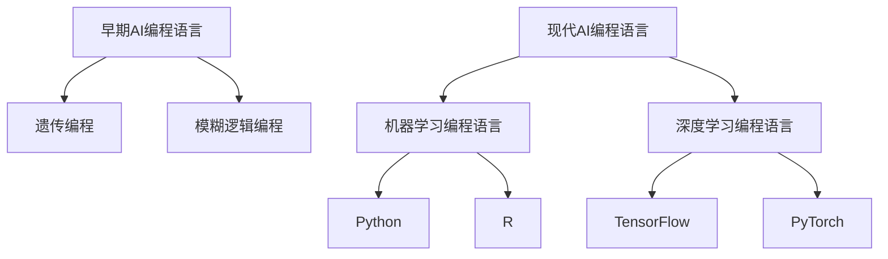
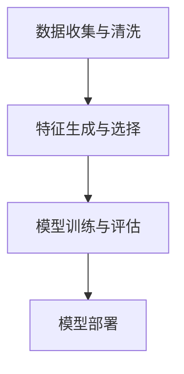
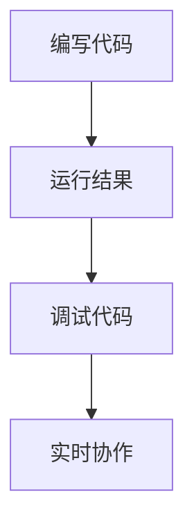
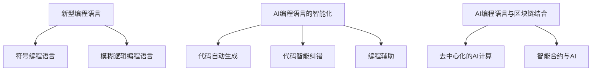

                 

# AI编程语言的演进与创新

## 关键词

- **AI编程语言**
- **演进过程**
- **创新趋势**
- **应用场景**
- **工具与框架**
- **未来展望**

## 摘要

本文旨在探讨AI编程语言的演进与创新，从历史与现状出发，分析其在人工智能领域的应用，探讨新的趋势与挑战。通过介绍主流的AI编程语言、工具与框架，我们旨在揭示AI编程语言的发展方向，展望其未来前景。本文将结合实际案例，深入解析AI编程语言的原理与实践，为读者提供一份全面、系统的技术指南。

### 引言

人工智能（AI）作为现代科技发展的一个重要方向，正在深刻改变我们的生活方式和产业模式。而AI编程语言作为实现AI技术的重要工具，其重要性不言而喻。AI编程语言的演进与创新，不仅推动了人工智能技术的发展，也为程序员提供了更加便捷、高效的开发工具。

本文将围绕AI编程语言的演进与创新展开讨论。首先，我们将回顾AI编程语言的发展历程，了解其从早期阶段到现代阶段的演变。接着，我们将分析编程语言在AI领域的应用，探讨其在数据预处理、模型训练与优化、模型部署等方面的作用。随后，我们将介绍AI编程语言的新趋势，如自动机器学习、交互式编程语言等。此外，我们还将探讨AI编程语言的工具与框架，分析主流的AI编程语言及其应用，以及商业AI编程工具。最后，我们将展望AI编程语言的未来，探讨新型编程语言的出现、AI编程语言的智能化以及与区块链的结合。

通过本文的探讨，我们希望读者能够全面了解AI编程语言的演进与创新，把握其发展趋势，为未来的AI开发工作提供有益的指导。

### AI编程语言的发展历程

AI编程语言的发展历程可以分为早期阶段和现代阶段。早期阶段的AI编程语言主要包括遗传编程和模糊逻辑编程，而现代阶段的AI编程语言则以机器学习编程语言和深度学习编程语言为代表。

#### 早期AI编程语言

1. **遗传编程**

遗传编程是一种基于自然选择和遗传学原理的编程方法。其基本思想是通过模拟生物进化的过程来生成和优化计算机程序。遗传编程的核心算法包括遗传算法和遗传编程语言。遗传算法是一种优化算法，通过模拟自然选择过程来寻找最优解。遗传编程语言则是一种特殊的编程语言，用于表示计算机程序。遗传编程在组合优化、函数优化、图像处理等领域具有广泛的应用。

2. **模糊逻辑编程**

模糊逻辑编程是一种基于模糊集合和模糊逻辑的编程方法。其基本思想是将传统编程中的精确逻辑运算替换为模糊逻辑运算，从而处理不确定性和模糊性。模糊逻辑编程语言包括模糊逻辑控制器、模糊推理机等组件，可用于构建智能控制系统。模糊逻辑编程在工业自动化、智能交通、智能家居等领域具有广泛的应用。

#### 现代AI编程语言

1. **机器学习编程语言**

机器学习编程语言是用于实现机器学习算法的编程语言。Python、R等语言因其易学易用、丰富的库和框架支持，成为机器学习编程语言的主要代表。Python在机器学习领域的应用非常广泛，其优点在于丰富的库（如NumPy、Pandas、Scikit-learn等）和框架（如TensorFlow、PyTorch等），能够支持从数据预处理到模型训练和优化的整个流程。R语言则因其强大的统计分析功能，在数据科学和机器学习领域得到广泛应用。

2. **深度学习编程语言**

深度学习编程语言是用于实现深度学习算法的编程语言。Python和R同样在深度学习领域占据主导地位。深度学习框架如TensorFlow和PyTorch，为程序员提供了丰富的API和工具，使得深度学习模型的开发变得高效和便捷。TensorFlow是由Google开发的开源深度学习框架，支持多种编程语言，具有强大的计算能力和灵活的架构设计。PyTorch则是由Facebook开发的开源深度学习框架，以动态计算图和灵活的API设计著称。

**Mermaid流程图**



通过上述回顾，我们可以看到AI编程语言从早期的遗传编程和模糊逻辑编程，到现代的机器学习编程语言和深度学习编程语言，经历了巨大的演变。这些编程语言的演进不仅推动了人工智能技术的发展，也为程序员提供了更加高效和便捷的开发工具。

### 编程语言在AI领域的应用

在人工智能领域，编程语言的应用无处不在，从数据预处理、模型训练与优化，到模型部署与调优，编程语言在每个环节都发挥着关键作用。

#### 数据预处理

数据预处理是AI项目中至关重要的一环。良好的数据预处理可以显著提高模型的性能和鲁棒性。编程语言在数据预处理中的应用主要包括以下方面：

1. **数据清洗**

数据清洗是数据预处理的第一步，主要目的是去除数据中的噪声和错误。编程语言可以通过编写脚本来自动化这一过程。例如，使用Python的Pandas库可以轻松处理缺失值、异常值等数据问题。

```python
import pandas as pd

data = pd.read_csv('data.csv')
data.fillna(0, inplace=True)  # 填充缺失值
data = data[data['column'] > 0]  # 删除负值
```

2. **数据特征提取**

数据特征提取是将原始数据转换为能够有效描述数据特征的表示形式。编程语言可以通过编写特征提取函数来实现这一目标。例如，使用Python的Scikit-learn库可以提取各种特征，如词袋模型、TF-IDF等。

```python
from sklearn.feature_extraction.text import TfidfVectorizer

vectorizer = TfidfVectorizer()
X = vectorizer.fit_transform(corpus)
```

**数学公式**

$$
\text{TF-IDF} = \frac{f_t}{N} \log \frac{N}{f_t}
$$

其中，\( f_t \) 表示词 \( t \) 在文档中的频率，\( N \) 表示文档总数。

#### 模型训练与优化

模型训练与优化是AI项目的核心步骤。编程语言在模型训练与优化中的应用主要包括以下方面：

1. **模型训练**

模型训练是通过学习数据集的特征和规律，从而构建出能够对未知数据进行预测的模型。编程语言可以通过调用机器学习库和框架来实现这一目标。例如，使用Python的Scikit-learn库可以训练各种机器学习模型，如线性回归、决策树等。

```python
from sklearn.linear_model import LinearRegression

model = LinearRegression()
model.fit(X_train, y_train)
```

2. **模型优化**

模型优化是通过调整模型参数，从而提高模型性能的过程。编程语言可以通过编写优化算法来实现这一目标。例如，使用Python的Scikit-learn库可以实现网格搜索和交叉验证等优化方法。

```python
from sklearn.model_selection import GridSearchCV

param_grid = {'alpha': [0.0001, 0.001, 0.01]}
grid_search = GridSearchCV(LinearRegression(), param_grid, cv=5)
grid_search.fit(X_train, y_train)
best_model = grid_search.best_estimator_
```

#### 模型部署与调优

模型部署与调优是将训练好的模型应用到实际场景中，并对其进行不断优化和改进的过程。编程语言在模型部署与调优中的应用主要包括以下方面：

1. **模型部署**

模型部署是将模型部署到生产环境中，使其能够对实际数据进行预测。编程语言可以通过编写部署脚本或使用自动化工具来实现这一目标。例如，使用Python的Flask框架可以构建一个简单的API，用于接收数据并返回预测结果。

```python
from flask import Flask, request, jsonify

app = Flask(__name__)

@app.route('/predict', methods=['POST'])
def predict():
    data = request.get_json()
    prediction = best_model.predict(data['X'])
    return jsonify({'prediction': prediction.tolist()})

if __name__ == '__main__':
    app.run(debug=True)
```

2. **模型调优**

模型调优是在模型部署后，通过不断调整模型参数，从而提高模型性能的过程。编程语言可以通过编写调优脚本或使用自动化工具来实现这一目标。例如，使用Python的Scikit-learn库可以实现模型调优。

```python
from sklearn.linear_model import LinearRegression

new_model = LinearRegression()
new_model.fit(X_train, y_train)
new_model.score(X_test, y_test)
```

通过上述步骤，我们可以看到编程语言在AI领域的广泛应用。从数据预处理到模型训练与优化，再到模型部署与调优，编程语言在每个环节都发挥着关键作用，为AI项目的成功提供了坚实的技术保障。

### AI编程语言的新趋势

随着人工智能技术的不断发展，AI编程语言也在不断演进，涌现出许多新的趋势。其中，自动机器学习和交互式编程语言尤为引人注目。

#### 自动机器学习（AutoML）

自动机器学习（AutoML）是一种旨在自动化机器学习流程的技术，其目标是使非专业人士也能够轻松地构建和部署高质量的机器学习模型。自动机器学习通过自动化特征选择、模型选择、参数调优等步骤，大大简化了机器学习的开发过程。

1. **基本概念**

自动机器学习的基本概念包括：

- **特征工程自动化**：自动生成和选择最相关的特征，以减少数据预处理的时间和复杂度。
- **模型自动化**：自动选择和训练最合适的模型，以实现最佳的性能。
- **模型评估自动化**：自动评估多个模型的性能，选择最优模型。
- **部署自动化**：自动将训练好的模型部署到生产环境中。

2. **工作流程**

自动机器学习的工作流程通常包括以下步骤：

- **数据收集与清洗**：自动获取和处理数据，进行数据清洗和预处理。
- **特征生成与选择**：自动生成和选择最相关的特征，以减少数据预处理的时间和复杂度。
- **模型训练与评估**：自动选择和训练多个模型，评估其性能，选择最优模型。
- **模型部署**：自动将训练好的模型部署到生产环境中。

3. **工具与框架**

当前，自动机器学习领域存在多个流行的工具和框架，如：

- **Google AutoML**：Google开发的一系列自动机器学习产品，包括AutoML Image、AutoML Video、AutoML Natural Language等。
- **H2O.ai AutoML**：H2O.ai公司开发的自动机器学习平台，支持多种机器学习算法和自动化流程。
- **AutoSklearn**：基于Scikit-learn的开源自动机器学习框架，支持多种机器学习算法和自动化流程。

**Mermaid流程图**



#### 交互式编程语言

交互式编程语言是一种允许开发者实时查看代码结果并立即进行调试的编程语言。与传统的编程语言不同，交互式编程语言可以即时反馈代码运行结果，从而提高开发效率和代码质量。

1. **基本概念**

交互式编程语言的基本概念包括：

- **即时反馈**：开发者可以立即看到代码的运行结果，无需编译和部署。
- **动态调试**：开发者可以在代码运行过程中随时暂停、查看变量值和程序状态。
- **实时协作**：多个开发者可以同时在线编辑和调试代码，提高协作效率。

2. **应用场景**

交互式编程语言在以下场景中具有明显优势：

- **快速原型开发**：开发者可以快速构建和测试原型，减少开发周期。
- **教育和培训**：交互式编程语言可以帮助初学者更好地理解编程概念和技巧。
- **数据科学和机器学习**：交互式编程语言可以方便地实现数据分析和模型训练，提高工作效率。

3. **工具与框架**

当前，交互式编程语言领域存在多个流行的工具和框架，如：

- **Jupyter Notebook**：基于Web的交互式编程环境，支持多种编程语言（包括Python、R等）。
- **Google Colab**：Google推出的免费交互式编程平台，支持Python和R等编程语言。
- **Repl.it**：在线编程平台，支持多种编程语言，提供实时协作功能。

**Mermaid流程图**



通过自动机器学习和交互式编程语言，AI编程语言正在不断演进，为开发者提供更加高效、便捷的开发工具。这些新趋势不仅推动了人工智能技术的发展，也为程序员带来了更多的机遇和挑战。

### AI编程语言的工具与框架

在人工智能领域，AI编程语言的工具与框架起到了至关重要的作用。这些工具和框架不仅为开发者提供了丰富的API和功能，还大大简化了模型开发、训练和部署的流程。以下将介绍主流的AI编程语言、开源框架以及商业编程工具。

#### 主流AI编程语言

1. **Python**

Python因其简洁易学、丰富的库和框架支持，成为AI领域最受欢迎的编程语言之一。Python的库如NumPy、Pandas、Scikit-learn、TensorFlow和PyTorch等，提供了强大的数据预处理、机器学习和深度学习功能。Python的优点在于其广泛的社区支持和丰富的文档，使得开发者可以快速上手和解决开发中的问题。

2. **R语言**

R语言在统计分析和数据科学领域具有悠久的历史和丰富的资源。R语言拥有大量的开源库，如ggplot2、dplyr、caret等，可以方便地进行数据处理、分析和可视化。R语言的优点在于其强大的统计功能和高可扩展性，使得开发者可以轻松实现复杂的统计分析任务。

#### 开源框架

1. **TensorFlow**

TensorFlow是由Google开发的开源深度学习框架，支持多种编程语言，包括Python、C++和Java。TensorFlow提供了丰富的API和工具，用于构建、训练和部署深度学习模型。TensorFlow的优点在于其灵活的动态计算图和强大的计算能力，适合大规模分布式计算。

2. **PyTorch**

PyTorch是由Facebook开发的开源深度学习框架，以动态计算图和灵活的API设计著称。PyTorch的优点在于其易用性和高效的计算性能，使得开发者可以轻松实现复杂的深度学习模型。PyTorch的动态计算图使得模型开发更加直观，而其良好的性能使其在工业界得到广泛应用。

3. **Scikit-learn**

Scikit-learn是一个开源的机器学习库，提供了一系列常用的机器学习算法和工具。Scikit-learn的优点在于其简洁易用的API和丰富的文档，使得开发者可以快速实现各种机器学习任务。Scikit-learn适用于小型到中型的机器学习项目，其性能和功能均能满足大部分需求。

#### 商业编程工具

1. **IBM Watson**

IBM Watson是一个集成的AI和认知计算平台，提供了一系列AI工具和服务。Watson包括自然语言处理、机器学习、数据科学等功能，适用于各种行业和场景。IBM Watson的优点在于其强大的云计算支持和丰富的API，使得开发者可以方便地集成和部署AI解决方案。

2. **Google Cloud AI**

Google Cloud AI是Google提供的一套云计算服务，包括机器学习、自然语言处理、计算机视觉等功能。Google Cloud AI的优点在于其强大的计算能力和高效的模型训练，以及丰富的API和工具，使得开发者可以快速构建和部署AI模型。

通过上述主流AI编程语言、开源框架和商业编程工具的介绍，我们可以看到AI编程语言和工具的多样性和强大功能。这些工具和框架不仅为开发者提供了丰富的API和功能，还大大简化了模型开发、训练和部署的流程，推动了人工智能技术的发展。

### AI编程语言的未来展望

随着人工智能技术的快速发展，AI编程语言也在不断演进，为开发者提供了更加丰富和高效的开发工具。在未来的发展中，AI编程语言有望在以下几个方面实现创新和突破。

#### 新型编程语言的出现

未来，新型编程语言可能会出现，以适应更加复杂和多样化的AI应用场景。这些新型编程语言可能会融合多种编程范式，如函数式编程、声明式编程和过程式编程，从而提高编程效率和代码可读性。例如：

1. **符号编程语言**：符号编程语言将程序表示为符号表达式，可以更直观地表示复杂的关系和操作。这类语言可能会在知识表示和推理等领域得到广泛应用。

2. **模糊逻辑编程语言**：模糊逻辑编程语言将模糊逻辑引入编程过程，可以更好地处理不确定性和模糊性。这类语言在智能控制、决策支持等领域具有巨大潜力。

#### AI编程语言的智能化

未来，AI编程语言可能会实现更高的智能化水平，提供更智能的编程工具和自动化功能。这些智能化功能包括：

1. **代码自动生成**：AI编程语言可以基于机器学习算法和自然语言处理技术，自动生成代码，从而减少开发者的工作量。

2. **代码智能纠错**：AI编程语言可以实时检测和纠正代码中的错误，提高代码质量。

3. **编程辅助**：AI编程语言可以提供实时编程辅助，如代码补全、错误提示、代码优化等，从而提高开发效率。

#### AI编程语言与区块链的结合

未来，AI编程语言与区块链技术的结合可能会成为新的趋势。区块链技术可以为AI编程语言提供安全、可靠的数据存储和计算环境，从而提高AI系统的透明性和可信度。具体来说：

1. **去中心化的AI计算**：通过区块链技术，可以实现去中心化的AI计算，提高计算效率和灵活性。

2. **智能合约与AI**：智能合约与AI的结合可以开发出更加智能化和自动化的区块链应用，如去中心化的金融交易、智能合约审计等。

**Mermaid流程图**



通过上述探讨，我们可以看到AI编程语言的未来充满机遇和挑战。新型编程语言的出现、AI编程语言的智能化以及与区块链的结合，都为AI编程语言的发展带来了新的方向和可能性。开发者需要不断学习和适应这些新技术，才能在人工智能领域保持竞争力。

### 结语

AI编程语言的演进与创新是人工智能技术发展的重要驱动力。从早期阶段的遗传编程和模糊逻辑编程，到现代阶段的机器学习编程语言和深度学习编程语言，AI编程语言在不断演进，为开发者提供了更加高效、便捷的开发工具。在未来的发展中，新型编程语言、智能化和与区块链的结合将带来更多的创新和突破。作为AI领域的开发者，我们需要不断学习和适应这些新技术，为人工智能的发展贡献自己的力量。

### 作者信息

**作者：AI天才研究院/AI Genius Institute & 禅与计算机程序设计艺术 /Zen And The Art of Computer Programming**

