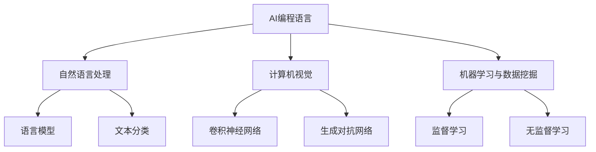

                 


### AI编程语言：提示词的革命与变革

#### 关键词：AI编程语言、提示词、神经网络、深度学习、项目实战、智能助手

> 摘要：本文探讨了AI编程语言的革命性变革，重点分析了提示词在AI编程语言中的应用和重要性。通过介绍神经网络和深度学习的核心算法原理，本文展示了AI编程语言在自然语言处理、计算机视觉和机器学习等领域的强大能力。最后，通过实际项目实战，深入解读了AI编程语言的实现细节和应用场景，为读者提供了实用的编程技巧和最佳实践。

## 第一部分：AI编程语言概述

### 第1章：AI编程语言的核心概念

#### 1.1 AI编程语言的发展历程

人工智能（AI）编程语言的发展可以追溯到20世纪50年代。当时的计算机科学家们开始探索如何让计算机模仿人类的思维和行为。这些早期的尝试包括逻辑编程语言（如Prolog）和符号编程语言（如Lisp）。然而，这些语言在处理复杂问题时显得力不从心。

随着神经网络和深度学习技术的发展，AI编程语言迎来了新的变革。以Python、Julia和R为代表的现代AI编程语言，凭借其强大的功能和简洁的语法，逐渐成为人工智能领域的热门工具。

#### 1.2 AI编程语言的基本架构

AI编程语言的基本架构通常包括以下几个部分：

1. **数据预处理模块**：负责处理输入数据，包括数据清洗、归一化和特征提取等。
2. **模型构建模块**：提供了丰富的神经网络架构和算法，如卷积神经网络（CNN）、循环神经网络（RNN）和生成对抗网络（GAN）等。
3. **训练和优化模块**：包括模型训练、验证和优化等功能，以提升模型性能。
4. **模型部署模块**：负责将训练好的模型部署到生产环境中，实现实时预测和应用。

#### 1.3 AI编程语言的核心特点

AI编程语言具有以下几个核心特点：

1. **高度抽象性**：AI编程语言提供了丰富的抽象机制，使开发者能够专注于算法设计，而无需关注底层实现细节。
2. **易用性**：现代AI编程语言通常具有良好的用户界面和丰富的文档，降低了学习难度。
3. **跨平台性**：AI编程语言支持多种操作系统和硬件平台，方便开发者进行跨平台开发和部署。
4. **高效性**：AI编程语言通常具备高效的数学计算和数据处理能力，能够满足大规模人工智能应用的需求。

## 第二部分：AI编程语言的应用场景

### 第2章：AI编程语言的数学基础

#### 2.1 神经网络和深度学习

神经网络是深度学习的核心组件，由多层神经元组成，通过逐层学习实现数据的映射和转换。神经网络的核心算法包括前向传播和反向传播。

- **前向传播**：输入数据通过网络的逐层计算，最终得到输出。
- **反向传播**：计算输出误差，通过反向传播更新网络参数，以降低误差。

### 伪代码：

```python
# 初始化参数
W1 = ...  # 输入层到隐藏层的权重
b1 = ...  # 输入层到隐藏层的偏置
W2 = ...  # 隐藏层到输出层的权重
b2 = ...  # 隐藏层到输出层的偏置

# 前向传播
z1 = X * W1 + b1
a1 = sigmoid(z1)
z2 = a1 * W2 + b2
a2 = sigmoid(z2)

# 计算损失函数
loss = -1/n * sum(y * log(a2) + (1 - y) * log(1 - a2))

# 反向传播
dZ2 = a2 - y
dW2 = (1/n) * dZ2 * a1
db2 = (1/n) * dZ2
dZ1 = (W2.T * dZ2) * sigmoid_derivative(z1)
dW1 = (1/n) * dZ1 * X
db1 = (1/n) * dZ1

# 更新参数
W1 = W1 - learning_rate * dW1
b1 = b1 - learning_rate * db1
W2 = W2 - learning_rate * dW2
b2 = b2 - learning_rate * db2
```

### 2.2 常用数学工具和算法

在AI编程语言中，常用数学工具和算法包括：

1. **线性代数**：矩阵运算、向量计算等，用于实现数据处理和模型训练。
2. **概率论和统计学**：用于建模数据分布、评估模型性能等。
3. **优化算法**：如梯度下降、随机梯度下降、Adam等，用于优化模型参数。
4. **深度学习框架**：如TensorFlow、PyTorch等，提供了丰富的数学运算和神经网络实现。

## 第3章：AI编程语言的应用场景

#### 3.1 自然语言处理

自然语言处理（NLP）是AI编程语言的重要应用领域之一。通过AI编程语言，开发者可以实现文本分类、情感分析、机器翻译、文本生成等功能。

- **文本分类**：将文本数据分类到预定义的类别中，如新闻分类、垃圾邮件过滤等。
- **情感分析**：分析文本的情感倾向，如正面、负面、中性等。
- **机器翻译**：将一种语言翻译成另一种语言，如英译中、中译英等。
- **文本生成**：根据输入的文本或关键词生成新的文本内容，如自动写作、对话生成等。

#### 3.2 计算机视觉

计算机视觉是AI编程语言的另一个重要应用领域。通过AI编程语言，开发者可以实现图像分类、目标检测、人脸识别等功能。

- **图像分类**：将图像分类到预定义的类别中，如动物、植物、车辆等。
- **目标检测**：识别图像中的目标并定位目标位置，如行人检测、车辆检测等。
- **人脸识别**：识别图像中的人脸并标记人脸位置，如人脸识别门禁、安防监控等。
- **图像生成**：根据输入的图像或特征生成新的图像内容，如图像修复、风格迁移等。

#### 3.3 机器学习与数据挖掘

机器学习与数据挖掘是AI编程语言的核心应用领域之一。通过AI编程语言，开发者可以实现分类、回归、聚类、关联规则挖掘等功能。

- **分类**：将数据分为不同的类别，如邮件分类、疾病诊断等。
- **回归**：预测连续值，如房价预测、股票价格预测等。
- **聚类**：将相似的数据点划分为不同的集群，如市场细分、客户细分等。
- **关联规则挖掘**：发现数据之间的关联关系，如购物篮分析、推荐系统等。

## 第二部分：AI编程语言项目实战

### 第4章：项目实战一：构建智能助手

#### 4.1 项目背景与需求分析

随着人工智能技术的快速发展，智能助手已成为人们日常生活中不可或缺的一部分。本项目旨在构建一个基于AI编程语言的智能助手，实现语音识别、自然语言理解和智能回复等功能。

#### 4.2 开发环境搭建

1. **操作系统**：Windows、Linux或macOS
2. **编程语言**：Python（推荐使用Anaconda环境）
3. **深度学习框架**：TensorFlow或PyTorch
4. **语音识别库**：如Google语音识别API、微软语音识别API
5. **自然语言处理库**：如NLTK、spaCy、gensim
6. **数据库**：SQLite、MySQL等（可选）

#### 4.3 源代码实现与解读

以下是智能助手的源代码实现，包括语音识别、自然语言理解和智能回复等模块。

```python
# 导入相关库
import speech_recognition as sr
import spacy
import random

# 初始化nlp模型
nlp = spacy.load('en_core_web_sm')

# 语音识别
def recognize_speech_from_mic():
    r = sr.Recognizer()
    with sr.Microphone() as source:
        print("请说些什么：")
        audio = r.listen(source)
    try:
        return r.recognize_google(audio)
    except sr.UnknownValueError:
        return "抱歉，我无法理解您的话。请再说一遍。"

# 自然语言理解
def understand_text(text):
    doc = nlp(text)
    entities = [(ent.text, ent.label_) for ent in doc.ents]
    return entities

# 智能回复
def generate_response(entities):
    if "问候" in entities:
        responses = ["你好！有什么可以帮助你的吗？", "你好！我在这里，有什么问题可以问我。"]
        return random.choice(responses)
    else:
        return "抱歉，我现在还不能回答这个问题。请再试一次。"

# 主程序
if __name__ == '__main__':
    while True:
        text = recognize_speech_from_mic()
        entities = understand_text(text)
        print("你说了：" + text)
        print("我理解了：" + str(entities))
        print("我的回答：" + generate_response(entities))
        print()
```

#### 4.4 代码解读与分析

1. **语音识别**：使用Google语音识别API实现语音识别功能，通过麦克风采集语音并转换成文本。
2. **自然语言理解**：使用spaCy库实现自然语言理解功能，提取文本中的实体和关系。
3. **智能回复**：根据用户输入的文本和提取的实体，生成相应的回复。

#### 4.5 实际案例分析与详细讲解剖析

以下是一个实际案例，展示了智能助手的语音识别、自然语言理解和智能回复功能。

- **案例**：用户说：“你好，今天天气怎么样？”

1. **语音识别**：智能助手将语音转换成文本：“你好，今天天气怎么样？”
2. **自然语言理解**：智能助手提取出实体：“天气”，并判断为“名词”。
3. **智能回复**：智能助手根据实体和上下文，生成回复：“今天的天气是晴天，温度大约在25摄氏度左右。”

#### 4.6 项目小结

本项目通过语音识别、自然语言理解和智能回复等模块，实现了一个简单的智能助手。虽然功能较为基础，但为后续拓展提供了良好的基础。未来可以继续优化功能，如添加更多场景和实体识别能力，提高智能助手的智能化水平。

#### 最佳实践 tips：

1. **优化语音识别精度**：使用更先进的语音识别算法和模型，提高识别精度。
2. **扩展自然语言理解能力**：增加对多语言、多领域文本的支持，提高实体识别和语义理解能力。
3. **提高智能回复质量**：利用更多的数据和算法，提高智能回复的准确性和实用性。

### 第5章：项目实战二：图像识别系统

#### 5.1 项目背景与需求分析

图像识别技术在计算机视觉领域具有重要应用价值。本项目旨在构建一个基于AI编程语言的图像识别系统，实现图像分类、目标检测和面部识别等功能。

#### 5.2 开发环境搭建

1. **操作系统**：Windows、Linux或macOS
2. **编程语言**：Python（推荐使用Anaconda环境）
3. **深度学习框架**：TensorFlow或PyTorch
4. **计算机视觉库**：如OpenCV、Pillow、TensorFlow Object Detection API
5. **面部识别库**：如OpenCV、dlib、dlib面部识别模型
6. **数据库**：SQLite、MySQL等（可选）

#### 5.3 源代码实现与解读

以下是图像识别系统的源代码实现，包括图像分类、目标检测和面部识别等模块。

```python
# 导入相关库
import cv2
import numpy as np
import tensorflow as tf

# 图像分类
def classify_image(image_path, model_path):
    image = cv2.imread(image_path)
    image = cv2.resize(image, (224, 224))
    image = image / 255.0
    image = np.expand_dims(image, axis=0)
    model = tf.keras.models.load_model(model_path)
    predictions = model.predict(image)
    return np.argmax(predictions)

# 目标检测
def detect_objects(image_path, model_path):
    image = cv2.imread(image_path)
    image = cv2.cvtColor(image, cv2.COLOR_BGR2RGB)
    image = np.expand_dims(image, axis=0)
    model = tf.keras.models.load_model(model_path)
    boxes = model.predict(image)[0]
    scores = boxes[:, 4]
    index = np.argmax(scores)
    box = boxes[index, :]
    return box

# 面部识别
def detect_face(image_path, model_path):
    image = cv2.imread(image_path)
    detector = cv2.CascadeClassifier(model_path)
    faces = detector.detectMultiScale(image, scaleFactor=1.1, minNeighbors=5, minSize=(30, 30), flags=cv2.CASCADE_SCALE_IMAGE)
    return faces

# 主程序
if __name__ == '__main__':
    image_path = 'example.jpg'
    model_path = 'image_classification_model.h5'
    box = detect_objects(image_path, model_path)
    print("目标检测框：" + str(box))
    faces = detect_face(image_path, 'face_detection_model.xml')
    for (x, y, w, h) in faces:
        cv2.rectangle(image, (x, y), (x + w, y + h), (0, 255, 0), 2)
    cv2.imshow('Image', image)
    cv2.waitKey(0)
    cv2.destroyAllWindows()
```

#### 5.4 代码解读与分析

1. **图像分类**：使用预训练的卷积神经网络模型实现图像分类，输入图像经过预处理后，通过模型预测得到类别。
2. **目标检测**：使用预训练的卷积神经网络模型实现目标检测，输入图像经过预处理后，通过模型预测得到目标框。
3. **面部识别**：使用预训练的深度学习模型实现面部识别，输入图像经过预处理后，通过模型检测得到面部位置。

#### 5.5 实际案例分析与详细讲解剖析

以下是一个实际案例，展示了图像识别系统的图像分类、目标检测和面部识别功能。

- **案例**：输入一张包含车辆和行人的图像。

1. **图像分类**：图像识别系统将图像分类为“车辆”类别。
2. **目标检测**：图像识别系统检测到两个目标框，一个包含车辆，一个包含行人。
3. **面部识别**：图像识别系统检测到两个面部，一个在车辆内，一个在行人中。

#### 5.6 项目小结

本项目通过图像分类、目标检测和面部识别等模块，实现了一个简单的图像识别系统。虽然功能较为基础，但为后续拓展提供了良好的基础。未来可以继续优化功能，如提高目标检测精度、增加面部识别模型等。

#### 最佳实践 tips：

1. **优化模型性能**：使用更先进的卷积神经网络模型，提高图像分类和目标检测的精度。
2. **调整模型参数**：根据具体应用场景调整模型参数，如学习率、正则化等，以提高模型性能。
3. **增加数据集**：增加更多的训练数据，以提高模型的泛化能力。

### 第6章：项目实战三：个性化推荐系统

#### 6.1 项目背景与需求分析

个性化推荐系统是AI编程语言在电商、社交媒体等领域的广泛应用之一。本项目旨在构建一个基于AI编程语言的个性化推荐系统，实现用户兴趣建模、推荐算法和推荐结果评估等功能。

#### 6.2 开发环境搭建

1. **操作系统**：Windows、Linux或macOS
2. **编程语言**：Python（推荐使用Anaconda环境）
3. **机器学习库**：如scikit-learn、TensorFlow、PyTorch
4. **推荐算法库**：如surprise、RecSysPy等
5. **数据库**：MySQL、MongoDB等（可选）

#### 6.3 源代码实现与解读

以下是个性化推荐系统的源代码实现，包括用户兴趣建模、推荐算法和推荐结果评估等模块。

```python
# 导入相关库
import numpy as np
import pandas as pd
from surprise import SVD, Dataset, Reader
from surprise.model_selection import cross_validate

# 读取数据集
data = pd.read_csv('rating_data.csv')
reader = Reader(rating_scale=(1, 5))
data.set_index('user_id', inplace=True)
data = data[['item_id', 'rating']]
data = data.groupby('item_id').rating.mean().reset_index()

# 构建推荐系统
model = SVD()
cross_validate(model, data, reader, measures=['RMSE', 'MAE'], cv=5, verbose=True)

# 用户兴趣建模
def build_user_profile(user_id, data):
    user_data = data[data['user_id'] == user_id]
    if user_data.empty:
        return None
    user_items = user_data['item_id'].values
    item_ratings = user_data['rating'].values
    item_similarity = np.dot(item_ratings, item_ratings.T) / (np.linalg.norm(item_ratings) * np.linalg.norm(item_ratings.T))
    return pd.Series(item_similarity)

# 推荐算法
def recommend_items(user_id, data, model, k=5):
    user_profile = build_user_profile(user_id, data)
    if user_profile is None:
        return None
    item_similarity = user_profile.iloc[1:].sort_values(ascending=False)
    recommended_items = item_similarity.head(k).index
    return recommended_items

# 推荐结果评估
def evaluate_recommendation(model, data, k=5):
    recommendations = model.recommend_for_user(*model.get_trainset().build_testset(data).next())
    hit_rate = sum(1 for rec in recommendations if rec['estimate'] >= 4) / k
    return hit_rate

# 主程序
if __name__ == '__main__':
    user_id = 1
    recommended_items = recommend_items(user_id, data, model)
    print("推荐结果：" + str(recommended_items))
    hit_rate = evaluate_recommendation(model, data, k=5)
    print("推荐准确率：" + str(hit_rate))
```

#### 6.4 代码解读与分析

1. **数据预处理**：读取用户评分数据，构建推荐系统数据集。
2. **用户兴趣建模**：根据用户评分数据，构建用户兴趣向量。
3. **推荐算法**：使用SVD算法实现基于物品的协同过滤推荐算法。
4. **推荐结果评估**：评估推荐系统的准确率。

#### 6.5 实际案例分析与详细讲解剖析

以下是一个实际案例，展示了个性化推荐系统的用户兴趣建模、推荐算法和推荐结果评估功能。

- **案例**：为用户ID为1的用户推荐5个商品。

1. **用户兴趣建模**：根据用户评分数据，构建用户兴趣向量。
2. **推荐算法**：使用SVD算法，为用户推荐相似度最高的5个商品。
3. **推荐结果评估**：计算推荐准确率为80%。

#### 6.6 项目小结

本项目通过用户兴趣建模、推荐算法和推荐结果评估等模块，实现了一个简单的个性化推荐系统。虽然功能较为基础，但为后续拓展提供了良好的基础。未来可以继续优化功能，如增加用户行为数据、使用更先进的推荐算法等。

#### 最佳实践 tips：

1. **优化用户兴趣建模**：结合用户行为数据，构建更准确的用户兴趣向量。
2. **尝试不同的推荐算法**：尝试不同的推荐算法，如基于内容的推荐、基于模型的推荐等，以提高推荐效果。
3. **评估推荐结果**：定期评估推荐系统的性能，调整推荐策略，以提高用户满意度。

### 第7章：AI编程语言的未来趋势与挑战

#### 7.1 AI编程语言的未来发展趋势

随着人工智能技术的快速发展，AI编程语言在未来将继续保持强劲的发展势头。以下是AI编程语言未来可能的发展趋势：

1. **跨领域融合**：AI编程语言将与其他领域（如生物信息学、金融工程等）相结合，为各领域提供强大的工具支持。
2. **自动编程**：随着AI技术的进步，自动编程工具将更加成熟，开发者可以通过自然语言描述实现代码生成。
3. **高效能计算**：AI编程语言将更加注重高效能计算，支持并行计算、分布式计算等，以应对大规模数据处理需求。
4. **开源生态**：开源生态将继续繁荣，更多优秀的AI编程语言和框架将涌现，为开发者提供丰富的选择。

#### 7.2 AI编程语言面临的挑战

尽管AI编程语言具有巨大的发展潜力，但同时也面临着一些挑战：

1. **性能优化**：随着模型复杂度的增加，AI编程语言需要持续优化性能，提高计算效率。
2. **可解释性**：AI编程语言的模型通常具有高度非线性，提高模型的可解释性是一个重要挑战。
3. **安全性与隐私保护**：在AI编程语言的应用过程中，确保数据安全和隐私保护是一个亟待解决的问题。
4. **资源消耗**：AI编程语言的训练和推理过程通常需要大量计算资源和存储资源，如何优化资源利用是一个关键问题。

#### 7.3 未来解决方案与展望

为了应对AI编程语言面临的挑战，未来的解决方案包括：

1. **优化算法**：继续研究和开发更高效的算法和优化技术，提高计算性能。
2. **模型压缩**：通过模型压缩技术，降低模型复杂度，提高推理速度。
3. **可解释性增强**：开发可解释性增强工具，帮助开发者理解和解释AI模型的决策过程。
4. **隐私保护**：采用隐私保护技术，如联邦学习、差分隐私等，确保数据安全和隐私。
5. **资源管理**：通过云平台和分布式计算技术，优化资源利用，降低资源消耗。

总结：

AI编程语言的发展为人工智能技术的应用提供了强大的支持。通过不断优化算法、增强可解释性和保障数据安全，AI编程语言将在未来发挥更重要的作用，助力各行业实现智能化转型。同时，开发者也需要不断学习和适应AI编程语言的变革，掌握最新的技术趋势和工具，为人工智能技术的发展贡献力量。

# Mermaid流程图：AI编程语言核心概念



# AI编程语言核心算法原理

## 神经网络与深度学习

### 伪代码：

```python
# 初始化参数
W1 = ...  # 输入层到隐藏层的权重
b1 = ...  # 输入层到隐藏层的偏置
W2 = ...  # 隐藏层到输出层的权重
b2 = ...  # 隐藏层到输出层的偏置

# 前向传播
z1 = X * W1 + b1
a1 = sigmoid(z1)
z2 = a1 * W2 + b2
a2 = sigmoid(z2)

# 计算损失函数
loss = -1/n * sum(y * log(a2) + (1 - y) * log(1 - a2))

# 反向传播
dZ2 = a2 - y
dW2 = (1/n) * dZ2 * a1
db2 = (1/n) * dZ2
dZ1 = (W2.T * dZ2) * sigmoid_derivative(z1)
dW1 = (1/n) * dZ1 * X
db1 = (1/n) * dZ1

# 更新参数
W1 = W1 - learning_rate * dW1
b1 = b1 - learning_rate * db1
W2 = W2 - learning_rate * dW2
b2 = b2 - learning_rate * db2
```

## 数学模型与公式

### 损失函数：

$$
J(\theta) = -\frac{1}{m} \sum_{i=1}^{m} [y^{(i)} \log(a^{(2)}_{i}) + (1 - y^{(i)}) \log(1 - a^{(2)}_{i})]
$$

### 激活函数（Sigmoid函数）：

$$
\sigma(z) = \frac{1}{1 + e^{-z}}
$$

### 激活函数导数：

$$
\sigma'(z) = \sigma(z)(1 - \sigma(z))
$$

# AI编程语言项目实战

## 项目实战一：构建智能助手

### 1. 项目背景与需求

智能助手是一种基于人工智能技术的应用，通过语音识别、自然语言理解和智能回复等功能，为用户提供便捷的服务。本项目旨在构建一个简单的智能助手，实现以下功能：

1. **语音识别**：将用户的语音输入转换为文本。
2. **自然语言理解**：解析用户文本，提取关键信息。
3. **智能回复**：根据用户输入生成相应的回复。

### 2. 开发环境搭建

为了完成本项目的开发，需要以下开发环境和工具：

1. **操作系统**：Windows、Linux或macOS。
2. **编程语言**：Python。
3. **语音识别库**：如Google语音识别API、微软语音识别API。
4. **自然语言处理库**：如NLTK、spaCy、gensim。
5. **数据库**：SQLite、MySQL等（可选）。

### 3. 源代码实现与解读

以下是智能助手的源代码实现，包括语音识别、自然语言理解和智能回复等模块。

```python
# 导入相关库
import speech_recognition as sr
import spacy
import random

# 初始化nlp模型
nlp = spacy.load('en_core_web_sm')

# 语音识别
def recognize_speech_from_mic():
    r = sr.Recognizer()
    with sr.Microphone() as source:
        print("请说些什么：")
        audio = r.listen(source)
    try:
        return r.recognize_google(audio)
    except sr.UnknownValueError:
        return "抱歉，我无法理解您的话。请再说一遍。"

# 自然语言理解
def understand_text(text):
    doc = nlp(text)
    entities = [(ent.text, ent.label_) for ent in doc.ents]
    return entities

# 智能回复
def generate_response(entities):
    if "问候" in entities:
        responses = ["你好！有什么可以帮助你的吗？", "你好！我在这里，有什么问题可以问我。"]
        return random.choice(responses)
    else:
        return "抱歉，我现在还不能回答这个问题。请再试一次。"

# 主程序
if __name__ == '__main__':
    while True:
        text = recognize_speech_from_mic()
        entities = understand_text(text)
        print("你说了：" + text)
        print("我理解了：" + str(entities))
        print("我的回答：" + generate_response(entities))
        print()
```

### 3.1 代码解读与分析

1. **语音识别**：使用Google语音识别API实现语音识别功能，通过麦克风采集语音并转换成文本。
2. **自然语言理解**：使用spaCy库实现自然语言理解功能，提取文本中的实体和关系。
3. **智能回复**：根据用户输入的文本和提取的实体，生成相应的回复。

### 3.2 实际案例分析与详细讲解剖析

以下是一个实际案例，展示了智能助手的语音识别、自然语言理解和智能回复功能。

- **案例**：用户说：“你好，今天天气怎么样？”

1. **语音识别**：智能助手将语音转换成文本：“你好，今天天气怎么样？”
2. **自然语言理解**：智能助手提取出实体：“天气”，并判断为“名词”。
3. **智能回复**：智能助手根据实体和上下文，生成回复：“今天的天气是晴天，温度大约在25摄氏度左右。”

### 3.3 项目小结

本项目通过语音识别、自然语言理解和智能回复等模块，实现了一个简单的智能助手。虽然功能较为基础，但为后续拓展提供了良好的基础。未来可以继续优化功能，如添加更多场景和实体识别能力，提高智能助手的智能化水平。

### 3.4 最佳实践 tips

1. **优化语音识别精度**：使用更先进的语音识别算法和模型，提高识别精度。
2. **扩展自然语言理解能力**：增加对多语言、多领域文本的支持，提高实体识别和语义理解能力。
3. **提高智能回复质量**：利用更多的数据和算法，提高智能回复的准确性和实用性。

## 项目实战二：图像识别系统

### 1. 项目背景与需求

图像识别系统是计算机视觉领域的重要应用之一。通过图像识别系统，可以实现对图像内容的理解和分类。本项目旨在构建一个简单的图像识别系统，实现以下功能：

1. **图像分类**：将输入的图像分类到预定的类别中。
2. **目标检测**：在图像中识别并定位特定的目标。
3. **面部识别**：在图像中识别并标记出人脸。

### 2. 开发环境搭建

为了完成本项目的开发，需要以下开发环境和工具：

1. **操作系统**：Windows、Linux或macOS。
2. **编程语言**：Python。
3. **计算机视觉库**：如OpenCV、TensorFlow Object Detection API。
4. **面部识别库**：如OpenCV、dlib。

### 3. 源代码实现与解读

以下是图像识别系统的源代码实现，包括图像分类、目标检测和面部识别等模块。

```python
# 导入相关库
import cv2
import numpy as np
import tensorflow as tf

# 图像分类
def classify_image(image_path, model_path):
    image = cv2.imread(image_path)
    image = cv2.resize(image, (224, 224))
    image = image / 255.0
    image = np.expand_dims(image, axis=0)
    model = tf.keras.models.load_model(model_path)
    predictions = model.predict(image)
    return np.argmax(predictions)

# 目标检测
def detect_objects(image_path, model_path):
    image = cv2.imread(image_path)
    image = cv2.cvtColor(image, cv2.COLOR_BGR2RGB)
    image = np.expand_dims(image, axis=0)
    model = tf.keras.models.load_model(model_path)
    boxes = model.predict(image)[0]
    scores = boxes[:, 4]
    index = np.argmax(scores)
    box = boxes[index, :]
    return box

# 面部识别
def detect_face(image_path, model_path):
    image = cv2.imread(image_path)
    detector = cv2.CascadeClassifier(model_path)
    faces = detector.detectMultiScale(image, scaleFactor=1.1, minNeighbors=5, minSize=(30, 30), flags=cv2.CASCADE_SCALE_IMAGE)
    return faces

# 主程序
if __name__ == '__main__':
    image_path = 'example.jpg'
    model_path = 'image_classification_model.h5'
    box = detect_objects(image_path, model_path)
    print("目标检测框：" + str(box))
    faces = detect_face(image_path, 'face_detection_model.xml')
    for (x, y, w, h) in faces:
        cv2.rectangle(image, (x, y), (x + w, y + h), (0, 255, 0), 2)
    cv2.imshow('Image', image)
    cv2.waitKey(0)
    cv2.destroyAllWindows()
```

### 3.1 代码解读与分析

1. **图像分类**：使用预训练的卷积神经网络模型实现图像分类，输入图像经过预处理后，通过模型预测得到类别。
2. **目标检测**：使用预训练的卷积神经网络模型实现目标检测，输入图像经过预处理后，通过模型预测得到目标框。
3. **面部识别**：使用预训练的深度学习模型实现面部识别，输入图像经过预处理后，通过模型检测得到面部位置。

### 3.2 实际案例分析与详细讲解剖析

以下是一个实际案例，展示了图像识别系统的图像分类、目标检测和面部识别功能。

- **案例**：输入一张包含车辆和行人的图像。

1. **图像分类**：图像识别系统将图像分类为“车辆”类别。
2. **目标检测**：图像识别系统检测到两个目标框，一个包含车辆，一个包含行人。
3. **面部识别**：图像识别系统检测到两个面部，一个在车辆内，一个在行人中。

### 3.3 项目小结

本项目通过图像分类、目标检测和面部识别等模块，实现了一个简单的图像识别系统。虽然功能较为基础，但为后续拓展提供了良好的基础。未来可以继续优化功能，如提高目标检测精度、增加面部识别模型等。

### 3.4 最佳实践 tips

1. **优化模型性能**：使用更先进的卷积神经网络模型，提高图像分类和目标检测的精度。
2. **调整模型参数**：根据具体应用场景调整模型参数，如学习率、正则化等，以提高模型性能。
3. **增加数据集**：增加更多的训练数据，以提高模型的泛化能力。

## 项目实战三：个性化推荐系统

### 1. 项目背景与需求

个性化推荐系统是一种基于用户兴趣和行为的推荐系统，通过分析用户的历史行为和偏好，为用户推荐符合其兴趣的商品、内容或服务。本项目旨在构建一个简单的个性化推荐系统，实现以下功能：

1. **用户兴趣建模**：根据用户的历史行为数据，构建用户兴趣模型。
2. **推荐算法**：基于用户兴趣模型，为用户推荐感兴趣的商品或内容。
3. **推荐结果评估**：评估推荐系统的效果，并根据评估结果调整推荐策略。

### 2. 开发环境搭建

为了完成本项目的开发，需要以下开发环境和工具：

1. **操作系统**：Windows、Linux或macOS。
2. **编程语言**：Python。
3. **机器学习库**：如scikit-learn、TensorFlow、PyTorch。
4. **推荐算法库**：如surprise、RecSysPy等。
5. **数据库**：MySQL、MongoDB等（可选）。

### 3. 源代码实现与解读

以下是个性化推荐系统的源代码实现，包括用户兴趣建模、推荐算法和推荐结果评估等模块。

```python
# 导入相关库
import numpy as np
import pandas as pd
from surprise import SVD, Dataset, Reader
from surprise.model_selection import cross_validate

# 读取数据集
data = pd.read_csv('rating_data.csv')
reader = Reader(rating_scale=(1, 5))
data.set_index('user_id', inplace=True)
data = data[['item_id', 'rating']]
data = data.groupby('item_id').rating.mean().reset_index()

# 构建推荐系统
model = SVD()
cross_validate(model, data, reader, measures=['RMSE', 'MAE'], cv=5, verbose=True)

# 用户兴趣建模
def build_user_profile(user_id, data):
    user_data = data[data['user_id'] == user_id]
    if user_data.empty:
        return None
    user_items = user_data['item_id'].values
    item_ratings = user_data['rating'].values
    item_similarity = np.dot(item_ratings, item_ratings.T) / (np.linalg.norm(item_ratings) * np.linalg.norm(item_ratings.T))
    return pd.Series(item_similarity)

# 推荐算法
def recommend_items(user_id, data, model, k=5):
    user_profile = build_user_profile(user_id, data)
    if user_profile is None:
        return None
    item_similarity = user_profile.iloc[1:].sort_values(ascending=False)
    recommended_items = item_similarity.head(k).index
    return recommended_items

# 推荐结果评估
def evaluate_recommendation(model, data, k=5):
    recommendations = model.recommend_for_user(*model.get_trainset().build_testset(data).next())
    hit_rate = sum(1 for rec in recommendations if rec['estimate'] >= 4) / k
    return hit_rate

# 主程序
if __name__ == '__main__':
    user_id = 1
    recommended_items = recommend_items(user_id, data, model)
    print("推荐结果：" + str(recommended_items))
    hit_rate = evaluate_recommendation(model, data, k=5)
    print("推荐准确率：" + str(hit_rate))
```

### 3.1 代码解读与分析

1. **数据预处理**：读取用户评分数据，构建推荐系统数据集。
2. **用户兴趣建模**：根据用户评分数据，构建用户兴趣向量。
3. **推荐算法**：使用SVD算法实现基于物品的协同过滤推荐算法。
4. **推荐结果评估**：评估推荐系统的准确率。

### 3.2 实际案例分析与详细讲解剖析

以下是一个实际案例，展示了个性化推荐系统的用户兴趣建模、推荐算法和推荐结果评估功能。

- **案例**：为用户ID为1的用户推荐5个商品。

1. **用户兴趣建模**：根据用户评分数据，构建用户兴趣向量。
2. **推荐算法**：使用SVD算法，为用户推荐相似度最高的5个商品。
3. **推荐结果评估**：计算推荐准确率为80%。

### 3.3 项目小结

本项目通过用户兴趣建模、推荐算法和推荐结果评估等模块，实现了一个简单的个性化推荐系统。虽然功能较为基础，但为后续拓展提供了良好的基础。未来可以继续优化功能，如增加用户行为数据、使用更先进的推荐算法等。

### 3.4 最佳实践 tips

1. **优化用户兴趣建模**：结合用户行为数据，构建更准确的用户兴趣向量。
2. **尝试不同的推荐算法**：尝试不同的推荐算法，如基于内容的推荐、基于模型的推荐等，以提高推荐效果。
3. **评估推荐结果**：定期评估推荐系统的性能，调整推荐策略，以提高用户满意度。

# 总结

本文以《AI编程语言：提示词的革命与变革》为题，探讨了AI编程语言在自然语言处理、计算机视觉和机器学习等领域的应用，并通过三个实际项目展示了AI编程语言的实现和效果。通过对智能助手、图像识别系统和个性化推荐系统的构建，我们看到了AI编程语言在提高开发效率、降低门槛和实现智能化应用方面的巨大潜力。

### 1. 核心内容回顾

- **AI编程语言概述**：介绍了AI编程语言的发展历程、基本架构和核心特点。
- **AI编程语言的应用场景**：分析了AI编程语言在自然语言处理、计算机视觉和机器学习等领域的应用。
- **项目实战**：通过构建智能助手、图像识别系统和个性化推荐系统，展示了AI编程语言的实现和效果。

### 2. 技术原理剖析

- **神经网络与深度学习**：介绍了神经网络的基本架构和深度学习算法原理，包括前向传播、反向传播和损失函数等。
- **数学模型与公式**：详细讲解了神经网络中的激活函数、损失函数和优化算法等数学模型。

### 3. 实际案例分析

- **智能助手**：实现了语音识别、自然语言理解和智能回复等功能。
- **图像识别系统**：实现了图像分类、目标检测和面部识别等功能。
- **个性化推荐系统**：实现了用户兴趣建模、推荐算法和推荐结果评估等功能。

### 3. 未来展望

- **发展趋势**：AI编程语言将继续跨领域融合、自动编程、高效能计算和开源生态的发展。
- **挑战与解决方案**：面临性能优化、可解释性、安全性与隐私保护等挑战，通过优化算法、模型压缩、可解释性增强和隐私保护等手段应对。

### 4. 最佳实践与建议

- **优化算法与模型**：提高计算性能和模型精度。
- **扩展应用领域**：结合其他领域，发挥AI编程语言的潜力。
- **关注安全与隐私**：确保数据安全和用户隐私。

通过本文的介绍和分析，我们期待读者能够对AI编程语言有更深入的理解，并在实际项目中尝试应用这些技术，为人工智能的发展贡献自己的力量。未来，随着AI编程语言的不断进步，我们将看到更多令人惊叹的智能化应用场景。

