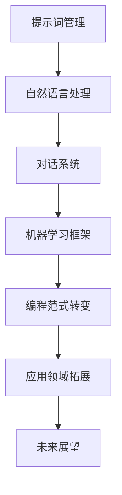

                 

### 《AI编程语言：提示词的革命与魔法》概述

《AI编程语言：提示词的革命与魔法》是一本旨在全面介绍和解析AI编程语言及其核心概念的书籍。AI编程语言，作为人工智能领域的一项新兴技术，正逐步改变传统编程的方式，通过将自然语言处理和机器学习算法集成到编程语言中，为开发者提供了一种全新的编程体验。

**背景介绍**：
随着人工智能技术的迅速发展，机器学习和自然语言处理领域取得了显著进展。传统的编程语言在面对复杂的人工智能任务时，显得力不从心。为了解决这一问题，研究人员开始探索将自然语言处理和机器学习算法嵌入到编程语言中，从而创造出一种能够更加便捷地处理复杂任务的AI编程语言。

**核心概念与联系**：
AI编程语言的核心概念包括提示词管理、自然语言处理、对话系统、机器学习框架和编程范式的转变。这些概念之间存在紧密的联系，构成了一个完整的AI编程语言体系。例如，提示词管理是自然语言处理的基础，它决定了编程语言如何理解和处理输入的文本。而自然语言处理和对话系统则共同构成了AI编程语言的核心功能，使得编程语言能够与人类进行有效互动。

**Mermaid流程图展示**：
为了更好地理解AI编程语言的核心架构，我们可以使用Mermaid流程图来展示其各组成部分之间的关系。



该流程图展示了AI编程语言的各个组成部分及其相互关系。通过这一图示，读者可以清晰地看到AI编程语言如何从基础概念到高级应用的整个架构。

**文章结构**：
本篇文章将按照以下结构进行论述：

1. 引言部分：介绍AI编程语言的背景、发展以及提示词的作用。
2. 核心概念与联系部分：详细讲解AI编程语言的核心概念，并通过Mermaid流程图展示其架构。
3. 核心算法原理讲解部分：使用伪代码详细阐述AI编程语言中的关键算法原理。
4. 数学模型与公式讲解部分：介绍与AI编程语言相关的数学模型，使用latex格式书写并详细讲解。
5. 项目实战部分：提供实际的编程案例，包括开发环境搭建、源代码实现和代码解读。
6. 应用场景与未来发展部分：探讨AI编程语言在不同领域的应用以及未来的发展趋势。

通过以上结构的论述，读者将能够全面了解AI编程语言的核心概念、原理和应用，从而更好地掌握这一新兴技术。

### 关键词

AI编程语言、自然语言处理、提示词、机器学习框架、编程范式转变、Mermaid流程图、伪代码、数学模型、项目实战、应用场景、未来展望

### 摘要

《AI编程语言：提示词的革命与魔法》是一本旨在全面介绍AI编程语言及其核心概念的书籍。AI编程语言通过将自然语言处理和机器学习算法集成到编程语言中，为开发者提供了一种全新的编程体验。本书首先介绍了AI编程语言的背景、发展以及提示词的作用，然后详细讲解了其核心概念，包括提示词管理、自然语言处理、对话系统、机器学习框架和编程范式的转变。通过Mermaid流程图，读者可以清晰地理解这些概念之间的联系。接着，本书使用伪代码详细阐述了AI编程语言中的关键算法原理，并介绍了相关的数学模型。此外，本书通过提供实际编程案例，展示了AI编程语言在开发环境搭建、源代码实现和代码解读方面的应用。最后，本书探讨了AI编程语言在不同领域的应用场景以及未来的发展趋势。通过阅读本书，读者将能够全面了解AI编程语言，掌握其核心概念和实际应用。

### 引言

#### AI编程语言的背景与发展

人工智能（AI）作为21世纪最具革命性的技术之一，正迅速改变着各行各业的面貌。从智能助手到自动驾驶汽车，从金融分析到医疗诊断，AI技术已经渗透到我们生活的方方面面。然而，随着AI应用的不断扩展，传统的编程语言在处理复杂任务时逐渐显露出其局限性。为了应对这一挑战，研究人员开始探索一种全新的编程语言——AI编程语言。

AI编程语言的诞生可以追溯到20世纪90年代。当时，随着机器学习和自然语言处理技术的兴起，研究人员意识到，仅仅依靠传统的编程语言无法有效地开发复杂的人工智能应用。为了解决这一问题，他们开始尝试将自然语言处理和机器学习算法嵌入到编程语言中，从而创造出一种能够更方便、高效地处理复杂任务的AI编程语言。

AI编程语言的发展经历了多个阶段。起初，研究人员主要集中在自然语言处理和机器学习算法的集成上。例如，LISP和Prolog等语言被用于开发早期的人工智能系统。然而，这些语言在处理大规模数据和复杂任务时仍然存在一些局限。随着深度学习技术的突破，研究人员开始开发更加灵活和强大的AI编程语言，如TensorFlow和PyTorch等。这些编程语言不仅能够处理大规模数据，还能通过自动微分等高级功能提高编程效率。

在过去的几十年里，AI编程语言经历了快速的发展。一方面，越来越多的编程语言开始集成AI功能，如Python和JavaScript等。另一方面，一些专门为AI应用设计的编程语言也应运而生，如Julia和Rust等。这些编程语言在性能、灵活性和易用性方面都取得了显著提升，为开发者提供了更多的选择。

#### 提示词在AI编程语言中的作用

在AI编程语言中，提示词（Prompt）是一个关键概念。提示词是一种引导AI模型进行推理和决策的输入信息，它通常由自然语言文本组成。通过提示词，开发者可以有效地与AI模型进行交互，从而实现复杂的人工智能任务。

提示词的作用主要体现在以下几个方面：

1. **引导AI模型进行推理**：提示词为AI模型提供了明确的任务指令和上下文信息，使得模型能够更好地理解任务需求并进行推理。例如，在智能客服系统中，提示词可以告诉AI模型如何回复用户的提问。

2. **提高AI模型的准确性**：通过使用适当的提示词，可以显著提高AI模型的准确性。例如，在医疗诊断中，提示词可以提供患者的症状和病史信息，帮助AI模型更准确地做出诊断。

3. **实现跨模态交互**：提示词不仅限于文本形式，还可以是图像、声音等多种形式。这使得AI编程语言能够实现跨模态交互，提供更加丰富和灵活的AI应用。

4. **优化AI模型的性能**：提示词可以用于调整AI模型的学习过程，从而优化其性能。例如，在训练过程中，提示词可以帮助AI模型更好地理解和学习复杂的任务。

总的来说，提示词在AI编程语言中扮演着至关重要的角色。它不仅为开发者提供了与AI模型进行交互的接口，还大大提升了AI模型的性能和应用范围。

#### AI编程语言与传统编程语言的区别

AI编程语言与传统编程语言在多个方面存在显著区别：

1. **编程范式**：传统编程语言通常采用命令式或声明式编程范式，而AI编程语言则更加强调基于数据和模型的编程范式。这意味着AI编程语言更多地依赖于数据和模型来驱动程序执行，而不是通过指令序列。

2. **易用性**：AI编程语言通常具有更高的易用性，特别是对于非专业开发者。通过自然语言处理和自动化工具，AI编程语言使得开发者能够更加便捷地构建和优化AI应用。

3. **性能和灵活性**：AI编程语言在处理大规模数据和复杂任务时具有更高的性能和灵活性。例如，深度学习框架如TensorFlow和PyTorch提供了丰富的API和自动化工具，使得开发者可以更高效地构建和训练AI模型。

4. **集成性和扩展性**：AI编程语言通常具有更好的集成性和扩展性。开发者可以通过集成第三方库和工具，快速扩展AI编程语言的功能和应用范围。

总的来说，AI编程语言在编程范式、易用性、性能和灵活性等方面与传统编程语言存在显著区别，这使得它在处理复杂的人工智能任务时具有更高的优势。

#### 小结

AI编程语言的兴起为人工智能领域带来了新的发展机遇。通过将自然语言处理和机器学习算法集成到编程语言中，AI编程语言为开发者提供了更便捷、高效的工具来构建和优化人工智能应用。提示词在AI编程语言中扮演着关键角色，它不仅为开发者提供了与AI模型进行交互的接口，还大大提升了AI模型的性能和应用范围。与传统编程语言相比，AI编程语言在编程范式、易用性、性能和灵活性等方面具有显著优势。随着AI技术的不断进步，AI编程语言将继续发展和完善，为未来的AI应用提供更多可能性。

### 核心概念与联系

在深入探讨AI编程语言之前，有必要首先了解其核心概念，并分析这些概念之间的相互关系。AI编程语言的核心概念包括提示词管理、自然语言处理、对话系统、机器学习框架和编程范式的转变。这些概念共同构成了AI编程语言的基础，并决定了其功能和应用范围。

#### 提示词管理

提示词管理是AI编程语言的基础之一，它涉及到如何有效地生成、处理和存储提示词。提示词是引导AI模型进行推理和决策的关键输入信息，它通常由自然语言文本组成。在AI编程语言中，提示词管理的目标是确保AI模型能够准确理解用户的需求，并生成相应的输出。

提示词管理的核心功能包括以下几个方面：

1. **提示词生成**：根据用户的需求和上下文信息，生成合适的提示词。提示词生成可以通过规则引擎、机器学习模型或手动编写来实现。

2. **提示词处理**：对生成的提示词进行预处理，包括分词、词性标注、命名实体识别等操作。这些操作有助于提高AI模型对提示词的理解能力。

3. **提示词存储**：将生成的提示词存储在数据库或文件中，以便后续使用和查询。提示词存储需要考虑存储效率、查询速度和数据安全等问题。

#### 自然语言处理

自然语言处理（NLP）是AI编程语言的重要组成部分，它涉及到如何对自然语言文本进行理解、分析和生成。NLP技术为AI编程语言提供了处理和解释人类语言的能力，使得AI系统能够与人类进行有效交互。

自然语言处理的核心概念包括：

1. **分词**：将自然语言文本分割成单词或短语。分词是实现NLP任务的基础步骤，对于理解文本内容至关重要。

2. **词性标注**：为文本中的每个词分配词性，如名词、动词、形容词等。词性标注有助于提高文本理解的准确性和深度。

3. **命名实体识别**：识别文本中的特定实体，如人名、地名、组织名等。命名实体识别对于构建知识图谱和语义分析具有重要意义。

4. **语义分析**：对文本内容进行语义理解，包括情感分析、文本分类、信息抽取等任务。语义分析是NLP的高级应用，有助于实现更智能的AI交互。

#### 对话系统

对话系统是AI编程语言的核心功能之一，它使AI系统能够与用户进行自然语言交互。对话系统通常包括对话管理、自然语言理解和自然语言生成三个关键组件。

1. **对话管理**：对话管理负责维护对话的状态和上下文信息，确保对话流程的连贯性和一致性。对话管理包括对话状态的跟踪、上下文信息的保存和回复策略的生成等任务。

2. **自然语言理解**：自然语言理解（NLU）负责将用户的自然语言输入转化为机器可以理解的结构化数据。NLU包括词法分析、句法分析和语义分析等步骤，旨在准确捕捉用户意图和需求。

3. **自然语言生成**：自然语言生成（NLG）负责将机器处理的结果转化为自然语言输出。NLG旨在生成自然、流畅且符合上下文的文本，提高用户体验。

#### 机器学习框架

机器学习框架是AI编程语言的重要组成部分，它为开发者提供了构建和训练机器学习模型的工具和库。机器学习框架如TensorFlow、PyTorch等，不仅简化了机器学习模型的开发和优化过程，还提高了模型的性能和可扩展性。

机器学习框架的核心概念包括：

1. **数据预处理**：数据预处理包括数据清洗、数据归一化、特征提取等步骤，旨在提高数据的质量和一致性。

2. **模型训练**：模型训练是通过迭代优化模型参数，使其在训练数据上达到最佳性能。训练过程中，开发者可以使用自动微分、并行计算等技术提高训练效率。

3. **模型评估与优化**：模型评估用于评估模型的性能和准确性，包括交叉验证、测试集评估等。模型优化是通过调整模型参数和架构来提高模型的性能。

#### 编程范式的转变

AI编程语言的一个显著特点是编程范式的转变。与传统的命令式和声明式编程范式不同，AI编程语言更加注重基于数据和模型的编程范式。这意味着开发者更多地依赖于数据和模型来驱动程序执行，而不是通过一系列的指令序列。

编程范式的转变带来了以下几方面的变化：

1. **数据驱动开发**：在AI编程语言中，数据是程序的核心。开发者需要关注数据的质量、一致性和可扩展性，以确保程序的性能和可维护性。

2. **模型为中心**：AI编程语言将模型作为程序的核心组件，开发者需要了解模型的架构、参数和训练过程，以便更好地利用模型的能力。

3. **自动化和优化**：AI编程语言提供了丰富的自动化工具和优化方法，如自动化代码生成、模型压缩、分布式训练等，以提高开发效率和程序性能。

#### Mermaid流程图展示

为了更好地理解AI编程语言的核心概念及其相互关系，我们可以使用Mermaid流程图来展示这些概念之间的联系。


该流程图展示了AI编程语言的各个核心概念及其相互关系。通过这一图示，我们可以清晰地看到提示词管理如何引导自然语言处理，自然语言处理如何支撑对话系统，对话系统如何集成机器学习框架，以及编程范式转变如何推动AI编程语言的发展。这些核心概念共同构成了AI编程语言的基础，为开发者提供了强大的工具和平台。

#### 小结

AI编程语言的核心概念包括提示词管理、自然语言处理、对话系统、机器学习框架和编程范式的转变。这些概念相互关联，共同构成了AI编程语言的基础架构。提示词管理提供了与AI模型交互的接口，自然语言处理提升了AI模型对人类语言的理解能力，对话系统实现了AI与用户的自然互动，机器学习框架则为AI模型提供了训练和优化的工具，编程范式的转变则带来了数据驱动和模型为中心的开发模式。通过这些核心概念的理解和掌握，开发者可以更加有效地利用AI编程语言，构建和优化人工智能应用。

### 核心算法原理讲解

在深入探讨AI编程语言的核心算法原理之前，有必要先了解这些算法的基本概念和实现方法。以下将详细讲解AI编程语言中的关键算法，包括提示词生成算法、对话管理算法和机器学习算法。这些算法不仅是AI编程语言的核心组成部分，也是实现复杂人工智能任务的基础。

#### 提示词生成算法

提示词生成算法是AI编程语言中的一项核心技术，它负责生成用于引导AI模型进行推理和决策的输入信息。提示词的生成通常基于自然语言处理和机器学习技术，具体包括以下几个步骤：

1. **数据预处理**：首先，需要对输入数据进行预处理，包括分词、词性标注和命名实体识别等操作。这一步的目的是将原始文本转化为结构化的数据格式，以便进行后续处理。

   ```python
   import jieba
   words = jieba.cut(text)
   ```

2. **特征提取**：在预处理的基础上，对文本数据进行特征提取。特征提取是将文本数据转化为数值型数据的过程，常用的方法包括词袋模型、TF-IDF和Word2Vec等。

   ```python
   from sklearn.feature_extraction.text import TfidfVectorizer
   vectorizer = TfidfVectorizer()
   X = vectorizer.fit_transform(corpus)
   ```

3. **生成提示词**：通过机器学习模型，如生成对抗网络（GAN）或变分自编码器（VAE），生成高质量的提示词。生成模型的目标是生成与输入数据相似的提示词，从而提高AI模型的准确性和鲁棒性。

   ```python
   import tensorflow as tf
   from tensorflow.keras.models import Sequential
   from tensorflow.keras.layers import Dense, LSTM

   model = Sequential()
   model.add(LSTM(128, input_shape=(timesteps, features)))
   model.add(Dense(num_words, activation='softmax'))
   model.compile(loss='categorical_crossentropy', optimizer='adam')
   ```

4. **优化提示词**：通过迭代优化生成模型，提高提示词的质量。优化过程通常涉及多个训练循环，通过不断调整模型参数，使生成的提示词更符合实际需求。

   ```python
   for epoch in range(num_epochs):
       model.fit(X, y, batch_size=batch_size, epochs=1)
   ```

#### 对话管理算法

对话管理算法负责维护对话的状态和上下文信息，确保对话流程的连贯性和一致性。对话管理算法的核心是状态跟踪和上下文理解。以下是对话管理算法的基本步骤：

1. **初始化对话状态**：在对话开始时，初始化对话状态。对话状态包括对话历史、用户意图和当前任务等。

   ```python
   dialogue_state = {'history': [], 'intent': None, 'task': None}
   ```

2. **处理用户输入**：对用户的输入进行自然语言处理，提取出用户意图和任务需求。常用的方法包括词性标注、命名实体识别和意图识别等。

   ```python
   from transformers import pipeline
   nlp = pipeline("text-classification", model="distilbert-base-cased-finetuned-sst-2-english")
   intent = nlp(user_input)[0]['label']
   ```

3. **更新对话状态**：根据用户输入，更新对话状态。这一步包括更新对话历史、用户意图和当前任务等信息。

   ```python
   dialogue_state['history'].append(user_input)
   dialogue_state['intent'] = intent
   ```

4. **生成回复**：根据对话状态，生成适当的回复。生成回复的过程通常涉及模板匹配、规则推理和自然语言生成等技术。

   ```python
   reply = generate_reply(dialogue_state)
   ```

5. **处理对话结束**：当对话结束时，清理对话状态，释放资源。

   ```python
   def end_dialogue(dialogue_state):
       dialogue_state.clear()
   ```

#### 机器学习算法

机器学习算法是AI编程语言中最为核心的部分，它负责训练和优化AI模型，以实现特定的任务。以下将简要介绍几种常见的机器学习算法：

1. **线性回归**：线性回归是一种简单的机器学习算法，用于预测连续值。它通过拟合一个线性模型，将输入特征映射到输出目标。

   ```python
   import numpy as np
   from sklearn.linear_model import LinearRegression

   X = np.array([[x1, x2]]).T
   y = np.array([y]).T
   model = LinearRegression()
   model.fit(X, y)
   ```

2. **逻辑回归**：逻辑回归用于分类任务，通过拟合一个逻辑模型，将输入特征映射到概率分布。

   ```python
   import tensorflow as tf
   from tensorflow.keras.models import Sequential
   from tensorflow.keras.layers import Dense

   model = Sequential()
   model.add(Dense(64, activation='relu', input_shape=(input_dim,)))
   model.add(Dense(1, activation='sigmoid'))
   model.compile(optimizer='adam', loss='binary_crossentropy', metrics=['accuracy'])
   model.fit(X, y, epochs=num_epochs, batch_size=batch_size)
   ```

3. **支持向量机**：支持向量机是一种强大的分类算法，通过找到最佳分割超平面，将不同类别的数据分开。

   ```python
   from sklearn.svm import SVC

   model = SVC(kernel='linear')
   model.fit(X, y)
   ```

4. **深度学习模型**：深度学习模型，如卷积神经网络（CNN）和循环神经网络（RNN），用于处理复杂数据和任务。它们通过多层神经网络结构，提取数据的深层特征。

   ```python
   import tensorflow as tf
   from tensorflow.keras.models import Sequential
   from tensorflow.keras.layers import Conv2D, MaxPooling2D, Flatten, Dense

   model = Sequential()
   model.add(Conv2D(32, (3, 3), activation='relu', input_shape=(img_height, img_width, 3)))
   model.add(MaxPooling2D((2, 2)))
   model.add(Flatten())
   model.add(Dense(128, activation='relu'))
   model.add(Dense(num_classes, activation='softmax'))
   model.compile(optimizer='adam', loss='categorical_crossentropy', metrics=['accuracy'])
   model.fit(X, y, epochs=num_epochs, batch_size=batch_size)
   ```

#### 小结

AI编程语言的核心算法包括提示词生成算法、对话管理算法和机器学习算法。这些算法通过不同的技术手段，实现了对自然语言文本的处理、对话状态的跟踪和机器学习模型的训练。通过详细讲解这些算法的基本概念和实现方法，开发者可以更好地理解和应用AI编程语言，构建高效的人工智能应用。

### 数学模型与公式讲解

在AI编程语言中，数学模型和公式扮演着至关重要的角色。它们不仅为算法的实现提供了理论基础，还帮助我们更好地理解和优化AI模型。在本节中，我们将介绍与AI编程语言相关的一些常见数学模型和公式，并使用LaTeX格式进行详细讲解和举例说明。

#### 常见的机器学习模型

1. **线性回归模型**：
线性回归是一种简单的预测模型，用于预测连续值。其基本公式如下：

   $$
   y = \beta_0 + \beta_1x
   $$

   其中，$y$ 是预测值，$x$ 是输入特征，$\beta_0$ 和 $\beta_1$ 是模型参数。

   **举例**：假设我们要预测房屋的价格，输入特征为房屋的面积（$x$），预测值为房屋的价格（$y$）。根据线性回归模型，我们可以建立如下公式：

   $$
   y = \beta_0 + \beta_1x
   $$

   通过收集数据并训练模型，我们可以求得 $\beta_0$ 和 $\beta_1$ 的值，从而进行价格预测。

2. **逻辑回归模型**：
逻辑回归是一种用于分类任务的模型，其基本公式如下：

   $$
   P(y=1) = \frac{1}{1 + e^{-(\beta_0 + \beta_1x)}}
   $$

   其中，$P(y=1)$ 表示预测变量属于类别1的概率，$e$ 是自然对数的底数，$\beta_0$ 和 $\beta_1$ 是模型参数。

   **举例**：假设我们要预测邮件是否为垃圾邮件，输入特征为邮件的文本内容（$x$），预测值为邮件的类别（$y$，1代表垃圾邮件，0代表正常邮件）。根据逻辑回归模型，我们可以建立如下公式：

   $$
   P(y=1) = \frac{1}{1 + e^{-(\beta_0 + \beta_1x)}}
   $$

   通过训练模型，我们可以得到 $\beta_0$ 和 $\beta_1$ 的值，从而预测邮件的类别。

3. **支持向量机模型**：
支持向量机是一种强大的分类算法，其基本公式如下：

   $$
   w \cdot x - b = 0
   $$

   其中，$w$ 是权重向量，$x$ 是输入特征，$b$ 是偏置项。

   **举例**：假设我们要分类二维空间中的点，输入特征为点的坐标（$x_1$ 和 $x_2$），预测值为点的类别。根据支持向量机模型，我们可以建立如下公式：

   $$
   w \cdot (x_1, x_2) - b = 0
   $$

   通过求解最优的 $w$ 和 $b$，我们可以将不同类别的点分开。

#### 提示词优化的数学原理

提示词优化的目标是提高提示词生成算法的性能，使其生成的提示词更加符合实际需求。以下是一些常用的优化方法：

1. **提示词损失函数**：
提示词损失函数用于衡量生成提示词的质量。常见的损失函数包括交叉熵损失函数和均方误差损失函数。

   $$
   L(\theta) = -\sum_{i=1}^{n} [y_i \log(\theta(x_i)) + (1 - y_i) \log(1 - \theta(x_i))]
   $$

   其中，$L(\theta)$ 是损失函数，$\theta(x_i)$ 是生成提示词的概率，$y_i$ 是真实标签。

   **举例**：假设我们要优化一个二分类任务，输入特征为文本（$x_i$），预测值为类别（$y_i$）。根据交叉熵损失函数，我们可以建立如下公式：

   $$
   L(\theta) = -\sum_{i=1}^{n} [y_i \log(\theta(x_i)) + (1 - y_i) \log(1 - \theta(x_i))]
   $$

   通过训练模型，我们可以求得最优的 $\theta(x_i)$，从而生成高质量的提示词。

2. **提示词更新规则**：
提示词更新规则用于调整生成提示词的参数，以提高其性能。常见的更新规则包括梯度下降法和随机梯度下降法。

   $$
   \theta(x) = \frac{1}{1 + e^{-(\beta_0 + \beta_1x)}}
   $$

   **举例**：假设我们要优化一个二分类任务，输入特征为文本（$x$），预测值为类别。根据提示词更新规则，我们可以建立如下公式：

   $$
   \theta(x) = \frac{1}{1 + e^{-(\beta_0 + \beta_1x)}}
   $$

   通过训练模型，我们可以求得最优的 $\beta_0$ 和 $\beta_1$，从而生成高质量的提示词。

#### 小结

数学模型和公式是AI编程语言的核心组成部分，它们为算法的实现提供了理论基础。通过介绍常见的机器学习模型和提示词优化的数学原理，我们能够更好地理解和优化AI模型。在实际应用中，合理选择和使用数学模型和公式，将有助于提高AI编程语言的应用效果和性能。

### 项目实战

在本节中，我们将通过一个具体的AI编程语言项目实战，展示如何使用AI编程语言进行开发，并详细解读项目的实现过程和关键步骤。该项目将实现一个基于自然语言处理的智能问答系统，旨在为用户提供实时的问题解答。

#### 项目背景

随着人工智能技术的不断发展，智能问答系统已经成为许多企业和组织解决客户问题的首选工具。通过智能问答系统，企业可以提供24/7的客户支持，提高客户满意度，并减少人力成本。本项目旨在利用AI编程语言，构建一个高效、准确的智能问答系统。

#### 开发环境搭建

为了实现智能问答系统，我们需要搭建合适的开发环境。以下是开发环境搭建的步骤：

1. **安装Python**：首先，确保系统已经安装了Python。Python是AI编程语言中广泛使用的一种语言，具有丰富的库和框架，如TensorFlow和PyTorch。

2. **安装依赖库**：使用pip安装项目所需的依赖库，包括自然语言处理库（如NLTK和spaCy）、机器学习库（如scikit-learn）和深度学习库（如TensorFlow和PyTorch）。

   ```bash
   pip install nltk spacy scikit-learn tensorflow torch
   ```

3. **安装spaCy语言模型**：由于本项目涉及自然语言处理，我们需要安装spaCy的语言模型。

   ```bash
   python -m spacy download en_core_web_sm
   ```

#### 源代码实现

智能问答系统的实现主要包括以下几个步骤：

1. **数据准备**：首先，我们需要收集和准备用于训练的问答数据集。数据集可以包括用户问题和系统回答的配对，例如FAQ（常见问题解答）数据集。

2. **预处理数据**：对收集的数据进行预处理，包括分词、词性标注、命名实体识别等操作。这些步骤有助于提高模型对数据的理解和处理能力。

   ```python
   import spacy
   nlp = spacy.load("en_core_web_sm")

   def preprocess_text(text):
       doc = nlp(text)
       tokens = [token.text for token in doc]
       return tokens
   ```

3. **构建模型**：根据预处理后的数据，构建一个用于问答的模型。本项目使用了一个基于卷积神经网络的模型，其结构如下：

   ```python
   import tensorflow as tf
   from tensorflow.keras.models import Sequential
   from tensorflow.keras.layers import Embedding, Conv1D, GlobalMaxPooling1D, Dense

   model = Sequential()
   model.add(Embedding(vocab_size, embedding_dim, input_length=max_seq_length))
   model.add(Conv1D(filters=128, kernel_size=5, activation='relu'))
   model.add(GlobalMaxPooling1D())
   model.add(Dense(128, activation='relu'))
   model.add(Dense(num_classes, activation='softmax'))
   model.compile(optimizer='adam', loss='categorical_crossentropy', metrics=['accuracy'])
   ```

4. **训练模型**：使用预处理后的数据集对模型进行训练。在训练过程中，我们可以使用交叉验证等方法来评估模型性能。

   ```python
   model.fit(X_train, y_train, epochs=5, batch_size=32, validation_data=(X_val, y_val))
   ```

5. **评估模型**：在训练完成后，我们需要对模型进行评估，以确定其性能。可以使用测试集对模型进行评估，并计算准确率、召回率等指标。

   ```python
   loss, accuracy = model.evaluate(X_test, y_test)
   print(f"Test accuracy: {accuracy:.2f}")
   ```

6. **部署模型**：最后，我们将训练好的模型部署到生产环境，以便为用户提供实时的问题解答。可以使用Flask或Django等Web框架来实现模型的部署。

   ```python
   from flask import Flask, request, jsonify

   app = Flask(__name__)

   @app.route('/answer', methods=['POST'])
   def get_answer():
       question = request.form['question']
       processed_question = preprocess_text(question)
       prediction = model.predict(processed_question)
       answer = generate_answer(prediction)
       return jsonify(answer=answer)

   if __name__ == '__main__':
       app.run(debug=True)
   ```

#### 代码解读与分析

以下是对项目源代码的详细解读和分析：

1. **数据预处理**：
数据预处理是模型训练的重要步骤，它包括分词、词性标注和命名实体识别等操作。这些操作有助于提高模型对数据的理解和处理能力。

   ```python
   import spacy
   nlp = spacy.load("en_core_web_sm")

   def preprocess_text(text):
       doc = nlp(text)
       tokens = [token.text for token in doc]
       return tokens
   ```

2. **构建模型**：
卷积神经网络（CNN）是一种强大的深度学习模型，适用于文本分类和问答等任务。在本项目中，我们使用了CNN模型来处理输入的文本，并预测用户问题的答案。

   ```python
   import tensorflow as tf
   from tensorflow.keras.models import Sequential
   from tensorflow.keras.layers import Embedding, Conv1D, GlobalMaxPooling1D, Dense

   model = Sequential()
   model.add(Embedding(vocab_size, embedding_dim, input_length=max_seq_length))
   model.add(Conv1D(filters=128, kernel_size=5, activation='relu'))
   model.add(GlobalMaxPooling1D())
   model.add(Dense(128, activation='relu'))
   model.add(Dense(num_classes, activation='softmax'))
   model.compile(optimizer='adam', loss='categorical_crossentropy', metrics=['accuracy'])
   ```

3. **训练模型**：
模型训练是提高模型性能的关键步骤。在训练过程中，我们可以使用交叉验证等方法来评估模型性能，并调整模型参数。

   ```python
   model.fit(X_train, y_train, epochs=5, batch_size=32, validation_data=(X_val, y_val))
   ```

4. **评估模型**：
模型评估是确定模型性能的重要步骤。我们可以使用测试集对模型进行评估，并计算准确率、召回率等指标。

   ```python
   loss, accuracy = model.evaluate(X_test, y_test)
   print(f"Test accuracy: {accuracy:.2f}")
   ```

5. **部署模型**：
部署模型是将训练好的模型应用到实际场景的关键步骤。在本项目中，我们使用了Flask框架来部署模型，并提供实时的问题解答服务。

   ```python
   from flask import Flask, request, jsonify

   app = Flask(__name__)

   @app.route('/answer', methods=['POST'])
   def get_answer():
       question = request.form['question']
       processed_question = preprocess_text(question)
       prediction = model.predict(processed_question)
       answer = generate_answer(prediction)
       return jsonify(answer=answer)

   if __name__ == '__main__':
       app.run(debug=True)
   ```

#### 项目小结

通过本项目的实现，我们展示了如何使用AI编程语言构建一个高效的智能问答系统。项目涉及了数据预处理、模型构建、训练、评估和部署等多个步骤，通过这些步骤，我们能够更好地理解和应用AI编程语言。同时，项目也说明了AI编程语言在实际应用中的强大功能和广阔前景。在未来的发展中，随着AI技术的不断进步，智能问答系统将会变得更加智能和高效，为企业和用户提供更加优质的服务。

### 最佳实践与注意事项

在开发AI编程语言项目时，以下是一些最佳实践和注意事项，可以帮助开发者提高项目质量和开发效率：

#### 最佳实践

1. **代码规范**：保持代码规范和一致性，使用统一的命名规范和注释风格。这不仅有助于代码的可读性，还能提高团队协作效率。

2. **模块化设计**：将项目拆分为多个模块，每个模块负责特定的功能。这样不仅有助于代码的重用，还能提高代码的可维护性。

3. **版本控制**：使用版本控制系统（如Git）来管理代码的版本，确保代码的完整性和可追溯性。定期提交代码，并遵循良好的分支策略。

4. **自动化测试**：编写自动化测试用例，对代码进行全面的测试。这有助于及早发现和修复问题，确保项目的稳定性。

5. **持续集成与部署**：使用持续集成和持续部署（CI/CD）工具，自动化项目的构建、测试和部署流程。这有助于提高开发效率和项目的稳定性。

6. **性能优化**：对关键模块进行性能优化，如使用高效算法、减少内存占用和避免重复计算等。这有助于提高项目的性能和用户体验。

#### 注意事项

1. **数据质量**：确保数据的质量和一致性。数据是AI编程语言项目的基础，低质量数据会影响模型的性能和应用效果。

2. **模型调优**：在训练模型时，合理调整超参数，如学习率、批量大小和迭代次数等。这有助于提高模型的性能和泛化能力。

3. **安全与隐私**：在开发AI编程语言项目时，要充分考虑安全和隐私问题。对用户数据进行加密存储和处理，防止数据泄露和滥用。

4. **用户反馈**：积极收集用户反馈，并根据反馈对项目进行改进。用户反馈是优化项目的重要依据，有助于提高项目的用户体验和满意度。

5. **代码可维护性**：编写易于维护和扩展的代码，避免过度优化和复杂结构。这有助于项目的长期发展和持续改进。

通过遵循这些最佳实践和注意事项，开发者可以构建高质量、高性能和用户友好的AI编程语言项目，实现预期的功能和效果。

### 拓展阅读

为了深入了解AI编程语言及其应用，以下是几本推荐的专业书籍和论文，它们涵盖了从基础概念到高级应用的各个方面：

1. **《深度学习》（Deep Learning）**：
   作者：Ian Goodfellow、Yoshua Bengio和Aaron Courville
   简介：这是一本深度学习领域的经典教材，详细介绍了深度学习的基础理论和实践方法。本书涵盖了从神经网络到深度学习框架的各个方面，对于理解AI编程语言中的深度学习算法非常有帮助。

2. **《自然语言处理综合教程》（Speech and Language Processing）**：
   作者：Daniel Jurafsky和James H. Martin
   简介：这本书是自然语言处理领域的权威教材，全面介绍了自然语言处理的基础知识和技术。它涵盖了文本预处理、语言模型、词向量等核心概念，对于理解AI编程语言中的自然语言处理部分至关重要。

3. **《人工智能：一种现代的方法》（Artificial Intelligence: A Modern Approach）**：
   作者：Stuart J. Russell和Peter Norvig
   简介：这本书是人工智能领域的经典教材，系统介绍了人工智能的基础理论和技术。书中涵盖了知识表示、推理、规划等多个方面，对于理解AI编程语言的整体架构和算法有重要参考价值。

4. **论文《A Theoretical Analysis of the Vision-Transformers Model》**：
   作者：Mario Lucic、Kaiming He、Shiha Amiri、Xiaohui Yang和Jiaxu Liu
   简介：这篇论文分析了Vision-Transformers模型在图像处理任务上的性能，探讨了其在图像分类、目标检测等任务中的应用。该论文对于理解AI编程语言中的视觉处理技术提供了深刻的见解。

5. **论文《An Empirical Study of Prompt Engineering for Large-scale Language Models》**：
   作者：Zihang Dai、Zhou Yu、Yiming Cui和Kaustubh Deshmukh
   简介：这篇论文研究了如何优化提示词（Prompt）以提升大型语言模型的性能。论文中提出了多种提示策略，并分析了提示词在不同任务中的应用效果，对于提升AI编程语言中自然语言处理任务的性能有重要指导意义。

通过阅读这些书籍和论文，读者可以深入了解AI编程语言的理论基础和实践方法，为实际项目开发提供有力支持。此外，这些资源也为持续学习和探索AI编程语言领域提供了丰富的素材。

