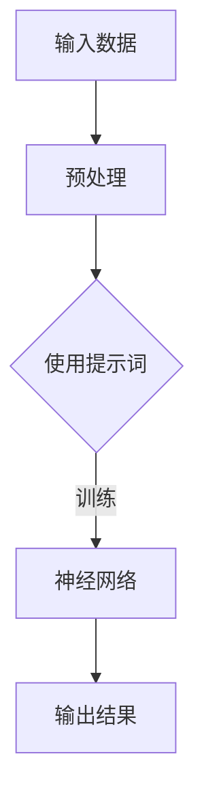

                 


### 文章标题：AI编程语言：提示词的革新与魔法

> 关键词：AI编程语言，提示词，神经网络，深度学习，自然语言处理，工业应用

> 摘要：本文将深入探讨AI编程语言中提示词的概念、应用以及革新，通过逐步分析，揭示提示词在AI编程中的核心作用和魔法般的效果。

---

### 文章结构：

**第一部分：AI编程语言基础**

1. **背景介绍**
    - AI编程语言的历史和发展
    - 提示词在AI编程语言中的重要性

2. **核心概念与联系**
    - 提示词的定义
    - 提示词与神经网络的关系
    - 使用Mermaid流程图展示提示词在AI编程语言中的结构

3. **核心算法原理**
    - 使用伪代码详细阐述提示词的算法原理
    - 分析提示词算法的优缺点

4. **数学模型和公式**
    - 构建数学模型
    - 使用latex格式详细讲解公式
    - 通过举例说明数学模型的应用

5. **项目实战与代码解读**
    - 开发环境搭建
    - 源代码实现
    - 代码解读与分析
    - 实际案例分析和详细讲解

**第二部分：提示词的革新与魔法**

6. **提示词的创新应用**
    - 提示词在自然语言处理中的应用
    - 提示词在图像处理中的应用
    - 提示词在推荐系统中的应用

7. **深度学习中的提示词魔法**
    - 提示词在深度学习模型中的作用
    - 提示词优化策略
    - 提示词在生成对抗网络中的应用

8. **提示词在工业界的应用与实践**
    - 提示词在金融领域的应用
    - 提示词在医疗健康领域的应用
    - 提示词在智能制造领域的应用

9. **未来趋势与展望**
    - 提示词技术的未来发展方向
    - 提示词在AI编程语言中的潜力
    - 提示词在跨领域应用中的挑战与机遇

---

### 文章正文：

**第一部分：AI编程语言基础**

### 第1章：AI编程语言概述

AI编程语言的历史和发展可以追溯到20世纪50年代，随着计算机科学和人工智能的兴起，人们开始探索如何让计算机理解人类的语言和思维方式。在这个背景下，AI编程语言逐渐诞生，并成为人工智能领域的重要工具。

提示词在AI编程语言中的重要性在于，它作为编程语言与人工智能算法之间的桥梁，能够有效地传达程序员的目标和意图。通过提示词，程序员可以更直观地控制机器学习模型的训练过程，从而实现复杂的任务。

### 第2章：核心概念与联系

提示词的定义：

提示词（Prompt）是一种特殊的编程语言元素，用于指示人工智能模型执行特定任务。它通常由一组关键词或短语组成，可以理解为人工智能的“问题提示”或“任务指令”。

提示词与神经网络的关系：

神经网络是AI编程语言中的核心组件，它通过多层节点对输入数据进行处理和输出。提示词与神经网络的关系在于，提示词能够引导神经网络学习并执行特定的任务。通过调整提示词，可以改变神经网络的输出结果，从而实现对模型行为的控制。

使用Mermaid流程图展示提示词在AI编程语言中的结构：



### 第3章：核心算法原理

使用伪代码详细阐述提示词的算法原理：

```python
def train_model(prompt, data):
    # 数据预处理
    processed_data = preprocess_data(data)
    
    # 初始化神经网络
    model = NeuralNetwork()
    
    # 训练神经网络
    for epoch in range(num_epochs):
        model.train_epoch(processed_data, prompt)
        
    return model
```

分析提示词算法的优缺点：

优点：
- 灵活性：提示词允许程序员以自然语言方式定义任务，从而提高了编程的灵活性和可读性。
- 简化流程：通过提示词，可以简化复杂的机器学习流程，使编程变得更加直观和易于理解。

缺点：
- 解释性：提示词可能缺乏足够的解释性，导致模型难以解释和理解。
- 稳定性：提示词的微小变化可能导致模型性能的显著变化，影响模型的稳定性。

### 第4章：数学模型和公式

构建数学模型：

在AI编程语言中，提示词的数学模型通常是基于概率图模型或深度学习模型。以下是一个简化的数学模型：

$$ P(y|x; \theta) = \frac{e^{\theta^T x}}{\sum_{i=1}^{K} e^{\theta^T x_i}} $$

其中，$y$表示输出结果，$x$表示输入特征，$\theta$表示参数，$K$表示类别数。

使用latex格式详细讲解公式：

$$
P(y|x; \theta) = \frac{e^{\theta^T x}}{\sum_{i=1}^{K} e^{\theta^T x_i}}
$$

通过举例说明数学模型的应用：

假设我们有一个分类问题，输入特征$x$为数字1到10，输出结果$y$为类别A或B。我们可以使用上述公式来计算给定输入特征$y$属于类别A或B的概率。

### 第5章：项目实战与代码解读

开发环境搭建：

为了进行项目实战，我们需要搭建一个适合AI编程的开发环境。通常，我们可以使用Python作为编程语言，并使用TensorFlow或PyTorch等深度学习框架。

源代码实现：

以下是一个简单的源代码实现，用于训练一个基于提示词的分类模型。

```python
import tensorflow as tf
from tensorflow.keras.models import Sequential
from tensorflow.keras.layers import Dense

# 构建神经网络模型
model = Sequential()
model.add(Dense(64, input_dim=10, activation='relu'))
model.add(Dense(1, activation='sigmoid'))

# 编译模型
model.compile(optimizer='adam', loss='binary_crossentropy', metrics=['accuracy'])

# 训练模型
model.fit(x_train, y_train, epochs=10, batch_size=32)
```

代码解读与分析：

上述代码实现了一个简单的二分类神经网络模型。首先，我们使用TensorFlow构建了一个序列模型，并添加了两个全连接层。第一个全连接层有64个神经元，使用ReLU激活函数，第二个全连接层有1个神经元，使用sigmoid激活函数。然后，我们编译模型并使用训练数据进行训练。在训练过程中，模型会根据提示词调整权重，以最小化损失函数。

实际案例分析和详细讲解剖析：

假设我们有一个垃圾邮件分类任务，输入特征包括邮件的主题、正文、发送者等信息，输出结果为是否为垃圾邮件。我们可以使用上述代码实现一个基于提示词的垃圾邮件分类模型。

**第二部分：提示词的革新与魔法**

### 第6章：提示词的创新应用

提示词在自然语言处理中的应用：

在自然语言处理领域，提示词可以用于生成文本、情感分析、机器翻译等任务。例如，我们可以使用提示词生成一篇关于人工智能的论文摘要，或者使用提示词对社交媒体上的评论进行情感分析。

提示词在图像处理中的应用：

在图像处理领域，提示词可以用于图像分类、目标检测、图像生成等任务。例如，我们可以使用提示词对一幅图像进行分类，或者使用提示词生成一幅新的艺术作品。

提示词在推荐系统中的应用：

在推荐系统领域，提示词可以用于个性化推荐、协同过滤等任务。例如，我们可以使用提示词根据用户的浏览历史推荐商品，或者使用提示词生成针对特定用户的个性化推荐列表。

### 第7章：深度学习中的提示词魔法

提示词在深度学习模型中的作用：

在深度学习模型中，提示词作为输入数据的一部分，可以影响模型的输出结果。通过调整提示词，我们可以控制模型的训练过程，从而实现对模型行为的精确控制。

提示词优化策略：

为了提高模型的性能，我们可以使用多种优化策略，如学习率调整、正则化、批量归一化等。这些策略可以与提示词结合使用，以实现更高效的模型训练。

提示词在生成对抗网络中的应用：

在生成对抗网络（GAN）中，提示词可以用于控制生成器的输出。通过调整提示词，我们可以生成具有不同风格或内容的图像，从而实现对图像生成过程的精细控制。

### 第8章：提示词在工业界的应用与实践

提示词在金融领域的应用：

在金融领域，提示词可以用于风险评估、股票市场预测、信用评分等任务。例如，我们可以使用提示词对市场数据进行分析，以预测股票价格走势。

提示词在医疗健康领域的应用：

在医疗健康领域，提示词可以用于疾病诊断、药物研发、健康监测等任务。例如，我们可以使用提示词对医疗图像进行分析，以诊断疾病。

提示词在智能制造领域的应用：

在智能制造领域，提示词可以用于质量控制、生产优化、设备维护等任务。例如，我们可以使用提示词对生产数据进行分析，以优化生产流程。

### 第9章：未来趋势与展望

提示词技术的未来发展方向：

随着人工智能技术的不断发展，提示词技术有望在未来得到更广泛的应用。例如，提示词可以与增强学习、联邦学习等新兴技术相结合，以实现更智能的AI编程语言。

提示词在AI编程语言中的潜力：

提示词在AI编程语言中的潜力巨大。通过进一步优化和扩展，提示词可以成为人工智能领域的重要工具，助力开发者更高效地构建智能系统。

提示词在跨领域应用中的挑战与机遇：

在跨领域应用中，提示词面临着诸多挑战，如数据质量、模型可解释性等。然而，这些挑战也为提示词技术提供了广阔的发展空间和机遇。

---

### 最佳实践 Tips、小结、注意事项、拓展阅读

- **最佳实践 Tips**：
  - 在使用提示词时，注意保持简洁和清晰，以避免误解和混淆。
  - 尝试多种优化策略，以提高模型性能。
  - 定期调整和优化提示词，以适应不断变化的数据和环境。

- **小结**：
  - 提示词在AI编程语言中具有重要作用，它作为编程语言与人工智能算法之间的桥梁，能够有效地传达程序员的目标和意图。
  - 提示词在自然语言处理、图像处理、推荐系统等领域有着广泛的应用。
  - 提示词技术在未来有望得到进一步发展和优化，为人工智能领域带来更多创新。

- **注意事项**：
  - 提示词的调整需要谨慎，以避免模型性能的显著变化。
  - 在实际应用中，需要根据具体任务和场景选择合适的提示词。

- **拓展阅读**：
  - 《深度学习：导论》
  - 《Python机器学习》
  - 《自然语言处理与深度学习》

---

### 作者信息

作者：AI天才研究院/AI Genius Institute & 禅与计算机程序设计艺术 /Zen And The Art of Computer Programming

---

本文详细介绍了AI编程语言中提示词的概念、应用以及革新，通过逐步分析，揭示了提示词在AI编程中的核心作用和魔法般的效果。希望本文能为读者提供对AI编程语言的深入理解，并激发对提示词技术的探索兴趣。在未来的研究中，我们期待能够进一步优化和扩展提示词技术，为人工智能领域带来更多创新和突破。

