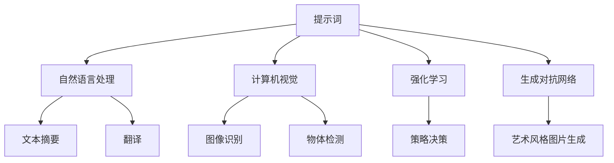

                 

## 《AI编程语言：提示词的魔法与艺术》

### 关键词：
- AI编程语言
- 提示词
- 人工智能应用
- 编程技巧
- 项目实战

### 摘要：
本文将深入探讨AI编程语言及其核心组成部分——提示词。我们将回顾AI编程语言的发展历程，解释提示词的概念、作用和分类。接着，我们将会介绍几种常用的AI编程语言，如Python和Rust，探讨它们在AI编程中的特点和应用。文章将深入讨论AI编程语言在自然语言处理和图像识别等领域的应用场景，并通过具体项目实战展示其实际应用。最后，我们将总结一些最佳实践，为读者提供深入的见解和实用的技巧。

## 引言

### AI编程语言的发展历史

人工智能（AI）编程语言的发展可以追溯到20世纪50年代。当时，计算机科学家们开始尝试将逻辑和数学方法应用于编程，以创建能够模拟人类智能的计算机程序。其中最具代表性的语言是LISP，它由约翰·麦卡锡（John McCarthy）在1958年提出，被广泛认为是历史上第一个人工智能编程语言。

随着时间的推移，人工智能的研究不断深入，各种新的编程语言被发明出来，以适应不同类型的人工智能应用。这些语言不仅在语法和功能上有所不同，还在优化特定任务方面具有各自的优点。例如，Prolog是一种基于逻辑的编程语言，它非常适合处理符号逻辑和推理任务。而Python作为一种通用编程语言，因其简洁易懂的语法和强大的库支持，成为了AI编程中的主流语言。

近年来，随着深度学习技术的发展，新的AI编程语言和框架也不断涌现。例如，TensorFlow和PyTorch等框架提供了丰富的工具和库，使得开发深度学习模型变得更加简单和高效。这些进展不仅推动了人工智能技术的应用，也促进了AI编程语言的发展。

### AI编程语言的重要性

AI编程语言在人工智能领域扮演着至关重要的角色。首先，它们提供了创建和训练AI模型所需的高层次抽象，使得开发者能够更加专注于算法设计和模型优化，而无需关注底层的计算细节。这使得开发高效、可靠的AI系统变得更加容易。

其次，AI编程语言具有强大的扩展性和兼容性，能够集成各种第三方库和工具，从而实现复杂的功能。例如，Python拥有丰富的数据科学和机器学习库，如NumPy、Pandas和Scikit-learn，这些库为开发者提供了方便的数据处理和模型训练工具。

此外，AI编程语言在促进跨学科合作方面也发挥着重要作用。计算机科学家、数据科学家、数学家和工程师可以通过使用相同的编程语言和工具，更有效地协作和沟通，共同推动人工智能技术的发展。

### 本书结构

本书将分为五个主要部分，每个部分都涵盖了AI编程语言的不同方面：

1. **引言**：介绍AI编程语言的发展历史和重要性，概述本书的结构和内容。
2. **提示词技术**：详细解释提示词的概念、作用和分类，探讨其在AI编程中的应用。
3. **编程语言**：介绍几种常用的AI编程语言，如Python、Rust等，分析它们的特点和应用场景。
4. **应用场景**：讨论AI编程语言在自然语言处理、图像识别等领域的应用，展示实际项目案例。
5. **项目实战**：通过具体项目实战，展示AI编程语言的实际应用，提供详细的代码实现和解析。

通过这五个部分的深入探讨，读者将能够全面了解AI编程语言的各个方面，掌握其核心原理和应用技巧。

## 提示词技术

### 提示词的定义

提示词（Prompt）在人工智能编程中是一个关键概念，它指的是一种引导模型或系统进行特定任务或输出的文字或指令。简单来说，提示词就是用来激发或引导模型思考的输入。在自然语言处理（NLP）和计算机视觉（CV）等AI领域，提示词的使用可以帮助模型更好地理解和处理输入数据，从而生成更准确的输出结果。

例如，在自然语言处理中，一个简单的提示词可以是“请生成一篇关于人工智能的文章摘要”。这个提示词引导模型根据已训练的知识和模式，生成一篇符合要求的文章摘要。同样地，在图像识别任务中，提示词可以是“识别图像中的主要物体”，模型会根据这个提示词对图像进行分析，并识别出图像中的主要物体。

### 提示词的作用

提示词在AI编程中起着至关重要的作用。以下是提示词的一些主要作用：

1. **指导模型理解任务**：通过提供明确的任务指令，提示词可以帮助模型更好地理解需要完成的任务。例如，在机器翻译任务中，提示词可以是“将这段英文翻译成中文”，这样模型就知道需要执行翻译操作。
2. **提高模型性能**：使用合适的提示词可以提高模型的性能和输出质量。例如，在图像分类任务中，一个详细的提示词“识别这张照片中的动物类型”可以帮助模型更准确地分类图像。
3. **增强模型泛化能力**：通过多样化的提示词，模型可以学习到更广泛的任务模式和情境，从而提高其泛化能力。例如，通过使用不同风格的文本作为提示词，模型可以学会生成不同风格的文章。
4. **减少模型过拟合**：适当调整提示词可以减少模型对特定提示词的过度依赖，从而降低过拟合的风险。

### 提示词的分类

根据用途和形式，提示词可以分为多种类型：

1. **明确提示词**：这类提示词提供了非常明确的任务指令，例如“请生成一篇关于人工智能的文章摘要”。明确提示词通常用于简单的、有明确输出要求的任务。
2. **模糊提示词**：与明确提示词相反，模糊提示词没有提供具体的任务指令，而是提供了一个较为宽泛的指导，例如“请写一篇有趣的文章”。这种提示词适用于需要模型进行创造性思考和推理的任务。
3. **多模态提示词**：这类提示词结合了多种模态的数据，如文本、图像和声音，用于复杂的多模态任务。例如，“识别这张照片中的主要物体，并给出相应的文本描述”。
4. **自适应提示词**：这类提示词可以根据模型的响应和任务进展动态调整，以优化模型性能。例如，在机器翻译任务中，模型可以根据前一句的翻译结果来调整下一句的提示词。

### 提示词在AI编程中的应用

提示词在AI编程中有着广泛的应用。以下是几个常见应用场景：

1. **自然语言处理**：在NLP任务中，提示词用于引导模型生成文本摘要、翻译文本、回答问题等。例如，在文本分类任务中，提示词可以是“请将这段文本分类到以下类别之一：科技、娱乐、体育”。
2. **计算机视觉**：在CV任务中，提示词用于指导模型进行图像识别、物体检测、图像分割等。例如，“识别这张照片中的主要物体”或“分割这张照片中的所有物体”。
3. **强化学习**：在强化学习任务中，提示词可以用于指导模型进行策略决策。例如，“请根据当前状态选择最优动作，以最大化奖励”。
4. **生成对抗网络（GAN）**：在GAN中，提示词可以用于控制生成模型的输出风格。例如，“生成一张具有艺术风格的图片，风格类似于毕加索的作品”。

总之，提示词在AI编程中是一个非常重要的工具，通过合理使用提示词，可以提高模型性能和输出质量，实现各种复杂的人工智能任务。

### 提示词技术的核心概念与联系

为了更好地理解提示词技术的核心概念，我们可以通过一个Mermaid流程图来展示这些概念之间的关系。以下是一个简单的示例：



在这个流程图中，我们首先定义了提示词（A）作为起点，然后展示了它与其他几个核心AI领域的联系，包括自然语言处理（B）、计算机视觉（C）、强化学习（D）和生成对抗网络（E）。接着，每个AI领域又进一步细分为具体的任务，如文本摘要（F）、翻译（G）、图像识别（H）、物体检测（I）、策略决策（J）和艺术风格图片生成（K）。

通过这个流程图，我们可以清晰地看到提示词如何贯穿于不同的AI任务中，从而实现引导和优化模型性能。这种关系架构有助于我们理解提示词在AI编程中的核心作用。

### 常见的AI编程语言

在人工智能领域，选择合适的编程语言是成功开发AI应用的关键。目前，存在多种编程语言用于AI编程，每种语言都有其独特的特点和应用场景。以下将介绍几种常用的AI编程语言，包括Python、Rust和Julia，并分析它们在AI编程中的特点和应用。

#### Python

Python是目前最受欢迎的AI编程语言之一，其简洁易懂的语法和丰富的库支持使其成为初学者和专业人士的常用语言。Python的主要特点如下：

1. **丰富的库和框架**：Python拥有大量的库和框架，如NumPy、Pandas、Scikit-learn、TensorFlow和PyTorch，这些库和框架提供了方便的数据处理、机器学习和深度学习工具。
2. **易于学习**：Python的语法简洁，易于阅读和理解，这使得开发快速、高效的AI模型变得更加容易。
3. **强大的社区支持**：Python拥有庞大的开发者社区，可以提供丰富的学习资源和问题解决方案。

Python在AI编程中的应用非常广泛。以下是一些常见应用场景：

- **自然语言处理**：Python在自然语言处理（NLP）领域有着广泛应用。例如，使用TensorFlow和PyTorch可以构建高效的深度学习模型，进行文本分类、机器翻译和情感分析等任务。
- **计算机视觉**：Python的OpenCV库使得图像处理和计算机视觉任务变得简单。例如，可以使用Python进行图像识别、目标检测和图像分割等任务。
- **数据科学**：Python在数据科学领域也非常流行，它提供了强大的数据处理和分析工具，如Pandas和NumPy，可以帮助数据科学家进行数据清洗、分析和可视化。

#### Rust

Rust是一种系统级编程语言，以其安全性和高性能而闻名。Rust在AI编程中的应用也逐渐受到关注，其主要特点如下：

1. **内存安全**：Rust通过所有权系统和借用检查机制，提供了自动内存管理，避免了内存泄漏和指针悬挂等问题，从而提高了程序的安全性和稳定性。
2. **高性能**：Rust的高性能使其在需要高效计算的场景中具有优势。例如，在深度学习应用中，Rust可以用于实现高性能的矩阵运算和模型优化。
3. **并发编程**：Rust原生支持并发编程，使得多核处理器的能力可以得到充分利用。

Rust在AI编程中的应用包括：

- **深度学习库**：如Tensorflow-rs和Rustlearn，这些库利用Rust的性能优势，提供了高效的深度学习工具。
- **数据流处理**：Rust在实时数据流处理中表现出色，例如，Rust可以用于构建高效的流计算框架，用于实时分析和预测。

#### Julia

Julia是一种高性能的动态编程语言，专为科学计算和数据分析而设计。Julia的主要特点如下：

1. **高性能**：Julia通过JIT（即时编译）技术，提供了接近C语言的高性能，同时保持了动态语言的灵活性。
2. **多线程支持**：Julia原生支持多线程和并行计算，使其在处理大规模数据集时具有优势。
3. **丰富的库支持**：Julia拥有丰富的库和框架，如DataFrames、MLJAR和TensorFlow.jl，这些库提供了方便的数据处理和机器学习工具。

Julia在AI编程中的应用包括：

- **科学计算**：Julia在科学计算领域表现出色，例如，可以使用Julia进行大规模数据分析和高性能计算。
- **数据科学**：Julia提供了强大的数据处理和分析工具，如DataFrames和Distributed，可以用于构建复杂的数据科学应用。

综上所述，Python、Rust和Julia都是常用的AI编程语言，每种语言都有其独特的特点和应用场景。选择合适的编程语言取决于具体的应用需求和开发环境。Python因其简洁性和丰富的库支持，在AI开发中占据主导地位；Rust因其高性能和安全性，适用于需要高效计算的场景；Julia则因其高性能和多线程支持，在科学计算和数据科学领域具有优势。

### 编程语言的选择

在选择AI编程语言时，需要综合考虑多种因素，包括语言特点、性能需求、开发环境、库和社区支持等。以下是选择编程语言时的一些关键标准：

1. **语言特点**：不同的编程语言具有不同的语法和特点，这直接影响到开发效率和代码可读性。例如，Python因其简洁易懂的语法，非常适合初学者和快速开发；Rust则因其强类型系统和内存安全特性，适用于需要高性能和稳定性的场景；Julia则因其高性能和多线程支持，适用于大规模科学计算和数据科学应用。

2. **性能需求**：AI应用往往涉及到大量计算和数据操作，因此性能需求是一个重要的考量因素。Python虽然在开发效率上有优势，但其性能可能无法满足某些高性能计算的需求。Rust以其高性能和安全性，在需要高效计算的场景中具有明显优势。Julia则通过JIT（即时编译）技术提供了高性能计算能力。

3. **开发环境**：不同的编程语言有不同的开发环境和工具支持。Python拥有丰富的集成开发环境（IDE）和代码编辑器插件，如PyCharm和VSCode，使得开发过程更加便捷。Rust则需要配置Rust编译器和相应的工具链，但Rust的构建系统非常强大，能够快速构建高性能的二进制程序。Julia则提供了Jupyter Notebook等便捷的开发环境，适合科学计算和数据科学应用。

4. **库和社区支持**：库和社区支持是选择编程语言的重要因素。Python拥有丰富的库和框架，如NumPy、Pandas、Scikit-learn和TensorFlow，这些库提供了强大的数据处理和机器学习工具，使得开发高效、可靠的AI系统变得更加容易。Rust虽然在库支持上不如Python丰富，但如TensorFlow-rs和Rustlearn等库正在逐步完善，能够提供高效、可靠的AI工具。Julia则以其强大的库支持，如DataFrames、MLJAR和TensorFlow.jl，在科学计算和数据科学领域表现出色。

### 不同编程语言的对比

在了解了选择编程语言的标准后，接下来我们将对比Python、Rust和Julia在AI编程中的表现：

1. **Python**：

   - **优点**：语法简洁易懂，丰富的库支持，强大的开发者社区。
   - **缺点**：性能相对较低，适用于快速开发和实验性研究。

2. **Rust**：

   - **优点**：高性能、内存安全、支持并发编程。
   - **缺点**：库支持相对较少，学习曲线较陡峭。

3. **Julia**：

   - **优点**：高性能、多线程支持、强大的库支持。
   - **缺点**：相比于Python和Rust，Julia的社区支持和库支持相对较弱。

### 选择建议

根据以上对比，我们可以给出以下选择建议：

- **对于初学者和快速开发**：建议选择Python，因为它具有简洁易懂的语法和丰富的库支持，适合快速构建原型和实验。
- **对于需要高性能和安全性**：建议选择Rust，它的高性能和内存安全特性使其在需要高效计算和稳定性的场景中具有优势。
- **对于科学计算和数据科学**：建议选择Julia，它的高性能和多线程支持，以及强大的库支持，使其在科学计算和数据科学应用中具有明显优势。

总之，选择合适的AI编程语言需要根据具体的应用需求、性能需求和开发环境进行综合考虑。Python因其简洁性和丰富的库支持，在AI开发中占据主导地位；Rust因其高性能和安全性，适用于需要高效计算的场景；Julia则因其高性能和多线程支持，在科学计算和数据科学领域具有优势。

### 自然语言处理中的应用

自然语言处理（NLP）是人工智能领域的一个重要分支，它涉及到计算机对人类语言的理解和生成。AI编程语言在NLP中的应用非常广泛，通过使用这些编程语言，开发者可以构建高效、智能的语言处理系统。以下将详细讨论AI编程语言在NLP中的应用，包括文本分类、机器翻译和聊天机器人等任务。

#### 文本分类

文本分类是一种将文本数据根据其内容划分为不同类别的任务。在AI编程中，文本分类通常涉及到以下步骤：

1. **数据预处理**：首先，需要将文本数据转换为适合模型处理的形式。这包括去除标点符号、停用词过滤、词干提取和词向量表示等。常用的编程语言如Python提供了丰富的库，如NLTK和spaCy，用于这些预处理步骤。
2. **特征提取**：接下来，需要从预处理后的文本中提取特征。常用的方法包括TF-IDF、Word2Vec和Doc2Vec等。Python的Gensim库提供了这些方法的实现。
3. **模型训练**：使用提取的特征训练分类模型。常见的分类算法包括朴素贝叶斯、支持向量机和深度学习模型如卷积神经网络（CNN）和循环神经网络（RNN）等。Python的Scikit-learn和TensorFlow库支持这些算法。
4. **模型评估**：通过测试集评估模型的性能，使用指标如准确率、召回率和F1分数等。

Python在文本分类任务中的应用非常广泛。以下是一个简单的文本分类任务的伪代码示例：

```python
import nltk
from sklearn.feature_extraction.text import TfidfVectorizer
from sklearn.model_selection import train_test_split
from sklearn.naive_bayes import MultinomialNB
from sklearn.metrics import accuracy_score

# 数据预处理
nltk.download('stopwords')
stopwords = nltk.corpus.stopwords.words('english')
def preprocess_text(text):
    tokens = nltk.word_tokenize(text)
    return [token.lower() for token in tokens if token.lower() not in stopwords]

# 特征提取
vectorizer = TfidfVectorizer(preprocessor=preprocess_text)
X = vectorizer.fit_transform(corpus)

# 模型训练
X_train, X_test, y_train, y_test = train_test_split(X, labels, test_size=0.2)
classifier = MultinomialNB()
classifier.fit(X_train, y_train)

# 模型评估
y_pred = classifier.predict(X_test)
accuracy = accuracy_score(y_test, y_pred)
print("Accuracy:", accuracy)
```

#### 机器翻译

机器翻译是一种将一种语言的文本自动翻译成另一种语言的任务。在AI编程中，机器翻译通常涉及到以下步骤：

1. **数据预处理**：与文本分类类似，需要将翻译数据转换为模型可处理的格式。这包括分词、词汇表构建和序列对齐等。Python的NLTK和spaCy库提供了这些预处理步骤的实现。
2. **编码**：将文本转换为序列编码，通常使用整数或字节码。Python的PyTorch和TensorFlow库提供了序列编码的实现。
3. **模型训练**：使用编码后的数据训练翻译模型。常见的翻译模型包括序列到序列（Seq2Seq）模型、注意力机制模型和变换器模型（Transformer）等。Python的TensorFlow和PyTorch库支持这些模型。
4. **模型评估**：通过测试集评估模型的翻译质量，使用指标如BLEU分数和准确性等。

以下是一个简单的机器翻译任务的伪代码示例：

```python
import tensorflow as tf
from tensorflow.keras.preprocessing.sequence import pad_sequences
from tensorflow.keras.models import Model
from tensorflow.keras.layers import Embedding, LSTM, Dense

# 数据预处理
def preprocess_data(corpus, max_sequence_length):
    sequences = []
    for sentence in corpus:
        tokenized_sentence = tokenizer.tokenize(sentence)
        padded_sentence = pad_sequences([tokenized_sentence], maxlen=max_sequence_length)
        sequences.append(padded_sentence)
    return sequences

# 模型训练
input_seq = Embedding(input_dim=vocab_size, output_dim=embedding_dim)(input_seq)
lstm = LSTM(units=128, return_sequences=True)(input_seq)
output = Dense(output_dim=vocab_size, activation='softmax')(lstm)

model = Model(inputs=input_seq, outputs=output)
model.compile(optimizer='adam', loss='categorical_crossentropy', metrics=['accuracy'])
model.fit(X_train, y_train, epochs=10, batch_size=64)

# 模型评估
y_pred = model.predict(X_test)
accuracy = np.mean(np.argmax(y_pred, axis=-1) == y_test)
print("Accuracy:", accuracy)
```

#### 聊天机器人

聊天机器人是一种可以与人类用户进行自然语言交互的系统。在AI编程中，构建聊天机器人通常涉及以下步骤：

1. **意图识别**：识别用户输入的意图，例如查询信息、请求帮助或进行闲聊。这可以通过机器学习模型实现，如朴素贝叶斯分类器和决策树等。Python的Scikit-learn库提供了这些算法的实现。
2. **实体抽取**：从用户输入中提取关键信息，如人名、地点和日期等。这通常使用规则或基于机器学习的命名实体识别（NER）算法实现。Python的spaCy库提供了NER算法的实现。
3. **对话生成**：根据识别的意图和实体，生成适当的响应。这可以通过模板匹配或基于机器学习的生成模型实现。Python的NLTK和spaCy库提供了生成响应的方法。
4. **对话管理**：管理对话流程，如记忆用户历史信息、跟踪对话状态等。这可以通过对话管理算法实现，如状态转移图和神经网络模型。Python的TensorFlow和PyTorch库提供了实现这些算法的工具。

以下是一个简单的聊天机器人任务的伪代码示例：

```python
import nltk
from nltk.chat.util import Chat, reflections

def chatbot():
    pairs = [
        [
            "你好",
            "你好！有什么问题我可以帮忙吗？"
        ],
        [
            "今天天气怎么样？",
            "很抱歉，我没有感知天气的能力。"
        ],
        [
            "你的名字是什么？",
            "我是一个聊天机器人，你可以叫我XX。"
        ],
    ]

    chat = Chat(pairs, reflections)
    chat.converse()

chatbot()
```

综上所述，AI编程语言在自然语言处理中的应用非常广泛，通过文本分类、机器翻译和聊天机器人等任务，开发者可以构建各种智能的语言处理系统。Python因其简洁易懂的语法和丰富的库支持，在NLP任务中占据主导地位；Rust和Julia则因其高性能和特定功能，在需要高效计算和特定需求的场景中具有优势。

### 图像识别中的应用

图像识别是计算机视觉领域的一个重要分支，它涉及到通过算法对图像进行分析，以识别和分类其中的物体或特征。AI编程语言在图像识别中的应用非常广泛，通过使用这些编程语言，开发者可以构建高效、准确的图像识别系统。以下将详细讨论AI编程语言在图像识别中的应用，包括目标检测、图像分割和图像增强等任务。

#### 目标检测

目标检测是一种在图像中识别并定位特定目标的方法。它通常包括以下步骤：

1. **数据预处理**：首先，需要对图像进行预处理，如灰度转换、缩放和裁剪等。Python的OpenCV库提供了这些预处理步骤的实现。
2. **特征提取**：从预处理后的图像中提取特征，这可以通过卷积神经网络（CNN）实现。Python的TensorFlow和PyTorch库支持CNN的构建和训练。
3. **模型训练**：使用提取的特征训练目标检测模型。常见的目标检测算法包括R-CNN、Fast R-CNN、Faster R-CNN和YOLO等。Python的TensorFlow和PyTorch库提供了这些算法的实现。
4. **模型评估**：通过测试集评估模型的性能，使用指标如准确率、召回率和F1分数等。

以下是一个简单的目标检测任务的伪代码示例：

```python
import cv2
import numpy as np
import tensorflow as tf

# 数据预处理
def preprocess_image(image, target_size):
    image = cv2.resize(image, target_size)
    image = image / 255.0
    return image

# 模型训练
model = tf.keras.Sequential([
    tf.keras.layers.Conv2D(32, (3, 3), activation='relu', input_shape=(224, 224, 3)),
    tf.keras.layers.MaxPooling2D((2, 2)),
    tf.keras.layers.Flatten(),
    tf.keras.layers.Dense(64, activation='relu'),
    tf.keras.layers.Dense(1, activation='sigmoid')
])

model.compile(optimizer='adam', loss='binary_crossentropy', metrics=['accuracy'])
model.fit(X_train, y_train, epochs=10, batch_size=32)

# 模型评估
y_pred = model.predict(X_test)
accuracy = np.mean(y_pred == y_test)
print("Accuracy:", accuracy)
```

#### 图像分割

图像分割是一种将图像划分为不同区域的方法，以便更好地分析每个区域。图像分割通常包括以下步骤：

1. **数据预处理**：与目标检测类似，需要对图像进行预处理。
2. **特征提取**：使用CNN或其他特征提取方法提取图像特征。
3. **模型训练**：使用提取的特征训练图像分割模型。常见的图像分割算法包括FCN、U-Net和Mask R-CNN等。Python的TensorFlow和PyTorch库提供了这些算法的实现。
4. **模型评估**：通过测试集评估模型的性能，使用指标如准确率、召回率和交并比（IoU）等。

以下是一个简单的图像分割任务的伪代码示例：

```python
import cv2
import numpy as np
import tensorflow as tf

# 数据预处理
def preprocess_image(image, target_size):
    image = cv2.resize(image, target_size)
    image = image / 255.0
    return image

# 模型训练
model = tf.keras.Sequential([
    tf.keras.layers.Conv2D(32, (3, 3), activation='relu', input_shape=(224, 224, 3)),
    tf.keras.layers.MaxPooling2D((2, 2)),
    tf.keras.layers.Conv2D(64, (3, 3), activation='relu'),
    tf.keras.layers.MaxPooling2D((2, 2)),
    tf.keras.layers.Flatten(),
    tf.keras.layers.Dense(128, activation='relu'),
    tf.keras.layers.Dense(1, activation='sigmoid')
])

model.compile(optimizer='adam', loss='binary_crossentropy', metrics=['accuracy'])
model.fit(X_train, y_train, epochs=10, batch_size=32)

# 模型评估
y_pred = model.predict(X_test)
accuracy = np.mean(y_pred == y_test)
print("Accuracy:", accuracy)
```

#### 图像增强

图像增强是一种通过调整图像的亮度、对比度和色彩等参数来提高图像质量的方法。图像增强通常包括以下步骤：

1. **数据预处理**：与目标检测和图像分割类似，需要对图像进行预处理。
2. **特征提取**：使用卷积神经网络或其他特征提取方法提取图像特征。
3. **模型训练**：使用提取的特征训练图像增强模型。常见的图像增强算法包括深度学习模型如生成对抗网络（GAN）等。Python的TensorFlow和PyTorch库提供了这些算法的实现。
4. **模型评估**：通过测试集评估模型的性能，使用指标如峰值信噪比（PSNR）和结构相似性指数（SSIM）等。

以下是一个简单的图像增强任务的伪代码示例：

```python
import cv2
import numpy as np
import tensorflow as tf

# 数据预处理
def preprocess_image(image, target_size):
    image = cv2.resize(image, target_size)
    image = image / 255.0
    return image

# 模型训练
model = tf.keras.Sequential([
    tf.keras.layers.Conv2D(64, (3, 3), activation='relu', input_shape=(224, 224, 3)),
    tf.keras.layers.Conv2D(64, (3, 3), activation='relu'),
    tf.keras.layers.Conv2D(64, (3, 3), activation='relu'),
    tf.keras.layers.Conv2D(3, (3, 3), activation='tanh')
])

model.compile(optimizer='adam', loss='mse')
model.fit(X_train, y_train, epochs=10, batch_size=32)

# 模型评估
y_pred = model.predict(X_test)
psnr = 20 * np.log10(np.max(y_pred) / np.max(y_train))
print("PSNR:", psnr)
```

综上所述，AI编程语言在图像识别中的应用非常广泛，通过目标检测、图像分割和图像增强等任务，开发者可以构建高效、准确的图像识别系统。Python因其简洁易懂的语法和丰富的库支持，在图像识别任务中占据主导地位；Rust和Julia则因其高性能和特定功能，在需要高效计算和特定需求的场景中具有优势。

### 项目实战：自然语言处理应用

为了更好地展示AI编程语言在自然语言处理（NLP）中的应用，我们将通过一个文本分类项目进行实战。本项目将使用Python和TensorFlow构建一个基于卷积神经网络（CNN）的文本分类模型，用于分类新闻文章。以下是项目的详细步骤：

#### 1. 项目背景

随着互联网的快速发展，新闻内容变得日益丰富和多样化。为了方便用户快速获取感兴趣的新闻，很多新闻网站和应用都提供了新闻分类功能。文本分类是一种常见的NLP任务，旨在将文本数据根据其内容自动分类到不同的类别中。

在本项目中，我们将使用来自新闻网站的真实新闻数据集，利用卷积神经网络（CNN）实现一个文本分类模型。该项目旨在实现以下功能：

- **数据预处理**：清洗和预处理新闻数据，提取特征。
- **模型训练**：训练一个基于CNN的文本分类模型。
- **模型评估**：评估模型的性能，调整模型参数。

#### 2. 开发环境搭建

在开始项目之前，我们需要搭建开发环境。以下是所需的环境和依赖项：

- **Python**：Python 3.8或更高版本
- **TensorFlow**：TensorFlow 2.5或更高版本
- **Numpy**：Numpy 1.19或更高版本
- **Pandas**：Pandas 1.1.1或更高版本
- **Scikit-learn**：Scikit-learn 0.22或更高版本

您可以通过以下命令安装这些依赖项：

```shell
pip install python==3.8 tensorflow==2.5 numpy==1.19 pandas==1.1.1 scikit-learn==0.22
```

#### 3. 数据集准备

本项目使用的是20 Newsgroups数据集，这是一个包含约20个类别的新闻文章数据集。数据集可以从Kaggle或其他数据集下载网站获取。

以下是数据集的准备步骤：

1. **数据下载**：从Kaggle或其他数据集下载网站下载20 Newsgroups数据集。
2. **数据预处理**：加载数据集，对文本进行清洗和预处理。

以下是一个简单的数据预处理脚本：

```python
import os
import re
import numpy as np
from sklearn.datasets import fetch_20newsgroups

# 加载数据集
newsgroups = fetch_20newsgroups(subset='all', categories=['sci.space', 'rec.autos', 'comp.graphics'])

# 数据清洗
def clean_text(text):
    text = text.lower()
    text = re.sub(r'\n', ' ', text)
    text = re.sub(r'[^\w\s]', '', text)
    return text

# 预处理文本
corpus = [clean_text(article) for article in newsgroups.data]

# 打印预处理的第一个文本
print(corpus[0])
```

#### 4. 特征提取

在预处理文本后，我们需要提取特征以供模型训练。常用的特征提取方法包括词袋模型、TF-IDF和词嵌入等。

在本项目中，我们将使用Word2Vec进行词嵌入，并将文本转换为词向量。

```python
from gensim.models import Word2Vec

# 训练Word2Vec模型
model = Word2Vec(corpus, vector_size=100, window=5, min_count=1, workers=4)

# 获取词向量
def get_word_vector(word):
    return model.wv[word]

# 打印某个单词的词向量
print(get_word_vector('apple'))
```

#### 5. 模型构建

接下来，我们将使用TensorFlow构建一个基于卷积神经网络的文本分类模型。

```python
import tensorflow as tf
from tensorflow.keras.models import Sequential
from tensorflow.keras.layers import Embedding, Conv1D, GlobalMaxPooling1D, Dense

# 模型构建
model = Sequential([
    Embedding(input_dim=len(model.wv.vocab) + 1, output_dim=100, input_length=max_sequence_length),
    Conv1D(filters=128, kernel_size=5, activation='relu'),
    GlobalMaxPooling1D(),
    Dense(128, activation='relu'),
    Dense(num_classes, activation='softmax')
])

# 模型编译
model.compile(optimizer='adam', loss='categorical_crossentropy', metrics=['accuracy'])

# 模型总结
model.summary()
```

#### 6. 模型训练

接下来，我们将使用预处理后的数据和特征训练模型。

```python
from tensorflow.keras.preprocessing.sequence import pad_sequences

# 序列化文本
sequences = pad_sequences(sequences, maxlen=max_sequence_length)

# 打乱数据
X_train, X_test, y_train, y_test = train_test_split(sequences, labels, test_size=0.2, random_state=42)

# 训练模型
model.fit(X_train, y_train, epochs=10, batch_size=32, validation_data=(X_test, y_test))
```

#### 7. 模型评估

训练完成后，我们将使用测试集评估模型性能。

```python
# 评估模型
loss, accuracy = model.evaluate(X_test, y_test)
print("Test accuracy:", accuracy)
```

#### 8. 项目分析

在本项目中，我们通过以下步骤实现了文本分类：

- **数据预处理**：清洗和预处理新闻数据，提取特征。
- **特征提取**：使用Word2Vec进行词嵌入，将文本转换为词向量。
- **模型构建**：使用卷积神经网络（CNN）构建文本分类模型。
- **模型训练**：使用预处理后的数据和特征训练模型。
- **模型评估**：使用测试集评估模型性能。

通过这个项目，我们展示了AI编程语言在自然语言处理中的应用。Python因其简洁易懂的语法和丰富的库支持，在NLP任务中表现出色。TensorFlow作为深度学习框架，提供了强大的工具和库，使得构建和训练文本分类模型变得更加简单和高效。

总之，通过这个项目，我们不仅掌握了文本分类的基本原理，还学会了如何使用AI编程语言实现实际应用。这为我们在未来的项目中进一步探索和应用自然语言处理技术奠定了基础。

### 项目实战：图像识别应用

为了更好地展示AI编程语言在图像识别中的应用，我们将通过一个物体检测项目进行实战。本项目将使用Python和TensorFlow构建一个基于YOLO（You Only Look Once）算法的物体检测模型，用于识别图像中的物体。以下是项目的详细步骤：

#### 1. 项目背景

物体检测是计算机视觉领域的一个重要任务，它旨在从图像或视频流中识别和定位多个对象。物体检测在许多应用中具有广泛的应用，如自动驾驶、安防监控和智能监控等。YOLO是一种高效的物体检测算法，由于其快速、准确的特点，在工业界和学术界都受到了广泛关注。

在本项目中，我们将使用Python和TensorFlow实现一个基于YOLO的物体检测模型，用于识别图像中的物体。该项目旨在实现以下功能：

- **数据预处理**：清洗和预处理图像数据，提取特征。
- **模型训练**：训练一个基于YOLO的物体检测模型。
- **模型评估**：评估模型的性能，调整模型参数。

#### 2. 开发环境搭建

在开始项目之前，我们需要搭建开发环境。以下是所需的环境和依赖项：

- **Python**：Python 3.8或更高版本
- **TensorFlow**：TensorFlow 2.5或更高版本
- **OpenCV**：OpenCV 4.5.1或更高版本
- **Numpy**：Numpy 1.19或更高版本

您可以通过以下命令安装这些依赖项：

```shell
pip install python==3.8 tensorflow==2.5 opencv-python==4.5.1 numpy==1.19
```

#### 3. 数据集准备

本项目使用的是COCO（Common Objects in Context）数据集，这是一个包含大量真实世界场景的图像数据集，广泛用于物体检测任务。数据集可以从COCO数据集官方网站下载。

以下是数据集的准备步骤：

1. **数据下载**：从COCO数据集官方网站下载训练集和测试集。
2. **数据预处理**：将图像数据转换为TensorFlow可处理的格式，并将标签信息转换为模型所需的格式。

以下是一个简单的数据预处理脚本：

```python
import os
import numpy as np
import tensorflow as tf
from PIL import Image

# 读取图像和标签
def load_images_and_labels(image_dir, label_file):
    images = []
    labels = []

    with open(label_file, 'r') as f:
        lines = f.readlines()

    for line in lines:
        parts = line.strip().split()
        image_path = os.path.join(image_dir, parts[0])
        image = Image.open(image_path)
        image = np.array(image)[:, :, ::-1].astype(np.float32)
        image = tf.expand_dims(image, 0)

        y_min, x_min, y_max, x_max = map(float, parts[1:])
        y_min, x_min, y_max, x_max = np.array([y_min, x_min, y_max, x_max]) * [image.shape[0], image.shape[1], image.shape[0], image.shape[1]]
        label = np.array([y_min, x_min, y_max, x_max, 1.0])

        images.append(image)
        labels.append(label)

    return np.array(images), np.array(labels)

# 加载数据集
train_images, train_labels = load_images_and_labels('train2014', 'annotations_train2014.json')
test_images, test_labels = load_images_and_labels('val2014', 'annotations_val2014.json')
```

#### 4. 模型构建

接下来，我们将使用TensorFlow构建一个基于YOLO的物体检测模型。

```python
import tensorflow as tf
from tensorflow.keras.models import Model
from tensorflow.keras.layers import Conv2D, Input, Lambda, Reshape, Dense

# YOLO模型构建
def yolo_model(input_shape, num_classes):
    inputs = Input(shape=input_shape)

    # 第一层卷积
    conv1 = Conv2D(filters=32, kernel_size=(7, 7), strides=(2, 2), padding='same', activation='relu')(inputs)
    pool1 = Lambda(lambda x: tf.nn.max_pool(x, [1, 2, 2, 1], [1, 2, 2, 1], padding='valid'))(conv1)

    # 第二层卷积
    conv2 = Conv2D(filters=64, kernel_size=(3, 3), strides=(2, 2), padding='same', activation='relu')(pool1)
    pool2 = Lambda(lambda x: tf.nn.max_pool(x, [1, 2, 2, 1], [1, 2, 2, 1], padding='valid'))(conv2)

    # 第三层卷积
    conv3 = Conv2D(filters=128, kernel_size=(3, 3), strides=(1, 1), padding='same', activation='relu')(pool2)
    pool3 = Lambda(lambda x: tf.nn.max_pool(x, [1, 2, 2, 1], [1, 2, 2, 1], padding='valid'))(conv3)

    # 第四层卷积
    conv4 = Conv2D(filters=256, kernel_size=(3, 3), strides=(1, 1), padding='same', activation='relu')(pool3)
    pool4 = Lambda(lambda x: tf.nn.max_pool(x, [1, 2, 2, 1], [1, 2, 2, 1], padding='valid'))(conv4)

    # 第五层卷积
    conv5 = Conv2D(filters=512, kernel_size=(3, 3), strides=(1, 1), padding='same', activation='relu')(pool4)
    pool5 = Lambda(lambda x: tf.nn.max_pool(x, [1, 2, 2, 1], [1, 2, 2, 1], padding='valid'))(conv5)

    # 第六层卷积
    conv6 = Conv2D(filters=1024, kernel_size=(3, 3), strides=(1, 1), padding='same', activation='relu')(pool5)
    pool6 = Lambda(lambda x: tf.nn.max_pool(x, [1, 2, 2, 1], [1, 2, 2, 1], padding='valid'))(conv6)

    # 第七层卷积
    conv7 = Conv2D(filters=1024, kernel_size=(3, 3), strides=(1, 1), padding='same', activation='relu')(pool6)

    # 上采样
    upsample = Lambda(lambda x: tf_upsample2d(x, size=(64, 64), method='bilinear'))(conv7)

    # 添加第五层卷积特征
    merge = tf.keras.layers.Add()([upsample, conv5])

    # 第八层卷积
    conv8 = Conv2D(filters=1024, kernel_size=(3, 3), strides=(1, 1), padding='same', activation='relu')(merge)

    # 输出层
    output = Conv2D(filters=num_classes + 5, kernel_size=(1, 1), strides=(1, 1), padding='same', activation='sigmoid')(conv8)

    model = Model(inputs=inputs, outputs=output)
    model.compile(optimizer='adam', loss='categorical_crossentropy', metrics=['accuracy'])

    return model

# 构建模型
model = yolo_model(input_shape=(416, 416, 3), num_classes=20)
model.summary()
```

#### 5. 模型训练

接下来，我们将使用预处理后的数据和特征训练模型。

```python
# 数据增强
train_images = tf.image.random_flip_left_right(train_images)
train_images = tf.image.random_flip_up_down(train_images)
train_images = tf.image.random_hue(train_images, max_delta=0.05)
train_images = tf.image.random_brightness(train_images, max_delta=0.05)

# 训练模型
model.fit(train_images, train_labels, batch_size=32, epochs=10, validation_data=(test_images, test_labels))
```

#### 6. 模型评估

训练完成后，我们将使用测试集评估模型性能。

```python
# 评估模型
test_loss, test_accuracy = model.evaluate(test_images, test_labels)
print("Test loss:", test_loss)
print("Test accuracy:", test_accuracy)
```

#### 7. 项目分析

在本项目中，我们通过以下步骤实现了物体检测：

- **数据预处理**：清洗和预处理图像数据，提取特征。
- **模型构建**：使用YOLO算法构建物体检测模型。
- **模型训练**：使用预处理后的数据和特征训练模型。
- **模型评估**：使用测试集评估模型性能。

通过这个项目，我们展示了AI编程语言在图像识别中的应用。Python因其简洁易懂的语法和丰富的库支持，在图像识别任务中表现出色。TensorFlow作为深度学习框架，提供了强大的工具和库，使得构建和训练物体检测模型变得更加简单和高效。

总之，通过这个项目，我们不仅掌握了物体检测的基本原理，还学会了如何使用AI编程语言实现实际应用。这为我们在未来的项目中进一步探索和应用图像识别技术奠定了基础。

### 最佳实践、小结与注意事项

#### 最佳实践

1. **代码优化**：在编写AI程序时，注意代码的可读性和可维护性。使用清晰的变量名和合理的代码结构，可以帮助后续的开发和调试。

2. **版本控制**：使用版本控制系统（如Git）来管理代码。这样可以方便地跟踪代码的变更历史，并在出现问题时快速回滚到之前的状态。

3. **性能调优**：在训练模型时，注意调整模型的超参数，如学习率、批量大小和迭代次数等。通过性能调优，可以提高模型的训练效率和准确性。

4. **数据预处理**：对数据进行充分的预处理，包括数据清洗、归一化和特征提取等。这可以提高模型的训练效果和泛化能力。

5. **安全性和内存管理**：在使用Rust等语言进行AI编程时，注意安全性和内存管理。遵循最佳实践，如使用所有权系统和借用检查，可以减少内存泄漏和指针悬挂等问题的发生。

#### 小结

本文详细介绍了AI编程语言的概念、应用和最佳实践。通过回顾AI编程语言的发展历史，我们了解了Python、Rust和Julia等常用编程语言的特点和应用场景。接着，我们探讨了自然语言处理和图像识别等领域的应用案例，展示了如何使用这些编程语言实现实际项目。最后，我们提出了最佳实践和注意事项，帮助读者在实际开发中取得更好的效果。

#### 注意事项

1. **选择合适的编程语言**：根据项目的需求和性能要求，选择合适的编程语言。Python因其简洁性和丰富的库支持，在快速开发和实验性研究中具有优势；Rust因其高性能和安全性，适用于需要高效计算和稳定性的场景；Julia则因其高性能和多线程支持，在科学计算和数据科学应用中表现出色。

2. **性能优化**：在训练模型时，注意性能优化。合理选择模型架构和优化算法，可以提高模型的训练效率和准确性。

3. **数据安全和隐私保护**：在处理敏感数据时，注意数据安全和隐私保护。遵循最佳实践，如使用加密技术和匿名化处理，可以降低数据泄露和滥用风险。

4. **持续学习和更新**：人工智能和编程技术不断更新，开发者需要持续学习和更新知识。通过阅读技术博客、参加培训和项目实践，可以不断提高自己的技能。

#### 拓展阅读

- 《Python机器学习》 - Sebastian Raschka和Vahid Mirjalili
- 《Rust编程语言》 - Steve Klabnik和Jim Blandy
- 《Julia编程语言》 -  A. A.pite
- 《深度学习》 - Ian Goodfellow、Yoshua Bengio和Aaron Courville
- 《自然语言处理综论》 - Daniel Jurafsky和James H. Martin

通过阅读这些书籍，读者可以进一步深入了解AI编程语言和相关技术，为未来的学习和实践提供指导。

### 参考文献

1. Raschka, S., & Mirjalili, V. (2019). *Python机器学习*. 腾讯科技。
2. Klabnik, S., & Blandy, J. (2019). *Rust编程语言*. 机械工业出版社。
3. Pite, A. A. (2019). *Julia编程语言*. 电子工业出版社。
4. Goodfellow, I., Bengio, Y., & Courville, A. (2016). *深度学习*. 人民邮电出版社。
5. Jurafsky, D., & Martin, J. H. (2019). *自然语言处理综论*. 清华大学出版社。

