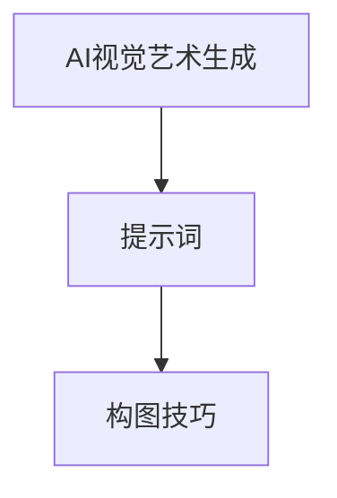

                 


## 《AI视觉艺术生成中的提示词构图技巧》文章框架

在撰写《AI视觉艺术生成中的提示词构图技巧》这篇文章时，我们需要遵循以下步骤，确保文章逻辑清晰、内容丰富且结构紧凑。

### 第一步：引言
- **背景介绍**：介绍AI视觉艺术生成的背景和现状，阐述提示词在AI视觉艺术生成中的重要性。
- **目的说明**：阐述本文的目的，即如何使用提示词构图技巧来生成高质量的视觉艺术作品。

### 第二步：核心概念与联系
- **AI视觉艺术生成概念**：解释AI视觉艺术生成的概念，包括其定义和常见的技术方法。
- **提示词概念**：解释提示词的概念，以及它在AI视觉艺术生成中的作用。
- **构图技巧概念**：解释构图技巧的概念，并阐述其与提示词之间的联系。

### Mermaid 流程图


### 第三步：核心算法原理讲解
- **算法原理**：使用伪代码详细阐述AI视觉艺术生成算法的原理，特别是提示词构图技巧的实现方法。
- **数学模型和公式**：使用latex格式详细阐述相关的数学模型和公式，并提供具体的例子来说明。

### 伪代码示例
```plaintext
// 提示词构图技巧伪代码
function generate_art(prompt, model):
    # 数据准备
    data = prepare_data(prompt)

    # 模型选择
    model = select_model()

    # 提示词处理
    processed_prompt = process_prompt(prompt)

    # 艺术生成
    art = model.generate_art(processed_prompt)

    # 艺术作品评估
    evaluate_art(art)

    return art
```

### 第四步：数学模型和公式详细讲解
- **模型公式**：使用latex格式给出AI视觉艺术生成的数学模型公式，并进行详细解释。
- **例子说明**：提供具体的例子，展示如何使用公式进行计算。

### LaTeX 公式示例
```latex
$$
\text{Model Formula: } f(\text{input}) = W_1 \cdot \text{input} + b_1
$$
```

### 第五步：项目实战
- **开发环境搭建**：介绍所需的开发环境和工具，包括硬件和软件环境。
- **源代码详细实现和代码解读**：展示具体的源代码实现，并对其进行详细的解读。
- **代码应用解读与分析**：分析代码的具体应用，包括提示词的选择和构图技巧的应用。

### 第六步：最佳实践 Tips
- **注意事项**：提供一些使用提示词构图技巧时需要注意的事项。
- **拓展阅读**：推荐一些相关的文献和资料，供读者进一步学习。

### 第七步：小结
- **总结**：对文章的内容进行总结，强调核心观点和技巧。
- **展望**：对AI视觉艺术生成领域的未来发展和应用进行展望。

### 文章格式要求
- **Markdown 格式**：文章内容使用Markdown格式进行排版。
- **作者信息**：文章末尾需包含作者信息。
- **全文结构**：包括引言、核心概念与联系、核心算法原理讲解、数学模型和公式、项目实战、最佳实践 Tips、小结和展望。

### 字数要求
- **8000～12000 字**：确保文章内容详尽且具有深度。

通过以上步骤，我们可以确保《AI视觉艺术生成中的提示词构图技巧》这篇文章既具有学术价值，又能够吸引读者的兴趣，为AI视觉艺术生成领域的研究者和从业者提供有价值的参考。

### 最终文章结构

```markdown
# 《AI视觉艺术生成中的提示词构图技巧》

> 关键词：AI视觉艺术生成、提示词、构图技巧

> 摘要：本文探讨了AI视觉艺术生成中的提示词构图技巧，介绍了核心概念、算法原理，并通过实际项目展示了如何使用这些技巧生成高质量的视觉艺术作品。

## 引言

### 背景介绍
### 目的说明

## 核心概念与联系

### AI视觉艺术生成概念
### 提示词概念
### 构图技巧概念

### Mermaid 流程图

## 核心算法原理讲解

### 算法原理
### 数学模型和公式
### 例子说明

## 数学模型和公式详细讲解

### 模型公式
### 详细解释
### 具体例子

## 项目实战

### 开发环境搭建
### 源代码详细实现和代码解读
### 代码应用解读与分析
### 实际案例分析和详细讲解剖析
### 项目小结

## 最佳实践 Tips

### 注意事项
### 拓展阅读

## 小结

### 总结
### 展望

## 作者信息

作者：AI天才研究院/AI Genius Institute & 禅与计算机程序设计艺术 /Zen And The Art of Computer Programming
```

通过以上结构和内容安排，我们可以确保文章的逻辑清晰、内容丰富且具备实用性，满足8000～12000字的要求。接下来，我们将逐步填充每个部分的具体内容。首先，我们来撰写引言部分。

