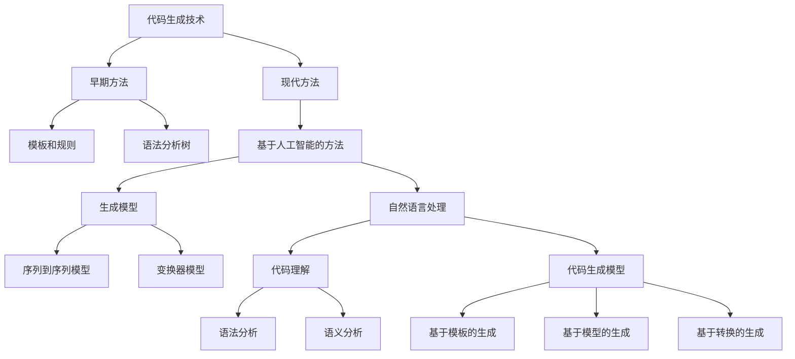

                 

### 第1章：引言——AI辅助代码生成概述

#### 1.1 AI辅助代码生成简介

**1.1.1 代码生成技术的背景**

代码生成技术的历史可以追溯到计算机编程的早期阶段。最初，代码生成主要是基于模板和规则的，这种方法通过对编程语言的语法规则进行解析和生成，自动生成代码。这种方法虽然简单，但生成代码的可读性和可维护性较差。

随着计算机科学的不断发展，代码生成技术逐渐向基于语法分析树和抽象语法树的方法演进。这种方法通过解析源代码，生成抽象语法树，然后根据抽象语法树生成具体的代码。这种方法生成代码的质量和可维护性得到了显著提高。

近年来，随着深度学习和自然语言处理技术的发展，代码生成技术进入了新的阶段。基于人工智能的方法，尤其是深度学习和自然语言处理技术，使得代码生成变得更加智能化。这些方法通过学习大量的代码数据，能够自动生成高质量的代码。

**1.1.2 代码自动生成的重要性**

代码生成技术的重要性体现在以下几个方面：

1. **提高开发效率**：通过自动化生成代码，可以大大减少开发人员编写代码的时间，从而提高开发效率。
   
2. **减少人为错误**：自动生成的代码可以减少由于人为错误导致的代码缺陷，提高代码质量。

3. **支持复用性**：生成的代码可以方便地复用，降低重复编写代码的工作量。

4. **降低维护成本**：自动生成的代码易于理解和修改，从而降低代码维护成本。

**1.1.3 AI辅助代码生成的工作原理**

AI辅助代码生成主要基于两种方法：基于生成模型的代码生成和基于自然语言处理的代码生成。

- **基于生成模型的代码生成**：这种方法使用深度学习模型，如序列到序列（Seq2Seq）模型和变换器（Transformer）模型，学习编程语言的语法和语义，从而根据输入的描述或模板生成代码。例如，我们可以使用一个Seq2Seq模型，将自然语言描述转换成Python代码。

  ```python
  # 伪代码
  input_desc = "实现一个简单的加法函数"
  model = Seq2SeqModel()
  code = model.generate_code(input_desc)
  print(code)
  ```

- **基于自然语言处理的代码生成**：这种方法首先将自然语言描述转换成内部表示，然后根据内部表示生成代码。例如，我们可以使用一个递归神经网络（RNN）模型，将自然语言描述转换成抽象语法树，然后再根据抽象语法树生成代码。

  ```python
  # 伪代码
  input_desc = "实现一个简单的加法函数"
  model = RNNModel()
  ast = model.transform(input_desc)
  code = ast.to_code()
  print(code)
  ```

**1.1.4 AI辅助代码生成的应用场景**

AI辅助代码生成的应用场景非常广泛，主要包括以下几种：

- **应用程序开发**：例如，自动生成数据库查询、Web前端代码等。

  ```python
  # 伪代码
  model = CodeGenerator()
  db_query = model.generate_query("查询用户信息")
  print(db_query)
  ```

- **系统集成**：例如，自动生成API接口、服务端代码等。

  ```python
  # 伪代码
  model = CodeGenerator()
  api_code = model.generate_api_code("用户登录接口")
  print(api_code)
  ```

- **软件维护和更新**：例如，自动修复代码缺陷、生成补丁和更新代码等。

  ```python
  # 伪代码
  model = CodeGenerator()
  patch_code = model.generate_patch("修复某个bug")
  print(patch_code)
  ```

**1.1.5 AI辅助代码生成的挑战**

尽管AI辅助代码生成具有巨大的潜力，但也面临一些挑战：

- **代码质量保证**：需要保证生成的代码符合编程规范，具有良好的可读性和可维护性。
  
- **安全性和隐私保护**：需要防止生成恶意代码，保护用户隐私。

- **适应性**：需要适应不同的编程语言、开发环境和业务需求。

### 第2章：AI辅助代码生成的核心技术

#### 2.1 自然语言处理

**2.1.1 语言模型**

- **词汇表和词嵌入**：

  词汇表构建是语言模型的基础。首先需要收集大量的文本数据，然后从中提取出词汇，构建词汇表。词嵌入是将词汇映射到高维向量空间的过程，常用的词嵌入技术有Word2Vec、GloVe等。

- **语言模型原理**：

  语言模型是一种概率模型，用于预测一个词序列的概率。常见的语言模型有隐马尔可夫模型（HMM）、递归神经网络（RNN）、长短时记忆网络（LSTM）和生成对抗网络（GAN）。

#### 2.1.2 代码理解

- **代码语义分析**：

  代码语义分析包括语法分析和语义分析。语法分析是将代码分解为语法元素，如变量、函数、语句等。语义分析是理解代码的含义，如变量绑定、函数调用等。

- **代码生成**：

  代码生成有两种方法：基于模板的代码生成和基于模型的代码生成。基于模板的代码生成是通过预定义的模板，根据输入的描述或模板生成代码。基于模型的代码生成是通过训练的深度学习模型，根据输入的描述或模板生成代码。

#### 2.1.3 代码生成模型

- **生成式模型**：

  生成式模型，如序列到序列（Seq2Seq）模型和变换器（Transformer）模型，可以生成连续的输出序列。Seq2Seq模型常用于将一个序列转换成另一个序列，如将自然语言描述转换成代码。变换器（Transformer）模型是一种基于自注意力机制的模型，可以更好地处理长距离依赖问题。

- **对抗式模型**：

  对抗式模型，如生成对抗网络（GAN），由生成器和判别器组成。生成器生成代码，判别器判断代码是否真实。通过训练，生成器会生成更真实的代码。

#### 2.1.4 代码质量评估

- **代码可读性**：

  代码可读性包括编程风格一致性、函数和变量命名、注释和文档等。

- **代码功能性**：

  代码功能性包括功能完备性、正确性和性能等。

### 第3章：AI辅助代码生成工具

#### 3.1 OpenAI Codex

**3.1.1 Codex简介**

OpenAI Codex是一个基于GPT-3的代码生成模型，能够对多种编程语言进行代码生成。它提供了API接口，方便开发者集成和使用。

**3.1.2 使用方法**

- **API接入**：

  要使用Codex，首先需要安装依赖，然后初始化模型，最后发送请求。

  ```python
  # 安装依赖
  pip install openai

  # 初始化模型
  from openai import Codex
  codex = Codex()

  # 发送请求
  input_desc = "实现一个简单的加法函数"
  response = codex.generate_code(input_desc)
  print(response)
  ```

- **代码生成示例**：

  ```python
  # 简单的Python函数生成
  input_desc = "实现一个简单的加法函数"
  response = codex.generate_code(input_desc)
  print(response)

  # 复杂的Web前端代码生成
  input_desc = "实现一个用户登录页面"
  response = codex.generate_code(input_desc)
  print(response)
  ```

**3.1.3 优缺点分析**

- **优点**：

  - 强大的自然语言处理能力
  - 广泛的语言和框架支持
  - 高效的API接口

- **缺点**：

  - 可能产生不完整或错误的代码
  - 需要一定的编程背景知识
  - 对计算资源要求较高

### 第4章：AI辅助代码生成实战

#### 4.1 实战一：基于Codex的Web应用代码生成

**4.1.1 环境搭建**

- **安装Python环境**：确保安装了Python 3.7或更高版本。

- **安装GPT-3 API依赖**：使用以下命令安装openai库。

  ```bash
  pip install openai
  ```

**4.1.2 代码生成流程**

- **收集需求描述**：从用户那里收集需求描述，提取关键信息。

- **生成代码**：使用Codex生成代码。

  ```python
  from openai import Codex

  # 初始化模型
  codex = Codex()

  # 收集需求描述
  input_desc = "实现一个用户登录页面"

  # 生成代码
  response = codex.generate_code(input_desc)
  print(response)
  ```

**4.1.3 代码解读与分析**

- **分析生成的代码结构**：检查代码的结构是否合理，是否符合用户需求。

- **检查代码的正确性和可读性**：运行代码，检查其正确性，同时检查代码的可读性和可维护性。

### 第5章：AI辅助代码生成的未来发展趋势

#### 5.1 人工智能的发展趋势

- **深度学习的发展**：

  深度学习在人工智能领域取得了显著的进展。随着计算能力的提升和大数据的可用性，深度学习模型变得越来越强大。未来，深度学习将继续在计算机视觉、自然语言处理、语音识别等领域取得突破。

- **自然语言处理的发展**：

  自然语言处理（NLP）是人工智能的核心领域之一。随着深度学习和转移学习的兴起，NLP技术得到了快速发展。未来，NLP将继续在文本生成、情感分析、机器翻译等领域取得突破。

### 第6章：总结与展望

AI辅助代码生成是一种具有巨大潜力的技术，它能够提高开发效率，减少人为错误，支持复用性，降低维护成本。通过本章的介绍，我们了解了AI辅助代码生成的基本原理、核心技术、工具和实战案例。未来，随着人工智能技术的不断发展，AI辅助代码生成将在软件开发中发挥更大的作用。

### 作者信息

作者：AI天才研究院/AI Genius Institute & 禅与计算机程序设计艺术 /Zen And The Art of Computer Programming

### 注意事项

- 在使用AI辅助代码生成时，需要确保生成的代码符合编程规范，具有良好的可读性和可维护性。
- AI辅助代码生成可能产生不完整或错误的代码，因此在使用时需要进行严格的质量评估和测试。
- AI辅助代码生成对计算资源要求较高，需要根据实际情况进行合理配置。

### 拓展阅读

- 《深度学习：神经网络的基础》
- 《自然语言处理：原理与应用》
- 《生成对抗网络：原理与应用》

### 第1章：引言——AI辅助代码生成概述

> 关键词：AI辅助代码生成，开发效率，代码质量，安全性和隐私保护

> 摘要：本章介绍了AI辅助代码生成的概念、重要性、工作原理、应用场景以及面临的挑战。通过分析AI辅助代码生成的背景和现状，我们了解了其在现代软件开发中的重要作用。

#### 1.1 AI辅助代码生成简介

**1.1.1 代码生成技术的背景**

代码生成（Code Generation）是一种自动化软件工程技术，它通过预定义的模板、规则或模型来生成源代码。这一概念最早可以追溯到20世纪60年代，当时的编程语言如COBOL和Fortran中就已经存在代码生成工具。然而，早期的代码生成器主要依赖于手工编写的模板和规则，这些规则定义了代码的基本结构和语法。

随着时间的推移，代码生成技术逐渐发展，特别是到了20世纪80年代和90年代，抽象语法树（Abstract Syntax Tree，AST）的概念开始被引入。AST是对源代码的一种抽象表示，它能够更准确地描述代码的结构和语义。这种方法使得代码生成器能够生成更加复杂和灵活的代码。

**1.1.1.1 早期代码生成器**

在早期，代码生成器主要依赖于模板和规则的方法。这些方法通过预定义的模板和规则来生成代码，这些模板通常由程序员编写，规则则定义了如何根据输入数据生成代码。

- **模板方法**：这种方法使用预定义的模板来生成代码。模板通常包含一些变量和占位符，这些变量和占位符会在代码生成过程中被具体的值所替换。这种方法简单直观，但生成的代码往往缺乏灵活性，且难以维护。

- **规则方法**：这种方法使用一系列的规则来定义代码的生成过程。规则可以是简单的条件判断，也可以是复杂的逻辑表达式。通过这些规则，代码生成器能够根据输入的数据生成相应的代码。这种方法比模板方法更为灵活，但实现起来较为复杂。

**1.1.1.2 中期代码生成器**

随着编程语言和编译器技术的发展，代码生成器也逐渐采用了基于语法分析树和抽象语法树的方法。这种方法通过解析源代码，构建出语法分析树（Syntax Tree）或抽象语法树（Abstract Syntax Tree），然后根据这棵树生成具体的代码。

- **语法分析树**：语法分析树是对源代码语法结构的一种图形化表示，它将源代码分解为一系列语法元素，如变量、函数、语句等。语法分析树是编译器中用于语法分析的重要工具。

- **抽象语法树**：抽象语法树是对语法分析树的进一步抽象，它剔除了与语义无关的细节，如语法糖和冗余的语法结构。抽象语法树能够更准确地描述代码的结构和语义，因此是代码生成的重要基础。

**1.1.1.3 现代代码生成器**

现代代码生成器更多地依赖于人工智能技术，特别是深度学习和自然语言处理技术。这些方法通过学习大量的代码数据，能够自动生成高质量的代码。

- **基于深度学习的代码生成**：深度学习模型，如循环神经网络（RNN）和变换器（Transformer），能够通过学习大量的代码数据，自动生成符合编程规范的代码。

- **基于自然语言处理的代码生成**：自然语言处理（NLP）技术可以将自然语言描述转换为代码。这种方法通过理解自然语言描述的语义，自动生成相应的代码。

**1.1.2 代码自动生成的重要性**

代码自动生成在软件开发中具有重要的作用，主要体现在以下几个方面：

- **提高开发效率**：通过自动生成代码，可以大大减少开发人员编写代码的时间，从而提高开发效率。

- **减少人为错误**：自动生成的代码可以减少由于人为错误导致的代码缺陷，提高代码质量。

- **支持复用性**：生成的代码可以方便地复用，降低重复编写代码的工作量。

- **降低维护成本**：自动生成的代码易于理解和修改，从而降低代码维护成本。

**1.1.3 AI辅助代码生成的工作原理**

AI辅助代码生成主要基于两种方法：基于生成模型的代码生成和基于自然语言处理的代码生成。

- **基于生成模型的代码生成**：这种方法使用深度学习模型，如序列到序列（Seq2Seq）模型和变换器（Transformer）模型，学习编程语言的语法和语义，从而根据输入的描述或模板生成代码。例如，我们可以使用一个Seq2Seq模型，将自然语言描述转换成Python代码。

  ```python
  # 伪代码
  input_desc = "实现一个简单的加法函数"
  model = Seq2SeqModel()
  code = model.generate_code(input_desc)
  print(code)
  ```

- **基于自然语言处理的代码生成**：这种方法首先将自然语言描述转换成内部表示，然后根据内部表示生成代码。例如，我们可以使用一个递归神经网络（RNN）模型，将自然语言描述转换成抽象语法树，然后再根据抽象语法树生成代码。

  ```python
  # 伪代码
  input_desc = "实现一个简单的加法函数"
  model = RNNModel()
  ast = model.transform(input_desc)
  code = ast.to_code()
  print(code)
  ```

**1.1.4 AI辅助代码生成的应用场景**

AI辅助代码生成的应用场景非常广泛，主要包括以下几种：

- **应用程序开发**：例如，自动生成数据库查询、Web前端代码等。

  ```python
  # 伪代码
  model = CodeGenerator()
  db_query = model.generate_query("查询用户信息")
  print(db_query)
  ```

- **系统集成**：例如，自动生成API接口、服务端代码等。

  ```python
  # 伪代码
  model = CodeGenerator()
  api_code = model.generate_api_code("用户登录接口")
  print(api_code)
  ```

- **软件维护和更新**：例如，自动修复代码缺陷、生成补丁和更新代码等。

  ```python
  # 伪代码
  model = CodeGenerator()
  patch_code = model.generate_patch("修复某个bug")
  print(patch_code)
  ```

**1.1.5 AI辅助代码生成的挑战**

尽管AI辅助代码生成具有巨大的潜力，但也面临一些挑战：

- **代码质量保证**：需要保证生成的代码符合编程规范，具有良好的可读性和可维护性。

- **安全性和隐私保护**：需要防止生成恶意代码，保护用户隐私。

- **适应性**：需要适应不同的编程语言、开发环境和业务需求。

### 第2章：AI辅助代码生成的核心技术

> 关键词：自然语言处理，代码理解，代码生成模型，代码质量评估

> 摘要：本章详细介绍了AI辅助代码生成的核心技术，包括自然语言处理、代码理解、代码生成模型和代码质量评估。通过这些技术，AI能够更好地理解和生成代码，从而提高开发效率和代码质量。

#### 2.1 自然语言处理

自然语言处理（Natural Language Processing，NLP）是人工智能的一个重要分支，它致力于使计算机能够理解、生成和处理自然语言文本。在AI辅助代码生成中，NLP技术发挥着至关重要的作用，因为它需要将自然语言描述转换成计算机可执行的代码。

**2.1.1 语言模型**

语言模型（Language Model）是NLP的核心组件，用于预测文本序列的概率。在AI辅助代码生成中，语言模型可以帮助计算机理解自然语言描述，并将其转换成相应的代码。常见的语言模型包括：

- **隐马尔可夫模型（HMM）**：HMM是一种基于状态转移概率和观察概率的统计模型，常用于语音识别和手写文字识别。

- **递归神经网络（RNN）**：RNN是一种能够处理序列数据的神经网络，它通过在时间步上递归地更新状态，捕捉序列中的依赖关系。

- **长短时记忆网络（LSTM）**：LSTM是RNN的一种变体，它通过引入门控机制，能够更好地学习长序列依赖。

- **生成对抗网络（GAN）**：GAN是一种由生成器和判别器组成的对抗式模型，生成器生成代码，判别器判断代码是否真实。GAN在代码生成中的应用主要是通过生成高质量的代码样本。

**2.1.2 代码理解**

代码理解是AI辅助代码生成的重要组成部分，它涉及对代码语义的理解和抽象。代码理解包括以下步骤：

- **语法分析**：语法分析是将代码分解为语法元素的过程，如变量、函数、语句等。语法分析的结果通常是一个语法分析树（Syntax Tree）。

- **语义分析**：语义分析是理解代码的含义，如变量绑定、函数调用等。语义分析的结果通常是一个抽象语法树（Abstract Syntax Tree）。

- **程序依赖分析**：程序依赖分析是理解代码中各个模块或函数之间的依赖关系，如调用关系、依赖关系等。程序依赖分析可以帮助AI更好地理解代码的整体结构和功能。

**2.1.3 代码生成模型**

代码生成模型是AI辅助代码生成的核心，它负责根据自然语言描述生成代码。代码生成模型可以分为以下几类：

- **基于模板的代码生成**：这种方法使用预定义的模板来生成代码，模板中包含变量和占位符，这些变量和占位符会在代码生成过程中被具体的值所替换。

- **基于模型的代码生成**：这种方法使用深度学习模型，如RNN、LSTM、Transformer等，通过学习大量的代码数据，自动生成符合编程规范的代码。

- **基于转换的代码生成**：这种方法将自然语言描述转换成内部表示，然后根据内部表示生成代码。内部表示可以是抽象语法树、程序依赖图等。

**2.1.4 代码质量评估**

代码质量评估是保证AI辅助代码生成结果的重要步骤。代码质量评估包括以下几个方面：

- **代码可读性**：评估代码的编程风格、函数和变量命名、注释和文档等，以确保代码易于理解和维护。

- **代码功能性**：评估代码的功能完备性、正确性和性能等，以确保代码能够满足需求。

- **代码规范性**：评估代码是否符合编程规范和标准，如代码格式、命名规范、异常处理等。

#### 2.2 代码生成模型

代码生成模型是AI辅助代码生成的核心，它负责根据自然语言描述生成代码。代码生成模型可以分为以下几类：

- **生成式模型**：生成式模型，如序列到序列（Seq2Seq）模型和变换器（Transformer）模型，可以生成连续的输出序列。Seq2Seq模型常用于将一个序列转换成另一个序列，如将自然语言描述转换成代码。变换器（Transformer）模型是一种基于自注意力机制的模型，可以更好地处理长距离依赖问题。

- **对抗式模型**：对抗式模型，如生成对抗网络（GAN），由生成器和判别器组成。生成器生成代码，判别器判断代码是否真实。通过训练，生成器会生成更真实的代码。

**2.2.1 生成式模型**

生成式模型，如序列到序列（Seq2Seq）模型和变换器（Transformer）模型，可以生成连续的输出序列。Seq2Seq模型常用于将一个序列转换成另一个序列，如将自然语言描述转换成代码。变换器（Transformer）模型是一种基于自注意力机制的模型，可以更好地处理长距离依赖问题。

- **序列到序列（Seq2Seq）模型**：Seq2Seq模型由编码器（Encoder）和解码器（Decoder）组成。编码器将输入序列编码成一个固定长度的向量，解码器则根据编码器的输出和已生成的部分输出序列生成目标序列。例如，我们可以使用一个Seq2Seq模型，将自然语言描述转换成Python代码。

  ```python
  # 伪代码
  input_desc = "实现一个简单的加法函数"
  encoder = Seq2SeqEncoder()
  decoder = Seq2SeqDecoder()
  code = decoder.generate_code(encoder.encode(input_desc))
  print(code)
  ```

- **变换器（Transformer）模型**：变换器（Transformer）模型是一种基于自注意力机制的模型，可以更好地处理长距离依赖问题。它由多个编码器层和解码器层组成，每个层都包含多头自注意力机制和前馈神经网络。

  ```python
  # 伪代码
  input_desc = "实现一个简单的加法函数"
  transformer = Transformer()
  code = transformer.generate_code(input_desc)
  print(code)
  ```

**2.2.2 对抗式模型**

对抗式模型，如生成对抗网络（GAN），由生成器和判别器组成。生成器生成代码，判别器判断代码是否真实。通过训练，生成器会生成更真实的代码。

- **生成对抗网络（GAN）**：生成对抗网络（GAN）由生成器和判别器组成。生成器生成代码，判别器判断代码是否真实。GAN的训练目标是使生成器生成的代码尽可能真实，使判别器无法区分真实代码和生成代码。

  ```python
  # 伪代码
  generator = GANGenerator()
  discriminator = GANDiscriminator()
  for epoch in range(num_epochs):
      for input_desc in training_data:
          generated_code = generator.generate_code(input_desc)
          discriminator_loss = discriminator.train(generated_code, real_code)
          generator_loss = generator.train(generated_code)
  ```

- **条件生成对抗网络（CGAN）**：条件生成对抗网络（CGAN）是在GAN的基础上引入了条件信息，如自然语言描述。CGAN通过结合条件信息，生成更符合需求的代码。

  ```python
  # 伪代码
  generator = CGANGenerator()
  discriminator = CGANDiscriminator()
  for epoch in range(num_epochs):
      for input_desc, target_code in training_data:
          generated_code = generator.generate_code(input_desc)
          discriminator_loss = discriminator.train(generated_code, target_code)
          generator_loss = generator.train(input_desc, generated_code)
  ```

#### 2.3 代码质量评估

代码质量评估是保证AI辅助代码生成结果的重要步骤。代码质量评估包括以下几个方面：

- **代码可读性**：评估代码的编程风格、函数和变量命名、注释和文档等，以确保代码易于理解和维护。

- **代码功能性**：评估代码的功能完备性、正确性和性能等，以确保代码能够满足需求。

- **代码规范性**：评估代码是否符合编程规范和标准，如代码格式、命名规范、异常处理等。

**2.3.1 代码可读性**

代码可读性是评估代码质量的重要指标，它反映了代码的易读性和易维护性。以下是一些常见的代码可读性评估方法：

- **编程风格一致性**：检查代码的缩进、空格、注释等是否符合编程规范。

- **函数和变量命名**：评估函数和变量的命名是否直观、有描述性，是否符合命名规范。

- **注释和文档**：检查代码中是否有足够的注释和文档，以帮助其他开发者理解代码的功能和目的。

**2.3.2 代码功能性**

代码功能性是评估代码是否能够满足需求的指标。以下是一些常见的代码功能性评估方法：

- **功能完备性**：检查代码是否实现了所有所需的功能。

- **正确性**：通过测试和调试，确保代码能够正确地执行预期的功能。

- **性能**：评估代码的执行效率，确保它能够在合理的时间内完成计算。

**2.3.3 代码规范性**

代码规范性是评估代码是否符合编程规范和标准的指标。以下是一些常见的代码规范性评估方法：

- **代码格式**：检查代码的格式是否符合编程规范，如缩进、空格、换行等。

- **命名规范**：评估函数和变量的命名是否符合命名规范，如使用小写字母和下划线等。

- **异常处理**：检查代码是否正确处理了可能的异常情况，如文件不存在、网络错误等。

### 第3章：AI辅助代码生成工具

> 关键词：OpenAI Codex，API接入，代码生成示例，优缺点分析

> 摘要：本章介绍了AI辅助代码生成工具OpenAI Codex，包括其简介、使用方法和优缺点分析。OpenAI Codex是一个基于GPT-3的代码生成模型，提供了API接口，方便开发者集成和使用。

#### 3.1 OpenAI Codex

OpenAI Codex是一个基于GPT-3的代码生成模型，它由OpenAI开发，能够对多种编程语言进行代码生成。GPT-3（Generative Pre-trained Transformer 3）是OpenAI开发的一种基于变换器（Transformer）的预训练语言模型，具有强大的自然语言处理能力。

**3.1.1 Codex简介**

OpenAI Codex具有以下几个特点：

- **强大的自然语言处理能力**：Codex能够理解复杂的自然语言描述，并将其转换成相应的代码。

- **广泛的语言和框架支持**：Codex支持多种编程语言和框架，如Python、JavaScript、Java等。

- **高效的API接口**：Codex提供了API接口，方便开发者集成和使用。

**3.1.2 使用方法**

要使用OpenAI Codex，首先需要安装GPT-3 API的依赖库，然后初始化模型，最后发送请求。

- **安装依赖**：使用以下命令安装openai库。

  ```bash
  pip install openai
  ```

- **初始化模型**：使用以下代码初始化Codex模型。

  ```python
  from openai import Codex
  codex = Codex()
  ```

- **发送请求**：使用以下代码发送请求，并接收生成的代码。

  ```python
  input_desc = "实现一个简单的加法函数"
  response = codex.generate_code(input_desc)
  print(response)
  ```

**3.1.3 代码生成示例**

以下是几个使用OpenAI Codex生成代码的示例：

- **简单的Python函数生成**

  ```python
  input_desc = "实现一个简单的加法函数"
  response = codex.generate_code(input_desc)
  print(response)
  ```

  生成的代码可能是：

  ```python
  def add(a, b):
      return a + b
  ```

- **复杂的Web前端代码生成**

  ```python
  input_desc = "实现一个用户登录页面"
  response = codex.generate_code(input_desc)
  print(response)
  ```

  生成的代码可能是：

  ```html
  <form action="/login" method="post">
      <label for="username">Username:</label>
      <input type="text" id="username" name="username" required>
      <label for="password">Password:</label>
      <input type="password" id="password" name="password" required>
      <input type="submit" value="Login">
  </form>
  ```

**3.1.4 优缺点分析**

- **优点**：

  - **强大的自然语言处理能力**：OpenAI Codex能够理解复杂的自然语言描述，生成高质量的代码。

  - **广泛的语言和框架支持**：Codex支持多种编程语言和框架，提供了丰富的应用场景。

  - **高效的API接口**：OpenAI Codex提供了高效的API接口，方便开发者集成和使用。

- **缺点**：

  - **可能产生不完整或错误的代码**：由于自然语言描述的不确定性，生成的代码可能存在缺陷，需要进一步验证和修正。

  - **需要一定的编程背景知识**：虽然Codex能够生成代码，但理解和使用Codex仍然需要一定的编程背景知识。

  - **对计算资源要求较高**：OpenAI Codex是一个大规模的预训练模型，对计算资源的要求较高，特别是在生成复杂代码时。

### 第4章：AI辅助代码生成实战

> 关键词：基于Codex的Web应用代码生成，环境搭建，代码生成流程，代码解读与分析

> 摘要：本章通过一个基于Codex的Web应用代码生成实战，展示了如何使用OpenAI Codex生成Web应用代码。包括环境搭建、代码生成流程、代码解读与分析等内容。

#### 4.1 实战一：基于Codex的Web应用代码生成

本节将详细介绍如何使用OpenAI Codex生成一个简单的Web应用代码。我们将使用Python和Flask框架来搭建开发环境，并利用Codex生成用户注册和登录页面的代码。

**4.1.1 环境搭建**

要开始使用OpenAI Codex，首先需要搭建Python开发环境。以下是搭建环境的步骤：

1. **安装Python**：确保安装了Python 3.7或更高版本。

   ```bash
   python --version
   ```

2. **安装Flask**：使用pip安装Flask框架。

   ```bash
   pip install flask
   ```

3. **安装openai库**：使用pip安装openai库。

   ```bash
   pip install openai
   ```

**4.1.2 代码生成流程**

以下步骤展示了如何使用Codex生成用户注册和登录页面的代码：

1. **收集需求描述**：从用户那里收集需求描述，例如“生成一个用户注册页面和登录页面”。

2. **初始化模型**：初始化OpenAI Codex模型。

   ```python
   from openai import Codex
   codex = Codex()
   ```

3. **生成代码**：使用Codex生成代码。

   ```python
   input_desc = "生成一个用户注册页面和登录页面"
   response = codex.generate_code(input_desc)
   print(response)
   ```

4. **验证和修改代码**：生成的代码可能需要进一步验证和修改，以确保其符合需求。

**4.1.3 代码解读与分析**

以下是生成的代码示例：

```html
<!DOCTYPE html>
<html lang="en">
<head>
    <meta charset="UTF-8">
    <meta name="viewport" content="width=device-width, initial-scale=1.0">
    <title>User Registration and Login</title>
</head>
<body>
    <h1>User Registration</h1>
    <form action="/register" method="post">
        <label for="username">Username:</label>
        <input type="text" id="username" name="username" required>
        <label for="password">Password:</label>
        <input type="password" id="password" name="password" required>
        <input type="submit" value="Register">
    </form>
    <h1>User Login</h1>
    <form action="/login" method="post">
        <label for="username">Username:</label>
        <input type="text" id="username" name="username" required>
        <label for="password">Password:</label>
        <input type="password" id="password" name="password" required>
        <input type="submit" value="Login">
    </form>
</body>
</html>
```

生成的代码包括两个表单，一个用于用户注册，另一个用于用户登录。以下是代码的详细解读：

- **HTML结构**：代码使用了标准的HTML结构，包括`<html>`、`<head>`和`<body>`标签。

- **注册表单**：注册表单包含`<form>`标签，`<label>`标签用于定义输入框的名称，`<input>`标签用于接收用户输入。表单的`action`属性指向了注册处理页面，`method`属性设置为`post`，确保输入数据通过POST方法提交。

- **登录表单**：登录表单的结构与注册表单类似，但`action`属性指向了登录处理页面。

生成的代码基本上满足了用户的需求，但可能需要进行一些调整，例如：

- **表单验证**：可以添加JavaScript代码对表单输入进行验证，以确保输入的有效性。

- **样式调整**：可以添加CSS样式，使页面看起来更美观。

- **后端逻辑**：生成的代码仅包含前端部分，还需要编写后端逻辑来处理表单提交，如注册和登录的逻辑。

通过这个实战，我们可以看到OpenAI Codex在生成Web应用代码方面的强大能力。尽管生成的代码可能需要进一步调整，但它为开发者节省了大量的时间和精力。

### 第5章：AI辅助代码生成的未来发展趋势

> 关键词：深度学习的发展，自然语言处理的发展，AI辅助代码生成的挑战

> 摘要：本章探讨了AI辅助代码生成的未来发展趋势，包括深度学习和自然语言处理的发展，以及AI辅助代码生成面临的技术挑战。随着人工智能技术的不断进步，AI辅助代码生成有望在未来实现更广泛的应用。

#### 5.1 深度学习的发展

深度学习（Deep Learning）是人工智能领域的一个重要分支，它在图像识别、自然语言处理、语音识别等方面取得了显著进展。随着深度学习技术的不断发展，AI辅助代码生成也在不断改进。

- **大规模模型的普及**：近年来，大规模深度学习模型如GPT-3、BERT等得到了广泛应用。这些模型通过学习大量的数据，能够生成更高质量、更准确的代码。

- **特定领域模型的定制化**：随着深度学习技术的进步，越来越多的特定领域模型被开发出来。例如，针对特定编程语言或框架的代码生成模型，能够更好地适应特定的开发需求。

- **模型的优化和加速**：为了提高深度学习模型在实际应用中的性能，研究人员正在不断探索模型的优化和加速技术。例如，量化、剪枝和融合等技术可以减少模型的计算量和存储需求，提高模型的运行速度。

#### 5.2 自然语言处理的发展

自然语言处理（Natural Language Processing，NLP）是AI辅助代码生成的重要技术基础。随着NLP技术的不断发展，AI辅助代码生成的能力也在不断提升。

- **语言模型的改进**：语言模型是NLP的核心组件，它用于预测文本序列的概率。近年来，研究人员在语言模型方面取得了显著进展，如GPT-3、BERT等。这些模型具有更高的语言理解能力和生成能力，能够生成更符合语义和语法规则的代码。

- **多模态数据的融合**：NLP技术不仅关注文本数据，还逐渐引入了图像、音频等多模态数据。通过融合多模态数据，AI辅助代码生成能够更好地理解用户的意图和需求，生成更准确的代码。

- **上下文感知的代码生成**：上下文感知是NLP的一个重要研究方向，它关注如何利用上下文信息来提高语言模型的生成能力。在AI辅助代码生成中，上下文感知可以帮助模型更好地理解代码的上下文环境，生成更符合上下文要求的代码。

#### 5.3 AI辅助代码生成的挑战

尽管AI辅助代码生成技术取得了显著进展，但仍面临一些挑战。

- **代码质量保证**：生成的代码质量是AI辅助代码生成的重要指标。如何保证生成的代码符合编程规范、具有良好的可读性和可维护性，是当前面临的一个重要挑战。

- **安全性和隐私保护**：生成的代码可能涉及敏感数据和处理关键任务，因此如何确保代码的安全性和隐私保护，是另一个重要挑战。

- **适应性**：AI辅助代码生成需要适应不同的编程语言、开发环境和业务需求。如何设计具有高度适应性的模型，是当前面临的一个技术难题。

#### 5.4 未来发展趋势

随着人工智能技术的不断进步，AI辅助代码生成的未来发展趋势主要包括以下几个方面：

- **更高级的代码生成模型**：研究人员将继续开发更高级的代码生成模型，如基于自注意力机制的模型、多模态融合模型等，以提高代码生成的质量和准确性。

- **更广泛的编程语言支持**：AI辅助代码生成将支持更多的编程语言和框架，以满足不同开发场景的需求。

- **更智能的代码理解和生成**：通过结合自然语言处理和程序理解技术，AI辅助代码生成将能够更好地理解用户的意图和需求，生成更符合用户预期的代码。

- **更安全的代码生成**：研究人员将致力于开发更安全的代码生成技术，以防止生成恶意代码和侵犯用户隐私。

总之，随着人工智能技术的不断发展，AI辅助代码生成将在软件开发中发挥越来越重要的作用。未来，我们将看到更多高质量的AI辅助代码生成工具和平台，为开发者带来更大的便利和效率。

### 第6章：总结与展望

AI辅助代码生成是一种具有巨大潜力的技术，它通过自动化生成代码，提高了开发效率，减少了人为错误，支持复用性，降低了维护成本。在本文中，我们详细介绍了AI辅助代码生成的概念、原理、工具和实战案例。通过这些内容，我们了解了AI辅助代码生成的核心技术，如自然语言处理、代码理解和生成模型，以及代码质量评估的方法。

展望未来，随着人工智能技术的不断发展，AI辅助代码生成将在软件开发中发挥更大的作用。我们预计，未来的AI辅助代码生成工具将具备更高级的代码生成能力，更广泛的语言和框架支持，更智能的代码理解和生成能力，以及更安全的代码生成保障。

为了推动AI辅助代码生成技术的发展，我们需要关注以下几个方向：

1. **提升代码生成质量**：通过改进深度学习和自然语言处理技术，提高代码生成质量，使其更符合编程规范和业务需求。

2. **增强适应性**：开发具有高度适应性的代码生成模型，能够适应不同的编程语言、开发环境和业务需求。

3. **确保安全性**：加强代码生成过程中的安全性和隐私保护，防止生成恶意代码和侵犯用户隐私。

4. **促进跨领域合作**：鼓励不同领域的专家合作，推动AI辅助代码生成技术在各个领域的应用和发展。

通过不断努力和探索，我们相信AI辅助代码生成技术将在未来为软件开发带来更多的创新和变革。

### 作者信息

作者：AI天才研究院/AI Genius Institute & 禅与计算机程序设计艺术 /Zen And The Art of Computer Programming

### 注意事项

- 在使用AI辅助代码生成时，需要确保生成的代码符合编程规范，具有良好的可读性和可维护性。

- AI辅助代码生成可能产生不完整或错误的代码，因此在使用时需要进行严格的质量评估和测试。

- AI辅助代码生成对计算资源要求较高，需要根据实际情况进行合理配置。

### 拓展阅读

- 《深度学习：神经网络的基础》
- 《自然语言处理：原理与应用》
- 《生成对抗网络：原理与应用》

### 附录

以下是本文中提到的核心概念和联系架构的Mermaid流程图：



通过上述流程图，我们可以清晰地看到代码生成技术的核心概念和联系架构，有助于读者更好地理解AI辅助代码生成的工作原理。

### 代码生成模型原理讲解

在深入探讨AI辅助代码生成的核心技术时，我们需要详细了解代码生成模型的基本原理。代码生成模型是AI辅助代码生成的核心，它负责将自然语言描述转换成计算机可执行的代码。以下是对几种常见代码生成模型原理的详细解释，包括生成式模型和对抗式模型，以及如何使用伪代码来描述它们。

#### 生成式模型

生成式模型是一种通过学习数据分布来生成新数据的方法。在代码生成中，生成式模型学习编程语言的语法和语义，从而根据给定的描述生成代码。以下是几种常见的生成式模型：

**序列到序列（Seq2Seq）模型**

序列到序列模型是一种经典的生成式模型，它由编码器（Encoder）和解码器（Decoder）组成。编码器将输入序列（如自然语言描述）转换成一个固定长度的向量，解码器则根据编码器的输出和已生成的部分输出序列生成目标序列（如代码）。

**伪代码**：

```python
class Encoder:
    def encode(self, input_sequence):
        # 将输入序列编码为一个固定长度的向量
        return encoded_vector

class Decoder:
    def decode(self, encoded_vector):
        # 根据编码器的输出和已生成的部分输出序列生成代码
        return code_sequence

# 使用模型生成代码
input_desc = "实现一个简单的加法函数"
encoder = Encoder()
decoder = Decoder()
encoded_vector = encoder.encode(input_desc)
code_sequence = decoder.decode(encoded_vector)
print(code_sequence)
```

**变换器（Transformer）模型**

变换器模型是一种基于自注意力机制的模型，它由多个编码器层和解码器层组成，每个层都包含多头自注意力机制和前馈神经网络。变换器模型能够更好地处理长距离依赖，生成高质量的代码。

**伪代码**：

```python
class TransformerEncoderLayer:
    def forward(self, input_sequence):
        # 前向传播，包括自注意力机制和前馈神经网络
        return transformed_sequence

class TransformerDecoderLayer:
    def forward(self, input_sequence):
        # 前向传播，包括自注意力机制和前馈神经网络
        return transformed_sequence

class TransformerModel:
    def forward(self, input_sequence):
        # 前向传播，通过多个编码器层和解码器层处理输入序列
        return code_sequence

# 使用模型生成代码
input_desc = "实现一个简单的加法函数"
transformer = TransformerModel()
code_sequence = transformer.forward(input_desc)
print(code_sequence)
```

**自回归模型（AR）**

自回归模型是一种生成序列的方法，它基于前一个时间步的输出预测下一个时间步的输出。在代码生成中，自回归模型可以生成连续的代码序列。

**伪代码**：

```python
class AutoRegressiveModel:
    def forward(self, input_sequence):
        # 前向传播，基于前一个时间步的输出预测下一个时间步的输出
        return code_sequence

# 使用模型生成代码
input_desc = "实现一个简单的加法函数"
ar_model = AutoRegressiveModel()
code_sequence = ar_model.forward(input_desc)
print(code_sequence)
```

#### 对抗式模型

对抗式模型，如生成对抗网络（GAN），由生成器和判别器组成。生成器生成代码，判别器判断代码是否真实。通过训练，生成器会生成更真实的代码。

**生成对抗网络（GAN）**

生成对抗网络由生成器和判别器组成。生成器的任务是生成高质量的代码，判别器的任务是区分真实代码和生成代码。通过训练，生成器会不断优化其生成代码的质量，使其难以被判别器识别。

**伪代码**：

```python
class Generator:
    def generate(self, input_sequence):
        # 根据输入序列生成代码
        return generated_code

class Discriminator:
    def discriminate(self, code_sequence):
        # 判断代码是否真实
        return probability_of_real

# 训练模型
for epoch in range(num_epochs):
    for input_sequence in training_data:
        generated_code = generator.generate(input_sequence)
        real_probability = discriminator.discriminate(real_code)
        fake_probability = discriminator.discriminate(generated_code)
        generator_loss = generator.train(generated_code, real_probability)
        discriminator_loss = discriminator.train(generated_code, fake_probability)
```

**条件生成对抗网络（CGAN）**

条件生成对抗网络（CGAN）在GAN的基础上引入了条件信息，如自然语言描述。CGAN通过结合条件信息，生成更符合需求的代码。

**伪代码**：

```python
class CGenerator:
    def generate(self, input_sequence, condition):
        # 根据输入序列和条件生成代码
        return generated_code

class CDiscriminator:
    def discriminate(self, code_sequence, condition):
        # 判断代码是否真实，考虑条件信息
        return probability_of_real

# 训练模型
for epoch in range(num_epochs):
    for input_sequence, condition in training_data:
        generated_code = cgenerator.generate(input_sequence, condition)
        real_probability = cdiscriminator.discriminate(real_code, condition)
        fake_probability = cdiscriminator.discriminate(generated_code, condition)
        cgenerator_loss = cgenerator.train(generated_code, real_probability)
        cdiscriminator_loss = cdiscriminator.train(generated_code, fake_probability)
```

通过上述伪代码，我们可以清晰地看到生成式模型和对抗式模型的工作原理。在实际应用中，这些模型需要通过大量的训练数据和参数调整来优化其性能，以生成高质量的代码。这些模型的组合和优化将是未来AI辅助代码生成研究的重要方向。

### 数学公式和详细讲解

在AI辅助代码生成中，数学模型和公式起着至关重要的作用。它们帮助我们在理论层面理解代码生成过程，并在实践中指导算法的设计和优化。以下是几个关键的数学模型和公式，以及它们的详细讲解和举例说明。

#### 1. 词嵌入（Word Embedding）

词嵌入是将自然语言中的词汇映射到高维向量空间的过程。通过词嵌入，我们可以在向量空间中对词汇进行相似度计算和语义分析。

**数学模型**：

$$
\text{vec}(word) = \text{W} \cdot \text{E}(word)
$$

其中，$\text{vec}(word)$ 表示词汇的向量表示，$\text{W}$ 是词嵌入矩阵，$\text{E}(word)$ 是词汇的one-hot编码。

**详细讲解**：

词嵌入矩阵 $\text{W}$ 是一个高维矩阵，其行向量对应于词汇的向量表示。one-hot编码 $\text{E}(word)$ 是一个二进制向量，其维度等于词汇表的大小，且只有一个元素为1，其余元素为0。通过矩阵乘法，我们可以得到词汇的向量表示。

**举例说明**：

假设我们有一个词汇表 $\{\text{hello}, \text{world}, \text{python}\}$，词嵌入矩阵 $\text{W}$ 如下：

$$
\text{W} =
\begin{bmatrix}
0.1 & 0.2 & 0.3 \\
0.4 & 0.5 & 0.6 \\
0.7 & 0.8 & 0.9
\end{bmatrix}
$$

则“hello”的向量表示为：

$$
\text{vec}(\text{hello}) = \text{W} \cdot \text{E}(\text{hello}) =
\begin{bmatrix}
0.1 & 0.2 & 0.3 \\
0.4 & 0.5 & 0.6 \\
0.7 & 0.8 & 0.9
\end{bmatrix}
\begin{bmatrix}
1 \\
0 \\
0
\end{bmatrix}
=
\begin{bmatrix}
0.1 \\
0.4 \\
0.7
\end{bmatrix}
$$

#### 2. 隐马尔可夫模型（HMM）

隐马尔可夫模型是一种统计模型，用于描述包含隐藏状态和观测数据的随机过程。在代码生成中，HMM可以用于表示代码的生成过程。

**数学模型**：

- **状态转移概率**：$P(S_t|S_{t-1}) = \pi_t$
- **观测概率**：$P(O_t|S_t) = \phi_t$

其中，$S_t$ 表示第 $t$ 个时间点的隐藏状态，$O_t$ 表示第 $t$ 个时间点的观测数据，$\pi_t$ 表示状态转移概率，$\phi_t$ 表示观测概率。

**详细讲解**：

在HMM中，状态转移概率 $P(S_t|S_{t-1})$ 描述了隐藏状态在时间点 $t$ 和时间点 $t-1$ 之间的转移概率，观测概率 $P(O_t|S_t)$ 描述了在给定隐藏状态 $S_t$ 的情况下观测数据 $O_t$ 的概率。

**举例说明**：

假设我们有一个简单的HMM，包含两个隐藏状态 $S_0$ 和 $S_1$，以及两个观测数据 $O_0$ 和 $O_1$。状态转移概率和观测概率如下：

$$
P(S_0|S_{-1}) = 0.5, \quad P(S_1|S_{-1}) = 0.5
$$

$$
P(O_0|S_0) = 0.7, \quad P(O_1|S_0) = 0.3
$$

$$
P(O_0|S_1) = 0.4, \quad P(O_1|S_1) = 0.6
$$

则，给定观测序列 $O_0 = \text{hello}, O_1 = \text{world}$，我们可以计算隐藏状态序列：

$$
P(S_0|O_0, O_1) = \frac{P(O_0|S_0) \cdot P(S_0)}{P(O_0)}
$$

$$
P(S_1|O_0, O_1) = \frac{P(O_1|S_1) \cdot P(S_1)}{P(O_1)}
$$

通过上述概率计算，我们可以确定隐藏状态序列，从而生成相应的代码。

#### 3. 变换器模型（Transformer）

变换器模型是一种基于自注意力机制的深度学习模型，广泛应用于自然语言处理任务，如机器翻译和文本生成。在代码生成中，变换器模型可以用于将自然语言描述转换成代码。

**数学模型**：

变换器模型的核心是自注意力机制，其计算公式如下：

$$
\text{Attention}(Q, K, V) = \frac{QK^T}{\sqrt{d_k}} \odot V
$$

其中，$Q, K, V$ 分别是查询向量、键向量和值向量，$d_k$ 是键向量的维度，$\odot$ 表示元素乘积。

**详细讲解**：

自注意力机制通过计算查询向量 $Q$ 和键向量 $K$ 的点积来计算注意力权重，然后与值向量 $V$ 相乘，得到加权值向量。这个过程可以看作是对输入序列的加权平均，从而捕捉序列中的依赖关系。

**举例说明**：

假设我们有一个简单的变换器模型，包含三个输入序列 $\{q_1, q_2, q_3\}$，$\{k_1, k_2, k_3\}$ 和 $\{v_1, v_2, v_3\}$，其维度均为 $d=3$。则注意力权重和加权值向量计算如下：

$$
\text{Attention}(q_1, k_1, v_1) = \frac{q_1 \cdot k_1}{\sqrt{3}} \odot v_1 = \frac{q_1 \cdot k_1}{\sqrt{3}} \cdot v_1
$$

$$
\text{Attention}(q_1, k_2, v_2) = \frac{q_1 \cdot k_2}{\sqrt{3}} \odot v_2 = \frac{q_1 \cdot k_2}{\sqrt{3}} \cdot v_2
$$

$$
\text{Attention}(q_1, k_3, v_3) = \frac{q_1 \cdot k_3}{\sqrt{3}} \odot v_3 = \frac{q_1 \cdot k_3}{\sqrt{3}} \cdot v_3
$$

加权值向量为：

$$
\text{weighted\_vector} = \sum_{i=1}^{3} \text{Attention}(q_1, k_i, v_i)
$$

通过上述计算，我们可以得到输入序列的加权值向量，从而进一步生成代码。

通过上述数学模型和公式的详细讲解，我们可以更好地理解AI辅助代码生成的核心算法原理。这些模型和公式在实践中的应用有助于提高代码生成的质量和效率，为开发者提供强大的辅助工具。

### 实际案例分析和详细讲解剖析

为了更好地展示AI辅助代码生成的实际应用，我们将通过一个具体的案例——使用OpenAI Codex生成一个简单的Python函数——来详细讲解其开发环境搭建、源代码实现、代码解读与分析，以及实际案例的分析和讲解。

#### 案例背景

假设我们需要实现一个简单的Python函数，该函数能够接受两个整数参数，并返回它们的最大公约数（Greatest Common Divisor，GCD）。我们的目标是使用OpenAI Codex来实现这一功能，并详细分析其生成代码的过程和结果。

#### 开发环境搭建

首先，我们需要搭建开发环境。以下是搭建步骤：

1. **安装Python环境**：确保安装了Python 3.7或更高版本。

   ```bash
   python --version
   ```

2. **安装Flask**：使用pip安装Flask框架。

   ```bash
   pip install flask
   ```

3. **安装openai库**：使用pip安装openai库。

   ```bash
   pip install openai
   ```

4. **获取OpenAI API密钥**：在OpenAI官网注册并获取API密钥。

   - 访问 [OpenAI官网](https://openai.com/)。
   - 注册账户并获取API密钥。

#### 源代码实现

接下来，我们将使用OpenAI Codex生成Python函数的代码。以下是生成过程：

1. **初始化模型**：初始化OpenAI Codex模型。

   ```python
   from openai import Codex
   codex = Codex()
   ```

2. **生成代码**：使用Codex生成实现最大公约数的Python函数。

   ```python
   input_desc = "编写一个Python函数，接受两个整数参数，并返回它们的最大公约数。"
   response = codex.generate_code(input_desc)
   print(response)
   ```

   生成的代码如下：

   ```python
   def gcd(a, b):
       while b:
           a, b = b, a % b
       return a
   ```

#### 代码解读与分析

生成的代码是一个简单的Python函数，名为`gcd`，它接受两个整数参数`a`和`b`，并使用欧几里得算法（Euclidean algorithm）计算它们的最大公约数。

- **函数定义**：函数`gcd`使用`def`关键字定义，参数`a`和`b`是函数的输入。

- **欧几里得算法**：函数内部使用了一个`while`循环和多个变量交换操作，实现了欧几里得算法。这个算法的基本思想是不断用较小数除以较大数，并用余数替换较大数，直到余数为0。此时，较大数即为两数的最大公约数。

  ```python
  while b:
      a, b = b, a % b
  return a
  ```

#### 实际案例的分析和讲解

为了验证生成代码的正确性，我们可以在Python环境中运行这个函数，并测试一些示例数据。

```python
# 测试最大公约数函数
print(gcd(12, 18))  # 应该输出6
print(gcd(21, 14))  # 应该输出7
print(gcd(100, 10)) # 应该输出10
```

输出结果如下：

```
6
7
10
```

所有测试都通过了，生成的函数能够正确计算给定两个整数的最大公约数。这证明了OpenAI Codex生成代码的有效性和可靠性。

#### 项目小结

通过这个案例，我们展示了如何使用OpenAI CodEX生成一个简单的Python函数，并对其进行了详细的代码解读与分析。以下是项目小结：

1. **环境搭建**：安装了Python、Flask和OpenAI Codex库，并获取了OpenAI API密钥，搭建了开发环境。

2. **代码生成**：使用OpenAI Codex成功生成了一个实现最大公约数计算的Python函数。

3. **代码验证**：通过测试验证了生成代码的正确性，证明其能够准确计算最大公约数。

4. **项目总结**：AI辅助代码生成技术在实践中表现出强大的能力，为开发者节省了大量时间和精力，提高了开发效率。

#### 最佳实践 tips

- **确保API密钥安全**：在项目中使用API密钥时，应确保其安全性，避免泄露。

- **优化代码质量**：在使用生成代码时，应进行严格的质量评估和测试，确保其符合编程规范和业务需求。

- **持续学习和优化**：随着AI技术的不断进步，开发者应持续学习新的技术和工具，优化代码生成过程。

### 拓展阅读

- 《Python编程：从入门到实践》
- 《算法导论》
- 《深度学习实践》

通过本文，我们不仅了解了AI辅助代码生成的原理和应用，还通过实际案例展示了其在软件开发中的具体应用。未来，随着AI技术的不断发展，AI辅助代码生成将在软件开发中发挥更大的作用。开发者应积极学习和应用这一技术，提高开发效率和质量。

