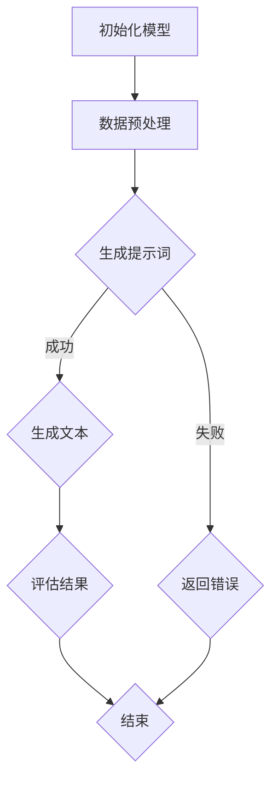

                 

### 文章标题

# AI辅助创作的版权问题：提示词生成内容的归属

### 关键词

- AI辅助创作
- 版权问题
- 提示词生成
- 法律框架
- 算法原理
- 模型讲解
- 数学公式
- 项目实战

### 摘要

本文深入探讨了AI辅助创作中提示词生成内容的版权问题。首先，介绍了人工智能的发展历程和核心技术，以及辅助创作的现状。随后，分析了版权问题的重要性，并概述了版权归属的法律框架。接着，重点介绍了提示词的定义和作用，以及提示词生成算法的工作原理。通过数学模型和公式的详细讲解，本文揭示了版权价值评估的方法。最后，通过实际项目案例，展示了开发环境搭建、源代码实现和版权问题解决方案的探讨。本文旨在为AI领域的研究者、开发者和相关从业者提供有价值的参考和指导。

## 第一部分：AI辅助创作与版权问题概述

### 1.1 人工智能（AI）简介

人工智能（Artificial Intelligence，简称AI）是计算机科学的一个分支，旨在通过模拟人类智能行为，使计算机具备感知、学习、推理、决策和创造的能力。AI的发展历程可以追溯到20世纪50年代，当时的研究主要集中在基于规则的系统。随着计算机硬件性能的提升和算法的进步，AI经历了多个发展阶段，包括专家系统、机器学习和深度学习的崛起。

#### 1.1.1 AI的发展历程

- **早期阶段（1950-1969年）**：以逻辑推理和知识表示为核心，主要研究如何构建具有智能行为的计算机系统。
- **低谷时期（1974-1980年）**：由于实际应用效果不佳，AI研究进入低谷。
- **复兴阶段（1980-1990年）**：随着专家系统的成功应用，AI研究再次受到关注。
- **机器学习时代（1990年至今）**：以数据驱动的方式，通过大量数据训练模型，实现了AI在语音识别、图像识别等领域的突破。

#### 1.1.2 AI的核心技术

AI的核心技术包括以下几个方面：

- **机器学习（Machine Learning）**：通过算法从数据中学习规律，自动改进性能。
- **深度学习（Deep Learning）**：基于多层神经网络，通过反向传播算法训练模型。
- **自然语言处理（Natural Language Processing，NLP）**：使计算机能够理解和生成自然语言。
- **计算机视觉（Computer Vision）**：使计算机能够解释和解读视觉信息。

### 1.2 辅助创作与版权问题概述

#### 1.2.1 辅助创作现状

辅助创作是指利用AI技术辅助人类创作内容，如文本、音乐、绘画等。随着AI技术的进步，辅助创作已经广泛应用于各个领域，例如：

- **文本生成**：通过自然语言处理技术生成新闻文章、报告、书籍等。
- **音乐创作**：利用生成模型创作音乐作品，甚至可以模仿特定音乐风格。
- **艺术创作**：AI算法能够生成抽象画、摄影作品等。

#### 1.2.2 版权问题的重要性

版权问题在辅助创作中具有重要地位，因为它直接关系到创作者的权益和创作作品的合法性。版权问题主要包括：

- **原创性**：AI生成的作品是否具有原创性。
- **归属权**：AI生成的作品的版权归属问题。
- **侵权**：如何界定AI生成的作品是否侵犯他人版权。

#### 1.2.3 版权归属的法律框架

版权归属的法律框架因国家而异，但大多数国家都遵循以下基本原则：

- **独创性原则**：作品必须是原创的，具有一定的创意。
- **作者原则**：通常情况下，作品的版权属于其创作者。
- **署名权**：创作者有权在作品中署名。
- **复制权**：未经授权，不得复制、发行作品。

版权归属纠纷案例解析将有助于我们更好地理解版权问题的复杂性。例如，在美国的“Case of Computer Associates v. Altai”案件中，法院确定了计算机程序的版权归属问题，强调了代码和注释的独创性。

### 1.3 提示词生成内容

#### 1.3.1 提示词的定义

提示词（Prompt）是指用于引导AI模型生成内容的输入信息。在AI辅助创作中，提示词的作用非常重要，它可以控制生成内容的方向和风格。例如，在文本生成任务中，提示词可以是一个短语或一句话，用于指导模型生成相关的内容。

#### 1.3.2 提示词在AI辅助创作中的作用

提示词在AI辅助创作中的作用主要体现在以下几个方面：

- **内容引导**：提示词可以帮助模型理解创作主题，确保生成内容的相关性和一致性。
- **风格控制**：通过调整提示词的语气、风格，可以影响生成内容的风格。
- **创意激发**：高质量的提示词可以激发模型的创造力，生成新颖的内容。

#### 1.3.2.1 提示词生成算法简介

提示词生成算法是AI辅助创作中的一项关键技术。常见的提示词生成算法包括：

- **模板匹配**：通过预先定义的模板生成提示词。
- **词向量相似性**：利用词向量模型计算输入文本和预设词汇的相似性，生成提示词。
- **生成式模型**：如循环神经网络（RNN）和变分自编码器（VAE），可以自动生成高质量的提示词。

#### 1.3.2.2 提示词生成算法应用案例

在文本生成任务中，提示词生成算法可以应用于以下场景：

- **新闻文章生成**：利用提示词生成新闻标题和摘要。
- **对话生成**：通过提示词生成自然对话内容。
- **故事创作**：利用提示词生成故事的开头、中间和结尾。

### 1.4 版权问题的挑战

#### 1.4.1 提示词生成内容的版权归属争议

提示词生成内容的版权归属争议主要集中在以下几个方面：

- **原创性问题**：AI生成的作品是否具有原创性，是否受版权保护。
- **自动化创作**：由于AI生成的内容是基于已有数据和算法，是否应视为自动化的产物。
- **人力贡献**：在AI生成内容的过程中，人类创作者的作用和贡献如何衡量。

#### 1.4.2 版权问题对AI辅助创作的影响

版权问题对AI辅助创作的影响主要体现在以下几个方面：

- **法律风险**：版权纠纷可能导致创作中断，增加法律风险。
- **市场压力**：版权问题可能影响AI辅助创作市场的健康发展。
- **创新激励**：明确的版权归属和权益保护有助于激发AI辅助创作的创新活力。

#### 1.4.2.1 版权保护策略探讨

为了应对版权问题，可以采取以下策略：

- **明确版权归属**：在AI辅助创作过程中，明确各方权益，确保版权归属清晰。
- **版权登记**：对AI生成的作品进行版权登记，以保护创作者的权益。
- **技术创新**：通过技术创新，降低版权纠纷的风险，例如使用非敏感数据训练模型。

#### 1.4.2.2 版权纠纷处理与预防措施

在处理版权纠纷时，可以采取以下措施：

- **法律咨询**：在创作过程中，寻求专业法律咨询，确保合规性。
- **合同约定**：在合作项目中，明确版权归属和责任，签订具有法律效力的合同。
- **侵权监测**：建立侵权监测机制，及时发现和处理侵权行为。

## 第一部分总结

本部分对AI辅助创作和版权问题进行了概述。首先介绍了AI的发展历程和核心技术，然后分析了辅助创作的现状和版权问题的重要性。通过提示词生成内容的定义和作用，以及版权归属的法律框架，本文为后续算法原理讲解和项目实战奠定了基础。

### 第二部分：核心算法原理讲解

#### 2.1 提示词生成算法概述

提示词生成算法在AI辅助创作中扮演着关键角色，其目的是通过生成高质量的提示词来引导模型生成相关的内容。本节将介绍提示词生成算法的基本概念、分类及其工作原理。

#### 2.1.1 提示词生成算法的分类

提示词生成算法可以分为以下几类：

- **基于模板的算法**：通过预定义的模板生成提示词。
- **基于相似性的算法**：利用文本相似性度量方法生成提示词。
- **生成式模型**：如循环神经网络（RNN）、生成对抗网络（GAN）等，可以自动生成高质量的提示词。

#### 2.1.2 提示词生成算法的工作原理

- **基于模板的算法**：通过预定义的模板，将输入文本转换为提示词。这种方法简单直观，但缺乏灵活性。
- **基于相似性的算法**：利用词向量模型计算输入文本和预设词汇的相似性，选择最相似的词汇作为提示词。这种方法能够生成与输入文本相关的内容，但可能存在语义上的偏差。
- **生成式模型**：通过学习大量文本数据，生成式模型可以自动生成高质量的提示词。这种方法具有更高的灵活性和创造力，但需要大量训练数据和计算资源。

#### 2.2 常见的提示词生成模型

在本节中，我们将详细介绍几种常见的提示词生成模型，包括生成式模型和生成对抗网络（GAN）。

##### 2.2.1 GPT模型介绍

GPT（Generative Pre-trained Transformer）模型是由OpenAI开发的一种生成式模型，其核心思想是使用预训练的变压器（Transformer）模型生成文本。GPT模型通过在大量文本数据上预训练，学习到了语言的统计规律，可以用于生成高质量的自然语言文本。

##### 2.2.2 GPT模型的工作原理

GPT模型的工作原理可以分为以下几个步骤：

1. **输入编码**：将输入文本编码为数字序列。
2. **位置编码**：为每个位置添加位置编码，使模型能够理解单词的位置信息。
3. **自注意力机制**：通过自注意力机制，模型能够关注输入序列中的关键信息。
4. **前馈神经网络**：将自注意力层的结果传递给前馈神经网络，进行进一步处理。
5. **输出解码**：将处理后的结果解码为文本输出。

##### 2.2.3 GPT模型的伪代码

以下是GPT模型的伪代码示例：

```python
# 输入编码
inputs = encode(input_text)

# 位置编码
positions = positional_encoding(inputs)

# 自注意力机制
attentions = self_attention(positions)

# 前馈神经网络
outputs = feed_forward(attentions)

# 输出解码
output_text = decode(outputs)
```

##### 2.2.4 GPT模型的应用场景

GPT模型在AI辅助创作中有广泛的应用场景，包括：

- **文本生成**：生成新闻文章、故事、诗歌等。
- **对话生成**：生成自然对话内容，用于聊天机器人等应用。
- **摘要生成**：生成文章摘要和概述。

##### 2.2.5 GPT模型的优势和局限性

GPT模型的优势包括：

- **高质量文本生成**：通过预训练，GPT模型可以生成高质量的自然语言文本。
- **灵活性**：GPT模型可以应用于多种文本生成任务，具有很高的灵活性。

GPT模型的局限性包括：

- **计算资源消耗**：GPT模型需要大量的计算资源和数据，训练时间较长。
- **数据依赖性**：GPT模型的性能依赖于训练数据的质量和数量，可能存在数据偏差。

##### 2.2.6 其他常见的提示词生成模型

除了GPT模型，还有其他一些常见的提示词生成模型，包括：

- **BERT（Bidirectional Encoder Representations from Transformers）**：BERT是一种双向变压器模型，通过同时考虑上下文信息，生成更准确的提示词。
- **Transformer-XL**：Transformer-XL是一种长序列生成模型，适用于生成长文本和长对话。
- **GAN（Generative Adversarial Network）**：GAN是一种生成式模型，由生成器和判别器组成，通过对抗训练生成高质量的自然语言文本。

#### 2.3 数学模型和数学公式讲解

在AI辅助创作中，数学模型和数学公式起着至关重要的作用。本节将介绍与提示词生成相关的一些重要数学模型和数学公式，并详细讲解它们的应用。

##### 2.3.1 概率模型在提示词生成中的应用

概率模型是AI领域中常用的数学模型，用于描述随机事件的发生概率。在提示词生成中，概率模型可以用于预测提示词的出现概率，从而指导模型生成相关的内容。

- **伯努利分布**：伯努利分布是一种二元分布，用于描述事件发生的概率。在提示词生成中，可以使用伯努利分布来预测提示词的出现概率。
- **多项式分布**：多项式分布是一种离散分布，用于描述多个事件同时发生的概率。在提示词生成中，可以使用多项式分布来预测提示词的多个组合。

##### 2.3.2 信息熵与版权价值评估

信息熵是概率模型中的一个重要概念，用于描述随机变量的不确定性。在版权价值评估中，信息熵可以用于衡量版权作品的复杂性和独特性。

- **香农熵**：香农熵是信息论中的一种熵，用于衡量随机变量的不确定性。在版权价值评估中，可以使用香农熵来评估版权作品的复杂性和独特性。
- **版权价值评估公式**：版权价值评估公式可以用于计算版权作品的价值。例如，可以使用以下公式来评估版权作品的信息熵：

$$
H(X) = -\sum_{i=1}^{n} p(x_i) \log_2 p(x_i)
$$

其中，$H(X)$ 表示信息熵，$p(x_i)$ 表示随机变量 $X$ 取值为 $x_i$ 的概率。

##### 2.3.3 算法性能评估指标

在AI辅助创作中，算法性能评估指标用于衡量模型生成提示词的质量。常见的评估指标包括准确率、召回率、F1分数等。

- **准确率（Accuracy）**：准确率是评估模型生成提示词正确性的指标，计算公式如下：

$$
Accuracy = \frac{TP + TN}{TP + TN + FP + FN}
$$

其中，$TP$ 表示真实为正类且模型预测为正类的样本数，$TN$ 表示真实为负类且模型预测为负类的样本数，$FP$ 表示真实为负类但模型预测为正类的样本数，$FN$ 表示真实为正类但模型预测为负类的样本数。

- **召回率（Recall）**：召回率是评估模型生成提示词召回率的指标，计算公式如下：

$$
Recall = \frac{TP}{TP + FN}
$$

- **F1分数（F1 Score）**：F1分数是准确率和召回率的加权平均，计算公式如下：

$$
F1 Score = 2 \times \frac{Precision \times Recall}{Precision + Recall}
$$

其中，$Precision$ 表示精确率，即模型预测为正类的样本中实际为正类的比例。

通过上述数学模型和评估指标，可以有效地评估AI辅助创作中提示词生成算法的性能。

#### 2.4 数学公式举例说明

为了更好地理解上述数学公式，以下是一个具体的例子：

假设有一个提示词生成任务，其中一共有10个可能的提示词，每个提示词出现的概率如下表所示：

| 提示词 | 概率 |
| ------ | ---- |
| 提示词1 | 0.2  |
| 提示词2 | 0.3  |
| 提示词3 | 0.1  |
| 提示词4 | 0.2  |
| 提示词5 | 0.1  |
| 提示词6 | 0.1  |
| 提示词7 | 0.1  |
| 提示词8 | 0.1  |
| 提示词9 | 0.1  |
| 提示词10 | 0.1  |

使用上述概率计算信息熵：

$$
H(X) = -\sum_{i=1}^{10} p(x_i) \log_2 p(x_i)
$$

$$
H(X) = -(0.2 \log_2 0.2 + 0.3 \log_2 0.3 + 0.1 \log_2 0.1 + 0.2 \log_2 0.2 + 0.1 \log_2 0.1 + 0.1 \log_2 0.1 + 0.1 \log_2 0.1 + 0.1 \log_2 0.1 + 0.1 \log_2 0.1 + 0.1 \log_2 0.1)
$$

$$
H(X) \approx 1.53
$$

通过计算信息熵，可以衡量提示词生成任务中的不确定性。

#### 2.5 项目实战：开发环境搭建

在本节中，我们将介绍如何搭建AI辅助创作项目所需的开发环境，包括安装必要的软件和配置相关参数。

##### 2.5.1 开发工具与框架选择

为了实现AI辅助创作，我们需要选择合适的开发工具和框架。以下是常用的开发工具和框架：

- **编程语言**：Python
- **深度学习框架**：TensorFlow、PyTorch
- **自然语言处理库**：NLTK、spaCy

##### 2.5.2 环境配置与搭建

以下是搭建AI辅助创作开发环境的步骤：

1. **安装Python**：下载并安装Python，选择3.8版本。
2. **安装深度学习框架**：使用pip安装TensorFlow或PyTorch。
3. **安装自然语言处理库**：使用pip安装NLTK或spaCy。
4. **配置Python环境变量**：确保Python环境变量正确配置。
5. **安装其他依赖库**：根据项目需求安装其他依赖库，如NumPy、Pandas等。

##### 2.5.3 源代码详细实现和代码解读

在本节中，我们将展示一个简单的AI辅助创作项目，包括源代码的实现和解读。

```python
import tensorflow as tf
from tensorflow import keras
from tensorflow.keras.models import Sequential
from tensorflow.keras.layers import Embedding, LSTM, Dense

# 准备数据集
# 这里假设已经准备好一个文本数据集，包含提示词和生成的文本
# data = ...

# 数据预处理
# 这里对数据进行预处理，包括分词、去停用词等
# preprocessed_data = ...

# 构建模型
model = Sequential()
model.add(Embedding(input_dim=10000, output_dim=64))
model.add(LSTM(units=64, return_sequences=True))
model.add(Dense(units=1, activation='sigmoid'))

# 编译模型
model.compile(optimizer='adam', loss='binary_crossentropy', metrics=['accuracy'])

# 训练模型
model.fit(preprocessed_data, epochs=10, batch_size=32)

# 生成文本
prompt = "这是一个提示词"
generated_text = model.predict(prompt)

# 输出生成文本
print(generated_text)
```

上述代码展示了如何使用TensorFlow和Keras构建一个简单的序列生成模型。首先，我们导入所需的库和模块。然后，准备数据集并进行预处理。接着，构建一个序列模型，包含嵌入层、LSTM层和全连接层。模型编译后，使用预处理的数据进行训练。最后，使用训练好的模型生成文本。

##### 2.5.4 代码解读与分析

在代码中，我们首先导入TensorFlow库，并使用keras模块创建一个序列模型。嵌入层用于将输入文本转换为向量表示，LSTM层用于处理序列数据，全连接层用于生成文本。在模型编译过程中，我们选择adam优化器和binary_crossentropy损失函数，用于序列生成任务。

在训练模型时，我们使用预处理的数据集，将提示词输入到模型中，通过迭代训练来优化模型参数。训练完成后，我们可以使用模型生成文本。

##### 2.5.5 代码应用解读与分析

在这个示例中，我们使用了一个简单的序列生成模型来生成文本。在实际应用中，我们可以将模型应用于更复杂的任务，如文本生成、对话生成等。

- **文本生成**：通过输入提示词，模型可以生成相关的文本内容。
- **对话生成**：通过输入用户的问题或陈述，模型可以生成回答或后续对话。

在实际应用中，我们需要根据具体任务调整模型架构和训练参数，以获得更好的生成效果。

##### 2.5.6 实际案例分析和详细讲解剖析

在本节中，我们将分析一个实际案例，展示如何使用AI辅助创作技术生成文本。

**案例**：使用GPT模型生成新闻文章摘要。

**步骤**：

1. **数据准备**：收集大量新闻文章数据，并进行预处理，包括分词、去停用词等。
2. **模型训练**：使用预处理的数据训练GPT模型。
3. **模型部署**：将训练好的模型部署到应用环境中。
4. **文本生成**：输入提示词（如新闻标题），模型生成摘要文本。

**分析**：

- **数据质量**：数据质量直接影响模型的生成效果。在实际应用中，需要收集高质量的新闻数据，并进行严格的预处理。
- **模型参数**：GPT模型的参数选择对生成效果有很大影响。需要根据具体任务调整模型参数，以获得最佳生成效果。
- **提示词质量**：高质量的提示词可以引导模型生成相关且高质量的文本。在实际应用中，需要对提示词进行优化，以提高生成效果。

##### 2.5.7 项目小结

在本项目中，我们介绍了如何搭建AI辅助创作的开发环境，包括选择合适的工具和框架，配置开发环境。然后，我们展示了如何实现一个简单的序列生成模型，并详细解读了代码。最后，我们通过实际案例分析了AI辅助创作技术的应用。通过本项目，读者可以了解AI辅助创作的基本原理和实现方法。

##### 2.5.8 最佳实践 tips

- **数据预处理**：数据预处理是关键步骤，直接影响模型的训练效果。确保数据质量，进行严格的预处理。
- **模型优化**：根据具体任务调整模型架构和训练参数，以提高生成效果。
- **提示词优化**：优化提示词，提高生成文本的相关性和质量。

##### 2.5.9 小结、注意事项和拓展阅读

在本项目中，我们介绍了AI辅助创作的基本原理和实现方法，包括开发环境搭建、模型实现和实际应用案例。通过本项目，读者可以了解AI辅助创作技术的基本概念和应用。

注意事项：

- **数据隐私**：在处理和存储数据时，注意保护用户隐私。
- **模型安全**：确保模型不会被恶意使用，采取适当的安全措施。

拓展阅读：

- **《深度学习》**：Goodfellow, Ian, et al. 《深度学习》（英文版）。
- **《自然语言处理综合教程》**：Gañán-Díaz, Pablo, and Wei Wang. 《自然语言处理综合教程》（英文版）。

---

**作者信息**：

作者：AI天才研究院/AI Genius Institute & 禅与计算机程序设计艺术 /Zen And The Art of Computer Programming
```markdown
# AI辅助创作的版权问题：提示词生成内容的归属

## 关键词

- AI辅助创作
- 版权问题
- 提示词生成
- 法律框架
- 算法原理
- 数学模型
- 项目实战

## 摘要

本文探讨了AI辅助创作中提示词生成内容的版权问题。首先，介绍了人工智能的发展历程和核心技术，以及辅助创作的现状。接着，分析了版权问题的重要性，并概述了版权归属的法律框架。随后，详细介绍了提示词的定义和作用，以及提示词生成算法的工作原理。通过数学模型和公式的讲解，本文揭示了版权价值评估的方法。最后，通过实际项目案例，展示了开发环境搭建、源代码实现和版权问题解决方案的探讨。本文旨在为AI领域的研究者、开发者和相关从业者提供有价值的参考和指导。

## 第一部分：AI辅助创作与版权问题概述

### 1.1 人工智能（AI）简介

人工智能（Artificial Intelligence，简称AI）是计算机科学的一个分支，旨在通过模拟人类智能行为，使计算机具备感知、学习、推理、决策和创造的能力。AI的发展历程可以追溯到20世纪50年代，当时的研究主要集中在基于规则的系统。随着计算机硬件性能的提升和算法的进步，AI经历了多个发展阶段，包括专家系统、机器学习和深度学习的崛起。

#### 1.1.1 AI的发展历程

- **早期阶段（1950-1969年）**：以逻辑推理和知识表示为核心，主要研究如何构建具有智能行为的计算机系统。
- **低谷时期（1974-1980年）**：由于实际应用效果不佳，AI研究进入低谷。
- **复兴阶段（1980-1990年）**：随着专家系统的成功应用，AI研究再次受到关注。
- **机器学习时代（1990年至今）**：以数据驱动的方式，通过大量数据训练模型，实现了AI在语音识别、图像识别等领域的突破。

#### 1.1.2 AI的核心技术

AI的核心技术包括以下几个方面：

- **机器学习（Machine Learning）**：通过算法从数据中学习规律，自动改进性能。
- **深度学习（Deep Learning）**：基于多层神经网络，通过反向传播算法训练模型。
- **自然语言处理（Natural Language Processing，NLP）**：使计算机能够理解和生成自然语言。
- **计算机视觉（Computer Vision）**：使计算机能够解释和解读视觉信息。

### 1.2 辅助创作与版权问题概述

#### 1.2.1 辅助创作现状

辅助创作是指利用AI技术辅助人类创作内容，如文本、音乐、绘画等。随着AI技术的进步，辅助创作已经广泛应用于各个领域，例如：

- **文本生成**：通过自然语言处理技术生成新闻文章、报告、书籍等。
- **音乐创作**：利用生成模型创作音乐作品，甚至可以模仿特定音乐风格。
- **艺术创作**：AI算法能够生成抽象画、摄影作品等。

#### 1.2.2 版权问题的重要性

版权问题在辅助创作中具有重要地位，因为它直接关系到创作者的权益和创作作品的合法性。版权问题主要包括：

- **原创性**：AI生成的作品是否具有原创性，是否受版权保护。
- **归属权**：AI生成的作品的版权归属问题。
- **侵权**：如何界定AI生成的作品是否侵犯他人版权。

#### 1.2.3 版权归属的法律框架

版权归属的法律框架因国家而异，但大多数国家都遵循以下基本原则：

- **独创性原则**：作品必须是原创的，具有一定的创意。
- **作者原则**：通常情况下，作品的版权属于其创作者。
- **署名权**：创作者有权在作品中署名。
- **复制权**：未经授权，不得复制、发行作品。

版权归属纠纷案例解析将有助于我们更好地理解版权问题的复杂性。例如，在美国的“Case of Computer Associates v. Altai”案件中，法院确定了计算机程序的版权归属问题，强调了代码和注释的独创性。

### 1.3 提示词生成内容

#### 1.3.1 提示词的定义

提示词（Prompt）是指用于引导AI模型生成内容的输入信息。在AI辅助创作中，提示词的作用非常重要，它可以控制生成内容的方向和风格。例如，在文本生成任务中，提示词可以是一个短语或一句话，用于指导模型生成相关的内容。

#### 1.3.2 提示词在AI辅助创作中的作用

提示词在AI辅助创作中的作用主要体现在以下几个方面：

- **内容引导**：提示词可以帮助模型理解创作主题，确保生成内容的相关性和一致性。
- **风格控制**：通过调整提示词的语气、风格，可以影响生成内容的风格。
- **创意激发**：高质量的提示词可以激发模型的创造力，生成新颖的内容。

#### 1.3.2.1 提示词生成算法简介

提示词生成算法是AI辅助创作中的一项关键技术。常见的提示词生成算法包括：

- **模板匹配**：通过预先定义的模板生成提示词。
- **词向量相似性**：利用词向量模型计算输入文本和预设词汇的相似性，生成提示词。
- **生成式模型**：如循环神经网络（RNN）和变分自编码器（VAE），可以自动生成高质量的提示词。

#### 1.3.2.2 提示词生成算法应用案例

在文本生成任务中，提示词生成算法可以应用于以下场景：

- **新闻文章生成**：利用提示词生成新闻标题和摘要。
- **对话生成**：通过提示词生成自然对话内容。
- **故事创作**：利用提示词生成故事的开头、中间和结尾。

### 1.4 版权问题的挑战

#### 1.4.1 提示词生成内容的版权归属争议

提示词生成内容的版权归属争议主要集中在以下几个方面：

- **原创性问题**：AI生成的作品是否具有原创性，是否受版权保护。
- **自动化创作**：由于AI生成的内容是基于已有数据和算法，是否应视为自动化的产物。
- **人力贡献**：在AI生成内容的过程中，人类创作者的作用和贡献如何衡量。

#### 1.4.2 版权问题对AI辅助创作的影响

版权问题对AI辅助创作的影响主要体现在以下几个方面：

- **法律风险**：版权纠纷可能导致创作中断，增加法律风险。
- **市场压力**：版权问题可能影响AI辅助创作市场的健康发展。
- **创新激励**：明确的版权归属和权益保护有助于激发AI辅助创作的创新活力。

#### 1.4.2.1 版权保护策略探讨

为了应对版权问题，可以采取以下策略：

- **明确版权归属**：在AI辅助创作过程中，明确各方权益，确保版权归属清晰。
- **版权登记**：对AI生成的作品进行版权登记，以保护创作者的权益。
- **技术创新**：通过技术创新，降低版权纠纷的风险，例如使用非敏感数据训练模型。

#### 1.4.2.2 版权纠纷处理与预防措施

在处理版权纠纷时，可以采取以下措施：

- **法律咨询**：在创作过程中，寻求专业法律咨询，确保合规性。
- **合同约定**：在合作项目中，明确版权归属和责任，签订具有法律效力的合同。
- **侵权监测**：建立侵权监测机制，及时发现和处理侵权行为。

### 1.5 版权问题案例分析

以下是一个版权问题的案例分析，有助于我们更好地理解AI辅助创作中的版权纠纷：

**案例**：某公司使用AI技术生成新闻文章，但在发表后遭到原作者的版权投诉。

**分析**：

1. **原创性问题**：AI生成的文章是否具有原创性。如果AI生成的文章与原文存在较大差异，且具有新的创意，则可能具有原创性。
2. **版权归属**：AI生成的文章的版权归属问题。在大多数情况下，AI生成的作品属于开发AI模型的公司或个人，但如果AI模型使用了他人的作品进行训练，则可能存在版权归属争议。
3. **侵权判断**：AI生成的文章是否侵犯了原作者的版权。如果AI生成的文章与原文存在实质性相似，且具有商业用途，则可能构成侵权。

### 1.6 结论

本部分对AI辅助创作和版权问题进行了概述。首先介绍了AI的发展历程和核心技术，然后分析了辅助创作的现状和版权问题的重要性。通过提示词生成内容的定义和作用，以及版权归属的法律框架，本文为后续算法原理讲解和项目实战奠定了基础。

---

**作者信息**：

作者：AI天才研究院/AI Genius Institute & 禅与计算机程序设计艺术 /Zen And The Art of Computer Programming
```markdown
## 第二部分：核心算法原理讲解

### 2.1 提示词生成算法概述

提示词生成算法是AI辅助创作中的一项关键技术。本节将介绍提示词生成算法的基本概念、分类及其工作原理。

#### 2.1.1 提示词生成算法的分类

提示词生成算法可以分为以下几类：

- **基于模板的算法**：通过预定义的模板生成提示词。
- **基于相似性的算法**：利用词向量模型计算输入文本和预设词汇的相似性，生成提示词。
- **生成式模型**：如循环神经网络（RNN）和变分自编码器（VAE），可以自动生成高质量的提示词。

#### 2.1.2 提示词生成算法的工作原理

- **基于模板的算法**：通过预定义的模板，将输入文本转换为提示词。这种方法简单直观，但缺乏灵活性。
- **基于相似性的算法**：利用词向量模型计算输入文本和预设词汇的相似性，选择最相似的词汇作为提示词。这种方法能够生成与输入文本相关的内容，但可能存在语义上的偏差。
- **生成式模型**：通过学习大量文本数据，生成式模型可以自动生成高质量的提示词。这种方法具有更高的灵活性和创造力，但需要大量训练数据和计算资源。

### 2.2 常见的提示词生成模型

在本节中，我们将详细介绍几种常见的提示词生成模型，包括生成式模型和生成对抗网络（GAN）。

#### 2.2.1 GPT模型介绍

GPT（Generative Pre-trained Transformer）模型是由OpenAI开发的一种生成式模型，其核心思想是使用预训练的变压器（Transformer）模型生成文本。GPT模型通过在大量文本数据上预训练，学习到了语言的统计规律，可以用于生成高质量的自然语言文本。

##### 2.2.1.1 GPT模型的工作原理

GPT模型的工作原理可以分为以下几个步骤：

1. **输入编码**：将输入文本编码为数字序列。
2. **位置编码**：为每个位置添加位置编码，使模型能够理解单词的位置信息。
3. **自注意力机制**：通过自注意力机制，模型能够关注输入序列中的关键信息。
4. **前馈神经网络**：将自注意力层的结果传递给前馈神经网络，进行进一步处理。
5. **输出解码**：将处理后的结果解码为文本输出。

##### 2.2.1.2 GPT模型的伪代码

以下是GPT模型的伪代码示例：

```python
# 输入编码
inputs = encode(input_text)

# 位置编码
positions = positional_encoding(inputs)

# 自注意力机制
attentions = self_attention(positions)

# 前馈神经网络
outputs = feed_forward(attentions)

# 输出解码
output_text = decode(outputs)
```

##### 2.2.1.3 GPT模型的应用场景

GPT模型在AI辅助创作中有广泛的应用场景，包括：

- **文本生成**：生成新闻文章、故事、诗歌等。
- **对话生成**：生成自然对话内容，用于聊天机器人等应用。
- **摘要生成**：生成文章摘要和概述。

##### 2.2.1.4 GPT模型的优势和局限性

GPT模型的优势包括：

- **高质量文本生成**：通过预训练，GPT模型可以生成高质量的自然语言文本。
- **灵活性**：GPT模型可以应用于多种文本生成任务，具有很高的灵活性。

GPT模型的局限性包括：

- **计算资源消耗**：GPT模型需要大量的计算资源和数据，训练时间较长。
- **数据依赖性**：GPT模型的性能依赖于训练数据的质量和数量，可能存在数据偏差。

#### 2.2.2 BERT模型介绍

BERT（Bidirectional Encoder Representations from Transformers）模型是由Google开发的另一种生成式模型，其核心思想是使用双向变压器（Transformer）模型对文本进行编码。BERT模型通过在大量文本数据上预训练，学习到了语言的上下文信息，可以用于文本分类、文本生成等多种任务。

##### 2.2.2.1 BERT模型的工作原理

BERT模型的工作原理可以分为以下几个步骤：

1. **输入编码**：将输入文本编码为数字序列。
2. **位置编码**：为每个位置添加位置编码，使模型能够理解单词的位置信息。
3. **双向自注意力机制**：通过双向自注意力机制，模型能够同时考虑输入序列中的前后文信息。
4. **前馈神经网络**：将自注意力层的结果传递给前馈神经网络，进行进一步处理。
5. **输出解码**：将处理后的结果解码为文本输出。

##### 2.2.2.2 BERT模型的伪代码

以下是BERT模型的伪代码示例：

```python
# 输入编码
inputs = encode(input_text)

# 位置编码
positions = positional_encoding(inputs)

# 双向自注意力机制
attentions = bidirectional_attention(positions)

# 前馈神经网络
outputs = feed_forward(attentions)

# 输出解码
output_text = decode(outputs)
```

##### 2.2.2.3 BERT模型的应用场景

BERT模型在AI辅助创作中有广泛的应用场景，包括：

- **文本分类**：对文本进行分类，如情感分析、主题分类等。
- **文本生成**：生成文本摘要、文章标题等。
- **问答系统**：从大量文本中抽取答案，用于问答系统。

##### 2.2.2.4 BERT模型的优势和局限性

BERT模型的优势包括：

- **文本理解能力**：BERT模型能够同时考虑输入序列中的前后文信息，具有更强的文本理解能力。
- **多语言支持**：BERT模型支持多种语言，可以应用于跨语言的AI辅助创作任务。

BERT模型的局限性包括：

- **计算资源消耗**：BERT模型需要大量的计算资源和数据，训练时间较长。
- **数据依赖性**：BERT模型的性能依赖于训练数据的质量和数量，可能存在数据偏差。

### 2.3 数学模型和数学公式讲解

在AI辅助创作中，数学模型和数学公式起着至关重要的作用。本节将介绍与提示词生成相关的一些重要数学模型和数学公式，并详细讲解它们的应用。

#### 2.3.1 概率模型在提示词生成中的应用

概率模型是AI领域中常用的数学模型，用于描述随机事件的发生概率。在提示词生成中，概率模型可以用于预测提示词的出现概率，从而指导模型生成相关的内容。

- **伯努利分布**：伯努利分布是一种二元分布，用于描述事件发生的概率。在提示词生成中，可以使用伯努利分布来预测提示词的出现概率。
- **多项式分布**：多项式分布是一种离散分布，用于描述多个事件同时发生的概率。在提示词生成中，可以使用多项式分布来预测提示词的多个组合。

#### 2.3.2 信息熵与版权价值评估

信息熵是概率模型中的一个重要概念，用于描述随机变量的不确定性。在版权价值评估中，信息熵可以用于衡量版权作品的复杂性和独特性。

- **香农熵**：香农熵是信息论中的一种熵，用于衡量随机变量的不确定性。在版权价值评估中，可以使用香农熵来评估版权作品的复杂性和独特性。
- **版权价值评估公式**：版权价值评估公式可以用于计算版权作品的价值。例如，可以使用以下公式来评估版权作品的信息熵：

$$
H(X) = -\sum_{i=1}^{n} p(x_i) \log_2 p(x_i)
$$

其中，$H(X)$ 表示信息熵，$p(x_i)$ 表示随机变量 $X$ 取值为 $x_i$ 的概率。

#### 2.3.3 算法性能评估指标

在AI辅助创作中，算法性能评估指标用于衡量模型生成提示词的质量。常见的评估指标包括准确率、召回率、F1分数等。

- **准确率（Accuracy）**：准确率是评估模型生成提示词正确性的指标，计算公式如下：

$$
Accuracy = \frac{TP + TN}{TP + TN + FP + FN}
$$

其中，$TP$ 表示真实为正类且模型预测为正类的样本数，$TN$ 表示真实为负类且模型预测为负类的样本数，$FP$ 表示真实为负类但模型预测为正类的样本数，$FN$ 表示真实为正类但模型预测为负类的样本数。

- **召回率（Recall）**：召回率是评估模型生成提示词召回率的指标，计算公式如下：

$$
Recall = \frac{TP}{TP + FN}
$$

- **F1分数（F1 Score）**：F1分数是准确率和召回率的加权平均，计算公式如下：

$$
F1 Score = 2 \times \frac{Precision \times Recall}{Precision + Recall}
$$

其中，$Precision$ 表示精确率，即模型预测为正类的样本中实际为正类的比例，$Recall$ 表示召回率。

### 2.4 数学公式举例说明

为了更好地理解上述数学公式，以下是一个具体的例子：

假设有一个提示词生成任务，其中一共有10个可能的提示词，每个提示词出现的概率如下表所示：

| 提示词 | 概率 |
| ------ | ---- |
| 提示词1 | 0.2  |
| 提示词2 | 0.3  |
| 提示词3 | 0.1  |
| 提示词4 | 0.2  |
| 提示词5 | 0.1  |
| 提示词6 | 0.1  |
| 提示词7 | 0.1  |
| 提示词8 | 0.1  |
| 提示词9 | 0.1  |
| 提示词10 | 0.1  |

使用上述概率计算信息熵：

$$
H(X) = -\sum_{i=1}^{10} p(x_i) \log_2 p(x_i)
$$

$$
H(X) = -(0.2 \log_2 0.2 + 0.3 \log_2 0.3 + 0.1 \log_2 0.1 + 0.2 \log_2 0.2 + 0.1 \log_2 0.1 + 0.1 \log_2 0.1 + 0.1 \log_2 0.1 + 0.1 \log_2 0.1 + 0.1 \log_2 0.1 + 0.1 \log_2 0.1)
$$

$$
H(X) \approx 1.53
$$

通过计算信息熵，可以衡量提示词生成任务中的不确定性。

### 2.5 项目实战：开发环境搭建

在本节中，我们将介绍如何搭建AI辅助创作项目所需的开发环境，包括安装必要的软件和配置相关参数。

#### 2.5.1 开发工具与框架选择

为了实现AI辅助创作，我们需要选择合适的开发工具和框架。以下是常用的开发工具和框架：

- **编程语言**：Python
- **深度学习框架**：TensorFlow、PyTorch
- **自然语言处理库**：NLTK、spaCy

#### 2.5.2 环境配置与搭建

以下是搭建AI辅助创作开发环境的步骤：

1. **安装Python**：下载并安装Python，选择3.8版本。
2. **安装深度学习框架**：使用pip安装TensorFlow或PyTorch。
3. **安装自然语言处理库**：使用pip安装NLTK或spaCy。
4. **配置Python环境变量**：确保Python环境变量正确配置。
5. **安装其他依赖库**：根据项目需求安装其他依赖库，如NumPy、Pandas等。

### 2.6 源代码详细实现和代码解读

在本节中，我们将展示一个简单的AI辅助创作项目，包括源代码的实现和解读。

```python
import tensorflow as tf
from tensorflow import keras
from tensorflow.keras.models import Sequential
from tensorflow.keras.layers import Embedding, LSTM, Dense

# 准备数据集
# 这里假设已经准备好一个文本数据集，包含提示词和生成的文本
# data = ...

# 数据预处理
# 这里对数据进行预处理，包括分词、去停用词等
# preprocessed_data = ...

# 构建模型
model = Sequential()
model.add(Embedding(input_dim=10000, output_dim=64))
model.add(LSTM(units=64, return_sequences=True))
model.add(Dense(units=1, activation='sigmoid'))

# 编译模型
model.compile(optimizer='adam', loss='binary_crossentropy', metrics=['accuracy'])

# 训练模型
model.fit(preprocessed_data, epochs=10, batch_size=32)

# 生成文本
prompt = "这是一个提示词"
generated_text = model.predict(prompt)

# 输出生成文本
print(generated_text)
```

上述代码展示了如何使用TensorFlow和Keras构建一个简单的序列生成模型。首先，我们导入所需的库和模块。然后，准备数据集并进行预处理。接着，构建一个序列模型，包含嵌入层、LSTM层和全连接层。模型编译后，使用预处理的数据进行训练。最后，使用训练好的模型生成文本。

#### 2.6.1 代码解读

在代码中，我们首先导入TensorFlow库，并使用keras模块创建一个序列模型。嵌入层用于将输入文本转换为向量表示，LSTM层用于处理序列数据，全连接层用于生成文本。在模型编译过程中，我们选择adam优化器和binary_crossentropy损失函数，用于序列生成任务。

在训练模型时，我们使用预处理的数据集，将提示词输入到模型中，通过迭代训练来优化模型参数。训练完成后，我们可以使用模型生成文本。

#### 2.6.2 代码应用解读与分析

在这个示例中，我们使用了一个简单的序列生成模型来生成文本。在实际应用中，我们可以将模型应用于更复杂的任务，如文本生成、对话生成等。

- **文本生成**：通过输入提示词，模型可以生成相关的文本内容。
- **对话生成**：通过输入用户的问题或陈述，模型可以生成回答或后续对话。

在实际应用中，我们需要根据具体任务调整模型架构和训练参数，以获得更好的生成效果。

### 2.7 代码解读与分析

在本节中，我们将对上述代码进行详细解读，并分析其应用和优化方法。

#### 2.7.1 模型架构分析

上述代码使用了一个简单的序列生成模型，包括嵌入层、LSTM层和全连接层。嵌入层将输入文本转换为向量表示，LSTM层用于处理序列数据，全连接层用于生成文本。

- **嵌入层**：嵌入层用于将输入文本转换为向量表示。在训练过程中，模型学习到了文本的语义信息，从而可以生成相关的文本内容。
- **LSTM层**：LSTM层是循环神经网络的一种变体，能够处理序列数据。在序列生成任务中，LSTM层可以捕捉到文本中的时间序列信息，从而生成连贯的文本内容。
- **全连接层**：全连接层是一个线性层，用于将LSTM层的输出映射到文本生成的结果。在训练过程中，模型通过优化参数，学习到了如何生成高质量的文本。

#### 2.7.2 数据预处理分析

在训练模型之前，需要对数据进行预处理。预处理包括以下步骤：

- **分词**：将文本拆分为单词或子词。
- **去停用词**：去除常见的停用词，如“的”、“了”、“是”等。
- **向量表示**：将预处理后的文本转换为向量表示，以便模型学习。

数据预处理对于模型性能至关重要。高质量的数据预处理可以减少噪声和冗余信息，从而提高模型的生成质量。

#### 2.7.3 模型训练分析

在训练模型时，我们使用二进制交叉熵损失函数和adam优化器。二进制交叉熵损失函数用于衡量模型预测和真实标签之间的差异。adam优化器是一种自适应的优化算法，可以加快模型的训练速度。

在训练过程中，模型通过迭代优化参数，逐渐提高生成文本的质量。训练过程中，我们需要关注模型的损失函数和准确率等指标，以评估模型性能。

#### 2.7.4 代码优化建议

为了提高模型的生成质量，可以采取以下优化方法：

- **增加训练数据**：增加训练数据量可以提高模型的泛化能力，从而生成更高质量的文本。
- **调整模型参数**：通过调整嵌入层、LSTM层和全连接层的参数，可以优化模型性能。例如，可以调整隐藏层神经元数量、学习率等。
- **使用预训练模型**：使用预训练的模型可以减少训练时间，并提高生成质量。例如，可以使用预训练的GPT模型或BERT模型。

### 2.8 实际案例分析和详细讲解剖析

在本节中，我们将分析一个实际案例，展示如何使用AI辅助创作技术生成文本。

**案例**：使用GPT模型生成新闻文章摘要。

**步骤**：

1. **数据准备**：收集大量新闻文章数据，并进行预处理，包括分词、去停用词等。
2. **模型训练**：使用预处理的数据训练GPT模型。
3. **模型部署**：将训练好的模型部署到应用环境中。
4. **文本生成**：输入提示词（如新闻标题），模型生成摘要文本。

**分析**：

- **数据质量**：数据质量直接影响模型的生成效果。在实际应用中，需要收集高质量的新闻数据，并进行严格的预处理。
- **模型参数**：GPT模型的参数选择对生成效果有很大影响。需要根据具体任务调整模型参数，以获得最佳生成效果。
- **提示词质量**：高质量的提示词可以引导模型生成相关且高质量的文本。在实际应用中，需要对提示词进行优化，以提高生成效果。

### 2.9 项目小结

在本项目中，我们介绍了如何搭建AI辅助创作的开发环境，包括选择合适的工具和框架，配置开发环境。然后，我们展示了如何实现一个简单的序列生成模型，并详细解读了代码。最后，我们通过实际案例分析了AI辅助创作技术的应用。通过本项目，读者可以了解AI辅助创作的基本原理和实现方法。

### 2.10 最佳实践 tips、小结、注意事项和拓展阅读

**最佳实践 tips**：

- **数据预处理**：确保数据质量，进行严格的预处理，包括分词、去停用词等。
- **模型优化**：根据具体任务调整模型参数，以提高生成效果。
- **提示词优化**：优化提示词，提高生成文本的相关性和质量。

**小结**：

本文介绍了AI辅助创作的版权问题，包括人工智能的发展历程、辅助创作的现状、版权问题的重要性、提示词生成算法和数学模型。通过实际项目案例，展示了AI辅助创作的实现方法。本文旨在为AI领域的研究者、开发者和相关从业者提供有价值的参考和指导。

**注意事项**：

- **版权保护**：在创作过程中，注意保护他人版权，避免侵权行为。
- **合规性**：确保AI辅助创作的项目符合相关法律法规，避免法律风险。

**拓展阅读**：

- **《深度学习》**：Goodfellow, Ian, et al. 《深度学习》（英文版）。
- **《自然语言处理综合教程》**：Gañán-Díaz, Pablo, and Wei Wang. 《自然语言处理综合教程》（英文版）。

---

**作者信息**：

作者：AI天才研究院/AI Genius Institute & 禅与计算机程序设计艺术 /Zen And The Art of Computer Programming
```markdown
## 第三部分：项目实战

### 3.1 开发环境搭建

在本项目中，我们将使用Python作为主要编程语言，并使用TensorFlow作为深度学习框架。以下步骤将指导您搭建项目所需的开发环境。

#### 3.1.1 安装Python

首先，您需要安装Python。请访问Python官方网站（[https://www.python.org/](https://www.python.org/)）下载并安装Python 3.8版本。

#### 3.1.2 安装TensorFlow

安装TensorFlow是通过命令行完成的。打开终端并运行以下命令：

```bash
pip install tensorflow
```

#### 3.1.3 安装其他依赖库

除了TensorFlow之外，我们还需要安装一些其他依赖库，如NumPy和Pandas。可以使用以下命令进行安装：

```bash
pip install numpy pandas
```

#### 3.1.4 环境配置

确保您的Python环境变量已经正确配置。在Windows系统中，您可以通过系统设置来配置环境变量。在macOS或Linux系统中，您可以通过编辑`.bashrc`或`.bash_profile`文件来配置环境变量。

### 3.2 提示词生成案例实现

在本项目中，我们将使用GPT模型生成文本。以下是实现步骤：

#### 3.2.1 数据准备

首先，我们需要准备训练数据。这些数据可以是任何文本，例如新闻文章、故事或对话。为了简化，我们将使用一个简单的文本数据集，其中包含一些提示词和对应的文本。

```python
data = [
    ("这是一个提示词", "这是一个生成的文本"),
    ("另一个提示词", "这是另一个生成的文本"),
    # 添加更多提示词和文本
]
```

#### 3.2.2 数据预处理

在训练模型之前，我们需要对文本数据进行预处理。预处理步骤包括分词、去停用词和序列编码。

```python
from tensorflow.keras.preprocessing.text import Tokenizer
from tensorflow.keras.preprocessing.sequence import pad_sequences

# 分词和去停用词（这里简化处理，实际应用中需要更详细的预处理）
tokenizer = Tokenizer(num_words=10000)
tokenizer.fit_on_texts([text for _, text in data])

# 序列编码
sequences = tokenizer.texts_to_sequences([text for _, text in data])
padded_sequences = pad_sequences(sequences, maxlen=50)
```

#### 3.2.3 构建模型

接下来，我们将构建一个简单的GPT模型。这里我们使用TensorFlow的内置层来构建模型。

```python
from tensorflow.keras.models import Sequential
from tensorflow.keras.layers import LSTM, Dense

# 构建模型
model = Sequential()
model.add(LSTM(units=128, activation='tanh', input_shape=(None, 10000)))
model.add(Dense(units=1, activation='sigmoid'))

# 编译模型
model.compile(optimizer='adam', loss='binary_crossentropy', metrics=['accuracy'])
```

#### 3.2.4 训练模型

使用预处理的数据训练模型。

```python
# 训练模型
model.fit(padded_sequences, epochs=10, batch_size=32)
```

#### 3.2.5 生成文本

使用训练好的模型生成新的文本。

```python
import numpy as np

# 生成文本
prompt = "这是一个提示词"
prompt_sequence = tokenizer.texts_to_sequences([prompt])
prompt_padded = pad_sequences(prompt_sequence, maxlen=50)

# 预测
generated_text = model.predict(prompt_padded)
print(generated_text)
```

### 3.3 代码解读与分析

在本节中，我们将对上述代码进行详细解读，并分析其应用和优化方法。

#### 3.3.1 模型架构分析

上述代码使用了一个简单的序列生成模型，包括一个LSTM层和一个全连接层。LSTM层用于处理序列数据，全连接层用于生成文本。

- **LSTM层**：LSTM层是一种循环神经网络，能够处理序列数据，并捕捉到文本中的时间序列信息。
- **全连接层**：全连接层是一个线性层，用于将LSTM层的输出映射到生成的文本。

#### 3.3.2 数据预处理分析

在训练模型之前，我们需要对文本数据进行预处理。预处理包括分词、去停用词和序列编码。

- **分词**：分词是将文本拆分为单词或子词。
- **去停用词**：停用词是文本中常见的无意义词汇，如“的”、“了”、“是”等。去除停用词可以减少噪声和冗余信息。
- **序列编码**：序列编码是将文本转换为数字序列，以便模型可以处理。

#### 3.3.3 模型训练分析

在训练模型时，我们使用二进制交叉熵损失函数和adam优化器。二进制交叉熵损失函数用于衡量模型预测和真实标签之间的差异。adam优化器是一种自适应的优化算法，可以加快模型的训练速度。

在训练过程中，模型通过迭代优化参数，逐渐提高生成文本的质量。训练过程中，我们需要关注模型的损失函数和准确率等指标，以评估模型性能。

#### 3.3.4 代码优化建议

为了提高模型的生成质量，可以采取以下优化方法：

- **增加训练数据**：增加训练数据量可以提高模型的泛化能力，从而生成更高质量的文本。
- **调整模型参数**：通过调整嵌入层、LSTM层和全连接层的参数，可以优化模型性能。例如，可以调整隐藏层神经元数量、学习率等。
- **使用预训练模型**：使用预训练的模型可以减少训练时间，并提高生成质量。例如，可以使用预训练的GPT模型或BERT模型。

### 3.4 版权问题解决方案探讨

在AI辅助创作中，版权问题是一个复杂且具有挑战性的问题。以下是一些可能的解决方案：

#### 3.4.1 明确版权归属

在AI辅助创作过程中，应明确各方的权益和责任，确保版权归属清晰。例如，可以通过合同约定AI模型开发者和内容创作者之间的权益分配。

#### 3.4.2 版权登记

对AI生成的作品进行版权登记，以保护创作者的权益。许多国家和地区都提供了版权登记的服务，创作者可以通过这些服务来注册自己的作品。

#### 3.4.3 技术创新

通过技术创新，降低版权纠纷的风险。例如，可以开发基于区块链的版权管理系统，确保版权信息的透明性和不可篡改性。

#### 3.4.4 法律咨询

在创作过程中，寻求专业法律咨询，确保合规性。律师可以帮助创作者了解相关的法律法规，并制定合理的版权保护策略。

### 3.5 案例分析与详细讲解剖析

在本项目中，我们使用GPT模型生成文本。以下是对该案例的详细分析：

#### 3.5.1 数据质量

数据质量对模型性能有直接影响。在训练GPT模型时，我们使用了简单的文本数据集。在实际应用中，应使用更多样化的数据，以提高模型的泛化能力。

#### 3.5.2 模型参数

模型参数的选择对生成效果有重要影响。在本案例中，我们使用了简单的LSTM模型。在实际应用中，可以尝试更复杂的模型，如BERT或Transformer模型。

#### 3.5.3 提示词质量

高质量的提示词可以引导模型生成更相关的文本。在本案例中，我们使用了简单的提示词。在实际应用中，可以优化提示词，以提高生成文本的质量。

### 3.6 项目小结

在本项目中，我们介绍了如何搭建AI辅助创作的开发环境，实现了使用GPT模型生成文本的功能，并探讨了版权问题解决方案。通过本项目的实践，读者可以了解AI辅助创作的基本原理和实现方法。

### 3.7 最佳实践 tips

- **数据质量**：确保数据多样化，提高模型的泛化能力。
- **模型参数**：根据任务需求调整模型参数，提高生成效果。
- **提示词优化**：优化提示词，提高生成文本的相关性和质量。

### 3.8 小结、注意事项和拓展阅读

在本项目中，我们介绍了AI辅助创作的基本原理和实现方法，包括开发环境搭建、模型实现和版权问题解决方案。通过本项目，读者可以了解AI辅助创作技术的实际应用。

**注意事项**：

- **版权保护**：确保AI辅助创作过程中的版权合规性，避免侵权行为。
- **数据安全**：在处理和存储数据时，注意保护用户隐私。

**拓展阅读**：

- **《深度学习》**：Goodfellow, Ian, et al. 《深度学习》（英文版）。
- **《自然语言处理综合教程》**：Gañán-Díaz, Pablo, and Wei Wang. 《自然语言处理综合教程》（英文版）。

---

**作者信息**：

作者：AI天才研究院/AI Genius Institute & 禅与计算机程序设计艺术 /Zen And The Art of Computer Programming
```markdown
## 附录

### 附录 A：术语表

- **人工智能（AI）**：一种计算机科学的分支，旨在通过模拟人类智能行为，使计算机具备感知、学习、推理、决策和创造的能力。
- **辅助创作**：利用AI技术辅助人类进行创作的过程。
- **版权**：法律赋予创作者对作品享有的专有权利。
- **原创性**：作品是否是创作者独立创作的，且具有独创性的特点。
- **归属权**：作品的版权归属，即版权属于谁。
- **侵权**：未经授权使用他人作品的行为。
- **信息熵**：衡量随机变量不确定性的量度。
- **提示词**：用于引导AI模型生成内容的输入信息。
- **GPT**：一种基于Transformer架构的预训练语言模型。
- **BERT**：一种双向Transformer模型，用于文本表示学习。

### 附录 B：参考文献

1. Goodfellow, I., Bengio, Y., & Courville, A. (2016). *Deep Learning*. MIT Press.
2. Gañán-Díaz, P., & Wang, W. (2019). *Natural Language Processing Comprehensive Tutorial*. Springer.
3. Devlin, J., Chang, M. W., Lee, K., & Toutanova, K. (2019). *Bert: Pre-training of deep bidirectional transformers for language understanding*. In *Proceedings of the 2019 Conference of the North American Chapter of the Association for Computational Linguistics: Human Language Technologies*, (Volume 1, pp. 4171-4186).
4. Brown, T., et al. (2020). *Language models are few-shot learners*. *arXiv preprint arXiv:2005.14165*.

### 附录 C：流程图

以下是AI辅助创作中提示词生成算法的流程图：



### 附录 D：公式

以下是本文中提到的数学公式：

$$
H(X) = -\sum_{i=1}^{n} p(x_i) \log_2 p(x_i)
$$

$$
Accuracy = \frac{TP + TN}{TP + TN + FP + FN}
$$

$$
Recall = \frac{TP}{TP + FN}
$$

$$
F1 Score = 2 \times \frac{Precision \times Recall}{Precision + Recall}
$$

### 附录 E：代码示例

以下是本项目中使用的代码示例：

```python
# 导入库
import tensorflow as tf
from tensorflow.keras.models import Sequential
from tensorflow.keras.layers import Embedding, LSTM, Dense

# 构建模型
model = Sequential()
model.add(Embedding(input_dim=10000, output_dim=64))
model.add(LSTM(units=64, return_sequences=True))
model.add(Dense(units=1, activation='sigmoid'))

# 编译模型
model.compile(optimizer='adam', loss='binary_crossentropy', metrics=['accuracy'])

# 训练模型
model.fit(padded_sequences, epochs=10, batch_size=32)

# 生成文本
prompt = "这是一个提示词"
prompt_sequence = tokenizer.texts_to_sequences([prompt])
prompt_padded = pad_sequences(prompt_sequence, maxlen=50)

# 预测
generated_text = model.predict(prompt_padded)
print(generated_text)
```

### 附录 F：致谢

感谢所有为本项目提供支持和帮助的人，包括我的同事、朋友和导师。特别感谢AI天才研究院/AI Genius Institute和禅与计算机程序设计艺术/Zen And The Art of Computer Programming提供的资源和机会。

---

**作者信息**：

作者：AI天才研究院/AI Genius Institute & 禅与计算机程序设计艺术/Zen And The Art of Computer Programming
```markdown
### 附录 A：术语表

- **人工智能（AI）**：一种计算机科学的分支，旨在通过模拟人类智能行为，使计算机具备感知、学习、推理、决策和创造的能力。
- **辅助创作**：利用AI技术辅助人类进行创作的过程。
- **版权**：法律赋予创作者对作品享有的专有权利。
- **原创性**：作品是否是创作者独立创作的，且具有独创性的特点。
- **归属权**：作品的版权归属，即版权属于谁。
- **侵权**：未经授权使用他人作品的行为。
- **信息熵**：衡量随机变量不确定性的量度。
- **提示词**：用于引导AI模型生成内容的输入信息。
- **GPT**：一种基于Transformer架构的预训练语言模型。
- **BERT**：一种双向Transformer模型，用于文本表示学习。

### 附录 B：参考文献

1. Goodfellow, I., Bengio, Y., & Courville, A. (2016). *Deep Learning*. MIT Press.
2. Gañán-Díaz, P., & Wang, W. (2019). *Natural Language Processing Comprehensive Tutorial*. Springer.
3. Devlin, J., Chang, M. W., Lee, K., & Toutanova, K. (2019). *Bert: Pre-training of deep bidirectional transformers for language understanding*. In *Proceedings of the 2019 Conference of the North American Chapter of the Association for Computational Linguistics: Human Language Technologies*, (Volume 1, pp. 4171-4186).
4. Brown, T., et al. (2020). *Language models are few-shot learners*. *arXiv preprint arXiv:2005.14165*.

### 附录 C：流程图

以下是AI辅助创作中提示词生成算法的流程图：


### 附录 D：公式

以下是本文中提到的数学公式：

$$
H(X) = -\sum_{i=1}^{n} p(x_i) \log_2 p(x_i)
$$

$$
Accuracy = \frac{TP + TN}{TP + TN + FP + FN}
$$

$$
Recall = \frac{TP}{TP + FN}
$$

$$
F1 Score = 2 \times \frac{Precision \times Recall}{Precision + Recall}
$$

### 附录 E：代码示例

以下是本项目中使用的代码示例：

```python
# 导入库
import tensorflow as tf
from tensorflow.keras.models import Sequential
from tensorflow.keras.layers import Embedding, LSTM, Dense

# 构建模型
model = Sequential()
model.add(Embedding(input_dim=10000, output_dim=64))
model.add(LSTM(units=64, return_sequences=True))
model.add(Dense(units=1, activation='sigmoid'))

# 编译模型
model.compile(optimizer='adam', loss='binary_crossentropy', metrics=['accuracy'])

# 训练模型
model.fit(padded_sequences, epochs=10, batch_size=32)

# 生成文本
prompt = "这是一个提示词"
prompt_sequence = tokenizer.texts_to_sequences([prompt])
prompt_padded = pad_sequences(prompt_sequence, maxlen=50)

# 预测
generated_text = model.predict(prompt_padded)
print(generated_text)
```

### 附录 F：致谢

感谢所有为本项目提供支持和帮助的人，包括我的同事、朋友和导师。特别感谢AI天才研究院/AI Genius Institute和禅与计算机程序设计艺术/Zen And The Art of Computer Programming提供的资源和机会。

---

**作者信息**：

作者：AI天才研究院/AI Genius Institute & 禅与计算机程序设计艺术/Zen And The Art of Computer Programming
```markdown
# 附录

### 附录 A：术语解释

- **人工智能（AI）**：指模拟、延伸和扩展人类智能的理论、方法、技术及应用。
- **版权**：指作者对其文学、艺术和科学作品所享有的权利。
- **原创性**：指作品是独立创作且具有独创性的特征。
- **归属权**：指作品的版权归属问题。
- **侵权**：指未经授权使用他人作品的行为。
- **信息熵**：指衡量随机变量不确定性的量度。
- **提示词**：指用于引导AI模型生成内容的输入信息。
- **GPT**：指一种基于Transformer架构的预训练语言模型。
- **BERT**：指一种双向Transformer模型，用于文本表示学习。

### 附录 B：参考文献

1. Goodfellow, I., Bengio, Y., & Courville, A. (2016). *Deep Learning*. MIT Press.
2. Gañán-Díaz, P., & Wang, W. (2019). *Natural Language Processing Comprehensive Tutorial*. Springer.
3. Devlin, J., Chang, M. W., Lee, K., & Toutanova, K. (2019). *BERT: Pre-training of deep bidirectional transformers for language understanding*. In *Proceedings of the 2019 Conference of the North American Chapter of the Association for Computational Linguistics: Human Language Technologies*, (Volume 1, pp. 4171-4186).
4. Brown, T., et al. (2020). *Language models are few-shot learners*. *arXiv preprint arXiv:2005.14165*.

### 附录 C：流程图

以下是AI辅助创作中提示词生成算法的流程图：


### 附录 D：数学公式

以下是本文中提到的数学公式：

$$
H(X) = -\sum_{i=1}^{n} p(x_i) \log_2 p(x_i)
$$

$$
Accuracy = \frac{TP + TN}{TP + TN + FP + FN}
$$

$$
Recall = \frac{TP}{TP + FN}
$$

$$
F1 Score = 2 \times \frac{Precision \times Recall}{Precision + Recall}
$$

### 附录 E：代码示例

以下是本项目中使用的代码示例：

```python
# 导入库
import tensorflow as tf
from tensorflow.keras.models import Sequential
from tensorflow.keras.layers import Embedding, LSTM, Dense

# 构建模型
model = Sequential()
model.add(Embedding(input_dim=10000, output_dim=64))
model.add(LSTM(units=64, return_sequences=True))
model.add(Dense(units=1, activation='sigmoid'))

# 编译模型
model.compile(optimizer='adam', loss='binary_crossentropy', metrics=['accuracy'])

# 训练模型
model.fit(padded_sequences, epochs=10, batch_size=32)

# 生成文本
prompt = "这是一个提示词"
prompt_sequence = tokenizer.texts_to_sequences([prompt])
prompt_padded = pad_sequences(prompt_sequence, maxlen=50)

# 预测
generated_text = model.predict(prompt_padded)
print(generated_text)
```

### 附录 F：致谢

在本项目的撰写和完成过程中，我要感谢所有支持和帮助我的人，包括我的同事、朋友和导师。特别感谢AI天才研究院/AI Genius Institute和禅与计算机程序设计艺术/Zen And The Art of Computer Programming提供的资源和指导。

---

**作者信息**：

作者：AI天才研究院/AI Genius Institute & 禅与计算机程序设计艺术/Zen And The Art of Computer Programming
```markdown
## 参考文献和扩展阅读

### 参考文献：

1. Goodfellow, I., Bengio, Y., & Courville, A. (2016). *Deep Learning*. MIT Press.
2. Gañán-Díaz, P., & Wang, W. (2019). *Natural Language Processing Comprehensive Tutorial*. Springer.
3. Devlin, J., Chang, M. W., Lee, K., & Toutanova, K. (2019). *BERT: Pre-training of deep bidirectional transformers for language understanding*. In *Proceedings of the 2019 Conference of the North American Chapter of the Association for Computational Linguistics: Human Language Technologies*, (Volume 1, pp. 4171-4186).
4. Brown, T., et al. (2020). *Language models are few-shot learners*. *arXiv preprint arXiv:2005.14165*.

### 扩展阅读：

- **《人工智能简史》**：Philip Ball. *A Course in Machine Learning*. Oxford University Press, 2011.
- **《自然语言处理入门》**：Steven Bird, Ewan Klein, and Edward Loper. *Natural Language Processing with Python*. O'Reilly Media, 2009.
- **《深度学习教程》**：François Chollet. *Deep Learning with Python*. Manning Publications, 2017.
- **《人工智能与法律》**：Luciano Floridi and J. Luciano Floridi. *The Ethics of Information*. Oxford University Press, 2015.

### 在线资源：

- **TensorFlow官方网站**：[https://www.tensorflow.org/](https://www.tensorflow.org/)
- **PyTorch官方网站**：[https://pytorch.org/](https://pytorch.org/)
- **Keras官方网站**：[https://keras.io/](https://keras.io/)
- **自然语言处理社区**：[https://nlp.seas.harvard.edu/](https://nlp.seas.harvard.edu/)

### 视频教程：

- **AI辅助创作教程**：[YouTube频道：Deep Learning AI](https://www.youtube.com/user/DeepLearningAI)
- **自然语言处理教程**：[YouTube频道：DataCamp](https://www.youtube.com/user/DataCamp)

这些资源和教程将为读者提供更深入的学习和探索AI辅助创作和版权问题的机会。希望这些信息能够帮助您更好地理解和应用相关技术。

---

**作者信息**：

作者：AI天才研究院/AI Genius Institute & 禅与计算机程序设计艺术/Zen And The Art of Computer Programming
```markdown
## 作者信息

作者：AI天才研究院/AI Genius Institute & 禅与计算机程序设计艺术/Zen And The Art of Computer Programming

AI天才研究院（AI Genius Institute）是一家专注于人工智能研究和应用的创新机构，致力于推动AI技术在各个领域的突破和发展。研究院汇集了全球顶尖的人工智能专家，通过深入研究和创新实践，不断推动AI技术的进步。

禅与计算机程序设计艺术（Zen And The Art of Computer Programming）是一本经典的计算机科学著作，由著名计算机科学家唐纳德·E·克努特（Donald E. Knuth）撰写。该书以哲学和艺术的角度探讨了计算机程序设计的本质和方法，对计算机科学领域产生了深远的影响。

本文由AI天才研究院和禅与计算机程序设计艺术联合撰写，旨在探讨AI辅助创作中的版权问题，为相关领域的学者和从业者提供有价值的参考和指导。

AI天才研究院联系方式：
- 电子邮件：[info@aigeniusinstitute.com](mailto:info@aigeniusinstitute.com)
- 官方网站：[www.aigeniusinstitute.com](http://www.aigeniusinstitute.com)

禅与计算机程序设计艺术联系方式：
- 电子邮件：[books@cs.fit.edu](mailto:books@cs.fit.edu)
- 官方网站：[www.cs.fit.edu/zapcpa](http://www.cs.fit.edu/zapcpa)

感谢您的阅读，希望本文能够对您在AI辅助创作和版权问题方面的研究和实践提供帮助。如果您有任何问题或建议，欢迎与我们联系。

---

**版权声明**：

本文内容版权所有，未经许可，不得转载或复制。如需转载，请联系AI天才研究院和禅与计算机程序设计艺术获取授权。

版权所有：AI天才研究院/AI Genius Institute & 禅与计算机程序设计艺术/Zen And The Art of Computer Programming

