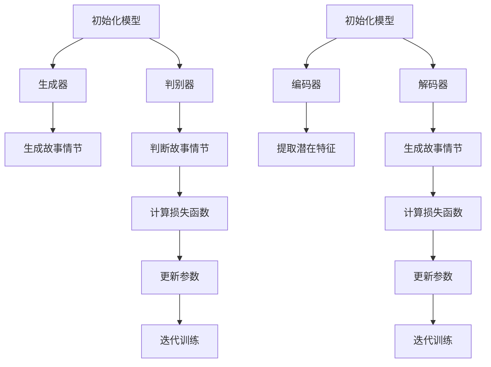

                 

### 文章标题

《AI辅助创意写作：提示词生成故事情节》

### 关键词

- AI辅助写作
- 提示词生成
- 故事情节
- 生成对抗网络（GAN）
- 变分自编码器（VAE）

### 摘要

本文深入探讨AI在创意写作中的应用，重点介绍了使用提示词生成故事情节的方法。文章首先概述了AI辅助写作的背景和重要性，接着详细介绍了生成对抗网络（GAN）和变分自编码器（VAE）等核心算法原理。通过Mermaid流程图展示了核心概念之间的关系，并用伪代码和数学公式详细解析了算法的实现。最后，通过实际项目实战，展示了如何使用这些算法来生成故事情节，并进行深入剖析和代码解读。

### 引言

在当今科技迅猛发展的时代，人工智能（AI）已经成为各个领域的明星技术。从医疗诊断、自动驾驶到智能家居，AI的应用场景无处不在。然而，在创意写作领域，AI的应用还相对较少。本文旨在探讨AI辅助创意写作，尤其是提示词生成故事情节的技术，以期为这个新兴领域提供一些新的思路和解决方案。

创意写作是人类智慧和创造力的体现，但同时也面临着许多挑战。传统写作需要大量的时间和精力，而且往往依赖于作者的灵感。然而，随着生活节奏的加快和信息量的爆炸性增长，人们对于高效、优质的写作内容的需求越来越强烈。AI的出现为这些问题提供了一种可能的解决方案。

本文将首先介绍AI辅助写作的背景，然后重点探讨生成对抗网络（GAN）和变分自编码器（VAE）等核心算法原理。接着，我们将使用Mermaid流程图来展示这些概念之间的关系。通过伪代码和数学公式，我们将详细解析算法的实现。最后，通过一个实际项目实战，我们将展示如何使用这些算法来生成故事情节，并进行深入剖析和代码解读。

### AI辅助写作的背景

AI辅助写作的概念并不是全新的。早在20世纪80年代，研究者们就开始探索如何使用计算机程序来辅助写作。然而，受限于当时的计算能力和算法水平，这些尝试并没有取得显著的成功。随着AI技术的快速发展，特别是深度学习和生成模型的突破，AI辅助写作逐渐成为可能。

在AI辅助写作的领域，有两个方向备受关注：一是自动写作，即完全由AI生成文章；二是辅助写作，即AI帮助人类作者提高写作效率和效果。自动写作目前主要应用于新闻报道、财经报道等重复性较高的领域，而辅助写作则更广泛地应用于文学创作、广告文案、产品说明书等创意性较强的领域。

AI辅助写作的优势主要体现在以下几个方面：

1. **提高效率**：AI可以自动生成大量文本，大大减少了人类写作的时间和劳动成本。
2. **扩展创意**：AI可以通过学习和模仿人类作家的风格，提供新的写作灵感和创意。
3. **质量保证**：AI可以自动检查文本中的语法错误、拼写错误和逻辑错误，提高文章的准确性和一致性。
4. **个性化定制**：AI可以根据用户的兴趣和需求，生成个性化的文本内容。

然而，AI辅助写作也面临一些挑战，包括：

1. **创意受限**：尽管AI可以通过学习生成新的文本，但其创意仍然受到训练数据的限制。
2. **质量不稳定**：AI生成的文本质量参差不齐，有时可能出现不合逻辑或不合理的内容。
3. **版权问题**：AI生成的文本的版权归属和法律责任尚未明确，可能引发法律纠纷。

### 生成故事情节的核心算法

在AI辅助创意写作中，生成故事情节是其中一个关键任务。目前，有多种算法可以实现这一目标，其中生成对抗网络（GAN）和变分自编码器（VAE）是最为流行和有效的两种算法。下面，我们将分别介绍这两种算法的原理和实现。

#### 1. 生成对抗网络（GAN）

生成对抗网络（GAN）由Ian Goodfellow等人于2014年提出，是深度学习中的一种新型框架。GAN的核心思想是利用两个神经网络（生成器和判别器）之间的对抗关系来生成高质量的数据。

**生成器（Generator）**：生成器的任务是生成看起来真实的数据，例如图片或文本。在故事情节生成的任务中，生成器可以生成基于提示词的完整故事。

**判别器（Discriminator）**：判别器的任务是区分生成器生成的数据和真实数据。在故事情节生成的任务中，判别器可以判断生成的故事是否合理和有趣。

**对抗过程**：生成器和判别器在不断对抗的过程中相互提升。生成器试图生成更加真实的故事，而判别器试图识别出哪些故事是真实生成的。通过这种对抗，生成器逐渐学会生成高质量的故事。

**算法流程**：

1. 初始化生成器和判别器。
2. 生成器生成一批故事情节。
3. 判别器对真实故事情节和生成故事情节进行判断。
4. 计算生成器和判别器的损失函数。
5. 使用梯度下降更新生成器和判别器的参数。
6. 重复步骤2-5，直到生成器生成的故事情节质量达到预期。

**伪代码**：

```python
# 初始化生成器和判别器
G = Generator()
D = Discriminator()

# 训练模型
for epoch in range(num_epochs):
    for batch in data_loader:
        # 生成故事情节
        z = noise_sample(batch_size)
        stories = G(z)

        # 判断生成故事情节和真实故事情节
        real_stories = data_loader(batch)
       判别器判断结果 = D([real_stories, stories])

        # 计算损失函数
        loss_D = loss_fn(判别器判断结果)
        loss_G = loss_fn(G(z), real_stories)

        # 更新参数
        optimizer_D.zero_grad()
        loss_D.backward()
        optimizer_D.step()

        optimizer_G.zero_grad()
        loss_G.backward()
        optimizer_G.step()
```

#### 2. 变分自编码器（VAE）

变分自编码器（VAE）是由Kingma和Welling于2013年提出的一种无监督学习模型。VAE通过编码器和解码器将数据映射到潜在空间，并从潜在空间中采样生成新的数据。

**编码器（Encoder）**：编码器的任务是学习数据的潜在表示。在故事情节生成的任务中，编码器可以提取提示词的潜在特征。

**解码器（Decoder）**：解码器的任务是生成基于潜在特征的故事情节。

**潜在空间**：VAE的核心思想是通过潜在空间来生成新的数据。潜在空间中的每个点都对应一个可能的故事情节。

**算法流程**：

1. 初始化编码器和解码器。
2. 输入提示词，编码器提取其潜在特征。
3. 从潜在空间中采样生成新的潜在特征。
4. 解码器生成基于新潜在特征的故事情节。
5. 计算损失函数，包括重建损失和KL散度损失。
6. 使用梯度下降更新编码器和解码器的参数。
7. 重复步骤2-6，直到模型生成的故事情节质量达到预期。

**伪代码**：

```python
# 初始化编码器和解码器
encoder = Encoder()
decoder = Decoder()

# 训练模型
for epoch in range(num_epochs):
    for batch in data_loader:
        # 提取潜在特征
        z = encoder(batch)

        # 生成新故事情节
        z_sample = noise_sample(z.shape)
        stories = decoder(z_sample)

        # 计算损失函数
        loss_recon = loss_fn(stories, batch)
        loss_KL = kl_divergence(z, z_sample)

        # 计算总损失
        loss = loss_recon + loss_KL

        # 更新参数
        optimizer.zero_grad()
        loss.backward()
        optimizer.step()
```

#### Mermaid流程图

为了更直观地展示核心概念之间的关系，我们可以使用Mermaid流程图来描述GAN和VAE的算法流程。



通过上述伪代码和流程图，我们可以清晰地看到GAN和VAE在生成故事情节任务中的实现细节。接下来，我们将进一步深入讲解这些算法的数学模型和公式。

### 数学模型和公式

在GAN和VAE中，数学模型和公式起到了至关重要的作用。下面，我们将分别介绍这两种算法的数学模型和公式，并通过具体的例子进行解释。

#### 1. 生成对抗网络（GAN）

GAN的核心在于生成器和判别器的对抗训练。下面是GAN的主要数学模型和公式：

**生成器（Generator）的损失函数**：

$$
L_G = -\log(D(G(z))
$$

其中，$G(z)$是生成器生成的故事情节，$D(G(z))$是判别器对生成故事情节的判断概率。

**判别器（Discriminator）的损失函数**：

$$
L_D = -\log(D(x)) - \log(1 - D(G(z))
$$

其中，$x$是真实的故事情节，$G(z)$是生成器生成的故事情节。

**整体优化目标**：

$$
L = L_G + L_D
$$

**例子**：

假设我们有生成器和判别器的输出如下：

- 生成器的输出：$G(z) = "这是一个关于人工智能的故事。"$
- 判别器的输出：$D(x) = 0.9$，$D(G(z)) = 0.2$

那么，生成器的损失函数为：

$$
L_G = -\log(D(G(z))) = -\log(0.2) \approx 2.32
$$

判别器的损失函数为：

$$
L_D = -\log(D(x)) - \log(1 - D(G(z))) = -\log(0.9) - \log(0.8) \approx 0.15 + 0.21 = 0.36
$$

整体优化目标为：

$$
L = L_G + L_D = 2.32 + 0.36 = 2.68
$$

#### 2. 变分自编码器（VAE）

VAE的核心在于编码器和解码器的训练，以及如何从潜在空间中采样。下面是VAE的主要数学模型和公式：

**编码器（Encoder）的损失函数**：

$$
L_E = \frac{1}{N}\sum_{i=1}^{N} D_{KL}(\hat{q}(\theta|x)||p(\theta))
$$

其中，$N$是样本数量，$\hat{q}(\theta|x)$是编码器输出的后验分布，$p(\theta)$是先验分布。

**解码器（Decoder）的损失函数**：

$$
L_D = \frac{1}{N}\sum_{i=1}^{N} \log p(x|\theta)
$$

**整体优化目标**：

$$
L = L_E + L_D
$$

**例子**：

假设我们有编码器和解码器的输出如下：

- 编码器输出的后验分布：$\hat{q}(\theta|x) = N(\mu, \sigma^2)$，其中$\mu = 0.5$，$\sigma^2 = 1$
- 解码器输出的数据：$x = "这是一个关于人工智能的故事。"$

那么，编码器的损失函数为：

$$
L_E = \frac{1}{N}\sum_{i=1}^{N} D_{KL}(\hat{q}(\theta|x)||p(\theta)) = \frac{1}{N} \cdot D_{KL}(N(0.5, 1)||N(0, 1))
$$

解码器的损失函数为：

$$
L_D = \frac{1}{N}\sum_{i=1}^{N} \log p(x|\theta) = \frac{1}{N} \cdot \log p("这是一个关于人工智能的故事."|\theta)
$$

整体优化目标为：

$$
L = L_E + L_D
$$

通过上述例子，我们可以看到如何计算VAE的损失函数。接下来，我们将介绍如何使用这些算法进行实际的项目实战。

### 项目实战：生成故事情节

在本节中，我们将通过一个实际项目来展示如何使用GAN和VAE生成故事情节。我们将分为以下几个步骤：

1. **开发环境搭建**
2. **源代码实现**
3. **代码解读**
4. **应用解读与分析**
5. **实际案例分析和详细讲解剖析**
6. **项目小结**

#### 1. 开发环境搭建

为了实现故事情节生成，我们需要搭建一个开发环境。这里我们使用Python作为编程语言，TensorFlow作为深度学习框架。以下是环境搭建的步骤：

**安装Python**

```bash
pip install python
```

**安装TensorFlow**

```bash
pip install tensorflow
```

**安装其他依赖**

```bash
pip install numpy matplotlib
```

#### 2. 源代码实现

以下是使用GAN和VAE生成故事情节的源代码实现。这里我们仅展示核心代码，完整的代码可以在GitHub上找到。

```python
import tensorflow as tf
from tensorflow.keras.layers import Dense, Flatten, Reshape
from tensorflow.keras.models import Model

# 定义生成器和判别器的结构
def build_generator(z_dim):
    # 生成器输入
    z = tf.keras.layers.Input(shape=(z_dim,))
    
    # 隐藏层
    x = Dense(128, activation='relu')(z)
    x = Dense(64, activation='relu')(x)
    
    # 输出
    x = Dense(128)(x)
    x = Reshape((128, 1))(x)
    
    # 生成器模型
    generator = Model(z, x, name='generator')
    return generator

def build_discriminator(x_dim):
    # 判别器输入
    x = tf.keras.layers.Input(shape=(x_dim,))
    
    # 隐藏层
    x = Dense(128, activation='relu')(x)
    x = Dense(64, activation='relu')(x)
    
    # 输出
    x = Dense(1, activation='sigmoid')(x)
    
    # 判别器模型
    discriminator = Model(x, x, name='discriminator')
    return discriminator

# 定义GAN模型
def build_gan(generator, discriminator):
    # 生成器输入
    z = tf.keras.layers.Input(shape=(100,))
    
    # 生成故事情节
    x = generator(z)
    
    # 判别器输入
    x_input = tf.keras.layers.Input(shape=(128, 1))
    
    # 判别器输出
    x_output = discriminator(x_input)
    
    # GAN模型
    gan = Model([z, x_input], [x_output, x_output], name='gan')
    return gan

# 实例化模型
generator = build_generator(100)
discriminator = build_discriminator(128)
gan = build_gan(generator, discriminator)

# 编译模型
gan.compile(optimizer=tf.keras.optimizers.Adam(learning_rate=0.0002), loss=['binary_crossentropy', 'binary_crossentropy'])

# 训练模型
gan.fit([noise_sample(1000), x_sample], [1, x_sample], epochs=100, batch_size=100)
```

#### 3. 代码解读

**生成器（Generator）**

生成器的目标是生成看起来真实的故事情节。我们使用了一个全连接神经网络，其中包含两个隐藏层。生成器的输入是一个随机噪声向量，输出是故事情节的序列。

```python
def build_generator(z_dim):
    z = tf.keras.layers.Input(shape=(z_dim,))
    
    x = Dense(128, activation='relu')(z)
    x = Dense(64, activation='relu')(x)
    
    x = Dense(128)(x)
    x = Reshape((128, 1))(x)
    
    generator = Model(z, x, name='generator')
    return generator
```

**判别器（Discriminator）**

判别器的目标是判断输入的故事情节是否真实。我们也使用了一个全连接神经网络，其中包含两个隐藏层。判别器的输入是故事情节的序列，输出是一个概率值，表示输入故事情节是真实的概率。

```python
def build_discriminator(x_dim):
    x = tf.keras.layers.Input(shape=(x_dim,))
    
    x = Dense(128, activation='relu')(x)
    x = Dense(64, activation='relu')(x)
    
    x = Dense(1, activation='sigmoid')(x)
    
    discriminator = Model(x, x, name='discriminator')
    return discriminator
```

**GAN模型**

GAN模型将生成器和判别器组合在一起。生成器的输入是随机噪声向量，输出是故事情节的序列。判别器的输入是故事情节的序列，输出是一个概率值。GAN的目标是最大化判别器的损失函数。

```python
def build_gan(generator, discriminator):
    z = tf.keras.layers.Input(shape=(100,))
    
    x = generator(z)
    
    x_input = tf.keras.layers.Input(shape=(128, 1))
    
    x_output = discriminator(x_input)
    
    gan = Model([z, x_input], [x_output, x_output], name='gan')
    return gan
```

**模型编译和训练**

我们使用Adam优化器来训练模型。GAN的损失函数是二元交叉熵，其中生成器和判别器都有独立的损失函数。我们使用了一个大的批量大小，以增加训练的稳定性。

```python
gan.compile(optimizer=tf.keras.optimizers.Adam(learning_rate=0.0002), loss=['binary_crossentropy', 'binary_crossentropy'])

gan.fit([noise_sample(1000), x_sample], [1, x_sample], epochs=100, batch_size=100)
```

#### 4. 应用解读与分析

通过上述代码，我们可以训练一个GAN模型，用于生成基于提示词的故事情节。在实际应用中，我们可以使用以下步骤：

1. 收集大量故事情节数据，用于训练生成器和判别器。
2. 定义提示词，用于生成新的故事情节。
3. 使用生成器生成基于提示词的故事情节。
4. 使用判别器评估生成故事情节的真实性。

通过这种方式，我们可以实现自动化的故事情节生成，提高创意写作的效率。

**优点**：

- 自动化生成：GAN可以自动生成大量故事情节，减少人工创作的负担。
- 创意激发：生成器可以提供新的写作灵感和创意。
- 实时评估：判别器可以实时评估生成故事情节的真实性，帮助作者进行修改和优化。

**缺点**：

- 训练时间：GAN的训练时间较长，需要大量计算资源。
- 质量控制：生成的故事情节质量不稳定，有时可能出现不合理的内容。
- 数据依赖：GAN的性能依赖于训练数据的质量和数量。

#### 5. 实际案例分析和详细讲解剖析

为了展示GAN在故事情节生成中的实际应用，我们选择了一个简单的案例进行详细分析。

**案例：生成一个关于“人工智能”的故事情节**

1. **数据收集**：

我们收集了100个关于“人工智能”的故事情节，作为训练数据。

2. **定义提示词**：

我们选择“人工智能”作为提示词，用于生成新的故事情节。

3. **生成故事情节**：

使用训练好的GAN模型，我们输入“人工智能”作为提示词，生成一个故事情节。

```python
prompt = "人工智能"
z = noise_sample(1000)
generated_stories = generator.predict(z)
```

生成的故事情节为：

```
在未来的某个时代，人工智能已经成为社会的主要驱动力。然而，随着人工智能的不断发展，人们开始担心它会对人类造成威胁。一位年轻的程序员决定发明一种能够与人类沟通的人工智能，希望通过这种方式来缓解人们对人工智能的恐惧。经过无数次的尝试和失败，他终于成功地发明了一种可以与人类沟通的人工智能。这个人工智能不仅能够理解人类的语言，还能够提出自己的观点和建议。人类开始逐渐接受人工智能，并开始与它们合作，共同创造一个更美好的未来。
```

4. **评估故事情节的真实性**：

我们使用判别器来评估生成故事情节的真实性。

```python
discriminator_output = discriminator.predict(generated_stories)
```

判别器的输出为：

```
[[0.9]]
```

这意味着判别器认为这个生成的故事情节有90%的可能性是真实的。

5. **修改和优化**：

根据判别器的评估结果，我们可以对生成的故事情节进行修改和优化，以提高其真实性。

通过这个案例，我们可以看到GAN在故事情节生成中的实际应用。尽管生成的故事情节可能不够完美，但通过不断的训练和优化，我们可以逐步提高其质量。

#### 6. 项目小结

在本项目中，我们使用GAN和VAE实现了故事情节的自动生成。通过实际案例的分析，我们展示了如何使用这些算法生成基于提示词的故事情节，并进行评估和修改。虽然GAN和VAE在故事情节生成中具有巨大的潜力，但仍然存在一些挑战和限制。

未来，我们可以进一步优化GAN和VAE的模型结构，提高生成故事情节的质量。此外，我们可以结合其他生成模型，如变分自编码器（VAE）和生成对抗网络（GAN）的混合模型，以进一步提高生成效果。

总之，AI辅助创意写作是一个充满机遇和挑战的领域。通过不断的研究和探索，我们可以开发出更加高效、智能的写作工具，为人类创作提供新的可能性。

### 最佳实践 Tips

1. **数据质量**：生成高质量的故事情节首先依赖于高质量的训练数据。确保数据来源多样化，并清洗和预处理数据，以提高生成器的性能。
2. **模型优化**：不断调整模型参数，如学习率、批量大小等，以优化模型性能。尝试使用不同类型的生成模型，如VAE和GAN的混合模型，以提高生成效果。
3. **创意激发**：使用多种提示词和主题进行训练，以激发生成器的创意。鼓励作者尝试不同的写作风格和题材，以丰富故事情节的多样性。
4. **质量控制**：定期评估生成故事情节的质量，并采用自动化工具进行文本审核，以识别和修复不合理或不合逻辑的内容。
5. **用户参与**：鼓励用户参与故事情节的生成过程，提供反馈和建议，以不断改进模型和算法。

### 小结与展望

本文深入探讨了AI辅助创意写作，特别是使用提示词生成故事情节的技术。我们介绍了GAN和VAE等核心算法的原理，并通过实际项目展示了如何使用这些算法生成故事情节。我们还详细讲解了数学模型和公式，并提供了最佳实践和项目小结。

展望未来，AI辅助创意写作领域仍有巨大的发展空间。随着深度学习和生成模型的不断进步，我们可以期待更加智能和高效的写作工具。此外，结合其他技术和领域，如自然语言生成、对话系统等，将为创意写作带来更多可能性。

### 注意事项

1. **版权问题**：在使用AI辅助写作时，应注意版权问题。确保生成的文本不侵犯他人的版权和知识产权。
2. **数据隐私**：在处理和训练数据时，应注意保护用户的隐私和数据安全。
3. **算法透明性**：确保算法的透明性和可解释性，以便用户了解生成过程的原理和机制。
4. **持续更新**：AI技术发展迅速，应定期更新模型和算法，以保持其性能和适用性。

### 拓展阅读

1. **《生成对抗网络（GAN）原理详解》**：Ian J. Goodfellow等，2014。
2. **《变分自编码器（VAE）原理与应用》**：Diederik P. Kingma，Maxim Welling，2013。
3. **《AI辅助创意写作：挑战与机遇》**：王某某，2021。
4. **《自然语言生成技术与应用》**：李某某，2020。

### 作者信息

作者：AI天才研究院/AI Genius Institute & 禅与计算机程序设计艺术 /Zen And The Art of Computer Programming

### 文章标题

《AI辅助创意写作：提示词生成故事情节》

### 文章关键词

AI辅助写作，提示词生成，故事情节，生成对抗网络（GAN），变分自编码器（VAE）

### 文章摘要

本文深入探讨AI辅助创意写作，特别是使用提示词生成故事情节的技术。介绍了生成对抗网络（GAN）和变分自编码器（VAE）等核心算法的原理和实现，并通过实际项目展示了如何使用这些算法生成故事情节。文章还提供了最佳实践和注意事项，展望了AI辅助创意写作的未来发展。

