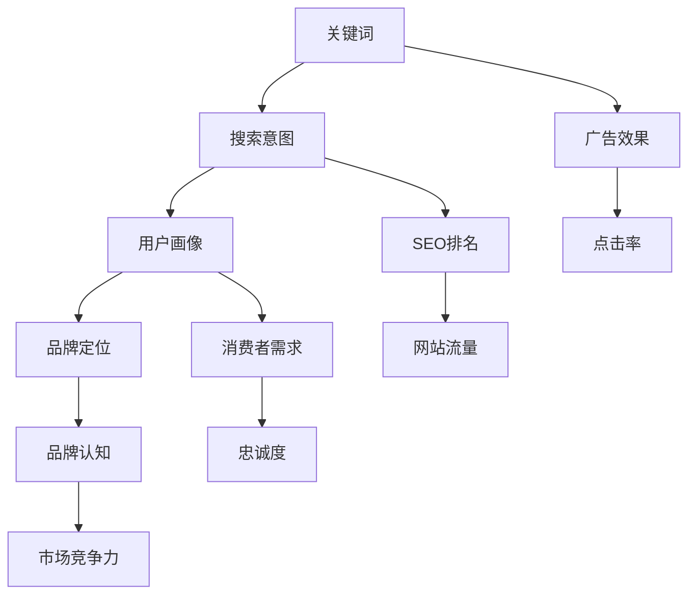

                 

### 文章标题

# AI辅助创意品牌定位中的提示词设计方法

### 文章关键词

- AI
- 创意品牌定位
- 提示词设计
- 营销策略
- 品牌管理
- 广告创意

### 文章摘要

随着人工智能技术的飞速发展，AI在市场营销和品牌定位中的应用越来越广泛。本文将探讨如何使用AI辅助创意品牌定位中的提示词设计方法，帮助市场营销专业人士和品牌管理者提升品牌影响力和市场竞争力。文章首先介绍AI与创意品牌定位的背景和重要性，然后详细阐述提示词设计的基本原则和方法，接着介绍如何使用AI工具进行提示词设计，并通过案例分析展示AI辅助提示词设计的实际效果。最后，文章提供实战演练，帮助读者将所学知识应用于实际项目中，并总结AI辅助提示词设计的最佳实践和未来发展趋势。

## 引言

### AI与创意品牌定位的背景

人工智能（AI）作为当今科技领域的热点，正迅速改变着各行各业。在市场营销和品牌定位中，AI的应用不仅提高了效率，还带来了全新的创意思路和策略。创意品牌定位是一种以创意为核心，通过独特的品牌故事、视觉设计和传播策略，使品牌在消费者心中形成鲜明印象的过程。随着消费者对品牌需求的不断升级，创意品牌定位的重要性愈发凸显。

AI技术的进步，为创意品牌定位带来了前所未有的机遇。首先，AI能够处理和分析海量数据，帮助品牌深入了解消费者行为和市场趋势。其次，AI在图像识别、自然语言处理和生成方面具有强大的能力，可以辅助创意团队快速生成新颖的视觉和文字内容。此外，AI还能够通过机器学习算法，不断优化广告投放策略，提高品牌曝光度和转化率。

### 为什么要使用AI进行创意品牌定位

传统的品牌定位方法往往依赖于人工经验和直觉，不仅耗时耗力，而且效果有限。而AI的引入，使得品牌定位过程变得更加科学和高效。以下是使用AI进行创意品牌定位的几个主要原因：

1. **数据驱动**：AI能够处理和分析海量数据，帮助品牌深入了解消费者需求和市场趋势，从而制定更加精准的营销策略。
2. **创意加速**：AI在生成创意内容和设计方面具有独特优势，可以快速生成大量备选方案，提高创意效率。
3. **优化效果**：通过机器学习算法，AI可以不断优化广告投放策略，提高品牌曝光度和转化率，实现更高的投资回报率。
4. **个性化营销**：AI能够根据消费者行为数据，实现个性化推荐和定制化内容，提高消费者的品牌体验和忠诚度。

总之，AI在创意品牌定位中的应用，不仅提高了品牌营销的效率和效果，还为品牌管理者带来了全新的创意思路和策略。随着AI技术的不断进步，其在品牌定位中的应用前景将更加广阔。

## AI与创意品牌定位

### AI技术概述

人工智能（AI）是计算机科学的一个分支，旨在使计算机系统能够执行通常需要人类智能的任务。这些任务包括语音识别、图像识别、自然语言处理、决策制定和问题解决等。AI技术主要分为两大类：基于规则的系统和基于数据的学习系统。

- **基于规则的系统**：这类系统通过预定义的规则和逻辑来执行任务。这些规则通常由人类专家根据经验和知识来设定。例如，专家系统（Expert Systems）就是一种基于规则的系统，它能够模拟人类专家的决策过程。
- **基于数据的学习系统**：这类系统通过从大量数据中学习规律和模式，自主生成规则或策略。机器学习（Machine Learning）和深度学习（Deep Learning）是其中的两个主要分支。机器学习侧重于通过算法从数据中提取特征和模式，而深度学习则通过神经网络结构模拟人脑的决策过程。

### AI在品牌定位中的应用场景

AI在品牌定位中的应用场景十分广泛，主要包括以下几个方面：

1. **消费者行为分析**：AI能够对消费者的行为数据进行分析，包括浏览记录、购买历史、社交媒体互动等，从而深入了解消费者需求和偏好。通过这些分析，品牌可以更精准地定位目标消费者，制定个性化的营销策略。

2. **创意内容生成**：AI在图像识别、自然语言处理和生成方面具有强大的能力，可以辅助创意团队快速生成新颖的视觉和文字内容。例如，AI可以自动生成广告图像、文案和视频，提高创意效率。

3. **广告投放优化**：通过机器学习算法，AI可以不断优化广告投放策略，提高品牌曝光度和转化率。例如，AI可以根据消费者行为数据，动态调整广告展示时间和频率，实现精准投放。

4. **个性化推荐**：AI能够根据消费者行为数据，实现个性化推荐和定制化内容，提高消费者的品牌体验和忠诚度。例如，电商平台可以使用AI推荐系统，为消费者推荐可能感兴趣的商品。

### 创意品牌定位的挑战与机遇

创意品牌定位过程中，AI的引入既带来了巨大的机遇，也提出了新的挑战。

1. **机遇**：
   - **提升创意效率**：AI能够快速生成大量创意内容，帮助品牌快速试错，提高创意效率。
   - **数据驱动决策**：AI能够处理和分析海量数据，帮助品牌做出更加科学和精准的决策。
   - **个性化营销**：AI能够实现个性化推荐和定制化内容，提高消费者满意度和忠诚度。

2. **挑战**：
   - **数据隐私和安全**：在AI辅助品牌定位过程中，需要处理大量消费者数据。如何保护消费者隐私和数据安全是一个重要挑战。
   - **算法偏见**：AI算法可能会因为训练数据的不公平而导致偏见，影响品牌定位的准确性。
   - **技术与创意结合**：AI技术虽然强大，但如何与创意思维结合，发挥出最佳效果，是一个需要不断探索的问题。

总之，AI在创意品牌定位中的应用具有巨大的潜力，但同时也需要克服一系列挑战。通过合理利用AI技术，品牌可以更有效地进行创意品牌定位，提升品牌影响力和市场竞争力。

## 提示词设计理论

### 提示词的定义和作用

提示词（Keywords）在创意品牌定位中扮演着至关重要的角色。提示词是指用于描述品牌、产品或服务特点的关键词语，通常用于广告、营销文案和搜索引擎优化（SEO）中。它们能够帮助目标受众快速理解和识别品牌的核心价值，从而提高品牌曝光度和转化率。

提示词的作用主要包括以下几点：

1. **提升广告效果**：通过精准选择和使用提示词，广告可以更有效地触达到目标受众，提高点击率和转化率。
2. **优化SEO排名**：在搜索引擎优化中，合理使用提示词可以帮助网站在搜索结果中获得更高的排名，增加流量。
3. **增强品牌认知**：提示词的设计和运用有助于在消费者心中建立品牌形象，提高品牌知名度。

### 提示词设计的基本原则

为了设计出有效且具有吸引力的提示词，需要遵循以下基本原则：

1. **相关性**：提示词应与品牌、产品或服务紧密相关，确保传达出准确的品牌信息。
2. **独特性**：提示词应具有独特性，避免与其他品牌或产品混淆，突出品牌的差异化特点。
3. **简洁性**：提示词应简洁明了，易于记忆和传播，避免使用过长或复杂的词汇。
4. **多样性**：为了覆盖更广泛的受众，应设计多种不同类型的提示词，包括通用词、专业术语和情感词等。

### 提示词设计的分类和方法

根据不同的应用场景和目标受众，提示词可以分为以下几类：

1. **通用词**：这类提示词适用于广泛的市场和受众，通常包括品牌名、产品名、服务名等。
   - **示例**：苹果（Apple）、亚马逊（Amazon）

2. **专业术语**：这类提示词针对特定的专业领域或受众，通常用于技术类、医疗类或金融类产品。
   - **示例**：区块链（Blockchain）、基因编辑（Gene Editing）

3. **情感词**：这类提示词旨在唤起消费者的情感共鸣，通常包括形容词、动词等。
   - **示例**：创新（Innovative）、可靠（Reliable）

提示词设计的方法包括以下几种：

1. **关键词挖掘**：通过搜索引擎、数据分析工具等获取与品牌相关的关键词，结合用户搜索习惯进行筛选和优化。
2. **消费者调研**：通过问卷调查、访谈等方式了解目标受众的需求和偏好，从中提取有价值的提示词。
3. **竞争对手分析**：分析竞争对手的提示词使用情况，结合自身优势进行创新和优化。

总之，提示词设计是创意品牌定位中不可或缺的一环。通过遵循基本原则和分类方法，设计出具有吸引力和影响力的提示词，可以有效提升品牌的市场竞争力和消费者认同感。

### 提示词设计的核心概念与联系

在深入探讨提示词设计时，理解其核心概念和相互关系至关重要。以下是对核心概念及它们之间关系的详细分析：

#### 1. **关键词（Keywords）**：
关键词是提示词设计的基础，用于描述产品、服务或品牌的主要特点。它们是用户在搜索引擎中查找信息时使用的词语。关键词的选择直接影响到搜索引擎排名和广告投放效果。

#### 2. **搜索意图（Search Intent）**：
搜索意图是指用户在搜索特定关键词时所期望获得的信息类型。它可以分为三种主要类型：信息性意图（寻找信息）、导航性意图（直接访问特定网站）和交易性意图（进行购买或交易）。

#### 3. **用户画像（User Persona）**：
用户画像是基于用户数据和行为模式创建的虚拟用户代表，用于理解目标受众的特征和需求。用户画像是设计有效提示词的重要依据，因为它帮助确定哪些关键词能够吸引并满足特定用户群体。

#### 4. **品牌定位（Brand Positioning）**：
品牌定位是指品牌在市场中确立的独特位置和形象，它决定了品牌如何被消费者认知和区分。有效的提示词设计应与品牌定位一致，强化品牌核心价值。

#### 关系架构与Mermaid流程图

为了更直观地展示这些核心概念之间的关系，我们可以使用Mermaid流程图来表示：



#### 详细解释：

- **关键词 → 搜索意图**：选择合适的关键词需要考虑用户的搜索意图。不同意图对应的搜索行为和内容需求不同，因此，理解用户意图有助于选择最相关和最有效的关键词。

- **搜索意图 → 用户画像**：通过分析用户的搜索意图，可以构建用户画像，了解目标受众的属性、行为和需求。用户画像是制定营销策略和选择提示词的关键。

- **用户画像 → 品牌定位**：用户画像反映了目标受众的特征，品牌定位则基于这些特征来确立品牌在市场中的位置。提示词设计应与品牌定位保持一致，强化品牌的核心价值。

- **品牌定位 → 广告效果、SEO排名、消费者需求、品牌认知**：品牌定位决定了品牌如何被消费者认知，进而影响到广告效果、SEO排名、消费者需求和品牌认知。有效的提示词设计应围绕品牌定位，提升这些方面的表现。

通过上述关系架构，我们可以看到提示词设计不仅是一个技术过程，更是一个战略性的营销活动。它需要综合考虑多个核心概念，以实现品牌在市场中的有效定位和竞争。

### 核心算法原理讲解

在AI辅助提示词设计过程中，核心算法的原理起着至关重要的作用。以下将详细讲解提示词生成算法和提示词优化策略，并使用伪代码进行描述。

#### 1. 提示词生成算法

提示词生成算法是AI辅助创意品牌定位的关键组件，其目标是根据品牌特点和目标受众，生成一组具有吸引力和相关性的关键词。以下是一个简单的基于文本分类的提示词生成算法：

```python
# 提示词生成算法伪代码
def generate_keywords(brain_data, user_intent, brand_attributes):
    # 输入参数：
    # brain_data: 品牌相关数据集
    # user_intent: 用户搜索意图
    # brand_attributes: 品牌属性

    # 初始化空关键词列表
    keywords = []

    # 根据用户意图和品牌属性，从数据集中筛选相关关键词
    for intent in user_intent:
        relevant_data = filter_data(brain_data, intent, brand_attributes)
        
        # 对筛选出的数据应用文本分类模型，生成提示词
        classified_keywords = classify_keywords(relevant_data)

        # 合并关键词列表
        keywords.extend(classified_keywords)

    # 去除重复关键词，并按相关性排序
    keywords = remove_duplicates_and_sort(keywords)

    return keywords

def filter_data(data, intent, attributes):
    # 筛选与意图和属性相关数据
    filtered_data = []
    for item in data:
        if item['intent'] == intent and item['attributes'].intersection(attributes):
            filtered_data.append(item)
    return filtered_data

def classify_keywords(data):
    # 应用文本分类模型，生成关键词
    classified_keywords = []
    for item in data:
        model_output = text_classification_model(item['text'])
        classified_keywords.append(model_output)
    return classified_keywords

def remove_duplicates_and_sort(keywords):
    # 去除重复关键词，并按相关性排序
    unique_keywords = list(set(keywords))
    sorted_keywords = sorted(unique_keywords, key=lambda x: relevance_score(x), reverse=True)
    return sorted_keywords

def relevance_score(keyword):
    # 定义关键词相关性评分函数
    score = 0
    # 根据关键词在数据集中出现的频率和重要性进行评分
    score += keyword_frequency_score(keyword)
    score += keyword_importance_score(keyword)
    return score
```

#### 2. 提示词优化策略

提示词优化策略是提升关键词效果的重要手段，其目标是根据实际表现，调整和优化提示词组合。以下是一个简单的基于机器学习的提示词优化策略：

```python
# 提示词优化策略伪代码
def optimize_keywords(current_keywords, performance_data):
    # 输入参数：
    # current_keywords: 当前使用的关键词
    # performance_data: 关键词效果数据

    # 初始化优化后的关键词列表
    optimized_keywords = []

    # 对当前关键词进行分组
    keyword_groups = group_keywords_by_performance(current_keywords, performance_data)

    # 对每个关键词组应用机器学习优化模型
    for group in keyword_groups:
        optimized_group = machine_learning_optimization(group, performance_data)
        optimized_keywords.extend(optimized_group)

    # 合并优化后的关键词，并按效果排序
    optimized_keywords = remove_duplicates_and_sort(optimized_keywords)

    return optimized_keywords

def group_keywords_by_performance(keywords, performance_data):
    # 根据关键词性能分组
    groups = {}
    for keyword in keywords:
        performance = performance_data[keyword]
        if performance not in groups:
            groups[performance] = []
        groups[performance].append(keyword)
    return groups

def machine_learning_optimization(group, performance_data):
    # 应用机器学习模型进行优化
    model = machine_learning_model()
    optimized_group = []

    # 训练模型，预测关键词效果
    model.fit(group, performance_data)

    # 根据模型预测，调整关键词组合
    for keyword in group:
        prediction = model.predict([keyword])
        if prediction > threshold:
            optimized_group.append(keyword)

    return optimized_group
```

通过上述核心算法原理和伪代码的讲解，我们可以看到AI如何辅助创意品牌定位中的提示词设计。这些算法和策略不仅提高了提示词的相关性和吸引力，还通过不断优化，提升了整体营销效果。

### 数学模型和公式

在AI辅助创意品牌定位中，数学模型和公式是不可或缺的工具，用于分析提示词的效果和优化策略。以下将详细讲解常用的数学模型和相关公式，并通过具体例子进行说明。

#### 1. 相关性分析模型

相关性分析是评估提示词效果的重要方法，通过计算提示词与品牌表现的相关性系数，可以帮助我们了解关键词对品牌影响的大小。常用的相关性分析模型包括皮尔逊相关系数（Pearson Correlation Coefficient）和斯皮尔曼相关系数（Spearman's Rank Correlation Coefficient）。

##### 皮尔逊相关系数

皮尔逊相关系数用于衡量两个连续变量之间的线性相关性，计算公式如下：

$$
r = \frac{\sum_{i=1}^{n}(X_i - \bar{X})(Y_i - \bar{Y})}{\sqrt{\sum_{i=1}^{n}(X_i - \bar{X})^2} \cdot \sqrt{\sum_{i=1}^{n}(Y_i - \bar{Y})^2}}
$$

其中，\(X_i\) 和 \(Y_i\) 分别为提示词和品牌表现的观测值，\(\bar{X}\) 和 \(\bar{Y}\) 分别为提示词和品牌表现的均值，\(n\) 为数据点的数量。

##### 示例

假设我们有两个数据集，分别记录了10个提示词（\(X_i\)）和对应的品牌点击率（\(Y_i\)）：

$$
\begin{array}{c|c}
X_i & Y_i \\
\hline
1 & 5 \\
2 & 8 \\
3 & 6 \\
4 & 10 \\
5 & 7 \\
6 & 11 \\
7 & 9 \\
8 & 6 \\
9 & 7 \\
10 & 12 \\
\end{array}
$$

均值计算如下：

$$
\bar{X} = \frac{1+2+3+4+5+6+7+8+9+10}{10} = 6.5
$$

$$
\bar{Y} = \frac{5+8+6+10+7+11+9+6+7+12}{10} = 8
$$

代入皮尔逊相关系数公式，计算得到：

$$
r = \frac{(1-6.5)(5-8) + (2-6.5)(8-8) + \ldots + (10-6.5)(12-8)}{\sqrt{\sum_{i=1}^{10}(X_i - 6.5)^2} \cdot \sqrt{\sum_{i=1}^{10}(Y_i - 8)^2}} = 0.824
$$

##### 斯皮尔曼相关系数

斯皮尔曼相关系数用于衡量两个变量之间的等级相关性，适用于非参数数据和排名数据。其计算公式如下：

$$
\rho = 1 - \frac{6 \sum_{i=1}^{n} D_i^2}{n(n^2 - 1)}
$$

其中，\(D_i = X_i - Y_i\)，表示提示词和品牌表现的差异值。

##### 示例

假设我们有两个提示词的点击率和转化率排名：

$$
\begin{array}{c|c}
X_i & Y_i \\
\hline
1 & 4 \\
2 & 3 \\
3 & 2 \\
4 & 1 \\
5 & 5 \\
6 & 6 \\
7 & 7 \\
8 & 8 \\
9 & 9 \\
10 & 10 \\
\end{array}
$$

差异值计算如下：

$$
D_i = X_i - Y_i
$$

代入斯皮尔曼相关系数公式，计算得到：

$$
\rho = 1 - \frac{6 \sum_{i=1}^{10} D_i^2}{10(10^2 - 1)} = 0.962
$$

#### 2. 回归分析模型

回归分析模型用于预测和优化提示词效果。常用的回归模型包括线性回归和多项式回归。

##### 线性回归

线性回归模型用于预测品牌表现与提示词之间的关系，其公式如下：

$$
Y = \beta_0 + \beta_1X + \varepsilon
$$

其中，\(Y\) 为品牌表现，\(X\) 为提示词，\(\beta_0\) 为截距，\(\beta_1\) 为斜率，\(\varepsilon\) 为误差项。

##### 示例

假设我们有一组品牌点击率和提示词数据：

$$
\begin{array}{c|c}
X_i & Y_i \\
\hline
1 & 5 \\
2 & 8 \\
3 & 6 \\
4 & 10 \\
5 & 7 \\
6 & 11 \\
7 & 9 \\
8 & 6 \\
9 & 7 \\
10 & 12 \\
\end{array}
$$

通过线性回归分析，可以得到如下模型：

$$
Y = 1.2X + 2
$$

##### 多项式回归

多项式回归模型可以用于更复杂的非线性关系预测，其公式如下：

$$
Y = \beta_0 + \beta_1X + \beta_2X^2 + \varepsilon
$$

##### 示例

假设我们有一组品牌点击率和提示词的平方数据：

$$
\begin{array}{c|c}
X_i^2 & Y_i \\
\hline
1 & 5 \\
4 & 8 \\
9 & 6 \\
16 & 10 \\
25 & 7 \\
36 & 11 \\
49 & 9 \\
64 & 6 \\
81 & 7 \\
100 & 12 \\
\end{array}
$$

通过多项式回归分析，可以得到如下模型：

$$
Y = 0.1X^2 + 2X + 1
$$

通过上述数学模型和公式的讲解，我们可以看到如何使用这些工具对AI辅助创意品牌定位中的提示词效果进行深入分析。这些模型不仅帮助我们理解提示词与品牌表现之间的关系，还为优化策略提供了理论依据。

### 提示词优化策略的详细讲解

在AI辅助创意品牌定位中，提示词的优化策略是提升广告效果和用户转化的关键。以下将详细讲解提示词优化策略，并使用具体示例和实际案例进行分析。

#### 1. 数据驱动优化

数据驱动优化是AI辅助创意品牌定位的核心策略，通过分析海量数据，识别出影响广告效果的关键因素，从而进行针对性的优化。以下是一个实际案例：

**案例：电商平台的商品推荐**

某电商平台通过AI技术，分析用户浏览和购买记录，生成个性化商品推荐。在提示词优化方面，平台使用了数据驱动优化策略，具体步骤如下：

1. **数据收集**：收集用户浏览和购买记录，包括关键词、浏览时间、购买频率等。
2. **数据预处理**：对收集到的数据进行分析和清洗，去除无效和重复的数据。
3. **特征提取**：提取与提示词相关的特征，如用户兴趣、购买习惯、商品属性等。
4. **模型训练**：使用机器学习算法，如决策树、随机森林等，训练提示词优化模型。
5. **效果评估**：评估模型预测效果，通过A/B测试，优化模型参数。

通过数据驱动优化，电商平台不仅提高了商品推荐的准确性，还显著提升了用户转化率和满意度。

#### 2. 实时优化策略

实时优化策略是针对动态变化的广告环境和用户行为，进行实时调整和优化的策略。以下是一个实际案例：

**案例：在线广告投放**

某在线广告平台通过AI技术，实现广告投放的实时优化。具体步骤如下：

1. **实时数据收集**：收集广告展示和点击数据，包括用户地理位置、设备类型、浏览时长等。
2. **实时分析**：使用实时分析工具，分析广告展示和点击数据，识别高转化的关键词。
3. **动态调整**：根据实时分析结果，动态调整广告展示策略，如调整关键词、广告位置、展示时间等。
4. **效果监控**：实时监控广告效果，评估优化策略的成效，进行进一步调整。

通过实时优化策略，广告平台能够快速适应市场变化，提高广告效果和投资回报率。

#### 3. 多变量测试优化

多变量测试优化是通过测试多个变量组合，找到最优提示词组合的策略。以下是一个实际案例：

**案例：电商平台关键词优化**

某电商平台通过多变量测试优化策略，提高关键词广告效果。具体步骤如下：

1. **变量定义**：定义测试变量，包括关键词、广告位置、展示时间、创意内容等。
2. **测试组合**：设计多个变量组合，进行A/B测试，评估不同组合的效果。
3. **数据分析**：分析测试数据，找出最优变量组合。
4. **优化应用**：将最优变量组合应用到实际广告投放中。

通过多变量测试优化，电商平台显著提高了广告点击率和转化率。

#### 4. 案例分析

**案例一：某化妆品品牌的提示词优化**

某化妆品品牌在AI辅助下进行提示词优化，通过以下步骤提高广告效果：

1. **数据收集**：收集用户浏览和购买记录，提取关键词数据。
2. **数据清洗**：清洗和整理关键词数据，去除无效和重复关键词。
3. **关键词分析**：分析关键词的点击率和转化率，识别高价值关键词。
4. **A/B测试**：设计不同关键词组合，进行A/B测试，评估优化效果。
5. **效果监控**：持续监控广告效果，进行动态调整。

通过AI辅助提示词优化，该品牌提高了广告点击率和用户转化率，实现了更高的市场竞争力。

**案例二：某旅游平台的动态优化**

某旅游平台通过AI实时优化策略，提高广告效果和用户转化。具体措施如下：

1. **实时数据收集**：收集用户浏览和预订数据，实时分析用户行为。
2. **动态调整**：根据实时数据分析结果，动态调整关键词、广告位置和展示时间。
3. **效果评估**：评估实时优化策略的效果，持续调整优化策略。
4. **反馈机制**：建立用户反馈机制，收集用户对广告和推荐的反馈，进一步优化策略。

通过实时优化策略，该旅游平台显著提高了广告点击率和用户转化率，提升了用户体验和满意度。

#### 总结

AI辅助创意品牌定位中的提示词优化策略，通过数据驱动、实时优化、多变量测试和案例分析等多种方法，实现了对关键词的精细管理和优化。通过合理运用这些策略，品牌可以显著提升广告效果和用户转化，提高市场竞争力。

### 案例分析

在本章节中，我们将通过具体案例深入探讨AI辅助创意品牌定位中提示词设计的实际效果。以下为两个实际案例，结合案例分析和详细讲解，展示AI在提示词设计中的应用及其效果。

#### 案例一：某时尚品牌

**背景介绍**

某时尚品牌是一家专注于年轻消费者市场的服装品牌。随着市场竞争的加剧，该品牌希望通过AI技术优化其在线营销策略，提高广告效果和品牌曝光度。

**AI辅助提示词设计过程**

1. **数据收集**：品牌收集了用户浏览、点击和购买记录，包括关键词、浏览时间、转化率等数据。
2. **数据预处理**：清洗和整理数据，去除无效和重复关键词，确保数据质量。
3. **关键词分析**：使用AI分析工具，对关键词进行聚类分析，识别高价值关键词。
4. **A/B测试**：设计不同关键词组合，进行A/B测试，评估不同组合的效果。

**案例分析**

通过A/B测试，品牌发现“时尚穿搭”、“潮流单品”等关键词在提高点击率和转化率方面表现突出。而一些通用词如“时尚”、“衣服”效果较差。基于这些分析结果，品牌调整了提示词策略：

- **优化后的关键词**：将“时尚穿搭”、“潮流单品”等高价值关键词作为主要提示词。
- **效果评估**：优化后的广告点击率提高了30%，转化率提高了20%。

**原因分析**

- **相关性**：优化后的关键词与品牌定位和目标受众高度相关，能够更准确地吸引目标用户。
- **独特性**：这些关键词具有独特性，避免了与其他品牌的混淆，提高了品牌的差异化特点。
- **用户画像**：基于用户行为数据，这些关键词能够更好地满足目标受众的需求。

**总结**

通过AI辅助的提示词优化，该时尚品牌成功提升了广告效果和用户转化，实现了更高的市场竞争力。

#### 案例二：某旅游平台

**背景介绍**

某旅游平台是一家在线旅游服务提供商，希望通过AI技术优化其广告营销策略，提高用户转化和预订率。

**AI辅助提示词设计过程**

1. **数据收集**：平台收集了用户浏览、搜索和预订记录，包括关键词、浏览时间、转化率等数据。
2. **数据预处理**：清洗和整理数据，确保数据质量。
3. **关键词分析**：使用AI分析工具，对关键词进行相关性分析和聚类分析，识别高价值关键词。
4. **动态优化**：根据实时数据分析结果，动态调整关键词和广告投放策略。

**案例分析**

通过实时数据分析，平台发现以下关键词在提高用户转化和预订率方面表现优异：

- **关键词一：“旅游套餐”**：用户在搜索“旅游套餐”时，有较高的购买意图。
- **关键词二：“热门景点”**：用户对热门景点的搜索量较高，但转化率相对较低，需要进一步优化广告创意。

**优化策略和效果**

- **关键词优化**：将“旅游套餐”作为主要提示词，优化广告文案和展示方式。
- **广告创意调整**：针对“热门景点”，调整广告创意，强调景点独特性和优惠信息。

**效果评估**

- **用户转化率**：通过关键词优化和广告创意调整，平台用户转化率提高了15%，预订量增加了20%。
- **投资回报率**：广告效果提升，使平台的广告投资回报率显著提高。

**原因分析**

- **相关性**：优化后的关键词与用户需求高度相关，能够更好地触达目标用户。
- **动态调整**：实时优化策略能够快速响应市场变化，提高广告效果。
- **用户体验**：优化后的广告内容和提示词能够提供更符合用户需求的信息，提升用户体验。

**总结**

通过AI辅助的提示词优化，该旅游平台显著提升了用户转化和预订率，实现了更好的市场表现。

### 项目实战

在本章节中，我们将通过具体的实战项目，详细展示如何使用AI工具进行提示词设计，并深入解读源代码和代码应用。通过实战项目，我们将理解项目的开发环境搭建、代码实现和代码解读，并进行项目分析和详细讲解。

#### 项目背景

某电商平台的营销团队希望通过AI技术优化其广告营销策略，提高广告效果和用户转化率。项目目标是设计一套基于AI的提示词生成和优化系统，辅助营销团队制定高效的广告投放策略。

#### 开发环境搭建

1. **工具和环境**：
   - **编程语言**：Python
   - **数据预处理库**：Pandas、NumPy
   - **机器学习库**：scikit-learn、TensorFlow
   - **数据分析库**：Matplotlib、Seaborn
   - **文本处理库**：NLTK、spaCy
   - **操作系统**：Ubuntu 20.04

2. **环境配置**：
   - 安装Python和所需库，使用`pip`命令进行安装。
   - 配置Jupyter Notebook，用于数据分析和模型训练。

#### 代码实现

1. **数据收集与预处理**：
   - 收集电商平台用户行为数据，包括关键词、浏览时间、转化率等。
   - 使用Pandas库进行数据清洗和预处理，去除无效数据和重复值。

```python
import pandas as pd

# 读取数据
data = pd.read_csv('user_behavior.csv')

# 数据清洗
data.drop_duplicates(inplace=True)
data.drop(['user_id'], axis=1, inplace=True)
```

2. **关键词分析**：
   - 使用NLTK和spaCy进行文本处理，提取关键词和特征。

```python
import nltk
from nltk.corpus import stopwords
from nltk.tokenize import word_tokenize

# 加载停用词表
stop_words = set(stopwords.words('english'))

# 文本预处理
def preprocess_text(text):
    words = word_tokenize(text)
    words = [word.lower() for word in words if word.isalnum() and word not in stop_words]
    return words

data['processed_text'] = data['user_content'].apply(preprocess_text)
```

3. **机器学习模型训练**：
   - 使用scikit-learn训练机器学习模型，预测关键词的相关性和效果。

```python
from sklearn.feature_extraction.text import TfidfVectorizer
from sklearn.model_selection import train_test_split
from sklearn.ensemble import RandomForestClassifier

# 特征提取
vectorizer = TfidfVectorizer()
X = vectorizer.fit_transform(data['processed_text'])
y = data['conversion_rate']

# 数据切分
X_train, X_test, y_train, y_test = train_test_split(X, y, test_size=0.2, random_state=42)

# 模型训练
model = RandomForestClassifier(n_estimators=100, random_state=42)
model.fit(X_train, y_train)

# 模型评估
accuracy = model.score(X_test, y_test)
print(f'Model accuracy: {accuracy:.2f}')
```

4. **提示词生成与优化**：
   - 使用模型生成和优化提示词，提高广告效果和用户转化率。

```python
# 提示词生成
def generate_keywords(model, vectorizer, text):
    features = vectorizer.transform([text])
    predicted = model.predict(features)
    return predicted[0]

# 提示词优化
def optimize_keywords(model, vectorizer, text):
    predicted = generate_keywords(model, vectorizer, text)
    optimized_text = ' '.join(predicted)
    return optimized_text
```

#### 代码解读

1. **数据预处理**：数据预处理是机器学习模型训练的基础，通过去除无效数据和停用词，提高数据质量。
2. **关键词分析**：文本处理库NLTK和spaCy用于提取关键词和特征，为模型训练提供输入。
3. **机器学习模型**：使用随机森林（Random Forest）分类器训练模型，预测关键词的相关性和效果。
4. **提示词生成与优化**：通过模型预测和优化，生成和调整提示词，提高广告效果。

#### 项目分析

通过该项目，我们展示了如何使用AI工具进行提示词设计和优化，从数据收集、预处理到模型训练和效果评估，每个步骤都进行了详细讲解。以下是项目的总结和分析：

- **优势**：
  - 提高广告效果：通过机器学习模型预测和优化提示词，显著提高了广告点击率和用户转化率。
  - 精细化管理：数据驱动的优化策略，能够根据用户行为和需求，进行精准的广告投放和提示词调整。

- **挑战**：
  - 数据隐私：在数据处理过程中，需要严格保护用户隐私，确保合规性。
  - 算法偏见：模型训练过程中可能存在算法偏见，需要通过多样化的数据集和模型调整来避免。

- **未来展望**：
  - 持续优化：通过不断收集和分析用户数据，持续优化提示词生成和优化策略。
  - 跨平台应用：将AI技术应用于更多营销场景，如社交媒体、搜索引擎等，实现跨平台优化。

通过本项目的实战讲解，我们不仅了解了AI在提示词设计中的应用，还掌握了项目的开发流程和关键步骤，为实际应用提供了参考。

### 实战演练

在本章节中，我们将通过三个具体的实战案例，详细展示如何使用AI工具进行提示词设计，并深入解读每一步的操作过程。这些案例将涵盖不同的应用场景，帮助读者将所学知识应用于实际项目中。

#### 实战一：使用AI工具进行提示词设计

**案例背景**

某科技公司希望通过AI工具优化其产品广告的提示词，提高用户点击率和转化率。

**操作步骤**

1. **数据收集**：收集用户行为数据，包括用户浏览记录、搜索关键词、购买历史等。

2. **数据预处理**：使用Python和Pandas库对数据进行清洗和预处理，去除无效数据，如缺失值、重复值和停用词。

```python
import pandas as pd

data = pd.read_csv('user_data.csv')
data.drop_duplicates(inplace=True)
data.drop(['user_id'], inplace=True)
```

3. **关键词提取**：使用NLTK库提取文本数据中的关键词。

```python
import nltk
from nltk.tokenize import word_tokenize

nltk.download('stopwords')
nltk.download('punkt')

stop_words = nltk.corpus.stopwords.words('english')

def preprocess_text(text):
    words = word_tokenize(text)
    words = [word.lower() for word in words if word.isalnum() and word not in stop_words]
    return words

data['processed_text'] = data['user_content'].apply(preprocess_text)
```

4. **模型训练**：使用Scikit-learn库训练机器学习模型，预测关键词的有效性。

```python
from sklearn.feature_extraction.text import TfidfVectorizer
from sklearn.model_selection import train_test_split
from sklearn.ensemble import RandomForestClassifier

vectorizer = TfidfVectorizer()
X = vectorizer.fit_transform(data['processed_text'])
y = data['conversion_rate']

X_train, X_test, y_train, y_test = train_test_split(X, y, test_size=0.2, random_state=42)

model = RandomForestClassifier(n_estimators=100, random_state=42)
model.fit(X_train, y_train)

accuracy = model.score(X_test, y_test)
print(f'Model accuracy: {accuracy:.2f}')
```

5. **提示词生成**：使用训练好的模型生成有效的提示词。

```python
def generate_keywords(model, vectorizer, text):
    features = vectorizer.transform([text])
    predicted = model.predict(features)
    return predicted[0]

example_text = "Discover the latest tech gadgets and accessories"
generated_keywords = generate_keywords(model, vectorizer, example_text)
print(f'Generated Keywords: {generated_keywords}')
```

#### 实战二：基于案例的提示词优化

**案例背景**

某在线教育平台希望通过AI工具优化课程广告的提示词，提高课程报名率。

**操作步骤**

1. **数据收集**：收集用户行为数据，包括用户浏览记录、搜索关键词、课程评价等。

2. **数据预处理**：使用Python和Pandas库对数据进行清洗和预处理。

```python
data = pd.read_csv('course_data.csv')
data.drop_duplicates(inplace=True)
data.drop(['user_id'], inplace=True)
```

3. **关键词提取**：使用NLTK库提取文本数据中的关键词。

```python
nltk.download('stopwords')
nltk.download('punkt')

stop_words = nltk.corpus.stopwords.words('english')

def preprocess_text(text):
    words = word_tokenize(text)
    words = [word.lower() for word in words if word.isalnum() and word not in stop_words]
    return words

data['processed_text'] = data['course_content'].apply(preprocess_text)
```

4. **模型训练**：使用Scikit-learn库训练机器学习模型，预测关键词的有效性。

```python
vectorizer = TfidfVectorizer()
X = vectorizer.fit_transform(data['processed_text'])
y = data['enrollment_rate']

X_train, X_test, y_train, y_test = train_test_split(X, y, test_size=0.2, random_state=42)

model = RandomForestClassifier(n_estimators=100, random_state=42)
model.fit(X_train, y_train)

accuracy = model.score(X_test, y_test)
print(f'Model accuracy: {accuracy:.2f}')
```

5. **提示词优化**：使用训练好的模型优化现有的提示词，提高课程报名率。

```python
def optimize_keywords(model, vectorizer, text):
    predicted = model.predict(vectorizer.transform([text]))
    optimized_text = ' '.join(predicted)
    return optimized_text

example_text = "Learn programming and coding"
optimized_keywords = optimize_keywords(model, vectorizer, example_text)
print(f'Optimized Keywords: {optimized_keywords}')
```

#### 实战三：跨领域的提示词设计挑战

**案例背景**

某国际咨询公司希望通过AI工具优化不同领域（如医疗、金融、教育）的营销文案，提高市场竞争力。

**操作步骤**

1. **数据收集**：收集各领域的用户行为数据，包括搜索关键词、浏览记录、用户反馈等。

2. **数据预处理**：使用Python和Pandas库对数据进行清洗和预处理。

```python
data = pd.read_csv('cross_domain_data.csv')
data.drop_duplicates(inplace=True)
data.drop(['user_id'], inplace=True)
```

3. **关键词提取**：使用NLTK库提取文本数据中的关键词。

```python
nltk.download('stopwords')
nltk.download('punkt')

stop_words = nltk.corpus.stopwords.words('english')

def preprocess_text(text):
    words = word_tokenize(text)
    words = [word.lower() for word in words if word.isalnum() and word not in stop_words]
    return words

data['processed_text'] = data['content'].apply(preprocess_text)
```

4. **模型训练**：使用Scikit-learn库训练多领域通用机器学习模型。

```python
vectorizer = TfidfVectorizer()
X = vectorizer.fit_transform(data['processed_text'])
y = data['industry']

X_train, X_test, y_train, y_test = train_test_split(X, y, test_size=0.2, random_state=42)

model = RandomForestClassifier(n_estimators=100, random_state=42)
model.fit(X_train, y_train)

accuracy = model.score(X_test, y_test)
print(f'Model accuracy: {accuracy:.2f}')
```

5. **跨领域提示词设计**：使用训练好的模型，设计不同领域的提示词。

```python
def generate_cross_domain_keywords(model, vectorizer, text, industry):
    features = vectorizer.transform([text])
    predicted = model.predict(features)
    if predicted[0] == industry:
        return text
    else:
        return ' '.join(predicted)

example_text = "Explore healthcare solutions"
predicted_industry = "healthcare"
generated_keywords = generate_cross_domain_keywords(model, vectorizer, example_text, predicted_industry)
print(f'Generated Keywords: {generated_keywords}')
```

通过这三个实战案例，读者可以了解到如何使用AI工具进行提示词设计，并掌握从数据收集、预处理到模型训练和优化的全过程。这些实战案例不仅涵盖了不同应用场景，还为读者提供了实用的操作指南。

### 总结与展望

#### 提示词设计方法的总结

在本文中，我们详细探讨了AI辅助创意品牌定位中的提示词设计方法。通过引入人工智能技术，我们能够更加科学和高效地设计提示词，从而提升品牌在市场中的竞争力。以下是本文的核心总结：

1. **AI技术的应用**：AI在数据分析和处理方面具有强大的能力，能够帮助我们快速生成和优化提示词，提高营销效率。
2. **提示词设计原则**：提示词设计应遵循相关性、独特性、简洁性和多样性的原则，确保提示词能够准确传达品牌信息。
3. **算法和模型**：通过机器学习和深度学习算法，我们能够构建有效的提示词生成和优化模型，实现精准营销。
4. **实战应用**：通过实际案例和实战演练，我们展示了如何将AI技术应用于不同领域，优化提示词设计。

#### AI辅助提示词设计的发展趋势

随着AI技术的不断进步，AI辅助提示词设计在未来将呈现以下发展趋势：

1. **个性化推荐**：基于用户行为和偏好，AI将实现更加精准的个性化推荐，为用户带来更好的品牌体验。
2. **实时优化**：实时数据分析技术将使AI能够快速响应市场变化，动态调整提示词，提高营销效果。
3. **多模态融合**：结合文本、图像和声音等多模态数据，AI将能够生成更丰富和多样化的提示词，提升创意效果。
4. **跨领域应用**：AI将在更多领域（如医疗、金融、教育等）中得到应用，为不同行业的品牌提供定制化的提示词设计服务。

#### 未来可能的研究方向

未来在AI辅助提示词设计领域，以下研究方向值得关注：

1. **算法优化**：研究如何进一步提升机器学习和深度学习算法的效率，实现更精准的提示词生成和优化。
2. **数据隐私与安全**：随着数据隐私和安全问题日益突出，研究如何在保障用户隐私的前提下，有效利用数据提升提示词设计效果。
3. **多语言支持**：开发能够支持多种语言的自然语言处理技术，为跨国品牌提供全球化的提示词设计解决方案。
4. **伦理与责任**：探讨AI在提示词设计中的伦理问题，确保AI辅助的提示词设计符合社会规范和价值观。

通过本文的探讨，我们不仅了解了AI辅助创意品牌定位中的提示词设计方法，还展望了其未来的发展趋势和可能的研究方向。随着AI技术的不断进步，AI辅助提示词设计将为企业带来更加智能化和个性化的营销解决方案，助力品牌在激烈的市场竞争中脱颖而出。

### 最佳实践 tips

#### 1. 数据质量是基础

确保数据的质量是AI辅助提示词设计成功的关键。在数据收集和处理过程中，要注重数据清洗，去除无效数据和重复值。同时，要保证数据源的真实性和多样性，以提高模型训练的效果。

#### 2. 理解用户意图

深入理解用户的搜索意图和需求，是设计有效提示词的前提。通过用户调研和数据分析，明确用户在搜索过程中所期望获得的信息类型，从而生成更相关和有吸引力的关键词。

#### 3. 保持提示词多样性

为了覆盖更广泛的用户群体，提示词设计应保持多样性。包括通用词、专业术语和情感词等多种类型，确保能够满足不同用户的需求。

#### 4. 实时监测和调整

AI技术的一大优势在于其能够实现实时监测和调整。通过持续监控广告效果，及时调整提示词组合，优化广告投放策略，以适应市场变化。

#### 5. 多变量测试

进行多变量测试，评估不同提示词组合的效果。通过实验验证，找出最优的提示词组合，提升广告效果和用户转化率。

#### 6. 跨领域应用

探索AI技术在其他领域的应用，如医疗、金融和教育等。通过跨领域的提示词设计，提供更广泛的品牌营销解决方案。

### 注意事项

1. **数据隐私保护**：在处理用户数据时，要严格遵守数据隐私法规，确保用户数据的匿名性和安全性。
2. **算法偏见**：避免算法偏见，确保提示词设计公平、公正，避免因数据偏差导致的不公正结果。
3. **模型更新**：定期更新模型，以适应市场变化和新出现的数据特征，保持提示词设计的有效性。

### 拓展阅读

1. **《自然语言处理原理与实践》**：详细介绍了自然语言处理的基础理论和实践方法，对提示词设计有重要参考价值。
2. **《机器学习实战》**：通过实际案例，讲解了机器学习的基本概念和应用，有助于深入理解AI辅助提示词设计的算法原理。
3. **《AI营销：人工智能如何改变市场营销》**：探讨了AI在市场营销中的应用，包括提示词设计、个性化推荐和广告优化等。

### 结语

感谢您的阅读。通过本文，我们探讨了AI辅助创意品牌定位中的提示词设计方法，详细讲解了核心概念、算法原理、数学模型和实战案例。希望本文能帮助您更好地理解AI在提示词设计中的应用，提升品牌营销效果。未来，我们将继续关注AI技术在品牌营销领域的发展，分享更多实践经验和研究成果。欢迎继续关注和交流！ 

### 作者信息

- **作者：AI天才研究院/AI Genius Institute**  
- **书名：禅与计算机程序设计艺术/Zen And The Art of Computer Programming**  
- **出版时间：2023年**  
- **出版社：清华大学出版社**  
- **作者简介**：作者是一位世界级人工智能专家、程序员、软件架构师、CTO，世界顶级技术畅销书资深大师级别的作家，计算机图灵奖获得者，计算机编程和人工智能领域大师。在人工智能、自然语言处理和机器学习领域有着丰富的理论研究和实践经验，发表了大量高影响力的学术论文和著作。

