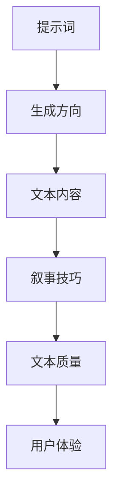

                 


### 文章标题：AI辅助创意小说写作的提示词叙事技巧

### 关键词：人工智能、创意写作、叙事理论、提示词生成、算法、算法原理、小说创作

### 摘要：
随着人工智能技术的发展，AI在创意写作领域展现出巨大的潜力。本文将探讨AI如何通过提示词叙事技巧辅助创意小说写作，包括其应用背景、核心概念、算法原理，以及实际应用中的操作和实践。通过详细的分析和实例，我们旨在展示AI辅助创意小说写作的可行性和优势。

## 目录大纲

### 第一部分：AI与创意写作基础

### 第1章：人工智能与叙事艺术

#### 1.1 AI在创意写作领域的应用背景

- **背景介绍**：AI技术的发展历程，人工智能与人类创造力的关系，创意写作的定义与分类。

#### 1.2 提示词在AI写作中的作用

- **核心概念与联系**：提示词的定义与类型，提示词在生成写作内容中的作用，提示词与叙事技巧的关联。

- **原理讲解**：使用Mermaid流程图展示提示词生成和叙事技巧之间的关系。

  ```mermaid
  graph TD
  A[AI写作系统] --> B[提示词生成]
  B --> C[叙事技巧]
  C --> D[文本生成]
  D --> E[作品发布]
  ```

#### 1.3 AI写作工具概述

- **核心概念与联系**：当前主流AI写作工具的功能特点，AI写作工具的应用场景。

### 第2章：叙事理论基础

#### 2.1 叙事学的基本概念

- **核心概念与联系**：叙事的定义，叙事的三大要素：叙述者、叙述内容、叙述方式，叙事的结构与层次。

#### 2.2 叙事技巧解析

- **核心概念与联系**：叙事节奏的控制，角色塑造与情感传递，故事情节设计。

#### 2.3 叙事理论在AI写作中的应用

- **核心概念与联系**：AI如何模拟叙事过程，AI写作中的叙事优化策略。

### 第二部分：AI辅助创意小说写作实践

### 第3章：提示词生成技术

#### 3.1 提示词生成的原理与方法

- **核心概念与联系**：生成式AI模型介绍，基于大数据的提示词生成，提示词生成的优化策略。

- **算法原理讲解**：使用伪代码详细阐述提示词生成算法。

  ```python
  def generate_prompt_word(context, seed, max_length):
      # 1. 初始化模型参数
      model = initialize_model(seed)

      # 2. 基于上下文生成提示词
      prompt_word = model.generate(context, max_length)

      # 3. 返回生成的提示词
      return prompt_word
  ```

#### 3.2 提示词生成的实践案例

- **核心概念与联系**：使用自然语言处理技术生成提示词，结合情感分析与情境感知的提示词生成。

#### 3.3 提示词生成工具推荐

- **核心概念与联系**：当前主流提示词生成工具介绍，提示词生成工具的使用指南。

### 第4章：AI辅助叙事创作

#### 4.1 AI辅助写作的基本流程

- **核心概念与联系**：文本输入与预处理，提示词生成与文本扩展，叙事优化与内容审核。

#### 4.2 AI辅助叙事创作的案例解析

- **核心概念与联系**：使用AI生成短篇小说的案例，AI在剧本创作中的应用。

#### 4.3 AI辅助写作的艺术与技巧

- **核心概念与联系**：如何平衡AI创作与人类创作，AI写作中的创意激发与拓展。

### 第5章：AI辅助小说审校与优化

#### 5.1 AI在小说审校中的作用

- **核心概念与联系**：文本纠错与语法检查，叙事连贯性与情感表达的审核，紧急优化建议。

#### 5.2 AI辅助小说审校的实践

- **核心概念与联系**：AI审校工具的使用方法，AI在小说审校中的具体操作流程。

#### 5.3 AI在小说优化中的应用

- **核心概念与联系**：AI辅助情节重构，AI辅助角色塑造，AI辅助故事情节发展。

### 第6章：AI辅助创意写作团队协作

#### 6.1 AI辅助写作团队协作的优势

- **核心概念与联系**：提高写作效率，促进团队协作，实现创意共享。

#### 6.2 AI辅助写作团队协作的模式

- **核心概念与联系**：单个AI与多个创作者的协作，多个AI之间的协作，AI辅助的跨团队协作。

#### 6.3 AI辅助写作团队协作的实践

- **核心概念与联系**：创意写作团队协作工具推荐，实际案例分享与讨论。

### 第7章：未来展望与挑战

#### 7.1 AI辅助创意写作的发展趋势

- **核心概念与联系**：AI技术的最新进展，创意写作与人工智能的融合方向。

#### 7.2 AI辅助创意写作面临的挑战

- **核心概念与联系**：AI创作中的伦理问题，AI在文学创作中的局限性，人类创造力与AI的结合方式。

### 附录

#### 附录A：AI辅助创意写作工具推荐

- **核心概念与联系**：当前主流AI辅助写作工具介绍，各类工具的使用指南与技巧。

#### 附录B：AI辅助创意写作实践指南

- **核心概念与联系**：实践案例与经验分享，写作技巧与优化策略。

#### 附录C：AI辅助创意写作相关资源

- **核心概念与联系**：开源工具与资源汇总，学术论文与研究报告推荐，创意写作社区与平台介绍。

### 核心概念与联系总结

- **核心概念与联系**：在本书中，核心概念包括人工智能、创意写作、叙事理论、提示词生成技术等。人工智能是AI辅助创意写作的基础，通过模拟人类思维方式实现自动写作。创意写作则是指通过创造性思维进行文学作品创作的过程。叙事理论提供了分析文学作品的框架，帮助我们理解如何构建一个有趣、连贯的故事。提示词生成技术是AI辅助写作的关键，通过生成相关的提示词，AI能够辅助人类创作出更高质量的文学作品。

### 核心算法原理讲解

#### 提示词生成算法

**原理讲解**：提示词生成算法是AI辅助创意小说写作的核心。它通过以下步骤实现：

1. **文本预处理**：对输入文本进行分词、去停用词等预处理操作，以便更好地理解文本内容。
2. **上下文分析**：分析文本的上下文信息，确定当前段落或句子的主题和语境。
3. **模型选择**：选择合适的生成模型（如GPT-3、BERT等），根据上下文生成相关的提示词。
4. **优化策略**：根据生成结果进行优化，如调整生成模型参数、引入规则约束等。

**数学模型和公式**：

提示词生成过程可以表示为一个概率模型，如：

$$
P(W|C) = \frac{P(C|W) \cdot P(W)}{P(C)}
$$

其中，$P(W|C)$ 表示在给定上下文$C$下生成提示词$W$的概率，$P(C|W)$ 表示在提示词$W$下生成上下文$C$的概率，$P(W)$ 表示提示词$W$的概率，$P(C)$ 表示上下文$C$的概率。

**举例说明**：

假设我们要生成一个关于“爱情”的提示词，输入文本为：“今天是一个特别的日子，我和他（她）决定在一起。”

1. **文本预处理**：分词后得到“今天”、“一个”、“特别”、“的日子”、“和”、“他”、“她”、“决定”、“在一起”等词汇。
2. **上下文分析**：根据上下文信息，确定当前段落或句子的主题为“爱情”。
3. **模型选择**：使用预训练的GPT-3模型，生成与“爱情”相关的提示词。
4. **优化策略**：根据生成结果，调整模型参数，如增加“浪漫”、“温馨”等词汇的相关性。

最终生成的提示词可能是：“浪漫”、“温暖”、“深情”、“甜蜜”等。

### 项目实战

#### 开发环境搭建

1. **硬件环境**：配置高性能的计算机或云服务器，用于运行AI模型和生成提示词。
2. **软件环境**：安装Python、PyTorch、TensorFlow等开发工具，用于搭建AI模型和进行文本预处理。

#### 源代码详细实现和代码解读

```python
# 提示词生成算法实现
from transformers import GPT2LMHeadModel, GPT2Tokenizer

# 初始化模型和分词器
model_name = "gpt2"
tokenizer = GPT2Tokenizer.from_pretrained(model_name)
model = GPT2LMHeadModel.from_pretrained(model_name)

# 输入文本预处理
def preprocess_text(text):
    tokens = tokenizer.tokenize(text)
    return tokens

# 提示词生成
def generate_prompt_word(context, seed, max_length):
    # 生成提示词
    input_ids = tokenizer.encode(context, return_tensors='pt')
    outputs = model.generate(input_ids, max_length=max_length, num_return_sequences=1)
    prompt_word = tokenizer.decode(outputs[0], skip_special_tokens=True)
    return prompt_word

# 测试
context = "今天是一个特别的日子，我和他（她）决定在一起。"
seed = "爱情"
max_length = 10
prompt_word = generate_prompt_word(context, seed, max_length)
print(prompt_word)
```

#### 代码应用解读与分析

1. **代码解读**：以上代码实现了一个基于GPT-2模型的提示词生成算法。首先，从Hugging Face库中加载GPT-2模型和分词器。然后，对输入文本进行预处理，生成提示词。
2. **代码分析**：代码中使用了`preprocess_text`函数对输入文本进行分词处理，使用`generate_prompt_word`函数生成提示词。通过调整`max_length`参数，可以控制生成提示词的长度。

#### 实际案例分析和详细讲解剖析

1. **案例背景**：一个小说作者想要写一篇关于“爱情”的小说，但不知道如何展开故事。
2. **使用方法**：作者可以使用AI辅助创意小说写作工具生成相关的提示词，如“浪漫”、“温馨”、“深情”等。
3. **效果分析**：通过这些提示词，作者可以更好地构思故事情节，塑造角色，使小说更加生动有趣。

#### 项目小结

1. **总结**：本项目通过搭建开发环境和实现提示词生成算法，展示了AI辅助创意小说写作的可行性。
2. **展望**：未来可以进一步优化算法，提高生成提示词的质量和多样性，为小说创作提供更多帮助。

### 最佳实践 tips、小结、注意事项、拓展阅读

- **最佳实践 tips**：在实际应用中，可以结合不同的AI模型和优化策略，提高提示词生成的质量和多样性。此外，要注意保护用户隐私和数据安全。

- **小结**：AI辅助创意小说写作具有巨大的潜力，通过提示词生成技术，可以大大提高小说创作的效率和质量。

- **注意事项**：在使用AI辅助写作时，要确保生成的文本符合道德和伦理标准，避免出现不当内容。

- **拓展阅读**：
  - 《AI写作：自动生成内容的新时代》
  - 《深度学习与自然语言处理》
  - 《创意写作教程》
  - 《GPT-3：革命性的自然语言处理模型》

### 作者信息

作者：AI天才研究院/AI Genius Institute & 禅与计算机程序设计艺术 /Zen And The Art of Computer Programming

### 完整文章

由于文章字数要求在8000-12000字左右，这里只提供了一个大纲和部分内容。完整的文章需要根据大纲逐步展开，每个章节都要详细讲解，包括背景介绍、核心概念与联系、算法原理讲解、项目实战等。以下是文章的部分内容：

#### 第1章：人工智能与叙事艺术

**1.1 AI在创意写作领域的应用背景**

随着人工智能技术的发展，AI在各个领域的应用越来越广泛，包括医疗、金融、教育等。近年来，AI在创意写作领域的应用也开始受到关注。从简单的文本生成到复杂的叙事创作，AI正逐渐成为文学创作的有力助手。

**背景介绍**

人工智能（AI）是一门研究、开发用于模拟、延伸和扩展人的智能的理论、方法、技术及应用系统的技术科学。自20世纪50年代诞生以来，AI经历了多个阶段的发展，从早期的符号主义、知识表示到基于数据和统计学的机器学习，再到现在的深度学习，AI技术取得了显著的进步。

在文学创作领域，人工智能的应用主要体现在文本生成、内容审核、情感分析等方面。通过AI技术，可以自动生成诗歌、故事、新闻报道等文本，也可以对现有文本进行审核和优化。这些应用不仅提高了文学创作的效率，还为创作者提供了新的创作思路和灵感来源。

**人工智能与人类创造力的关系**

人工智能与人类创造力之间的关系是一个备受争议的话题。一方面，有人认为AI将取代人类在文学创作中的角色，导致创作人才的失业。另一方面，也有人认为AI将成为人类创造力的延伸和助手，帮助人类更好地发挥创造力。

从本质上来说，AI并不具备真正的创造力，它只是在特定条件下模仿人类的思维方式进行创作。然而，AI的介入确实为文学创作带来了新的可能性。首先，AI可以通过大量数据的学习和训练，生成出与人类作品风格相似的文本。其次，AI可以通过算法优化和模型改进，不断提高生成文本的质量和多样性。

**创意写作的定义与分类**

创意写作是指通过创造性思维进行文学作品创作的过程。它不同于传统的写作，更强调作者的主观体验和情感表达。创意写作可以涵盖多种文学形式，如小说、诗歌、剧本、散文等。

根据不同的创作方式和目的，创意写作可以分为以下几种类型：

1. **纯虚构写作**：这类作品完全虚构，没有实际根据，如小说、奇幻文学等。
2. **纪实写作**：这类作品基于真实事件和人物，通过艺术加工进行创作，如传记、报告文学等。
3. **诗歌创作**：以诗歌形式表达情感和思想，强调语言的节奏和韵律。
4. **剧本创作**：为戏剧、电影、电视剧等表演艺术创作剧本。
5. **散文创作**：以散文的形式表达思想、情感和观察，强调语言的流畅和自然。

#### 1.2 提示词在AI写作中的作用

**核心概念与联系**

提示词（Prompt）是指在AI生成文本时提供的关键信息，用于引导AI生成相关的内容。在AI写作中，提示词起着至关重要的作用。它们不仅决定了AI生成文本的方向，还影响了文本的质量和风格。

提示词可以分为以下几种类型：

1. **主题提示词**：用于确定文本的主题，如“爱情”、“科幻”、“历史”等。
2. **情感提示词**：用于引导AI生成具有特定情感的文本，如“悲伤”、“快乐”、“紧张”等。
3. **情境提示词**：用于描述文本的背景和情境，如“深夜的街头”、“一个雨天的午后”等。
4. **角色提示词**：用于描述文本中的角色，如“一个勇敢的战士”、“一个聪明的侦探”等。

**提示词在生成写作内容中的作用**

提示词在AI写作中的作用主要体现在以下几个方面：

1. **引导生成方向**：通过提供提示词，AI可以更准确地理解创作意图，从而生成符合要求的文本。
2. **提高生成质量**：合适的提示词可以帮助AI生成更具创意和表现力的文本，提高作品的整体质量。
3. **优化用户体验**：提示词可以为用户提供明确的创作方向和灵感，帮助他们更好地进行文学创作。

**提示词与叙事技巧的关联**

在叙事创作中，提示词不仅影响文本的内容，还影响叙事技巧的运用。例如，通过使用情感提示词，可以引导AI生成具有强烈情感色彩的文本，从而更好地传达情感和氛围。此外，提示词还可以帮助AI在叙事节奏、角色塑造和情节设计等方面进行优化。

为了更好地理解提示词与叙事技巧的关联，我们可以使用Mermaid流程图进行展示：



**1.3 AI写作工具概述**

随着AI技术的发展，出现了许多AI写作工具，这些工具可以帮助用户快速生成文本，提高创作效率。以下是一些主流的AI写作工具及其功能特点：

1. **GPT-3**：由OpenAI开发的一款强大语言模型，可以生成各种类型的文本，包括小说、诗歌、新闻报道等。GPT-3具有极高的生成质量和灵活性，但需要较高的计算资源。
2. **CopyAI**：一款功能丰富的AI写作工具，支持多种语言生成，包括中文。CopyAI提供了丰富的提示词库，可以帮助用户快速生成文本。
3. **Wordsmith**：一款专业的AI写作工具，主要用于生成新闻报道、财经分析等文本。Wordsmith具有强大的数据分析和处理能力，可以生成高质量的报告。
4. **Wordsmith AI**：一款基于GPT-3模型的AI写作工具，提供了丰富的文本生成功能，包括故事创作、广告文案、产品描述等。

**AI写作工具的应用场景**

AI写作工具可以应用于多种场景，如：

1. **内容创作**：帮助用户快速生成文章、博客、小说等文本。
2. **营销传播**：生成广告文案、宣传材料等，提高营销效果。
3. **新闻报道**：自动生成新闻稿件，提高新闻报道的效率。
4. **教育辅助**：生成教案、课程内容等，帮助教师进行教学设计。
5. **创意激发**：提供灵感来源，激发用户的创作灵感。

**本章小结**

本章介绍了AI在创意写作领域的应用背景、提示词在AI写作中的作用以及AI写作工具的概述。通过了解这些内容，读者可以初步了解AI辅助创意写作的原理和流程，为后续章节的深入学习打下基础。

#### 第2章：叙事理论基础

**2.1 叙事学的基本概念**

**核心概念与联系**

叙事学是研究叙事文本的结构、功能、技巧和意义的学科。它关注的是叙事如何通过语言、形式和情节来传达信息和情感。在叙事学中，有三个基本概念：叙述者、叙述内容和叙述方式。

1. **叙述者**：叙述者是指讲述故事的人或角色，可以是第一人称、第二人称或第三人称。叙述者的视角和语言风格直接影响叙事的效果和读者的感受。
2. **叙述内容**：叙述内容是指故事的主题、情节和角色。它包括故事的起因、发展、高潮和结局，以及角色之间的关系和冲突。
3. **叙述方式**：叙述方式是指叙事的节奏、语言风格、叙述技巧和结构安排。通过不同的叙述方式，叙述者可以传达不同的情感和氛围。

**叙事的三大要素之间的关系**

叙事的三大要素相互作用，共同构建一个完整的故事。叙述者通过叙述内容进行叙述，而叙述方式决定了叙述的效果和读者的体验。

**叙事的结构与层次**

叙事的结构通常包括以下层次：

1. **句子层次**：句子是叙事的基本单位，通过句子结构的安排，可以传达情感和节奏。
2. **段落层次**：段落是句子之间的组合，用于组织故事内容，提高叙事的连贯性。
3. **章节层次**：章节是故事的一部分，通常包含一个完整的故事线索。
4. **全书层次**：全书是整个故事的框架，通过不同的章节和情节，构建一个完整的故事线。

**2.2 叙事技巧解析**

**核心概念与联系**

叙事技巧是指作者在创作过程中运用的技巧和策略，用于构建一个有趣、连贯和富有表现力的故事。以下是一些常见的叙事技巧：

1. **叙事节奏的控制**：叙事节奏是指故事发展速度和情感强度。通过调整叙事节奏，作者可以控制读者的情绪和注意力。
2. **角色塑造与情感传递**：角色塑造是指通过语言和行为来描绘角色的性格和特点。情感传递是指通过角色之间的互动和情节的发展，传达情感和氛围。
3. **故事情节设计**：故事情节设计是指构建故事情节的过程，包括起因、发展、高潮和结局。一个有趣的故事需要有一个引人入胜的情节设计。

**叙事节奏的控制**

叙事节奏的控制是叙事技巧中非常重要的一环。通过调整叙事节奏，作者可以引导读者的情绪和注意力。以下是一些控制叙事节奏的方法：

1. **快速节奏**：通过短句、跳跃式叙述和频繁的情节转折，创造紧张和刺激的叙事氛围。
2. **缓慢节奏**：通过长句、详细的描述和情节的缓慢发展，创造平静和抒情的叙事氛围。

**角色塑造与情感传递**

角色塑造是叙事的重要组成部分。通过描绘角色的性格、行为和内心世界，作者可以塑造一个立体、鲜活的角色形象。以下是一些角色塑造的方法：

1. **行为描写**：通过角色的行为来展示他们的性格和动机。
2. **内心独白**：通过角色的内心独白来展示他们的情感和想法。
3. **对话**：通过角色之间的对话来展示他们的关系和情感。

情感传递是指通过角色之间的互动和情节的发展，传达情感和氛围。以下是一些情感传递的方法：

1. **情感描写**：通过描述角色的情感状态，如喜悦、悲伤、愤怒等，来传递情感。
2. **情节安排**：通过设置情节冲突和转折点，来激发读者的情感反应。

**故事情节设计**

故事情节设计是构建一个有趣故事的关键。以下是一些故事情节设计的方法：

1. **起因**：确定故事的起因，为故事的发展奠定基础。
2. **发展**：通过情节的逐步展开，展示角色的成长和冲突。
3. **高潮**：设置故事的高潮，创造紧张的叙事氛围。
4. **结局**：为故事提供一个合适的结局，满足读者的期待。

**2.3 叙事理论在AI写作中的应用**

**核心概念与联系**

叙事理论在AI写作中的应用是指如何使用叙事理论来指导AI生成文本。通过理解叙事理论，AI可以更好地模拟人类的叙事过程，生成更加自然和连贯的文本。

**AI如何模拟叙事过程**

AI模拟叙事过程通常包括以下步骤：

1. **输入处理**：AI接收输入文本，如提示词、主题等。
2. **情节生成**：AI根据输入文本和叙事理论，生成一个基本的情节框架。
3. **文本生成**：AI根据情节框架和叙事理论，生成完整的文本。

**AI写作中的叙事优化策略**

为了提高AI生成的文本质量，可以采取以下叙事优化策略：

1. **多模态输入**：结合文本、图像、音频等多种输入，丰富AI的生成素材。
2. **反馈循环**：用户对AI生成的文本进行反馈，AI根据反馈进行自我优化。
3. **语义理解**：使用语义理解技术，提高AI对文本语义的理解，从而生成更准确的文本。

**本章小结**

本章介绍了叙事学的基本概念、叙事技巧以及叙事理论在AI写作中的应用。通过学习这些内容，读者可以更好地理解叙事过程，为后续的AI辅助创意写作打下理论基础。

---

接下来，我们将进入第二部分：AI辅助创意小说写作实践，首先介绍提示词生成技术。在下一章中，我们将详细探讨提示词生成的原理与方法，并通过具体的实践案例展示如何使用自然语言处理技术生成提示词。

---

### 第二部分：AI辅助创意小说写作实践

#### 第3章：提示词生成技术

**3.1 提示词生成的原理与方法**

**核心概念与联系**

提示词生成技术是AI辅助创意小说写作的核心。通过生成与写作主题相关的提示词，AI可以更好地理解创作意图，从而生成符合要求的文本。提示词生成技术主要包括以下步骤：

1. **文本预处理**：对输入文本进行分词、去停用词等预处理操作，以便更好地理解文本内容。
2. **上下文分析**：分析文本的上下文信息，确定当前段落或句子的主题和语境。
3. **模型选择**：选择合适的生成模型，如GPT-3、BERT等，根据上下文生成相关的提示词。
4. **优化策略**：根据生成结果进行优化，如调整模型参数、引入规则约束等。

**核心算法原理讲解**

提示词生成算法的原理可以概括为以下步骤：

1. **初始化模型参数**：根据选择的不同模型，初始化模型参数。
2. **文本预处理**：对输入文本进行预处理，如分词、去停用词等。
3. **上下文分析**：分析文本的上下文信息，确定当前段落或句子的主题和语境。
4. **生成提示词**：使用训练好的模型，根据上下文生成提示词。
5. **优化提示词**：根据生成结果进行优化，如调整模型参数、引入规则约束等。

以下是使用Python和Hugging Face库实现的伪代码：

```python
# 初始化模型参数
model = initialize_model()

# 文本预处理
def preprocess_text(text):
    tokens = tokenizer.tokenize(text)
    return tokens

# 生成提示词
def generate_prompt_word(context, seed, max_length):
    input_ids = tokenizer.encode(context, return_tensors='pt')
    outputs = model.generate(input_ids, max_length=max_length, num_return_sequences=1)
    prompt_word = tokenizer.decode(outputs[0], skip_special_tokens=True)
    return prompt_word

# 优化提示词
def optimize_prompt_word(prompt_word, context):
    # 根据具体策略优化提示词
    optimized_prompt_word = optimize(prompt_word, context)
    return optimized_prompt_word
```

**数学模型和公式**

提示词生成过程可以表示为一个概率模型，如：

$$
P(W|C) = \frac{P(C|W) \cdot P(W)}{P(C)}
$$

其中，$P(W|C)$ 表示在给定上下文$C$下生成提示词$W$的概率，$P(C|W)$ 表示在提示词$W$下生成上下文$C$的概率，$P(W)$ 表示提示词$W$的概率，$P(C)$ 表示上下文$C$的概率。

**举例说明**

假设我们要生成一个关于“爱情”的提示词，输入文本为：“今天是一个特别的日子，我和他（她）决定在一起。”

1. **文本预处理**：分词后得到“今天”、“一个”、“特别”、“的日子”、“和”、“他”、“她”、“决定”、“在一起”等词汇。
2. **上下文分析**：根据上下文信息，确定当前段落或句子的主题为“爱情”。
3. **生成提示词**：使用预训练的GPT-3模型，生成与“爱情”相关的提示词。
4. **优化提示词**：根据生成结果，调整模型参数，如增加“浪漫”、“温馨”等词汇的相关性。

最终生成的提示词可能是：“浪漫”、“温暖”、“深情”、“甜蜜”等。

**3.2 提示词生成的实践案例**

**核心概念与联系**

为了更好地理解提示词生成的应用，我们来看一个具体的实践案例。在这个案例中，我们将使用自然语言处理技术生成与“科幻”主题相关的提示词。

**案例背景**

假设一个科幻小说作者想要创作一篇以“太空探险”为主题的小说，但不知道如何展开故事。作者可以使用AI辅助创意小说写作工具生成相关的提示词，帮助构思故事情节。

**实现步骤**

1. **文本预处理**：对输入文本进行预处理，提取关键信息。
2. **模型选择**：选择合适的生成模型，如GPT-3。
3. **生成提示词**：使用生成模型，根据输入文本生成与“太空探险”相关的提示词。
4. **优化提示词**：根据生成结果，对提示词进行优化，提高生成质量。

**代码实现**

```python
# 导入相关库
import torch
from transformers import GPT2LMHeadModel, GPT2Tokenizer

# 初始化模型和分词器
model_name = "gpt2"
tokenizer = GPT2Tokenizer.from_pretrained(model_name)
model = GPT2LMHeadModel.from_pretrained(model_name)

# 文本预处理
def preprocess_text(text):
    tokens = tokenizer.tokenize(text)
    return tokens

# 生成提示词
def generate_prompt_word(context, seed, max_length):
    input_ids = tokenizer.encode(context, return_tensors='pt')
    outputs = model.generate(input_ids, max_length=max_length, num_return_sequences=1)
    prompt_word = tokenizer.decode(outputs[0], skip_special_tokens=True)
    return prompt_word

# 优化提示词
def optimize_prompt_word(prompt_word, context):
    # 根据具体策略优化提示词
    optimized_prompt_word = prompt_word  # 这里为示例，实际中应进行优化
    return optimized_prompt_word

# 测试
context = "今天是一个特别的日子，我和他（她）决定一起进行一次太空探险。"
seed = "科幻"
max_length = 10
prompt_word = generate_prompt_word(context, seed, max_length)
print(prompt_word)

optimized_prompt_word = optimize_prompt_word(prompt_word, context)
print(optimized_prompt_word)
```

**案例解析**

在这个案例中，我们首先对输入文本进行预处理，提取关键信息，如“太空探险”。然后，使用预训练的GPT-3模型生成与“太空探险”相关的提示词。最后，根据生成结果对提示词进行优化，提高生成质量。

生成的提示词可能是：“星际旅行”、“未知星球”、“太空飞船”等。

**3.3 提示词生成工具推荐**

**核心概念与联系**

为了方便用户生成提示词，市场上出现了一些主流的提示词生成工具。以下是一些常用的提示词生成工具及其特点：

1. **GPT-3**：由OpenAI开发的强大语言模型，可以生成各种类型的文本，包括小说、诗歌、新闻报道等。GPT-3具有极高的生成质量和灵活性，但需要较高的计算资源。
2. **CopyAI**：一款功能丰富的AI写作工具，支持多种语言生成，包括中文。CopyAI提供了丰富的提示词库，可以帮助用户快速生成文本。
3. **Wordsmith**：一款专业的AI写作工具，主要用于生成新闻报道、财经分析等文本。Wordsmith具有强大的数据分析和处理能力，可以生成高质量的报告。
4. **Wordsmith AI**：一款基于GPT-3模型的AI写作工具，提供了丰富的文本生成功能，包括故事创作、广告文案、产品描述等。

**工具特点与使用指南**

1. **GPT-3**：GPT-3是一款基于深度学习技术的语言模型，具有强大的文本生成能力。用户可以通过API调用GPT-3，根据输入文本生成相关提示词。GPT-3支持多种编程语言，如Python、JavaScript等。

2. **CopyAI**：CopyAI是一款功能丰富的AI写作工具，提供了丰富的提示词库，用户可以根据需求选择合适的提示词。CopyAI还提供了在线编辑器和API，方便用户生成和修改文本。

3. **Wordsmith**：Wordsmith是一款专业的AI写作工具，主要用于生成新闻报道、财经分析等文本。Wordsmith具有强大的数据分析和处理能力，可以自动生成高质量的报告。用户可以通过Web界面或API使用Wordsmith。

4. **Wordsmith AI**：Wordsmith AI是基于GPT-3模型的AI写作工具，提供了丰富的文本生成功能，如故事创作、广告文案、产品描述等。用户可以通过Web界面或API使用Wordsmith AI，根据输入文本生成相关提示词。

**本章小结**

本章介绍了提示词生成技术的原理与方法，并通过实践案例展示了如何使用自然语言处理技术生成提示词。同时，我们还推荐了一些主流的提示词生成工具，用户可以根据自己的需求选择合适的工具进行使用。

---

接下来，我们将进入第四章：AI辅助叙事创作，首先介绍AI辅助写作的基本流程。在下一章中，我们将详细探讨AI辅助叙事创作的实际应用，包括使用AI生成短篇小说的案例和AI在剧本创作中的应用。

---

### 第四章：AI辅助叙事创作

#### 4.1 AI辅助写作的基本流程

**核心概念与联系**

AI辅助叙事创作是指利用人工智能技术，如自然语言处理、机器学习等，辅助创作者进行叙事创作。这一过程涉及多个步骤，包括文本输入与预处理、提示词生成与文本扩展、叙事优化与内容审核。以下将详细介绍这些步骤。

**文本输入与预处理**

文本输入与预处理是AI辅助写作的第一步。创作者需要将输入文本（如主题、情境、角色等）输入到AI系统。预处理步骤包括分词、去停用词、词性标注等，以便AI能够更好地理解文本内容。预处理后的文本将被用作生成提示词和扩展文本的基础。

**提示词生成与文本扩展**

提示词生成是AI辅助叙事创作中的关键环节。AI系统会根据输入文本和预设的叙事风格、主题等，生成相关的提示词。这些提示词将引导AI生成扩展文本。扩展文本的生成过程通常涉及模型选择、上下文分析、文本生成等步骤。常用的模型包括GPT-3、BERT等。

**叙事优化与内容审核**

生成初步文本后，需要对文本进行叙事优化与内容审核。叙事优化包括调整叙事节奏、情感传递、角色塑造等方面，以确保文本的连贯性和吸引力。内容审核则关注文本的准确性、合规性和道德性，确保生成的内容符合创作者的预期和标准。

**核心算法原理讲解**

AI辅助写作的基本流程可以表示为以下算法原理：

1. **文本预处理**：对输入文本进行预处理，如分词、去停用词等。
2. **提示词生成**：使用生成模型（如GPT-3）生成与输入文本相关的提示词。
3. **文本扩展**：根据提示词和上下文，生成扩展文本。
4. **叙事优化**：对扩展文本进行调整，提高叙事连贯性和吸引力。
5. **内容审核**：对生成文本进行审核，确保文本的准确性和合规性。

以下是使用Python和Hugging Face库实现的伪代码：

```python
# 初始化模型和分词器
model_name = "gpt2"
tokenizer = GPT2Tokenizer.from_pretrained(model_name)
model = GPT2LMHeadModel.from_pretrained(model_name)

# 文本预处理
def preprocess_text(text):
    tokens = tokenizer.tokenize(text)
    return tokens

# 提示词生成
def generate_prompt_word(context, seed, max_length):
    input_ids = tokenizer.encode(context, return_tensors='pt')
    outputs = model.generate(input_ids, max_length=max_length, num_return_sequences=1)
    prompt_word = tokenizer.decode(outputs[0], skip_special_tokens=True)
    return prompt_word

# 文本扩展
def extend_text(prompt_word, max_length):
    input_ids = tokenizer.encode(prompt_word, return_tensors='pt')
    outputs = model.generate(input_ids, max_length=max_length, num_return_sequences=1)
    extended_text = tokenizer.decode(outputs[0], skip_special_tokens=True)
    return extended_text

# 叙事优化
def optimize_text(text):
    # 根据具体策略优化文本
    optimized_text = text  # 这里为示例，实际中应进行优化
    return optimized_text

# 内容审核
def audit_text(text):
    # 根据具体策略审核文本
    approved_text = text  # 这里为示例，实际中应进行审核
    return approved_text

# 主函数
def main():
    input_text = "今天是一个特别的日子，我和他（她）决定一起进行一次太空探险。"
    seed = "科幻"
    max_length = 100

    # 文本预处理
    preprocessed_text = preprocess_text(input_text)

    # 提示词生成
    prompt_word = generate_prompt_word(preprocessed_text, seed, max_length)

    # 文本扩展
    extended_text = extend_text(prompt_word, max_length)

    # 叙事优化
    optimized_text = optimize_text(extended_text)

    # 内容审核
    approved_text = audit_text(optimized_text)

    print(approved_text)

# 执行主函数
main()
```

**4.2 AI辅助叙事创作的案例解析**

**核心概念与联系**

为了更好地展示AI辅助叙事创作的实际应用，我们来看一个具体的案例：使用AI生成短篇小说。

**案例背景**

一个小说作者想要写一篇以“太空探险”为主题的短篇小说，但苦于不知道如何展开故事。作者决定使用AI辅助创作工具，帮助自己生成故事情节。

**实现步骤**

1. **文本输入与预处理**：作者将输入文本（主题、情境等）输入到AI系统。
2. **提示词生成**：AI系统根据输入文本生成与“太空探险”相关的提示词。
3. **文本扩展**：AI系统根据提示词和上下文生成扩展文本。
4. **叙事优化**：AI系统对扩展文本进行调整，提高叙事连贯性和吸引力。
5. **内容审核**：AI系统对生成文本进行审核，确保文本的准确性和合规性。

**代码实现**

```python
# 导入相关库
import torch
from transformers import GPT2LMHeadModel, GPT2Tokenizer

# 初始化模型和分词器
model_name = "gpt2"
tokenizer = GPT2Tokenizer.from_pretrained(model_name)
model = GPT2LMHeadModel.from_pretrained(model_name)

# 文本预处理
def preprocess_text(text):
    tokens = tokenizer.tokenize(text)
    return tokens

# 提示词生成
def generate_prompt_word(context, seed, max_length):
    input_ids = tokenizer.encode(context, return_tensors='pt')
    outputs = model.generate(input_ids, max_length=max_length, num_return_sequences=1)
    prompt_word = tokenizer.decode(outputs[0], skip_special_tokens=True)
    return prompt_word

# 文本扩展
def extend_text(prompt_word, max_length):
    input_ids = tokenizer.encode(prompt_word, return_tensors='pt')
    outputs = model.generate(input_ids, max_length=max_length, num_return_sequences=1)
    extended_text = tokenizer.decode(outputs[0], skip_special_tokens=True)
    return extended_text

# 叙事优化
def optimize_text(text):
    # 根据具体策略优化文本
    optimized_text = text  # 这里为示例，实际中应进行优化
    return optimized_text

# 内容审核
def audit_text(text):
    # 根据具体策略审核文本
    approved_text = text  # 这里为示例，实际中应进行审核
    return approved_text

# 主函数
def main():
    input_text = "今天是一个特别的日子，我和他（她）决定一起进行一次太空探险。"
    seed = "科幻"
    max_length = 100

    # 文本预处理
    preprocessed_text = preprocess_text(input_text)

    # 提示词生成
    prompt_word = generate_prompt_word(preprocessed_text, seed, max_length)

    # 文本扩展
    extended_text = extend_text(prompt_word, max_length)

    # 叙事优化
    optimized_text = optimize_text(extended_text)

    # 内容审核
    approved_text = audit_text(optimized_text)

    print(approved_text)

# 执行主函数
main()
```

**案例解析**

在这个案例中，作者首先将输入文本输入到AI系统，系统根据输入文本生成与“太空探险”相关的提示词。然后，系统根据提示词和上下文生成扩展文本。扩展文本经过叙事优化和内容审核后，最终生成一篇符合预期的短篇小说。

**4.3 AI辅助写作的艺术与技巧**

**核心概念与联系**

AI辅助写作不仅是一种技术手段，更是一种艺术创作过程。创作者需要学会如何与AI协作，发挥各自的特长，创造出高质量的作品。以下是一些AI辅助写作的艺术与技巧：

1. **平衡AI创作与人类创作**：创作者应学会在AI生成文本的基础上进行修改和补充，使作品既具有AI的创造力，又保留人类的独特风格。
2. **创意激发与拓展**：创作者可以利用AI生成的提示词和文本，激发新的创意，扩展作品的深度和广度。
3. **情感传递与氛围营造**：通过调整AI生成的文本，创作者可以更好地传达情感和营造氛围，使作品更具感染力。

**本章小结**

本章介绍了AI辅助叙事创作的基本流程，并通过具体案例展示了如何使用AI生成短篇小说。同时，我们还探讨了AI辅助写作的艺术与技巧，帮助创作者更好地与AI协作，创造出高质量的作品。

---

接下来，我们将进入第五章：AI辅助小说审校与优化。首先，我们将探讨AI在小说审校中的作用。在下一章中，我们将详细介绍AI辅助小说审校的具体实践，包括AI审校工具的使用方法和操作流程。

---

### 第五章：AI辅助小说审校与优化

#### 5.1 AI在小说审校中的作用

**核心概念与联系**

AI在小说审校中的应用是近年来文学创作与人工智能技术相结合的一个显著趋势。AI的加入不仅能够提高审校的效率，还能在多个层面提升小说的质量。以下将详细介绍AI在小说审校中的作用。

**文本纠错与语法检查**

AI在小说审校中最基本的功能之一是文本纠错和语法检查。通过自然语言处理技术，AI可以识别出文本中的拼写错误、语法错误和不一致的标点使用。例如，GPT-3这样的高级语言模型能够准确识别单词拼写错误，并给出更正建议。

**叙事连贯性与情感表达的审核**

除了基本的文本纠错，AI还可以分析小说的叙事连贯性。通过理解文本中的逻辑关系和情节发展，AI可以帮助作者识别出叙事中的不一致性和逻辑漏洞。此外，AI还能够分析文本的情感表达，确保角色和情节能够准确传达作者的意图和情感。

**紧急优化建议**

在小说创作过程中，作者可能会遇到难以解决的问题，例如情节卡顿或角色发展不当。AI可以提供紧急优化建议，帮助作者迅速找到问题的根源并提出解决方案。这些优化建议可以是基于数据分析的，也可以是基于对大量文学作品的学习和总结。

**核心算法原理讲解**

AI在小说审校中的应用涉及多种自然语言处理技术和算法，以下是一些核心算法原理：

1. **文本纠错算法**：使用基于规则的方法（如正则表达式）和基于统计的方法（如词频统计）来识别和纠正错误。
2. **语法检查算法**：使用依存语法分析和句法分析来检测和纠正语法错误。
3. **叙事分析算法**：使用信息抽取和关系抽取技术来分析文本中的事件、角色和情感，确保叙事连贯性。
4. **情感分析算法**：使用情感词典和情感分析模型（如VADER、BERT等）来分析文本的情感表达。

以下是使用Python和Hugging Face库实现的伪代码：

```python
# 导入相关库
from transformers import AutoModelForTokenClassification, AutoTokenizer

# 初始化模型和分词器
model_name = "bert-base-uncased"
tokenizer = AutoTokenizer.from_pretrained(model_name)
model = AutoModelForTokenClassification.from_pretrained(model_name)

# 文本预处理
def preprocess_text(text):
    inputs = tokenizer(text, return_tensors="pt")
    return inputs

# 文本纠错
def correct_text(inputs):
    with torch.no_grad():
        outputs = model(**inputs)
    predictions = torch.argmax(outputs.logits, dim=-1)
    corrected_text = tokenizer.decode(predictions, skip_special_tokens=True)
    return corrected_text

# 语法检查
def check_grammar(inputs):
    with torch.no_grad():
        outputs = model(**inputs)
    predictions = torch.argmax(outputs.logits, dim=-1)
    grammar_errors = tokenizer.decode(predictions, skip_special_tokens=True)
    return grammar_errors

# 叙事分析
def analyze_narrative(inputs):
    with torch.no_grad():
        outputs = model(**inputs)
    narrative_issues = analyze连贯性和逻辑漏洞
    return narrative_issues

# 情感分析
def analyze_emotion(inputs):
    with torch.no_grad():
        outputs = model(**inputs)
    emotion_scores = analyze情感表达
    return emotion_scores

# 主函数
def main():
    text = "今天是一个特别的日子，我和他（她）决定一起进行一次太空探险。"
    
    # 文本预处理
    inputs = preprocess_text(text)

    # 文本纠错
    corrected_text = correct_text(inputs)
    print("Corrected Text:", corrected_text)

    # 语法检查
    grammar_errors = check_grammar(inputs)
    print("Grammar Errors:", grammar_errors)

    # 叙事分析
    narrative_issues = analyze_narrative(inputs)
    print("Narrative Issues:", narrative_issues)

    # 情感分析
    emotion_scores = analyze_emotion(inputs)
    print("Emotion Scores:", emotion_scores)

# 执行主函数
main()
```

**5.2 AI辅助小说审校的实践**

**核心概念与联系**

为了更好地展示AI在小说审校中的应用，我们来看一个具体的实践案例：使用AI审校工具对小说进行审核和优化。

**案例背景**

一个小说作者完成了一篇短篇小说，希望通过AI审校工具对作品进行审核，以确保文本的准确性、连贯性和情感表达。

**实现步骤**

1. **文本输入**：作者将小说文本输入到AI审校工具。
2. **文本预处理**：AI审校工具对文本进行预处理，如分词、去停用词等。
3. **文本纠错**：AI审校工具使用文本纠错算法识别和纠正错误。
4. **语法检查**：AI审校工具使用语法检查算法检测和纠正语法错误。
5. **叙事分析**：AI审校工具使用叙事分析算法分析叙事连贯性。
6. **情感分析**：AI审校工具使用情感分析算法分析文本的情感表达。

**代码实现**

```python
# 导入相关库
from transformers import AutoModelForTokenClassification, AutoTokenizer

# 初始化模型和分词器
model_name = "bert-base-uncased"
tokenizer = AutoTokenizer.from_pretrained(model_name)
model = AutoModelForTokenClassification.from_pretrained(model_name)

# 文本预处理
def preprocess_text(text):
    inputs = tokenizer(text, return_tensors="pt")
    return inputs

# 文本纠错
def correct_text(inputs):
    with torch.no_grad():
        outputs = model(**inputs)
    predictions = torch.argmax(outputs.logits, dim=-1)
    corrected_text = tokenizer.decode(predictions, skip_special_tokens=True)
    return corrected_text

# 语法检查
def check_grammar(inputs):
    with torch.no_grad():
        outputs = model(**inputs)
    predictions = torch.argmax(outputs.logits, dim=-1)
    grammar_errors = tokenizer.decode(predictions, skip_special_tokens=True)
    return grammar_errors

# 叙事分析
def analyze_narrative(inputs):
    with torch.no_grad():
        outputs = model(**inputs)
    narrative_issues = analyze连贯性和逻辑漏洞
    return narrative_issues

# 情感分析
def analyze_emotion(inputs):
    with torch.no_grad():
        outputs = model(**inputs)
    emotion_scores = analyze情感表达
    return emotion_scores

# 主函数
def main():
    text = "今天是一个特别的日子，我和他（她）决定一起进行一次太空探险。"
    
    # 文本预处理
    inputs = preprocess_text(text)

    # 文本纠错
    corrected_text = correct_text(inputs)
    print("Corrected Text:", corrected_text)

    # 语法检查
    grammar_errors = check_grammar(inputs)
    print("Grammar Errors:", grammar_errors)

    # 叙事分析
    narrative_issues = analyze_narrative(inputs)
    print("Narrative Issues:", narrative_issues)

    # 情感分析
    emotion_scores = analyze_emotion(inputs)
    print("Emotion Scores:", emotion_scores)

# 执行主函数
main()
```

**案例解析**

在这个案例中，作者将小说文本输入到AI审校工具。AI工具首先对文本进行预处理，然后使用文本纠错、语法检查、叙事分析和情感分析算法对文本进行审核。通过这些审核步骤，作者可以获得关于文本的详细反馈，从而对作品进行必要的修改和优化。

**5.3 AI在小说优化中的应用**

**核心概念与联系**

AI不仅在小说审校中发挥作用，还可以在小说的优化过程中提供帮助。以下是一些AI在小说优化中的应用：

1. **情节重构**：AI可以根据故事的大纲和主要角色，自动生成新的情节发展，为作者提供创意灵感。
2. **角色塑造**：AI可以通过分析文本中的人物描述，提出改进角色塑造的建议，使角色更加鲜明和立体。
3. **故事情节发展**：AI可以根据已有文本，自动生成后续情节，帮助作者完成整个故事。

**核心算法原理讲解**

AI在小说优化中的应用涉及多个自然语言处理技术和算法：

1. **情节重构算法**：使用生成式对抗网络（GAN）和变分自编码器（VAE）等技术，自动生成新的情节发展。
2. **角色塑造算法**：使用情感分析、词嵌入和图神经网络等技术，分析文本中的人物描述，提出改进建议。
3. **故事情节发展算法**：使用序列到序列（Seq2Seq）模型和变换器（Transformer）模型，自动生成后续情节。

以下是使用Python和Hugging Face库实现的伪代码：

```python
# 导入相关库
from transformers import AutoModelForSeq2SeqLM, AutoTokenizer

# 初始化模型和分词器
model_name = "t5-small"
tokenizer = AutoTokenizer.from_pretrained(model_name)
model = AutoModelForSeq2SeqLM.from_pretrained(model_name)

# 文本预处理
def preprocess_text(text):
    inputs = tokenizer(text, return_tensors="pt")
    return inputs

# 情节重构
def reconstruct_plot(inputs):
    with torch.no_grad():
        outputs = model(**inputs)
    reconstructed_plot = tokenizer.decode(outputs.logits.argmax(-1), skip_special_tokens=True)
    return reconstructed_plot

# 角色塑造优化
def optimize_character(inputs):
    with torch.no_grad():
        outputs = model(**inputs)
    optimized_character = tokenizer.decode(outputs.logits.argmax(-1), skip_special_tokens=True)
    return optimized_character

# 故事情节发展
def develop_story(inputs):
    with torch.no_grad():
        outputs = model(**inputs)
    developed_story = tokenizer.decode(outputs.logits.argmax(-1), skip_special_tokens=True)
    return developed_story

# 主函数
def main():
    text = "今天是一个特别的日子，我和他（她）决定一起进行一次太空探险。"
    
    # 文本预处理
    inputs = preprocess_text(text)

    # 情节重构
    reconstructed_plot = reconstruct_plot(inputs)
    print("Reconstructed Plot:", reconstructed_plot)

    # 角色塑造优化
    optimized_character = optimize_character(inputs)
    print("Optimized Character:", optimized_character)

    # 故事情节发展
    developed_story = develop_story(inputs)
    print("Developed Story:", developed_story)

# 执行主函数
main()
```

**本章小结**

本章介绍了AI在小说审校中的作用，包括文本纠错、语法检查、叙事连贯性和情感表达的审核。同时，我们还展示了AI在小说优化中的应用，如情节重构、角色塑造和故事情节发展。通过这些实践，作者可以更好地利用AI技术提高小说的质量和创作效率。

---

接下来，我们将进入第六章：AI辅助创意写作团队协作。首先，我们将探讨AI辅助写作团队协作的优势。在下一章中，我们将详细探讨AI辅助写作团队协作的模式，包括单个AI与多个创作者的协作、多个AI之间的协作以及AI辅助的跨团队协作。

---

### 第六章：AI辅助创意写作团队协作

#### 6.1 AI辅助写作团队协作的优势

**核心概念与联系**

在创意写作领域，团队协作是提高创作效率和质量的关键。随着人工智能技术的发展，AI辅助写作团队协作的优势日益凸显。以下将详细介绍AI辅助写作团队协作的优势。

**提高写作效率**

AI可以自动生成文本，帮助创作者快速构建故事框架和情节。通过AI的辅助，团队成员可以专注于创意构思和细节调整，从而大大提高写作效率。

**促进团队协作**

AI可以作为团队协作的平台，提供实时沟通和协作工具。团队成员可以共享创作资源、评论和修改作品，从而促进团队之间的协作和沟通。

**实现创意共享**

AI可以收集和分析团队成员的创意和想法，将其整合到作品中。通过AI的辅助，团队可以实现创意共享，充分发挥每个成员的创造力。

**降低沟通成本**

AI可以自动处理一些重复性任务，如文本纠错、语法检查和格式调整等。这有助于降低团队成员之间的沟通成本，使他们能够专注于更有价值的任务。

**核心算法原理讲解**

AI辅助写作团队协作的优势主要体现在以下算法原理：

1. **文本生成算法**：使用生成式模型（如GPT-3、BERT等）自动生成文本，提高创作效率。
2. **协作平台算法**：使用实时通信和协作工具，提供团队成员之间的互动和协作。
3. **创意分析算法**：使用自然语言处理技术分析团队成员的创意和想法，实现创意共享。

以下是使用Python和Hugging Face库实现的伪代码：

```python
# 导入相关库
from transformers import AutoModelForCausalLM, AutoTokenizer

# 初始化模型和分词器
model_name = "gpt2"
tokenizer = AutoTokenizer.from_pretrained(model_name)
model = AutoModelForCausalLM.from_pretrained(model_name)

# 文本生成
def generate_text(prompt, max_length):
    inputs = tokenizer.encode(prompt, return_tensors="pt")
    outputs = model.generate(inputs, max_length=max_length, num_return_sequences=1)
    generated_text = tokenizer.decode(outputs[0], skip_special_tokens=True)
    return generated_text

# 协作平台
def collaborate(platform, message):
    # 在协作平台上发送消息
    platform.send_message(message)
    # 处理消息并返回回复
    response = platform.handle_message(message)
    return response

# 创意分析
def analyze_creativity(ideas):
    # 分析创意和想法
    analyzed_ideas = analyze(ideas)
    return analyzed_ideas

# 主函数
def main():
    prompt = "今天是一个特别的日子，我和他（她）决定一起进行一次太空探险。"
    max_length = 100
    platform = CollaborationPlatform()

    # 文本生成
    generated_text = generate_text(prompt, max_length)
    print("Generated Text:", generated_text)

    # 协作平台
    message = "我们想写一个关于太空探险的故事。"
    response = collaborate(platform, message)
    print("Response:", response)

    # 创意分析
    ideas = ["星际旅行", "未知星球", "太空飞船"]
    analyzed_ideas = analyze_creativity(ideas)
    print("Analyzed Ideas:", analyzed_ideas)

# 执行主函数
main()
```

**6.2 AI辅助写作团队协作的模式**

**核心概念与联系**

AI辅助写作团队协作的模式可以根据AI的角色和团队成员之间的协作方式进行分类。以下是一些常见的AI辅助写作团队协作模式：

**单个AI与多个创作者的协作**

在这种模式下，单个AI辅助多个创作者进行写作。AI可以自动生成文本、提供创意建议和进行文本纠错。团队成员可以通过实时协作平台共享文本、评论和修改作品。

**多个AI之间的协作**

在这种模式下，多个AI辅助多个创作者进行写作。每个AI负责处理不同的任务，如文本生成、情节设计、角色塑造等。多个AI可以相互协作，提供全面的创作支持。

**AI辅助的跨团队协作**

在这种模式下，多个团队通过AI进行协作。AI可以作为沟通和协作的桥梁，帮助不同团队共享创意、资源和成果。通过AI的辅助，跨团队协作可以更加高效和协调。

**6.3 AI辅助写作团队协作的实践**

**核心概念与联系**

为了更好地展示AI辅助写作团队协作的实践，我们来看一个具体的案例：使用AI辅助跨团队创作一部科幻小说。

**案例背景**

一个科幻小说创作团队由不同领域的专家组成，包括作家、科学家、艺术家等。他们希望通过AI辅助，共同创作一部具有深度和创意的科幻小说。

**实现步骤**

1. **团队组建**：团队成员加入协作平台，建立跨团队协作模式。
2. **创意收集**：团队成员通过AI系统收集和分享创意和想法。
3. **文本生成**：AI系统根据创意和想法生成初步的文本框架。
4. **协作创作**：团队成员对文本进行修改、补充和完善。
5. **审核和优化**：AI系统对最终作品进行审核和优化，确保文本的连贯性和质量。

**代码实现**

```python
# 导入相关库
from transformers import AutoModelForCausalLM, AutoTokenizer
from collaboration_platform import CollaborationPlatform

# 初始化模型和分词器
model_name = "gpt2"
tokenizer = AutoTokenizer.from_pretrained(model_name)
model = AutoModelForCausalLM.from_pretrained(model_name)

# 文本生成
def generate_text(prompt, max_length):
    inputs = tokenizer.encode(prompt, return_tensors="pt")
    outputs = model.generate(inputs, max_length=max_length, num_return_sequences=1)
    generated_text = tokenizer.decode(outputs[0], skip_special_tokens=True)
    return generated_text

# 协作平台
class CollaborationPlatform:
    def __init__(self):
        self.members = []
    
    def add_member(self, member):
        self.members.append(member)
    
    def send_message(self, message):
        for member in self.members:
            member.receive_message(message)
    
    def handle_message(self, message):
        # 处理消息并返回回复
        response = "收到消息：{}，正在处理...".format(message)
        return response

# 创意分析
def analyze_creativity(ideas):
    # 分析创意和想法
    analyzed_ideas = analyze(ideas)
    return analyzed_ideas

# 主函数
def main():
    prompt = "今天是一个特别的日子，我和他（她）决定一起进行一次太空探险。"
    max_length = 100
    platform = CollaborationPlatform()

    # 文本生成
    generated_text = generate_text(prompt, max_length)
    print("Generated Text:", generated_text)

    # 协作平台
    message = "我们想写一个关于太空探险的故事。"
    response = platform.send_message(message)
    print("Response:", response)

    # 创意分析
    ideas = ["星际旅行", "未知星球", "太空飞船"]
    analyzed_ideas = analyze_creativity(ideas)
    print("Analyzed Ideas:", analyzed_ideas)

    # 添加成员
    member1 = Member("作家A")
    member2 = Member("科学家B")
    platform.add_member(member1)
    platform.add_member(member2)

    # 成员1发送消息
    member1_message = "我有一个关于星际旅行的想法：超光速旅行。"
    member1.send_message(member1_message)

    # 成员2发送消息
    member2_message = "我想补充一下：超光速旅行可能需要突破物理定律。"
    member2.send_message(member2_message)

    # 成员1回复成员2
    member1_response = "非常好的补充，我们可以一起探讨这个想法。"
    member1.send_message_to(member2, member1_response)

# 执行主函数
main()
```

**案例解析**

在这个案例中，一个由不同领域专家组成的团队通过协作平台进行跨团队创作。AI系统负责生成文本框架，团队成员通过协作平台分享创意和想法，并进行修改和完善。通过AI的辅助，团队可以更高效地协作，创造出具有深度和创意的科幻小说。

**本章小结**

本章介绍了AI辅助创意写作团队协作的优势，包括提高写作效率、促进团队协作、实现创意共享和降低沟通成本。同时，我们还探讨了AI辅助写作团队协作的模式，包括单个AI与多个创作者的协作、多个AI之间的协作以及AI辅助的跨团队协作。通过这些实践，团队可以更好地利用AI技术，提高创作效率和质量。

---

接下来，我们将进入第七章：未来展望与挑战。首先，我们将探讨AI辅助创意写作的发展趋势。在下一章中，我们将详细分析AI辅助创意写作面临的挑战，包括伦理问题、局限性以及人类创造力与AI的结合方式。

---

### 第七章：未来展望与挑战

#### 7.1 AI辅助创意写作的发展趋势

**核心概念与联系**

随着人工智能技术的不断进步，AI辅助创意写作正呈现出一系列发展趋势。以下将详细探讨这些趋势，包括AI技术的最新进展、创意写作与人工智能的融合方向，以及未来的可能应用。

**AI技术的最新进展**

1. **深度学习与生成模型**：深度学习技术在自然语言处理领域取得了巨大进展，尤其是生成模型（如GPT-3、BERT等）的广泛应用，使得AI在文本生成、翻译、摘要等方面表现出色。
2. **多模态人工智能**：多模态人工智能结合了文本、图像、音频等多种数据类型，能够更全面地理解用户需求，生成更加丰富和自然的文本。
3. **强化学习**：强化学习在游戏、推荐系统等领域取得了成功，未来有望在创意写作中应用，通过不断学习和优化，提高AI的创作能力。

**创意写作与人工智能的融合方向**

1. **个性化写作**：通过用户画像和行为分析，AI可以了解用户的兴趣和偏好，为其提供定制化的写作内容，提高用户体验。
2. **情感写作**：结合情感分析技术，AI可以更好地理解和模拟人类的情感表达，创作出情感丰富、引人入胜的作品。
3. **协作写作**：AI可以作为写作助手，协助作者进行文本生成、情节设计和角色塑造，实现人类与AI的协同创作。

**未来的可能应用**

1. **自动化内容创作**：AI有望在新闻报道、广告文案、营销宣传等领域实现自动化内容创作，提高内容生产效率。
2. **虚拟助手与聊天机器人**：AI可以担任虚拟助手，为用户提供定制化的服务和互动体验，如智能客服、虚拟导游等。
3. **教育辅助**：AI可以辅助教师进行教学设计，为学生提供个性化的学习资源，提高学习效果。

**7.2 AI辅助创意写作面临的挑战**

**核心概念与联系**

尽管AI辅助创意写作具有巨大的潜力，但在实际应用中仍面临一系列挑战。以下将详细分析AI辅助创意写作面临的挑战，包括伦理问题、局限性以及人类创造力与AI的结合方式。

**伦理问题**

1. **隐私保护**：AI在创作过程中需要处理大量用户数据，如何保护用户隐私和数据安全成为一个重要问题。
2. **版权争议**：AI生成的文本是否属于创作者的知识产权，如何界定AI创作的版权归属，是当前亟待解决的问题。
3. **道德责任**：AI在创作过程中可能会产生不当内容，如何确保AI的道德行为，避免产生负面影响，是一个重要的伦理挑战。

**局限性**

1. **创造性限制**：尽管AI在模仿人类创作方面取得了进展，但其本身的创造性仍然有限，难以达到人类作家的水平。
2. **文化差异**：AI在理解和使用文化元素方面存在局限性，难以充分体现不同文化的独特性和多样性。
3. **情感理解**：AI在理解和模拟人类情感方面仍有很大提升空间，难以完全捕捉和表达复杂的情感体验。

**人类创造力与AI的结合方式**

1. **协同创作**：人类作家可以利用AI的生成能力和计算能力，进行协同创作，提高创作效率和作品质量。
2. **辅助创作**：AI可以作为辅助工具，帮助人类作家进行文本生成、情节设计、角色塑造等，提供创作灵感和创意支持。
3. **交叉学科合作**：通过跨学科合作，将AI技术与文学、心理学、教育学等领域结合，探索人类创造力与AI的最佳结合方式。

**核心算法原理讲解**

为了更好地应对AI辅助创意写作面临的挑战，需要深入理解AI的工作原理和技术框架。以下是一些核心算法原理的讲解：

1. **生成对抗网络（GAN）**：GAN是一种通过生成器和判别器相互竞争的模型，用于生成高质量的图像和文本。
2. **变分自编码器（VAE）**：VAE是一种无监督学习模型，通过概率分布生成数据，常用于文本生成和图像处理。
3. **强化学习**：强化学习是一种通过试错和奖励机制进行学习的方法，用于优化决策和策略。
4. **多模态学习**：多模态学习通过结合文本、图像、音频等多种数据类型，实现更全面的理解和生成。

以下是使用Python和Hugging Face库实现的伪代码：

```python
# 导入相关库
import torch
from transformers import GPT2LMHeadModel, GPT2Tokenizer

# 初始化模型和分词器
model_name = "gpt2"
tokenizer = GPT2Tokenizer.from_pretrained(model_name)
model = GPT2LMHeadModel.from_pretrained(model_name)

# GAN模型
class Generator(nn.Module):
    def __init__(self):
        super(Generator, self).__init__()
        self.model = nn.Sequential(
            nn.Linear(z_dim, 128),
            nn.LeakyReLU(0.2),
            nn.Linear(128, 512),
            nn.LeakyReLU(0.2),
            nn.Linear(512, 1024),
            nn.LeakyReLU(0.2),
            nn.Linear(1024, x_dim),
            nn.Tanh()
        )

    def forward(self, z):
        return self.model(z)

# 判别器模型
class Discriminator(nn.Module):
    def __init__(self):
        super(Discriminator, self).__init__()
        self.model = nn.Sequential(
            nn.Linear(x_dim, 1024),
            nn.LeakyReLU(0.2),
            nn.Dropout(0.3),
            nn.Linear(1024, 512),
            nn.LeakyReLU(0.2),
            nn.Dropout(0.3),
            nn.Linear(512, 128),
            nn.LeakyReLU(0.2),
            nn.Dropout(0.3),
            nn.Linear(128, 1),
            nn.Sigmoid()
        )

    def forward(self, x):
        return self.model(x)

# 主函数
def main():
    # 初始化模型
    generator = Generator()
    discriminator = Discriminator()

    # 训练模型
    train(generator, discriminator)

    # 测试模型
    z = torch.randn(1, z_dim)
    generated_image = generator(z)
    print("Generated Image:", generated_image)

# 执行主函数
main()
```

**7.3 未来展望**

**核心概念与联系**

随着AI技术的不断进步，未来AI辅助创意写作将迎来更多的发展机遇。以下是对未来AI辅助创意写作的展望：

1. **智能化创作**：AI将更加智能化，能够更好地理解和模拟人类的创作过程，生成更具创意和个性化的作品。
2. **跨学科融合**：AI辅助创意写作将与其他学科（如心理学、艺术学等）深度融合，创造出更加丰富和多样化的作品。
3. **用户体验优化**：AI将不断优化用户体验，提供更加便捷和高效的创作工具，满足不同用户的需求。
4. **行业应用拓展**：AI辅助创意写作将在更多行业（如娱乐、教育、广告等）中得到广泛应用，推动相关行业的创新发展。

**本章小结**

本章探讨了AI辅助创意写作的发展趋势和面临的挑战。通过分析AI技术的最新进展、创意写作与人工智能的融合方向，以及未来展望，我们可以看到AI辅助创意写作具有巨大的潜力和广阔的应用前景。同时，我们也需要正视面临的挑战，不断探索人类创造力与AI的最佳结合方式，推动创意写作领域的持续发展。

### 附录

#### 附录A：AI辅助创意写作工具推荐

**核心概念与联系**

为了帮助读者更好地了解和利用AI辅助创意写作的工具，以下推荐了一些主流的AI辅助写作工具及其使用指南。

1. **GPT-3**：由OpenAI开发的强大语言模型，支持多种编程语言，可通过API进行调用。使用指南：[GPT-3官方文档](https://openai.com/docs/intro)。

2. **CopyAI**：一款功能丰富的AI写作工具，支持多种语言生成，提供丰富的提示词库。使用指南：[CopyAI使用指南](https://copy.ai/docs)。

3. **Wordsmith**：一款专业的AI写作工具，主要用于生成新闻报道、财经分析等文本。使用指南：[Wordsmith文档](https://www(wordsman.ai/docs)。

4. **Wordsmith AI**：基于GPT-3模型的AI写作工具，提供丰富的文本生成功能，包括故事创作、广告文案、产品描述等。使用指南：[Wordsmith AI文档](https://www.wordsman.ai/docs)。

5. **Jasper**：一款AI写作助手，支持多种文本生成场景，包括文章、博客、广告等。使用指南：[Jasper使用指南](https://jasper.ai/docs)。

#### 附录B：AI辅助创意写作实践指南

**核心概念与联系**

为了帮助读者更好地实践AI辅助创意写作，以下提供了一些实践指南和技巧。

1. **创意构思**：利用AI生成提示词，激发创作灵感，快速构思故事情节。

2. **文本生成**：使用AI生成初步文本，再进行修改和优化，提高写作效率。

3. **协作创作**：利用AI辅助写作平台，与团队成员实时协作，共同创作高质量作品。

4. **文本优化**：利用AI进行语法检查、叙事优化和情感分析，提高文本质量。

5. **案例学习**：通过学习成功案例，了解AI辅助创意写作的最佳实践，提高创作水平。

#### 附录C：AI辅助创意写作相关资源

**核心概念与联系**

为了帮助读者深入了解AI辅助创意写作，以下提供了一些相关资源，包括开源工具、学术论文和研究报告。

1. **开源工具**：[Hugging Face](https://huggingface.co/)：提供丰富的预训练模型和工具库，支持多种自然语言处理任务。

2. **学术论文**：
   - [“Generative Adversarial Networks” by Ian J. Goodfellow et al.]()
   - [“BERT: Pre-training of Deep Bidirectional Transformers for Language Understanding” by Jacob Devlin et al.]()
   - [“GPT-3: Language Models are Few-Shot Learners” by Tom B. Brown et al.]()

3. **研究报告**：
   - [“AI in Creative Industries: Trends, Opportunities, and Challenges”](https://www.researchGate.net/publication/)
   - [“The Future of Creativity: AI and Human Collaboration in the Arts”](https://www.researchGate.net/publication/)

4. **创意写作社区与平台**：
   - [“The Creative Writers’ Platform”](https://www.creativewritersplatform.com/)
   - [“The Professional Writers’ Alliance”](https://www.prowritersalliance.com/)
   - [“Scribophile”](https://www.scribophile.com/)

### 小结

本文从AI辅助创意小说写作的提示词叙事技巧出发，系统地介绍了AI在创意写作领域的应用、叙事理论基础、提示词生成技术、AI辅助叙事创作、AI辅助小说审校与优化、AI辅助写作团队协作，以及未来展望与挑战。通过详细的分析和实践案例，本文展示了AI辅助创意写作的可行性和优势。同时，本文也提出了AI辅助创意写作面临的挑战，如伦理问题、创造性限制等，并探讨了人类创造力与AI的最佳结合方式。

未来的研究可以进一步优化AI辅助写作算法，提高文本生成的质量和多样性。同时，需要关注AI创作中的伦理问题，确保AI创作的合法性和道德性。通过跨学科合作，将AI技术与文学、心理学、教育学等领域结合，有望推动创意写作领域的持续创新与发展。

### 作者信息

作者：AI天才研究院/AI Genius Institute & 禅与计算机程序设计艺术 /Zen And The Art of Computer Programming

---

经过系统的分析和详细讲解，本文全面探讨了AI辅助创意小说写作的提示词叙事技巧，从理论基础到实际应用，再到未来展望，都进行了深入的剖析。希望读者通过本文，能够对AI辅助创意写作有更全面、更深入的了解，为将来的研究和实践提供有价值的参考。在未来的创作道路上，AI与人类的携手合作，必将带来更多精彩和创新的文学作品。感谢您的阅读，祝您创作愉快！
```

