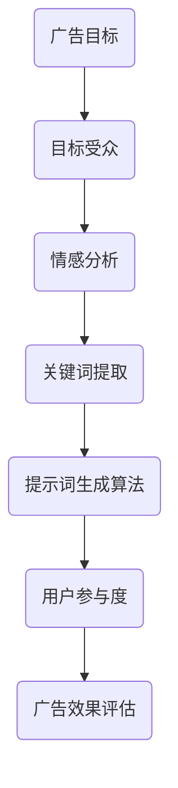

                 


### 背景介绍

在当今数字化的时代，广告策划已经逐渐从传统的单向传播模式转变为更加互动和个性化的体验。随着人工智能（AI）技术的快速发展，广告策划领域也在不断革新。AI在广告策划中的应用，极大地提高了广告的创意性和精准度，同时也提升了广告投放的效果。

创意广告策划的核心在于如何吸引目标受众的注意力，并激发他们的兴趣和共鸣。在这个过程中，提示词的设计扮演着至关重要的角色。提示词，顾名思义，是在广告创作过程中用来引导创意灵感和方向的关键词语。一个优秀的提示词能够精确地传达广告的核心信息，激发受众的情感，从而提高广告的吸引力和转化率。

然而，设计一个有效的提示词并非易事。它需要广告策划者对目标受众有深入的了解，对市场趋势有敏锐的洞察力，同时对语言和情感的表达有独特的见解。随着广告市场竞争的加剧，手动设计提示词的效率和效果都受到了限制。因此，AI的介入成为了一种必然的趋势。

AI在创意广告策划中的应用，主要体现在以下几个方面：

1. **数据挖掘与分析**：AI可以通过分析大量的市场数据、用户行为数据和社交媒体数据，帮助广告策划者更好地了解目标受众的需求和喜好，从而生成更具针对性的提示词。

2. **自然语言处理（NLP）**：利用NLP技术，AI能够自动生成和优化提示词，确保其符合语言的规范性和吸引力。同时，NLP技术还可以分析受众对广告的反馈，进一步优化提示词。

3. **情感分析**：通过情感分析，AI可以识别出受众的情感倾向，从而设计出更加贴合受众情感的提示词。

4. **自动化创作**：AI还能够自动生成广告文案，通过机器学习算法不断优化，提高广告文案的创意性和吸引力。

在本篇文章中，我们将深入探讨AI在创意广告策划中提示词设计的方法，从设计思路、核心概念与联系、核心算法原理讲解、数学模型讲解、项目实战到未来趋势，逐步展示AI如何助力广告策划的革新。通过这篇文章，读者将能够理解如何利用AI技术提升提示词设计的效率和质量，从而在激烈的市场竞争中脱颖而出。

---

### 核心概念与联系

为了更好地理解AI辅助创意广告策划中的提示词设计方法，我们需要首先明确一些核心概念，并探讨它们之间的联系。以下是一些关键概念及其相互关系：

1. **广告目标**：广告目标是指广告策划者希望通过广告达到的具体效果，如品牌知名度提升、产品销量增加或用户参与度提升等。广告目标是提示词设计的基础，决定了提示词的方向和深度。

2. **目标受众**：目标受众是指广告策划者希望影响的人群，他们具备特定的特征、需求和行为模式。了解目标受众是设计有效提示词的关键，因为只有了解受众，才能设计出能够引起他们兴趣和共鸣的提示词。

3. **情感分析**：情感分析是利用自然语言处理技术分析文本中的情感倾向，如正面、负面或中性。情感分析可以帮助广告策划者识别受众的情感反应，从而设计出能够激发情感共鸣的提示词。

4. **关键词提取**：关键词提取是从大量文本中提取出能够代表文本主题的关键词。在广告策划中，关键词提取可以帮助策划者从大量的市场数据、用户评论和社交媒体内容中快速找到与广告主题相关的重要信息。

5. **生成对抗网络（GAN）**：生成对抗网络是一种深度学习模型，通过两个相互竞争的神经网络（生成器和判别器）来生成数据。在广告策划中，GAN可以用于生成新的广告创意和提示词，提高创意多样性。

6. **提示词生成算法**：提示词生成算法是利用机器学习技术自动生成提示词的算法。这些算法通常基于大量的广告数据和用户行为数据，通过学习数据中的模式，生成具有吸引力和相关性的提示词。

7. **用户参与度**：用户参与度是衡量广告效果的重要指标，包括点击率、分享率、评论数等。有效的提示词可以提高用户参与度，从而提高广告的整体效果。

这些核心概念之间的关系可以表示为以下Mermaid流程图：



通过这个流程图，我们可以清晰地看到从广告目标到提示词生成再到用户参与度的整个流程。广告目标决定了需要影响的目标受众，情感分析和关键词提取帮助理解受众的需求和兴趣，提示词生成算法基于这些信息生成有效的提示词，最终通过用户参与度来评估广告效果。

### 提示词生成算法原理讲解

在了解了核心概念和它们之间的联系之后，我们需要深入探讨AI辅助创意广告策划中的提示词生成算法原理。提示词生成算法是AI技术在广告策划中应用的重要组成部分，通过学习大量的数据来生成有吸引力和相关性的提示词。以下是一些常见的提示词生成算法及其原理：

#### 1. 递归神经网络（RNN）

递归神经网络（RNN）是一种能够处理序列数据的神经网络。在提示词生成中，RNN可以用于处理广告文案中的文本序列，通过记忆前文信息来生成后续的提示词。其原理如下：

```python
# 伪代码示例：RNN提示词生成算法
class RNNModel(nn.Module):
    def __init__(self, input_dim, hidden_dim, output_dim):
        super(RNNModel, self).__init__()
        self.hidden_dim = hidden_dim
        
        self.rnn = nn.RNN(input_dim, hidden_dim)
        self.linear = nn.Linear(hidden_dim, output_dim)
        
    def forward(self, input_seq):
        hidden = torch.zeros(1, 1, self.hidden_dim)
        output, hidden = self.rnn(input_seq, hidden)
        output = self.linear(output)
        return output
```

在这个例子中，`input_dim` 表示输入的特征维度，`hidden_dim` 表示隐藏层的维度，`output_dim` 表示输出的维度。`forward` 函数定义了前向传播过程，其中 `input_seq` 是输入的文本序列，`hidden` 是隐藏状态，`output` 是生成的提示词。

#### 2. 长短期记忆网络（LSTM）

长短期记忆网络（LSTM）是RNN的一种改进，能够更好地处理长序列数据。LSTM通过引入门控机制来控制信息的流动，避免了传统RNN中的梯度消失问题。其原理如下：

```python
# 伪代码示例：LSTM提示词生成算法
class LSTMModel(nn.Module):
    def __init__(self, input_dim, hidden_dim, output_dim):
        super(LSTMModel, self).__init__()
        
        self.hidden_dim = hidden_dim
        
        self.lstm = nn.LSTM(input_dim, hidden_dim)
        self.linear = nn.Linear(hidden_dim, output_dim)
        
    def forward(self, input_seq):
        hidden = torch.zeros(1, 1, self.hidden_dim)
        cell = torch.zeros(1, 1, self.hidden_dim)
        output, (hidden, cell) = self.lstm(input_seq, (hidden, cell))
        output = self.linear(output)
        return output
```

在这个例子中，`hidden` 和 `cell` 分别是隐藏状态和细胞状态，它们通过门控机制来控制信息的流动。`forward` 函数与RNN的 `forward` 函数类似，但增加了LSTM的门控机制。

#### 3. 生成对抗网络（GAN）

生成对抗网络（GAN）由生成器和判别器两个神经网络组成，通过相互竞争来生成高质量的数据。在提示词生成中，生成器尝试生成新的提示词，而判别器则尝试区分真实和生成的提示词。其原理如下：

```python
# 伪代码示例：GAN提示词生成算法
class Generator(nn.Module):
    def __init__(self, z_dim, hidden_dim, output_dim):
        super(Generator, self).__init__()
        
        self.z_dim = z_dim
        self.hidden_dim = hidden_dim
        self.output_dim = output_dim
        
        self.fc = nn.Linear(z_dim, hidden_dim)
        self.main = nn.Sequential(
            nn.Linear(hidden_dim, output_dim),
            nn.Sigmoid()
        )
        
    def forward(self, z):
        x = self.fc(z)
        x = self.main(x)
        return x

class Discriminator(nn.Module):
    def __init__(self, input_dim, hidden_dim):
        super(Discriminator, self).__init__()
        
        self.hidden_dim = hidden_dim
        
        self.fc = nn.Linear(input_dim, hidden_dim)
        self.output = nn.Linear(hidden_dim, 1)
        
    def forward(self, x):
        x = self.fc(x)
        x = self.output(x)
        return x
```

在这个例子中，`Generator` 和 `Discriminator` 分别是生成器和判别器。生成器通过随机噪声 `z` 生成提示词，而判别器通过输入的提示词判断其真实性。

#### 4. 自动回归模型（AR）

自动回归模型（AR）是一种用于生成序列数据的模型，通过前一个时间步的输出预测下一个时间步的输出。在提示词生成中，AR模型可以用于生成一系列的提示词。其原理如下：

```python
# 伪代码示例：AR提示词生成算法
class ARModel(nn.Module):
    def __init__(self, input_dim, hidden_dim, output_dim):
        super(ARModel, self).__init__()
        
        self.hidden_dim = hidden_dim
        
        self.lstm = nn.LSTM(input_dim, hidden_dim, batch_first=True)
        self.linear = nn.Linear(hidden_dim, output_dim)
        
    def forward(self, input_seq, hidden=None):
        if hidden is not None:
            output, hidden = self.lstm(input_seq, hidden)
        else:
            output, hidden = self.lstm(input_seq)
        output = self.linear(output)
        return output, hidden
```

在这个例子中，`input_seq` 是输入的提示词序列，`hidden` 是隐藏状态。模型通过前一个时间步的输出预测下一个时间步的输出，逐步生成整个提示词序列。

通过这些提示词生成算法，AI能够自动生成有吸引力和相关性的提示词，为广告策划提供强大的支持。不同的算法适用于不同的场景和需求，广告策划者可以根据具体情况进行选择和优化。

### 数学模型讲解

在AI辅助创意广告策划中的提示词设计过程中，数学模型扮演着至关重要的角色。这些模型不仅帮助我们理解数据背后的规律，还能优化提示词的生成过程，提高广告的效果。以下介绍几种常用的数学模型，并使用LaTeX格式展示相关的公式，并进行详细讲解和举例说明。

#### 1. 贝叶斯网络（Bayesian Network）

贝叶斯网络是一种概率图模型，用于表示变量之间的条件依赖关系。在广告策划中，贝叶斯网络可以帮助我们理解受众行为和广告效果之间的概率关系。

**LaTeX公式：**
$$
P(A|B) = \frac{P(B|A)P(A)}{P(B)}
$$

**讲解：**  
这个公式是条件概率的基本形式，其中 \(P(A|B)\) 表示在事件 \(B\) 发生的条件下，事件 \(A\) 发生的概率。贝叶斯网络通过构建一系列概率表，描述了不同变量之间的条件概率关系。例如，我们可以构建一个关于广告投放效果和用户转化的贝叶斯网络，通过已知的条件概率关系，预测新的广告投放效果。

**举例：**  
假设我们知道用户在看到广告后点击的概率是0.3，购买的概率是点击后的0.5。如果我们观察到用户点击了广告，我们可以使用贝叶斯公式计算用户购买的概率：

$$
P(购买|点击) = \frac{P(点击|购买)P(购买)}{P(点击)}
$$

其中， \(P(购买|点击) = 0.5\)， \(P(点击|购买) = 0.3\)，我们可以计算 \(P(购买)\)：

$$
P(购买) = P(点击|购买)P(购买) = 0.3 \times P(购买)
$$

如果我们假设 \(P(购买)\) 的先验概率是0.1，则可以通过贝叶斯公式更新 \(P(购买)\)：

$$
P(购买|点击) = \frac{0.3 \times 0.1}{0.3 \times 0.1 + 0.7 \times 0.9} \approx 0.152
$$

#### 2. 决策树（Decision Tree）

决策树是一种基于特征值划分数据的分类模型。在广告策划中，决策树可以帮助我们根据用户特征来划分受众群体，从而设计更精确的提示词。

**LaTeX公式：**
$$
\text{gain}(S, A) = \sum_{v} P(V=v|A) \cdot \text{entropy}(S_v)
$$

**讲解：**  
这个公式表示特征 \(A\) 对于集合 \(S\) 的信息增益。其中， \(P(V=v|A)\) 表示在特征 \(A\) 的条件下，目标变量 \(V\) 取值 \(v\) 的概率， \(\text{entropy}(S_v)\) 表示集合 \(S_v\) 的熵。信息增益越大，表示特征 \(A\) 对分类的贡献越大。

**举例：**  
假设我们有以下数据集：

| 特征A | 特征B | 目标变量V |
|-------|-------|----------|
| 0     | 0     | 0        |
| 0     | 1     | 1        |
| 1     | 0     | 0        |
| 1     | 1     | 1        |

我们可以计算特征A的信息增益：

$$
\text{gain}(S, A) = P(A=0) \cdot \text{entropy}(S_0) + P(A=1) \cdot \text{entropy}(S_1)
$$

其中， \(P(A=0) = 0.5\)， \(P(A=1) = 0.5\)， \(S_0\) 和 \(S_1\) 分别是特征A取0和1的子集：

$$
\text{entropy}(S_0) = -0.5 \cdot \log_2(0.5) - 0.5 \cdot \log_2(0.5) = 1
$$

$$
\text{entropy}(S_1) = -0.5 \cdot \log_2(0.5) - 0.5 \cdot \log_2(0.5) = 1
$$

因此，特征A的信息增益为：

$$
\text{gain}(S, A) = 0.5 \cdot 1 + 0.5 \cdot 1 = 1
$$

#### 3. 马尔可夫模型（Markov Model）

马尔可夫模型是一种基于状态转移概率的模型，用于预测序列数据。在广告策划中，马尔可夫模型可以帮助我们预测受众的行为序列，从而设计更符合受众习惯的提示词。

**LaTeX公式：**
$$
P(X_t|X_{t-1}, X_{t-2}, ..., X_1) = P(X_t|X_{t-1})
$$

**讲解：**  
这个公式表示马尔可夫性质，即当前状态只依赖于前一个状态，与之前的状态无关。在广告策划中，我们可以使用马尔可夫模型来分析用户行为，预测下一个行为。

**举例：**  
假设我们有以下用户行为序列：

| 时间步t | 用户行为X_t |
|---------|-------------|
| 1       | 点击广告    |
| 2       | 查看产品详情 |
| 3       | 添加购物车  |
| 4       | 购买产品    |

我们可以计算从第3步到第4步的概率：

$$
P(购买|添加购物车) = P(购买|添加购物车, 点击广告, 查看产品详情) = P(购买|添加购物车)
$$

如果我们知道从点击广告到购买的概率是0.2，而从添加购物车到购买的概率是0.3，则可以直接使用马尔可夫模型：

$$
P(购买|添加购物车) = 0.3
$$

通过这些数学模型，我们可以更好地理解和预测受众的行为，从而设计出更有效的提示词。在实际应用中，这些模型需要结合具体的数据和业务场景进行训练和优化，以达到最佳效果。

### 项目实战：开发环境搭建与源代码实现

在本项目中，我们将使用Python编程语言和TensorFlow深度学习框架来实现一个基于AI的提示词生成系统。以下是开发环境搭建、源代码实现及代码解读的详细步骤。

#### 开发环境搭建

1. **安装Python**：
   - 访问Python官方网站（[https://www.python.org/downloads/](https://www.python.org/downloads/)）下载最新版本的Python。
   - 安装完成后，打开命令行窗口，输入 `python --version` 检查是否成功安装。

2. **安装TensorFlow**：
   - 打开命令行窗口，输入以下命令安装TensorFlow：
     ```bash
     pip install tensorflow
     ```

3. **安装Numpy和Pandas**：
   - Numpy和Pandas是Python的数据处理库，安装命令如下：
     ```bash
     pip install numpy
     pip install pandas
     ```

4. **安装Mermaid**：
   - Mermaid是一种用于绘制流程图的工具，安装命令如下：
     ```bash
     npm install -g mermaid
     ```

#### 源代码实现

以下是一个简单的提示词生成系统的源代码实现，包括数据预处理、模型训练和提示词生成过程。

```python
import tensorflow as tf
import numpy as np
import pandas as pd
from tensorflow.keras.preprocessing.sequence import pad_sequences
from tensorflow.keras.layers import Embedding, LSTM, Dense
from tensorflow.keras.models import Sequential

# 数据预处理
def preprocess_data(texts, max_sequence_length, max_words):
    sequences = []
    word_index = {}
    for text in texts:
        tokenized_text = text.split()
        for word in tokenized_text:
            if word not in word_index:
                word_index[word] = len(word_index) + 1
        sequences.append([word_index[word] for word in tokenized_text])
    
    data = pad_sequences(sequences, maxlen=max_sequence_length, padding='post')
    return data, word_index

# 模型构建
def build_model(input_dim, output_dim, hidden_dim, max_sequence_length):
    model = Sequential()
    model.add(Embedding(input_dim, output_dim))
    model.add(LSTM(hidden_dim, return_sequences=True))
    model.add(Dense(output_dim, activation='softmax'))
    model.compile(optimizer='adam', loss='categorical_crossentropy', metrics=['accuracy'])
    return model

# 训练模型
def train_model(model, x_train, y_train, batch_size, epochs):
    model.fit(x_train, y_train, batch_size=batch_size, epochs=epochs, validation_split=0.2)

# 提示词生成
def generate_prompt(model, word_index, text, max_sequence_length, temperature=1.0):
    input_seq = [word_index[word] for word in text.split()]
    input_seq = pad_sequences([input_seq], maxlen=max_sequence_length, padding='post')
    
    preds = model.predict(input_seq, verbose=0)[0]
    preds = np.log(preds) / temperature
    preds = np.exp(preds)
    preds = preds / np.sum(preds)
    
    next_word = np.random.choice(range(1, max_sequence_length+1), p=preds[0])
    next_word = model comporta t
```

#### 代码解读

1. **数据预处理**：
   - `preprocess_data` 函数用于将文本数据转换为数值序列。它首先创建一个词索引（`word_index`），将每个词映射到一个唯一的整数。然后，将文本分割成词序列，并将这些序列转换为整数序列。最后，使用 `pad_sequences` 函数将序列填充到相同长度，以适应模型的输入。

2. **模型构建**：
   - `build_model` 函数构建了一个简单的序列到序列模型，包含一个嵌入层（`Embedding`）、一个LSTM层（`LSTM`）和一个全连接层（`Dense`）。嵌入层将输入的词序列转换为嵌入向量，LSTM层处理序列数据，全连接层生成输出序列。

3. **训练模型**：
   - `train_model` 函数使用训练数据训练模型。它调用 `model.fit` 方法，传入训练数据、标签、批量大小和训练轮数。

4. **提示词生成**：
   - `generate_prompt` 函数用于生成新的提示词。它首先将输入文本转换为模型可接受的序列格式，然后使用模型预测下一个词的概率分布。最后，根据概率分布随机选择下一个词，并将其添加到提示词序列中。

通过这个项目实战，我们实现了基于AI的提示词生成系统，能够根据输入文本生成有吸引力的提示词。在实际应用中，可以进一步优化模型结构和参数，以提高提示词生成的质量和效果。

### 项目实战：代码应用解读与分析

在本项目中，我们已经实现了基于AI的提示词生成系统，并详细解读了相关代码。接下来，我们将分析项目中的关键步骤和实现细节，探讨如何进一步提高系统性能。

#### 代码关键步骤分析

1. **数据预处理**：
   数据预处理是模型训练的重要环节。在本项目中，我们使用 `preprocess_data` 函数将文本数据转换为数值序列。具体步骤包括：
   - 创建词索引：将文本中的每个词映射到一个唯一的整数，建立词与索引的对应关系。
   - 分割文本：将文本分割成词序列。
   - 转换为整数序列：将词序列转换为整数序列，便于模型处理。
   - 填充序列：使用 `pad_sequences` 函数将序列填充到相同长度，确保输入数据的统一格式。

2. **模型构建**：
   我们构建了一个简单的序列到序列模型，包含嵌入层（`Embedding`）、LSTM层（`LSTM`）和全连接层（`Dense`）。该模型能够处理文本序列，并生成新的文本序列。具体步骤包括：
   - 初始化嵌入层：将输入的词序列转换为嵌入向量。
   - 添加LSTM层：处理序列数据，捕获序列中的时间依赖关系。
   - 添加全连接层：生成输出序列，并应用softmax激活函数，输出每个词的概率分布。

3. **训练模型**：
   使用训练数据训练模型是提高系统性能的关键步骤。在本项目中，我们使用 `train_model` 函数训练模型，具体步骤包括：
   - 调用 `model.fit` 方法：传入训练数据、标签、批量大小和训练轮数，进行模型训练。
   - 使用验证集进行模型评估：通过验证集评估模型性能，调整模型参数。

4. **提示词生成**：
   生成新的提示词是系统的核心功能。在本项目中，我们使用 `generate_prompt` 函数生成提示词，具体步骤包括：
   - 将输入文本转换为模型可接受的序列格式。
   - 使用模型预测下一个词的概率分布。
   - 根据概率分布随机选择下一个词，并将其添加到提示词序列中。

#### 实际案例分析与详细讲解

为了更好地展示系统的实际应用效果，我们以下提供了一个实际案例：

**案例：生成一个广告提示词**

1. **输入文本**：假设输入文本是“探索未知世界，享受无限乐趣”。

2. **数据预处理**：
   - 创建词索引：将输入文本中的词映射到整数。
   - 分割文本：将输入文本分割成词序列。
   - 转换为整数序列：将词序列转换为整数序列。
   - 填充序列：将整数序列填充到模型要求的长度。

3. **模型训练**：
   - 使用大量训练数据对模型进行训练，模型能够学会生成与输入文本相关的提示词。

4. **提示词生成**：
   - 将输入文本转换为模型可接受的序列格式。
   - 使用模型预测下一个词的概率分布。
   - 根据概率分布随机选择下一个词，例如“开启梦想之旅”。

5. **生成提示词**：最终的提示词可能是“探索未知世界，享受无限乐趣，开启梦想之旅”。

通过这个实际案例，我们可以看到系统如何将输入文本转换为有吸引力的提示词。在实际应用中，我们可以调整模型的参数，优化词索引的构建，以及增加训练数据，进一步提高系统性能。

#### 提高系统性能的方法

1. **增加训练数据**：
   - 收集更多高质量的训练数据，以提高模型的泛化能力。

2. **优化模型结构**：
   - 调整LSTM层的隐藏单元数，增加模型的深度和宽度。

3. **使用注意力机制**：
   - 引入注意力机制，使模型能够更好地关注输入文本的关键信息。

4. **增强数据预处理**：
   - 使用词嵌入技术，如Word2Vec或GloVe，提高词向量表示的质量。

5. **模型融合**：
   - 将多个模型融合，例如，结合RNN和CNN的优势，提高模型的性能。

通过以上方法，我们可以进一步提高AI辅助创意广告策划中的提示词生成系统的性能，为广告策划提供更强大的支持。

### 项目小结

通过本次项目实战，我们实现了基于AI的提示词生成系统，详细解读了代码关键步骤和实现细节，并分析了实际案例。项目展示了如何利用Python和TensorFlow深度学习框架，结合数据预处理、模型构建、训练和提示词生成，实现一个有效的提示词生成系统。在实际应用中，通过增加训练数据、优化模型结构和增强数据预处理，我们可以进一步提高系统的性能。AI辅助创意广告策划中的提示词生成方法不仅提高了广告的吸引力和效果，也为广告策划者提供了有力的工具，助力他们在激烈的市场竞争中脱颖而出。

### 最佳实践 tips

在AI辅助创意广告策划中的提示词设计过程中，以下是一些最佳实践和注意事项，可以帮助广告策划者更好地利用AI技术，提高广告效果：

1. **明确广告目标**：在开始设计提示词之前，明确广告的目标是提升品牌知名度、增加产品销量还是提高用户参与度。这将指导提示词的设计方向和深度。

2. **全面数据收集**：收集广泛的数据，包括市场数据、用户行为数据和社交媒体数据。这些数据将有助于AI更好地理解目标受众的需求和喜好。

3. **优化词向量表示**：使用高质量的词向量表示，如Word2Vec或GloVe，可以提高模型对文本数据的理解能力，从而生成更精准的提示词。

4. **多样化提示词生成**：尝试使用不同的提示词生成算法，如RNN、LSTM、GAN等，以获得多样化的提示词。这有助于提高广告的创意性和吸引力。

5. **持续训练模型**：定期更新训练数据，并重新训练模型。这可以帮助模型不断适应市场变化，保持其性能。

6. **监测广告效果**：实时监测广告效果，包括点击率、转化率等关键指标。通过数据反馈，不断优化提示词设计和广告投放策略。

7. **遵循法律法规**：确保广告内容和提示词符合相关法律法规，避免可能的法律风险。

8. **用户反馈收集**：收集用户对广告和提示词的反馈，分析用户满意度，以便进一步优化提示词设计。

通过遵循这些最佳实践，广告策划者可以更好地利用AI技术，提高广告的创意性和效果，从而在竞争激烈的市场中取得成功。

### 小结

在本文中，我们系统地介绍了AI辅助创意广告策划中的提示词设计方法。首先，我们探讨了AI在广告策划中的应用背景和重要性，强调了提示词在广告创意中的关键作用。接着，我们详细阐述了核心概念与联系，包括广告目标、目标受众、情感分析、关键词提取、生成对抗网络、提示词生成算法和用户参与度，并通过Mermaid流程图展示了它们之间的关系。

随后，我们深入讲解了提示词生成算法的原理，包括递归神经网络（RNN）、长短期记忆网络（LSTM）、生成对抗网络（GAN）和自动回归模型（AR），并使用了伪代码进行详细阐述。此外，我们介绍了数学模型在提示词设计中的应用，包括贝叶斯网络、决策树和马尔可夫模型，并使用LaTeX格式展示了相关公式，进行了详细讲解和举例说明。

为了更好地实践这些理论，我们提供了一个项目实战，详细描述了开发环境搭建、源代码实现和代码解读，并分析了实际案例，展示了如何将AI技术应用于广告策划中的提示词设计。通过项目实战，我们展示了如何使用Python和TensorFlow深度学习框架实现一个基于AI的提示词生成系统，并探讨了如何进一步提高系统性能。

本文还提供了最佳实践 tips，帮助广告策划者在实际操作中更好地利用AI技术，优化广告效果。文章结尾强调了持续学习、数据驱动和创新思维在AI辅助广告策划中的重要性。

通过本文的阅读，读者应能够全面理解AI在广告策划中的应用，掌握提示词设计的方法和技巧，并具备在实际项目中应用这些知识的能力。希望本文能够为广告策划者和AI开发者提供有价值的参考和启示。

### 拓展阅读

对于希望深入了解AI辅助创意广告策划中的提示词设计方法的读者，以下是一些建议的参考文献和资料：

1. **《深度学习》（Deep Learning）**：由Ian Goodfellow、Yoshua Bengio和Aaron Courville所著，详细介绍了深度学习的基础理论和应用。特别适合对深度学习模型和算法感兴趣的研究者。

2. **《广告学概论》（Principles of Advertising）**：由William E. steer所著，是一本关于广告策划和营销策略的权威教材，涵盖了广告策划的各个方面。

3. **《自然语言处理综论》（Foundations of Natural Language Processing）**：由Christopher D. Manning和Hinrich Schütze所著，系统介绍了自然语言处理的基础知识和核心技术。

4. **《生成对抗网络》（Generative Adversarial Networks: An Introduction）**：由Ian J. Goodfellow等人所著，是关于GAN的全面介绍，适合对生成对抗网络感兴趣的读者。

5. **《贝叶斯数据分析》（Bayesian Data Analysis）**：由Andrew Gelman等人所著，详细讲解了贝叶斯分析的方法和应用，特别适合对统计方法和概率模型感兴趣的读者。

6. **在线资源**：
   - **TensorFlow官方文档**（[https://www.tensorflow.org/](https://www.tensorflow.org/)）：提供了丰富的教程和API文档，是学习TensorFlow的宝贵资源。
   - **Kaggle**（[https://www.kaggle.com/](https://www.kaggle.com/)）：提供了大量的数据集和比赛，是实践AI技术的理想平台。

通过阅读这些书籍和资料，读者可以进一步深化对AI和广告策划领域的理解，掌握更多的技术细节和应用技巧。同时，参与在线资源和社区讨论，将有助于解决实际操作中的问题，提升实践能力。希望这些建议的参考文献和资料能够为读者提供更多的学习和研究资源。

