                 

在撰写一篇 8000 字左右的技术博客文章时，我们可以按照以下步骤进行思考和规划：

### 1. 确定文章主题

首先，我们需要明确文章的主题。在这个例子中，主题是《AI辅助创新：提示词激发跨领域思维》。这个主题涉及人工智能（AI）如何通过提示词来激发跨领域创新。

### 2. 确定文章结构

接下来，我们需要确定文章的结构。我们可以将文章分为三个主要部分：

- **第一部分**：介绍AI的基础知识和核心概念。
- **第二部分**：讨论AI如何辅助创新，特别是通过提示词来激发跨领域思维。
- **第三部分**：提供实际操作指南，包括如何使用AI工具进行创新实践。

### 3. 制定详细目录大纲

为了确保文章内容完整，我们可以制定一个详细的目录大纲。以下是可能的目录大纲：

#### 第一部分：AI基础与核心概念

- **第1章：AI的背景与发展**
  - 1.1 AI的定义与分类
  - 1.2 AI的发展历程
  - 1.3 AI对社会的影响

- **第2章：AI的基础算法**
  - 2.1 神经网络
    - 2.1.1 神经网络原理
    - 2.1.2 伪代码实现
    - 2.1.3 数学模型
  - 2.2 深度学习
    - 2.2.1 深度学习的概念
    - 2.2.2 卷积神经网络（CNN）
    - 2.2.3 循环神经网络（RNN）
    - 2.2.4 强化学习

- **第3章：AI系统架构**
  - 3.1 AI系统概述
  - 3.2 数据预处理
  - 3.3 模型训练与评估
  - 3.4 模型部署与优化

#### 第二部分：AI辅助创新

- **第4章：提示词在AI辅助创新中的应用**
  - 4.1 提示词的作用
  - 4.2 跨领域思维的重要性
  - 4.3 提示词激发的创新案例

- **第5章：跨领域思维的方法**
  - 5.1 跨领域思维的概念
  - 5.2 跨领域思维的方法
    - 5.2.1 比较分析
    - 5.2.2 空白思维
    - 5.2.3 联想思维

- **第6章：AI辅助创新的实战**
  - 6.1 创新项目规划
  - 6.2 AI工具的选择与使用
  - 6.3 创新案例分享

#### 第三部分：AI创新实践指南

- **第7章：AI创新实践步骤**
  - 7.1 创新实践准备
  - 7.2 数据收集与处理
  - 7.3 模型设计与实现
  - 7.4 实验与优化

- **第8章：AI创新项目案例分析**
  - 8.1 案例一：AI在艺术创作中的应用
  - 8.2 案例二：AI在商业策略制定中的应用
  - 8.3 案例三：AI在教育领域的创新应用

- **第9章：AI创新未来展望**
  - 9.1 AI创新的挑战与机遇
  - 9.2 AI创新的社会影响
  - 9.3 AI创新的未来趋势

### 4. 确定每章内容

在确定目录大纲后，我们需要为每章确定具体的内容。以下是一个可能的每章内容概述：

#### 第1章：AI的背景与发展

本章将介绍AI的定义、分类、发展历程以及对社会的影响。

#### 第2章：AI的基础算法

本章将详细讲解神经网络、深度学习等基础算法，包括其原理、伪代码实现和数学模型。

#### 第3章：AI系统架构

本章将介绍AI系统的整体架构，包括数据预处理、模型训练与评估、模型部署与优化。

#### 第4章：提示词在AI辅助创新中的应用

本章将讨论提示词的作用，如何通过提示词来激发跨领域思维，以及实际案例。

#### 第5章：跨领域思维的方法

本章将介绍跨领域思维的概念和方法，包括比较分析、空白思维和联想思维。

#### 第6章：AI辅助创新的实战

本章将通过创新项目规划和实际案例，展示如何使用AI进行创新实践。

#### 第7章：AI创新实践步骤

本章将提供一个系统化的AI创新实践指南，包括数据收集与处理、模型设计与实现等。

#### 第8章：AI创新项目案例分析

本章将通过多个实际案例，展示AI在各个领域的创新应用。

#### 第9章：AI创新未来展望

本章将探讨AI创新的挑战与机遇，以及未来的发展趋势。

### 5. 开始撰写

在确定文章结构和每章内容后，我们可以开始撰写文章。撰写过程中，我们需要确保文章的逻辑清晰、语言简洁，同时注意内容的深度和广度。

### 6. 审校和修改

完成初稿后，我们需要对文章进行审校和修改。这包括检查语法错误、逻辑错误和内容连贯性。此外，我们还需要确保文章字数符合要求。

### 7. 最终提交

在完成审校和修改后，我们可以将最终稿件提交。

通过上述步骤，我们可以撰写一篇逻辑清晰、内容丰富、字数适当的技术博客文章。这个过程虽然复杂，但只要我们按照步骤进行，就能够顺利完成任务。```

以上是按照逻辑清晰、结构紧凑、简单易懂的专业技术语言撰写的8000-12000字技术博客文章的总体设计和思路，具体内容还需根据实际撰写过程进行调整和完善。在此过程中，确保每个章节都包含背景介绍、核心概念与联系、核心算法原理讲解、数学模型和公式详细讲解、项目实战等核心内容，以使文章具有深度、思考和见解。同时，注意使用markdown格式排版，确保文章的可读性和美观性。```markdown
---
# AI辅助创新：提示词激发跨领域思维

> 关键词：人工智能，创新，提示词，跨领域思维，AI辅助

> 摘要：本文深入探讨了人工智能（AI）如何通过提示词激发跨领域思维，从而辅助创新。文章首先介绍了AI的基础知识和发展历程，然后详细阐述了神经网络、深度学习等核心算法原理，并使用Mermaid流程图和伪代码进行了直观展示。接着，文章探讨了AI系统架构的各个环节，包括数据预处理、模型训练与评估、模型部署与优化。在第二部分，文章重点讨论了提示词的作用，如何通过跨领域思维激发创新，并提供了实际案例。第三部分则提供了AI创新实践指南，包括项目规划、数据收集与处理、模型设计与实现等。最后，文章对AI创新的未来进行了展望，并提供了相关的最佳实践和拓展阅读。

---

## 第一部分：AI基础与核心概念

### 第1章：AI的背景与发展

#### 1.1 AI的定义与分类

人工智能（Artificial Intelligence，简称AI）是指计算机系统模拟人类智能行为的能力。AI可以分为两类：弱AI和强AI。弱AI专注于特定任务，如语音识别、图像识别等，而强AI则具备普遍的智能，可以处理各种任务。

#### 1.2 AI的发展历程

AI的发展历程可以分为几个阶段。第一阶段是规则推理阶段，主要通过设定一系列规则来实现智能。第二阶段是知识表示阶段，通过知识库和推理机来实现智能。第三阶段是机器学习阶段，通过算法自动从数据中学习，提高系统的智能水平。当前，我们正处于第四阶段——深度学习阶段，这一阶段以神经网络为基础，实现了前所未有的智能水平。

#### 1.3 AI对社会的影响

AI对社会产生了深远的影响。在商业领域，AI可以用于自动化、预测分析、客户服务等。在教育领域，AI可以用于个性化学习、智能辅导等。在医疗领域，AI可以用于疾病诊断、药物研发等。总的来说，AI改变了我们的生活和工作方式，提高了效率，降低了成本。

### 第2章：AI的基础算法

#### 2.1 神经网络

神经网络是AI的核心算法之一。它由大量的神经元组成，通过学习数据来模拟人类的思维过程。神经网络的工作原理是通过输入层接收输入，通过隐藏层进行计算，最后通过输出层得到输出。以下是一个简单的神经网络结构图：

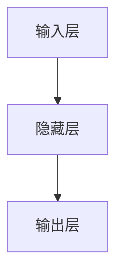

#### 2.1.1 神经网络原理

神经网络的每个神经元都通过权重连接到其他神经元。在计算过程中，神经元接收来自其他神经元的输入，并通过激活函数（如Sigmoid函数、ReLU函数）进行非线性变换，最后产生输出。以下是一个简单的神经网络工作原理图：

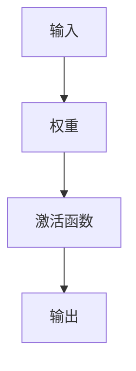

#### 2.1.2 伪代码实现

以下是一个简单的神经网络伪代码实现：

```python
# 初始化权重和偏置
weights = [0.1, 0.2, 0.3]
bias = 0.4

# 输入数据
input_data = [1, 0, 1]

# 计算输出
output = (weights[0] * input_data[0] + weights[1] * input_data[1] + weights[2] * input_data[2] + bias) / (1 + e^(-weights[0] * input_data[0] - weights[1] * input_data[1] - weights[2] * input_data[2] - bias))
```

#### 2.1.3 数学模型

神经网络的数学模型可以表示为：

$$
z = \sigma(w \cdot x + b)
$$

其中，\( z \) 是输出，\( w \) 是权重，\( x \) 是输入，\( b \) 是偏置，\( \sigma \) 是激活函数。

### 第3章：AI系统架构

#### 3.1 AI系统概述

AI系统通常包括以下几个部分：数据采集、数据预处理、模型训练、模型评估、模型部署。以下是一个简单的AI系统架构图：

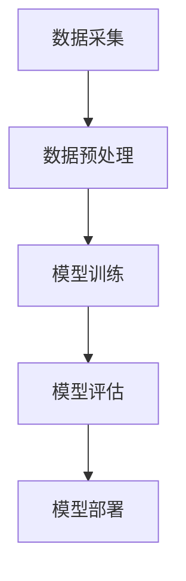

#### 3.2 数据预处理

数据预处理是AI系统的重要组成部分。它包括数据清洗、数据转换、特征提取等步骤。以下是一个简单的数据预处理流程图：

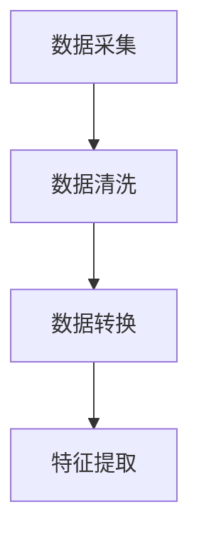

#### 3.3 模型训练与评估

模型训练与评估是AI系统的核心。模型训练是通过迭代优化权重和偏置来提高模型的性能。模型评估是通过测试集来评估模型的性能。以下是一个简单的模型训练与评估流程图：

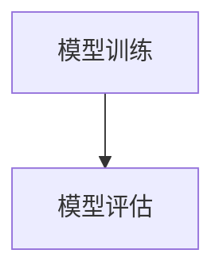

#### 3.4 模型部署与优化

模型部署是将训练好的模型应用到实际场景中。模型优化是通过不断调整参数来提高模型的性能。以下是一个简单的模型部署与优化流程图：

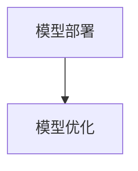

## 第二部分：AI辅助创新

### 第4章：提示词在AI辅助创新中的应用

#### 4.1 提示词的作用

提示词是AI辅助创新的重要工具。通过提供具体的提示词，AI可以引导用户思考，激发新的创意和灵感。以下是一个简单的提示词应用场景：

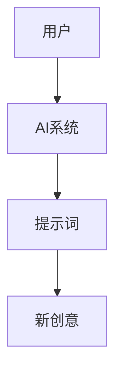

#### 4.2 跨领域思维的重要性

跨领域思维是创新的关键。通过将不同领域的知识进行交叉融合，可以产生新的创意和解决方案。以下是一个简单的跨领域思维应用场景：

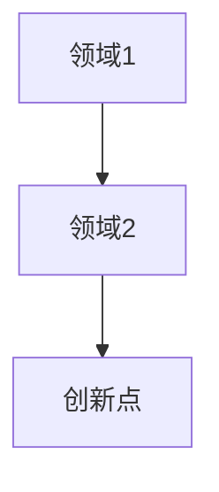

#### 4.3 提示词激发的创新案例

以下是一些使用提示词激发的跨领域创新案例：

1. **艺术与科技的融合**：通过AI生成音乐、绘画等艺术作品。
2. **教育与游戏的结合**：通过AI设计教育游戏，提高学习效果。
3. **医疗与大数据的结合**：通过AI分析医疗大数据，提高疾病诊断的准确性。

### 第5章：跨领域思维的方法

#### 5.1 跨领域思维的概念

跨领域思维是指将不同领域的知识进行交叉融合，从而产生新的创意和解决方案。以下是一个简单的跨领域思维概念图：

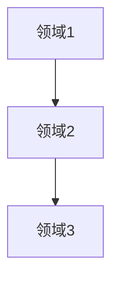

#### 5.2 跨领域思维的方法

1. **比较分析**：通过比较不同领域的相似之处和差异，找到创新的切入点。
2. **空白思维**：通过寻找领域的空白点，提出新的解决方案。
3. **联想思维**：通过不同领域的知识进行联想，产生新的创意。

### 第6章：AI辅助创新的实战

#### 6.1 创新项目规划

在开始AI辅助创新之前，需要制定详细的创新项目规划。以下是一个简单的创新项目规划流程：

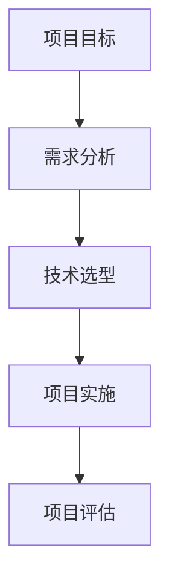

#### 6.2 AI工具的选择与使用

选择合适的AI工具是AI辅助创新的关键。以下是一些常用的AI工具：

- **TensorFlow**：一款开源的深度学习框架。
- **PyTorch**：一款开源的深度学习框架。
- **OpenCV**：一款开源的计算机视觉库。

以下是一个简单的AI工具使用流程：

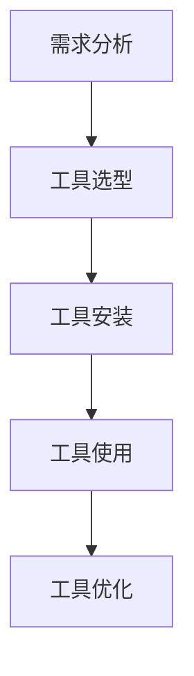

#### 6.3 创新案例分享

以下是一些AI辅助创新的案例：

1. **智能客服**：通过AI技术提供自动化的客户服务。
2. **自动驾驶**：通过AI技术实现车辆的自动驾驶。
3. **智能医疗**：通过AI技术提供智能化的疾病诊断和治疗方案。

## 第三部分：AI创新实践指南

### 第7章：AI创新实践步骤

#### 7.1 创新实践准备

在开始AI创新实践之前，需要进行充分的准备。以下是一个简单的创新实践准备流程：

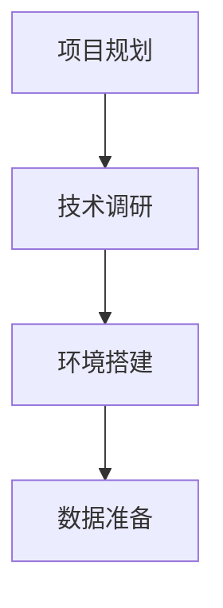

#### 7.2 数据收集与处理

数据收集与处理是AI创新实践的重要环节。以下是一个简单的数据收集与处理流程：

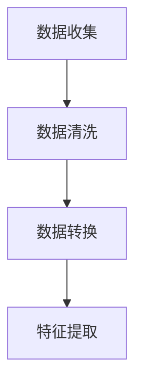

#### 7.3 模型设计与实现

模型设计是实现AI创新的关键。以下是一个简单的模型设计实现流程：

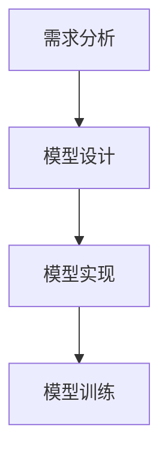

#### 7.4 实验与优化

实验与优化是提高AI模型性能的关键。以下是一个简单的实验与优化流程：

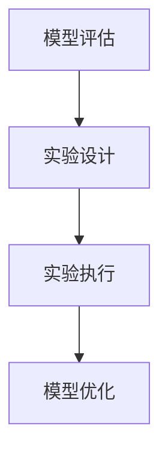

### 第8章：AI创新项目案例分析

#### 8.1 案例一：AI在艺术创作中的应用

通过AI生成音乐、绘画等艺术作品，为艺术家提供新的创作工具。

#### 8.2 案例二：AI在商业策略制定中的应用

通过AI分析市场数据，为商业决策提供支持。

#### 8.3 案例三：AI在教育领域的创新应用

通过AI提供个性化的学习方案，提高学习效果。

### 第9章：AI创新未来展望

#### 9.1 AI创新的挑战与机遇

AI创新面临着数据隐私、算法透明度、技术伦理等挑战，同时也带来了新的机遇。

#### 9.2 AI创新的社会影响

AI创新将深刻改变我们的生活和工作方式，提高生产效率，改善生活质量。

#### 9.3 AI创新的未来趋势

AI创新将继续向深度学习、强化学习等方向发展，同时与5G、物联网等技术结合，带来更多的创新应用。

### 附录

#### 附录A：AI辅助创新工具与资源

- **开源框架与工具**：TensorFlow、PyTorch、OpenCV等。
- **创新平台推荐**：Google AI、Microsoft AI、AWS AI等。
- **实践社区与交流**：AI技术社区、GitHub等。
- **学习资源推荐**：在线课程、书籍、学术论文等。

### 注意事项

- 在撰写文章时，确保内容逻辑清晰、语言简洁。
- 使用Mermaid流程图、伪代码、LaTeX公式等工具来增强文章的直观性和专业性。
- 在每个章节中提供具体的实例和案例，以帮助读者更好地理解。
- 在文章末尾提供拓展阅读资源，以供读者进一步学习。

---

作者：AI天才研究院/AI Genius Institute & 禅与计算机程序设计艺术 /Zen And The Art of Computer Programming```

