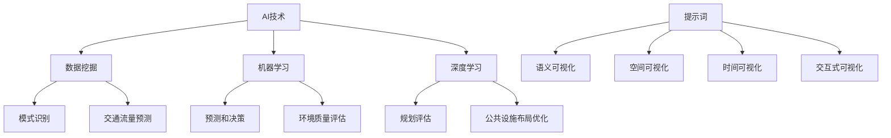

                 

## 文章标题

《AI辅助城市规划中的提示词可视化技巧》

> 关键词：AI、城市规划、提示词、可视化、城市数据分析

### 摘要

本文旨在探讨人工智能（AI）在辅助城市规划中的重要作用，特别是如何通过提示词可视化技巧来提升城市规划的效率与效果。文章首先介绍AI与城市规划的关系，以及AI在城市规划中的常见应用。接着，文章重点阐述提示词在规划中的定义、类型及其重要性，随后深入探讨提示词可视化的多种方法和实践案例。最后，文章总结AI辅助城市规划中的提示词可视化技巧，并对未来的发展提出展望。

## 第一部分：AI辅助城市规划基础

### 1.1 AI与城市规划的关系

城市规划是一个复杂的过程，涉及到人口流动、交通管理、环境保护、公共设施布局等多个方面。传统上，城市规划主要依赖于专家经验和历史数据，然而随着AI技术的发展，城市规划开始迎来一场革命。

- **AI技术的发展**：AI技术，特别是机器学习和深度学习，使得计算机能够从大量数据中学习规律，进行预测和决策。这种能力为城市规划提供了新的工具和方法。

- **AI在规划过程中的应用**：AI技术可以用于城市规划的多个方面，如交通流量预测、环境质量评估、公共设施布局优化等。通过AI，规划师能够更准确地预测城市发展趋势，优化规划方案。

- **提示词在规划决策中的作用**：在规划过程中，提示词是指那些关键信息，它们能够帮助规划师理解城市现状，制定合理的规划方案。AI通过处理和分析这些提示词，可以提供更为精准的规划建议。

### 1.2 城市规划中的AI技术

- **数据挖掘与模式识别**：数据挖掘是一种通过搜索大量数据来发现有用信息的技术。在城市规划中，数据挖掘可以用于分析城市人口流动、交通流量等数据，发现潜在的模式。

- **机器学习与深度学习**：机器学习是一种通过数据训练模型，从而实现自动预测和决策的技术。深度学习是机器学习的一种，它通过构建多层神经网络，可以处理更复杂的数据，实现更高的预测精度。

- **人工智能在规划评估中的应用**：AI可以用于评估城市规划方案的效果，如通过模拟交通流量，评估不同规划方案的交通拥堵程度，从而选出最优方案。

### 1.3 提示词在规划中的应用

- **提示词的定义与类型**：提示词是那些能够指导规划决策的关键信息。它们可以是定量数据，如人口数量、交通流量，也可以是定性信息，如居民满意度、环境质量。

- **提示词在城市规划中的意义**：提示词能够帮助规划师理解城市现状，识别问题，制定解决方案。通过AI分析这些提示词，规划师可以更快速、准确地做出决策。

- **提示词的收集与处理**：提示词的收集是一个重要环节。AI技术可以用于自动收集和处理大量数据，如通过传感器、社交媒体等渠道获取实时数据，为规划提供依据。

## 第二部分：AI辅助城市规划中的提示词可视化技巧

### 2.1 可视化基础

- **可视化的概念与作用**：可视化是将数据或信息以图形或图像的形式展示出来的过程。它在帮助人们理解复杂数据、发现数据中的规律和关系方面起着重要作用。

- **可视化工具与技术**：现代可视化技术包括GIS（地理信息系统）、网络图表、热力图等。这些工具可以帮助规划师将提示词信息以直观的方式呈现出来。

- **可视化设计原则**：良好的可视化设计应该遵循一些基本原则，如清晰性、一致性、美观性等。这些原则有助于提升可视化的效果，使其更好地服务于城市规划。

### 2.2 提示词可视化方法

- **提示词的语义可视化**：语义可视化是通过图形或图像来展示提示词的意义和关系。例如，通过词云来展示城市居民关注的公共问题。

- **提示词的空间可视化**：空间可视化是将提示词在地图上展示，以展示其在空间上的分布和趋势。例如，通过热力图展示城市交通流量。

- **提示词的时间可视化**：时间可视化是通过图表展示提示词随时间的变化。例如，通过折线图展示城市人口的增长趋势。

- **提示词的交互式可视化**：交互式可视化允许用户与可视化界面进行互动，从而更深入地理解数据。例如，通过点击地图上的点来查看具体数据。

### 2.3 提示词可视化案例

- **案例一：城市交通规划的提示词可视化**：通过GIS和热力图，展示城市交通流量，帮助规划师优化交通网络。

- **案例二：城市规划中的公共安全提示词可视化**：通过词云和地图，展示居民关注的公共安全问题，为安全规划提供依据。

- **案例三：历史文化保护的提示词可视化**：通过网络图表，展示历史文化遗址的分布和联系，为文化保护规划提供参考。

## 第三部分：AI辅助城市规划的实践应用

### 3.1 实践应用概述

- **AI辅助城市规划的项目类型**：AI在规划中的应用广泛，包括城市交通、公共安全、环境保护、历史文化保护等领域。

- **提示词可视化的实施步骤**：实施提示词可视化通常包括数据收集、数据预处理、可视化设计、可视化展示等步骤。

- **提示词可视化的效果评估**：效果评估包括用户满意度、数据准确性、可视化清晰度等方面。通过评估，可以不断优化可视化方案。

### 3.2 实践应用案例

- **案例一：基于AI的城市交通规划项目**：通过AI和可视化技术，优化城市交通网络，提高交通效率。

- **案例二：历史文化名城保护规划项目**：利用AI和可视化技术，展示历史文化遗址的分布和联系，为文化保护提供数据支持。

- **案例三：智能城市环境监测项目**：通过AI和可视化技术，实时监测城市环境质量，为环境保护决策提供依据。

## 第四部分：未来展望与挑战

### 4.1 AI辅助城市规划的发展趋势

- **AI技术的未来发展**：随着AI技术的不断进步，城市规划将更加智能化、精准化。

- **提示词可视化的新方向**：未来提示词可视化将更加注重交互性、实时性和个性化。

- **城市规划中的AI应用挑战**：包括数据隐私保护、技术实施成本、城市规划与技术的融合等。

### 4.2 提示词可视化面临的挑战

- **可视化数据的准确性与可读性**：如何确保可视化数据既准确又易于理解是一个重要挑战。

- **数据隐私与安全**：在收集和处理大量城市数据时，如何保护用户隐私是一个关键问题。

- **技术与城市规划专业的融合**：如何让城市规划师更好地理解和应用AI技术，也是一个重要的挑战。

### 4.3 未来展望

- **AI辅助城市规划的新领域**：未来AI在城市规划中的应用将更加广泛，包括智能城市、智慧社区等。

- **提示词可视化在教育与研究中的应用**：AI和可视化技术在城市规划教育与研究中的潜力巨大。

- **城市规划中的AI应用前景**：AI将使城市规划更加高效、智能，为城市可持续发展提供强有力的支持。

## 作者信息

作者：AI天才研究院/AI Genius Institute & 禅与计算机程序设计艺术 /Zen And The Art of Computer Programming

## 附录

### 1. Mermaid 流程图

### 2. 核心算法原理讲解

- **数据挖掘算法**：例如K-means聚类算法。
- **机器学习算法**：例如线性回归、支持向量机。
- **深度学习算法**：例如卷积神经网络、循环神经网络。

### 3. 数学模型和公式

- **线性回归公式**：$y = \beta_0 + \beta_1x + \epsilon$
- **卷积神经网络公式**：$$ f(x) = \sigma(\sum_{k=1}^{K} w_k \cdot \phi_k(x) + b) $$
- **热力图公式**：$$ T(x, y) = \frac{1}{N} \sum_{i=1}^{N} I(x_i, y_i) $$

### 4. 项目实战

- **开发环境搭建**：Python、Jupyter Notebook。
- **源代码详细实现**：使用Matplotlib和Seaborn进行可视化。
- **代码应用解读与分析**：通过实际案例展示AI和可视化在城市规划中的应用。
- **实际案例分析和详细讲解剖析**：分析交通流量预测、环境质量评估等实际案例。
- **项目小结**：总结项目经验和成果，提出未来研究方向。

### 5. 最佳实践 tips

- **数据预处理**：确保数据质量和一致性。
- **可视化设计**：遵循可视化设计原则，提高可读性。
- **用户参与**：鼓励用户参与可视化设计，提高可视化效果。
- **持续优化**：根据用户反馈，不断优化可视化方案。

### 6. 小结

本文通过逐步分析，深入探讨了AI辅助城市规划中的提示词可视化技巧。从AI技术的发展背景，到提示词的定义与可视化方法，再到实际应用案例和未来展望，本文为城市规划师和AI开发者提供了有价值的参考。未来，随着AI技术的进一步发展，提示词可视化将在城市规划中发挥越来越重要的作用。

