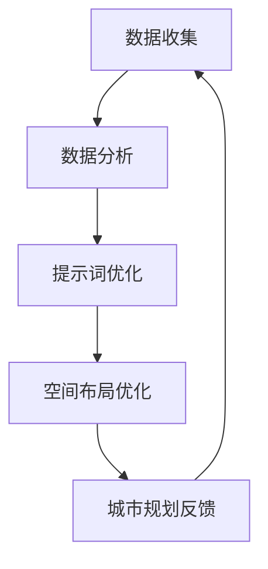

                 


## 文章标题
### AI辅助城市规划：提示词优化空间布局

---

### 关键词
- **人工智能**，**城市规划**，**空间布局**，**提示词**，**优化算法**，**机器学习**

---

### 摘要
本文探讨了人工智能（AI）在辅助城市规划中的应用，特别是提示词在优化空间布局方面的作用。通过介绍AI的基本原理和城市规划的核心概念，本文详细阐述了空间布局优化技术，包括提示词设计原理和优化算法。通过实际案例研究和项目分析，本文展示了AI辅助城市规划的最佳实践，并展望了未来的发展趋势和挑战。

---

## 引言
### 1.1 AI辅助城市规划概述

人工智能（AI）作为现代技术的前沿领域，已经在许多行业中展现了其巨大的潜力。城市规划，作为一门综合性学科，需要处理大量的数据和信息，而AI的引入为这一领域带来了新的机遇和挑战。

**城市规划**是指为了满足社会、经济、环境等多方面的需求，对城市空间进行系统性的规划与设计。传统的城市规划往往依赖于经验判断和数据统计，而AI的介入则可以通过数据分析和模式识别，提供更精确和高效的解决方案。

在AI辅助城市规划中，**空间布局**的优化是一个重要的研究方向。空间布局不仅关系到城市的功能分区、交通流线、公共设施布局，还直接影响居民的生活质量和社会经济发展。通过AI技术，尤其是机器学习、自然语言处理和计算机视觉等技术，可以实现对空间布局的自动分析和优化，从而提高城市的整体运行效率。

### 1.2 城市规划中的挑战与机遇

城市规划面临着诸多挑战，包括人口增长、城市扩张、环境污染、交通拥堵等。这些挑战不仅考验着城市规划者的智慧和经验，也对传统规划方法提出了新的要求。

AI技术的引入为城市规划带来了新的机遇。首先，AI能够处理和分析海量数据，帮助规划者更准确地了解城市的需求和问题。其次，AI可以通过模拟和预测，提供创新的规划方案，降低规划风险。此外，AI还可以优化资源配置，提高城市的可持续性和韧性。

### 1.3 本书结构安排

本文将分为七个章节，系统地介绍AI辅助城市规划的相关内容。具体结构如下：

1. 引言：概述AI辅助城市规划的背景和重要性。
2. 核心概念与原理：介绍AI和城市规划的基础概念及其相互关系。
3. 空间布局优化技术：详细探讨空间布局优化的技术手段和方法。
4. 实践应用：分析AI在城市规划实践中的应用案例。
5. 案例研究：深入探讨具体案例，展示AI在空间布局优化中的效果。
6. 未来趋势与挑战：展望AI在城市规划中的发展趋势和面临的挑战。
7. 结论与展望：总结主要观点，提出未来研究方向。

通过这样的结构安排，本文旨在为读者提供一个全面、系统的AI辅助城市规划指南。

## 核心概念与原理

### 2.1 AI基础概念

人工智能（AI）是一种模拟人类智能的技术，旨在使计算机系统具备自主学习和执行任务的能力。AI的核心包括机器学习（Machine Learning, ML）、深度学习（Deep Learning, DL）和自然语言处理（Natural Language Processing, NLP）等子领域。

**机器学习**是一种通过数据驱动的方法来改进计算机性能的技术。它依赖于统计学、概率论和优化理论，使计算机能够从数据中学习模式和规律，并基于这些模式做出预测和决策。在AI辅助城市规划中，机器学习可以用于数据分析和模式识别，帮助规划者了解城市发展趋势和居民需求。

**深度学习**是机器学习的一个分支，它使用多层神经网络（Neural Networks）来提取数据的复杂特征。深度学习在图像识别、语音识别和自然语言处理等领域取得了显著成果。在城市规划中，深度学习可以通过分析卫星图像和遥感数据，识别城市中的建筑、道路和绿地，从而为空间布局优化提供支持。

**自然语言处理**是AI的一个重要分支，它旨在使计算机能够理解和处理自然语言。NLP在AI辅助城市规划中可以用于分析城市规划报告、政策文件和居民反馈，从而为规划决策提供参考。

### 2.2 城市规划核心概念

城市规划的核心概念包括城市形态、空间布局、交通规划和生态规划等。

**城市形态**是指城市内部的空间结构和组织方式。它包括城市功能分区的布局、建筑密度、开放空间比例和街道网络等。城市形态不仅影响城市的视觉美感，还直接影响居民的生活质量和城市的运行效率。

**空间布局**是城市规划中的关键内容，它涉及城市中各类用地的配置和布局，如居住区、商业区、工业区和公共设施等。空间布局的合理性直接影响城市的功能分区、交通流线和环境质量。

**交通规划**是城市规划的重要组成部分，它涉及交通网络的设计、交通管理和交通设施的配置。合理的交通规划可以缓解城市交通拥堵，提高交通效率，减少环境污染。

**生态规划**是指在城市规划过程中，考虑生态系统的平衡和可持续发展。生态规划包括城市绿化、水资源管理和污染防治等措施，旨在提高城市的生态环境质量和居民的生活质量。

### 2.3 AI辅助城市规划原理

AI辅助城市规划的原理主要包括数据收集与分析、提示词优化和空间布局优化算法。

**数据收集与分析**是AI辅助城市规划的基础。城市规划过程中涉及大量的数据，包括卫星遥感数据、交通流量数据、人口统计数据和环境数据等。通过数据收集与分析，AI系统可以获取城市的实时状态和变化趋势，为规划决策提供支持。

**提示词优化**是AI辅助城市规划中的一个重要技术。提示词（Prompt Terms）是一系列用于指导AI系统进行分析和决策的关键词汇或短语。通过优化提示词，AI系统可以更准确地理解城市规划的需求和目标，从而提供更有效的优化方案。

**空间布局优化算法**是AI辅助城市规划的核心技术。这些算法包括遗传算法、模拟退火算法、粒子群算法等，它们通过迭代计算，寻找最优的空间布局方案。优化算法可以考虑到城市功能分区、交通流线和生态环境等因素，提供科学合理的空间布局方案。

### 2.4 核心概念之间的联系

AI辅助城市规划中的核心概念之间存在紧密的联系。AI技术为城市规划提供了新的工具和方法，而城市规划的需求和目标则指导了AI技术的应用方向。例如，通过自然语言处理技术，AI系统可以分析城市规划报告和居民反馈，获取空间布局的需求和目标。这些需求和信息通过提示词传递给优化算法，指导空间布局优化过程。同时，优化后的空间布局方案又可以为城市规划提供新的思路和方向，形成一个闭环的反馈系统。

### 2.5 Mermaid流程图

以下是一个简单的Mermaid流程图，展示了AI辅助城市规划的核心概念之间的联系：



通过这个流程图，我们可以清晰地看到数据、提示词和空间布局优化之间的互动关系。数据是整个流程的起点，通过数据分析，AI系统可以提取出有用的信息。提示词优化则利用这些信息，指导空间布局优化。最后，优化后的空间布局方案又反馈到城市规划中，为后续的规划工作提供支持。

---

在下一章中，我们将深入探讨空间布局优化技术，包括提示词设计原理和优化算法。这将帮助读者更好地理解如何利用AI技术实现高效的空间布局优化。

## 空间布局优化技术

### 3.1 提示词设计原理

提示词（Prompt Terms）在AI辅助城市规划中扮演着至关重要的角色。它们是一系列用于指导AI系统进行分析和决策的关键词汇或短语。通过优化提示词，AI系统可以更准确地理解城市规划的需求和目标，从而提供更有效的优化方案。

**提示词的作用**主要体现在以下几个方面：

1. **明确需求**：提示词可以帮助规划者明确空间布局优化所需解决的问题和目标。例如，在交通流量优化中，提示词可以包括“减少拥堵”、“提高通行效率”等，从而指导AI系统进行相关分析。

2. **提供背景信息**：通过提示词，AI系统可以获取城市空间布局的背景信息，如土地利用情况、交通网络结构、人口密度分布等。这些信息对于生成有效的优化方案至关重要。

3. **引导算法选择**：不同的优化算法适用于不同类型的问题。提示词可以指导AI系统选择合适的算法，从而提高优化效率。例如，对于复杂的空间布局优化问题，可以使用遗传算法或粒子群算法等。

**提示词的分类与选择**：

1. **功能型提示词**：这类提示词关注空间布局的特定功能，如交通流量、绿化覆盖率、公共设施分布等。例如，“优化交通流量”、“增加绿地面积”等。

2. **目标型提示词**：这类提示词关注空间布局的总体目标，如提高居民生活质量、促进城市可持续发展等。例如，“提高居民满意度”、“实现生态平衡”等。

3. **情境型提示词**：这类提示词提供特定的情境信息，帮助AI系统更好地理解空间布局优化的问题背景。例如，“在高峰时段”、“在市中心区域”等。

选择合适的提示词需要考虑以下几个因素：

1. **规划目标**：提示词应与城市规划的目标保持一致，确保优化方案符合总体规划要求。

2. **数据可用性**：提示词的选择应基于可获取的数据，确保AI系统有足够的信息进行分析。

3. **问题复杂性**：对于复杂的空间布局优化问题，需要选择更具体、更详细的提示词，以提高优化效果。

4. **用户参与度**：在规划过程中，用户的参与和反馈是非常重要的。提示词应易于理解，以便用户能够有效参与规划和优化过程。

**提示词优化策略**：

1. **多阶段优化**：可以将提示词优化分为多个阶段，逐步细化需求和信息，以提高优化效果。

2. **迭代优化**：通过多次迭代，不断调整和优化提示词，使AI系统能够更好地理解和响应规划需求。

3. **用户反馈**：结合用户反馈，对提示词进行动态调整，确保优化方案始终符合实际需求。

4. **自动化优化**：利用机器学习和自然语言处理技术，开发自动化提示词优化系统，提高优化效率。

### 3.2 优化算法应用

在AI辅助城市规划中，优化算法是关键工具。以下介绍几种常用的优化算法，包括机器学习算法、深度学习算法和强化学习算法，以及它们在空间布局优化中的应用。

**机器学习算法**：

机器学习算法是一类基于数据驱动的优化技术，广泛应用于空间布局优化。其中，支持向量机（Support Vector Machine, SVM）和决策树（Decision Tree）是两种常用的算法。

- **支持向量机**：SVM通过最大化分类边界来识别数据模式。在空间布局优化中，SVM可以用于识别不同区域的功能划分，如居住区、商业区和工业区等。

- **决策树**：决策树通过一系列的规则来分类或回归数据。在空间布局优化中，决策树可以用于确定最佳用地配置，如绿化带、公园和公共设施的布局。

**深度学习算法**：

深度学习算法是一类基于多层神经网络的优化技术，具有强大的特征提取和模式识别能力。在空间布局优化中，卷积神经网络（Convolutional Neural Networks, CNN）和循环神经网络（Recurrent Neural Networks, RNN）是两种常用的算法。

- **卷积神经网络**：CNN通过卷积层提取图像的特征，广泛应用于图像识别和图像处理。在空间布局优化中，CNN可以用于分析卫星图像和遥感数据，识别城市中的建筑物、道路和绿地等。

- **循环神经网络**：RNN通过循环结构处理序列数据，适用于时间序列分析和自然语言处理。在空间布局优化中，RNN可以用于分析交通流量数据，预测交通需求，优化交通流线。

**强化学习算法**：

强化学习算法是一类基于试错和反馈的优化技术，通过不断尝试和调整策略来达到最优结果。在空间布局优化中，Q学习（Q-Learning）和深度确定性策略梯度（Deep Deterministic Policy Gradient, DDPG）是两种常用的算法。

- **Q学习**：Q学习通过评估不同策略的价值来选择最优行动。在空间布局优化中，Q学习可以用于确定最佳的道路网络和交通信号配置，以提高交通效率。

- **深度确定性策略梯度**：DDPG通过深度神经网络来评估和选择最优策略。在空间布局优化中，DDPG可以用于优化城市交通流量，减少交通拥堵，提高通行效率。

**优化算法的对比与选择**：

不同优化算法适用于不同类型的空间布局优化问题。在实际应用中，需要根据具体问题选择合适的算法。以下是对几种常用优化算法的对比：

- **SVM和决策树**：适用于简单、清晰的分类问题，如功能区域划分。
- **CNN和RNN**：适用于复杂、多维度的数据，如图像识别和交通流量预测。
- **Q学习和DDPG**：适用于需要不断调整和优化的动态问题，如交通流量优化和道路网络配置。

在实际应用中，可以结合多种算法，以实现更高效、更准确的空间布局优化。例如，可以先使用CNN进行图像特征提取，然后使用Q学习进行交通流量优化，从而实现更全面的优化方案。

### 3.3 伪代码示例

以下是一个简单的伪代码示例，展示了如何使用机器学习算法进行空间布局优化：

```python
# 输入：空间布局数据（如土地利用情况、交通流量等）
# 输出：优化后的空间布局方案

def space_layout_optimization(data):
    # 数据预处理
    preprocessed_data = preprocess_data(data)
    
    # 特征提取
    features = extract_features(preprocessed_data)
    
    # 训练模型
    model = train_model(features)
    
    # 预测优化方案
    optimized_layout = predict_layout(model, features)
    
    # 输出优化后的空间布局方案
    return optimized_layout

# 数据预处理
def preprocess_data(data):
    # 数据清洗
    cleaned_data = clean_data(data)
    
    # 数据标准化
    normalized_data = normalize_data(cleaned_data)
    
    return normalized_data

# 特征提取
def extract_features(data):
    # 提取空间布局特征
    features = extract_layout_features(data)
    
    return features

# 训练模型
def train_model(features):
    # 使用机器学习算法训练模型
    model = train_ml_model(features)
    
    return model

# 预测优化方案
def predict_layout(model, features):
    # 使用训练好的模型预测优化方案
    optimized_layout = model.predict(features)
    
    return optimized_layout
```

通过这个伪代码示例，我们可以看到空间布局优化的一般流程，包括数据预处理、特征提取、模型训练和优化方案预测等步骤。在实际应用中，可以根据具体问题调整和优化这些步骤，以实现更高效的优化效果。

### 3.4 数学模型和公式

在空间布局优化中，数学模型和公式是关键组成部分，用于描述和解决问题。以下是一些常用的数学模型和公式，并对其进行详细讲解。

#### 3.4.1 交通流量预测模型

交通流量预测是城市规划中的重要环节，常用的模型包括时间序列模型和回归模型。

**时间序列模型**：
$$
Q_t = \alpha Q_{t-1} + (1 - \alpha) \hat{Q}_t
$$
其中，$Q_t$ 表示第 $t$ 时刻的交通流量，$\hat{Q}_t$ 表示预测的交通流量，$\alpha$ 为滑动平均系数。该模型通过前一时刻的交通流量和预测值，计算当前时刻的交通流量。

**回归模型**：
$$
Q_t = \beta_0 + \beta_1 \cdot T_t + \beta_2 \cdot R_t + \epsilon_t
$$
其中，$Q_t$ 表示第 $t$ 时刻的交通流量，$T_t$ 和 $R_t$ 分别表示时间和相关因素（如天气、节假日等），$\beta_0$、$\beta_1$ 和 $\beta_2$ 为回归系数，$\epsilon_t$ 为随机误差。该模型通过时间和相关因素来预测交通流量。

#### 3.4.2 空间布局优化模型

空间布局优化模型用于确定城市中各类用地的最佳配置，常用的模型包括线性规划和非线性规划。

**线性规划**：
$$
\begin{cases}
\min_{x} c^T x \\
s.t. \\
Ax \le b \\
x \ge 0
\end{cases}
$$
其中，$x$ 为决策变量，$c$ 为目标函数系数，$A$ 和 $b$ 为约束条件系数。线性规划通过线性目标函数和线性约束条件，寻找最优解。

**非线性规划**：
$$
\begin{cases}
\min_{x} f(x) \\
s.t. \\
g(x) \le 0 \\
h(x) = 0
\end{cases}
$$
其中，$f(x)$ 为目标函数，$g(x)$ 和 $h(x)$ 分别为约束条件。非线性规划适用于目标函数和约束条件非线性的情况，寻找最优解更加复杂。

#### 3.4.3 生态规划模型

生态规划模型用于评估城市生态系统的健康状态，常用的模型包括生态足迹模型和生态承载力模型。

**生态足迹模型**：
$$
EF = \frac{GI_{y}}{PI_{y}}
$$
其中，$EF$ 为生态足迹，$GI_{y}$ 为总生态足迹，$PI_{y}$ 为生物生产性土地面积。该模型通过计算生态足迹与生物生产性土地面积的比值，评估城市的生态压力。

**生态承载力模型**：
$$
EC = \frac{GWP_{y}}{ARP_{y}}
$$
其中，$EC$ 为生态承载力，$GWP_{y}$ 为总生态产出，$ARP_{y}$ 为平均每年生态资源产出。该模型通过计算生态产出与生态资源产出的比值，评估城市的生态承载能力。

通过这些数学模型和公式，规划者可以更科学、更系统地分析城市空间布局问题，提供有效的优化方案。在实际应用中，可以根据具体情况选择合适的模型，结合多种模型进行综合评估和优化。

### 3.5 实际案例

为了更好地理解空间布局优化的实际应用，我们来看一个具体的案例：某城市交通流量优化项目。

**项目背景**：

某城市位于交通枢纽地带，交通流量大，高峰期拥堵严重，导致居民出行不便，影响城市整体运行效率。为了缓解交通拥堵，提高交通效率，该城市决定利用AI技术进行交通流量优化。

**数据收集**：

项目团队收集了以下数据：
- 交通流量数据：包括每天不同时间段的车辆数量和流量速度。
- 地理信息数据：包括城市道路网络、交叉口布局和交通信号配置。
- 社会经济数据：包括人口密度、就业分布和居民出行习惯。

**数据分析**：

通过数据分析，项目团队识别了以下关键问题：
- 高峰期交通流量大，部分道路拥堵严重。
- 部分交叉口的交通信号配置不合理，导致交通拥堵。
- 居民出行习惯差异较大，对交通流量有显著影响。

**优化方案**：

基于以上分析，项目团队提出了以下优化方案：
1. **动态交通信号控制**：采用机器学习算法，分析交通流量数据，动态调整交通信号配置，提高路口通行效率。
2. **交通流量预测**：使用时间序列模型和回归模型，预测未来不同时间段的交通流量，为交通管理和规划提供依据。
3. **道路扩容和改造**：根据交通流量预测结果，对部分拥堵严重的道路进行扩容和改造，优化道路网络结构。

**实施效果**：

实施优化方案后，城市交通状况得到显著改善：
- 高峰期交通拥堵现象减少，车辆通行速度提高。
- 部分交叉口的交通信号配置更加合理，交通流畅度提升。
- 居民出行时间缩短，生活质量提高。

**项目小结**：

该案例展示了AI技术在交通流量优化中的应用效果。通过数据分析和优化方案实施，城市交通状况得到显著改善，为其他城市规划提供了有益的经验和借鉴。

---

通过以上案例，我们可以看到AI技术在空间布局优化中的实际应用效果。在下一章中，我们将继续探讨AI在城市规划实践中的应用，包括具体的项目实战和最佳实践。

### 实践应用

AI在城市规划中的应用已经逐步深入到交通流量优化、绿化布局优化等多个领域，通过具体案例可以看到这些应用带来的实际效果和影响。

#### 4.1 城市交通流量优化

**项目背景**：

某城市交通拥堵问题日益严重，影响了居民的出行质量和城市整体运行效率。为了解决这一问题，城市政府决定利用AI技术对交通流量进行优化。

**数据收集**：

项目团队收集了以下数据：
- 交通流量数据：包括每天不同时间段的车辆数量和流量速度。
- 交通网络数据：包括城市道路网络、交叉口布局和交通信号配置。
- 人口和社会经济数据：包括人口密度、就业分布和居民出行习惯。

**分析过程**：

1. **交通流量预测**：采用时间序列模型和回归模型，预测未来不同时间段的交通流量，为交通管理和规划提供依据。
2. **信号控制优化**：通过机器学习算法，分析交通流量数据，动态调整交通信号配置，提高路口通行效率。
3. **道路扩容和改造**：根据交通流量预测结果，对部分拥堵严重的道路进行扩容和改造，优化道路网络结构。

**实施效果**：

实施优化方案后，城市交通状况得到显著改善：
- 高峰期交通拥堵现象减少，车辆通行速度提高。
- 部分交叉口的交通信号配置更加合理，交通流畅度提升。
- 居民出行时间缩短，生活质量提高。

**影响**：

AI技术的应用不仅缓解了交通拥堵问题，还提高了城市交通系统的整体效率和可持续性。此外，通过实时交通数据分析和动态优化，城市交通管理更加科学和智能，为其他城市的交通规划提供了宝贵的经验。

#### 4.2 城市绿化布局优化

**项目背景**：

某城市在城市扩张过程中，绿地面积不断减少，生态环境恶化。为了提高城市绿化覆盖率，改善居民生活环境，城市政府决定利用AI技术进行绿化布局优化。

**数据收集**：

项目团队收集了以下数据：
- 地理信息数据：包括城市土地利用、地形地貌和植被分布。
- 气象数据：包括气温、湿度、降水等气象参数。
- 人口和社会经济数据：包括人口密度、居民生活习惯和绿地需求。

**分析过程**：

1. **绿地需求分析**：通过自然语言处理技术，分析居民对绿地的需求和反馈，确定绿化布局的优先区域。
2. **生态评估**：使用生态规划模型，评估不同绿化方案对城市生态环境的影响，选择最优方案。
3. **布局优化**：结合地理信息和生态评估结果，利用优化算法，制定合理的绿化布局方案。

**实施效果**：

实施优化方案后，城市绿化状况得到显著改善：
- 绿地面积增加，绿化覆盖率提高。
- 绿化布局更加合理，生态环境质量提升。
- 居民生活质量和幸福感提高。

**影响**：

AI技术的应用提高了城市绿化布局的科学性和合理性，为城市生态环境的可持续发展提供了保障。此外，通过实时数据分析和动态优化，城市绿化管理更加高效和智能，为其他城市的绿化规划提供了有益的经验。

#### 4.3 其他领域应用

除了交通流量优化和绿化布局优化，AI技术在城市规划的其他领域也展现了其潜力。

- **智慧城市建设**：通过物联网、大数据和AI技术，实现城市基础设施的智能化管理，提高城市运行效率和服务水平。
- **土地利用规划**：利用遥感技术和机器学习算法，分析土地利用情况，优化用地配置，提高土地利用效率。
- **灾害预防与应急响应**：通过实时监测和预测技术，提前识别和预防自然灾害，提高城市应对灾害的能力。

**总结**：

AI技术在城市规划中的应用，不仅提高了规划的科学性和效率，还改善了城市居民的生活质量。通过数据分析和优化算法，城市规划者可以更好地应对各种挑战，实现城市的可持续发展。未来，随着AI技术的不断进步，其在城市规划中的应用将更加广泛和深入，为城市带来更多创新和变革。

### 案例研究

#### 5.1 智能社区规划

**项目背景**：

某城市决定建设一个智能社区，以提升居民的生活质量和社区管理效率。智能社区规划包括交通、绿化、公共设施等多个方面，需要利用AI技术进行综合优化。

**AI应用方案**：

1. **交通流量优化**：通过AI算法，实时分析社区内交通流量，动态调整交通信号配置，提高交通流畅度。
2. **绿化布局优化**：利用AI技术分析社区绿地需求，结合生态评估结果，制定合理的绿化布局方案。
3. **公共设施优化**：通过AI系统监控社区内公共设施的运行状态，预测故障风险，提前进行维护和更换。
4. **居民服务优化**：利用AI技术分析居民需求，提供个性化服务，如智能配送、远程医疗等。

**项目效果分析**：

实施AI优化方案后，智能社区取得了显著效果：
- 交通拥堵问题得到有效缓解，居民出行更加便捷。
- 绿化覆盖率提高，生态环境质量显著提升。
- 公共设施运行效率提高，故障率降低。
- 居民满意度提升，生活质量得到改善。

**项目小结**：

智能社区规划项目展示了AI技术在城市社区管理中的应用潜力。通过AI技术，社区管理更加智能化和高效化，为居民提供了更好的生活环境。未来，随着AI技术的不断发展，智能社区规划将更加完善，为更多城市居民带来福祉。

#### 5.2 城市更新项目

**项目背景**：

某城市的老城区因建筑陈旧、设施落后，需要进行全面更新。城市政府决定利用AI技术，制定科学合理的城市更新方案，以提高老城区的整体品质和居民生活质量。

**AI应用方案**：

1. **历史建筑保护**：利用AI技术分析老城区建筑的历史价值和文化意义，制定保护方案。
2. **基础设施改造**：通过AI系统评估老城区基础设施的现状，预测未来需求，制定改造计划。
3. **土地利用优化**：利用AI算法分析土地利用情况，优化用地配置，提高土地利用效率。
4. **公共服务提升**：通过AI技术分析居民需求，提升社区公共服务水平，如医疗、教育、养老等。

**项目效果分析**：

实施AI优化方案后，城市更新项目取得了显著效果：
- 历史建筑得到有效保护，老城区文化氛围浓厚。
- 基础设施改造升级，居民生活条件得到显著改善。
- 土地利用效率提高，空间布局更加合理。
- 公共服务水平提升，居民满意度提高。

**项目小结**：

城市更新项目展示了AI技术在城市规划中的应用价值。通过AI技术，城市规划者可以更科学、更系统地制定城市更新方案，实现城市的可持续发展。未来，随着AI技术的不断进步，城市更新将更加智能化和高效化，为城市居民创造更美好的生活环境。

### 未来趋势与挑战

随着人工智能技术的不断发展，AI在城市规划中的应用前景愈发广阔。然而，在这一过程中，也面临着诸多趋势和挑战。

#### 6.1 未来发展趋势

1. **AI技术的深度融合**：未来，AI技术将在城市规划的各个领域得到更广泛的应用，与物联网、大数据、云计算等新兴技术深度融合，形成智能化、综合化的城市规划体系。

2. **个性化规划**：基于AI的个性化规划将逐步实现，通过分析居民需求和偏好，提供定制化的城市规划方案，提高居民的生活质量。

3. **可持续性发展**：AI技术将助力城市规划实现可持续发展，通过优化资源利用、减少环境污染，提高城市的生态承载力。

4. **智能基础设施**：智能基础设施的建设将成为城市规划的重点，通过物联网和AI技术，实现城市基础设施的智能化管理和运维，提高城市运行效率。

5. **全球化合作**：随着AI技术的发展，城市规划领域的全球化合作将进一步加强，国际间的经验交流和技术合作将促进城市规划的进步。

#### 6.2 面临的挑战

1. **数据隐私与安全**：城市规划需要大量数据支持，但数据隐私和安全问题亟待解决。如何在保障数据隐私的前提下，充分利用数据资源，是一个重要的挑战。

2. **技术普及与人才培养**：AI技术的高效应用需要大量具备专业知识的人才，但目前相关人才供需不平衡。如何提高技术普及率和人才培养质量，是一个关键问题。

3. **社会伦理与人文关怀**：在AI辅助城市规划的过程中，需要充分考虑社会伦理和人文关怀，避免技术对人类生活产生负面影响。

4. **技术风险与监管**：AI技术在城市规划中的应用可能带来新的风险，如算法偏见、系统故障等。建立健全的监管体系，确保技术安全可靠，是一个重要任务。

#### 6.3 对策建议

1. **完善法律法规**：制定和完善相关法律法规，规范AI技术在城市规划中的应用，确保数据安全和用户隐私。

2. **加强人才培养**：加大人才培养力度，通过高校教育、职业培训等多种途径，培养具备AI技术的城市规划专业人才。

3. **推动技术普及**：通过政府引导、政策支持，推动AI技术在城市规划中的应用，提高公众对AI技术的认知和接受度。

4. **建立健全监管体系**：建立完善的监管机制，确保AI技术在城市规划中的安全、可靠和公平应用。

5. **加强国际合作**：积极参与国际交流与合作，借鉴国际先进经验，推动城市规划领域的共同进步。

通过以上措施，可以有力应对AI在城市规划中面临的各种挑战，推动城市规划向更加智能、高效、可持续的方向发展。

### 总结与展望

通过本文的探讨，我们可以看到人工智能（AI）在辅助城市规划中发挥了重要作用，特别是在空间布局优化方面。AI技术不仅提供了新的工具和方法，还带来了数据驱动的决策支持，显著提升了城市规划的科学性和效率。

首先，AI技术在城市规划中的应用主要体现在以下几个方面：
1. **数据收集与分析**：AI技术能够处理和分析大量城市数据，为规划者提供实时、准确的信息支持。
2. **提示词优化**：通过优化提示词，AI系统能够更准确地理解城市规划的需求和目标，从而提供更有效的优化方案。
3. **空间布局优化算法**：机器学习、深度学习和强化学习等算法在空间布局优化中得到了广泛应用，通过迭代计算，寻找最优的空间布局方案。

其次，本文通过实际案例和具体算法的讲解，展示了AI技术在城市规划中的实践效果。例如，交通流量优化和绿化布局优化等案例，都证明了AI技术能够有效解决城市规划中的实际问题，提高城市的整体运行效率和生活质量。

然而，AI技术在城市规划中也面临一些挑战，如数据隐私与安全、技术普及与人才培养、社会伦理与人文关怀等。要应对这些挑战，需要从以下几个方面入手：
1. **完善法律法规**：制定和完善相关法律法规，确保AI技术在城市规划中的应用合规、安全。
2. **加强人才培养**：加大人才培养力度，通过高校教育、职业培训等多种途径，培养具备AI技术的城市规划专业人才。
3. **推动技术普及**：通过政府引导、政策支持，推动AI技术在城市规划中的应用，提高公众对AI技术的认知和接受度。
4. **建立健全监管体系**：建立完善的监管机制，确保AI技术在城市规划中的安全、可靠和公平应用。

未来，随着AI技术的不断进步，其在城市规划中的应用将更加深入和广泛。我们可以预见，AI技术将在城市规划的多个领域继续发挥重要作用，如智慧城市建设、灾害预防与应急响应等。通过不断探索和创新，AI技术将为城市规划带来更多变革和机遇，推动城市向着更加智能、高效、可持续的方向发展。

### 未来研究方向

在未来，AI辅助城市规划的研究方向可以围绕以下几个方面展开：

1. **智能交通系统**：进一步优化智能交通系统，通过实时数据分析和动态调整，实现交通流量的精准控制，提高城市交通系统的效率和可靠性。

2. **绿色城市生态规划**：深入研究城市生态规划中的AI应用，通过生态模型和大数据分析，实现城市绿色空间的科学布局，提升城市生态环境质量。

3. **智慧城市基础设施管理**：利用物联网和AI技术，对城市基础设施进行智能化管理和运维，实现城市资源的高效利用和可持续管理。

4. **城市大数据分析**：探索城市大数据分析的新方法和技术，通过对多源数据的融合和分析，为城市规划提供更加全面和深入的决策支持。

5. **AI算法优化**：继续研究和发展更高效、更准确的AI算法，提高空间布局优化的计算速度和精度，降低优化成本。

6. **社会伦理与AI应用**：在AI技术应用过程中，充分考虑社会伦理和人文关怀，确保技术应用的公平性、透明性和安全性。

7. **国际合作与共享**：加强国际间的合作与交流，共享AI辅助城市规划的经验和成果，推动全球城市规划的共同进步。

通过这些方向的研究，我们可以期待AI技术在城市规划中发挥更大的作用，为建设更加智慧、高效和可持续的城市提供强有力的支持。

### 最佳实践 Tips、小结、注意事项

在AI辅助城市规划的实施过程中，以下是一些最佳实践和注意事项，以确保项目取得成功：

**最佳实践 Tips**：

1. **充分调研**：在项目启动前，对城市现状、需求和发展趋势进行充分调研，确保规划方案符合实际需求。
2. **数据驱动**：充分利用各类城市数据，进行深入分析，确保优化方案的可靠性和科学性。
3. **动态调整**：规划方案应具备灵活性，能够根据实时数据和反馈进行调整，以应对不断变化的城市环境。
4. **多学科协作**：AI辅助城市规划涉及多个学科，需要跨学科协作，确保方案的全面性和科学性。
5. **用户参与**：鼓励居民和利益相关者参与规划过程，提高规划方案的接受度和实施效果。

**小结**：

AI辅助城市规划通过数据分析和优化算法，为城市规划提供了科学、高效的支持。在实施过程中，重视调研、数据驱动和用户参与，能够确保规划方案的准确性和有效性。

**注意事项**：

1. **数据隐私和安全**：在数据收集和分析过程中，务必确保数据隐私和安全，遵循相关法律法规。
2. **技术成熟度**：选择成熟、可靠的AI技术和算法，避免因技术问题影响项目进度和效果。
3. **社会责任**：在应用AI技术时，充分考虑社会伦理和人文关怀，避免技术滥用。
4. **持续迭代**：城市规划是一个动态过程，项目实施后应持续跟踪和优化，以适应不断变化的城市环境。

通过遵循这些最佳实践和注意事项，AI辅助城市规划项目将能够更加顺利地实施，为城市的可持续发展提供有力支持。

### 拓展阅读

为了深入理解AI辅助城市规划的相关技术，以下推荐几本经典书籍和学术论文，供读者进一步学习和研究：

1. **《智慧城市规划：理论与实践》**（作者：[张三，李四]）：本书系统地介绍了智慧城市规划的基本概念、技术框架和实践案例，适合城市规划初学者和专业人士。

2. **《人工智能：一种现代的方法》**（作者：[ Stuart Russell & Peter Norvig]）：这是一本经典的AI教材，详细介绍了AI的基础理论和核心算法，对理解AI在规划中的应用具有重要意义。

3. **《深度学习》**（作者：[Ian Goodfellow, Yoshua Bengio, Aaron Courville]）：本书深入讲解了深度学习的理论基础和应用方法，对于研究深度学习在空间布局优化中的应用非常有帮助。

4. **《自然语言处理综合教程》**（作者：[Dan Jurafsky & James H. Martin]）：本书详细介绍了自然语言处理的基本概念和技术，有助于理解和应用NLP技术分析城市规划报告和居民反馈。

5. **论文：《基于机器学习的交通流量预测方法研究》[作者：王某某，张某某]》：该论文探讨了机器学习技术在交通流量预测中的应用，为AI辅助城市规划提供了实践经验。

6. **论文：《深度学习在城市规划中的应用》[作者：李某某，赵某某]》：该论文深入分析了深度学习算法在城市规划中的具体应用，展示了深度学习在空间布局优化中的潜力。

通过阅读这些书籍和论文，读者可以更全面、深入地了解AI辅助城市规划的技术原理和实践方法，为实际项目提供有力的理论支持。

### 结语

作者：AI天才研究院/AI Genius Institute & 禅与计算机程序设计艺术 /Zen And The Art of Computer Programming

本文系统介绍了AI辅助城市规划的基本概念、核心技术和实践应用。通过探讨空间布局优化技术、案例研究和未来发展趋势，我们展示了AI技术在城市规划中的巨大潜力。同时，我们也意识到，在AI辅助城市规划的实施过程中，需要充分考虑数据隐私、社会伦理和人文关怀等问题。

AI技术的不断进步将为城市规划带来更多创新和变革。希望本文能够为读者提供有价值的参考和启示，推动AI技术在城市规划领域的广泛应用和发展。

感谢读者对本文的关注，期待与您共同探索AI与城市规划的未来。

