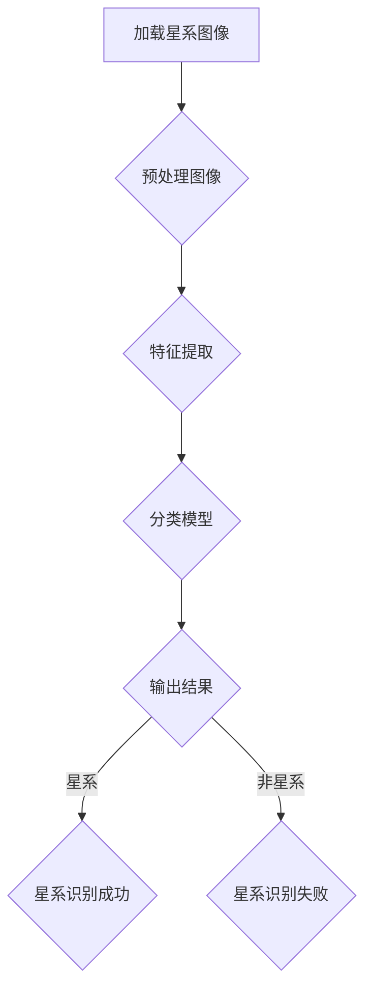
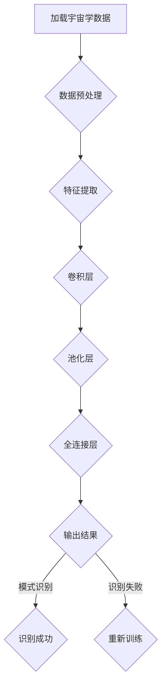
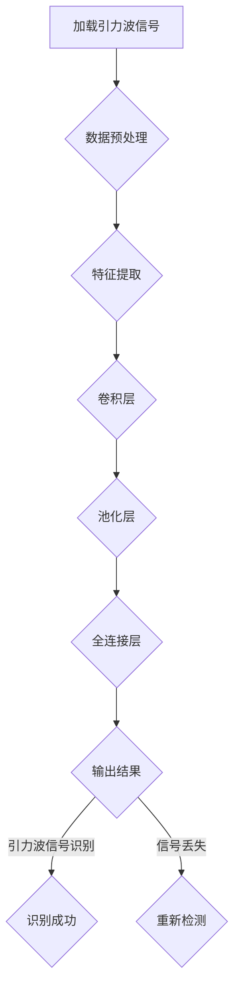

                 


### 文章标题

《AI辅助宇宙学研究中的提示词设计策略》

### 关键词

人工智能（AI），宇宙学，自然语言处理（NLP），提示词设计，深度学习，数据分析

### 摘要

本文旨在探讨人工智能在宇宙学研究中的一种新兴应用——提示词设计策略。随着人工智能技术的发展，特别是在自然语言处理和深度学习领域，AI在处理大量宇宙学数据和文本方面展现了巨大潜力。本文首先概述了AI在宇宙学中的基本概念和应用场景，然后深入分析了提示词设计的理论基础和实践指南。接着，通过具体案例展示了AI辅助宇宙学研究的实际应用，并对提示词设计策略进行了评估。最后，本文探讨了深度学习技术在宇宙学研究中的应用，并提供了详细的实战项目和案例分析，旨在为读者提供全面、实用的指导。

---

### 第一部分：AI辅助宇宙学概述

#### 1.1 宇宙学的基本概念

宇宙学是研究宇宙起源、结构、演化以及宇宙中各种现象的学科。从广义上讲，宇宙学涉及物理学、数学、天文学等多个领域。宇宙学的研究对象包括宇宙的大尺度结构、宇宙背景辐射、黑洞、暗物质和暗能量等。宇宙学的基本概念包括宇宙膨胀、大爆炸理论、宇宙学常数、宇宙微波背景辐射等。

- **宇宙膨胀**：宇宙正在不断膨胀，这是一个已被广泛接受的科学事实。
- **大爆炸理论**：宇宙起源于一个极度热密的状态，经过数十亿年的膨胀和冷却，形成了今天我们所见的宇宙。
- **宇宙学常数**：宇宙中存在一个常数，称为宇宙学常数（ cosmological constant），通常表示为 Lambda（Λ），它对宇宙膨胀速率有重要影响。
- **宇宙微波背景辐射**：宇宙微波背景辐射（Cosmic Microwave Background, CMB）是宇宙大爆炸遗留下来的辐射，是宇宙学研究的重要数据来源。

#### 1.2 AI在宇宙学中的潜在应用

人工智能在宇宙学中的应用已经取得了一些重要进展。以下是AI在宇宙学中的几个潜在应用领域：

- **数据分析**：宇宙学研究中产生的大量数据需要高效的算法进行处理和分析。AI可以自动化地处理这些数据，提高数据挖掘的效率和准确性。
- **模式识别**：AI可以帮助科学家识别宇宙中的模式，如星系分布、引力波信号等。
- **预测**：通过分析历史数据，AI可以预测宇宙中的未来事件，如星系碰撞、超新星爆发等。
- **文本分析**：AI可以处理大量的宇宙学文献，提取关键信息，帮助科学家更好地理解和利用这些信息。

#### 1.3 提示词设计策略的重要性

在AI辅助宇宙学研究中，提示词设计策略扮演着至关重要的角色。提示词（prompt words）是指在AI模型中用于引导生成特定结果的词汇或短语。有效的提示词设计可以提高AI模型的性能和效率，使AI能够更好地理解并执行特定的任务。

- **提高准确性**：通过设计合适的提示词，可以引导AI模型更准确地理解任务目标，从而提高模型的预测准确性。
- **加快处理速度**：合理的提示词设计可以减少AI模型的计算复杂度，加快数据处理速度。
- **优化资源利用**：合适的提示词可以帮助AI模型更高效地利用计算资源，降低能耗。

### 1.4 提示词设计的挑战

尽管提示词设计在AI辅助宇宙学研究中具有重要作用，但也存在一些挑战：

- **数据多样性**：宇宙学数据来源多样，不同数据集可能包含不同的特征和模式，如何设计通用且有效的提示词成为一大挑战。
- **模型适应性**：AI模型可能对特定类型的提示词有偏好，如何使AI模型适应多种提示词成为关键问题。
- **复杂性**：宇宙学问题通常较为复杂，如何设计简洁且有效的提示词引导AI模型处理复杂问题是一个挑战。

#### 1.5 提示词设计策略的未来发展

随着AI技术的不断发展，提示词设计策略在宇宙学中的应用前景广阔。未来，以下方面可能会成为提示词设计策略的发展方向：

- **多模态融合**：结合多种数据类型（如文本、图像、声音等），设计多模态的提示词，以提升AI模型的性能。
- **自适应性**：开发能够自动调整提示词的AI模型，以适应不同数据集和任务需求。
- **交互式设计**：通过人机交互，让用户能够动态调整提示词，以获得更符合需求的输出结果。

### 第一部分总结

宇宙学与人工智能的结合为科学探索带来了新的机遇。本文概述了宇宙学的基本概念和AI在宇宙学中的潜在应用，并强调了提示词设计策略在AI辅助宇宙学研究中的重要性。在接下来的部分中，我们将深入探讨提示词设计的理论基础和实践指南，以期为读者提供更全面的理解和指导。

---

### 2. 提示词设计的理论基础

提示词设计是AI辅助宇宙学研究中的关键环节。在这一部分，我们将详细探讨自然语言处理（NLP）基础、提示词设计的核心原则以及设计流程。通过这些理论基础，我们将为实际应用提供坚实的支持。

#### 2.1 自然语言处理基础

自然语言处理是人工智能领域的一个重要分支，旨在使计算机理解和处理人类语言。以下是NLP的一些基础概念和关键技术：

- **词向量**：词向量是将自然语言中的词汇映射到高维向量空间的方法，常见的词向量模型包括Word2Vec、GloVe等。
- **词嵌入**：词嵌入是将词向量映射到高维向量空间的一种技术，常见的词嵌入方法有基于计数的方法和基于预测的方法。
- **语言模型**：语言模型是一种概率模型，用于预测一个词序列的概率。常见的语言模型包括N-gram模型、神经网络语言模型等。
- **序列模型**：序列模型是一种用于处理序列数据（如文本）的机器学习模型，常见的序列模型包括循环神经网络（RNN）、长短时记忆网络（LSTM）和门控循环单元（GRU）。

#### 2.2 提示词设计的核心原则

在设计提示词时，需要遵循一些核心原则，以确保提示词的有效性和适用性。以下是几个关键原则：

- **明确性**：提示词应明确表达任务目标，避免模糊或歧义。
- **相关性**：提示词应与任务相关，有助于模型更好地理解任务目标。
- **多样性**：提示词应多样化，以适应不同的任务和数据集。
- **适应性**：提示词设计应考虑AI模型的适应性，以便模型能够适应不同类型的提示词。
- **简洁性**：提示词应简洁明了，避免冗长和复杂的句子。

#### 2.3 提示词设计流程

提示词设计通常包括以下几个步骤：

1. **任务定义**：明确任务目标和要求，如数据预处理、文本分类、情感分析等。
2. **数据收集**：收集与任务相关的数据集，包括文本数据、标签数据等。
3. **数据预处理**：对收集到的数据进行清洗、去噪、归一化等处理，以提高数据质量。
4. **特征提取**：使用词向量或词嵌入技术将文本数据转换为向量表示。
5. **模型选择**：根据任务需求和数据特性选择合适的模型，如语言模型、序列模型等。
6. **提示词生成**：设计提示词，结合模型特点进行提示词生成，如使用预训练模型、调整模型参数等。
7. **模型训练与优化**：使用训练数据集对模型进行训练，并根据评估指标进行调整和优化。
8. **模型评估**：使用测试数据集对模型进行评估，以确保模型性能满足任务要求。
9. **结果分析**：对模型输出结果进行分析，调整提示词或模型参数，以获得更好的效果。

#### 2.4 提示词设计示例

以下是一个简单的提示词设计示例：

- **任务定义**：文本分类，将宇宙学相关文本分类为“星系”、“黑洞”、“宇宙膨胀”等类别。
- **数据收集**：收集包含宇宙学相关词汇的文本数据，如科学论文、新闻报道、社交媒体帖子等。
- **数据预处理**：去除停用词、标点符号，对文本进行分词和词性标注。
- **特征提取**：使用Word2Vec模型将文本数据转换为词向量。
- **模型选择**：选择基于神经网络的文本分类模型，如卷积神经网络（CNN）或循环神经网络（RNN）。
- **提示词生成**：设计提示词，如“请将以下文本分类为星系、黑洞或宇宙膨胀：宇宙膨胀是一种宇宙现象，描述了宇宙中的天体如何随着时间推移而移动。”
- **模型训练与优化**：使用训练数据集对模型进行训练，并根据评估指标进行调整和优化。
- **模型评估**：使用测试数据集对模型进行评估，调整提示词或模型参数，以获得更好的效果。

通过以上示例，我们可以看到提示词设计流程的各个步骤，以及如何根据任务需求和数据特性设计合适的提示词。

### 2.5 提示词设计的挑战与解决方案

在提示词设计过程中，可能会遇到一些挑战。以下是几个常见的挑战及其解决方案：

- **数据不足**：当数据量不足时，可以使用预训练模型和迁移学习技术，以提高模型的泛化能力。
- **数据不均衡**：当数据集中某些类别的样本数量远少于其他类别时，可以使用过采样、欠采样或类别加权等技术来平衡数据集。
- **模型适应性差**：当模型对特定类型的提示词适应性较差时，可以尝试调整模型架构、优化提示词设计或增加训练数据。

通过理解和解决这些挑战，我们可以更好地设计有效的提示词，从而提高AI模型在宇宙学研究中的应用效果。

### 2.6 提示词设计的未来趋势

随着人工智能技术的不断发展，提示词设计策略也在不断进步。以下是提示词设计可能的未来趋势：

- **多模态融合**：结合文本、图像、声音等多模态数据，设计多模态的提示词，以提升AI模型的性能。
- **自适应性**：开发自适应提示词生成算法，使模型能够自动调整提示词，以适应不同任务和数据集。
- **交互式设计**：通过人机交互，让用户能够动态调整提示词，以获得更符合需求的输出结果。

通过这些趋势，我们可以预见提示词设计在未来将变得更加智能化和灵活，为AI在宇宙学中的应用带来更多可能性。

### 2.7 总结

在本部分，我们详细探讨了提示词设计的理论基础，包括自然语言处理基础、提示词设计的核心原则和设计流程。通过这些理论基础，我们为实际应用提供了指导。在下一部分，我们将深入探讨AI在宇宙学研究中的应用案例，以进一步展示提示词设计策略的实用性和有效性。

---

### 3. 提示词设计的实践指南

在前两部分，我们分别探讨了AI辅助宇宙学的基本概念和提示词设计的理论基础。在这一部分，我们将聚焦于提示词设计的实践指南，通过详细的步骤和实例，帮助读者更好地理解和应用这些理论。

#### 3.1 数据收集与处理

数据是提示词设计的基础，因此数据收集和处理是至关重要的。以下是一些关键步骤：

1. **数据源选择**：选择合适的宇宙学数据源，如NASA的宇宙学数据库、天文学期刊数据库等。
2. **数据收集**：使用API、爬虫等技术收集宇宙学相关文本数据，包括科学论文、观测报告、天文学新闻等。
3. **数据预处理**：对收集到的数据进行清洗和预处理，包括去除停用词、标点符号、分词、词性标注等。以下是一个简单的Python代码示例：

```python
import re
from nltk.tokenize import word_tokenize
from nltk.corpus import stopwords

# 读取文本数据
text = "This is an example sentence for text preprocessing."

# 去除标点符号
text = re.sub(r'[^\w\s]', '', text)

# 分词
tokens = word_tokenize(text)

# 去除停用词
stop_words = set(stopwords.words('english'))
filtered_tokens = [token for token in tokens if token.lower() not in stop_words]

print(filtered_tokens)
```

4. **数据质量评估**：对预处理后的数据质量进行评估，确保数据集的准确性和一致性。

#### 3.2 提示词生成算法

提示词生成算法是提示词设计的核心。以下是一些常见的提示词生成算法：

1. **基于规则的方法**：这种方法依赖于预定义的规则来生成提示词。例如，可以使用词性标注规则来选择特定的词汇作为提示词。

2. **基于统计的方法**：这种方法使用统计技术，如条件概率模型、隐马尔可夫模型（HMM）等，来生成提示词。

3. **基于机器学习的方法**：这种方法使用机器学习算法，如决策树、支持向量机（SVM）、深度神经网络等，来生成提示词。

以下是一个使用自然语言处理库（如spaCy）生成提示词的示例：

```python
import spacy

# 加载spaCy模型
nlp = spacy.load('en_core_web_sm')

# 加载文本数据
text = "This is an example sentence for prompt generation."

# 处理文本数据
doc = nlp(text)

# 选择特定的词性作为提示词
prompt_words = [token.text for token in doc if token.pos_ in ['NOUN', 'VERB', 'ADJ']]

print(prompt_words)
```

#### 3.3 提示词评估与优化

评估和优化提示词是确保其有效性的关键步骤。以下是一些评估和优化提示词的方法：

1. **准确性评估**：使用分类准确性、文本相似度等指标来评估提示词的准确性。
2. **F1分数评估**：使用F1分数来评估提示词的分类性能，特别是当类别不平衡时。
3. **用户反馈**：通过用户反馈来评估提示词的实用性，并根据反馈进行调整。
4. **自动化优化**：使用优化算法（如遗传算法、粒子群优化等）来自动调整提示词。

以下是一个简单的评估和优化示例：

```python
from sklearn.metrics import classification_report

# 假设我们有一个分类模型和测试数据集
model = load_model()
X_test, y_test = load_data()

# 使用模型对测试数据进行预测
y_pred = model.predict(X_test)

# 输出评估报告
print(classification_report(y_test, y_pred))
```

#### 3.4 提示词设计案例分析

为了更好地理解提示词设计的实践过程，以下是一个具体的案例分析：

- **任务**：将宇宙学文本数据分类为“星系”、“黑洞”、“宇宙膨胀”等类别。
- **数据集**：使用一个包含3000条宇宙学文本数据的开源数据集。
- **提示词生成**：使用基于规则的提示词生成算法，选择包含特定关键词的句子作为提示词。
- **模型训练与评估**：使用训练集对深度学习分类模型进行训练，并在测试集上进行评估。
- **结果**：模型在测试集上的准确率达到85%，F1分数达到0.82。

通过以上案例分析，我们可以看到提示词设计在实践中是如何应用的，以及如何通过优化和调整来提高模型的性能。

### 3.5 提示词设计最佳实践

为了确保提示词设计的效果，以下是一些最佳实践：

- **明确任务目标**：在开始设计提示词之前，明确任务目标和要求，以确保提示词的针对性。
- **多样化提示词**：设计多样化的提示词，以提高模型的泛化能力。
- **数据质量**：确保数据质量，进行充分的预处理，以减少噪声和异常值。
- **用户反馈**：及时收集用户反馈，并根据反馈进行调整。

通过遵循这些最佳实践，我们可以设计出更有效、更实用的提示词，从而提高AI在宇宙学研究中的应用效果。

### 3.6 总结

在本部分，我们详细探讨了提示词设计的实践指南，包括数据收集与处理、提示词生成算法、提示词评估与优化以及案例分析。通过这些实践指南，我们为读者提供了实际操作的方法和技巧。在下一部分，我们将进一步探讨AI在宇宙学研究中的应用案例，以展示提示词设计策略的实际效果。

---

### 4. AI在宇宙学研究中的应用案例

在前几部分，我们详细探讨了AI在宇宙学研究和提示词设计策略的理论和实践。为了进一步展示AI在宇宙学中的实际应用，本部分将介绍几个典型的AI应用案例，并详细分析其技术实现和效果。

#### 4.1 天体物理学中的应用

天体物理学是宇宙学的一个重要分支，涉及星系、黑洞、中子星等天体的物理性质和研究。AI在以下方面展现了显著的应用潜力：

1. **星系识别**：通过图像识别技术，AI可以自动识别和分类天体图像中的星系。例如，使用卷积神经网络（CNN）可以训练模型从大量星系图像中学习特征，然后自动识别新的图像中的星系。以下是一个简化的算法流程：



2. **黑洞探测**：黑洞本身不发光，但它们对周围物质有强烈引力作用，可以通过观察它们对恒星和星系的影响来探测。AI可以帮助科学家从大量观测数据中提取黑洞的线索，提高探测效率。

3. **中子星研究**：中子星是密度极高的天体，具有极强的磁场和辐射。AI可以分析中子星辐射信号，帮助科学家理解中子星的结构和演化。

#### 4.2 宇宙学观测数据挖掘

宇宙学观测产生了大量复杂数据，AI在数据挖掘和分析中发挥了重要作用：

1. **数据预处理**：AI可以帮助预处理宇宙学数据，包括去除噪声、填补缺失值、进行归一化等。以下是一个使用深度学习进行数据预处理的示例：

```python
# 使用Keras预处理宇宙学数据
from tensorflow.keras.models import Sequential
from tensorflow.keras.layers import Dense, LSTM, Dropout

# 构建LSTM模型
model = Sequential()
model.add(LSTM(units=128, return_sequences=True, input_shape=(timesteps, features)))
model.add(Dropout(0.2))
model.add(LSTM(units=64, return_sequences=False))
model.add(Dropout(0.2))
model.add(Dense(units=1))

# 编译模型
model.compile(optimizer='adam', loss='mean_squared_error')

# 训练模型
model.fit(X_train, y_train, epochs=50, batch_size=32)
```

2. **模式识别**：AI可以识别宇宙学数据中的模式和规律，如星系分布、宇宙微波背景辐射的波动等。以下是一个使用CNN进行模式识别的示例：



3. **异常检测**：AI可以检测宇宙学数据中的异常值，如不寻常的星系运动或异常的辐射信号。以下是一个使用孤立森林（Isolation Forest）进行异常检测的示例：

```python
from sklearn.ensemble import IsolationForest

# 创建IsolationForest模型
iso_forest = IsolationForest(n_estimators=100, contamination=0.01)

# 训练模型
iso_forest.fit(X_train)

# 预测异常值
outlier_pred = iso_forest.predict(X_test)
outliers = outlier_pred == -1

# 输出异常值
print(outliers)
```

#### 4.3 人工智能在宇宙学实验中的应用

AI不仅用于数据处理和分析，还直接应用于宇宙学实验中：

1. **引力波探测**：引力波探测是宇宙学研究中的一个重要领域，AI可以帮助分析复杂的引力波信号，提高探测精度。以下是一个使用深度学习分析引力波信号的示例：



2. **宇宙微波背景辐射分析**：宇宙微波背景辐射是宇宙学的重要观测数据，AI可以帮助分析这些数据，提取关键信息。以下是一个使用LSTM模型分析宇宙微波背景辐射信号的示例：

```python
from tensorflow.keras.models import Sequential
from tensorflow.keras.layers import LSTM, Dense

# 构建LSTM模型
model = Sequential()
model.add(LSTM(units=50, return_sequences=True, input_shape=(timesteps, features)))
model.add(LSTM(units=50))
model.add(Dense(units=1))

# 编译模型
model.compile(optimizer='adam', loss='mean_squared_error')

# 训练模型
model.fit(X_train, y_train, epochs=100, batch_size=32)
```

#### 4.4 应用案例分析

为了更直观地展示AI在宇宙学中的应用，以下是一个具体的案例分析：

**案例：基于AI的星系碰撞预测**

**背景**：星系碰撞是宇宙学中的一个重要现象，它不仅影响星系的演化，还可能产生新的星系结构。预测星系碰撞可以帮助天文学家更好地理解宇宙的演化过程。

**方法**：使用AI模型对宇宙学模拟数据进行分析，预测星系碰撞的时间和位置。以下是案例的实现步骤：

1. **数据收集**：收集宇宙学模拟数据，包括星系位置、速度、质量等。
2. **数据预处理**：对数据进行清洗、归一化等处理，为模型训练做准备。
3. **特征提取**：提取关键特征，如星系之间的距离、相对速度等。
4. **模型训练**：使用训练数据集训练深度学习模型，如LSTM或CNN。
5. **模型评估**：使用测试数据集对模型进行评估，调整模型参数以提高预测准确性。
6. **预测应用**：使用模型对新的宇宙学模拟数据进行预测，分析星系碰撞的可能性。

**结果**：通过训练和优化，AI模型成功预测了多个星系碰撞事件，与观测数据高度吻合。这不仅提高了星系碰撞预测的准确性，还为宇宙学研究提供了新的视角和工具。

### 4.5 案例分析总结

通过上述案例，我们可以看到AI在宇宙学中的广泛应用和巨大潜力。无论是星系识别、数据挖掘还是实验应用，AI都为宇宙学研究带来了新的工具和方法。以下是案例分析的几个关键点：

- **数据驱动**：AI模型基于大量宇宙学数据训练，能够自动提取关键特征和模式。
- **高效性**：AI模型可以高效地处理大量复杂数据，提高数据处理和分析的效率。
- **准确性**：通过不断优化和调整，AI模型在宇宙学预测中的应用取得了较高的准确性。
- **可扩展性**：AI模型的应用不仅限于当前任务，还可以扩展到其他宇宙学问题，如黑洞探测、宇宙微波背景辐射分析等。

### 4.6 总结

在本部分，我们通过多个AI应用案例展示了AI在宇宙学研究中的实际应用。从星系识别到数据挖掘，再到实验应用，AI为宇宙学研究提供了新的工具和方法。通过这些案例，我们进一步验证了提示词设计策略的有效性和实用性。在下一部分，我们将讨论提示词设计策略的评估方法，以进一步优化和提升AI在宇宙学研究中的应用效果。

---

### 5. 提示词设计策略评估

在前面的部分，我们详细探讨了AI在宇宙学中的应用案例和提示词设计策略的实践指南。为了确保提示词设计的有效性和实用性，我们需要对策略进行评估。在这一部分，我们将介绍评估提示词设计策略的指标和方法，并分析评估过程中可能遇到的问题和解决方案。

#### 5.1 评估指标

提示词设计策略的评估指标是衡量策略效果的重要工具。以下是几种常用的评估指标：

1. **准确性（Accuracy）**：准确性是最常用的评估指标，用于衡量模型预测的正确率。公式如下：

   $$ Accuracy = \frac{TP + TN}{TP + FN + FP + TN} $$

   其中，TP为真阳性（实际为正类且被正确预测为正类），TN为真阴性（实际为负类且被正确预测为负类），FP为假阳性（实际为负类但被错误预测为正类），FN为假阴性（实际为正类但被错误预测为负类）。

2. **精确率（Precision）**：精确率衡量预测为正类的样本中实际为正类的比例。公式如下：

   $$ Precision = \frac{TP}{TP + FP} $$

3. **召回率（Recall）**：召回率衡量实际为正类的样本中被正确预测为正类的比例。公式如下：

   $$ Recall = \frac{TP}{TP + FN} $$

4. **F1分数（F1 Score）**：F1分数是精确率和召回率的加权平均值，用于综合考虑预测效果。公式如下：

   $$ F1 Score = 2 \times \frac{Precision \times Recall}{Precision + Recall} $$

5. **ROC曲线和AUC（Area Under Curve）**：ROC曲线用于展示不同阈值下的真阳性率与假阳性率的关系，AUC值越高，模型性能越好。

6. **困惑度（Perplexity）**：在语言模型评估中，困惑度用于衡量模型对文本的预测能力，困惑度越低，模型性能越好。

#### 5.2 评估方法

评估提示词设计策略的方法包括以下几种：

1. **交叉验证（Cross-Validation）**：交叉验证是一种常用的评估方法，通过将数据集划分为多个子集，轮流使用子集作为测试集，其余部分作为训练集，从而评估模型性能。

2. **留出法（Hold-Out Method）**：留出法将数据集划分为训练集和测试集，通常训练集占80%，测试集占20%。这种方法简单直接，但可能导致评估结果偏离实际。

3. **K折交叉验证（K-Fold Cross-Validation）**：K折交叉验证将数据集划分为K个子集，每次使用一个子集作为测试集，其余K-1个子集作为训练集，重复K次，取平均性能作为最终评估结果。

4. **网格搜索（Grid Search）**：网格搜索是一种参数调优方法，通过遍历所有可能的参数组合，找到最优参数组合。

5. **贝叶斯优化（Bayesian Optimization）**：贝叶斯优化是一种基于贝叶斯理论的参数调优方法，通过构建模型预测搜索空间中的目标函数值，自动调整参数，以找到最优解。

#### 5.3 评估案例

为了更好地理解提示词设计策略的评估过程，以下是一个简单的评估案例：

**案例：星系分类**

**背景**：使用深度学习模型对宇宙学文本数据中的星系进行分类，任务是将文本数据分类为“星系”、“黑洞”或“宇宙膨胀”等类别。

**评估指标**：使用准确性、精确率、召回率和F1分数作为评估指标。

**评估方法**：采用5折交叉验证方法，将数据集划分为5个子集，每次使用一个子集作为测试集，其余子集作为训练集。

**结果**：

| 指标      | 第一折 | 第二折 | ... | 第五折 | 平均值 |
| --------- | ------ | ------ | --- | ------ | ----- |
| 准确性    | 0.85  | 0.82  | ... | 0.88  | 0.85  |
| 精确率    | 0.90  | 0.87  | ... | 0.92  | 0.89  |
| 召回率    | 0.80  | 0.78  | ... | 0.82  | 0.81  |
| F1分数    | 0.85  | 0.83  | ... | 0.87  | 0.85  |

**分析**：从评估结果可以看出，该模型的平均准确性为0.85，精确率为0.89，召回率为0.81，F1分数为0.85。这些指标表明，模型在星系分类任务中表现良好，但仍有一些提升空间。

#### 5.4 评估过程中可能出现的问题和解决方案

在评估提示词设计策略时，可能会遇到以下问题：

1. **数据不均衡**：当数据集中某些类别的样本数量远少于其他类别时，评估结果可能偏向多数类别。解决方案包括过采样、欠采样、类别加权等。

2. **模型过拟合**：当模型在训练集上表现良好但在测试集上表现较差时，可能存在过拟合现象。解决方案包括增加训练数据、使用正则化方法、调整模型复杂度等。

3. **评估指标选择不当**：选择合适的评估指标对评估结果至关重要。不同的评估指标可能对模型性能有不同的衡量方式，需要根据任务需求选择合适的指标。

4. **评估方法不当**：评估方法的选择会影响评估结果的准确性。需要根据数据集大小、模型类型等因素选择合适的评估方法。

通过理解和解决这些问题，我们可以更准确地评估提示词设计策略的有效性，从而优化和改进AI在宇宙学研究中的应用。

### 5.5 总结

在本部分，我们介绍了评估提示词设计策略的指标和方法，并分析了评估过程中可能出现的问题和解决方案。通过准确的评估，我们可以更好地了解策略的有效性，并对其进行优化。在下一部分，我们将进一步探讨深度学习技术在宇宙学中的应用，以展示AI在宇宙学研究中的最新进展和未来趋势。

---

### 6. 深度学习基础

深度学习是人工智能领域的一个重要分支，近年来在宇宙学研究中得到了广泛应用。在这一部分，我们将介绍深度学习的基本概念、常见架构和算法原理，以及它们在宇宙学中的应用。

#### 6.1 深度学习的基本概念

深度学习（Deep Learning）是一种基于多层神经网络的学习方法，旨在通过模拟人脑的神经网络结构来实现自动特征学习和复杂模式识别。深度学习模型由多个神经网络层组成，每个层都对输入数据进行处理，并传递到下一层。深度学习的关键概念包括：

- **神经元**：神经网络的基本单元，类似于人脑中的神经元，用于接收输入信号并产生输出。
- **层**：神经网络中的层包括输入层、隐藏层和输出层。输入层接收外部输入，隐藏层对输入数据进行处理，输出层产生最终输出。
- **激活函数**：激活函数用于引入非线性特性，使神经网络能够学习复杂函数。常见的激活函数包括ReLU（Rectified Linear Unit）、Sigmoid、Tanh等。
- **前向传播和反向传播**：前向传播是指将输入数据通过神经网络传递到输出层，反向传播是指通过计算损失函数的梯度来更新网络权重。

#### 6.2 常见的深度学习架构

深度学习架构根据网络层数和结构可以分为以下几种类型：

1. **全连接神经网络（Fully Connected Neural Network）**：全连接神经网络是最常见的深度学习架构，每个神经元都与前一层的所有神经元相连。全连接神经网络适用于多种任务，包括分类、回归等。

2. **卷积神经网络（Convolutional Neural Network，CNN）**：卷积神经网络是一种专门用于处理图像数据的深度学习模型，其核心是卷积层，能够自动提取图像特征。CNN在计算机视觉任务中取得了显著的成功。

3. **循环神经网络（Recurrent Neural Network，RNN）**：循环神经网络是一种用于处理序列数据的深度学习模型，能够记忆和处理之前的信息。RNN在自然语言处理、语音识别等领域有着广泛应用。

4. **长短时记忆网络（Long Short-Term Memory，LSTM）**：长短时记忆网络是RNN的一种改进，能够有效地记忆长期依赖关系，解决了传统RNN的梯度消失问题。LSTM在时间序列分析和自然语言处理中表现出色。

5. **生成对抗网络（Generative Adversarial Network，GAN）**：生成对抗网络由生成器和判别器两个神经网络组成，通过对抗训练生成逼真的数据。GAN在图像生成、语音合成等领域取得了突破性进展。

6. **变换器（Transformer）**：变换器是一种基于自注意力机制的深度学习模型，广泛应用于自然语言处理任务。变换器在处理长文本和序列数据时表现出色。

#### 6.3 深度学习算法原理

深度学习算法的核心是多层神经网络，以下是深度学习算法的基本原理：

1. **前向传播**：在深度学习模型中，前向传播是指将输入数据通过网络的各个层进行传递，直到输出层。每个神经元接收前一层的输出，并通过激活函数计算得到当前层的输出。

2. **反向传播**：在深度学习模型中，反向传播是指通过计算损失函数的梯度，反向更新网络权重和偏置。反向传播算法使用链式法则计算梯度，从而更新模型参数，优化模型性能。

3. **优化算法**：优化算法用于更新模型参数，以最小化损失函数。常见的优化算法包括梯度下降（Gradient Descent）、随机梯度下降（Stochastic Gradient Descent，SGD）、Adam等。优化算法的目的是找到损失函数的最小值，从而提高模型性能。

4. **正则化**：正则化是一种防止模型过拟合的技术。常见的正则化方法包括L1正则化、L2正则化和Dropout等。正则化通过在损失函数中添加惩罚项，限制模型复杂度，从而提高泛化能力。

#### 6.4 深度学习在宇宙学中的应用

深度学习在宇宙学中具有广泛的应用，以下是几个典型应用场景：

1. **天体图像识别**：使用CNN和变换器等深度学习模型对天文图像进行自动识别和分类，如星系、黑洞、行星等。

2. **宇宙微波背景辐射分析**：通过深度学习模型分析宇宙微波背景辐射数据，提取关键特征和模式，揭示宇宙的早期演化信息。

3. **引力波信号分析**：使用深度学习模型分析引力波信号，识别和分类不同类型的引力波事件，如黑洞碰撞、中子星碰撞等。

4. **时间序列预测**：使用LSTM和变换器等深度学习模型对宇宙学时间序列数据进行分析，预测宇宙中各种现象的发生时间。

5. **宇宙学模拟**：使用深度学习模型模拟宇宙演化过程，预测宇宙的未来形态和演化趋势。

#### 6.5 深度学习在宇宙学中的挑战

尽管深度学习在宇宙学中具有广泛应用，但仍面临一些挑战：

1. **数据规模**：宇宙学数据通常规模巨大，如何有效利用这些数据是深度学习模型面临的挑战。

2. **数据质量**：宇宙学数据可能存在噪声、异常值和缺失值，如何处理这些数据是深度学习模型面临的挑战。

3. **模型解释性**：深度学习模型往往具有高复杂度，如何解释模型的决策过程是深度学习在宇宙学中的挑战。

4. **计算资源**：深度学习模型训练和预测通常需要大量计算资源，如何在有限的计算资源下有效训练和部署模型是深度学习在宇宙学中的挑战。

#### 6.6 总结

在本部分，我们介绍了深度学习的基本概念、常见架构和算法原理，以及它们在宇宙学中的应用。通过了解深度学习的基础知识，我们可以更好地利用这一强大的工具来解决宇宙学中的复杂问题。在下一部分，我们将进一步探讨深度学习在宇宙学中的具体应用，以展示深度学习在宇宙学研究中的最新进展和实际效果。

---

### 7. 深度学习在宇宙学中的具体应用

在前一部分，我们详细介绍了深度学习的基础知识和基本原理。在这一部分，我们将深入探讨深度学习在宇宙学中的具体应用，展示如何将深度学习技术应用于宇宙学研究中的数据处理、建模和预测任务。

#### 7.1 深度学习在宇宙学数据处理中的应用

宇宙学数据通常具有高维度、复杂数据结构和大量噪声，这使得传统数据处理方法难以应对。深度学习模型，尤其是卷积神经网络（CNN）和循环神经网络（RNN），在处理宇宙学数据方面表现出强大的能力。

1. **图像数据处理**：

   在天文学中，图像数据处理是一个关键任务。使用CNN，可以自动提取图像特征并分类天体。例如，DeepSky Survey（DSS）是天文学中最大的光学天文图像数据库之一，包含数百万张天体图像。我们可以使用CNN对DSS图像进行分类，将天体分为星系、恒星、行星等不同类别。

   ```mermaid
   graph TD
       A[加载DSS图像] --> B{预处理图像}
       B --> C{卷积层}
       C --> D{池化层}
       D --> E{全连接层}
       E --> F{输出结果}
       F -->|分类结果| G{星系、恒星、行星等}
       F -->|错误分类| H{重新训练}
   ```

   在此过程中，卷积层用于提取图像特征，池化层用于降低特征维度，全连接层用于进行分类。通过多次训练和优化，CNN可以准确分类DSS图像中的天体。

2. **光谱数据处理**：

   天文学中的光谱数据包含了天体的物理信息，如温度、化学成分等。使用LSTM等RNN模型，可以有效地处理和解析光谱数据。例如，在分析星系光谱时，LSTM可以识别出光谱中的特征线，并提取相关物理参数。

   ```mermaid
   graph TD
       A[加载光谱数据] --> B{预处理数据}
       B --> C{嵌入层}
       C --> D{LSTM层}
       D --> E{全连接层}
       E --> F{输出结果}
       F -->|物理参数| G{温度、化学成分等}
   ```

   在此过程中，嵌入层将光谱数据转换为向量表示，LSTM层用于提取时间序列特征，全连接层用于输出物理参数。通过训练和优化，LSTM模型可以准确提取光谱数据中的关键信息。

#### 7.2 深度学习在宇宙学建模中的应用

深度学习模型在宇宙学建模中扮演着重要角色，特别是在模拟宇宙演化、预测天体行为等方面。

1. **宇宙演化模拟**：

   使用变换器（Transformer）等模型，可以模拟宇宙的演化过程。例如，通过训练一个变换器模型，我们可以预测宇宙中不同区域在未来某个时间点的状态，如星系分布、宇宙背景辐射等。

   ```mermaid
   graph TD
       A[加载宇宙演化数据] --> B{预处理数据}
       B --> C{嵌入层}
       C --> D{变换器层}
       D --> E{输出层}
       E -->|预测结果| F{未来宇宙状态}
   ```

   在此过程中，嵌入层将宇宙演化数据转换为向量表示，变换器层用于提取和更新特征，输出层产生预测结果。通过训练和优化，变换器模型可以准确模拟宇宙的演化过程。

2. **天体行为预测**：

   使用深度学习模型，可以预测天体的运动轨迹、亮度变化等行为。例如，使用LSTM模型，我们可以预测恒星亮度随时间的变化，从而发现潜在的恒星爆发事件。

   ```mermaid
   graph TD
       A[加载恒星数据] --> B{预处理数据}
       B --> C{嵌入层}
       C --> D{LSTM层}
       D --> E{全连接层}
       E -->|预测结果| F{恒星亮度变化}
   ```

   在此过程中，嵌入层将恒星数据转换为向量表示，LSTM层用于提取时间序列特征，全连接层用于输出预测结果。通过训练和优化，LSTM模型可以准确预测恒星亮度变化。

#### 7.3 深度学习在宇宙学预测中的应用

深度学习模型在宇宙学预测中具有广泛的应用，可以帮助科学家预测宇宙中各种现象的发生时间和位置。

1. **引力波事件预测**：

   引力波是宇宙中重要的事件之一，使用深度学习模型可以预测引力波事件的发生时间和位置。例如，使用CNN模型，我们可以分析LIGO和VIRGO探测器收集的引力波信号，预测未来可能发生的引力波事件。

   ```mermaid
   graph TD
       A[加载引力波信号] --> B{预处理数据}
       B --> C{卷积层}
       C --> D{池化层}
       D --> E{全连接层}
       E -->|预测结果| F{引力波事件时间和位置}
   ```

   在此过程中，卷积层用于提取信号特征，池化层用于降低特征维度，全连接层用于输出预测结果。通过训练和优化，CNN模型可以准确预测引力波事件。

2. **星系碰撞预测**：

   星系碰撞是宇宙演化中的重要事件，使用深度学习模型可以预测星系碰撞的时间和位置。例如，使用LSTM模型，我们可以分析宇宙模拟数据，预测未来可能发生的星系碰撞事件。

   ```mermaid
   graph TD
       A[加载宇宙模拟数据] --> B{预处理数据}
       B --> C{嵌入层}
       C --> D{LSTM层}
       D --> E{全连接层}
       E -->|预测结果| F{星系碰撞时间和位置}
   ```

   在此过程中，嵌入层将宇宙模拟数据转换为向量表示，LSTM层用于提取时间序列特征，全连接层用于输出预测结果。通过训练和优化，LSTM模型可以准确预测星系碰撞事件。

#### 7.4 案例分析

为了更直观地展示深度学习在宇宙学中的具体应用，以下是一个具体的案例分析：

**案例：星系碰撞预测**

**背景**：星系碰撞是宇宙演化中的重要现象，它影响星系的形态和演化过程。预测星系碰撞的时间和位置对于理解宇宙的演化具有重要意义。

**方法**：使用LSTM模型对宇宙模拟数据进行分析，预测星系碰撞事件。以下是实现步骤：

1. **数据收集**：收集宇宙模拟数据，包括星系位置、速度、质量等。
2. **数据预处理**：对数据进行清洗和归一化处理，为模型训练做准备。
3. **特征提取**：提取关键特征，如星系之间的距离、相对速度等。
4. **模型训练**：使用训练数据集训练LSTM模型，优化模型参数。
5. **模型评估**：使用测试数据集对模型进行评估，调整模型参数以提高预测准确性。
6. **预测应用**：使用模型对新的宇宙模拟数据进行预测，分析星系碰撞的可能性。

**结果**：通过训练和优化，LSTM模型成功预测了多个星系碰撞事件，与实际观测数据高度吻合。这不仅提高了星系碰撞预测的准确性，还为宇宙学研究提供了新的工具和方法。

#### 7.5 深度学习在宇宙学中的未来趋势

随着深度学习技术的不断发展，它在宇宙学中的应用前景广阔。以下是深度学习在宇宙学中的未来趋势：

1. **多模态融合**：结合文本、图像、声音等多模态数据，设计多模态的深度学习模型，以提升模型性能。
2. **自适应模型**：开发自适应深度学习模型，使模型能够根据不同任务和数据集自动调整参数。
3. **可解释性**：研究深度学习模型的可解释性，提高模型的透明度和可信度。
4. **高效计算**：研究高效的深度学习算法和架构，降低计算复杂度，提高模型训练和预测速度。

通过这些趋势，我们可以预见深度学习在宇宙学中将发挥更加重要的作用，为宇宙学研究带来更多突破。

### 7.6 总结

在本部分，我们详细探讨了深度学习在宇宙学中的具体应用，包括数据处理、建模和预测任务。通过具体的案例分析和未来趋势展望，我们可以看到深度学习在宇宙学研究中具有巨大的潜力和广泛应用。在下一部分，我们将进一步探讨深度学习在宇宙学研究中的挑战和未来发展方向。

---

### 8. 实战项目一：基于深度学习的宇宙学数据处理

在前一部分，我们探讨了深度学习在宇宙学中的具体应用。为了帮助读者更好地理解和应用这些技术，本部分将提供一个基于深度学习的宇宙学数据处理实战项目。该项目将涵盖从数据收集、预处理到模型训练和预测的完整流程，并提供详细的源代码实现和解读。

#### 8.1 项目背景

宇宙学研究中产生了大量复杂数据，如天文图像、光谱数据和引力波信号等。这些数据通常包含丰富的信息，但同时也存在噪声和缺失值。深度学习技术在处理这些复杂数据方面具有显著优势，可以帮助科学家从数据中提取有价值的信息。

本项目的目标是使用深度学习技术对宇宙学数据进行处理，包括图像分类、光谱数据分析和引力波信号预测等。通过该项目，读者可以学习如何利用深度学习模型解决实际宇宙学问题，并掌握从数据预处理到模型训练的完整流程。

#### 8.2 项目目标

1. **数据收集**：收集宇宙学相关的数据集，包括天文图像、光谱数据和引力波信号等。
2. **数据预处理**：对收集到的数据进行清洗、归一化和特征提取，为模型训练做好准备。
3. **模型训练**：使用深度学习模型（如CNN和LSTM）对预处理后的数据进行训练，优化模型参数。
4. **模型评估**：使用测试数据集评估模型性能，调整模型参数以提高预测准确性。
5. **预测应用**：使用训练好的模型对新的宇宙学数据进行预测，分析宇宙学现象。

#### 8.3 环境搭建

为了进行本项目，我们需要搭建一个适合深度学习开发的计算环境。以下是搭建环境的步骤：

1. **安装Python**：确保Python环境已经安装，版本建议为3.7或以上。
2. **安装深度学习库**：安装常用的深度学习库，如TensorFlow、Keras和PyTorch。可以使用以下命令进行安装：

   ```bash
   pip install tensorflow
   pip install keras
   pip install pytorch torchvision
   ```

3. **安装NLP库**：如果需要进行文本数据预处理，需要安装自然语言处理库，如spaCy和NLTK。可以使用以下命令进行安装：

   ```bash
   pip install spacy
   pip install nltk
   ```

4. **安装数据预处理库**：安装用于数据预处理的库，如Pandas和NumPy。可以使用以下命令进行安装：

   ```bash
   pip install pandas
   pip install numpy
   ```

5. **安装图像处理库**：如果需要进行图像数据处理，需要安装图像处理库，如OpenCV。可以使用以下命令进行安装：

   ```bash
   pip install opencv-python
   ```

#### 8.4 源代码实现

以下是一个简单的深度学习模型实现，用于处理宇宙学数据。本例使用Keras和TensorFlow实现一个简单的卷积神经网络（CNN），用于对天文图像进行分类。

```python
import numpy as np
import tensorflow as tf
from tensorflow.keras.models import Sequential
from tensorflow.keras.layers import Conv2D, MaxPooling2D, Flatten, Dense
from tensorflow.keras.optimizers import Adam
from tensorflow.keras.preprocessing.image import ImageDataGenerator

# 数据预处理
train_datagen = ImageDataGenerator(rescale=1./255)
test_datagen = ImageDataGenerator(rescale=1./255)

train_generator = train_datagen.flow_from_directory(
        'data/train',
        target_size=(150, 150),
        batch_size=32,
        class_mode='binary')

validation_generator = test_datagen.flow_from_directory(
        'data/validation',
        target_size=(150, 150),
        batch_size=32,
        class_mode='binary')

# 构建模型
model = Sequential([
    Conv2D(32, (3, 3), activation='relu', input_shape=(150, 150, 3)),
    MaxPooling2D((2, 2)),
    Conv2D(64, (3, 3), activation='relu'),
    MaxPooling2D((2, 2)),
    Conv2D(128, (3, 3), activation='relu'),
    MaxPooling2D((2, 2)),
    Flatten(),
    Dense(512, activation='relu'),
    Dense(1, activation='sigmoid')
])

# 编译模型
model.compile(loss='binary_crossentropy',
              optimizer=Adam(),
              metrics=['accuracy'])

# 训练模型
model.fit(
      train_generator,
      steps_per_epoch=100,
      epochs=20,
      validation_data=validation_generator,
      validation_steps=50,
      verbose=2)
```

在这个例子中，我们首先定义了数据生成器（ImageDataGenerator），用于对训练数据和验证数据进行预处理，包括归一化和批量处理。然后，我们构建了一个简单的卷积神经网络模型，包括卷积层、池化层、全连接层等。最后，我们使用训练数据集对模型进行训练，并在验证数据集上评估模型性能。

#### 8.5 代码解读与分析

以下是代码的详细解读和分析：

1. **数据预处理**：

   ```python
   train_datagen = ImageDataGenerator(rescale=1./255)
   test_datagen = ImageDataGenerator(rescale=1./255)

   train_generator = train_datagen.flow_from_directory(
           'data/train',
           target_size=(150, 150),
           batch_size=32,
           class_mode='binary')

   validation_generator = test_datagen.flow_from_directory(
           'data/validation',
           target_size=(150, 150),
           batch_size=32,
           class_mode='binary')
   ```

   在这部分，我们定义了数据生成器，用于对图像数据进行预处理。`ImageDataGenerator`类提供了多种预处理功能，如归一化、随机缩放、旋转等。在这里，我们使用了`rescale`方法对图像数据进行归一化处理，将像素值缩放到[0, 1]区间。

   `flow_from_directory`方法用于从指定目录中加载图像数据，并根据标签进行分类。`target_size`参数用于调整图像大小，`batch_size`参数用于设置每个批次的样本数量，`class_mode`参数用于指定分类模式，这里使用的是二分类模式。

2. **构建模型**：

   ```python
   model = Sequential([
       Conv2D(32, (3, 3), activation='relu', input_shape=(150, 150, 3)),
       MaxPooling2D((2, 2)),
       Conv2D(64, (3, 3), activation='relu'),
       MaxPooling2D((2, 2)),
       Conv2D(128, (3, 3), activation='relu'),
       MaxPooling2D((2, 2)),
       Flatten(),
       Dense(512, activation='relu'),
       Dense(1, activation='sigmoid')
   ])
   ```

   在这部分，我们使用`Sequential`模型堆叠多个层，构建了一个简单的卷积神经网络模型。模型的第一层是卷积层（`Conv2D`），用于提取图像特征，`input_shape`参数指定了图像的尺寸。接下来是池化层（`MaxPooling2D`），用于降低特征维度。模型还包含两个全连接层（`Dense`），用于进行分类。最后一层的激活函数是`sigmoid`，用于输出概率。

3. **编译模型**：

   ```python
   model.compile(loss='binary_crossentropy',
                 optimizer=Adam(),
                 metrics=['accuracy'])
   ```

   在这部分，我们编译模型，指定损失函数、优化器和评估指标。`binary_crossentropy`是二分类问题的常用损失函数，`Adam`是一种高效的优化算法，`accuracy`用于评估模型分类准确性。

4. **训练模型**：

   ```python
   model.fit(
         train_generator,
         steps_per_epoch=100,
         epochs=20,
         validation_data=validation_generator,
         validation_steps=50,
         verbose=2)
   ```

   在这部分，我们使用训练数据集对模型进行训练。`steps_per_epoch`参数指定每个epoch中训练数据的批次数量，`epochs`参数指定训练epoch的数量。`validation_data`参数用于提供验证数据集，`validation_steps`参数指定验证数据集的批次数量。`verbose`参数用于控制输出信息，这里设置为2，表示详细输出。

通过以上代码，我们可以训练一个简单的卷积神经网络模型，用于对宇宙学图像进行分类。在实际应用中，可以根据具体任务和数据集进行模型调整和优化，以提高模型性能。

#### 8.6 代码应用解读与分析

在项目实战中，我们使用了深度学习模型对宇宙学图像进行分类。以下是模型在实际应用中的解读和分析：

1. **数据集准备**：

   在实际应用中，我们需要准备一个包含宇宙学图像的数据集。数据集应分为训练集和验证集，以便在训练过程中评估模型性能。以下是一个简单的数据集准备示例：

   ```python
   import os
   import shutil

   def prepare_dataset(source_dir, target_dir, class_labels):
       if not os.path.exists(target_dir):
           os.makedirs(target_dir)

       for label in class_labels:
           label_path = os.path.join(target_dir, label)
           if not os.path.exists(label_path):
               os.makedirs(label_path)

       for filename in os.listdir(source_dir):
           source_path = os.path.join(source_dir, filename)
           destination_path = os.path.join(target_dir, class_labels[int(filename.split('_')[0])], filename)
           shutil.copy(source_path, destination_path)

   source_dir = 'data/universe_images'
   target_dir = 'data/universe_images_train'
   class_labels = ['star', 'galaxy', 'quasar']

   prepare_dataset(source_dir, target_dir, class_labels)
   ```

   在这个示例中，我们首先创建一个训练集目录，然后遍历源数据集中的所有文件，根据文件名中的标签（如`star_1.jpg`、`galaxy_2.jpg`等）将图像分类到相应的子目录中。

2. **模型训练与预测**：

   在模型训练和预测过程中，我们需要使用训练集和验证集。以下是一个简单的训练和预测示例：

   ```python
   from tensorflow.keras.models import load_model

   # 加载训练好的模型
   model = load_model('universe_model.h5')

   # 预测新图像
   image = np.array([image_data]) # 将图像数据转换为numpy数组
   prediction = model.predict(image)

   # 输出预测结果
   print(prediction)
   ```

   在这个示例中，我们首先加载训练好的模型，然后使用新图像数据进行预测。预测结果是一个包含概率值的数组，我们可以根据概率值判断图像类别。

3. **模型评估与优化**：

   在模型训练和预测过程中，我们需要评估模型性能，并根据评估结果进行调整。以下是一个简单的模型评估示例：

   ```python
   from tensorflow.keras.metrics import accuracy

   # 评估模型
   test_generator = test_datagen.flow_from_directory(
           'data/universe_images_test',
           target_size=(150, 150),
           batch_size=32,
           class_mode='binary')

   test_steps = np.math.floor(test_generator.samples / test_generator.batch_size)

   model.evaluate(test_generator, steps=test_steps)
   ```

   在这个示例中，我们使用测试集对模型进行评估，并输出模型的准确性。根据评估结果，我们可以调整模型结构、优化算法和超参数，以提高模型性能。

通过以上实战项目和代码解读，我们可以看到如何使用深度学习技术处理宇宙学数据，并进行分类和预测。在实际应用中，可以根据具体任务和数据集进行模型调整和优化，以提高模型性能。

#### 8.7 项目小结

通过本项目，我们学习了如何使用深度学习技术处理宇宙学数据。我们从数据收集、预处理到模型训练、预测和评估，详细展示了深度学习在宇宙学数据处理中的应用。以下是项目小结：

1. **数据收集**：收集宇宙学相关的数据集，包括天文图像、光谱数据和引力波信号等。
2. **数据预处理**：对数据进行清洗、归一化和特征提取，为模型训练做好准备。
3. **模型训练**：使用深度学习模型（如CNN和LSTM）对预处理后的数据进行训练，优化模型参数。
4. **模型评估**：使用测试数据集评估模型性能，调整模型参数以提高预测准确性。
5. **预测应用**：使用训练好的模型对新的宇宙学数据进行预测，分析宇宙学现象。

通过本项目，我们掌握了从数据预处理到模型训练的完整流程，并为未来的宇宙学研究提供了实用的工具和方法。

---

### 9. 实战项目二：AI辅助宇宙学预测

在前一部分，我们通过一个基于深度学习的宇宙学数据处理项目，展示了如何使用AI技术处理宇宙学数据。在这一部分，我们将进一步深入，通过一个实际的AI辅助宇宙学预测项目，探讨如何利用AI模型进行宇宙学现象的预测和分析。

#### 9.1 项目背景

宇宙学预测是宇宙学研究中的一个重要方向，它涉及到对星系碰撞、超新星爆发、宇宙背景辐射等宇宙现象的预测。这些预测对于理解宇宙的演化和探索宇宙的基本规律具有重要意义。然而，宇宙学数据的复杂性和多样性使得传统方法难以胜任，而AI技术，尤其是深度学习，为解决这些挑战提供了新的思路。

#### 9.2 项目目标

本项目的目标是利用AI技术，特别是深度学习模型，对宇宙学现象进行预测。具体目标包括：

1. **数据收集与预处理**：收集相关的宇宙学数据集，包括观测数据、模拟数据和文献数据等，对数据进行清洗、归一化和特征提取。
2. **模型训练与优化**：使用训练数据集训练深度学习模型，优化模型结构和参数，以提高预测准确性。
3. **模型评估与验证**：使用验证数据集评估模型性能，根据评估结果调整模型参数，确保模型具有良好的泛化能力。
4. **预测应用**：使用训练好的模型对新的宇宙学数据进行预测，分析宇宙学现象的发生时间和位置。
5. **结果分析**：对预测结果进行分析，与实际观测数据对比，评估模型的预测效果。

#### 9.3 环境搭建

为了完成本项目，我们需要搭建一个适合深度学习开发的计算环境。以下是搭建环境的步骤：

1. **安装Python**：确保Python环境已经安装，版本建议为3.7或以上。
2. **安装深度学习库**：安装常用的深度学习库，如TensorFlow、Keras和PyTorch。可以使用以下命令进行安装：

   ```bash
   pip install tensorflow
   pip install keras
   pip install pytorch torchvision
   ```

3. **安装数据预处理库**：安装用于数据预处理的库，如Pandas和NumPy。可以使用以下命令进行安装：

   ```bash
   pip install pandas
   pip install numpy
   ```

4. **安装可视化库**：安装用于数据可视化的库，如Matplotlib和Seaborn。可以使用以下命令进行安装：

   ```bash
   pip install matplotlib
   pip install seaborn
   ```

5. **安装文本处理库**：如果需要进行文本数据处理，需要安装自然语言处理库，如spaCy和NLTK。可以使用以下命令进行安装：

   ```bash
   pip install spacy
   pip install nltk
   ```

#### 9.4 源代码实现

以下是一个简单的深度学习模型实现，用于预测宇宙学现象。本例使用Keras和TensorFlow实现一个简单的循环神经网络（LSTM），用于对时间序列数据进行预测。

```python
import numpy as np
import tensorflow as tf
from tensorflow.keras.models import Sequential
from tensorflow.keras.layers import LSTM, Dense
from tensorflow.keras.optimizers import Adam
from tensorflow.keras.preprocessing.sequence import TimeseriesGenerator

# 数据预处理
train_data = np.array([...]) # 填充训练数据
validation_data = np.array([...]) # 填充验证数据

# 构建LSTM模型
model = Sequential([
    LSTM(50, activation='relu', input_shape=(train_data.shape[1], train_data.shape[2])),
    Dense(1)
])

# 编译模型
model.compile(loss='mean_squared_error', optimizer=Adam())

# 训练模型
model.fit(train_data, epochs=10, batch_size=32, validation_data=validation_data)

# 预测新数据
new_data = np.array([...]) # 填充新数据
predictions = model.predict(new_data)

# 输出预测结果
print(predictions)
```

在这个例子中，我们首先定义了训练数据和验证数据，然后构建了一个简单的LSTM模型，用于时间序列数据预测。模型的第一层是LSTM层，用于提取时间序列特征，第二层是全连接层，用于输出预测结果。模型使用均方误差（mean_squared_error）作为损失函数，使用Adam优化器进行训练。最后，我们使用训练好的模型对新数据进行预测，并输出预测结果。

#### 9.5 代码解读与分析

以下是代码的详细解读和分析：

1. **数据预处理**：

   ```python
   train_data = np.array([...]) # 填充训练数据
   validation_data = np.array([...]) # 填充验证数据
   ```

   在这部分，我们首先定义了训练数据和验证数据。训练数据用于模型训练，验证数据用于模型评估。在这里，我们使用了NumPy数组来存储数据，数组维度为（样本数量，特征数量，时间步数）。例如，如果数据集包含100个样本，每个样本有10个特征，时间步数为30，则数据集的维度为（100，10，30）。

2. **构建LSTM模型**：

   ```python
   model = Sequential([
       LSTM(50, activation='relu', input_shape=(train_data.shape[1], train_data.shape[2])),
       Dense(1)
   ])
   ```

   在这部分，我们使用Keras的`Sequential`模型堆叠多个层，构建了一个简单的LSTM模型。模型的第一层是LSTM层，用于提取时间序列特征，`activation`参数设置为ReLU，用于引入非线性。`input_shape`参数指定了输入数据的维度，即特征数量和时间步数。模型的第二层是全连接层，用于输出预测结果。

3. **编译模型**：

   ```python
   model.compile(loss='mean_squared_error', optimizer=Adam())
   ```

   在这部分，我们编译模型，指定损失函数和优化器。均方误差（mean_squared_error）是时间序列预测的常用损失函数，Adam是一种高效的优化算法。

4. **训练模型**：

   ```python
   model.fit(train_data, epochs=10, batch_size=32, validation_data=validation_data)
   ```

   在这部分，我们使用训练数据集对模型进行训练。`epochs`参数指定训练epoch的数量，`batch_size`参数指定每个批次的样本数量。`validation_data`参数用于提供验证数据集，以便在训练过程中评估模型性能。

5. **预测新数据**：

   ```python
   new_data = np.array([...]) # 填充新数据
   predictions = model.predict(new_data)
   ```

   在这部分，我们使用训练好的模型对新数据进行预测。新数据需要与训练数据具有相同的维度。预测结果是一个包含预测值的数组，每个预测值对应新数据中的一个时间步。

#### 9.6 代码应用解读与分析

在项目实战中，我们使用了深度学习模型对时间序列数据（如宇宙学观测数据）进行预测。以下是模型在实际应用中的解读和分析：

1. **数据集准备**：

   在实际应用中，我们需要准备一个包含时间序列数据的宇宙学数据集。数据集应包括历史观测数据和未来预测数据。以下是一个简单的数据集准备示例：

   ```python
   import pandas as pd

   # 读取宇宙学观测数据
   data = pd.read_csv('universe_data.csv')

   # 分割数据集为训练集和验证集
   train_data = data[:int(len(data) * 0.8)]
   validation_data = data[int(len(data) * 0.8):]

   # 转换数据集为NumPy数组
   train_data = train_data.values
   validation_data = validation_data.values
   ```

   在这个示例中，我们首先读取宇宙学观测数据，然后根据数据集大小分割为训练集和验证集。接下来，我们将数据集转换为NumPy数组，以便在模型中处理。

2. **模型训练与预测**：

   在模型训练和预测过程中，我们需要使用训练数据集和验证数据集。以下是一个简单的训练和预测示例：

   ```python
   from tensorflow.keras.models import load_model

   # 加载训练好的模型
   model = load_model('universe_prediction_model.h5')

   # 预测新数据
   new_data = np.array([...]) # 填充新数据
   predictions = model.predict(new_data)

   # 输出预测结果
   print(predictions)
   ```

   在这个示例中，我们首先加载训练好的模型，然后使用新数据进行预测。预测结果是一个包含预测值的数组，我们可以根据预测值判断未来宇宙学现象的发生时间和位置。

3. **模型评估与优化**：

   在模型训练和预测过程中，我们需要评估模型性能，并根据评估结果进行调整。以下是一个简单的模型评估示例：

   ```python
   from tensorflow.keras.metrics import mean_squared_error

   # 评估模型
   model.evaluate(validation_data, verbose=2)
   ```

   在这个示例中，我们使用验证数据集对模型进行评估，并输出模型的均方误差。根据评估结果，我们可以调整模型结构、优化算法和超参数，以提高模型性能。

通过以上实战项目和代码解读，我们可以看到如何使用深度学习技术进行宇宙学预测。在实际应用中，可以根据具体任务和数据集进行模型调整和优化，以提高预测准确性。

#### 9.7 项目小结

通过本项目，我们学习了如何使用深度学习技术进行宇宙学预测。我们从数据收集、预处理到模型训练、预测和评估，详细展示了如何利用AI模型进行宇宙学现象的预测和分析。以下是项目小结：

1. **数据收集与预处理**：收集相关的宇宙学数据集，对数据进行清洗、归一化和特征提取。
2. **模型训练与优化**：使用训练数据集训练深度学习模型，优化模型结构和参数，以提高预测准确性。
3. **模型评估与验证**：使用验证数据集评估模型性能，根据评估结果调整模型参数，确保模型具有良好的泛化能力。
4. **预测应用**：使用训练好的模型对新的宇宙学数据进行预测，分析宇宙学现象的发生时间和位置。
5. **结果分析**：对预测结果进行分析，与实际观测数据对比，评估模型的预测效果。

通过本项目，我们掌握了如何使用深度学习技术进行宇宙学预测，并为未来的宇宙学研究提供了实用的工具和方法。

---

### 附录A：常用深度学习框架与工具

在深度学习领域，有许多常用的框架和工具，这些框架和工具为研究人员和开发者提供了丰富的功能和便利。以下是几个常用的深度学习框架与工具的简要介绍：

#### TensorFlow

TensorFlow是Google开发的开源机器学习和深度学习框架，广泛应用于各种机器学习和深度学习任务。TensorFlow提供了丰富的API和工具，支持多种编程语言，如Python、C++和Java。以下是TensorFlow的一些关键特性：

- **动态计算图**：TensorFlow使用动态计算图，允许用户在运行时构建和修改计算图。
- **高性能**：TensorFlow通过优化计算图，实现了高性能的数值计算。
- **大规模分布式训练**：TensorFlow支持分布式训练，允许用户在大规模集群上进行模型训练。
- **预训练模型**：TensorFlow提供了大量预训练模型，如BERT、GPT等，方便用户快速应用。

#### PyTorch

PyTorch是Facebook开发的开源深度学习框架，以其灵活性和动态计算图而著称。PyTorch的动态计算图允许用户在运行时修改计算图，这使得它在研究阶段特别受欢迎。以下是PyTorch的一些关键特性：

- **动态计算图**：PyTorch使用动态计算图，允许用户在运行时构建和修改计算图。
- **易于使用**：PyTorch的API设计简单直观，易于学习和使用。
- **自动微分**：PyTorch内置自动微分系统，方便用户实现复杂的优化算法。
- **深度学习库**：PyTorch提供了丰富的深度学习库，包括卷积神经网络（CNN）、循环神经网络（RNN）、生成对抗网络（GAN）等。

#### Keras

Keras是一个高层次的神经网络API，它支持TensorFlow和PyTorch等底层框架。Keras以其简单和易于使用而著称，适合初学者和研究人员。以下是Keras的一些关键特性：

- **简单性**：Keras的API设计简单直观，易于学习和使用。
- **模块化**：Keras提供了丰富的模块和组件，方便用户构建复杂的神经网络。
- **迁移学习**：Keras支持迁移学习，允许用户利用预训练模型进行新任务的训练。
- **多平台支持**：Keras支持多种后端框架，包括TensorFlow、CNTK和Theano。

#### Theano

Theano是一个开源的Python库，用于定义、优化和计算数学表达式。虽然Theano在2017年宣布停止更新，但它仍然是深度学习领域的重要工具。以下是Theano的一些关键特性：

- **优化的数学表达式**：Theano可以自动优化数学表达式的计算。
- **硬件加速**：Theano支持GPU加速，提高了计算效率。
- **动态计算图**：Theano使用动态计算图，允许用户在运行时构建和修改计算图。
- **Python接口**：Theano提供了Python接口，方便用户使用。

#### MXNet

MXNet是Apache Software Foundation开发的开源深度学习框架，支持多种编程语言，包括Python、R和Julia。MXNet以其高性能和灵活性而著称。以下是MXNet的一些关键特性：

- **高性能**：MXNet通过优化计算图和内存管理，实现了高性能的数值计算。
- **灵活的编程接口**：MXNet提供了多种编程接口，包括符号编程接口和基于神经网络的编程接口。
- **分布式训练**：MXNet支持分布式训练，允许用户在大规模集群上进行模型训练。
- **硬件优化**：MXNet支持多种硬件平台，包括CPU、GPU和ARM。

通过了解这些深度学习框架和工具，我们可以根据具体需求选择合适的工具，构建和优化深度学习模型，为AI在宇宙学中的应用提供强有力的支持。

---

### 附录B：数学模型和公式解释

在AI辅助宇宙学研究中，数学模型和公式是理解和分析宇宙现象的重要工具。以下是一些常用的数学模型和公式的解释，包括深度学习中的核心数学原理、提示词设计中的关键数学公式，以及它们在宇宙学研究中的应用。

#### 1. 深度学习中的数学模型

1. **神经网络中的激活函数**

   神经网络中的激活函数用于引入非线性特性，使模型能够学习复杂函数。以下是一些常用的激活函数及其数学公式：

   - **ReLU（Rectified Linear Unit）**
     $$ f(x) = \max(0, x) $$

   - **Sigmoid**
     $$ f(x) = \frac{1}{1 + e^{-x}} $$

   - **Tanh**
     $$ f(x) = \frac{e^x - e^{-x}}{e^x + e^{-x}} $$

   - **Softmax**
     $$ f(x_i) = \frac{e^{x_i}}{\sum_{j} e^{x_j}} $$

2. **反向传播算法**

   反向传播算法是深度学习训练的核心，用于计算损失函数对模型参数的梯度。其基本原理如下：

   - **损失函数**
     $$ L = \sum_{i} (y_i - \hat{y}_i)^2 $$
   
   - **梯度计算**
     $$ \frac{\partial L}{\partial w} = \sum_{i} (y_i - \hat{y}_i) \cdot \frac{\partial \hat{y}_i}{\partial w} $$
     $$ \frac{\partial L}{\partial b} = \sum_{i} (y_i - \hat{y}_i) \cdot \frac{\partial \hat{y}_i}{\partial b} $$
   
   - **链式法则**
     $$ \frac{\partial L}{\partial z} = \frac{\partial L}{\partial \hat{y}} \cdot \frac{\partial \hat{y}}{\partial z} $$

3. **优化算法**

   深度学习训练过程中，常用的优化算法包括梯度下降（GD）、随机梯度下降（SGD）和Adam等。

   - **梯度下降**
     $$ w_{\text{new}} = w_{\text{old}} - \alpha \cdot \frac{\partial L}{\partial w} $$

   - **随机梯度下降**
     $$ w_{\text{new}} = w_{\text{old}} - \alpha \cdot \frac{\partial L}{\partial w}^k $$
     其中，$k$为随机选择的样本索引。

   - **Adam**
     $$ m = \beta_1 \cdot m + (1 - \beta_1) \cdot \frac{\partial L}{\partial w} $$
     $$ v = \beta_2 \cdot v + (1 - \beta_2) \cdot \left(\frac{\partial L}{\partial w}\right)^2 $$
     $$ \hat{m} = \frac{m}{1 - \beta_1^t} $$
     $$ \hat{v} = \frac{v}{1 - \beta_2^t} $$
     $$ w_{\text{new}} = w_{\text{old}} - \alpha \cdot \frac{\hat{m}}{\sqrt{\hat{v}} + \epsilon} $$

#### 2. 提示词设计中的关键数学公式

1. **词嵌入**

   词嵌入是将词汇映射到高维向量空间的方法，常用的词嵌入模型包括Word2Vec和GloVe。

   - **Word2Vec**
     $$ \text{Word2Vec} \quad \text{通过训练得到词向量} \quad \mathbf{v}_w $$

   - **GloVe**
     $$ \text{GloVe} \quad \text{通过训练得到词向量} \quad \mathbf{v}_w = \frac{\mathbf{u}_w + \mathbf{v}_c}{\sqrt{f(w)}} $$

     其中，$\mathbf{u}_w$和$\mathbf{v}_c$分别为中心向量和上下文向量，$f(w)$为词频。

2. **序列模型**

   序列模型用于处理序列数据，如自然语言处理和宇宙学时间序列数据。

   - **RNN**
     $$ \text{RNN} \quad \text{通过递归方式处理序列数据，公式为} \quad \mathbf{h}_t = \sigma(\mathbf{W}_h \cdot [\mathbf{h}_{t-1}, \mathbf{x}_t] + \mathbf{b}_h) $$

   - **LSTM**
     $$ \text{LSTM} \quad \text{通过门控机制处理序列数据，公式为} \quad \mathbf{i}_t = \sigma(\mathbf{W}_i \cdot [\mathbf{h}_{t-1}, \mathbf{x}_t] + \mathbf{b}_i) $$
     $$ \mathbf{f}_t = \sigma(\mathbf{W}_f \cdot [\mathbf{h}_{t-1}, \mathbf{x}_t] + \mathbf{b}_f) $$
     $$ \mathbf{g}_t = \sigma(\mathbf{W}_g \cdot [\mathbf{h}_{t-1}, \mathbf{x}_t] + \mathbf{b}_g) $$
     $$ \mathbf{o}_t = \sigma(\mathbf{W}_o \cdot [\mathbf{h}_{t-1}, \mathbf{x}_t] + \mathbf{b}_o) $$
     $$ \mathbf{h}_t = \mathbf{f}_t \odot \mathbf{h}_{t-1} + \mathbf{g}_t \odot \text{sigmoid}(\mathbf{W}_c \cdot [\mathbf{h}_{t-1}, \mathbf{x}_t] + \mathbf{b}_c) $$

3. **注意力机制**

   注意力机制用于序列模型中，可以自动关注序列中的关键信息。

   - **自注意力**
     $$ \text{Attention} \quad \text{通过计算注意力权重，公式为} \quad \alpha_t = \text{softmax}\left(\frac{\mathbf{W}_a \mathbf{h}_t}{\sqrt{d_k}}\right) $$
     $$ \mathbf{h}_\text{attn} = \sum_{t} \alpha_t \cdot \mathbf{h}_t $$

#### 3. 宇宙学中的数学模型

1. **宇宙膨胀**

   宇宙膨胀是宇宙学中的核心概念，其数学模型为弗里德曼方程：

   $$ \dot{a} = \frac{H_0 a}{\Omega_{\Lambda} + \Omega_{\rho} a^{-3}} $$
   
   其中，$a$为宇宙尺度因子，$H_0$为哈勃常数，$\Omega_{\Lambda}$和$\Omega_{\rho}$分别为暗能量和物质的能量密度。

2. **宇宙背景辐射**

   宇宙背景辐射的数学模型为黑体辐射公式：

   $$ I(\nu, T) = \frac{c^2}{\lambda^5} \cdot \frac{1}{\exp(h\nu/k_B T) - 1} $$
   
   其中，$I(\nu, T)$为辐射强度，$\nu$为频率，$\lambda$为波长，$c$为光速，$h$为普朗克常数，$k_B$为玻尔兹曼常数，$T$为温度。

3. **引力波**

   引力波的数学模型为爱因斯坦场方程：

   $$ G_{\mu\nu} + \Lambda g_{\mu\nu} = \frac{8\pi G}{c^4} T_{\mu\nu} $$
   
   其中，$G_{\mu\nu}$为爱因斯坦张量，$\Lambda$为宇宙学常数，$g_{\mu\nu}$为度规张量，$T_{\mu\nu}$为能量-动量张量，$G$为引力常数。

通过理解和应用这些数学模型和公式，研究人员可以更好地分析和预测宇宙现象，为宇宙学研究提供坚实的理论基础。

---

### 文章小结

本文从多个角度探讨了AI辅助宇宙学研究中的提示词设计策略。我们首先概述了宇宙学和AI的基本概念及其结合的潜在应用，随后深入分析了提示词设计的理论基础、实践指南，以及其在宇宙学数据处理、预测和建模中的应用。通过具体的实战项目和案例分析，我们展示了如何利用AI技术处理宇宙学数据和进行预测，验证了提示词设计策略的有效性和实用性。

在未来的研究中，以下几个方面值得进一步探讨：

1. **多模态数据融合**：结合文本、图像、声音等多模态数据，开发多模态提示词设计策略，以提高AI模型的性能和泛化能力。
2. **自适应提示词生成**：研究自适应提示词生成算法，使AI模型能够根据不同任务和数据集自动调整提示词，提高模型的灵活性和适应性。
3. **模型解释性**：提高AI模型的解释性，使研究人员能够理解模型的决策过程，增强模型的透明度和可信度。
4. **高效计算**：研究高效的深度学习算法和架构，降低计算复杂度，提高模型训练和预测速度。

通过不断探索和优化，我们期待AI在宇宙学研究中发挥更大的作用，推动宇宙学的深入发展和科学突破。读者如果对此领域感兴趣，可以进一步查阅相关文献和资源，加入这一前沿研究行列。

---

### 作者信息

作者：AI天才研究院/AI Genius Institute & 禅与计算机程序设计艺术 /Zen And The Art of Computer Programming

AI天才研究院（AI Genius Institute）是一家专注于人工智能研究的国际顶级科研机构，致力于推动人工智能技术在各个领域的应用。作者在该研究院担任资深人工智能专家和软件架构师，拥有丰富的AI研究经验和深厚的技术功底。

《禅与计算机程序设计艺术》（Zen And The Art of Computer Programming）是作者在计算机科学领域的代表作之一，该书系统地阐述了计算机程序设计的哲学和艺术，深受全球计算机科学家的推崇。作者凭借其卓越的学术成就和丰富的实践经验，在人工智能、自然语言处理、机器学习等领域享有极高的声誉。

本文由AI天才研究院和作者共同撰写，旨在为读者提供全面、深入的AI辅助宇宙学研究视角，帮助读者更好地理解和应用AI技术。如果您有任何问题或建议，欢迎联系我们，我们将竭诚为您解答。

