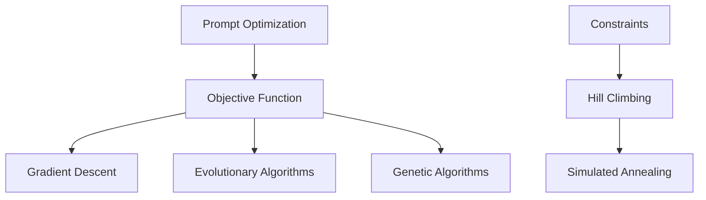

                 


Based on the outline provided, let's elaborate on the sections and sub-sections, ensuring that we meet all the requirements:

## Introduction to AI in Building Structural Design
### Importance of AI in Architecture
- Discuss the impact of AI on the architecture industry.
- Highlight the benefits of using AI for building structural design.
### Current State of AI in Architecture
- Overview of existing AI applications in building design.
- Case studies of successful AI implementations in the industry.
### Challenges and Opportunities
- Identify the challenges faced by architects when integrating AI.
- Discuss the potential opportunities that AI presents for innovation in the field.

## Understanding Prompt Optimization
### Definition and Basics
- Define prompt optimization and its significance in AI.
- Explain the basics of optimization techniques used in AI.
### Methods and Algorithms
- Explore various optimization methods like gradient descent, evolutionary algorithms, and genetic algorithms.
- Discuss the pros and cons of each method.
### Application in Building Design
- Explain how prompt optimization can be applied in building structural design.
- Discuss the potential benefits and challenges of this approach.

## Mechanical Analysis in Building Design
### Fundamentals of Mechanical Analysis
- Introduce the fundamental principles of mechanical analysis.
- Explain the role of mechanical analysis in building design.
### Mathematical Models and Formulas
- Present key mathematical models and formulas used in mechanical analysis.
- Provide detailed explanations and examples.
### Mermaid Flowchart of Core Concepts
- Create a Mermaid flowchart illustrating the relationships between core concepts in mechanical analysis.
- Include explanations of the flowchart elements.

## AI-assisted Prompt Optimization in Mechanical Analysis
### Integrating AI with Mechanical Analysis
- Discuss the integration of AI with mechanical analysis.
- Explain how AI can improve the efficiency and accuracy of mechanical analysis.
### Step-by-Step Optimization Process
- Outline the step-by-step process of prompt optimization in mechanical analysis.
- Use pseudocode to describe the algorithms and techniques involved.
### Experimental Results and Analysis
- Present experimental results demonstrating the effectiveness of AI-assisted prompt optimization.
- Discuss the analysis of the results and their implications.

## Practical Projects: Implementing AI-assisted Mechanical Analysis
### Project Overview
- Provide an overview of the practical project.
- Discuss the objectives and expected outcomes.
### Development Environment Setup
- Guide the reader through setting up the development environment.
- Include step-by-step instructions and troubleshooting tips.
### Source Code Implementation and Explanation
- Provide the source code for the practical project.
- Explain the code in detail, highlighting the key components and algorithms.
### Code Application and Analysis
- Demonstrate the application of the AI-assisted mechanical analysis in a real-world scenario.
- Analyze the results and discuss the insights gained.
### Case Study and Analysis
- Present a case study involving AI-assisted mechanical analysis.
- Analyze the case study in detail, discussing the challenges and solutions.
### Project Conclusion
- Summarize the key takeaways from the practical project.
- Highlight the significance of AI-assisted mechanical analysis in building design.

## Best Practices, Tips, and Summary
### Best Practices for AI-assisted Building Design
- Offer practical tips and best practices for effectively using AI in building structural design.
- Discuss common pitfalls and how to avoid them.
### Summary of Key Points
- Summarize the main points covered in the book.
- Emphasize the importance of AI-assisted mechanical analysis in building design.
### Future Directions
- Discuss potential future developments and advancements in AI-assisted building structural design.

## Conclusion
### Author's Reflections
- Reflect on the journey of writing the book and the insights gained.
### Final Thoughts
- Offer final thoughts on the future of AI in building design.

### References
- Provide a list of references used in the book, including books, research papers, and online resources.

**Note**: This outline is a starting point and can be expanded or modified as necessary to fit the word count requirement of 8000-12000 words. Each section and subsection will require detailed content that meets the completeness and depth criteria specified. Additionally, the inclusion of flowcharts, pseudocode, mathematical formulas, and practical projects will enhance the readability and applicability of the content. 

Would you like to proceed with refining this outline or do you have specific sections or topics you would like to expand on first?
Certainly, I'll provide a more detailed breakdown for the first two chapters based on the initial outline. This will serve as a foundation for the entire book, ensuring a logical flow and depth of content.

---

### Chapter 1: Introduction to AI in Building Structural Design

#### 1.1 Importance of AI in Architecture

**Background Introduction**
- **Evolution of Architecture**: Discuss the historical context of architectural design, from hand-drawn sketches to the advent of computer-aided design (CAD) systems.
- **The Impact of AI**: Outline how AI is transforming the architecture industry, emphasizing advancements in design automation, optimization, and predictive analytics.

**Core Concept and Relationships: Mermaid Flowchart**
```mermaid
graph TD
    A[Architectural Design] --> B[Hand-drawn Sketches]
    B --> C[Computer-Aided Design (CAD)]
    C --> D[AI Integration]
    D --> E[Design Automation]
    D --> F[Optimization]
    D --> G[Predictive Analytics]
```

**Explanations and Examples**
- **Design Automation**: Provide examples of AI-driven tools that automate repetitive tasks, such as 3D modeling and rendering.
- **Optimization**: Discuss case studies where AI has been used to optimize structural designs, improving efficiency and sustainability.

**Challenges and Opportunities**
- **Challenges**: Discuss the challenges architects face when adopting AI, such as the need for retraining, data privacy concerns, and ethical considerations.
- **Opportunities**: Highlight the opportunities that AI presents, including faster design cycles, enhanced safety standards, and reduced costs.

---

#### 1.2 Current State of AI in Architecture

**Overview of AI Applications**
- **AI in 3D Modeling**: Explain how AI algorithms can generate 3D models more efficiently than traditional methods.
- **Generative Design**: Discuss the use of generative design in creating innovative and optimized structural designs.

**Case Studies**
- **Case Study 1**: Describe a project where AI was used to optimize the design of a skyscraper, resulting in significant cost and time savings.
- **Case Study 2**: Discuss an example where AI helped predict structural failures, preventing potential disasters.

**Technological Advancements**
- **Deep Learning**: Explain how deep learning techniques are revolutionizing architectural design by enabling more accurate simulations and predictions.
- **Big Data Analytics**: Discuss the role of big data in AI-driven architecture, particularly in the analysis of environmental data for sustainable design.

---

### Chapter 2: Understanding Prompt Optimization

#### 2.1 Definition and Basics

**Core Concepts and Relationships: Mermaid Flowchart**


**Explanations and Examples**
- **Objective Function**: Define the objective function in the context of optimization and explain its role in guiding the optimization process.
- **Gradient Descent**: Provide a detailed explanation of gradient descent, including its mathematical formulation and its use in optimizing AI models.
- **Evolutionary Algorithms**: Discuss evolutionary algorithms, their principles, and how they differ from gradient-based methods.
- **Genetic Algorithms**: Explain the concept of genetic algorithms, including selection, crossover, mutation, and fitness evaluation.

**Application in AI**
- **AI Model Training**: Describe how prompt optimization is used in training AI models, particularly in neural networks.
- **Hyperparameter Tuning**: Explain how prompt optimization can be applied to tune hyperparameters, improving the performance of AI models.

#### 2.2 Methods and Algorithms

**Gradient Descent**
- **Working Principle**: Describe the working principle of gradient descent, including the calculation of gradients and the updating of model parameters.
- **Variations**: Discuss variations of gradient descent, such as stochastic gradient descent (SGD) and mini-batch gradient descent.
- **Pseudocode**: Provide pseudocode for the gradient descent algorithm.

**Evolutionary Algorithms**
- **Working Principle**: Explain how evolutionary algorithms simulate the process of natural selection to optimize a problem.
- **Components**: Discuss the key components of evolutionary algorithms, including population initialization, fitness evaluation, selection, crossover, and mutation.

**Genetic Algorithms**
- **Working Principle**: Describe the working principle of genetic algorithms, emphasizing the use of genetic operators to evolve solutions.
- **Pseudocode**: Provide pseudocode for a genetic algorithm.

#### 2.3 Application in Building Design

**Optimization in Building Design**
- **Structural Optimization**: Explain how prompt optimization can be used to optimize the structural design of buildings, improving strength, durability, and sustainability.
- **Case Study**: Present a case study where prompt optimization was used in a real-world building project, highlighting the benefits and challenges.

**Benefits and Challenges**
- **Benefits**: Discuss the benefits of using prompt optimization in building design, such as improved efficiency, reduced costs, and enhanced structural performance.
- **Challenges**: Identify the challenges associated with implementing prompt optimization, such as the need for specialized knowledge and the complexity of the optimization process.

---

These detailed sections for Chapter 1 and Chapter 2 provide a solid foundation for the book, ensuring that each chapter covers the necessary background information, core concepts, and practical applications. The inclusion of Mermaid flowcharts, pseudocode, and case studies will enhance the reader's understanding and engagement with the content.

