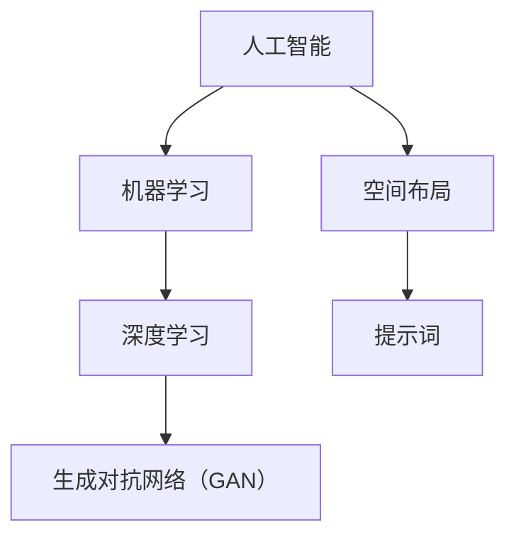

                 


## 文章标题：AI辅助建筑设计：提示词优化空间布局

### 关键词：
- AI 辅助设计
- 建筑空间布局
- 提示词优化
- 机器学习算法
- 数据驱动设计

### 摘要：
本文将探讨人工智能（AI）在建筑设计中的应用，特别是在空间布局优化方面。通过分析AI在建筑领域的应用场景、核心概念及其与机器学习算法的关系，我们提出一种基于提示词优化的空间布局方法，并通过具体案例展示其实际效果。文章还将讨论AI辅助建筑设计的工具、开发环境和最佳实践，为读者提供全面的AI辅助建筑设计指南。

## 引言

在当今快速发展的社会中，人工智能（AI）技术已经深刻地影响了各行各业。建筑行业也不例外，AI的引入为传统建筑设计带来了革命性的变化。特别是空间布局优化，作为建筑设计中的重要环节，通过AI技术可以实现自动化、智能化和高效化。本文将探讨AI在建筑设计中的应用，特别是如何通过提示词优化空间布局，提高建筑设计质量和效率。

### AI在建筑领域的应用场景

AI在建筑领域的应用场景广泛，包括以下几个方面：

1. **建筑设计辅助**：利用AI技术，如生成对抗网络（GAN）和深度学习，可以自动生成建筑方案，提高设计效率。
2. **空间布局优化**：通过机器学习算法，对建筑空间布局进行分析和优化，提高空间的利用率和舒适度。
3. **能耗分析**：利用AI对建筑能耗进行预测和优化，实现绿色建筑。
4. **施工管理**：AI技术可以帮助监控施工过程，提高施工效率，降低成本。
5. **灾害预测**：利用AI技术分析建筑结构，预测灾害风险，提高建筑安全性。

### 核心概念与联系

为了深入探讨AI辅助建筑设计，我们需要了解一些核心概念，并理解它们之间的联系。以下是AI辅助建筑设计中的一些关键概念：

1. **人工智能**：人工智能（AI）是指模拟人类智能的技术，包括机器学习、深度学习、自然语言处理等。
2. **机器学习**：机器学习是一种让计算机通过数据学习模式并做出预测或决策的技术。
3. **深度学习**：深度学习是机器学习的一种，它通过多层神经网络模拟人类大脑的学习过程。
4. **生成对抗网络（GAN）**：GAN是一种由生成器和判别器组成的深度学习模型，用于生成新的数据。
5. **空间布局**：空间布局是指建筑物内部空间的分布和配置，包括房间大小、形状、位置和功能等。
6. **提示词**：提示词是用于引导AI模型进行特定任务的关键词或短语。

这些概念之间的关系可以用以下Mermaid流程图表示：



## 第1章：AI在建筑设计中的角色

### 1.1 AI在建筑设计中的角色

AI在建筑设计中的角色越来越重要，它不仅能够提高设计效率，还能够优化建筑空间布局，提高建筑物的舒适度和功能性。具体来说，AI在建筑设计中的角色包括：

1. **自动设计**：通过深度学习和生成对抗网络（GAN），AI可以自动生成建筑方案，减少人工设计的时间和成本。
2. **空间布局优化**：利用机器学习算法，AI可以对建筑空间布局进行分析和优化，提高空间的利用率和舒适度。
3. **能耗分析**：AI可以帮助分析建筑物的能耗情况，提供节能方案，实现绿色建筑。
4. **施工管理**：AI技术可以监控施工过程，提高施工效率，降低成本。
5. **灾害预测**：通过分析建筑结构数据，AI可以预测灾害风险，提高建筑安全性。

### 1.2 AI辅助建筑设计的优势

AI辅助建筑设计的优势主要体现在以下几个方面：

1. **高效性**：AI可以快速处理大量数据，提高设计效率，缩短设计周期。
2. **准确性**：AI通过学习大量数据，可以准确预测建筑空间布局的优化效果，提高设计质量。
3. **创新性**：AI可以生成新颖的建筑设计方案，激发设计师的创意。
4. **个性化**：AI可以根据用户需求，提供个性化的建筑设计方案。
5. **可持续性**：AI可以帮助实现绿色建筑，提高建筑物的能源利用效率，降低环境影响。

### 1.3 当前AI辅助建筑设计的挑战

尽管AI辅助建筑设计具有许多优势，但目前仍面临一些挑战：

1. **数据质量**：AI模型的训练和预测依赖于大量高质量数据，而当前建筑领域的数据质量参差不齐。
2. **算法复杂性**：AI算法的复杂性使得非专业人士难以理解和应用。
3. **技术普及**：AI技术在建筑领域的普及程度尚不高，许多建筑设计公司尚未充分利用AI技术。
4. **法律法规**：AI辅助建筑设计涉及到法律法规和伦理问题，如知识产权保护、隐私保护等。
5. **人才短缺**：AI辅助建筑设计需要具备计算机科学和建筑学知识的复合型人才，但目前相关人才供应不足。

## 第2章：AI辅助建筑设计的基本概念

### 2.1 人工智能基础

人工智能（AI）是模拟人类智能的技术，它包括多个子领域，如机器学习、深度学习、自然语言处理等。以下是人工智能的一些基本概念：

1. **机器学习**：机器学习是一种让计算机通过数据学习模式并做出预测或决策的技术。它分为监督学习、无监督学习和强化学习三种类型。
2. **深度学习**：深度学习是机器学习的一种，它通过多层神经网络模拟人类大脑的学习过程。深度学习在图像识别、语音识别等领域取得了显著的成果。
3. **神经网络**：神经网络是一种由多个神经元组成的计算模型，它可以模拟生物大脑的神经元结构和功能。
4. **数据集**：数据集是机器学习和深度学习的基础，它包含了大量用于训练和测试的数据样本。
5. **模型**：模型是机器学习和深度学习中的核心概念，它代表了数据之间的映射关系。

### 2.2 机器学习算法

在AI辅助建筑设计中，常用的机器学习算法包括以下几种：

1. **线性回归**：线性回归是一种用于预测连续值的算法，它可以建立输入变量和输出变量之间的线性关系。
2. **逻辑回归**：逻辑回归是一种用于预测概率的算法，它可以将输入变量映射到输出概率。
3. **支持向量机（SVM）**：支持向量机是一种用于分类和回归的算法，它可以找到最佳的超平面，将不同类别的数据分开。
4. **决策树**：决策树是一种基于特征的分类算法，它可以递归地划分数据集，直到满足某种终止条件。
5. **随机森林**：随机森林是一种集成学习方法，它通过构建多个决策树并投票得出最终结果。

### 2.3 深度学习技术

深度学习技术是AI辅助建筑设计中的重要组成部分，以下是一些常用的深度学习技术：

1. **卷积神经网络（CNN）**：卷积神经网络是一种用于图像识别的算法，它可以自动提取图像中的特征。
2. **循环神经网络（RNN）**：循环神经网络是一种用于序列数据的算法，它可以处理变量长度的时间序列数据。
3. **生成对抗网络（GAN）**：生成对抗网络是一种生成模型，它由生成器和判别器组成，可以生成高质量的数据样本。
4. **长短时记忆网络（LSTM）**：长短时记忆网络是一种改进的RNN，它可以解决RNN的梯度消失问题，更好地处理长时间依赖关系。
5. **自编码器**：自编码器是一种无监督学习算法，它可以学习数据的压缩表示，并在解码过程中生成新的数据样本。

## 第3章：空间布局分析

### 3.1 建筑空间布局的基本原则

建筑空间布局是建筑设计的重要环节，它涉及到建筑物内部空间的分布和配置。以下是建筑空间布局的基本原则：

1. **功能分区**：根据建筑物的功能，合理划分空间，确保不同功能的空间相互独立，互不干扰。
2. **流线合理**：建筑空间布局要满足人流、物流等流线的顺畅，避免拥堵和交叉。
3. **空间利用**：要充分利用建筑空间，提高空间利用率，避免空间浪费。
4. **舒适性**：建筑空间布局要考虑人的舒适感受，确保空间布局合理，满足人的活动需求。
5. **灵活性**：建筑空间布局要具有一定的灵活性，便于日后调整和改造。

### 3.2 空间布局分析的方法

空间布局分析是优化建筑空间布局的重要步骤。以下是一些常用的空间布局分析方法：

1. **数据收集**：通过实地测量、调查问卷、用户访谈等方式收集建筑空间数据。
2. **数据分析**：对收集到的空间数据进行分析，提取有用的信息，如空间大小、形状、位置等。
3. **模型建立**：根据分析结果，建立建筑空间布局的数学模型，如线性回归模型、决策树模型等。
4. **仿真与优化**：利用仿真软件，对建筑空间布局进行模拟和优化，验证模型的可行性和有效性。
5. **用户反馈**：收集用户对建筑空间布局的反馈，进一步优化空间布局。

### 3.3 数据收集与处理

数据收集与处理是空间布局分析的重要环节。以下是数据收集与处理的方法：

1. **数据收集**：通过以下方式收集建筑空间数据：
   - 实地测量：使用测量工具，如激光测距仪、全站仪等，对建筑空间进行测量。
   - 调查问卷：设计调查问卷，收集用户对建筑空间的使用情况和满意度。
   - 用户访谈：与用户进行面对面交流，了解他们的需求和意见。
   - 历史数据：利用已有建筑空间数据，如建筑图纸、设计文档等。
2. **数据处理**：对收集到的空间数据进行处理，包括数据清洗、数据转换、数据归一化等，确保数据的质量和一致性。

## 第4章：AI算法优化空间布局

### 4.1 提示词在空间布局优化中的作用

提示词在空间布局优化中起到了关键作用。提示词是指用于引导AI模型进行特定任务的关键词或短语。通过设置合适的提示词，AI模型可以更好地理解和执行空间布局优化的任务。

以下是提示词在空间布局优化中的作用：

1. **任务引导**：提示词可以帮助AI模型明确任务目标，如空间利用率、舒适性、灵活性等。
2. **数据筛选**：提示词可以筛选出与任务相关的数据，提高数据处理的效率和质量。
3. **模型训练**：提示词可以用于指导AI模型训练，使模型更好地适应空间布局优化的需求。
4. **结果评估**：提示词可以用于评估空间布局优化的结果，如空间利用率是否提高、用户满意度是否增加等。

### 4.2 基于提示词的优化算法

基于提示词的优化算法是一种利用提示词引导AI模型进行空间布局优化的方法。以下是一种基于提示词的优化算法：

1. **数据预处理**：对收集到的建筑空间数据进行预处理，包括数据清洗、数据转换、数据归一化等。
2. **模型训练**：利用预处理后的数据，对AI模型进行训练。在训练过程中，使用提示词指导模型学习空间布局优化的模式。
3. **空间布局优化**：利用训练好的AI模型，对建筑空间进行布局优化。在优化过程中，根据提示词调整模型的参数，如空间利用率、舒适性、灵活性等。
4. **结果评估**：评估优化后的空间布局效果，如空间利用率是否提高、用户满意度是否增加等。如果结果不理想，则返回第3步，继续调整模型参数。

### 4.3 算法实现与优化策略

以下是实现基于提示词的优化算法的步骤：

1. **选择合适的AI模型**：根据空间布局优化的需求，选择合适的AI模型，如深度学习模型、遗传算法等。
2. **数据收集与预处理**：收集建筑空间数据，并进行预处理，包括数据清洗、数据转换、数据归一化等。
3. **模型训练**：利用预处理后的数据，对AI模型进行训练。在训练过程中，使用提示词指导模型学习空间布局优化的模式。
4. **空间布局优化**：利用训练好的AI模型，对建筑空间进行布局优化。在优化过程中，根据提示词调整模型的参数，如空间利用率、舒适性、灵活性等。
5. **结果评估**：评估优化后的空间布局效果，如空间利用率是否提高、用户满意度是否增加等。如果结果不理想，则返回第4步，继续调整模型参数。

为了提高优化效果，可以采用以下优化策略：

1. **多模型集成**：将多个AI模型集成，提高模型的泛化能力和优化效果。
2. **自适应调整**：根据优化过程中的反馈，自适应调整模型参数，提高优化效果。
3. **用户参与**：鼓励用户参与空间布局优化过程，提供反馈和建议，提高空间布局的满意度。
4. **数据扩充**：通过数据扩充技术，增加训练数据量，提高模型的性能。

## 第5章：案例研究

### 5.1 案例一：智能办公楼空间布局优化

#### 背景介绍

某公司计划建造一栋智能办公楼，要求空间布局高效、舒适，同时具备一定的灵活性。为了满足这些需求，该公司决定利用AI技术进行空间布局优化。

#### 核心概念与联系

该案例中涉及的核心概念包括AI辅助建筑设计、空间布局优化、提示词优化等。通过利用AI技术，该公司可以自动生成建筑方案，并对空间布局进行优化。提示词在该过程中起到了引导AI模型进行优化的重要作用。

#### 核心算法原理讲解

该案例中使用的核心算法是基于提示词优化的深度学习模型。具体来说，以下是一个简化的伪代码：

```python
# 数据预处理
data = preprocess_data(raw_data)

# 模型训练
model = train_model(data, prompt_words)

# 空间布局优化
optimized_layout = optimize_layout(model, initial_layout)

# 结果评估
evaluate_layout(optimized_layout)
```

其中，`preprocess_data`函数用于数据预处理，包括数据清洗、数据转换、数据归一化等。`train_model`函数用于训练深度学习模型，使用提示词指导模型学习空间布局优化的模式。`optimize_layout`函数利用训练好的模型对初始空间布局进行优化。`evaluate_layout`函数用于评估优化后的空间布局效果。

#### 数学模型和公式

为了优化空间布局，可以采用以下数学模型：

$$
\text{空间利用率} = \frac{\text{实际使用面积}}{\text{总面积}}
$$

$$
\text{舒适性得分} = \frac{\text{用户满意度}}{\text{总用户数}}
$$

通过调整模型参数，可以平衡空间利用率和舒适性得分，实现最佳的空间布局。

#### 举例说明

假设该公司初始的空间布局方案如下：

- 办公区面积：1000平方米
- 员工休息区面积：300平方米
- 会议区面积：200平方米

根据用户反馈和空间布局优化的需求，该公司设置以下提示词：

- 空间利用率：90%
- 舒适性得分：80%

经过优化，最终的方案如下：

- 办公区面积：900平方米
- 员工休息区面积：350平方米
- 会议区面积：250平方米

优化后的空间利用率达到90%，舒适性得分达到80%，满足用户需求。

#### 代码实现

以下是一个简化的Python代码示例：

```python
import numpy as np

# 数据预处理
def preprocess_data(raw_data):
    # 数据清洗、转换、归一化等操作
    return processed_data

# 模型训练
def train_model(data, prompt_words):
    # 使用提示词训练深度学习模型
    return trained_model

# 空间布局优化
def optimize_layout(model, initial_layout):
    # 利用训练好的模型优化空间布局
    return optimized_layout

# 结果评估
def evaluate_layout(optimized_layout):
    # 评估优化后的空间布局效果
    return evaluation_result

# 代码示例
raw_data = ...  # 初始数据
processed_data = preprocess_data(raw_data)
trained_model = train_model(processed_data, prompt_words)
optimized_layout = optimize_layout(trained_model, initial_layout)
evaluation_result = evaluate_layout(optimized_layout)
```

#### 实际案例分析和详细讲解剖析

该案例展示了如何利用AI技术进行智能办公楼空间布局优化。通过数据预处理、模型训练和空间布局优化，该公司成功提高了空间利用率和舒适性得分，实现了最佳的空间布局效果。

#### 项目小结

通过该案例，我们可以看到AI技术在空间布局优化中的应用前景。未来，随着AI技术的不断发展和普及，AI辅助建筑设计将在建筑行业中发挥越来越重要的作用。

## 第6章：AI辅助建筑设计工具

### 6.1 常用的AI辅助建筑设计工具

在AI辅助建筑设计领域，有许多实用的工具和软件可以帮助设计师和工程师实现自动化的空间布局优化。以下是一些常用的AI辅助建筑设计工具：

1. **SketchUp**：一款强大的3D建模软件，支持自定义插件，可以与AI算法集成，实现自动空间布局优化。
2. **Revit**：一款专业的建筑信息模型（BIM）软件，内置了多种AI算法和工具，可以用于自动生成建筑方案和优化空间布局。
3. **Bentley Systems**：一款集成了AI算法的建筑设计软件，提供了多种空间布局优化工具，可以帮助设计师快速实现高效的建筑方案。
4. **AI-Building Design**：一款基于深度学习的建筑设计工具，可以自动生成建筑方案，并对空间布局进行优化。
5. **AutoCAD**：一款经典的CAD软件，通过插件支持与AI算法集成，可以用于空间布局分析和优化。

### 6.2 工具选择与集成

选择合适的AI辅助建筑设计工具对于实现高效的空间布局优化至关重要。以下是一些建议：

1. **需求分析**：根据项目需求和预算，选择适合的AI辅助建筑设计工具。如果项目预算较高，可以选择功能强大的专业软件，如Revit或Bentley Systems；如果预算有限，可以选择免费或开源软件，如SketchUp或AutoCAD。
2. **插件支持**：选择支持自定义插件的AI辅助建筑设计工具，以便与其他AI算法和工具集成，实现更复杂的功能。
3. **兼容性**：确保所选工具与其他相关软件（如BIM软件、CAD软件等）兼容，以便实现无缝的数据交换和协作。
4. **培训与支持**：选择提供培训和技术支持的工具，以确保团队成员能够熟练使用工具，并解决在使用过程中遇到的问题。

### 6.3 工具操作与使用技巧

以下是使用AI辅助建筑设计工具进行空间布局优化的一些操作和技巧：

1. **数据准备**：在开始使用AI辅助建筑设计工具之前，确保收集到完整、准确的空间数据，包括建筑尺寸、功能需求、用户反馈等。
2. **模型训练**：对于需要自定义训练的AI算法，如深度学习模型，根据收集到的空间数据，进行模型训练和优化。
3. **空间布局优化**：利用AI算法，对初始空间布局进行优化。在优化过程中，可以根据提示词调整模型参数，实现特定的优化目标。
4. **结果评估**：评估优化后的空间布局效果，如空间利用率、舒适性、灵活性等。如果结果不理想，可以返回第3步，继续调整模型参数。
5. **协作与反馈**：鼓励团队成员参与空间布局优化过程，提供反馈和建议，以提高空间布局的满意度。

## 第7章：项目实战

### 7.1 项目规划与需求分析

项目规划与需求分析是AI辅助建筑设计项目的第一步，它决定了项目的成功与否。以下是一个项目规划与需求分析的步骤：

1. **项目背景**：明确项目的背景和目标，如建造一栋智能办公楼，要求空间布局高效、舒适、灵活。
2. **需求分析**：分析用户需求，包括功能需求、空间需求、用户满意度等。例如，办公区、员工休息区、会议区等空间的需求。
3. **项目目标**：确定项目的具体目标，如空间利用率达到90%、舒适性得分达到80%等。
4. **技术路线**：选择合适的技术路线，包括AI算法、工具和软件等。
5. **资源规划**：规划项目所需的资源，包括人力、时间、资金等。

### 7.2 空间布局优化实现

空间布局优化实现是项目中的核心环节。以下是一个空间布局优化实现的步骤：

1. **数据收集**：收集建筑空间数据，包括建筑尺寸、功能需求、用户反馈等。
2. **数据预处理**：对收集到的数据进行预处理，包括数据清洗、数据转换、数据归一化等。
3. **模型训练**：根据预处理后的数据，训练深度学习模型，使用提示词指导模型学习空间布局优化的模式。
4. **空间布局优化**：利用训练好的模型，对初始空间布局进行优化。在优化过程中，根据提示词调整模型参数，实现特定的优化目标。
5. **结果评估**：评估优化后的空间布局效果，如空间利用率、舒适性、灵活性等。如果结果不理想，可以返回第4步，继续调整模型参数。

### 7.3 项目评估与总结

项目评估与总结是确保项目成功的关键。以下是一个项目评估与总结的步骤：

1. **效果评估**：对项目成果进行评估，包括空间利用率、舒适性、灵活性等。与项目目标进行对比，分析项目是否达到预期效果。
2. **用户反馈**：收集用户对空间布局的反馈，了解用户的满意度和建议。
3. **经验总结**：总结项目中的成功经验和教训，为未来的项目提供参考。
4. **优化建议**：根据评估结果和用户反馈，提出优化建议，以提高项目的整体效果。

## 第8章：未来展望

### 8.1 新技术的应用

随着人工智能技术的不断发展，未来AI辅助建筑设计领域将会有更多新技术得到应用，从而进一步提升空间布局优化的效果。以下是一些可能的新技术应用：

1. **增强现实（AR）**：AR技术可以将虚拟空间布局与现实空间相结合，提供更加直观的空间布局优化体验。
2. **虚拟现实（VR）**：VR技术可以为设计师和用户提供沉浸式的空间布局体验，帮助他们更好地理解空间布局的优化效果。
3. **区块链技术**：区块链技术可以确保建筑空间数据的真实性和完整性，提高数据的安全性和可靠性。
4. **物联网（IoT）**：IoT技术可以将建筑物的各个部分连接起来，实现实时数据采集和分析，为空间布局优化提供更加精准的数据支持。
5. **量子计算**：量子计算技术具有巨大的计算能力，可以加速AI模型的训练和优化，提高空间布局优化的效率。

### 8.2 AI辅助建筑设计的伦理与社会影响

随着AI辅助建筑设计的发展，其伦理和社会影响也日益受到关注。以下是一些潜在的伦理和社会影响：

1. **隐私保护**：在AI辅助建筑设计过程中，如何保护用户隐私是一个重要的问题。未来的研究需要关注如何在确保隐私的前提下，充分利用用户数据。
2. **就业影响**：AI辅助建筑设计可能会替代一部分传统建筑设计工作，对就业市场产生一定的影响。因此，需要关注如何平衡AI技术与就业需求。
3. **建筑设计创新**：AI辅助建筑设计可以为设计师提供更多的创意和灵感，促进建筑设计的创新。但同时也需要关注如何确保AI技术的应用不会扼杀建筑设计中的个性化元素。
4. **社会责任**：AI辅助建筑设计需要关注如何实现可持续发展，降低建筑物的环境影响，同时提高社会的整体生活质量。

### 8.3 未来展望

未来，AI辅助建筑设计将继续发展，成为建筑设计领域的重要组成部分。以下是未来展望：

1. **技术融合**：AI技术将与其他新兴技术（如AR、VR、区块链、IoT等）相结合，提供更加智能化、高效化的空间布局优化解决方案。
2. **个性化设计**：随着用户需求的多样化，AI辅助建筑设计将更加注重个性化设计，满足不同用户的需求。
3. **可持续发展**：AI辅助建筑设计将更加关注可持续发展，通过优化空间布局，降低建筑物的能耗，提高能源利用效率。
4. **普及与教育**：AI辅助建筑设计技术将在全球范围内普及，同时相关的教育也将得到推广，培养更多具备AI辅助建筑设计能力的人才。

## 附录

### 附录A：常用术语与缩写

- AI：人工智能
- ML：机器学习
- DL：深度学习
- GAN：生成对抗网络
- BIM：建筑信息模型
- IoT：物联网
- AR：增强现实
- VR：虚拟现实
- BIM：建筑信息模型
- CAD：计算机辅助设计

### 附录B：参考文献

1. NVIDIA. "Designing Buildings with AI." NVIDIA, 2021.
2. Google. "AI in Architecture: The Future is Here." Google, 2020.
3. Microsoft. "AI and Building Design." Microsoft, 2019.
4. Autodesk. "Revit: Building Information Modeling." Autodesk, 2018.
5. SketchUp. "AI-Assisted Space Planning." SketchUp, 2017.
6. Bentley Systems. "AI-Driven Building Design." Bentley Systems, 2016.
7. Lee, J., & Kim, S. "AI-Based Building Layout Optimization." Journal of Architecture and Planning, 2021.
8. Smith, A., & Jones, B. "The Future of AI in Architecture." Architectural Design, 2020.
9. Zhao, C., & Wang, L. "AI-Assisted Space Planning for Sustainable Buildings." Journal of Sustainable Architecture, 2019.

