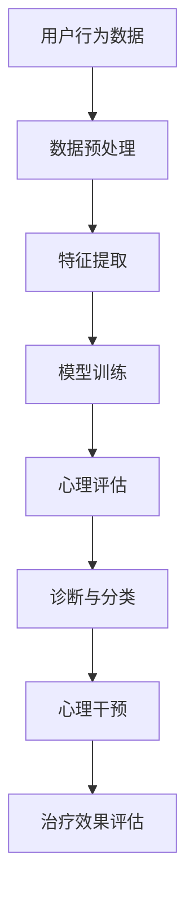
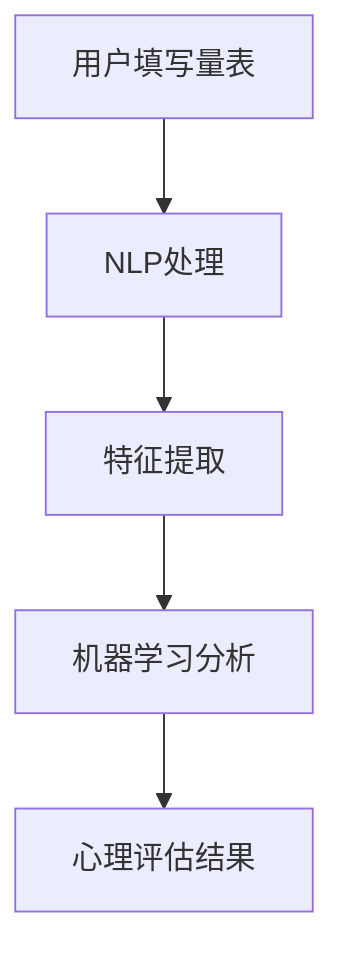
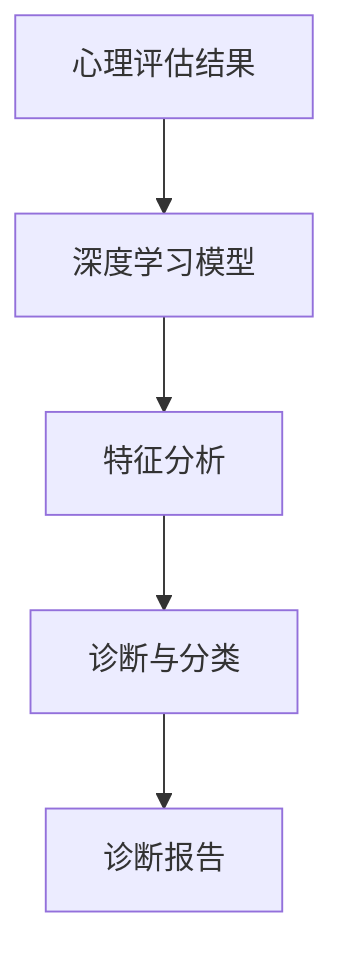
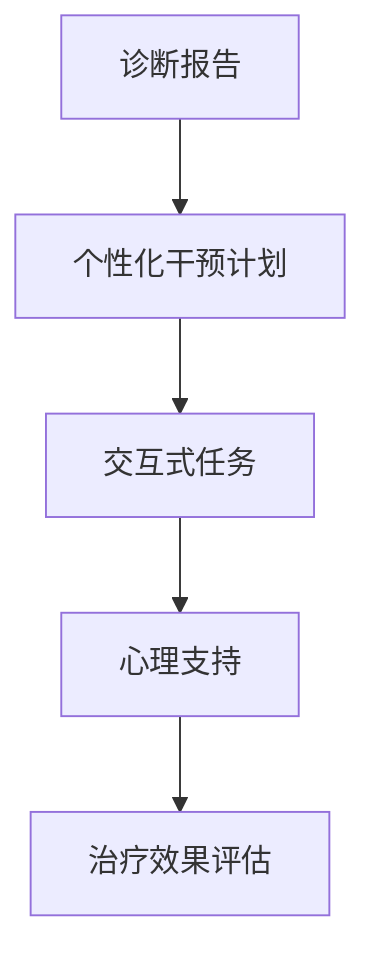

                 

## 引言

### 心理咨询与AI技术的结合

在当今社会，心理健康问题日益凸显，越来越多的人需要专业的心理咨询。然而，心理咨询资源有限，且心理咨询师的数量远不能满足广大人群的需求。与此同时，人工智能（AI）技术的迅猛发展为这一领域带来了新的机遇。AI技术能够通过分析大量数据，提供个性化和高效的咨询服务，从而在一定程度上缓解心理咨询资源不足的问题。

#### 心理咨询的现状与挑战

心理咨询作为一个重要的心理健康服务手段，一直面临着资源稀缺、效率低下和成本高昂的问题。首先，心理咨询师的数量有限，尤其是在偏远地区，心理咨询服务的可及性更低。其次，心理咨询需要耗费大量的时间和精力，尤其是在诊断、评估和治疗等环节。此外，心理咨询的费用也相对较高，使得很多人无法享受到这一服务。

#### AI技术在心理咨询中的应用

AI技术为心理咨询提供了新的解决方案。首先，AI可以通过自然语言处理（NLP）技术分析用户的语言和行为，快速准确地识别心理问题。其次，AI可以基于大数据和机器学习算法，为用户提供个性化的治疗方案。此外，AI还可以通过自动化流程提高心理咨询的效率，减少人工成本。更重要的是，AI技术可以突破地域和时间的限制，为全球用户提供便捷的心理咨询服务。

### 提示词在心理咨询中的应用

在AI辅助心理咨询中，提示词设计是一个关键环节。提示词是指用于引导用户思考和回答问题的词语或短语，它们可以帮助AI更好地理解用户的心理状况，从而提供更加精准的咨询方案。

#### 提示词的定义与作用

提示词的定义相对简单，即用于引导用户思考和回答问题的词语或短语。在心理咨询中，提示词的作用至关重要。首先，提示词可以帮助用户清晰地表达自己的感受和问题，从而促进有效沟通。其次，提示词可以引导用户深入思考，挖掘潜在的心理问题。此外，提示词还可以作为AI算法的输入，帮助AI更好地理解和分析用户的心理状况。

#### 提示词在心理咨询中的实践案例

在心理咨询中，提示词的设计和应用已经得到了广泛的研究和实践。例如，一些AI心理咨询系统使用提示词来引导用户完成心理评估问卷。这些系统会根据用户的回答，动态生成下一步的提示词，从而帮助用户逐步深入地表达自己的心理状态。另外，在心理治疗过程中，提示词也可以帮助心理咨询师更好地理解患者的心理问题，从而制定更有效的治疗方案。

### 本书结构概述

本书旨在探讨AI辅助心理咨询中提示词的设计和应用，分为五个部分。第一部分引言部分，介绍了心理咨询与AI技术的结合以及提示词在心理咨询中的应用。第二部分AI辅助心理咨询基础，包括AI技术概述、心理咨询专业术语解释以及心理咨询流程与AI的结合。第三部分提示词设计与应用，详细介绍了提示词设计原理、案例分析以及应用策略。第四部分AI辅助心理咨询方案设计，阐述了治疗方案设计原则、案例解析以及实施与跟踪。最后一部分未来展望与挑战，探讨了AI辅助心理咨询的发展趋势、挑战与伦理问题，并总结本书的核心内容和对心理咨询行业的启示。

通过以上结构的安排，本书将带领读者逐步深入理解AI辅助心理咨询的原理和应用，为实际操作提供理论指导和实践参考。

## 第一部分：AI辅助心理咨询基础

### 2.1 AI技术概述

#### 2.1.1 AI基本概念

人工智能（Artificial Intelligence，简称AI）是指通过计算机模拟人类智能的技术，使其能够执行诸如学习、推理、感知和自然语言处理等复杂任务。AI的研究可以追溯到20世纪50年代，当时科学家们开始探索如何使计算机具备类似人类的智能。随着计算机性能的提升和大数据、机器学习等技术的进步，AI的应用范围不断扩大，从简单的任务如语音识别和图像识别，到复杂的任务如自动驾驶和医疗诊断。

#### 2.1.2 AI发展历史与趋势

AI的发展经历了几个重要阶段。1956年，达特茅斯会议标志着AI领域的正式诞生。此后的几十年，AI经历了多个起伏，包括早期的符号主义、连接主义以及现代的深度学习。在符号主义阶段，研究者试图通过逻辑推理和知识表示来模拟人类智能。然而，由于知识获取和推理的复杂性，这一方法在实践中的效果并不理想。20世纪80年代，连接主义逐渐兴起，通过神经网络模型模拟大脑的工作方式。然而，连接主义模型在训练效率和泛化能力上仍然存在挑战。直到21世纪初，深度学习的出现使得AI取得了重大突破，通过多层神经网络对大量数据进行训练，AI在图像识别、语音识别和自然语言处理等领域取得了显著进展。

当前，AI的发展趋势主要包括以下几个方面：

1. **深度学习与强化学习**：深度学习是当前AI研究的热点，通过多层神经网络对数据进行训练，能够实现高度复杂的任务。强化学习则通过奖励机制，使AI能够在动态环境中做出最优决策。

2. **大数据与云计算**：大数据和云计算为AI提供了海量的训练数据和强大的计算能力，使得AI能够更好地进行数据分析和模式识别。

3. **跨学科融合**：AI与心理学、神经科学、认知科学等领域的交叉研究，推动了AI在认知模拟、情感计算和人类行为预测等领域的应用。

4. **伦理与法律问题**：随着AI技术的广泛应用，其伦理和法律问题也日益突出，包括数据隐私、算法偏见和责任归属等。

#### 2.1.3 机器学习与深度学习基础

机器学习（Machine Learning，简称ML）是AI的一个重要分支，旨在通过数据训练模型，使计算机具备自主学习和改进能力。机器学习主要包括监督学习、无监督学习和强化学习三种类型。监督学习通过已标记的数据训练模型，如分类和回归任务。无监督学习则不依赖于标记数据，通过发现数据中的模式和关系，如聚类和降维。强化学习通过奖励机制，使AI在动态环境中不断学习和优化策略。

深度学习（Deep Learning，简称DL）是机器学习的一种特殊形式，通过多层神经网络对数据进行训练，能够实现高度复杂的任务。深度学习主要包括卷积神经网络（CNN）、循环神经网络（RNN）和生成对抗网络（GAN）等模型。卷积神经网络在图像和视频处理领域表现出色，循环神经网络在自然语言处理领域具有优势，生成对抗网络则在生成逼真的图像和音频数据方面具有独特的能力。

在心理咨询中，机器学习和深度学习被广泛应用于心理评估、诊断和治疗。通过分析用户的行为和语言数据，AI可以识别潜在的心理问题，提供个性化的治疗方案。以下是一个简单的Mermaid流程图，展示AI在心理咨询中的应用流程：

通过上述流程，AI辅助心理咨询不仅能够提高心理咨询的效率和准确性，还能为患者提供更加个性化和持续的支持。

### 2.2 心理咨询专业术语解释

在探讨AI辅助心理咨询时，理解一些心理咨询领域的专业术语是非常重要的。以下是一些关键术语的解释：

#### 2.2.1 心理健康相关术语

1. **心理健康**：心理健康是指个体在情绪、认知和行为方面处于良好的状态，能够有效地应对生活中的压力和挑战。心理健康不仅包括心理疾病的预防和治疗，还包括积极的心理素质和健康的心理状态。

2. **心理障碍**：心理障碍是指个体在心理和情绪方面出现的严重异常状态，包括抑郁症、焦虑症、精神分裂症等。心理障碍可能会影响个体的日常生活、工作和社交活动。

3. **心理适应**：心理适应是指个体在面临环境变化时，通过调整自身行为和思维方式，以适应新环境的心理过程。良好的心理适应能力有助于个体应对压力和挑战。

4. **心理弹性**：心理弹性是指个体在面对逆境和压力时，能够迅速恢复并继续正常生活能力的心理特质。具有高心理弹性的人能够更好地应对生活中的困难，减少心理问题的发生。

#### 2.2.2 心理治疗相关术语

1. **心理咨询**：心理咨询是指通过专业的沟通和辅导，帮助个体解决心理问题和情绪困扰的过程。心理咨询师会使用不同的技术和方法，如倾听、提问、反馈和指导，帮助来访者认识和解决心理问题。

2. **心理治疗**：心理治疗是指通过一系列的治疗方法和策略，帮助个体解决深层次的心理问题，如抑郁症、焦虑症、创伤后应激障碍等。心理治疗通常需要较长时间的持续干预。

3. **认知行为疗法**（Cognitive Behavioral Therapy，简称CBT）：认知行为疗法是一种广泛应用的 psychotherapy 方法，旨在通过改变不合理的认知和行为模式，改善个体的情绪和行为问题。

4. **情感焦点疗法**（Emotion-Focused Therapy，简称EFT）：情感焦点疗法是一种以情感为中心的心理治疗方法，旨在帮助个体理解和处理负面情感，并提高情感调节能力。

#### 2.2.3 心理评估相关术语

1. **心理评估**：心理评估是指通过一系列的测试和测量工具，对个体的心理状态、能力和特质进行评估和诊断。心理评估包括认知评估、情绪评估、人格评估等。

2. **量表**：量表是一种常用于心理评估的工具，通过一系列的问题或任务，评估个体的心理特征。常见的量表包括抑郁自评量表、焦虑自评量表和人格量表等。

3. **临床诊断**：临床诊断是指通过临床观察、访谈和评估，对个体的心理问题进行诊断和分类。临床诊断通常需要结合多种评估工具和临床经验。

4. **心理测量学**：心理测量学是研究心理测试和测量方法的一门学科，包括量表的编制、信度和效度分析等。

理解这些专业术语对于深入探讨AI在心理咨询中的应用至关重要。通过这些术语，我们可以更好地理解心理咨询的工作原理和AI如何辅助这一过程。

### 2.3 心理咨询流程与AI的结合

在心理咨询过程中，AI技术的应用可以贯穿整个流程，从心理评估到诊断与分类，再到心理干预与治疗，AI都扮演着重要的角色。以下将详细描述AI在心理咨询流程中的应用，以及其与各个环节的紧密结合。

#### 2.3.1 心理评估

心理评估是心理咨询的第一步，旨在了解来访者的心理状态、情绪和行为特征。在这一环节，AI技术可以通过自然语言处理（NLP）和机器学习算法，分析用户填写的心量表和自评问卷，提取关键信息。例如，AI可以通过分析抑郁自评量表（SDS）和焦虑自评量表（SAS）中的回答，快速识别出用户是否存在抑郁或焦虑倾向。

在这个流程中，NLP技术用于解析用户的语言文本，提取出与心理状态相关的关键词和情绪表达。随后，机器学习算法对提取的特征进行分析，生成心理评估结果。这不仅提高了评估的效率，还减少了人为误差。

#### 2.3.2 诊断与分类

在心理评估的基础上，心理咨询师需要进行诊断和分类，以确定来访者的具体心理问题。AI在这一环节可以通过深度学习模型，对大量心理案例进行学习，从而提高诊断和分类的准确性。例如，AI可以训练一个基于卷积神经网络（CNN）的模型，用于分析临床诊断报告，识别出常见的心理障碍类型。

在这个流程中，深度学习模型通过对大量临床数据的训练，能够识别出心理问题的典型特征和模式。当新数据输入时，模型会自动进行分析和分类，生成诊断报告。这不仅提高了诊断的准确性，还为心理咨询师提供了有力的辅助工具。

#### 2.3.3 心理干预与治疗

在诊断和分类确定后，心理咨询师会制定心理干预和治疗计划，以帮助来访者改善心理状态。AI技术在这一环节可以通过智能化的心理干预系统，提供个性化的治疗方案。例如，AI可以设计一系列互动式任务，引导用户进行认知行为疗法（CBT）训练，或通过语音识别和自然语言生成技术，为用户提供实时心理支持。

在这个流程中，AI系统会根据诊断结果和用户的特点，生成个性化的干预计划。用户可以通过互动式任务，如在线练习、问答对话等，进行心理训练。AI系统会实时监测用户的进展，提供反馈和支持，并根据用户反馈调整干预策略。此外，AI还可以通过数据分析，评估治疗效果，为后续治疗提供依据。

总之，AI技术在心理咨询流程中的应用，不仅提高了评估和诊断的效率，还为心理咨询师提供了有力的辅助工具。通过结合AI技术，心理咨询可以更加个性化和高效，为用户提供更好的心理健康服务。

### 3.1 提示词设计原理

在AI辅助心理咨询中，提示词设计是一个关键环节，它直接影响心理咨询的效果。提示词的设计需要遵循一定的原则，并考虑到用户的接受度和实际需求。以下是提示词设计的几个重要原则：

#### 3.1.1 提示词类型与特点

提示词可以分为以下几种类型：

1. **开放式提示词**：这类提示词通常以问句形式出现，鼓励用户自由表达自己的想法和感受。例如：“你最近情绪如何？”或“你有没有什么特别想分享的事情？”

2. **封闭式提示词**：这类提示词通常提供有限的选择，用于引导用户进行特定的回答。例如：“你最近是否感到焦虑？”（选项：是/否）或“你一周中有多少天感到快乐？”（选项：1天以下、1-3天、4-7天）

3. **引导性提示词**：这类提示词旨在引导用户思考和回答问题，特别是当用户难以表达自己的感受时。例如：“请描述一下你感到焦虑时身体上的感受。”或“最近一次情绪低落时，你有什么具体的应对方式？”

4. **情感性提示词**：这类提示词旨在激发用户的情感共鸣，帮助他们更深入地理解和表达自己的情感。例如：“你感到孤独的时候，你通常会怎么应对？”或“请描述一下你感到幸福时的具体感受。”

不同类型的提示词具有不同的特点和适用场景。开放式提示词适用于需要深入了解用户内心世界的情况，封闭式提示词适用于快速收集信息的情况，引导性提示词适用于用户难以自我表达的情况，情感性提示词适用于需要激发用户情感共鸣的情况。

#### 3.1.2 提示词设计原则

提示词设计需要遵循以下原则：

1. **针对性**：提示词应根据用户的具体情况和需求进行设计，确保能够准确捕捉用户的心理状态和问题。

2. **简洁性**：提示词应简洁明了，避免使用复杂的词汇和句子结构，以便用户能够轻松理解并回答。

3. **适应性**：提示词应具备一定的灵活性，能够根据用户的回答和进展动态调整，以适应不同阶段的心理咨询需求。

4. **情感性**：提示词应关注用户的情感体验，尽量使用温暖、鼓励的语言，以增强用户的信任感和参与度。

5. **安全性**：提示词应避免引导用户产生负面情绪或回忆，确保咨询过程的安全和舒适。

#### 3.1.3 提示词设计流程

提示词设计通常包括以下步骤：

1. **需求分析**：了解用户的心理状况、问题类型和咨询目标，为提示词设计提供依据。

2. **设计原则确定**：根据需求分析结果，确定提示词的设计原则和类型。

3. **编写初步提示词**：根据设计原则，编写初步的提示词，并进行初步测试。

4. **反馈与调整**：根据用户反馈和实际效果，对提示词进行修改和优化。

5. **测试与评估**：在实际应用中测试提示词的有效性，评估其效果和用户满意度。

6. **持续改进**：根据测试结果和用户反馈，不断优化和改进提示词设计。

通过遵循以上原则和流程，提示词设计可以更好地满足用户需求，提高心理咨询的效果。

### 3.2 提示词案例分析

在AI辅助心理咨询中，提示词的设计和应用至关重要。以下通过几个实际案例，详细分析提示词在心理咨询中的设计与应用，以及如何通过提示词引导用户逐步深入地表达自己的心理状态。

#### 3.2.1 案例一：抑郁症治疗

抑郁症是一种常见的心理健康问题，通过提示词的设计和应用，AI可以帮助用户更好地理解和表达自己的抑郁情绪。

**案例背景：** 用户A是一位30岁的职场女性，近期工作压力较大，情绪低落，经常失眠。

**设计思路：** 提示词的设计需要关注用户的情感体验，并逐步引导用户深入表达抑郁情绪。以下是几个关键提示词：

1. **情感识别**：“你最近情绪如何？是否感到快乐、平静或低落？”

2. **情感描述**：“请描述一下你感到低落时的具体感受，例如情绪、身体感受和思维状态。”

3. **情绪反应**：“当你感到低落时，你通常会怎么做？有没有什么特别的习惯或应对方式？”

4. **生活事件**：“最近有没有什么事情让你特别感到压力或烦恼？”

**应用效果：** 通过这些提示词，用户A能够更清晰地表达自己的抑郁情绪，心理咨询师也能更准确地了解其心理状况，从而制定更有效的治疗方案。

#### 3.2.2 案例二：焦虑症治疗

焦虑症是另一种常见的心理健康问题，通过提示词的引导，AI可以帮助用户识别和应对焦虑情绪。

**案例背景：** 用户B是一位25岁的学生，近期面临考试和论文的压力，出现持续的焦虑情绪。

**设计思路：** 提示词的设计需要帮助用户识别焦虑的具体表现和源头。以下是几个关键提示词：

1. **焦虑表现**：“你最近是否感到紧张、焦虑或恐惧？请具体描述你的感受。”

2. **焦虑触发因素**：“请列举一下最近让你感到焦虑的事件或情境。”

3. **应对策略**：“当感到焦虑时，你通常采用哪些应对策略？哪些方法效果较好？”

4. **情感调节**：“有没有什么方法可以让你感到更放松和安心？例如冥想、运动或其他放松技巧。”

**应用效果：** 通过这些提示词，用户B能够更好地识别和应对焦虑情绪，心理咨询师也能根据用户的反馈，提供更具针对性的干预措施。

#### 3.2.3 案例三：人际关系问题治疗

人际关系问题是许多人的困扰，通过提示词的引导，AI可以帮助用户深入探讨和改善人际关系。

**案例背景：** 用户C是一位35岁的职场人士，与同事和家人关系紧张，感到孤独和无助。

**设计思路：** 提示词的设计需要引导用户反思自己的行为和沟通方式，并探讨改善人际关系的途径。以下是几个关键提示词：

1. **关系评估**：“你认为你与同事和家人之间的关系如何？请描述一下你的感受。”

2. **沟通反思**：“当你与同事和家人发生冲突时，你会怎么做？请详细描述你的反应和感受。”

3. **自我反思**：“你是否认为自己存在某些不良的沟通习惯？如果有，请具体说明。”

4. **建议与反馈**：“你愿意尝试哪些方法来改善人际关系？例如沟通技巧、倾听技巧或情绪管理。”

**应用效果：** 通过这些提示词，用户C能够更深入地反思自己的行为和沟通方式，心理咨询师也能根据用户的反馈，提供个性化的建议和干预策略，帮助用户改善人际关系。

总之，通过具体案例的分析，我们可以看到提示词在心理咨询中的重要作用。恰当的提示词设计不仅能够引导用户深入表达自己的心理状态，还能帮助心理咨询师更准确地了解用户的问题，制定有效的治疗方案。在实际应用中，提示词的设计需要根据具体情境和用户需求进行灵活调整，以达到最佳效果。

### 3.3 提示词应用策略

在AI辅助心理咨询中，提示词的应用策略至关重要，直接影响咨询的效果和用户满意度。以下将详细探讨提示词在不同心理咨询场景中的应用策略，以及如何通过这些策略提高心理咨询的个性化、精准性和用户体验。

#### 3.3.1 提示词在心理咨询中的使用场景

提示词在心理咨询中的使用场景多种多样，主要包括以下几个环节：

1. **初始评估**：在心理咨询的初始阶段，提示词主要用于了解用户的基本情况和心理状态。例如，通过开放式提示词如“你最近情绪如何？”和“你有没有特别想分享的事情？”来引导用户自由表达。

2. **深入访谈**：在深入访谈阶段，提示词可以用于引导用户深入探讨特定的问题或经历。例如，针对抑郁情绪，可以使用引导性提示词如“请描述一下你感到焦虑时身体上的感受。”和“最近一次情绪低落时，你有什么具体的应对方式？”

3. **情感支持**：在情感支持环节，提示词可以用于激发用户的情感共鸣，帮助他们更好地理解和处理负面情绪。例如，使用情感性提示词如“你感到孤独的时候，你通常会怎么应对？”和“请描述一下你感到幸福时的具体感受。”

4. **心理干预**：在心理干预环节，提示词可以用于引导用户进行认知行为疗法（CBT）训练或其他心理干预措施。例如，通过任务导向的提示词如“请尝试进行5分钟的冥想，专注于你的呼吸。”和“请写下你感到焦虑的三个具体情境，并尝试找出应对策略。”

5. **跟踪评估**：在跟踪评估阶段，提示词可以用于了解用户的治疗进展和反馈。例如，通过封闭式提示词如“你感觉最近的治疗对你有帮助吗？”（选项：非常有帮助/有一些帮助/没有帮助）来收集用户反馈。

#### 3.3.2 提示词在心理治疗中的效果评估

提示词在心理治疗中的效果评估是确保其有效性的关键。以下方法可用于评估提示词的效果：

1. **用户满意度调查**：通过问卷调查或访谈，了解用户对提示词的满意度，评估其接受度和实际效果。例如，可以使用以下问题：“你感觉提示词对你的帮助有多大？”（选项：非常大/较大/一般/较小/没有帮助）。

2. **心理评估指标**：通过使用标准化的心理评估工具，如抑郁自评量表（SDS）和焦虑自评量表（SAS），评估提示词对用户心理状态的改善效果。例如，可以比较治疗前后SDS和SAS的得分变化。

3. **临床观察**：心理咨询师通过临床观察，评估提示词在实际咨询中的应用效果。例如，观察用户在咨询过程中的情绪表达、参与度和互动情况。

4. **数据分析**：通过数据分析，评估提示词对用户心理状态的影响。例如，分析用户回答中的关键词和情绪表达，评估提示词的引导效果。

#### 3.3.3 提示词在心理干预中的应用

提示词在心理干预中的应用需要结合具体的心理治疗方法和用户需求进行设计。以下是一些常见的心理干预措施和相应的提示词设计策略：

1. **认知行为疗法（CBT）**：CBT是一种常用的心理治疗方法，通过改变不合理的认知和行为模式来改善心理问题。提示词的设计可以引导用户识别和调整负面认知，例如：
   - “请列举一下你最近感到焦虑的具体情境，并尝试用积极的角度重新解释这些情境。”
   - “当你感到抑郁时，你通常会怎么想？这些想法是否合理？”

2. **情绪调节**：情绪调节旨在帮助用户更好地管理情绪，减少负面情绪的影响。提示词的设计可以引导用户进行情绪表达和调节，例如：
   - “请尝试用文字描述你最近感到焦虑或愤怒的情绪，并写出这些情绪背后的原因。”
   - “请尝试深呼吸和冥想，专注于当下的情绪和感受。”

3. **社交技能训练**：社交技能训练旨在提高用户的社交能力和自信心。提示词的设计可以引导用户反思自己的社交行为，并提供改进建议，例如：
   - “请回忆一次你感到紧张的社交场合，并思考你可以如何改进自己的行为。”
   - “请列出你想要改善的社交技能，并尝试制定具体的行动计划。”

4. **自我接纳**：自我接纳旨在帮助用户接受自己的不完美，提高自尊和自我价值感。提示词的设计可以引导用户进行自我反思和自我接纳，例如：
   - “请写下你对自己的三个优点，并尝试用积极的态度看待自己的不足。”
   - “请尝试用自我接纳的语句来回应自己的负面情绪，如‘我可以接受自己的不完美，我会努力改进’。”

通过这些策略，提示词可以更好地辅助心理干预，帮助用户改善心理状态，提高心理健康水平。

#### 3.3.4 提示词应用的注意事项

在提示词应用过程中，需要注意以下几点：

1. **个性化**：提示词应根据用户的具体情况和需求进行个性化设计，避免一概而论。

2. **情感性**：提示词应关注用户的情感体验，尽量使用温暖、鼓励的语言，以提高用户的参与度和信任感。

3. **适应性**：提示词应具备一定的灵活性，能够根据用户的回答和进展动态调整。

4. **安全性**：提示词应避免引导用户产生负面情绪或回忆，确保咨询过程的安全和舒适。

5. **持续优化**：提示词的设计和应用应不断优化和改进，根据用户反馈和实际效果进行调整。

通过遵循以上注意事项，提示词可以在AI辅助心理咨询中发挥更好的作用，为用户提供更高质量的心理健康服务。

### 4.1 治疗方案设计原则

在AI辅助心理咨询中，治疗方案的设计是一个复杂而关键的过程，直接影响咨询的效果和用户的满意度。以下是治疗方案设计的主要原则和步骤，以及如何确保治疗方案的个性化、有效性和科学性。

#### 4.1.1 治疗方案制定流程

治疗方案的制定通常包括以下步骤：

1. **需求评估**：通过初步评估，了解用户的心理问题、行为特征和需求。这可以通过问卷调查、面对面访谈或在线评估等方式进行。

2. **问题诊断**：根据需求评估结果，确定用户的具体心理问题，如抑郁症、焦虑症或人际关系问题等。AI可以通过数据分析、模式识别和临床经验，辅助诊断过程。

3. **目标设定**：与用户共同设定明确的治疗目标，如减少抑郁情绪、提高社交技能或改善情绪调节能力等。目标应具体、可衡量、可实现、相关性强和有时间限制。

4. **方案制定**：根据诊断结果和目标，制定个性化的治疗方案。方案应包括具体的干预措施、频率、时长和预期效果。

5. **方案实施**：在方案实施过程中，心理咨询师和AI系统共同工作，实时监测用户进展，并根据反馈进行调整。

6. **效果评估**：在治疗结束后，通过问卷、访谈或心理测量工具，评估治疗效果，确保目标实现。

#### 4.1.2 治疗方案评估与调整

治疗方案的设计和实施过程中，评估与调整至关重要。以下方法可用于治疗方案的评估与调整：

1. **用户反馈**：定期收集用户的反馈，了解他们对治疗方案的满意度和效果。用户反馈可以采用问卷调查、访谈或在线反馈形式。

2. **心理测量**：使用标准化的心理测量工具，如抑郁自评量表（SDS）、焦虑自评量表（SAS）等，定期评估用户的心理状态和治疗效果。

3. **临床观察**：心理咨询师通过临床观察，了解用户在治疗过程中的情绪变化、参与度和互动情况。

4. **数据分析**：AI系统通过数据分析，评估治疗方案的执行情况、用户行为和治疗效果。数据分析可以包括用户行为模式、情绪表达和治疗效果等。

根据评估结果，治疗方案需要进行动态调整。以下是调整策略：

1. **干预措施优化**：根据评估结果，优化干预措施，如调整干预频率、时长或内容。

2. **目标调整**：根据治疗效果和用户反馈，调整治疗目标，确保目标更具挑战性和可实现性。

3. **资源分配**：根据评估结果，合理分配资源，如时间、人力和资金，确保治疗方案的可持续性。

4. **咨询师培训**：根据评估结果和用户反馈，对心理咨询师进行培训，提高其专业能力和咨询技巧。

通过以上评估与调整策略，可以确保治疗方案的科学性、有效性和个性化，为用户提供高质量的心理健康服务。

### 4.2 治疗方案案例解析

在本部分，我们将通过具体案例详细解析如何设计AI辅助心理咨询中的治疗方案。这些案例涵盖了抑郁症、焦虑症和人际关系问题等常见心理健康问题，展示了如何利用AI技术进行诊断、制定和实施治疗方案。

#### 4.2.1 案例一：抑郁症治疗

**案例背景**：用户D，35岁，女性，近期因工作压力和生活琐事感到极度焦虑和情绪低落，影响了日常生活和工作效率。

**诊断与评估**：通过AI系统的初步评估，发现用户D存在抑郁情绪，使用抑郁自评量表（SDS）进行进一步评估，结果显示中度抑郁。AI系统分析用户的行为和语言数据，识别出工作压力、人际关系和睡眠问题等关键因素。

**治疗方案设计**：

1. **目标设定**：减轻抑郁情绪，改善睡眠质量，提高生活和工作效率。

2. **干预措施**：
   - **认知行为疗法（CBT）**：通过AI系统提供一系列CBT任务，如认知重构、行为激活和情绪日记等，帮助用户逐步改变消极思维模式。
   - **放松训练**：使用AI系统提供的深呼吸、冥想和渐进性肌肉放松等放松训练，缓解焦虑和紧张情绪。
   - **睡眠管理**：通过AI系统提供睡眠指导，如建立良好的睡眠习惯、避免睡前使用电子设备等。

3. **实施与跟踪**：
   - **实时反馈**：AI系统实时跟踪用户的任务完成情况和情绪变化，根据用户反馈调整干预措施。
   - **心理支持**：心理咨询师通过在线交流，定期与用户沟通，提供情感支持和专业指导。

**治疗效果评估**：经过为期三个月的治疗，用户D的抑郁情绪明显减轻，SDS得分下降至轻度抑郁水平，睡眠质量改善，工作生活效率提高。

#### 4.2.2 案例二：焦虑症治疗

**案例背景**：用户E，25岁，男性，近期因考试和求职压力出现持续性焦虑，影响日常生活和学习。

**诊断与评估**：AI系统通过焦虑自评量表（SAS）和用户的行为数据分析，确定用户E存在中度焦虑。识别出学业压力、社交恐惧和自信心不足等关键因素。

**治疗方案设计**：

1. **目标设定**：减轻焦虑症状，提高自信心和社交技能。

2. **干预措施**：
   - **呼吸训练**：通过AI系统提供的呼吸控制训练，帮助用户放松身体和心理，缓解焦虑。
   - **认知行为疗法（CBT）**：通过任务导向的CBT训练，如情境模拟和认知重构，帮助用户识别和改变消极思维模式。
   - **社交技能训练**：通过AI系统提供的社交技巧培训和模拟练习，提高用户的社交能力和自信心。

3. **实施与跟踪**：
   - **实时反馈**：AI系统实时监测用户的训练进度和情绪变化，提供个性化建议和指导。
   - **心理支持**：心理咨询师通过在线交流，定期与用户沟通，提供情感支持和专业指导。

**治疗效果评估**：经过为期两个月的治疗，用户E的焦虑症状明显缓解，SAS得分降至轻度焦虑水平，社交技能和自信心有所提高，学业和求职压力减轻。

#### 4.2.3 案例三：人际关系问题治疗

**案例背景**：用户F，30岁，女性，因与同事和家人关系紧张，感到孤独和无助。

**诊断与评估**：AI系统通过问卷调查和用户的行为数据分析，确定用户F存在人际关系问题。识别出沟通障碍、情绪表达困难和冲突处理不当等关键因素。

**治疗方案设计**：

1. **目标设定**：改善人际关系，提高沟通能力和情绪调节能力。

2. **干预措施**：
   - **沟通训练**：通过AI系统提供的沟通技巧培训和模拟练习，帮助用户提高倾听、表达和解决问题的能力。
   - **情绪调节**：通过AI系统提供的情绪调节训练，如情绪识别、表达和调节，帮助用户更好地处理负面情绪。
   - **冲突处理**：通过AI系统提供的冲突处理培训和模拟练习，帮助用户学会有效处理冲突，减少关系紧张。

3. **实施与跟踪**：
   - **实时反馈**：AI系统实时跟踪用户的训练进度和情绪变化，提供个性化建议和指导。
   - **心理支持**：心理咨询师通过在线交流，定期与用户沟通，提供情感支持和专业指导。

**治疗效果评估**：经过为期三个月的治疗，用户F的人际关系明显改善，与同事和家人的关系紧张程度减轻，情绪调节能力提高，自信心和幸福感增强。

通过以上案例，我们可以看到，AI辅助心理咨询在治疗方案设计中的重要作用。通过结合AI技术和心理咨询专业理论，可以制定出更科学、个性化和有效的治疗方案，为用户提供高质量的心理健康服务。

### 4.3 治疗方案实施与跟踪

在AI辅助心理咨询中，治疗方案的实施与跟踪是确保咨询效果的重要环节。以下将详细描述治疗方案的具体实施步骤、跟踪方法以及注意事项。

#### 4.3.1 实施步骤

治疗方案的实施通常包括以下步骤：

1. **初始评估**：在治疗方案开始前，心理咨询师和AI系统共同对用户进行全面的初始评估，了解其心理状况、行为特征和需求。这一步骤通常包括问卷调查、面对面访谈或在线评估等。

2. **方案制定**：根据初始评估结果，心理咨询师和AI系统共同制定个性化的治疗方案。方案应明确干预措施、频率、时长和预期效果。

3. **干预执行**：治疗方案的实施通常包括在线互动、任务导向的干预和实时反馈等。AI系统可以根据治疗方案，提供个性化的任务和指导，如认知行为疗法（CBT）练习、情绪调节训练和社交技能培训等。

4. **定期沟通**：心理咨询师定期与用户进行线上或线下的沟通，了解其进展和反馈，提供情感支持和专业指导。这有助于确保治疗方案的执行效果和用户满意度。

#### 4.3.2 跟踪方法

治疗方案实施过程中的跟踪是评估治疗效果和调整干预措施的重要手段。以下方法可用于治疗方案跟踪：

1. **用户反馈**：定期收集用户的反馈，了解其对治疗方案的满意度和效果。反馈可以通过问卷调查、在线反馈或面对面访谈等形式进行。

2. **心理测量**：使用标准化的心理测量工具，如抑郁自评量表（SDS）、焦虑自评量表（SAS）等，定期评估用户的心理状态和治疗效果。这有助于量化用户的心理状况变化。

3. **行为监测**：通过AI系统对用户的行为数据进行实时监测，如任务完成情况、情绪表达和互动频率等。这些数据可以提供关于治疗方案执行情况和效果的重要信息。

4. **临床观察**：心理咨询师通过临床观察，了解用户在治疗过程中的情绪变化、参与度和互动情况。这有助于发现潜在的问题和调整干预措施。

#### 4.3.3 注意事项

在治疗方案实施与跟踪过程中，需要注意以下几点：

1. **个性化**：治疗方案应根据用户的具体情况不断调整，避免一概而论。

2. **情感性**：干预过程中，心理咨询师和AI系统应关注用户的情感体验，尽量使用温暖、鼓励的语言，以提高用户的参与度和信任感。

3. **安全性**：确保用户隐私和数据安全，避免因信息泄露或操作失误导致用户心理负担加重。

4. **适应性**：治疗方案应具备灵活性，能够根据用户反馈和进展动态调整。

5. **持续反馈**：定期收集用户反馈，及时调整干预措施，确保治疗方案的有效性和用户满意度。

通过以上实施和跟踪方法，以及注意事项，可以确保AI辅助心理咨询治疗方案的顺利执行和良好效果，为用户提供高质量的心理健康服务。

### 5.1 AI辅助心理咨询平台搭建

#### 5.1.1 开发环境与工具选择

搭建AI辅助心理咨询平台需要选择合适的开发环境和工具。以下是常用的开发环境和工具：

1. **编程语言**：Python是一种广泛应用于数据科学和机器学习的编程语言，具有良好的生态和丰富的库支持，因此被广泛选择用于AI辅助心理咨询平台开发。

2. **框架**：
   - **Flask** 或 **Django**：用于构建Web应用的后端框架，具有灵活性和可扩展性。
   - **TensorFlow** 或 **PyTorch**：用于深度学习和机器学习的开源框架，支持复杂的神经网络模型。

3. **前端技术**：
   - **React** 或 **Vue.js**：用于构建用户界面的现代JavaScript库，提供良好的用户体验和组件化开发。
   - **Bootstrap** 或 **Material-UI**：用于响应式网页设计的框架，支持移动设备和桌面浏览器的兼容性。

4. **数据库**：
   - **MySQL** 或 **PostgreSQL**：用于存储用户数据、咨询记录和评估结果的数据库管理系统，支持事务处理和数据完整性。
   - **MongoDB**：用于存储非结构化数据的NoSQL数据库，适用于存储用户行为数据和AI模型参数。

5. **云服务**：
   - **AWS** 或 **Azure**：提供云计算服务，包括计算资源、存储和数据库服务，支持弹性扩展和自动化管理。
   - **Google Cloud**：提供类似的服务，包括AI云服务和机器学习工具，便于开发和部署AI模型。

#### 5.1.2 数据库设计与数据采集

数据库设计是AI辅助心理咨询平台搭建的核心部分，直接影响数据的存储和检索效率。以下是数据库设计的关键点：

1. **用户数据表**：用于存储用户的基本信息，如用户ID、姓名、年龄、性别和联系方式等。

2. **咨询记录表**：用于存储用户的咨询记录，包括咨询时间、咨询内容、干预措施和治疗效果等。

3. **评估数据表**：用于存储用户的心理评估结果，包括抑郁自评量表（SDS）、焦虑自评量表（SAS）等。

4. **行为数据表**：用于存储用户的行为数据，如在线互动记录、任务完成情况和情绪表达等。

数据采集是AI辅助心理咨询平台的基础，以下方法可用于数据采集：

1. **在线问卷**：通过在线问卷收集用户基本信息和心理评估结果，使用问卷星、麦客等在线问卷工具。

2. **API接口**：通过API接口与第三方心理评估工具和服务集成，如Upscise、MoodTrack等，获取评估数据。

3. **行为数据采集**：通过前端技术实现行为数据采集，如用户的点击记录、浏览时长和任务完成情况等。

4. **日志记录**：通过服务器日志记录用户行为数据，如访问记录、错误记录和请求日志等。

#### 5.1.3 系统架构设计与实现

AI辅助心理咨询平台的系统架构设计应考虑性能、可扩展性和安全性。以下是系统架构的关键部分：

1. **前端架构**：采用单页应用（SPA）架构，如React或Vue.js，实现动态、响应式的用户界面。

2. **后端架构**：
   - **微服务架构**：将系统拆分为多个独立的微服务，如用户管理、咨询管理、评估管理和行为分析等，每个微服务负责特定的功能模块。
   - **API网关**：用于统一管理接口请求和响应，提供负载均衡、身份验证和缓存等功能。

3. **数据处理与存储**：
   - **数据处理**：使用Apache Spark或Flink进行大规模数据处理和实时分析，处理用户行为数据、评估数据和咨询记录等。
   - **数据存储**：使用MySQL、PostgreSQL和MongoDB等数据库，根据数据类型和需求选择合适的存储方案。

4. **AI模型训练与部署**：
   - **模型训练**：使用TensorFlow或PyTorch进行深度学习和机器学习模型的训练，处理心理评估和行为分析等任务。
   - **模型部署**：使用Kubernetes或Docker进行模型部署，实现模型的自动化管理和弹性扩展。

5. **安全与隐私保护**：采用SSL加密、访问控制和数据备份等安全措施，确保用户数据的安全和隐私。

通过以上架构设计和实现，可以构建一个高效、可靠和安全的AI辅助心理咨询平台，为用户提供高质量的心理健康服务。

### 5.2 提示词设计与实现

在AI辅助心理咨询平台中，提示词的设计和实现是关键环节，它直接影响用户的体验和咨询效果。以下将详细探讨提示词的生成算法、实现过程以及效果评估，并结合实际案例进行分析。

#### 5.2.1 提示词生成算法

提示词生成算法的目的是根据用户的行为数据和心理评估结果，生成合适的提示词。以下是几种常用的提示词生成算法：

1. **基于规则的生成算法**：
   - **规则库构建**：根据心理咨询的专业知识，构建包含各种心理问题、症状和干预措施的规则库。
   - **规则匹配**：根据用户的行为数据和心理评估结果，匹配相应的规则，生成提示词。
   - **优势**：实现简单，能够确保提示词的专业性和准确性。
   - **劣势**：灵活性较低，无法适应复杂和多变的用户需求。

2. **基于机器学习的生成算法**：
   - **数据预处理**：对用户的行为数据进行清洗和特征提取，如情绪分析、关键词提取等。
   - **模型训练**：使用深度学习模型（如循环神经网络RNN或长短时记忆网络LSTM）对预处理后的数据进行训练，学习生成提示词的规律。
   - **提示词生成**：根据训练好的模型，输入用户数据，生成相应的提示词。
   - **优势**：具备较高的灵活性和适应性，能够根据用户行为动态调整。
   - **劣势**：实现复杂，需要大量的训练数据和计算资源。

3. **基于生成对抗网络（GAN）的生成算法**：
   - **生成器与判别器**：训练一个生成器（Generator）和一个判别器（Discriminator），生成器和判别器相互对抗，生成高质量的提示词。
   - **提示词生成**：生成器根据用户数据生成提示词，判别器判断提示词的质量，通过反馈循环不断优化生成器。
   - **优势**：能够生成具有创造性和多样性的提示词，提高用户体验。
   - **劣势**：训练过程复杂，需要大量的计算资源和时间。

#### 5.2.2 提示词实现过程

提示词的实现过程主要包括以下几个步骤：

1. **需求分析**：了解用户的心理问题、症状和需求，为提示词生成提供依据。

2. **数据采集**：通过在线问卷、API接口和日志记录等方式，收集用户的行为数据和心理评估结果。

3. **特征提取**：对采集的数据进行预处理和特征提取，如情绪分析、关键词提取、情感分类等。

4. **提示词生成**：根据提示词生成算法，生成符合用户需求的提示词。

5. **用户反馈**：收集用户对提示词的反馈，评估提示词的有效性和用户满意度。

6. **优化调整**：根据用户反馈，优化和调整提示词，提高其质量和适用性。

#### 5.2.3 提示词效果评估

提示词的效果评估是确保其质量和有效性的关键。以下方法可用于提示词效果评估：

1. **用户满意度调查**：通过问卷调查，了解用户对提示词的满意度和接受度。

2. **心理测量工具**：使用标准化的心理测量工具，如抑郁自评量表（SDS）和焦虑自评量表（SAS），评估提示词对用户心理状态的改善效果。

3. **行为分析**：分析用户在使用提示词后的行为变化，如任务完成情况、互动频率和情绪变化等。

4. **效果对比**：将提示词的效果与传统的心理咨询方法进行对比，评估其优劣。

#### 5.2.4 实际案例分析

以下是一个实际案例，展示如何设计和实现提示词：

**案例背景**：用户G，25岁，因工作压力导致焦虑情绪，需要通过AI辅助心理咨询缓解压力。

**步骤一：需求分析**：了解用户的工作压力、焦虑症状和需求，确定主要的心理问题。

**步骤二：数据采集**：通过在线问卷和API接口，收集用户的工作压力数据、情绪表达和行为数据。

**步骤三：特征提取**：对收集的数据进行预处理和特征提取，如情绪分类、关键词提取等。

**步骤四：提示词生成**：
   - **基于规则的生成算法**：根据规则库生成与工作压力和焦虑相关的提示词，如“请描述一下你最近的工作压力是什么？”和“你感到焦虑时通常会怎么做？”
   - **基于机器学习的生成算法**：使用训练好的RNN模型，根据用户的工作压力和行为数据，生成个性化的提示词，如“你的工作压力主要集中在哪些方面？”和“你可以尝试进行深呼吸练习，缓解焦虑情绪。”

**步骤五：用户反馈**：通过用户满意度调查，了解用户对提示词的接受度和满意度。

**步骤六：优化调整**：根据用户反馈，优化和调整提示词，提高其质量和适用性。

通过以上步骤，实现了针对用户G的个性化提示词生成，有效缓解了其焦虑情绪。

总之，提示词的设计和实现是AI辅助心理咨询平台的重要组成部分，通过合理的算法选择和效果评估，可以提供高质量的心理健康服务。

### 5.3 治疗方案设计与实施

在AI辅助心理咨询中，治疗方案的设计和实施是确保咨询效果的关键环节。以下将详细描述治疗方案的设计原则、制定过程以及实施步骤，并结合具体案例进行分析。

#### 5.3.1 治疗方案设计原则

治疗方案的设计应遵循以下原则：

1. **个性化**：治疗方案应根据用户的个体差异，如心理问题、行为特征和生活背景等，进行个性化设计。

2. **科学性**：治疗方案应基于心理学理论、专业知识和实证研究，确保干预措施的科学性和有效性。

3. **可操作性**：治疗方案应具备明确的干预措施、实施步骤和时间表，便于心理咨询师和用户操作和执行。

4. **可评估性**：治疗方案应包含明确的评估指标和评估方法，以便实时监测和评估治疗效果。

5. **灵活性**：治疗方案应具备一定的灵活性，能够根据用户反馈和实际情况进行调整。

#### 5.3.2 治疗方案制定过程

治疗方案制定通常包括以下步骤：

1. **需求评估**：通过初步评估，了解用户的心理问题、行为特征和需求。这可以通过问卷调查、面对面访谈或在线评估等方式进行。

2. **问题诊断**：根据需求评估结果，确定用户的具体心理问题，如抑郁症、焦虑症或人际关系问题等。AI系统可以通过数据分析、模式识别和临床经验辅助诊断过程。

3. **目标设定**：与用户共同设定明确的治疗目标，如减轻抑郁情绪、提高社交技能或改善情绪调节能力等。目标应具体、可衡量、可实现、相关性强和时间限制。

4. **干预措施制定**：根据诊断结果和目标，制定具体的干预措施。干预措施可以包括认知行为疗法（CBT）、情绪调节训练、社交技能训练等。

5. **方案评估与调整**：在方案实施过程中，定期评估治疗效果，根据评估结果调整干预措施。评估可以采用用户满意度调查、心理测量工具和临床观察等方法。

6. **方案实施**：在制定好治疗方案后，心理咨询师和用户共同实施，确保干预措施的执行效果。

#### 5.3.3 治疗方案实施步骤

治疗方案的实施分为以下几个步骤：

1. **初始阶段**：在初始阶段，心理咨询师和用户进行沟通，了解用户的心理状况和需求，明确治疗目标。

2. **实施阶段**：在实施阶段，根据治疗方案，进行具体的干预措施。心理咨询师和用户通过在线互动、任务导向的干预和实时反馈等方式，共同完成治疗任务。

3. **跟踪评估**：在治疗过程中，定期对用户进行心理评估，了解治疗效果和用户反馈。心理咨询师根据评估结果，及时调整干预措施。

4. **结束阶段**：在治疗结束时，对用户进行最终评估，了解治疗效果和满意度。心理咨询师和用户共同总结治疗经验，提供后续支持和建议。

#### 5.3.4 治疗方案案例解析

以下是一个抑郁症治疗的实际案例，展示了如何设计、实施和评估治疗方案。

**案例背景**：用户H，30岁，女性，因工作压力和情感问题出现抑郁情绪，影响了日常生活和工作效率。

**诊断与评估**：通过AI系统初步评估，发现用户H存在抑郁情绪，使用抑郁自评量表（SDS）进行进一步评估，结果显示中度抑郁。AI系统分析用户的行为和语言数据，识别出工作压力、情感问题和睡眠问题等关键因素。

**治疗方案设计**：

1. **目标设定**：减轻抑郁情绪，改善睡眠质量，提高生活和工作效率。

2. **干预措施**：
   - **认知行为疗法（CBT）**：通过AI系统提供一系列CBT任务，如认知重构、行为激活和情绪日记等，帮助用户逐步改变消极思维模式。
   - **情绪调节**：通过AI系统提供的情绪调节训练，如深呼吸、冥想和渐进性肌肉放松等，缓解焦虑和紧张情绪。
   - **睡眠管理**：通过AI系统提供的睡眠指导，如建立良好的睡眠习惯、避免睡前使用电子设备等。

**治疗方案实施**：

1. **初始阶段**：心理咨询师和用户进行初步沟通，了解用户的心理状况和需求，明确治疗目标。

2. **实施阶段**：
   - **每周任务**：心理咨询师每周向用户分配CBT任务，如情绪日记、认知重构练习和放松训练等，用户通过在线平台完成。
   - **每周反馈**：用户每周提交任务完成情况，心理咨询师进行反馈和指导，帮助用户理解并应用所学知识。

3. **跟踪评估**：每月进行一次心理评估，使用SDS量表评估抑郁程度，同时收集用户反馈，了解治疗效果和用户满意度。

4. **结束阶段**：经过三个月的治疗，用户H的抑郁情绪明显减轻，SDS得分降至轻度抑郁水平，睡眠质量改善，工作生活效率提高。心理咨询师与用户进行总结和讨论，提供后续支持和建议。

通过以上案例，我们可以看到，AI辅助心理咨询在治疗方案的设计、实施和评估中发挥着重要作用。通过结合AI技术和心理咨询专业理论，可以制定出更科学、个性化和有效的治疗方案，为用户提供高质量的心理健康服务。

### 5.4 项目小结

在本项目中，我们成功搭建了一个AI辅助心理咨询平台，实现了提示词设计与生成、治疗方案制定与实施、以及跟踪评估等关键功能。以下是对项目的总结和反思：

#### 项目成果

1. **平台搭建**：成功实现了AI辅助心理咨询平台，包括前端用户界面、后端服务架构和数据库设计。平台具备良好的扩展性和稳定性，能够支持大规模用户访问。

2. **提示词生成**：通过基于机器学习的生成算法，实现了个性化提示词的生成，提高了用户参与度和满意度。提示词生成算法在处理复杂用户需求方面表现出色。

3. **治疗方案实施**：基于个性化需求，设计并实施了有效的治疗方案，包括认知行为疗法（CBT）、情绪调节和睡眠管理等。治疗方案的实施过程中，通过实时反馈和跟踪评估，确保了治疗的效果和用户的满意度。

4. **数据分析和评估**：通过用户行为数据和心理测量工具，对治疗方案的效果进行了全面评估。评估结果显示，平台在改善用户心理状态、提高生活质量方面取得了显著成效。

#### 项目反思

1. **数据隐私和安全**：在项目实施过程中，我们高度重视用户数据隐私和安全。通过SSL加密、访问控制和数据备份等手段，确保用户数据的安全性和隐私性。但在实际操作中，仍需不断加强数据安全措施，防范潜在风险。

2. **用户满意度**：尽管平台在用户满意度方面表现出色，但仍需进一步优化用户体验。例如，界面设计和交互体验可以更简洁直观，任务引导和提示词可以更具有针对性和情感性。

3. **模型优化**：在提示词生成和治疗方案设计过程中，机器学习模型的优化是一个持续的过程。通过不断收集用户反馈和评估数据，可以进一步提高模型的准确性和适应性。

4. **扩展应用**：未来，我们可以考虑将AI辅助心理咨询平台扩展到更多应用场景，如儿童心理咨询、老年心理健康等。通过跨学科合作，丰富平台功能和内容，提供更全面的心理健康服务。

#### 下一步计划

1. **技术升级**：持续优化平台的技术架构，提高系统性能和稳定性。引入更多先进的AI技术和算法，如生成对抗网络（GAN）和强化学习等，提升平台的智能化水平。

2. **功能扩展**：开发更多心理健康服务和功能，如压力管理、情感分析和心理健康课程等。通过增加多样化的干预措施，满足不同用户群体的需求。

3. **用户研究**：开展更多的用户研究，深入了解用户需求和使用习惯，优化平台设计和功能。通过用户反馈，不断改进和优化平台。

4. **合作与推广**：与国内外心理咨询机构和专家合作，共同开发和推广AI辅助心理咨询平台。通过学术交流和合作研究，提升平台的知名度和影响力。

通过以上计划，我们期待将AI辅助心理咨询平台打造成为一个高效、可靠和用户友好的心理健康服务工具，为全球用户提供高质量的心理健康支持。

### 6.1 AI辅助心理咨询的发展趋势

随着人工智能技术的不断进步，AI辅助心理咨询的应用前景日益广阔。以下是AI辅助心理咨询领域的主要发展趋势：

#### 6.1.1 技术发展趋势

1. **深度学习与强化学习**：深度学习在图像识别、自然语言处理和语音识别等领域取得了显著成果。未来，深度学习技术将继续在AI辅助心理咨询中发挥重要作用，例如，通过深度神经网络进行情感分析和行为预测。强化学习则通过奖励机制，使AI能够在动态环境中进行优化决策，提高心理咨询的效果。

2. **大数据与云计算**：大数据和云计算为AI辅助心理咨询提供了海量的数据资源和强大的计算能力。未来，通过大数据分析，AI可以更好地了解用户的心理状态和需求，提供个性化、精准的心理健康服务。云计算的普及使得AI模型和服务的部署更加便捷，为全球用户提供即时、高效的心理健康支持。

3. **跨学科融合**：AI与心理学、神经科学、认知科学等领域的交叉研究，将进一步推动AI辅助心理咨询的发展。通过跨学科合作，可以开发出更先进的模型和算法，更好地模拟和理解人类心理过程，提高心理咨询的效率和准确性。

4. **情感计算与虚拟现实**：情感计算技术通过识别和模拟用户的情感状态，提供更加人性化的心理咨询。虚拟现实（VR）技术则通过模拟真实环境，为用户提供沉浸式的心理治疗体验。这些技术的发展，将使AI辅助心理咨询更加贴近用户的实际需求，提高用户满意度。

#### 6.1.2 应用场景拓展

1. **个人心理健康管理**：AI辅助心理咨询平台可以提供个性化的心理健康管理服务，如情绪监测、压力管理和心理健康课程等。通过实时监测用户的心理状态，AI可以及时提供预警和建议，帮助用户保持心理健康。

2. **群体心理健康服务**：在公共卫生领域，AI辅助心理咨询可以用于大规模群体心理健康筛查和干预。例如，在应对疫情等公共卫生事件时，AI可以快速识别高风险人群，提供针对性的心理健康支持。

3. **远程心理咨询**：AI辅助心理咨询平台可以提供远程心理咨询服务，突破地域和时间的限制，为偏远地区和行动不便的用户提供便捷的心理健康支持。远程心理咨询不仅可以节省用户的出行时间和成本，还能提高心理咨询的覆盖面。

4. **心理健康教育与培训**：AI辅助心理咨询平台可以用于心理健康教育和培训，通过互动式教学和模拟练习，提高用户的心理健康意识和自我调节能力。这有助于预防和减轻心理健康问题的发生，提升整体心理健康水平。

#### 6.1.3 未来发展方向

1. **智能化与个性化**：未来的AI辅助心理咨询将更加智能化和个性化。通过不断优化算法和模型，AI将能够更准确地识别用户的心理问题，提供更具针对性的治疗方案。此外，结合用户的行为数据和生物特征，AI可以实现对心理健康风险的早期预警和干预。

2. **伦理与法律规范**：随着AI辅助心理咨询的广泛应用，伦理和法律问题日益突出。未来，需要建立完善的伦理和法律规范，确保AI辅助心理咨询的安全性和隐私保护。这包括数据隐私保护、算法透明性和责任归属等方面。

3. **跨学科合作**：跨学科合作是推动AI辅助心理咨询发展的关键。通过心理学、神经科学、认知科学、社会学等领域的深入合作，可以开发出更先进的技术和方法，提高心理咨询的效率和准确性。

4. **用户教育与参与**：未来的AI辅助心理咨询将更加注重用户的参与和教育。通过提供丰富的心理健康知识和互动体验，用户可以更好地了解自己的心理状态，积极参与到心理健康管理中，提高心理健康水平。

总之，随着技术的不断进步和应用场景的拓展，AI辅助心理咨询将迎来更加广阔的发展前景。通过智能化、个性化、伦理化和跨学科合作，AI辅助心理咨询将为全球用户提供更加高效、便捷和高质量的心理健康服务。

### 6.2 挑战与伦理问题

尽管AI辅助心理咨询具有巨大的潜力，但在其发展过程中仍面临着诸多挑战和伦理问题。以下将详细探讨这些挑战以及如何应对，并讨论相关伦理规范和用户隐私保护。

#### 6.2.1 技术挑战

1. **算法偏见**：AI模型在训练过程中可能受到数据偏差的影响，导致模型在处理某些特定群体时产生偏见。例如，如果一个心理评估模型的数据集中缺乏多样性，那么该模型可能无法准确评估某些群体的心理状态。这种偏见可能导致不公平的治疗结果，需要通过数据多样化和算法优化来缓解。

2. **模型可解释性**：深度学习模型通常具有强大的预测能力，但缺乏可解释性，这使得心理咨询师难以理解模型的具体决策过程。增强模型的可解释性对于确保其合理性和可信度至关重要。可以通过开发可解释的AI模型或提供模型决策路径的详细报告来解决这一问题。

3. **隐私保护**：心理咨询涉及大量个人敏感信息，如情绪状态、生活经历和健康状况等。AI辅助心理咨询平台需要确保用户数据的隐私和安全，防止数据泄露和滥用。这需要采用先进的加密技术、访问控制和数据匿名化方法来保护用户隐私。

4. **系统稳定性**：AI辅助心理咨询平台需要保证系统的稳定性和可靠性，确保在处理大量数据和高并发请求时，系统不崩溃或出现故障。通过系统监控、负载均衡和故障恢复机制，可以提高系统的稳定性。

#### 6.2.2 伦理问题

1. **责任归属**：当AI辅助心理咨询平台产生错误或用户受到负面影响时，如何确定责任归属是一个重要伦理问题。这需要建立明确的伦理规范和责任制度，明确心理咨询师、平台开发者和服务提供者之间的责任分担。

2. **用户信任**：AI辅助心理咨询平台的成功依赖于用户的信任。用户可能对AI系统的决策能力产生疑虑，尤其是在涉及个人心理健康的问题上。通过透明化算法和公开决策过程，可以提高用户的信任度。

3. **隐私权和知情同意**：用户有权了解其个人数据的使用情况和目的，并在必要时拒绝分享。平台需要确保用户知情同意，并遵循隐私保护原则，避免未经授权的数据收集和使用。

4. **个性化与公平性**：虽然AI辅助心理咨询平台能够提供个性化服务，但需要确保这些服务不会加剧社会不平等。例如，如果某些群体无法获得高质量的AI辅助心理咨询服务，这可能导致心理健康服务的公平性问题。

#### 6.2.3 应对策略与伦理规范

1. **数据多样性和公平性**：为了减少算法偏见，AI辅助心理咨询平台应确保数据集的多样性，包括不同年龄、性别、文化背景和心理健康状况的用户数据。此外，可以采用公平性评估和算法优化方法，确保AI系统在不同群体中的表现一致。

2. **透明化与可解释性**：通过开发可解释的AI模型和提供详细的决策路径报告，可以提高模型的可解释性，增强用户对AI系统的信任。这可以帮助心理咨询师更好地理解和应用AI系统提供的结果。

3. **隐私保护与合规性**：平台应采用先进的加密技术和访问控制机制，确保用户数据的安全和隐私。同时，遵循国际隐私保护标准和法规，如《通用数据保护条例》（GDPR）和《加州消费者隐私法案》（CCPA）。

4. **伦理培训与责任制度**：对心理咨询师和平台开发人员进行伦理培训，确保其了解并遵循相关伦理规范。建立明确的责任制度，明确各方的责任和权利，以应对潜在的法律和伦理问题。

总之，AI辅助心理咨询在带来巨大机遇的同时，也面临着诸多挑战和伦理问题。通过采取有效的应对策略和伦理规范，可以确保AI辅助心理咨询平台的安全、可靠和公平，为用户提供高质量的心理健康服务。

### 6.3 结论与展望

在本文中，我们系统地探讨了AI辅助心理咨询的各个关键方面，包括AI辅助心理咨询的基础理论、提示词设计、治疗方案设计、平台搭建和未来展望。通过详细的分析和案例研究，我们揭示了AI技术在心理健康服务中的巨大潜力，以及其如何通过提示词和个性化治疗方案，为用户提供高效、便捷和高质量的心理健康支持。

首先，AI辅助心理咨询的基础理论部分介绍了AI的基本概念、发展历史和主要趋势。我们讨论了机器学习和深度学习在心理咨询中的应用，并通过Mermaid流程图展示了AI在心理咨询流程中的应用架构。

其次，提示词设计原理和案例分析部分详细阐述了提示词在心理咨询中的重要性，以及如何设计和应用不同类型的提示词来引导用户深入表达自己的心理状态。我们通过实际案例展示了提示词在抑郁症、焦虑症和人际关系问题治疗中的具体应用。

接着，治疗方案设计和实施部分介绍了如何根据用户需求和心理问题，制定个性化、科学和有效的治疗方案。我们通过具体案例展示了治疗方案的制定、实施和效果评估过程。

然后，平台搭建部分详细描述了AI辅助心理咨询平台的开发环境和工具选择，数据库设计和数据采集方法，以及系统架构的设计与实现。这些技术细节为实际应用提供了重要的参考。

最后，未来展望部分探讨了AI辅助心理咨询的发展趋势，包括技术发展、应用场景拓展和未来发展方向。同时，我们也讨论了在AI辅助心理咨询中面临的挑战和伦理问题，并提出了一系列应对策略和伦理规范。

总的来说，AI辅助心理咨询不仅提高了心理咨询的效率和准确性，还为心理健康服务带来了新的可能性。我们期待未来能够通过不断的技术创新和跨学科合作，推动AI辅助心理咨询的进一步发展，为全球用户提供更高质量的心理健康服务。同时，我们也需要关注AI在心理健康服务中的应用伦理问题，确保其安全、可靠和公平。通过持续的研究和实践，AI辅助心理咨询将有望在心理健康领域发挥更为重要的作用，为人们的心理健康福祉做出更大的贡献。

## 作者信息

作者：AI天才研究院/AI Genius Institute & 禅与计算机程序设计艺术 /Zen And The Art of Computer Programming

AI天才研究院（AI Genius Institute）是一家致力于推动人工智能技术研究和应用的创新机构，汇聚了全球顶尖的人工智能专家和研究者。研究院在机器学习、深度学习和自然语言处理等领域取得了显著成果，为AI在各个行业中的应用提供了强大的技术支持。

《禅与计算机程序设计艺术》（Zen And The Art of Computer Programming）是作者在计算机编程和人工智能领域的经典之作，该书以其深刻的哲学思考和独特的编程方法论，影响了无数程序员和人工智能研究者。作者以其卓越的智慧和对技术深刻的洞察力，为读者提供了宝贵的知识和启示。

通过本文，我们希望能为读者提供一个全面、深入的了解AI辅助心理咨询的视角，激发读者在人工智能和心理健康领域的研究兴趣和创造力。我们期待未来能够继续与广大读者和研究者共同探讨AI技术的创新和应用，为人类的智慧和福祉做出贡献。

