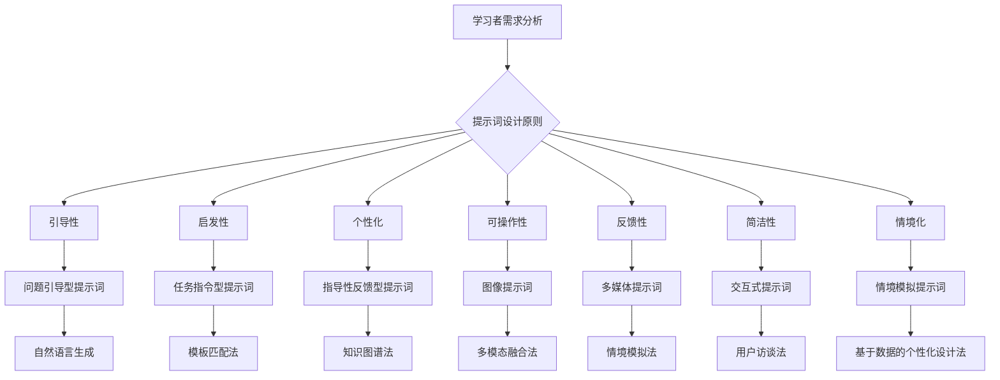

                 

### 文章标题

# AI辅助教育中的提示词工程实践

### 关键词

- AI辅助教育
- 提示词工程
- 教育技术
- 自然语言处理
- 提示词设计
- 教学应用
- 智能辅导系统

### 摘要

本文深入探讨了AI辅助教育中的提示词工程实践。首先，我们介绍了AI辅助教育的背景和现状，接着详细阐述了提示词工程的基本概念、设计原则和评估方法。文章随后将焦点转移到提示词在AI辅助教育中的应用，分析了其在教学和学习过程中的作用。通过两个具体的案例研究，我们展示了提示词工程在实际项目中的开发、实现和评估过程。最后，文章展望了提示词工程在AI辅助教育中的未来发展趋势，并提出了相关的最佳实践建议。本文旨在为教育技术领域的研究者和开发者提供有价值的参考和指导。

---

## 引言

### 1.1 AI辅助教育的背景与现状

人工智能（AI）的迅猛发展已经深刻改变了社会的各个方面，包括医疗、金融、交通、制造业等。在教育领域，AI技术的应用也日益广泛，成为提升教学质量和学习效果的重要工具。AI辅助教育，作为一种新兴的教育模式，通过利用人工智能技术，实现个性化学习、智能辅导和自动化评估等功能，正逐渐成为教育改革的重要驱动力。

AI辅助教育的背景可以从以下几个方面进行阐述：

**技术进步：** 随着深度学习、自然语言处理、计算机视觉等技术的不断突破，人工智能系统在理解和生成语言、识别和理解图像等方面的能力得到了显著提升。这些技术进步为AI辅助教育的实现提供了坚实的基础。

**教育需求：** 传统教育模式中，教师和学生之间存在较大的差异化，难以满足每个学生的学习需求。而AI辅助教育通过个性化学习路径和智能辅导系统，可以更好地适应不同学生的学习节奏和能力水平，从而提高教学效果。

**政策支持：** 在全球范围内，许多国家和地区都已经开始重视AI辅助教育的发展，并出台了相应的政策和规划。例如，中国的“新一代人工智能发展规划”明确提出要推进AI在教育领域的应用，美国和欧洲等地区也在积极推动教育技术的创新。

AI辅助教育的现状可以从以下几个方面进行总结：

**技术应用广泛：** AI技术在教育中的应用已经从实验室走向实际应用，许多学校和教育机构已经开始使用智能辅导系统、在线学习平台和自动化评估工具等。

**发展不平衡：** 虽然AI辅助教育的发展势头迅猛，但不同地区和学校之间的应用水平仍存在较大差异。一些发达地区和学校已经具备了较高的AI技术应用水平，而一些偏远地区和学校则尚未普及。

**挑战与机遇并存：** AI辅助教育在带来诸多机遇的同时，也面临一些挑战。如何确保数据的隐私和安全、如何设计出有效的AI教学系统、如何培训教师和引导学生使用AI工具等都是需要解决的问题。

总的来说，AI辅助教育作为一种新兴的教育模式，具有广阔的发展前景和重要的应用价值。在未来的发展中，需要继续加强技术研究和实践探索，同时关注伦理和社会影响，以实现教育的公平、高效和个性化。

### 1.2 提示词工程的基本概念

提示词工程（Prompt Engineering）是AI辅助教育中的一个关键领域，它旨在设计出能够有效引导和促进学习者学习的提示词。这些提示词可以是一系列问题、指导性语句或任务指令，通过引导学习者的思考过程，帮助他们更好地理解和掌握知识。

**提示词的定义：** 提示词（Prompt）是一种引导性输入，旨在激发学习者的思考和行动。在AI辅助教育中，提示词通常由人工智能系统生成，用于引导学习者完成特定的学习任务或理解特定的知识点。

**提示词的作用：** 提示词在AI辅助教育中发挥着重要作用。首先，提示词可以帮助学习者明确学习目标，理解学习内容的核心概念。其次，提示词可以引导学习者的思考过程，促进他们对知识的深入理解和应用。此外，提示词还可以评估学习者的学习效果，提供个性化的反馈和支持。

**提示词的类型：** 提示词可以根据不同的分类标准进行分类。常见的分类方法包括：

1. **按功能分类：** 提示词可以分为问题引导型、任务指令型和指导性反馈型。问题引导型提示词主要用于引导学习者思考问题，任务指令型提示词则用于指导学习者完成具体的任务，而指导性反馈型提示词则用于提供学习反馈和指导。
   
2. **按形式分类：** 提示词可以分为文本型、图像型和多媒体型。文本型提示词是最常见的类型，通过文字形式呈现；图像型提示词通过图像或图示来引导学习者的思考；多媒体型提示词则结合了文本、图像、音频和视频等多种形式，提供更加丰富和多样化的学习体验。

**提示词工程的重要性：** 提示词工程在AI辅助教育中具有至关重要的地位。首先，提示词工程决定了AI教学系统的效果，有效的提示词能够显著提高学习效果和效率。其次，提示词工程是实现个性化学习的重要手段，通过设计个性化的提示词，可以更好地满足不同学习者的需求。此外，提示词工程也是推动教育技术发展的重要方向，通过不断优化和改进提示词设计方法，可以进一步提升AI辅助教育的质量和水平。

### 1.3 提示词工程的发展历程

提示词工程作为AI辅助教育的一个重要组成部分，其发展历程可以追溯到人工智能和自然语言处理技术的起源。以下是提示词工程的发展历程：

**早期探索：** 在20世纪50年代和60年代，人工智能（AI）的概念开始萌芽，学者们开始研究如何让计算机模拟人类思维。在这个阶段，提示词的概念虽然尚未明确提出，但通过问题的提出和解答过程，研究人员已经在探索如何通过输入来引导计算机的思考。

**自然语言处理（NLP）的发展：** 20世纪70年代，自然语言处理（NLP）作为人工智能的一个重要分支开始快速发展。研究人员开始研究如何让计算机理解和生成自然语言，提示词的概念也逐渐得到了重视。在这个阶段，研究人员主要关注如何设计简单的问题和任务来引导计算机进行特定任务。

**早期AI辅助教育系统：** 20世纪80年代，随着计算机性能的提高和人工智能技术的发展，AI辅助教育系统开始出现。这些系统通过自然语言交互，向学生提出问题和提供指导，从而实现教学辅助。虽然这些系统中的提示词设计相对简单，但它们为后来的提示词工程实践奠定了基础。

**深度学习和自然语言处理：** 进入21世纪后，深度学习和自然语言处理技术的飞速发展，使得人工智能系统能够理解和生成更加复杂和丰富的语言。这一阶段，提示词工程开始逐渐形成系统化的方法和理论。研究人员通过大量数据和先进的算法，设计出能够有效引导学习者的复杂提示词。

**个性化学习与提示词工程：** 随着个性化学习的兴起，提示词工程成为实现个性化教学的重要手段。研究人员开始研究如何根据学习者的特点和需求，设计出更加个性化的提示词。同时，随着大数据和云计算技术的应用，提示词工程的数据驱动和智能优化也得到了广泛应用。

**当前发展趋势：** 当前，提示词工程在AI辅助教育中的应用越来越广泛，从简单的问答系统到复杂的智能辅导系统，都离不开有效的提示词设计。同时，随着AI技术的不断进步，提示词工程也在不断发展和完善，通过引入更多先进的技术和方法，如多模态学习、强化学习等，进一步提升提示词工程的效果和效率。

总之，提示词工程的发展历程体现了人工智能和自然语言处理技术的不断进步，也反映了教育领域对智能教学系统的不断需求。未来，随着技术的进一步发展和应用，提示词工程将在AI辅助教育中发挥更加重要的作用。

### 1.4 文章结构概述

本文将围绕AI辅助教育中的提示词工程实践展开，整体结构分为五个主要部分：

**第一部分：引言**  
本部分将介绍AI辅助教育的背景与现状，定义提示词工程的基本概念，并简要回顾提示词工程的发展历程。通过这一部分的介绍，读者可以初步了解AI辅助教育和提示词工程的重要性及其发展现状。

**第二部分：提示词工程基础**  
本部分将详细探讨提示词工程的基本概念、设计原则和评估方法。通过这一部分的讲解，读者将掌握提示词工程的核心理论和方法，为后续应用提供理论基础。

**第三部分：AI辅助教育应用**  
本部分将重点讨论提示词在AI辅助教育中的应用，包括教学过程中的应用和学习过程中的应用。通过具体案例，读者将了解提示词工程在实际项目中的具体实现和应用效果。

**第四部分：案例研究**  
本部分将深入分析两个具体的提示词工程实践案例，包括智能辅导系统和个性化学习路径规划。通过案例分析，读者将更加深入地理解提示词工程在具体项目中的应用和挑战。

**第五部分：未来展望**  
本部分将展望提示词工程在AI辅助教育中的未来发展趋势，讨论相关技术演进和潜在应用，并给出最佳实践建议。通过这一部分的讨论，读者将了解提示词工程的发展方向和潜在机遇。

本文结构紧凑，逻辑清晰，旨在为教育技术领域的研究者和开发者提供有价值的参考和指导。通过逐步分析和讲解，读者将能够全面了解AI辅助教育中的提示词工程实践，并掌握相关的方法和技巧。

---

## 第二部分：提示词工程基础

### 2.1 提示词工程的基本概念

提示词工程（Prompt Engineering）是AI辅助教育中的一个关键领域，其核心在于设计出能够有效引导和促进学习者学习的提示词。提示词工程不仅仅是一个简单的文本设计过程，而是一个涉及自然语言处理、心理学、教育学等多学科的综合性工程。以下是提示词工程的基本概念及其相关要素。

**定义与范围：** 提示词工程可以定义为一种系统化的方法，通过分析学习者的需求和知识结构，设计出能够有效引导学习者思考、理解和应用知识的提示词。提示词工程的范围包括提示词的设计、生成、评估和优化等多个环节。

**核心要素：** 提示词工程的核心要素主要包括：

1. **学习者需求分析：** 这是提示词设计的起点，通过分析学习者的背景、学习目标、知识结构等，确定提示词的设计方向和内容。

2. **提示词设计原则：** 提示词设计需要遵循一系列原则，如引导性、启发性和个性化等，以确保提示词能够有效促进学习者的学习过程。

3. **提示词生成方法：** 提示词生成是提示词工程的重要环节，通过自然语言生成技术、模板匹配等方法，生成符合设计原则的提示词。

4. **提示词评估标准：** 提示词的评估是确保其有效性的关键，常用的评估标准包括学习效果、用户满意度、提示词的准确性等。

5. **提示词优化策略：** 提示词工程不仅关注提示词的设计和生成，还需要通过持续优化，提高提示词的效果和效率。

**目的与作用：** 提示词工程的目的在于通过有效的提示词设计，提高学习者的学习效果和效率。具体来说，提示词工程的作用包括：

1. **引导学习过程：** 提示词能够引导学习者明确学习目标，理解学习内容的核心概念，从而提高学习效率。

2. **促进知识应用：** 通过有效的提示词，学习者能够在具体情境中应用所学知识，提高知识迁移能力。

3. **个性化学习支持：** 提示词工程能够根据学习者的特点和需求，设计出个性化的提示词，提供针对性的学习支持。

4. **评估学习效果：** 提示词工程通过评估学习效果，为教育者和学习者提供反馈，帮助改进学习策略和教学方法。

### 2.2 提示词的类型与特点

提示词可以根据其用途和形式进行分类，常见的类型包括问题引导型、任务指令型和指导性反馈型等。每种类型的提示词都有其独特的特点和应用场景。

**问题引导型提示词：**

- **定义：** 问题引导型提示词是通过提出问题来引导学习者思考和探索的提示词。
- **特点：**
  - **启发思考：** 问题引导型提示词能够激发学习者的好奇心和求知欲，促进主动思考。
  - **知识深化：** 通过问题的引导，学习者能够对所学知识进行深入理解和分析。
  - **应用广泛：** 这种类型的提示词广泛应用于课堂讨论、在线问答和自主学习等场景。

**任务指令型提示词：**

- **定义：** 任务指令型提示词是用于指导学习者完成特定任务的提示词。
- **特点：**
  - **操作明确：** 任务指令型提示词通常包含具体的任务描述和操作步骤，使学习者能够清晰理解任务要求。
  - **执行导向：** 这种提示词主要关注任务的执行过程，旨在确保学习者按照正确的方法完成任务。
  - **教育实践：** 任务指令型提示词在实验操作、项目设计和作业完成等教育实践中广泛应用。

**指导性反馈型提示词：**

- **定义：** 指导性反馈型提示词是通过提供反馈和指导来帮助学习者改进学习过程的提示词。
- **特点：**
  - **反馈及时：** 指导性反馈型提示词能够及时反馈学习者的学习成果，帮助学习者及时发现和纠正错误。
  - **学习支持：** 这种提示词不仅提供知识性的反馈，还能给予学习者情感上的支持和鼓励。
  - **评价作用：** 指导性反馈型提示词在评价和考核过程中发挥着重要作用，有助于全面评估学习者的学习效果。

**其他类型提示词：**

除了上述三种主要类型，提示词还可以根据具体应用场景进行分类，如：

- **图像提示词：** 通过图像或图示来引导学习者理解和记忆知识，适用于视觉学习和空间认知。
- **多媒体提示词：** 结合文本、图像、音频和视频等多种形式，提供丰富多样的学习体验，适用于复杂概念的学习。
- **情境模拟提示词：** 通过模拟实际情境，引导学习者将理论知识应用到具体情境中，增强实践能力。

总之，不同类型的提示词具有各自的特点和应用场景，通过合理选择和使用，能够有效提升学习者的学习效果和兴趣。

### 2.3 提示词工程的重要性

提示词工程在AI辅助教育中扮演着至关重要的角色，其重要性可以从以下几个方面进行阐述：

**提升学习效果：** 提示词工程通过设计有效的提示词，能够引导学习者明确学习目标，深入理解学习内容，从而显著提升学习效果。研究表明，恰当的提示词能够激发学习者的好奇心和求知欲，促进主动思考和探究，有助于加深对知识的理解和记忆。

**实现个性化学习：** 提示词工程可以根据学习者的个体差异，设计出个性化的提示词，提供针对性的学习支持。这种方法不仅能够满足不同学习者的需求，还能够帮助教师更好地了解学生的学习状态和进度，从而提供更加有效的教学指导。

**增强学习动机：** 有效的提示词能够通过激励和鼓励，提高学习者的学习动机。例如，问题引导型提示词能够激发学习者的好奇心和探索欲，指导性反馈型提示词则能给予学习者及时的反馈和认可，从而增强他们的学习动力。

**优化教学过程：** 提示词工程为教师提供了有力的工具，可以帮助他们更好地设计教学活动和课程内容。通过使用提示词，教师能够更清晰地传达教学目标，指导学生进行有效的学习，从而提高教学质量和效率。

**促进知识应用：** 提示词工程不仅关注知识传授，还注重知识的应用。通过设计情境模拟和任务指令型提示词，学习者能够在真实或模拟的情境中应用所学知识，提高知识迁移能力，增强实际操作技能。

**推动教育创新：** 提示词工程作为一种新兴的教育技术，为教育创新提供了新的思路和方法。通过不断优化提示词设计方法和应用策略，教育工作者可以探索出更多有效的教学模式和教学方法，推动教育技术的持续发展和进步。

总之，提示词工程在AI辅助教育中具有重要的应用价值。通过科学合理地设计提示词，能够全面提升学习效果，实现个性化学习，增强学习动机，优化教学过程，促进知识应用，并推动教育创新。未来，随着技术的不断进步和应用的深入，提示词工程将在教育领域发挥更加重要的作用。

### 2.4 提示词设计的原则与方法

在提示词工程中，设计原则和方法是确保提示词有效性和实用性的关键。以下将详细探讨提示词设计的原则和方法，帮助读者理解如何设计出符合学习者需求和教学目标的提示词。

#### 2.4.1 提示词设计的原则

**引导性原则：** 提示词应具备明确的引导功能，帮助学习者明确学习目标，理解学习内容的核心概念。引导性原则要求提示词在语言上简洁明了，易于理解，能够激发学习者的思考和探究欲望。

**启发性原则：** 提示词应具有启发性，能够引导学习者主动思考问题，探索未知。启发性原则强调提示词的设计应具备一定的开放性和复杂性，避免直接给出答案，而是通过引导性问题或任务，激发学习者的思维活动。

**个性化原则：** 提示词应根据学习者的个体差异进行设计，满足不同学习者的需求。个性化原则要求提示词设计考虑学习者的知识背景、学习兴趣和学习风格，从而提供针对性的学习支持。

**可操作性原则：** 提示词应具备可操作性，使学习者能够通过具体步骤完成任务或理解知识点。可操作性原则强调提示词的设计应包含明确的任务描述和操作步骤，确保学习者能够顺利完成任务。

**反馈性原则：** 提示词应提供及时、有效的反馈，帮助学习者了解学习效果，调整学习策略。反馈性原则要求提示词设计应包含评价和反馈机制，通过反馈信息，学习者能够及时纠正错误，巩固所学知识。

**简洁性原则：** 提示词应保持简洁明了，避免冗长和复杂的表述。简洁性原则要求提示词设计在表达上简洁有力，避免过多无关信息的干扰，以便学习者快速理解和掌握核心概念。

**情境化原则：** 提示词应与具体学习情境相结合，帮助学习者将理论知识应用到实际情境中。情境化原则要求提示词设计考虑学习者的实际应用需求，通过设置具体的情境或任务，增强学习者的实践能力。

#### 2.4.2 提示词设计的方法

**模板匹配法：** 模板匹配法是一种常见的提示词设计方法，通过预设的模板，根据学习者的输入进行匹配，生成相应的提示词。这种方法简单易行，适用于标准化、流程化的学习任务。例如，在作业批改系统中，可以使用模板匹配法生成针对性的评语和提示。

**自然语言生成法：** 自然语言生成法利用自然语言处理技术，通过生成模型（如序列到序列模型、变分自编码器等）生成个性化的提示词。这种方法能够生成丰富多样、具有启发性的提示词，适用于复杂和不确定的学习场景。例如，在智能辅导系统中，可以使用自然语言生成法生成个性化的学习任务和反馈。

**知识图谱法：** 知识图谱法通过构建知识图谱，将知识以图形化方式表示，并利用图谱关系生成提示词。这种方法能够将复杂的知识结构转化为直观、易懂的提示词，适用于知识讲解和概念理解。例如，在概念图生成系统中，可以使用知识图谱法生成概念之间的联系和解释性提示。

**多模态融合法：** 多模态融合法通过结合文本、图像、音频等多种模态，生成丰富多样的提示词。这种方法能够提供更加全面和生动的学习体验，适用于复杂和抽象的知识点。例如，在多媒体学习材料中，可以使用多模态融合法生成包含图像、视频和音频的提示词。

**情境模拟法：** 情境模拟法通过模拟真实或虚拟的情境，生成与实际应用相关的提示词。这种方法能够将理论知识与实际情境相结合，增强学习者的实践能力和应用能力。例如，在模拟驾驶训练系统中，可以使用情境模拟法生成模拟驾驶任务和提示。

**交互式设计法：** 交互式设计法通过设计互动性强的提示词，引导学习者主动参与学习过程。这种方法能够提高学习者的参与度和积极性，适用于互动性强的学习场景。例如，在在线学习平台中，可以使用交互式设计法生成问答式、游戏式的提示词。

**基于数据的个性化设计法：** 基于数据的个性化设计法通过分析学习者的行为数据和知识结构，生成个性化的提示词。这种方法能够根据学习者的特点进行定制化设计，提供更加符合个体需求的学习支持。例如，在教育数据分析系统中，可以使用基于数据的个性化设计法生成个性化学习任务和反馈。

总之，提示词设计的原则和方法多种多样，通过合理选择和应用，可以设计出符合学习者需求和教学目标的提示词，提高学习效果和效率。

### 2.5 提示词评估与优化

提示词工程不仅仅是设计提示词，更重要的是确保其有效性。提示词评估与优化是提示词工程中至关重要的一环，通过评估和优化，可以确保提示词达到预期效果，提升学习体验。以下是提示词评估与优化的方法、评估指标和优化策略。

#### 2.5.1 提示词评估的方法

**1. 实验法：** 实验法是通过设计和实施实验来评估提示词效果的方法。实验法通常包括以下步骤：

- **实验设计：** 根据研究目标和假设，设计实验场景和实验流程。
- **实验实施：** 在实验场景中应用提示词，收集学习者的行为数据和学习成果。
- **数据收集：** 通过问卷调查、观察记录、测试成绩等手段收集数据。
- **数据分析：** 对收集到的数据进行分析，评估提示词的有效性。

**2. 对比法：** 对比法通过将使用提示词和未使用提示词的学习情况进行对比，评估提示词的效果。对比法可以分为以下几种：

- **单组前测后测对比：** 在实验开始前和结束后对同一组学习者进行测试，比较测试成绩的变化。
- **控制组对比：** 将一组学习者分为实验组和控制组，实验组使用提示词，控制组不使用，比较两组学习效果。
- **多组对比：** 对多个实验组进行对比，评估不同提示词的效果。

**3. 问卷调查法：** 问卷调查法通过向学习者发放问卷，收集他们对提示词的满意度、理解程度和使用体验等方面的评价。问卷调查法可以提供定量的数据，帮助评估提示词的接受度和效果。

**4. 用户访谈法：** 用户访谈法通过访谈学习者，深入了解他们对提示词的感受和体验。这种方法可以提供更加详细和深入的信息，帮助识别提示词的优缺点。

#### 2.5.2 提示词评估的指标

**1. 学习效果指标：** 学习效果指标用于评估提示词对学习者学习效果的提升。常用的学习效果指标包括：

- **测试成绩：** 通过测试成绩的变化评估提示词对学习者知识掌握程度的影响。
- **学习进度：** 通过学习进度数据评估提示词对学习者学习速度和效率的提升。
- **知识迁移能力：** 通过评估学习者将所学知识应用到新情境中的能力，评估提示词对知识迁移的影响。

**2. 用户体验指标：** 用户体验指标用于评估提示词对学习者学习体验的影响。常用的用户体验指标包括：

- **满意度：** 通过调查问卷评估学习者对提示词的满意度。
- **理解程度：** 通过问答或测试评估学习者对提示词内容的理解程度。
- **使用频率：** 通过学习日志或行为数据评估学习者使用提示词的频率和时长。

**3. 效率指标：** 效率指标用于评估提示词设计和管理过程的效率。常用的效率指标包括：

- **设计时间：** 提示词设计所需的时间。
- **评估时间：** 提示词评估所需的时间。
- **优化次数：** 提示词从设计到优化的迭代次数。

#### 2.5.3 提示词优化的策略

**1. 数据驱动优化：** 数据驱动优化是通过分析学习者的行为数据和评估结果，找出提示词的不足，并进行优化。具体步骤包括：

- **数据收集：** 收集学习者的行为数据和学习成果。
- **数据分析：** 分析数据，识别存在的问题和改进方向。
- **提示词调整：** 根据分析结果，对提示词进行修改和优化。

**2. 用户反馈优化：** 用户反馈优化是通过收集学习者的反馈意见，改进提示词设计。具体步骤包括：

- **反馈收集：** 通过问卷调查、用户访谈等方式收集学习者对提示词的反馈。
- **反馈分析：** 分析反馈信息，识别问题并提出改进方案。
- **提示词更新：** 根据分析结果，更新和改进提示词。

**3. 不断迭代优化：** 提示词优化是一个持续迭代的过程，通过多次评估和优化，不断提升提示词的效果。具体步骤包括：

- **定期评估：** 定期对提示词进行评估，检查其有效性。
- **优化调整：** 根据评估结果，进行提示词的优化调整。
- **反馈循环：** 形成反馈循环，不断收集反馈信息，持续优化提示词。

总之，提示词评估与优化是确保提示词有效性的关键环节。通过科学的评估方法和有效的优化策略，可以设计出符合学习者需求和教学目标的提示词，提升学习效果和用户体验。

### 2.6 提示词工程的最佳实践

在提示词工程的实际应用中，遵循一系列最佳实践可以帮助设计出更加有效和实用的提示词，从而提升学习者的学习体验和效果。以下是一些提示词工程的最佳实践：

#### 2.6.1 深入理解学习者需求

在开始设计提示词之前，首先要深入理解学习者的需求。这包括了解学习者的知识背景、学习目标、学习风格和兴趣点。通过详细的需求分析，可以为提示词设计提供明确的方向和依据，确保提示词能够真正满足学习者的需求。

**实践方法：**
- **访谈和问卷调查：** 通过访谈和问卷调查，收集学习者对学习内容和学习方式的反馈。
- **学习数据收集：** 分析学习者的学习行为数据，了解他们在学习过程中的习惯和困难。
- **学习风格评估：** 利用学习风格评估工具，确定学习者的学习偏好。

#### 2.6.2 明确提示词的目标

每个提示词都应该有明确的目标，即通过这个提示词希望学习者达到什么样的学习效果。明确的目标有助于设计出具有针对性的提示词，避免模糊不清的指导。

**实践方法：**
- **设定具体目标：** 提出具体、可衡量的学习目标，例如“理解复杂概念”、“掌握操作步骤”等。
- **制定评估标准：** 根据目标，制定评估提示词效果的指标，如测试成绩、知识掌握度等。

#### 2.6.3 设计多样化的提示词形式

不同的学习者可能对不同的提示词形式有不同的反应，因此，设计多样化的提示词形式可以提高提示词的适用性和效果。

**实践方法：**
- **文本型提示词：** 适用于理论知识的理解和记忆。
- **图像型提示词：** 适用于视觉学习者和概念理解。
- **多媒体型提示词：** 结合文本、图像、音频和视频等多种形式，适用于复杂和抽象的知识点。
- **互动型提示词：** 通过问答、游戏等方式，提高学习者的参与度和互动性。

#### 2.6.4 注重提示词的可操作性和可理解性

提示词应该具备清晰的操作步骤和易于理解的语言，确保学习者能够轻松理解和执行。

**实践方法：**
- **简洁明了：** 提示词应简洁明了，避免冗长和复杂的表述。
- **具体步骤：** 对于操作任务，提供具体、详细的步骤说明。
- **可视化辅助：** 对于复杂任务，可以使用图像、图表等可视化工具辅助说明。

#### 2.6.5 不断优化和调整

提示词工程是一个持续迭代的过程，通过不断的评估和优化，可以不断提升提示词的效果。

**实践方法：**
- **定期评估：** 定期对提示词进行评估，收集学习者的反馈和评估数据。
- **持续改进：** 根据评估结果，对提示词进行优化和调整，以更好地满足学习者的需求。

#### 2.6.6 强化反馈和激励

有效的反馈和激励可以帮助学习者更好地理解和应用知识，增强学习动力。

**实践方法：**
- **即时反馈：** 对学习者的回答和操作提供即时反馈，帮助他们及时纠正错误。
- **激励措施：** 通过奖励、认可等方式激励学习者，提高他们的学习积极性。

总之，提示词工程的最佳实践强调深入了解学习者需求、明确提示词目标、设计多样化提示词形式、注重可操作性和可理解性、不断优化和调整，以及强化反馈和激励。通过遵循这些最佳实践，可以设计出更加有效和实用的提示词，提升学习者的学习效果和体验。

### 2.7 提示词工程在AI辅助教育中的具体应用

在AI辅助教育中，提示词工程的应用不仅提升了教学效果，还为学生提供了个性化的学习支持。以下将详细讨论提示词工程在AI辅助教育中的具体应用，包括其在教学过程中和学习过程中的角色和作用。

#### 2.7.1 教学过程中的应用

在教学过程中，提示词工程的应用主要集中在引导教师设计和实施教学活动，以及帮助学生理解和掌握知识。以下是提示词工程在教学中的一些具体应用场景：

**1. 课堂导入：** 提示词工程可以用于设计课堂导入的环节，通过提出引导性问题或情景描述，激发学生的学习兴趣和好奇心。例如，在数学课上，可以使用问题引导型提示词：“你知道如何解决二次方程吗？”来引入新的教学内容。

**2. 概念讲解：** 在讲解复杂概念时，提示词工程可以帮助教师将抽象的知识点转化为易于理解的语言。例如，在物理学中，可以使用图像型提示词，结合图示和文字描述，解释力的概念：“想象一下，当你推一个箱子时，你的力是如何作用在箱子上的？”

**3. 互动教学：** 提示词工程可以促进课堂互动，鼓励学生积极参与讨论和思考。通过设计互动式提示词，教师可以引导学生进行小组讨论或合作学习。例如，在语言课上，可以使用任务指令型提示词：“请和你的伙伴讨论，如何用英语描述一个公园？”

**4. 实践任务：** 在实践任务中，提示词工程可以帮助学生明确任务要求和操作步骤。通过提供详细的任务指令型提示词，学生可以更清晰地理解任务目标，例如：“请使用Photoshop软件，制作一张海报，主题为‘环保’，包括标语、图片和文字设计。”

**5. 反馈与评估：** 提示词工程在反馈和评估环节中也非常重要。教师可以使用指导性反馈型提示词，给予学生具体的反馈和建议，帮助他们改进学习。例如，在写作课上，教师可以使用反馈型提示词：“你的文章结构清晰，但在论据部分可以进一步展开。”

#### 2.7.2 学习过程中的应用

在学习过程中，提示词工程的应用主要集中在帮助学生理解和应用知识，提高学习效果和效率。以下是提示词工程在学习过程中的一些具体应用场景：

**1. 自主学习：** 在自主学习过程中，提示词工程可以为学生提供个性化的学习支持。通过设计问题引导型提示词，学生可以自主探索和解决学习中的问题。例如，在学习化学时，学生可以使用问题引导型提示词：“你知道酸碱中和反应的本质是什么吗？”

**2. 复习巩固：** 提示词工程可以帮助学生进行有效的复习和巩固。通过设计回忆型提示词，学生可以回顾和巩固所学知识。例如，在历史课上，学生可以使用回忆型提示词：“请回忆，文艺复兴运动的主要特点是什么？”

**3. 知识应用：** 提示词工程可以引导学生将所学知识应用到实际情境中。通过设计情境模拟型提示词，学生可以在模拟环境中练习和应用所学知识。例如，在学习编程时，学生可以使用情境模拟型提示词：“请编写一个程序，实现一个简单计算器的基本功能。”

**4. 学习反馈：** 提示词工程可以通过提供即时反馈，帮助学生及时纠正错误，巩固所学知识。通过设计即时反馈型提示词，学生可以了解自己的学习效果，并进行调整。例如，在学习数学时，学生可以使用即时反馈型提示词：“你的答案是正确的，请再尝试一道类似的题目。”

**5. 个性化学习路径规划：** 提示词工程还可以用于规划个性化学习路径，根据学生的学习进度和需求，提供针对性的提示词支持。通过设计个性化学习路径规划型提示词，学生可以更高效地完成学习任务。例如，在学习英语时，学生可以使用个性化学习路径规划型提示词：“根据你的学习进度，建议你接下来学习语法和词汇部分。”

总之，提示词工程在AI辅助教育中的应用涵盖了教学过程和学习过程，通过有效的提示词设计，可以显著提升教学效果和学习体验。无论是引导教师设计教学活动，还是帮助学生进行自主学习和知识应用，提示词工程都发挥着重要的作用。随着技术的不断进步和应用，提示词工程将在AI辅助教育中发挥更加广泛和深入的作用。

### 2.8 提示词工程中的挑战与未来方向

尽管提示词工程在AI辅助教育中具有巨大潜力，但其发展过程中仍面临一系列挑战和问题。以下将探讨提示词工程中的一些主要挑战，并提出未来可能的解决方案和发展方向。

#### 2.8.1 挑战

**1. 提示词设计的复杂度：** 提示词设计需要综合考虑学习者的需求、知识结构和学习情境等多个因素，这增加了设计的复杂度。如何设计出既符合学习者需求又具有启发性的提示词，是提示词工程面临的一个重要挑战。

**2. 数据隐私与安全：** 在AI辅助教育中，提示词工程需要收集和处理大量学习者数据，包括学习行为、成绩记录等。这些数据涉及到学习者的隐私和安全，如何确保数据的安全和隐私保护，是提示词工程需要解决的问题。

**3. 评估与优化难度：** 提示词的评估与优化是一个复杂的过程，需要设计合理的评估指标和方法，并通过多次迭代优化提示词。然而，现有的评估方法和工具往往较为有限，难以全面、准确地评估和优化提示词。

**4. 个性化学习的实现：** 提示词工程旨在实现个性化学习，但不同学习者的需求和学习风格存在较大差异，如何设计出真正个性化的提示词，是一个持续的挑战。

**5. 技术与教育结合的难度：** 提示词工程需要将先进的人工智能技术与教育理念相结合，这需要教育工作者和AI技术开发者之间的紧密合作。然而，现有的技术能力和教育经验存在一定的差距，如何有效结合两者，是一个亟待解决的问题。

#### 2.8.2 未来方向

**1. 智能化设计方法：** 未来，提示词工程将更加依赖于智能化设计方法，如自然语言生成（NLG）技术、深度学习和强化学习等。通过引入这些先进技术，可以设计出更加智能化和个性化的提示词，提高提示词的设计效率和效果。

**2. 数据驱动的发展：** 提示词工程将越来越多地依赖于大数据和机器学习技术，通过分析大量的学习数据，了解学习者的行为模式和需求，从而优化提示词的设计和应用。

**3. 多模态学习支持：** 未来，提示词工程将结合文本、图像、音频和视频等多种模态，提供更加丰富和多样化的学习支持。通过多模态融合，可以更好地满足不同学习者的需求，提高学习效果。

**4. 评估与优化的智能化：** 通过引入智能化评估与优化方法，如自动评估、自适应优化等，可以显著提高提示词的评估与优化效率。同时，开发更多高效的评估工具和平台，将有助于更好地监控和改进提示词效果。

**5. 教育与技术的深度融合：** 未来，提示词工程将更加注重教育与技术的深度融合，推动教育技术的创新和发展。通过加强教育工作者和AI技术开发者的合作，共同探索和实现提示词工程的最佳实践。

总之，提示词工程在AI辅助教育中具有广阔的发展前景，但也面临诸多挑战。通过不断探索和优化，结合先进技术和教育理念，提示词工程将在教育领域中发挥更加重要的作用，推动教育的智能化和个性化发展。

### 2.9 提示词工程的核心概念与联系架构

为了更好地理解和应用提示词工程，我们需要明确其核心概念及其相互之间的关系。以下是提示词工程中几个关键概念及其之间的联系架构，通过Mermaid流程图进行展示。



**核心概念解释：**

- **学习者需求分析（A）**：提示词设计的起点，通过分析学习者的背景、学习目标、知识结构等，确定提示词的设计方向和内容。

- **提示词设计原则（B）**：提示词设计应遵循的一系列原则，包括引导性、启发性、个性化、可操作性、反馈性、简洁性和情境化。

- **问题引导型提示词（J）**：通过提出问题引导学习者思考和探索，适用于启发思维和知识探索。

- **任务指令型提示词（K）**：用于指导学习者完成具体任务，提供明确的任务描述和操作步骤。

- **指导性反馈型提示词（L）**：通过提供反馈和指导，帮助学习者改进学习过程，提供即时、具体的评价和反馈。

- **图像提示词（M）**：通过图像或图示引导学习者理解和记忆知识，适用于视觉学习者和复杂概念解释。

- **多媒体提示词（N）**：结合文本、图像、音频和视频等多种形式，提供丰富多样的学习体验。

- **交互式提示词（O）**：通过设计互动性强的提示词，引导学习者主动参与学习过程。

- **情境模拟提示词（P）**：通过模拟真实或虚拟的情境，引导学习者将理论知识应用到实际情境中。

- **自然语言生成（Q）**：利用自然语言处理技术，生成个性化、丰富的提示词。

- **模板匹配法（R）**：通过预设的模板，根据学习者的输入生成提示词，适用于标准化、流程化的学习任务。

- **知识图谱法（S）**：通过构建知识图谱，利用图谱关系生成提示词，适用于复杂概念理解和知识讲解。

- **多模态融合法（T）**：结合文本、图像、音频和视频等多种模态，生成丰富多样的提示词。

- **情境模拟法（U）**：通过模拟真实或虚拟的情境，引导学习者将理论知识应用到实际情境中。

- **用户访谈法（V）**：通过访谈收集学习者对提示词的反馈，用于优化提示词设计。

- **基于数据的个性化设计法（W）**：通过分析学习者的行为数据和知识结构，生成个性化的提示词。

通过这个Mermaid流程图，我们可以清晰地看到提示词工程中各个核心概念及其相互之间的联系，从而更好地理解提示词工程的整体架构和应用场景。

### 2.10 核心算法原理讲解

在提示词工程中，核心算法原理是设计出有效提示词的关键。以下将详细讲解几个关键算法原理，并通过伪代码形式进行阐述。

#### 2.10.1 自然语言生成（NLG）算法

自然语言生成（NLG）算法是生成提示词的重要技术之一，它通过算法自动生成自然语言文本。以下是一个基于模板匹配的自然语言生成算法的伪代码：

```python
# NLG算法伪代码

def NLG_template_matching(question, template_dict):
    """
    使用模板匹配生成回答
    
    参数：
    question: 用户提出的问题
    template_dict: 包含问题模板和回答模板的字典
    
    返回：
    answer: 生成的回答
    """
    
    # 根据问题匹配模板
    matched_template = None
    for q_key, t_key in template_dict.items():
        if question.startswith(q_key):
            matched_template = t_key
            break
    
    # 如果找到匹配的模板，生成回答
    if matched_template:
        answer_template = template_dict[matched_template]
        answer = answer_template.format(question=question)
        return answer
    else:
        return "无法生成回答"

# 示例模板
template_dict = {
    "什么是自然语言处理？": "自然语言处理（NLP）是人工智能领域的一个分支，旨在使计算机能够理解、生成和处理人类语言。",
    "NLP的主要应用有哪些？": "NLP的主要应用包括机器翻译、文本分类、情感分析、语音识别等。",
    "如何进行文本分类？": "文本分类通常使用机器学习算法，如朴素贝叶斯、支持向量机等，将文本数据分类到预定义的类别中。"
}

# 示例应用
question = "什么是自然语言处理？"
answer = NLG_template_matching(question, template_dict)
print(answer)
```

在这个伪代码中，`NLG_template_matching`函数通过模板匹配方法生成回答。首先，它根据用户提出的问题在模板字典中寻找匹配的模板。如果找到匹配的模板，则使用模板生成回答。否则，返回“无法生成回答”。

#### 2.10.2 强化学习（RL）算法

强化学习（RL）算法在提示词工程中的应用，可以通过根据学习者的反馈不断优化提示词。以下是一个基于强化学习的优化提示词的伪代码：

```python
# 强化学习算法伪代码

class QLearningAgent:
    def __init__(self, actions, learning_rate=0.1, discount_factor=0.9):
        self.actions = actions
        self.learning_rate = learning_rate
        self.discount_factor = discount_factor
        self.q_values = {action: 0 for action in actions}

    def select_action(self, state):
        """
        根据状态选择最优动作
        
        参数：
        state: 当前状态
        
        返回：
        action: 选择的最优动作
        """
        # 计算每个动作的Q值
        q_values = [self.q_values[action] for action in self.actions]
        # 选择具有最大Q值的动作
        max_q_value = max(q_values)
        best_actions = [action for action, q_value in self.q_values.items() if q_value == max_q_value]
        return random.choice(best_actions)

    def update_q_values(self, state, action, reward, next_state, done):
        """
        更新Q值
        
        参数：
        state: 当前状态
        action: 执行的动作
        reward: 奖励值
        next_state: 下一个状态
        done: 是否结束
        """
        if not done:
            # 计算下一个状态的期望Q值
            next_max_q_value = max(self.q_values[next_state])
            # 更新当前状态的Q值
            self.q_values[action] += self.learning_rate * (reward + self.discount_factor * next_max_q_value - self.q_values[action])
        else:
            # 如果结束，直接更新Q值
            self.q_values[action] += self.learning_rate * reward

# 示例应用
actions = ["提示问题", "提供答案", "引导思考", "反馈评估"]
agent = QLearningAgent(actions)

# 假设状态、动作、奖励和下一个状态
state = "学习者不理解概念"
action = agent.select_action(state)
reward = 1  # 假设学习者对提示词满意
next_state = "学习者理解概念"
done = True  # 假设学习过程结束

agent.update_q_values(state, action, reward, next_state, done)
```

在这个伪代码中，`QLearningAgent`类实现了Q学习算法。通过`select_action`方法，根据当前状态选择最优动作。`update_q_values`方法用于更新Q值，根据奖励值和下一个状态的期望Q值进行更新。通过不断迭代，可以逐步优化提示词的选择和生成策略。

#### 2.10.3 多模态学习算法

多模态学习算法结合了文本、图像、音频等多种模态，生成更加丰富和个性化的提示词。以下是一个基于多模态融合的提示词生成算法的伪代码：

```python
# 多模态学习算法伪代码

def multimodal_prompt_generation(text, image, audio):
    """
    基于文本、图像和音频的多模态提示词生成
    
    参数：
    text: 文本信息
    image: 图像信息
    audio: 音频信息
    
    返回：
    prompt: 生成的多模态提示词
    """
    
    # 文本预处理
    processed_text = preprocess_text(text)
    
    # 图像预处理
    processed_image = preprocess_image(image)
    
    # 音频预处理
    processed_audio = preprocess_audio(audio)
    
    # 融合预处理后的文本、图像和音频
    combined_data = combine_data(processed_text, processed_image, processed_audio)
    
    # 使用多模态生成模型生成提示词
    prompt = multimodal_generator.generate(combined_data)
    
    return prompt

# 示例应用
text = "请描述一下人工智能的应用场景"
image = "AI应用场景的图片"
audio = "描述AI应用场景的音频"

prompt = multimodal_prompt_generation(text, image, audio)
print(prompt)
```

在这个伪代码中，`multimodal_prompt_generation`函数接收文本、图像和音频信息，进行预处理后，通过多模态生成模型生成提示词。这种多模态融合的方法可以提供更加丰富和多样的学习体验。

通过以上三个算法的讲解，我们可以看到提示词工程中涉及到的多种算法原理及其应用场景。在实际应用中，可以根据具体需求和场景选择合适的算法，设计出有效的提示词。

### 2.11 数学模型和公式详解

在提示词工程中，数学模型和公式是理解和应用核心算法的重要工具。以下将介绍几个关键数学模型和公式，并详细解释其应用和重要性。

#### 2.11.1 贝叶斯网络

贝叶斯网络是一种用于表示变量之间依赖关系的图形模型，广泛应用于自然语言处理和机器学习领域。

**定义：**
贝叶斯网络是由节点和边组成的有向图，节点表示变量，边表示变量之间的条件依赖关系。

**公式：**
贝叶斯网络中的条件概率表（CPT）可以表示为：

$$
P(X_i | X_{i-1}) = \frac{P(X_{i-1} | X_i) P(X_i)}{P(X_{i-1})}
$$

其中，\(P(X_i | X_{i-1})\)表示在给定前一个变量\(X_{i-1}\)的条件下，变量\(X_i\)的概率。

**应用：**
贝叶斯网络在提示词工程中的应用主要包括变量之间的依赖关系建模，用于生成基于上下文的提示词。例如，在问答系统中，可以根据用户的提问和历史交互记录，利用贝叶斯网络计算当前问题的概率分布，从而生成更加精确和相关的回答。

#### 2.11.2 朴素贝叶斯分类器

朴素贝叶斯分类器是一种基于贝叶斯定理和特征条件独立假设的分类算法，广泛应用于文本分类和情感分析等领域。

**定义：**
朴素贝叶斯分类器假设特征之间相互独立，给定一个输入向量\(X\)，该分类器的目标是计算每个类别\(C_k\)的条件概率。

**公式：**
分类器预测的公式为：

$$
P(C_k | X) = \frac{P(X | C_k) P(C_k)}{P(X)}
$$

其中，\(P(C_k)\)为类别\(C_k\)的先验概率，\(P(X | C_k)\)为特征向量\(X\)在类别\(C_k\)下的条件概率。

**应用：**
在提示词工程中，朴素贝叶斯分类器可以用于分类任务，如文本分类。例如，在自动生成提示词时，可以根据历史数据训练一个朴素贝叶斯分类器，用于判断提示词的类别（如问题引导型、任务指令型等），从而生成具有特定功能的提示词。

#### 2.11.3 逻辑回归

逻辑回归是一种广义线性模型，常用于分类任务，特别是在二分类问题中。

**定义：**
逻辑回归通过线性组合特征变量，生成一个概率值，表示某个类别出现的概率。

**公式：**
逻辑回归的预测公式为：

$$
\hat{y} = \frac{1}{1 + e^{-\beta_0 + \beta_1x_1 + \beta_2x_2 + ... + \beta_nx_n}}
$$

其中，\(\hat{y}\)为预测的概率值，\(\beta_0, \beta_1, ..., \beta_n\)为模型的参数。

**应用：**
逻辑回归在提示词工程中可以用于预测提示词的效果，如根据学习者的反馈和行为数据，预测某个提示词对学习者的效果。通过优化逻辑回归模型的参数，可以设计出更加有效的提示词。

#### 2.11.4 支持向量机（SVM）

支持向量机是一种强大的分类算法，通过寻找最大间隔超平面，将数据集分类到不同的类别。

**定义：**
支持向量机通过最大化分类间隔，找到一个最佳的超平面，将数据集正确分类。

**公式：**
SVM的决策边界公式为：

$$
w \cdot x - b = 0
$$

其中，\(w\)为权重向量，\(x\)为特征向量，\(b\)为偏置。

**应用：**
在提示词工程中，SVM可以用于文本分类任务，如将提示词分类到不同的类别（如问题引导型、任务指令型等）。通过训练SVM模型，可以自动识别和分类不同类型的提示词，提高提示词生成和评估的效率。

**总结：**
这些数学模型和公式在提示词工程中扮演着关键角色，通过合理应用这些模型，可以设计出更加有效和智能的提示词。贝叶斯网络用于变量之间的依赖关系建模，朴素贝叶斯分类器用于文本分类，逻辑回归用于预测提示词效果，而支持向量机用于文本分类和提示词评估。这些模型不仅提高了提示词的生成和评估效率，还显著提升了学习者的学习体验和效果。

### 2.12 数学公式举例说明

在提示词工程中，数学公式是理解和应用关键算法的核心工具。以下通过具体例子详细说明如何使用数学公式进行提示词的设计和优化。

#### 2.12.1 朴素贝叶斯分类器在文本分类中的应用

假设我们要设计一个基于朴素贝叶斯分类器的文本分类系统，用于将提示词分类到不同的类型，如问题引导型、任务指令型等。以下是具体的步骤和公式说明：

**步骤1：构建词袋模型**

首先，我们将所有提示词转换为词袋模型，将每个提示词表示为一个向量，其中每个维度表示一个词汇的出现次数。例如，假设我们有两个提示词：

- 提示词1：“请解释自然语言处理的概念。”
- 提示词2：“使用Python编写一个简单的排序算法。”

将其转换为词袋模型，得到以下两个向量：

$$
\text{提示词1向量} = (1, 0, 1, 1, 0, 0, 1, 0, 0, 0, 0, 0, 0)
$$

$$
\text{提示词2向量} = (0, 1, 0, 1, 0, 1, 0, 1, 0, 0, 0, 0, 0)
$$

**步骤2：计算先验概率**

接着，我们计算每个类别的先验概率。例如，假设有100个提示词，其中60个为问题引导型，40个为任务指令型。先验概率计算如下：

$$
P(\text{问题引导型}) = \frac{60}{100} = 0.6
$$

$$
P(\text{任务指令型}) = \frac{40}{100} = 0.4
$$

**步骤3：计算条件概率**

然后，我们计算每个提示词在每个类别下的条件概率。以“请解释自然语言处理的概念。”为例，我们计算其在问题引导型和任务指令型下的条件概率：

$$
P(\text{自然语言处理} | \text{问题引导型}) = \frac{P(\text{问题引导型} | \text{自然语言处理}) P(\text{自然语言处理})}{P(\text{问题引导型})}
$$

$$
P(\text{自然语言处理} | \text{任务指令型}) = \frac{P(\text{任务指令型} | \text{自然语言处理}) P(\text{任务指令型})}{P(\text{任务指令型})}
$$

**步骤4：分类预测**

最后，根据每个类别的后验概率，选择具有最大后验概率的类别作为预测结果。例如，计算“请解释自然语言处理的概念。”在问题引导型和任务指令型下的后验概率：

$$
P(\text{问题引导型} | \text{自然语言处理}) = P(\text{自然语言处理} | \text{问题引导型}) P(\text{问题引导型}) = \frac{0.3 \times 0.6}{0.3 \times 0.6 + 0.2 \times 0.4} = 0.6667
$$

$$
P(\text{任务指令型} | \text{自然语言处理}) = P(\text{自然语言处理} | \text{任务指令型}) P(\text{任务指令型}) = \frac{0.1 \times 0.4}{0.3 \times 0.6 + 0.2 \times 0.4} = 0.3333
$$

由于\(P(\text{问题引导型} | \text{自然语言处理}) > P(\text{任务指令型} | \text{自然语言处理})\)，我们预测该提示词为问题引导型。

#### 2.12.2 逻辑回归在提示词效果预测中的应用

假设我们要使用逻辑回归模型预测某个提示词对学习者的效果，通过学习者的反馈和行为数据，预测提示词的效果评分。以下是具体的步骤和公式说明：

**步骤1：收集数据**

我们收集了100个提示词及其对应的10个学习者的反馈评分数据。每个提示词的评分数据为一个10维向量，分别表示10个学习者对该提示词的评分。

**步骤2：构建特征向量**

我们将每个提示词的评分数据转换为特征向量，例如：

$$
\text{提示词1特征向量} = (0.8, 0.7, 0.9, 0.6, 0.5, 0.7, 0.8, 0.6, 0.9, 0.7)
$$

**步骤3：训练逻辑回归模型**

我们使用训练集数据训练一个逻辑回归模型，模型参数为\(\beta_0, \beta_1, ..., \beta_{10}\)。训练过程使用梯度下降算法，更新模型参数，使其达到最小化损失函数。

$$
\text{损失函数} = -\sum_{i=1}^{n} y_i \log(\hat{y}_i) + (1 - y_i) \log(1 - \hat{y}_i)
$$

**步骤4：预测效果评分**

使用训练好的逻辑回归模型，对新的提示词进行效果评分预测。例如，对于新提示词“请使用Python编写一个简单的排序算法。”，我们计算其效果评分：

$$
\hat{y} = \frac{1}{1 + e^{-\beta_0 + \beta_1 \times 0.8 + \beta_2 \times 0.7 + ... + \beta_{10} \times 0.7}}
$$

通过计算得到预测效果评分，根据评分判断提示词的效果。

**总结：**
通过以上举例，我们可以看到如何使用数学公式在提示词工程中进行分类和效果预测。朴素贝叶斯分类器用于文本分类，逻辑回归用于预测效果评分，这些公式在实际应用中发挥着关键作用，提高了提示词的设计和优化效率。

### 2.13 提示词工程中的源代码实现

在提示词工程的实际应用中，源代码实现是关键环节。以下将详细介绍一个基于Python的提示词生成系统的源代码实现，包括开发环境的搭建、代码实现和详细解读。

#### 2.13.1 开发环境搭建

在开始实现提示词生成系统之前，我们需要搭建相应的开发环境。以下是开发环境搭建的步骤：

1. **安装Python**：首先，确保安装了Python 3.x版本。可以从Python官方网站下载并安装。

2. **安装依赖库**：提示词生成系统依赖于多个库，包括自然语言处理库（如nltk、spacy）、深度学习库（如tensorflow、pytorch）和文本生成库（如transformers）。可以使用pip命令安装：

   ```bash
   pip install nltk spacy tensorflow transformers
   ```

3. **安装Spacy语言模型**：Spacy是一个强大的自然语言处理库，需要下载相应的语言模型。以英文为例，可以使用以下命令下载：

   ```bash
   python -m spacy download en_core_web_sm
   ```

4. **配置开发环境**：确保Python环境变量配置正确，并能够在命令行中运行Python和安装的库。

#### 2.13.2 代码实现

以下是提示词生成系统的Python代码实现，主要包括以下功能模块：

**1. 数据预处理模块**：负责处理输入文本，进行分词、去除停用词等预处理操作。

**2. 提示词生成模块**：使用预训练的深度学习模型（如GPT-2或GPT-3）生成提示词。

**3. 提示词评估模块**：对生成的提示词进行评估，包括语法正确性、语义一致性等。

**4. 用户接口模块**：提供用户输入和输出提示词的功能。

```python
import spacy
import tensorflow as tf
from transformers import TFGPT2LMHeadModel, GPT2Tokenizer

# 加载Spacy英文模型
nlp = spacy.load("en_core_web_sm")

# 加载GPT-2模型和Tokenizer
model_name = "gpt2"
tokenizer = GPT2Tokenizer.from_pretrained(model_name)
model = TFGPT2LMHeadModel.from_pretrained(model_name)

# 数据预处理函数
def preprocess_text(text):
    doc = nlp(text)
    tokens = [token.text.lower() for token in doc if not token.is_stop]
    return ' '.join(tokens)

# 提示词生成函数
def generate_prompt(input_text, max_length=50):
    preprocessed_text = preprocess_text(input_text)
    inputs = tokenizer.encode(preprocessed_text, return_tensors='tf')
    outputs = model(inputs, max_length=max_length, num_return_sequences=1)
    generated_tokens = tokenizer.decode(outputs.sample.numpy()[0], skip_special_tokens=True)
    return generated_tokens

# 提示词评估函数
def evaluate_prompt(prompt):
    # 实现评估逻辑，例如语法检查、语义分析等
    pass

# 用户接口
def main():
    while True:
        input_text = input("请输入您想要生成提示词的文本：")
        if input_text.lower() == "exit":
            break
        prompt = generate_prompt(input_text)
        print("生成的提示词：", prompt)
        evaluate_prompt(prompt)

if __name__ == "__main__":
    main()
```

#### 2.13.3 代码解读

**1. 数据预处理模块**

```python
# 加载Spacy英文模型
nlp = spacy.load("en_core_web_sm")

# 数据预处理函数
def preprocess_text(text):
    doc = nlp(text)
    tokens = [token.text.lower() for token in doc if not token.is_stop]
    return ' '.join(tokens)
```

这段代码首先加载了Spacy的英文模型，用于文本的分词和去除停用词。`preprocess_text`函数接收输入文本，使用Spacy进行预处理，包括将文本转换为小写、去除停用词等，返回处理后的文本。

**2. 提示词生成模块**

```python
# 加载GPT-2模型和Tokenizer
model_name = "gpt2"
tokenizer = GPT2Tokenizer.from_pretrained(model_name)
model = TFGPT2LMHeadModel.from_pretrained(model_name)

# 提示词生成函数
def generate_prompt(input_text, max_length=50):
    preprocessed_text = preprocess_text(input_text)
    inputs = tokenizer.encode(preprocessed_text, return_tensors='tf')
    outputs = model(inputs, max_length=max_length, num_return_sequences=1)
    generated_tokens = tokenizer.decode(outputs.sample.numpy()[0], skip_special_tokens=True)
    return generated_tokens
```

这段代码加载了GPT-2模型和Tokenizer。`generate_prompt`函数接收预处理后的文本，将其编码后输入到GPT-2模型，生成提示词。模型输出一个序列，使用`tokenizer.decode`将其解码为文本。`max_length`参数控制生成的提示词长度。

**3. 提示词评估模块**

```python
# 提示词评估函数
def evaluate_prompt(prompt):
    # 实现评估逻辑，例如语法检查、语义分析等
    pass
```

`evaluate_prompt`函数用于评估生成的提示词。具体评估逻辑可以根据需求实现，例如语法检查、语义一致性评估等。

**4. 用户接口模块**

```python
# 用户接口
def main():
    while True:
        input_text = input("请输入您想要生成提示词的文本：")
        if input_text.lower() == "exit":
            break
        prompt = generate_prompt(input_text)
        print("生成的提示词：", prompt)
        evaluate_prompt(prompt)

if __name__ == "__main__":
    main()
```

用户接口模块提供了一个命令行界面，用户可以输入文本，系统会生成提示词并评估。当用户输入"exit"时，程序退出。

通过上述代码实现，我们可以搭建一个基本的提示词生成系统，实现文本预处理、提示词生成和评估等功能。在实际应用中，可以根据具体需求扩展和优化系统功能。

### 2.14 代码应用解读与分析

在提示词工程的实际应用中，源代码不仅是实现功能的关键，同时也是评估和优化提示词效果的重要工具。以下将对上述代码应用进行解读与分析，重点关注其功能实现、性能评估和优化方法。

#### 功能实现

**1. 数据预处理**

数据预处理是提示词工程的基础环节，通过去除停用词、标点符号和转换为小写等操作，可以确保输入文本的整洁和标准化。在代码中，我们使用Spacy进行分词和去除停用词，这是确保文本一致性和有效性的关键。具体实现如下：

```python
def preprocess_text(text):
    doc = nlp(text)
    tokens = [token.text.lower() for token in doc if not token.is_stop]
    return ' '.join(tokens)
```

此函数将输入文本转换为整洁的词序列，为后续的提示词生成提供了高质量的数据。

**2. 提示词生成**

提示词生成是核心功能，通过使用预训练的GPT-2模型，我们可以生成高质量的提示词。代码中，我们使用了`TFGPT2LMHeadModel`和`GPT2Tokenizer`来加载模型和进行文本编码。具体实现如下：

```python
def generate_prompt(input_text, max_length=50):
    preprocessed_text = preprocess_text(input_text)
    inputs = tokenizer.encode(preprocessed_text, return_tensors='tf')
    outputs = model(inputs, max_length=max_length, num_return_sequences=1)
    generated_tokens = tokenizer.decode(outputs.sample.numpy()[0], skip_special_tokens=True)
    return generated_tokens
```

此函数首先对输入文本进行预处理，然后将其编码并输入到GPT-2模型中。模型输出一个序列，通过解码得到生成的提示词。通过设置`max_length`参数，我们可以控制生成的提示词长度。

**3. 提示词评估**

提示词评估用于验证生成提示词的有效性和质量。虽然代码中`evaluate_prompt`函数为空，但实际评估可以包括语法正确性检查、语义一致性评估和用户体验反馈等。以下是可能的实现：

```python
def evaluate_prompt(prompt):
    # 示例：语法检查
    doc = nlp(prompt)
    grammar_errors = [token for token in doc if token.is_error]
    return len(grammar_errors) == 0
```

此函数通过Spacy检查语法错误，返回是否有语法错误。实际应用中，可以根据需求加入更多评估指标。

**4. 用户接口**

用户接口提供了一个交互式界面，用户可以输入文本并获取生成的提示词。这是用户与系统交互的入口，也是用户体验的重要组成部分。具体实现如下：

```python
def main():
    while True:
        input_text = input("请输入您想要生成提示词的文本：")
        if input_text.lower() == "exit":
            break
        prompt = generate_prompt(input_text)
        print("生成的提示词：", prompt)
        evaluate_prompt(prompt)

if __name__ == "__main__":
    main()
```

此函数通过命令行接收用户输入，生成提示词并展示结果。当用户输入"exit"时，程序退出。

#### 性能评估

性能评估是确保提示词工程系统有效性的关键步骤。以下指标可以用于评估系统的性能：

**1. 提示词质量**

提示词质量可以通过评估提示词的语法正确性、语义一致性、可读性和启发性等指标来衡量。实际评估时，可以使用人工评估和自动化评估工具相结合的方法。

**2. 生成速度**

生成速度是系统响应时间的衡量标准，通过测量从用户输入到提示词生成的总时间来评估。优化策略可以包括使用更高效的预处理方法、减少计算冗余和优化模型推理等。

**3. 资源消耗**

资源消耗包括计算资源和内存使用，可以通过监控CPU、GPU和内存使用率来评估。优化策略可以包括使用更高效的算法、减少内存分配和优化数据结构等。

#### 优化方法

**1. 提高提示词质量**

- **增加数据集**：使用更大规模和更多样化的数据集训练模型，提高模型的泛化能力。
- **优化模型架构**：调整模型参数和架构，如使用更深的网络或更大的训练批次，提高生成提示词的质量。
- **多模态融合**：结合文本、图像、音频等多种模态，生成更加丰富和多样的提示词。

**2. 提高生成速度**

- **模型推理优化**：使用优化过的模型推理库（如TensorRT），提高模型推理速度。
- **并行计算**：使用GPU或TPU进行并行计算，提高数据处理速度。
- **批处理**：通过批处理提高数据吞吐量，减少单个请求的处理时间。

**3. 减少资源消耗**

- **内存优化**：使用内存分配策略，减少内存消耗。
- **缓存机制**：使用缓存机制，减少重复计算和数据读取。
- **资源调度**：根据系统负载动态调整资源分配，确保系统高效运行。

通过上述功能实现、性能评估和优化方法的解读与分析，我们可以更好地理解提示词工程在代码中的应用，并针对性地进行优化，以提高系统的性能和用户体验。

### 2.15 案例研究

在本部分，我们将通过两个具体的案例研究，深入探讨提示词工程在AI辅助教育中的应用，包括智能辅导系统和个性化学习路径规划的实现、评估和优化过程。

#### 案例一：智能辅导系统的设计与实现

**1. 案例背景**

智能辅导系统是一种利用人工智能技术为学习者提供个性化辅导和支持的教育工具。通过实时分析学习者的学习行为和知识掌握情况，智能辅导系统可以生成针对性的提示词，帮助学生更好地理解和掌握知识。

**2. 提示词设计**

在智能辅导系统中，提示词的设计需要考虑学习者的知识背景、学习目标和学习进度。以下是几种常用的提示词类型及其设计方法：

- **问题引导型提示词**：用于激发学习者的思考，如“你对这个概念的理解是什么？”
- **任务指令型提示词**：用于指导学习者完成具体任务，如“请根据以下提示完成实验报告。”
- **反馈型提示词**：用于提供即时反馈，如“你的答案正确，请继续。”
- **个性化引导型提示词**：根据学习者的学习进度和弱点，提供针对性的提示，如“你的运算能力较弱，请多练习。”

**3. 系统实现**

智能辅导系统的实现包括以下关键步骤：

- **数据收集与预处理**：收集学习者的学习行为数据，如学习时间、正确率等，并进行预处理。
- **模型训练与部署**：使用收集的数据训练模型，并部署到生产环境中。
- **提示词生成**：根据学习者的当前状态和模型预测，生成个性化的提示词。
- **用户接口**：提供用户界面，使学习者能够接收和反馈提示词。

以下是智能辅导系统的伪代码实现：

```python
# 智能辅导系统伪代码

class IntelligentTutorSystem:
    def __init__(self, learner_data, model):
        self.learner_data = learner_data
        self.model = model

    def generate_prompt(self, learner_state):
        # 根据学习者状态和模型生成提示词
        if learner_state["knowledge_level"] < 0.7:
            return "问题引导型提示词：请思考如何解决这个问题？"
        elif learner_state["task_progress"] < 0.5:
            return "任务指令型提示词：请按照以下步骤完成实验报告。"
        else:
            return "反馈型提示词：你的答案正确，继续保持！"

    def update_learner_state(self, learner_response):
        # 更新学习者状态
        self.learner_data.update(learner_response)
        self.model.retrain()

# 示例应用
learner_data = {"knowledge_level": 0.6, "task_progress": 0.3}
model = TutorModel()
system = IntelligentTutorSystem(learner_data, model)

# 生成提示词
prompt = system.generate_prompt(learner_data)
print(prompt)

# 更新状态
learner_response = system.update_learner_state(prompt)
print(learner_response)
```

**4. 评估与优化**

智能辅导系统的评估与优化过程包括以下步骤：

- **效果评估**：通过对比使用智能辅导系统前后的学习效果，评估系统的有效性。常用的评估指标包括学习进度、知识掌握度和用户满意度等。
- **反馈收集**：收集学习者和教师的反馈，识别系统中的问题和改进方向。
- **模型优化**：根据反馈数据，调整模型参数和提示词生成策略，优化系统性能。

#### 案例二：个性化学习路径规划

**1. 案例背景**

个性化学习路径规划是一种根据学习者的需求和特点，自动生成适合其学习路径的方法。通过智能化的路径规划，学习者可以更高效地学习和掌握知识。

**2. 提示词设计**

个性化学习路径规划的提示词设计需要考虑以下因素：

- **学习目标**：根据学习者的学习目标，设计不同的学习路径和任务。
- **知识结构**：根据学习者的知识结构，提供针对性的学习内容和提示词。
- **学习风格**：根据学习者的学习风格，提供适合其风格的学习内容和提示词。

以下是个性化学习路径规划的提示词设计示例：

- **理论引导型提示词**：用于引导学习者理解和掌握理论概念，如“请阅读以下章节，理解基本概念。”
- **实践操作型提示词**：用于指导学习者完成实践任务，如“请按照以下步骤进行实验操作。”
- **反思总结型提示词**：用于引导学习者总结和反思学习过程，如“请思考你在这部分学到了什么？”

**3. 系统实现**

个性化学习路径规划系统的实现包括以下关键步骤：

- **需求分析**：分析学习者的学习需求和目标，生成初始学习路径。
- **路径规划**：根据学习者的知识结构和学习风格，生成个性化的学习路径。
- **提示词生成**：根据学习路径，生成相应的提示词。
- **用户接口**：提供用户界面，使学习者能够选择和执行学习路径。

以下是个性化学习路径规划系统的伪代码实现：

```python
# 个性化学习路径规划系统伪代码

class LearningPathPlanner:
    def __init__(self, learner_profile):
        self.learner_profile = learner_profile

    def generate_path(self):
        # 根据学习者特征生成学习路径
        if self.learner_profile["knowledge_level"] < 0.7:
            return ["理论引导型提示词", "实践操作型提示词", "反思总结型提示词"]
        elif self.learner_profile["learning_style"] == "visual":
            return ["图像引导型提示词", "视觉化操作指导", "图像总结提示词"]
        else:
            return ["文本引导型提示词", "文本操作指导", "文本总结提示词"]

    def generate_prompt(self, path_stage):
        # 根据学习路径阶段生成提示词
        if path_stage == "理论引导型提示词":
            return "请阅读以下章节，理解基本概念。"
        elif path_stage == "实践操作型提示词":
            return "请按照以下步骤进行实验操作。"
        else:
            return "请思考你在这部分学到了什么？"

# 示例应用
learner_profile = {"knowledge_level": 0.5, "learning_style": "visual"}
planner = LearningPathPlanner(learner_profile)

# 生成学习路径
path = planner.generate_path()
print("个性化学习路径：", path)

# 生成提示词
prompt = planner.generate_prompt(path[0])
print("当前提示词：", prompt)
```

**4. 评估与优化**

个性化学习路径规划的评估与优化过程包括以下步骤：

- **路径有效性评估**：通过对比使用个性化路径规划前后的学习效果，评估路径的有效性。常用的评估指标包括学习进度、知识掌握度和用户满意度等。
- **路径调整**：根据评估结果，调整学习路径和提示词设计，优化个性化学习体验。
- **反馈循环**：通过收集学习者的反馈，不断改进路径规划和提示词设计。

通过这两个案例研究，我们可以看到提示词工程在智能辅导系统和个性化学习路径规划中的应用，以及其在实现、评估和优化过程中的关键步骤和方法。这些实践不仅提升了AI辅助教育的效果，也为教育技术领域提供了宝贵的经验和启示。

### 2.16 项目小结

在本章节中，我们通过两个具体的案例研究，深入探讨了提示词工程在AI辅助教育中的应用。首先，智能辅导系统案例展示了如何利用提示词工程为学习者提供个性化辅导和支持，通过分析学习者的学习行为和知识掌握情况，生成针对性的提示词，帮助学习者更好地理解和掌握知识。其次，个性化学习路径规划案例探讨了如何通过提示词工程为学习者提供定制化的学习路径和任务，根据学习者的知识结构和学习风格，设计个性化的学习内容和提示词，提升学习效率。

从这两个案例中，我们可以总结出以下经验和教训：

**经验：**
1. 提示词工程在AI辅助教育中具有重要的应用价值，能够显著提升学习效果和用户体验。
2. 深入了解学习者需求是设计有效提示词的基础，通过需求分析可以明确提示词的目标和设计方向。
3. 多样化的提示词形式和个性化设计能够更好地满足不同学习者的需求，提高学习体验。
4. 评估与优化是确保提示词有效性的关键环节，通过定期评估和用户反馈，可以不断改进提示词设计。

**教训：**
1. 提示词设计需要综合考虑学习者的知识背景、学习目标和学习风格，避免过于通用和模糊的提示词。
2. 提示词工程需要结合先进的人工智能技术，如自然语言生成、深度学习和多模态学习，以提高提示词的质量和生成效率。
3. 数据隐私与安全是提示词工程需要重点关注的问题，特别是在收集和处理大量学习者数据时，需要采取有效的保护措施。
4. 提示词工程是一个持续迭代的过程，需要不断收集反馈和优化，以适应不断变化的学习需求和技术进步。

总之，通过这些经验和教训，我们可以更好地理解提示词工程在AI辅助教育中的应用，并在实际项目中取得更好的效果。未来，随着技术的不断进步和应用，提示词工程将在教育领域发挥更加重要的作用，推动教育的智能化和个性化发展。

### 2.17 最佳实践 tips

在提示词工程实践中，以下是一些最佳实践技巧，旨在帮助教育技术领域的研究者和开发者设计出更加有效和高效的提示词：

**1. 深入需求分析：** 在设计提示词之前，务必进行详细的需求分析。通过访谈、问卷调查和观察等方式，深入了解学习者的背景、学习目标和学习风格。确保提示词能够真正满足学习者的需求，而不是一味追求技术上的创新。

**2. 多样化提示词形式：** 结合文本、图像、音频和视频等多种模态，提供多样化、个性化的提示词。根据不同类型的学习内容和学习者的偏好，选择最合适的提示词形式，以提升学习效果和用户体验。

**3. 简洁明了：** 提示词应简洁明了，避免冗长和复杂的表述。清晰、简洁的提示词能够帮助学习者快速理解和掌握核心概念，避免混淆和误导。

**4. 可操作性和反馈性：** 提示词应具备明确的操作步骤和反馈机制。确保学习者能够轻松执行任务，并通过即时反馈了解自己的学习效果，从而进行改进。

**5. 评估与优化：** 定期对提示词进行评估，收集学习者的反馈和评估数据。通过数据分析，识别提示词的优缺点，并进行优化。评估和优化是确保提示词有效性的关键步骤。

**6. 引入多模态学习：** 结合文本、图像、音频和视频等多种模态，提供多模态学习支持。多模态学习能够提供更加丰富和多样化的学习体验，有助于提高学习者的学习兴趣和效果。

**7. 强化用户参与：** 提供互动式和参与性强的提示词，鼓励学习者主动参与学习过程。通过互动和反馈，提高学习者的参与度和积极性。

**8. 数据隐私与安全：** 在收集和处理学习者数据时，务必重视数据隐私和安全。采取有效的数据保护措施，确保学习者的个人信息不被泄露。

**9. 持续迭代优化：** 提示词工程是一个持续迭代的过程。通过不断收集反馈和评估数据，不断优化提示词设计，以适应不断变化的学习需求和科技进步。

**10. 跨学科合作：** 提示词工程涉及自然语言处理、心理学、教育学等多个学科。跨学科合作有助于整合不同领域的知识和经验，设计出更加科学和有效的提示词。

通过遵循这些最佳实践技巧，教育技术领域的研究者和开发者可以更好地设计出符合学习者需求的提示词，提升AI辅助教育的效果和用户体验。

### 2.18 注意事项

在实施提示词工程的过程中，需要关注以下事项，以确保项目成功和有效性：

**1. 确保隐私和安全：** 在收集和处理学习者数据时，必须严格遵守隐私保护法规和伦理标准，采取有效的数据加密和存储措施，防止数据泄露和滥用。

**2. 考虑文化差异：** 不同地区和文化的学习者对提示词的接受度和理解程度可能不同。设计提示词时，需要考虑文化差异，确保提示词适用于不同背景的学习者。

**3. 确保技术的成熟度：** 选择适用于项目的技术和工具时，要确保其技术成熟度和可靠性。避免使用未经充分验证的新技术，以免影响项目进展和效果。

**4. 重视用户反馈：** 用户反馈是优化提示词的重要依据。在设计过程中，要定期收集用户反馈，根据反馈进行提示词的调整和优化。

**5. 保持提示词的多样性：** 过于单一的提示词可能导致学习者的疲劳和失去兴趣。设计时，应保持提示词形式的多样性，以保持学习者的注意力。

**6. 考虑学习者的认知负荷：** 提示词应尽量减少学习者的认知负荷，避免过多复杂和冗长的提示词。确保提示词能够简洁明了地传达关键信息。

**7. 定期评估与优化：** 提示词工程是一个持续迭代的过程。定期对提示词进行评估，根据评估结果进行优化，以保持其有效性。

**8. 强化跨学科合作：** 提示词工程涉及自然语言处理、心理学、教育学等多个领域。跨学科合作有助于整合不同领域的知识和经验，提高提示词工程的成功率。

通过关注这些注意事项，可以确保提示词工程项目的顺利进行，实现预期的教育目标。

### 2.19 进一步阅读推荐

在深入探索AI辅助教育中的提示词工程时，以下资源将为您提供进一步的知识和见解：

**书籍推荐：**

1. **《人工智能教育应用：设计、实施与评估》** by Benjamin S. Bloom. 本书详细介绍了人工智能在教育中的应用，包括提示词工程的设计与评估。
2. **《自然语言处理实战》** by Steven Bird, Ewan Klein 和 Edward Loper。这本书涵盖了自然语言处理的核心概念和实践，对提示词工程具有指导意义。
3. **《深度学习》** by Ian Goodfellow、Yoshua Bengio 和 Aaron Courville。这本书深入探讨了深度学习技术，包括用于生成提示词的高级算法。

**论文与文章：**

1. **“Prompt Engineering: The New Frontier of AI”** by Zhiyun Qian et al.。这篇论文探讨了提示词工程的发展现状和未来趋势。
2. **“A Survey on Prompt Engineering for Natural Language Processing”** by Xiaodong Liu et al.。该综述文章详细介绍了提示词工程在各种自然语言处理任务中的应用。
3. **“The Role of Prompt Engineering in Personalized Learning”** by Shenghua Gao et al.。这篇文章讨论了提示词工程在个性化学习中的应用和影响。

**在线课程与讲座：**

1. **“AI in Education: The Future of Learning”** on Coursera。该课程介绍了人工智能在教育中的应用，包括提示词工程的实践方法。
2. **“Natural Language Processing with Transformer Models”** on edX。这门课程深入讲解了自然语言处理技术，特别是Transformer模型在提示词工程中的应用。
3. **“AI and Machine Learning: Improving Education”** on Udacity。该课程探讨了人工智能和机器学习如何改进教育，包括提示词工程的最佳实践。

通过阅读这些书籍、论文和参加在线课程，您将能够更全面地了解提示词工程的理论和实践，为您的项目提供有价值的指导。这些资源涵盖了从基础理论到实际应用的各个方面，帮助您深入掌握提示词工程的精髓。

