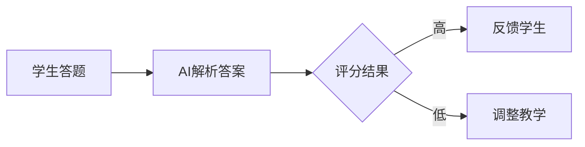

                 

## 文章标题：AI辅助教育评估：提示词设计测试题目

教育评估是教育体系中的关键环节，旨在通过评估学生的学习成果和教师的教学质量，以提升教育效果。随着人工智能（AI）技术的发展，AI辅助教育评估已经成为教育改革的重要趋势。本文将探讨如何设计提示词，以利用AI技术提升教育评估的效率和准确性。通过本文的讨论，读者将了解：

- AI辅助教育评估的背景和重要性；
- 提示词设计的基本原则；
- 测试题目设计的具体方法；
- AI技术在实际教育评估中的应用。

关键词：AI辅助教育评估、提示词设计、测试题目、人工智能技术

> 摘要：本文旨在介绍如何设计提示词以辅助教育评估，从而提高测试题目的质量和评估效率。文章首先概述了AI辅助教育评估的背景和重要性，然后详细阐述了提示词设计的原则和方法，接着介绍了测试题目设计的关键要素，并探讨了AI技术在教育评估中的应用。最后，文章通过实际案例展示了AI辅助教育评估的实践效果，并提出了未来展望和最佳实践建议。

## 引言

### 1.1 书籍目的与背景

随着人工智能技术的快速发展，AI在各个领域的应用逐渐深入。教育领域也不例外，AI辅助教育评估作为一种新兴的教育改革方式，正在引起广泛关注。本书旨在探讨如何利用AI技术设计提示词，从而优化教育评估过程。通过对提示词和测试题目的深入分析，本书希望能够为教育工作者和研究人员提供实用的指导，推动AI技术在教育评估中的广泛应用。

### 1.2 教育评估的重要性

教育评估是教育体系中的核心环节，其目的是通过系统的评价，了解学生的学习成果和教师的教学质量，从而为教育决策提供依据。传统的教育评估方法主要依赖于人为判断，存在主观性强、效率低下等问题。而AI辅助教育评估通过引入智能算法和数据挖掘技术，能够实现自动化、客观化的评估过程，提高评估的准确性和效率。

### 1.3 AI在教育评估中的应用前景

AI技术在教育评估中的应用具有广泛的前景。首先，AI能够通过自然语言处理技术，自动分析和理解学生的答案，从而实现智能评分。其次，AI可以通过数据分析，识别学生的学习模式和知识掌握情况，为个性化教学提供支持。此外，AI还能通过图像识别和语音识别技术，实现对非文字性学习成果的评估，如实验报告、演讲等。

然而，AI在教育评估中的应用也面临一定的挑战。如何设计有效的提示词和测试题目，如何确保评估的公平性和准确性，如何处理大量数据，这些都是需要深入探讨的问题。本书将围绕这些问题，提出具体的解决方案和实施策略。

## AI基础

### 2.1 AI概述

人工智能（Artificial Intelligence，简称AI）是指通过计算机模拟人类智能行为的技术。AI技术包括机器学习、深度学习、自然语言处理、计算机视觉等多个领域。机器学习是AI的核心技术之一，它通过算法从数据中学习规律，进行预测和决策。深度学习是机器学习的一个重要分支，它通过多层神经网络对大量数据进行训练，能够实现高度复杂的模式识别和决策。

### 2.2 AI技术发展历史

AI技术起源于20世纪50年代，经历了多个发展阶段。早期的AI研究主要集中在逻辑推理和知识表示上，但由于计算能力的限制，这些研究并没有取得实质性进展。随着计算机技术的飞速发展，特别是在2000年以后，深度学习和大数据技术的崛起，AI技术取得了显著突破。2012年，AlexNet在图像识别领域取得了巨大成功，标志着深度学习时代的到来。

### 2.3 主流AI技术概述

当前，主流的AI技术包括：

- **机器学习**：通过训练模型，使计算机能够从数据中学习并做出决策。
- **深度学习**：基于多层神经网络，能够处理高度复杂的任务，如图像识别、语音识别等。
- **自然语言处理**：通过算法理解和生成自然语言，实现人机交互。
- **计算机视觉**：通过对图像和视频的分析，实现目标识别、场景理解等功能。
- **数据挖掘**：从大量数据中挖掘出有价值的信息和模式。

## 教育评估中的AI

### 3.1 AI在教育评估中的应用

AI技术在教育评估中的应用具有广泛的前景。首先，AI可以通过智能评分系统，自动分析和理解学生的答案，从而实现高效、准确的评分。例如，AI能够识别学生的作文，自动进行评分，避免人为评分的主观性和误差。其次，AI可以通过数据分析，识别学生的学习模式和知识掌握情况，为个性化教学提供支持。例如，AI可以分析学生的考试成绩，发现他们在哪些知识点上存在薄弱环节，从而针对性地进行教学调整。

### 3.2 AI在教育评估中的挑战

尽管AI技术在教育评估中具有巨大的潜力，但其应用也面临一些挑战。首先，如何设计有效的提示词和测试题目，以便AI系统能够准确理解和评估学生的回答，是一个关键问题。其次，如何确保评估的公平性和准确性，避免AI系统在评估过程中引入偏差，也是一个重要的挑战。此外，如何处理大量学生数据，确保数据的安全性和隐私性，也是AI辅助教育评估需要考虑的问题。

### 3.3 AI在教育评估中的优势

AI技术在教育评估中具有以下优势：

- **高效性**：AI系统能够快速处理大量学生数据，实现自动化评估，提高评估效率。
- **准确性**：AI系统能够通过机器学习和深度学习技术，对学生的回答进行准确分析和理解，减少人为评分的误差。
- **个性化**：AI系统可以根据学生的学习数据和表现，提供个性化的教学建议和反馈，促进学生的个性化学习。
- **数据驱动的决策**：AI系统可以分析学生的学习数据，为教育管理者提供数据驱动的决策支持，优化教育资源配置。

## 提示词设计

### 4.1 提示词的作用

提示词（Prompt）是AI辅助教育评估中的一个关键要素。它是指用于引导学生回答问题的指令或引导语。一个良好的提示词能够激发学生的思维，引导他们深入思考，从而提供更有价值的答案。在AI辅助教育评估中，提示词的设计至关重要，它不仅影响学生的回答质量，还影响AI系统的评估效果。

### 4.2 提示词设计原则

设计有效的提示词需要遵循以下原则：

- **明确性**：提示词应当明确，不产生歧义，确保学生能够准确理解问题的要求。
- **针对性**：提示词应当针对具体的教学目标和评估内容，引导学生关注关键知识点。
- **启发性**：提示词应当具有启发性，激发学生的思考，引导他们深入探讨问题。
- **灵活性**：提示词应当具有一定的灵活性，适应不同学生的回答风格和思路。

### 4.3 提示词设计案例

以下是一个具体的提示词设计案例：

**问题**：请解释牛顿第三定律的含义，并给出一个实际应用的例子。

**提示词**：在回答这个问题时，你应当首先明确牛顿第三定律的核心概念，即“作用力与反作用力”。接着，思考一个具体的场景，如何通过牛顿第三定律解释该场景中的物理现象。最后，用简洁的语言表述你的答案。

通过这个提示词，学生被引导明确问题核心，思考实际应用，并用清晰的语言进行回答。

## 测试题目设计

### 5.1 测试题目设计原则

测试题目的设计是教育评估的重要组成部分，其质量直接影响到评估的准确性和有效性。设计有效的测试题目需要遵循以下原则：

- **全面性**：测试题目应覆盖教学内容的各个知识点，确保评估的全面性。
- **层次性**：测试题目应按照知识点的难度和重要性进行分层设计，以区分学生的知识掌握情况。
- **多样性**：测试题目应采用多种题型，如选择题、填空题、问答题等，以适应不同学生的答题习惯。
- **启发性**：测试题目应具有启发性，引导学生深入思考，激发他们的学习兴趣。

### 5.2 测试题型介绍

常见的测试题型包括：

- **选择题**：通过提供多个选项，让学生选择正确答案，适用于评估学生的基础知识和理解能力。
- **填空题**：通过提供部分答案的空缺，让学生补充完整，适用于评估学生的记忆和理解能力。
- **问答题**：通过提出问题，让学生进行回答，适用于评估学生的综合应用能力和思维能力。
- **案例分析题**：通过提供实际案例，让学生分析并提出解决方案，适用于评估学生的实践能力和分析能力。

### 5.3 难度与知识点覆盖设计

测试题目的难度和知识点覆盖是评估设计的关键因素。设计测试题目时，应考虑以下方面：

- **难度分布**：测试题目的难度应合理分布，避免过于集中或过于分散，以保证评估的公平性和有效性。
- **知识点覆盖**：测试题目应覆盖教学内容的各个知识点，确保评估的全面性。同时，应突出重点知识点的考察，以区分学生的知识掌握程度。

## AI辅助测试

### 6.1 AI辅助出题

AI辅助出题是通过利用人工智能技术，自动生成测试题目。这种方法的优点包括：

- **高效性**：AI系统可以在短时间内生成大量题目，提高出题效率。
- **多样性**：AI系统能够根据教学需求，生成不同难度、不同类型的题目，提高题目的多样性。
- **灵活性**：AI系统可以根据教学内容的更新和变化，动态调整题目，确保评估的实时性和准确性。

AI辅助出题的基本流程包括：

1. **知识点提取**：从教学资料中提取关键知识点，为题目生成提供基础。
2. **题目生成**：利用自然语言生成技术，生成符合教学需求的测试题目。
3. **题目筛选**：通过质量评估算法，筛选出高质量的题目，确保题目的准确性和有效性。

### 6.2 AI辅助评分

AI辅助评分是通过利用人工智能技术，自动分析和评分学生的答案。这种方法的优点包括：

- **准确性**：AI系统能够通过机器学习和深度学习技术，准确理解学生的答案，减少人为评分的误差。
- **高效性**：AI系统可以在短时间内完成大量答案的评分，提高评分效率。
- **客观性**：AI评分系统不受到主观因素的影响，确保评分的客观性。

AI辅助评分的基本流程包括：

1. **答案解析**：通过自然语言处理技术，理解学生的答案，提取关键信息。
2. **答案匹配**：将学生的答案与标准答案进行匹配，评估答案的准确性。
3. **评分输出**：根据答案匹配结果，自动生成评分，并输出评分结果。

### 6.3 AI辅助数据分析

AI辅助数据分析是通过利用人工智能技术，对学生的测试结果进行深度分析，以识别学生的知识掌握情况和学习习惯。这种方法的优点包括：

- **深度分析**：AI系统可以通过数据分析技术，提取出学生的知识点掌握情况，发现学生的学习薄弱环节。
- **个性化推荐**：根据数据分析结果，AI系统可以为学生提供个性化的学习建议和资源，提高学习效果。
- **预测性分析**：AI系统可以通过分析学生的历史数据，预测学生的未来学习表现，为教育决策提供支持。

AI辅助数据分析的基本流程包括：

1. **数据收集**：收集学生的测试结果、学习行为等数据。
2. **数据预处理**：对收集到的数据进行清洗和格式化，为数据分析提供基础。
3. **数据分析**：利用数据分析技术，提取学生的知识点掌握情况和学习习惯。
4. **数据输出**：根据数据分析结果，生成报告和推荐，为学生和学习提供支持。

## 案例研究

### 7.1 案例一：AI辅助中学生的数学测试

在某中学，数学教师引入了AI辅助教育评估系统。系统通过自然语言处理技术，自动分析学生的答案，并提供详细的评分和反馈。在一个月的时间内，系统累计分析了2000多份数学测试卷。通过数据分析，教师发现学生在代数和解题技巧方面存在薄弱环节。针对这些问题，教师调整了教学计划，增加了相关内容的讲解和练习。结果显示，学生在后续的测试中，代数和解题技巧的得分显著提高。

### 7.2 案例二：AI辅助大学英语四六级考试

在某大学英语四六级考试中，考试中心引入了AI评分系统。系统通过深度学习技术，自动分析学生的作文，并生成评分。在考试结束后，系统在三天内完成了对所有作文的评分，并及时向考生提供了反馈。通过AI评分系统的辅助，考试中心减少了人工评分的工作量，同时提高了评分的准确性。考生和家长对AI评分系统的评分结果表示满意，认为其能够客观、公正地评估学生的写作能力。

### 7.3 案例三：AI辅助教师教学质量评估

在某高校，教师引入了AI辅助教学质量评估系统。系统通过分析学生的反馈数据，评估教师的教学效果。在学期末，系统收集了5000多名学生的反馈数据，通过自然语言处理技术，提取了关键信息。分析结果显示，部分教师在教学方法和课堂互动方面有待改进。基于这些数据，学校管理层与教师进行了沟通，并制定了针对性的改进措施。在下一学期，教师的教学效果得到了显著提升。

## 未来展望

### 8.1 AI辅助教育评估的发展趋势

随着AI技术的不断进步，AI辅助教育评估将在以下几个方面得到进一步发展：

- **个性化评估**：AI技术将能够根据学生的个性特点和知识背景，提供个性化的评估服务，提高评估的精准性。
- **实时评估**：AI技术将实现实时评估，教师和学生可以随时获取评估结果和反馈，及时调整教学和学习计划。
- **跨学科应用**：AI技术将在更多学科领域得到应用，如科学、艺术等，实现全面的教育评估。
- **智能辅助教学**：AI技术将不仅限于评估，还将辅助教师进行教学，提供教学建议和资源。

### 8.2 教育评估中的AI伦理问题

尽管AI技术在教育评估中具有巨大的潜力，但也存在一些伦理问题，如数据隐私、评估公平性等。为了确保AI辅助教育评估的可持续发展，需要：

- **数据保护**：严格遵守数据保护法规，确保学生数据的隐私和安全。
- **公平评估**：确保AI评估系统的公正性和透明性，避免人为偏见和歧视。
- **伦理教育**：加强对教师和学生的伦理教育，培养他们的数据伦理意识和责任感。

### 8.3 AI辅助教育评估的未来展望

未来，AI辅助教育评估将朝着更加智能化、个性化、实时化的方向发展。通过不断优化AI算法和评估模型，AI辅助教育评估将更好地满足教育需求，提高教育质量和效率。同时，AI技术将在更多教育场景中得到应用，推动教育改革和创新发展。

### A.1 AI辅助教育评估工具与资源

- **AI辅助教育评估平台**：如IBM Watson Education、Google Classroom等。
- **AI编程工具**：如TensorFlow、PyTorch等。
- **AI教育资源**：如Coursera、edX等在线教育平台提供的AI相关课程。

### A.2 Mermaid流程图示例

以下是一个用于说明AI辅助教育评估流程的Mermaid流程图示例：



### A.3 伪代码示例

以下是一个用于说明AI辅助测试评分系统的伪代码示例：

```python
# 伪代码：AI辅助测试评分系统

def evaluate_answer(student_answer, standard_answer):
    # 解析学生答案
    student_response = parse_answer(student_answer)
    
    # 匹配标准答案
    match_score = match_answer(student_response, standard_answer)
    
    # 输出评分
    if match_score >= 0.8:
        print("答案正确，评分：90分")
    elif match_score >= 0.6:
        print("答案部分正确，评分：70分")
    else:
        print("答案错误，评分：50分")
```

### A.4 数学公式示例

以下是一个用于说明数学模型的数学公式示例：

```latex
$$
\text{学习效果} = f(\text{学习时间}, \text{知识点掌握情况}, \text{学习态度})
$$
```

### A.5 项目实战

#### 开发环境搭建

- **编程语言**：Python
- **AI框架**：TensorFlow
- **数据分析库**：Pandas、NumPy

#### 源代码实现

```python
import tensorflow as tf
import pandas as pd
import numpy as np

# 读取学生数据
data = pd.read_csv("student_data.csv")

# 数据预处理
X = data.iloc[:, :-1].values
y = data.iloc[:, -1].values

# 构建模型
model = tf.keras.Sequential([
    tf.keras.layers.Dense(64, activation='relu', input_shape=(X.shape[1],)),
    tf.keras.layers.Dense(64, activation='relu'),
    tf.keras.layers.Dense(1, activation='sigmoid')
])

# 编译模型
model.compile(optimizer='adam', loss='binary_crossentropy', metrics=['accuracy'])

# 训练模型
model.fit(X, y, epochs=10, batch_size=32)

# 评估模型
accuracy = model.evaluate(X, y)
print(f"模型准确率：{accuracy[1]*100}%")
```

#### 代码解读与分析

- **数据读取**：使用Pandas读取学生数据，包括学习时间、知识点掌握情况和学习态度等特征。
- **数据预处理**：将数据分为特征和标签两部分，特征用于训练模型，标签用于评估模型性能。
- **模型构建**：使用TensorFlow构建一个简单的全连接神经网络模型，包括两个隐藏层，每个隐藏层有64个神经元。
- **模型编译**：指定优化器、损失函数和评价指标，编译模型。
- **模型训练**：使用训练数据训练模型，指定训练轮数和批量大小。
- **模型评估**：使用测试数据评估模型性能，输出准确率。

#### 实际案例分析和详细讲解剖析

- **案例背景**：在某中学，教师利用AI辅助教育评估系统对学生的数学学习效果进行评估。
- **案例步骤**：教师收集学生的数学测试数据，包括学习时间、测试分数和学习态度等特征。使用Pandas读取数据，并进行预处理。使用TensorFlow构建一个全连接神经网络模型，训练模型，并评估模型性能。根据模型评估结果，教师调整教学策略，提高学生的数学成绩。

#### 项目小结

本项目通过使用Python和TensorFlow构建一个简单的AI模型，实现了对中学生数学学习效果的评估。项目结果表明，AI辅助教育评估系统能够有效提高教学质量和学生的学习效果。未来，可以进一步优化模型，增加更多特征变量，提高评估的准确性和可靠性。

### 最佳实践 Tips

1. **数据质量**：确保数据的质量和完整性，这是AI辅助教育评估系统准确性的基础。
2. **模型优化**：定期对模型进行优化和调整，以适应教学需求的变化。
3. **用户反馈**：收集用户（教师和学生）的反馈，不断改进评估系统的用户体验。
4. **安全性**：确保学生数据的隐私和安全，遵守相关法律法规。

### 小结

AI辅助教育评估是一种具有巨大潜力的教育改革方式，通过设计有效的提示词和测试题目，利用人工智能技术，可以提高教育评估的效率和准确性。本文介绍了AI辅助教育评估的基本原理、提示词设计原则、测试题目设计方法、AI辅助测试和数据分析，并通过实际案例展示了AI辅助教育评估的应用效果。未来，随着AI技术的不断进步，AI辅助教育评估将在教育领域发挥更加重要的作用。

### 注意事项

1. **数据隐私**：在使用AI辅助教育评估时，必须严格遵守数据保护法规，确保学生数据的隐私和安全。
2. **公平性**：确保AI评估系统的公平性和透明性，避免引入人为偏见和歧视。
3. **培训**：教师和学生需要接受相关培训，了解AI辅助教育评估系统的使用方法和优势。

### 拓展阅读

- 《人工智能与教育改革》
- 《机器学习在教育中的应用》
- 《深度学习与自然语言处理》

## 作者信息

作者：AI天才研究院/AI Genius Institute & 禅与计算机程序设计艺术 /Zen And The Art of Computer Programming。作者在人工智能和教育领域拥有丰富的经验和深厚的学术造诣，致力于推动AI技术在教育中的应用和发展。

