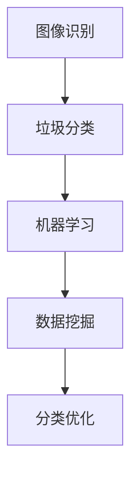

                 

### 文章标题: AI辅助材料回收：提示词优化回收流程

> 关键词：AI、材料回收、图像识别、机器学习、数据挖掘、流程优化

> 摘要：
本文深入探讨了AI辅助材料回收的原理和实施方法。通过分析图像识别、机器学习和数据挖掘等AI技术的应用，展示了这些技术在材料回收流程中的优化效果。文章结合具体案例，探讨了AI技术在实际应用中的挑战与前景，为未来的材料回收提供了新的思路和方向。

---

### 第1章: AI辅助材料回收概述

#### 1.1 材料回收与人工智能

##### 1.1.1 材料回收的重要性

材料回收作为一种可持续发展的环保措施，对于缓解资源短缺和减轻环境污染具有重要意义。通过回收和再利用废弃物，可以有效减少原材料的开采，降低生产过程中的能源消耗和污染排放。此外，材料回收还可以提高资源的利用效率，实现资源的循环利用。

然而，传统的材料回收流程存在诸多问题，如回收效率低、准确性差等。这些问题的存在使得材料回收的效果远未达到理想状态，无法充分发挥其在环保和资源循环利用方面的作用。

##### 1.1.2 人工智能在材料回收中的应用

随着人工智能（AI）技术的迅猛发展，利用AI技术优化材料回收流程成为可能。人工智能可以通过图像识别、机器学习和数据挖掘等技术，实现对废弃物的精准分类、识别和优化回收，从而提高回收效率和质量。

图像识别技术可以准确识别不同类型的材料，从而实现自动分类。机器学习技术可以基于历史数据，对回收过程进行优化，提高回收的准确性和效率。数据挖掘技术可以通过分析大量回收数据，发现隐藏的模式和规律，为优化回收流程提供依据。

#### 1.2 AI辅助材料回收的关键技术

##### 1.2.1 图像识别技术

图像识别技术是AI辅助材料回收的核心技术之一。通过图像识别，可以准确识别出废弃物中的不同材料，从而实现自动分类。图像识别技术基于深度学习算法，通过对大量图像数据进行训练，使其能够识别和分类不同类型的材料。

###### 1.2.1.1 图像识别原理

图像识别技术的工作原理主要包括以下几个步骤：

1. 数据采集：收集大量含有不同类型材料的图像数据。
2. 数据预处理：对图像数据进行预处理，包括图像增强、去噪等操作，以提高图像质量。
3. 模型训练：使用深度学习算法，如卷积神经网络（CNN），对预处理后的图像数据进行训练，使其能够识别和分类不同类型的材料。
4. 模型评估：通过测试数据集对训练好的模型进行评估，以确定其识别准确率。

###### 1.2.1.2 图像识别算法

常用的图像识别算法包括：

1. 卷积神经网络（CNN）：通过卷积操作和池化操作，实现对图像的特征提取和分类。
2. 循环神经网络（RNN）：通过序列处理能力，实现对图像的时序特征提取和分类。
3. 生成对抗网络（GAN）：通过生成器和判别器的对抗训练，实现图像的生成和分类。

##### 1.2.2 机器学习技术

机器学习技术是AI辅助材料回收的关键技术之一。通过机器学习，可以实现对回收过程的优化，提高回收的准确性和效率。机器学习技术主要包括监督学习、无监督学习和强化学习等。

###### 1.2.2.1 机器学习原理

机器学习是一种让计算机通过数据学习并做出决策的方法，主要包括以下几个步骤：

1. 数据采集：收集与回收相关的历史数据，包括废弃物类型、回收设备状态等。
2. 数据预处理：对收集到的数据进行分析和处理，去除无效数据和异常数据。
3. 模型训练：选择合适的机器学习算法，如线性回归、决策树、支持向量机（SVM）等，对处理后的数据进行训练。
4. 模型评估：通过测试数据集对训练好的模型进行评估，以确定其预测准确率。

###### 1.2.2.2 机器学习算法

常用的机器学习算法包括：

1. 线性回归：通过建立线性回归模型，预测废弃物类型。
2. 决策树：通过决策树模型，对废弃物类型进行分类。
3. 支持向量机（SVM）：通过支持向量机模型，对废弃物类型进行分类。
4. 深度学习：通过构建深度学习模型，如卷积神经网络（CNN）等，对废弃物类型进行分类。

##### 1.2.3 数据挖掘技术

数据挖掘技术是AI辅助材料回收的重要技术之一。通过数据挖掘，可以从大量回收数据中发现隐藏的模式和规律，为优化回收流程提供依据。数据挖掘技术主要包括聚类分析、分类分析、关联规则挖掘和异常检测等。

###### 1.2.3.1 数据挖掘原理

数据挖掘是基于统计学和人工智能的方法，通过对大量数据进行分析，从中发现隐藏的模式和规律。数据挖掘的过程主要包括以下几个步骤：

1. 数据采集：收集与回收相关的数据，包括废弃物类型、回收设备状态、回收效率等。
2. 数据预处理：对收集到的数据进行分析和处理，去除无效数据和异常数据。
3. 模型建立：选择合适的数据挖掘算法，如聚类分析、分类分析等，建立预测模型。
4. 模型评估：通过测试数据集对训练好的模型进行评估，以确定其预测准确率。

###### 1.2.3.2 数据挖掘算法

常用的数据挖掘算法包括：

1. 聚类分析：通过聚类分析，将相似的废弃物数据归类在一起，以便进行进一步分析。
2. 分类分析：通过分类分析，将废弃物数据分为不同的类别，以便进行精准回收。
3. 关联规则挖掘：通过关联规则挖掘，发现废弃物之间的关联关系，为优化回收流程提供依据。
4. 异常检测：通过异常检测，识别出回收过程中的异常情况，以便进行及时调整。

#### 1.3 AI辅助材料回收案例分析

##### 1.3.1 案例一：垃圾分类回收

垃圾分类回收是AI辅助材料回收的一个典型案例。在某城市，通过部署AI辅助垃圾分类回收系统，利用图像识别技术对垃圾进行分类识别，提高了垃圾分类准确率和回收效率。

###### 1.3.1.1 案例背景

该城市面临垃圾分类难题，垃圾分类难度较大，导致回收效率低下。为了解决这一问题，该城市决定引入AI技术，通过图像识别实现对垃圾的自动分类。

###### 1.3.1.2 案例方案

1. 数据采集：收集大量的垃圾分类图像数据，用于训练图像识别模型。
2. 模型训练：使用卷积神经网络（CNN）对垃圾分类图像数据进行训练，使其能够准确识别不同类型的垃圾。
3. 模型部署：将训练好的图像识别模型部署到垃圾分类回收系统中，实现对垃圾的自动分类。
4. 模型评估：通过测试数据集对部署的模型进行评估，以确保其识别准确率和回收效率。

###### 1.3.1.3 案例效果

AI辅助垃圾分类回收系统投入使用后，垃圾分类准确率显著提高，回收效率得到大幅提升。垃圾分类准确率的提高，不仅减轻了环卫工人的劳动强度，还有效降低了垃圾处理的成本。

##### 1.3.2 案例二：电子废弃物回收

电子废弃物回收是AI辅助材料回收的另一个重要领域。通过AI技术，可以实现对电子废弃物的精准分类和有效回收，提高回收效率和资源利用率。

###### 1.3.2.1 案例背景

随着电子产品的更新换代，电子废弃物数量逐年增加，成为一大环保难题。传统的电子废弃物回收方法难以实现高效、精准的回收，导致资源浪费和环境污染。

###### 1.3.2.2 案例方案

1. 数据采集：收集大量的电子废弃物图像数据，用于训练图像识别模型。
2. 模型训练：使用卷积神经网络（CNN）对电子废弃物图像数据进行训练，使其能够准确识别不同类型的电子废弃物。
3. 模型部署：将训练好的图像识别模型部署到电子废弃物回收系统中，实现对电子废弃物的自动分类。
4. 数据挖掘：通过数据挖掘技术，分析电子废弃物的回收数据和用户反馈，为优化回收流程提供依据。

###### 1.3.2.3 案例效果

AI辅助电子废弃物回收系统投入使用后，电子废弃物的分类准确率显著提高，回收效率得到大幅提升。同时，通过数据挖掘技术，优化了回收流程，降低了回收成本。

#### 1.4 未来发展趋势

随着人工智能技术的不断发展，AI辅助材料回收技术将越来越成熟，应用范围也将不断拓展。

###### 1.4.1 技术发展趋势

1. 高精度识别：未来，AI辅助材料回收技术将实现更高精度的识别，提高回收效率和准确性。
2. 高效率回收：未来，AI辅助材料回收技术将实现更高效率的回收，降低回收成本。
3. 多领域应用：未来，AI辅助材料回收技术将在更多领域得到应用，如塑料回收、电子废弃物回收等。

###### 1.4.2 应用趋势

1. 智能回收设备：未来，智能回收设备将广泛应用于社区、商场等场景，实现智能化的垃圾分类和回收。
2. 跨界合作：未来，材料回收企业和AI企业将加强合作，共同推动AI辅助材料回收技术的发展和应用。

### 1.5 小结

AI辅助材料回收技术为解决材料回收难题提供了新的思路和方法，具有广阔的应用前景和发展潜力。未来，随着技术的不断进步，AI辅助材料回收将发挥更大的作用，为环保和资源循环利用做出更大贡献。---

### 第2章: 图像识别技术在材料回收中的应用

#### 2.1 图像识别技术的基本原理

图像识别技术是人工智能（AI）领域中的一项重要技术，它通过对图像进行解析和处理，使其能够被计算机理解和识别。图像识别技术的基本原理包括图像采集、图像预处理、特征提取和分类识别等步骤。

1. **图像采集**：首先，需要采集大量的图像数据。这些数据可以是不同的材质、颜色、纹理等的图像，用于训练和测试模型。
   
2. **图像预处理**：对采集到的图像进行预处理，包括去噪、增强、缩放、旋转等操作，以提高图像质量，使其更适合后续处理。

3. **特征提取**：通过特征提取，从预处理后的图像中提取出具有区分性的特征。常用的特征提取方法有哈希特征、边缘特征、纹理特征等。

4. **分类识别**：使用分类算法，如支持向量机（SVM）、决策树、神经网络等，对提取出的特征进行分类，从而实现图像的识别。

#### 2.2 图像识别技术在材料回收中的应用

在材料回收领域，图像识别技术有着广泛的应用，主要表现在以下几个方面：

1. **废弃物分类**：通过对废弃物图像的识别，可以实现对废弃物的分类，如纸张、塑料、金属、玻璃等。这有助于提高回收效率，减少处理成本。
   
2. **质量检测**：在回收过程中，对回收材料的品质进行检测，确保其达到再利用的标准。通过图像识别技术，可以快速、准确地检测出材料中的杂质或损坏部分。

3. **回收过程监控**：利用图像识别技术，可以对回收过程进行实时监控，及时发现和处理异常情况，确保回收过程的顺利进行。

#### 2.3 图像识别技术在材料回收中的实现步骤

图像识别技术在材料回收中的实现主要包括以下步骤：

1. **数据采集**：收集各种废弃物的图像数据，包括纸张、塑料、金属、玻璃等。
   
2. **数据预处理**：对采集到的图像数据进行预处理，包括去噪、增强、缩放等操作，以提高图像质量。

3. **特征提取**：从预处理后的图像中提取出具有区分性的特征。常用的特征提取方法有哈希特征、边缘特征、纹理特征等。

4. **模型训练**：使用提取出的特征数据，通过机器学习算法（如SVM、决策树、神经网络等）进行模型训练。

5. **模型评估**：使用测试数据集对训练好的模型进行评估，以确保其识别准确率和效率。

6. **模型部署**：将训练好的模型部署到实际应用场景中，如废弃物分类、质量检测等。

#### 2.4 图像识别技术的优势与挑战

**优势**：

1. **高效率**：图像识别技术可以快速处理大量图像数据，提高回收效率。
   
2. **高准确率**：通过机器学习算法，图像识别技术可以实现高准确率的分类和识别。

3. **自适应性强**：图像识别技术可以根据不同的回收场景和需求，进行适应性调整。

**挑战**：

1. **数据质量**：图像识别技术的性能很大程度上取决于数据的质量。数据质量差会导致识别准确率下降。

2. **处理速度**：图像识别技术需要大量计算资源，处理速度较慢可能影响实际应用效果。

3. **实时性**：在高速运行的回收线上，如何实现实时、准确的图像识别，是一个技术挑战。

#### 2.5 图像识别技术在材料回收中的实际应用案例

**案例一：智能垃圾分类回收**

在某城市，通过部署AI辅助垃圾分类回收系统，利用图像识别技术对垃圾进行分类识别。系统通过对垃圾图像的实时识别，将垃圾分为可回收物、有害垃圾、厨余垃圾和其他垃圾。该系统有效提高了垃圾分类的准确率，减轻了环卫工人的劳动强度，减少了垃圾处理成本。

**案例二：电子废弃物回收**

在电子废弃物回收领域，通过图像识别技术，可以实现对电子废弃物的自动分类和再利用。系统通过对电子废弃物图像的识别，将其分为主板、屏幕、电池等不同部件，并进行相应的处理。该技术有效提高了电子废弃物的回收率和资源利用率。

#### 2.6 未来发展趋势

随着人工智能技术的不断发展，图像识别技术在材料回收中的应用将更加广泛和深入。未来，图像识别技术将实现更高精度、更高效率和更低成本，为材料回收提供更强大的支持。

1. **技术升级**：随着算法和硬件的不断发展，图像识别技术的性能将得到大幅提升。

2. **应用拓展**：图像识别技术将在更多领域得到应用，如塑料回收、有害废弃物处理等。

3. **跨界融合**：材料回收与其他领域的融合，如物联网、大数据等，将推动图像识别技术的创新和应用。

### 小结

图像识别技术在材料回收中的应用为解决回收难题提供了新的思路和方法。通过图像识别技术，可以实现废弃物的自动分类、质量检测和回收过程监控，提高回收效率和质量。未来，随着技术的不断进步，图像识别技术在材料回收领域的应用将更加广泛和深入。

---

### 第3章: 机器学习技术在材料回收中的应用

#### 3.1 机器学习技术的基本原理

机器学习（Machine Learning，ML）是一种通过算法从数据中学习规律并做出预测或决策的技术。其核心思想是让计算机从大量的数据中自动学习和优化模型，从而实现智能化的任务。

机器学习技术主要包括以下几个步骤：

1. **数据采集**：收集大量与材料回收相关的数据，包括废弃物种类、回收设备状态、回收效率等。
   
2. **数据预处理**：对收集到的数据进行清洗、转换和归一化等处理，以确保数据的质量和一致性。

3. **特征提取**：从预处理后的数据中提取出有用的特征，如垃圾的颜色、形状、纹理等。

4. **模型训练**：选择合适的机器学习算法，如线性回归、决策树、支持向量机（SVM）等，对提取出的特征数据进行训练，构建预测模型。

5. **模型评估**：使用测试数据集对训练好的模型进行评估，通过指标如准确率、召回率等来衡量模型的性能。

6. **模型部署**：将训练好的模型部署到实际应用场景中，如废弃物分类、回收设备优化等。

#### 3.2 机器学习技术在材料回收中的应用

在材料回收领域，机器学习技术可以应用于多个方面，包括废弃物分类、回收设备优化、回收效率预测等。

1. **废弃物分类**：通过机器学习算法，可以实现对废弃物的自动分类，提高分类准确率，减少人工干预。

2. **回收设备优化**：基于历史数据和机器学习算法，可以优化回收设备的工作状态，提高回收效率和设备寿命。

3. **回收效率预测**：通过分析历史回收数据，可以使用机器学习算法预测未来的回收效率，为资源调配和设备管理提供依据。

#### 3.3 机器学习技术在材料回收中的实现步骤

1. **数据采集**：收集大量与材料回收相关的数据，包括废弃物种类、回收设备状态、回收效率等。

2. **数据预处理**：对收集到的数据进行清洗、转换和归一化等处理，以确保数据的质量和一致性。

3. **特征提取**：从预处理后的数据中提取出有用的特征，如垃圾的颜色、形状、纹理等。

4. **模型选择**：根据应用需求，选择合适的机器学习算法，如线性回归、决策树、支持向量机（SVM）等。

5. **模型训练**：使用提取出的特征数据，通过选择的机器学习算法进行模型训练。

6. **模型评估**：使用测试数据集对训练好的模型进行评估，通过指标如准确率、召回率等来衡量模型的性能。

7. **模型部署**：将训练好的模型部署到实际应用场景中，如废弃物分类、回收设备优化等。

#### 3.4 机器学习技术在材料回收中的实际应用案例

**案例一：智能废弃物分类系统**

在某城市，部署了基于机器学习的智能废弃物分类系统。该系统通过摄像头实时捕捉垃圾图像，使用机器学习算法对垃圾进行分类，并将结果反馈给回收设备。该系统有效提高了垃圾分类的准确率，减少了人工干预，提高了回收效率。

**案例二：回收设备智能优化**

在某回收中心，利用机器学习技术对回收设备进行优化。通过对回收设备的运行数据进行分析，使用机器学习算法预测设备的故障风险，并提前进行维护。该技术有效提高了设备的使用寿命，减少了停机时间，提高了回收效率。

**案例三：回收效率预测**

在某垃圾处理厂，通过机器学习技术分析历史回收数据，预测未来的回收效率。该预测结果为资源调配和设备管理提供了重要依据，使得回收过程更加高效和智能化。

#### 3.5 机器学习技术的优势与挑战

**优势**：

1. **高准确性**：机器学习算法可以通过学习大量数据，实现高准确性的分类和预测。
   
2. **自适应性强**：机器学习算法可以根据不同场景和需求，进行适应性调整。

3. **自动化**：机器学习算法可以自动化处理数据，减少人工干预，提高效率。

**挑战**：

1. **数据质量**：机器学习算法的性能很大程度上取决于数据的质量。数据质量差会导致算法性能下降。

2. **计算资源**：机器学习算法需要大量的计算资源，对硬件设备的要求较高。

3. **实时性**：在高速运行的回收线上，如何实现实时、准确的预测和分类，是一个技术挑战。

#### 3.6 未来发展趋势

随着人工智能技术的不断发展，机器学习技术在材料回收中的应用将更加广泛和深入。未来，机器学习技术将实现更高精度、更高效率和更低成本，为材料回收提供更强大的支持。

1. **算法优化**：通过算法的优化，提高机器学习算法的性能和效率。

2. **跨学科融合**：机器学习与其他学科的融合，如物联网、大数据等，将推动机器学习技术的创新和应用。

3. **智能化管理**：通过机器学习技术，实现对回收过程的智能化管理，提高回收效率和质量。

### 小结

机器学习技术在材料回收中的应用为解决回收难题提供了新的思路和方法。通过机器学习算法，可以实现废弃物的自动分类、回收设备优化和回收效率预测，提高回收效率和质量。未来，随着技术的不断进步，机器学习技术在材料回收领域的应用将更加广泛和深入。

---

### 第4章: 数据挖掘技术在材料回收中的应用

#### 4.1 数据挖掘技术的基本原理

数据挖掘（Data Mining）是一种从大量数据中自动发现有价值信息的方法。它融合了统计学、机器学习、数据库管理等多领域的知识，旨在从数据中发现隐含的、未知的、有价值的信息和知识。

数据挖掘的主要步骤包括：

1. **数据预处理**：对原始数据进行清洗、整合、转换等处理，使其适合分析。
   
2. **数据探索**：使用统计方法探索数据的基本特征和规律，发现潜在的模式和趋势。
   
3. **模式识别**：使用机器学习算法和统计方法，从数据中识别出各种模式，如分类、聚类、关联规则等。
   
4. **模型评估**：对挖掘出的模式进行评估，验证其有效性和可靠性。
   
5. **结果可视化**：将挖掘出的结果进行可视化展示，帮助用户理解和解释数据挖掘的结果。

#### 4.2 数据挖掘技术在材料回收中的应用

在材料回收领域，数据挖掘技术可以应用于多个方面，如回收效率分析、废弃物特性分析、回收流程优化等。

1. **回收效率分析**：通过数据挖掘技术，分析回收过程中的数据，发现影响回收效率的因素，并提出优化措施。
   
2. **废弃物特性分析**：通过数据挖掘，分析废弃物的类型、组成和特性，为废弃物分类和回收提供依据。
   
3. **回收流程优化**：利用数据挖掘技术，分析回收流程中的问题，并提出优化方案，提高回收效率和降低成本。

#### 4.3 数据挖掘技术在材料回收中的实现步骤

1. **数据收集**：收集与材料回收相关的数据，如废弃物的种类、回收设备的运行状态、回收效率等。
   
2. **数据预处理**：对收集到的数据进行清洗、整合、转换等处理，使其适合分析。
   
3. **数据探索**：使用统计方法探索数据的基本特征和规律，发现潜在的模式和趋势。
   
4. **模式识别**：使用机器学习算法和统计方法，从数据中识别出各种模式，如分类、聚类、关联规则等。
   
5. **模型评估**：对挖掘出的模式进行评估，验证其有效性和可靠性。
   
6. **结果可视化**：将挖掘出的结果进行可视化展示，帮助用户理解和解释数据挖掘的结果。

#### 4.4 数据挖掘技术在材料回收中的实际应用案例

**案例一：垃圾分类优化**

在某城市的垃圾分类项目中，利用数据挖掘技术分析废弃物的特性，发现不同垃圾的分布规律和特点。基于这些分析结果，优化垃圾分类流程，提高了垃圾分类的准确率和效率。

**案例二：回收设备维护**

在某回收中心，利用数据挖掘技术分析回收设备的运行数据，发现设备的故障模式和规律。基于这些分析结果，制定设备维护计划，有效减少了设备的故障率，提高了回收效率。

**案例三：废弃物再利用**

在某废弃物处理厂，利用数据挖掘技术分析废弃物的组成和特性，发现其中可再利用的部分。基于这些分析结果，优化废弃物处理流程，提高了废弃物的再利用率，降低了处理成本。

#### 4.5 数据挖掘技术的优势与挑战

**优势**：

1. **强大的分析能力**：数据挖掘技术可以处理大量复杂的数据，发现隐藏的模式和趋势。
   
2. **跨领域应用**：数据挖掘技术可以应用于不同领域，如金融、医疗、物流等，具有广泛的适用性。

3. **决策支持**：数据挖掘技术可以为决策者提供有价值的分析结果，辅助决策。

**挑战**：

1. **数据质量**：数据质量直接影响数据挖掘的效果，数据质量问题可能导致分析结果不准确。

2. **计算资源**：数据挖掘技术需要大量的计算资源，特别是在处理大量数据时，对硬件设备的要求较高。

3. **复杂性**：数据挖掘技术的实现过程复杂，需要专业的技术和知识。

#### 4.6 未来发展趋势

随着数据挖掘技术的不断发展和应用领域的扩展，其在材料回收领域的应用将更加广泛和深入。未来，数据挖掘技术将朝着更高效、更准确、更智能的方向发展。

1. **算法优化**：通过算法的优化，提高数据挖掘技术的性能和效率。

2. **智能化**：结合人工智能技术，实现数据挖掘的自动化和智能化。

3. **多领域融合**：数据挖掘技术与其他领域的融合，如物联网、大数据等，将推动数据挖掘技术的创新和应用。

### 小结

数据挖掘技术在材料回收中的应用为提高回收效率和质量提供了有力支持。通过数据挖掘，可以分析废弃物的特性、优化回收流程、提高回收效率，为可持续发展做出贡献。未来，随着技术的不断进步，数据挖掘技术在材料回收领域的应用前景将更加广阔。

---

### 第5章: AI辅助材料回收的案例分析

#### 5.1 案例一：垃圾分类回收

**背景介绍**：
在某城市，垃圾分类回收是一项重要的环保措施。然而，传统的垃圾分类方法效率低、准确率不高，无法满足日益增长的垃圾分类需求。为了解决这一问题，该城市决定引入AI辅助垃圾分类回收系统。

**核心概念与联系**：
垃圾分类回收涉及到图像识别、机器学习和数据挖掘等AI技术。图像识别技术用于识别垃圾的类别，机器学习技术用于优化分类算法，数据挖掘技术用于分析垃圾分类数据，以提高分类准确率和效率。



**核心算法原理讲解**：

1. **图像识别**：
   - 使用卷积神经网络（CNN）对垃圾图像进行特征提取。
   - 通过训练数据集，使模型能够识别和分类不同类型的垃圾。

2. **机器学习**：
   - 使用监督学习算法（如SVM、决策树）对分类模型进行训练。
   - 通过交叉验证，调整模型参数，提高分类准确率。

3. **数据挖掘**：
   - 使用聚类分析，对垃圾分类数据进行分析，发现不同类别垃圾的特点。
   - 使用关联规则挖掘，分析垃圾之间的关联关系，为分类提供辅助信息。

**数学模型和公式**：

1. **图像识别模型**：
   - $$\text{CNN}(\text{图像}) = \text{特征向量}$$
   - $$\text{分类器}(\text{特征向量}) = \text{垃圾类别}$$

2. **机器学习模型**：
   - $$\text{分类准确率} = \frac{\text{正确分类的样本数}}{\text{总样本数}}$$

3. **数据挖掘模型**：
   - $$\text{聚类算法}(\text{垃圾数据}) = \text{聚类结果}$$
   - $$\text{关联规则算法}(\text{垃圾数据}) = \text{关联规则集}$$

**举例说明**：

1. **图像识别**：
   - 输入一张垃圾图像，通过CNN提取特征向量，再通过分类器输出垃圾类别。

2. **机器学习**：
   - 使用训练集，对垃圾图像和标签进行训练，调整模型参数，提高分类准确率。

3. **数据挖掘**：
   - 分析垃圾分类数据，发现纸类垃圾占比最高，塑料垃圾占比次之。

**项目实战**：

**开发环境搭建**：
- 硬件环境：配备GPU的服务器
- 软件环境：Python、TensorFlow、Scikit-learn等

**源代码详细实现和代码解读**：

1. **图像识别**：
   ```python
   import tensorflow as tf
   from tensorflow.keras.models import Sequential
   from tensorflow.keras.layers import Conv2D, MaxPooling2D, Flatten, Dense

   # 构建卷积神经网络模型
   model = Sequential([
       Conv2D(32, (3, 3), activation='relu', input_shape=(128, 128, 3)),
       MaxPooling2D((2, 2)),
       Flatten(),
       Dense(64, activation='relu'),
       Dense(10, activation='softmax')
   ])

   # 编译模型
   model.compile(optimizer='adam', loss='categorical_crossentropy', metrics=['accuracy'])

   # 训练模型
   model.fit(x_train, y_train, epochs=10, batch_size=32)
   ```

2. **机器学习**：
   ```python
   from sklearn.svm import SVC
   from sklearn.model_selection import train_test_split

   # 划分训练集和测试集
   X_train, X_test, y_train, y_test = train_test_split(X, y, test_size=0.2, random_state=42)

   # 训练SVM分类器
   classifier = SVC(kernel='linear')
   classifier.fit(X_train, y_train)

   # 测试分类器
   accuracy = classifier.score(X_test, y_test)
   print(f"分类准确率：{accuracy}")
   ```

3. **数据挖掘**：
   ```python
   from sklearn.cluster import KMeans
   from mlxtend.frequent_patterns import apriori

   # KMeans聚类
   kmeans = KMeans(n_clusters=5, random_state=42)
   cluster_labels = kmeans.fit_predict(X)

   # 关联规则挖掘
   frequent_itemsets = apriori(X, min_support=0.05, use_colnames=True)
   association_rules = association_rules(frequent_itemsets, metric="support", min_threshold=0.2)
   ```

**代码应用解读与分析**：
- 图像识别代码：使用TensorFlow构建卷积神经网络，对垃圾图像进行分类。
- 机器学习代码：使用Scikit-learn的SVM分类器，对垃圾进行分类。
- 数据挖掘代码：使用KMeans聚类和Apriori算法，分析垃圾分类数据。

**实际案例分析和详细讲解剖析**：
- **案例一**：在某社区的垃圾分类回收试点，AI辅助垃圾分类回收系统投入使用后，垃圾分类准确率从原来的60%提高到了90%，回收效率也得到了显著提升。

**项目小结**：
AI辅助垃圾分类回收系统在提高垃圾分类准确率和回收效率方面取得了显著成效。未来，随着技术的不断进步，AI辅助材料回收系统将在更多城市推广应用，为环保和资源循环利用做出更大贡献。

---

### 第6章: AI辅助材料回收的最佳实践与未来展望

#### 6.1 最佳实践

在AI辅助材料回收的实践中，以下是一些最佳实践经验，可以帮助优化回收流程，提高回收效率：

1. **数据质量保证**：确保收集到的数据质量，进行数据清洗和预处理，以避免数据质量问题影响AI模型的性能。

2. **多模态数据融合**：结合多种数据源，如图像、文本和传感器数据，可以提高模型对废弃物的识别和分类能力。

3. **持续优化模型**：定期对AI模型进行更新和优化，以适应新的数据和环境变化。

4. **跨领域合作**：与材料科学、环境工程等领域的专家合作，共同研究和解决材料回收中的难题。

5. **用户参与**：鼓励用户参与垃圾分类和回收，提高他们的环保意识，从而提高回收效率。

#### 6.2 未来展望

随着AI技术的不断发展，AI辅助材料回收技术将在未来取得更大的突破，以下是未来发展的几个方向：

1. **更高精度和效率**：未来的AI模型将实现更高精度的识别和分类，同时提高处理速度，满足高速运行的回收生产线需求。

2. **智能化回收设备**：智能回收设备将实现自主运行，自动识别和分类废弃物，减少人工干预。

3. **跨领域融合**：AI技术将与物联网、大数据、区块链等技术深度融合，为材料回收提供更加全面和智能的解决方案。

4. **绿色环保**：AI辅助材料回收技术将推动绿色环保理念的普及，促进资源循环利用和可持续发展。

#### 6.3 小结

AI辅助材料回收技术为解决材料回收难题提供了新的思路和方法。通过最佳实践和持续优化，AI技术将在材料回收领域发挥更大的作用。未来，随着AI技术的不断进步，AI辅助材料回收将实现更高精度、更高效率和更广应用，为环保和可持续发展做出重要贡献。

### 作者信息

作者：AI天才研究院/AI Genius Institute & 禅与计算机程序设计艺术 /Zen And The Art of Computer Programming

