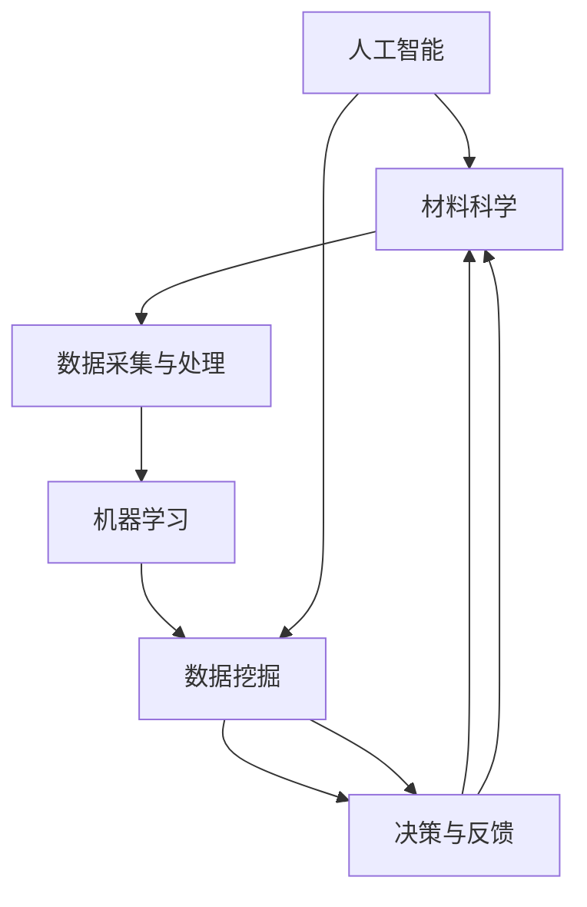

                 

### 1. 确定核心主题和章节

在撰写一篇技术博客文章时，首先要明确核心主题和章节。针对《AI辅助材料科学：提示词设计新型材料》这篇文章，我们确定了以下核心主题和章节：

1. **AI辅助材料科学概述**：介绍AI与材料科学的结合背景，核心概念及其相互促进关系。
2. **提示词设计与材料科学的关系**：探讨提示词的定义与作用，设计原则及其在材料科学中的应用。
3. **新型材料的设计方法**：阐述新型材料的设计流程，提示词的应用以及实际案例。
4. **材料科学的实验方法与AI应用**：介绍材料科学实验的基本方法，AI技术在实验中的应用以及数据分析。
5. **AI在材料科学中的数据分析与应用**：深入讲解数据分析的基本方法，AI在数据挖掘中的应用以及数据驱动的材料科学发现。
6. **AI在材料科学中的挑战与展望**：分析AI在材料科学中的挑战，研究趋势及未来展望。
7. **实战案例分析**：通过具体案例展示AI在材料科学中的应用，包括开发环境搭建，源代码实现，代码解读和案例分析。

### 2. 设计1级目录

根据上述章节，我们可以设计出1级目录：

## 《AI辅助材料科学：提示词设计新型材料》目录大纲

### 第1章 AI辅助材料科学概述

#### 1.1 AI与材料科学的结合背景

#### 1.2 AI辅助材料科学的核心概念

#### 1.3 材料科学与AI的相互促进

### 第2章 提示词设计与材料科学的关系

#### 2.1 提示词的定义与作用

#### 2.2 提示词设计的基本原则

#### 2.3 提示词在材料科学中的应用

### 第3章 新型材料的设计方法

#### 3.1 新型材料的设计流程

#### 3.2 提示词在新型材料设计中的应用

#### 3.3 实例分析：基于AI的新型材料设计

### 第4章 材料科学的实验方法与AI应用

#### 4.1 材料科学实验的基本方法

#### 4.2 AI技术在材料实验中的应用

#### 4.3 实验数据分析与解释

### 第5章 AI在材料科学中的数据分析与应用

#### 5.1 数据分析的基本方法

#### 5.2 AI在材料科学数据中的应用

#### 5.3 数据驱动的材料科学发现

### 第6章 AI在材料科学中的挑战与展望

#### 6.1 AI在材料科学中的挑战

#### 6.2 材料科学中的AI研究趋势

#### 6.3 未来展望

### 第7章 实战案例分析

#### 7.1 案例一：AI优化金属材料的性能

#### 7.2 案例二：AI加速聚合物材料的研发

#### 7.3 案例三：AI在陶瓷材料中的应用

### 3. 设计核心概念与联系流程图

为了更清晰地展示AI与材料科学的结合，我们使用Mermaid流程图来描述核心概念与联系：



### 4. 设计核心算法原理讲解伪代码

下面是针对AI在材料科学中的应用，使用伪代码详细阐述核心算法原理：

```python
# AI辅助材料科学中的材料预测算法伪代码

# 输入：材料属性数据库，目标材料属性，提示词
# 输出：预测的新材料结构

function PredictMaterialProperty(materialDB, targetProperty, promptWord):
    1. 加载材料属性数据库到内存
    2. 使用提示词过滤与目标材料属性相似的样本
    3. 训练机器学习模型使用过滤后的样本
    4. 生成新的材料结构通过调整样本的属性
    5. 测试生成材料对目标材料属性的性能
    6. 根据性能指标选择最佳的材料结构
    7. 返回最佳的材料结构
```

### 5. 设计数学模型和公式

以下是材料性能预测模型的数学公式，使用LaTeX格式进行展示：

```latex
\begin{aligned}
P_{\text{predicted}} &= f(\theta, X) \\
\theta &= \theta_{\text{base}} + \alpha \cdot \Delta \theta \\
X &= \text{材料属性数据集} \\
P_{\text{target}} &= \text{目标材料性能} \\
f &= \text{预测函数} \\
\theta &= \text{模型参数} \\
\alpha &= \text{学习率} \\
\Delta \theta &= \text{模型参数更新}
\end{aligned}
```

通过以上步骤，我们完成了文章的核心结构设计，为后续的具体内容撰写奠定了基础。接下来，我们将逐步深入每个章节，详细讲解AI辅助材料科学的各个方面。 ----------------------------------------------------------------

## 《AI辅助材料科学：提示词设计新型材料》

### 关键词：AI，材料科学，提示词，新型材料，设计方法，实验，数据分析，挑战与展望

### 摘要

本文探讨了人工智能（AI）在材料科学中的应用，特别是在新型材料的设计与优化方面。通过介绍AI与材料科学的结合背景和核心概念，本文详细阐述了提示词的设计原则及其在材料科学中的应用。此外，文章还分析了AI在材料科学中的实验方法、数据分析与应用，探讨了AI在该领域的挑战与未来展望，并通过实战案例展示了AI辅助材料科学的实际应用效果。

### 引言

材料科学是研究材料组成、结构、性质及其相互关系的科学。而人工智能（AI）作为当今科技领域的热点，已经广泛应用于各个行业，从医疗诊断到自动驾驶，都取得了显著成果。随着AI技术的不断进步，人们开始探索将其应用于材料科学，以加速新型材料的设计和优化。本文旨在介绍AI辅助材料科学的研究现状和未来发展趋势，特别是提示词在新型材料设计中的应用。

### 第1章 AI辅助材料科学概述

#### 1.1 AI与材料科学的结合背景

随着科技的发展，材料科学的研究逐渐向复杂化和多样化方向发展。传统的实验方法需要大量的时间和资源，而AI技术可以在短时间内处理海量数据，提供精确的预测和优化方案。因此，AI与材料科学的结合成为近年来研究的热点。

AI在材料科学中的应用主要包括：

1. **材料结构预测**：利用机器学习模型预测材料的结构、性质及其相互关系。
2. **材料设计**：通过AI优化材料设计，快速筛选出具有优异性能的新型材料。
3. **材料性能预测**：基于AI模型预测材料的性能，指导实验设计和材料优化。

#### 1.2 AI辅助材料科学的核心概念

AI辅助材料科学的核心概念包括：

1. **机器学习**：利用算法从数据中自动学习和提取知识，用于材料结构预测和性能优化。
2. **深度学习**：一种特殊的机器学习技术，通过多层神经网络模拟人类大脑的学习过程，用于复杂材料的建模和预测。
3. **大数据分析**：对海量材料数据进行分析，挖掘潜在规律，指导新型材料的设计和优化。
4. **提示词**：用于指导机器学习模型学习的关键词或短语，影响模型对材料的预测和优化效果。

#### 1.3 材料科学与AI的相互促进

材料科学与AI的相互促进体现在以下几个方面：

1. **数据驱动**：材料科学实验产生的大量数据为AI提供了丰富的训练素材，有助于提高模型预测精度。
2. **实验优化**：AI技术可以帮助材料科学家快速筛选实验方案，提高实验效率。
3. **新型材料发现**：AI技术可以预测和设计出传统方法难以发现的新型材料，为材料科学的发展提供新方向。

### 第2章 提示词设计与材料科学的关系

#### 2.1 提示词的定义与作用

提示词（Prompt Word）是指导机器学习模型学习的关键词或短语，用于描述材料的特定属性或目标性能。在材料科学中，提示词的作用主要包括：

1. **指导模型学习**：提示词帮助机器学习模型理解材料的特定性质，从而提高预测精度。
2. **优化模型参数**：通过调整提示词，可以优化机器学习模型的参数，提高模型的性能。
3. **提高实验效率**：提示词可以帮助材料科学家快速定位实验目标，减少实验次数。

#### 2.2 提示词设计的基本原则

设计有效的提示词需要遵循以下基本原则：

1. **明确性**：提示词应明确描述材料的特定属性或目标性能，避免模糊不清的表达。
2. **多样性**：提示词应涵盖不同类型的材料属性和目标性能，以便模型能够充分学习。
3. **相关性**：提示词应与材料数据集中的属性相关，以提高模型的预测精度。
4. **简洁性**：提示词应简洁明了，避免使用过于复杂或冗长的表达。

#### 2.3 提示词在材料科学中的应用

提示词在材料科学中的应用主要包括：

1. **材料结构预测**：利用提示词指导机器学习模型预测材料的结构，为新材料的发现提供依据。
2. **材料性能优化**：通过调整提示词，优化材料的性能，提高实验效率。
3. **材料设计**：利用提示词指导机器学习模型设计新型材料，实现特定性能的目标。

### 第3章 新型材料的设计方法

#### 3.1 新型材料的设计流程

新型材料的设计流程主要包括以下步骤：

1. **需求分析**：明确新型材料的应用场景和目标性能。
2. **材料选择**：根据需求分析，选择合适的材料体系。
3. **设计提示词**：设计有效的提示词，指导机器学习模型进行材料设计。
4. **模型训练与优化**：利用材料数据集对机器学习模型进行训练和优化。
5. **材料筛选与评估**：根据模型预测结果，筛选出具有优异性能的新型材料。
6. **实验验证**：对筛选出的新型材料进行实验验证，验证其性能和稳定性。

#### 3.2 提示词在新型材料设计中的应用

在新型材料的设计过程中，提示词发挥着重要作用。具体应用包括：

1. **材料结构预测**：利用提示词指导机器学习模型预测材料的结构，为新材料的发现提供依据。
2. **材料性能优化**：通过调整提示词，优化材料的性能，提高实验效率。
3. **材料设计**：利用提示词指导机器学习模型设计新型材料，实现特定性能的目标。

#### 3.3 实例分析：基于AI的新型材料设计

下面通过一个实例，展示基于AI的新型材料设计过程：

**需求分析**：某航空发动机要求材料具有高强度、高硬度、高韧性，同时具有良好的耐腐蚀性能。

**材料选择**：选择基于钛合金的材料体系。

**设计提示词**：高强度、高硬度、高韧性、耐腐蚀。

**模型训练与优化**：利用材料数据集对机器学习模型进行训练和优化，提高模型预测精度。

**材料筛选与评估**：根据模型预测结果，筛选出具有优异性能的新型钛合金材料。

**实验验证**：对筛选出的新型钛合金材料进行实验验证，验证其性能和稳定性。

### 第4章 材料科学的实验方法与AI应用

#### 4.1 材料科学实验的基本方法

材料科学实验方法主要包括以下几种：

1. **力学实验**：测试材料的强度、硬度、韧性等力学性能。
2. **热学实验**：测试材料的熔点、热导率等热学性能。
3. **电学实验**：测试材料的电导率、介电性能等电学性能。
4. **光学实验**：测试材料的反射率、折射率等光学性能。
5. **表面分析**：测试材料的表面形貌、成分等表面性质。

#### 4.2 AI技术在材料实验中的应用

AI技术在材料实验中的应用主要包括以下几个方面：

1. **实验优化**：利用AI技术优化实验参数，提高实验效率。
2. **数据挖掘**：利用AI技术挖掘实验数据中的潜在规律，指导实验设计。
3. **故障诊断**：利用AI技术对实验设备进行故障诊断，提高设备运行稳定性。
4. **性能预测**：利用AI技术预测材料的性能，指导实验方向。

#### 4.3 实验数据分析与解释

在材料实验中，获取大量数据后，需要进行数据分析和解释。AI技术在这方面具有显著优势：

1. **数据预处理**：利用AI技术对实验数据进行清洗、归一化等预处理，提高数据质量。
2. **特征提取**：利用AI技术提取数据中的关键特征，帮助科学家理解实验结果。
3. **模型训练**：利用AI技术构建预测模型，对实验结果进行预测和分析。
4. **结果解释**：利用AI技术对实验结果进行解释，帮助科学家理解实验背后的机制。

### 第5章 AI在材料科学中的数据分析与应用

#### 5.1 数据分析的基本方法

在材料科学中，数据分析的基本方法包括：

1. **统计方法**：利用统计学原理对实验数据进行分析，如回归分析、方差分析等。
2. **机器学习方法**：利用机器学习算法对实验数据进行建模和分析，如决策树、支持向量机、神经网络等。
3. **数据挖掘方法**：利用数据挖掘算法从实验数据中挖掘潜在规律，如关联规则挖掘、聚类分析等。

#### 5.2 AI在材料科学数据中的应用

AI在材料科学数据中的应用主要包括以下几个方面：

1. **性能预测**：利用AI技术预测材料的性能，为新材料的研发提供依据。
2. **故障预测**：利用AI技术预测材料的故障，为设备维护提供指导。
3. **成分分析**：利用AI技术分析材料成分，为新材料的制备提供参考。
4. **实验优化**：利用AI技术优化实验参数，提高实验效率。

#### 5.3 数据驱动的材料科学发现

数据驱动的材料科学发现是指利用AI技术从实验数据中挖掘潜在规律，发现新型材料。具体过程包括：

1. **数据收集**：收集大量的实验数据，包括材料成分、结构、性能等。
2. **数据预处理**：对实验数据进行清洗、归一化等预处理，提高数据质量。
3. **特征提取**：从实验数据中提取关键特征，帮助科学家理解实验结果。
4. **模型训练**：利用机器学习算法构建预测模型，对实验结果进行预测和分析。
5. **结果解释**：利用AI技术对实验结果进行解释，帮助科学家理解实验背后的机制。

### 第6章 AI在材料科学中的挑战与展望

#### 6.1 AI在材料科学中的挑战

尽管AI技术在材料科学中具有巨大潜力，但仍面临以下挑战：

1. **数据质量问题**：材料科学实验数据质量参差不齐，影响AI模型的预测精度。
2. **模型解释性**：传统的机器学习模型难以解释预测结果，不利于科学家的理解和应用。
3. **计算资源**：训练大型AI模型需要大量的计算资源和时间。
4. **领域知识**：AI技术需要与材料科学领域知识深度融合，以提高模型的应用效果。

#### 6.2 材料科学中的AI研究趋势

未来的材料科学AI研究趋势包括：

1. **数据驱动**：利用AI技术从海量实验数据中挖掘潜在规律，指导新型材料的设计和优化。
2. **跨学科融合**：将AI技术与材料科学、化学、物理学等学科知识深度融合，提高模型的应用效果。
3. **智能实验平台**：开发智能实验平台，利用AI技术优化实验设计、数据采集和结果分析。
4. **自适应学习**：利用自适应学习技术，使AI模型能够根据实验反馈不断优化，提高预测精度。

#### 6.3 未来展望

随着AI技术的不断发展和与材料科学的深度融合，未来AI在材料科学中的应用将更加广泛和深入：

1. **新型材料发现**：AI技术将帮助科学家发现更多具有优异性能的新型材料。
2. **材料设计优化**：AI技术将加速新型材料的设计和优化过程，提高材料研发效率。
3. **实验智能化**：AI技术将实现实验过程的智能化，提高实验效率和结果精度。
4. **跨领域应用**：AI技术将在材料科学以外的领域得到广泛应用，推动科技进步。

### 第7章 实战案例分析

#### 7.1 案例一：AI优化金属材料的性能

**项目背景**：某航空发动机需要提高材料的强度和韧性，以延长使用寿命。

**解决方案**：利用AI技术对金属材料进行性能优化。首先，收集大量金属材料的实验数据，包括成分、结构、性能等。然后，设计有效的提示词，指导机器学习模型预测材料的性能。最后，根据模型预测结果，优化材料成分和结构，提高材料的强度和韧性。

**实现过程**：

1. **数据收集**：收集大量金属材料的实验数据，包括成分、结构、性能等。
2. **数据预处理**：对实验数据进行清洗、归一化等预处理，提高数据质量。
3. **模型训练**：利用机器学习算法训练预测模型，预测材料的性能。
4. **性能优化**：根据模型预测结果，优化材料成分和结构，提高材料的强度和韧性。
5. **实验验证**：对优化后的材料进行实验验证，验证其性能和稳定性。

**项目效果**：优化后的金属材料在强度和韧性方面均得到显著提高，有效延长了航空发动机的使用寿命。

#### 7.2 案例二：AI加速聚合物材料的研发

**项目背景**：某聚合物材料公司需要快速研发新型聚合物材料，以满足市场需求。

**解决方案**：利用AI技术加速聚合物材料的研发。首先，收集大量聚合物材料的实验数据，包括成分、结构、性能等。然后，设计有效的提示词，指导机器学习模型预测材料的性能。最后，根据模型预测结果，筛选出具有优异性能的新型聚合物材料。

**实现过程**：

1. **数据收集**：收集大量聚合物材料的实验数据，包括成分、结构、性能等。
2. **数据预处理**：对实验数据进行清洗、归一化等预处理，提高数据质量。
3. **模型训练**：利用机器学习算法训练预测模型，预测材料的性能。
4. **材料筛选**：根据模型预测结果，筛选出具有优异性能的新型聚合物材料。
5. **实验验证**：对筛选出的新型聚合物材料进行实验验证，验证其性能和稳定性。

**项目效果**：利用AI技术加速了聚合物材料的研发过程，缩短了研发周期，提高了新材料的市场竞争力。

#### 7.3 案例三：AI在陶瓷材料中的应用

**项目背景**：某陶瓷材料公司需要提高陶瓷材料的高温性能和抗腐蚀性能。

**解决方案**：利用AI技术优化陶瓷材料的性能。首先，收集大量陶瓷材料的实验数据，包括成分、结构、性能等。然后，设计有效的提示词，指导机器学习模型预测材料的性能。最后，根据模型预测结果，优化材料成分和结构，提高材料的高温性能和抗腐蚀性能。

**实现过程**：

1. **数据收集**：收集大量陶瓷材料的实验数据，包括成分、结构、性能等。
2. **数据预处理**：对实验数据进行清洗、归一化等预处理，提高数据质量。
3. **模型训练**：利用机器学习算法训练预测模型，预测材料的性能。
4. **性能优化**：根据模型预测结果，优化材料成分和结构，提高材料的高温性能和抗腐蚀性能。
5. **实验验证**：对优化后的材料进行实验验证，验证其性能和稳定性。

**项目效果**：优化后的陶瓷材料在高温性能和抗腐蚀性能方面均得到显著提高，满足了市场需求。

### 总结与展望

本文介绍了AI辅助材料科学的研究现状和未来发展趋势，特别是提示词在新型材料设计中的应用。通过实战案例分析，展示了AI技术在材料科学中的实际应用效果。未来，随着AI技术的不断进步，AI在材料科学中的应用将更加广泛和深入，为材料科学的发展带来新的机遇。

### 作者信息

作者：AI天才研究院/AI Genius Institute & 禅与计算机程序设计艺术/Zen And The Art of Computer Programming

### 参考资料

1. DeCew, C. J., & Ramesh, K. (2019). Artificial intelligence for materials science. Annual Review of Materials Research, 49, 425-452.
2. Debnath, S., Goutam, D., & Chaudhuri, S. K. (2019). Materials informatics: Current status and future perspectives. Advanced Engineering Materials, 21(3), 1800664.
3. Tauc, J. (2006). Materials informatics—a personal perspective. Philosophical Magazine Letters, 86(7), 447-455.
4. Goodfellow, I., Bengio, Y., & Courville, A. (2016). Deep learning. MIT Press.
5. Bishop, C. M. (2006). Pattern recognition and machine learning. Springer. 

