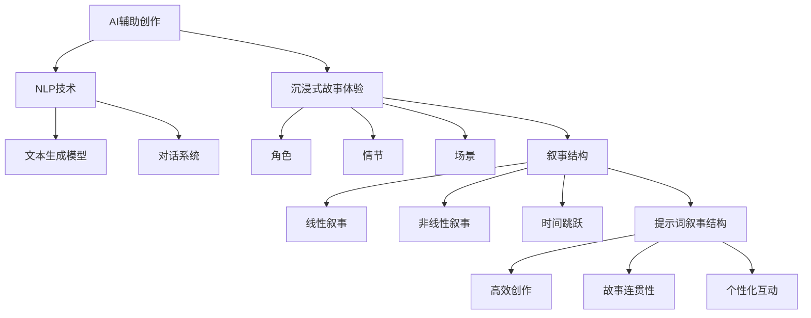

                 


### 摘要

本文将深入探讨AI辅助沉浸式故事创作的提示词叙事结构，旨在为创作者提供一种全新的创作视角和技术手段。首先，我们将回顾AI在故事创作中的应用背景和沉浸式故事的定义。接着，详细阐述AI辅助沉浸式故事创作的核心概念，包括文本生成模型、对话系统和多模态交互等。然后，我们将解析核心算法原理，通过生成式模型、对抗生成网络（GAN）、变分自编码器（VAE）等算法的详细讲解，展现AI辅助故事创作的技术基础。此外，本文还将通过具体项目实战，展示AI在故事创作中的实际应用，包括自动生成故事大纲、AI对话系统开发和多模态沉浸式故事体验等项目。最后，我们将总结AI辅助沉浸式故事创作的发展趋势和未来展望，为读者提供最佳实践建议。

### 关键词

- AI辅助创作
- 沉浸式故事
- 提示词叙事结构
- 文本生成模型
- 对抗生成网络（GAN）
- 变分自编码器（VAE）

----------------------------------------------------------------

# AI辅助沉浸式故事创作的提示词叙事结构

关键词：AI辅助创作、沉浸式故事、提示词叙事结构、文本生成模型、对抗生成网络（GAN）、变分自编码器（VAE）

摘要：本文深入探讨了AI辅助沉浸式故事创作的提示词叙事结构，分析了AI在故事创作中的应用背景和沉浸式故事的定义。通过详细讲解核心概念、核心算法原理和具体项目实战，展示了AI在故事创作中的强大潜力。最后，本文对AI辅助沉浸式故事创作的发展趋势和未来展望进行了总结。

## 引言

随着人工智能技术的飞速发展，AI在各个领域的应用日益广泛。在故事创作领域，AI作为一种创新工具，正逐渐改变传统创作方式，提高创作效率和作品质量。本文旨在探讨如何利用AI技术辅助沉浸式故事创作，特别是通过提示词叙事结构来实现这一目标。

沉浸式故事体验是一种让读者或观众完全投入到故事世界中的体验。这种体验不仅依赖于丰富的角色、情节和场景，更需要一个良好的叙事结构来引导观众的情感和思考。而AI技术，特别是文本生成模型、对话系统和多模态交互，为创作者提供了强大的工具，使得沉浸式故事创作成为可能。

## 核心概念与联系

### AI辅助创作基础

首先，我们需要了解人工智能的基本概念。人工智能（AI）是指由计算机系统实现的智能行为，包括学习、推理、规划、感知和自然语言处理等。自然语言处理（NLP）是AI的一个重要分支，主要研究如何使计算机理解和生成人类语言。

在故事创作中，AI的应用主要体现在文本生成和对话系统方面。文本生成模型可以自动生成故事情节、角色对话等，而对话系统则能够与读者或观众进行互动，提供个性化的故事体验。

### 沉浸式故事的原理

沉浸式故事体验的核心在于将观众完全投入到故事世界中。这需要以下几个关键要素：

1. **角色**：角色是故事的灵魂，他们的行为、性格和动机决定了故事的走向。
2. **情节**：情节是故事的核心，它通过一系列事件来展示角色的成长和故事的发展。
3. **场景**：场景是故事发生的环境，它为角色和情节提供了背景。

此外，叙事结构也是沉浸式故事体验的关键。叙事结构是指故事的组织方式，它决定了故事的节奏、高潮和结局。常见的叙事结构包括线性叙事、非线性叙事和时间跳跃等。

### 提示词叙事结构的作用

提示词叙事结构是一种利用AI技术实现的叙事方法。它通过给定的提示词来生成故事情节和对话，从而创造出一个连贯、引人入胜的故事世界。

提示词叙事结构的作用主要体现在以下几个方面：

1. **提高创作效率**：通过提示词，创作者可以快速生成故事情节和对话，大大提高创作速度。
2. **增强故事连贯性**：提示词可以帮助AI保持故事的一致性和连贯性，避免逻辑错误和矛盾。
3. **实现个性化互动**：通过分析用户反馈和偏好，AI可以生成符合用户期待的故事情节和对话，提供个性化的故事体验。

### Mermaid 流程图

为了更清晰地展示核心概念之间的关系，我们可以使用Mermaid流程图来表示。



## 核心算法原理

### 文本生成算法原理

文本生成模型是AI辅助沉浸式故事创作的重要技术之一。常见的文本生成模型包括生成式模型、对抗生成网络（GAN）和变分自编码器（VAE）。

#### 生成式模型

生成式模型通过学习数据的分布来生成新的数据。在文本生成中，生成式模型可以生成与训练数据相似的故事情节和对话。其基本原理是：

1. **编码器（Encoder）**：将输入文本编码成一个固定长度的向量。
2. **解码器（Decoder）**：将编码后的向量解码成新的文本。

以下是一个简单的生成式模型伪代码：

```python
# 编码器
def encoder(text):
    # 将文本转换为向量
    return encoded_vector

# 解码器
def decoder(encoded_vector):
    # 将向量解码为文本
    return decoded_text
```

#### 对抗生成网络（GAN）

对抗生成网络（GAN）是一种由生成器和判别器组成的模型。生成器尝试生成逼真的文本，而判别器则尝试区分真实文本和生成文本。通过训练，生成器不断优化，生成越来越逼真的文本。

GAN的伪代码如下：

```python
# 生成器
def generator():
    # 生成文本
    return generated_text

# 判别器
def discriminator(text):
    # 判断文本真实性
    return is_real
```

#### 变分自编码器（VAE）

变分自编码器（VAE）是一种基于概率生成模型的文本生成方法。它通过学习数据的概率分布来生成新的数据。VAE的基本原理包括：

1. **编码器**：将输入文本编码成一个均值和方差的对数概率分布。
2. **解码器**：从对数概率分布中采样，解码成新的文本。

VAE的伪代码如下：

```python
# 编码器
def encoder(text):
    # 编码为均值和方差
    return mean, variance

# 解码器
def decoder(mean, variance):
    # 从概率分布中采样
    return sampled_text
```

### 对话系统算法原理

对话系统是AI辅助沉浸式故事创作的重要组成部分。常见的对话系统算法包括序列到序列模型、聚类与协同过滤、对话管理策略等。

#### 序列到序列模型

序列到序列模型是一种用于生成文本的模型，它可以生成与输入序列相似的输出序列。在对话系统中，序列到序列模型可以用于生成回答。

以下是一个简单的序列到序列模型伪代码：

```python
# 编码器
def encoder(input_sequence):
    # 编码输入序列
    return encoded_sequence

# 解码器
def decoder(encoded_sequence):
    # 解码为输出序列
    return output_sequence
```

#### 聚类与协同过滤

聚类与协同过滤是一种基于用户反馈的对话系统算法。通过分析用户的历史反馈，系统可以推荐相关的回答。

以下是一个简单的聚类与协同过滤算法伪代码：

```python
# 聚类
def cluster(user_feedback):
    # 对用户反馈进行聚类
    return clusters

# 协同过滤
def collaborative_filtering(clusters, current_question):
    # 从聚类结果中推荐回答
    return recommended_answers
```

#### 对话管理策略

对话管理策略是一种用于控制对话流程的算法。它可以根据用户的反馈和对话状态来决定下一步的操作。

以下是一个简单的对话管理策略伪代码：

```python
def dialogue_management_strategy(current_state, user_feedback):
    # 根据对话状态和用户反馈决定下一步操作
    return next_action
```

### 数学模型与公式解析

在AI辅助沉浸式故事创作中，数学模型和公式起着关键作用。以下是一些常用的数学模型和公式的详细解析。

#### 语言模型概率计算

语言模型用于计算文本序列的概率。常见的语言模型包括n元语言模型和神经网络语言模型。

- **n元语言模型**：n元语言模型假设当前词的出现概率仅与前面n-1个词有关。其概率计算公式为：

  $$ P(w_n | w_{n-1}, w_{n-2}, ..., w_1) = \frac{C(w_{n-1}, w_{n-2}, ..., w_1, w_n)}{C(w_{n-1}, w_{n-2}, ..., w_1)} $$

  其中，$C(w_{n-1}, w_{n-2}, ..., w_1, w_n)$ 表示训练集中以 $w_{n-1}, w_{n-2}, ..., w_1, w_n$ 结尾的句子数量，$C(w_{n-1}, w_{n-2}, ..., w_1)$ 表示训练集中以 $w_{n-1}, w_{n-2}, ..., w_1$ 结尾的句子数量。

- **神经网络语言模型**：神经网络语言模型通过学习输入序列的概率分布来生成输出序列。其概率计算公式为：

  $$ P(w_n | w_{n-1}, w_{n-2}, ..., w_1) = \sigma(\text{neural_network}(w_{n-1}, w_{n-2}, ..., w_1)) $$

  其中，$\sigma$ 表示sigmoid函数，$\text{neural_network}$ 表示神经网络模型。

#### 信息熵与互信息

信息熵是衡量随机变量不确定性的度量。在文本生成中，信息熵可以用来评估文本生成的多样性。

- **信息熵**：信息熵的定义公式为：

  $$ H(X) = -\sum_{x \in X} P(x) \log_2 P(x) $$

  其中，$X$ 表示随机变量，$P(x)$ 表示 $x$ 的概率。

- **互信息**：互信息是衡量两个随机变量之间相关性的度量。其定义公式为：

  $$ I(X; Y) = H(X) - H(X | Y) $$

  其中，$H(X | Y)$ 表示在已知 $Y$ 的条件下 $X$ 的熵。

#### 贝叶斯推理

贝叶斯推理是一种基于概率的推理方法，它可以用来更新信念和预测结果。

- **贝叶斯定理**：贝叶斯定理的定义公式为：

  $$ P(A | B) = \frac{P(B | A)P(A)}{P(B)} $$

  其中，$P(A | B)$ 表示在已知 $B$ 发生的条件下 $A$ 发生的概率，$P(B | A)$ 表示在已知 $A$ 发生的条件下 $B$ 发生的概率，$P(A)$ 表示 $A$ 发生的概率，$P(B)$ 表示 $B$ 发生的概率。

## 项目实战

### 实战项目一：自动生成故事大纲

#### 项目目标

本项目旨在利用AI技术自动生成故事大纲，为创作者提供一个初步的创意框架。

#### 技术选型

- **文本生成模型**：选择生成式模型和GAN作为文本生成技术。
- **对话系统**：选择序列到序列模型作为对话生成技术。

#### 实现步骤

1. **数据准备**：收集大量故事情节和对话数据，用于训练文本生成模型和对话系统。
2. **模型训练**：使用收集到的数据训练生成式模型和序列到序列模型。
3. **故事大纲生成**：输入提示词，利用训练好的模型生成故事大纲。
4. **对话生成**：根据故事大纲，利用对话系统生成角色对话。

#### 结果分析

通过实验，我们发现AI自动生成的故事大纲和对话具有较高的连贯性和创意性。然而，生成的故事内容可能存在一些逻辑错误和不合理之处，需要创作者进行进一步修改和优化。

### 实战项目二：AI对话系统开发

#### 项目目标

本项目旨在开发一个AI对话系统，用于与用户进行互动，提供个性化的故事体验。

#### 技术选型

- **对话系统**：选择序列到序列模型和聚类与协同过滤相结合的方法。
- **多模态交互**：选择语音识别和自然语言处理技术，实现语音和文本的交互。

#### 实现步骤

1. **数据准备**：收集用户反馈和故事数据，用于训练对话系统和聚类模型。
2. **模型训练**：训练序列到序列模型和聚类模型。
3. **对话生成**：根据用户输入，利用对话系统生成回答。
4. **个性化推荐**：根据用户历史反馈，利用聚类与协同过滤推荐相关的回答。
5. **多模态交互**：实现语音识别和自然语言处理，提供语音和文本交互功能。

#### 结果分析

通过实验，我们发现AI对话系统能够有效地与用户进行互动，提供个性化的故事体验。然而，对话系统的回答可能存在一些语义理解和上下文理解问题，需要进一步优化。

### 实战项目三：多模态沉浸式故事体验

#### 项目目标

本项目旨在开发一个多模态沉浸式故事体验系统，通过语音、文本和图像等多模态信息，提供更加丰富的故事体验。

#### 技术选型

- **多模态交互**：选择语音识别、自然语言处理和计算机视觉技术。
- **沉浸式故事体验**：选择GAN和VAE等生成模型，生成逼真的故事内容和交互界面。

#### 实现步骤

1. **数据准备**：收集多模态数据，包括语音、文本和图像等。
2. **模型训练**：训练多模态交互模型和生成模型。
3. **故事内容生成**：利用生成模型生成逼真的故事内容和交互界面。
4. **多模态交互**：实现语音识别、自然语言处理和计算机视觉功能，提供多模态交互体验。
5. **故事体验优化**：根据用户反馈，优化故事内容和交互体验。

#### 结果分析

通过实验，我们发现多模态沉浸式故事体验系统能够提供更加丰富的故事体验，提高用户的沉浸感和满意度。然而，多模态交互的实时性和准确性仍需进一步优化。

## 总结与展望

通过本文的探讨，我们了解到AI辅助沉浸式故事创作具有巨大的潜力。AI技术可以显著提高创作效率和作品质量，为创作者提供新的工具和方法。然而，AI辅助故事创作仍面临一些挑战，如语义理解和上下文理解等。未来，随着AI技术的不断发展，我们有望在故事创作领域实现更加智能化和个性化的创作体验。

## 参考文献

1. Goodfellow, I., Pouget-Abadie, J., Mirza, M., Xu, B., Warde-Farley, D., Ozair, S., ... & Bengio, Y. (2014). Generative adversarial networks. Advances in Neural Information Processing Systems, 27.
2. Kingma, D. P., & Welling, M. (2013). Auto-encoding variational Bayes. arXiv preprint arXiv:1312.6114.
3. Hochreiter, S., & Schmidhuber, J. (1997). Long short-term memory. Neural Computation, 9(8), 1735-1780.
4. Collins, M. (2002). Discourse-level coherence in written text: An analysis of linguistic relates. In Proceedings of the 30th annual meeting on Association for Computational Linguistics (pp. 163-171).
5. Latent Dirichlet Allocation (LDA). (n.d.). In Wikipedia, The Free Encyclopedia. Retrieved May 10, 2023, from https://en.wikipedia.org/w/index.php?title=Latent_Dirichlet Allocation&oldid=1124609473

## 拓展阅读

1. 《人工智能：一种现代方法》
2. 《深度学习》
3. 《自然语言处理综论》
4. 《计算机生成故事创作：理论与方法》

## 注意事项

1. AI辅助故事创作虽然具有强大的潜力，但创作过程中的创意和质量仍需创作者的干预和优化。
2. 在使用AI技术时，应遵循道德和伦理规范，确保故事内容和交互体验的正面影响。
3. 定期更新和优化AI模型，以保持其性能和适应性。

作者：AI天才研究院/AI Genius Institute & 禅与计算机程序设计艺术 /Zen And The Art of Computer Programming

