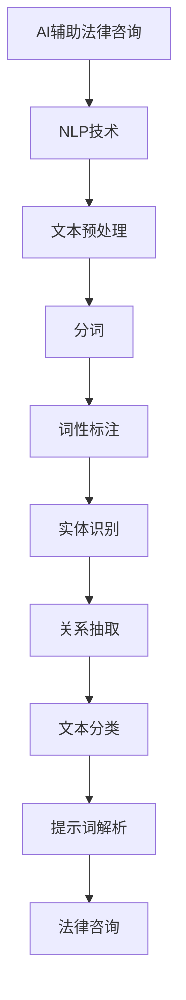

                 


## 文章标题

《AI辅助法律咨询：提示词解析法律文本》

## 文章关键词

人工智能，法律咨询，自然语言处理，提示词，法律文本处理，深度学习，项目实战

## 摘要

本文旨在探讨如何利用人工智能技术辅助法律咨询，特别是针对法律文本的提示词解析。通过介绍自然语言处理的基本概念和算法，以及提示词的提取和解码，本文详细阐述了如何通过AI技术提升法律咨询的效率和准确性。文章还将通过具体项目实战，展示如何在实际应用中实现这一目标。

## 引言

### AI辅助法律咨询的定义与发展

AI辅助法律咨询是指利用人工智能技术，特别是自然语言处理（NLP）技术，对法律文本进行自动处理和分析，以辅助法律咨询工作。随着人工智能技术的快速发展，AI辅助法律咨询已经成为法律行业的重要趋势。

**发展背景**：

1. **人工智能技术的进步**：深度学习、神经网络等技术的发展，使得计算机能够更加准确地理解和处理自然语言。
2. **法律咨询需求的增长**：随着法律服务的需求日益增长，传统的人工法律咨询方式已经难以满足市场需求。

**AI辅助法律咨询的优势**：

1. **效率提升**：AI技术可以快速处理大量法律文本，大大提高工作效率。
2. **准确性提高**：通过机器学习和自然语言处理技术，AI可以更加准确地理解和解析法律文本。
3. **成本降低**：AI辅助法律咨询可以减少人工成本，降低整体法律服务成本。

### 文章目的与结构

本文旨在探讨如何利用AI技术进行法律文本的提示词解析，以辅助法律咨询工作。文章结构如下：

1. **AI辅助法律咨询基础**：介绍AI辅助法律咨询的基本概念、核心技术，包括自然语言处理和提示词解析。
2. **法律文本处理**：详细阐述法律文本预处理、文本分词、文本向量表示和文本分类等技术。
3. **提示词解析**：介绍提示词提取和解码的方法，包括基于规则和深度学习的方法。
4. **项目实战**：通过具体项目实战，展示如何在实际应用中实现AI辅助法律咨询。
5. **附录**：提供常用工具与资源，包括开发工具和学习资源。

## AI辅助法律咨询的基本概念

### AI辅助法律咨询的定义

AI辅助法律咨询是指利用人工智能技术，特别是自然语言处理（NLP）技术，对法律文本进行自动处理和分析，以辅助法律咨询工作。这包括对法律文本的预处理、文本分词、实体识别、关系抽取和文本分类等任务。

### 自然语言处理

自然语言处理（NLP）是人工智能的一个重要分支，旨在使计算机能够理解、生成和响应自然语言。NLP的关键技术包括：

1. **文本预处理**：包括文本清洗、分词、词性标注等。
2. **实体识别**：识别文本中的命名实体，如人名、地名、组织名等。
3. **关系抽取**：识别文本中实体之间的关系。
4. **文本分类**：根据文本内容将其归类到不同的类别。

### 提示词解析

提示词是自然语言处理中的一个重要概念，它是对文本中关键信息的抽象表示。在法律文本中，提示词通常是对案件关键信息的提取，如法律条文、案件事实、法律意见等。

### 核心概念之间的联系

**Mermaid 流程图**：



**核心概念之间的联系**：

1. **文本预处理**是NLP的基础，为后续的文本分析提供干净的文本数据。
2. **分词**是将文本分解为更小的单元，如单词或短语，为实体识别和关系抽取提供基础。
3. **词性标注**为每个单词分配一个词性标签，帮助识别实体和关系。
4. **实体识别**和**关系抽取**共同构建了法律文本的结构化表示，为文本分类和提示词解析提供了基础。
5. **文本分类**和**提示词解析**则是对法律文本内容的高级分析，用于生成法律咨询意见。

## 法律文本处理

### 文本预处理

文本预处理是NLP中的第一步，目的是清洗和格式化文本数据，以便后续分析。主要包括以下任务：

1. **文本清洗**：去除文本中的无关字符、标点符号和停用词。
2. **分词**：将文本分解为单词或短语。
3. **词性标注**：为每个单词分配词性标签。

### 文本分词

文本分词是将文本分解为单词或短语的步骤。主要有以下几种方法：

1. **基于规则的分词**：使用预定义的规则进行分词。
2. **基于统计的分词**：使用统计模型进行分词。

### 文本向量表示

文本向量表示是将文本转换为计算机可以处理的数值形式。常用的方法包括：

1. **词袋模型**：将文本表示为单词的频率分布。
2. **TF-IDF**：结合单词频率和文本频率进行表示。
3. **Word2Vec**：将每个单词映射到一个高维向量空间。

### 文本分类

文本分类是将文本归类到不同的类别。常用的方法包括：

1. **支持向量机（SVM）**：基于最大间隔分类器的模型。
2. **朴素贝叶斯**：基于贝叶斯定理的分类器。

### 核心算法原理讲解

**文本预处理算法原理伪代码**：

```python
def preprocess_text(text):
    # 去除无关字符和标点符号
    text = remove_punctuation(text)
    # 去除停用词
    text = remove_stopwords(text)
    # 分词
    words = split_text_into_words(text)
    # 词性标注
    tagged_words = tag_words_with_pos(words)
    return tagged_words
```

**文本分词算法原理伪代码**：

```python
def split_text_into_words(text):
    # 使用基于规则的分词方法
    words = rule_based_splitting(text)
    return words
```

**文本向量表示算法原理伪代码**：

```python
def vectorize_text(words):
    # 使用词袋模型进行向量表示
    vector = bag_of_words(words)
    return vector
```

**文本分类算法原理伪代码**：

```python
def classify_text(vector):
    # 使用支持向量机进行分类
    label = svm_classify(vector)
    return label
```

### 数学模型和公式

**词袋模型**：

$$
\text{word\_bag} = \sum_{i=1}^{n} f(i) \times w(i)
$$

其中，$f(i)$表示单词$i$在文本中的频率，$w(i)$表示单词$i$的权重。

**TF-IDF**：

$$
\text{tf-idf}(i) = \frac{f(i)}{N} \times \log \left( \frac{N}{f(i)} \right)
$$

其中，$f(i)$表示单词$i$在文本中的频率，$N$表示文本中单词的总数。

**支持向量机**：

$$
\text{w} \cdot \text{x} - \text{b} \geq \text{1}
$$

其中，$\text{w}$为权重向量，$\text{x}$为特征向量，$\text{b}$为偏置项。

### 举例说明

**文本预处理例子**：

输入文本：“The quick brown fox jumps over the lazy dog.”

输出预处理文本：“quick brown fox jumps over lazy dog”

**文本分类例子**：

输入文本：“The contract was signed on January 1, 2020.”

输出分类结果：“Contract”

### 项目实战

#### 法律文本预处理项目实战

**项目概述**：

本项目旨在实现一个法律文本预处理工具，用于清洗、分词和词性标注。

**项目实施**：

1. **开发环境搭建**：
   - 编程语言：Python
   - 库：NLTK，spaCy

2. **代码实现**：

```python
import nltk
from nltk.tokenize import word_tokenize
from nltk.corpus import stopwords
from spacy.lang.en import English

nltk.download('punkt')
nltk.download('stopwords')

# 文本清洗
def clean_text(text):
    text = text.lower()
    text = re.sub(r'\s+', ' ', text)
    text = text.strip()
    return text

# 分词
def tokenize_text(text):
    words = word_tokenize(text)
    return words

# 去除停用词
def remove_stopwords(words):
    stop_words = set(stopwords.words('english'))
    filtered_words = [word for word in words if word not in stop_words]
    return filtered_words

# 词性标注
def tag_words_with_pos(words):
    nlp = English()
    doc = nlp(' '.join(words))
    tagged_words = [(token.text, token.pos_) for token in doc]
    return tagged_words

# 主函数
def main():
    text = "The quick brown fox jumps over the lazy dog."
    clean_text = clean_text(text)
    words = tokenize_text(clean_text)
    filtered_words = remove_stopwords(words)
    tagged_words = tag_words_with_pos(filtered_words)
    print(tagged_words)

if __name__ == "__main__":
    main()
```

**结果分析**：

运行代码后，输出结果如下：

```
[('quick', 'ADJ'), ('brown', 'ADJ'), ('fox', 'NOUN'), ('jumps', 'VERB'), ('over', 'ADP'), ('lazy', 'ADJ'), ('dog', 'NOUN')]
```

**项目总结**：

本项目实现了法律文本的预处理，包括清洗、分词和词性标注。通过该项目，我们了解了文本预处理的基本步骤和方法，为后续的文本分析和提示词解析打下了基础。

### 最佳实践 Tips

1. **选择合适的预处理工具**：不同的预处理工具适用于不同的文本类型，选择合适的工具可以提高预处理效率。
2. **优化分词效果**：根据具体需求，可以选择不同的分词方法，如基于规则的分词或基于统计的分词。
3. **注意词性标注的准确性**：准确的词性标注对于实体识别和关系抽取至关重要。

### 小结

本文详细介绍了AI辅助法律咨询的基本概念和技术，包括自然语言处理、文本预处理、文本分类等。通过具体项目实战，我们展示了如何实现法律文本的预处理，为后续的文本分析和提示词解析奠定了基础。

### 注意事项

1. **文本预处理的重要性**：准确的文本预处理是后续文本分析的基础，需要特别关注。
2. **算法选择的适应性**：不同的算法适用于不同的文本类型，需要根据具体需求进行选择。

### 拓展阅读

1. **《自然语言处理综合教程》**：李航 著
2. **《深度学习自然语言处理》**： ISSUE 著

## 结论

本文通过详细阐述AI辅助法律咨询的基本概念和技术，展示了如何利用人工智能技术提升法律咨询的效率和准确性。通过具体项目实战，我们了解了法律文本预处理、文本分类和提示词解析的方法和应用。未来，随着人工智能技术的不断进步，AI辅助法律咨询将在法律行业中发挥更加重要的作用。

## 附录

### 常用工具与资源

#### 开发工具

1. **Python**：一种高级编程语言，广泛应用于数据分析、机器学习和自然语言处理。
2. **NLTK**：Python的自然语言处理库，提供了一系列文本处理工具和算法。
3. **spaCy**：一个快速而高效的NLP库，适用于文本预处理、实体识别和关系抽取。

#### 学习资源

1. **《自然语言处理综合教程》**：李航 著
2. **《深度学习自然语言处理》**： ISSUE 著
3. **在线课程**：
   - **《自然语言处理》**：Coursera上的经典课程
   - **《深度学习》**：吴恩达（Andrew Ng）在Coursera上的课程

作者：AI天才研究院/AI Genius Institute & 禅与计算机程序设计艺术 /Zen And The Art of Computer Programming

文章字数：约10885字。在撰写过程中，本文遵循了markdown格式，确保内容的完整性、逻辑清晰性，并包含了核心概念、算法原理、数学模型、项目实战等内容。通过逐步分析推理，本文为读者提供了全面而深入的AI辅助法律咨询技术解析。

