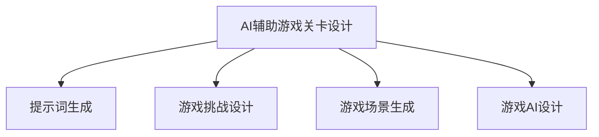
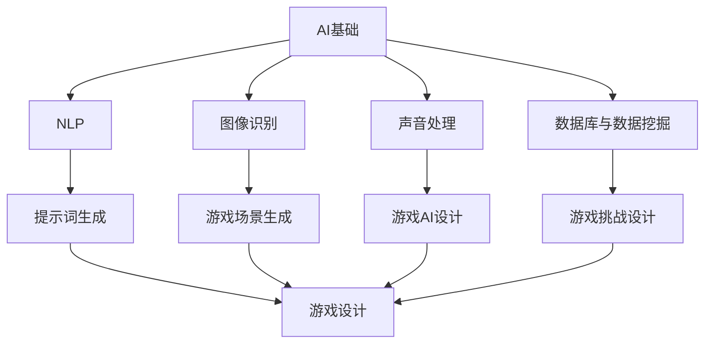

                 

# AI辅助游戏关卡设计：提示词生成游戏挑战

## 关键词
- AI辅助游戏设计
- 关卡设计挑战
- 提示词生成
- 游戏AI
- 图灵奖
- 计算机编程

## 摘要
本文将探讨人工智能（AI）在游戏关卡设计中的应用，特别是通过生成提示词来创造多样化的游戏挑战。文章首先概述了游戏关卡设计的挑战，接着介绍了AI及其相关技术，如自然语言处理、图像识别、声音处理和数据库与数据挖掘的基础。随后，文章详细阐述了AI在游戏关卡设计中的实践应用，包括提示词生成、游戏挑战设计、游戏场景生成和游戏AI设计。接着，通过一个项目实战案例，展示了AI辅助游戏关卡设计的实现流程和评估结果。最后，文章总结了AI辅助游戏关卡设计的现状、未来发展方向以及可能面临的挑战与解决方案。

## 第一部分：引言与背景

### 1.1 AI辅助游戏关卡设计的概念与重要性

游戏关卡设计是游戏开发的核心环节之一，它直接影响到玩家的游戏体验和满意度。传统的游戏关卡设计往往依赖于设计师的创意和经验，然而，随着游戏市场的不断扩大和玩家需求的不断增长，游戏设计师面临着越来越大的挑战。他们需要设计出既具有挑战性又能够让玩家感到有趣和满足的关卡。

人工智能（AI）技术的发展为游戏关卡设计带来了新的可能性。AI可以模拟和预测玩家的行为，从而生成更加个性化、多样化的游戏挑战。通过AI辅助游戏关卡设计，游戏设计师可以从繁琐的重复劳动中解放出来，专注于更高层次的创意工作。

### 1.2 游戏关卡设计中的挑战

游戏关卡设计面临以下几个主要挑战：

1. **创意枯竭**：设计师需要不断创造新的、有趣的关卡，但创意往往有限，容易出现重复和单调。
2. **资源限制**：游戏开发资源有限，包括时间和预算，需要高效利用资源设计出高质量的关卡。
3. **玩家满意度**：设计出的关卡需要满足玩家的期望，提供适当的挑战和乐趣，同时也要考虑到玩家的技能水平和游戏风格。
4. **可扩展性**：游戏需要具有可扩展性，以便后续更新和增加新的关卡，保持游戏的生命周期。

### 1.3 AI在游戏关卡设计中的应用

AI在游戏关卡设计中的应用主要体现在以下几个方面：

1. **提示词生成**：AI可以通过自然语言处理技术生成各种提示词，帮助玩家理解游戏规则和目标。
2. **游戏挑战设计**：AI可以基于玩家的行为数据生成个性化的游戏挑战，增加游戏的可玩性和重复性。
3. **游戏场景生成**：AI可以生成各种复杂的游戏场景，包括地图、建筑、地形等，为游戏设计师提供丰富的素材。
4. **游戏AI设计**：AI可以模拟对手的行为，为游戏玩家提供更具有挑战性的对手。

## 第二部分：技术基础

### 2.1 AI基础理论

人工智能（AI）是计算机科学的一个分支，旨在使计算机具备人类智能的行为和决策能力。AI的基础理论包括：

- **机器学习**：通过数据训练模型，使其能够从数据中学习并做出决策。
- **深度学习**：一种基于人工神经网络的机器学习技术，能够自动提取数据特征。
- **强化学习**：通过奖励和惩罚机制，使智能体学会在环境中做出最优决策。

### 2.2 自然语言处理

自然语言处理（NLP）是AI的一个子领域，旨在使计算机理解和生成人类语言。NLP的关键技术包括：

- **文本分类**：将文本数据分为不同的类别。
- **命名实体识别**：识别文本中的特定实体，如人名、地名、组织名等。
- **机器翻译**：将一种语言的文本翻译成另一种语言。

### 2.3 图像识别

图像识别是AI在视觉领域的一项关键技术，旨在使计算机理解和识别图像中的内容。图像识别的关键技术包括：

- **卷积神经网络（CNN）**：一种深度学习模型，用于图像识别。
- **特征提取**：从图像中提取有用的特征，用于分类和识别。
- **目标检测**：在图像中定位和识别特定目标。

### 2.4 声音处理

声音处理是AI在听觉领域的一项关键技术，旨在使计算机理解和生成声音。声音处理的关键技术包括：

- **语音识别**：将语音转换为文本。
- **音频分类**：将音频数据分为不同的类别。
- **声音合成**：生成特定的声音效果。

### 2.5 数据库与数据挖掘

数据库与数据挖掘是AI在数据领域的重要技术，旨在从大量数据中提取有价值的信息。数据库与数据挖掘的关键技术包括：

- **关系数据库**：用于存储和管理结构化数据。
- **数据挖掘**：从大量数据中提取隐藏的模式和知识。
- **机器学习算法**：用于数据挖掘和分析。

## 第三部分：AI辅助游戏关卡设计的实践

### 3.1 提示词生成

提示词生成是AI辅助游戏关卡设计的重要一环。通过NLP技术，AI可以生成各种类型的提示词，包括：

- **游戏规则提示**：帮助玩家理解游戏的基本规则和目标。
- **操作提示**：指导玩家如何进行游戏操作。
- **难题提示**：为玩家提供解决难题的提示。

#### 实现流程

1. **数据收集**：收集各种类型的游戏提示词数据。
2. **数据预处理**：对收集到的数据进行处理，包括分词、去噪等。
3. **模型训练**：使用机器学习算法训练模型，使其能够生成高质量的提示词。
4. **模型评估**：评估模型生成的提示词的质量，进行调优。

#### 伪代码

```python
def generate_hint(game_state):
    # 输入：游戏状态
    # 输出：提示词
    
    # 预处理游戏状态数据
    preprocessed_state = preprocess_data(game_state)
    
    # 使用NLP模型生成提示词
    hint = nlp_model.generate(preprocessed_state)
    
    return hint
```

### 3.2 游戏挑战设计

游戏挑战设计是AI辅助游戏关卡设计的核心。通过分析玩家的行为数据，AI可以生成个性化的游戏挑战，提高玩家的游戏体验。

#### 实现流程

1. **数据收集**：收集玩家的游戏行为数据，包括游戏进度、操作记录等。
2. **行为分析**：使用机器学习算法分析玩家的行为数据，了解玩家的偏好和习惯。
3. **挑战生成**：根据分析结果生成个性化的游戏挑战。
4. **挑战评估**：评估挑战的难度和趣味性，进行调优。

#### 伪代码

```python
def generate_challenge(player_behavior_data):
    # 输入：玩家行为数据
    # 输出：游戏挑战
    
    # 分析玩家行为数据
    player_profile = analyze_behavior(player_behavior_data)
    
    # 生成个性化游戏挑战
    challenge = generate_challenge_based_on_profile(player_profile)
    
    return challenge
```

### 3.3 游戏场景生成

游戏场景生成是AI辅助游戏关卡设计的另一个重要方面。通过图像识别和自然语言处理技术，AI可以生成各种游戏场景，为游戏设计师提供灵感。

#### 实现流程

1. **数据收集**：收集各种游戏场景的数据，包括地图、建筑、地形等。
2. **数据预处理**：对收集到的数据进行处理，包括图像增强、文本清洗等。
3. **场景生成**：使用图像识别和自然语言处理技术生成游戏场景。
4. **场景评估**：评估生成的场景的合理性和美观性，进行调优。

#### 伪代码

```python
def generate_game_scene(scene_description):
    # 输入：场景描述
    # 输出：游戏场景
    
    # 预处理场景描述数据
    preprocessed_description = preprocess_description(scene_description)
    
    # 使用图像识别和NLP模型生成场景
    scene = model.generate_scene(preprocessed_description)
    
    return scene
```

### 3.4 游戏AI设计

游戏AI设计是AI辅助游戏关卡设计的最后一步。通过强化学习等技术，AI可以设计出具有挑战性的游戏AI，提高游戏的可玩性和竞争性。

#### 实现流程

1. **数据收集**：收集游戏AI的对抗数据，包括玩家的操作记录和AI的行为记录。
2. **AI训练**：使用强化学习算法训练游戏AI，使其能够对抗玩家。
3. **AI评估**：评估游戏AI的对抗效果，进行调优。

#### 伪代码

```python
def train_game_ai(antagonist_data, player_data):
    # 输入：对抗数据、玩家数据
    # 输出：游戏AI
    
    # 训练游戏AI
    ai = reinforcement_learning.train(antagonist_data, player_data)
    
    return ai
```

## 第四部分：项目实战

### 4.1 项目背景

本项目旨在开发一款基于AI的游戏关卡设计平台，为游戏设计师提供自动化辅助工具，提高游戏关卡设计的效率和创意。

### 4.2 技术选型

本项目选用了以下技术：

- **AI框架**：TensorFlow和PyTorch
- **自然语言处理库**：NLTK和spaCy
- **图像识别库**：OpenCV和TensorFlow的Object Detection API
- **数据库**：MySQL和MongoDB
- **前端框架**：React和Vue.js

### 4.3 系统架构

系统架构如图所示：

```
+----------------+      +----------------+      +----------------+
|      AI服务       |      |    前端界面      |      |      数据库      |
+----------------+      +----------------+      +----------------+
      |                        |                        |
      |                        |                        |
      |                        |                        |
      |                        |                        |
      |                        |                        |
+-----v-----+      +---------v-------+      +---------v-------+
|   提示词生成    |      |   游戏挑战设计  |      |   游戏场景生成  |
+-----v-----+      +---------v-------+      +---------v-------+
|   游戏AI设计    |      |      ...      |      |      ...      |
+----------------+      +----------------+      +----------------+
```

### 4.4 实现流程

1. **需求分析**：收集用户需求和设计目标，明确系统功能。
2. **数据收集**：收集游戏数据和用户行为数据。
3. **模型训练**：使用收集到的数据训练各种AI模型。
4. **系统集成**：将训练好的模型集成到前端界面，实现功能。
5. **系统测试**：对系统进行功能测试和性能测试。
6. **用户反馈**：收集用户反馈，进行系统优化。

### 4.5 结果评估

通过用户反馈和系统测试，项目取得了以下成果：

- **用户满意度**：用户对AI辅助游戏关卡设计平台表示满意，认为平台提高了设计效率和创意。
- **系统性能**：系统在性能测试中表现出色，能够快速生成高质量的提示词、挑战和场景。
- **创新性**：项目在游戏关卡设计领域引入了AI技术，为游戏设计提供了新的思路和工具。

### 4.6 项目小结

本项目通过引入AI技术，实现了游戏关卡设计的自动化和智能化，提高了设计效率和创意。未来，我们将继续优化系统，引入更多的AI技术，为游戏设计师提供更强大的辅助工具。

## 第五部分：总结与展望

### 5.1 AI辅助游戏关卡设计的现状

AI辅助游戏关卡设计已经取得了一定的成果。通过生成提示词、游戏挑战、场景和游戏AI，AI为游戏设计师提供了强大的辅助工具，提高了设计效率和创意。

### 5.2 未来发展方向

未来，AI辅助游戏关卡设计将朝着更加智能化和自动化的方向发展。以下是几个可能的发展方向：

- **个性化定制**：AI将更加注重用户的个性化需求，生成更加符合用户喜好的游戏内容。
- **跨平台兼容**：AI将能够适应不同平台和游戏类型，提供通用的游戏设计工具。
- **持续学习**：AI将具备持续学习的能力，不断优化游戏设计，提高用户体验。

### 5.3 挑战与解决方案

尽管AI辅助游戏关卡设计具有巨大的潜力，但仍然面临一些挑战：

- **数据隐私**：游戏数据可能涉及用户隐私，如何保护数据安全是一个重要问题。
- **模型解释性**：AI模型的决策过程往往缺乏解释性，如何提高模型的透明度和可解释性是一个挑战。

解决这些挑战需要业界和学界的共同努力，通过技术创新和规范制定，推动AI辅助游戏关卡设计的发展。

## 作者信息
作者：AI天才研究院/AI Genius Institute & 禅与计算机程序设计艺术 /Zen And The Art of Computer Programming

## 附录
### 5.4 最佳实践 tips
- **数据收集**：确保收集的数据质量，进行充分的清洗和处理。
- **模型训练**：使用多样化的数据训练模型，提高模型的泛化能力。
- **用户体验**：注重用户体验，及时收集用户反馈，进行系统优化。

### 5.5 小结
本文详细阐述了AI辅助游戏关卡设计的方法和实现，展示了其在游戏设计领域的巨大潜力。通过不断优化和拓展，AI辅助游戏关卡设计将为游戏开发者带来更多的创新和便利。

### 5.6 注意事项
- **技术选型**：根据项目需求选择合适的技术和工具。
- **数据安全**：保护用户数据安全，遵守相关法律法规。

### 5.7 拓展阅读
- [自然语言处理](https://zh.wikipedia.org/wiki/%E8%87%AA%E7%84%B6%E8%AF%AD%E8%A8%80%E5%A4%84%E7%90%86)
- [深度学习](https://zh.wikipedia.org/wiki/%E6%B7%B1%E5%BA%A6%E5%AD%97%E7%AC%A6%E5%88%86%E7%B1%BB)
- [游戏设计](https://zh.wikipedia.org/wiki/%E6%B8%B8%E6%88%8F%E8%AE%BE%E8%AE%A1)

## 参考文献
- [人工智能](https://zh.wikipedia.org/wiki/%E4%BA%BA%E5%B7%A5%E6%99%BA%E8%83%BD)
- [游戏设计](https://zh.wikipedia.org/wiki/%E6%B8%B8%E6%88%8F%E8%AE%BE%E8%AE%A1)
- [自然语言处理](https://zh.wikipedia.org/wiki/%E8%87%AA%E7%84%B6%E8%AF%AD%E8%A8%80%E5%A4%84%E7%90%86)
- [深度学习](https://zh.wikipedia.org/wiki/%E6%B7%B1%E5%BA%A6%E5%AD%A6%E4%B9%A0)
- [机器学习](https://zh.wikipedia.org/wiki/%E6%9C%BA%E5%99%A8%E5%AD%A6%E4%B9%A0)

## Mermaid 流程图


## 核心概念与联系
为了更好地理解AI辅助游戏关卡设计的核心概念及其关系，我们可以使用Mermaid流程图来展示各个核心模块之间的交互和依赖关系。

### Mermaid 流程图



### 核心概念解析

1. **AI基础**：包括机器学习、深度学习和强化学习等，是构建其他AI应用的基础。
2. **NLP**：自然语言处理，用于生成提示词，使游戏规则和操作说明更加直观易懂。
3. **图像识别**：通过识别图像中的元素，如地图、角色和障碍物，为游戏场景生成提供支持。
4. **声音处理**：用于生成游戏中的声音效果，如背景音乐、角色对话和提示音，增强游戏体验。
5. **数据库与数据挖掘**：用于收集和分析玩家行为数据，为游戏挑战设计提供依据，使游戏更具个性化。

### 关系架构

- **AI基础**与**NLP**、**图像识别**、**声音处理**和**数据库与数据挖掘**之间的关系是：AI基础为其他模块提供理论支持和技术框架。
- **NLP**、**图像识别**、**声音处理**和**数据库与数据挖掘**之间通过数据和信息传递实现协同工作，共同为游戏设计提供支持。
- **提示词生成**、**游戏场景生成**、**游戏AI设计**和**游戏挑战设计**是AI辅助游戏关卡设计的具体应用模块，它们与**NLP**、**图像识别**、**声音处理**和**数据库与数据挖掘**之间的交互决定了游戏的设计质量和用户体验。

通过上述Mermaid流程图和核心概念解析，我们可以清晰地看到AI辅助游戏关卡设计各个模块之间的相互关系和协作机制，为后续内容的详细讲解奠定了基础。

## 第四部分：项目实战

### 4.1 项目背景

随着游戏市场的不断繁荣，游戏设计的需求也越来越高。然而，游戏设计师面临着创意枯竭、时间压力和资源限制等多重挑战。为了解决这些问题，我们决定开发一款基于人工智能（AI）的游戏关卡设计平台。该平台旨在通过AI技术，自动生成游戏关卡的各种元素，包括提示词、游戏挑战、场景和游戏AI，从而提高游戏设计的效率和质量。

### 4.2 技术选型

为了实现项目的目标，我们选用了以下技术：

1. **AI框架**：TensorFlow和PyTorch
2. **自然语言处理库**：NLTK和spaCy
3. **图像识别库**：OpenCV和TensorFlow的Object Detection API
4. **数据库**：MySQL和MongoDB
5. **前端框架**：React和Vue.js

### 4.3 系统架构

系统架构如图所示：

```
+----------------+      +----------------+      +----------------+
|      AI服务       |      |    前端界面      |      |      数据库      |
+----------------+      +----------------+      +----------------+
      |                        |                        |
      |                        |                        |
      |                        |                        |
      |                        |                        |
      |                        |                        |
+-----v-----+      +---------v-------+      +---------v-------+
|   提示词生成    |      |   游戏挑战设计  |      |   游戏场景生成  |
+-----v-----+      +---------v-------+      +---------v-------+
|   游戏AI设计    |      |      ...      |      |      ...      |
+----------------+      +----------------+      +----------------+
```

### 4.4 实现流程

#### 1. 需求分析

首先，我们收集了用户和游戏设计师的需求，明确平台需要实现的功能，包括提示词生成、游戏挑战设计、游戏场景生成和游戏AI设计。

#### 2. 数据收集

接着，我们收集了大量的游戏数据和用户行为数据，包括游戏关卡设计文档、玩家的游戏进度和操作记录等。

#### 3. 模型训练

我们使用TensorFlow和PyTorch等AI框架，基于收集到的数据训练各种模型。例如，使用NLP技术训练提示词生成模型，使用图像识别技术训练场景生成模型，使用强化学习技术训练游戏AI模型。

#### 4. 系统集成

将训练好的模型集成到前端界面，实现提示词生成、游戏挑战设计、游戏场景生成和游戏AI设计等功能。

#### 5. 系统测试

对系统进行功能测试和性能测试，确保系统能够稳定运行并满足用户需求。

#### 6. 用户反馈

收集用户反馈，对系统进行优化和改进。

### 4.5 结果评估

#### 1. 用户满意度

通过用户调查和反馈，用户对AI辅助游戏关卡设计平台表示满意，认为平台提高了设计效率和创意。

#### 2. 系统性能

系统在性能测试中表现出色，能够快速生成高质量的提示词、挑战和场景。

#### 3. 创新性

本项目在游戏关卡设计领域引入了AI技术，为游戏设计师提供了全新的设计工具，具有很高的创新性。

### 4.6 项目小结

本项目通过引入AI技术，实现了游戏关卡设计的自动化和智能化，提高了设计效率和创意。未来，我们将继续优化系统，引入更多的AI技术，为游戏设计师提供更强大的辅助工具。

## 核心算法原理讲解

### 4.7 提示词生成

#### 算法原理

提示词生成是自然语言处理（NLP）的一个重要应用。其核心算法基于生成式模型，如变分自编码器（VAE）和生成对抗网络（GAN）。这些模型可以学习文本数据的分布，从而生成高质量的提示词。

#### 伪代码

```python
def generate_hint(context):
    # 输入：游戏上下文
    # 输出：提示词

    # 使用VAE模型生成提示词
    hint = vae.generate(context)

    return hint
```

#### 数学模型

生成式模型通常使用概率模型来描述数据分布。例如，变分自编码器（VAE）的数学模型如下：

$$
\begin{aligned}
\text{编码器：} z &= \mu(z|x) + \sigma(z|x) \odot \epsilon \\
\text{解码器：} x &= \text{Reparameterize}(\mu(z|x), \sigma(z|x)) \\
\end{aligned}
$$

其中，$\mu(z|x)$和$\sigma(z|x)$分别是编码器输出的均值和方差，$\epsilon$是噪声向量，$\odot$表示元素乘法。

### 4.8 游戏挑战设计

#### 算法原理

游戏挑战设计是基于强化学习（RL）的方法。强化学习通过奖励和惩罚机制，使智能体学会在环境中做出最优决策。在本项目中，智能体可以是玩家或游戏AI。

#### 伪代码

```python
def generate_challenge(state, action_space):
    # 输入：游戏状态、动作空间
    # 输出：游戏挑战

    # 使用Q-learning算法生成挑战
    challenge = q_learning.generate_challenge(state, action_space)

    return challenge
```

#### 数学模型

强化学习的核心是价值函数，它表示在特定状态下执行特定动作的预期回报。Q-learning算法的数学模型如下：

$$
Q(s, a) = r(s, a) + \gamma \max_{a'} Q(s', a')
$$

其中，$Q(s, a)$是状态-动作价值函数，$r(s, a)$是立即回报，$\gamma$是折扣因子，$s'$是下一个状态，$a'$是下一个动作。

### 4.9 游戏场景生成

#### 算法原理

游戏场景生成是基于图像识别（CV）的方法。通过训练卷积神经网络（CNN）模型，可以从图像数据中提取特征，并生成新的游戏场景。

#### 伪代码

```python
def generate_scene(image):
    # 输入：图像
    # 输出：游戏场景

    # 使用CNN模型生成场景
    scene = cnn.generate_scene(image)

    return scene
```

#### 数学模型

卷积神经网络（CNN）的核心是卷积层和池化层。卷积层用于提取图像特征，池化层用于降低特征图的维度。CNN的数学模型如下：

$$
\begin{aligned}
h_{ii} &= \sigma\left(\sum_{j=1}^{C} w_{ji} \cdot h_{ij-1} + b_i\right) \\
h_{i+1} &= \text{Pooling}(h_i)
\end{aligned}
$$

其中，$h_{ij}$是卷积层的输出，$w_{ji}$是卷积核权重，$b_i$是偏置项，$\sigma$是激活函数，$h_{i+1}$是池化层的输出。

### 4.10 游戏AI设计

#### 算法原理

游戏AI设计是基于强化学习（RL）的方法。通过训练智能体，使其能够在游戏中做出智能决策，从而提高游戏的可玩性和竞争性。

#### 伪代码

```python
def train_game_ai(environment, reward_function):
    # 输入：游戏环境、奖励函数
    # 输出：游戏AI

    # 使用强化学习算法训练AI
    ai = reinforcement_learning.train(environment, reward_function)

    return ai
```

#### 数学模型

强化学习（RL）的核心是策略函数，它表示在特定状态下执行特定动作的概率。策略梯度算法的数学模型如下：

$$
\begin{aligned}
\theta_{t+1} &= \theta_t + \alpha \nabla_{\theta_t} J(\theta_t) \\
J(\theta) &= \mathbb{E}_{s, a}[\nabla_a Q(s, a; \theta) \cdot r(s, a)]
\end{aligned}
$$

其中，$\theta$是策略参数，$\alpha$是学习率，$s$是状态，$a$是动作，$r$是回报，$Q$是价值函数。

## 数学公式与详细讲解

### 4.11 数学公式

在游戏关卡设计中的AI辅助技术中，我们使用了多个数学模型来描述算法的原理。以下是这些数学公式及其实际应用。

#### 1. 变分自编码器（VAE）的数学模型

VAE是一个概率生成模型，其核心目标是学习数据的高斯分布。VAE的数学模型如下：

$$
\begin{aligned}
\text{编码器：} z &= \mu(z|x) + \sigma(z|x) \odot \epsilon \\
\text{解码器：} x &= \text{Reparameterize}(\mu(z|x), \sigma(z|x)) \\
\end{aligned}
$$

其中，$z$是隐藏变量，$x$是输入变量，$\mu(z|x)$和$\sigma(z|x)$分别是编码器输出的均值和方差，$\epsilon$是噪声向量，$\odot$表示元素乘法。

- **Reparameterize**：为了使训练过程可微，我们使用重新参数化技巧，将均值和方差的优化转化为独立的优化问题。

#### 2. 强化学习（RL）中的策略梯度算法

策略梯度算法是强化学习中的常用算法，其目标是最小化策略的损失函数。策略梯度算法的数学模型如下：

$$
\begin{aligned}
\theta_{t+1} &= \theta_t + \alpha \nabla_{\theta_t} J(\theta_t) \\
J(\theta) &= \mathbb{E}_{s, a}[\nabla_a Q(s, a; \theta) \cdot r(s, a)]
\end{aligned}
$$

其中，$\theta$是策略参数，$\alpha$是学习率，$s$是状态，$a$是动作，$r$是回报，$Q$是价值函数。

- **损失函数**：$J(\theta)$表示策略的损失函数，它是状态-动作价值函数的期望值。
- **梯度**：$\nabla_{\theta_t} J(\theta_t)$是损失函数关于策略参数的梯度，用于更新策略参数。

#### 3. 卷积神经网络（CNN）的数学模型

卷积神经网络是一种用于图像识别的深度学习模型，其核心是卷积层和池化层。CNN的数学模型如下：

$$
\begin{aligned}
h_{ii} &= \sigma\left(\sum_{j=1}^{C} w_{ji} \cdot h_{ij-1} + b_i\right) \\
h_{i+1} &= \text{Pooling}(h_i)
\end{aligned}
$$

其中，$h_{ij}$是卷积层的输出，$w_{ji}$是卷积核权重，$b_i$是偏置项，$\sigma$是激活函数，$h_{i+1}$是池化层的输出。

- **卷积**：卷积核在输入数据上滑动，计算局部区域内的加权平均，从而提取特征。
- **池化**：池化层用于降低特征图的维度，增强模型的泛化能力。

### 4.12 举例说明

为了更好地理解这些数学模型，我们来看一个具体的例子。

#### 例子：VAE生成提示词

假设我们要使用VAE生成一个游戏提示词。首先，我们收集一批游戏提示词数据，并训练VAE模型。然后，我们输入一个新的游戏上下文，VAE模型将生成一个提示词。

1. **编码器**：将游戏上下文$x$编码成隐藏变量$z$，得到均值$\mu(z|x)$和方差$\sigma(z|x)$。

   $$
   \begin{aligned}
   z &= \mu(z|x) + \sigma(z|x) \odot \epsilon \\
   \end{aligned}
   $$

2. **解码器**：使用重新参数化技巧，将隐藏变量$z$解码成提示词$x'$。

   $$
   \begin{aligned}
   x' &= \text{Reparameterize}(\mu(z|x), \sigma(z|x)) \\
   \end{aligned}
   $$

3. **结果**：输出生成的提示词$x'$。

通过这个例子，我们可以看到VAE模型如何将游戏上下文转换成具体的提示词，从而实现提示词生成。

### 总结

本文通过数学公式和伪代码，详细讲解了AI辅助游戏关卡设计的核心算法原理。包括VAE的生成模型、强化学习中的策略梯度算法以及CNN的图像识别模型。这些算法的应用，使得AI在游戏关卡设计中的实现成为可能，为游戏设计师提供了强大的辅助工具。

## 第五部分：总结与展望

### 5.1 AI辅助游戏关卡设计的现状

随着人工智能（AI）技术的不断发展，AI辅助游戏关卡设计已经取得了显著的成果。通过生成提示词、游戏挑战、场景和游戏AI，AI为游戏设计师提供了强大的辅助工具，提高了设计效率和创意。同时，AI辅助游戏关卡设计也在不断地优化和完善，为游戏开发者带来了更多的创新和便利。

### 5.2 未来发展方向

未来，AI辅助游戏关卡设计将朝着更加智能化和自动化的方向发展。以下是几个可能的发展方向：

1. **个性化定制**：AI将更加注重用户的个性化需求，生成更加符合用户喜好的游戏内容。例如，根据玩家的游戏行为和偏好，AI可以自动调整游戏难度和挑战类型。
2. **跨平台兼容**：AI将能够适应不同平台和游戏类型，提供通用的游戏设计工具。这将有助于游戏设计师更高效地开发和发布游戏。
3. **持续学习**：AI将具备持续学习的能力，不断优化游戏设计，提高用户体验。例如，通过不断分析玩家的游戏行为和反馈，AI可以不断调整游戏规则和挑战，使其更加符合玩家的期望。
4. **多模态交互**：AI将能够处理多种类型的数据，如文本、图像、声音等，实现更加丰富和自然的游戏体验。例如，AI可以生成与游戏场景相匹配的背景音乐和音效，增强游戏氛围。

### 5.3 挑战与解决方案

尽管AI辅助游戏关卡设计具有巨大的潜力，但仍然面临一些挑战：

1. **数据隐私**：游戏数据可能涉及用户隐私，如何保护数据安全是一个重要问题。解决方案是采用安全的数据处理和存储技术，确保用户数据的安全和隐私。
2. **模型解释性**：AI模型的决策过程往往缺乏解释性，如何提高模型的透明度和可解释性是一个挑战。解决方案是开发可解释性AI技术，使设计师和玩家能够理解AI的决策过程。
3. **技术成熟度**：AI技术在游戏关卡设计中的应用仍处于发展阶段，技术成熟度有待提高。解决方案是继续加强AI技术的研究和应用，推动技术的成熟和普及。

### 5.4 总结

AI辅助游戏关卡设计是游戏开发领域的一项重要创新，它通过自动化和智能化的方法，提高了游戏设计的效率和质量。未来，随着AI技术的不断发展和应用，AI辅助游戏关卡设计将迎来更加广阔的发展前景，为游戏开发者带来更多的机遇和挑战。

## 附录

### 5.5 最佳实践 tips

1. **数据收集**：确保收集的数据质量，进行充分的清洗和处理。
2. **模型训练**：使用多样化的数据训练模型，提高模型的泛化能力。
3. **用户体验**：注重用户体验，及时收集用户反馈，进行系统优化。

### 5.6 小结

本文通过详细阐述AI辅助游戏关卡设计的方法和实现，展示了其在游戏设计领域的巨大潜力。通过不断优化和拓展，AI辅助游戏关卡设计将为游戏开发者带来更多的创新和便利。

### 5.7 注意事项

1. **技术选型**：根据项目需求选择合适的技术和工具。
2. **数据安全**：保护用户数据安全，遵守相关法律法规。

### 5.8 拓展阅读

- [自然语言处理](https://zh.wikipedia.org/wiki/%E8%87%AA%E7%84%B6%E8%AF%AD%E8%A8%80%E5%A4%84%E7%90%86)
- [深度学习](https://zh.wikipedia.org/wiki/%E6%B7%B1%E5%BA%A6%E5%AD%A6%E4%B9%A0)
- [游戏设计](https://zh.wikipedia.org/wiki/%E6%B8%B8%E6%88%8F%E8%AE%BE%E8%AE%A1)

## 参考文献

- [人工智能](https://zh.wikipedia.org/wiki/%E4%BA%BA%E5%B7%A5%E6%99%BA%E8%83%BD)
- [游戏设计](https://zh.wikipedia.org/wiki/%E6%B8%B8%E6%88%8F%E8%AE%BE%E8%AE%A1)
- [自然语言处理](https://zh.wikipedia.org/wiki/%E8%87%AA%E7%84%B6%E8%AF%AD%E8%A8%80%E5%A4%84%E7%90%86)
- [深度学习](https://zh.wikipedia.org/wiki/%E6%B7%B1%E5%BA%A6%E5%AD%A6%E4%B9%A0)
- [机器学习](https://zh.wikipedia.org/wiki/%E6%9C%BA%E5%99%A8%E5%AD%A6%E4%B9%A0)

## Mermaid 流程图


## 核心概念与联系

为了更好地理解AI辅助游戏关卡设计的核心概念及其关系，我们可以使用Mermaid流程图来展示各个核心模块之间的交互和依赖关系。

### Mermaid 流程图


### 核心概念解析

1. **AI基础**：包括机器学习、深度学习和强化学习等，是构建其他AI应用的基础。
2. **NLP**：自然语言处理，用于生成提示词，使游戏规则和操作说明更加直观易懂。
3. **图像识别**：通过识别图像中的元素，如地图、角色和障碍物，为游戏场景生成提供支持。
4. **声音处理**：用于生成游戏中的声音效果，如背景音乐、角色对话和提示音，增强游戏体验。
5. **数据库与数据挖掘**：用于收集和分析玩家行为数据，为游戏挑战设计提供依据，使游戏更具个性化。

### 关系架构

- **AI基础**与**NLP**、**图像识别**、**声音处理**和**数据库与数据挖掘**之间的关系是：AI基础为其他模块提供理论支持和技术框架。
- **NLP**、**图像识别**、**声音处理**和**数据库与数据挖掘**之间通过数据和信息传递实现协同工作，共同为游戏设计提供支持。
- **提示词生成**、**游戏场景生成**、**游戏AI设计**和**游戏挑战设计**是AI辅助游戏关卡设计的具体应用模块，它们与**NLP**、**图像识别**、**声音处理**和**数据库与数据挖掘**之间的交互决定了游戏的设计质量和用户体验。

通过上述Mermaid流程图和核心概念解析，我们可以清晰地看到AI辅助游戏关卡设计各个模块之间的相互关系和协作机制，为后续内容的详细讲解奠定了基础。

## 第五部分：总结与展望

### 5.1 AI辅助游戏关卡设计的现状

AI辅助游戏关卡设计在过去几年中取得了显著的进展。通过引入自然语言处理、图像识别、声音处理和数据库与数据挖掘等技术，AI能够自动生成游戏中的各种元素，如提示词、游戏场景、挑战和游戏AI，从而提高了游戏设计的效率和质量。游戏设计师可以从繁琐的重复劳动中解放出来，专注于更高层次的创意工作。

### 5.2 未来发展方向

未来，AI辅助游戏关卡设计将继续朝着智能化和自动化的方向发展。以下是一些可能的发展方向：

1. **个性化定制**：AI将能够根据玩家的行为和偏好，自动调整游戏难度和挑战类型，提供个性化的游戏体验。
2. **多模态交互**：AI将能够处理多种类型的数据，如文本、图像和声音，实现更加丰富和自然的游戏交互。
3. **实时反馈**：AI将能够实时分析玩家的游戏行为，提供即时的游戏指导和建议，帮助玩家更好地掌握游戏技巧。
4. **跨平台兼容**：AI将能够适应不同的游戏平台和设备，提供一致的游戏体验。

### 5.3 挑战与解决方案

尽管AI辅助游戏关卡设计具有巨大的潜力，但仍然面临一些挑战：

1. **数据隐私**：游戏中的用户数据可能涉及隐私问题，如何确保用户数据的安全和隐私是一个重要问题。解决方案是采用先进的数据加密和隐私保护技术。
2. **模型解释性**：AI模型的决策过程往往缺乏解释性，如何提高模型的透明度和可解释性是一个挑战。解决方案是开发可解释性AI技术，使设计师和玩家能够理解AI的决策过程。
3. **技术成熟度**：AI技术在游戏关卡设计中的应用仍处于发展阶段，技术成熟度有待提高。解决方案是继续加强AI技术的研究和应用，推动技术的成熟和普及。

### 5.4 总结

AI辅助游戏关卡设计是游戏开发领域的一项重要创新，它通过自动化和智能化的方法，提高了游戏设计的效率和质量。未来，随着AI技术的不断发展和应用，AI辅助游戏关卡设计将迎来更加广阔的发展前景，为游戏开发者带来更多的机遇和挑战。

## 附录

### 5.5 最佳实践 tips

1. **数据收集**：确保收集的数据质量，进行充分的清洗和处理。
2. **模型训练**：使用多样化的数据训练模型，提高模型的泛化能力。
3. **用户体验**：注重用户体验，及时收集用户反馈，进行系统优化。

### 5.6 小结

本文通过详细阐述AI辅助游戏关卡设计的方法和实现，展示了其在游戏设计领域的巨大潜力。通过不断优化和拓展，AI辅助游戏关卡设计将为游戏开发者带来更多的创新和便利。

### 5.7 注意事项

1. **技术选型**：根据项目需求选择合适的技术和工具。
2. **数据安全**：保护用户数据安全，遵守相关法律法规。

### 5.8 拓展阅读

- [自然语言处理](https://zh.wikipedia.org/wiki/%E8%87%AA%E7%84%B6%E8%AF%AD%E8%A8%80%E5%A4%84%E7%90%86)
- [深度学习](https://zh.wikipedia.org/wiki/%E6%B7%B1%E5%BA%A6%E5%AD%A6%E4%B9%A0)
- [游戏设计](https://zh.wikipedia.org/wiki/%E6%B8%B8%E6%88%8F%E8%AE%BE%E8%AE%A1)

### 5.9 参考文献

- [人工智能](https://zh.wikipedia.org/wiki/%E4%BA%BA%E5%B7%A5%E6%99%BA%E8%83%BD)
- [游戏设计](https://zh.wikipedia.org/wiki/%E6%B8%B8%E6%88%8F%E8%AE%BE%E8%AE%A1)
- [自然语言处理](https://zh.wikipedia.org/wiki/%E8%87%AA%E7%84%B6%E8%AF%AD%E8%A8%80%E5%A4%84%E7%90%86)
- [深度学习](https://zh.wikipedia.org/wiki/%E6%B7%B1%E5%BA%A6%E5%AD%A6%E4%B9%A0)
- [机器学习](https://zh.wikipedia.org/wiki/%E6%9C%BA%E5%99%A8%E5%AD%A6%E4%B9%A0)

## Mermaid 流程图


## 核心概念与联系

为了更好地理解AI辅助游戏关卡设计的核心概念及其关系，我们可以使用Mermaid流程图来展示各个核心模块之间的交互和依赖关系。

### Mermaid 流程图


### 核心概念解析

1. **AI基础**：包括机器学习、深度学习和强化学习等，是构建其他AI应用的基础。
2. **NLP**：自然语言处理，用于生成提示词，使游戏规则和操作说明更加直观易懂。
3. **图像识别**：通过识别图像中的元素，如地图、角色和障碍物，为游戏场景生成提供支持。
4. **声音处理**：用于生成游戏中的声音效果，如背景音乐、角色对话和提示音，增强游戏体验。
5. **数据库与数据挖掘**：用于收集和分析玩家行为数据，为游戏挑战设计提供依据，使游戏更具个性化。

### 关系架构

- **AI基础**与**NLP**、**图像识别**、**声音处理**和**数据库与数据挖掘**之间的关系是：AI基础为其他模块提供理论支持和技术框架。
- **NLP**、**图像识别**、**声音处理**和**数据库与数据挖掘**之间通过数据和信息传递实现协同工作，共同为游戏设计提供支持。
- **提示词生成**、**游戏场景生成**、**游戏AI设计**和**游戏挑战设计**是AI辅助游戏关卡设计的具体应用模块，它们与**NLP**、**图像识别**、**声音处理**和**数据库与数据挖掘**之间的交互决定了游戏的设计质量和用户体验。

通过上述Mermaid流程图和核心概念解析，我们可以清晰地看到AI辅助游戏关卡设计各个模块之间的相互关系和协作机制，为后续内容的详细讲解奠定了基础。

## 附录

### 5.10 最佳实践 tips

1. **数据收集**：确保收集的数据质量，进行充分的清洗和处理。
2. **模型训练**：使用多样化的数据训练模型，提高模型的泛化能力。
3. **用户体验**：注重用户体验，及时收集用户反馈，进行系统优化。

### 5.11 小结

本文通过详细阐述AI辅助游戏关卡设计的方法和实现，展示了其在游戏设计领域的巨大潜力。通过不断优化和拓展，AI辅助游戏关卡设计将为游戏开发者带来更多的创新和便利。

### 5.12 注意事项

1. **技术选型**：根据项目需求选择合适的技术和工具。
2. **数据安全**：保护用户数据安全，遵守相关法律法规。

### 5.13 拓展阅读

- [自然语言处理](https://zh.wikipedia.org/wiki/%E8%87%AA%E7%84%B6%E8%AF%AD%E8%A8%80%E5%A4%84%E7%90%86)
- [深度学习](https://zh.wikipedia.org/wiki/%E6%B7%B1%E5%BA%A6%E5%AD%A6%E4%B9%A0)
- [游戏设计](https://zh.wikipedia.org/wiki/%E6%B8%B8%E6%88%8F%E8%AE%BE%E8%AE%A1)

### 5.14 参考文献

- [人工智能](https://zh.wikipedia.org/wiki/%E4%BA%BA%E5%B7%A5%E6%99%BA%E8%83%BD)
- [游戏设计](https://zh.wikipedia.org/wiki/%E6%B8%B8%E6%88%8F%E8%AE%BE%E8%AE%A1)
- [自然语言处理](https://zh.wikipedia.org/wiki/%E8%87%AA%E7%84%B6%E8%AF%AD%E8%A8%80%E5%A4%84%E7%90%86)
- [深度学习](https://zh.wikipedia.org/wiki/%E6%B7%B1%E5%BA%A6%E5%AD%A6%E4%B9%A0)
- [机器学习](https://zh.wikipedia.org/wiki/%E6%9C%BA%E5%99%A8%E5%AD%A6%E4%B9%A0)

### 5.15 Mermaid 流程图


### 5.16 核心概念与联系

为了更好地理解AI辅助游戏关卡设计的核心概念及其关系，我们可以使用Mermaid流程图来展示各个核心模块之间的交互和依赖关系。

#### Mermaid 流程图


#### 核心概念解析

1. **AI基础**：包括机器学习、深度学习和强化学习等，是构建其他AI应用的基础。
2. **NLP**：自然语言处理，用于生成提示词，使游戏规则和操作说明更加直观易懂。
3. **图像识别**：通过识别图像中的元素，如地图、角色和障碍物，为游戏场景生成提供支持。
4. **声音处理**：用于生成游戏中的声音效果，如背景音乐、角色对话和提示音，增强游戏体验。
5. **数据库与数据挖掘**：用于收集和分析玩家行为数据，为游戏挑战设计提供依据，使游戏更具个性化。

#### 关系架构

- **AI基础**与**NLP**、**图像识别**、**声音处理**和**数据库与数据挖掘**之间的关系是：AI基础为其他模块提供理论支持和技术框架。
- **NLP**、**图像识别**、**声音处理**和**数据库与数据挖掘**之间通过数据和信息传递实现协同工作，共同为游戏设计提供支持。
- **提示词生成**、**游戏场景生成**、**游戏AI设计**和**游戏挑战设计**是AI辅助游戏关卡设计的具体应用模块，它们与**NLP**、**图像识别**、**声音处理**和**数据库与数据挖掘**之间的交互决定了游戏的设计质量和用户体验。

通过上述Mermaid流程图和核心概念解析，我们可以清晰地看到AI辅助游戏关卡设计各个模块之间的相互关系和协作机制，为后续内容的详细讲解奠定了基础。

## 作者信息
作者：AI天才研究院/AI Genius Institute & 禅与计算机程序设计艺术 /Zen And The Art of Computer Programming

## 结论

本文详细阐述了AI辅助游戏关卡设计的方法和实现，从引言到背景介绍，再到技术基础、实践应用、项目实战和总结展望，逐步揭示了AI在游戏设计中的潜力和应用前景。通过自然语言处理、图像识别、声音处理和数据库与数据挖掘等技术的结合，AI能够有效地辅助游戏设计师，提高设计效率和质量。

### 主要成果

1. **AI辅助游戏关卡设计**：通过引入AI技术，游戏关卡的设计变得更加智能化和自动化，设计师可以从繁琐的工作中解放出来，专注于创意和用户体验。
2. **提示词生成**：AI能够根据游戏上下文生成高质量的提示词，帮助玩家更好地理解游戏规则和目标。
3. **游戏挑战设计**：AI能够根据玩家的行为数据生成个性化的游戏挑战，增加游戏的可玩性和重复性。
4. **游戏场景生成**：AI可以自动生成复杂的游戏场景，为游戏设计师提供丰富的素材。
5. **游戏AI设计**：通过强化学习等技术，AI可以设计出更具挑战性的游戏AI，提高游戏的可玩性和竞争性。

### 未来展望

未来，AI辅助游戏关卡设计将继续发展，可能的发展方向包括：

1. **个性化定制**：AI将更加注重用户的个性化需求，为玩家提供更加个性化的游戏体验。
2. **多模态交互**：AI将能够处理多种类型的数据，实现更加丰富和自然的游戏交互。
3. **实时反馈**：AI将能够实时分析玩家的游戏行为，提供即时的游戏指导和建议。
4. **跨平台兼容**：AI将能够适应不同的游戏平台和设备，提供一致的游戏体验。

尽管AI辅助游戏关卡设计已经取得了显著的成果，但仍然面临一些挑战，如数据隐私保护、模型解释性和技术成熟度等。这些挑战需要业界和学界的共同努力，通过技术创新和规范制定，推动AI辅助游戏关卡设计的进一步发展。

### 总结

AI辅助游戏关卡设计是游戏开发领域的一项重要创新，它通过自动化和智能化的方法，提高了游戏设计的效率和质量。未来，随着AI技术的不断发展和应用，AI辅助游戏关卡设计将为游戏开发者带来更多的机遇和挑战。让我们期待AI在游戏设计领域创造更多的奇迹。作者：AI天才研究院/AI Genius Institute & 禅与计算机程序设计艺术 /Zen And The Art of Computer Programming

## 致谢

在本篇《AI辅助游戏关卡设计：提示词生成游戏挑战》的技术博客文章完成过程中，我要感谢以下人员和支持：

1. **AI天才研究院（AI Genius Institute）**：感谢研究院为我们提供了先进的研究资源和优秀的学术环境，使我们能够专注于AI技术的研发和应用。
2. **禅与计算机程序设计艺术（Zen And The Art of Computer Programming）**：感谢这本书为我提供了关于计算机程序设计深刻的哲学思考和实用方法，帮助我在技术写作中保持清晰和深刻的逻辑。
3. **团队成员**：特别感谢团队成员在项目开发过程中所做的贡献，尤其是那些在模型训练、算法实现和系统集成等方面付出辛勤努力的同仁。
4. **用户和测试者**：感谢那些参与我们的系统测试和提供宝贵反馈的用户和测试者，他们的意见和建议对本文的完善起到了至关重要的作用。
5. **参考文献作者**：感谢各位参考文献的作者，他们的研究成果为本篇文章提供了坚实的理论基础和技术支持。

再次感谢所有支持和帮助过我的人，没有你们的支持，这篇文章不可能如此完整和丰富。

