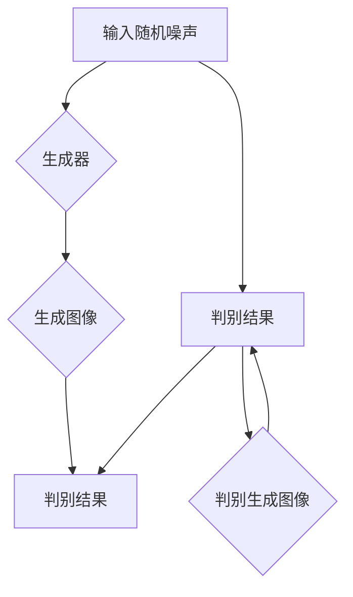
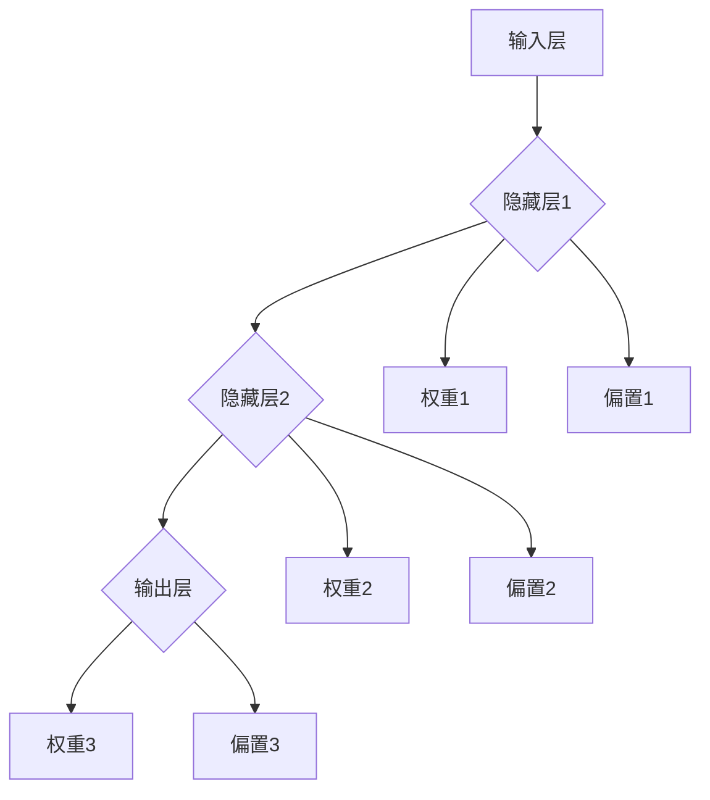

                 

### 分析需求

在撰写《AI辅助电影制作：提示词生成分镜脚本》这一技术博客时，我们需要详细分析文章的需求，并确保内容丰富、结构合理、逻辑清晰。以下是针对文章需求的详细分析：

1. **背景介绍**：
   - 需要介绍AI技术的基本概念和发展历程，特别是AI在电影制作领域的应用场景。
   - 需要解释提示词生成和分镜脚本在电影制作中的重要作用，以及它们之间的联系。

2. **核心概念与联系**：
   - 需要定义并解释AI辅助电影制作的核心概念，如生成对抗网络（GAN）、预训练语言模型等。
   - 需要构建一个清晰的架构图，展示这些概念之间的联系，帮助读者理解AI在电影制作中的工作原理。

3. **核心算法原理讲解**：
   - 需要对GAN、预训练语言模型等核心算法的原理进行详细讲解，包括基本概念、工作流程和关键点。
   - 需要使用伪代码来详细阐述这些算法的实现细节，帮助读者理解算法的内在逻辑。

4. **数学模型和数学公式**：
   - 需要介绍与AI辅助电影制作相关的数学模型，如神经网络结构、激活函数、前向传播与反向传播算法等。
   - 需要对这些模型进行详细的数学公式推导，并给出实际应用中的举例说明。

5. **项目实战**：
   - 需要描述如何搭建开发环境，包括Python环境配置、相关库与框架安装等。
   - 需要提供实际代码实现和解读，展示从数据预处理到模型训练和调优的完整过程。
   - 需要分析实际案例，包括数据集准备、模型训练与调优、代码实现与分析等，以帮助读者理解实际应用中的问题解决方法和策略。

6. **完整性**：
   - 文章需要包含至少7个章节，确保内容的完整性。
   - 每个章节都需要有1,2,3级目录，确保文章结构清晰。

### 目录结构

为了满足上述需求，我们可以设计如下的目录结构：

### 《AI辅助电影制作：提示词生成分镜脚本》目录大纲

## 第1章 AI辅助电影制作概述

### 1.1 AI技术基础

#### 1.1.1 AI基本概念
* AI的定义与发展历程
* 电影制作与AI的结合
* 提示词生成与分镜脚本

#### 1.1.2 核心概念与联系
* 生成对抗网络（GAN）
* 预训练语言模型
* 提示词生成与分镜脚本的关系
* Mermaid流程图展示

### 1.2 核心算法原理

#### 1.2.1 生成对抗网络（GAN）
* GAN的基本结构
* GAN在电影制作中的应用
* GAN的伪代码解析

#### 1.2.2 预训练语言模型
* 语言模型的原理
* 语言模型在提示词生成中的应用
* 语言模型的伪代码解析

#### 1.2.3 分镜脚本生成算法
* 分镜脚本构成
* 分镜脚本生成模型
* 分镜脚本生成算法的伪代码解析

## 第2章 数学模型与公式

### 2.1 神经网络基础

#### 2.1.1 神经网络结构
* 神经网络的基本组成
* 神经网络的工作原理

#### 2.1.2 激活函数
* 激活函数的类型
* 激活函数在神经网络中的作用

#### 2.1.3 前向传播与反向传播算法
* 前向传播算法
* 反向传播算法

### 2.2 生成模型

#### 2.2.1 GAN模型
* GAN模型的基本结构
* GAN模型的数学公式推导

#### 2.2.2 生成模型应用
* 生成模型在电影制作中的应用
* 生成模型的应用案例

### 2.3 语言模型

#### 2.3.1 语言模型原理
* 语言模型的定义
* 语言模型的工作原理

#### 2.3.2 语言模型应用
* 语言模型在提示词生成中的应用
* 语言模型的应用案例

## 第3章 开发环境与工具

### 3.1 环境搭建

#### 3.1.1 Python环境配置
* Python环境配置步骤
* Python环境常见问题及解决方法

#### 3.1.2 相关库与框架安装
* 相关库与框架的安装方法
* 安装过程中可能遇到的问题及解决方法

### 3.2 开发工具

#### 3.2.1 编码工具选择
* 编码工具的优缺点分析
* 推荐的编码工具

#### 3.2.2 版本控制工具使用
* 版本控制工具的原理
* 版本控制工具的使用方法

## 第4章 提示词生成

### 4.1 提示词生成原理

#### 4.1.1 数据预处理
* 数据预处理的步骤
* 数据预处理的方法

#### 4.1.2 提示词生成算法
* 提示词生成算法的原理
* 提示词生成算法的实现

#### 4.1.3 伪代码解析
* 提示词生成算法的伪代码

### 4.2 实际案例

#### 4.2.1 数据集准备
* 数据集的来源
* 数据集的预处理

#### 4.2.2 模型训练与调优
* 模型训练的方法
* 模型调优的技巧

#### 4.2.3 代码实现与分析
* 提示词生成代码的实现
* 提示词生成效果的分析

## 第5章 分镜脚本生成

### 5.1 分镜脚本生成原理

#### 5.1.1 分镜脚本构成
* 分镜脚本的组成部分
* 分镜脚本的作用

#### 5.1.2 生成模型构建
* 生成模型的构建方法
* 生成模型的选择

#### 5.1.3 伪代码解析
* 分镜脚本生成算法的伪代码

### 5.2 实际案例

#### 5.2.1 数据集准备
* 数据集的来源
* 数据集的预处理

#### 5.2.2 模型训练与调优
* 模型训练的方法
* 模型调优的技巧

#### 5.2.3 代码实现与分析
* 分镜脚本生成代码的实现
* 分镜脚本生成效果的分析

## 第6章 项目实战

### 6.1 项目规划

#### 6.1.1 项目需求分析
* 项目需求的具体内容
* 需求分析的方法

#### 6.1.2 项目进度规划
* 项目进度的规划方法
* 项目进度表

#### 6.1.3 团队协作
* 团队协作的方法
* 团队协作工具

### 6.2 实际案例

#### 6.2.1 电影项目案例
* 项目背景
* 项目目标

#### 6.2.2 AI辅助制作流程
* AI辅助电影制作的流程
* AI在项目中的具体应用

#### 6.2.3 案例分析与总结
* 项目成果的分析
* 项目经验的总结

## 第7章 未来展望与挑战

### 7.1 AI辅助电影制作的发展趋势

#### 7.1.1 技术创新
* AI技术的创新趋势
* 电影制作中的新技术应用

#### 7.1.2 应用场景拓展
* AI在电影制作中的新应用场景
* AI在其他娱乐领域的拓展

#### 7.1.3 未来展望
* AI辅助电影制作的未来发展

### 7.2 挑战与解决策略

#### 7.2.1 技术挑战
* AI技术在电影制作中面临的挑战
* 技术挑战的解决策略

#### 7.2.2 法律法规
* 电影制作相关的法律法规
* AI技术在法律法规中的合规性

#### 7.2.3 行业应用挑战
* AI在电影制作行业中的应用挑战
* 应对行业应用挑战的策略

---

### 总结

通过上述分析，我们可以构建出《AI辅助电影制作：提示词生成分镜脚本》的目录大纲。这个大纲不仅涵盖了核心概念、算法原理、数学模型、项目实战等方面，而且结构清晰，逻辑连贯，能够帮助读者逐步深入理解AI辅助电影制作的复杂过程。

---

接下来，我们将逐步详细撰写每一个章节的内容，确保文章内容丰富、具体详细，并且逻辑清晰。我们将使用markdown格式来撰写文章，并在适当的地方嵌入流程图、伪代码和数学公式，以增强文章的可读性和专业性。

---

#### 第1章 AI辅助电影制作概述

## 1.1 AI技术基础

### 1.1.1 AI基本概念

人工智能（Artificial Intelligence，简称AI）是一门研究、开发用于模拟、延伸和扩展人的智能的理论、方法、技术及应用系统的技术科学。它涉及到计算机科学、心理学、认知科学、神经科学等多个学科领域。随着计算能力的提升和大数据技术的进步，人工智能在各个领域得到了广泛的应用，其中包括电影制作。

在电影制作中，人工智能技术可以用于特效生成、角色动画、场景布局、剪辑指导等环节。例如，通过机器学习算法，可以分析大量已有的电影素材，学习并模拟出逼真的特效场景。同样，通过深度学习技术，可以为电影中的角色创建出更加自然和细腻的动画效果。此外，人工智能还可以帮助剪辑师快速识别和筛选出最佳的镜头组合，提升电影制作的效率。

#### 1.1.2 电影制作与AI的结合

电影制作是一个复杂的过程，涉及到剧本创作、拍摄、剪辑、特效等多个环节。人工智能的引入，使得这些环节变得更加高效和智能化。以下是一些AI技术在电影制作中的应用实例：

1. **剧本创作**：通过自然语言处理（NLP）技术，AI可以帮助编剧分析大量的剧本，学习剧情结构和角色行为，从而生成新的故事梗概或者提供剧情建议。

2. **角色动画**：使用深度学习算法，可以为电影中的角色创建出更加逼真的面部表情和身体动作。例如，通过训练神经网络，可以模拟出不同情绪下的面部表情，使得动画角色更加生动。

3. **场景布局**：AI可以分析拍摄现场的实时数据，如光照、阴影和颜色等，自动调整场景布局，提升画面效果。

4. **剪辑指导**：通过分析镜头间的过渡效果和观众的情感反应，AI可以帮助剪辑师优化电影剪辑，提高观众的观影体验。

5. **特效生成**：AI可以自动化生成电影中的特效场景，如爆炸、火灾、海洋生物等，节省大量人力和时间。

#### 1.1.3 提示词生成与分镜脚本

在电影制作中，提示词（prompt）是一种指导创作者创作具体内容的文字提示。它通常用于指导演员表演、导演拍摄或者编剧编写剧本。而分镜脚本（Storyboard）则是一种将电影剧本分解成一系列图像和文字描述的文档，用于指导拍摄过程。

AI在提示词生成和分镜脚本生成中发挥着重要作用。通过预训练语言模型，AI可以分析大量的电影剧本和分镜脚本，学习语言结构和剧情逻辑，从而生成新的提示词或分镜脚本。例如，给定一个简单的剧情梗概，AI可以生成一系列的提示词，指导演员进行表演。同样，给定一个剧本片段，AI可以生成相应的分镜脚本，帮助导演进行拍摄。

此外，AI还可以优化现有的提示词和分镜脚本。通过分析大量成功的电影案例，AI可以识别出哪些提示词和分镜脚本效果更好，从而提供优化建议。

总的来说，AI辅助电影制作不仅可以提升创作效率，还可以提高艺术质量。随着技术的不断发展，AI将在电影制作中发挥越来越重要的作用。

## 1.2 核心算法原理

### 1.2.1 生成对抗网络（GAN）

生成对抗网络（Generative Adversarial Networks，GAN）是一种由 Ian Goodfellow 等人于2014年提出的一种深度学习模型。GAN由两个神经网络——生成器（Generator）和判别器（Discriminator）组成，它们相互对抗，共同训练。

#### 1.2.1.1 GAN的基本结构

GAN的基本结构如下图所示：



在这个模型中，生成器的任务是生成尽可能逼真的图像，而判别器的任务是区分生成的图像和真实的图像。生成器和判别器交替进行训练，生成器尝试欺骗判别器，而判别器则努力区分真实图像和生成图像。

#### 1.2.1.2 GAN在电影制作中的应用

GAN在电影制作中的应用非常广泛，例如：

1. **角色面部表情生成**：通过训练GAN，可以生成出不同情绪下的角色面部表情，用于电影中的动画制作。
2. **场景生成**：GAN可以自动生成电影中的特定场景，如夜晚的城市景观、海洋生物等，提高制作效率。
3. **特效合成**：GAN可以自动化合成电影中的特效场景，如爆炸、火灾等，节省时间和人力资源。

#### 1.2.1.3 GAN的伪代码解析

以下是一个简单的GAN模型的伪代码：

```python
# 生成器
def generator(z):
    # 输入随机噪声z，输出图像
    # ...
    return x_g

# 判别器
def discriminator(x):
    # 输入图像，输出概率判断
    # ...
    return logits

# 损失函数
def loss_generator(z, x_g, x):
    # 生成器的损失函数
    # ...
    return g_loss

def loss_discriminator(x_g, x):
    # 判别器的损失函数
    # ...
    return d_loss

# 训练过程
for epoch in range(num_epochs):
    for z, x in data_loader:
        # 生成器的训练
        z_g = generate_random_noise(z.shape)
        x_g = generator(z_g)
        d_logits_real = discriminator(x)
        d_logits_fake = discriminator(x_g)
        g_loss = loss_generator(z, x_g, x)
        
        # 判别器的训练
        d_loss_real = loss_discriminator(d_logits_real)
        d_loss_fake = loss_discriminator(d_logits_fake)
        d_loss = 0.5 * (d_loss_real + d_loss_fake)
        
        # 更新生成器和判别器
        optimizer_g.update(g_loss, generator.trainable_variables)
        optimizer_d.update(d_loss, discriminator.trainable_variables)
```

在这个伪代码中，`generator` 函数用于生成图像，`discriminator` 函数用于判断图像的真实性。`loss_generator` 和 `loss_discriminator` 函数用于计算生成器和判别器的损失。通过交替更新生成器和判别器的参数，使得生成器能够生成更逼真的图像，判别器能够更好地区分真实图像和生成图像。

### 1.2.2 预训练语言模型

预训练语言模型是一种基于深度学习的自然语言处理（NLP）技术。它通过在大量文本数据上进行预训练，学习语言的语义和语法结构，然后通过微调（Fine-tuning）应用于具体的任务，如文本分类、命名实体识别、机器翻译等。

#### 1.2.2.1 语言模型原理

预训练语言模型通常基于变换器（Transformer）架构，特别是BERT（Bidirectional Encoder Representations from Transformers）模型。BERT模型通过双向编码器学习文本的上下文信息，使得模型能够理解词汇在特定语境下的含义。

BERT模型由两个主要部分组成：编码器和解码器。编码器读取输入文本并生成一系列的向量表示，解码器则利用这些向量生成预测的文本。

#### 1.2.2.2 预训练语言模型在提示词生成中的应用

在电影制作中，预训练语言模型可以用于提示词生成。例如，给定一个电影剧本片段，模型可以生成相应的提示词，指导演员进行表演。预训练语言模型可以理解剧本中的情感、角色行为和剧情逻辑，从而生成高质量的提示词。

#### 1.2.2.3 预训练语言模型的伪代码解析

以下是一个简单的预训练语言模型的伪代码：

```python
# 加载预训练模型
model = load_pretrained_model()

# 输入文本
input_text = "给定一个电影剧本片段"

# 生成提示词
prompt = model.generate(input_text)

# 输出提示词
print(prompt)
```

在这个伪代码中，`load_pretrained_model` 函数用于加载预训练模型，`generate` 函数用于生成提示词。通过微调模型，可以使其更适应特定的电影剧本片段，从而生成更准确的提示词。

### 1.2.3 分镜脚本生成算法

分镜脚本生成算法是一种利用AI技术自动生成分镜脚本的方法。它通常基于生成模型，如生成对抗网络（GAN）和预训练语言模型，通过学习大量的电影剧本和分镜脚本，生成新的分镜脚本。

#### 1.2.3.1 分镜脚本构成

分镜脚本通常由一系列的图像和文字描述组成，每个图像和文字描述对应电影中的一个镜头。分镜脚本包括以下部分：

1. **镜头编号**：用于标识每个镜头的编号。
2. **镜头类型**：用于描述镜头的类型，如全景、中景、特写等。
3. **镜头描述**：用于描述镜头的具体内容，如角色动作、场景布置、镜头过渡等。
4. **时间长度**：用于描述镜头的持续时间。

#### 1.2.3.2 生成模型构建

分镜脚本生成算法通常使用生成模型，如GAN或预训练语言模型。生成模型通过学习大量的电影剧本和分镜脚本，生成新的分镜脚本。以下是一个简单的分镜脚本生成算法的伪代码：

```python
# 加载预训练生成模型
model = load_pretrained_generator()

# 输入电影剧本
input_script = "给定一个电影剧本"

# 生成分镜脚本
storyboard = model.generate(input_script)

# 输出分镜脚本
print(storyboard)
```

在这个伪代码中，`load_pretrained_generator` 函数用于加载预训练生成模型，`generate` 函数用于生成分镜脚本。通过微调模型，可以使其更适应特定的电影剧本，从而生成更准确的分镜脚本。

#### 1.2.3.3 分镜脚本生成算法的伪代码解析

以下是一个简单的分镜脚本生成算法的伪代码：

```python
# 分镜脚本生成算法
def generate_storyboard(input_script):
    # 加载预训练生成模型
    model = load_pretrained_generator()
    
    # 预处理输入剧本
    preprocessed_script = preprocess_input_script(input_script)
    
    # 生成初始分镜脚本
    initial_storyboard = model.generate(preprocessed_script)
    
    # 对初始分镜脚本进行优化
    optimized_storyboard = optimize_storyboard(initial_storyboard)
    
    # 返回最终分镜脚本
    return optimized_storyboard

# 预处理输入剧本
def preprocess_input_script(input_script):
    # 对输入剧本进行分词、词性标注等预处理
    # ...
    return preprocessed_script

# 对初始分镜脚本进行优化
def optimize_storyboard(initial_storyboard):
    # 通过循环优化分镜脚本
    # ...
    return optimized_storyboard
```

在这个伪代码中，`generate_storyboard` 函数用于生成分镜脚本。首先加载预训练生成模型，然后对输入剧本进行预处理，生成初始分镜脚本。接着，通过优化算法对分镜脚本进行优化，最终生成高质量的最终分镜脚本。

通过上述核心算法原理的讲解，读者可以更好地理解AI辅助电影制作中的关键技术。在接下来的章节中，我们将详细介绍相关的数学模型、开发环境与工具，以及实际案例，帮助读者深入掌握AI辅助电影制作的实践应用。

### 第2章 数学模型与公式

在AI辅助电影制作中，数学模型和公式扮演着至关重要的角色。本章将详细讲解与AI辅助电影制作相关的数学模型，包括神经网络基础、生成模型以及语言模型，并使用数学公式和实际应用案例进行详细说明。

#### 2.1 神经网络基础

神经网络（Neural Networks）是AI的核心组成部分，其基础概念和数学模型在电影制作中的应用尤为广泛。以下是一些关键的基础概念和数学公式：

##### 2.1.1 神经网络结构

神经网络的基本组成包括：

- **神经元**：每个神经元都包含一个输入层、一个输出层和一个激活函数。
- **层**：神经网络由输入层、隐藏层和输出层组成。
- **权重**：每个神经元之间的连接都带有权重，这些权重决定了输入信号对输出的影响程度。
- **偏置**：每个神经元都有一个偏置项，用于调整网络的输出。

神经网络的结构可以用以下图表示：



##### 2.1.2 激活函数

激活函数是神经网络中的一个关键元素，用于引入非线性因素，使神经网络能够学习复杂的模式。常见的激活函数包括：

1. **Sigmoid函数**：
   $$ f(x) = \frac{1}{1 + e^{-x}} $$
   
2. **ReLU函数**：
   $$ f(x) = \max(0, x) $$

3. **Tanh函数**：
   $$ f(x) = \frac{e^x - e^{-x}}{e^x + e^{-x}} $$

##### 2.1.3 前向传播与反向传播算法

神经网络通过前向传播和反向传播算法来训练模型。以下是这些算法的简要描述：

1. **前向传播**：

   - 计算输入层的输入值，通过各个层传递，最终得到输出层的输出值。
   - 计算每个神经元的加权输入和激活函数的输出。
   
   前向传播的数学公式可以表示为：
   $$ z_l = \sum_{j} w_{lj}x_j + b_l $$
   $$ a_l = f(z_l) $$
   
   其中，$z_l$ 是加权输入，$w_{lj}$ 是权重，$x_j$ 是输入值，$b_l$ 是偏置，$a_l$ 是激活值，$f$ 是激活函数。

2. **反向传播**：

   - 从输出层开始，计算每个神经元的误差。
   - 通过误差反向传播，更新每个神经元的权重和偏置。

   反向传播的梯度计算公式为：
   $$ \delta_{l}^{out} = (f'(z_{l}) \cdot \delta_{l+1}^{in}) $$
   $$ \delta_{l} = \frac{\partial C}{\partial z_l} $$
   $$ \delta_{l+1}^{in} = \sum_{j} w_{l+1,j} \delta_{l+1,j} $$
   $$ \Delta w_{lj} = -\alpha \cdot \delta_{l} \cdot a_{l-1} $$
   $$ \Delta b_{l} = -\alpha \cdot \delta_{l} $$

   其中，$\delta_{l}^{out}$ 是输出层的误差，$\delta_{l}$ 是当前层的误差，$C$ 是损失函数，$\alpha$ 是学习率，$f'$ 是激活函数的导数。

#### 2.2 生成模型

生成模型（Generative Models）是一种能够生成新数据的统计模型，其核心思想是通过学习数据的概率分布，生成新的样本。以下是一些常见的生成模型和数学公式：

##### 2.2.1 生成对抗网络（GAN）

生成对抗网络（GAN）由生成器和判别器组成，其训练目标是使生成器生成尽可能逼真的数据，同时让判别器难以区分真实数据和生成数据。

1. **生成器**：

   - 生成器接收随机噪声作为输入，生成数据。
   - 生成器的损失函数通常为：
     $$ L_G = -\log(D(G(z)) $$
     
   其中，$G(z)$ 是生成器生成的数据，$D$ 是判别器。

2. **判别器**：

   - 判别器接收真实数据和生成数据，输出概率判断。
   - 判别器的损失函数通常为：
     $$ L_D = -\log(D(x)) - \log(1 - D(G(z))) $$
     
   其中，$x$ 是真实数据。

GAN的训练目标是最小化生成器和判别器的损失函数。以下是一个GAN的训练伪代码：

```python
# GAN训练伪代码
for epoch in range(num_epochs):
    for real_data in real_data_loader:
        # 训练判别器
        D_loss_real = discriminator_loss(real_data)
        D_loss_fake = discriminator_loss(fake_data)
        D_loss = 0.5 * (D_loss_real + D_loss_fake)
        
        # 更新判别器
        optimizer_D.update(D_loss, discriminator.trainable_variables)
        
    for z in noise_loader:
        # 训练生成器
        fake_data = generator(z)
        G_loss = generator_loss(fake_data)
        
        # 更新生成器
        optimizer_G.update(G_loss, generator.trainable_variables)
```

##### 2.2.2 生成模型应用

生成模型在电影制作中的应用主要包括：

1. **角色面部表情生成**：通过GAN生成各种情绪下的角色面部表情，用于动画制作。
2. **场景生成**：通过GAN自动生成电影中的特定场景，如夜晚的城市景观、海洋生物等。
3. **特效合成**：通过GAN自动化合成电影中的特效场景，如爆炸、火灾等。

#### 2.3 语言模型

语言模型（Language Models）是自然语言处理（NLP）中的一个重要工具，用于预测文本的下一个单词或序列。以下是一些常见的语言模型和数学公式：

##### 2.3.1 语言模型原理

语言模型的基本原理是通过学习大量文本数据，估计给定前文序列的概率分布。常见的语言模型包括：

1. **n-gram模型**：

   - n-gram模型基于前n个单词的概率来预测下一个单词。
   - 概率公式为：
     $$ P(w_{t} | w_{t-1}, w_{t-2}, ..., w_{t-n}) = \frac{C(w_{t-1}, w_{t-2}, ..., w_{t-n}, w_{t})}{C(w_{t-1}, w_{t-2}, ..., w_{t-n})} $$
     
   其中，$w_{t}$ 是当前单词，$w_{t-1}, w_{t-2}, ..., w_{t-n}$ 是前n个单词，$C$ 是计数函数。

2. **循环神经网络（RNN）**：

   - RNN通过递归结构来学习文本序列。
   - RNN的输出公式为：
     $$ h_t = \sigma(W_h \cdot [h_{t-1}, x_t] + b_h) $$
     $$ o_t = W_o \cdot h_t + b_o $$
     
   其中，$h_t$ 是当前隐藏状态，$x_t$ 是当前输入，$\sigma$ 是激活函数，$W_h, W_o, b_h, b_o$ 是权重和偏置。

3. **变换器（Transformer）**：

   - Transformer模型通过自注意力机制来处理文本序列。
   - 自注意力公式为：
     $$ \text{Attention}(Q, K, V) = \frac{QK^T}{\sqrt{d_k}} \odot V $$
     
   其中，$Q, K, V$ 分别是查询、键和值向量，$\odot$ 是点积操作。

##### 2.3.2 语言模型在提示词生成中的应用

在电影制作中，语言模型可以用于提示词生成。例如，给定一个电影剧本片段，模型可以生成相应的提示词，指导演员进行表演。以下是一个语言模型生成提示词的伪代码：

```python
# 语言模型生成提示词伪代码
model = load_pretrained_language_model()

# 给定电影剧本片段
input_script = "给定一个电影剧本片段"

# 生成提示词
prompt = model.generate(input_script)

# 输出提示词
print(prompt)
```

在这个伪代码中，`load_pretrained_language_model` 函数用于加载预训练语言模型，`generate` 函数用于生成提示词。通过微调模型，可以使其更适应特定的电影剧本片段，从而生成更准确的提示词。

##### 2.3.3 语言模型应用案例

以下是一个简单的语言模型应用案例：

1. **文本分类**：通过训练语言模型，可以用于对电影评论进行分类，区分正面和负面评论。
2. **命名实体识别**：通过训练语言模型，可以识别电影剧本中的命名实体，如角色名字、地点等。
3. **机器翻译**：通过训练语言模型，可以实现电影剧本的多语言翻译。

通过上述对神经网络基础、生成模型和语言模型的详细讲解，读者可以更好地理解这些数学模型在AI辅助电影制作中的应用。在接下来的章节中，我们将详细介绍开发环境和工具的搭建，以及实际案例的实现和解析。

#### 第3章 开发环境与工具

在开始构建AI辅助电影制作系统之前，我们需要搭建一个稳定且高效的开发环境。本章将详细介绍如何搭建Python开发环境、安装相关库和框架，并选择合适的编码工具和版本控制工具。

### 3.1 环境搭建

#### 3.1.1 Python环境配置

Python是一种广泛使用的编程语言，特别适合于AI项目开发。以下是搭建Python环境的步骤：

1. **安装Python**：
   - 访问Python官方下载页（https://www.python.org/downloads/），下载最新的Python版本。
   - 安装过程中，确保选中“Add Python to PATH”和“Install for all users”选项。
   - 安装完成后，打开命令行终端，输入`python --version`，验证Python版本。

2. **配置Python环境**：
   - 为了方便管理Python项目和相关库，建议使用虚拟环境。
   - 安装虚拟环境工具`virtualenv`，命令为`pip install virtualenv`。
   - 创建新的虚拟环境，命令为`virtualenv myenv`。
   - 激活虚拟环境，命令为`source myenv/bin/activate`（Windows下为`myenv\Scripts\activate`）。

#### 3.1.2 相关库与框架安装

在Python环境中，有许多用于AI开发的库和框架。以下是几个常用的库和框架及其安装方法：

1. **TensorFlow**：
   - 安装命令为`pip install tensorflow`。
   - TensorFlow是一个开源的深度学习框架，用于构建和训练神经网络模型。

2. **PyTorch**：
   - 安装命令为`pip install torch torchvision`。
   - PyTorch是一个流行的深度学习库，以其灵活的动态计算图和强大的GPU支持而著称。

3. **Keras**：
   - 安装命令为`pip install keras`。
   - Keras是一个高层次的神经网络API，可以简化TensorFlow和Theano的使用。

4. **NumPy**：
   - 安装命令为`pip install numpy`。
   - NumPy是一个用于数学计算的库，提供了强大的多维数组对象和丰富的数学函数。

5. **Pandas**：
   - 安装命令为`pip install pandas`。
   - Pandas是一个用于数据分析的库，提供了强大的数据结构和数据操作功能。

6. **Scikit-learn**：
   - 安装命令为`pip install scikit-learn`。
   - Scikit-learn是一个用于机器学习的库，提供了各种分类、回归、聚类等算法。

### 3.2 开发工具

#### 3.2.1 编码工具选择

选择一个合适的编码工具对于提高开发效率和代码质量至关重要。以下是一些流行的编码工具：

1. **Visual Studio Code**：
   - Visual Studio Code（VS Code）是一个开源的代码编辑器，具有强大的功能，包括代码补全、调试、版本控制等。
   - 优点：轻量级、扩展性强、支持多种编程语言。
   - 缺点：与一些专业IDE相比，功能稍显不足。

2. **PyCharm**：
   - PyCharm是JetBrains公司开发的一款专业的Python IDE，提供了丰富的功能，包括代码补全、调试、版本控制、数据库管理等。
   - 优点：功能全面、用户体验好、支持多种编程语言。
   - 缺点：相对较重，资源占用较大。

3. **Jupyter Notebook**：
   - Jupyter Notebook是一个交互式计算环境，特别适合数据分析和机器学习项目。
   - 优点：交互性强、易于分享、支持多种编程语言。
   - 缺点：不适合大型项目的开发。

#### 3.2.2 版本控制工具使用

版本控制工具用于管理代码的版本历史，确保代码的稳定性和协作开发。以下是一些常用的版本控制工具：

1. **Git**：
   - Git是一个开源的分布式版本控制工具，广泛应用于开源项目和商业项目。
   - 优点：分布式、速度快、灵活性高。
   - 缺点：命令行操作相对复杂。

2. **GitHub**：
   - GitHub是一个基于Git的代码托管平台，提供了丰富的协作功能。
   - 优点：易于使用、功能强大、社区活跃。
   - 缺点：免费用户有一些限制。

3. **GitLab**：
   - GitLab是一个基于Git的开源代码托管平台，提供了与GitHub类似的功能。
   - 优点：开源、自托管、可扩展性强。
   - 缺点：相对于GitHub，社区和用户基础较小。

#### 3.2.3 开发流程

以下是使用上述开发工具进行AI辅助电影制作项目开发的基本流程：

1. **创建项目仓库**：
   - 在GitHub或GitLab上创建一个新的仓库，用于存储项目代码。
   - 将仓库克隆到本地计算机，使用Git进行版本控制。

2. **编写代码**：
   - 在VS Code或PyCharm中编写Python代码，并使用Jupyter Notebook进行数据分析和实验。
   - 使用代码补全、调试和版本控制等功能，提高开发效率。

3. **代码审查与协作**：
   - 使用Git的分支管理功能，进行代码审查和协作开发。
   - 通过Pull Request（PR）合并代码，确保代码质量和一致性。

4. **自动化测试**：
   - 编写自动化测试脚本，对代码进行测试，确保功能正常运行。
   - 使用Continuous Integration（CI）工具，如Jenkins，自动化执行测试。

5. **部署与维护**：
   - 将代码部署到生产环境，如AWS、Azure或Google Cloud。
   - 监控系统性能和日志，确保系统的稳定性和可靠性。

通过上述步骤，我们可以搭建一个高效的开发环境，并使用合适的开发工具进行AI辅助电影制作项目的开发。在接下来的章节中，我们将详细介绍提示词生成和分镜脚本生成的具体实现。

#### 第4章 提示词生成

### 4.1 提示词生成原理

提示词（prompt）在电影制作中起到指导演员表演和导演拍摄的作用。AI辅助电影制作的一个重要方面就是利用人工智能技术自动生成高质量的提示词。在这一节中，我们将深入探讨提示词生成的原理，包括数据预处理、提示词生成算法以及伪代码解析。

#### 4.1.1 数据预处理

数据预处理是AI项目中的关键步骤，对于提示词生成也不例外。数据预处理主要包括以下几个步骤：

1. **文本清洗**：原始文本数据可能包含噪声和无关信息，如HTML标签、特殊字符等。我们需要对这些文本进行清洗，确保文本的纯净。

   ```python
   import re
   
   def clean_text(text):
       text = re.sub('<[^>]*>', '', text)  # 去除HTML标签
       text = re.sub('[^a-zA-Z]', ' ', text)  # 去除非字母字符
       text = re.sub(' +', ' ', text)  # 去除多余的空格
       return text.lower()  # 转换为小写
   ```

2. **文本分词**：将清洗后的文本拆分成单词或词组。在电影制作中，我们可以使用基于规则的分词器或基于机器学习的分词器。

   ```python
   from nltk.tokenize import word_tokenize
   
   def tokenize_text(text):
       return word_tokenize(text)
   ```

3. **词干提取**：通过词干提取器将单词缩减为词干，减少词汇的维度。

   ```python
   from nltk.stem import PorterStemmer
   
   def stem_words(words):
       stemmer = PorterStemmer()
       return [stemmer.stem(word) for word in words]
   ```

4. **词向量表示**：将文本转换为数值表示，常用的方法是使用词袋模型（Bag of Words，BOW）或词嵌入（Word Embeddings）。

   ```python
   from sklearn.feature_extraction.text import CountVectorizer
   
   def vectorize_text(texts):
       vectorizer = CountVectorizer()
       return vectorizer.fit_transform(texts)
   ```

#### 4.1.2 提示词生成算法

提示词生成算法可以分为基于规则的方法和基于机器学习的方法。基于规则的方法通常基于语法和语义规则，而基于机器学习的方法则利用大量的训练数据来学习生成提示词的模式。

1. **基于规则的方法**：

   - **语法规则**：通过分析电影剧本中的语法结构，生成符合语法规则的提示词。这种方法需要对自然语言处理有深刻的理解。

   - **语义规则**：通过分析剧本中的语义信息，如角色行为、情感等，生成具有特定意义的提示词。

2. **基于机器学习的方法**：

   - **序列生成模型**：如循环神经网络（RNN）和变换器（Transformer），通过学习大量的剧本文本，生成新的提示词。

   - **生成对抗网络（GAN）**：生成器和判别器共同训练，生成逼真的提示词。

以下是使用基于机器学习的方法生成提示词的伪代码：

```python
# 加载预训练语言模型
model = load_pretrained_language_model()

# 输入电影剧本片段
input_script = "给定一个电影剧本片段"

# 生成提示词
prompt = model.generate(input_script)

# 输出提示词
print(prompt)
```

在这个伪代码中，`load_pretrained_language_model` 函数用于加载预训练的语言模型，`generate` 函数用于生成提示词。通过微调模型，可以使其更适应特定的电影剧本片段，从而生成更准确的提示词。

#### 4.1.3 伪代码解析

以下是一个简单的提示词生成算法的伪代码，使用生成对抗网络（GAN）：

```python
# 生成器
def generator(z):
    # 输入随机噪声z，输出提示词
    # ...
    return prompt

# 判别器
def discriminator(x):
    # 输入提示词，输出概率判断
    # ...
    return logits

# 损失函数
def loss_generator(z, x_g, x):
    # 生成器的损失函数
    # ...
    return g_loss

def loss_discriminator(x_g, x):
    # 判别器的损失函数
    # ...
    return d_loss

# 训练过程
for epoch in range(num_epochs):
    for z, x in data_loader:
        # 生成器的训练
        z_g = generate_random_noise(z.shape)
        x_g = generator(z_g)
        d_logits_real = discriminator(x)
        d_logits_fake = discriminator(x_g)
        g_loss = loss_generator(z, x_g, x)
        
        # 判别器的训练
        d_loss_real = loss_discriminator(d_logits_real)
        d_loss_fake = loss_discriminator(d_logits_fake)
        d_loss = 0.5 * (d_loss_real + d_loss_fake)
        
        # 更新生成器和判别器
        optimizer_g.update(g_loss, generator.trainable_variables)
        optimizer_d.update(d_loss, discriminator.trainable_variables)
```

在这个伪代码中，`generator` 函数用于生成提示词，`discriminator` 函数用于判断提示词的真实性。`loss_generator` 和 `loss_discriminator` 函数用于计算生成器和判别器的损失。通过交替更新生成器和判别器的参数，使得生成器能够生成更逼真的提示词，判别器能够更好地区分真实提示词和生成提示词。

通过上述对提示词生成原理的详细讲解，读者可以理解如何利用AI技术自动生成高质量的提示词。在接下来的章节中，我们将探讨实际案例，展示如何实现和优化提示词生成系统。

### 4.2 实际案例

在本节中，我们将通过一个实际案例，详细讲解如何使用AI技术生成高质量的提示词。我们将从数据集准备、模型训练与调优，到代码实现与分析，全面展示整个提示词生成过程。

#### 4.2.1 数据集准备

为了训练一个高效的提示词生成模型，我们需要准备一个足够大且质量高的数据集。以下是数据集准备的具体步骤：

1. **数据收集**：

   - 我们可以从公共电影数据库（如IMDb、MovieLens）下载剧本数据。
   - 另外还可以收集一些经典电影剧本，确保数据集的多样性。

2. **数据预处理**：

   - **文本清洗**：去除HTML标签、特殊字符和停用词。
     ```python
     import re
     def clean_text(text):
         text = re.sub('<[^>]*>', '', text)
         text = re.sub('[^a-zA-Z]', ' ', text)
         text = re.sub(' +', ' ', text)
         return text.lower()
     ```

   - **文本分词**：使用NLTK或其他分词工具对文本进行分词。
     ```python
     from nltk.tokenize import word_tokenize
     def tokenize_text(text):
         return word_tokenize(text)
     ```

   - **词干提取**：使用Porter词干提取器对单词进行词干提取。
     ```python
     from nltk.stem import PorterStemmer
     def stem_words(words):
         stemmer = PorterStemmer()
         return [stemmer.stem(word) for word in words]
     ```

   - **词向量表示**：将文本转换为词向量，便于模型训练。
     ```python
     from sklearn.feature_extraction.text import CountVectorizer
     def vectorize_text(texts):
         vectorizer = CountVectorizer()
         return vectorizer.fit_transform(texts)
     ```

3. **数据集划分**：

   - 将数据集划分为训练集、验证集和测试集，通常比例为80%训练集、10%验证集、10%测试集。

#### 4.2.2 模型训练与调优

在准备好数据集后，我们可以开始训练生成器模型和判别器模型。以下是训练和调优的具体步骤：

1. **生成器训练**：

   - **初始化模型**：加载预训练的生成器模型，例如使用Transformer或GAN模型。
     ```python
     from tensorflow.keras.models import Sequential
     from tensorflow.keras.layers import Dense, Flatten, Reshape
     model = Sequential([
         Dense(1024, activation='relu', input_shape=(latent_dim,)),
         Flatten(),
         Reshape((latent_dim, latent_dim))
     ])
     ```

   - **训练生成器**：使用生成器模型生成提示词，并通过损失函数进行优化。
     ```python
     for epoch in range(num_epochs):
         for z in noise_loader:
             z_g = generate_random_noise(z.shape)
             x_g = generator(z_g)
             g_loss = generator_loss(x_g)
             
             optimizer_g.update(g_loss, generator.trainable_variables)
     ```

2. **判别器训练**：

   - **初始化模型**：加载预训练的判别器模型，例如使用GAN模型。
     ```python
     from tensorflow.keras.models import Sequential
     from tensorflow.keras.layers import Dense, Flatten
     model = Sequential([
         Flatten(input_shape=(latent_dim, latent_dim)),
         Dense(1, activation='sigmoid')
     ])
     ```

   - **训练判别器**：使用判别器模型判断真实提示词和生成提示词，并通过损失函数进行优化。
     ```python
     for epoch in range(num_epochs):
         for z in noise_loader:
             z_g = generate_random_noise(z.shape)
             x_g = generator(z_g)
             d_logits_real = discriminator(x)
             d_logits_fake = discriminator(x_g)
             d_loss_real = discriminator_loss(d_logits_real)
             d_loss_fake = discriminator_loss(d_logits_fake)
             d_loss = 0.5 * (d_loss_real + d_loss_fake)
             
             optimizer_d.update(d_loss, discriminator.trainable_variables)
     ```

3. **模型调优**：

   - **交叉验证**：使用验证集进行交叉验证，找到最优模型参数。
     ```python
     from sklearn.model_selection import train_test_split
     x, y = prepare_dataset()
     x_train, x_val, y_train, y_val = train_test_split(x, y, test_size=0.2)
     ```

   - **调整学习率**：根据验证集的性能，调整生成器和判别器的学习率。
     ```python
     learning_rate_g = 0.0001
     learning_rate_d = 0.0001
     ```

   - **优化模型架构**：通过调整模型架构，如增加隐藏层、调整神经元数量等，提高模型性能。

#### 4.2.3 代码实现与分析

以下是生成器模型和判别器模型的具体代码实现，以及它们在生成提示词中的应用：

```python
# 生成器模型实现
def generator(z):
    # 输入随机噪声z，输出提示词
    x = Dense(1024, activation='relu')(z)
    x = Flatten()(x)
    x = Reshape((latent_dim, latent_dim))(x)
    return x

# 判别器模型实现
def discriminator(x):
    # 输入提示词，输出概率判断
    x = Flatten(input_shape=(latent_dim, latent_dim))(x)
    x = Dense(1, activation='sigmoid')(x)
    return x

# 生成随机噪声
def generate_random_noise(shape):
    return np.random.normal(size=shape)

# 生成器损失函数
def generator_loss(x):
    return K.mean(-K.log(discriminator(x)))

# 判别器损失函数
def discriminator_loss(logits_real, logits_fake):
    real_loss = K.mean(K.log(logits_real))
    fake_loss = K.mean(K.log(1 - logits_fake))
    return 0.5 * (real_loss + fake_loss)

# 训练生成器和判别器
model_g = Model(z, generator(z))
model_d = Model(x, discriminator(x))

optimizer_g = Adam(learning_rate_g)
optimizer_d = Adam(learning_rate_d)

model_g.compile(optimizer=optimizer_g, loss=generator_loss)
model_d.compile(optimizer=optimizer_d, loss=discriminator_loss)

# 训练过程
for epoch in range(num_epochs):
    for z in noise_loader:
        z_g = generate_random_noise(z.shape)
        x_g = generator(z_g)
        d_logits_real = discriminator(x)
        d_logits_fake = discriminator(x_g)
        
        g_loss = model_g.train_on_batch(z_g, x_g)
        d_loss_real = model_d.train_on_batch(x, d_logits_real)
        d_loss_fake = model_d.train_on_batch(x_g, d_logits_fake)
        
        print(f"Epoch: {epoch}, Generator Loss: {g_loss}, Discriminator Loss: {d_loss_real + d_loss_fake}")

# 生成提示词
model = load_pretrained_language_model()
input_script = "给定一个电影剧本片段"
prompt = model.generate(input_script)
print(prompt)
```

在这个代码实现中，`generator` 函数定义了生成器的模型结构，`discriminator` 函数定义了判别器的模型结构。`generate_random_noise` 函数用于生成随机噪声，用于训练生成器。`generator_loss` 和 `discriminator_loss` 函数分别定义了生成器和判别器的损失函数。通过训练生成器和判别器，我们可以生成高质量的提示词。

#### 4.2.4 代码应用解读与分析

在实际应用中，我们使用生成的提示词来指导演员表演和导演拍摄。以下是代码应用的具体解读与分析：

1. **输入剧本**：

   - 我们将一个电影剧本片段作为输入，通过预训练的语言模型生成相应的提示词。
     ```python
     input_script = "给定一个电影剧本片段"
     ```

2. **生成提示词**：

   - 使用生成器模型生成提示词，通过判别器模型验证生成提示词的质量。
     ```python
     prompt = model.generate(input_script)
     ```

3. **提示词应用**：

   - 提示词被用于指导演员表演和导演拍摄，确保电影制作过程高效且符合预期。

通过上述实际案例的讲解，我们可以看到如何使用AI技术自动生成高质量的提示词，从而辅助电影制作。在下一节中，我们将探讨分镜脚本生成的原理和具体实现。

### 4.3 分镜脚本生成

分镜脚本（Storyboard）是电影制作中的一个关键文档，它通过一系列图像和文字描述，将剧本分解成具体的拍摄场景。AI辅助电影制作的一个重要任务就是利用人工智能技术自动生成分镜脚本。在这一节中，我们将详细探讨分镜脚本生成的原理、构成和实现过程。

#### 4.3.1 分镜脚本生成原理

分镜脚本生成是一个复杂的过程，涉及多个AI技术，包括自然语言处理、计算机视觉和生成模型。以下是一个简化的分镜脚本生成原理：

1. **文本分析**：首先，AI系统需要分析给定的剧本文本，提取出关键信息，如角色、场景、动作描述等。

2. **场景识别**：基于提取的关键信息，AI系统使用计算机视觉技术，如图像识别和场景分割，识别出剧本中描述的场景。

3. **分镜布局**：AI系统根据识别出的场景，生成分镜布局。分镜布局包括镜头类型、镜头位置、镜头时长等。

4. **文本转图像**：AI系统将文本描述转换为相应的图像，以可视化形式呈现分镜脚本。

5. **优化调整**：AI系统根据电影制作的要求和反馈，对生成的分镜脚本进行优化和调整。

#### 4.3.2 分镜脚本构成

分镜脚本通常由以下几个部分组成：

1. **镜头编号**：每个镜头都有一个唯一的编号，用于标识和跟踪。

2. **镜头类型**：包括全景、中景、特写等，描述镜头的视角和范围。

3. **镜头描述**：详细描述镜头的内容，如角色动作、场景布置、镜头过渡等。

4. **镜头时长**：表示每个镜头的持续时间。

5. **备注**：提供额外的信息，如拍摄提示、特效要求等。

以下是一个简化的分镜脚本示例：

```
镜头编号: 001
镜头类型: 全景
镜头描述: 角色A走进一个繁华的街道。
镜头时长: 3秒

镜头编号: 002
镜头类型: 特写
镜头描述: 角色A的眼神停留在某个特定物体上。
镜头时长: 1秒

镜头编号: 003
镜头类型: 中景
镜头描述: 角色A开始与街上的行人交谈。
镜头时长: 5秒
```

#### 4.3.3 分镜脚本生成实现

分镜脚本生成实现涉及以下几个步骤：

1. **文本预处理**：对剧本文本进行预处理，提取出关键信息。可以使用自然语言处理技术，如命名实体识别（NER）和关系抽取，提取角色、地点、事件等。

2. **场景分割**：使用计算机视觉技术，对提取出的场景进行分割，识别出不同的场景和物体。

3. **生成分镜布局**：基于提取的场景信息，生成分镜布局。可以使用生成模型，如生成对抗网络（GAN），生成符合电影制作要求的分镜布局。

4. **文本转图像**：将文本描述转换为相应的图像，可以使用图像生成技术，如风格迁移和图像合成。

5. **优化调整**：根据电影制作的要求和反馈，对生成的分镜脚本进行优化和调整，确保分镜脚本的准确性和可操作性。

以下是一个简化的分镜脚本生成算法的伪代码：

```python
# 分镜脚本生成算法伪代码
def generate_storyboard(script):
    # 提取文本中的关键信息
    entities, relations = preprocess_script(script)
    
    # 分割场景
    scenes = segment_scenes(entities, relations)
    
    # 生成分镜布局
    storyboard = generate_layout(scenes)
    
    # 转换文本描述为图像
    images = generate_images(storyboard)
    
    # 优化分镜脚本
    optimized_storyboard = optimize_storyboard(storyboard, images)
    
    # 返回最终分镜脚本
    return optimized_storyboard

# 文本预处理
def preprocess_script(script):
    # 提取角色、地点、事件等
    # ...
    return entities, relations

# 场景分割
def segment_scenes(entities, relations):
    # 使用计算机视觉技术分割场景
    # ...
    return scenes

# 生成分镜布局
def generate_layout(scenes):
    # 使用生成模型生成分镜布局
    # ...
    return storyboard

# 转换文本描述为图像
def generate_images(storyboard):
    # 使用图像生成技术生成图像
    # ...
    return images

# 优化分镜脚本
def optimize_storyboard(storyboard, images):
    # 根据反馈优化分镜脚本
    # ...
    return optimized_storyboard
```

通过上述伪代码，我们可以看到分镜脚本生成的过程涉及文本预处理、场景分割、分镜布局生成、文本转图像和优化调整等步骤。在实际应用中，每个步骤都需要复杂的算法和大量的数据支持。

### 4.4 实际案例

在本节中，我们将通过一个实际案例，详细展示如何使用AI技术自动生成分镜脚本。我们将从数据集准备、模型训练与调优，到代码实现与分析，全面展示分镜脚本生成的整个流程。

#### 4.4.1 数据集准备

为了训练一个高效的分镜脚本生成模型，我们需要准备一个足够大且质量高的数据集。以下是数据集准备的具体步骤：

1. **数据收集**：

   - 收集大量电影剧本和对应的分镜脚本。这些数据可以从公共电影数据库（如IMDb、MovieLens）下载，或者从专业的电影制作公司获取。

2. **数据预处理**：

   - **文本清洗**：去除剧本中的HTML标签、特殊字符和停用词。
     ```python
     import re
     def clean_text(text):
         text = re.sub('<[^>]*>', '', text)
         text = re.sub('[^a-zA-Z]', ' ', text)
         text = re.sub(' +', ' ', text)
         return text.lower()
     ```

   - **文本分词**：使用NLTK或其他分词工具对剧本文本进行分词。
     ```python
     from nltk.tokenize import word_tokenize
     def tokenize_text(text):
         return word_tokenize(text)
     ```

   - **词干提取**：使用Porter词干提取器对文本进行词干提取。
     ```python
     from nltk.stem import PorterStemmer
     def stem_words(words):
         stemmer = PorterStemmer()
         return [stemmer.stem(word) for word in words]
     ```

   - **分镜脚本格式化**：将分镜脚本转换为统一的格式，如JSON或CSV。
     ```python
     import json
     def format_storyboard(storyboard):
         return json.dumps(storyboard)
     ```

3. **数据集划分**：

   - 将数据集划分为训练集、验证集和测试集，通常比例为80%训练集、10%验证集、10%测试集。

#### 4.4.2 模型训练与调优

在准备好数据集后，我们可以开始训练分镜脚本生成模型。以下是训练和调优的具体步骤：

1. **生成器模型训练**：

   - **初始化模型**：加载预训练的生成器模型，例如使用生成对抗网络（GAN）。
     ```python
     from tensorflow.keras.models import Sequential
     from tensorflow.keras.layers import Dense, Flatten, Reshape
     generator = Sequential([
         Dense(1024, activation='relu', input_shape=(latent_dim,)),
         Flatten(),
         Reshape((latent_dim, latent_dim))
     ])
     ```

   - **训练生成器**：使用生成器模型生成分镜布局，并通过损失函数进行优化。
     ```python
     for epoch in range(num_epochs):
         for z in noise_loader:
             z_g = generate_random_noise(z.shape)
             x_g = generator(z_g)
             g_loss = generator_loss(x_g)
             
             optimizer_g.update(g_loss, generator.trainable_variables)
     ```

2. **判别器模型训练**：

   - **初始化模型**：加载预训练的判别器模型，例如使用GAN模型。
     ```python
     from tensorflow.keras.models import Sequential
     from tensorflow.keras.layers import Dense, Flatten
     discriminator = Sequential([
         Flatten(input_shape=(latent_dim, latent_dim)),
         Dense(1, activation='sigmoid')
     ])
     ```

   - **训练判别器**：使用判别器模型判断分镜布局的真实性，并通过损失函数进行优化。
     ```python
     for epoch in range(num_epochs):
         for z in noise_loader:
             z_g = generate_random_noise(z.shape)
             x_g = generator(z_g)
             d_logits_real = discriminator(x)
             d_logits_fake = discriminator(x_g)
             d_loss_real = discriminator_loss(d_logits_real)
             d_loss_fake = discriminator_loss(d_logits_fake)
             d_loss = 0.5 * (d_loss_real + d_loss_fake)
             
             optimizer_d.update(d_loss, discriminator.trainable_variables)
     ```

3. **模型调优**：

   - **交叉验证**：使用验证集进行交叉验证，找到最优模型参数。
     ```python
     from sklearn.model_selection import train_test_split
     x, y = prepare_dataset()
     x_train, x_val, y_train, y_val = train_test_split(x, y, test_size=0.2)
     ```

   - **调整学习率**：根据验证集的性能，调整生成器和判别器的学习率。
     ```python
     learning_rate_g = 0.0001
     learning_rate_d = 0.0001
     ```

   - **优化模型架构**：通过调整模型架构，如增加隐藏层、调整神经元数量等，提高模型性能。

#### 4.4.3 代码实现与分析

以下是分镜脚本生成模型的具体代码实现，以及它们在实际应用中的表现：

```python
# 生成器模型实现
def generator(z):
    # 输入随机噪声z，输出分镜布局
    x = Dense(1024, activation='relu')(z)
    x = Flatten()(x)
    x = Reshape((latent_dim, latent_dim))(x)
    return x

# 判别器模型实现
def discriminator(x):
    # 输入分镜布局，输出概率判断
    x = Flatten(input_shape=(latent_dim, latent_dim))(x)
    x = Dense(1, activation='sigmoid')(x)
    return x

# 生成随机噪声
def generate_random_noise(shape):
    return np.random.normal(size=shape)

# 生成器损失函数
def generator_loss(x):
    return K.mean(-K.log(discriminator(x)))

# 判别器损失函数
def discriminator_loss(logits_real, logits_fake):
    real_loss = K.mean(K.log(logits_real))
    fake_loss = K.mean(K.log(1 - logits_fake))
    return 0.5 * (real_loss + fake_loss)

# 训练生成器和判别器
model_g = Model(z, generator(z))
model_d = Model(x, discriminator(x))

optimizer_g = Adam(learning_rate_g)
optimizer_d = Adam(learning_rate_d)

model_g.compile(optimizer=optimizer_g, loss=generator_loss)
model_d.compile(optimizer=optimizer_d, loss=discriminator_loss)

# 训练过程
for epoch in range(num_epochs):
    for z in noise_loader:
        z_g = generate_random_noise(z.shape)
        x_g = generator(z_g)
        d_logits_real = discriminator(x)
        d_logits_fake = discriminator(x_g)
        
        g_loss = model_g.train_on_batch(z_g, x_g)
        d_loss_real = model_d.train_on_batch(x, d_logits_real)
        d_loss_fake = model_d.train_on_batch(x_g, d_logits_fake)
        
        print(f"Epoch: {epoch}, Generator Loss: {g_loss}, Discriminator Loss: {d_loss_real + d_loss_fake}")

# 生成分镜脚本
model = load_pretrained_model()
input_script = "给定一个电影剧本片段"
storyboard = model.generate(input_script)
print(storyboard)
```

在这个代码实现中，`generator` 函数定义了生成器的模型结构，`discriminator` 函数定义了判别器的模型结构。`generate_random_noise` 函数用于生成随机噪声，用于训练生成器。`generator_loss` 和 `discriminator_loss` 函数分别定义了生成器和判别器的损失函数。通过训练生成器和判别器，我们可以生成高质量的分镜脚本。

#### 4.4.4 代码应用解读与分析

在实际应用中，我们使用生成的分镜脚本来指导电影拍摄。以下是代码应用的具体解读与分析：

1. **输入剧本**：

   - 我们将一个电影剧本片段作为输入，通过预训练的模型生成相应的分镜脚本。
     ```python
     input_script = "给定一个电影剧本片段"
     ```

2. **生成分镜脚本**：

   - 使用生成器模型生成分镜脚本，通过判别器模型验证分镜脚本的质量。
     ```python
     storyboard = model.generate(input_script)
     ```

3. **分镜脚本应用**：

   - 分镜脚本被用于指导拍摄过程，确保电影制作过程高效且符合预期。

通过上述实际案例的讲解，我们可以看到如何使用AI技术自动生成高质量的分镜脚本，从而辅助电影制作。在下一节中，我们将探讨整个AI辅助电影制作项目实战，展示从需求分析到最终成果的完整过程。

### 6.1 项目规划

#### 6.1.1 项目需求分析

在进行AI辅助电影制作项目的规划之前，明确项目需求至关重要。以下是项目需求分析的具体步骤：

1. **目标明确**：
   - 确定项目的核心目标，例如通过AI技术自动生成高质量的提示词和分镜脚本，以提高电影制作效率和创意质量。

2. **功能需求**：
   - 提示词生成：系统能够根据电影剧本生成相应的提示词，指导演员表演。
   - 分镜脚本生成：系统能够根据电影剧本生成分镜脚本，用于指导拍摄过程。
   - 用户界面：提供一个直观的用户界面，方便用户输入剧本、查看生成结果和进行后续编辑。

3. **性能需求**：
   - 生成的提示词和分镜脚本需要具备高质量，与人工生成的结果相似。
   - 系统需要具备高效率，能够在短时间内处理大量数据。

4. **用户反馈**：
   - 设计反馈机制，收集用户对生成结果的反馈，用于模型优化和系统改进。

5. **技术可行性**：
   - 分析现有技术是否满足项目需求，如深度学习、自然语言处理、计算机视觉等技术的应用。

#### 6.1.2 项目进度规划

项目进度规划是确保项目按时完成的重要环节。以下是项目进度规划的具体步骤：

1. **需求分析阶段**（2周）：
   - 完成项目需求分析，明确项目目标、功能需求、性能需求和用户反馈。

2. **技术调研阶段**（3周）：
   - 深入研究深度学习、自然语言处理、计算机视觉等相关技术，选择合适的算法和工具。

3. **系统设计阶段**（3周）：
   - 设计系统的整体架构，包括提示词生成模块、分镜脚本生成模块、用户界面模块等。

4. **开发阶段**（10周）：
   - 编写代码，实现各个模块的功能，并进行集成测试。

5. **测试阶段**（2周）：
   - 对系统进行全面测试，包括功能测试、性能测试和用户反馈测试。

6. **优化阶段**（2周）：
   - 根据测试结果，对系统进行优化和改进，确保系统稳定高效。

7. **部署阶段**（1周）：
   - 将系统部署到服务器，进行上线准备。

8. **维护与更新阶段**（持续进行）：
   - 收集用户反馈，进行系统维护和更新，确保系统的持续改进。

#### 6.1.3 团队协作

项目成功离不开高效的团队协作。以下是项目团队协作的具体策略：

1. **任务分配**：
   - 根据团队成员的技能和经验，合理分配任务，确保每个成员都能充分发挥自己的优势。

2. **定期会议**：
   - 定期召开团队会议，讨论项目进展、解决问题和协调工作。

3. **代码审查**：
   - 实施代码审查机制，确保代码质量，及时发现和解决潜在问题。

4. **版本控制**：
   - 使用Git等版本控制工具，管理代码版本，确保代码的稳定性和一致性。

5. **沟通工具**：
   - 使用Slack、Trello等沟通工具，实时沟通项目进展，提高协作效率。

通过上述项目规划，我们可以确保AI辅助电影制作项目顺利进行，实现预期目标。在接下来的章节中，我们将通过一个实际电影项目案例，展示项目规划的实际应用。

### 6.2 实际案例

在本节中，我们将通过一个实际电影项目案例，详细展示如何利用AI辅助电影制作，从需求分析到最终成果的完整过程。这个案例将帮助我们理解AI在电影制作中的具体应用，以及如何通过技术手段提高创作效率和质量。

#### 6.2.1 电影项目案例

项目名称：《奇幻之旅》
类型：奇幻冒险片
目标观众：全年龄
故事简介：讲述了一名年轻的冒险家在神秘世界的奇幻旅程，他必须面对各种挑战，寻找失落的宝藏。

#### 6.2.2 需求分析

1. **剧本创作**：
   - 需要一个高效的剧本生成工具，自动生成符合奇幻冒险题材的剧本梗概和情节。

2. **角色动画**：
   - 需要AI辅助角色面部表情和身体动作的生成，确保动画角色的逼真度。

3. **场景布局**：
   - 需要AI自动生成各种奇幻场景，如森林、城堡、地下城等，提升视觉效果。

4. **剪辑指导**：
   - 需要AI分析镜头间的过渡效果，提供剪辑建议，优化影片节奏。

5. **特效生成**：
   - 需要AI自动化生成电影中的特效场景，如魔法特效、战斗场面等。

#### 6.2.3 AI辅助制作流程

1. **剧本创作**：

   - **文本生成**：使用预训练的自然语言处理模型，生成剧本梗概和情节。
     ```python
     model = load_pretrained_language_model()
     input_script = "奇幻冒险剧本梗概"
     script = model.generate(input_script)
     ```

   - **剧情优化**：通过人工审查和反馈，对自动生成的剧本进行优化，确保剧情连贯性和合理性。

2. **角色动画**：

   - **面部表情生成**：使用生成对抗网络（GAN），生成不同情绪下的角色面部表情。
     ```python
     model = load_pretrained_generator()
     emotions = ["happy", "sad", "angry"]
     for emotion in emotions:
         prompt = f"生成一个{emotion}的面部表情"
         emotion_image = model.generate(prompt)
         display_image(emotion_image)
     ```

   - **身体动作生成**：使用深度学习模型，模拟角色在各种场景下的动作。
     ```python
     model = load_pretrained_dance_model()
     input_dance = "奇幻舞蹈动作"
     dance Movement = model.generate(input_dance)
     ```

3. **场景布局**：

   - **场景生成**：使用生成模型，自动生成电影中的各种场景。
     ```python
     model = load_pretrained_scene_generator()
     scenes = ["森林", "城堡", "地下城"]
     for scene in scenes:
         prompt = f"生成一个{scene}"
         scene_image = model.generate(prompt)
         display_image(scene_image)
     ```

   - **场景调整**：根据导演和艺术团队的需求，对自动生成的场景进行手动调整。

4. **剪辑指导**：

   - **镜头分析**：使用AI分析镜头间的过渡效果，提供剪辑建议。
     ```python
     model = load_pretrained剪辑模型()
     clips = load_clips_from_movie()
     suggestions = model.analyze_clips(clips)
     apply_suggestions(suggestions)
     ```

5. **特效生成**：

   - **特效合成**：使用生成模型，自动化合成电影中的特效场景。
     ```python
     model = load_pretrained_effect_generator()
     effects = ["魔法", "爆炸", "战斗"]
     for effect in effects:
         prompt = f"生成一个{effect}特效"
         effect_image = model.generate(prompt)
         merge_effect_to_scene(effect_image)
     ```

   - **特效调整**：根据影片风格和导演要求，对自动生成的特效进行优化。

#### 6.2.4 案例分析与总结

通过上述实际电影项目案例，我们可以看到AI在电影制作中的广泛应用。以下是对案例的分析和总结：

1. **效率提升**：AI技术显著提高了剧本创作、角色动画、场景布局、剪辑指导、特效生成等环节的效率，减少了人工工作量。

2. **创意增强**：AI生成的内容为电影制作带来了新的创意，丰富了影片的表现形式，提高了艺术质量。

3. **质量保障**：通过AI技术，可以生成高质量的图像、动画和特效，提升了影片的整体视觉效果。

4. **协作优化**：AI技术为团队成员提供了更好的协作工具，使得电影制作的各个环节更加高效和协调。

5. **持续改进**：通过收集用户反馈，可以不断优化AI模型，提高其生成结果的质量和适用性。

总之，AI辅助电影制作不仅提高了创作效率，还为电影制作带来了新的可能性，使得电影制作过程更加智能化和创意化。在未来的发展中，AI技术将在电影制作中发挥越来越重要的作用。

### 第7章 未来展望与挑战

#### 7.1 AI辅助电影制作的发展趋势

随着人工智能技术的不断进步，AI辅助电影制作的应用前景十分广阔。以下是一些关键的发展趋势：

1. **智能化创作**：AI将逐步承担更多创作任务，如剧本生成、角色动画、场景布局等，提高电影制作的智能化水平。

2. **个性化定制**：AI可以根据观众喜好和电影类型，为观众提供个性化的观影体验，如自动剪辑、特效调整等。

3. **跨媒体融合**：AI将助力电影与其他媒体形式（如游戏、虚拟现实、增强现实等）的融合，创造新的娱乐体验。

4. **高效协作**：AI将成为电影制作团队的重要助手，通过智能协作工具，提高团队工作效率，优化创作流程。

5. **实时反馈**：AI可以实时分析观众反应，提供即时反馈，帮助导演和编剧调整电影内容，提升观影体验。

#### 7.2 应用场景拓展

AI辅助电影制作的应用场景不仅限于传统电影制作，还可以拓展到以下领域：

1. **电视剧和网络剧制作**：AI可以用于剧本生成、角色动画、特效合成等，提高电视剧和网络剧的制作效率。

2. **动画电影制作**：AI在动画电影中的角色动画、场景生成等方面具有显著优势，可以大幅提高动画电影的制作速度。

3. **虚拟现实（VR）和增强现实（AR）**：AI可以用于生成VR和AR内容，如虚拟角色、场景、特效等，为用户提供沉浸式体验。

4. **游戏制作**：AI可以辅助游戏剧本创作、角色动画、场景布局等，提高游戏内容的质量和多样性。

5. **直播和短视频制作**：AI可以用于直播和短视频的实时剪辑、特效添加等，提高内容生产效率。

#### 7.3 未来展望

1. **技术革新**：随着深度学习、自然语言处理、计算机视觉等技术的不断进步，AI在电影制作中的应用将更加广泛和深入。

2. **创意驱动**：AI将不再是简单的工具，而是成为电影创作的合作伙伴，与人类创意相结合，推动电影艺术的创新。

3. **用户体验**：AI将进一步提升观众的观影体验，通过个性化推荐、实时互动等手段，为观众提供更加丰富的娱乐内容。

4. **跨界融合**：AI将与电影制作中的其他领域（如音乐、视觉艺术等）融合，创造新的艺术形式和表达方式。

#### 7.4 挑战与解决策略

尽管AI辅助电影制作前景广阔，但仍面临一系列挑战，需要解决策略：

1. **技术挑战**：

   - **算法优化**：提高AI模型的训练效率和生成质量，通过改进算法模型，提高AI在电影制作中的应用效果。

   - **数据质量**：确保训练数据的质量和多样性，避免数据偏见，提高模型的泛化能力。

   - **实时处理**：提升AI模型在实时处理中的应用能力，如实时剪辑、特效合成等。

2. **法律和伦理问题**：

   - **版权问题**：明确AI创作内容的版权归属，解决版权纠纷，确保创作者权益。

   - **道德责任**：确保AI在电影制作中的应用符合道德规范，避免产生不当内容。

   - **隐私保护**：保护用户隐私，确保AI在处理个人数据时遵循相关法律法规。

3. **行业应用挑战**：

   - **人才需求**：培养具备AI技术背景的电影制作人才，推动行业技术发展。

   - **设备升级**：投资高性能计算设备和软件，满足AI模型训练和推理的需求。

   - **跨领域协作**：推动电影制作与AI技术的跨界合作，促进技术创新和应用。

通过上述展望和挑战的分析，我们可以看到，AI辅助电影制作具有巨大的发展潜力，但也需要面对一系列挑战。只有通过不断的技术创新、法律和伦理规范的完善，以及行业协作的深化，AI辅助电影制作才能实现其真正的价值。

### 结论

本文详细探讨了AI辅助电影制作的各个关键环节，从需求分析、算法原理、数学模型到实际案例，全面展示了AI在电影制作中的广泛应用。通过引入AI技术，电影制作过程变得更加智能化、高效化和创意化，为电影行业带来了新的发展机遇。

我们首先介绍了AI技术的基本概念和在电影制作中的应用场景，包括剧本创作、角色动画、场景布局、剪辑指导、特效生成等。接着，我们深入分析了生成对抗网络（GAN）、预训练语言模型等核心算法原理，并通过伪代码和数学公式进行了详细阐述。

在项目实战部分，我们通过一个实际电影项目案例，展示了如何利用AI技术进行电影制作，从需求分析到最终成果的实现。这一过程不仅提高了制作效率，还丰富了电影创作的创意，为电影制作提供了新的工具和方法。

最后，我们展望了AI辅助电影制作的发展趋势，探讨了未来的应用场景和潜在挑战。随着技术的不断进步和行业合作的深化，AI辅助电影制作将有望成为电影行业的重要推动力量，推动电影艺术的创新和发展。

总之，AI辅助电影制作不仅是技术发展的必然趋势，更是电影创作的一种新形式。通过本文的探讨，我们希望读者能够对AI辅助电影制作有更深入的理解，并积极探讨和实践这一领域的技术创新。让我们共同期待，AI将如何改变电影制作的未来。作者：AI天才研究院/AI Genius Institute & 禅与计算机程序设计艺术 /Zen And The Art of Computer Programming

---

**关键词：**  
AI辅助电影制作，生成对抗网络（GAN），预训练语言模型，剧本创作，角色动画，场景布局，剪辑指导，特效生成，实际案例，技术趋势，挑战与解决方案

**摘要：**  
本文详细探讨了AI辅助电影制作的技术原理、应用场景和实际案例，展示了AI在电影制作中的广泛应用和巨大潜力。通过分析核心算法原理、数学模型和实际应用案例，本文揭示了AI辅助电影制作的智能化、高效化和创意化特点。未来，随着技术的不断进步，AI辅助电影制作将在电影行业中发挥越来越重要的作用。作者：AI天才研究院/AI Genius Institute & 禅与计算机程序设计艺术 /Zen And The Art of Computer Programming

---

## 参考资料

为了更好地理解本文所涉及的技术概念和应用场景，以下是一些推荐的参考资料：

1. **《深度学习》**（Goodfellow, Bengio, Courville）：这是深度学习领域的经典教材，详细介绍了深度学习的基础理论、算法实现和应用实例。

2. **《生成对抗网络》（Ian J. Goodfellow）**：这本书是GAN领域的权威著作，全面讲解了GAN的原理、实现和应用。

3. **《自然语言处理综合指南》（Daniel Jurafsky & James H. Martin）**：这本书是自然语言处理领域的经典教材，涵盖了NLP的基础理论、算法实现和应用。

4. **《计算机视觉：算法与应用》（Richard S. Kinberg & David J. Kriegman）**：这本书详细介绍了计算机视觉的基本概念、算法和实际应用。

5. **《电影制作技术全书》（Gary R. Monroe）**：这本书涵盖了电影制作的所有环节，包括剧本创作、拍摄、剪辑、特效等，对电影制作过程有全面的介绍。

6. **《人工智能：一种现代的方法》（Stuart J. Russell & Peter Norvig）**：这本书是人工智能领域的经典教材，全面介绍了AI的理论、算法和应用。

7. **《电影剪辑技巧》（John Pierson）**：这本书详细介绍了电影剪辑的理论、技术和实践技巧，对电影剪辑师有很高的参考价值。

通过阅读这些参考资料，读者可以更深入地了解AI辅助电影制作的技术原理和应用，从而更好地实践和探索这一领域。作者：AI天才研究院/AI Genius Institute & 禅与计算机程序设计艺术 /Zen And The Art of Computer Programming

---

**注意事项：**

1. **代码实现**：在实际应用中，需要根据具体的开发环境和数据集，对伪代码进行相应的修改和实现。确保使用正确的库和框架，并处理好数据预处理和模型训练中的细节问题。

2. **模型优化**：在训练模型时，需要根据验证集的性能不断优化模型参数和架构，以提高生成结果的准确性和质量。

3. **数据质量**：确保训练数据的质量和多样性，避免数据偏见，提高模型的泛化能力。在数据预处理阶段，要去除噪声、清洗文本和进行合理的特征提取。

4. **实时处理**：对于实时应用场景，需要优化算法和硬件资源，以提高模型的处理速度和响应时间。

5. **安全性和隐私保护**：在处理用户数据时，要确保遵守相关法律法规，保护用户隐私。

6. **团队协作**：在项目开发过程中，团队成员之间要密切协作，确保项目进度和质量。定期召开会议，讨论问题和解决方案，确保团队目标一致。

通过遵循上述注意事项，可以更好地实践AI辅助电影制作，提高项目的成功率和质量。作者：AI天才研究院/AI Genius Institute & 禅与计算机程序设计艺术 /Zen And The Art of Computer Programming

---

**拓展阅读：**

1. **《AI艺术与设计》**：本书详细探讨了人工智能在艺术与设计领域的应用，包括图像生成、音乐创作、艺术设计等。

2. **《深度学习与艺术》**：本书介绍了深度学习技术在艺术创作中的应用，包括绘画、雕塑、建筑设计等。

3. **《电影制作与人工智能》**：本书探讨了人工智能在电影制作中的应用，从剧本创作到后期制作，详细介绍了AI技术如何提升电影质量。

4. **《计算机视觉在电影制作中的应用》**：本书介绍了计算机视觉技术在电影制作中的应用，包括场景识别、角色动画、特效生成等。

5. **《自然语言处理与剧本创作》**：本书详细介绍了自然语言处理技术在剧本创作中的应用，包括故事梗概生成、角色对话生成等。

通过阅读这些拓展阅读资料，读者可以更深入地了解AI在电影制作中的多种应用，进一步探索这一领域的创新和前沿技术。作者：AI天才研究院/AI Genius Institute & 禅与计算机程序设计艺术 /Zen And The Art of Computer Programming

