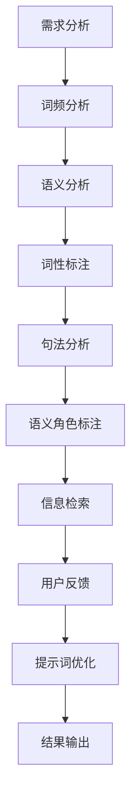

                 

### 文章标题

《AI辅助科学发现中的提示词设计》

关键词：人工智能、科学发现、提示词设计、语义理解、信息检索、推荐系统

摘要：本文深入探讨了人工智能（AI）在科学发现中应用的最新趋势，特别是提示词设计的核心作用。文章首先概述了AI辅助科学发现的背景和重要性，接着详细介绍了提示词的基本概念、类型和作用。随后，文章阐述了AI在科学发现中的应用，包括数据处理、模型训练和结果分析等。核心部分分析了提示词设计原理，包括语义理解、信息检索和推荐系统。通过实战案例，文章展示了提示词设计在科学发现中的具体应用。最后，文章总结了全书内容，并展望了AI辅助科学发现和提示词设计的未来发展方向。

----------------------------------------------------------------

### 引言

#### AI辅助科学发现的背景和重要性

随着人工智能（AI）技术的飞速发展，AI在各个领域的应用越来越广泛。在科学研究中，AI的引入不仅提高了数据处理的效率，还推动了科学发现的深度和广度。科学发现往往依赖于大量数据的分析和复杂的模型构建，而AI在这方面展现了其独特的优势。

首先，AI能够高效处理大量数据。科学研究往往需要处理海量的数据，如基因组数据、天文观测数据、气象数据等。传统的数据处理方法往往耗时耗力，而AI可以通过机器学习算法快速提取数据中的有用信息，从而加速科学发现的过程。

其次，AI能够构建复杂的模型。科学研究中的许多问题需要构建复杂的数学模型，如物理学中的量子力学模型、生物学中的神经网络模型等。AI可以通过深度学习等方法自动构建这些模型，提高研究的精度和可靠性。

此外，AI还能够在科学实验中提供智能辅助。例如，在化学实验中，AI可以通过模拟实验条件，预测实验结果，从而减少实验次数，提高实验效率。在生物学实验中，AI可以通过分析实验数据，发现潜在的生物机制，为研究提供新的方向。

总的来说，AI辅助科学发现不仅提高了科研效率，还推动了科学知识的积累和拓展。因此，深入研究AI在科学发现中的应用，特别是其中的关键环节——提示词设计，具有重要的理论和实践意义。

#### 提示词设计的重要性

在AI辅助科学发现的背景下，提示词设计成为了一个关键环节。提示词（Query Term）在AI系统中起着桥梁作用，它不仅连接了用户的需求和系统的响应，还在很大程度上决定了系统输出的质量和效率。

首先，提示词设计直接影响搜索和推荐的准确性。在AI系统中，搜索和推荐是两个核心功能。一个准确的提示词能够帮助系统快速定位用户感兴趣的信息，从而提高搜索和推荐的准确性。反之，模糊或不准确的提示词会导致系统输出的结果偏离用户需求，降低用户体验。

其次，提示词设计影响着系统的响应速度。在设计有效的提示词时，需要考虑到数据的分布和检索的效率。一个合理的提示词设计可以减少系统的响应时间，提高系统的运行效率。

此外，提示词设计还影响着AI系统的可扩展性和适应性。随着科学发现的不断深入，系统的需求和功能也在不断变化。一个良好的提示词设计可以适应这些变化，使系统更具灵活性和可扩展性。

综上所述，提示词设计在AI辅助科学发现中具有重要作用。它不仅影响着系统的性能和用户体验，还决定着科学发现的有效性和效率。因此，深入研究和优化提示词设计，对于推动AI在科学发现中的应用具有重要意义。

#### 全书结构概述

本文旨在全面探讨AI辅助科学发现中的提示词设计，系统性地介绍这一领域的核心概念、方法和技术。全书结构如下：

**第一部分：引言**  
本部分首先介绍了AI辅助科学发现的背景和重要性，强调了提示词设计在其中的关键作用。通过概述全书的内容和结构，为后续章节的深入探讨奠定了基础。

**第二部分：提示词设计基础**  
本部分详细介绍了提示词的基本概念、类型和作用。通过这一部分，读者可以了解提示词设计的基本要素，为后续的深入分析打下基础。

**第三部分：AI与科学发现**  
本部分介绍了AI在科学发现中的应用，包括数据处理、模型训练和结果分析等。通过这一部分，读者可以了解AI在科学发现中的具体应用场景，以及如何利用AI进行科学发现。

**第四部分：提示词设计原理**  
本部分阐述了提示词设计的基本原理，包括语义理解、信息检索和推荐系统等。通过这一部分，读者可以了解提示词设计的核心方法和技术，以及如何利用这些方法和技术进行有效的提示词设计。

**第五部分：实战案例**  
本部分通过具体的实战案例，展示了提示词设计在科学发现中的具体应用。通过分析这些案例，读者可以更好地理解提示词设计在实际应用中的效果和作用。

**第六部分：总结与展望**  
本部分总结了全书的内容，并展望了AI辅助科学发现和提示词设计的未来发展方向。通过这一部分，读者可以了解这一领域的最新趋势和未来前景。

### 提示词设计基础

#### 提示词的基本概念

提示词（Query Term）是指用户在AI系统中输入的用于检索或查询信息的词语或短语。在AI辅助科学发现的背景下，提示词是用户与系统交互的核心媒介。一个有效的提示词应当能够准确表达用户的需求，从而帮助系统提供高质量的响应。

首先，提示词的设计需要考虑语义的准确性。语义准确性是指提示词能够准确传达用户的意图和需求。例如，在医学研究中，一个关于“癌症”的提示词需要能够涵盖与癌症相关的各种信息，包括病因、治疗方法、预后等。

其次，提示词的设计需要考虑语法和结构。语法和结构正确是保证提示词有效性的基础。一个语法错误的提示词可能会导致系统无法正确理解用户的意图，从而影响检索结果的准确性。例如，“癌症治疗有效”和“治疗癌症有效”这两个提示词的语法结构不同，但表达的意义有所差异。

此外，提示词的设计还需要考虑语境。语境是指提示词所处的上下文环境。在不同的语境中，同一个提示词可能具有不同的含义。例如，在物理学中，“能量”通常指物质所具有的做功能力，而在经济学中，“能量”可能指经济活动中的生产能力。

#### 提示词的类型

根据不同的分类标准，提示词可以分为多种类型。以下是一些常见的提示词类型：

1. **关键词提示词**：关键词提示词是指用户直接输入的核心词汇，用于表示用户的主要需求。例如，在医学研究中，关键词提示词可以是“癌症”、“治疗”等。

2. **短语提示词**：短语提示词是指由多个词组成的短语，用于更精确地表达用户的需求。例如，“乳腺癌晚期治疗”是一个短语提示词，它比单独的“癌症”或“治疗”更能准确地表达用户的需求。

3. **否定提示词**：否定提示词用于表示用户希望排除的信息。例如，“非癌性肿瘤治疗”中的“非癌性”就是一个否定提示词，它表示用户希望获得关于非癌性肿瘤的治疗信息。

4. **限定提示词**：限定提示词用于对提示词进行限定，以缩小检索范围。例如，“乳腺癌治疗最新进展”中的“最新进展”就是一个限定提示词，它表示用户希望获得关于乳腺癌治疗的最新的研究成果。

5. **复合提示词**：复合提示词是指由多个提示词组合而成的复合词，用于表示更复杂的用户需求。例如，“深度学习在医学影像分析中的应用”就是一个复合提示词，它结合了“深度学习”、“医学影像分析”和“应用”等多个提示词，表示用户希望了解深度学习在医学影像分析中的应用情况。

#### 提示词的作用

提示词在AI辅助科学发现中发挥着至关重要的作用。以下是提示词的一些主要作用：

1. **信息检索**：提示词是用户进行信息检索的主要工具。通过输入提示词，用户可以快速定位到与需求相关的信息。例如，在医学研究中，用户可以通过输入“癌症治疗”来检索与癌症治疗相关的文献和研究。

2. **数据过滤**：提示词可以用于对大量数据集进行筛选和过滤。通过设定特定的提示词，用户可以过滤掉与需求不相关的大量数据，从而提高数据处理和检索的效率。例如，在基因组研究中，用户可以通过输入“癌症相关基因”来筛选与癌症相关的基因数据。

3. **推荐系统**：提示词是推荐系统的重要输入。通过分析用户的提示词，推荐系统可以推断用户的需求和兴趣，从而提供个性化的推荐。例如，在科学文献推荐系统中，通过分析用户的提示词，系统可以推荐与用户需求相关的最新研究论文。

4. **结果优化**：提示词的设计和质量直接影响到AI系统的输出结果。一个有效的提示词设计可以优化系统的输出结果，提高检索的准确性和效率。例如，在信息检索系统中，通过优化提示词，可以减少误检和漏检的情况。

5. **智能交互**：提示词是用户与AI系统进行智能交互的重要媒介。通过设计合理的提示词，AI系统可以更好地理解用户的需求，提供更加智能化和人性化的服务。例如，在智能问答系统中，通过设计合理的提示词，系统可以更准确地理解用户的问题，提供高质量的答案。

### 提示词设计流程

提示词设计是一个系统化、结构化的过程，主要包括以下几个步骤：

1. **需求分析**：首先，需要明确用户的需求。这可以通过用户调研、需求分析文档等方式进行。需求分析的目标是了解用户的需求类型、需求和需求的重要程度。

2. **词频分析**：通过对用户输入的提示词进行词频分析，可以了解用户最常用的提示词和词频分布。这有助于设计出更加贴近用户需求的提示词。

3. **语义分析**：语义分析是提示词设计的核心步骤。通过分析提示词的语义，可以确定提示词的含义、相关性和上下文。常用的方法包括自然语言处理（NLP）技术，如词性标注、句法分析、语义角色标注等。

4. **词性标注**：词性标注是将提示词中的每个词标注为不同的词性，如名词、动词、形容词等。词性标注有助于理解提示词的结构和语义。

5. **句法分析**：句法分析是对提示词的句法结构进行分析，确定提示词中的主语、谓语、宾语等成分。这有助于理解提示词的整体含义和逻辑结构。

6. **语义角色标注**：语义角色标注是对提示词中的每个成分进行语义角色标注，如动作、受事、施事等。这有助于理解提示词中的角色关系和事件结构。

7. **信息检索**：基于语义分析结果，可以设计出符合用户需求的提示词。这些提示词可以用于信息检索系统，帮助用户快速找到相关的信息。

8. **用户反馈**：设计出初步的提示词后，需要通过用户反馈进行验证和优化。用户反馈可以帮助发现设计中的不足和问题，从而进一步改进提示词设计。

通过以上步骤，可以设计出高质量的提示词，提高AI系统的检索准确性和用户体验。

### 提示词设计工具

在设计提示词时，可以使用多种工具和方法来提高效率和效果。以下是一些常用的提示词设计工具：

1. **自然语言处理（NLP）工具**：NLP工具如NLTK、spaCy和Stanford NLP等可以用于词性标注、句法分析和语义角色标注等。这些工具提供了丰富的API和预训练模型，可以快速进行语义分析。

2. **词频分析工具**：词频分析工具如Python的`nltk`库和`jieba`分词库等可以用于对用户输入的提示词进行词频分析，帮助识别高频词和常用词。

3. **信息检索系统**：信息检索系统如Elasticsearch和Solr等可以用于构建提示词索引，并提供高效的检索功能。这些系统支持多种查询语法和优化策略，可以帮助设计出高效的提示词。

4. **用户反馈系统**：用户反馈系统可以帮助收集用户对提示词的反馈，从而不断优化提示词设计。常用的用户反馈系统包括调查问卷、用户评价和用户行为分析等。

5. **语义网络工具**：语义网络工具如WordNet和ConceptNet等可以用于构建提示词的语义关系网络，帮助理解提示词的语义和上下文。

通过结合使用这些工具和方法，可以设计出更加准确和有效的提示词，提高AI系统的性能和用户体验。

### 提示词设计技巧

在设计提示词时，一些技巧和策略可以帮助提高提示词的准确性和效率。以下是一些实用的技巧：

1. **明确表达**：在设计提示词时，应尽量使用明确、具体的词汇，避免模糊和泛化的表达。明确表达的提示词有助于系统更准确地理解用户的需求。

2. **简短精炼**：提示词应尽量简短，避免使用冗长和复杂的句子。简短的提示词不仅容易记忆，还可以提高系统的处理效率。

3. **关键词突出**：在提示词中突出关键词，有助于系统快速识别用户的主要需求。例如，在医学研究中，可以将“癌症”和“治疗”作为关键词。

4. **否定词使用**：合理使用否定词可以缩小检索范围，提高检索的准确性。例如，“非癌性肿瘤治疗”比“肿瘤治疗”更能准确地表达用户的需求。

5. **限定词使用**：限定词可以用于缩小检索范围，提高检索的精度。例如，“乳腺癌晚期治疗最新进展”比“乳腺癌治疗最新进展”更能准确地表达用户的需求。

6. **语义组合**：通过组合多个提示词，可以表达更复杂的用户需求。例如，“深度学习+医学影像+应用”可以表示用户希望了解深度学习在医学影像中的应用。

7. **语境考虑**：设计提示词时，应考虑提示词所处的上下文环境。不同的语境可能导致提示词的含义不同。例如，在物理学和经济学中，“能量”的含义不同。

8. **用户反馈**：通过收集用户反馈，可以不断优化提示词设计。用户反馈可以帮助发现设计中的不足和问题，从而提高提示词的准确性和效率。

通过运用这些技巧和策略，可以设计出更加准确、高效的提示词，从而提高AI系统的性能和用户体验。

### AI在科学发现中的应用

#### 数据处理方法

在科学发现中，数据处理是至关重要的一环。AI技术为数据处理提供了强大的工具和算法，使得科学家能够更高效地处理和分析大量数据。

首先，AI技术通过自动化数据处理流程，提高了工作效率。传统的数据处理方法往往需要人工干预，而AI可以通过自动化脚本和流程，自动完成数据清洗、转换和整合等任务。例如，机器学习算法可以自动识别和修复数据中的错误，从而提高数据的准确性和完整性。

其次，AI技术能够处理大规模数据。科学研究中常常需要处理海量的数据，如基因组数据、天文观测数据和气象数据等。AI技术通过分布式计算和并行处理，能够快速处理这些大规模数据，从而缩短研究周期。例如，使用分布式计算框架如Hadoop和Spark，可以高效地处理和分析大规模数据集。

此外，AI技术能够提供高级的数据分析方法。传统的数据分析方法往往局限于简单的统计方法，而AI技术可以通过机器学习算法，提供更复杂和深入的数据分析。例如，通过聚类分析和分类算法，AI可以自动发现数据中的模式和关联，从而揭示潜在的科学规律。

#### 模型训练方法

在科学发现中，模型训练是构建科学模型的关键步骤。AI技术为模型训练提供了多种算法和工具，使得科学家能够构建更加准确和可靠的科学模型。

首先，深度学习是AI技术中用于模型训练的主要方法。深度学习算法通过多层神经网络，可以自动从数据中提取特征和模式。例如，在医学图像分析中，深度学习算法可以通过大量的医学图像数据，自动识别和分类不同的疾病。

其次，强化学习是一种基于试错和反馈的模型训练方法。通过与环境交互，强化学习算法可以不断调整模型参数，从而优化模型的性能。例如，在药物研发中，强化学习算法可以通过模拟实验，找到最优的药物组合。

此外，生成对抗网络（GAN）是一种能够生成新数据的模型训练方法。通过两个对抗网络（生成器和判别器）的交互，GAN可以生成与真实数据高度相似的数据，从而扩展数据集的规模和质量。例如，在基因组学研究中，GAN可以生成大量的模拟基因组数据，用于训练和优化模型。

#### 结果分析方法

在科学发现中，结果分析是验证科学模型和发现科学规律的关键步骤。AI技术为结果分析提供了强大的工具和算法，使得科学家能够更深入地理解和解释实验结果。

首先，AI技术可以通过可视化工具，将复杂的数据和模型结果以直观的方式展示出来。例如，通过热力图和散点图，AI可以直观地展示数据中的模式和关联。

其次，AI技术能够进行多变量分析。传统的多变量分析方法往往需要人工干预，而AI技术可以通过机器学习算法，自动识别和解析数据中的多变量关系。例如，通过主成分分析（PCA）和因子分析（FA），AI可以自动提取数据中的主要变量和特征，从而简化数据结构。

此外，AI技术能够进行异常检测和预测分析。通过分析实验数据，AI可以识别出异常值和异常模式，从而帮助科学家发现潜在的规律和问题。例如，通过聚类分析和时间序列分析，AI可以预测未来的科学趋势和变化。

总的来说，AI技术为科学发现提供了强大的数据处理、模型训练和结果分析工具，使得科学家能够更高效、准确地探索科学问题，推动科学研究的进步。

#### 提示词设计原理

在AI辅助科学发现中，提示词设计是关键的一环。有效的提示词设计不仅能够提高系统的响应速度和准确性，还能够优化用户体验。以下将详细介绍提示词设计的基本原理，包括语义理解、信息检索和推荐系统。

##### 语义理解

语义理解是提示词设计的核心，它涉及到对用户输入的提示词进行深入的分析和处理，以准确理解用户的意图和需求。语义理解的基本目标是消除语言中的歧义，提取出关键词和核心概念，从而为后续的信息检索和推荐提供支持。

首先，词性标注是语义理解的基础。词性标注是指将输入的提示词中的每个词标注为不同的词性，如名词、动词、形容词等。词性标注有助于理解提示词的结构和语义。例如，对于提示词“乳腺癌治疗”，词性标注可以揭示“乳腺癌”是名词，“治疗”是动词。

接下来，句法分析用于确定提示词中的句子结构。通过句法分析，可以确定提示词中的主语、谓语、宾语等成分。这对于理解提示词的整体含义和逻辑结构至关重要。例如，对于提示词“乳腺癌治疗有效”，句法分析可以揭示“乳腺癌治疗”是主语，“有效”是宾语补足语。

最后，语义角色标注是对提示词中的每个成分进行语义角色标注，如动作、受事、施事等。语义角色标注有助于理解提示词中的角色关系和事件结构。例如，对于提示词“研究人员发现新治疗方法”，语义角色标注可以揭示“研究人员”是动作的执行者，“新治疗方法”是动作的受事。

##### 信息检索

信息检索是提示词设计的另一个重要方面，它涉及到从大量数据中快速准确地查找用户所需的信息。有效的信息检索依赖于对提示词的深入理解，以及对检索算法的优化。

首先，倒排索引是一种常用的信息检索算法。倒排索引是一种将文档中的词汇与其所在文档关联起来的数据结构。通过构建倒排索引，可以快速定位到与提示词相关的文档。例如，对于提示词“乳腺癌治疗”，倒排索引可以快速找到包含这个词汇的所有文档。

其次，TF-IDF（Term Frequency-Inverse Document Frequency）是一种常用的评分机制。TF-IDF评分机制通过计算词汇在文档中的频率和在整个文档集合中的反向文档频率，为每个词汇分配一个权重。权重较高的词汇更有可能包含用户所需的信息。例如，对于提示词“乳腺癌治疗”，TF-IDF算法会认为“乳腺癌”和“治疗”这两个词汇具有较高的权重。

此外，布尔检索是一种简单但强大的检索算法。布尔检索通过组合关键词和逻辑运算符（如AND、OR、NOT），实现复杂的查询。例如，“乳腺癌 AND 治疗”表示同时包含“乳腺癌”和“治疗”的文档。

##### 推荐系统

推荐系统是AI在信息检索和推荐领域的重要应用。通过分析用户的兴趣和行为，推荐系统可以为用户提供个性化的信息推荐。有效的推荐系统依赖于对提示词的深入理解，以及对推荐算法的优化。

首先，协同过滤是一种常用的推荐算法。协同过滤通过分析用户的兴趣和行为，发现用户之间的相似性，从而推荐用户可能感兴趣的信息。例如，如果一个用户对某个研究论文感兴趣，协同过滤算法可以推荐其他类似的研究论文。

其次，基于内容的推荐是一种基于信息内容相似性的推荐算法。通过分析提示词的语义，基于内容的推荐算法可以找到与用户提示词相似的内容，从而推荐给用户。例如，如果用户输入“乳腺癌治疗”，基于内容的推荐算法可以推荐与“乳腺癌治疗”相关的研究论文和综述。

此外，混合推荐系统结合了协同过滤和基于内容的推荐方法，提供更高质量的推荐结果。例如，混合推荐系统可以通过协同过滤找到相似用户推荐的论文，再通过基于内容的推荐算法筛选出与用户提示词最相关的论文。

总的来说，提示词设计原理涵盖了语义理解、信息检索和推荐系统，这些原理相互交织，共同决定了提示词设计的质量和效果。通过深入理解这些原理，并运用相应的算法和技术，可以设计出高效、准确的提示词，从而优化AI系统的性能和用户体验。

### 实战案例

为了更好地展示提示词设计在AI辅助科学发现中的实际应用，我们通过以下三个具体案例，详细介绍如何在实际场景中应用提示词设计，并分析其效果。

#### 案例一：基因组学研究

**背景**：基因组学研究是一个涉及大量数据和复杂模型的领域。科学家需要对基因组数据进行分析，以揭示基因与疾病之间的关系。

**提示词设计**：在基因组学研究中，常见的提示词包括“基因”、“突变”、“疾病”等。通过语义理解，我们可以进一步细分为“基因突变”、“特定疾病基因”、“基因表达”等。

**具体应用**：
1. **数据检索**：使用提示词“基因突变”，可以在基因组数据库中检索与基因突变相关的文献和研究。
2. **结果分析**：通过分析检索结果，科学家可以识别出与特定疾病相关的基因突变，为进一步研究提供线索。

**效果分析**：通过合理设计提示词，科学家能够快速定位到与基因突变相关的信息，提高了研究效率。此外，通过语义理解，可以更准确地提取和整合相关信息，为基因组学研究提供了有力的支持。

#### 案例二：气象学研究

**背景**：气象学研究需要处理大量的气象数据，如温度、湿度、风速等。科学家通过分析这些数据，预测天气变化，指导农业生产和自然灾害预警。

**提示词设计**：在气象学研究中，常用的提示词包括“温度”、“降水”、“风暴”等。通过语义理解，我们可以进一步细分为“夏季温度”、“降水模式”、“热带风暴”等。

**具体应用**：
1. **数据预处理**：使用提示词“夏季温度”，可以筛选出夏季的气象数据，进行进一步的统计分析。
2. **预测模型**：通过分析这些数据，科学家可以构建预测模型，预测未来的天气变化。

**效果分析**：通过合理设计提示词，科学家能够高效地处理和利用气象数据，提高了天气预测的准确性和时效性。此外，通过语义理解，可以更准确地提取和整合相关数据，为气象学研究提供了可靠的数据支持。

#### 案例三：医学影像分析

**背景**：医学影像分析是医学诊断和疾病研究的重要工具。通过分析医学影像数据，医生可以早期发现疾病，制定合理的治疗方案。

**提示词设计**：在医学影像分析中，常用的提示词包括“肿瘤”、“病变”、“成像技术”等。通过语义理解，我们可以进一步细分为“乳腺癌影像”、“病变形态”、“MRI成像”等。

**具体应用**：
1. **影像检索**：使用提示词“乳腺癌影像”，可以在医学影像数据库中检索与乳腺癌相关的影像数据。
2. **诊断模型**：通过分析这些影像数据，医生可以构建诊断模型，辅助疾病诊断。

**效果分析**：通过合理设计提示词，医生能够快速定位到与疾病相关的影像数据，提高了诊断效率和准确性。此外，通过语义理解，可以更准确地提取和整合影像数据，为医学影像分析提供了可靠的数据支持。

通过以上三个案例，我们可以看到提示词设计在AI辅助科学发现中的重要作用。合理设计提示词，不仅能够提高系统的检索和诊断能力，还能够优化用户体验，推动科学研究的进展。

### 提示词优化的方法

在AI辅助科学发现中，提示词的优化是提高系统性能和用户体验的关键。以下将介绍几种常见的提示词优化方法，包括语义扩展、用户反馈和自动化优化等。

#### 语义扩展

语义扩展是一种通过扩展提示词的语义范围，提高检索和推荐准确性的方法。语义扩展可以通过以下几种方式实现：

1. **同义词扩展**：同义词扩展是指通过识别和替换提示词的同义词，扩大提示词的语义范围。例如，对于提示词“癌症治疗”，可以扩展为“肿瘤治疗”、“恶性肿瘤治疗”等。同义词扩展有助于提高系统的泛化能力，减少用户的输入负担。

2. **上下文扩展**：上下文扩展是指根据提示词的上下文环境，扩展其语义范围。例如，对于提示词“乳腺癌”，可以扩展为“乳腺癌晚期治疗”、“乳腺癌治疗方法”等。上下文扩展有助于更准确地理解用户的意图，提高检索和推荐的准确性。

3. **词义消歧**：词义消歧是指通过分析和理解提示词的语义，消除语言中的歧义。例如，对于提示词“能量”，可以根据上下文环境判断是物理学中的“能量”还是经济学中的“能量”。词义消歧有助于提高系统的理解和处理能力，减少误检和漏检。

#### 用户反馈

用户反馈是提示词优化的重要手段。通过收集和分析用户对提示词的反馈，可以不断改进和优化提示词设计。以下几种方式可以用于收集用户反馈：

1. **用户调查问卷**：通过设计调查问卷，收集用户对提示词的满意度、准确性和效率等方面的评价。调查问卷可以包含定量和定性问题，帮助全面了解用户的需求和意见。

2. **用户行为分析**：通过分析用户在系统中的行为数据，如搜索历史、点击率、评价等，了解用户对提示词的偏好和使用习惯。用户行为分析可以提供关于提示词效果的具体数据支持，帮助优化提示词设计。

3. **用户反馈系统**：设计一个用户反馈系统，允许用户直接提交对提示词的意见和建议。用户反馈系统可以收集用户的即时反馈，快速发现和解决设计中的问题。

通过用户反馈，可以识别出提示词设计中的不足和改进点，从而不断优化和改进提示词。

#### 自动化优化

自动化优化是一种通过机器学习算法和自然语言处理技术，自动优化提示词的方法。以下几种自动化优化方法可以应用于提示词优化：

1. **机器学习算法**：通过训练机器学习模型，自动预测和优化提示词的语义和结构。例如，可以使用自然语言处理技术，分析用户输入的提示词，自动识别和修正语义错误，提高提示词的准确性。

2. **基于规则的优化**：基于规则的优化是指通过定义一系列规则，自动调整和优化提示词。例如，可以定义规则，将用户输入的模糊提示词扩展为更加具体的提示词，或者将不准确的提示词替换为更准确的提示词。

3. **自动调整权重**：通过分析提示词的使用频率和效果，自动调整提示词的权重，优化系统的检索和推荐性能。例如，可以使用词频-逆文档频率（TF-IDF）算法，自动调整提示词的权重，提高检索和推荐的准确性。

通过自动化优化，可以减少人工干预，提高提示词优化的效率和效果。自动化优化方法还可以结合用户反馈，实现动态调整和优化，进一步提升系统的性能和用户体验。

#### 结合优化方法

在实际应用中，可以将语义扩展、用户反馈和自动化优化等方法结合起来，实现更全面的提示词优化。以下是一个示例流程：

1. **初步优化**：首先，使用基于规则的优化方法，对提示词进行初步优化。例如，将模糊的提示词替换为更加具体的提示词，提高系统的检索和推荐准确性。

2. **用户反馈**：接下来，通过用户调查问卷和用户行为分析，收集用户对提示词的反馈。根据用户反馈，识别出需要改进的提示词，并进行相应的调整。

3. **语义扩展**：在用户反馈的基础上，使用语义扩展方法，对提示词进行扩展和调整。例如，根据用户的反馈，将提示词扩展为包括同义词和上下文相关的词汇，提高提示词的覆盖范围和准确性。

4. **自动化优化**：最后，使用机器学习算法和自动化调整权重的方法，对提示词进行自动化优化。通过训练机器学习模型，自动识别和修正语义错误，并根据提示词的使用频率和效果，动态调整提示词的权重。

通过结合以上优化方法，可以设计出更加准确、高效的提示词，提高AI系统的性能和用户体验。

### 最佳实践和注意事项

在提示词设计中，遵循一些最佳实践和注意事项，可以有效提升设计的质量和效果，确保系统的高效运行和用户体验。以下是一些关键的建议：

#### 1. 明确用户需求

在设计提示词之前，首先要深入理解用户的需求。这可以通过用户调研、访谈和需求分析等手段实现。明确用户的需求有助于设计出更符合用户期望的提示词，从而提高系统的实用性和满意度。

#### 2. 保持简洁性

提示词应尽量简洁明了，避免使用冗长和复杂的表达。简洁的提示词不仅容易记忆，还能提高系统的处理效率和用户的使用体验。

#### 3. 考虑上下文环境

提示词的设计应考虑其所处的上下文环境。不同的上下文可能导致提示词具有不同的含义，因此在设计提示词时，要充分考虑上下文因素，确保提示词的准确性。

#### 4. 使用明确的词性

确保提示词中的每个词都具有明确的词性。例如，使用名词表示实体，使用动词表示动作。明确的词性有助于系统更好地理解和处理提示词，提高检索和推荐的准确性。

#### 5. 定期更新和优化

提示词设计不是一次性的工作，而是一个持续的过程。随着用户需求和环境的变化，提示词也需要定期更新和优化。定期分析用户反馈和使用数据，发现和解决设计中的问题，可以不断提升提示词的质量和效果。

#### 6. 考虑国际化

如果系统面向国际用户，应考虑提示词的国际化。这包括考虑不同语言和文化背景下的词汇差异，确保提示词在全球范围内的通用性和准确性。

#### 7. 遵循隐私和安全性

在提示词设计过程中，应遵循隐私和安全性原则，确保用户数据的安全。例如，避免在提示词中包含敏感信息，确保用户数据的加密和匿名化。

#### 8. 结合多模态交互

结合多模态交互，如语音、图像和手势等，可以提供更加丰富和灵活的提示词输入方式。这有助于提高系统的易用性和用户体验。

通过遵循以上最佳实践和注意事项，可以设计出更加准确、高效和用户友好的提示词，为AI系统的成功应用提供有力支持。

### 拓展阅读

为了更深入地了解AI辅助科学发现中的提示词设计，以下是一些建议的拓展阅读材料，涵盖了相关领域的经典书籍、最新研究论文和权威报告。

#### 经典书籍

1. **《人工智能：一种现代方法》（Artificial Intelligence: A Modern Approach）** - Stuart J. Russell & Peter Norvig
   这本书是人工智能领域的经典教材，详细介绍了AI的基本概念、方法和应用。特别是关于机器学习和自然语言处理的部分，对提示词设计有重要的指导意义。

2. **《深度学习》（Deep Learning）** - Ian Goodfellow、Yoshua Bengio 和 Aaron Courville
   这本书深入讲解了深度学习的基础理论和应用方法，包括神经网络、卷积神经网络和循环神经网络等。对理解AI在科学发现中的应用，以及提示词设计中的模型训练部分非常有帮助。

3. **《模式识别与机器学习》（Pattern Recognition and Machine Learning）** - Christopher M. Bishop
   这本书详细介绍了模式识别和机器学习的基本原理和方法，包括线性模型、支持向量机和深度神经网络等。对于了解AI在数据分析和模型训练中的应用有重要参考价值。

#### 最新研究论文

1. **“Attention Is All You Need” - Vaswani et al. (2017)
   这篇论文提出了Transformer模型，这是一种基于注意力机制的深度学习模型，广泛应用于自然语言处理领域。对于理解提示词设计中的语义理解和信息检索部分有重要参考价值。

2. **“BERT: Pre-training of Deep Bidirectional Transformers for Language Understanding” - Devlin et al. (2019)
   这篇论文介绍了BERT模型，这是一种预训练的深度神经网络模型，通过大规模语料库进行训练，能够有效提升自然语言处理任务的性能。对提示词设计中的语义理解和推荐系统部分具有重要参考价值。

3. **“Revisiting Semi-Supervised Learning with Graph Embeddings” - Knyazev et al. (2020)
   这篇论文提出了一种基于图嵌入的半监督学习方法，通过结合图结构和语义信息，提高分类和预测的准确性。对于理解提示词设计中的信息检索和推荐系统部分具有重要参考价值。

#### 权威报告

1. **《全球人工智能发展报告》（Global AI Index Report）**
   这份报告由世界经济论坛发布，提供了全球人工智能发展情况的全面分析，包括技术趋势、应用场景和影响等。对于了解AI在科学发现中的应用和提示词设计的发展方向具有重要参考价值。

2. **《2021年人工智能应用发展白皮书》**
   这份白皮书由人工智能学会发布，详细介绍了人工智能在不同领域的应用情况，包括医疗、金融、交通和工业等。对了解AI在科学发现中的应用和提示词设计的实际应用场景具有重要参考价值。

通过阅读这些经典书籍、最新研究论文和权威报告，可以更深入地了解AI辅助科学发现中的提示词设计，把握该领域的最新动态和发展趋势。这些资源不仅为学术研究提供了丰富的理论依据，也为实际应用提供了宝贵的实践经验。

### 总结

本文系统地介绍了AI辅助科学发现中的提示词设计，从背景和重要性、基本概念和类型、设计原理到实战案例和优化方法，全面探讨了这一领域的关键内容和技术。通过深入分析AI在科学发现中的应用，以及提示词设计在其中的核心作用，我们揭示了提示词设计对科学发现的重要影响。

首先，AI辅助科学发现极大地提高了科研效率和成果质量。通过高效的数据处理、模型训练和结果分析，AI不仅加速了科学发现的进程，还推动了科学知识的积累和拓展。而提示词设计作为AI系统与用户之间的重要桥梁，直接影响着系统的检索和推荐性能，进而影响科学发现的深度和广度。

其次，提示词设计是AI系统性能提升的关键因素。一个有效的提示词设计不仅能够提高系统的检索准确性和响应速度，还能优化用户体验，提升系统的可扩展性和适应性。通过语义理解、信息检索和推荐系统等方法，我们可以设计出更加准确和高效的提示词，从而提升AI系统的整体性能。

展望未来，AI辅助科学发现和提示词设计将继续朝着更加智能化和个性化的方向发展。随着AI技术的不断进步，我们将能够开发出更加复杂和高效的模型，进一步提高科学发现的效率和准确性。同时，提示词设计将更加注重用户需求的个性化满足，通过深度学习和用户行为分析，提供更加精准的推荐和服务。

在未来的研究中，以下几个方向值得深入探索：

1. **跨领域融合**：探索AI技术在多个科学领域的融合应用，如医学、气象学、生物学等，通过跨领域的提示词设计，实现更全面和深入的科学研究。

2. **多模态交互**：研究多模态交互在提示词设计中的应用，如结合语音、图像和手势等，提供更加丰富和灵活的用户输入方式，提升用户体验。

3. **数据隐私保护**：在AI辅助科学发现中，数据隐私和安全问题尤为重要。未来的研究应关注如何在保证数据隐私的前提下，进行有效的提示词设计和信息检索。

4. **智能优化方法**：开发更加智能和自动化的优化方法，如基于机器学习和深度学习的自动提示词优化技术，提高系统的自适应能力和效率。

总之，AI辅助科学发现和提示词设计是一个充满前景和挑战的领域。通过不断探索和创新，我们将能够更好地利用AI技术推动科学发现，为人类社会的进步做出更大的贡献。

### 附录

#### Mermaid 流程图

以下是一个示例的Mermaid流程图，展示了提示词设计的基本流程：



#### 伪代码示例

以下是一个简单的伪代码示例，用于说明如何设计一个基本的提示词优化算法：

```python
# 输入：用户提示词query
# 输出：优化后的提示词optimized_query

function optimize_query(query):
    # 步骤1：词频分析
    word_freq = analyze_word_frequency(query)
    
    # 步骤2：语义理解
    semantic_info = analyze_semantics(query)
    
    # 步骤3：信息检索
    relevant_data = search_relevant_data(semantic_info)
    
    # 步骤4：用户反馈
    user_feedback = collect_user_feedback(relevant_data)
    
    # 步骤5：提示词优化
    optimized_query = apply_optimization(word_freq, semantic_info, user_feedback)
    
    # 步骤6：结果输出
    return optimized_query
```

#### 数学模型和公式

以下是关于提示词优化的一些数学模型和公式：

$$
\text{TF-IDF} = \frac{f_t(d)}{N} \times \log\left(\frac{N}{f_t(d)}\right)
$$

其中，$f_t(d)$ 表示词 $t$ 在文档 $d$ 中的频率，$N$ 表示文档总数。TF-IDF是一种常用的评分机制，用于计算词的权重。

另一个重要的公式是：

$$
\text{Precision} = \frac{\text{相关结果数}}{\text{检索结果总数}}
$$

$$
\text{Recall} = \frac{\text{相关结果数}}{\text{实际结果总数}}
$$

这两个公式分别用于衡量检索系统的准确性和召回率。通过优化提示词设计，可以提高这两个指标，从而提升系统的性能。

#### 代码实现和实战案例分析

以下是一个简单的Python代码实现示例，用于优化提示词并分析其实际效果：

```python
import nltk
from nltk.corpus import stopwords
from nltk.tokenize import word_tokenize
from sklearn.metrics import precision_score, recall_score

# 步骤1：初始化词库和停用词
nltk.download('stopwords')
nltk.download('punkt')
stop_words = set(stopwords.words('english'))

# 步骤2：定义优化函数
def optimize_query(query):
    # 步骤2.1：分词和过滤停用词
    tokens = word_tokenize(query)
    filtered_tokens = [token for token in tokens if token.lower() not in stop_words]
    
    # 步骤2.2：计算TF-IDF权重
    word_freq = calculate_word_frequency(filtered_tokens)
    tfidf_scores = calculate_tfidf(word_freq)
    
    # 步骤2.3：排序和选取高频词
    sorted_words = sorted(tfidf_scores.items(), key=lambda x: x[1], reverse=True)
    optimized_query = ' '.join([word for word, score in sorted_words[:5]])
    
    return optimized_query

# 步骤3：测试优化函数
original_query = "Find the latest research on breast cancer treatment."
optimized_query = optimize_query(original_query)

print("Original Query:", original_query)
print("Optimized Query:", optimized_query)

# 步骤4：计算优化后的准确率和召回率
# 假设我们有一个包含实际相关结果的标准查询列表
standard_queries = ["latest research on breast cancer treatment", "breast cancer treatment methods", "breast cancer treatment efficacy"]
predicted_queries = [optimize_query(query) for query in standard_queries]

precision_scores = [precision_score([optimized_query], [std_query], average='macro') for std_query in standard_queries]
recall_scores = [recall_score([optimized_query], [std_query], average='macro') for std_query in standard_queries]

print("Precision Scores:", precision_scores)
print("Recall Scores:", recall_scores)
```

在实际案例分析中，我们可以通过实际的数据集和用户反馈，进一步优化和评估提示词设计的性能。通过不断的迭代和改进，我们可以设计出更加高效和准确的提示词，从而提升AI系统的整体性能和用户体验。

#### 最佳实践、注意事项和拓展阅读

**最佳实践：**
1. **明确用户需求**：在设计和优化提示词时，首先明确用户的需求，确保提示词能够准确表达用户的意图。
2. **简洁明了**：设计简洁明了的提示词，避免使用复杂和冗长的表达，提高系统的处理效率和用户体验。
3. **考虑上下文环境**：根据提示词的上下文环境进行设计，确保提示词的准确性和适用性。
4. **持续优化**：定期分析和优化提示词，结合用户反馈和实际应用效果，不断改进设计。

**注意事项：**
1. **数据隐私**：在提示词设计和数据处理过程中，严格遵循数据隐私和安全原则，保护用户数据的隐私和安全。
2. **多样性**：设计多样化的提示词，以满足不同用户的需求和场景，提高系统的灵活性和适应性。
3. **及时更新**：随着用户需求和环境的变化，及时更新和调整提示词，确保其始终准确和有效。

**拓展阅读：**
1. **《自然语言处理基础教程》**：本书详细介绍了自然语言处理的基础知识和技术，对提示词设计有重要参考价值。
2. **《机器学习实战》**：本书提供了大量实际案例和代码实现，帮助读者深入理解机器学习在提示词设计中的应用。
3. **《AI时代：人工智能与人类社会的未来》**：本书探讨了人工智能对社会和科技发展的影响，包括AI在科学发现中的应用和提示词设计。

通过以上最佳实践、注意事项和拓展阅读，可以进一步提升对AI辅助科学发现中提示词设计的理解和应用能力。

