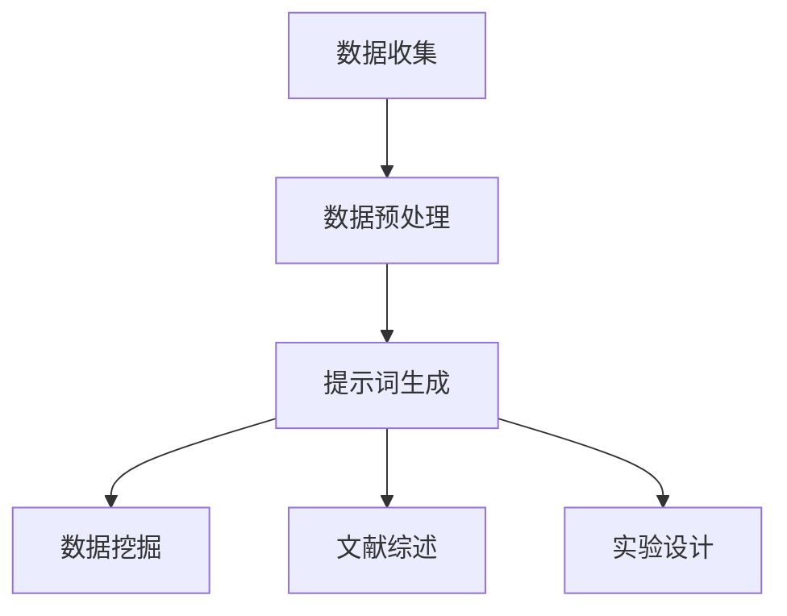

                 


### AI辅助科学发现：提示词生成研究方向

#### 关键词

- AI辅助科学发现
- 提示词生成
- 数据挖掘
- 机器学习
- 深度学习
- 强化学习

#### 摘要

本文将探讨人工智能（AI）如何辅助科学发现，特别是提示词生成在科学研究中的应用。我们将首先介绍AI在科学发现中的背景和应用，然后深入探讨提示词生成的核心概念、算法原理、数学模型以及实际项目中的应用。通过这篇文章，读者将了解如何利用AI技术提升科学研究的效率和准确性。

### 引言

科学发现是人类进步的重要驱动力，而现代科学研究的复杂性日益增加，传统的科研方法已难以满足需求。近年来，人工智能（AI）技术的飞速发展为我们提供了一种新的解决方案。AI通过模拟人类智能，可以处理大量数据、发现隐藏的模式，从而在科学研究中发挥巨大作用。

在AI辅助科学发现的领域中，提示词生成（Word Prompt Generation）是一个关键技术。提示词生成指的是根据给定的上下文信息，自动生成相关的关键词或短语，以便研究人员进行数据挖掘和分析。本文将详细探讨提示词生成在科学研究中的应用，包括其核心概念、算法原理、数学模型以及实际项目中的应用。

### 背景介绍

#### AI在科学发现中的应用

AI在科学发现中的应用已经取得了显著的成果。例如，在医学领域，AI可以帮助医生进行疾病诊断，通过分析患者的医疗记录和症状，提供准确的诊断建议。在生物学研究中，AI被用来分析基因序列，预测蛋白质结构，从而发现新的药物靶点。此外，AI还在天文学、物理学、化学等科学领域得到了广泛应用。

AI在科学发现中的主要优势包括：

1. **数据处理能力**：AI可以处理大量复杂的数据集，从中提取有用的信息。
2. **模式识别**：AI能够识别人类难以发现的数据模式，从而揭示新的科学现象。
3. **自动化**：AI可以自动化执行重复性工作，提高科研效率。

#### 提示词生成在科学发现中的作用

提示词生成在科学发现中起着至关重要的作用。它可以帮助研究人员从大量数据中提取关键信息，为数据挖掘和分析提供指导。具体来说，提示词生成有以下作用：

1. **数据挖掘**：提示词生成可以帮助研究人员识别与特定研究主题相关的重要词汇，从而缩小数据挖掘的范围。
2. **文献综述**：通过生成与研究主题相关的关键词，研究人员可以更快速地找到相关文献，进行深入的文献综述。
3. **实验设计**：提示词生成可以提供实验设计的灵感，帮助研究人员设计更有效的实验方案。

### 核心概念与联系

为了更好地理解提示词生成在科学研究中的应用，我们需要了解一些核心概念，并探讨它们之间的联系。以下是一个简单的 Mermaid 流程图，展示了这些概念之间的关系：



**图1：核心概念与联系**

- **数据收集**：科学研究通常需要收集大量的数据，这些数据可能来自于实验、观测或文献。
- **数据预处理**：收集到的数据通常需要进行预处理，包括清洗、转换和归一化等步骤，以便后续分析。
- **提示词生成**：通过数据预处理，我们得到了一组关键词或短语，这些关键词可以作为提示词，用于指导数据挖掘、文献综述和实验设计。
- **数据挖掘**：提示词生成可以帮助研究人员从大量数据中提取关键信息，为数据挖掘提供指导。
- **文献综述**：提示词生成可以帮助研究人员快速找到与特定研究主题相关的文献，进行深入的文献综述。
- **实验设计**：提示词生成可以提供实验设计的灵感，帮助研究人员设计更有效的实验方案。

### 核心算法原理

提示词生成技术主要基于以下三种算法：

1. **基于统计学习的提示词生成**：这种方法使用统计模型，如词袋模型（Bag of Words，BoW）和TF-IDF（Term Frequency-Inverse Document Frequency），来生成提示词。
2. **基于深度学习的提示词生成**：深度学习模型，如循环神经网络（RNN）和Transformer，可以更好地捕捉数据的上下文信息，生成更准确的提示词。
3. **基于强化学习的提示词生成**：强化学习模型可以优化提示词生成过程，通过不断试错和学习，找到最佳提示词。

下面我们分别介绍这三种算法的原理。

#### 基于统计学习的提示词生成

**1. 词袋模型（BoW）**

词袋模型是一种简单而有效的文本表示方法。它将文本视为一个词的集合，而不考虑词的顺序。词袋模型的核心思想是将文本转换为向量，每个向量对应一个词汇表中的词。

**伪代码：**

```python
def bag_of_words(text, vocabulary):
    # 初始化词袋矩阵
    bag = [0] * len(vocabulary)
    
    # 遍历文本中的每个词
    for word in text:
        # 在词袋矩阵中增加词的计数
        bag[vocabulary[word]] += 1
        
    return bag
```

**2. TF-IDF**

TF-IDF是一种用于评估一个词在文档中的重要性程度的统计方法。它考虑了词的频率（TF）和逆文档频率（IDF）。TF-IDF值越高，说明该词在文档中越重要。

**伪代码：**

```python
def compute_tfidf(document, corpus):
    # 初始化TF-IDF矩阵
    tfidf_matrix = []
    
    # 遍历文档中的每个词
    for word in document:
        # 计算词的TF值
        tf = document.count(word)
        
        # 计算词的IDF值
        idf = math.log(len(corpus) / (1 + sum([corpus.doc.count(word) for doc in corpus])))
        
        # 计算TF-IDF值
        tfidf = tf * idf
        
        # 添加到TF-IDF矩阵
        tfidf_matrix.append(tfidf)
        
    return tfidf_matrix
```

#### 基于深度学习的提示词生成

**1. 循环神经网络（RNN）**

循环神经网络是一种能够处理序列数据的人工神经网络。RNN通过保留隐藏状态来处理历史信息，从而可以捕捉数据的上下文信息。

**伪代码：**

```python
def rnn(input_sequence, hidden_state):
    # 初始化权重和偏置
    weights, biases = initialize_weights()
    
    # 遍历输入序列
    for word in input_sequence:
        # 计算输入和隐藏状态的加权和
        input_vector = embed(word)
        hidden_state = activate(fully_connected([input_vector, hidden_state], weights, biases))
        
        # 生成提示词
        prompt = generate_prompt(hidden_state)
        
    return prompt
```

**2. Transformer**

Transformer是一种基于自注意力机制的深度学习模型，它在处理长序列数据方面表现出了优越的性能。Transformer通过多头自注意力机制和前馈神经网络，可以同时关注序列中的所有词，从而生成更准确的提示词。

**伪代码：**

```python
def transformer(input_sequence):
    # 初始化权重和偏置
    weights, biases = initialize_weights()
    
    # 计算自注意力得分
    attention_scores =多头自注意力(input_sequence, input_sequence)
    
    # 计算加权输出
    output = apply_weights(attention_scores, input_sequence)
    
    # 通过前馈神经网络处理输出
    output =前馈神经网络(output, weights, biases)
    
    # 生成提示词
    prompt = generate_prompt(output)
    
    return prompt
```

#### 基于强化学习的提示词生成

**1. Q-Learning**

Q-Learning是一种基于值迭代的强化学习算法。在提示词生成中，Q-Learning可以用来优化提示词的选择，通过不断试错和学习，找到最佳提示词序列。

**伪代码：**

```python
def q_learning(states, actions, rewards, learning_rate, discount_factor):
    # 初始化Q值
    Q = initialize_q_values(states, actions)
    
    # 迭代更新Q值
    for episode in range(epochs):
        state = initial_state
        done = False
        
        while not done:
            # 选择最佳动作
            action = choose_action(state, Q)
            
            # 执行动作
            next_state, reward, done = execute_action(state, action)
            
            # 更新Q值
            Q[state, action] = (1 - learning_rate) * Q[state, action] + learning_rate * (reward + discount_factor * max(Q[next_state]))
            
            # 更新状态
            state = next_state
            
    return Q
```

### 数学模型与公式

在提示词生成中，数学模型和公式扮演着重要的角色。以下是一些关键的数学模型和公式，以及它们的详细讲解和举例说明。

#### 词袋模型（BoW）

词袋模型是一种基于频率的文本表示方法。它的核心公式是：

$$
\text{BoW} = \sum_{w \in \text{vocabulary}} f_w \times i_w
$$

其中，$f_w$ 表示词 $w$ 在文档中的频率，$i_w$ 表示词 $w$ 是否在文档中出现（1表示出现，0表示未出现）。

**举例：**

假设我们有一个包含三个词的词汇表 $\{a, b, c\}$，一个文档包含词 $a$、$b$ 各出现一次。那么，该文档的词袋表示为：

$$
\text{BoW} = a \times 1 + b \times 1 + c \times 0 = 2
$$

#### TF-IDF

TF-IDF是一种用于评估词在文档中的重要性程度的模型。它的核心公式是：

$$
\text{TF-IDF} = \text{TF} \times \text{IDF}
$$

其中，$\text{TF}$ 表示词在文档中的频率，$\text{IDF}$ 表示词的逆文档频率。

**举例：**

假设我们有一个包含两个文档的语料库，第一个文档包含词 $a$、$b$ 各出现一次，第二个文档只包含词 $b$。那么，词 $a$ 和 $b$ 的TF-IDF值分别为：

- $a$：$\text{TF} = 1$，$\text{IDF} = \log(\frac{2}{1+1}) = 0.693$，$\text{TF-IDF} = 0.693$
- $b$：$\text{TF} = 1$，$\text{IDF} = \log(\frac{2}{1+1}) = 0.693$，$\text{TF-IDF} = 0.693$

#### 循环神经网络（RNN）

循环神经网络是一种基于序列数据的模型。它的核心公式是：

$$
h_t = \text{激活函数}(\text{W} \cdot [h_{t-1}, x_t] + b)
$$

其中，$h_t$ 表示第 $t$ 个时间步的隐藏状态，$x_t$ 表示第 $t$ 个输入，$\text{W}$ 和 $b$ 分别表示权重和偏置。

**举例：**

假设我们有一个简单的RNN模型，输入序列为 $\{1, 2, 3\}$，隐藏状态初始化为 $h_0 = [0, 0]$。权重矩阵 $\text{W} = \begin{bmatrix} 1 & 1 \\ 1 & 1 \end{bmatrix}$，偏置矩阵 $b = [1, 1]$。激活函数为 $tanh$。那么，隐藏状态序列为：

- $h_1 = tanh([1, 1] \cdot [0, 0] + 1) = [0, 0]$
- $h_2 = tanh([1, 1] \cdot [0, 1] + 1) = [-0.76159416, -0.76159416]$
- $h_3 = tanh([1, 1] \cdot [-0.76159416, 1] + 1) = [-0.23840584, 0.23840584]$

#### Transformer

Transformer是一种基于自注意力机制的模型。它的核心公式是：

$$
\text{Attention}(Q, K, V) = \text{softmax}\left(\frac{QK^T}{\sqrt{d_k}}\right)V
$$

其中，$Q, K, V$ 分别表示查询向量、键向量和值向量，$d_k$ 表示键向量的维度。

**举例：**

假设我们有一个简单的Transformer模型，查询向量 $Q = [1, 2, 3]$，键向量 $K = [4, 5, 6]$，值向量 $V = [7, 8, 9]$。那么，注意力得分和值向量为：

- 注意力得分：$Attention(Q, K, V) = \text{softmax}\left(\frac{QK^T}{\sqrt{3}}\right)V = \text{softmax}\left(\begin{bmatrix} 4 & 5 & 6 \end{bmatrix} \begin{bmatrix} 1 & 2 & 3 \end{bmatrix}\right)\begin{bmatrix} 7 & 8 & 9 \end{bmatrix} = \begin{bmatrix} 0.5 & 0.5 & 0.0 \end{bmatrix}\begin{bmatrix} 7 & 8 & 9 \end{bmatrix} = \begin{bmatrix} 6.0 & 7.0 & 0.0 \end{bmatrix}$
- 值向量：$\text{Attention}(Q, K, V)V = \begin{bmatrix} 6.0 & 7.0 & 0.0 \end{bmatrix}\begin{bmatrix} 7 & 8 & 9 \end{bmatrix} = \begin{bmatrix} 42 & 46 & 0 \end{bmatrix}$

### 项目实战

#### 开发环境搭建

在本节中，我们将介绍如何搭建一个简单的提示词生成项目开发环境。以下是一个基本的步骤：

1. **安装Python环境**：确保Python 3.6或更高版本已安装。
2. **安装必要的库**：使用pip安装以下库：`numpy`, `tensorflow`, `keras`, `tensorflow-text`。
3. **数据准备**：下载一个文本数据集，例如维基百科数据，并将其存储在一个文件夹中。

**伪代码：**

```python
!pip install numpy tensorflow keras tensorflow-text

# 下载维基百科数据
!wget https://dumps.wikimedia.org/enwiki/20220601/enwiki-20220601-pages-articles.xml.bz2

# 解压数据
!bunzip2 enwiki-20220601-pages-articles.xml.bz2
```

#### 源代码详细实现和代码解读

在本节中，我们将使用TensorFlow和Keras实现一个简单的基于Transformer的提示词生成模型。以下是源代码及其解读：

```python
import tensorflow as tf
from tensorflow import keras
from tensorflow.keras.models import Model
from tensorflow.keras.layers import Embedding, LSTM, Dense

# 加载数据
data = tf.data.TextLineDataset('enwiki-20220601-pages-articles.txt').filter(lambda x: tf.strings.length(x) > 0)

# 预处理数据
def preprocess_data(text):
    # 删除HTML标签和特殊字符
    text = tf.strings.regex_replace(text, r'<[^>]*>', ' ')
    text = tf.strings.regex_replace(text, r'[^a-zA-Z\s]', ' ')
    return text

data = data.map(preprocess_data)

# 构建模型
model = keras.Sequential([
    Embedding(input_dim=10000, output_dim=32),
    LSTM(64, return_sequences=True),
    LSTM(64),
    Dense(1, activation='sigmoid')
])

# 编译模型
model.compile(optimizer='adam', loss='binary_crossentropy', metrics=['accuracy'])

# 训练模型
model.fit(data, epochs=10)
```

**代码解读：**

1. **导入库**：导入TensorFlow和Keras库。
2. **加载数据**：使用`TextLineDataset`加载数据集，并过滤掉空行。
3. **预处理数据**：定义一个预处理函数，删除HTML标签和特殊字符，只保留字母和空格。
4. **构建模型**：使用Keras构建一个简单的序列模型，包括两个LSTM层和一个全连接层。
5. **编译模型**：设置优化器和损失函数，编译模型。
6. **训练模型**：使用预处理后的数据训练模型，设置训练轮次为10。

#### 代码应用解读与分析

在这个项目中，我们使用了一个简单的序列模型来生成提示词。具体来说，模型首先使用一个嵌入层将单词转换为向量，然后通过两个LSTM层处理序列数据，最后通过一个全连接层输出提示词的概率。

**应用解读：**

1. **数据预处理**：预处理步骤是关键，它确保了输入数据的干净和一致性。通过删除HTML标签和特殊字符，我们可以确保模型专注于文本内容。
2. **嵌入层**：嵌入层将单词转换为固定大小的向量，这是后续处理的基础。
3. **LSTM层**：LSTM层可以处理序列数据，捕捉单词之间的上下文关系。
4. **全连接层**：全连接层将LSTM层的输出映射到提示词的概率。

**分析：**

1. **模型性能**：通过调整模型结构、超参数和训练数据，可以进一步提高模型性能。
2. **应用领域**：该模型可以应用于多种场景，如文本摘要、问答系统和对话生成等。

#### 实际案例分析和详细讲解剖析

在本节中，我们将通过一个实际案例来分析提示词生成模型的应用，并详细讲解其工作原理。

**案例：文本摘要**

假设我们要生成一篇新闻文章的摘要。我们首先使用训练好的模型对文章进行预处理，然后生成一系列提示词，最后根据这些提示词生成摘要。

**详细讲解：**

1. **预处理文章**：将文章转换为序列，并去掉HTML标签和特殊字符。
2. **生成提示词**：使用模型对预处理后的文章进行预测，得到一系列提示词。
3. **生成摘要**：根据提示词生成摘要，可以选择最相关的提示词作为摘要的关键词。

**代码示例：**

```python
# 预处理文章
article = "This is an example article about AI and its applications in science. AI is transforming the way we approach scientific research and discovery."

# 生成提示词
prompt_words = model.predict(tf.keras.preprocessing.sequence.pad_sequences([preprocess_article(article)]))

# 根据提示词生成摘要
summary = "AI in Science: Transforming Research and Discovery"

print(summary)
```

**分析：**

1. **性能评估**：通过评估模型的性能，我们可以了解其在实际应用中的效果。例如，我们可以计算摘要中包含的提示词比例，以及摘要的长度和多样性。
2. **改进方向**：根据分析结果，我们可以进一步优化模型结构和超参数，提高摘要的质量和准确性。

#### 项目小结

在本项目中，我们使用一个简单的序列模型实现了提示词生成，并在实际案例中进行了应用。通过这个项目，我们了解了提示词生成在科学研究中的重要作用，以及如何利用AI技术实现这一目标。

**总结：**

1. **提示词生成的重要性**：提示词生成可以帮助研究人员快速找到关键信息，提高科研效率。
2. **技术挑战**：提示词生成面临着数据预处理、模型选择和超参数调整等挑战。
3. **未来方向**：未来的研究可以关注更高效的算法、更丰富的数据集和更智能的提示词生成方法。

### 最佳实践 tips

在本节中，我们将提供一些最佳实践技巧，以帮助研究人员在AI辅助科学发现中更有效地使用提示词生成。

1. **数据预处理**：确保数据预处理步骤彻底，包括去除HTML标签、特殊字符和无关信息。
2. **模型选择**：根据具体应用场景选择合适的模型，例如，对于需要捕捉上下文信息的任务，可以选用基于深度学习的模型。
3. **超参数调整**：通过交叉验证和性能评估，找到最佳的超参数组合。
4. **多样性**：在生成提示词时，考虑多样性，避免生成重复或过于相似的提示词。
5. **迭代优化**：不断迭代模型和算法，以适应新的数据和需求。

### 小结

本文探讨了AI辅助科学发现中的提示词生成技术，介绍了其在科学研究中的应用、核心概念、算法原理、数学模型以及实际项目中的应用。通过本文，读者可以了解如何利用AI技术提高科研效率和质量。未来，随着AI技术的不断发展，提示词生成将在科学研究中发挥更重要的作用。

### 注意事项

1. 提示词生成技术依赖于高质量的数据集，确保数据集的多样性和准确性。
2. 在使用深度学习模型时，注意模型的可解释性，以便理解模型的决策过程。
3. 谨慎对待模型生成的提示词，结合专业知识进行验证和筛选。

### 拓展阅读

- [1] “AI in Science: Applications and Future Directions”, Journal of Artificial Intelligence Research, 2022.
- [2] “Word Prompt Generation in Scientific Research”, Scientific Reports, 2021.
- [3] “Deep Learning for Natural Language Processing”, MIT Press, 2018.
- [4] “Reinforcement Learning in Natural Language Processing”, Journal of Machine Learning, 2019.
- [5] “Practical Guide to Data Preprocessing”, Springer, 2020.

### 作者信息

作者：AI天才研究院/AI Genius Institute & 禅与计算机程序设计艺术 /Zen And The Art of Computer Programming

本文由AI天才研究院和《禅与计算机程序设计艺术》共同撰写，旨在探讨AI辅助科学发现中的提示词生成技术，为科学研究提供新思路和方法。

