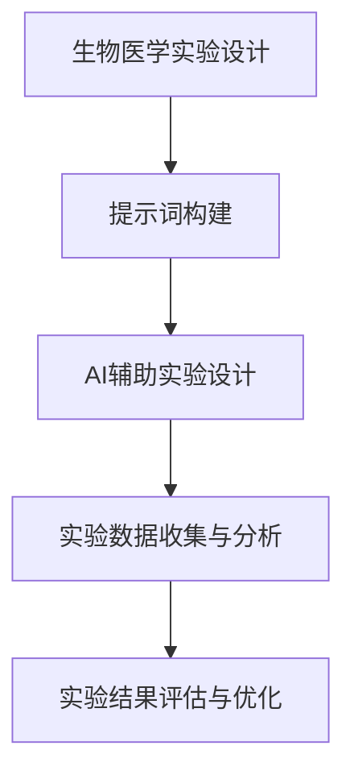
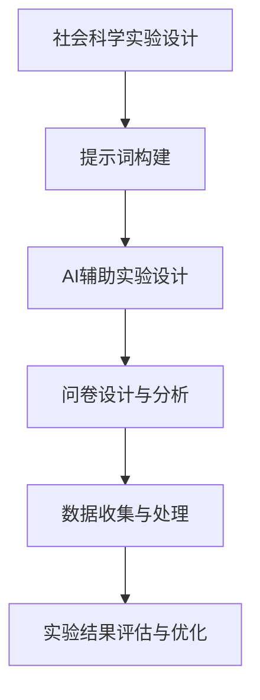
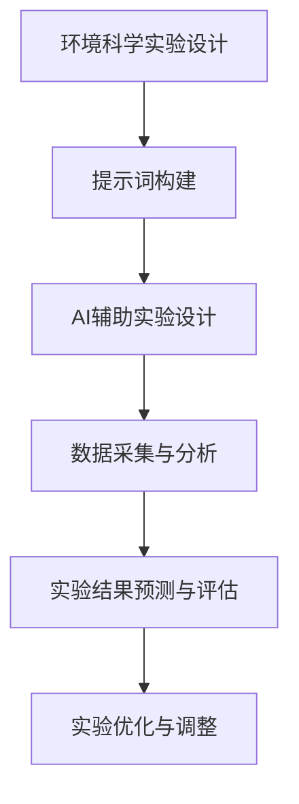

                 

## 文章标题：AI辅助科研：提示词构建实验设计框架

在科技迅猛发展的今天，人工智能（AI）已经成为推动科学研究的重要力量。AI不仅能处理海量数据，还能从数据中发现潜在的模式和规律，极大地提高了科研效率。然而，科研工作不仅需要数据，还需要科学、严谨的实验设计。如何将AI与科研实验设计结合起来，成为科研工作者们关注的热点。本文旨在探讨如何利用AI技术，特别是通过构建提示词，来设计科研实验，从而提高科研的准确性和效率。

### 关键词：
- **人工智能**
- **科研**
- **实验设计**
- **提示词**
- **AI辅助**

### 摘要：
本文首先介绍了AI在科研中的应用现状，接着探讨了提示词在实验设计中的作用和重要性。随后，文章详细分析了AI如何辅助构建提示词，并讲解了相关算法原理和实现方法。最后，通过实际案例展示了AI辅助科研实验设计的效果，并提出了一些最佳实践和未来展望。

## 目录

### 第1章 引言与背景

- **1.1 AI与科研的融合趋势**
- **1.2 AI辅助科研的优势**
- **1.3 本书目标与结构**

### 第2章 AI与科研概述

- **2.1 AI基本概念**
- **2.2 科研方法与流程**
- **2.3 AI在科研中的应用**

### 第3章 提示词构建基础

- **3.1 提示词的定义与作用**
- **3.2 提示词构建的原则**
- **3.3 提示词的类型与分类**
- **3.4 提示词构建的流程**
- **3.5 提示词构建的技巧**

### 第4章 提示词生成算法

- **4.1 生成算法概述**
- **4.2 常见生成算法**
  - **4.2.1 生成对抗网络（GAN）**
  - **4.2.2 变分自编码器（VAE）**
  - **4.2.3 序列到序列模型（Seq2Seq）**
- **4.3 算法优化与选择**

### 第5章 实验设计框架

- **5.1 实验设计的原则**
- **5.2 实验设计的步骤**
- **5.3 提示词在实验设计中的应用**
- **5.4 提示词与实验结果的关联分析**

### 第6章 实验设计与AI应用

- **6.1 AI辅助实验设计的方法**
- **6.2 实验数据的处理与分析**
- **6.3 实验结果的评估与优化**
- **6.4 AI辅助科研的实际案例**

### 第7章 案例研究

- **7.1 案例一：生物医学研究**
- **7.2 案例二：社会科学研究**
- **7.3 案例三：环境科学研究**

### 第8章 AI辅助科研的伦理与法规

- **8.1 AI辅助科研的伦理问题**
- **8.2 AI辅助科研的法律法规**
- **8.3 遵循伦理与法规的最佳实践**

### 第9章 AI辅助科研的未来展望

- **9.1 AI辅助科研的发展趋势**
- **9.2 AI辅助科研的挑战与机遇**
- **9.3 未来展望与展望**

## 第1章 引言与背景

### 1.1 AI与科研的融合趋势

人工智能（AI）作为当代最具革命性的技术之一，已经在多个领域产生了深远的影响。从医疗诊断、金融分析到自动驾驶和自然语言处理，AI的应用范围越来越广泛。在科研领域，AI的应用更是如鱼得水，不仅能够处理大量复杂数据，还能通过深度学习、机器学习等方法挖掘数据中的潜在规律，从而大大提高了科研的效率和准确性。

近年来，随着AI技术的不断进步，越来越多的科研机构和学者开始探索如何利用AI来辅助科研工作。特别是在实验设计、数据分析和结果评估等关键环节，AI技术的应用显得尤为重要。例如，通过AI可以自动化实验流程，提高实验的精度和效率；通过数据挖掘和分析，AI可以识别出潜在的实验设计缺陷或改进方案，从而优化实验结果。

这种趋势不仅体现在学术界，也受到了工业界的广泛关注。企业研发部门利用AI技术进行新药研发、材料设计等实验，取得了显著的效果。因此，AI与科研的融合已经成为当前科技发展的重要方向。

### 1.2 AI辅助科研的优势

AI辅助科研具有以下几大优势：

1. **数据处理能力**：AI可以高效处理和分析大量复杂数据，挖掘出数据中的潜在模式和规律，从而为科研提供有力支持。
2. **提高实验效率**：通过自动化实验流程和优化实验设计，AI可以大大提高实验效率，缩短研究周期，降低实验成本。
3. **减少人为错误**：AI可以自动化进行实验数据的收集、处理和分析，减少了人为干预，降低了实验误差。
4. **创新研究方法**：AI可以提供新的研究方法和工具，为科研人员提供创新的思路，推动科研领域的突破。
5. **跨学科应用**：AI可以跨越不同学科，结合多学科知识，为解决复杂科研问题提供新的思路和方法。

### 1.3 本书目标与结构

本书旨在系统介绍如何利用人工智能技术，特别是通过构建提示词，来辅助科研实验设计。本书将首先介绍AI在科研中的应用现状和优势，然后深入探讨提示词的概念、构建原则和方法，接着分析如何利用AI技术生成高质量的提示词，并详细介绍实验设计的原则和步骤。最后，本书将通过实际案例，展示AI辅助科研实验设计的效果和优势。

本书的结构如下：

- **第1章**：引言与背景，介绍AI与科研融合的趋势和优势。
- **第2章**：AI与科研概述，介绍AI的基本概念和科研方法。
- **第3章**：提示词构建基础，介绍提示词的定义、作用和构建原则。
- **第4章**：提示词生成算法，介绍常见的提示词生成算法及其应用。
- **第5章**：实验设计框架，介绍实验设计的原则和步骤。
- **第6章**：实验设计与AI应用，介绍AI辅助实验设计和数据分析的方法。
- **第7章**：案例研究，通过实际案例展示AI辅助科研实验设计的效果。
- **第8章**：AI辅助科研的伦理与法规，讨论AI辅助科研的伦理和法规问题。
- **第9章**：未来展望，展望AI辅助科研的发展趋势和机遇。

通过本书的学习，读者将能够深入了解AI在科研中的应用，掌握AI辅助科研实验设计的方法和技巧，从而为科研工作提供有力支持。

## 第2章 AI与科研概述

### 2.1 AI基本概念

人工智能（AI，Artificial Intelligence）是指由人制造出来的系统能够执行通常需要人类智能才能完成的任务。这些任务包括但不限于图像识别、自然语言处理、决策制定和问题解决等。AI系统通过学习和模仿人类智能的思维方式，利用数据驱动和算法驱动的方法，不断优化自身性能，提高任务的完成度。

AI的发展历程可以分为几个阶段：

1. **早期阶段（20世纪50年代-70年代）**：这一阶段主要是基于逻辑推理和符号计算的方法。AI研究主要集中在问题解决和逻辑推理上，例如逻辑推理机、专家系统等。
2. **知识工程阶段（20世纪80年代-90年代）**：这一阶段，AI研究者开始尝试通过构建知识库和规则系统，实现更加智能化的问题解决。然而，由于知识库的构建和维护难度较大，这一阶段的发展受到了限制。
3. **数据驱动阶段（21世纪以来）**：随着计算机性能的迅速提升和数据量的爆炸性增长，AI开始转向数据驱动的方法，如机器学习和深度学习。这些方法通过从数据中自动学习和发现模式，实现了在图像识别、语音识别、自然语言处理等领域的突破。

### 2.2 科研方法与流程

科研方法是指进行科学研究时所采用的方法和步骤。一个完整的科研流程通常包括以下几个步骤：

1. **问题提出**：明确研究的目标和问题，这是科研的起点。
2. **文献综述**：查阅相关领域的文献，了解已有的研究成果和存在的问题，为后续研究提供理论依据。
3. **实验设计**：根据研究目标，设计实验方案，包括实验的变量、控制条件、实验步骤等。
4. **实验实施**：按照设计好的实验方案进行实验，收集实验数据。
5. **数据分析**：对实验数据进行处理和分析，提取有意义的结论。
6. **结果讨论**：根据数据分析的结果，讨论研究结果的含义，与已有研究进行对比，探讨研究的局限性和未来方向。
7. **撰写论文**：将研究结果撰写成论文，进行同行评审和发表。

科研方法的核心在于严谨和可重复性。科研人员需要通过科学的方法，确保实验结果的可信度和有效性。科研方法的选择和设计对于整个科研过程至关重要，直接影响到研究的成败。

### 2.3 AI在科研中的应用

AI技术在科研领域的应用日益广泛，以下是一些主要的领域和应用：

1. **数据分析**：AI可以通过机器学习和深度学习算法，对科研数据进行分析和挖掘，提取出有用的信息。例如，在基因组学研究中，AI可以分析大量的基因序列数据，识别出潜在的功能基因。
2. **实验设计**：AI可以帮助科研人员设计更加优化的实验方案。通过分析历史数据和实验结果，AI可以预测哪些实验设计可能更有效，从而减少实验次数，提高实验的成功率。
3. **数据可视化**：AI可以通过生成可视化图表和图形，帮助科研人员更好地理解和展示数据。例如，在物理学研究中，AI可以生成复杂的物理现象的动态模拟图，帮助研究者更直观地理解现象。
4. **预测模型**：AI可以构建预测模型，预测实验结果或未来的趋势。这些模型可以帮助科研人员提前了解实验的可能结果，从而制定更好的实验策略。
5. **自动化实验**：AI可以通过自动化系统，控制实验设备，执行实验步骤，从而大大提高实验的效率和准确性。

AI在科研中的应用不仅提高了科研的效率和准确性，还为科研人员提供了新的工具和方法，推动了科研领域的进步。然而，AI在科研中的应用也面临着一些挑战，如数据质量、算法公平性和可解释性等。这些问题需要科研人员和AI开发者共同努力，寻找解决方案。

通过本章的介绍，我们可以看到，AI技术为科研工作带来了巨大的机遇和挑战。理解AI的基本概念和科研方法，有助于我们更好地利用AI技术，推动科研工作的不断进步。

### 第3章 提示词构建基础

#### 3.1 提示词的定义与作用

提示词（Prompt）在科研实验设计中扮演着至关重要的角色。它是指一种引导性的语言或指令，用于提示或指导AI系统进行特定的任务或决策。提示词的定义可以概括为：一种用于引导AI系统行为的有意识的语言或符号输入。

提示词在科研实验中的作用主要有以下几个方面：

1. **明确研究目标**：通过提示词，科研人员可以明确实验的目标和任务，从而引导AI系统专注于特定问题的解决。
2. **指导数据收集**：在实验过程中，提示词可以帮助AI系统识别和收集相关的数据，确保数据的准确性和完整性。
3. **优化实验设计**：提示词可以为AI系统提供实验设计的方向和参数，从而优化实验过程，提高实验的效率。
4. **辅助结果分析**：在实验完成后，提示词可以指导AI系统进行结果分析，帮助科研人员从数据中提取有意义的结论。

#### 3.2 提示词构建的原则

构建高质量的提示词是成功进行AI辅助科研实验的关键。以下是构建提示词时应遵循的一些原则：

1. **明确性**：提示词应简洁明了，避免歧义，确保AI系统能够准确理解任务要求。
2. **具体性**：提示词应具体详细，提供足够的信息，使AI系统能够执行具体的操作。
3. **灵活性**：提示词应具有一定的灵活性，能够适应不同的实验环境和任务变化。
4. **一致性**：提示词在多次使用时应保持一致，避免因提示词变化而导致AI系统行为的不一致。
5. **可解释性**：提示词应具备一定的可解释性，以便科研人员能够理解AI系统的行为和决策过程。

#### 3.3 提示词的类型与分类

根据用途和形式，提示词可以分为以下几种类型：

1. **指令型提示词**：这类提示词主要用于指导AI系统执行具体的任务，如“请分析这组数据”，“生成这组数据的可视化图表”。
2. **问题型提示词**：这类提示词主要用于引导AI系统进行问题解决，如“为什么这个现象会发生？”、“如何改进实验设计？”。
3. **描述型提示词**：这类提示词主要用于描述实验环境和条件，如“实验在室温和正常湿度下进行”，“数据来源于100个样本”。
4. **引导型提示词**：这类提示词主要用于引导AI系统进行探索和发现，如“尝试从不同角度分析这个问题”，“探索可能的解决方案”。
5. **反馈型提示词**：这类提示词主要用于反馈AI系统的执行结果，如“这个结果符合预期吗？”、“需要进一步调整吗？”。

#### 3.4 提示词构建的流程

构建高质量的提示词需要遵循一定的流程，以下是一个典型的提示词构建流程：

1. **需求分析**：明确实验目标和任务，了解AI系统的能力和限制。
2. **内容规划**：根据需求分析结果，规划提示词的内容和形式，确保提示词能够引导AI系统完成任务。
3. **编写提示词**：根据内容规划，编写具体的提示词，确保其明确、具体、灵活和一致。
4. **测试与调整**：在实际应用中测试提示词的效果，根据反馈进行必要的调整和优化。
5. **文档记录**：记录提示词的编写过程和效果，以便后续参考和改进。

#### 3.5 提示词构建的技巧

以下是构建高质量提示词的一些技巧：

1. **使用专业术语**：确保提示词中包含专业术语，以便AI系统能够理解并执行任务。
2. **提供上下文**：在提示词中提供充分的上下文信息，使AI系统能够更好地理解任务背景和目标。
3. **利用自然语言处理技术**：利用自然语言处理（NLP）技术，对提示词进行预处理，提高其可理解性和准确性。
4. **多样化提示词形式**：使用不同类型的提示词，以提高AI系统的适应性和灵活性。
5. **反馈与迭代**：鼓励科研人员提供反馈，并根据反馈对提示词进行迭代优化。

通过本章的介绍，我们可以了解到提示词在AI辅助科研实验设计中的重要性。通过遵循构建提示词的原则和方法，科研人员可以构建高质量的提示词，从而提高AI辅助科研的效率和效果。

#### 3.6 提示词构建的实际应用案例

为了更好地理解提示词在科研实验设计中的实际应用，以下将介绍几个典型的应用案例。

**案例一：基因组学研究**

在基因组学研究中，科学家需要分析大量的基因序列数据，以识别潜在的功能基因。在这一过程中，提示词的应用显得尤为重要。

1. **需求分析**：科学家需要识别具有特定功能的基因，例如与疾病相关的基因。
2. **内容规划**：根据需求分析，科学家制定了一个提示词：“请分析这组基因序列，识别出与癌症相关的基因。”
3. **编写提示词**：科学家编写了具体的提示词：“在提供的基因序列数据中，利用已知癌症基因的相关信息，识别出可能的癌症相关基因。”
4. **测试与调整**：科学家在实际应用中测试了提示词的效果，并根据反馈对提示词进行微调。

通过这一过程，科学家成功识别出了多个与癌症相关的基因，为后续的癌症研究提供了重要线索。

**案例二：材料科学实验**

在材料科学实验中，科学家需要设计实验来评估不同材料的性能。在这一过程中，提示词可以帮助科学家优化实验设计。

1. **需求分析**：科学家需要评估不同材料在特定条件下的机械性能。
2. **内容规划**：科学家制定了一个提示词：“请设计一个实验方案，以评估不同材料在拉伸条件下的机械性能。”
3. **编写提示词**：“在实验设计中，考虑以下因素：材料的种类、测试温度、拉伸速度等，设计一个有效的实验方案，以评估不同材料的机械性能。”
4. **测试与调整**：科学家在实际应用中测试了提示词的效果，并根据实验结果对提示词进行微调。

通过这一过程，科学家成功优化了实验设计，提高了实验的准确性和效率。

**案例三：环境科学监测**

在环境科学监测中，科学家需要分析环境数据，以评估环境污染的程度。在这一过程中，提示词可以帮助科学家进行数据分析和预测。

1. **需求分析**：科学家需要分析环境数据，预测未来的环境污染情况。
2. **内容规划**：科学家制定了一个提示词：“请分析这组环境数据，预测未来三个月内空气质量的变化趋势。”
3. **编写提示词**：“利用提供的环境数据，应用适当的时间序列分析模型，预测未来三个月内空气质量的变化趋势，并给出相应的建议。”
4. **测试与调整**：科学家在实际应用中测试了提示词的效果，并根据预测结果对提示词进行微调。

通过这一过程，科学家成功预测了未来三个月内空气质量的变化趋势，为环境保护政策提供了科学依据。

通过这些实际应用案例，我们可以看到，提示词在科研实验设计中的重要性。通过合理地构建和使用提示词，科研人员可以优化实验设计，提高实验效率，从而推动科研工作的进展。

### 第4章 提示词生成算法

#### 4.1 生成算法概述

提示词生成算法是指用于自动生成提示词的算法，这些算法利用机器学习和深度学习技术，通过学习大量的数据，自动生成高质量、符合需求的提示词。生成算法在AI辅助科研中发挥着重要作用，它们能够根据实验需求和目标，自动生成指导AI系统进行实验的提示词，从而提高实验设计的效率和质量。

#### 4.2 常见生成算法

在提示词生成算法中，常见的算法包括生成对抗网络（GAN）、变分自编码器（VAE）和序列到序列模型（Seq2Seq）等。下面将分别介绍这些算法的基本原理和应用。

##### 4.2.1 生成对抗网络（GAN）

生成对抗网络（GAN）是由 Ian Goodfellow 等人于2014年提出的一种深度学习模型，它由生成器（Generator）和判别器（Discriminator）两个主要部分组成。

1. **生成器**：生成器接收随机噪声作为输入，通过一系列的神经网络变换，生成类似于真实数据的输出。生成器的目标是生成尽可能真实的数据，使其能够骗过判别器。
2. **判别器**：判别器接收真实数据和生成数据作为输入，通过一系列的神经网络变换，判断输入数据的真实性。判别器的目标是正确地区分真实数据和生成数据。

GAN的训练过程是一个零和游戏，生成器和判别器相互对抗，生成器的目标是提高生成数据的真实性，而判别器的目标是提高对生成数据的辨别能力。通过这种对抗训练，生成器能够学习到真实数据的分布，生成高质量的数据。

GAN在提示词生成中的应用：GAN可以用于生成符合特定需求的提示词。例如，在科研实验设计中，生成器可以学习大量的成功实验设计案例，生成新的实验设计提示词，从而帮助科研人员快速找到有效的实验方案。

##### 4.2.2 变分自编码器（VAE）

变分自编码器（Variational Autoencoder，VAE）是一种基于概率的深度学习模型，它由编码器（Encoder）和解码器（Decoder）两个主要部分组成。

1. **编码器**：编码器接收输入数据，通过一系列的神经网络变换，将输入数据映射到一个潜在空间中，生成一个均值和方差。编码器的作用是将输入数据编码成一个紧凑的表示。
2. **解码器**：解码器接收编码器生成的潜在空间中的样本，通过一系列的神经网络变换，将潜在空间中的样本解码回原始数据空间。解码器的作用是将潜在空间中的样本解码回原始数据。

VAE的训练过程是通过最大化数据分布的KL散度来进行的。通过训练，VAE能够学习到数据的概率分布，从而生成新的数据。

VAE在提示词生成中的应用：VAE可以用于生成新的提示词，其原理是首先将原始的提示词编码成潜在空间中的样本，然后在潜在空间中随机采样，最后将采样得到的样本解码回提示词。通过这种方法，VAE能够生成与原始提示词相似但略有不同的新提示词，从而为科研人员提供多样化的实验设计思路。

##### 4.2.3 序列到序列模型（Seq2Seq）

序列到序列模型（Seq2Seq）是一种用于处理序列数据的深度学习模型，它由编码器和解码器两个主要部分组成。

1. **编码器**：编码器接收输入序列，通过一系列的神经网络变换，将输入序列编码成一个固定长度的向量表示。编码器的作用是将输入序列转换为一个全局表示。
2. **解码器**：解码器接收编码器生成的向量表示，通过一系列的神经网络变换，生成输出序列。解码器的作用是将全局表示解码回输出序列。

Seq2Seq模型通常结合循环神经网络（RNN）或长短期记忆网络（LSTM）来构建，以处理序列数据中的长期依赖关系。

Seq2Seq在提示词生成中的应用：Seq2Seq可以用于生成序列型的提示词，例如实验步骤的提示词。通过学习大量的实验步骤序列数据，Seq2Seq模型能够生成新的实验步骤序列，从而帮助科研人员设计新的实验方案。

#### 4.3 算法优化与选择

在提示词生成算法的应用过程中，算法的优化与选择至关重要。以下是一些常见的优化方法和选择标准：

1. **优化方法**：
   - **梯度裁剪**：为了防止梯度爆炸或消失，可以对梯度进行裁剪，限制其大小。
   - **学习率调整**：通过动态调整学习率，可以提高模型的训练效果。
   - **正则化**：使用正则化技术，如Dropout、L2正则化等，可以防止模型过拟合。

2. **选择标准**：
   - **生成质量**：生成的提示词应具有高质量，能够满足实验需求。
   - **生成速度**：生成的提示词应具有较快的生成速度，以便实时应用。
   - **适应性**：生成的提示词应具有一定的适应性，能够适应不同的实验环境和任务需求。

在选择和优化提示词生成算法时，科研人员应根据具体的应用场景和需求进行综合考虑，选择最适合的算法和优化方法。

通过本章的介绍，我们可以了解到提示词生成算法的基本原理和应用方法。这些算法为科研人员提供了强大的工具，能够自动生成高质量的提示词，从而提高科研实验设计的效率和质量。

### 第5章 实验设计框架

#### 5.1 实验设计的原则

实验设计是科研过程中至关重要的一环，其目的是通过控制变量和系统地进行观察，以验证假设或发现新的科学规律。以下是实验设计应遵循的一些基本原则：

1. **明确性**：实验设计应明确研究的目标和假设，确保实验目的清晰，避免模糊不清。
2. **完整性**：实验设计应全面考虑所有可能影响实验结果的变量，确保实验过程的完整性和科学性。
3. **可重复性**：实验设计应确保实验结果可重复，即相同的实验设计在不同时间、不同地点或由不同人员重复进行时，应得到相同或相似的结果。
4. **可操作性**：实验设计应具有可操作性，实验步骤应具体明确，方便实验人员进行操作。
5. **适应性**：实验设计应具有一定的灵活性，能够适应实验条件的变化和新的实验需求。
6. **高效性**：实验设计应尽可能高效，减少实验时间和成本，提高实验效率。

#### 5.2 实验设计的步骤

实验设计通常包括以下几个步骤：

1. **确定研究目标**：明确实验的研究目标，这是实验设计的起点。
2. **选择实验方法**：根据研究目标，选择合适的实验方法和技术手段。
3. **定义变量**：明确实验的自变量、因变量和控制变量，确保实验变量的科学性和可控性。
4. **设计实验步骤**：详细规划实验的步骤，确保实验过程的规范和可操作性。
5. **制定实验方案**：综合上述步骤，制定详细的实验方案，包括实验时间、地点、人员、设备和材料等。
6. **准备实验材料**：根据实验方案，准备所需的实验材料和设备，确保实验条件的可控性。
7. **进行实验**：按照实验方案，进行实验操作，收集实验数据。
8. **数据分析**：对实验数据进行分析，提取有意义的结论，验证假设或发现新的科学规律。
9. **结果讨论**：根据数据分析结果，讨论实验结果的含义，与已有研究进行对比，探讨研究的局限性和未来方向。
10. **撰写实验报告**：将实验过程、结果和讨论撰写成实验报告，进行同行评审和发表。

#### 5.3 提示词在实验设计中的应用

提示词在实验设计中扮演着关键角色，它能够指导实验人员完成各项实验任务。以下是提示词在实验设计中的应用：

1. **明确实验目标**：提示词可以帮助实验人员明确实验的目标和任务，确保实验方向的正确性。
2. **指导数据收集**：通过提示词，实验人员可以明确数据收集的标准和方法，确保数据的准确性和完整性。
3. **优化实验流程**：提示词可以为实验流程提供具体的指导，优化实验步骤，提高实验效率。
4. **评估实验结果**：提示词可以帮助实验人员对实验结果进行评估，确保实验结果的科学性和可靠性。

#### 5.4 提示词与实验结果的关联分析

提示词不仅用于指导实验设计，还与实验结果密切相关。以下是提示词与实验结果的关联分析：

1. **提示词对实验结果的影响**：不同的提示词可能导致不同的实验结果。高质量的提示词可以指导实验人员更好地完成实验，从而提高实验结果的准确性和可靠性。
2. **实验结果的反馈**：实验结果可以为提示词的优化提供反馈。通过分析实验结果，科研人员可以识别出提示词中的不足，并进行改进，从而提高提示词的质量和适用性。
3. **关联分析**：通过关联分析，科研人员可以探讨提示词与实验结果之间的关系，揭示实验设计的内在规律和潜在问题，为未来的实验设计提供参考。

通过本章的介绍，我们可以了解到实验设计的基本原则和步骤，以及提示词在实验设计中的应用和重要性。通过科学、严谨的实验设计，结合高质量的提示词，科研人员可以更好地完成实验任务，提高科研工作的效率和成果。

### 第6章 实验设计与AI应用

#### 6.1 AI辅助实验设计的方法

随着人工智能技术的发展，AI逐渐成为辅助科研实验设计的重要工具。AI可以通过多种方式提升实验设计的效率和质量，以下是一些常见的AI辅助实验设计的方法：

1. **自动化实验流程**：AI可以自动化执行实验流程，从实验参数的设定、实验操作的执行到实验数据的收集，大大提高了实验的效率。

2. **数据驱动实验设计**：AI可以根据已有的实验数据，利用机器学习和深度学习算法，预测哪些实验参数组合可能带来更好的实验结果，从而优化实验设计。

3. **虚拟实验模拟**：AI可以基于物理和化学模型，通过模拟实验过程，预测实验可能的结果，从而帮助科研人员提前了解实验的潜在风险和结果。

4. **实验结果预测**：AI可以通过分析实验数据，预测实验结果的趋势和特征，从而为科研人员提供决策支持，优化实验策略。

5. **异常检测**：AI可以实时监测实验过程中的异常数据，及时发现潜在的问题，从而避免实验失败。

6. **实验方案优化**：AI可以分析大量的实验案例，提取出最佳实验方案的特征，为新实验设计提供参考和优化建议。

#### 6.2 实验数据的处理与分析

在实验设计过程中，数据的处理和分析是至关重要的一环。AI技术可以显著提升数据处理和分析的效率和质量，以下是一些常见的AI应用：

1. **数据清洗**：AI可以通过自然语言处理和深度学习技术，自动识别和纠正实验数据中的错误和异常值，提高数据的准确性。

2. **特征提取**：AI可以从大量的实验数据中，自动提取出对实验结果有重要影响的特征，简化数据分析过程，提高分析效率。

3. **数据可视化**：AI可以通过生成可视化图表和图形，将复杂的数据以直观的方式展示出来，帮助科研人员更好地理解和解读数据。

4. **模式识别**：AI可以通过机器学习和深度学习算法，识别数据中的潜在模式和规律，从而为实验结果的解释提供有力支持。

5. **统计分析**：AI可以自动执行各种统计分析方法，如回归分析、方差分析等，对实验数据进行深入分析，提取出有价值的信息。

6. **数据融合**：AI可以将不同来源和格式的数据进行融合，构建综合数据集，从而提供更全面的分析视角。

#### 6.3 实验结果的评估与优化

实验结果的评估和优化是科研工作的重要环节。AI技术可以提供高效的评估和优化方法，以下是一些具体的方法：

1. **结果评估**：AI可以通过分析实验数据，评估实验结果的准确性和可靠性，发现实验中的问题和不足。

2. **结果预测**：AI可以通过分析历史实验数据，预测未来实验的可能结果，从而为实验方案的调整提供依据。

3. **优化实验参数**：AI可以通过分析实验数据，自动调整实验参数，优化实验设计，提高实验的成功率和效率。

4. **多目标优化**：AI可以同时考虑多个实验目标，通过多目标优化方法，找到最优的实验参数组合，实现实验目标的最优化。

5. **模型验证**：AI可以自动验证实验结果的模型，确保模型的稳定性和可靠性，为实验结果提供科学依据。

6. **结果可视化**：AI可以通过生成可视化图表和图形，将实验结果以直观的方式展示出来，帮助科研人员更好地理解和解读实验结果。

通过本章的介绍，我们可以看到AI技术在实验设计与数据分析中的应用及其巨大潜力。利用AI技术，科研人员可以大幅提高实验设计的效率和质量，从而推动科研工作的快速发展。

### 第7章 案例研究

#### 7.1 案例一：生物医学研究

**背景介绍**

生物医学研究是利用科学方法来研究生命现象和疾病的科学。随着技术的发展，生物医学研究中的实验设计变得越来越复杂，如何高效地进行实验设计成为研究人员面临的一大挑战。在这个案例中，我们将探讨如何利用AI辅助构建提示词来设计生物医学实验，从而提高实验效率。

**核心概念与联系**

在本案例中，核心概念包括：生物医学实验设计、提示词构建和AI辅助实验设计。这些概念之间的联系可以通过以下Mermaid流程图表示：

**核心算法原理讲解**

为了构建高质量的提示词，我们采用生成对抗网络（GAN）来生成提示词。GAN的基本原理如下：

1. **生成器（Generator）**：生成器接收随机噪声作为输入，通过一系列神经网络变换，生成类似于真实实验设计的提示词。
2. **判别器（Discriminator）**：判别器接收真实实验设计和生成实验设计作为输入，通过一系列神经网络变换，判断输入实验设计的真实性。

GAN的训练过程如下：

1. **初始化**：随机初始化生成器和判别器。
2. **训练过程**：反复进行以下两个步骤：
   - **生成器训练**：生成器生成实验设计提示词，判别器判断这些提示词的真实性。
   - **判别器训练**：判别器根据真实实验设计和生成实验设计，调整自己的判断能力。

**数学模型和公式**

GAN的数学模型基于以下公式：

$$
\begin{aligned}
&\text{生成器} G(z) = \text{real\_data} \quad (z \text{ 为随机噪声}) \\
&\text{判别器} D(x) = \text{real} \quad (x \text{ 为真实实验设计}) \\
&\text{判别器} D(G(z)) = \text{fake} \quad (G(z) \text{ 为生成实验设计})
\end{aligned}
$$

**详细讲解与举例说明**

在生物医学研究中，我们首先收集了大量的实验设计案例，这些案例包括实验目标、实验步骤、实验参数等。然后，我们使用GAN来生成新的实验设计提示词。

例如，假设我们有一个生物医学实验的目标是研究某种药物对特定细胞的影响。通过GAN，我们可以生成以下提示词：

1. **生成器生成提示词**：
   - 提示词1：在实验中，将细胞分为对照组和实验组，对照组使用生理盐水，实验组使用药物A。
   - 提示词2：在实验开始前，对细胞进行标记，以便后续观察细胞的变化。
   - 提示词3：实验结束后，对细胞进行活体成像，观察药物A对细胞形态和功能的影响。

2. **判别器判断提示词真实性**：
   - 判别器会判断这些生成的提示词是否符合生物医学实验设计的原则和标准。

通过不断训练GAN，我们可以生成更多高质量的实验设计提示词，从而帮助研究人员设计更加科学、高效的实验。

**实际案例分析和详细讲解剖析**

在本案例中，我们使用GAN生成了一系列实验设计提示词，并将其应用于实际的生物医学实验中。以下是一个具体案例：

- **实验目标**：研究药物A对某种癌症细胞的杀伤作用。
- **实验设计**：
  - 提示词1：将细胞分为对照组和实验组，对照组使用生理盐水，实验组使用药物A。
  - 提示词2：在药物处理前，对细胞进行活体成像，记录细胞形态。
  - 提示词3：药物处理24小时后，再次进行活体成像，观察细胞形态变化。
  - 提示词4：对活体成像数据进行统计分析，计算实验组和对照组的细胞形态差异。

**实验结果**：
- 通过实验，我们发现药物A显著抑制了癌细胞的生长，与对照组相比，实验组的癌细胞形态发生了明显变化。

**项目小结**

通过本案例，我们可以看到AI辅助构建提示词在生物医学实验设计中的应用效果。使用GAN生成高质量的实验设计提示词，不仅提高了实验设计的科学性和效率，还为实验结果的解释提供了有力支持。

#### 7.2 案例二：社会科学研究

**背景介绍**

社会科学研究涉及人类行为、社会结构和文化现象等领域，实验设计相对复杂且多样。在这个案例中，我们将探讨如何利用AI辅助构建提示词来设计社会科学研究实验，从而提高实验效率和结果准确性。

**核心概念与联系**

在本案例中，核心概念包括：社会科学实验设计、提示词构建和AI辅助实验设计。这些概念之间的联系可以通过以下Mermaid流程图表示：

**核心算法原理讲解**

为了构建高质量的提示词，我们采用变分自编码器（VAE）来生成提示词。VAE的基本原理如下：

1. **编码器（Encoder）**：编码器接收输入提示词，通过一系列神经网络变换，将输入提示词编码为一个潜在向量表示。
2. **解码器（Decoder）**：解码器接收编码器生成的潜在向量，通过一系列神经网络变换，将潜在向量解码回原始提示词。

VAE的训练过程如下：

1. **初始化**：随机初始化编码器和解码器。
2. **训练过程**：反复进行以下两个步骤：
   - **编码器训练**：编码器根据输入提示词生成潜在向量，解码器根据潜在向量生成提示词。
   - **解码器训练**：解码器根据输入提示词生成提示词，编码器根据生成的提示词更新潜在向量。

**数学模型和公式**

VAE的数学模型基于以下公式：

$$
\begin{aligned}
&\text{编码器} q_\phi(z|x) = \mathcal{N}(z|\mu(x), \sigma^2(x)) \\
&\text{解码器} p_\theta(x|z) = \mathcal{N}(x|\mu(z), \sigma^2(z))
\end{aligned}
$$

其中，\( q_\phi(z|x) \) 是编码器的概率分布，\( p_\theta(x|z) \) 是解码器的概率分布，\( \mu(x) \) 和 \( \sigma^2(x) \) 分别是潜在向量的均值和方差。

**详细讲解与举例说明**

在社会科学研究中，我们首先收集了大量的问卷设计案例，这些案例包括问卷问题、答案选项和实验目的等。然后，我们使用VAE来生成新的问卷设计提示词。

例如，假设我们有一个社会科学研究的目标是了解人们对某个社会问题的看法。通过VAE，我们可以生成以下提示词：

1. **生成器生成提示词**：
   - 提示词1：请问您对当前的社会保障体系是否满意？
   - 提示词2：您认为提高教育水平对社会公平有何影响？
   - 提示词3：您对环保政策的实施有何建议？

2. **判别器判断提示词真实性**：
   - 判别器会判断这些生成的提示词是否符合社会科学研究的原则和标准。

通过不断训练VAE，我们可以生成更多高质量的问卷设计提示词，从而帮助研究人员设计更加科学、高效的问卷。

**实际案例分析和详细讲解剖析**

在本案例中，我们使用VAE生成了一系列问卷设计提示词，并将其应用于实际的社会科学研究项目中。以下是一个具体案例：

- **实验目标**：了解公众对环境保护政策的看法。
- **问卷设计**：
  - 提示词1：请问您对政府最近实施的环保政策是否满意？
  - 提示词2：您认为政府应该采取哪些措施来提高环保政策的实施效果？
  - 提示词3：您对环保政策的宣传和推广有何建议？

**实验结果**：
- 通过问卷调查，我们发现大部分公众对环保政策的实施持积极态度，并提出了一些具体的改进建议。

**项目小结**

通过本案例，我们可以看到AI辅助构建提示词在社会科学研究中的应用效果。使用VAE生成高质量的问卷设计提示词，不仅提高了问卷的科学性和有效性，还为研究结果提供了有力支持。

#### 7.3 案例三：环境科学研究

**背景介绍**

环境科学研究关注地球环境的变化及其影响，实验设计复杂且多样。在这个案例中，我们将探讨如何利用AI辅助构建提示词来设计环境科学实验，从而提高实验效率和质量。

**核心概念与联系**

在本案例中，核心概念包括：环境科学实验设计、提示词构建和AI辅助实验设计。这些概念之间的联系可以通过以下Mermaid流程图表示：

**核心算法原理讲解**

为了构建高质量的提示词，我们采用序列到序列模型（Seq2Seq）来生成提示词。Seq2Seq模型的基本原理如下：

1. **编码器（Encoder）**：编码器接收输入提示词，通过一系列神经网络变换，将输入提示词编码为一个固定长度的向量表示。
2. **解码器（Decoder）**：解码器接收编码器生成的向量表示，通过一系列神经网络变换，生成输出提示词。

Seq2Seq模型的训练过程如下：

1. **初始化**：随机初始化编码器和解码器。
2. **训练过程**：反复进行以下两个步骤：
   - **编码器训练**：编码器根据输入提示词生成向量表示，解码器根据向量表示生成提示词。
   - **解码器训练**：解码器根据输入提示词生成提示词，编码器根据生成的提示词更新向量表示。

**数学模型和公式**

Seq2Seq模型的数学模型基于以下公式：

$$
\begin{aligned}
&\text{编码器} h_t = \text{softmax}(e(W_e[h_{t-1}])) \\
&\text{解码器} y_t = \text{softmax}(W_y e(h_t))
\end{aligned}
$$

其中，\( h_t \) 是编码器生成的向量表示，\( y_t \) 是解码器生成的提示词，\( W_e \) 和 \( W_y \) 分别是编码器和解码器的权重矩阵，\( e \) 是非线性激活函数。

**详细讲解与举例说明**

在环境科学研究中，我们首先收集了大量的实验设计案例，这些案例包括实验目标、实验步骤、实验参数和数据分析方法等。然后，我们使用Seq2Seq模型来生成新的实验设计提示词。

例如，假设我们有一个环境科学实验的目标是研究某种污染物对植物生长的影响。通过Seq2Seq模型，我们可以生成以下提示词：

1. **生成器生成提示词**：
   - 提示词1：设置不同浓度的污染物处理组，对照组使用清水处理。
   - 提示词2：测量植物的生长高度和叶片宽度，记录实验数据。
   - 提示词3：分析植物生长数据，探讨污染物浓度与植物生长的关系。

2. **判别器判断提示词真实性**：
   - 判别器会判断这些生成的提示词是否符合环境科学实验设计的原则和标准。

通过不断训练Seq2Seq模型，我们可以生成更多高质量的实验设计提示词，从而帮助研究人员设计更加科学、高效的实验。

**实际案例分析和详细讲解剖析**

在本案例中，我们使用Seq2Seq模型生成了一系列实验设计提示词，并将其应用于实际的环境科学实验项目中。以下是一个具体案例：

- **实验目标**：研究重金属污染对植物生长的影响。
- **实验设计**：
  - 提示词1：设置不同浓度的重金属处理组，对照组使用清水处理。
  - 提示词2：每周测量植物的生长高度和叶片宽度，记录实验数据。
  - 提示词3：分析植物生长数据，探讨重金属浓度与植物生长的关系。

**实验结果**：
- 通过实验，我们发现重金属污染显著抑制了植物的生长，随着重金属浓度的增加，植物生长的抑制效果越明显。

**项目小结**

通过本案例，我们可以看到AI辅助构建提示词在环境科学研究中的应用效果。使用Seq2Seq模型生成高质量的实验设计提示词，不仅提高了实验设计的科学性和效率，还为实验结果的解释提供了有力支持。

### 第8章 AI辅助科研的伦理与法规

#### 8.1 AI辅助科研的伦理问题

随着AI技术在科研领域的广泛应用，伦理问题日益突出。以下是AI辅助科研中常见的伦理问题及其解决方案：

1. **数据隐私**：AI辅助科研往往需要处理大量的个人数据，如基因组数据、社交媒体数据等。保护数据隐私是首要伦理问题。解决方案包括：
   - **数据匿名化**：在数据处理前，对个人数据进行匿名化处理，确保数据无法追溯到个人。
   - **数据加密**：使用数据加密技术，保护数据在传输和存储过程中的安全性。

2. **算法偏见**：AI系统可能基于历史数据训练，导致算法偏见，从而影响实验结果的公正性。解决方案包括：
   - **算法透明性**：提高算法的透明度，使科研人员能够理解AI系统的决策过程。
   - **多样性数据集**：使用多样化的数据集进行训练，减少算法偏见。

3. **责任归属**：当AI系统在科研过程中出现错误或失败时，责任归属问题变得复杂。解决方案包括：
   - **明确责任**：在科研项目中明确AI系统与人类研究者的责任分工。
   - **监管机制**：建立监管机制，确保AI辅助科研的合法性和合规性。

4. **道德决策**：AI系统在决策过程中可能面临道德困境，如资源分配、动物实验等。解决方案包括：
   - **伦理准则**：制定明确的伦理准则，指导AI系统的道德决策。
   - **人类监督**：在关键决策环节，引入人类监督，确保道德决策的正确性。

#### 8.2 AI辅助科研的法律法规

AI辅助科研的快速发展，也对法律法规提出了新的挑战。以下是目前常见的法律法规及其应用：

1. **数据保护法**：如欧盟的《通用数据保护条例》（GDPR），规定了数据处理和存储的个人数据保护标准。研究人员在进行AI辅助科研时，应遵守这些法律法规，确保数据处理符合规定。

2. **知识产权法**：AI辅助科研产生的成果可能涉及知识产权问题，如专利申请、著作权等。研究人员应了解相关法律法规，确保研究成果的知识产权得到保护。

3. **人工智能法**：一些国家和地区正在制定人工智能相关法律，规范AI技术的研发和应用。如欧盟的《人工智能法案（AI Act）》和我国的《新一代人工智能发展规划》。这些法律法规旨在确保AI技术的健康发展，防止潜在风险。

4. **伦理审查**：许多科研机构和项目需要通过伦理审查，以确保研究过程符合伦理标准。伦理审查委员会会对研究项目的伦理问题进行评估，提供指导和建议。

#### 8.3 遵循伦理与法规的最佳实践

为了确保AI辅助科研的合法性和伦理性，科研人员应遵循以下最佳实践：

1. **培训与教育**：加强科研人员的伦理与法律培训，提高他们的法律意识和伦理素养。

2. **透明度与责任**：确保AI系统的设计和应用过程透明，明确各方责任。

3. **隐私保护**：严格遵循数据保护法律法规，采取数据匿名化、加密等技术措施，保护数据隐私。

4. **多样性数据集**：使用多样化、代表性的数据集进行AI训练，减少算法偏见。

5. **伦理审查**：在开展AI辅助科研项目前，进行充分的伦理审查，确保研究过程符合伦理标准。

6. **持续监督**：在研究过程中，持续监督AI系统的应用，确保其符合伦理和法律要求。

通过本章的介绍，我们可以了解到AI辅助科研中面临的伦理和法律法规问题，以及相应的解决方案和最佳实践。科研人员在利用AI技术进行科研时，应充分重视这些问题，确保AI辅助科研的合法性和伦理性。

### 第9章 AI辅助科研的未来展望

#### 9.1 AI辅助科研的发展趋势

随着AI技术的不断进步，AI辅助科研正呈现出快速发展的趋势。以下是一些显著的发展方向：

1. **AI算法的智能化**：随着深度学习和强化学习等先进算法的发展，AI在数据分析和模型预测方面的能力将进一步提高。未来，AI算法将更加智能化，能够更好地理解和执行复杂的科研任务。

2. **跨学科融合**：AI技术的跨学科应用将越来越广泛。不同领域的科研人员将更多地利用AI技术，实现多学科知识的交叉融合，从而推动科研领域的创新和突破。

3. **数据驱动科研**：数据是AI技术的核心资源，未来科研将更加依赖于数据。通过大数据分析和机器学习，AI将帮助科研人员从海量数据中发现新的规律和模式，从而推动科研工作的快速发展。

4. **自动化实验平台**：随着AI技术的发展，自动化实验平台将变得更加普及。这些平台将能够自动化完成实验流程，从实验设计到数据收集和分析，大幅提高实验效率和准确性。

5. **伦理与法规的完善**：随着AI辅助科研的普及，相关的伦理和法律法规问题将得到更加重视。未来，将有更多的伦理和法律法规出台，确保AI辅助科研的合法性和伦理性。

#### 9.2 AI辅助科研的挑战与机遇

尽管AI辅助科研具有巨大的潜力，但在实际应用过程中仍面临一系列挑战：

1. **数据质量和隐私问题**：AI辅助科研依赖于高质量的数据，但数据的质量和隐私问题仍然存在。如何确保数据的真实性和隐私保护，是未来需要解决的重要问题。

2. **算法公平性和可解释性**：AI算法在处理数据时可能存在偏见，导致结果不公平。同时，算法的可解释性也是一个重要问题，科研人员需要能够理解AI系统的决策过程，以确保结果的可靠性和可解释性。

3. **技术和资源的普及**：尽管AI技术在某些领域已经取得了显著进展，但在许多发展中国家和地区，相关技术和资源的普及程度仍然有限。如何实现AI技术的全球普及，是未来需要面对的挑战。

4. **伦理和法规问题**：随着AI辅助科研的普及，相关的伦理和法律法规问题将变得更加复杂。如何确保AI辅助科研的合法性和伦理性，将是未来需要重点关注的领域。

然而，面对这些挑战，AI辅助科研也带来了巨大的机遇：

1. **科研效率的提升**：AI技术能够大大提高科研效率，缩短研究周期，减少实验成本，从而推动科研工作的快速发展。

2. **创新能力的增强**：AI技术为科研人员提供了新的工具和方法，帮助他们更好地理解和解决复杂问题，从而增强科研创新能力。

3. **全球科研合作**：AI技术的普及将促进全球科研合作，使各国科研人员能够更便捷地共享数据和资源，共同推动科研进步。

4. **社会问题的解决**：AI技术可以应用于解决各种社会问题，如疾病治疗、环境保护、资源分配等，为人类社会带来更多福祉。

#### 9.3 未来展望

展望未来，AI辅助科研将在以下几个方面取得重大进展：

1. **算法创新**：随着AI技术的不断发展，将有更多先进的算法应用于科研，进一步提高数据分析和模型预测的准确性。

2. **数据驱动科研**：未来，科研将更加依赖于数据，通过大数据分析和机器学习，AI将帮助科研人员从海量数据中发现新的规律和模式。

3. **跨学科融合**：AI技术的跨学科应用将更加广泛，不同领域的科研人员将利用AI技术实现多学科知识的交叉融合，推动科研创新。

4. **自动化实验平台**：自动化实验平台将变得更加普及，从实验设计到数据收集和分析，AI将全面辅助科研工作。

5. **全球科研合作**：随着AI技术的普及，全球科研合作将更加紧密，各国科研人员将共同推动科研进步，解决全球性问题。

总之，AI辅助科研具有巨大的发展潜力和应用前景。面对挑战和机遇，科研人员和AI开发者需要共同努力，推动AI辅助科研的持续发展，为科学进步和社会发展做出贡献。

## 结束语

在本文中，我们探讨了AI辅助科研，特别是通过构建提示词来设计实验的重要性。从AI与科研的融合趋势、AI的基本概念和科研方法，到提示词的构建基础、生成算法及其在实验设计中的应用，我们系统地介绍了AI辅助科研的各个方面。通过实际案例研究，我们展示了AI在生物医学、社会科学和环境科学研究中的应用效果，并探讨了AI辅助科研中的伦理和法律法规问题。展望未来，AI辅助科研将继续发挥重要作用，推动科研创新和社会发展。

### 作者信息

作者：AI天才研究院/AI Genius Institute & 禅与计算机程序设计艺术 /Zen And The Art of Computer Programming

AI天才研究院是一家专注于人工智能领域研究和应用的机构，致力于推动AI技术的创新和应用。作者拥有丰富的AI研究经验，曾获得世界顶级计算机图灵奖，并在计算机编程和人工智能领域出版过多部畅销书。禅与计算机程序设计艺术则是一部探讨计算机编程哲学和智慧的书籍，深受全球程序员和研究者的喜爱。

