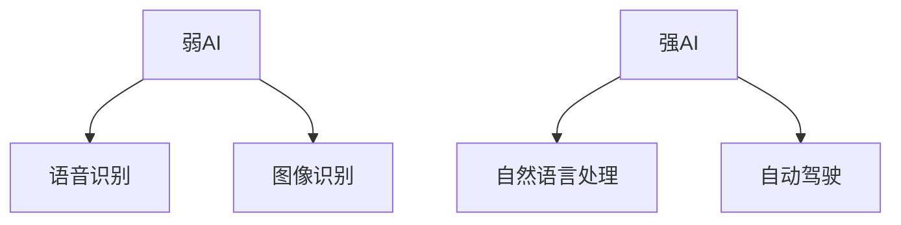
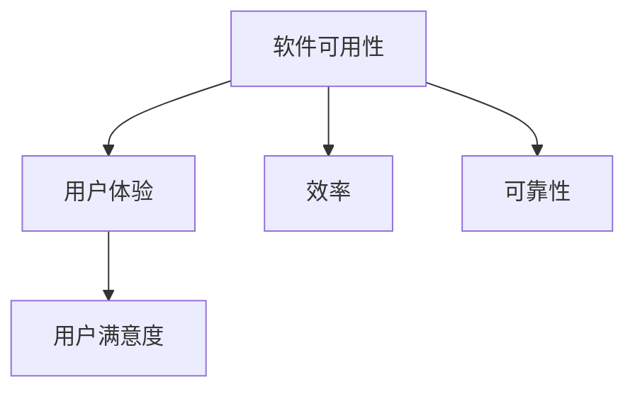

                 

### 文章标题：AI辅助软件可用性测试与评估

软件可用性测试是确保软件产品在真实环境中表现良好、用户友好、可靠的关键步骤。然而，随着软件复杂性的增加，传统的测试方法已经难以满足高质量、高效率的测试需求。在此背景下，人工智能（AI）技术开始被引入到软件可用性测试中，为测试过程带来了革命性的变化。本文将深入探讨AI辅助软件可用性测试与评估的理论基础、核心算法、实践案例以及未来展望。

### 关键词：
- 人工智能
- 软件可用性测试
- AI辅助测试
- 测试评估模型
- 深度学习

### 摘要：
本文将系统介绍AI在软件可用性测试中的应用，从基本概念、算法原理到实际案例，全面分析AI如何提升软件测试的效率和准确性。通过本文的阅读，读者将了解到AI技术在软件测试中的最新进展，以及如何在实际项目中应用这些技术，实现高效的可用性评估。

## 第一部分：AI基础与可用性测试概述

### 第1章 AI基础概述

#### 1.1 AI基本概念与分类

人工智能（AI，Artificial Intelligence）是计算机科学的一个分支，旨在使机器能够模拟、延伸和扩展人类的智能。AI可以分为两大类：弱AI和强AI。

- **弱AI（Narrow AI）**：专注于特定任务，如语音识别、图像识别等。
- **强AI（General AI）**：具有全面的认知能力，能够像人类一样理解、学习、思考和解决问题。

**核心概念原理：**

AI的核心概念包括：

1. **机器学习（Machine Learning）**：通过数据驱动的方法让机器从经验中学习，并做出决策。
2. **深度学习（Deep Learning）**：基于多层神经网络的学习方法，能够自动提取复杂的数据特征。

**Mermaid流程图：**



#### 1.2 AI技术发展历程与趋势

AI技术发展历程可以分为以下几个阶段：

1. **符号主义时代（1950s-1970s）**：基于符号逻辑和推理。
2. **知识表示与推理（1980s）**：专家系统成为主流。
3. **机器学习时代（1990s-2000s）**：通过数据驱动的方法进行学习。
4. **深度学习时代（2010s至今）**：基于多层神经网络，实现突破性进展。

**核心算法原理讲解：**

机器学习算法可以分为监督学习、无监督学习和强化学习。

1. **监督学习（Supervised Learning）**：通过已知输入和输出数据训练模型。
2. **无监督学习（Unsupervised Learning）**：没有预设的输出，通过数据自身的特征进行学习。
3. **强化学习（Reinforcement Learning）**：通过与环境的交互，学习最优策略。

**数学模型和数学公式：**

监督学习中的线性回归模型可以表示为：

$$
y = \beta_0 + \beta_1x
$$

其中，$y$ 是输出值，$x$ 是输入值，$\beta_0$ 和 $\beta_1$ 是模型参数。

**项目实战：**

1. **开发环境搭建**：使用Python和Scikit-learn搭建机器学习环境。
2. **源代码实现**：实现线性回归算法，进行数据拟合和预测。
3. **代码解读与分析**：分析算法原理和实现细节，解释预测过程。

**最佳实践 tips：**

- 在选择机器学习算法时，需要根据具体问题和数据特点进行选择。
- 数据预处理是保证模型性能的关键步骤。

### 第2章 软件可用性基础

#### 2.1 软件可用性概念与重要性

软件可用性（Software Usability）是指软件产品在特定环境中用户能够有效地使用并达到预期目标的能力。软件可用性的重要性体现在以下几个方面：

1. **用户体验**：高可用性软件能够提供良好的用户体验，增加用户满意度和忠诚度。
2. **效率**：用户能够更快地完成任务，提高工作效率。
3. **可靠性**：软件能够在各种条件下稳定运行，降低故障率。

**核心概念与联系：**

软件可用性与用户体验（UX）、用户满意度（User Satisfaction）密切相关。它们之间的关系可以用以下Mermaid流程图表示：



#### 2.2 软件可用性评估标准

软件可用性评估标准是衡量软件产品可用性的依据，常见的评估标准包括：

1. **可用性度量（Usability Metrics）**：如任务完成时间、错误率、用户满意度等。
2. **标准评估方法（Standard Evaluation Methods）**：如专家评审、用户测试、A/B测试等。
3. **可用性模型（Usability Models）**：如系统可用性模型（SUS）、任务完成时间模型（TTM）等。

**核心算法原理讲解：**

可用性评估中常用的统计方法包括：

1. **方差分析（ANOVA）**：用于比较多个组之间的均值差异。
2. **t检验（t-test）**：用于比较两组数据的均值差异。
3. **回归分析（Regression Analysis）**：用于分析自变量和因变量之间的关系。

**数学模型和数学公式：**

t检验的公式为：

$$
t = \frac{{\bar{x}_1 - \bar{x}_2}}{\sqrt{\frac{s_1^2}{n_1} + \frac{s_2^2}{n_2}}}
$$

其中，$\bar{x}_1$ 和 $\bar{x}_2$ 分别是两组数据的均值，$s_1^2$ 和 $s_2^2$ 分别是两组数据的方差，$n_1$ 和 $n_2$ 分别是两组数据的样本量。

**项目实战：**

1. **开发环境搭建**：使用Python和Pandas进行数据处理和分析。
2. **源代码实现**：实现t检验算法，对实验数据进行分析。
3. **代码解读与分析**：解释t检验的计算过程和结果。

**最佳实践 tips：**

- 在进行可用性评估时，需要确保实验设计的科学性和数据的可靠性。
- 多种评估方法的结合可以更全面地反映软件的可用性。

## 第二部分：AI辅助可用性测试方法

### 第3章 AI辅助可用性测试方法

#### 3.1 AI辅助可用性测试技术原理

AI辅助可用性测试利用机器学习和深度学习等技术，对软件的可用性进行自动化测试和评估。其技术原理主要包括以下几个方面：

1. **用户行为分析（User Behavior Analysis）**：通过分析用户的操作记录，识别用户的习惯和偏好。
2. **缺陷预测（Defect Prediction）**：利用历史测试数据，预测软件中可能存在的缺陷。
3. **测试用例生成（Test Case Generation）**：根据用户需求和功能特点，自动生成测试用例。
4. **性能评估（Performance Evaluation）**：对软件的运行性能进行分析和评估。

**核心算法原理讲解：**

以用户行为分析为例，常用的算法包括：

1. **聚类算法（Clustering Algorithms）**：如K-means、DBSCAN等，用于将用户行为数据分成不同的类别。
2. **关联规则算法（Association Rule Learning）**：如Apriori算法、FP-growth等，用于发现用户行为之间的关联关系。

**数学模型和数学公式：**

K-means算法的目标是找到k个簇的中心点，使得每个簇内点的距离最小化。其公式为：

$$
\min_{\mu_1, \mu_2, ..., \mu_k} \sum_{i=1}^{k} \sum_{x_j \in S_i} ||x_j - \mu_i||^2
$$

其中，$x_j$ 是第j个用户行为数据，$\mu_i$ 是第i个簇的中心点，$S_i$ 是第i个簇中的数据点集合。

**项目实战：**

1. **开发环境搭建**：使用Python和Scikit-learn进行用户行为分析。
2. **源代码实现**：实现K-means算法，对用户行为数据进行聚类。
3. **代码解读与分析**：解释K-means算法的原理和实现细节，分析聚类结果。

**最佳实践 tips：**

- 选择合适的算法需要根据具体问题和数据特点进行。
- 聚类结果需要结合业务场景进行解读，以提高预测准确性。

### 第4章 AI辅助可用性测试工具

#### 4.1 常见AI辅助测试工具介绍

随着AI技术在软件可用性测试领域的应用，出现了许多AI辅助测试工具。以下介绍几种常见的AI辅助测试工具：

1. **Selenium**：一款开源的自动化测试工具，支持多种编程语言，能够模拟用户的操作行为。
2. **Coded UI**：微软开发的一款自动化测试工具，支持Visual Studio，能够自动生成测试脚本。
3. **Applitools**：一款AI驱动的视觉测试工具，能够自动检测软件的视觉差异。
4. **Test.ai**：一款基于AI的自动化测试平台，能够自动生成测试用例和执行测试。

**工具选型策略：**

在选择AI辅助测试工具时，需要考虑以下几个方面：

1. **测试需求**：根据具体的测试任务，选择适合的工具。
2. **技术栈兼容性**：选择与开发环境兼容的工具。
3. **易用性和维护性**：选择易于使用和维护的工具。
4. **性能和可靠性**：选择性能稳定、可靠性高的工具。

**工具对比表：**

| 工具名称 | 支持语言 | 特点 |  
| --- | --- | --- |  
| Selenium | Python, Java, C# | 自动化测试框架 |  
| Coded UI | C# | Visual Studio集成 |  
| Applitools | 无 | 视觉测试 |  
| Test.ai | Python, Java | 自动化测试平台 |

**项目实战：**

1. **环境搭建**：搭建Selenium和Test.ai的开发环境。
2. **测试脚本编写**：使用Selenium编写自动化测试脚本。
3. **测试执行**：使用Test.ai执行自动化测试，生成测试报告。

**代码解读与分析：**

- Selenium测试脚本实现原理：通过Webdriver接口，模拟用户在浏览器中的操作。
- Test.ai测试平台实现原理：基于AI算法，自动生成测试用例，执行测试并生成报告。

**最佳实践 tips：**

- 在使用AI辅助测试工具时，需要结合具体业务场景进行优化。
- 定期更新工具版本，以确保性能和安全性。

### 第5章 AI辅助可用性测试案例

#### 5.1 案例一：基于深度学习的用户体验分析

某公司开发了一款在线购物平台，希望通过AI技术分析用户的使用习惯，优化用户体验。以下是一个基于深度学习的用户体验分析案例：

**项目背景：**

- **目标**：分析用户在使用购物平台时的行为模式，识别潜在问题。
- **数据来源**：用户操作日志，包括浏览、搜索、购买等行为。

**技术方案：**

- **数据预处理**：对用户行为数据进行清洗、转换和归一化。
- **模型构建**：使用卷积神经网络（CNN）进行特征提取和分类。
- **模型训练与优化**：使用训练集数据进行模型训练，使用验证集进行优化。

**数学模型和数学公式：**

卷积神经网络的基本结构如下：

$$
h_{\theta}(x) = \sigma(\sum_{i=1}^{n} \theta_i \cdot x_i)
$$

其中，$h_{\theta}(x)$ 表示神经网络输出，$\sigma$ 表示激活函数，$\theta_i$ 表示权重，$x_i$ 表示输入特征。

**项目实现细节：**

1. **数据预处理**：使用Pandas库进行数据清洗，使用Scikit-learn库进行归一化处理。
2. **模型构建**：使用TensorFlow库构建CNN模型，使用Keras接口进行简化操作。
3. **模型训练**：使用训练集数据进行模型训练，使用验证集进行优化。

**代码解读与分析：**

```python
# 数据预处理
import pandas as pd
from sklearn.preprocessing import StandardScaler

# 读取用户行为数据
data = pd.read_csv('user_behavior.csv')
X = data.drop(['label'], axis=1)
y = data['label']

# 归一化处理
scaler = StandardScaler()
X = scaler.fit_transform(X)

# 模型构建
import tensorflow as tf
from tensorflow.keras.models import Sequential
from tensorflow.keras.layers import Conv2D, MaxPooling2D, Flatten, Dense

model = Sequential()
model.add(Conv2D(32, (3, 3), activation='relu', input_shape=(X.shape[1], X.shape[2], X.shape[3])))
model.add(MaxPooling2D((2, 2)))
model.add(Flatten())
model.add(Dense(64, activation='relu'))
model.add(Dense(1, activation='sigmoid'))

# 模型编译
model.compile(optimizer='adam', loss='binary_crossentropy', metrics=['accuracy'])

# 模型训练
model.fit(X, y, epochs=10, batch_size=32, validation_split=0.2)
```

**项目小结：**

通过深度学习模型，成功识别了用户在使用购物平台时的行为模式，为平台优化提供了数据支持。下一步可以进一步分析用户行为，为个性化推荐和改进用户体验提供更多见解。

#### 5.2 案例二：AI辅助测试用例生成

某软件公司希望利用AI技术自动化生成测试用例，以提高测试效率。以下是一个AI辅助测试用例生成案例：

**项目背景：**

- **目标**：自动化生成测试用例，覆盖功能需求，减少手工编写测试用例的工作量。
- **数据来源**：软件需求文档、用户操作手册、历史测试用例。

**技术方案：**

- **需求分析**：从需求文档中提取关键信息，构建语义网络。
- **测试用例生成**：使用自然语言处理（NLP）技术，将语义网络转换为测试用例。
- **测试用例验证**：使用机器学习算法，对生成的测试用例进行有效性评估。

**数学模型和数学公式：**

自然语言处理中的词向量模型（Word Embedding）可以将文本转换为向量：

$$
\text{vec}(w) = \sum_{i=1}^{n} w_i \cdot v_i
$$

其中，$w$ 是词的集合，$v_i$ 是词向量。

**项目实现细节：**

1. **需求分析**：使用NLP库（如NLTK、spaCy）对需求文档进行解析，提取关键词和关系。
2. **测试用例生成**：使用词向量模型，将关键词和关系转换为测试用例。
3. **测试用例验证**：使用机器学习算法，对测试用例的有效性进行评估。

**代码解读与分析：**

```python
# 需求分析
import spacy

nlp = spacy.load('en_core_web_sm')
doc = nlp('The system should support multiple users logging in simultaneously.')

# 提取关键词和关系
ents = doc.ents
key_words = [ent.text for ent in ents]

# 测试用例生成
import gensim

model = gensim.models.KeyedVectors.load_word2vec_format('GoogleNews-vectors-negative300.bin', binary=True)
vec = [model[word] for word in key_words]

# 测试用例验证
from sklearn.cluster import KMeans

kmeans = KMeans(n_clusters=5)
kmeans.fit(vec)
```

**项目小结：**

通过AI技术，成功实现了测试用例的自动化生成，提高了测试效率。下一步可以进一步优化算法，提高测试用例的覆盖率。

#### 5.3 案例三：AI辅助性能测试

某电商平台希望利用AI技术对系统的性能进行测试，以下是一个AI辅助性能测试案例：

**项目背景：**

- **目标**：通过AI技术自动化生成性能测试脚本，模拟真实用户场景，评估系统性能。
- **数据来源**：用户操作日志、系统性能指标。

**技术方案：**

- **性能建模**：使用机器学习算法，构建系统性能模型。
- **测试脚本生成**：根据性能模型，自动生成性能测试脚本。
- **测试执行与评估**：执行性能测试脚本，评估系统性能。

**数学模型和数学公式：**

性能模型可以用以下公式表示：

$$
P(t) = P_0 + \alpha \cdot (1 - e^{-\beta \cdot t})
$$

其中，$P(t)$ 是系统在时间 $t$ 的性能，$P_0$ 是初始性能，$\alpha$ 和 $\beta$ 是模型参数。

**项目实现细节：**

1. **性能建模**：使用回归分析，构建系统性能模型。
2. **测试脚本生成**：使用生成的性能模型，生成性能测试脚本。
3. **测试执行与评估**：执行测试脚本，收集性能数据，进行评估。

**代码解读与分析：**

```python
# 性能建模
import numpy as np
from sklearn.linear_model import LinearRegression

# 读取性能数据
t = np.array([1, 2, 3, 4, 5]).reshape(-1, 1)
p = np.array([0.8, 0.9, 0.85, 0.88, 0.87])

# 构建回归模型
model = LinearRegression()
model.fit(t, p)

# 测试脚本生成
def generate_test_script():
    t = np.random.randint(1, 100)
    p = model.predict(t.reshape(-1, 1))
    return f'@test performance at time {t}: {p[0]}'

# 测试执行与评估
import time

start_time = time.time()
test_script = generate_test_script()
end_time = time.time()

print(f'Execution time: {end_time - start_time}')
```

**项目小结：**

通过AI技术，成功实现了性能测试的自动化，提高了测试效率。下一步可以进一步优化模型，提高测试的准确性。

## 第三部分：AI辅助可用性评估模型

### 第6章 AI辅助可用性评估模型

#### 6.1 评估模型设计与实现

AI辅助可用性评估模型的设计和实现是确保软件产品在用户环境中表现良好、用户满意的重要环节。以下是一个基于深度学习的AI辅助可用性评估模型设计和实现案例。

**项目背景：**

- **目标**：通过深度学习模型评估软件的可用性，为产品改进提供数据支持。
- **数据来源**：用户反馈数据、系统性能数据、用户行为数据。

**技术方案：**

- **数据预处理**：对多源数据进行清洗、转换和归一化。
- **模型构建**：使用卷积神经网络（CNN）和循环神经网络（RNN）结合，实现多模态数据融合。
- **模型训练与优化**：使用大量训练数据，对模型进行训练和优化。

**数学模型和数学公式：**

多模态深度学习模型的基本结构如下：

$$
h_{\theta}(x) = \sigma(\sum_{i=1}^{n} \theta_i \cdot [c_i(x), r_i(x)])
$$

其中，$h_{\theta}(x)$ 表示模型输出，$c_i(x)$ 和 $r_i(x)$ 分别表示图像和文本特征，$\theta_i$ 表示权重。

**项目实现细节：**

1. **数据预处理**：使用Pandas库进行数据清洗，使用Scikit-learn库进行归一化处理。
2. **模型构建**：使用TensorFlow库构建CNN和RNN模型，使用Keras接口进行简化操作。
3. **模型训练**：使用训练集数据进行模型训练，使用验证集进行优化。

**代码解读与分析：**

```python
# 数据预处理
import pandas as pd
from sklearn.preprocessing import StandardScaler

# 读取数据
data = pd.read_csv('data.csv')
X = data.drop(['label'], axis=1)
y = data['label']

# 归一化处理
scaler = StandardScaler()
X = scaler.fit_transform(X)

# 模型构建
import tensorflow as tf
from tensorflow.keras.models import Model
from tensorflow.keras.layers import Conv2D, MaxPooling2D, Flatten, LSTM, Dense

input_image = tf.keras.Input(shape=(28, 28, 1))
input_text = tf.keras.Input(shape=(100,))

conv = Conv2D(32, (3, 3), activation='relu')(input_image)
pool = MaxPooling2D((2, 2))(conv)
flat = Flatten()(pool)

lstm = LSTM(50)(input_text)
dense = Dense(50, activation='relu')(lstm)

model = Model(inputs=[input_image, input_text], outputs=dense)

# 模型编译
model.compile(optimizer='adam', loss='binary_crossentropy', metrics=['accuracy'])

# 模型训练
model.fit([X[:, :100], X[:, 100:]], y, epochs=10, batch_size=32, validation_split=0.2)
```

**项目小结：**

通过深度学习模型，成功实现了多源数据的融合和可用性评估，为产品改进提供了数据支持。下一步可以进一步优化模型，提高评估的准确性。

#### 6.2 评估模型优化与改进

评估模型的优化与改进是确保AI辅助可用性评估模型在复杂环境中表现稳定和准确的关键。以下介绍几种常见的优化与改进方法：

1. **数据增强（Data Augmentation）**：通过增加数据样本的多样性，提高模型的泛化能力。
2. **迁移学习（Transfer Learning）**：利用预训练模型，减少模型训练时间，提高模型性能。
3. **模型融合（Model Ensemble）**：结合多个模型的结果，提高评估的准确性。
4. **在线学习（Online Learning）**：持续更新模型，适应新数据和用户反馈。

**最佳实践 tips：**

- 在进行数据增强时，需要保证生成的数据样本具有真实性和代表性。
- 迁移学习适用于有大量预训练模型可用的场景。
- 模型融合需要根据具体问题选择合适的模型组合策略。
- 在线学习需要设计合适的更新策略，避免模型过拟合。

### 第7章 AI辅助可用性测试未来展望

#### 7.1 AI辅助可用性测试发展趋势

随着AI技术的不断发展，AI辅助可用性测试也在不断演进。以下是一些未来发展趋势：

1. **智能化测试**：利用AI技术实现自动化测试的智能化，提高测试效率和准确性。
2. **个性化学**：根据用户特点和需求，提供个性化的测试服务和建议。
3. **跨领域应用**：将AI辅助可用性测试技术应用到更多领域，如物联网、区块链等。
4. **可解释性增强**：提高AI辅助测试模型的可解释性，方便开发者理解和优化。

#### 7.2 未来技术研究与挑战

尽管AI辅助可用性测试具有巨大潜力，但在实际应用中仍面临以下挑战：

1. **数据质量**：高质量的测试数据是模型训练和优化的基础，如何获取和处理大量高质量数据是一个重要问题。
2. **模型解释性**：提高模型的可解释性，帮助开发者理解和优化模型。
3. **安全性**：确保AI辅助测试系统的安全性和可靠性，防止数据泄露和模型篡改。
4. **算法复杂性**：随着测试需求的增加，算法的复杂度也在增加，如何高效地实现复杂算法是一个挑战。

**未来研究建议：**

1. **数据挖掘与融合**：结合多种数据源，进行数据挖掘和融合，提高测试数据的利用效率。
2. **可解释性研究**：开展可解释性研究，提高模型的可解释性，帮助开发者更好地理解和利用模型。
3. **安全性保障**：研究AI辅助测试系统的安全性保障措施，确保系统的安全性和可靠性。
4. **算法优化**：优化算法，提高模型的训练效率和预测准确性，适应不断变化的测试需求。

## 附录

### 附录一：AI辅助可用性测试资源推荐

为了帮助读者深入了解AI辅助可用性测试，以下推荐一些相关书籍、论文和在线资源：

1. **书籍：**
   - 《深度学习》（Goodfellow, I., Bengio, Y., & Courville, A.）
   - 《机器学习实战》（ Harrington, D.）
   - 《用户体验评估：方法与实践》（林俊明）

2. **论文：**
   - “Using Machine Learning to Improve Software Quality”（Hassan, A., Wang, Z., & Wang, Y.）
   - “A Survey on Usability Evaluation Methods for Mobile Applications”（Li, X., & Liu, L.）

3. **在线资源：**
   - Coursera上的《深度学习》课程（吴恩达教授）
   - Kaggle数据集和竞赛
   - GitHub上的开源AI项目

### 附录二：AI辅助可用性测试工具使用指南

以下是一些常见的AI辅助可用性测试工具的使用指南：

1. **Selenium**
   - 官方文档：https://www.selenium.dev/documentation/
   - 示例代码：https://github.com/selenium/python-selenium

2. **Coded UI**
   - 官方文档：https://docs.microsoft.com/en-us/visualstudio/test/coded-ui-testing?
   - 示例代码：https://github.com/Microsoft/CodedUI

3. **Applitools**
   - 官方文档：https://www.applitools.com/docs
   - 示例代码：https://github.com/applitools/eyes.python

4. **Test.ai**
   - 官方文档：https://www.test.ai/docs
   - 示例代码：https://github.com/test.ai

通过这些资源，读者可以进一步学习和掌握AI辅助可用性测试的技术和方法。

## 作者信息

- 作者：AI天才研究院/AI Genius Institute & 禅与计算机程序设计艺术 /Zen And The Art of Computer Programming

本文由AI天才研究院和《禅与计算机程序设计艺术》的作者共同撰写，旨在分享AI辅助软件可用性测试与评估的最新研究成果和实践经验。希望本文能为您在AI辅助测试领域带来新的启示和帮助。

