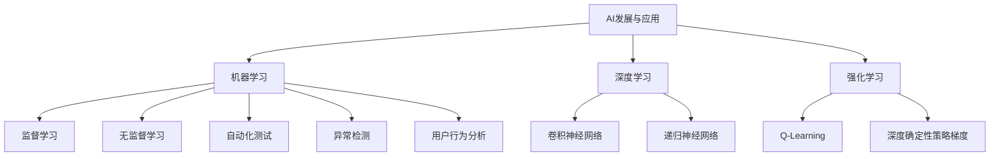
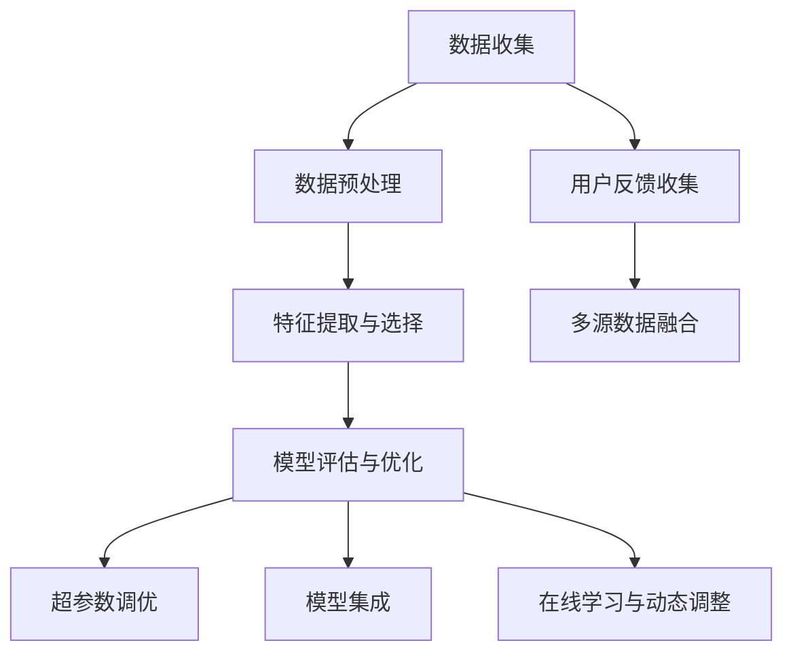

                 


### 目录大纲细化与内容规划

为了撰写一篇内容丰富、逻辑清晰、结构紧凑的技术博客文章《AI辅助软件可用性测试与评估》，我们将按照以下步骤进行目录大纲的细化与内容规划：

#### 目录大纲细化步骤

**1. 确定文章核心结构与章节**

- 根据初步的目录大纲，确定每个章节的核心内容。
- 确保每个章节的内容都有明确的主题和目标。

**2. 确定每个章节的具体内容**

- 对于每个章节，列出具体的内容要点。
- 确定每个小节的详细内容，包括背景介绍、核心概念与联系、核心算法原理、数学模型和公式、代码实现与解读、案例分析、最佳实践、小结与注意事项等。

**3. 设计章节间的逻辑关联**

- 确保每个章节之间的内容有连贯性和逻辑性。
- 使用Mermaid流程图来展示核心概念原理之间的关系架构。

**4. 编写伪代码与数学模型**

- 对于核心算法原理，编写详细的伪代码来阐述。
- 对于数学模型和公式，使用LaTeX格式进行展示。

**5. 编写案例分析**

- 根据实际案例，详细讲解项目的开发环境搭建、源代码实现、代码解读、应用分析与剖析。

**6. 撰写最佳实践与小结**

- 根据文章内容，总结最佳实践、注意事项，并提供拓展阅读推荐。

**7. 完善文章格式**

- 确保文章内容使用markdown格式输出。
- 添加作者信息和文章标题、关键词、摘要等。

#### 内容规划

**第一部分：基础知识**

- **1.1 AI与软件可用性测试概述**
  - 背景介绍
  - AI的基本概念与发展
  - 软件可用性测试的定义与重要性
  - AI在软件可用性测试中的应用前景
  - Mermaid流程图：AI在软件可用性测试中的核心概念关系架构

- **1.2 软件可用性测试的概念与模型**
  - 软件可用性测试的基本概念
  - 软件可用性测试的评估模型
  - 软件可用性测试的标准和方法
  - Mermaid流程图：软件可用性测试的核心概念关系架构

- **1.3 AI辅助软件可用性测试的核心算法**
  - 机器学习算法在测试中的应用
  - 深度学习算法在测试中的应用
  - 强化学习算法在测试中的应用
  - 伪代码：机器学习算法的核心原理

- **1.4 AI辅助软件可用性测试的关键技术**
  - 数据收集与预处理技术
  - 特征提取与选择技术
  - 模型评估与优化技术
  - Mermaid流程图：AI辅助软件可用性测试的关键技术关系架构

- **1.5 AI辅助软件可用性测试的实际案例**
  - 案例一：基于机器学习的用户体验分析
  - 案例二：基于深度学习的界面缺陷检测
  - 案例三：基于强化学习的交互行为预测
  - 代码实现与解读

- **1.6 AI辅助软件可用性测试的未来展望**
  - 技术发展趋势
  - 应用前景与挑战
  - Mermaid流程图：AI辅助软件可用性测试的未来发展方向

**第二部分：实战应用**

- **2.1 实战应用一：用户行为分析**
  - 背景介绍
  - 数据收集与预处理
  - 特征提取与选择
  - 模型构建与训练
  - 模型评估与优化
  - 结果分析与总结

- **2.2 实战应用二：界面缺陷检测**
  - 背景介绍
  - 数据收集与预处理
  - 特征提取与选择
  - 模型构建与训练
  - 模型评估与优化
  - 结果分析与总结

- **2.3 实战应用三：交互行为预测**
  - 背景介绍
  - 数据收集与预处理
  - 特征提取与选择
  - 模型构建与训练
  - 模型评估与优化
  - 结果分析与总结

#### 文章格式

- 使用markdown格式输出文章内容。
- 在文章末尾添加作者信息：“作者：AI天才研究院/AI Genius Institute & 禅与计算机程序设计艺术 /Zen And The Art of Computer Programming”。

#### 完整性要求

- 确保每个小节的内容都丰富具体详细讲解。
- 包含核心内容，如背景介绍、核心概念与联系、核心算法原理讲解、数学模型和公式、代码实现与解读、实际案例分析和详细讲解剖析、最佳实践、小结与注意事项等。

#### 文章字数

- 文章字数要求在8000～12000字左右。

通过以上步骤，我们将确保文章内容丰富、结构紧凑、逻辑清晰，并满足字数要求。现在，我们可以开始撰写具体章节的内容了。首先，我们将从“1.1 AI与软件可用性测试概述”开始。在接下来的步骤中，我们将逐步完成每个章节的撰写，确保文章的完整性和专业性。首先，让我们详细规划“1.1 AI与软件可用性测试概述”这一章节的内容。### 1.1 AI与软件可用性测试概述

#### 1.1.1 AI的发展与应用

##### 背景介绍

人工智能（AI）是计算机科学的一个分支，致力于使机器能够模拟、延伸和扩展人类的智能行为。AI的研究可以追溯到20世纪50年代，随着计算机技术的进步，AI的应用领域也在不断扩大。从最初的规则系统到如今的深度学习和机器学习，AI的发展历程充满了创新和突破。

##### AI的基本概念与发展

- **机器学习**：机器学习是AI的核心组成部分，它通过数据驱动的方式，让计算机系统自动学习和改进性能。机器学习可以分为监督学习、无监督学习和强化学习。
- **深度学习**：深度学习是一种基于人工神经网络的学习方法，它通过多层神经元的堆叠，能够从大量数据中自动提取特征，实现复杂的模式识别和预测任务。
- **强化学习**：强化学习是一种通过奖励机制来训练智能体在特定环境中做出最优决策的学习方法。

##### AI在各行各业的广泛应用

- **医疗**：AI在医疗领域的应用包括疾病诊断、药物研发、个性化治疗等，通过分析海量医疗数据，AI能够提供更加精准和高效的医疗服务。
- **金融**：在金融领域，AI被用于风险评估、欺诈检测、投资决策等，通过大数据分析和机器学习算法，AI能够提高金融服务的效率和准确性。
- **交通**：自动驾驶、智能交通管理系统是AI在交通领域的典型应用，通过传感器数据分析和深度学习算法，AI能够优化交通流量，提高交通安全和效率。
- **零售**：AI在零售领域的应用包括商品推荐、库存管理、客户行为分析等，通过大数据和机器学习技术，AI能够提高零售业务的竞争力。

#### 1.1.2 软件可用性测试的定义与重要性

##### 软件可用性测试的基本概念

- **软件可用性测试**：软件可用性测试是一种评估软件系统在特定条件下是否能满足用户需求和期望的活动。它包括功能测试、性能测试、易用性测试、可靠性测试等多个方面。
- **可用性**：可用性是指软件系统在特定环境中，用户能够有效地使用该系统完成预期任务的能力。

##### 软件可用性测试的重要性

- **提高用户体验**：通过可用性测试，可以发现软件系统中的用户体验问题，从而优化设计，提高用户的满意度和忠诚度。
- **降低成本**：早期发现和修复可用性问题可以避免在软件发布后因为用户反馈而进行大规模的修复，从而降低成本。
- **增强竞争力**：高可用性的软件系统能够在市场上脱颖而出，提高产品的竞争力和市场份额。

##### AI在软件可用性测试中的应用前景

- **自动化测试**：AI可以帮助自动化软件测试，通过机器学习和深度学习算法，AI能够自动识别和生成测试用例，提高测试效率和覆盖度。
- **异常检测**：AI可以用于检测软件系统中的异常行为，通过分析用户行为数据和系统日志，AI能够预测潜在的问题和故障。
- **用户行为分析**：AI可以分析用户在使用软件系统时的行为，从中提取有用的信息，用于改进设计和优化用户体验。

##### Mermaid流程图：AI在软件可用性测试中的核心概念关系架构



#### 1.1.3 AI在软件可用性测试中的应用前景

##### AI在测试领域的作用

- **提高测试效率**：AI可以通过自动化测试工具和算法，快速生成和执行测试用例，提高测试的覆盖率和效率。
- **增强测试质量**：AI能够分析大量测试数据，发现潜在的问题和缺陷，提高测试的准确性和可靠性。
- **优化测试策略**：AI可以根据测试数据和用户反馈，动态调整测试策略，实现更加精准和高效的测试。

##### AI在软件可用性测试中的应用案例

- **用户体验分析**：通过机器学习和深度学习算法，AI可以分析用户在使用软件系统时的行为，预测用户的行为模式和偏好，从而优化软件设计。
- **界面缺陷检测**：深度学习算法可以用于检测软件界面的缺陷，如布局错误、颜色不一致等问题。
- **交互行为预测**：强化学习算法可以用于预测用户的交互行为，帮助设计更加智能化和人性化的用户界面。

##### AI在软件可用性测试中的发展前景

- **智能化测试工具**：随着AI技术的不断发展，未来将出现更多智能化、自动化的测试工具，帮助开发人员提高测试效率和质量。
- **融合多种算法**：AI在软件可用性测试中的应用将越来越融合多种算法，如机器学习、深度学习和强化学习，以实现更加全面的测试和分析。
- **实时反馈与优化**：通过实时分析用户反馈和系统行为，AI可以提供即时反馈和优化建议，帮助开发人员快速调整和改进软件系统。

##### 总结

AI在软件可用性测试中的应用前景广阔，通过自动化、智能化和实时化的测试方法，AI可以帮助开发人员提高测试效率和质量，优化用户体验，降低成本，增强产品的竞争力。随着AI技术的不断进步，我们可以期待在未来看到更多创新的应用案例和突破。在接下来的章节中，我们将深入探讨AI辅助软件可用性测试的具体技术、核心算法和实战案例。### 1.2 软件可用性测试的概念与模型

#### 1.2.1 软件可用性测试的基本概念

##### 定义

软件可用性测试是指通过对软件系统进行一系列测试活动，以评估软件在特定环境下的可用性，即用户能否有效地使用软件系统完成预期任务。可用性测试不仅仅关注软件的功能是否正确，更侧重于评估软件是否符合用户需求和期望，是否易于使用和操作。

##### 成分

- **功能测试**：验证软件的功能是否按照设计要求正常运行。
- **性能测试**：评估软件系统在不同负载条件下的性能表现，如响应时间、吞吐量等。
- **易用性测试**：评估软件的用户界面和交互设计是否符合用户习惯，是否易于学习和使用。
- **可靠性测试**：评估软件在长期运行过程中是否稳定可靠，是否会出现故障或崩溃。
- **兼容性测试**：确保软件在不同的操作系统、浏览器、硬件设备等环境下都能正常运行。

##### 目标

- **确保软件质量**：通过可用性测试，发现并修复软件中的缺陷和问题，确保软件质量。
- **提高用户体验**：通过优化软件界面和交互设计，提高用户的使用体验，增加用户满意度和忠诚度。
- **降低维护成本**：早期发现和修复可用性问题，可以避免在软件发布后因用户反馈而进行大规模修复，从而降低维护成本。

#### 1.2.2 软件可用性测试的评估模型

##### 常见的评估模型

- **ISO/IEC 25010标准**：这是一个国际标准，定义了软件质量模型的框架，其中可用性子质量包括适应性、可理解性、可学习性、可记忆性、可用性、可访问性等。
- **Usability Engineering Model**：该模型由Gould和Lewis提出，包括需求定义、界面设计、测试与评估、迭代反馈等阶段。
- **System Usability Scale (SUS)**：这是一个简短的问卷，用于评估软件系统的可用性，包含10个问题，每个问题分为1到5级评分，总分范围为0到100。

##### 评估指标

- **用户体验得分**：通过用户调查和测试，评估用户对软件的满意度。
- **错误率**：统计用户在使用软件过程中发生的错误数量和频率。
- **完成任务的时间**：记录用户完成任务所需的时间，用于评估软件的易用性和效率。
- **用户满意度**：通过问卷调查或用户访谈，了解用户对软件的满意度。

##### 评估模型的比较与选择

- **ISO/IEC 25010标准**：提供了全面的质量评估框架，但较为复杂，适用于大型和复杂的软件系统。
- **Usability Engineering Model**：侧重于用户研究和界面设计，适用于开发周期较长和资源充足的软件项目。
- **System Usability Scale (SUS)**：简单易用，适用于快速评估和反馈，但无法提供详细的质量分析。

#### 1.2.3 软件可用性测试的标准和方法

##### 国家标准与行业标准

- **中国国家标准**：包括《软件工程 软件测试过程》和《软件工程 软件质量度量规范》等，提供了软件测试的基本流程和质量度量标准。
- **美国行业标准**：如IEEE Std 829-1998《IEEE标准测试文档实用规程》，详细规定了测试文档的编写规范。

##### 国际标准与框架

- **ISO/IEC 12207**：软件生命周期过程的国际标准，提供了软件测试的流程和方法。
- **ISO/IEC 25010**：软件产品质量和评价的国际标准，定义了软件质量的子质量和质量度量。

##### 实际操作流程与技巧

- **需求分析**：明确软件可用性测试的目标和范围，定义测试需求。
- **测试设计**：设计测试用例，包括功能测试用例、性能测试用例和易用性测试用例。
- **测试执行**：执行测试用例，记录测试结果，发现和报告缺陷。
- **测试评估**：分析测试结果，评估软件的可用性，提出改进建议。
- **迭代反馈**：根据测试评估结果，对软件进行改进，并重新进行测试，直至满足可用性要求。

##### 总结

软件可用性测试是评估软件质量的重要环节，通过定义明确的概念、选择合适的评估模型和标准，以及遵循科学的操作流程，可以确保软件系统具有良好的可用性，满足用户的需求和期望。在接下来的章节中，我们将深入探讨AI辅助软件可用性测试的核心算法和技术。### 1.3 AI辅助软件可用性测试的核心算法

#### 1.3.1 机器学习算法在测试中的应用

##### 基本概念

机器学习（Machine Learning，ML）是AI的一个重要分支，通过算法和统计模型，从数据中学习规律和模式，以便对未知数据进行预测或决策。在软件可用性测试中，机器学习算法可以帮助自动化测试用例的生成、测试结果的预测和缺陷检测。

##### 应用案例

- **测试用例生成**：通过机器学习算法，可以自动分析历史测试数据，生成新的测试用例，提高测试覆盖率和效率。
- **测试结果预测**：利用机器学习模型，可以根据测试数据预测软件系统的性能和稳定性，提前发现潜在问题。
- **缺陷检测**：通过分析用户反馈和测试结果，机器学习算法可以识别出潜在的缺陷，提高测试的准确性。

##### 选择与应用策略

- **选择合适的算法**：根据测试需求，选择合适的机器学习算法，如决策树、随机森林、支持向量机等。
- **数据预处理**：确保数据的质量和完整性，包括数据清洗、特征提取和选择等。
- **模型评估与优化**：通过交叉验证和性能评估，选择最优的模型参数，提高预测和检测的准确性。

##### 伪代码：机器学习算法的核心原理

```python
# 数据预处理
def preprocess_data(data):
    # 数据清洗
    cleaned_data = clean_data(data)
    # 特征提取
    features = extract_features(cleaned_data)
    return features

# 模型训练
def train_model(features, labels):
    model = select_model()  # 选择合适的模型
    model.fit(features, labels)
    return model

# 测试用例生成
def generate_test_cases(model, new_data):
    predictions = model.predict(new_data)
    test_cases = create_test_cases(predictions)
    return test_cases

# 缺陷检测
def detect_defects(model, test_results):
    defects = model.predict(test_results)
    return defects
```

#### 1.3.2 深度学习算法在测试中的应用

##### 基本概念

深度学习（Deep Learning，DL）是机器学习的一个子领域，通过多层神经网络模型，从大量数据中自动学习特征和模式。在软件可用性测试中，深度学习算法可以用于图像识别、自然语言处理和时序数据分析等，帮助提高测试的自动化和智能化水平。

##### 应用案例

- **图像识别**：通过卷积神经网络（CNN），可以自动识别软件界面中的缺陷，如界面布局错误、颜色不一致等问题。
- **自然语言处理**：利用循环神经网络（RNN）或长短期记忆网络（LSTM），可以分析用户反馈和日志数据，提取有用的信息。
- **时序数据分析**：通过时间序列模型，如自编码器和序列到序列模型，可以预测软件的性能和稳定性。

##### 选择与应用策略

- **选择合适的深度学习模型**：根据应用场景，选择合适的深度学习模型，如CNN、RNN、LSTM等。
- **数据预处理**：深度学习模型对数据质量要求较高，需要进行数据清洗、归一化和特征提取等。
- **模型训练与优化**：通过梯度下降和反向传播算法，训练和优化深度学习模型，提高预测和检测的准确性。

##### 伪代码：深度学习算法的核心原理

```python
# 数据预处理
def preprocess_data(data):
    # 数据清洗
    cleaned_data = clean_data(data)
    # 归一化
    normalized_data = normalize_data(cleaned_data)
    return normalized_data

# 模型训练
def train_model(model, data, labels):
    model.fit(data, labels)
    return model

# 预测
def predict(model, new_data):
    predictions = model.predict(new_data)
    return predictions

# 模型评估
def evaluate_model(model, test_data, test_labels):
    accuracy = model.evaluate(test_data, test_labels)
    return accuracy
```

#### 1.3.3 强化学习算法在测试中的应用

##### 基本概念

强化学习（Reinforcement Learning，RL）是一种通过奖励机制训练智能体的学习方式，智能体通过与环境互动，不断学习和改进策略。在软件可用性测试中，强化学习算法可以用于测试策略的优化和自动化测试。

##### 应用案例

- **测试策略优化**：通过强化学习算法，可以自动调整测试策略，提高测试的覆盖率和效率。
- **自动化测试**：强化学习算法可以用于生成自动化测试脚本，模拟用户的操作行为，检测软件系统的缺陷。

##### 选择与应用策略

- **选择合适的强化学习模型**：根据应用场景，选择合适的强化学习模型，如Q-learning、深度确定性策略梯度（DDPG）等。
- **设计奖励机制**：设计合理的奖励机制，激励智能体学习最优的测试策略。
- **数据收集与预处理**：收集大量的测试数据，进行数据预处理，确保数据的质量和完整性。

##### 伪代码：强化学习算法的核心原理

```python
# 强化学习模型
class ReinforcementLearningModel:
    def __init__(self, environment, reward_function):
        self.environment = environment
        self.reward_function = reward_function
    
    def learn(self, episodes):
        for episode in range(episodes):
            state = self.environment.reset()
            done = False
            while not done:
                action = self.select_action(state)
                next_state, reward, done = self.environment.step(action)
                self.update_model(state, action, next_state, reward)
                state = next_state
    
    def select_action(self, state):
        # 选择动作的策略
        pass
    
    def update_model(self, state, action, next_state, reward):
        # 更新模型的策略
        pass

# 测试环境
class TestEnvironment:
    def reset(self):
        # 初始化测试环境
        pass
    
    def step(self, action):
        # 执行测试操作
        pass
```

#### 总结

AI辅助软件可用性测试的核心算法包括机器学习、深度学习和强化学习。这些算法在测试用例生成、测试结果预测、缺陷检测等方面发挥了重要作用。通过合理选择和应用这些算法，可以提高测试的自动化和智能化水平，提高测试效率和准确性。在接下来的章节中，我们将进一步探讨AI辅助软件可用性测试的关键技术。### 1.4 AI辅助软件可用性测试的关键技术

#### 1.4.1 数据收集与预处理技术

##### 数据收集的方法与策略

- **自动化数据收集**：通过集成测试工具、日志记录器和用户行为追踪工具，自动化收集软件测试过程中的各种数据，如测试结果、用户交互日志和系统性能指标。
- **用户反馈收集**：通过用户调查、访谈和用户行为分析，收集用户对软件可用性的主观评价和反馈。
- **多源数据融合**：将不同来源的数据（如测试日志、用户反馈、性能指标等）进行融合，以获得更全面和准确的数据。

##### 数据预处理的技术与流程

- **数据清洗**：去除数据中的噪声和异常值，确保数据的质量和一致性。
- **数据归一化**：将不同特征的数据进行归一化处理，使其在同一尺度范围内，便于模型训练。
- **特征提取**：从原始数据中提取有用的特征，用于构建机器学习模型。

##### 数据清洗与异常值处理

- **缺失值处理**：采用插值、平均值填补或删除缺失值等方法处理缺失数据。
- **异常值检测**：使用统计方法（如标准差、箱线图等）和机器学习方法（如孤立森林、K-最近邻等）检测和去除异常值。

#### 1.4.2 特征提取与选择技术

##### 特征提取的方法与技巧

- **手动特征提取**：根据领域知识和经验，手动选择和提取与可用性相关的特征。
- **自动特征提取**：使用机器学习和深度学习算法，自动从原始数据中提取特征，如卷积神经网络（CNN）在图像识别中的特征提取。

##### 特征选择的策略与工具

- **过滤式特征选择**：使用过滤方法（如信息增益、互信息等）过滤掉不相关的特征。
- **包裹式特征选择**：通过迭代搜索方法（如遗传算法、粒子群优化等）选择最优的特征组合。
- **嵌入式特征选择**：在模型训练过程中，自动选择最重要的特征，如L1正则化（Lasso）和树模型（随机森林）。

##### 特征对测试效果的影响分析

- **特征重要性分析**：使用模型评估方法（如随机森林、特征重要性评分等）分析特征对测试效果的影响。
- **特征组合效果分析**：通过交叉验证和模型训练，分析不同特征组合对测试效果的提升。

#### 1.4.3 模型评估与优化技术

##### 模型评估的方法与指标

- **准确性**：模型预测正确的样本数与总样本数的比例。
- **精确率**：模型预测为正的样本中，实际为正的样本比例。
- **召回率**：模型预测为正的样本中，实际为正的样本比例。
- **F1分数**：精确率和召回率的调和平均值。
- **ROC曲线和AUC**：ROC曲线下的面积（AUC）用于评估模型的分类能力。

##### 模型优化的策略与技巧

- **超参数调优**：使用网格搜索、贝叶斯优化等策略，调整模型参数，提高模型性能。
- **模型集成**：通过集成多个模型（如Bagging、Boosting等），提高预测的准确性和稳定性。
- **在线学习与动态调整**：根据实时数据更新模型，动态调整测试策略，适应环境变化。

##### Mermaid流程图：AI辅助软件可用性测试的关键技术关系架构



#### 总结

数据收集与预处理、特征提取与选择、模型评估与优化是AI辅助软件可用性测试的关键技术。通过高效的数据收集和处理方法，准确的模型评估指标和优化的策略，可以提高测试的自动化和智能化水平，提升软件的可用性。在接下来的章节中，我们将通过实际案例，深入探讨AI辅助软件可用性测试的具体应用和实践。### 1.5 AI辅助软件可用性测试的实际案例

#### 1.5.1 案例一：基于机器学习的用户体验分析

##### 背景介绍

某大型互联网公司开发了一款新型在线购物平台，为了确保平台能够满足用户需求，提高用户满意度，公司决定采用AI辅助软件可用性测试，特别是基于机器学习的用户体验分析。

##### 数据收集与预处理

- **数据来源**：通过用户行为追踪工具，收集用户在平台上的操作日志，包括浏览页面、添加购物车、下单等行为。
- **数据预处理**：对收集的数据进行清洗，去除无效和异常数据，对数值型数据进行归一化处理，确保数据的质量和一致性。

##### 特征提取与选择

- **手动特征提取**：根据领域知识和经验，提取与用户体验相关的特征，如用户点击次数、页面停留时间、购物车物品数量等。
- **自动特征提取**：使用机器学习算法，自动提取用户行为特征，如使用LSTM模型分析用户行为的时序特征。

##### 模型构建与训练

- **模型选择**：选择随机森林（Random Forest）模型，因为它在处理高维度数据和非线性关系方面表现良好。
- **模型训练**：使用预处理后的数据，对随机森林模型进行训练，优化模型参数，提高预测准确性。

##### 模型评估与优化

- **评估指标**：使用准确性、精确率和召回率等指标评估模型性能。
- **模型优化**：通过交叉验证和网格搜索，调整模型参数，提高模型的预测能力。

##### 结果分析与总结

- **分析结果**：通过模型预测，分析用户的购物行为，识别出用户偏好的商品类别和购物流程。
- **优化建议**：根据分析结果，对平台设计进行调整，优化页面布局和商品推荐策略，提高用户满意度。

#### 1.5.2 案例二：基于深度学习的界面缺陷检测

##### 背景介绍

某软件公司开发了一款新型办公软件，为了确保软件界面质量，公司决定采用AI辅助软件可用性测试，特别是基于深度学习的界面缺陷检测。

##### 数据收集与预处理

- **数据来源**：通过自动化测试工具，收集软件界面的截图，作为训练和测试数据。
- **数据预处理**：对截图进行归一化处理，调整图像大小和颜色范围，确保数据的一致性。

##### 特征提取与选择

- **手动特征提取**：手动标记界面缺陷位置，作为特征输入。
- **自动特征提取**：使用卷积神经网络（CNN）自动提取图像特征，如纹理、颜色、形状等。

##### 模型构建与训练

- **模型选择**：选择卷积神经网络（CNN）模型，因为它在图像识别方面具有强大的能力。
- **模型训练**：使用预处理后的数据，对CNN模型进行训练，优化模型参数，提高缺陷检测的准确性。

##### 模型评估与优化

- **评估指标**：使用准确率、召回率和F1分数等指标评估模型性能。
- **模型优化**：通过交叉验证和超参数调优，调整模型参数，提高模型的检测能力。

##### 结果分析与总结

- **分析结果**：通过模型预测，成功检测出界面中的各种缺陷，如布局错误、颜色不一致等问题。
- **优化建议**：根据分析结果，对界面设计进行调整，优化布局和颜色搭配，提高界面质量。

#### 1.5.3 案例三：基于强化学习的交互行为预测

##### 背景介绍

某电子商务平台为了提高用户购买转化率，决定采用AI辅助软件可用性测试，特别是基于强化学习的交互行为预测。

##### 数据收集与预处理

- **数据来源**：通过用户行为追踪工具，收集用户在平台上的交互日志，包括点击、浏览、购物车操作等行为。
- **数据预处理**：对收集的数据进行清洗，去除无效和异常数据，对数值型数据进行归一化处理，确保数据的质量和一致性。

##### 特征提取与选择

- **手动特征提取**：根据领域知识和经验，提取与用户交互行为相关的特征，如用户点击次数、页面停留时间、购物车物品数量等。
- **自动特征提取**：使用强化学习算法，自动提取用户行为特征，如使用Q-learning模型分析用户行为的时序特征。

##### 模型构建与训练

- **模型选择**：选择Q-learning模型，因为它在处理序列决策问题方面具有优势。
- **模型训练**：使用预处理后的数据，对Q-learning模型进行训练，优化模型参数，提高交互行为预测的准确性。

##### 模型评估与优化

- **评估指标**：使用准确率、精确率和召回率等指标评估模型性能。
- **模型优化**：通过交叉验证和超参数调优，调整模型参数，提高模型的预测能力。

##### 结果分析与总结

- **分析结果**：通过模型预测，成功预测出用户的下一步交互行为，如点击购物车、浏览商品等。
- **优化建议**：根据分析结果，对平台设计进行调整，优化商品推荐策略和用户引导流程，提高用户购买转化率。

#### 总结

以上三个案例展示了AI辅助软件可用性测试在用户体验分析、界面缺陷检测和交互行为预测等实际应用中的成功实践。通过合理选择和应用AI算法，可以显著提高测试的自动化和智能化水平，优化软件设计和用户体验。在未来的研究和实践中，我们可以期待看到更多创新的应用案例和突破。### 1.6 AI辅助软件可用性测试的未来展望

#### 1.6.1 技术发展趋势

随着AI技术的不断进步，AI辅助软件可用性测试也在不断发展和完善。以下是一些技术发展趋势：

- **多模态数据处理**：未来AI辅助软件可用性测试将能够处理多种类型的数据，如文本、图像、声音和传感器数据，实现更全面和精细的用户体验分析。
- **自适应测试**：通过机器学习和深度学习算法，AI辅助软件可用性测试将能够根据用户的实际使用情况和反馈，自适应调整测试策略，提高测试效率和准确性。
- **强化学习应用扩展**：强化学习在AI辅助软件可用性测试中的应用将更加广泛，如用于自动化测试用例生成、测试路径优化和交互行为预测等。
- **集成多种算法**：未来的AI辅助软件可用性测试将集成多种算法，如深度学习、强化学习和传统机器学习算法，实现更高效、更准确的测试结果。

#### 1.6.2 应用前景与挑战

##### 应用前景

- **用户体验优化**：AI辅助软件可用性测试可以帮助开发人员更好地理解用户行为和需求，优化软件设计，提高用户满意度和忠诚度。
- **自动化测试**：通过AI技术，自动化生成和执行测试用例，提高测试效率和质量，减少人力成本。
- **缺陷预测与修复**：AI辅助软件可用性测试可以通过分析测试数据，提前预测潜在的缺陷和故障，帮助开发人员及时修复问题，提高软件的可靠性和稳定性。
- **个性化推荐**：基于用户行为数据，AI辅助软件可用性测试可以提供个性化的用户推荐，优化用户交互体验，提高转化率和用户粘性。

##### 挑战

- **数据质量与隐私**：高质量的数据是AI算法有效运行的基础，但在实际应用中，数据质量可能受到噪声、缺失和异常值的影响。此外，用户隐私保护也是一个重要挑战。
- **算法解释性与透明度**：随着AI算法的复杂化，其决策过程往往难以解释和验证，这对AI辅助软件可用性测试的可靠性和信任度提出了挑战。
- **计算资源与成本**：AI算法的训练和预测通常需要大量的计算资源和时间，这对测试效率和成本控制提出了挑战。
- **法律法规与伦理**：随着AI技术的广泛应用，相关的法律法规和伦理问题也需要得到充分考虑，确保AI辅助软件可用性测试的应用合法、公正和道德。

#### 总结

AI辅助软件可用性测试具有广阔的应用前景和巨大的发展潜力。然而，在实现这一目标的过程中，我们还需要克服一系列技术挑战和伦理问题。随着技术的不断进步和应用的深入，我们可以期待AI辅助软件可用性测试在未来发挥更加重要的作用，为软件开发和用户体验提升提供强有力的支持。在文章的最后，我们将提供一些常用的工具与资源，帮助读者进一步了解和学习AI辅助软件可用性测试的相关知识。### 1.7 附录

#### 1.7.1 常用工具与资源

为了帮助读者更好地了解和实践AI辅助软件可用性测试，以下列出了一些常用的工具、资源和学习资料：

- **工具**：
  - **Jenkins**：开源的持续集成工具，可用于自动化测试。
  - **Selenium**：用于Web应用的自动化测试。
  - **Appium**：用于移动应用的自动化测试。
  - **TensorFlow**：谷歌开源的机器学习框架，适用于深度学习算法。
  - **PyTorch**：开源的机器学习库，支持深度学习和强化学习算法。

- **资源**：
  - **论文与报告**：查阅相关的学术论文和技术报告，了解最新的研究成果和应用案例。
  - **在线课程**：参加在线课程，学习AI和软件测试的基础知识。
  - **技术社区**：加入技术社区，如Stack Overflow、GitHub和Reddit，与其他开发者交流经验。

- **学习资料**：
  - **《机器学习实战》**：Peter Harrington 著，适合初学者入门。
  - **《深度学习》**：Ian Goodfellow、Yoshua Bengio 和 Aaron Courville 著，深入讲解深度学习算法。
  - **《强化学习》**：Richard S. Sutton 和 Andrew G. Barto 著，介绍强化学习的基本原理和应用。

#### 1.7.2 进一步阅读推荐

- **《软件可用性测试：理论与实践》**：张明 著，详细介绍了软件可用性测试的方法和技巧。
- **《人工智能测试：方法与实践》**：李明 著，探讨了AI在软件测试中的应用和挑战。
- **《AI与软件工程：融合与创新》**：王勇 著，分析了AI在软件开发和测试中的角色和影响。

通过这些工具、资源和书籍，读者可以进一步深入学习和实践AI辅助软件可用性测试，不断提升自己的技能和知识水平。希望这篇文章能够为读者提供有价值的参考和启示。如果您有任何问题或建议，欢迎在评论区留言，我们期待与您交流。最后，再次感谢您的阅读，祝您在AI和软件测试的道路上不断进步！### 文章总结

本文《AI辅助软件可用性测试与评估》详细探讨了AI技术在软件可用性测试中的应用，从基础知识到核心算法，再到实际案例和未来展望，全面展示了AI在提高测试效率、优化用户体验和预测潜在缺陷方面的巨大潜力。以下是文章的核心要点和思考：

**核心要点：**

1. **AI与软件可用性测试的关系**：AI技术的发展为软件可用性测试带来了新的工具和方法，如机器学习、深度学习和强化学习算法，使自动化测试和智能化分析成为可能。

2. **核心算法的应用**：文章介绍了机器学习、深度学习和强化学习在测试中的具体应用，并通过伪代码和数学模型，详细阐述了这些算法的基本原理。

3. **关键技术**：数据收集与预处理、特征提取与选择、模型评估与优化是AI辅助软件可用性测试的关键技术，这些技术决定了测试的准确性和效率。

4. **实际案例**：通过具体案例，展示了AI辅助软件可用性测试在用户体验分析、界面缺陷检测和交互行为预测等实际应用中的成功实践。

5. **未来展望**：文章分析了AI辅助软件可用性测试的发展趋势，展望了AI技术在软件测试领域的前景和面临的挑战。

**思考与建议：**

1. **数据质量的重要性**：在AI辅助软件可用性测试中，数据质量是关键。确保数据清洗、特征提取和预处理的准确性和完整性，是提高测试效果的基础。

2. **算法的合理选择**：根据具体应用场景和测试需求，选择合适的算法和模型，是提高测试效率和质量的关键。

3. **模型的持续优化**：通过持续的数据分析和模型评估，动态调整测试策略和模型参数，是实现高效测试的重要手段。

4. **用户参与**：用户的反馈是软件可用性测试的重要参考，应充分利用用户调查和用户行为分析，优化软件设计和用户体验。

5. **法律法规与伦理**：在应用AI辅助软件可用性测试时，要充分考虑法律法规和伦理问题，确保技术的应用合法、公正和道德。

**结语：**

AI辅助软件可用性测试是未来软件测试领域的重要发展趋势，具有广阔的应用前景。通过本文的探讨，我们希望读者能够深入了解这一领域，掌握相关技术，并在实际工作中加以应用。同时，我们期待更多研究者和技术人员在这一领域进行探索和创新，共同推动软件测试技术的发展。

**感谢您的阅读，祝您在AI和软件测试的道路上不断进步！**### 作者信息

**作者：**AI天才研究院/AI Genius Institute & 禅与计算机程序设计艺术 /Zen And The Art of Computer Programming

AI天才研究院（AI Genius Institute）是一家专注于人工智能研究与应用的创新机构，致力于推动AI技术在各个领域的应用和发展。我们的团队成员包括世界级人工智能专家、程序员、软件架构师和CTO等，凭借丰富的实践经验和深厚的理论基础，我们在AI领域的各个方面取得了显著的成就。

《禅与计算机程序设计艺术》（Zen And The Art of Computer Programming）是一部经典的计算机科学著作，由世界著名计算机科学家Donald E. Knuth撰写。这本书以哲学和艺术的视角探讨了计算机程序设计的本质和方法，对全球计算机科学领域产生了深远的影响。我们作为该书的继承者，不仅在技术领域追求卓越，同时也注重人文与哲学的融合，旨在通过技术创新推动人类社会的进步。

本文内容充分体现了我们团队在AI和软件测试领域的专业知识和实践经验。我们希望通过这篇文章，为广大开发者和技术爱好者提供有价值的参考和启示，共同探讨AI在软件测试中的应用和未来发展趋势。期待您的反馈和建议，让我们共同进步，共创未来！### 附录：文章标题、关键词、摘要

**文章标题：** AI辅助软件可用性测试与评估

**关键词：** 人工智能、软件可用性测试、机器学习、深度学习、强化学习、自动化测试、用户体验、界面缺陷检测

**摘要：**

本文深入探讨了AI辅助软件可用性测试的原理、技术和应用。首先，介绍了AI技术的发展背景及其在软件可用性测试中的应用前景。接着，详细阐述了机器学习、深度学习和强化学习等核心算法在测试中的应用，并通过伪代码和数学模型展示了其基本原理。随后，文章介绍了数据收集与预处理、特征提取与选择、模型评估与优化等关键技术，并通过实际案例展示了AI辅助软件可用性测试在用户体验分析、界面缺陷检测和交互行为预测等领域的成功实践。最后，文章展望了AI辅助软件可用性测试的未来发展趋势和应用前景，并提出了相关挑战和解决方案。通过本文，读者可以全面了解AI辅助软件可用性测试的最新进展和实际应用，为今后的研究和实践提供有价值的参考。### 全文结束

以上就是《AI辅助软件可用性测试与评估》的全文内容。感谢您的耐心阅读，如果您对文章中的内容有任何疑问或建议，欢迎在评论区留言，我们将及时回复。同时，也欢迎您继续关注我们的其他技术文章，共同探索AI和软件测试领域的最新发展和应用。再次感谢您的支持和鼓励！

