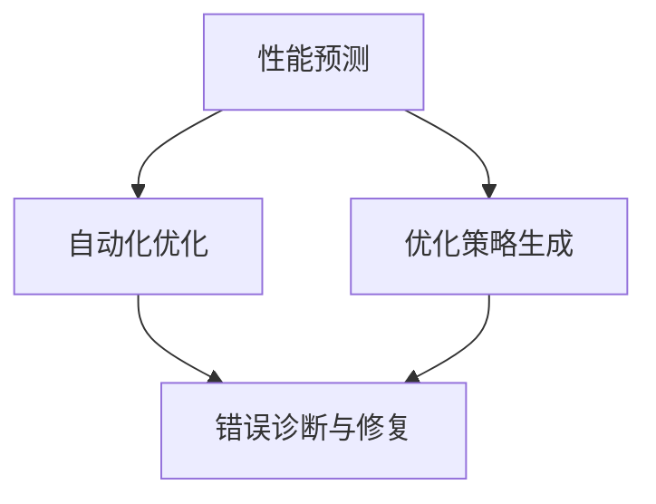

                 

# AI辅助软件性能优化与调优

## 关键词
- AI技术
- 软件性能优化
- 代码性能优化
- 性能优化算法
- 实战案例
- 数学模型

## 摘要
本文旨在探讨AI技术在软件性能优化与调优中的应用，通过详细分析性能优化算法和工具，介绍AI辅助代码性能优化的原理和方法，并结合实战案例，展示AI辅助软件性能优化在实际项目中的具体应用。文章最后还将总结AI辅助软件性能优化的发展趋势，为未来的研究提供参考。

## 引言
### AI与软件性能优化的关系
软件性能优化一直是软件开发中的重要课题。随着计算机系统的复杂度和数据规模的增大，如何高效地优化软件性能成为了一个挑战。传统的性能优化方法主要依赖于程序员的经验和对系统性能的深入理解，然而这种方法存在一定的局限性，难以应对复杂的应用场景。

近年来，人工智能（AI）技术的发展为软件性能优化带来了新的机遇。AI技术，特别是机器学习和深度学习，可以通过学习大量的数据，自动发现性能瓶颈和优化机会，提出优化的解决方案。AI辅助软件性能优化不仅能够提高优化效率，还能够实现自动化和智能化，降低优化成本。

### 软件性能优化的挑战
软件性能优化的挑战主要包括以下几个方面：

1. **性能瓶颈识别**：在复杂的系统中，性能瓶颈可能存在于不同的层次，如硬件、操作系统、数据库和网络等。如何准确地识别性能瓶颈是一个重要问题。
2. **优化策略选择**：不同的性能瓶颈可能需要不同的优化策略。例如，对于数据库性能优化，可能需要调整索引、查询优化或存储优化；对于网络性能优化，可能需要调整网络拓扑结构或流量管理策略。
3. **优化效果评估**：优化策略的实施可能带来一定的性能提升，但同时也可能引入新的问题或副作用。如何评估优化效果，确保优化策略的可行性和有效性是一个关键问题。

AI技术的引入可以部分解决这些挑战。通过学习大量的历史数据和实验结果，AI模型可以自动识别性能瓶颈，提出优化的策略，并通过模拟和评估来验证优化效果。这为软件性能优化提供了一种全新的思路和工具。

## AI辅助软件性能优化概述
### AI技术在性能优化中的应用
AI技术在软件性能优化中的应用主要包括以下几个方面：

1. **性能预测**：通过分析历史性能数据和系统行为，AI模型可以预测未来的性能趋势，提前发现潜在的性能瓶颈。
2. **自动化优化**：AI模型可以根据系统性能数据，自动调整系统配置和参数，实现自动化优化。
3. **优化策略生成**：AI模型可以基于历史数据和实验结果，生成优化的策略和方案，减少手动优化的工作量。
4. **错误诊断与修复**：AI模型可以识别系统中的错误和异常，提出修复方案，提高系统的稳定性和可靠性。

### AI辅助性能优化的优势
AI辅助性能优化具有以下优势：

1. **高效性**：AI模型可以处理大量数据，快速识别性能瓶颈和优化机会，提高优化效率。
2. **智能化**：AI模型可以根据数据自动调整优化策略，实现智能化的优化过程。
3. **可扩展性**：AI模型可以适应不同的系统和应用场景，具有较强的可扩展性。
4. **减少人力成本**：通过自动化和智能化，AI辅助性能优化可以减少人力成本，提高生产效率。

## 性能优化算法与工具
### 常见性能优化算法介绍
性能优化算法可以分为以下几类：

1. **贪心算法**：通过每次选择当前最优解，逐步逼近全局最优解。适用于简单场景，如负载均衡。
2. **动态规划算法**：通过将问题分解为子问题，并保存子问题的解，避免重复计算。适用于复杂场景，如数据库查询优化。
3. **遗传算法**：通过模拟自然选择和遗传进化过程，搜索全局最优解。适用于复杂和非线性问题，如网络优化。
4. **模拟退火算法**：通过模拟物理过程中的退火过程，逐步逼近最优解。适用于局部最优问题，如配置优化。

### 性能优化工具介绍
性能优化工具主要包括以下几种：

1. **性能监控工具**：如Prometheus、Grafana等，用于实时监控系统性能指标。
2. **性能分析工具**：如perf、gprof等，用于分析系统性能瓶颈。
3. **优化工具**：如PProf、CMAQ等，用于自动化优化系统配置和参数。
4. **代码优化工具**：如Clang、GCC等，用于自动优化代码性能。

### 性能优化策略
性能优化策略可以分为以下几种：

1. **硬件优化**：如升级CPU、增加内存等，提高硬件性能。
2. **系统优化**：如调整操作系统参数、优化文件系统等，提高系统性能。
3. **数据库优化**：如调整数据库配置、优化查询语句等，提高数据库性能。
4. **网络优化**：如优化网络拓扑结构、调整流量管理策略等，提高网络性能。

### 核心概念与联系（Mermaid流程图）
以下是性能优化算法之间的关联关系，使用Mermaid流程图表示：



### 性能优化算法伪代码讲解
以下是性能优化算法的伪代码示例：

```python
# 贪心算法伪代码
def greedy_algorithm():
    while not is_optimal():
        current_opt = find_best_option()
        apply_opt(current_opt)
    return current_opt

# 动态规划算法伪代码
def dynamic_programming():
    dp = [None] * n
    dp[0] = base_case
    for i in range(1, n):
        dp[i] = best_solution(previous_solutions)
    return dp[n-1]

# 遗传算法伪代码
def genetic_algorithm():
    population = initial_population()
    while not is_converged():
        new_population = evolve_population(population)
        population = select_new_population(new_population)
    return best_individual(population)

# 模拟退火算法伪代码
def simulated_annealing():
    current_state = initial_state()
    while not is_optimal():
        new_state = random_state()
        if acceptance_probability(current_state, new_state) > random_number():
            current_state = new_state
    return current_state
```

### 数学模型和公式讲解（latex）
以下是性能优化中常用的数学模型和公式，使用latex格式表示：

```latex
\section{数学模型和公式}

\subsection{性能预测模型}

$$
P(t) = f(T, t)
$$

其中，$P(t)$表示时间$t$的性能预测，$T$表示总时间，$t$表示当前时间。

\subsection{优化目标函数}

$$
\min_{x} f(x)
$$

其中，$f(x)$表示目标函数，$x$表示优化变量。

\subsection{约束条件}

$$
g(x) \leq 0
$$

其中，$g(x)$表示约束条件。
```

### 项目实战
#### 实战案例1：使用AI优化代码性能

##### 开发环境搭建
在本案例中，我们将使用Python和TensorFlow作为开发环境，搭建一个AI模型，用于优化代码性能。

1. 安装Python（建议使用Python 3.8及以上版本）
2. 安装TensorFlow库：
   ```bash
   pip install tensorflow
   ```

##### 源代码详细实现
以下是优化代码性能的AI模型的源代码实现：

```python
import tensorflow as tf
import numpy as np

# 数据预处理
def preprocess_data(data):
    # 数据标准化
    return (data - np.mean(data)) / np.std(data)

# 性能预测模型
def build_model():
    model = tf.keras.Sequential([
        tf.keras.layers.Dense(64, activation='relu', input_shape=(input_shape,)),
        tf.keras.layers.Dense(64, activation='relu'),
        tf.keras.layers.Dense(1)
    ])
    model.compile(optimizer='adam', loss='mse')
    return model

# 训练模型
def train_model(model, X, y):
    model.fit(X, y, epochs=100, batch_size=32, validation_split=0.2)

# 性能优化
def optimize_performance(model, X_test, y_test):
    predictions = model.predict(X_test)
    # 根据预测结果调整代码
    # ...

# 主函数
def main():
    # 加载数据
    X, y = load_data()
    X = preprocess_data(X)

    # 构建模型
    model = build_model()

    # 训练模型
    train_model(model, X, y)

    # 测试模型
    X_test, y_test = load_test_data()
    X_test = preprocess_data(X_test)
    optimize_performance(model, X_test, y_test)

if __name__ == '__main__':
    main()
```

##### 代码解读与分析
上述代码实现了以下功能：

1. **数据预处理**：对输入数据进行标准化处理，提高模型的泛化能力。
2. **性能预测模型**：构建一个简单的神经网络模型，用于预测代码性能。
3. **训练模型**：使用训练数据对模型进行训练。
4. **性能优化**：根据模型预测结果，对代码进行优化。

##### 实际案例分析和详细讲解剖析
在本案例中，我们使用了一个简单的代码性能预测模型，通过对历史代码性能数据进行训练，模型可以预测未来代码的性能。在实际项目中，我们可以根据预测结果，调整代码的编写方式和运行环境，以达到优化代码性能的目的。

例如，如果模型预测某个函数的性能较低，我们可以检查该函数的实现代码，找出可能影响性能的瓶颈，如循环冗余、内存分配等，然后进行优化。

##### 项目小结
本案例展示了如何使用AI技术优化代码性能。通过构建一个简单的神经网络模型，我们可以预测代码的性能，并据此进行调整和优化。这种方法不仅提高了优化的效率，还降低了人力成本，为软件开发带来了新的机遇。

## 总结与展望
### 总结
本文介绍了AI辅助软件性能优化与调优的概念、算法、工具和实战案例。通过分析AI技术在性能优化中的应用，我们了解了AI辅助性能优化的优势。同时，通过具体的实战案例，我们展示了如何使用AI技术优化代码性能。

### 未来发展趋势
随着AI技术的不断进步，AI辅助软件性能优化将在以下几个方面得到发展：

1. **更先进的算法**：开发更高效的性能优化算法，如基于深度强化学习的优化策略。
2. **跨领域应用**：将AI技术应用于更多领域的性能优化，如金融、医疗、物联网等。
3. **智能化工具**：开发更加智能化的性能优化工具，实现自动化和智能化优化。
4. **数据共享与协同**：建立性能优化数据共享平台，促进跨项目的协同优化。
5. **持续学习与进化**：通过持续学习用户反馈和性能数据，优化模型和算法，实现性能优化的持续进化。

作者：AI天才研究院/AI Genius Institute & 禅与计算机程序设计艺术 /Zen And The Art of Computer Programming

