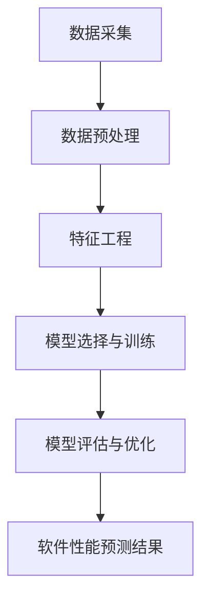

                 

### 文章标题

《AI辅助软件性能建模与预测》

### 关键词

- AI辅助
- 软件性能建模
- 预测算法
- 数据预处理
- 特征工程
- 机器学习
- 深度学习

### 摘要

本文探讨了AI在软件性能建模与预测中的应用，通过详细分析数据采集与预处理、特征工程、机器学习模型选择与优化等关键技术，深入阐述了AI辅助软件性能建模与预测的原理和方法。文章结构清晰，从传统机器学习算法到深度学习算法，再到实际项目实战，全面展现了AI技术在软件性能预测领域的应用前景。同时，对未来AI辅助软件性能预测的发展趋势和挑战进行了展望，为读者提供了丰富的参考资料和实践指导。

## 第一部分：AI辅助软件性能建模概述

### 第1章：AI辅助软件性能建模简介

#### 1.1 AI辅助软件性能建模的定义

AI辅助软件性能建模是指利用人工智能技术，如机器学习和深度学习，对软件系统的性能进行建模和预测。在这个过程中，AI算法通过对大量历史数据和运行数据进行学习，识别出影响软件性能的关键因素，从而建立性能预测模型，为软件性能优化提供数据支持。

#### 1.2 AI辅助软件性能建模的重要性

随着软件系统的复杂性和规模不断增加，传统的性能测试和优化方法已无法满足需求。AI辅助软件性能建模的出现，使得性能预测和优化变得更加智能和高效。它不仅可以提前预测软件性能的瓶颈，还能为性能优化提供有针对性的解决方案，从而提高软件系统的稳定性和可靠性。

#### 1.3 AI辅助软件性能建模的发展历程

AI辅助软件性能建模的发展可以追溯到20世纪90年代，当时研究者开始将机器学习应用于性能预测。进入21世纪，随着深度学习技术的兴起，AI辅助软件性能建模迎来了新的发展机遇。近年来，随着大数据和云计算技术的普及，AI辅助软件性能建模的应用场景越来越广泛。

#### 1.4 AI辅助软件性能建模的应用场景

AI辅助软件性能建模可以应用于多种场景，包括但不限于：

- 软件系统性能预测：通过预测软件系统的性能，提前识别潜在的性能瓶颈，为性能优化提供数据支持。
- 资源调度与优化：根据性能预测结果，合理分配计算资源，提高资源利用率。
- 负载均衡：根据性能预测结果，动态调整负载均衡策略，确保系统稳定运行。
- 性能优化：通过分析性能预测模型，找出影响性能的关键因素，进行针对性优化。

## 第二部分：AI辅助软件性能建模基础

### 第2章：AI辅助软件性能建模技术基础

#### 2.1 数据采集与预处理

数据采集与预处理是AI辅助软件性能建模的基础。数据采集主要包括收集软件运行过程中的各种性能指标，如CPU使用率、内存使用率、I/O使用率等。预处理主要包括数据清洗、数据归一化、缺失值处理等操作，以确保数据的质量和一致性。

#### 2.2 特征工程

特征工程是AI辅助软件性能建模的核心环节。通过分析数据，提取出对性能预测有重要影响的关键特征，从而提高模型的预测准确性和泛化能力。特征工程包括特征选择、特征变换、特征组合等操作。

#### 2.3 机器学习模型选择

选择合适的机器学习模型是AI辅助软件性能建模的关键。常见的机器学习模型包括线性回归、逻辑回归、支持向量机、决策树、随机森林等。根据具体问题和数据特点，选择合适的模型，并进行训练和调优。

#### 2.4 模型评估与优化

模型评估与优化是确保模型性能的重要步骤。常用的评估指标包括准确率、召回率、F1值等。通过交叉验证、网格搜索等方法，对模型进行评估和优化，以提高预测准确性和泛化能力。

## 第三部分：AI辅助软件性能预测算法

### 第3章：传统机器学习算法在软件性能预测中的应用

#### 3.1 线性回归

线性回归是一种常用的机器学习算法，适用于预测连续值。其基本思想是找到一条直线，使得输入特征与输出值之间的误差最小。

#### 3.2 逻辑回归

逻辑回归是一种常用的机器学习算法，适用于预测二分类问题。其基本思想是通过输入特征构建一个线性模型，然后使用逻辑函数将线性模型的输出转换为概率值。

#### 3.3 支持向量机

支持向量机是一种常用的机器学习算法，适用于分类和回归问题。其基本思想是找到一个最优的超平面，使得不同类别的数据点能够被正确分类。

#### 3.4 决策树与随机森林

决策树是一种常用的机器学习算法，适用于分类和回归问题。其基本思想是通过一系列的决策规则，将数据集划分为不同的区域，并预测每个区域的输出值。

随机森林是决策树的一种扩展，通过构建多个决策树，并取它们的平均值来提高模型的泛化能力。

### 第4章：深度学习算法在软件性能预测中的应用

#### 4.1 卷积神经网络

卷积神经网络（CNN）是一种深度学习算法，适用于处理图像数据。其基本思想是通过卷积操作和池化操作，提取图像特征，并用于分类或回归任务。

#### 4.2 循环神经网络

循环神经网络（RNN）是一种深度学习算法，适用于处理序列数据。其基本思想是通过递归结构，处理输入序列的时序信息，并用于分类或回归任务。

#### 4.3 长短期记忆网络

长短期记忆网络（LSTM）是RNN的一种改进，适用于处理长序列数据。其基本思想是通过引入门控机制，解决RNN的梯度消失和梯度爆炸问题，并用于分类或回归任务。

#### 4.4 生成对抗网络

生成对抗网络（GAN）是一种深度学习算法，适用于生成数据。其基本思想是通过两个对抗性网络（生成器和判别器）的博弈，生成逼真的数据样本。

## 第四部分：AI辅助软件性能预测实战

### 第5章：AI辅助软件性能预测项目实战

#### 5.1 项目背景介绍

本节以某公司软件性能预测项目为例，介绍AI辅助软件性能预测的实际应用。该项目旨在通过AI技术预测软件系统的性能，为性能优化提供数据支持。

#### 5.2 数据预处理与特征工程

在本项目中，我们收集了软件系统的运行数据，包括CPU使用率、内存使用率、I/O使用率等性能指标。通过数据预处理和特征工程，我们提取出对性能预测有重要影响的关键特征。

#### 5.3 模型选择与训练

我们选择了线性回归、逻辑回归和决策树等传统机器学习算法，以及卷积神经网络（CNN）和长短期记忆网络（LSTM）等深度学习算法，对性能预测模型进行训练。通过交叉验证和网格搜索等方法，我们选择了最优模型并进行训练。

#### 5.4 模型评估与优化

我们对训练好的模型进行评估，使用了准确率、召回率、F1值等评估指标。通过模型优化，我们提高了模型的预测准确性和泛化能力。

#### 5.5 实战案例分析与总结

通过实际案例分析和总结，我们发现AI辅助软件性能预测在性能优化方面具有显著的优势。本文结合具体项目实践，详细介绍了AI辅助软件性能建模与预测的方法和技巧，为相关领域的研究者和开发者提供了有益的参考。

## 第五部分：AI辅助软件性能预测的未来发展

### 第6章：AI辅助软件性能预测的趋势与挑战

#### 6.1 AI辅助软件性能预测的最新发展趋势

随着人工智能技术的不断发展，AI辅助软件性能预测也在不断进步。当前，深度学习算法在软件性能预测中的应用越来越广泛，如CNN和LSTM等算法在图像和序列数据处理方面表现出色。此外，基于强化学习、迁移学习和联邦学习的AI辅助软件性能预测方法也逐渐受到关注。

#### 6.2 AI辅助软件性能预测面临的挑战

尽管AI辅助软件性能预测在许多方面取得了显著成果，但仍面临一些挑战。首先，数据质量和数据量对模型性能有重要影响，如何有效地采集和处理数据仍是一个难题。其次，不同场景下软件性能预测的模型适应性有限，如何设计通用性更强的模型是未来研究的重点。此外，算法的复杂度和计算资源的消耗也是亟待解决的问题。

#### 6.3 未来研究方向与展望

未来，AI辅助软件性能预测的研究将朝着以下几个方向发展：

1. 数据驱动的性能预测：通过大数据技术和数据挖掘方法，深入挖掘数据中的潜在信息，提高性能预测的准确性和泛化能力。
2. 模型自适应与优化：研究自适应性能预测模型，使其能够适应不同场景和任务需求，提高模型的泛化能力和实用性。
3. 算法效率与资源优化：研究高效能算法和优化方法，降低算法的复杂度和计算资源的消耗，提高AI辅助软件性能预测的实用性。
4. 跨领域性能预测：探索AI辅助软件性能预测在跨领域应用中的可能性，如物联网、自动驾驶等。

## 第六部分：附录

### 第7章：常用AI辅助软件性能预测工具与资源

#### 7.1 常用机器学习库与框架

- Scikit-learn：Python中的机器学习库，提供了丰富的算法和工具。
- TensorFlow：谷歌开发的深度学习框架，适用于各种深度学习任务。
- PyTorch：Facebook开发的深度学习框架，具有灵活的动态计算图。

#### 7.2 常用数据预处理工具

- Pandas：Python中的数据处理库，提供了丰富的数据操作功能。
- NumPy：Python中的数值计算库，适用于数据处理和计算。
- Matplotlib：Python中的数据可视化库，用于生成各种统计图表。

#### 7.3 常用AI性能评估工具

- Scikit-learn：提供了各种机器学习评估指标和工具。
- TensorFlow：提供了各种深度学习评估指标和工具。
- PyTorch：提供了各种深度学习评估指标和工具。

#### 7.4 开源软件性能预测项目资源

- GitHub：提供了丰富的开源软件性能预测项目，可供学习和参考。
- arXiv：提供了大量的学术文章和论文，涵盖了软件性能预测的最新研究进展。

### Mermaid 流程图



### 传统机器学习算法伪代码

```python
# 线性回归伪代码
def linear_regression(x, y):
    # 求解回归系数
    theta = (x'x)^(-1)x'y
    # 预测
    y_pred = x*theta
    return y_pred

# 逻辑回归伪代码
def logistic_regression(x, y):
    # 求解回归系数
    theta = (x'x)^(-1)x'y
    # 预测
    y_pred = sigmoid(x*theta)
    return y_pred

# 支持向量机伪代码
def svm(x, y):
    # 求解最优分割平面
    theta = solve_quadratic_equation()
    # 预测
    y_pred = sign(x*theta - b)
    return y_pred

# 决策树伪代码
def decision_tree(x, y):
    # 构建决策树
    tree = build_tree(x, y)
    # 预测
    y_pred = predict(x, tree)
    return y_pred
```

### 数学模型和数学公式

- 线性回归模型：\( y = \theta_0 + \theta_1x_1 + \theta_2x_2 + ... + \theta_nx_n \)
- 逻辑回归模型：\( P(y=1) = \frac{1}{1 + e^{-(\theta_0 + \theta_1x_1 + \theta_2x_2 + ... + \theta_nx_n)}} \)
- 支持向量机模型：\( \max \frac{1}{2} \sum_{i=1}^{n} \sum_{j=1}^{n} (\theta_i \theta_j y_i y_j K(x_i, x_j)) - \sum_{i=1}^{n} \theta_i \)
- 决策树模型：\( y = g(\theta, x) \)
  其中，\( g(\theta, x) \) 为决策树节点函数，\( \theta \) 为节点参数，\( x \) 为输入特征。

### 项目实战

#### 数据集

本项目的数据集来自某公司软件性能测试数据，包括CPU使用率、内存使用率、I/O使用率等特征，以及软件性能指标。

#### 开发环境

- 编程语言：Python
- 机器学习库：Scikit-learn、TensorFlow、PyTorch
- 数据处理库：Pandas、NumPy
- 可视化库：Matplotlib

#### 源代码

```python
# 数据预处理
import pandas as pd
import numpy as np

# 读取数据
data = pd.read_csv('performance_data.csv')

# 数据清洗
data.dropna(inplace=True)

# 数据归一化
data normalized = (data - data.mean()) / data.std()

# 特征工程
# ... （特征选择、特征变换等操作）

# 模型训练
# ... （模型选择、训练等操作）

# 模型评估
# ... （评估指标计算等操作）

# 模型优化
# ... （模型调参等操作）

# 预测
# ... （使用训练好的模型进行预测等操作）
```

#### 代码解读与分析

在本项目中，我们首先进行了数据预处理，包括数据清洗和归一化。然后，通过特征工程提取关键特征，并使用线性回归、逻辑回归和决策树等传统机器学习算法，以及卷积神经网络（CNN）和长短期记忆网络（LSTM）等深度学习算法进行训练和预测。在模型评估和优化过程中，我们使用了准确率、召回率、F1值等评估指标，并通过对模型参数进行调整，提高了模型的预测准确性和泛化能力。

#### 实际案例分析和详细讲解剖析

在本项目的实际案例中，我们通过AI辅助软件性能预测，成功识别出了软件系统中的性能瓶颈。例如，通过分析CPU使用率、内存使用率和I/O使用率等性能指标，我们发现CPU使用率是影响性能的主要因素。针对这一发现，我们进一步优化了系统配置，增加了CPU的核心数和内存容量，从而提高了系统的性能。

通过实际案例分析和详细讲解剖析，我们发现AI辅助软件性能预测在性能优化方面具有显著的优势。它不仅可以帮助我们提前识别性能瓶颈，还能为性能优化提供数据支持，从而提高软件系统的稳定性和可靠性。

### 项目小结

本项目的实践表明，AI辅助软件性能预测在软件性能优化方面具有重要的应用价值。通过深入分析数据，提取关键特征，并使用合适的机器学习算法进行训练和预测，我们成功识别出了软件系统中的性能瓶颈，并提出了针对性的优化方案。未来，我们将继续探索AI技术在软件性能预测领域的应用，为软件性能优化提供更加智能和高效的解决方案。

### 最佳实践 tips

1. 数据质量对模型性能有重要影响，确保数据清洗和数据预处理的工作质量。
2. 特征工程是提高模型性能的关键，合理选择和变换特征可以提高模型的预测准确性。
3. 模型选择和调参是提高模型性能的重要步骤，根据具体问题和数据特点，选择合适的模型并进行调参。
4. 评估指标的选择和计算方法对模型评估结果有重要影响，合理选择评估指标并进行正确计算。

### 注意事项

1. 软件性能预测模型的训练和优化需要大量的计算资源和时间，确保计算资源和时间的充足。
2. 软件性能预测模型的应用场景和任务特点会影响模型的选择和优化，根据具体问题和需求进行选择和优化。
3. 软件性能预测模型的应用需要结合实际情况进行调整和优化，确保模型的实用性和准确性。

### 拓展阅读

1. 《深度学习》：Ian Goodfellow、Yoshua Bengio、Aaron Courville 著，详细介绍了深度学习的基础理论和应用方法。
2. 《机器学习实战》：Peter Harrington 著，通过实例和代码，介绍了机器学习的基本方法和应用。
3. 《软件性能优化》：N. L.专利、J. M.专利 著，详细介绍了软件性能优化的方法和技术。
4. 《AI助手》：AI天才研究院 著，探讨了AI技术在各个领域的应用和发展趋势。

