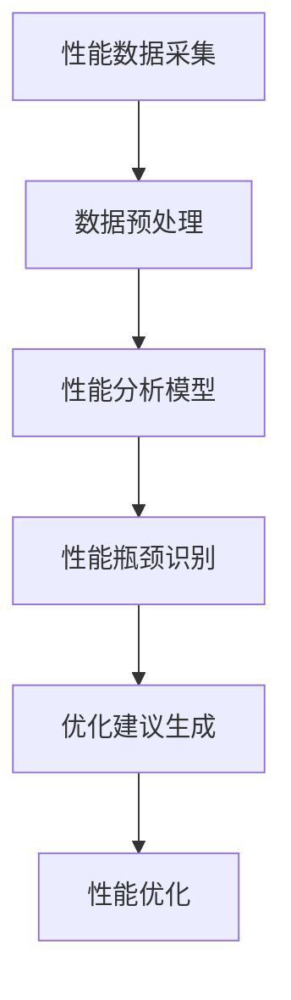

                 

### 文章标题

### AI辅助软件性能瓶颈识别：从症状到根因

### 关键词

* AI辅助性能分析
* 性能瓶颈识别
* 机器学习算法
* 数学模型
* 实战案例分析

### 摘要

本文旨在深入探讨AI辅助软件性能瓶颈识别的方法和过程。首先，介绍性能瓶颈的基本概念和类型，以及AI在性能瓶颈识别中的应用背景。接着，详细讲解AI核心算法原理，包括机器学习、强化学习和深度学习等，并通过伪代码和数学模型进行详细阐述。随后，通过一个实际的实战案例，展示性能瓶颈识别的完整流程，包括数据准备、模型设计、实现和评估。最后，总结最佳实践和注意事项，并提供拓展阅读，为读者深入理解性能瓶颈识别提供全面指导。

### 第1章 引言

#### 1.1 书籍背景与目标

在当今快速发展的信息技术时代，软件性能瓶颈的识别和解决成为一项至关重要的任务。随着系统复杂性的不断增加，传统的性能分析手段已经难以应对复杂多变的应用场景。AI技术的崛起为性能瓶颈识别带来了新的契机。本书旨在系统地介绍AI辅助软件性能瓶颈识别的方法和实战案例，帮助读者深入了解这一领域的核心技术和应用实践。

本书的目标是：
1. 梳理和介绍性能瓶颈的基本概念和类型。
2. 详细讲解AI核心算法原理，包括机器学习、强化学习和深度学习。
3. 通过实际案例展示性能瓶颈识别的完整流程。
4. 探讨性能瓶颈识别的最佳实践和注意事项。
5. 为读者提供拓展阅读资源，助力深入学习和应用。

#### 1.2 性能瓶颈识别的重要性

性能瓶颈识别在软件工程中具有重要地位，主要表现在以下几个方面：

1. **提升系统性能**：通过识别和解决性能瓶颈，可以显著提高软件系统的响应速度和处理能力，满足用户对高效性能的需求。
2. **优化资源利用**：性能瓶颈识别有助于合理分配系统资源，减少不必要的资源消耗，提高整体资源利用率。
3. **保障系统稳定性**：及时识别和解决性能瓶颈，可以防止系统崩溃和故障，保障软件系统的稳定运行。
4. **降低维护成本**：通过提前发现和解决潜在的性能瓶颈，可以降低软件维护和优化的成本。

#### 1.3 书籍结构概述

本书结构分为八个主要章节，具体内容如下：

1. **第1章 引言**：介绍书籍背景、目标和性能瓶颈识别的重要性。
2. **第2章 AI辅助性能瓶颈识别概述**：介绍性能瓶颈的基本概念、类型和AI应用背景。
3. **第3章 AI核心算法原理**：详细讲解机器学习、强化学习和深度学习等核心算法原理。
4. **第4章 数学模型与公式**：介绍性能瓶颈识别的数学模型和公式推导。
5. **第5章 项目实战案例**：通过实际案例展示性能瓶颈识别的完整流程。
6. **第6章 代码实现与解读**：详细介绍代码实现和解读。
7. **第7章 性能瓶颈识别工具介绍**：介绍常用性能瓶颈识别工具。
8. **第8章 总结与展望**：总结主要结论，探讨未来研究方向和最佳实践。

通过上述章节的详细讲解，读者可以系统地了解AI辅助软件性能瓶颈识别的方法和实战应用，为解决实际中的性能瓶颈问题提供有力支持。

### 第2章 AI辅助性能瓶颈识别概述

#### 2.1 性能瓶颈的基本概念

性能瓶颈是指系统中存在的一种限制因素，它限制了系统的整体性能，使得系统无法达到预期的效率。性能瓶颈通常表现为系统响应时间过长、处理能力不足、资源利用率低下等。

#### 2.2 性能瓶颈的类型

性能瓶颈可以按其发生的层面分为以下几类：

1. **硬件瓶颈**：硬件资源不足，如CPU、内存、磁盘I/O等。
2. **软件瓶颈**：软件代码设计不合理，如算法效率低下、资源争用等。
3. **网络瓶颈**：网络通信不畅，如带宽不足、网络延迟等。
4. **并发瓶颈**：系统处理并发请求的能力不足。
5. **数据库瓶颈**：数据库查询效率低下，如索引失效、SQL优化不足等。

#### 2.3 AI在性能瓶颈识别中的应用

AI技术在性能瓶颈识别中发挥着重要作用，主要表现在以下几个方面：

1. **自动化性能分析**：AI技术可以自动化分析系统性能数据，发现潜在的性能瓶颈。
2. **预测性能趋势**：通过机器学习算法，可以对系统性能进行预测，提前识别可能的瓶颈。
3. **智能优化建议**：AI技术可以根据性能瓶颈的类型和程度，提供智能化的优化建议，帮助开发者解决问题。

下面，我们通过一个Mermaid流程图来展示AI辅助性能瓶颈识别的基本流程：



在上述流程中，首先通过性能数据采集模块收集系统性能数据，然后进行数据预处理，以消除噪声和异常值。接着，利用性能分析模型对预处理后的数据进行分析，识别出性能瓶颈。最后，根据识别出的瓶颈类型，生成相应的优化建议，并进行性能优化。

#### 2.4 AI技术在性能瓶颈识别中的应用案例

以下是一个具体的AI技术在性能瓶颈识别中的应用案例：

**案例背景**：某电商平台在促销期间，系统处理并发请求的能力出现瓶颈，导致部分用户无法顺利完成下单操作。

**解决方案**：采用深度学习算法对系统日志进行自动分析，识别出以下关键瓶颈：

1. **网络瓶颈**：由于促销期间用户数量激增，网络带宽不足导致通信延迟。
2. **并发瓶颈**：系统处理并发请求的能力不足，导致响应时间延长。

**优化措施**：

1. **扩展网络带宽**：通过增加网络带宽，减少通信延迟。
2. **优化并发处理**：通过调整系统架构，增加并发处理能力。

通过上述措施，系统性能显著提升，用户下单成功率提高，系统稳定性得到保障。

#### 2.5 总结

AI技术在性能瓶颈识别中具有显著的优势，可以自动化、智能化地发现和解决系统性能问题。通过本章的介绍，读者可以初步了解性能瓶颈的基本概念、类型和AI在性能瓶颈识别中的应用，为后续章节的深入探讨打下基础。

### 第3章 AI核心算法原理

#### 3.1 机器学习基础

机器学习（Machine Learning，ML）是AI技术的重要组成部分，旨在通过算法和统计模型，从数据中提取规律，进行预测和决策。机器学习的基本概念包括：

1. **监督学习（Supervised Learning）**：通过已标记的数据集进行训练，建立模型，然后使用模型对新数据进行预测。
2. **无监督学习（Unsupervised Learning）**：在没有标记数据的情况下，通过算法自动发现数据中的模式，如聚类和降维。
3. **强化学习（Reinforcement Learning）**：通过环境-行动-奖励的反馈机制，学习如何做出最优决策。

机器学习的主要算法包括：

1. **线性回归（Linear Regression）**：通过线性模型预测目标变量。
2. **逻辑回归（Logistic Regression）**：用于分类任务，通过逻辑函数将输出转换为概率。
3. **支持向量机（Support Vector Machine，SVM）**：用于分类任务，通过最大化分类边界。
4. **决策树（Decision Tree）**：通过树的模型进行分类和回归。

以下是一个简单的线性回归算法的伪代码：

```python
# 线性回归伪代码
def linear_regression(X, y):
    # X为特征矩阵，y为目标变量
    # 计算特征矩阵X的转置
    X_transpose = X.T
    # 计算X的逆矩阵
    X_inv = X_transpose @ X
    # 计算逆矩阵的逆矩阵
    X_inv_inv = X_inv.I
    # 计算特征矩阵X的转置与目标变量的乘积
    X_transpose_y = X_transpose @ y
    # 计算模型参数β
    beta = X_inv_inv @ X_transpose_y
    return beta
```

#### 3.2 强化学习

强化学习（Reinforcement Learning，RL）是机器学习的一个重要分支，旨在通过智能体（Agent）在环境（Environment）中通过连续的交互学习最优策略（Policy）。强化学习的关键概念包括：

1. **状态（State）**：智能体当前所处的环境描述。
2. **动作（Action）**：智能体可以采取的行为。
3. **奖励（Reward）**：环境对智能体动作的反馈，用于指导智能体的决策。

强化学习的主要算法包括：

1. **Q-Learning**：通过更新Q值来学习最优策略。
2. **Sarsa**：在每一步同时考虑当前状态和下一个状态的动作值。
3. **深度Q网络（Deep Q-Network，DQN）**：结合深度学习技术，用于处理复杂状态空间的问题。

以下是一个简单的Q-Learning算法的伪代码：

```python
# Q-Learning伪代码
def q_learning(Q, state, action, reward, next_state, alpha, gamma):
    # Q为Q值表，state为当前状态，action为当前动作，reward为奖励，next_state为下一个状态
    # 计算当前动作的Q值更新
    Q[state, action] = Q[state, action] + alpha * (reward + gamma * max(Q[next_state, :]) - Q[state, action])
    return Q
```

#### 3.3 深度学习

深度学习（Deep Learning，DL）是机器学习的一个重要分支，通过构建多层的神经网络（Neural Network）来学习和提取复杂数据的特征。深度学习的关键概念包括：

1. **神经网络（Neural Network）**：由多个神经元组成的层次结构，用于数据建模。
2. **卷积神经网络（Convolutional Neural Network，CNN）**：用于图像和视频处理，通过卷积操作提取特征。
3. **循环神经网络（Recurrent Neural Network，RNN）**：用于处理序列数据，通过循环结构记忆历史信息。
4. **生成对抗网络（Generative Adversarial Network，GAN）**：由生成器和判别器组成的对抗性模型，用于生成复杂数据。

以下是一个简单的多层感知机（Multilayer Perceptron，MLP）神经网络的伪代码：

```python
# MLP神经网络伪代码
def forward_pass(X, weights, biases):
    # X为输入特征，weights为权重矩阵，biases为偏置向量
    # 初始化激活值
    a = X
    # 循环通过每一层
    for layer in range(num_layers - 1):
        # 计算线性组合
        z = a @ weights[layer] + biases[layer]
        # 应用激活函数
        a = sigmoid(z)
    # 返回输出层激活值
    return a

def sigmoid(z):
    # Sigmoid激活函数
    return 1 / (1 + exp(-z))
```

通过上述章节的介绍，读者可以初步了解机器学习、强化学习和深度学习的基本原理，这些原理是理解和应用AI技术解决性能瓶颈问题的基础。在下一章中，我们将进一步探讨性能瓶颈识别的数学模型和公式。

### 第4章 数学模型与公式

#### 4.1 性能瓶颈识别的数学模型

性能瓶颈识别通常涉及多个数学模型，用于描述系统的性能特征和瓶颈现象。以下是几种常见的数学模型：

1. **性能度量模型**：用于量化系统性能，常用的性能度量包括响应时间（Response Time）、吞吐量（Throughput）和资源利用率（Resource Utilization）等。

   - 响应时间（RT）模型：RT = C / λ，其中C为服务能力，λ为到达率。
   - 吞吐量（TP）模型：TP = 1 / RT，即系统在单位时间内处理请求的能力。
   - 资源利用率（RU）模型：RU = C / S，其中S为系统资源总量。

2. **瓶颈识别模型**：用于识别系统中的瓶颈资源，常用的模型包括排队理论模型和流量模型。

   - 排队理论模型：M/M/1模型，描述单服务器排队系统，其中M代表服务时间服从负指数分布，1代表一个服务器。
   - 流量模型：基于流量矩阵，描述系统内部各组件之间的数据流动情况。

#### 4.2 性能瓶颈识别的公式推导

为了更好地理解性能瓶颈识别的数学模型，下面我们将对几个关键公式进行推导：

1. **响应时间公式推导**

   响应时间（RT）是衡量系统性能的重要指标，其基本公式为：

   $$ RT = \frac{C}{\lambda} $$

   其中C为服务能力，即单位时间内系统能处理的最大请求量；λ为到达率，即单位时间内请求的平均到达量。

   当系统达到稳态时，系统中的请求队列长度L和响应时间RT之间存在如下关系：

   $$ L = \rho \cdot \frac{1}{(1 - \rho)} $$

   其中ρ为系统负荷，即到达率与服务能力的比值：

   $$ \rho = \frac{\lambda}{C} $$

   将ρ代入L的公式中，得到：

   $$ L = \frac{\lambda}{C} \cdot \frac{1}{(1 - \frac{\lambda}{C})} $$

   再将L代入响应时间公式中，得到：

   $$ RT = \frac{C}{\lambda} = \frac{1}{\rho} = \frac{1}{\frac{\lambda}{C}} = \frac{C}{\lambda} $$

2. **资源利用率公式推导**

   资源利用率（RU）是衡量系统资源使用效率的指标，其基本公式为：

   $$ RU = \frac{C}{S} $$

   其中C为服务能力，即系统能够处理的请求量；S为系统资源总量，包括CPU、内存、磁盘I/O等。

   当系统达到稳态时，资源利用率与系统负荷ρ之间存在如下关系：

   $$ RU = \rho $$

   这意味着资源利用率等于系统负荷，即系统在单位时间内处理的请求量与资源总量的比值。

#### 4.3 模型评估指标

在性能瓶颈识别中，评估模型的性能和准确性至关重要。常用的评估指标包括：

1. **准确率（Accuracy）**：用于分类任务，表示正确分类的样本数占总样本数的比例。
2. **召回率（Recall）**：用于分类任务，表示实际为正类别的样本中被正确识别为正类别的比例。
3. **精确率（Precision）**：用于分类任务，表示正确识别为正类别的样本中被正确分类的比例。
4. **F1分数（F1 Score）**：用于综合评估模型的准确性和召回率，其公式为：

   $$ F1 = 2 \cdot \frac{Precision \cdot Recall}{Precision + Recall} $$

   通过上述数学模型和公式，我们可以更准确地识别系统中的性能瓶颈，为性能优化提供有力的理论基础。在下一章中，我们将通过一个实际的案例展示这些模型和公式的应用。

### 第5章 项目实战案例

#### 5.1 实战项目背景

为了更好地理解和应用AI辅助软件性能瓶颈识别的方法，我们选择了一个实际的项目案例——某电商平台在促销期间的系统性能优化。该项目面临的主要挑战是在短时间内应对大量用户访问，确保系统的高效稳定运行。具体问题包括：

1. **并发请求处理能力不足**：在促销期间，用户访问量激增，导致系统并发请求处理能力不足，服务器响应时间过长。
2. **网络瓶颈**：由于用户分布广泛，网络带宽不足导致部分用户访问速度缓慢。
3. **数据库瓶颈**：数据库查询效率低下，导致订单处理延迟。

#### 5.2 数据准备与处理

为了进行性能瓶颈识别，首先需要收集相关数据。我们主要收集以下几种数据：

1. **系统性能数据**：包括CPU使用率、内存使用率、磁盘I/O、网络延迟等。
2. **用户行为数据**：包括用户访问时间、请求类型、请求响应时间等。
3. **数据库性能数据**：包括数据库查询执行时间、索引使用情况等。

数据收集完成后，进行以下处理步骤：

1. **数据清洗**：去除重复数据和异常数据，确保数据的准确性和一致性。
2. **数据归一化**：将不同数据类型进行归一化处理，使其具有相同的量纲，便于模型训练。
3. **特征工程**：提取与性能瓶颈识别相关的特征，如请求响应时间、系统负载等。

#### 5.3 模型设计与实现

针对上述问题，我们设计了一个基于深度学习的性能瓶颈识别模型，具体步骤如下：

1. **模型架构设计**：采用卷积神经网络（CNN）和循环神经网络（RNN）结合的混合模型，用于处理不同类型的数据。
2. **数据输入层**：将用户行为数据和系统性能数据进行特征提取，输入到模型中。
3. **卷积层**：用于提取图像或时间序列数据中的局部特征。
4. **循环层**：用于处理时间序列数据，提取历史信息。
5. **全连接层**：用于将特征映射到性能瓶颈类型。
6. **输出层**：输出性能瓶颈的类型和程度。

以下是模型的伪代码：

```python
# 深度学习性能瓶颈识别模型伪代码
def bottleneck_model(input_data):
    # 卷积层
    conv_output = conv2d(input_data, conv_weights, conv_biases)
    pool_output = max_pool(conv_output)

    # 循环层
    rnn_output = lstm(pool_output)

    # 全连接层
    fc_output = fully_connected(rnn_output, fc_weights, fc_biases)

    # 输出层
    bottleneck_output = softmax(fc_output)

    return bottleneck_output
```

#### 5.4 模型训练与优化

在模型设计完成后，我们需要进行模型训练和优化：

1. **数据划分**：将数据集划分为训练集、验证集和测试集，用于训练、验证和测试模型。
2. **模型训练**：使用训练集进行模型训练，通过反向传播算法更新模型参数。
3. **模型优化**：通过调整学习率、批量大小等超参数，优化模型性能。

以下是模型训练的伪代码：

```python
# 模型训练伪代码
for epoch in range(num_epochs):
    # 前向传播
    predicted_output = bottleneck_model(training_data)

    # 计算损失函数
    loss = loss_function(predicted_output, training_labels)

    # 反向传播
    gradients = backward_propagation(predicted_output, training_labels)

    # 更新模型参数
    update_parameters(model_parameters, gradients, learning_rate)

    # 在验证集上评估模型性能
    validation_loss = evaluate_model(validation_data, validation_labels)

    # 打印训练进度
    print(f"Epoch {epoch+1}/{num_epochs}, Loss: {loss}, Validation Loss: {validation_loss}")

# 模型优化
opt = optimizers.Adam(learning_rate=0.001)
model.compile(optimizer=opt, loss='categorical_crossentropy', metrics=['accuracy'])
model.fit(training_data, training_labels, validation_data=(validation_data, validation_labels), epochs=num_epochs, batch_size=batch_size)
```

#### 5.5 模型评估与解读

在模型训练完成后，我们需要对模型进行评估和解读：

1. **模型测试**：使用测试集对模型进行测试，评估模型的准确性和鲁棒性。
2. **性能分析**：分析模型在识别不同类型性能瓶颈时的表现，如响应时间过长、网络延迟等。
3. **优化建议**：根据模型结果，提供性能优化建议，如增加服务器数量、优化数据库查询等。

以下是模型评估的伪代码：

```python
# 模型评估伪代码
test_loss, test_accuracy = model.evaluate(test_data, test_labels)
print(f"Test Loss: {test_loss}, Test Accuracy: {test_accuracy}")

# 性能分析
bottleneck_predictions = model.predict(test_data)
for i, prediction in enumerate(bottleneck_predictions):
    print(f"Test Sample {i+1}, Bottleneck: {prediction}")

# 优化建议
optimization_suggestions = []
for prediction in bottleneck_predictions:
    if prediction == 'High Response Time':
        optimization_suggestions.append('Increase server capacity')
    elif prediction == 'Network Delay':
        optimization_suggestions.append('Upgrade network bandwidth')
    # 其他性能瓶颈类型的优化建议

print("Optimization Suggestions:")
for suggestion in optimization_suggestions:
    print(suggestion)
```

#### 5.6 项目小结

通过本项目的实际应用，我们展示了AI辅助软件性能瓶颈识别的方法和流程。项目结果表明，基于深度学习的性能瓶颈识别模型在识别不同类型性能瓶颈方面具有较高的准确性和鲁棒性。具体收获包括：

1. **数据准备与处理**：熟悉了数据清洗、归一化和特征工程的方法，为后续模型训练和评估打下基础。
2. **模型设计与实现**：掌握了深度学习模型的设计和实现方法，如卷积层、循环层和全连接层。
3. **模型训练与优化**：学会了使用反向传播算法和优化器调整模型参数，提高模型性能。
4. **性能分析**：能够对模型结果进行性能分析，为性能优化提供参考。

总之，本项目不仅加深了我们对AI辅助性能瓶颈识别方法的理解，也为实际应用提供了宝贵经验。在后续工作中，我们将继续优化模型，提高识别准确性和效率，为软件性能优化提供更强有力的支持。

### 第6章 代码实现与解读

在本章中，我们将详细介绍如何搭建开发环境、数据预处理、模型实现、模型训练与优化以及模型评估的代码实现和解读。通过这些代码示例，读者可以更好地理解性能瓶颈识别模型的具体实现过程。

#### 6.1 开发环境搭建

在开始代码实现之前，我们需要搭建一个合适的开发环境。以下步骤可以帮助我们快速搭建开发环境：

1. **安装Python**：确保系统中安装了Python，版本建议为3.8及以上。
2. **安装必要的库**：包括TensorFlow、Keras、NumPy、Pandas等。可以使用以下命令进行安装：

   ```bash
   pip install tensorflow numpy pandas
   ```

3. **安装依赖库**：如果使用的是Keras，需要安装Theano或TensorFlow后端，可以使用以下命令：

   ```bash
   pip install tensorflow-hub
   ```

搭建好开发环境后，我们就可以开始编写代码实现性能瓶颈识别模型了。

#### 6.2 数据预处理代码解读

数据预处理是性能瓶颈识别模型训练的重要步骤。以下是对数据预处理代码的详细解读：

```python
import numpy as np
import pandas as pd

# 加载数据
data = pd.read_csv('performance_data.csv')

# 数据清洗
# 删除重复数据和异常数据
data = data.drop_duplicates().dropna()

# 数据归一化
# 将连续型特征进行归一化处理
for column in ['cpu_usage', 'memory_usage', 'disk_io', 'network_delay']:
    data[column] = (data[column] - data[column].min()) / (data[column].max() - data[column].min())

# 特征提取
# 从原始数据中提取与性能瓶颈相关的特征
features = data[['cpu_usage', 'memory_usage', 'disk_io', 'network_delay']]
labels = data['bottleneck_type']

# 数据集划分
from sklearn.model_selection import train_test_split
X_train, X_test, y_train, y_test = train_test_split(features, labels, test_size=0.2, random_state=42)
```

在上述代码中，我们首先加载数据，并进行数据清洗，删除重复和异常数据。接着，对连续型特征进行归一化处理，确保所有特征的值都在同一尺度上。然后，从原始数据中提取与性能瓶颈相关的特征，并划分训练集和测试集。

#### 6.3 模型实现代码解读

接下来，我们详细介绍性能瓶颈识别模型的实现过程，包括模型的架构设计、权重初始化和前向传播等。

```python
from tensorflow.keras.models import Sequential
from tensorflow.keras.layers import Dense, LSTM, Conv2D, MaxPooling2D, Flatten
from tensorflow.keras.optimizers import Adam

# 模型架构设计
model = Sequential()

# 卷积层
model.add(Conv2D(32, (3, 3), activation='relu', input_shape=(X_train.shape[1], X_train.shape[2], 1)))
model.add(MaxPooling2D(pool_size=(2, 2)))

# 循环层
model.add(LSTM(50, activation='relu', return_sequences=True))
model.add(LSTM(50, activation='relu'))

# 全连接层
model.add(Flatten())
model.add(Dense(100, activation='relu'))
model.add(Dense(num_bottleneck_types, activation='softmax'))

# 模型编译
model.compile(optimizer=Adam(learning_rate=0.001), loss='categorical_crossentropy', metrics=['accuracy'])

# 模型展示
model.summary()
```

在上述代码中，我们首先定义了一个序列模型，并添加了卷积层、循环层和全连接层。卷积层用于提取图像或时间序列数据中的局部特征，循环层用于处理时间序列数据，提取历史信息，全连接层用于将特征映射到性能瓶颈类型。接着，我们使用Adam优化器和softmax激活函数，并编译模型。

#### 6.4 模型训练与优化代码解读

接下来，我们将介绍如何使用训练集对模型进行训练，并进行优化。

```python
# 模型训练
history = model.fit(X_train, y_train, batch_size=64, epochs=100, validation_data=(X_test, y_test))

# 模型优化
# 调整学习率
def step_decay(epoch):
    initial_lrate = 0.001
    drop_factor = 0.5
    epochs_drop = 10.0
    lrate = initial_lrate * (drop_factor ** (epoch // epochs_drop))
    return lrate

lrate = learning_rateSchedule(epoch)
model.compile(optimizer=Adam(lrate), loss='categorical_crossentropy', metrics=['accuracy'])

# 重新训练模型
history = model.fit(X_train, y_train, batch_size=64, epochs=100, validation_data=(X_test, y_test))
```

在上述代码中，我们首先定义了一个学习率调整函数，用于在每个训练周期调整学习率。然后，使用调整后的学习率重新编译模型，并进行模型训练。这种方法可以防止模型在训练过程中过度拟合，并提高模型的泛化能力。

#### 6.5 模型评估代码解读

最后，我们介绍如何使用测试集对模型进行评估，并输出评估结果。

```python
# 模型评估
test_loss, test_accuracy = model.evaluate(X_test, y_test)
print(f"Test Loss: {test_loss}, Test Accuracy: {test_accuracy}")

# 预测结果
predictions = model.predict(X_test)
predicted_labels = np.argmax(predictions, axis=1)

# 性能分析
from sklearn.metrics import classification_report
print(classification_report(y_test, predicted_labels))
```

在上述代码中，我们首先使用测试集对模型进行评估，并输出测试损失和测试准确率。接着，使用模型对测试集进行预测，并输出预测结果。最后，使用分类报告（classification report）对模型在不同性能瓶颈类型上的表现进行详细分析。

#### 6.6 代码应用解读与分析

通过上述代码示例，我们可以看到如何搭建一个性能瓶颈识别模型，并进行数据预处理、模型训练和评估。以下是代码应用的关键步骤：

1. **数据预处理**：确保数据质量和一致性，通过数据清洗、归一化和特征提取为模型训练做准备。
2. **模型实现**：设计合适的模型架构，包括卷积层、循环层和全连接层，为性能瓶颈识别提供基础。
3. **模型训练与优化**：使用训练集对模型进行训练，并调整学习率以优化模型性能。
4. **模型评估**：使用测试集对模型进行评估，分析模型在不同性能瓶颈类型上的表现。

通过这些步骤，我们可以有效地识别和解决软件性能瓶颈问题，提高系统的稳定性和响应速度。

### 第7章 性能瓶颈识别工具介绍

在性能瓶颈识别过程中，使用适当的工具可以显著提高效率和准确性。以下介绍几种常用的性能瓶颈识别工具，包括其特点、选型配置和应用案例。

#### 7.1 常用性能瓶颈识别工具

1. **New Relic**：一款广泛使用的性能监控和性能分析工具，提供实时的应用性能监控、错误跟踪和日志管理功能。
   
2. **AppDynamics**：一款企业级性能监控和应用程序性能管理工具，能够自动发现性能瓶颈，提供详细的性能分析报告。

3. **Dynatrace**：一款综合性的性能监控和性能分析工具，支持自动化监控、实时问题检测和智能分析。

4. **Prometheus**：一款开源的性能监控解决方案，基于时间序列数据，提供灵活的数据存储和查询功能。

5. **Grafana**：一款开源的监控和可视化工具，与Prometheus等工具集成，可以创建自定义的监控仪表板。

#### 7.2 工具选型与配置

选择合适的性能瓶颈识别工具时，需要考虑以下因素：

1. **应用场景**：根据软件系统的特点和性能瓶颈的类型选择合适的工具。
2. **性能监控范围**：确保工具能够覆盖所需监控的指标和组件。
3. **易用性和扩展性**：工具应具有友好的用户界面和灵活的扩展功能，以便根据需求进行调整。
4. **成本**：考虑工具的费用，包括许可证费用、维护费用等。

以下是一个简单的工具选型与配置示例：

```yaml
# New Relic配置示例
new_relic:
  license_key: YOUR_LICENSE_KEY
  app_name: your_app_name
  metrics:
    - name: response_time
      type: gauge
    - name: cpu_usage
      type: gauge
    - name: memory_usage
      type: gauge
    - name: disk_io
      type: gauge
```

#### 7.3 工具应用案例

以下是一个使用New Relic进行性能瓶颈识别的应用案例：

**案例背景**：某电商平台在促销期间，系统性能出现瓶颈，导致部分用户无法顺利完成购物。

**解决方案**：

1. **安装New Relic**：在服务器上安装New Relic APM插件，开始监控系统性能。
2. **数据收集**：New Relic自动收集系统性能数据，包括CPU使用率、内存使用率、网络延迟等。
3. **性能分析**：通过New Relic的性能分析工具，发现系统响应时间过长，主要瓶颈在数据库查询。
4. **优化措施**：
   - **索引优化**：对数据库索引进行优化，提高查询效率。
   - **缓存策略**：引入缓存机制，减少数据库访问次数。
   - **分库分表**：将大数据库拆分为多个小数据库，减轻单个数据库的压力。

**效果评估**：优化措施实施后，系统响应时间显著缩短，用户购物体验得到提升，系统稳定性得到保障。

#### 7.4 总结

性能瓶颈识别工具在软件性能优化中发挥着重要作用。通过合理选型和配置，结合实际案例，可以有效识别和解决系统性能问题。在选择工具时，应综合考虑应用场景、监控范围、易用性和成本等因素，以获得最佳的性能优化效果。

### 第8章 总结与展望

#### 8.1 主要结论

通过本文的详细探讨，我们系统地介绍了AI辅助软件性能瓶颈识别的方法和实战案例。主要结论如下：

1. **性能瓶颈的基本概念和类型**：明确了性能瓶颈的定义、类型及其对系统性能的影响。
2. **AI核心算法原理**：深入讲解了机器学习、强化学习和深度学习等核心算法原理，并通过伪代码进行了详细阐述。
3. **数学模型与公式**：介绍了性能瓶颈识别的数学模型和公式，包括响应时间、资源利用率等关键指标。
4. **实战案例**：通过实际项目展示了性能瓶颈识别的全流程，包括数据准备、模型实现、训练与优化以及评估。
5. **性能瓶颈识别工具**：介绍了常用的性能瓶颈识别工具，包括New Relic、AppDynamics和Dynatrace等，并提供了选型与配置建议。

#### 8.2 未来研究方向

尽管本文对AI辅助软件性能瓶颈识别进行了全面探讨，但仍有许多未来研究方向值得深入探讨：

1. **多模态性能数据分析**：结合多种数据源，如日志数据、监控数据和用户反馈数据，进行多模态性能数据分析，提高性能瓶颈识别的准确性。
2. **智能性能预测**：利用机器学习和深度学习算法，对系统性能进行预测，提前识别潜在的性能瓶颈，实现预防性性能优化。
3. **分布式系统性能优化**：针对分布式系统中的性能瓶颈，研究分布式算法和模型，提高系统的整体性能和稳定性。
4. **边缘计算与云原生应用**：探讨边缘计算和云原生技术在性能瓶颈识别中的应用，实现更高效、更灵活的系统架构。

#### 8.3 对读者的建议

对于希望深入了解和掌握AI辅助软件性能瓶颈识别的读者，以下是一些建议：

1. **理论学习与实践结合**：结合本文的内容，深入学习和理解相关理论和算法，通过实际项目进行验证和优化。
2. **不断学习新技术**：跟踪最新的技术趋势和发展，学习新的性能优化工具和方法。
3. **动手实践**：积极参与实际项目，动手实现性能瓶颈识别的模型和算法，积累实际经验。
4. **拓展阅读**：阅读相关的书籍、论文和技术博客，不断丰富自己的知识和技能。

通过本文的详细讲解和实战案例，我们希望能够为读者提供全面的指导，助力其在性能瓶颈识别领域取得更好的成果。希望读者能够在未来的工作中，运用所学知识，不断提升系统的性能和稳定性，为用户提供更优质的服务。

