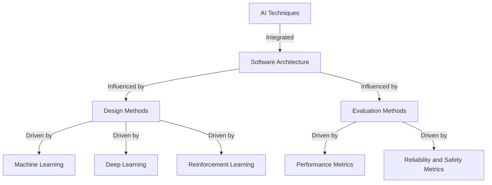

                 

## AI-Assisted Software Architecture Design and Evaluation

### Keywords
- AI-assisted software architecture
- Software architecture design
- Evaluation metrics
- Machine learning
- Deep learning
- Neural networks
- Reinforcement learning
- Generative design
- Optimization

### Abstract
This article delves into the realm of AI-assisted software architecture, providing a comprehensive overview of its foundations, design methodologies, and evaluation techniques. We will explore the core concepts and terminologies associated with AI-assisted software architecture, discussing its importance and benefits. Additionally, we will analyze the current state and trends in the field, and delve into the various AI techniques and methods used in software architecture design. Finally, we will cover the evaluation metrics and methods used to assess the quality and performance of AI-assisted software architectures.

## Introduction to AI-Assisted Software Architecture

### Definition and Background

AI-assisted software architecture refers to the integration of artificial intelligence (AI) techniques, particularly machine learning (ML) and deep learning (DL), into the process of designing, developing, and evaluating software systems. This integration aims to leverage the power of AI to enhance the efficiency, scalability, and adaptability of software architectures.

The concept of AI-assisted software architecture has gained significant attention in recent years due to the rapid advancement of AI technologies and the increasing complexity of software systems. Traditionally, software architecture design has been a manual and labor-intensive process, often relying on the experience and expertise of software architects. However, with the advent of AI, it is now possible to automate and optimize various aspects of software architecture design, resulting in improved design quality and reduced development time.

### Key Concepts and Terminology

To understand AI-assisted software architecture, it is essential to familiarize ourselves with some core concepts and terminologies:

- **Software Architecture**: The fundamental organization of a system, encapsulating the patterns, components, and their interactions.
- **Machine Learning (ML)**: A branch of AI that enables computers to learn from data and improve their performance over time through experience.
- **Deep Learning (DL)**: A subset of ML that uses neural networks with many layers to model complex patterns and relationships in data.
- **Neural Networks**: Computational models inspired by the human brain, consisting of interconnected nodes (neurons) that process and transmit information.
- **Reinforcement Learning**: A type of ML where an agent learns to achieve specific goals by interacting with an environment and receiving feedback in the form of rewards or penalties.
- **Generative Design**: A design approach that leverages AI to create new and innovative solutions by generating a wide range of possible designs and selecting the best ones based on specific criteria.
- **Optimization**: The process of finding the best solution among a set of possible solutions, often used to improve the performance of software architectures.

### Mermaid Flowchart of AI-Assisted Software Architecture

The following Mermaid flowchart illustrates the key components and relationships within the AI-assisted software architecture:

### Importance and Benefits

AI-assisted software architecture offers several significant benefits over traditional approaches:

- **Improved Design Quality**: AI techniques can help identify and address potential design flaws, leading to more robust and efficient software architectures.
- **Reduced Development Time**: Automation and optimization of design processes can significantly reduce the time required to develop and deploy software systems.
- **Enhanced Scalability**: AI can help architects make informed decisions about system scalability, ensuring that software architectures can adapt to changing demands and workloads.
- **Increased Adaptability**: AI-assisted software architectures can be more easily modified and updated to accommodate new requirements and technologies.
- **Better Resource Allocation**: AI can optimize resource allocation, leading to more efficient use of hardware and software resources.

### Current State and Trends

The field of AI-assisted software architecture is rapidly evolving, with ongoing research and development focused on improving the techniques and methodologies used. Some notable trends include:

- **Advanced ML and DL Algorithms**: The development of more sophisticated ML and DL algorithms that can handle complex software architecture design problems.
- **Model-Based Design**: The integration of model-based design approaches, which use mathematical models to represent and analyze software architectures.
- **Automated Evaluation**: The development of automated evaluation techniques that can quickly assess the performance and quality of software architectures.
- **Collaborative Design**: The exploration of collaborative design approaches that leverage the combined expertise of humans and AI systems.

In conclusion, AI-assisted software architecture is an emerging field with significant potential to revolutionize the software development process. By integrating AI techniques into software architecture design and evaluation, we can achieve more efficient, scalable, and adaptable software systems. As the field continues to evolve, it will be essential to stay informed about the latest developments and trends to fully leverage the power of AI in software architecture.

