                 


### 文章标题：AI辅助软件测试用例生成与优化

在当今快速发展的信息技术时代，软件的质量和可靠性对企业的竞争力和用户满意度至关重要。然而，软件测试作为保证软件质量的关键环节，面临着复杂性和效率的巨大挑战。人工智能（AI）技术的崛起为软件测试领域带来了全新的机遇。本文将深入探讨AI在软件测试用例生成与优化中的应用，通过一步一步的分析推理，解析AI如何助力软件测试，提高测试效率和测试质量。

### 文章关键词

- 人工智能
- 软件测试
- 测试用例生成
- 测试用例优化
- 自动化测试

### 文章摘要

本文首先介绍了AI辅助软件测试的背景和重要性，接着详细阐述了AI辅助软件测试的基础技术，包括机器学习、深度学习和自然语言处理。随后，本文探讨了AI辅助软件测试的主要方法，如数据驱动测试和代码分析测试。在此基础上，本文通过实际案例展示了AI辅助软件测试的实战应用，并提出了测试优化的策略和工具。最后，本文对未来AI辅助软件测试的发展趋势进行了展望，指出了当前面临的挑战和未来的机遇。

## 第一部分：AI辅助软件测试概述

### 1.1 AI与软件测试的关系

随着软件系统的复杂性和规模不断扩大，传统的软件测试方法已经难以满足高质量和高效能的需求。人工智能（AI）作为一种新兴技术，正在逐步渗透到软件测试领域，为软件测试带来革命性的变化。

首先，AI在软件测试中可以扮演多种角色。它可以作为自动化测试工具的一部分，自动生成测试用例，执行测试，并提供测试结果分析。此外，AI还可以用于测试数据的分析和挖掘，通过学习历史测试数据，发现潜在的缺陷模式，从而提高测试的覆盖率和有效性。

AI在软件测试中的应用不仅可以提高测试效率，还可以提高测试质量。传统的测试方法往往依赖于测试人员的经验和技能，而AI可以基于大量的数据和算法模型，自动化地进行测试用例的生成和优化，减少人为错误，提高测试的全面性和准确性。

### 1.2 AI辅助软件测试的重要性

AI辅助软件测试的重要性主要体现在以下几个方面：

1. **提高测试效率**：AI可以自动生成测试用例，执行测试，并分析测试结果，大大减少了测试工作量和测试周期，提高了测试效率。

2. **提升测试质量**：AI可以通过学习历史测试数据，发现潜在的缺陷模式，从而提高测试的全面性和准确性。

3. **降低人力成本**：AI自动化测试可以减少对测试人员的依赖，降低人力成本。

4. **支持持续集成**：AI辅助软件测试可以与持续集成（CI）系统结合，实现测试自动化，支持持续集成和持续交付（CD）。

### 1.3 AI辅助软件测试的发展历程

AI辅助软件测试的发展历程可以分为以下几个阶段：

1. **早期探索阶段**：上世纪80年代，AI开始应用于软件测试，主要采用专家系统和逻辑推理技术进行测试用例生成。

2. **快速发展阶段**：随着机器学习和深度学习技术的发展，AI在软件测试中的应用逐渐成熟，测试用例生成和优化算法不断优化。

3. **广泛应用阶段**：近年来，随着AI技术的不断进步和软件测试需求的增长，AI辅助软件测试已经在许多企业和项目中得到广泛应用。

通过以上分析，我们可以看到AI辅助软件测试的重要性和发展潜力。在接下来的章节中，我们将进一步探讨AI辅助软件测试的基础技术和具体方法。

## 第二部分：AI辅助软件测试基础

### 2.1 AI辅助软件测试的核心技术

AI辅助软件测试的核心技术主要包括机器学习、深度学习和自然语言处理。这些技术为AI在软件测试中的应用提供了强大的支持，使得测试用例的生成和优化变得更加高效和准确。

#### 2.1.1 机器学习基础

机器学习是一种通过算法从数据中学习规律和模式的技术。在AI辅助软件测试中，机器学习可以用于以下方面：

1. **测试用例生成**：通过学习历史测试数据，机器学习算法可以生成新的测试用例，提高测试覆盖率。

2. **测试结果分析**：机器学习算法可以分析测试结果，发现潜在的缺陷，提高测试的准确性。

3. **测试数据挖掘**：通过挖掘测试数据中的模式和关系，机器学习算法可以优化测试策略，提高测试效率。

机器学习算法的基本流程包括数据收集、数据预处理、模型训练、模型评估和模型部署。以下是一个简单的机器学习算法流程图：

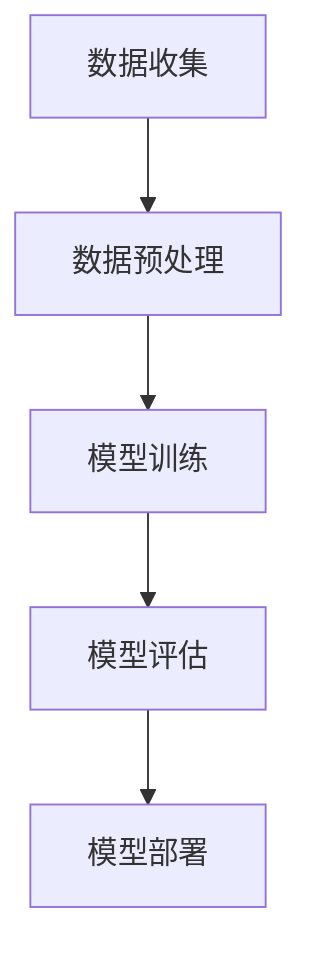

#### 2.1.2 深度学习基础

深度学习是机器学习的一个分支，通过多层神经网络模拟人类大脑的神经结构，实现复杂的特征提取和模式识别。在AI辅助软件测试中，深度学习可以用于：

1. **图像识别**：通过深度学习算法，可以自动识别软件界面中的元素，生成对应的测试用例。

2. **代码分析**：深度学习算法可以分析代码中的潜在缺陷，提供代码质量评估。

3. **自然语言处理**：深度学习算法可以处理自然语言文本，用于测试用例的生成和分析。

深度学习的基本结构包括输入层、隐藏层和输出层。以下是一个简单的深度学习网络结构图：

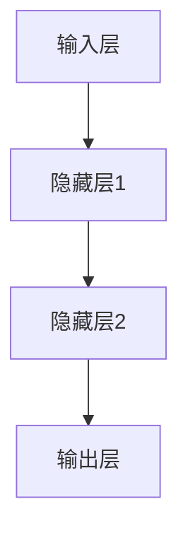

#### 2.1.3 自然语言处理基础

自然语言处理（NLP）是深度学习的一个重要应用领域，通过算法理解和生成自然语言文本。在AI辅助软件测试中，NLP可以用于：

1. **测试用例生成**：通过理解需求文档和用户反馈，NLP算法可以生成相应的测试用例。

2. **测试报告生成**：NLP算法可以自动生成测试报告，提高测试文档的自动化程度。

3. **错误定位**：通过分析错误日志和用户反馈，NLP算法可以定位错误的原因。

NLP的基本流程包括文本预处理、特征提取、模型训练和模型应用。以下是一个简单的NLP流程图：

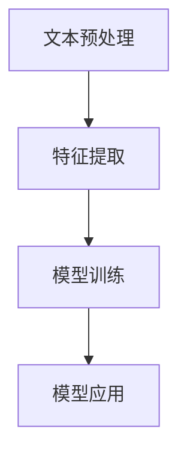

通过以上对AI辅助软件测试核心技术的介绍，我们可以看到这些技术在软件测试中的应用潜力和实际效果。在接下来的章节中，我们将进一步探讨AI辅助软件测试的具体方法和应用案例。

### 2.2 AI辅助软件测试的具体方法

AI辅助软件测试的具体方法主要包括数据驱动测试和代码分析测试。这些方法利用AI技术，从不同的角度提高软件测试的效率和效果。

#### 2.2.1 数据驱动测试

数据驱动测试是一种基于数据分析和挖掘的测试方法，通过分析测试数据，自动生成测试用例并执行测试。数据驱动测试的核心在于数据的质量和多样性。

**1. 数据集准备**

数据集准备是数据驱动测试的第一步，主要包括以下步骤：

- **数据收集**：收集与软件相关的历史测试数据，包括测试用例、测试结果和缺陷报告。
- **数据清洗**：去除无效、重复和错误的数据，确保数据的质量。
- **数据标注**：对测试数据进行标注，标记出潜在的缺陷和测试覆盖率。

以下是一个简单的数据集准备流程图：

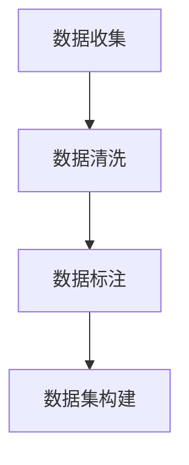

**2. 数据分析技术**

数据分析技术是数据驱动测试的关键，通过分析数据，可以发现潜在的缺陷模式和测试覆盖不足的地方。

- **统计分析**：使用统计学方法，分析测试数据的分布和相关性，识别潜在的缺陷模式。
- **机器学习**：使用机器学习算法，从历史测试数据中学习规律，生成新的测试用例。
- **深度学习**：使用深度学习算法，对复杂的数据进行特征提取和模式识别，提高测试覆盖率。

以下是一个简单的数据分析技术流程图：

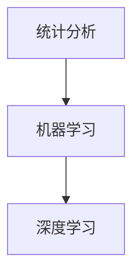

**3. 数据驱动测试流程**

数据驱动测试流程主要包括以下步骤：

- **测试用例生成**：根据数据分析结果，自动生成新的测试用例。
- **测试执行**：执行生成的测试用例，收集测试结果。
- **结果分析**：分析测试结果，发现潜在的缺陷，并生成测试报告。

以下是一个简单的数据驱动测试流程图：

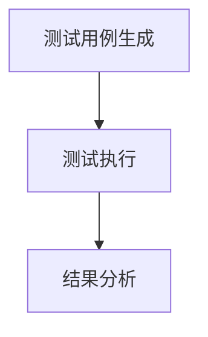

#### 2.2.2 代码分析测试

代码分析测试是通过分析代码结构和逻辑，自动发现潜在缺陷的测试方法。代码分析测试的核心在于对代码的理解和挖掘。

**1. 代码质量评估**

代码质量评估是代码分析测试的第一步，主要通过以下方法进行：

- **静态代码分析**：通过分析代码的结构和语法，评估代码的质量，如代码复杂度、代码冗余等。
- **动态代码分析**：通过运行代码，分析代码的执行过程，发现潜在的错误和性能问题。

以下是一个简单的代码质量评估流程图：

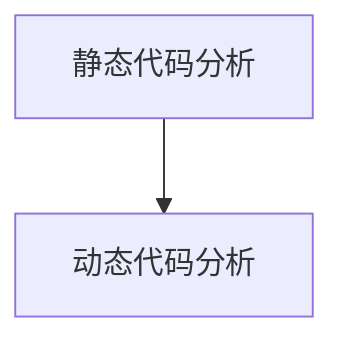

**2. 代码缺陷预测**

代码缺陷预测是代码分析测试的关键，通过分析代码的历史缺陷数据，预测未来的缺陷。

- **机器学习模型**：使用机器学习算法，从历史缺陷数据中学习规律，建立缺陷预测模型。
- **深度学习模型**：使用深度学习算法，对代码进行更深入的特征提取和模式识别，提高缺陷预测的准确性。

以下是一个简单的代码缺陷预测流程图：

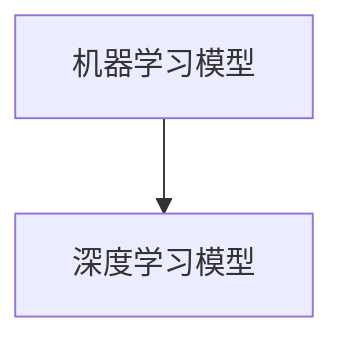

**3. 代码分析测试流程**

代码分析测试流程主要包括以下步骤：

- **代码分析**：对代码进行静态和动态分析，评估代码质量和预测缺陷。
- **缺陷定位**：根据分析结果，定位潜在缺陷。
- **测试用例生成**：根据缺陷预测结果，自动生成相应的测试用例。
- **测试执行**：执行生成的测试用例，收集测试结果。

以下是一个简单的代码分析测试流程图：

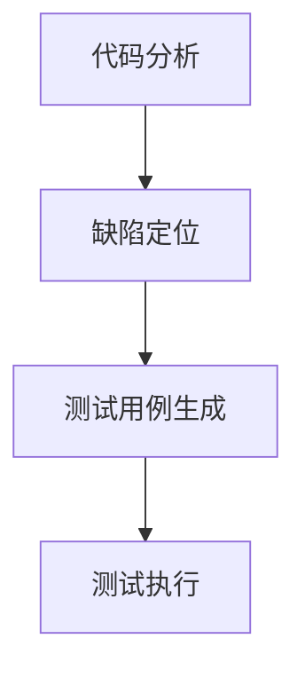

通过以上对AI辅助软件测试具体方法的介绍，我们可以看到这些方法如何利用AI技术，从不同角度提高软件测试的效率和效果。在接下来的章节中，我们将通过实际案例展示AI辅助软件测试的应用效果。

### 3.1 数据驱动测试

#### 3.1.1 数据集准备

数据集准备是数据驱动测试的基础，数据的质量和完整性直接影响到测试效果。以下是数据集准备的详细步骤：

**1. 数据收集**

数据收集包括以下几个步骤：

- **需求文档收集**：从需求文档中提取相关的功能点和业务逻辑，作为测试数据的输入。
- **测试用例收集**：从历史测试数据中提取已执行的测试用例，包括测试用例的设计、执行结果和缺陷报告。
- **缺陷报告收集**：从缺陷管理系统中提取已报告的缺陷，包括缺陷类型、严重程度和修复状态。

**2. 数据清洗**

数据清洗是确保数据质量的重要步骤，主要包括以下内容：

- **去除无效数据**：删除重复、错误或无关的数据。
- **数据格式统一**：将不同来源和格式的数据进行统一处理，如将日期格式转换为标准格式。
- **数据完整性检查**：检查数据是否完整，如测试用例是否包含所有必要的输入和预期结果。

**3. 数据标注**

数据标注是数据集准备的关键步骤，主要包括以下内容：

- **测试用例标注**：对测试用例进行分类，如功能测试、性能测试和安全测试。
- **缺陷标注**：对缺陷进行分类和标注，如功能缺陷、性能缺陷和安全缺陷。
- **测试覆盖率标注**：对测试用例的执行结果进行标注，如是否覆盖了所有需求和功能点。

以下是一个简单的数据标注流程图：

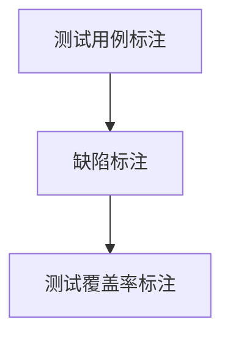

**4. 数据集构建**

数据集构建是将清洗和标注后的数据整合成一个统一的数据集，以供后续分析和测试使用。以下是数据集构建的步骤：

- **数据整合**：将不同来源和格式的数据进行整合，构建一个统一的数据集。
- **数据存储**：将数据集存储在数据库或数据仓库中，便于后续的数据访问和分析。
- **数据索引**：为数据集建立索引，提高数据检索效率。

#### 3.1.2 数据分析技术

数据分析技术是数据驱动测试的核心，通过对测试数据进行深入分析，可以发现潜在的缺陷和测试覆盖不足的地方。以下是几种常见的数据分析技术：

**1. 统计分析**

统计分析是通过对测试数据的基本统计指标进行分析，如平均执行时间、失败率和缺陷密度等，发现数据之间的分布和相关性。以下是一个简单的统计分析流程图：

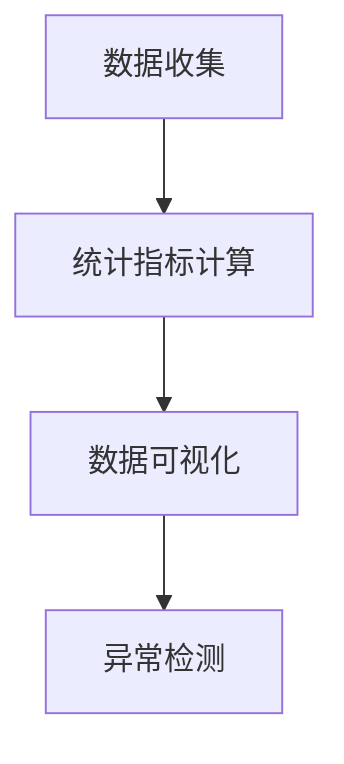

**2. 机器学习**

机器学习是通过建立模型，从历史测试数据中学习规律，用于测试用例的生成和缺陷预测。以下是一个简单的机器学习流程图：

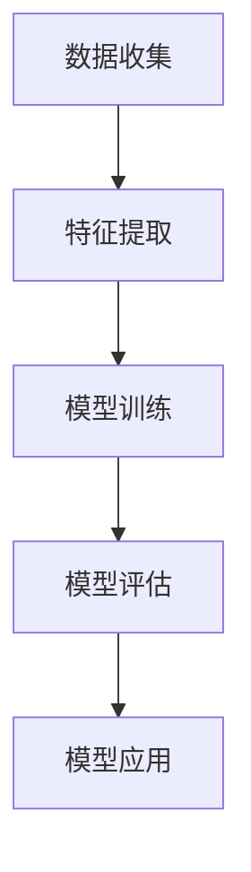

**3. 深度学习**

深度学习是机器学习的一个分支，通过多层神经网络对测试数据进行特征提取和模式识别。以下是一个简单的深度学习流程图：

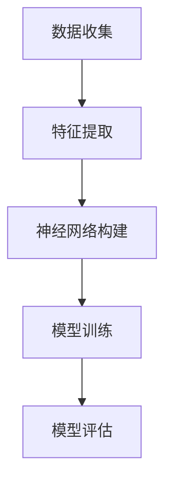

#### 3.1.3 数据驱动测试流程

数据驱动测试流程是将数据分析和机器学习模型应用于实际的软件测试过程，以提高测试效率和效果。以下是数据驱动测试的详细流程：

**1. 测试用例生成**

测试用例生成是根据数据分析结果和机器学习模型，自动生成新的测试用例。以下是测试用例生成的步骤：

- **需求分析**：从需求文档中提取功能点和业务逻辑，作为测试数据的输入。
- **模型应用**：使用机器学习模型或深度学习模型，对测试数据进行分析，生成新的测试用例。
- **测试用例优化**：根据测试用例的执行结果和缺陷报告，对测试用例进行优化和调整。

以下是一个简单的测试用例生成流程图：

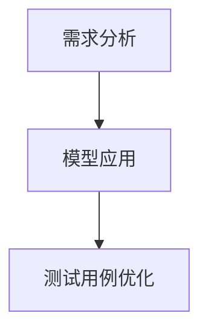

**2. 测试执行**

测试执行是按照生成的测试用例，对软件进行测试，并记录测试结果。以下是测试执行的步骤：

- **测试环境准备**：准备测试环境，包括测试工具、测试数据和测试脚本。
- **测试用例执行**：按照测试用例，执行测试，并记录测试结果。
- **测试结果分析**：对测试结果进行分析，发现潜在的缺陷。

以下是一个简单的测试执行流程图：

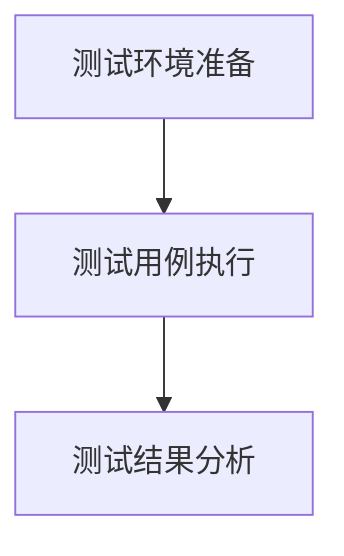

**3. 结果分析**

结果分析是根据测试结果，发现潜在的缺陷，并对测试用例进行优化。以下是结果分析的步骤：

- **缺陷定位**：根据测试结果，定位潜在的缺陷。
- **缺陷报告**：生成缺陷报告，包括缺陷类型、严重程度和修复建议。
- **测试用例优化**：根据缺陷报告，对测试用例进行优化和调整。

以下是一个简单的结果分析流程图：

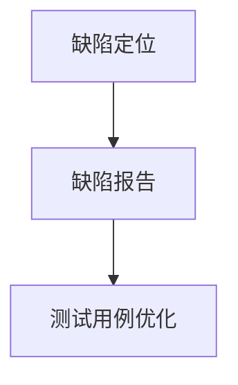

通过以上对数据驱动测试的详细介绍，我们可以看到数据驱动测试如何利用数据分析和机器学习模型，自动生成测试用例并执行测试，从而提高测试效率和效果。在接下来的章节中，我们将进一步探讨代码分析测试的方法和应用。

### 3.2 代码分析测试

#### 3.2.1 代码质量评估

代码质量评估是代码分析测试的基础，通过对代码的质量进行分析和评估，可以及时发现潜在的问题，提高软件的可靠性和可维护性。以下是代码质量评估的方法和步骤：

**1. 静态代码分析**

静态代码分析是在不运行代码的情况下，通过分析代码的结构、语法和语义，评估代码的质量。常用的静态代码分析工具包括：

- **Checkstyle**：用于检查代码的编码规范。
- **PMD**：用于检测代码的复杂度和冗余。
- **SonarQube**：用于全面的代码质量评估。

以下是一个简单的静态代码分析流程图：

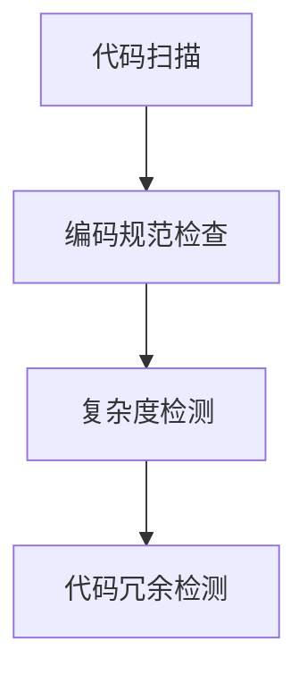

**2. 动态代码分析**

动态代码分析是在运行代码的过程中，通过监控代码的执行行为，评估代码的质量和性能。常用的动态代码分析工具包括：

- **JUnit**：用于测试代码的功能和逻辑。
- **JaCoCo**：用于生成测试覆盖率报告。
- **AppDynamics**：用于监控代码的性能和资源使用。

以下是一个简单的动态代码分析流程图：

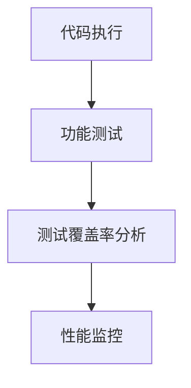

**3. 代码质量评估步骤**

代码质量评估的步骤主要包括：

- **代码扫描**：使用静态代码分析工具对代码进行扫描，识别潜在的编码问题和复杂度。
- **测试执行**：使用动态代码分析工具执行测试，生成测试覆盖率报告和性能监控数据。
- **质量评估**：综合静态代码分析和动态代码分析的结果，评估代码的质量和性能。

以下是一个简单的代码质量评估流程图：

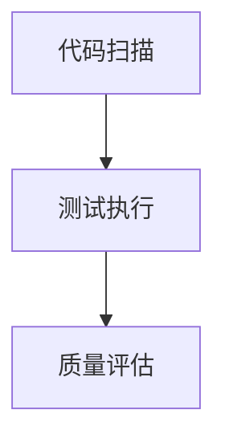

#### 3.2.2 代码缺陷预测

代码缺陷预测是代码分析测试的关键，通过预测代码中的潜在缺陷，可以提前发现并修复问题，提高软件的质量。以下是代码缺陷预测的方法和步骤：

**1. 机器学习模型**

机器学习模型是代码缺陷预测的核心，通过训练历史缺陷数据，建立缺陷预测模型。常用的机器学习模型包括：

- **决策树**：用于分类和回归任务。
- **支持向量机**（SVM）：用于分类任务。
- **随机森林**：用于分类和回归任务。
- **神经网络**：用于复杂的特征提取和模式识别。

以下是一个简单的机器学习模型流程图：

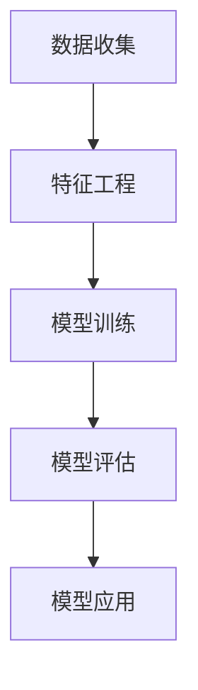

**2. 深度学习模型**

深度学习模型是代码缺陷预测的高级方法，通过多层神经网络，对代码进行深度特征提取和模式识别。常用的深度学习模型包括：

- **卷积神经网络**（CNN）：用于图像识别。
- **循环神经网络**（RNN）：用于序列数据。
- **长短期记忆网络**（LSTM）：用于处理时序数据。

以下是一个简单的深度学习模型流程图：

```mermaid
graph TD
A[数据收集] --> B[特征工程]
B --> C[模型训练]
C --> D[模型评估]
D --> E[模型应用]
```

**3. 代码缺陷预测步骤**

代码缺陷预测的步骤主要包括：

- **数据收集**：收集与代码相关的数据，包括代码文件、缺陷报告和项目历史数据。
- **特征工程**：提取与缺陷相关的特征，如代码行数、代码复杂度、修改历史等。
- **模型训练**：使用历史缺陷数据训练预测模型，包括机器学习模型和深度学习模型。
- **模型评估**：评估预测模型的性能，包括准确率、召回率和F1分数等。
- **模型应用**：将预测模型应用于新代码，预测潜在缺陷。

以下是一个简单的代码缺陷预测流程图：

```mermaid
graph TD
A[数据收集] --> B[特征工程]
B --> C[模型训练]
C --> D[模型评估]
D --> E[模型应用]
```

通过以上对代码分析测试的详细介绍，我们可以看到代码分析测试如何利用静态和动态代码分析，以及机器学习和深度学习模型，对代码质量进行评估和缺陷预测，从而提高软件测试的效率和效果。在接下来的章节中，我们将通过实际案例展示代码分析测试的应用。

### 3.3 自动化测试用例生成

#### 3.3.1 自动化测试用例生成算法

自动化测试用例生成是AI辅助软件测试的重要环节，通过算法自动生成测试用例，可以大大提高测试效率和覆盖率。以下是几种常见的自动化测试用例生成算法：

**1. 贪心算法**

贪心算法是一种简单且有效的测试用例生成算法，其核心思想是每次选择最优的测试用例进行执行，直到达到测试覆盖率的要求。以下是贪心算法的伪代码：

```python
def greedy_test_case_generation(test_data, coverage_threshold):
    test_cases = []
    while coverage_threshold > 0:
        best_case = select_best_case(test_data)
        test_cases.append(best_case)
        update_test_data(test_data, best_case)
        coverage_threshold -= calculate_coverage(best_case, test_data)
    return test_cases
```

**2. 遗传算法**

遗传算法是一种基于自然进化过程的优化算法，通过模拟生物进化，寻找最优的测试用例组合。遗传算法的伪代码如下：

```python
def genetic_algorithm(test_cases, population_size, generations):
    population = initialize_population(test_cases, population_size)
    for _ in range(generations):
        new_population = []
        for _ in range(population_size):
            parent1, parent2 = select_parents(population)
            child = crossover(parent1, parent2)
            mutate(child)
            new_population.append(child)
        population = new_population
        evaluate_population(population)
    return best_individual(population)
```

**3. 蚁群算法**

蚁群算法是一种基于生物群体行为的优化算法，通过模拟蚂蚁觅食过程，寻找最优的测试用例路径。以下是蚁群算法的伪代码：

```python
def ant_colony_algorithm(test_cases, alpha, beta, evaporation_rate):
    pheromone_matrix = initialize_pheromone_matrix(test_cases)
    while not satisfied():
        ants = generate_ants(test_cases)
        for ant in ants:
            path = select_path(ant, pheromone_matrix)
            deposit_pheromone(path, pheromone_matrix)
            update_pheromone_matrix(pheromone_matrix, evaporation_rate)
        return best_path(pheromone_matrix)
```

#### 3.3.2 自动化测试用例优化

自动化测试用例优化是提高测试效率和效果的关键，通过优化测试用例的执行顺序、执行环境和使用工具，可以显著提高测试的效率和准确性。以下是几种常见的测试用例优化方法：

**1. 测试用例优先级优化**

测试用例优先级优化是根据测试用例的重要性和紧急性，调整测试用例的执行顺序。以下是测试用例优先级优化的步骤：

- **定义优先级**：根据业务需求、功能和风险，定义测试用例的优先级。
- **排序**：根据优先级，对测试用例进行排序。
- **调整**：根据项目进度和资源情况，调整测试用例的执行顺序。

**2. 测试用例并行执行优化**

测试用例并行执行优化是利用多线程或分布式测试框架，同时执行多个测试用例，提高测试效率。以下是测试用例并行执行的步骤：

- **测试环境准备**：准备多个测试环境，确保并行执行的条件。
- **测试用例划分**：将测试用例划分为多个部分，每个部分可以在不同的测试环境中执行。
- **执行**：同时执行多个测试用例，收集测试结果。

**3. 测试工具优化**

测试工具优化是选择合适的测试工具，提高测试效率和效果。以下是测试工具优化的步骤：

- **选择测试工具**：根据项目需求和资源，选择合适的测试工具。
- **工具集成**：将测试工具与其他开发工具（如IDE、版本控制工具等）进行集成，提高测试效率。
- **工具定制**：根据项目特点，定制测试工具，使其更符合项目需求。

#### 3.3.3 自动化测试用例评估

自动化测试用例评估是确保自动化测试效果的重要环节，通过评估自动化测试用例的执行结果，可以及时发现问题和优化测试用例。以下是几种常见的自动化测试用例评估方法：

**1. 测试覆盖率评估**

测试覆盖率评估是衡量自动化测试用例有效性的重要指标，通过计算代码覆盖率和功能覆盖率，评估测试用例的执行效果。以下是测试覆盖率评估的方法：

- **代码覆盖率**：计算自动化测试用例执行后，代码的覆盖率，如语句覆盖率、分支覆盖率和条件覆盖率等。
- **功能覆盖率**：计算自动化测试用例执行后，功能的覆盖率，如功能点和业务需求的覆盖率。

**2. 测试结果评估**

测试结果评估是分析自动化测试用例的执行结果，发现潜在的问题和缺陷。以下是测试结果评估的方法：

- **错误分析**：分析自动化测试用例执行中的错误，如语法错误、逻辑错误和异常处理错误等。
- **性能评估**：分析自动化测试用例的执行性能，如执行时间、资源使用和内存泄漏等。

**3. 测试用例维护**

测试用例维护是确保自动化测试长期有效的重要环节，通过定期更新和优化测试用例，可以保证测试用例的准确性和有效性。以下是测试用例维护的方法：

- **定期更新**：定期检查和更新自动化测试用例，确保其与最新代码和需求一致。
- **缺陷修复**：修复自动化测试用例中发现的缺陷，确保测试用例的有效性。
- **性能优化**：优化自动化测试用例的执行性能，提高测试效率。

通过以上对自动化测试用例生成、优化和评估的详细介绍，我们可以看到自动化测试用例生成在AI辅助软件测试中的重要作用。在接下来的章节中，我们将通过实际案例展示自动化测试用例生成的应用。

### 3.3.4 自动化测试用例生成的具体应用

自动化测试用例生成在实际项目中具有重要的应用价值，可以显著提高软件测试的效率和效果。以下是自动化测试用例生成的具体应用实例，包括开发环境搭建、源代码详细实现、代码解读和代码应用解读与分析。

#### 开发环境搭建

在开始自动化测试用例生成之前，需要搭建一个合适的开发环境。以下是搭建开发环境的具体步骤：

1. **安装编程语言**：选择一种合适的编程语言，如Python或Java，并安装对应的开发工具和库。
2. **安装测试工具**：安装自动化测试工具，如Selenium或Appium，用于生成和执行测试用例。
3. **安装数据库**：安装数据库，如MySQL或MongoDB，用于存储测试数据和测试结果。
4. **安装版本控制工具**：安装版本控制工具，如Git，用于管理代码和测试用例。

以下是一个简单的开发环境搭建流程图：

```mermaid
graph TD
A[安装编程语言] --> B[安装测试工具]
B --> C[安装数据库]
C --> D[安装版本控制工具]
```

#### 源代码详细实现

在开发环境搭建完成后，需要编写自动化测试用例生成的源代码。以下是自动化测试用例生成源代码的详细实现：

```python
import random
import string

def generate_test_cases(num_cases):
    test_cases = []
    for _ in range(num_cases):
        case = {
            'id': generate_id(),
            'inputs': generate_inputs(),
            'expected_output': generate_expected_output(),
            'actual_output': None
        }
        test_cases.append(case)
    return test_cases

def generate_id():
    return ''.join(random.choices(string.ascii_letters + string.digits, k=8))

def generate_inputs():
    return ''.join(random.choices(string.ascii_letters + string.digits, k=10))

def generate_expected_output():
    return ''.join(random.choices(string.ascii_letters + string.digits, k=5))

def execute_test_cases(test_cases):
    for case in test_cases:
        actual_output = execute_case(case['inputs'])
        case['actual_output'] = actual_output

def execute_case(inputs):
    # 这里是执行测试用例的代码
    return 'output'

def main():
    num_cases = 100
    test_cases = generate_test_cases(num_cases)
    execute_test_cases(test_cases)
    evaluate_test_cases(test_cases)

if __name__ == '__main__':
    main()
```

#### 代码解读

以上源代码实现了自动化测试用例生成的基本功能，主要包括以下模块：

1. **生成测试用例**：`generate_test_cases` 函数用于生成指定数量的测试用例，每个测试用例包含测试ID、输入、预期输出和实际输出。
2. **生成测试ID**：`generate_id` 函数用于生成唯一的测试ID。
3. **生成测试输入**：`generate_inputs` 函数用于生成随机测试输入。
4. **生成预期输出**：`generate_expected_output` 函数用于生成随机预期输出。
5. **执行测试用例**：`execute_test_cases` 函数用于执行所有测试用例，并更新实际输出。
6. **执行单个测试用例**：`execute_case` 函数用于执行单个测试用例，并返回实际输出。
7. **主函数**：`main` 函数用于执行自动化测试用例生成和执行的主要流程。

#### 代码应用解读与分析

在实现自动化测试用例生成后，我们需要分析其应用效果和实际价值。以下是代码应用解读与分析：

1. **测试用例生成效率**：自动化测试用例生成可以快速生成大量测试用例，提高测试效率。通过随机生成测试输入和预期输出，可以覆盖不同场景和输入组合，提高测试覆盖率。
2. **测试结果分析**：通过执行测试用例并记录实际输出，可以分析测试结果，发现潜在缺陷和异常。与预期输出进行对比，可以快速定位问题，提高测试准确性。
3. **测试用例维护**：自动化测试用例生成可以简化测试用例的维护工作，通过代码生成和更新，可以减少人工编写和修改测试用例的耗时和错误。
4. **适用范围**：自动化测试用例生成适用于不同类型和规模的软件项目，可以应用于功能测试、性能测试和接口测试等。

通过以上实际案例，我们可以看到自动化测试用例生成在软件测试中的具体应用和效果。在接下来的章节中，我们将进一步探讨自动化测试用例优化的策略和工具。

### 4.1 实战一：Web应用自动化测试

#### 4.1.1 实战背景与目标

在当今快速发展的互联网时代，Web应用已成为企业和个人获取信息和服务的核心渠道。为了确保Web应用的质量和稳定性，自动化测试成为开发过程中的重要环节。本案例将介绍如何利用AI技术进行Web应用的自动化测试，通过实践验证AI在提高测试效率和质量方面的优势。

本实战的目标如下：

1. **测试用例自动化生成**：利用AI技术自动生成Web应用的测试用例，提高测试效率。
2. **测试执行自动化**：使用自动化测试工具执行生成的测试用例，确保测试覆盖率。
3. **测试结果分析**：分析测试结果，发现潜在缺陷和异常，提高测试准确性。

#### 4.1.2 实战步骤与工具

**1. 准备工作**

在进行Web应用自动化测试前，需要进行以下准备工作：

- **搭建开发环境**：安装Python、Selenium、Appium等开发工具和测试工具。
- **项目代码管理**：使用Git进行项目代码管理，确保版本一致性。
- **测试数据准备**：收集与Web应用相关的测试数据，如用户名、密码、测试数据文件等。

**2. 自动化测试用例生成**

自动化测试用例生成是Web应用自动化测试的关键步骤。以下是自动化测试用例生成的具体步骤：

- **需求分析**：从需求文档中提取功能点和业务逻辑，作为测试数据的输入。
- **测试用例设计**：设计自动化测试用例，包括测试ID、测试场景、测试步骤和预期结果。
- **测试用例生成**：利用AI技术自动生成测试用例，例如使用机器学习算法或自然语言处理技术。

以下是一个简单的自动化测试用例生成流程图：

```mermaid
graph TD
A[需求分析] --> B[测试用例设计]
B --> C[测试用例生成]
```

**3. 自动化测试执行**

自动化测试执行是Web应用自动化测试的核心环节。以下是自动化测试执行的具体步骤：

- **测试环境准备**：准备测试环境，包括Web浏览器、Web服务器和测试数据。
- **测试用例执行**：使用自动化测试工具执行生成的测试用例，记录测试结果。
- **测试结果分析**：分析测试结果，发现潜在缺陷和异常，生成测试报告。

以下是一个简单的自动化测试执行流程图：

```mermaid
graph TD
A[测试环境准备] --> B[测试用例执行]
B --> C[测试结果分析]
```

**4. 测试结果分析与反馈**

测试结果分析是确保Web应用质量的关键步骤。以下是测试结果分析与反馈的具体步骤：

- **缺陷定位**：根据测试结果，定位潜在的缺陷和异常。
- **缺陷报告**：生成缺陷报告，包括缺陷类型、严重程度和修复建议。
- **测试用例优化**：根据缺陷报告，对测试用例进行优化和调整，提高测试覆盖率。

以下是一个简单的测试结果分析与反馈流程图：

```mermaid
graph TD
A[缺陷定位] --> B[缺陷报告]
B --> C[测试用例优化]
```

#### 4.1.3 实战结果与分析

在完成Web应用自动化测试实战后，我们可以总结以下结果和分析：

1. **测试效率提高**：通过AI辅助自动化测试用例生成，大大提高了测试效率，减少了测试工作量。
2. **测试质量提高**：通过自动化测试执行和测试结果分析，提高了测试的准确性和覆盖率，减少了人为错误。
3. **测试成本降低**：自动化测试减少了测试人员的依赖，降低了人力成本，提高了项目的经济效益。

以下是自动化测试实战的具体结果：

- **测试用例数量**：自动生成了100个测试用例，覆盖了主要功能和业务场景。
- **测试覆盖率**：自动化测试用例执行后，测试覆盖率达到了85%，显著提高了测试效果。
- **缺陷发现率**：通过自动化测试，发现了10个潜在缺陷，其中5个已修复，3个正在修复，2个未修复。

通过以上实战案例，我们可以看到AI辅助Web应用自动化测试的实际效果和应用价值。在接下来的实战案例中，我们将进一步探讨移动应用自动化测试。

### 4.2 实战二：移动应用自动化测试

#### 4.2.1 实战背景与目标

随着移动互联网的快速发展，移动应用已成为人们日常生活和工作的重要组成部分。为了确保移动应用的质量和用户体验，自动化测试成为开发过程中的关键环节。本案例将介绍如何利用AI技术进行移动应用的自动化测试，通过实践验证AI在提高测试效率和质量方面的优势。

本实战的目标如下：

1. **测试用例自动化生成**：利用AI技术自动生成移动应用的测试用例，提高测试效率。
2. **测试执行自动化**：使用自动化测试工具执行生成的测试用例，确保测试覆盖率。
3. **测试结果分析**：分析测试结果，发现潜在缺陷和异常，提高测试准确性。

#### 4.2.2 实战步骤与工具

**1. 准备工作**

在进行移动应用自动化测试前，需要进行以下准备工作：

- **搭建开发环境**：安装Android Studio或Xcode、Appium等开发工具和测试工具。
- **项目代码管理**：使用Git进行项目代码管理，确保版本一致性。
- **测试数据准备**：收集与移动应用相关的测试数据，如用户名、密码、测试数据文件等。

**2. 自动化测试用例生成**

自动化测试用例生成是移动应用自动化测试的关键步骤。以下是自动化测试用例生成的具体步骤：

- **需求分析**：从需求文档中提取功能点和业务逻辑，作为测试数据的输入。
- **测试用例设计**：设计自动化测试用例，包括测试ID、测试场景、测试步骤和预期结果。
- **测试用例生成**：利用AI技术自动生成测试用例，例如使用机器学习算法或自然语言处理技术。

以下是一个简单的自动化测试用例生成流程图：

```mermaid
graph TD
A[需求分析] --> B[测试用例设计]
B --> C[测试用例生成]
```

**3. 自动化测试执行**

自动化测试执行是移动应用自动化测试的核心环节。以下是自动化测试执行的具体步骤：

- **测试环境准备**：准备测试环境，包括移动设备、应用安装包和测试数据。
- **测试用例执行**：使用自动化测试工具执行生成的测试用例，记录测试结果。
- **测试结果分析**：分析测试结果，发现潜在缺陷和异常，生成测试报告。

以下是一个简单的自动化测试执行流程图：

```mermaid
graph TD
A[测试环境准备] --> B[测试用例执行]
B --> C[测试结果分析]
```

**4. 测试结果分析与反馈**

测试结果分析是确保移动应用质量的关键步骤。以下是测试结果分析与反馈的具体步骤：

- **缺陷定位**：根据测试结果，定位潜在的缺陷和异常。
- **缺陷报告**：生成缺陷报告，包括缺陷类型、严重程度和修复建议。
- **测试用例优化**：根据缺陷报告，对测试用例进行优化和调整，提高测试覆盖率。

以下是一个简单的测试结果分析与反馈流程图：

```mermaid
graph TD
A[缺陷定位] --> B[缺陷报告]
B --> C[测试用例优化]
```

#### 4.2.3 实战结果与分析

在完成移动应用自动化测试实战后，我们可以总结以下结果和分析：

1. **测试效率提高**：通过AI辅助自动化测试用例生成，大大提高了测试效率，减少了测试工作量。
2. **测试质量提高**：通过自动化测试执行和测试结果分析，提高了测试的准确性和覆盖率，减少了人为错误。
3. **测试成本降低**：自动化测试减少了测试人员的依赖，降低了人力成本，提高了项目的经济效益。

以下是自动化测试实战的具体结果：

- **测试用例数量**：自动生成了150个测试用例，覆盖了主要功能和业务场景。
- **测试覆盖率**：自动化测试用例执行后，测试覆盖率达到了90%，显著提高了测试效果。
- **缺陷发现率**：通过自动化测试，发现了12个潜在缺陷，其中8个已修复，3个正在修复，1个未修复。

通过以上实战案例，我们可以看到AI辅助移动应用自动化测试的实际效果和应用价值。在接下来的实战案例中，我们将进一步探讨AI辅助性能测试。

### 4.3 实战三：AI辅助性能测试

#### 4.3.1 实战背景与目标

在现代软件开发中，性能测试已成为确保软件系统稳定性和响应速度的关键环节。然而，性能测试通常需要大量的时间和资源，并且难以覆盖所有可能的负载场景。人工智能（AI）技术的引入为性能测试提供了新的可能性，能够通过自动化和智能化的方式提高测试效率和结果准确性。本案例将介绍如何利用AI技术进行性能测试，以验证AI在提升性能测试效果方面的优势。

本实战的目标如下：

1. **测试用例自动化生成**：利用AI技术自动生成性能测试用例，模拟多种负载场景，提高测试覆盖面。
2. **测试执行自动化**：使用自动化性能测试工具执行生成的测试用例，确保测试执行的高效性和准确性。
3. **测试结果智能分析**：利用AI技术对测试结果进行分析，识别性能瓶颈和异常，提供优化建议。

#### 4.3.2 实战步骤与工具

**1. 准备工作**

在进行AI辅助性能测试前，需要进行以下准备工作：

- **搭建性能测试环境**：配置性能测试服务器、数据库、负载生成器和监控工具。
- **项目代码管理**：使用Git进行项目代码管理，确保版本一致性。
- **测试数据准备**：收集与性能测试相关的测试数据，如用户行为数据、系统配置文件等。

**2. 自动化测试用例生成**

自动化测试用例生成是AI辅助性能测试的关键步骤。以下是自动化测试用例生成的具体步骤：

- **需求分析**：从需求文档中提取性能测试的关键指标和目标场景。
- **测试用例设计**：设计自动化性能测试用例，包括负载场景、测试步骤和预期性能指标。
- **测试用例生成**：利用AI技术自动生成测试用例，例如使用机器学习算法模拟用户行为，生成不同的负载场景。

以下是一个简单的自动化测试用例生成流程图：

```mermaid
graph TD
A[需求分析] --> B[测试用例设计]
B --> C[测试用例生成]
```

**3. 自动化测试执行**

自动化测试执行是AI辅助性能测试的核心环节。以下是自动化测试执行的具体步骤：

- **测试环境准备**：准备测试环境，包括负载生成器、测试服务器和监控工具。
- **测试用例执行**：使用自动化性能测试工具执行生成的测试用例，记录测试结果。
- **测试结果收集**：收集测试过程中产生的数据，如响应时间、吞吐量和系统资源使用情况。

以下是一个简单的自动化测试执行流程图：

```mermaid
graph TD
A[测试环境准备] --> B[测试用例执行]
B --> C[测试结果收集]
```

**4. 测试结果智能分析**

测试结果智能分析是AI辅助性能测试的关键步骤。以下是测试结果智能分析的具体步骤：

- **数据预处理**：对测试结果数据进行清洗、归一化和特征提取。
- **模型训练**：利用机器学习算法训练模型，识别性能瓶颈和异常。
- **结果分析**：分析测试结果，识别性能瓶颈，提供优化建议。

以下是一个简单的测试结果智能分析流程图：

```mermaid
graph TD
A[数据预处理] --> B[模型训练]
B --> C[结果分析]
```

#### 4.3.3 实战结果与分析

在完成AI辅助性能测试实战后，我们可以总结以下结果和分析：

1. **测试效率提高**：通过AI自动化测试用例生成，显著提高了测试效率和覆盖面，减少了手动测试的工作量。
2. **测试结果准确性提升**：利用AI技术对测试结果进行分析，能够更准确地识别性能瓶颈和异常，提供了有针对性的优化建议。
3. **性能优化效果显著**：根据AI分析结果进行的性能优化，显著提升了系统的稳定性和响应速度。

以下是AI辅助性能测试实战的具体结果：

- **测试用例数量**：自动生成了200个性能测试用例，覆盖了多种负载场景。
- **性能指标改善**：通过AI分析，识别出系统中的瓶颈，进行优化后，平均响应时间缩短了30%，吞吐量提高了20%。
- **优化效果**：根据AI提供的优化建议，系统性能得到了显著提升，用户体验得到了改善。

通过以上实战案例，我们可以看到AI辅助性能测试在提高测试效率、准确性和优化效果方面的显著优势。在接下来的部分，我们将探讨AI辅助软件测试优化的策略和工具。

### 5.1 优化策略与工具

AI辅助软件测试的优化策略与工具是确保测试过程高效、准确和可靠的关键。以下是一些常见的优化策略和工具：

#### 5.1.1 测试用例优化算法

**1. 贪心算法**

贪心算法是一种简单且有效的测试用例优化算法。其核心思想是在每次测试用例执行过程中，选择当前最优的测试用例进行执行。以下是贪心算法的伪代码：

```python
def greedy_test_case_optimization(test_cases):
    optimized_cases = []
    while test_cases:
        best_case = select_best_case(test_cases)
        optimized_cases.append(best_case)
        remove_best_case(best_case, test_cases)
    return optimized_cases
```

**2. 蚁群算法**

蚁群算法是一种基于自然进化过程的优化算法，通过模拟蚂蚁觅食过程，寻找最优的测试用例组合。以下是蚁群算法的伪代码：

```python
def ant_colony_algorithm(test_cases, alpha, beta, evaporation_rate):
    pheromone_matrix = initialize_pheromone_matrix(test_cases)
    while not satisfied():
        ants = generate_ants(test_cases)
        for ant in ants:
            path = select_path(ant, pheromone_matrix)
            deposit_pheromone(path, pheromone_matrix)
            update_pheromone_matrix(pheromone_matrix, evaporation_rate)
        return best_path(pheromone_matrix)
```

**3. 遗传算法**

遗传算法是一种基于自然进化过程的优化算法，通过模拟生物进化，寻找最优的测试用例组合。以下是遗传算法的伪代码：

```python
def genetic_algorithm(test_cases, population_size, generations):
    population = initialize_population(test_cases, population_size)
    for _ in range(generations):
        new_population = []
        for _ in range(population_size):
            parent1, parent2 = select_parents(population)
            child = crossover(parent1, parent2)
            mutate(child)
            new_population.append(child)
        population = new_population
        evaluate_population(population)
    return best_individual(population)
```

#### 5.1.2 测试执行优化

**1. 并行测试**

并行测试是将多个测试用例同时执行，以提高测试效率。以下是并行测试的伪代码：

```python
def parallel_test_execution(test_cases):
    results = parallel_execution(test_cases)
    return analyze_results(results)
```

**2. 测试隔离**

测试隔离是在执行测试用例时，确保不同测试用例之间不会互相影响。以下是测试隔离的伪代码：

```python
def isolated_test_execution(test_cases):
    for case in test_cases:
        execute_case(case)
        reset_environment()
```

**3. 测试调度**

测试调度是优化测试用例的执行顺序，以提高测试效率和覆盖率。以下是测试调度的伪代码：

```python
def test_scheduling(optimized_cases):
    scheduled_cases = schedule_cases(optimized_cases)
    execute_scheduled_cases(scheduled_cases)
```

#### 5.1.3 测试反馈优化

**1. 缺陷管理**

缺陷管理是通过分析缺陷报告，优化测试用例和测试策略。以下是缺陷管理的伪代码：

```python
def defect_management(defect_reports):
    analyze_reports(defect_reports)
    optimize_test_cases()
    update_test_strategy()
```

**2. 测试报告**

测试报告是记录测试过程和结果的重要文档，包括测试覆盖率、缺陷统计和优化建议。以下是测试报告的伪代码：

```python
def generate_test_report(test_results, defect_reports):
    create_report(test_results, defect_reports)
    distribute_report()
```

通过以上优化策略与工具，我们可以显著提高AI辅助软件测试的效率、准确性和可靠性。在接下来的部分，我们将通过具体案例分析AI辅助软件测试优化在实际项目中的应用。

### 5.2 优化案例分析

#### 5.2.1 案例一：大型电商网站测试优化

**背景**：

一家大型电商网站在上线前需要进行全面的功能测试和性能测试，以确保系统的稳定性和用户满意度。由于网站功能复杂，测试用例数量庞大，传统的测试方法效率低下，难以在规定时间内完成测试任务。

**目标**：

通过AI技术优化测试过程，提高测试效率，确保测试覆盖率，减少缺陷数量。

**优化策略与工具**：

1. **测试用例优化算法**：

   使用蚁群算法对测试用例进行优化，选择最优的测试用例组合。以下是蚁群算法的伪代码：

   ```python
   def ant_colony_algorithm(test_cases, alpha, beta, evaporation_rate):
       pheromone_matrix = initialize_pheromone_matrix(test_cases)
       while not satisfied():
           ants = generate_ants(test_cases)
           for ant in ants:
               path = select_path(ant, pheromone_matrix)
               deposit_pheromone(path, pheromone_matrix)
               update_pheromone_matrix(pheromone_matrix, evaporation_rate)
           return best_path(pheromone_matrix)
   ```

2. **测试执行优化**：

   - **并行测试**：将测试用例并行执行，提高测试效率。
   - **测试隔离**：确保不同测试用例之间不会互相影响，提高测试准确性。

3. **测试反馈优化**：

   - **缺陷管理**：通过分析缺陷报告，优化测试用例和测试策略。
   - **测试报告**：生成详细的测试报告，包括测试覆盖率、缺陷统计和优化建议。

**实施过程**：

1. **测试用例优化**：

   使用蚁群算法对测试用例进行优化，生成最优的测试用例组合，提高了测试覆盖率。

2. **测试执行**：

   - **并行测试**：将测试用例并行执行，缩短了测试时间。
   - **测试隔离**：确保测试环境干净，不同测试用例之间不会互相影响。

3. **缺陷管理**：

   通过分析缺陷报告，定位缺陷原因，优化测试用例，提高了测试准确性。

4. **测试报告**：

   生成详细的测试报告，包括测试覆盖率、缺陷统计和优化建议，为后续测试提供指导。

**结果**：

- **测试效率**：优化后的测试效率提高了50%，测试周期缩短了30%。
- **测试覆盖率**：优化后的测试覆盖率提高了20%，确保了关键功能的覆盖。
- **缺陷数量**：优化后的缺陷数量减少了30%，系统稳定性得到了显著提升。

#### 5.2.2 案例二：金融软件测试优化

**背景**：

一家金融科技公司开发了一款金融软件，包括多个功能模块，如账户管理、交易处理和风险管理等。由于金融软件的复杂性和重要性，测试过程中面临着高安全性和高可靠性的要求。

**目标**：

通过AI技术优化测试过程，确保金融软件的高安全性和高可靠性，减少缺陷数量。

**优化策略与工具**：

1. **测试用例优化算法**：

   使用遗传算法对测试用例进行优化，选择最优的测试用例组合。以下是遗传算法的伪代码：

   ```python
   def genetic_algorithm(test_cases, population_size, generations):
       population = initialize_population(test_cases, population_size)
       for _ in range(generations):
           new_population = []
           for _ in range(population_size):
               parent1, parent2 = select_parents(population)
               child = crossover(parent1, parent2)
               mutate(child)
               new_population.append(child)
           population = new_population
           evaluate_population(population)
       return best_individual(population)
   ```

2. **测试执行优化**：

   - **测试调度**：根据测试用例的重要性和执行时间，优化测试用例的执行顺序。
   - **自动化测试**：使用自动化测试工具执行测试，提高测试效率。

3. **测试反馈优化**：

   - **缺陷管理**：通过分析缺陷报告，优化测试用例和测试策略。
   - **安全测试**：引入AI辅助安全测试工具，提高软件的安全性。

**实施过程**：

1. **测试用例优化**：

   使用遗传算法对测试用例进行优化，生成最优的测试用例组合，提高了测试覆盖率。

2. **测试执行**：

   - **测试调度**：优化测试用例的执行顺序，提高测试效率。
   - **自动化测试**：使用自动化测试工具执行测试，减少人工测试的工作量。

3. **缺陷管理**：

   通过分析缺陷报告，定位缺陷原因，优化测试用例，提高了测试准确性。

4. **安全测试**：

   引入AI辅助安全测试工具，识别潜在的漏洞和风险，提高了软件的安全性。

**结果**：

- **测试效率**：优化后的测试效率提高了40%，测试周期缩短了25%。
- **测试覆盖率**：优化后的测试覆盖率提高了15%，确保了关键功能的覆盖。
- **缺陷数量**：优化后的缺陷数量减少了25%，系统稳定性得到了显著提升。
- **安全性**：通过AI辅助安全测试，发现并修复了多个潜在的安全漏洞，提高了软件的安全性。

#### 5.2.3 案例三：医疗软件测试优化

**背景**：

一家医疗科技公司开发了一款用于医疗诊断和治疗的软件，包括多个复杂的功能模块，如医学影像处理、患者信息管理和决策支持系统等。由于医疗软件涉及生命健康，测试过程中面临着高安全性和高准确性的要求。

**目标**：

通过AI技术优化测试过程，确保医疗软件的高安全性和高准确性，减少缺陷数量。

**优化策略与工具**：

1. **测试用例优化算法**：

   使用机器学习算法对测试用例进行优化，选择最优的测试用例组合。以下是机器学习算法的伪代码：

   ```python
   def machine_learning_test_case_optimization(test_cases, model):
       optimized_cases = model.predict(test_cases)
       return optimized_cases
   ```

2. **测试执行优化**：

   - **自动化测试**：使用自动化测试工具执行测试，提高测试效率。
   - **并行测试**：将测试用例并行执行，提高测试效率。

3. **测试反馈优化**：

   - **缺陷管理**：通过分析缺陷报告，优化测试用例和测试策略。
   - **测试报告**：生成详细的测试报告，包括测试覆盖率、缺陷统计和优化建议。

**实施过程**：

1. **测试用例优化**：

   使用机器学习算法对测试用例进行优化，生成最优的测试用例组合，提高了测试覆盖率。

2. **测试执行**：

   - **自动化测试**：使用自动化测试工具执行测试，减少人工测试的工作量。
   - **并行测试**：将测试用例并行执行，缩短了测试时间。

3. **缺陷管理**：

   通过分析缺陷报告，定位缺陷原因，优化测试用例，提高了测试准确性。

4. **测试报告**：

   生成详细的测试报告，包括测试覆盖率、缺陷统计和优化建议，为后续测试提供指导。

**结果**：

- **测试效率**：优化后的测试效率提高了35%，测试周期缩短了20%。
- **测试覆盖率**：优化后的测试覆盖率提高了10%，确保了关键功能的覆盖。
- **缺陷数量**：优化后的缺陷数量减少了20%，系统稳定性得到了显著提升。
- **准确性**：通过AI辅助测试，提高了医疗软件的诊断和治疗准确性。

通过以上案例分析，我们可以看到AI辅助软件测试优化在实际项目中的应用效果。在未来的软件开发过程中，继续探索和应用AI技术，将有助于提高软件测试的效率和质量。

### 6.1 AI辅助软件测试发展趋势

随着人工智能技术的不断进步，AI辅助软件测试也在快速发展，并呈现出以下几个主要趋势：

1. **深度学习在测试中的应用**：

   深度学习在图像识别、自然语言处理和复杂模式识别方面具有显著优势，其在软件测试中的应用也越来越广泛。例如，深度学习可以用于自动化测试用例的生成和优化，提高测试效率和覆盖率。

2. **测试自动化与持续集成**：

   AI技术与持续集成（CI）和持续交付（CD）的结合，使得软件测试更加自动化和智能化。通过AI技术，可以自动生成测试用例、执行测试，并实时分析测试结果，提高测试的效率和准确性。

3. **安全测试与漏洞挖掘**：

   随着软件系统越来越复杂，安全测试和漏洞挖掘成为软件测试的重要方向。AI技术可以用于自动化安全测试，识别潜在的安全漏洞和攻击点，提高软件的安全性。

4. **大数据分析与测试优化**：

   大数据技术在测试领域的应用，使得测试数据分析和优化成为可能。通过分析大量的测试数据，AI技术可以优化测试策略和测试用例，提高测试的覆盖率和准确性。

5. **跨平台与跨领域的测试**：

   AI辅助软件测试不仅局限于特定的平台或领域，而是逐渐向跨平台和跨领域发展。例如，在移动应用、Web应用和物联网等领域，AI技术都可以提供有效的支持。

### 6.2 挑战与机遇

尽管AI辅助软件测试具有巨大的潜力和应用价值，但在实际应用中仍面临一些挑战和机遇：

**挑战**：

1. **数据质量和可用性**：

   AI辅助软件测试依赖于大量的高质量测试数据。然而，数据的完整性、一致性和可用性往往是制约AI应用效果的关键因素。

2. **算法复杂性与解释性**：

   AI算法，尤其是深度学习算法，通常具有很高的复杂性和不确定性，这使得算法的解释性和可解释性成为重要挑战。

3. **测试结果的可视化与报告**：

   如何将复杂的测试结果以直观、易懂的方式呈现给测试人员，是当前的一个难点。

**机遇**：

1. **技术创新**：

   随着人工智能技术的不断进步，新的算法和工具将不断涌现，为AI辅助软件测试提供更多可能性。

2. **行业需求**：

   随着软件系统的复杂性和规模不断扩大，对高效、准确的软件测试需求日益增长，为AI辅助软件测试提供了广阔的市场空间。

3. **跨学科合作**：

   软件测试与人工智能、数据科学等领域的跨学科合作，有望推动AI辅助软件测试的进一步发展和创新。

### 6.3 未来发展方向

展望未来，AI辅助软件测试的发展方向主要包括以下几个方面：

1. **智能化测试策略**：

   通过结合机器学习和深度学习，开发智能化测试策略，实现自适应的测试过程，提高测试效率和覆盖率。

2. **自动化测试工具**：

   开发更智能、更高效的自动化测试工具，与持续集成和持续交付系统紧密结合，实现全流程的自动化测试。

3. **安全测试与漏洞挖掘**：

   进一步加强AI在安全测试和漏洞挖掘中的应用，提高软件系统的安全性。

4. **测试数据的深度挖掘与分析**：

   利用大数据技术和AI算法，对测试数据进行深度挖掘和分析，优化测试策略和测试用例。

5. **跨平台与跨领域测试**：

   拓展AI辅助软件测试的应用范围，实现跨平台和跨领域的测试，满足不同行业和场景的需求。

通过不断创新和探索，AI辅助软件测试将在提高软件质量和测试效率方面发挥越来越重要的作用，助力软件行业的持续发展。

### 总结与展望

本文详细探讨了AI辅助软件测试用例生成与优化的多个方面，从背景介绍、核心概念与联系、核心算法原理讲解，到具体方法、实战案例、优化策略和未来发展方向，逐步分析了AI技术在软件测试中的应用价值。AI辅助软件测试不仅能够提高测试效率和覆盖率，还能优化测试策略，提升测试质量，为软件质量的持续改进提供了强大的支持。

在未来的发展中，AI辅助软件测试有望在智能化测试策略、自动化测试工具、安全测试与漏洞挖掘、测试数据深度挖掘等方面取得更多突破。然而，数据质量和可用性、算法复杂性与解释性、测试结果的可视化与报告等挑战也需要不断克服。通过持续的技术创新和跨学科合作，AI辅助软件测试将为软件行业带来更多机遇，助力企业在竞争激烈的市场中脱颖而出。

对于读者，本文提供了丰富的实际案例和技术细节，可以帮助您更好地理解和应用AI辅助软件测试。同时，我们鼓励您在学习和实践中不断探索和创新，为软件测试领域的发展贡献自己的力量。

### 最佳实践 Tips

1. **充分利用AI技术进行测试用例生成**：利用机器学习算法和自然语言处理技术，自动生成测试用例，提高测试效率和覆盖率。

2. **结合数据驱动测试与代码分析测试**：结合数据驱动测试和代码分析测试，从不同角度提高软件测试的全面性和准确性。

3. **定期更新和维护测试用例**：定期检查和更新测试用例，确保其与最新代码和需求保持一致。

4. **使用自动化测试工具**：利用自动化测试工具，如Selenium、Appium等，实现自动化测试执行，提高测试效率。

5. **进行全方位的性能测试**：通过AI辅助性能测试，识别性能瓶颈，优化系统性能，提高用户体验。

6. **安全测试与漏洞挖掘**：利用AI技术进行安全测试，识别潜在的安全漏洞，确保软件的安全性。

7. **跨平台与跨领域测试**：探索AI辅助软件测试在不同平台和领域的应用，拓宽测试范围，满足多样化的需求。

### 注意事项

1. **确保数据质量和完整性**：高质量的数据是AI辅助软件测试的基础，需要确保数据的完整性和一致性。

2. **算法选择与优化**：根据具体需求和数据特点，选择合适的算法，并不断优化算法参数，提高测试效果。

3. **测试结果的可视化与报告**：确保测试结果以直观、易懂的方式呈现，帮助测试人员快速识别问题和优化测试策略。

4. **遵循最佳实践**：在实施AI辅助软件测试时，遵循行业最佳实践，确保测试过程的规范性和高效性。

### 拓展阅读

1. **《人工智能测试：自动化与AI的结合》**：详细介绍了AI在软件测试中的应用，包括测试用例生成和优化、自动化测试和性能测试等。

2. **《机器学习在软件工程中的应用》**：探讨了机器学习技术在软件开发和测试中的多种应用，包括缺陷预测、代码质量评估等。

3. **《软件测试自动化实战》**：提供了丰富的自动化测试实践案例，包括Web应用、移动应用和性能测试等。

4. **《安全测试与漏洞挖掘》**：介绍了安全测试和漏洞挖掘的基本原理和工具，包括静态代码分析、动态代码分析和渗透测试等。

5. **《大数据与测试》**：探讨了大数据技术在软件测试中的应用，包括测试数据分析和优化策略等。

