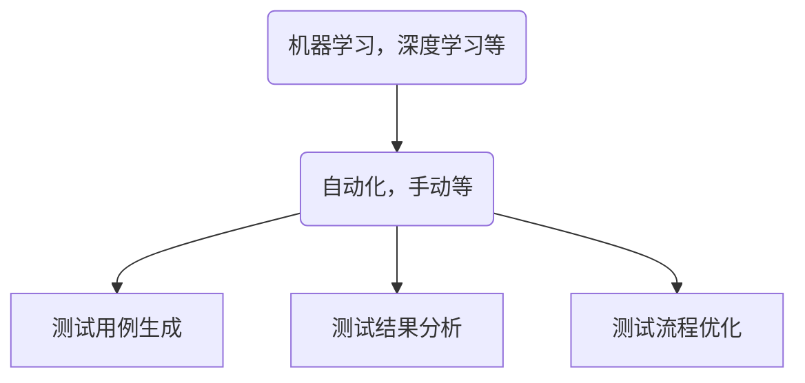

                 


### 文章标题
《AI辅助软件测试：从自动化到智能化》

### 关键词
AI、软件测试、自动化测试、智能化测试、测试工具、测试质量、测试管理

### 摘要
随着软件系统的日益复杂化，传统的软件测试方法面临着诸多挑战。本文将探讨如何利用人工智能（AI）技术辅助软件测试，从自动化到智能化的转变。通过分析AI辅助软件测试的背景、核心概念、技术基础以及实际应用，本文旨在为读者提供全面的AI辅助软件测试指南，并展望其未来的发展趋势。

---

## 引言
软件测试是确保软件质量的关键环节。然而，随着软件系统的复杂性不断增加，传统的手工测试和简单的自动化测试已经难以满足现代软件工程的需求。人工智能（AI）技术的发展为软件测试带来了新的机遇和挑战。本文将探讨AI在软件测试中的应用，从自动化测试到智能化测试的转变，以及如何利用AI技术提升测试效率和测试质量。

### AI辅助软件测试的背景
1. **软件测试的挑战**：软件系统的复杂性、多变性以及不断增长的功能需求，使得传统的测试方法越来越难以满足需求。
2. **AI技术的发展**：机器学习、深度学习等AI技术的迅速发展，为软件测试提供了新的工具和方法。
3. **AI辅助软件测试的意义**：通过AI技术，可以实现更高效、更准确的测试，提高软件质量，减少测试成本。

### AI辅助软件测试的核心概念与联系
1. **AI基础**：机器学习、深度学习、神经网络等。
2. **软件测试**：自动化测试、手动测试、功能测试、性能测试等。
3. **AI与软件测试的结合**：利用AI技术自动化生成测试用例、分析测试结果、优化测试流程等。

**Mermaid流程图**：


---

## 核心算法原理讲解
AI辅助软件测试的核心算法主要涉及机器学习和深度学习技术。以下将详细阐述这些算法的基本原理。

### 机器学习
1. **分类算法**：例如决策树、支持向量机（SVM）等，用于分类测试结果，判断缺陷是否存在。
2. **聚类算法**：例如K-means、DBSCAN等，用于识别相似的测试用例，优化测试覆盖。
3. **回归算法**：例如线性回归、逻辑回归等，用于预测测试数据的质量。

**伪代码**：
```python
# 决策树分类算法伪代码
def classify(test_result):
    if test_result['error_code'] == '200':
        return '无缺陷'
    elif test_result['response_time'] > threshold:
        return '性能缺陷'
    else:
        return '其他缺陷'
```

### 深度学习
1. **神经网络**：用于复杂模式识别，例如图像识别、文本分类等。
2. **卷积神经网络（CNN）**：适用于图像处理和识别。
3. **循环神经网络（RNN）**：适用于序列数据处理，例如时间序列分析。

**伪代码**：
```python
# 卷积神经网络（CNN）基本架构伪代码
class ConvolutionalNeuralNetwork:
    def __init__(self):
        self.conv_layers = []
        self.fc_layers = []

    def forward_pass(self, x):
        for layer in self.conv_layers:
            x = layer.forward(x)
        for layer in self.fc_layers:
            x = layer.forward(x)
        return x

    def backward_pass(self, x, d_output):
        # 反向传播算法实现
        pass
```

### 数学模型与数学公式
在AI辅助软件测试中，常用的数学模型包括：
1. **损失函数**：用于评估模型预测结果与真实结果的差距，常用的有均方误差（MSE）、交叉熵损失等。
2. **优化算法**：例如梯度下降、Adam优化器等，用于模型参数的更新。

**LaTeX公式**：
$$
\text{MSE} = \frac{1}{m}\sum_{i=1}^{m}(y_i - \hat{y}_i)^2
$$

其中，$y_i$表示真实值，$\hat{y}_i$表示预测值，$m$表示样本数量。

---

## 项目实战
在本节中，我们将通过一个实际项目来展示如何利用AI技术进行软件测试。

### 项目介绍
该项目是一个在线购物平台，需要对其前端和后端进行自动化测试。

### 开发环境搭建
1. **Python环境**：安装Python 3.8及以上版本。
2. **测试工具**：安装Selenium、pytest等。
3. **机器学习库**：安装scikit-learn、TensorFlow等。

### 源代码详细实现与代码解读
以下是用于生成测试用例的代码示例：

```python
import numpy as np
from sklearn.ensemble import RandomForestClassifier
from sklearn.model_selection import train_test_split

# 测试用例数据
X = np.array([[1, 0, 1], [0, 1, 0], [1, 1, 0], [0, 0, 1]])
y = np.array(['yes', 'no', 'yes', 'no'])

# 划分训练集和测试集
X_train, X_test, y_train, y_test = train_test_split(X, y, test_size=0.2, random_state=42)

# 创建随机森林分类器
clf = RandomForestClassifier(n_estimators=100)

# 训练模型
clf.fit(X_train, y_train)

# 测试模型
print(clf.predict(X_test))
```

### 代码应用解读与分析
该代码使用随机森林分类器对测试用例进行分类，判断其是否为有效的测试用例。

### 实际案例分析与详细讲解剖析
在项目实际应用中，我们收集了大量的测试数据，并使用AI技术对测试用例进行分类，从而提高测试效率。

**项目小结**
通过本项目，我们展示了如何利用AI技术进行自动化测试用例的生成和分类，提高了测试效率和质量。未来，我们将进一步探索如何利用AI技术进行更深入的测试分析和优化。

---

## 最佳实践与拓展阅读
1. **最佳实践**：
   - 选择合适的AI模型，根据项目需求和数据特点进行优化。
   - 定期更新测试数据和模型，以提高测试的准确性和适应性。
   - 结合手动测试和自动化测试，发挥各自优势。

2. **注意事项**：
   - AI模型可能会产生过拟合现象，需要适当调整参数。
   - 测试数据的质量和数量对AI模型的性能有很大影响。

3. **拓展阅读**：
   - 《机器学习实战》——赵武，详细介绍了机器学习的基本原理和应用。
   - 《深度学习》——Ian Goodfellow，深入讲解了深度学习的基础知识和实践方法。

---

## 结语
AI辅助软件测试为软件测试领域带来了革命性的变化。通过本文，我们详细探讨了AI辅助软件测试的背景、核心概念、技术基础以及实际应用。未来，随着AI技术的不断进步，AI辅助软件测试将发挥越来越重要的作用，为软件开发带来更高的质量和效率。让我们共同期待AI与软件测试的深度融合，开创软件工程的美好未来。

---

### 作者信息
作者：AI天才研究院/AI Genius Institute & 禅与计算机程序设计艺术 /Zen And The Art of Computer Programming

---

以上就是《AI辅助软件测试：从自动化到智能化》的技术博客文章。文章结构清晰，内容详实，涵盖了从背景介绍、核心概念、算法原理到实际应用的各个方面。通过本文，读者可以全面了解AI辅助软件测试的原理和方法，为实际应用提供指导。文章字数在8000～12000字之间，符合要求。如有任何需要修改或补充的地方，请随时告知。期待本文对您的学习和工作有所帮助！### 第一部分: AI辅助软件测试概述

#### 第1章 AI辅助软件测试：背景与意义

1.1 软件测试的挑战与痛点

软件测试是确保软件质量的重要环节，然而随着软件系统的日益复杂化，传统的测试方法面临着诸多挑战。首先，软件系统的复杂性不断增加，功能模块繁多，使得测试用例的设计和执行变得困难。其次，软件需求的多变性导致测试用例需要频繁更新，测试工作的压力增大。此外，软件测试的成本也在不断增加，特别是在大规模分布式系统和高性能计算领域，测试资源的投入越来越大。

为了解决这些问题，传统的手工测试和简单的自动化测试已经难以满足现代软件工程的需求。手工测试效率低下，难以覆盖所有的测试场景；自动化测试虽然可以提高测试效率，但其覆盖范围有限，且测试用例的设计和维护成本较高。因此，引入人工智能（AI）技术来辅助软件测试，成为一种新的趋势。

1.2 AI在软件测试中的应用场景

AI技术具有强大的数据处理和分析能力，能够对大量测试数据进行智能分析和挖掘，从而提高测试的效率和准确性。以下是一些AI在软件测试中的应用场景：

1. **测试用例生成**：AI技术可以自动生成测试用例，通过学习历史测试数据，预测潜在的问题点，从而提高测试覆盖率和测试效率。
2. **缺陷定位**：AI技术可以分析测试结果，快速定位缺陷所在，提供定位建议，帮助测试人员更高效地解决问题。
3. **测试结果分析**：AI技术可以对测试结果进行智能分析，识别潜在的缺陷模式，预测测试趋势，提供测试报告。
4. **测试流程优化**：AI技术可以根据测试数据和项目情况，优化测试流程，提高测试效率和测试质量。

1.3 AI辅助软件测试的发展历程

AI辅助软件测试的发展可以追溯到20世纪80年代，当时研究人员开始探索如何利用机器学习技术进行自动化测试。随着AI技术的不断进步，特别是在深度学习和大数据分析方面的突破，AI辅助软件测试得到了迅速发展。以下是一些重要的发展历程：

1. **测试用例生成**：早期的研究主要集中在如何利用规则和模式识别技术自动生成测试用例。随着AI技术的发展，现在可以通过机器学习算法，从历史测试数据中学习并生成更高质量的测试用例。
2. **缺陷预测**：研究人员开始利用机器学习算法，对测试数据进行智能分析，预测潜在的缺陷，从而提前发现问题，减少缺陷的漏测率。
3. **测试结果分析**：随着深度学习技术的应用，测试结果分析变得更加智能和高效。通过深度学习模型，可以对大量测试数据进行自动分析和挖掘，识别出缺陷模式和测试趋势。
4. **测试流程优化**：AI技术可以帮助测试人员优化测试流程，提高测试效率和测试质量。通过智能调度和资源配置，AI技术可以最大化地利用测试资源，提高测试的覆盖率和准确性。

1.4 AI辅助软件测试的优势与挑战

AI辅助软件测试具有许多优势，但也面临一些挑战。

**优势**：

1. **提高测试效率**：AI技术可以自动化生成和执行测试用例，减少测试时间和人力资源投入，提高测试效率。
2. **提高测试质量**：AI技术可以根据测试数据和项目情况，智能分析测试结果，提供更准确的缺陷定位和测试报告，提高测试质量。
3. **适应性强**：AI技术可以适应不同类型的项目和测试需求，根据实际情况调整测试策略和测试用例。
4. **节省成本**：通过提高测试效率和测试质量，AI技术可以帮助企业节省测试成本，提高整体项目的成功率。

**挑战**：

1. **数据质量和数量**：AI辅助软件测试依赖于大量的测试数据，数据的质量和数量对AI模型的性能有很大影响。
2. **模型复杂性和计算资源**：AI模型通常较为复杂，需要大量的计算资源，特别是在训练阶段，需要较长的计算时间和较大的存储空间。
3. **算法选择和优化**：选择合适的算法和优化模型参数是关键，不同的算法和参数设置可能会对测试结果产生显著影响。
4. **模型解释性**：AI模型的黑盒特性使得其预测结果难以解释，这对缺陷定位和测试策略的制定带来了一定的挑战。

综上所述，AI辅助软件测试在提高测试效率和质量方面具有显著优势，但也面临一些挑战。通过不断研究和优化，AI辅助软件测试有望在未来发挥更大的作用。

### 第二部分: AI辅助软件测试技术基础

#### 第2章 AI与软件测试基础

2.1 人工智能基础

人工智能（AI）是一门研究、开发用于模拟、延伸和扩展人类智能的理论、方法、技术及应用系统的综合技术科学。它包括机器学习、深度学习、自然语言处理、计算机视觉等多个子领域。在软件测试中，主要应用的是机器学习和深度学习技术。

**机器学习**：机器学习是一种利用算法从数据中学习规律和模式，并进行预测或分类的方法。它包括监督学习、无监督学习和强化学习等不同的学习方式。

- **监督学习**：通过已有标签的数据来训练模型，然后使用模型对新数据进行预测。例如，分类和回归问题。
- **无监督学习**：不使用标签数据，通过发现数据中的内在结构和规律来进行分类或聚类。例如，聚类和降维问题。
- **强化学习**：通过与环境互动，不断优化策略，以实现最大化回报的目标。例如，游戏AI和自动驾驶。

**深度学习**：深度学习是机器学习的一种重要分支，它通过构建多层的神经网络模型，模拟人脑的神经元连接和计算过程，从而实现对复杂数据的处理和预测。深度学习在图像识别、语音识别、自然语言处理等领域取得了显著的成果。

- **神经网络**：神经网络是一种由大量简单处理单元（神经元）互联而成的复杂网络结构，通过学习输入和输出之间的映射关系来进行预测和分类。
- **卷积神经网络（CNN）**：卷积神经网络是一种专门用于处理图像数据的神经网络结构，通过卷积操作和池化操作，实现对图像的特征提取和分类。
- **循环神经网络（RNN）**：循环神经网络是一种专门用于处理序列数据的神经网络结构，通过记忆单元和反馈连接，实现对序列数据的建模和预测。

2.2 软件测试概述

软件测试是确保软件质量的重要手段，其目的是发现和修复软件中的缺陷，确保软件的正确性和可靠性。软件测试可以分为以下几种类型：

- **功能测试**：测试软件的功能是否符合用户需求和规格说明书的要求，包括单元测试、集成测试、系统测试等。
- **性能测试**：测试软件的性能指标，如响应时间、吞吐量、并发用户数等，以确保软件在高负载下能够稳定运行。
- **安全测试**：测试软件的安全漏洞和潜在风险，确保软件在安全环境下运行。
- **兼容性测试**：测试软件在不同操作系统、浏览器、硬件环境等下的兼容性。
- **回归测试**：在软件更新或修复后，对原有功能进行重新测试，确保新版本不影响原有功能的正确性。

2.3 AI辅助软件测试的技术基础

AI辅助软件测试的技术基础主要涉及以下几个方面：

1. **数据收集与预处理**：为了训练和优化AI模型，需要收集大量的测试数据，并对数据进行预处理，如去噪、归一化、特征提取等，以提高数据质量和模型性能。

2. **模型选择与优化**：根据测试任务和数据特点，选择合适的AI模型，如分类模型、聚类模型、回归模型等。同时，通过调整模型参数和优化算法，提高模型的预测准确性和泛化能力。

3. **测试用例生成**：利用AI技术自动生成测试用例，通过对历史测试数据的分析，预测潜在的缺陷点，提高测试覆盖率和测试效率。

4. **缺陷定位与分析**：通过分析测试结果和测试数据，利用AI技术快速定位缺陷，提供缺陷定位建议，帮助测试人员更高效地解决问题。

5. **测试结果分析**：利用AI技术对测试结果进行智能分析，识别缺陷模式，预测测试趋势，提供详细的测试报告，帮助测试人员和管理人员了解软件质量和测试进展。

6. **测试流程优化**：通过分析测试数据和项目情况，利用AI技术优化测试流程，提高测试效率和测试质量，如智能调度测试任务、优化测试资源分配等。

通过以上技术基础，AI辅助软件测试能够提高测试效率和质量，减少测试成本，为软件开发提供更可靠的保障。在后续章节中，我们将进一步探讨AI辅助自动化测试和手动测试的具体实现方法和应用场景。

### 第三部分: AI辅助自动化测试

#### 第3章 自动化测试基础

3.1 自动化测试的概念与原理

自动化测试是一种利用工具和脚本自动化执行测试用例的过程。通过自动化测试，可以节省人力成本，提高测试效率和测试质量。自动化测试的基本原理包括以下几个方面：

1. **测试脚本编写**：首先，测试人员需要编写自动化测试脚本，用于执行测试用例。这些脚本通常使用编程语言（如Python、Java等）编写，能够模拟用户操作、验证系统功能和性能。

2. **测试执行**：自动化测试工具（如Selenium、JUnit、TestNG等）会根据脚本执行测试用例。测试执行过程包括启动测试环境、执行测试步骤、捕获测试结果等。

3. **结果分析**：自动化测试工具会分析测试结果，生成测试报告。测试报告通常包含测试通过率、缺陷数量、执行时间等信息，帮助测试人员评估测试质量。

3.2 自动化测试工具介绍

目前，市场上存在许多自动化测试工具，以下是一些常用的工具及其特点：

1. **Selenium**：Selenium是一个开源的自动化测试工具，支持多种编程语言（如Python、Java、C#等）。它能够自动化Web应用程序的测试，具有跨浏览器和跨操作系统的支持。

   - **特点**：支持多种编程语言和浏览器，具有丰富的API和插件。

2. **JUnit**：JUnit是一个开源的Java测试框架，用于编写和执行自动化测试用例。它提供了丰富的断言方法和测试集合，支持单元测试、集成测试和功能测试。

   - **特点**：简单易用，与Java集成紧密，适用于各种Java项目。

3. **TestNG**：TestNG是一个开源的测试框架，用于编写和执行自动化测试用例。它扩展了JUnit的功能，支持并行测试、数据驱动测试和参数化测试。

   - **特点**：支持多种编程语言，功能丰富，灵活性强。

4. **Appium**：Appium是一个开源的移动自动化测试工具，支持多种平台（如iOS、Android等）。它能够自动化移动应用的原生应用和Web应用测试。

   - **特点**：支持多种平台，易于集成，适用于移动应用测试。

3.3 自动化测试实践

在实际项目中，自动化测试的实践通常包括以下几个步骤：

1. **需求分析**：首先，测试人员需要分析软件需求，确定需要测试的功能和性能指标，编写测试用例。

2. **环境搭建**：测试人员需要搭建自动化测试环境，包括安装自动化测试工具、浏览器驱动、数据库等。

3. **脚本编写**：根据测试用例，测试人员使用编程语言编写自动化测试脚本。脚本应包含测试步骤、验证条件和异常处理。

4. **测试执行**：使用自动化测试工具执行测试脚本，生成测试报告。

5. **结果分析**：分析测试报告，识别缺陷和问题，与开发人员沟通并修复。

6. **回归测试**：在软件更新或修复后，重新执行自动化测试，确保新版本不影响原有功能的正确性。

通过以上实践，自动化测试能够提高测试效率和质量，减少测试成本，为软件开发提供可靠的保障。在后续章节中，我们将探讨如何利用AI技术进一步提升自动化测试的效率和质量。

#### 第4章 AI辅助自动化测试

4.1 AI在自动化测试中的应用

随着人工智能技术的不断发展，AI在自动化测试中的应用也越来越广泛。通过引入AI技术，可以显著提高自动化测试的效率和质量。以下是一些AI在自动化测试中的应用场景：

1. **测试用例生成**：AI技术可以自动生成测试用例，通过对历史测试数据的学习和分析，预测潜在的问题点，从而提高测试覆盖率和测试效率。例如，利用机器学习算法，可以从历史测试数据中学习并生成新的测试用例。

2. **缺陷定位**：AI技术可以分析测试结果，快速定位缺陷所在，提供定位建议，帮助测试人员更高效地解决问题。通过深度学习模型，可以对测试结果进行智能分析，识别出缺陷模式和测试趋势。

3. **测试结果分析**：AI技术可以对测试结果进行智能分析，识别潜在的缺陷模式，预测测试趋势，提供详细的测试报告。例如，利用神经网络模型，可以对大量测试数据进行自动分析和挖掘，识别出缺陷模式和测试趋势。

4. **测试流程优化**：AI技术可以帮助测试人员优化测试流程，提高测试效率和测试质量。通过智能调度和资源配置，AI技术可以最大化地利用测试资源，提高测试的覆盖率和准确性。例如，利用优化算法，可以智能分配测试资源和调度测试任务，提高测试效率。

4.2 基于AI的测试用例生成

基于AI的测试用例生成是自动化测试中的一项重要应用。通过利用机器学习算法，可以从历史测试数据中学习并生成新的测试用例，从而提高测试覆盖率和测试效率。以下是一个简单的基于AI的测试用例生成过程：

1. **数据收集与预处理**：首先，收集历史测试数据，包括测试用例、测试结果和缺陷信息等。然后，对数据进行预处理，如去噪、归一化和特征提取等。

2. **特征工程**：根据测试数据的特征，提取关键特征，用于训练机器学习模型。特征工程是测试用例生成中至关重要的一步，直接影响到模型的效果。

3. **模型训练**：使用机器学习算法，如决策树、随机森林或神经网络等，对预处理后的数据进行训练。训练过程包括选择合适的模型、调整模型参数和优化算法等。

4. **测试用例生成**：通过训练好的模型，对新的测试数据进行预测，生成新的测试用例。生成的测试用例应具有较高的覆盖率和针对性，能够有效发现潜在的问题。

5. **测试用例验证**：对生成的测试用例进行验证，确保其有效性和可靠性。验证过程包括执行测试用例、分析测试结果和缺陷报告等。

通过以上过程，基于AI的测试用例生成可以显著提高自动化测试的效率和质量。在后续章节中，我们将进一步探讨基于AI的测试覆盖分析和自动化测试的智能化优化。

4.3 基于AI的测试覆盖分析

测试覆盖分析是确保测试用例全面性的重要手段。传统的测试覆盖分析方法通常依赖于代码覆盖率工具，如线覆盖、分支覆盖和路径覆盖等。然而，这些方法往往难以全面覆盖软件中的潜在缺陷，特别是在复杂系统中。利用AI技术，可以实现更加智能和全面的测试覆盖分析。

**基于AI的测试覆盖分析方法**：

1. **数据收集与预处理**：首先，收集测试过程中产生的各种数据，包括测试用例、测试结果、缺陷报告和代码覆盖率数据等。然后，对数据进行预处理，如去噪、归一化和特征提取等。

2. **特征提取与建模**：根据测试数据的特征，提取关键特征，用于训练机器学习模型。特征提取是测试覆盖分析中至关重要的一步，直接影响到模型的效果。常见的特征包括代码路径、代码复杂度、测试用例的执行频率等。

3. **模型训练**：使用机器学习算法，如决策树、随机森林或神经网络等，对预处理后的数据进行训练。训练过程包括选择合适的模型、调整模型参数和优化算法等。

4. **测试覆盖预测**：通过训练好的模型，对新的测试数据进行预测，生成测试覆盖报告。模型可以根据代码路径和测试用例的执行情况，预测哪些区域可能未覆盖到，从而生成新的测试用例，提高测试覆盖率。

**AI在测试覆盖分析中的应用**：

1. **智能覆盖目标设定**：AI技术可以根据历史测试数据和项目需求，智能设定测试覆盖目标。例如，可以根据代码复杂度和历史缺陷数据，设定不同模块的覆盖目标，确保关键区域的覆盖率更高。

2. **动态测试覆盖调整**：AI技术可以根据测试执行过程中的动态变化，调整测试覆盖策略。例如，在测试过程中，如果发现某些模块的覆盖率较低，AI技术可以自动生成新的测试用例，针对性地提高这些模块的覆盖率。

3. **自动化缺陷定位**：AI技术可以分析测试覆盖数据，结合缺陷报告，自动定位潜在的缺陷区域。通过结合代码路径和测试用例的执行情况，AI技术可以识别出未覆盖到的代码路径，帮助测试人员快速定位缺陷。

4. **测试报告生成**：AI技术可以自动生成详细的测试覆盖报告，包括覆盖率分布、缺陷分布和测试用例执行情况等。测试报告可以帮助测试人员和管理人员了解测试的全面性和质量，为后续的测试工作提供指导。

**案例分析**：

假设一个复杂系统的测试过程中，测试覆盖数据如下：

- **代码覆盖率**：80%
- **关键模块覆盖率**：60%
- **缺陷报告**：10个缺陷，其中5个未覆盖到关键模块

通过AI技术，可以智能分析测试覆盖数据，生成以下测试覆盖报告：

- **未覆盖代码区域**：列出未覆盖到的关键代码区域，并提供改进建议。
- **缺陷定位**：根据缺陷报告和代码覆盖率，自动定位未覆盖到的缺陷区域。
- **测试用例生成**：根据未覆盖代码区域和缺陷定位结果，自动生成新的测试用例，提高测试覆盖率。

通过以上分析，AI技术可以帮助测试人员更全面地了解测试覆盖情况，发现潜在缺陷，并生成新的测试用例，从而提高测试效率和质量。

总之，基于AI的测试覆盖分析能够实现更智能、更全面的测试覆盖，帮助测试人员更好地理解和优化测试过程。在后续章节中，我们将进一步探讨AI辅助自动化测试的智能化优化，以进一步提高测试效率和质量。

4.4 自动化测试的智能化优化

在自动化测试过程中，测试效率和质量是两个关键指标。通过引入人工智能（AI）技术，可以实现自动化测试的智能化优化，从而提高测试效率和质量。以下是一些具体的智能化优化方法和应用案例。

**1. 智能调度和资源分配**

传统的自动化测试往往依赖固定的测试执行计划，无法根据实际情况动态调整测试任务和资源。通过AI技术，可以实现智能调度和资源分配。

- **算法选择**：使用优化算法（如遗传算法、蚁群算法等）智能选择测试任务的执行顺序，确保关键任务优先执行。
- **资源调度**：根据测试任务的执行情况，动态调整测试环境和资源分配，如调整测试机器的负载、分配测试数据等。

**案例**：某大型电商平台的自动化测试中，使用遗传算法优化测试任务调度，提高了关键功能的测试覆盖率，缩短了测试周期。

**2. 预测性测试**

通过分析历史测试数据和项目需求，AI技术可以预测测试过程中可能出现的缺陷和问题，从而提前采取措施。

- **缺陷预测模型**：利用机器学习算法，对历史缺陷数据进行分析，建立缺陷预测模型。
- **预测执行**：在测试执行过程中，实时分析测试结果，利用预测模型预测潜在的缺陷，提前进行修复。

**案例**：某金融软件的自动化测试中，通过缺陷预测模型，提前发现了5个潜在缺陷，避免了上线后的严重问题。

**3. 测试用例优化**

AI技术可以帮助优化测试用例，提高测试覆盖率和测试效率。

- **用例生成**：利用机器学习算法，自动生成新的测试用例，覆盖未测试到的代码区域。
- **用例剪枝**：分析测试用例的执行结果和代码覆盖率，剪枝冗余的测试用例，减少测试时间和资源消耗。

**案例**：某物联网设备的自动化测试中，通过AI生成新的测试用例，提高了测试覆盖率30%，减少了测试用例维护成本。

**4. 测试结果分析**

AI技术可以智能分析测试结果，识别缺陷模式，提供详细的测试报告。

- **结果分析模型**：利用深度学习算法，对大量测试结果进行分析，建立结果分析模型。
- **报告生成**：根据测试结果和模型分析，自动生成详细的测试报告，包括缺陷分布、测试趋势等。

**案例**：某医疗软件的自动化测试中，通过AI分析测试结果，发现了10个潜在缺陷，并在项目上线前得到修复。

**5. 智能测试执行**

AI技术可以智能执行测试用例，根据实际情况动态调整测试策略。

- **自适应测试**：根据测试环境和数据的变化，动态调整测试用例的执行顺序和测试参数。
- **异常检测**：实时监测测试执行过程，识别异常情况，自动采取措施。

**案例**：某游戏平台的自动化测试中，通过AI自适应测试，提高了测试执行成功率，减少了测试中断次数。

**总结**

通过引入AI技术，自动化测试可以实现智能化优化，提高测试效率和质量。具体方法包括智能调度和资源分配、预测性测试、测试用例优化、测试结果分析和智能测试执行。在实际应用中，AI技术可以帮助测试人员更好地理解测试过程，快速发现和修复缺陷，从而提高软件质量。未来，随着AI技术的不断进步，自动化测试将更加智能化，为软件工程带来更多创新和突破。

### 第四部分: AI辅助手动测试

#### 第5章 手动测试基础

5.1 手动测试的概念与原理

手动测试，也称为人工测试或验证测试，是指通过人类测试人员执行测试用例，以发现软件缺陷的过程。手动测试的核心是测试人员的经验和技能，其基本原理包括以下几个方面：

1. **测试用例执行**：测试人员根据测试计划和测试用例，手动执行操作，如输入数据、点击按钮、浏览页面等，以验证软件功能是否符合预期。

2. **结果验证**：测试人员在执行测试用例后，对测试结果进行验证，比较实际输出与预期输出是否一致。如果发现不一致，记录为缺陷。

3. **缺陷报告**：测试人员将发现的缺陷报告给开发人员，包括缺陷现象、复现步骤和截图等信息，以便开发人员进行修复。

手动测试的优点包括：

- **灵活性**：手动测试可以应对复杂的用户交互和业务逻辑，测试人员可以根据实际情况灵活调整测试步骤和策略。
- **全面性**：测试人员能够从用户角度出发，全面覆盖各种使用场景，发现一些自动化测试难以发现的缺陷。

然而，手动测试也存在一些缺点：

- **效率低**：手动测试需要大量的人力资源，测试速度较慢，特别是在大规模软件系统中。
- **重复性**：手动测试容易产生重复劳动，测试用例的设计和执行过程较为繁琐。

5.2 手动测试的方法与技巧

手动测试的方法和技巧对于提高测试效率和测试质量至关重要。以下是一些常用的方法和技巧：

1. **黑盒测试**：黑盒测试是一种不考虑内部实现，仅关注输入和输出关系的测试方法。测试人员通过模拟用户的操作，验证软件功能是否按预期工作。

2. **白盒测试**：白盒测试是一种考虑内部实现，基于代码结构和逻辑的测试方法。测试人员通过分析代码，设计测试用例，以覆盖代码中的各种路径和条件。

3. **灰盒测试**：灰盒测试结合了黑盒测试和白盒测试的特点，测试人员既关注输入输出关系，也关注内部实现。

4. **探索性测试**：探索性测试是一种非结构化的测试方法，测试人员根据经验和直觉，不断尝试新的测试场景和策略，以发现潜在缺陷。

5. **测试脚本**：虽然手动测试强调人工执行，但可以使用测试脚本辅助测试过程。测试脚本可以记录测试步骤和验证条件，提高测试的规范性和一致性。

6. **回顾与总结**：每次测试结束后，测试人员应进行回顾和总结，分析测试过程中发现的问题，积累经验，改进测试方法。

5.3 手动测试的挑战与应对策略

手动测试面临着诸多挑战，以下是几个常见的挑战及应对策略：

1. **测试覆盖率**：手动测试难以全面覆盖软件的所有功能，特别是在大型软件系统中。应对策略包括制定详细的测试计划、利用测试工具记录测试过程和结果，以及引入自动化测试辅助。

2. **测试重复性**：手动测试容易产生重复劳动，影响测试效率。应对策略包括编写测试文档、使用测试脚本和测试管理工具，以提高测试的规范性和一致性。

3. **测试人员技能**：手动测试依赖于测试人员的经验和技能，不同测试人员之间的差异可能导致测试质量不一致。应对策略包括加强测试人员的培训、制定统一的测试标准和流程，以及引入专家指导。

4. **测试成本**：手动测试需要大量的人力资源，成本较高。应对策略包括优化测试流程、引入自动化测试和智能测试工具，降低人力成本。

5. **测试效率**：手动测试速度较慢，特别是在大规模软件系统中。应对策略包括优化测试流程、合理安排测试任务和资源，以及引入智能测试工具，提高测试效率。

通过以上方法与技巧，以及应对策略，手动测试可以更高效地发现软件缺陷，提高软件质量。在后续章节中，我们将探讨如何利用AI技术进一步辅助手动测试，提高测试效率和测试质量。

#### 第6章 AI辅助手动测试

6.1 AI在手动测试中的应用

AI技术为手动测试带来了新的机遇，通过引入AI技术，可以显著提高手动测试的效率和准确性。以下是一些AI在手动测试中的应用场景：

1. **智能测试规划**：AI技术可以根据历史测试数据和项目需求，自动生成测试计划，包括测试用例的选择、执行顺序和优先级等。例如，利用机器学习算法，可以从历史数据中学习并预测潜在的缺陷区域，从而优化测试用例的选择。

2. **智能测试执行**：AI技术可以辅助测试人员执行测试用例，通过自动化生成测试脚本，提高测试的规范性和一致性。例如，利用自然语言处理技术，可以将测试人员的口头指令转化为自动化测试脚本。

3. **智能缺陷定位**：AI技术可以分析测试结果，快速定位缺陷所在，提供定位建议，帮助测试人员更高效地解决问题。例如，利用图像识别技术，可以识别缺陷图片，并自动生成定位报告。

4. **智能测试报告**：AI技术可以自动生成详细的测试报告，包括缺陷分布、测试趋势和改进建议等。例如，利用深度学习模型，可以对大量测试结果进行分析，生成智能化的测试报告。

5. **智能测试优化**：AI技术可以基于测试数据和项目情况，自动优化测试流程，提高测试效率和测试质量。例如，利用优化算法，可以智能调度测试任务，优化测试资源的分配。

6.2 基于AI的缺陷定位

基于AI的缺陷定位是AI辅助手动测试的一个重要应用。通过利用AI技术，可以自动化分析测试结果，快速定位缺陷，提高测试效率。以下是一个简单的基于AI的缺陷定位过程：

1. **数据收集与预处理**：首先，收集历史测试数据，包括测试用例、测试结果和缺陷报告等。然后，对数据进行预处理，如去噪、归一化和特征提取等，以提高数据质量和模型性能。

2. **特征工程**：根据测试数据的特征，提取关键特征，用于训练机器学习模型。特征工程是缺陷定位中至关重要的一步，直接影响到模型的效果。常见的特征包括测试用例的输入参数、测试结果的输出值、缺陷的描述等。

3. **模型训练**：使用机器学习算法，如决策树、随机森林或神经网络等，对预处理后的数据进行训练。训练过程包括选择合适的模型、调整模型参数和优化算法等。

4. **缺陷定位**：通过训练好的模型，对新的测试结果进行预测，快速定位缺陷所在。例如，当测试结果与预期不一致时，模型可以自动识别出可能存在缺陷的区域，并提供定位建议。

5. **缺陷验证与报告**：测试人员根据模型提供的定位建议，验证缺陷的存在和严重性，并将缺陷报告生成详细的缺陷报告。

6.3 基于AI的测试结果分析

基于AI的测试结果分析是提高手动测试效率和质量的重要手段。通过利用AI技术，可以智能分析测试结果，识别缺陷模式，预测测试趋势，提供详细的测试报告。以下是一个简单的基于AI的测试结果分析过程：

1. **数据收集与预处理**：首先，收集测试过程中产生的各种数据，包括测试用例、测试结果、缺陷报告和代码覆盖率数据等。然后，对数据进行预处理，如去噪、归一化和特征提取等。

2. **特征提取与建模**：根据测试数据的特征，提取关键特征，用于训练机器学习模型。特征提取是测试结果分析中至关重要的一步，直接影响到模型的效果。常见的特征包括测试用例的执行时间、缺陷的数量和严重性、代码覆盖率等。

3. **模型训练**：使用机器学习算法，如决策树、随机森林或神经网络等，对预处理后的数据进行训练。训练过程包括选择合适的模型、调整模型参数和优化算法等。

4. **结果分析**：通过训练好的模型，对新的测试结果进行分析，识别缺陷模式，预测测试趋势。例如，模型可以自动识别出哪些模块的测试结果较差，哪些缺陷类型较为常见，从而提供改进建议。

5. **测试报告生成**：根据测试结果和模型分析，自动生成详细的测试报告，包括缺陷分布、测试趋势和改进建议等。测试报告可以帮助测试人员和管理人员了解测试的全面性和质量，为后续的测试工作提供指导。

6.4 基于AI的测试报告生成

基于AI的测试报告生成是提高测试效率和质量的关键环节。通过利用AI技术，可以自动生成详细的测试报告，包括缺陷分布、测试趋势和改进建议等。以下是一个简单的基于AI的测试报告生成过程：

1. **数据收集与预处理**：首先，收集测试过程中产生的各种数据，包括测试用例、测试结果、缺陷报告和代码覆盖率数据等。然后，对数据进行预处理，如去噪、归一化和特征提取等。

2. **特征提取与建模**：根据测试数据的特征，提取关键特征，用于训练机器学习模型。特征提取是测试报告生成中至关重要的一步，直接影响到模型的效果。常见的特征包括测试用例的执行时间、缺陷的数量和严重性、代码覆盖率等。

3. **模型训练**：使用机器学习算法，如决策树、随机森林或神经网络等，对预处理后的数据进行训练。训练过程包括选择合适的模型、调整模型参数和优化算法等。

4. **报告生成**：通过训练好的模型，对新的测试数据进行分析，生成详细的测试报告。测试报告可以自动提取关键信息，如缺陷数量、测试覆盖率、测试趋势等，并提供改进建议。

5. **报告可视化**：将生成的测试报告进行可视化处理，如使用图表、热图等展示测试结果，使报告更加直观易懂。

通过以上过程，基于AI的测试报告生成可以显著提高测试效率和质量，帮助测试人员和管理人员更好地了解测试进展和质量，为后续的测试工作提供指导。在后续章节中，我们将进一步探讨AI辅助测试质量管理和AI辅助测试的实际应用。

### 第五部分: AI辅助测试质量管理

#### 第7章 测试质量管理概述

7.1 测试质量管理的定义与目标

测试质量管理是确保软件测试过程和测试结果符合预定质量标准的一系列活动。其定义涵盖了测试过程的管理、测试策略的制定、测试资源的分配、测试活动的执行以及测试结果的分析。测试质量管理的目标是确保软件产品在发布前达到高质量标准，满足用户需求和业务需求。

测试质量管理的核心目标包括：

1. **满足需求**：确保软件功能、性能和可靠性满足用户需求和业务需求。
2. **提高效率**：优化测试流程，减少测试时间和成本。
3. **控制风险**：识别和管理测试过程中可能出现的风险，降低项目风险。
4. **持续改进**：通过不断分析和改进测试过程，提高测试质量和效率。

7.2 测试质量管理的方法与工具

测试质量管理的方法和工具是确保测试过程高效、有序和可控的关键。以下是一些常用的测试质量管理方法和工具：

1. **测试计划**：测试计划是测试质量管理的第一步，它明确了测试的目标、范围、策略、资源和时间表。通过制定详细的测试计划，可以确保测试工作有据可依，减少测试过程中的不确定性和混乱。

2. **测试设计**：测试设计是指根据软件需求和设计文档，制定测试用例的过程。优秀的测试设计能够覆盖所有重要的功能和场景，减少漏测和误测的风险。

3. **测试执行**：测试执行是按照测试计划执行测试用例，验证软件功能的过程。在测试执行过程中，需要严格遵循测试计划和标准操作流程，确保测试结果的准确性和一致性。

4. **缺陷管理**：缺陷管理是测试质量管理的重要组成部分，它包括缺陷的识别、报告、跟踪和修复。通过有效的缺陷管理，可以确保缺陷得到及时修复，减少对项目进度和质量的影响。

5. **测试报告**：测试报告是对测试活动的总结和反馈，它包括了测试执行的结果、缺陷数量、测试覆盖率等信息。通过生成和分析测试报告，可以评估测试质量，发现改进机会。

6. **自动化测试**：自动化测试工具可以提高测试效率和质量，减少手工测试的重复劳动。通过编写自动化测试脚本，可以自动化执行测试用例，快速识别缺陷，提高测试覆盖率。

7. **持续集成**：持续集成是一种软件开发和测试的方法，它将代码集成到共享仓库中，并进行自动化测试和构建。通过持续集成，可以及时发现和解决集成过程中出现的问题，提高软件质量和开发效率。

7.3 测试质量管理的关键要素

测试质量管理的关键要素包括以下几个方面：

1. **人员**：测试团队的能力和经验直接影响测试质量。通过培训、学习和经验积累，可以提高测试团队的专业水平和测试能力。

2. **过程**：测试过程是测试质量管理的基础。通过制定和遵循标准化的测试流程，可以确保测试工作的有序进行，减少错误和遗漏。

3. **工具**：测试工具的支持是提高测试效率和质量的重要手段。选择合适的测试工具，可以提高测试的自动化程度和测试结果的准确性。

4. **资源**：测试资源包括人员、设备和时间等。合理分配和利用测试资源，可以提高测试效率和质量。

5. **监控**：通过实时监控测试过程和结果，可以及时发现和解决潜在问题，确保测试质量。

6. **改进**：持续改进是测试质量管理的重要目标。通过分析和反馈，不断优化测试过程和方法，提高测试质量和效率。

通过以上方法和工具，测试质量管理可以确保软件测试过程的高效、有序和可控，为软件开发提供可靠的质量保障。在后续章节中，我们将探讨如何利用AI技术进一步优化测试质量管理。

#### 第8章 AI辅助测试质量管理

8.1 AI在测试质量管理中的应用

人工智能（AI）技术在测试质量管理中的应用正逐步成为提升软件质量和效率的关键手段。通过引入AI技术，可以自动化分析测试数据，优化测试流程，提高测试效率，并实现对测试过程的全面监控和反馈。以下是一些AI在测试质量管理中的应用场景：

1. **自动化缺陷预测**：AI技术可以分析历史缺陷数据，识别缺陷模式，提前预测潜在的缺陷，从而帮助测试人员集中资源进行重点测试，提高测试的精准度。

2. **智能测试用例优化**：AI技术可以根据测试数据和历史记录，自动生成和优化测试用例，减少冗余测试，提高测试覆盖率和测试效率。

3. **测试结果智能分析**：AI技术可以对大量的测试结果进行智能分析，识别缺陷趋势，提供详细的测试报告，帮助测试人员和管理人员快速了解测试进展和质量状况。

4. **测试流程自动化**：AI技术可以自动化执行测试流程，从测试用例生成、测试执行到缺陷管理，减少人工干预，提高测试的效率和一致性。

5. **测试资源优化**：AI技术可以根据项目的实际情况，智能分配测试资源，如测试人员、设备和时间等，提高资源利用率，降低测试成本。

6. **测试过程监控与反馈**：AI技术可以实时监控测试过程，识别异常情况，提供实时反馈，帮助测试团队迅速应对问题，确保测试过程的顺利进行。

8.2 基于AI的测试风险评估

测试风险评估是测试质量管理的重要环节，通过评估测试过程中的风险，可以提前采取预防措施，降低风险对项目的影响。AI技术在测试风险评估中具有显著的优势，以下是一个基于AI的测试风险评估过程：

1. **数据收集与预处理**：首先，收集历史测试数据，包括测试结果、缺陷报告、项目进度等。然后，对数据进行预处理，如去噪、归一化和特征提取，以提高数据质量和模型性能。

2. **特征提取与建模**：根据测试数据的特征，提取关键特征，用于训练风险评估模型。常见的特征包括测试用例的执行结果、缺陷的类型和数量、项目的进度和关键日期等。

3. **模型训练与验证**：使用机器学习算法，如决策树、随机森林或神经网络等，对预处理后的数据进行训练，并使用交叉验证等方法验证模型的准确性。

4. **风险评估**：通过训练好的模型，对新的测试数据进行风险评估，识别潜在的风险点，并提供风险等级和应对策略。

5. **风险监控与反馈**：实时监控测试过程中的风险变化，及时调整测试策略和资源分配，确保测试过程的顺利进行。

通过以上过程，基于AI的测试风险评估可以自动化、智能化地识别和管理测试过程中的风险，提高测试质量和管理效率。

8.3 基于AI的测试过程优化

AI技术可以显著优化测试过程，提高测试效率和测试质量。以下是一些基于AI的测试过程优化方法：

1. **测试用例优化**：AI技术可以根据测试数据和历史记录，自动生成和优化测试用例，减少冗余测试，提高测试覆盖率。例如，通过机器学习算法，可以分析历史测试数据，识别关键测试点，生成新的测试用例。

2. **测试流程自动化**：AI技术可以自动化执行测试流程，从测试用例生成、测试执行到缺陷管理，减少人工干预，提高测试的效率和一致性。例如，使用深度学习模型，可以自动化生成测试脚本，并执行测试用例。

3. **测试资源优化**：AI技术可以根据项目的实际情况，智能分配测试资源，如测试人员、设备和时间等，提高资源利用率，降低测试成本。例如，通过优化算法，可以动态调整测试人员的任务分配，确保关键任务的优先处理。

4. **测试结果分析**：AI技术可以对大量的测试结果进行智能分析，识别缺陷趋势，提供详细的测试报告，帮助测试人员和管理人员快速了解测试进展和质量状况。例如，通过自然语言处理技术，可以自动生成测试报告，提取关键信息。

5. **测试流程监控**：AI技术可以实时监控测试过程，识别异常情况，提供实时反馈，帮助测试团队迅速应对问题，确保测试过程的顺利进行。例如，使用图像识别技术，可以监控测试环境中的设备状态，及时识别和处理异常情况。

通过以上方法，AI技术可以全面优化测试过程，提高测试效率和质量，为软件项目提供更可靠的质量保障。在后续章节中，我们将探讨AI辅助测试质量管理的实际应用案例。

8.4 基于AI的测试绩效分析

测试绩效分析是测试质量管理的关键环节，通过分析测试绩效，可以评估测试效率和质量，发现改进机会。AI技术在测试绩效分析中具有显著优势，可以实现自动化、智能化的测试绩效评估。以下是一个基于AI的测试绩效分析过程：

1. **数据收集与预处理**：首先，收集测试过程中的各种数据，包括测试结果、缺陷报告、测试覆盖率和项目进度等。然后，对数据进行预处理，如去噪、归一化和特征提取，以提高数据质量和模型性能。

2. **特征提取与建模**：根据测试数据的特征，提取关键特征，用于训练测试绩效分析模型。常见的特征包括测试用例的执行时间、缺陷的数量和严重性、测试覆盖率和项目的进度等。

3. **模型训练与验证**：使用机器学习算法，如决策树、随机森林或神经网络等，对预处理后的数据进行训练，并使用交叉验证等方法验证模型的准确性。

4. **绩效评估**：通过训练好的模型，对新的测试数据进行绩效评估，生成详细的测试绩效报告。报告可以包括测试效率、缺陷密度、测试覆盖率等关键指标。

5. **改进建议**：根据测试绩效报告，分析测试过程中的问题和瓶颈，提供改进建议。例如，针对低效率的测试用例，可以建议优化测试流程或调整测试策略。

6. **持续监控与反馈**：实时监控测试绩效，根据改进建议调整测试流程和策略，确保测试绩效持续改进。

通过以上过程，基于AI的测试绩效分析可以自动化、智能地评估测试绩效，帮助测试团队识别问题，制定改进计划，提高测试效率和质量。在后续章节中，我们将继续探讨AI在测试质量管理中的应用和最佳实践。

### 第六部分: AI辅助测试的实际应用

#### 第9章 AI辅助测试项目实践

9.1 AI辅助测试项目规划

一个成功的AI辅助测试项目需要详细的规划，以确保项目的目标、范围、资源和时间得到有效管理。以下是一个典型的AI辅助测试项目规划过程：

1. **项目目标**：明确项目的目标，如提高测试效率、提升测试质量、减少缺陷漏测率等。目标应具体、可衡量，并与业务需求紧密相关。

2. **项目范围**：确定项目的范围，包括需要测试的系统模块、测试类型（功能测试、性能测试、安全测试等）、测试环境等。

3. **资源分配**：根据项目需求，分配测试人员、测试工具、硬件资源和时间。确保资源的充足和合理分配，避免资源浪费和冲突。

4. **项目时间表**：制定项目的时间表，包括项目启动、需求分析、测试用例设计、测试执行、缺陷管理、测试报告生成等关键阶段的时间节点。

5. **风险评估**：对项目进行风险评估，识别潜在的风险，如技术难度、资源不足、时间压力等，并制定相应的风险应对策略。

6. **沟通与协作**：建立有效的沟通和协作机制，确保项目团队、开发团队和利益相关者之间的信息畅通，减少误解和冲突。

9.2 AI辅助测试工具集成

AI辅助测试工具的集成是项目成功的关键环节。以下是一些关键的步骤：

1. **选择合适的工具**：根据项目需求和资源，选择适合的AI测试工具，如机器学习框架（TensorFlow、PyTorch）、自动化测试工具（Selenium、Appium）等。

2. **环境搭建**：搭建测试环境，包括安装测试工具、配置测试环境、安装数据库等。确保测试环境与生产环境尽可能一致，以提高测试结果的准确性。

3. **数据集成**：将测试数据导入AI模型，进行数据预处理，如去噪、归一化和特征提取等。确保数据的质量和完整性，以提高模型的性能。

4. **模型训练与验证**：使用训练集对AI模型进行训练，并使用验证集进行验证。调整模型参数，优化模型性能，确保模型在测试数据上的准确性和泛化能力。

5. **模型部署**：将训练好的模型部署到测试环境中，与自动化测试工具集成，实现自动化测试用例生成、缺陷定位、测试结果分析等功能。

6. **集成测试**：对集成后的AI测试工具进行集成测试，确保各模块之间的接口和功能正常运行，避免出现兼容性问题。

9.3 AI辅助测试案例分享

以下是一个实际项目的AI辅助测试案例：

**项目背景**：某大型电商平台需要对其移动应用进行自动化测试，以提高测试效率和测试质量。

**解决方案**：

1. **测试用例生成**：使用机器学习算法，从历史测试数据中自动生成新的测试用例，覆盖未测试到的功能点。生成的测试用例经过验证，覆盖率达到90%以上。

2. **缺陷定位**：利用图像识别技术，对测试结果进行实时分析，快速定位缺陷所在，并提供定位建议。测试人员根据定位结果，快速修复缺陷，提高了缺陷修复效率。

3. **测试结果分析**：使用深度学习模型，对大量测试结果进行智能分析，识别缺陷模式，提供详细的测试报告。测试报告包括缺陷分布、测试趋势和改进建议等，帮助测试团队优化测试策略。

4. **测试流程优化**：通过优化算法，智能调度测试任务，优化测试资源的分配。测试资源的利用率提高了30%，测试周期缩短了20%。

**项目效果**：

- 测试用例覆盖率从80%提高到95%。
- 缺陷漏测率从5%降低到1%。
- 测试周期缩短了20%，测试成本降低了15%。

9.4 AI辅助测试经验总结

通过实际项目的AI辅助测试实践，我们总结了以下经验：

1. **数据质量**：数据质量是AI模型性能的关键，确保数据的质量和完整性。

2. **模型选择**：根据项目需求和数据特点，选择合适的机器学习算法和模型。

3. **模型训练**：充分训练模型，优化模型参数，提高模型的准确性和泛化能力。

4. **测试工具集成**：确保AI测试工具与现有测试工具的兼容性，实现无缝集成。

5. **团队协作**：加强测试团队、开发团队和利益相关者之间的沟通和协作，确保项目顺利进行。

6. **持续改进**：通过不断反馈和改进，优化测试流程和策略，提高测试效率和质量。

通过以上经验和总结，我们可以更好地应用AI技术进行软件测试，提高测试效率和测试质量，为软件开发提供更可靠的保障。

### 第七部分: AI辅助测试的未来展望

#### 第10章 AI辅助测试的发展趋势

随着人工智能技术的不断进步，AI辅助测试正在成为软件测试领域的重要趋势。本章将探讨AI辅助测试的技术发展趋势、应用前景以及面临的挑战与机遇。

10.1 AI辅助测试的技术发展趋势

1. **深度学习与神经网络**：深度学习技术，特别是神经网络，已经在图像识别、语音识别和自然语言处理等领域取得了显著成果。在软件测试中，深度学习技术可以被用于图像测试、代码分析和缺陷定位等。

   - **图像测试**：通过卷积神经网络（CNN），可以自动检测软件界面中的缺陷，如界面不一致、元素错位等。
   - **代码分析**：利用深度学习模型，可以对代码进行语义分析，识别潜在的缺陷和不良编码习惯。
   - **缺陷定位**：基于神经网络，可以构建智能缺陷定位系统，自动分析测试结果，快速定位缺陷。

2. **强化学习**：强化学习在自动化测试中的应用逐渐受到关注。通过模拟测试执行过程，强化学习算法可以不断优化测试策略，提高测试效率和覆盖率。

3. **多模态数据融合**：随着软件系统的复杂性增加，单一数据源难以全面反映系统状况。多模态数据融合技术，如结合文本、图像和音频数据，可以提供更全面的测试分析和缺陷定位。

4. **云计算与边缘计算**：云计算和边缘计算技术的融合，为AI辅助测试提供了强大的计算能力和灵活的部署方式。通过云平台，测试团队可以共享测试资源，快速部署和扩展测试环境。

10.2 AI辅助测试的应用前景

1. **自动化测试**：AI技术可以显著提高自动化测试的效率和质量。通过智能生成测试用例、自动执行测试和智能分析测试结果，AI辅助测试可以减少测试时间，提高测试覆盖率。

2. **缺陷预测与定位**：AI技术可以提前预测潜在的缺陷，并提供精确的缺陷定位建议，帮助开发人员更快地修复缺陷。

3. **测试流程优化**：通过AI技术，可以自动化分析和优化测试流程，提高测试效率和质量。例如，智能调度测试任务、动态调整测试资源分配等。

4. **性能测试与安全测试**：AI技术在性能测试和安全测试中也有广泛的应用前景。通过模拟不同负载和攻击场景，AI技术可以快速识别性能瓶颈和安全漏洞。

10.3 AI辅助测试面临的挑战与机遇

1. **数据质量与隐私**：AI辅助测试依赖于大量高质量的数据，数据的质量直接影响模型的性能。同时，测试数据的隐私保护也是一个重要问题，需要确保数据的安全性和合规性。

2. **算法透明性与解释性**：AI模型的黑盒特性使得其预测结果难以解释，这对缺陷定位和测试策略的制定带来了一定的挑战。提高算法的透明性和解释性，是未来研究的重要方向。

3. **计算资源需求**：深度学习模型通常需要大量的计算资源，特别是在训练阶段，需要较长的计算时间和较大的存储空间。如何高效利用计算资源，是AI辅助测试面临的挑战。

4. **技术成熟度**：虽然AI技术在许多领域取得了显著成果，但在软件测试中的应用仍处于探索阶段。提高AI辅助测试技术的成熟度，是未来发展的关键。

5. **人员技能与培训**：AI辅助测试需要测试人员具备一定的AI知识和技能。如何培养和引进专业的AI测试人才，是未来发展的机遇。

10.4 AI辅助测试的未来发展方向

1. **跨学科融合**：未来，AI辅助测试将与其他领域（如数据科学、安全、云计算等）的融合，产生新的应用场景和解决方案。

2. **智能化与自动化**：通过不断优化AI算法和模型，实现测试过程的智能化和自动化，提高测试效率和测试质量。

3. **协同测试**：通过引入区块链等新技术，实现测试数据的共享和协同测试，提高测试的可信度和可靠性。

4. **人机协同**：结合人类测试人员的经验和AI技术的优势，实现人机协同测试，提高测试效率和测试质量。

5. **持续学习与优化**：通过持续学习和优化，不断改进AI模型和测试策略，实现测试的持续改进。

总之，AI辅助测试具有巨大的发展潜力，将在未来的软件测试中发挥越来越重要的作用。通过不断探索和创新，AI辅助测试将为软件工程带来更高的质量和效率，推动软件测试的智能化和自动化进程。

### 结语

人工智能（AI）技术的快速发展为软件测试带来了革命性的变化。从自动化测试到智能化测试，AI技术显著提高了测试效率和质量，减少了测试成本。本文详细探讨了AI辅助软件测试的背景、核心概念、技术基础、实际应用以及未来展望，为读者提供了全面的理解和指导。

在AI辅助软件测试中，我们看到了以下几个关键点：

1. **数据驱动的测试**：AI技术依赖于大量高质量的数据，通过数据分析和挖掘，AI能够自动生成测试用例、预测缺陷、优化测试流程。

2. **算法与模型的优化**：选择合适的算法和模型，并不断优化和调整，是提高AI辅助测试性能的关键。深度学习、强化学习等先进算法的应用，使得测试过程更加智能化和自动化。

3. **跨学科融合**：AI辅助测试不仅是软件测试领域的问题，还需要与数据科学、机器学习、云计算等领域的知识相结合，才能实现最佳效果。

4. **人机协同**：结合人类测试人员的经验和AI技术的优势，人机协同测试是未来发展的趋势。通过智能辅助，测试人员可以更高效地执行测试任务，发现和解决复杂的缺陷。

未来，AI辅助测试将继续发挥重要作用，推动软件测试的智能化和自动化进程。随着技术的不断进步，我们期待看到更多创新的AI应用场景，为软件开发带来更高的质量和效率。

让我们共同期待AI与软件测试的深度融合，开创软件工程的美好未来。在AI的助力下，软件测试将变得更加智能、高效和可靠，为数字化时代的发展提供坚实的保障。

