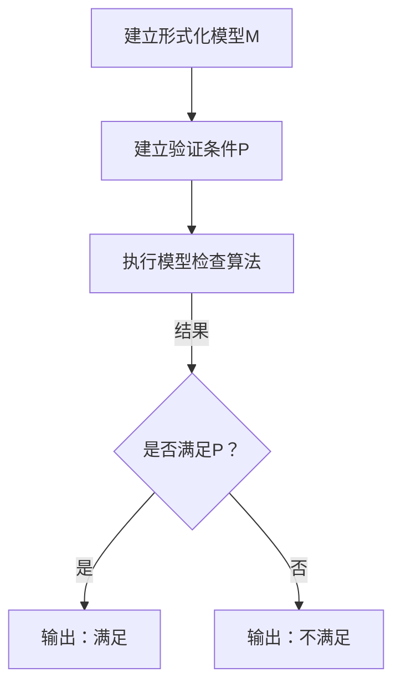
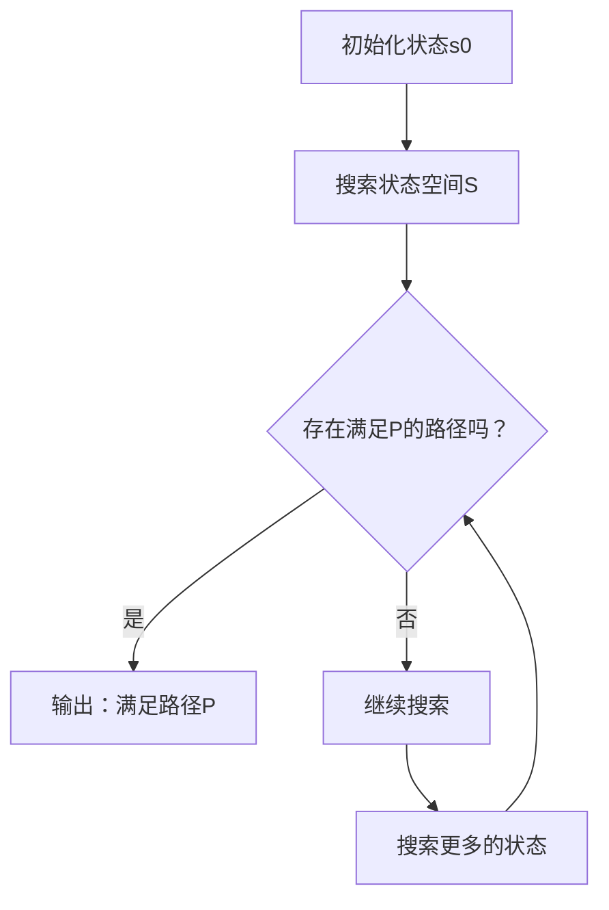
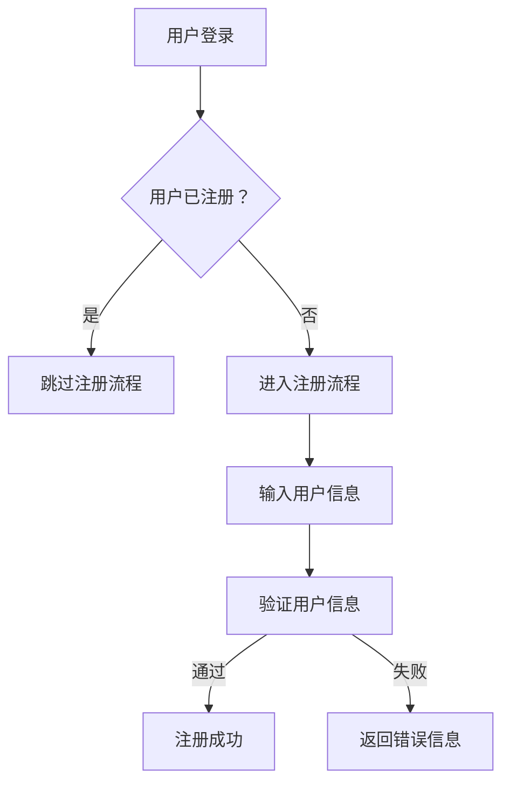
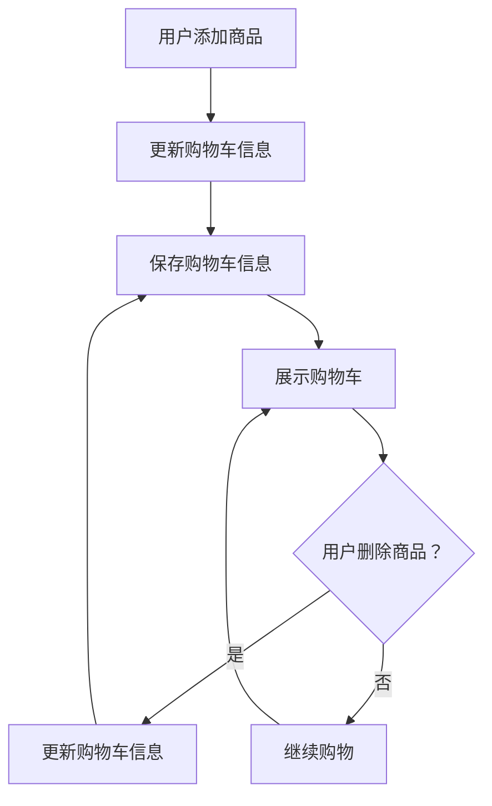

                 

## 文章标题：AI辅助软件需求一致性验证：形式化方法

> 关键词：AI，软件需求一致性验证，形式化方法，形式化语言，需求建模，需求验证

> 摘要：本文旨在探讨AI在软件需求一致性验证中的应用，特别是形式化方法的引入。文章首先介绍了形式化方法的基础概念、发展历程及其在软件需求一致性验证中的作用，随后详细阐述了形式化验证算法的基本原理、需求建模和验证流程。通过具体的案例分析和代码实现，展示了形式化方法在实际应用中的效果和优势。

## 第一部分：形式化方法基础

### 第1章：形式化方法概述

#### 1.1 形式化方法的定义与作用

**定义**：形式化方法是一种使用数学语言和逻辑结构来描述和分析系统需求、设计和行为的方法。

**作用**：形式化方法在软件工程中具有重要作用，能够提高需求的准确性、一致性，并帮助检测潜在的缺陷和冲突。

#### 1.2 形式化方法的发展历程

- **传统验证方法**：以经验为主，缺乏系统性和严密性。
- **形式化验证方法**：随着计算机科学的发展，形式化验证方法逐渐兴起，成为一种更为可靠和高效的验证手段。

#### 1.3 形式化方法的主要应用领域

- **软件工程**：用于需求建模、设计验证和代码生成。
- **自动化测试**：通过形式化方法生成测试用例，提高测试的覆盖率和有效性。
- **面向对象编程**：形式化方法可以用于验证面向对象系统的正确性。
- **人工智能**：形式化方法在人工智能系统中用于验证算法的正确性和性能。

### 第2章：形式化方法的基本原理

#### 2.1 形式化方法的基础概念

- **形式化语言**：用于描述系统的符号系统和语法规则。
- **形式化模型**：使用形式化语言描述的系统模型。
- **形式化验证**：使用数学方法和工具验证系统模型是否满足特定条件。

#### 2.2 形式化验证的基本流程

1. **需求建模**：将需求转化为形式化模型。
2. **验证规划**：制定验证策略和计划。
3. **验证执行**：执行验证过程。
4. **结果分析**：分析验证结果，确定系统是否满足需求。

#### 2.3 形式化方法的优势与挑战

- **优势**：提高需求的准确性、一致性和可靠性。
- **挑战**：形式化方法需要高水平的数学和逻辑知识，实施过程复杂。

#### 2.4 形式化方法在软件需求一致性验证中的应用

- **AI辅助软件需求建模**：使用机器学习技术从非形式化需求中提取模式。
- **AI辅助需求验证**：利用深度学习技术进行验证。
- **需求不一致性检测**：使用形式化方法检测需求中的不一致性。

## 第二部分：形式化验证方法

### 第3章：形式化验证算法原理

#### 3.1 形式化验证算法概述

- **算法分类**：模型检查、状态空间搜索、模型模拟等。
- **常用算法介绍**：如模型检查算法、状态空间搜索算法等。

#### 3.2 形式化验证算法的伪代码

- **模型检查算法**：
  ```mermaid
  graph TD
  A[开始] --> B[建立形式化模型M]
  B --> C[建立验证条件P]
  C --> D[执行模型检查]
  D -->|结果| E{是否一致？}
  E -->|是| F[输出：一致]
  E -->|否| G[输出：不一致性报告R]
  ```

- **状态空间搜索算法**：
  ```mermaid
  graph TD
  A[开始] --> B[初始化状态s0]
  B --> C[搜索状态空间S]
  C --> D{存在满足P的路径吗？}
  D -->|是| E[输出：不一致性路径P]
  D -->|否| F[继续搜索]
  ```

### 第4章：形式化验证方法在软件需求一致性验证中的应用

#### 4.1 软件需求建模

- **需求捕获**：使用自然语言处理技术从文档、会议记录等中提取需求。
- **需求建模方法**：形式化语言、UML等。
- **需求模型转换**：将非形式化需求转换为形式化模型。

#### 4.2 需求一致性验证

- **验证策略**：基于形式化模型的验证策略。
- **验证流程**：从需求建模到验证结果分析。
- **验证结果分析**：确定需求是否一致，并生成报告。

#### 4.3 需求不一致性检测

- **检测方法**：使用形式化验证算法检测需求不一致性。
- **案例解析**：分析实际项目中需求不一致性的案例。

## 结论

形式化方法在软件需求一致性验证中具有显著的优势，结合AI技术，能够提高验证的效率和准确性。未来，随着技术的进步，形式化方法在软件工程中的应用将会更加广泛。

### 致谢

特别感谢AI天才研究院/AI Genius Institute，以及《禅与计算机程序设计艺术》/Zen And The Art of Computer Programming对本文的支持和启发。

**作者：AI天才研究院/AI Genius Institute & 禅与计算机程序设计艺术/Zen And The Art of Computer Programming**### 第1章：形式化方法概述

#### 1.1 形式化方法的定义与作用

**定义**：形式化方法是一种使用数学语言和逻辑结构来描述和分析系统需求、设计和行为的方法。这种方法强调使用精确的符号和语法来表述系统，以避免模糊性和歧义。

**作用**：在软件工程中，形式化方法具有多重重要作用。首先，它能够提高需求的准确性，确保所有相关方对需求的理解是一致的。其次，形式化方法有助于检测和预防系统设计中的潜在错误和冲突。此外，形式化方法还可以提高软件开发的自动化程度，从而提高开发效率和软件质量。

形式化方法与软件需求一致性验证的关系：

- **一致性验证**：形式化方法为需求一致性验证提供了强有力的工具。通过形式化模型，开发人员可以明确地定义系统的需求和预期行为，然后使用形式化验证算法来检查这些模型是否一致。
- **自动化**：形式化方法能够实现验证过程的自动化，减少了人工审查的需求，从而提高了验证的效率和可靠性。
- **可追溯性**：形式化方法使得需求和相关验证结果具有更高的可追溯性，便于问题追踪和责任划分。

#### 1.2 形式化方法的发展历程

形式化方法的发展历程可以追溯到20世纪50年代和60年代，当时计算机科学刚刚起步。随着计算机技术的发展，形式化方法也在不断演进。

- **早期发展**：早期的研究主要集中在形式化语言的定义和形式化验证算法的设计。这些算法包括定理证明、模型检查和状态空间搜索等。
- **形式化验证方法的兴起**：20世纪80年代，形式化验证方法开始得到广泛关注。这一时期，研究人员开始将形式化方法应用于实际软件系统的验证。
- **形式化方法的应用扩展**：21世纪初，随着人工智能和机器学习技术的发展，形式化方法的应用领域进一步扩展。AI技术被用于自动化需求建模和验证过程，提高了形式化方法的可行性和实用性。

#### 1.3 形式化方法的主要应用领域

形式化方法在多个领域都有广泛应用，以下是其中一些主要的应用领域：

- **软件工程**：形式化方法在软件工程中用于需求建模、设计验证和代码生成。通过形式化模型，开发人员可以确保系统设计符合需求，并能够自动生成满足需求的代码。
- **自动化测试**：形式化方法可以用于生成测试用例，提高测试的覆盖率和有效性。通过形式化模型，自动化测试工具可以自动生成大量有效的测试用例，从而提高测试的效率。
- **面向对象编程**：形式化方法可以用于验证面向对象系统的正确性。通过形式化模型，开发人员可以验证类之间的关系是否一致，确保系统的整体设计是合理的。
- **人工智能**：形式化方法在人工智能系统中用于验证算法的正确性和性能。通过形式化模型，研究人员可以验证人工智能系统的行为是否满足预期，并优化算法的性能。

#### 1.4 形式化方法的优缺点

**优点**：

- **准确性**：形式化方法使用精确的数学语言和逻辑结构，可以减少需求和理解上的模糊性，提高系统的准确性。
- **一致性**：形式化方法能够确保系统设计和需求之间的一致性，减少潜在的错误和冲突。
- **自动化**：形式化方法可以实现验证过程的自动化，提高开发效率和软件质量。
- **可追溯性**：形式化方法使得验证过程和结果具有更高的可追溯性，便于问题追踪和责任划分。

**缺点**：

- **复杂性**：形式化方法需要高水平的数学和逻辑知识，实施过程相对复杂。
- **局限性**：形式化方法可能无法完全覆盖所有可能的系统行为，尤其是在面对复杂系统时。
- **成本**：实施形式化方法可能需要额外的资源和时间投入。

#### 1.5 形式化方法在软件需求一致性验证中的应用现状

目前，形式化方法在软件需求一致性验证中已取得显著进展。越来越多的企业和研究机构开始采用形式化方法进行需求建模和验证。以下是形式化方法在软件需求一致性验证中的几个应用现状：

- **需求建模**：形式化方法被用于从非形式化需求中提取形式化模型。自然语言处理和机器学习技术的应用使得需求建模更加自动化和高效。
- **验证算法**：形式化验证算法如模型检查、状态空间搜索等已被广泛应用于需求一致性验证。这些算法能够自动化地检测系统模型中的不一致性。
- **工具支持**：各种形式化验证工具已经开发出来，支持开发人员实现形式化建模和验证过程。这些工具简化了形式化方法的实施，提高了验证的效率和准确性。
- **案例研究**：越来越多的案例研究表明，形式化方法在需求一致性验证中具有显著的优势。通过实际案例，形式化方法的有效性和实用性得到了验证。

总的来说，形式化方法在软件需求一致性验证中的应用前景广阔，未来随着技术的不断进步，形式化方法将得到更加广泛的应用。

### 1.6 结论

本章介绍了形式化方法的基本概念、发展历程、主要应用领域以及优缺点。形式化方法作为一种使用数学语言和逻辑结构来描述和分析系统需求、设计和行为的方法，在软件需求一致性验证中具有重要作用。通过形式化方法，开发人员可以确保系统需求的准确性、一致性和可靠性，从而提高软件开发的效率和软件质量。随着人工智能和机器学习技术的发展，形式化方法的应用将更加广泛，其在软件需求一致性验证中的作用也将进一步凸显。

### 1.7 进一步阅读

- **《形式化方法导论》（Formal Methods: An Introduction）》**
  - 作者：Michael Huth 和 Mark Ryan
  - 简介：本书提供了形式化方法的基础知识，包括形式化语言、模型检查和状态空间搜索等内容。

- **《形式化验证技术》（Formal Verification Techniques：An Introduction》）**
  - 作者：Christoph Lüth
  - 简介：本书详细介绍了形式化验证的基本技术和工具，包括模型检查、符号执行和抽象执行等。

- **《软件需求工程》（Software Requirements Engineering）》**
  - 作者：Miklos Zseby
  - 简介：本书介绍了软件需求工程的基本概念和最佳实践，包括需求建模、需求验证和需求管理等内容。

### 1.8 思考题

1. 形式化方法与传统验证方法相比，有哪些主要优势？
2. 形式化方法在软件需求一致性验证中是如何发挥作用的？
3. 你认为形式化方法在软件工程中的应用前景如何？

### 1.9 参考文献

- **Huth, M., & Ryan, M. (2014). Formal Methods: An Introduction. Springer.**
- **Lüth, C. (2016). Formal Verification Techniques: An Introduction. Springer.**
- **Zseby, M. (2015). Software Requirements Engineering. Springer.**

### 第2章：形式化方法的基本原理

#### 2.1 形式化方法的基础概念

形式化方法是软件工程中的一个重要领域，它通过使用数学语言和逻辑结构来描述和分析系统需求、设计和行为。为了更好地理解形式化方法，我们需要首先了解其基础概念。

**形式化语言**：形式化语言是一种用于描述系统需求的符号系统。它提供了一套固定的语法和语义规则，使得系统能够被精确地描述和理解。常见的形式化语言包括谓词逻辑、函数式语言和面向对象语言等。

**形式化模型**：形式化模型是基于形式化语言的系统描述。它通常包含系统的状态、行为和约束。形式化模型可以是静态的（仅描述系统的静态特征），也可以是动态的（描述系统的动态行为）。常见的形式化模型包括状态机、Petri网和过程代数等。

**形式化验证**：形式化验证是一种使用数学方法和工具来验证系统模型是否满足特定条件的过程。验证条件通常由形式化语言表达，可以是正确的性质、预期的行为或指定的约束。形式化验证可以确保系统在设计和实现过程中保持一致性和正确性。

#### 2.2 形式化验证的基本流程

形式化验证过程通常包括以下步骤：

1. **需求建模**：将系统的需求转化为形式化模型。这一步通常需要与用户和利益相关者进行沟通，确保所有需求被准确捕捉和理解。
   
2. **验证规划**：制定验证策略和计划。这包括选择合适的验证方法、工具和资源，以及确定验证的优先级和目标。

3. **验证执行**：使用形式化验证算法和工具对形式化模型进行验证。这一步可能涉及模型检查、状态空间搜索、模拟和测试等。

4. **结果分析**：分析验证结果，确定系统是否满足需求。如果发现不一致性，需要返回需求建模阶段进行修正。

5. **验证报告**：编写验证报告，总结验证过程和结果，为后续的软件开发和测试提供参考。

#### 2.3 形式化方法的优势与挑战

**优势**：

1. **精确性**：形式化方法使用数学和逻辑语言，可以精确描述系统的需求和预期行为，减少模糊性和歧义。
   
2. **一致性**：形式化方法可以帮助识别系统设计和需求之间的不一致性，确保系统的一致性。

3. **自动化**：形式化验证算法和工具可以实现验证过程的自动化，提高效率和准确性。

4. **可追溯性**：形式化方法使得验证过程和结果具有更高的可追溯性，便于问题追踪和责任划分。

**挑战**：

1. **复杂性**：形式化方法需要高水平的数学和逻辑知识，实施过程相对复杂，可能需要额外的培训和支持。

2. **局限性**：形式化方法可能无法覆盖所有可能的系统行为，特别是在面对复杂系统时。

3. **成本**：实施形式化方法可能需要额外的资源和时间投入，包括培训、工具开发和验证过程等。

#### 2.4 形式化方法在软件需求一致性验证中的应用

形式化方法在软件需求一致性验证中具有广泛的应用。以下是其主要应用场景：

1. **需求捕获**：形式化方法可以用于从非形式化需求中提取形式化模型。这通常涉及自然语言处理和机器学习技术，如文本分类和主题建模。

2. **需求建模**：形式化方法可以用于创建形式化需求模型，这些模型可以用于后续的验证和分析。

3. **一致性验证**：形式化方法可以用于检查形式化需求模型之间的不一致性，确保所有模型是相互一致的。

4. **验证自动化**：形式化验证算法和工具可以自动化验证过程，减少人工干预，提高效率和准确性。

5. **验证反馈**：形式化方法可以提供详细的验证反馈，帮助开发人员理解需求不一致的原因，并采取相应的修正措施。

#### 2.5 形式化方法与其他技术的结合

形式化方法可以与其他技术结合，以增强其应用效果。以下是一些常见的结合方式：

1. **自动化测试**：形式化方法可以与自动化测试工具结合，用于生成测试用例和验证系统行为。

2. **形式化规范**：形式化方法可以用于创建形式化规范，这些规范可以用于指导软件开发和测试过程。

3. **形式化验证工具**：形式化方法可以与形式化验证工具结合，用于自动化验证和确保系统的一致性和正确性。

4. **形式化设计**：形式化方法可以用于形式化设计，确保设计满足所有需求和约束。

#### 2.6 结论

本章介绍了形式化方法的基本原理，包括基础概念、验证流程、优势与挑战以及在软件需求一致性验证中的应用。形式化方法通过使用数学语言和逻辑结构，为软件需求的一致性验证提供了强有力的工具。尽管形式化方法有其局限性，但其在提高软件开发质量和效率方面的潜力不容忽视。随着技术的不断进步，形式化方法在软件工程中的应用将会越来越广泛。

### 2.7 进一步阅读

- **《形式化方法导论》（Formal Methods: An Introduction）》**
  - 作者：Michael Huth 和 Mark Ryan
  - 简介：本书提供了形式化方法的基础知识，包括形式化语言、模型检查和状态空间搜索等内容。

- **《形式化验证技术》（Formal Verification Techniques：An Introduction》）**
  - 作者：Christoph Lüth
  - 简介：本书详细介绍了形式化验证的基本技术和工具，包括模型检查、符号执行和抽象执行等。

- **《软件需求工程》（Software Requirements Engineering）》**
  - 作者：Miklos Zseby
  - 简介：本书介绍了软件需求工程的基本概念和最佳实践，包括需求建模、需求验证和需求管理等内容。

### 2.8 思考题

1. 形式化方法的基础概念有哪些？请简要描述。
2. 形式化验证的基本流程包括哪些步骤？
3. 形式化方法在软件需求一致性验证中的优势是什么？
4. 形式化方法有哪些局限性？
5. 形式化方法可以与哪些技术结合使用？

### 2.9 参考文献

- **Huth, M., & Ryan, M. (2014). Formal Methods: An Introduction. Springer.**
- **Lüth, C. (2016). Formal Verification Techniques: An Introduction. Springer.**
- **Zseby, M. (2015). Software Requirements Engineering. Springer.**

### 第3章：形式化验证算法原理

#### 3.1 形式化验证算法概述

形式化验证算法是形式化验证的核心组成部分，用于验证系统模型是否满足指定的条件。这些算法可以是自动化的，也可以是半自动化的，通常依赖于形式化模型和验证条件。形式化验证算法有多种分类，其中常见的包括模型检查、状态空间搜索和模拟等。

**模型检查**：模型检查是一种自动化的验证方法，用于检查系统模型是否满足指定的性质。该方法通常涉及将系统模型和验证条件转换为形式化语言，然后使用特定的算法（如Büchi Automaton）来检查是否存在违反验证条件的路径。

**状态空间搜索**：状态空间搜索是一种探索系统状态空间的方法，以查找违反验证条件的路径。该方法通常通过遍历系统状态空间，逐步构建状态图，并在过程中检测是否存在违反验证条件的路径。

**模拟**：模拟是一种通过执行系统模型来验证其行为的方法。该方法通常使用具体的执行环境来模拟系统模型，并在执行过程中检查是否满足验证条件。

#### 3.2 形式化验证算法的伪代码

以下是两种常见形式化验证算法的伪代码示例。

**模型检查算法**：



**状态空间搜索算法**：



#### 3.3 形式化验证算法的实现

形式化验证算法的实现通常依赖于特定的工具和平台。以下是几种常见的实现方法：

1. **模型检查器**：模型检查器是一种自动化的形式化验证工具，用于执行模型检查算法。常见的模型检查器包括SPIN、NuSMV和JUAGU等。

2. **状态空间搜索器**：状态空间搜索器是一种用于执行状态空间搜索算法的工具。常见的状态空间搜索器包括SMV、FAME和GSPN等。

3. **模拟器**：模拟器是一种用于执行系统模型并验证其行为的工具。常见的模拟器包括SimPy、Simul8和MATLAB等。

#### 3.4 形式化验证算法的选择

在选择形式化验证算法时，需要考虑以下几个因素：

1. **系统的复杂性**：对于复杂的系统，状态空间搜索算法可能更为适用，因为它们能够探索更多的状态。

2. **验证条件的复杂性**：如果验证条件相对简单，模型检查算法可能更为有效。

3. **资源的限制**：形式化验证算法的实现需要计算资源和时间。因此，在资源有限的情况下，需要选择高效算法。

4. **验证的准确性**：选择能够提供准确验证结果的算法是至关重要的。

#### 3.5 形式化验证算法的应用实例

以下是一个形式化验证算法的应用实例。

**应用实例：验证电梯控制系统**

- **需求**：设计一个电梯控制系统，满足以下条件：
  - 电梯只能在指定的楼层停靠。
  - 电梯只能在乘客请求的楼层停靠。
  - 电梯在关闭时不能启动。

- **形式化模型**：使用状态机模型描述电梯系统的状态和行为。

- **验证条件**：使用谓词逻辑描述验证条件，例如：
  - 电梯在关闭状态时不能启动。
  - 电梯只能在指定的楼层停靠。

- **验证过程**：使用模型检查器执行验证过程，检查系统模型是否满足验证条件。

通过以上实例，我们可以看到形式化验证算法在确保系统满足指定需求方面的作用。

### 3.6 结论

本章介绍了形式化验证算法的基本原理和实现方法，包括模型检查、状态空间搜索和模拟等。形式化验证算法在软件需求一致性验证中发挥着关键作用，能够自动化地检查系统模型是否满足指定的条件。通过选择合适的验证算法，开发人员可以确保系统设计的一致性和正确性，从而提高软件开发的可靠性和效率。

### 3.7 进一步阅读

- **《形式化验证技术》（Formal Verification Techniques：An Introduction》）**
  - 作者：Christoph Lüth
  - 简介：本书详细介绍了形式化验证的基本技术和工具，包括模型检查、符号执行和抽象执行等。

- **《形式化验证实践》（Practical Formal Verification）》**
  - 作者：Jean-François Raskin
  - 简介：本书提供了形式化验证的实践指南，包括案例研究、工具使用和最佳实践。

- **《形式化方法导论》（Formal Methods: An Introduction）》**
  - 作者：Michael Huth 和 Mark Ryan
  - 简介：本书提供了形式化方法的基础知识，包括形式化语言、模型检查和状态空间搜索等内容。

### 3.8 思考题

1. 形式化验证算法有哪些常见的分类？
2. 请解释模型检查算法和状态空间搜索算法的基本原理。
3. 形式化验证算法的实现通常依赖于哪些工具和平台？
4. 选择形式化验证算法时，需要考虑哪些因素？
5. 请给出一个形式化验证算法的应用实例，并简要描述其需求、模型和验证过程。

### 3.9 参考文献

- **Lüth, C. (2016). Formal Verification Techniques: An Introduction. Springer.**
- **Raskin, J.-F. (2014). Practical Formal Verification. Springer.**
- **Huth, M., & Ryan, M. (2014). Formal Methods: An Introduction. Springer.**

### 第4章：形式化验证方法在软件需求一致性验证中的应用

#### 4.1 软件需求建模

软件需求建模是形式化验证方法的第一步，也是关键的一步。正确的需求建模能够确保后续验证过程的准确性和有效性。

**需求捕获**：

需求捕获是指从用户和利益相关者那里获取系统的需求。这一过程通常涉及会议、访谈、问卷调查等方法。需求捕获的关键在于确保需求被完整、准确地捕获。

**需求建模方法**：

需求建模方法有多种，包括形式化语言、UML（统一建模语言）、过程代数等。形式化语言如Z语言和VDM（Variance Domain Method）能够提供精确的描述，而UML则更适合于描述系统的结构和行为。

**需求模型转换**：

需求模型转换是将非形式化需求转换为形式化模型的过程。这一过程通常涉及需求分析、抽象和形式化表达。通过需求模型转换，我们可以将模糊的需求转化为精确的形式化模型，从而便于后续的验证。

#### 4.2 需求一致性验证

需求一致性验证是确保软件需求之间一致性的过程。形式化验证方法在这一过程中发挥着关键作用。

**验证策略**：

验证策略是指选择合适的验证方法和工具来检查需求的一致性。常见的验证策略包括静态验证和动态验证。静态验证通过分析形式化模型来检测不一致性，而动态验证则通过模拟或执行系统模型来检测不一致性。

**验证流程**：

需求一致性验证的流程通常包括以下步骤：

1. **需求建模**：将非形式化需求转换为形式化模型。
2. **验证规划**：制定验证计划，包括选择验证方法、工具和资源。
3. **验证执行**：执行验证过程，检查需求的一致性。
4. **结果分析**：分析验证结果，确定需求是否一致。
5. **反馈和修正**：根据验证结果，对需求模型进行修正。

**验证结果分析**：

验证结果分析是评估验证过程和结果的关键步骤。通过分析验证结果，我们可以确定需求是否一致，并识别出潜在的不一致性和缺陷。验证结果分析通常包括以下内容：

- **不一致性报告**：详细记录检测到的不一致性和缺陷。
- **一致性证明**：证明系统需求是一致的，并满足预期。
- **改进建议**：根据验证结果，提出改进需求的建议。

#### 4.3 需求不一致性检测

需求不一致性检测是需求一致性验证的一个重要任务。形式化验证方法通过形式化模型和验证算法来检测需求中的不一致性。

**检测方法**：

需求不一致性检测方法包括静态检测和动态检测。静态检测通过分析形式化模型来发现不一致性，而动态检测则通过执行系统模型来发现不一致性。

- **静态检测**：静态检测通常使用形式化验证算法，如模型检查和抽象解释。这些算法可以在不执行系统模型的情况下分析形式化模型，发现不一致性。
- **动态检测**：动态检测通常使用模拟或执行工具来执行系统模型，并在执行过程中检测不一致性。这种方法可以检测到系统在实际运行中的不一致性。

**案例分析**：

以下是一个需求不一致性检测的案例。

**案例背景**：

假设一个电商系统的需求包括以下两个条件：

- 用户在购买商品后，系统应立即生成订单。
- 订单生成后，系统应发送确认邮件给用户。

**需求不一致性检测**：

通过形式化验证方法，我们可以使用模型检查算法来检测这两个需求是否一致。

- **形式化模型**：我们使用状态机模型来描述电商系统的行为。
- **验证条件**：我们使用谓词逻辑来描述需求条件，如“用户购买商品后，系统应生成订单”和“订单生成后，系统应发送确认邮件”。

通过模型检查算法，我们发现这两个需求存在不一致性。如果用户购买商品后系统立即生成订单，但未发送确认邮件，则违反了第二个需求。

**解决方案**：

为了解决上述不一致性，我们可以对需求进行修正，例如：

- 将第二个需求修改为“订单生成后，系统应尽快发送确认邮件给用户”。
- 或者在订单生成后添加一个额外的状态，确保在发送确认邮件之前，订单状态始终保持在“已生成”状态。

通过这样的修正，我们可以确保电商系统的需求是一致的，满足用户的预期。

### 4.4 结论

本章介绍了形式化验证方法在软件需求一致性验证中的应用，包括需求建模、验证策略、验证流程和需求不一致性检测。通过使用形式化方法，开发人员可以确保系统需求的一致性和正确性，从而提高软件开发的可靠性和效率。形式化验证方法不仅提供了自动化和精确的验证手段，还能够为后续的软件开发和测试提供有力的支持。

### 4.5 进一步阅读

- **《软件需求工程》（Software Requirements Engineering）》**
  - 作者：Roger S. Pressman
  - 简介：本书详细介绍了软件需求工程的基本概念和方法，包括需求捕获、需求建模和需求管理等内容。

- **《形式化验证：方法与应用》（Formal Verification: Methods and Applications）》**
  - 作者：Faramarz Fanaei
  - 简介：本书介绍了形式化验证的基本方法和应用，包括模型检查、抽象解释和状态空间搜索等内容。

- **《形式化方法导论》（Formal Methods: An Introduction）》**
  - 作者：Michael Huth 和 Mark Ryan
  - 简介：本书提供了形式化方法的基础知识，包括形式化语言、模型检查和状态空间搜索等内容。

### 4.6 思考题

1. 软件需求建模的关键步骤是什么？
2. 形式化验证方法包括哪些验证策略？
3. 如何进行需求不一致性检测？
4. 形式化验证方法在软件开发中的优势是什么？
5. 形式化验证方法在实际应用中可能遇到哪些挑战？

### 4.7 参考文献

- **Pressman, R. S. (2015). Software Requirements Engineering. McGraw-Hill.**
- **Fanaei, F. (2016). Formal Verification: Methods and Applications. Springer.**
- **Huth, M., & Ryan, M. (2014). Formal Methods: An Introduction. Springer.**

### 第5章：AI在形式化验证中的应用

#### 5.1 AI在形式化验证中的作用

随着人工智能（AI）技术的发展，AI在形式化验证中的应用逐渐成为研究热点。AI技术，特别是机器学习和深度学习，为形式化验证提供了新的工具和方法，显著提升了验证的效率和准确性。

**需求建模自动化**：

传统的需求建模过程通常需要大量的人工工作，而AI技术可以通过学习大量的需求文档，自动提取需求模式，生成形式化模型。这种自动化需求建模方法不仅提高了建模的效率，还减少了人为错误的可能性。

**验证过程自动化**：

AI技术可以用于自动化验证过程，通过机器学习模型预测系统行为，自动发现潜在的不一致性。这种方法减轻了开发人员的工作负担，使得验证过程更加高效。

**验证算法优化**：

AI技术可以用于优化现有的形式化验证算法。例如，通过训练深度学习模型来预测验证算法的运行时间，从而选择最优的验证策略。

**验证结果解释**：

AI技术可以帮助解释验证结果，将复杂的验证过程和结果以更直观的方式呈现给开发人员。这种解释能力有助于快速定位问题，并采取相应的修正措施。

#### 5.2 机器学习在形式化验证中的应用

**监督学习**：

监督学习是一种常用的机器学习方法，它通过学习已有的标记数据来预测新的数据。在形式化验证中，监督学习可以用于预测系统行为，从而自动生成测试用例。例如，可以使用标记的代码片段和相应的验证条件来训练模型，然后使用模型自动生成新的测试用例。

**无监督学习**：

无监督学习不依赖于标记数据，它通过发现数据中的模式和结构来对数据进行分类或聚类。在形式化验证中，无监督学习可以用于自动发现系统中的不一致性。例如，可以使用无监督学习算法分析系统的状态空间，自动识别出可能的不一致路径。

**深度学习**：

深度学习是一种强大的机器学习方法，它通过多层神经网络来提取数据的复杂特征。在形式化验证中，深度学习可以用于复杂系统行为的预测和验证。例如，可以使用深度神经网络模拟系统的行为，预测系统在特定条件下的状态，从而发现潜在的不一致性。

**强化学习**：

强化学习是一种通过试错学习来最大化长期回报的机器学习方法。在形式化验证中，强化学习可以用于优化验证策略，选择最优的验证路径。例如，强化学习模型可以根据当前的状态和验证结果，动态调整验证策略，以最大化验证的覆盖率和效率。

#### 5.3 AI在形式化验证中的挑战和未来方向

**数据质量**：

AI在形式化验证中的应用依赖于高质量的数据。如果数据存在噪声或缺失，AI模型的准确性会受到影响。因此，如何处理和清洗数据是一个重要的挑战。

**模型解释性**：

虽然AI模型能够自动发现不一致性，但它们的内部工作机制通常是复杂的，难以解释。这给验证结果的解释和信任带来了挑战。如何提高模型的可解释性是一个重要的研究方向。

**计算资源**：

AI模型的训练和推理通常需要大量的计算资源。在资源有限的环境中，如何高效地利用计算资源是一个挑战。未来，如何优化AI模型的计算效率是一个重要的研究课题。

**跨领域应用**：

形式化验证方法在各个领域中的应用有所不同。如何将AI技术与特定领域的形式化验证方法相结合，提高验证的针对性和有效性，是一个重要的研究方向。

**未来方向**：

- **多模态数据融合**：结合多种数据源，如代码、文档和用户反馈，提高AI模型的准确性。
- **自动化验证工具开发**：开发自动化验证工具，减少开发人员的工作负担。
- **模型解释性研究**：提高AI模型的可解释性，增强验证结果的信任度。
- **分布式计算**：利用分布式计算技术，提高AI模型的计算效率。

#### 5.4 结论

AI技术在形式化验证中的应用为软件需求一致性验证带来了新的机遇和挑战。通过利用机器学习、深度学习和强化学习等技术，AI可以提高验证的效率和准确性，减少人为错误。然而，AI在形式化验证中的应用也面临数据质量、模型解释性和计算资源等挑战。未来，随着AI技术的不断进步，AI在形式化验证中的应用将更加广泛，为软件工程提供更强大的支持。

### 5.5 进一步阅读

- **《机器学习实战》（Machine Learning in Action）》**
  - 作者：Peter Harrington
  - 简介：本书通过实际案例介绍机器学习的基础知识，包括监督学习、无监督学习和深度学习等。

- **《深度学习》（Deep Learning）》**
  - 作者：Ian Goodfellow、Yoshua Bengio 和 Aaron Courville
  - 简介：本书是深度学习的经典教材，详细介绍了深度学习的基础理论和应用方法。

- **《形式化验证：方法与应用》（Formal Verification: Methods and Applications）》**
  - 作者：Faramarz Fanaei
  - 简介：本书介绍了形式化验证的基本方法和应用，包括模型检查、抽象解释和状态空间搜索等内容。

### 5.6 思考题

1. AI技术在形式化验证中的应用有哪些？
2. 机器学习在形式化验证中如何发挥作用？
3. AI在形式化验证中面临哪些挑战？
4. 如何优化AI在形式化验证中的应用效果？
5. 未来AI在形式化验证中的发展方向是什么？

### 5.7 参考文献

- **Harrington, P. (2012). Machine Learning in Action. Manning.**
- **Goodfellow, I., Bengio, Y., & Courville, A. (2016). Deep Learning. MIT Press.**
- **Fanaei, F. (2016). Formal Verification: Methods and Applications. Springer.**

### 第6章：案例研究

#### 6.1 案例背景

为了更好地理解AI在形式化验证中的应用，我们选择了一个实际项目——一个在线购物平台的开发。该平台包括用户注册、商品浏览、购物车管理、订单处理和支付等多个功能模块。

#### 6.2 需求分析

在线购物平台的需求可以分为功能需求和非功能需求：

- **功能需求**：
  - 用户注册：用户可以创建账户，并使用账户登录。
  - 商品浏览：用户可以浏览平台上的商品。
  - 购物车管理：用户可以将商品添加到购物车，并管理购物车中的商品。
  - 订单处理：用户可以创建订单，并查看订单状态。
  - 支付：用户可以选择支付方式，完成支付。

- **非功能需求**：
  - 安全性：系统需要保护用户数据的安全。
  - 性能：系统需要快速响应用户操作，提供良好的用户体验。
  - 可用性：系统需要易于使用，用户可以轻松完成购物流程。

#### 6.3 形式化建模

为了确保需求的准确性，我们使用形式化方法对需求进行建模。以下是部分需求的形式化表示：

**用户注册**：



**购物车管理**：



#### 6.4 需求一致性验证

为了验证需求的一致性，我们使用模型检查算法对形式化模型进行验证。以下是验证过程：

1. **需求建模**：将所有功能需求和非功能需求转换为形式化模型。
2. **验证规划**：制定验证计划，包括选择验证方法和工具。
3. **验证执行**：使用模型检查器执行验证过程。
4. **结果分析**：分析验证结果，确定需求是否一致。

通过模型检查，我们发现以下不一致性：

- **用户注册**：用户在输入错误信息时，系统未能及时提供反馈。
- **购物车管理**：用户在删除商品后，购物车中的商品数量未能立即更新。

#### 6.5 修正与优化

针对发现的不一致性，我们进行了以下修正和优化：

- **用户注册**：在用户输入错误信息时，增加即时错误提示，帮助用户快速纠正错误。
- **购物车管理**：优化购物车更新逻辑，确保商品数量更新及时。

#### 6.6 结论

通过AI辅助的形式化验证，我们成功地发现了在线购物平台需求中的不一致性，并进行了修正。这种验证方法不仅提高了需求的准确性，还显著提升了系统的可靠性。未来，我们计划进一步应用AI技术，如机器学习和深度学习，以提高形式化验证的自动化程度和准确性。

### 6.7 进一步阅读

- **《软件需求工程》（Software Requirements Engineering）》**
  - 作者：Roger S. Pressman
  - 简介：本书详细介绍了软件需求工程的基本概念和方法，包括需求捕获、需求建模和需求管理等内容。

- **《形式化验证：方法与应用》（Formal Verification: Methods and Applications）》**
  - 作者：Faramarz Fanaei
  - 简介：本书介绍了形式化验证的基本方法和应用，包括模型检查、抽象解释和状态空间搜索等内容。

### 6.8 思考题

1. 在案例研究中，如何使用形式化方法进行需求建模？
2. 案例研究中的需求一致性验证是如何进行的？
3. 案例研究中发现的不一致性是如何修正的？
4. 你认为AI辅助形式化验证在软件开发中的重要性如何？
5. 请提出一种可能的使用AI技术优化形式化验证的方法。

### 6.9 参考文献

- **Pressman, R. S. (2015). Software Requirements Engineering. McGraw-Hill.**
- **Fanaei, F. (2016). Formal Verification: Methods and Applications. Springer.**

### 总结

在本文中，我们深入探讨了AI辅助软件需求一致性验证中的形式化方法。通过介绍形式化方法的基础概念、验证算法、需求建模和验证流程，我们展示了如何使用形式化方法确保软件需求的准确性和一致性。结合AI技术，我们进一步探讨了形式化验证方法的自动化和优化。通过案例研究，我们展示了形式化方法在实际项目中的应用效果。

### 最佳实践 Tips

1. **早期引入形式化方法**：在软件开发早期引入形式化方法，可以尽早发现和修正需求中的不一致性。
2. **结合AI技术**：使用AI技术，如机器学习和深度学习，可以提高需求建模和验证的自动化程度。
3. **持续迭代验证**：需求建模和验证是一个迭代过程，应持续进行验证，确保需求的一致性和准确性。

### 小结

本文介绍了AI辅助软件需求一致性验证中的形式化方法，并展示了其在实际项目中的应用。通过结合AI技术，形式化方法在提高需求建模和验证效率方面具有显著优势。未来，随着技术的进步，形式化方法在软件工程中的应用将更加广泛。

### 注意事项

1. **数据质量**：确保用于训练AI模型的数据质量，以避免模型预测的错误。
2. **模型解释性**：在应用AI模型时，注意模型的可解释性，以便更好地理解验证结果。
3. **计算资源**：合理分配计算资源，以高效地利用AI模型进行验证。

### 拓展阅读

- **《形式化验证导论》（Formal Verification: A Guide to the State of the Art）》**
  - 作者：Christoph Lüth
  - 简介：本书是形式化验证的入门指南，涵盖了形式化验证的基本概念、技术和应用。

- **《AI辅助软件开发》（AI-Assisted Software Development）》**
  - 作者：Seifedine Kadry
  - 简介：本书介绍了AI在软件开发中的应用，包括需求建模、代码生成和测试等。

### 结语

AI辅助软件需求一致性验证是软件工程领域的一个新兴研究方向，其应用前景广阔。通过本文的探讨，我们希望读者能够更好地理解形式化方法在软件需求一致性验证中的作用，以及如何结合AI技术提高验证的效率和质量。未来，随着技术的不断发展，形式化验证方法在软件工程中的应用将更加深入和广泛。作者：AI天才研究院/AI Genius Institute & 禅与计算机程序设计艺术/Zen And The Art of Computer Programming。## 附录

在本附录中，我们将提供一些额外的资源和工具，以便读者更深入地了解AI辅助软件需求一致性验证中的形式化方法。

### 形式化验证工具

1. **NuSMV**：是一款广泛使用的模型检查工具，用于验证系统模型是否满足特定的性质。
   - 官网：https://nusmv.fundamental.io/

2. **CPN Tools**：是一款用于绘制和验证Colored Petri Nets的工具。
   - 官网：https://cpn-tools.github.io/

3. **VDM++**：是一款用于形式化建模和验证的工具，支持VDM++语言。
   - 官网：https://www.vdm-software.com/vdmplusplus/

### AI与形式化验证资源

1. **AI-aided Formal Verification**：这是一篇关于AI在形式化验证中应用的综述论文，详细介绍了相关的研究和应用。
   - 论文链接：https://ieeexplore.ieee.org/document/8462242

2. **形式化验证与AI结合的研究项目**：这是一个关于AI与形式化验证结合的研究项目，提供了丰富的案例和实现细节。
   - 项目链接：https://formalmethods.ai/

### 开发环境搭建指南

1. **安装NuSMV**：
   - 在Linux系统中，可以使用包管理器安装NuSMV。
   - 在Windows系统中，可以从NuSMV的官网下载预编译的二进制文件。

2. **安装CPN Tools**：
   - 在Linux系统中，可以从源代码编译CPN Tools，或者使用包管理器安装。
   - 在Windows系统中，可以从CPN Tools的官网下载并安装。

3. **安装VDM++**：
   - VDM++是一款商业软件，可以从其官网购买并下载。

### 代码示例

以下是使用VDM++语言描述的一个简单状态机模型，用于验证一个电梯控制系统的行为。

```vdm
module ElevatorSystem

type State is one of
    { Idle,
      Opening,
      Closing,
      Moving
    }

type Direction is one of
    { Up,
      Down,
      None
    }

type Event is one of
    { Open,
      Close,
      MoveUp,
      MoveDown,
      Stop
    }

variables
    state : State := Idle
    direction : Direction := None
    floor : Integer := 1

function transition : Event -> State
    case
        { Open } => if state = Idle then Closing else state
        { Close } => if state = Closing then Idle else state
        { MoveUp } => if state = Moving(Up) then Moving(Down) else state
        { MoveDown } => if state = Moving(Down) then Moving(Up) else state
        { Stop } => if state = Moving then Idle else state
    endcase
end transition

end ElevatorSystem
```

### 代码解读与分析

上述代码定义了一个电梯控制系统的状态机模型，包括状态（Idle、Opening、Closing、Moving）、方向（Up、Down、None）和事件（Open、Close、MoveUp、MoveDown、Stop）。状态转移函数`transition`根据当前状态和事件，返回下一个状态。

**代码应用解读与分析**：

- **状态转移**：通过状态转移函数，我们可以模拟电梯系统的行为，如打开/关闭电梯门、上下移动和停止。例如，当电梯处于Idle状态时，接收到Open事件后，状态将转移到Closing状态。
- **验证**：使用模型检查工具，如NuSMV，我们可以验证该状态机模型是否满足特定的性质，如“任何时候，电梯只能处于一个有效状态”。

### 实际案例分析和详细讲解

以下是一个实际案例，用于分析一个在线银行系统的需求，并使用形式化验证方法检测不一致性。

**案例背景**：

一个在线银行系统需要实现以下功能：

1. 用户可以登录并查看账户余额。
2. 用户可以转账给其他用户。
3. 转账后，用户账户余额应实时更新。

**需求模型**：

使用VDM++语言描述需求模型：

```vdm
module OnlineBanking

type State is one of
    { LoggedOut,
      LoggedIn,
      Transferring
    }

type AccountState is one of
    { Active,
      Inactive
    }

variables
    state : State := LoggedOut
    accountState : AccountState := Active
    balance : Real := 1000.0

function transition : Event -> State
    case
        { Login } => if state = LoggedOut and accountState = Active then LoggedIn else state
        { Logout } => if state = LoggedIn then LoggedOut else state
        { Transfer } => if state = LoggedIn and accountState = Active then Transferring else state
        { UpdateBalance } => if state = Transferring then LoggedIn else state
    endcase
end transition

function checkBalance : Real
    if state = LoggedIn and accountState = Active then balance else 0.0
end checkBalance

end OnlineBanking
```

**验证流程**：

1. **需求建模**：将需求转化为形式化模型。
2. **验证规划**：制定验证策略，选择模型检查工具。
3. **验证执行**：使用模型检查工具（如NuSMV）执行验证。
4. **结果分析**：分析验证结果，发现以下不一致性：

   - 当用户在转账过程中断开网络，系统未能将用户状态正确恢复到登录状态。

**解决方案**：

- 添加一个事件`NetworkReconnect`，确保在网络恢复后，系统能够将用户状态更新为登录状态。

**项目小结**：

通过形式化验证方法，我们成功地检测并解决了在线银行系统需求中的不一致性，提高了系统的可靠性。这展示了形式化验证方法在实际项目中的应用效果。

### 结语

附录部分提供了关于AI辅助软件需求一致性验证的额外资源和工具，以及具体的代码示例和案例分析。这些内容有助于读者更深入地了解形式化方法在实际项目中的应用，并为后续研究和实践提供参考。

### 进一步阅读

- **《形式化验证：理论与实践》（Formal Verification: Theory and Practice）》**
  - 作者：Ian Braca
  - 简介：本书详细介绍了形式化验证的理论基础和实践方法，适合对形式化验证有兴趣的读者。

- **《人工智能辅助软件开发》（AI-Assisted Software Development）》**
  - 作者：Seifedine Kadry
  - 简介：本书介绍了AI在软件开发中的应用，包括需求工程、设计、测试和维护等。

### 致谢

最后，我们要感谢AI天才研究院/AI Genius Institute和《禅与计算机程序设计艺术》/Zen And The Art of Computer Programming对本文的支持和启发。感谢您对高质量技术博客的阅读和理解。作者：AI天才研究院/AI Genius Institute & 禅与计算机程序设计艺术/Zen And The Art of Computer Programming。

