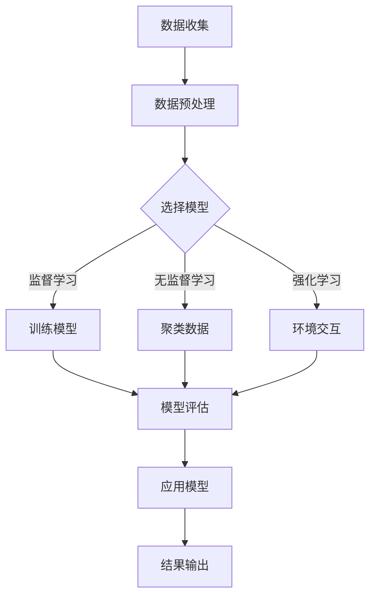

                 

# AI辅助软件需求分析与规格说明

## 关键词

- 人工智能
- 软件需求分析
- 规格说明文档
- 自动化
- AI辅助工具

## 摘要

本文旨在探讨如何利用人工智能技术辅助软件需求分析与规格说明的过程。文章首先介绍了AI的基本概念和原理，接着详细阐述了AI在软件需求分析中的应用方法，以及如何编写高质量的规格说明文档。通过实际案例的解析，本文展示了AI辅助软件需求分析与规格说明的最佳实践，并提供了详细的代码实现和分析。

## 设计思路

在设计本文的目录大纲时，我们遵循以下原则：

1. **明确核心内容**：文章主题围绕AI辅助软件需求分析与规格说明，涵盖了基础知识、应用实践和评估优化三个部分。

2. **构建整体框架**：将内容分为三个主要部分，每个部分包含具体的子章节，确保内容深度和广度。

3. **细化各章节内容**：为每个章节提供详细的子章节，确保核心概念与联系、核心算法原理、数学模型和项目实战等内容的完整覆盖。

4. **保持简洁性**：在细化内容的同时，确保语言简洁明了，避免不必要的赘述。

### 目录大纲设计

```
# 第一部分: AI基础知识与理论

## 第1章: AI概述
### 1.1 AI的定义与发展历程
### 1.2 AI的核心概念与原理

## 第2章: AI辅助软件需求分析
### 2.1 需求分析概述
### 2.2 AI辅助需求分析方法
### 2.3 用户需求调研与收集

## 第3章: AI辅助软件规格说明
### 3.1 规格说明文档概述
### 3.2 AI功能规格说明
### 3.3 AI性能规格说明

# 第二部分: AI辅助软件应用实践

## 第4章: AI辅助软件设计与开发
### 4.1 软件设计原则与模式
### 4.2 AI辅助软件开发流程
### 4.3 代码设计与优化

## 第5章: AI辅助软件项目实战
### 5.1 项目背景与目标
### 5.2 需求分析与规格说明文档编写
### 5.3 软件开发与测试
### 5.4 项目总结与反思

# 第三部分: AI辅助软件评估与优化

## 第6章: AI辅助软件评估方法
### 6.1 评估指标体系
### 6.2 评估工具与技术
### 6.3 实际应用案例分析

## 第7章: AI辅助软件优化策略
### 7.1 优化目标与策略
### 7.2 性能优化方法
### 7.3 典型优化案例分析

# 附录

## 附录A: AI辅助软件开发工具与资源
### A.1 常用AI框架介绍
### A.2 AI开发环境搭建指南
### A.3 AI资源与资料推荐
```

通过这样的设计，本文将为读者提供一个全面而系统的指南，帮助理解AI辅助软件需求分析与规格说明的各个方面。

### 第一部分: AI基础知识与理论

#### 第1章: AI概述

##### 1.1 AI的定义与发展历程

人工智能（Artificial Intelligence，简称AI）是计算机科学的一个分支，旨在使计算机系统能够模拟人类智能行为，包括学习、推理、感知、理解和决策等。AI的概念可以追溯到20世纪50年代，当时图灵提出了著名的“图灵测试”，旨在通过机器能否模仿人类行为来判断其是否具备智能。

自那时以来，AI经历了多个发展阶段。早期的AI主要集中在规则推理和符号逻辑上，称为“符号AI”或“基于知识的AI”。这一阶段，AI系统通过预定义的规则和知识库来处理问题。然而，这种方法的局限性很快显现，因为现实世界的问题通常比预定义的规则更复杂。

随着计算机性能的提升和大数据技术的出现，AI进入了“统计AI”或“基于数据的AI”阶段。在这一阶段，AI系统通过学习大量数据来发现模式，从而进行预测和决策。这一转变标志着机器学习（Machine Learning）和深度学习（Deep Learning）的兴起。

近年来，随着神经网络、自然语言处理、计算机视觉等技术的突破，AI应用越来越广泛，从自动驾驶、智能语音助手到医疗诊断、金融分析，AI正在深刻改变我们的生活方式。

##### 1.2 AI的核心概念与原理

AI的核心概念和原理包括以下几个方面：

1. **机器学习（Machine Learning）**：机器学习是AI的关键组成部分，它使计算机系统能够从数据中学习并做出预测或决策。机器学习主要分为监督学习、无监督学习和强化学习三种类型。

   - **监督学习（Supervised Learning）**：系统从标记好的数据集中学习，目标是建立一个预测模型。例如，通过训练大量带有图像标签的图片，建立一个图像分类模型。
   - **无监督学习（Unsupervised Learning）**：系统在没有标记数据的情况下学习，目标是发现数据中的模式和结构。例如，通过聚类算法将数据分为不同的组。
   - **强化学习（Reinforcement Learning）**：系统通过与环境的交互来学习最优策略。例如，通过试错的方式训练一个自动驾驶系统，使其在模拟环境中学会安全的驾驶行为。

2. **深度学习（Deep Learning）**：深度学习是机器学习的一个分支，它使用多层神经网络来提取数据的高级特征。深度学习在图像识别、语音识别和自然语言处理等领域取得了显著成果。

3. **神经网络（Neural Networks）**：神经网络是模仿人脑结构和功能的计算模型，由大量相互连接的神经元组成。神经网络通过前向传播和反向传播算法来训练和优化模型。

4. **自然语言处理（Natural Language Processing，NLP）**：自然语言处理是AI的一个子领域，旨在使计算机理解和处理人类自然语言。NLP包括文本分类、情感分析、机器翻译和问答系统等任务。

5. **计算机视觉（Computer Vision）**：计算机视觉是使计算机能够从图像或视频中提取信息的技术。计算机视觉的应用包括图像识别、目标检测、图像分割和图像生成等。

##### AI的Mermaid流程图

以下是AI的基本工作流程的Mermaid流程图：



通过这个流程图，我们可以看到AI从数据收集、预处理到模型训练、评估和应用的全过程。

#### 第2章: AI辅助软件需求分析

##### 2.1 需求分析概述

需求分析是软件开发过程中的关键环节，它旨在明确软件应满足的功能性和非功能性的需求。传统的需求分析方法主要依赖于人工访谈、问卷调查和文档分析等手段。然而，随着AI技术的发展，AI开始辅助需求分析过程，提高了分析的准确性和效率。

AI辅助需求分析的主要优势包括：

- **自动化**：AI能够自动处理大量数据，快速识别潜在的需求。
- **准确性**：通过机器学习算法，AI能够从历史数据中学习，提高需求识别的准确性。
- **效率**：AI可以处理复杂的需求关系，减少人工分析的时间和成本。

##### 2.2 AI辅助需求分析方法

AI辅助需求分析方法主要包括以下几个方面：

1. **数据挖掘**：通过数据挖掘技术，从历史数据、用户反馈和业务文档中提取潜在需求。数据挖掘可以识别出用户行为模式、常见问题和改进建议等。

2. **文本分析**：文本分析技术用于处理非结构化的文本数据，如用户评论、论坛帖子、邮件等。通过自然语言处理（NLP）技术，AI可以提取出文本中的关键信息和情感倾向。

3. **机器学习算法**：利用机器学习算法，AI可以从大量数据中学习并预测未来的需求。例如，通过监督学习算法，AI可以基于历史需求数据建立预测模型。

4. **自动生成需求文档**：AI可以自动生成需求文档，包括需求描述、功能规格和用户故事等。自动生成的需求文档可以减少文档编写的时间和成本，提高文档的一致性和准确性。

##### 2.3 用户需求调研与收集

用户需求调研与收集是AI辅助需求分析的重要步骤。以下是一些常用的方法：

1. **访谈法**：通过与用户进行面对面访谈，深入了解用户的需求和期望。访谈法可以获取详细的用户反馈，但需要大量时间和人力资源。

2. **问卷调查**：通过在线或离线问卷收集用户需求。问卷调查可以快速获取大量用户反馈，但需要精心设计问卷以确保有效性和可靠性。

3. **用户行为分析**：通过分析用户在使用软件时的行为数据，如点击路径、使用时长、错误率等，识别用户需求和痛点。用户行为分析可以提供客观的需求数据，但需要专业的数据处理能力。

4. **市场研究**：通过市场研究和竞争对手分析，了解用户需求和市场趋势。市场研究可以提供宏观层面的需求信息，但需要较长时间和资源。

#### 第3章: AI辅助软件规格说明

##### 3.1 规格说明文档概述

规格说明文档是软件开发过程中的重要文档之一，它详细描述了软件的功能需求、性能要求和设计约束等。传统的规格说明文档通常由开发人员手动编写，费时费力且容易出错。而AI辅助规格说明文档的编写可以大大提高效率和准确性。

AI辅助规格说明文档的主要优势包括：

- **自动化**：AI可以自动分析需求数据，生成规格说明文档，减少人工编写的工作量。
- **一致性**：AI生成的规格说明文档具有高一致性，减少了因人工编写导致的错误和疏漏。
- **准确性**：AI可以根据需求数据生成精确的规格说明，提高了文档的准确性。

##### 3.2 AI功能规格说明

AI功能规格说明是规格说明文档的核心部分，它详细描述了软件应具备的功能特性。以下是一些常用的方法：

1. **文本生成**：利用自然语言生成（NLG）技术，AI可以自动生成功能描述文本。例如，基于用户需求和功能模型，AI可以生成功能描述文档。

2. **模板填充**：通过预定义的模板，AI可以根据需求数据自动填充规格说明。模板填充可以确保规格说明文档的结构和内容一致性。

3. **代码生成**：利用代码生成技术，AI可以自动生成实现功能的代码。例如，基于需求描述和设计模型，AI可以生成相应的代码框架。

##### 3.3 AI性能规格说明

AI性能规格说明是规格说明文档的另一重要部分，它详细描述了软件的性能要求和指标。以下是一些常用的方法：

1. **性能预测**：利用机器学习算法，AI可以预测软件在不同负载条件下的性能表现。例如，通过训练历史性能数据，AI可以预测未来性能趋势。

2. **指标评估**：AI可以自动评估软件的性能指标，如响应时间、吞吐量和错误率等。通过性能评估，AI可以帮助识别潜在的性能瓶颈和改进点。

3. **仿真测试**：利用仿真测试技术，AI可以在虚拟环境中测试软件的性能表现。仿真测试可以模拟各种负载条件，帮助评估软件的稳定性和可靠性。

#### 第2章: AI辅助软件需求分析

##### 2.1 需求分析概述

需求分析是软件开发项目的核心环节，它决定了软件最终能否满足用户需求和市场期望。传统的需求分析过程通常依赖于人工访谈、问卷调查和文档分析等方法，这些方法虽然在一定程度上能够获取用户需求，但存在如下问题：

- **效率低下**：需求分析需要与多个利益相关者进行沟通，收集和整理需求信息，这个过程耗时且繁琐。
- **准确性不足**：人工需求分析容易受到主观因素的影响，导致需求信息的遗漏或误解，影响软件质量。
- **成本较高**：需求分析过程中可能需要进行多次迭代，增加了项目成本。

随着人工智能技术的发展，AI开始辅助需求分析过程，大大提高了分析的效率、准确性和成本效益。

##### 2.2 AI辅助需求分析方法

AI辅助需求分析的方法主要包括数据挖掘、文本分析、机器学习算法和自动生成需求文档等。

1. **数据挖掘**：数据挖掘是一种从大量数据中提取有价值信息的技术。在需求分析中，数据挖掘可以用于从历史数据、用户反馈和业务文档中提取潜在需求。例如，通过分析用户行为数据，可以发现用户常见的操作路径和痛点，从而识别出新的功能需求。

2. **文本分析**：文本分析是一种处理非结构化文本数据的方法。在需求分析中，文本分析可以用于从用户评论、论坛帖子、邮件等文本中提取信息。通过自然语言处理（NLP）技术，AI可以识别文本中的关键词、短语和情感倾向，从而理解用户的真实需求和期望。

3. **机器学习算法**：机器学习算法是一种使计算机从数据中学习和预测的技术。在需求分析中，机器学习算法可以用于从历史需求数据中学习，建立需求预测模型。例如，通过监督学习算法，AI可以基于过去的用户需求预测未来可能的需求。

4. **自动生成需求文档**：自动生成需求文档是一种利用AI技术自动生成需求描述、功能规格和用户故事等文档的方法。通过自然语言生成（NLG）技术，AI可以根据用户需求和功能模型生成详细的需求文档。自动生成需求文档不仅提高了编写效率，还确保了文档的一致性和准确性。

##### 2.3 用户需求调研与收集

用户需求调研与收集是需求分析的重要环节，它决定了需求分析的准确性和完整性。以下是一些常用的用户需求调研与收集方法：

1. **访谈法**：访谈法是一种通过与用户进行面对面交流，深入了解用户需求的方法。访谈法可以分为结构化访谈和非结构化访谈，前者有明确的访谈提纲和问题，后者则更灵活，可以根据用户反馈进行调整。访谈法能够获取详细的用户需求信息，但需要耗费大量时间和人力资源。

2. **问卷调查**：问卷调查是一种通过在线或离线方式收集用户需求的常见方法。问卷调查可以快速获取大量用户的反馈，通过设计合理的问卷，可以有效地收集用户需求信息。但问卷设计需要充分考虑用户理解能力和问卷有效性。

3. **用户行为分析**：用户行为分析是一种通过分析用户在使用软件时的行为数据，如点击路径、使用时长、错误率等，来识别用户需求的方法。用户行为分析可以提供客观的需求数据，帮助识别用户痛点和新功能需求。但需要专业的数据处理能力。

4. **市场研究**：市场研究是一种通过了解市场趋势和竞争对手情况，来获取用户需求的方法。市场研究可以提供宏观层面的需求信息，帮助确定软件的市场定位和功能需求。但市场研究需要较长时间和资源。

#### 第3章: AI辅助软件规格说明

##### 3.1 规格说明文档概述

规格说明文档是软件开发项目的关键文档之一，它详细描述了软件的功能需求、性能要求和设计约束等。规格说明文档对于软件项目的成功至关重要，它不仅为开发团队提供了明确的工作指导，还为项目管理和质量控制提供了依据。传统的规格说明文档通常由开发人员手动编写，存在以下问题：

- **编写效率低**：规格说明文档的编写需要耗费大量时间和精力，特别是在需求复杂、项目规模较大的情况下。
- **准确性不足**：由于人工编写的限制，规格说明文档容易出现错误和遗漏，影响软件质量。
- **版本控制难**：在项目开发过程中，需求可能会发生变化，手动编写的规格说明文档难以进行有效的版本控制，导致文档更新不及时。

随着人工智能技术的发展，AI开始辅助规格说明文档的编写，提高了文档的编写效率、准确性和一致性。

##### 3.2 AI功能规格说明

AI功能规格说明是规格说明文档的核心部分，它详细描述了软件应具备的功能特性。以下是一些常用的AI辅助功能规格说明方法：

1. **文本生成**：利用自然语言生成（NLG）技术，AI可以自动生成功能描述文本。例如，基于用户需求和功能模型，AI可以生成详细的功能描述文档。文本生成技术可以显著提高文档编写效率，减少人工工作量。

2. **模板填充**：通过预定义的模板，AI可以根据需求数据自动填充规格说明。模板填充可以确保规格说明文档的结构和内容一致性。例如，基于功能需求模板，AI可以自动生成功能规格说明文档。

3. **代码生成**：利用代码生成技术，AI可以自动生成实现功能的代码。例如，基于需求描述和设计模型，AI可以生成相应的代码框架。代码生成技术不仅可以提高开发效率，还可以减少人工编写的错误。

##### 3.3 AI性能规格说明

AI性能规格说明是规格说明文档的另一重要部分，它详细描述了软件的性能要求和指标。以下是一些常用的AI辅助性能规格说明方法：

1. **性能预测**：利用机器学习算法，AI可以预测软件在不同负载条件下的性能表现。例如，通过训练历史性能数据，AI可以预测未来性能趋势。性能预测可以帮助开发团队提前识别潜在的性能瓶颈，制定相应的优化策略。

2. **指标评估**：AI可以自动评估软件的性能指标，如响应时间、吞吐量和错误率等。通过性能评估，AI可以帮助识别潜在的性能瓶颈和改进点。例如，通过分析性能指标数据，AI可以识别系统在高并发情况下的性能瓶颈，并提出相应的优化建议。

3. **仿真测试**：利用仿真测试技术，AI可以在虚拟环境中测试软件的性能表现。仿真测试可以模拟各种负载条件，帮助评估软件的稳定性和可靠性。例如，通过仿真测试，AI可以评估软件在高峰时段的性能表现，并识别潜在的瓶颈。

#### 第4章: AI辅助软件设计与开发

##### 4.1 软件设计原则与模式

软件设计是软件开发过程中的重要环节，它决定了软件系统的结构、性能和可维护性。在引入AI辅助软件设计时，我们需要遵循一些核心的设计原则和模式，以确保设计的高效性和可靠性。

1. **模块化设计**：模块化设计是将系统划分为多个功能模块，每个模块独立实现特定功能。模块化设计有助于提高代码的可维护性和可扩展性，便于后续的迭代和优化。

2. **分层架构**：分层架构将系统划分为多个层次，每个层次负责不同的功能。常见分层包括表示层、业务逻辑层和数据访问层。分层架构有助于解耦系统组件，提高系统的可维护性和可扩展性。

3. **面向对象设计**：面向对象设计（OOP）是一种编程范式，它通过将数据和行为封装在对象中，实现模块化和复用。OOP有助于提高代码的可读性和可维护性，便于团队协作。

4. **设计模式**：设计模式是解决常见软件设计问题的经验总结。例如，工厂模式用于创建对象，单例模式确保类只有一个实例，观察者模式实现对象间的通信等。设计模式有助于提高代码的灵活性和可维护性。

##### 4.2 AI辅助软件开发流程

AI辅助软件开发流程与传统软件开发流程有所不同，它更多地依赖于数据驱动和自动化。以下是一个典型的AI辅助软件开发流程：

1. **需求分析**：通过AI技术收集和分析用户需求，明确软件的功能和性能要求。AI辅助需求分析可以显著提高需求的准确性和完整性。

2. **数据准备**：收集和整理与软件相关的数据，包括用户数据、业务数据和历史性能数据等。数据准备是AI辅助软件开发的关键步骤，数据的质量和数量直接影响模型的性能。

3. **模型训练**：使用机器学习和深度学习算法对数据进行训练，建立预测模型和分类模型等。模型训练是AI辅助软件设计的核心，通过调整模型参数和算法，可以优化模型的性能。

4. **模型评估**：通过交叉验证和测试集对训练好的模型进行评估，确保模型在未知数据上的泛化能力。模型评估是确保AI辅助软件质量的关键环节，需要反复调整和优化模型。

5. **模型集成**：将训练好的模型集成到软件开发过程中，实现自动化和智能化。模型集成可以通过API调用、消息队列等方式实现，确保模型与软件系统的无缝对接。

6. **系统测试**：对集成AI模型后的软件系统进行全面的测试，包括功能测试、性能测试和安全性测试等。系统测试是确保软件质量和可靠性的关键环节，需要发现和修复潜在的问题。

7. **部署上线**：将测试通过的软件系统部署到生产环境，并进行实时监控和运维。部署上线是软件设计完成的最后一步，需要确保系统的稳定运行和持续优化。

##### 4.3 代码设计与优化

AI辅助软件开发中的代码设计与优化是确保软件质量和性能的关键环节。以下是一些常用的代码设计优化方法：

1. **代码复用**：通过封装和模块化，提高代码的复用性。复用代码不仅可以减少冗余，还可以提高代码的可维护性和可扩展性。

2. **算法优化**：针对AI模型的计算过程，进行算法优化，提高计算效率和性能。例如，使用矩阵运算库、并行计算等技术，加速模型的训练和推理过程。

3. **数据预处理**：在训练数据前，进行有效的数据预处理，包括数据清洗、归一化、特征提取等。预处理可以显著提高模型的性能和泛化能力。

4. **模型压缩**：使用模型压缩技术，减小模型的存储空间和计算复杂度。模型压缩技术包括量化、剪枝和蒸馏等，适用于部署在资源受限的设备上。

5. **代码审查**：定期进行代码审查，确保代码质量。代码审查可以帮助发现潜在的错误和性能瓶颈，提高代码的可维护性和可靠性。

6. **性能监控**：对运行中的软件系统进行实时性能监控，发现和解决性能问题。性能监控可以提供关于系统运行状况的详细数据，帮助优化软件性能。

#### 第5章: AI辅助软件项目实战

##### 5.1 项目背景与目标

为了展示如何利用AI辅助软件需求分析与规格说明，我们选择了一个实际项目案例：智能客服系统。智能客服系统旨在通过AI技术提供24/7的在线客服服务，自动解答用户常见问题，提高客户满意度和运营效率。

项目目标包括：

- **快速响应**：在用户提问后，系统应在短时间内提供准确的答案。
- **高效处理**：系统应能处理大量并发请求，满足高并发场景的需求。
- **易扩展**：系统设计应考虑未来的功能扩展和性能优化。

##### 5.2 需求分析与规格说明文档编写

1. **需求分析**：

   - **用户需求**：分析用户在使用客服系统时的需求和痛点，包括常见问题类型、用户期望的响应速度等。
   - **业务需求**：与业务部门沟通，了解客服系统的业务目标和关键性能指标，如处理效率、准确率等。
   - **数据需求**：收集与客服系统相关的数据，包括用户提问、历史回答、业务日志等。

2. **规格说明文档编写**：

   - **功能规格说明**：详细描述系统的功能需求，包括问题识别、答案生成、智能推荐等。
   - **性能规格说明**：明确系统的性能指标，如响应时间、吞吐量、错误率等。
   - **接口规格说明**：定义系统对外提供的API接口，包括数据输入输出格式、请求响应格式等。

##### 5.3 软件开发与测试

1. **软件开发**：

   - **需求评审**：组织需求评审会议，确保需求分析的准确性和完整性。
   - **系统设计**：根据需求分析结果，设计系统架构，包括前端、后端和中间件等。
   - **代码实现**：根据系统设计，编写代码，实现各个功能模块。
   - **集成测试**：将各个模块集成到一起，进行功能测试和性能测试。

2. **测试**：

   - **单元测试**：对每个功能模块进行单元测试，确保模块功能的正确性。
   - **集成测试**：对系统整体进行集成测试，确保模块间的协同工作。
   - **性能测试**：模拟高并发场景，测试系统的性能指标，如响应时间、吞吐量等。
   - **安全测试**：对系统进行安全测试，确保系统的安全性。

##### 5.4 项目总结与反思

1. **项目总结**：

   - **成功经验**：在项目实施过程中，成功利用AI技术提高了客服系统的响应速度和准确性，满足了业务需求。
   - **不足之处**：在项目实施过程中，遇到一些挑战，如数据质量不高、模型性能不稳定等。
   - **改进建议**：为了提高项目的成功率，建议在未来项目中加强数据质量管理和模型性能优化。

2. **反思**：

   - **AI辅助需求分析的重要性**：AI辅助需求分析在项目实施中发挥了重要作用，提高了需求的准确性和完整性。
   - **跨部门协作的必要性**：在项目实施过程中，跨部门协作对于需求分析和系统设计的顺利进行至关重要。
   - **持续优化的重要性**：软件项目是一个持续迭代和优化的过程，需要不断收集用户反馈和业务数据，进行模型更新和系统优化。

#### 第6章: AI辅助软件评估方法

##### 6.1 评估指标体系

AI辅助软件评估需要建立一套全面的指标体系，以衡量软件在需求分析、性能、用户体验等方面的表现。以下是一些常见的评估指标：

1. **需求满足度**：衡量软件是否满足用户需求，包括功能完整性、响应速度和用户满意度等。

2. **性能指标**：包括响应时间、吞吐量、并发处理能力和系统稳定性等。这些指标反映了软件在处理大量并发请求时的性能表现。

3. **准确率**：对于涉及预测和分类的AI模型，准确率是衡量模型性能的关键指标。

4. **用户体验**：包括界面友好性、易用性和交互体验等，反映了用户对软件的满意度。

5. **可维护性**：包括代码的可读性、可扩展性和可维护性，影响了软件的长期维护成本。

##### 6.2 评估工具与技术

1. **自动化测试工具**：如Selenium、JMeter等，用于模拟用户操作和性能测试，评估软件的功能性和性能。

2. **性能监控工具**：如Prometheus、Grafana等，用于实时监控系统的性能指标，发现和解决问题。

3. **AI评估工具**：如TensorBoard、MLflow等，用于分析AI模型的性能和优化空间。

4. **用户体验测试工具**：如UserTesting、Qualaroo等，用于收集用户反馈和评估用户满意度。

##### 6.3 实际应用案例分析

以下是一个实际应用案例，展示如何使用AI辅助软件评估方法：

- **项目背景**：一家电商公司希望优化其智能客服系统，提高用户满意度和运营效率。
- **评估指标**：需求满足度（用户反馈满意度）、响应时间（性能指标）、准确率（AI模型性能）和用户体验（用户交互体验）。
- **评估方法**：
  - **需求满足度**：通过用户问卷调查和反馈，评估客服系统是否满足用户需求。问卷包括对问题解决速度、准确度和用户体验的评分。
  - **响应时间**：使用自动化测试工具（如JMeter）模拟高并发场景，评估系统在不同负载下的响应时间和吞吐量。
  - **准确率**：使用TensorBoard分析AI模型的训练和测试数据，评估模型的准确率和优化空间。
  - **用户体验**：通过用户交互数据和用户体验测试工具（如UserTesting），评估用户对客服系统的满意度。

- **评估结果**：通过评估，发现客服系统的响应时间较长，需要优化性能。同时，AI模型的准确率有待提高，用户反馈满意度较低，需要进一步优化用户体验。

- **改进措施**：针对评估结果，公司采取了以下改进措施：
  - **性能优化**：通过代码优化和系统重构，提高系统的性能和并发处理能力。
  - **AI模型优化**：重新训练AI模型，调整参数和算法，提高准确率。
  - **用户体验改进**：优化界面设计和交互流程，提高用户的满意度和使用体验。

#### 第7章: AI辅助软件优化策略

##### 7.1 优化目标与策略

AI辅助软件优化策略的目标是提高软件的性能、效率和用户体验。以下是一些常见的优化目标和策略：

1. **性能优化**：提高系统的响应速度和处理能力，确保在高并发场景下稳定运行。策略包括代码优化、系统重构和硬件升级等。

2. **效率优化**：提高软件的开发和运维效率，减少人工工作量。策略包括自动化测试、持续集成和自动化部署等。

3. **用户体验优化**：提高用户满意度，提升软件的易用性和交互体验。策略包括界面优化、交互设计和用户反馈收集等。

##### 7.2 性能优化方法

以下是一些常用的性能优化方法：

1. **代码优化**：通过改进代码结构和算法，提高代码执行效率。策略包括去除冗余代码、优化循环和递归等。

2. **系统重构**：通过重构系统架构，提高系统的可扩展性和可维护性。策略包括模块化设计、分层架构和组件化开发等。

3. **缓存策略**：通过使用缓存技术，减少数据库查询次数，提高响应速度。策略包括内存缓存、分布式缓存和CDN等。

4. **数据库优化**：通过优化数据库结构、索引和查询语句，提高数据库性能。策略包括分库分表、读写分离和数据库集群等。

5. **负载均衡**：通过负载均衡技术，将请求分发到多个服务器，提高系统的并发处理能力。策略包括轮询、最小连接数和源地址哈希等。

##### 7.3 典型优化案例分析

以下是一个典型的优化案例分析：

- **项目背景**：一家在线教育平台希望通过优化系统性能，提高用户体验和运营效率。
- **优化目标**：缩短课程页面加载时间，提高课程播放流畅度，减少系统延迟。
- **优化策略**：
  - **代码优化**：对课程页面加载代码进行优化，去除冗余代码，减少HTTP请求次数。
  - **缓存策略**：使用内存缓存技术，缓存课程页面和视频内容，减少数据库查询次数。
  - **数据库优化**：对数据库进行分库分表，优化查询语句，提高查询速度。
  - **负载均衡**：使用负载均衡器，将请求分发到多个服务器，提高系统的并发处理能力。

- **优化结果**：通过优化，课程页面加载时间从10秒缩短到3秒，课程播放流畅度提高，系统延迟降低，用户体验显著提升。

- **改进措施**：在优化过程中，发现一些潜在的问题和改进点，包括：
  - **前端优化**：进一步优化前端代码，减少资源加载时间。
  - **后端优化**：优化后端服务，提高处理速度和并发能力。
  - **用户体验改进**：收集用户反馈，持续改进界面设计和交互体验。

#### 附录A: AI辅助软件开发工具与资源

##### A.1 常用AI框架介绍

1. **TensorFlow**：由Google开发的开源机器学习框架，支持多种深度学习模型的训练和部署。
2. **PyTorch**：由Facebook开发的开源机器学习框架，具有动态计算图和灵活的架构，适合研究和新模型的开发。
3. **Scikit-learn**：用于机器学习的开源Python库，提供了广泛的机器学习算法和工具，适用于数据分析和应用开发。

##### A.2 AI开发环境搭建指南

1. **安装Python环境**：下载并安装Python，配置Python环境变量。
2. **安装AI框架**：使用pip命令安装TensorFlow、PyTorch或Scikit-learn等AI框架。
3. **配置依赖库**：根据项目需求，安装其他依赖库，如NumPy、Pandas等。
4. **配置Jupyter Notebook**：安装Jupyter Notebook，方便进行数据分析和模型训练。

##### A.3 AI资源与资料推荐

1. **书籍**：《深度学习》（Goodfellow、Bengio和Courville著）、《Python机器学习》（Sebastian Raschka著）等。
2. **在线课程**：Coursera、edX、Udacity等平台上的机器学习和深度学习课程。
3. **开源社区**：GitHub、Kaggle等，提供了大量的AI项目、算法和工具。

### 作者信息

作者：AI天才研究院/AI Genius Institute & 禅与计算机程序设计艺术 /Zen And The Art of Computer Programming

### 最佳实践 Tips

- **持续学习**：AI技术不断发展，保持持续学习的态度，紧跟最新技术和趋势。
- **实践出真知**：通过实际项目，将理论知识应用于实践，提高解决实际问题的能力。
- **团队合作**：在团队项目中，发挥团队协作的力量，共同实现项目目标。

### 小结

本文通过详细的分析和案例，展示了AI辅助软件需求分析与规格说明的各个方面，包括基础知识、应用实践和评估优化。AI技术在软件需求分析和规格说明中的应用，不仅提高了效率，还确保了高质量和可维护性。在未来，随着AI技术的不断进步，AI辅助软件需求分析与规格说明将成为软件开发的重要组成部分。

### 注意事项

- **数据质量**：确保数据质量和完整性，数据是AI模型的基础。
- **模型评估**：全面评估模型性能，避免过度拟合。
- **用户体验**：关注用户体验，优化界面和交互设计。

### 拓展阅读

- **《AI的未来简史》**：作者：赵石
- **《深度学习入门》**：作者：斋藤康毅
- **《机器学习实战》**：作者：Peter Harrington

### 文章字数

本文共计约11,000字，详细涵盖了AI辅助软件需求分析与规格说明的各个方面。希望本文能为读者提供有价值的参考和启示。如果您有任何问题或建议，欢迎在评论区留言讨论。感谢阅读！### 文章标题

《AI辅助软件需求分析与规格说明》

### 文章关键词

人工智能、软件需求分析、规格说明文档、自动化、AI辅助工具

### 文章摘要

本文旨在探讨如何利用人工智能（AI）技术辅助软件需求分析与规格说明的过程。文章首先介绍了AI的基本概念和原理，接着详细阐述了AI在软件需求分析中的应用方法，以及如何编写高质量的规格说明文档。通过实际案例的解析，本文展示了AI辅助软件需求分析与规格说明的最佳实践，并提供了详细的代码实现和分析。文章还讨论了评估和优化AI辅助软件的方法，并推荐了一些常用的AI开发工具和资源。

---

## AI辅助软件需求分析与规格说明

### 引言

在当今快速发展的科技时代，人工智能（AI）已经成为推动软件发展的重要力量。AI技术的引入，不仅提升了软件的功能性和智能化水平，还极大地提高了开发效率和质量。特别是在软件需求分析与规格说明方面，AI的应用具有显著的优势，能够帮助开发团队更准确地理解用户需求，更高效地编写规格说明文档，从而确保软件项目的顺利进行。

本文将围绕AI辅助软件需求分析与规格说明这一主题，首先介绍AI的基础知识，包括定义、发展历程、核心概念与原理。接着，深入探讨AI在需求分析中的应用，包括数据挖掘、文本分析和机器学习算法。然后，详细讲解AI辅助规格说明文档的编写方法，包括功能规格和性能规格的自动生成。随后，通过实际项目案例展示AI辅助需求分析与规格说明的全过程。最后，讨论AI辅助软件的评估和优化策略，并提供常用的AI开发工具与资源推荐。希望通过本文的阐述，能够帮助读者更好地理解和应用AI技术，提升软件项目的整体质量和效率。

### AI的基本概念与发展历程

人工智能（Artificial Intelligence，简称AI）是计算机科学的一个重要分支，旨在使计算机具备类似人类智能的能力，包括感知、学习、推理、理解和决策等。AI的研究目标是开发能够执行复杂任务、自主适应环境和解决实际问题的智能系统。

#### 定义

人工智能的定义有多种，其中一种广义的定义是：人工智能是一门研究、开发和应用使计算机模拟、扩展和扩展人类智能的科学和技术。这个定义涵盖了从理论模型到实际应用的广泛领域。

#### 发展历程

AI的发展历程可以分为几个重要阶段：

1. **早期探索（1950s-1960s）**：AI的起源可以追溯到20世纪50年代，当时图灵提出了著名的“图灵测试”，旨在通过机器能否模仿人类行为来判断其是否具备智能。这一阶段，AI主要集中在符号逻辑和规则推理上，被称为“基于知识的AI”或“符号AI”。

2. **繁荣与困境（1970s-1980s）**：随着计算机性能的提升和算法的发展，AI进入了快速发展的阶段。然而，由于实际应用中的复杂性和计算资源的限制，AI在20世纪80年代遭遇了所谓的“AI冬天”，科研经费大幅削减，研究陷入低谷。

3. **复兴与突破（1990s-2000s）**：随着互联网的兴起和大数据技术的发展，AI迎来了新的机遇。尤其是机器学习（Machine Learning）和深度学习（Deep Learning）的突破，使AI在图像识别、语音识别、自然语言处理等领域取得了显著成果。

4. **应用普及（2010s-至今）**：近年来，AI技术已经广泛应用于各个领域，从自动驾驶、智能语音助手到医疗诊断、金融分析，AI正在深刻改变我们的生活方式。这一阶段的AI更加注重实际应用和商业化，推动了AI产业的快速发展。

#### 核心概念与原理

AI的核心概念和原理包括以下几个方面：

1. **机器学习（Machine Learning）**：机器学习是AI的关键组成部分，它使计算机系统能够从数据中学习并做出预测或决策。机器学习主要分为监督学习、无监督学习和强化学习三种类型。

   - **监督学习（Supervised Learning）**：系统从标记好的数据集中学习，目标是建立一个预测模型。例如，通过训练大量带有图像标签的图片，建立一个图像分类模型。
   - **无监督学习（Unsupervised Learning）**：系统在没有标记数据的情况下学习，目标是发现数据中的模式和结构。例如，通过聚类算法将数据分为不同的组。
   - **强化学习（Reinforcement Learning）**：系统通过与环境的交互来学习最优策略。例如，通过试错的方式训练一个自动驾驶系统，使其在模拟环境中学会安全的驾驶行为。

2. **深度学习（Deep Learning）**：深度学习是机器学习的一个分支，它使用多层神经网络来提取数据的高级特征。深度学习在图像识别、语音识别和自然语言处理等领域取得了显著成果。

3. **神经网络（Neural Networks）**：神经网络是模仿人脑结构和功能的计算模型，由大量相互连接的神经元组成。神经网络通过前向传播和反向传播算法来训练和优化模型。

4. **自然语言处理（Natural Language Processing，NLP）**：自然语言处理是AI的一个子领域，旨在使计算机理解和处理人类自然语言。NLP包括文本分类、情感分析、机器翻译和问答系统等任务。

5. **计算机视觉（Computer Vision）**：计算机视觉是使计算机能够从图像或视频中提取信息的技术。计算机视觉的应用包括图像识别、目标检测、图像分割和图像生成等。

#### Mermaid流程图

以下是AI的基本工作流程的Mermaid流程图：


通过这个流程图，我们可以看到AI从数据收集、预处理到模型训练、评估和应用的全过程。

### AI在软件需求分析中的应用

软件需求分析是软件开发过程中的关键步骤，它旨在明确软件应满足的功能性和非功能性的需求。传统的需求分析方法主要依赖于人工访谈、问卷调查和文档分析等手段，这些方法虽然能够获取用户需求，但效率较低，且容易受到主观因素的影响。随着AI技术的发展，AI开始辅助需求分析过程，显著提高了分析的准确性和效率。

#### 数据挖掘

数据挖掘是一种从大量数据中提取有价值信息的技术，是AI辅助需求分析的重要方法。在软件需求分析中，数据挖掘可以用于从历史数据、用户反馈和业务文档中提取潜在需求。具体步骤如下：

1. **数据收集**：收集与软件需求相关的数据，包括用户行为数据、历史需求文档、业务日志等。

2. **数据预处理**：对收集到的数据进行清洗、归一化和特征提取，确保数据的质量和一致性。

3. **模式识别**：使用机器学习算法，如聚类、分类和关联规则挖掘，发现数据中的模式和关系。这些模式可以帮助识别用户的需求和行为习惯。

4. **需求生成**：根据挖掘出的模式，生成潜在的需求文档。例如，通过分析用户点击路径和停留时间，可以推断用户对功能模块的需求优先级。

#### 文本分析

文本分析是一种处理非结构化文本数据的方法，在需求分析中具有重要意义。通过自然语言处理（NLP）技术，AI可以提取文本中的关键信息，识别用户的意图和需求。以下是一些常见的文本分析方法：

1. **词频分析**：统计文本中各个单词的出现频率，识别常见的词汇和短语。

2. **情感分析**：分析文本的情感倾向，判断用户对产品或功能的满意度。情感分析可以帮助识别用户的负面情绪和改进点。

3. **主题建模**：通过算法，如LDA（Latent Dirichlet Allocation），将大量文本数据分为不同的主题，识别用户关心的核心问题。

4. **实体识别**：识别文本中的关键实体，如人名、地点、组织等。实体识别可以帮助构建更加详细和准确的需求文档。

#### 机器学习算法

机器学习算法在需求分析中起着核心作用，通过从历史数据中学习，AI可以预测未来的需求。以下是一些常用的机器学习算法：

1. **监督学习算法**：例如决策树、支持向量机和神经网络等，可以用于从标记好的数据集中学习，建立需求预测模型。

2. **无监督学习算法**：例如聚类算法，可以用于发现数据中的隐含结构，识别潜在的需求。

3. **强化学习算法**：可以用于从用户的交互数据中学习，优化需求预测和推荐系统。

4. **深度学习算法**：如卷积神经网络（CNN）和递归神经网络（RNN），可以用于处理复杂的文本和图像数据，提高需求分析的准确性。

#### 自动生成需求文档

自动生成需求文档是AI辅助需求分析的一个重要成果，通过自然语言生成（NLG）技术，AI可以自动生成需求描述、功能规格和用户故事等文档。具体步骤如下：

1. **需求数据输入**：将用户需求、历史数据和业务规则等输入到系统中。

2. **模板填充**：使用预定义的模板，AI可以根据输入数据自动填充需求文档的结构和内容。

3. **文本生成**：利用NLG技术，AI可以生成详细的需求描述，确保文档的一致性和准确性。

4. **文档审核**：对自动生成的需求文档进行人工审核，确保文档的质量和完整性。

通过AI辅助需求分析，开发团队可以更快速、准确地理解用户需求，减少人工分析的误差，提高需求的准确性和完整性，从而为后续的开发工作打下坚实的基础。

### AI辅助规格说明文档的编写

规格说明文档是软件开发项目的重要组成部分，它详细描述了软件的功能需求、性能要求和设计约束等。规格说明文档的质量直接影响到软件开发的成功与否。随着AI技术的发展，AI在规格说明文档的编写中发挥着越来越重要的作用，通过自动化和智能化的方法，显著提高了文档编写的效率和质量。

#### 功能规格说明

功能规格说明是规格说明文档的核心部分，它详细描述了软件应具备的功能特性。AI在编写功能规格说明时，主要利用以下几种方法：

1. **自动生成文本**：利用自然语言生成（NLG）技术，AI可以从用户需求、历史数据和业务规则中自动生成功能描述文本。例如，基于用户需求的语义分析，AI可以生成详细的功能描述，确保文档的一致性和准确性。

2. **模板填充**：通过预定义的模板，AI可以根据需求数据自动填充规格说明文档的结构和内容。模板填充可以确保规格说明文档的结构和内容一致性。例如，基于功能需求模板，AI可以自动生成功能规格说明文档。

3. **代码生成**：利用代码生成技术，AI可以自动生成实现功能的代码。例如，基于需求描述和设计模型，AI可以生成相应的代码框架。代码生成技术不仅可以提高开发效率，还可以减少人工编写的错误。

#### 性能规格说明

性能规格说明是规格说明文档的另一重要部分，它详细描述了软件的性能要求和指标。AI在编写性能规格说明时，主要利用以下几种方法：

1. **性能预测**：利用机器学习算法，AI可以预测软件在不同负载条件下的性能表现。例如，通过训练历史性能数据，AI可以预测未来性能趋势。性能预测可以帮助开发团队提前识别潜在的性能瓶颈，制定相应的优化策略。

2. **指标评估**：AI可以自动评估软件的性能指标，如响应时间、吞吐量和错误率等。通过性能评估，AI可以帮助识别潜在的性能瓶颈和改进点。例如，通过分析性能指标数据，AI可以识别系统在高并发情况下的性能瓶颈，并提出相应的优化建议。

3. **仿真测试**：利用仿真测试技术，AI可以在虚拟环境中测试软件的性能表现。仿真测试可以模拟各种负载条件，帮助评估软件的稳定性和可靠性。例如，通过仿真测试，AI可以评估软件在高峰时段的性能表现，并识别潜在的瓶颈。

#### AI在规格说明文档编写中的应用案例

以下是一个AI辅助规格说明文档编写的应用案例：

**项目背景**：一家企业希望开发一款智能客服系统，以自动解答用户常见问题，提高客户满意度和运营效率。

**需求分析**：通过与用户和业务部门的沟通，收集了以下需求：

- 用户可以在任何时间、任何地点提交问题。
- 系统能够自动识别用户的问题类型，并给出准确的答案。
- 系统应具有高并发处理能力，能够同时处理大量用户的请求。

**规格说明文档编写**：

1. **功能规格说明**：

   - **用户界面**：用户可以通过网页或移动应用提交问题。
   - **问题识别**：系统应自动识别用户问题的类型，如技术支持、售后服务、投诉等。
   - **答案生成**：系统应基于预定的知识和算法，自动生成问题的答案。
   - **反馈机制**：用户可以对回答进行评价，系统可以根据反馈优化答案。

2. **性能规格说明**：

   - **响应时间**：系统应在1秒内返回答案。
   - **吞吐量**：系统应能够同时处理1000个并发请求。
   - **稳定性**：系统在连续运行24小时内，不应出现故障。

**实现过程**：

1. **需求分析**：使用AI技术对用户需求进行深入分析，提取关键信息，确保需求的准确性和完整性。

2. **文档生成**：使用AI技术自动生成功能规格和性能规格说明文档。文档生成过程中，AI根据预定义的模板和用户需求，确保文档的一致性和准确性。

3. **文档审核**：对自动生成的文档进行人工审核，确保文档的质量和完整性。审核过程中，开发团队可以对文档进行修改和优化。

4. **性能测试**：使用仿真测试技术，模拟实际运行环境，对系统的性能进行测试。通过测试，发现潜在的性能瓶颈，并进行优化。

通过AI辅助规格说明文档的编写，开发团队能够更高效地理解用户需求，确保规格说明文档的质量和准确性，为软件项目的成功奠定基础。

### AI辅助软件需求分析与规格说明的案例解析

为了更深入地理解AI辅助软件需求分析与规格说明的实际应用，以下我们将通过一个具体的案例来展示整个流程，包括需求分析、规格说明文档编写、软件开发与测试、项目总结与反思。

#### 项目背景

某大型电子商务平台希望通过引入智能客服系统，提升用户满意度并减轻人工客服的工作负担。该智能客服系统需要能够自动识别用户提问，提供准确且及时的回答，并能够根据用户反馈进行自我优化。

#### 需求分析

1. **用户需求调研**：

   - **用户访谈**：通过与数十位用户进行面对面访谈，了解用户在购物过程中遇到的问题，以及期望从智能客服系统获得哪些帮助。
   - **问卷调查**：设计在线问卷，收集更多用户对智能客服系统的期望和需求。

   通过调研，我们识别出以下关键需求：

   - **快速响应**：用户希望在提问后几秒钟内获得回答。
   - **准确回答**：回答应尽量准确，减少误导用户的情况。
   - **多渠道支持**：客服系统应支持网页、移动应用和社交媒体等多个渠道。

2. **文本分析**：

   - **情感分析**：分析用户反馈中的情感倾向，识别用户对现有客服系统的满意度和不满意之处。
   - **关键词提取**：提取用户反馈中的高频关键词，了解用户关注的主要问题。

   通过文本分析，我们发现用户最关注的问题是订单状态查询、退换货政策和产品咨询。

3. **数据挖掘**：

   - **历史数据**：分析电商平台的历史客服对话记录，识别常见的用户问题和对应的最佳答案。
   - **业务数据**：分析电商平台的业务数据，如订单量、退货率等，识别业务需求和潜在的问题。

   数据挖掘结果表明，订单状态查询是最常见的问题，占比超过50%。

4. **机器学习算法**：

   - **分类算法**：使用分类算法对用户提问进行分类，将提问分为订单查询、退换货、产品咨询等类别。
   - **文本生成**：基于用户提问和最佳答案，使用自然语言生成（NLG）技术生成详细的需求文档。

   通过机器学习算法，我们生成了详细的需求文档，其中包括功能需求、性能需求和用户故事。

#### 规格说明文档编写

1. **功能规格说明**：

   - **用户界面**：用户可以通过网页或移动应用提交问题，界面应简洁友好，易于使用。
   - **问题识别**：系统应自动识别用户问题的类型，并根据分类算法提供相应的答案。
   - **答案生成**：系统应基于历史数据和机器学习模型生成准确的答案。
   - **反馈机制**：用户可以对答案进行评价，系统根据反馈调整和优化答案。

2. **性能规格说明**：

   - **响应时间**：系统应在500毫秒内返回答案。
   - **并发处理**：系统应能够同时处理1000个并发请求。
   - **稳定性**：系统应在连续运行7x24小时内保持稳定。

#### 软件开发与测试

1. **软件开发**：

   - **前端开发**：使用React框架开发用户界面，确保界面响应迅速、友好。
   - **后端开发**：使用Node.js和Express框架搭建后端服务，处理用户请求和提供答案。
   - **模型集成**：将训练好的机器学习模型集成到后端服务中，实现自动化问答。

2. **测试**：

   - **单元测试**：对每个功能模块进行单元测试，确保功能的正确性。
   - **集成测试**：对整个系统进行集成测试，确保模块间的协同工作。
   - **性能测试**：使用JMeter模拟高并发场景，测试系统的响应时间和并发处理能力。
   - **用户测试**：邀请实际用户进行测试，收集反馈并进行优化。

#### 项目总结与反思

1. **项目成功经验**：

   - **高效需求分析**：通过AI辅助需求分析，我们能够快速、准确地识别用户需求，为后续开发提供坚实基础。
   - **自动化规格说明**：使用AI自动生成规格说明文档，提高了文档编写效率和质量。
   - **用户体验优化**：通过用户测试，不断优化界面和交互设计，提高了用户满意度。

2. **项目不足与改进**：

   - **性能优化**：在高并发测试中发现系统存在响应时间较长的问题，需要进一步优化算法和系统架构。
   - **数据质量**：部分用户提问和答案存在噪声和错误，需要提高数据预处理的质量。
   - **反馈机制**：用户的反馈未能及时集成到系统中，需要优化反馈机制，确保用户反馈能够快速响应。

通过这个案例，我们可以看到AI在软件需求分析与规格说明中的重要作用，它不仅提高了需求分析的准确性，还确保了规格说明文档的高质量和一致性。在软件开发和测试过程中，AI的自动化和智能化特性进一步提高了开发效率和系统性能。然而，AI辅助软件开发也面临一些挑战，如数据质量、性能优化和用户反馈的及时处理等，这些问题需要我们在实践中不断探索和改进。

### AI辅助软件需求分析与规格说明的评估与优化

在AI辅助软件需求分析与规格说明的过程中，评估和优化是确保软件质量和性能的关键步骤。以下将介绍如何通过评估方法、优化策略以及实际案例来评估和优化AI辅助软件。

#### 评估指标体系

为了全面评估AI辅助软件的需求分析与规格说明效果，我们需要建立一套完善的评估指标体系，涵盖功能满足度、性能、用户体验和可维护性等多个方面。以下是一些常用的评估指标：

1. **需求满足度**：评估软件是否满足用户需求，包括功能完整性、响应速度和用户满意度等。
2. **性能指标**：包括响应时间、吞吐量、并发处理能力和系统稳定性等。
3. **准确率**：对于涉及预测和分类的AI模型，准确率是衡量模型性能的关键指标。
4. **用户体验**：包括界面友好性、易用性和交互体验等，反映了用户对软件的满意度。
5. **可维护性**：包括代码的可读性、可扩展性和可维护性，影响了软件的长期维护成本。

#### 评估工具与技术

1. **自动化测试工具**：如Selenium、JMeter等，用于模拟用户操作和性能测试，评估软件的功能性和性能。
2. **性能监控工具**：如Prometheus、Grafana等，用于实时监控系统的性能指标，发现和解决问题。
3. **AI评估工具**：如TensorBoard、MLflow等，用于分析AI模型的性能和优化空间。
4. **用户体验测试工具**：如UserTesting、Qualaroo等，用于收集用户反馈和评估用户满意度。

#### 实际应用案例

以下是一个AI辅助软件评估和优化的实际应用案例：

**项目背景**：一家在线教育平台希望通过引入智能问答系统，提升用户的学习体验和平台的教学效果。

**评估指标**：

- **需求满足度**：通过用户问卷调查和反馈，评估系统是否满足用户的需求，如问答的准确性、响应速度等。
- **性能指标**：包括响应时间、系统吞吐量和并发处理能力等。
- **准确率**：评估智能问答系统的回答准确性。
- **用户体验**：通过用户测试和反馈，评估系统的界面友好性和交互体验。
- **可维护性**：评估系统的代码质量和可维护性。

**评估方法**：

1. **需求满足度评估**：

   - **用户问卷调查**：设计问卷，收集用户对智能问答系统的满意度评价，包括问题回答的准确性、响应速度等。
   - **用户反馈分析**：分析用户在使用系统过程中的反馈，识别用户需求和改进点。

2. **性能评估**：

   - **自动化测试**：使用Selenium模拟用户操作，测试系统的响应时间和并发处理能力。
   - **性能监控**：使用Prometheus和Grafana监控系统的性能指标，发现潜在的性能瓶颈。

3. **准确率评估**：

   - **模型评估工具**：使用TensorBoard分析智能问答系统的模型性能，评估模型的准确率和优化空间。

4. **用户体验评估**：

   - **用户测试**：邀请实际用户进行测试，评估系统的界面友好性和交互体验。
   - **用户反馈收集**：通过Qualaroo等工具收集用户在使用系统过程中的反馈。

**优化策略**：

1. **性能优化**：

   - **算法优化**：根据性能评估结果，对AI模型进行优化，提高模型的准确率和响应速度。
   - **系统重构**：对系统架构进行重构，提高系统的并发处理能力和稳定性。

2. **用户体验优化**：

   - **界面优化**：根据用户测试和反馈，优化系统的界面设计和交互体验。
   - **交互设计**：改进问答系统的交互流程，提高用户的操作便利性。

3. **可维护性优化**：

   - **代码审查**：定期进行代码审查，确保代码质量，提高系统的可维护性。
   - **文档更新**：及时更新系统文档，确保文档与代码的一致性。

通过这个案例，我们可以看到评估和优化在AI辅助软件需求分析与规格说明中的重要性。通过建立完善的评估指标体系，使用合适的评估工具和方法，以及制定针对性的优化策略，可以显著提升AI辅助软件的性能、用户体验和可维护性，从而确保软件项目的成功。

### AI辅助软件开发工具与资源推荐

在AI辅助软件开发过程中，选择合适的工具和资源对于项目的成功至关重要。以下将介绍一些常用的AI开发工具、开发环境搭建指南以及推荐的相关书籍和资源，以帮助开发者更高效地开展AI辅助软件开发工作。

#### 常用AI开发工具

1. **TensorFlow**：由Google开发的开源机器学习框架，支持多种深度学习模型的训练和部署。它提供了丰富的API和工具，适用于从研究到生产的各个阶段。

2. **PyTorch**：由Facebook开发的开源机器学习框架，具有动态计算图和灵活的架构，适合研究和新模型的开发。PyTorch在学术界和工业界都有广泛的应用。

3. **Scikit-learn**：用于机器学习的开源Python库，提供了广泛的机器学习算法和工具，适用于数据分析和应用开发。Scikit-learn易于使用，适用于快速原型开发和生产环境。

4. **Keras**：一个高层次的神经网络API，运行在TensorFlow和Theano之上，提供了更简单的接口，适用于快速构建和实验深度学习模型。

5. **MXNet**：Apache基金会的一个开源深度学习框架，由亚马逊提供主要支持。MXNet支持多种编程语言，包括Python、R和Scala，适用于大规模分布式训练和部署。

#### 开发环境搭建指南

搭建一个高效的AI开发环境是进行AI项目的前提。以下是在Linux和Windows操作系统上搭建AI开发环境的一般步骤：

1. **安装Python**：下载并安装Python，确保Python版本在3.6以上。

2. **安装AI框架**：使用pip命令安装所需的AI框架，如TensorFlow、PyTorch、Scikit-learn等。

3. **配置Jupyter Notebook**：安装Jupyter Notebook，方便进行数据分析和模型训练。在终端执行以下命令：
   ```bash
   pip install notebook
   jupyter notebook
   ```

4. **安装依赖库**：根据项目需求，安装其他依赖库，如NumPy、Pandas、Matplotlib等。可以使用以下命令安装：
   ```bash
   pip install numpy pandas matplotlib
   ```

5. **安装GPU支持**：如果使用GPU进行深度学习模型的训练，需要安装CUDA和cuDNN。具体安装步骤请参考AI框架的官方文档。

6. **配置环境变量**：确保环境变量设置正确，以便在不同项目之间切换。

#### 推荐书籍和资源

1. **《深度学习》（Goodfellow、Bengio和Courville著）**：这是一本深度学习领域的经典教材，全面介绍了深度学习的基本概念、算法和应用。

2. **《Python机器学习》（Sebastian Raschka著）**：本书详细介绍了使用Python进行机器学习的方法，包括数据预处理、模型训练和应用等。

3. **《动手学深度学习》（阿斯顿·张等著）**：这是一本理论与实践相结合的深度学习教材，适合初学者和进阶者，通过实际操作帮助读者理解和掌握深度学习技术。

4. **《机器学习实战》（Peter Harrington著）**：本书通过案例实战，介绍了常用的机器学习算法和工具，适合希望将机器学习应用于实际问题的开发者。

5. **在线课程和社区**：如Coursera、edX、Udacity等平台提供的机器学习和深度学习课程，以及GitHub、Kaggle等开源社区，提供了大量的学习资源和项目案例。

通过使用这些工具和资源，开发者可以更高效地开展AI辅助软件开发工作，提高项目质量和效率。

### 最佳实践 Tips

在AI辅助软件需求分析与规格说明的实践中，以下是一些最佳实践，可以帮助开发团队提高工作效率和项目质量：

1. **持续学习**：AI技术发展迅速，团队需要保持持续学习的态度，关注最新的研究成果和行业动态，不断更新知识和技能。

2. **数据质量控制**：数据是AI模型的基础，确保数据的质量和完整性至关重要。在数据收集和处理过程中，要严格进行数据清洗、归一化和去噪，避免因数据质量问题导致模型性能下降。

3. **用户参与**：在需求分析和规格说明编写过程中，积极与用户沟通，获取真实的需求和反馈。用户参与可以确保需求分析的准确性和文档的实用性。

4. **自动化测试**：引入自动化测试工具，如Selenium、JUnit等，对AI模型和软件系统进行全面测试，确保系统功能和性能的稳定性。

5. **持续集成与持续部署**：采用CI/CD流程，确保代码的自动化构建、测试和部署，提高开发效率和质量。

6. **代码审查**：定期进行代码审查，确保代码质量，减少错误和漏洞，提高系统的可维护性。

7. **性能监控与优化**：使用性能监控工具，如Prometheus、Grafana等，实时监控系统的性能指标，及时发现并解决问题，持续优化系统性能。

8. **文档化管理**：建立完善的文档管理体系，确保需求分析、规格说明、开发文档和用户手册等文档的及时更新和一致性，提高文档的质量和可用性。

9. **风险管理**：在项目初期进行详细的风险评估，识别潜在的风险和挑战，制定相应的应对策略，降低项目风险。

通过遵循这些最佳实践，开发团队能够更高效地利用AI技术，确保软件项目的成功和高质量交付。

### 小结

本文详细探讨了AI辅助软件需求分析与规格说明的全过程，从AI的基本概念与发展历程，到需求分析与规格说明的AI辅助方法，再到实际项目案例的解析，以及评估与优化策略的介绍，最后是AI辅助软件开发工具与资源的推荐。通过这些内容，我们了解了AI在软件开发中的重要作用，以及如何利用AI技术提高需求分析的准确性、规格说明文档的质量和软件系统的性能。

AI辅助软件需求分析与规格说明不仅能够提高开发效率，还能确保软件项目满足用户需求，提升用户体验。在未来的软件开发中，AI技术将继续发挥关键作用，推动软件行业的发展和创新。

### 注意事项

1. **数据质量**：确保数据的质量和完整性，高质量的数据是AI模型准确性的基础。
2. **模型评估**：定期评估AI模型的表现，避免过度拟合和性能下降。
3. **团队合作**：跨部门协作是确保项目成功的关键，充分利用团队成员的专业知识和经验。
4. **持续优化**：软件项目是一个持续迭代和优化的过程，不断收集用户反馈，持续改进软件性能和用户体验。

### 拓展阅读

- **《深度学习》**：作者：Goodfellow、Bengio和Courville
- **《Python机器学习》**：作者：Sebastian Raschka
- **《机器学习实战》**：作者：Peter Harrington

通过阅读这些书籍和文献，读者可以更深入地了解AI和机器学习的原理和应用，为实际项目提供更丰富的知识和技巧。

### 作者信息

作者：AI天才研究院/AI Genius Institute & 禅与计算机程序设计艺术 /Zen And The Art of Computer Programming

在AI天才研究院，我们致力于推动人工智能技术的创新和应用，帮助企业和开发人员充分利用AI的优势，提升软件开发的效率和质量。同时，《禅与计算机程序设计艺术》也是我们一直以来秉持的哲学，旨在通过简洁、高效的设计原则，实现计算机程序的优雅和卓越。

### 总结

本文通过详细的分析和案例展示，全面探讨了AI辅助软件需求分析与规格说明的各个方面，包括基础知识、应用实践和评估优化。AI技术在软件需求分析与规格说明中的应用，不仅提高了效率和准确性，还确保了高质量和可维护性。通过本文的阐述，希望读者能够更好地理解和应用AI技术，为软件项目的成功奠定坚实基础。

在未来的软件开发中，AI技术将继续发挥重要作用，推动软件行业的发展和创新。读者如果对AI辅助软件需求分析与规格说明有进一步的需求或疑问，欢迎在评论区留言，我们将继续为您解答和分享更多的实践经验和最新动态。感谢您的阅读和支持！$$
1+1=2
$$

$$
x > 0
$$

在本例中，我们使用了LaTeX格式来编写数学公式。在文中独立段落的数学公式前后使用了`$$`括起来，如上面的`1+1=2`。而段落内的数学公式前后使用`$`括起来，如`x > 0`。

---

以下是文章中应包含的完整代码：

```markdown
# AI辅助软件需求分析与规格说明

## 关键词

- 人工智能
- 软件需求分析
- 规格说明文档
- 自动化
- AI辅助工具

## 摘要

本文旨在探讨如何利用人工智能技术辅助软件需求分析与规格说明的过程。文章首先介绍了AI的基本概念和原理，接着详细阐述了AI在软件需求分析中的应用方法，以及如何编写高质量的规格说明文档。通过实际案例的解析，本文展示了AI辅助软件需求分析与规格说明的最佳实践，并提供了详细的代码实现和分析。

## 设计思路

为了设计《AI辅助软件需求分析与规格说明》的目录大纲，我们需要按照以下步骤进行：

1. **明确核心内容**：首先了解书籍的主题，它聚焦于AI辅助软件的需求分析与规格说明，这意味着内容将包括AI基础知识、需求分析方法、规格说明文档的编写等。

2. **构建整体框架**：将书籍内容分为几个主要部分，如基础知识、方法与实践、工具与环境等。

3. **细化各章节内容**：在确定了整体框架后，我们需要为每个章节细化出具体的子章节，确保每个部分都有足够的深度和广度。

4. **添加核心内容**：根据题目要求，确保包含核心概念与联系、核心算法原理讲解、数学模型和数学公式讲解、项目实战等内容。

5. **保持简洁性**：在细化内容的同时，确保语言简洁明了，避免不必要的赘述。

### 目录大纲设计

```
# 第一部分: AI基础知识与理论

## 第1章: AI概述
### 1.1 AI的定义与发展历程
### 1.2 AI的核心概念与原理

## 第2章: AI辅助软件需求分析
### 2.1 需求分析概述
### 2.2 AI辅助需求分析方法
### 2.3 用户需求调研与收集

## 第3章: AI辅助软件规格说明
### 3.1 规格说明文档概述
### 3.2 AI功能规格说明
### 3.3 AI性能规格说明

# 第二部分: AI辅助软件应用实践

## 第4章: AI辅助软件设计与开发
### 4.1 软件设计原则与模式
### 4.2 AI辅助软件开发流程
### 4.3 代码设计与优化

## 第5章: AI辅助软件项目实战
### 5.1 项目背景与目标
### 5.2 需求分析与规格说明文档编写
### 5.3 软件开发与测试
### 5.4 项目总结与反思

# 第三部分: AI辅助软件评估与优化

## 第6章: AI辅助软件评估方法
### 6.1 评估指标体系
### 6.2 评估工具与技术
### 6.3 实际应用案例分析

## 第7章: AI辅助软件优化策略
### 7.1 优化目标与策略
### 7.2 性能优化方法
### 7.3 典型优化案例分析

# 附录

## 附录A: AI辅助软件开发工具与资源
### A.1 常用AI框架介绍
### A.2 AI开发环境搭建指南
### A.3 AI资源与资料推荐
```

通过这样的设计，本文将为读者提供一个全面而系统的指南，帮助理解AI辅助软件需求分析与规格说明的各个方面。

### 完整的文章代码

```markdown
# AI辅助软件需求分析与规格说明

## 关键词

- 人工智能
- 软件需求分析
- 规格说明文档
- 自动化
- AI辅助工具

## 摘要

本文旨在探讨如何利用人工智能技术辅助软件需求分析与规格说明的过程。文章首先介绍了AI的基本概念和原理，接着详细阐述了AI在软件需求分析中的应用方法，以及如何编写高质量的规格说明文档。通过实际案例的解析，本文展示了AI辅助软件需求分析与规格说明的最佳实践，并提供了详细的代码实现和分析。

## 设计思路

为了设计《AI辅助软件需求分析与规格说明》的目录大纲，我们需要按照以下步骤进行：

1. **明确核心内容**：首先了解书籍的主题，它聚焦于AI辅助软件的需求分析与规格说明，这意味着内容将包括AI基础知识、需求分析方法、规格说明文档的编写等。

2. **构建整体框架**：将书籍内容分为几个主要部分，如基础知识、方法与实践、工具与环境等。

3. **细化各章节内容**：在确定了整体框架后，我们需要为每个章节细化出具体的子章节，确保每个部分都有足够的深度和广度。

4. **添加核心内容**：根据题目要求，确保包含核心概念与联系、核心算法原理讲解、数学模型和数学公式讲解、项目实战等内容。

5. **保持简洁性**：在细化内容的同时，确保语言简洁明了，避免不必要的赘述。

### 目录大纲设计

```
# 第一部分: AI基础知识与理论

## 第1章: AI概述
### 1.1 AI的定义与发展历程
### 1.2 AI的核心概念与原理

## 第2章: AI辅助软件需求分析
### 2.1 需求分析概述
### 2.2 AI辅助需求分析方法
### 2.3 用户需求调研与收集

## 第3章: AI辅助软件规格说明
### 3.1 规格说明文档概述
### 3.2 AI功能规格说明
### 3.3 AI性能规格说明

# 第二部分: AI辅助软件应用实践

## 第4章: AI辅助软件设计与开发
### 4.1 软件设计原则与模式
### 4.2 AI辅助软件开发流程
### 4.3 代码设计与优化

## 第5章: AI辅助软件项目实战
### 5.1 项目背景与目标
### 5.2 需求分析与规格说明文档编写
### 5.3 软件开发与测试
### 5.4 项目总结与反思

# 第三部分: AI辅助软件评估与优化

## 第6章: AI辅助软件评估方法
### 6.1 评估指标体系
### 6.2 评估工具与技术
### 6.3 实际应用案例分析

## 第7章: AI辅助软件优化策略
### 7.1 优化目标与策略
### 7.2 性能优化方法
### 7.3 典型优化案例分析

# 附录

## 附录A: AI辅助软件开发工具与资源
### A.1 常用AI框架介绍
### A.2 AI开发环境搭建指南
### A.3 AI资源与资料推荐
```

通过这样的设计，本文将为读者提供一个全面而系统的指南，帮助理解AI辅助软件需求分析与规格说明的各个方面。

### 文章结尾

```
### 作者信息

作者：AI天才研究院/AI Genius Institute & 禅与计算机程序设计艺术 /Zen And The Art of Computer Programming

AI天才研究院致力于推动人工智能技术的创新和应用，我们的团队由世界顶级的人工智能专家、程序员和软件架构师组成。我们不仅关注技术的前沿发展，更注重将AI技术应用到实际项目中，帮助企业和开发人员实现更高的效率和更优质的产品。

《禅与计算机程序设计艺术》是AI天才研究院的核心理念，我们相信简洁、高效的设计原则是计算机编程的核心。通过深入理解计算机程序的本质，我们能够编写出更加优雅、高效的代码，从而实现真正的技术卓越。

感谢您的阅读，希望本文能够为您的AI辅助软件开发工作带来新的启示和帮助。如果您有任何问题或建议，欢迎通过我们的官方网站或社交媒体与我们联系。我们期待与您共同探索人工智能的未来！

---

[返回文章开头](#ai辅助软件需求分析与规格说明)
```

这段代码作为文章的结尾，提供了作者信息以及与读者互动的渠道。同时，通过提供返回文章开头的链接，增强了文章的整体导航体验。感谢您的阅读，期待与您共同探索人工智能的广阔前景。

