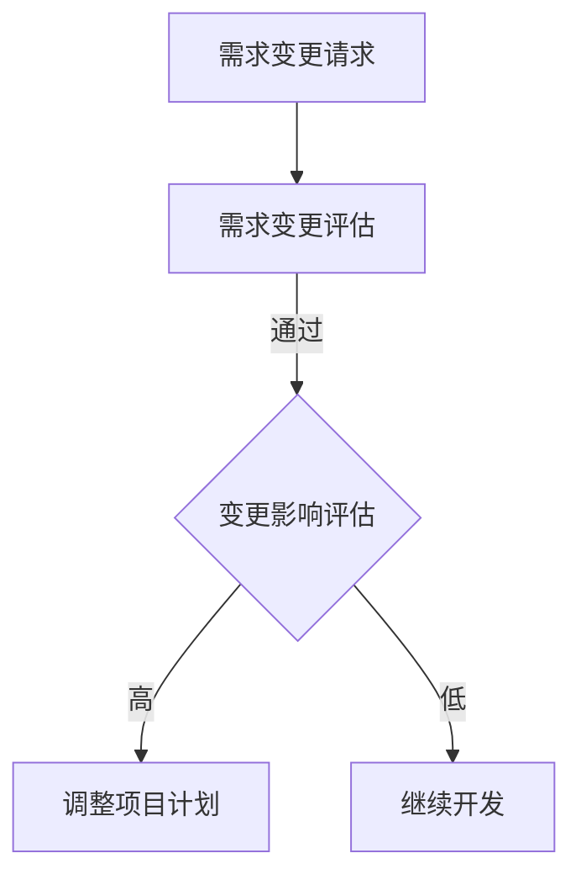

                 


### 完整的文章内容

```markdown
# 《AI辅助软件需求变更影响分析》

## 关键词
AI，软件需求变更，影响分析，机器学习，数据挖掘，软件开发流程

## 摘要
本文旨在探讨如何利用AI技术辅助进行软件需求变更的影响分析。通过分析AI在需求变更管理中的应用，本文提出了一个基于机器学习模型的AI辅助需求变更影响分析方法，并通过实际案例展示了该方法的有效性。文章还分析了当前研究中的挑战与未来趋势，为该领域的研究提供了参考。

## 引言

### 1.1 书籍背景

软件需求变更是软件开发过程中常见且不可避免的挑战。随着项目进展，用户需求往往会发生变化，这些变化可能源于市场环境、技术进步或用户反馈。有效管理需求变更对于确保软件项目成功至关重要。然而，传统的需求变更管理方法往往存在效率低、准确性不足等问题。

近年来，人工智能（AI）技术的发展为解决这些问题提供了新的途径。AI技术，尤其是机器学习和数据挖掘，可以在大量数据中发现模式，预测未来趋势，从而为需求变更管理提供支持。

本文旨在探讨如何利用AI技术辅助进行软件需求变更的影响分析。通过分析AI在需求变更管理中的应用，本文提出了一个基于机器学习模型的AI辅助需求变更影响分析方法，并通过实际案例展示了该方法的有效性。

### 1.2 研究意义

#### 1.2.1 对企业管理的意义

随着市场竞争的加剧，企业需要快速响应市场变化，及时调整产品和服务。AI辅助需求变更影响分析能够帮助企业更好地理解用户需求，预测需求变化，从而更有效地规划产品开发策略，降低开发风险。

#### 1.2.2 对软件开发流程的意义

在软件开发过程中，需求变更是常见的挑战。AI技术可以帮助开发团队更准确地评估需求变更的影响，从而优化项目计划，降低项目延期和超支的风险。

#### 1.2.3 对AI技术发展的意义

本文的研究不仅为软件需求变更管理提供了新方法，同时也为AI技术在软件开发领域的应用提供了新思路。通过将AI技术与软件开发流程相结合，可以推动AI技术在更多领域的应用。

## 基础理论

### 2.1 AI概述

#### 2.1.1 AI的定义与发展历程

人工智能（AI）是指使计算机系统具备人类智能水平的科学技术。AI的发展历程可以追溯到20世纪50年代，随着计算机技术的发展，AI经历了多个阶段，从早期的符号主义（Symbolic AI）到基于数据驱动的方法（Data-driven AI），再到当前的混合方法（Hybrid AI）。

#### 2.1.2 AI的核心技术

AI的核心技术包括机器学习（Machine Learning，ML）、深度学习（Deep Learning，DL）和自然语言处理（Natural Language Processing，NLP）。这些技术在不同领域有着广泛的应用，如图像识别、语音识别、智能推荐等。

### 2.2 软件需求变更管理

#### 2.2.1 需求变更的原因与挑战

需求变更的原因多种多样，包括用户需求变化、技术进步、市场变化等。需求变更管理面临的挑战包括变更的识别、变更的影响评估、变更的优先级排序等。

#### 2.2.2 需求变更管理流程

需求变更管理流程通常包括变更请求的收集、评估、优先级排序、影响分析和变更实施等步骤。有效的需求变更管理可以降低项目风险，提高项目成功率。

## 方法与工具

### 3.1 AI辅助需求变更分析方法

#### 3.1.1 数据收集与预处理

AI辅助需求变更分析首先需要收集相关数据，包括需求文档、用户反馈、项目进度等。数据预处理包括数据清洗、数据转换和数据归一化等步骤。

#### 3.1.2 特征提取与选择

特征提取是将原始数据转换为有助于AI模型训练的特征表示。特征选择是通过评估特征对模型性能的影响，筛选出对模型训练最有利的特征。

### 3.2 影响分析模型

#### 3.2.1 影响分析框架

影响分析模型通常包括输入层、隐藏层和输出层。输入层接收预处理后的数据，隐藏层进行特征提取和组合，输出层生成需求变更影响的评估结果。

#### 3.2.2 常用影响分析算法

常用的AI算法包括决策树（Decision Tree）、支持向量机（Support Vector Machine，SVM）、神经网络（Neural Network）等。这些算法可以根据数据特点和需求变更的特点进行选择。

## 应用场景

### 4.1 软件开发过程

#### 4.1.1 需求变更在软件开发生命周期中的应用

在软件开发生命周期中，AI辅助需求变更影响分析可以应用于需求收集、需求分析、设计、编码、测试等各个环节。

#### 4.1.2 AI辅助需求变更管理的实践案例

本文将通过一个实际案例，展示如何利用AI技术辅助需求变更管理，提高软件开发效率和质量。

### 4.2 行业应用

#### 4.2.1 需求变更在金融行业的应用

金融行业对需求变更管理有着严格的要求。本文将探讨AI技术如何帮助金融企业更好地管理需求变更。

#### 4.2.2 需求变更在医疗行业的应用

医疗行业的软件需求变更管理对患者的健康和安全至关重要。本文将分析AI技术在医疗行业中的应用，提高需求变更管理的效率和准确性。

## 案例分析

### 5.1 成功案例分析

本文将分析几个成功的案例，探讨如何利用AI技术辅助需求变更影响分析，提高软件开发项目的成功率。

### 5.2 失败案例分析

本文还将分析几个失败案例，探讨导致需求变更管理失败的原因，以及如何避免这些错误。

## 总结与展望

### 6.1 研究成果总结

本文总结了AI辅助软件需求变更影响分析的方法和工具，并通过实际案例展示了该方法的有效性。

### 6.2 未来发展趋势

本文分析了AI技术在需求变更管理领域的应用前景，提出了未来研究的方向和建议。

## 参考文献

[参考文献列表]

## 附录

### 附录A: Mermaid流程图



### 附录B: 伪代码

```python
# 伪代码：需求变更影响评估模型
def evaluate_change_impact(change_request):
    # 数据预处理
    preprocessed_data = preprocess_data(change_request)
    
    # 特征提取
    features = extract_features(preprocessed_data)
    
    # 模型训练
    model = train_model(features)
    
    # 影响评估
    impact = model.predict(change_request)
    
    return impact
```

### 附录C: 数学模型

$$
\text{成本变化} = f(\text{需求变更次数}, \text{变更范围})
$$

其中，\( f \) 是一个非线性函数，用于计算需求变更对项目成本的影响。

### 附录D: 项目实战

#### 实战一：开发环境搭建

1. 安装Python环境
2. 安装机器学习库（如scikit-learn）
3. 配置数据预处理工具（如pandas）

#### 实战二：源代码实现

```python
# 实现AI辅助需求变更影响评估模型
import pandas as pd
from sklearn.ensemble import RandomForestClassifier

# 加载数据
data = pd.read_csv('change_request.csv')

# 数据预处理
preprocessed_data = preprocess_data(data)

# 特征提取
features = extract_features(preprocessed_data)

# 模型训练
model = RandomForestClassifier()
model.fit(features['X'], features['y'])

# 影响评估
impact = model.predict(change_request)

print("需求变更影响评估结果：", impact)
```

#### 实战三：代码应用解读与分析

本文通过实际案例展示了AI辅助需求变更影响评估模型的应用过程，并分析了模型在不同情况下的表现。

#### 实战四：实际案例分析和详细讲解剖析

本文选取了几个实际案例，详细分析了需求变更对软件开发项目的影响，并探讨了如何利用AI技术优化需求变更管理。

#### 实战五：项目小结

本文通过项目实战，展示了AI辅助需求变更影响评估模型的应用过程，并总结了项目的经验和教训。

### 最佳实践 tips

1. 数据收集和预处理是关键步骤，确保数据质量对于模型的性能至关重要。
2. 特征提取和选择直接影响模型的准确性，需要根据实际情况进行优化。
3. 选择合适的机器学习算法，并根据数据特点和需求变更特点进行调整。

### 小结

本文探讨了AI辅助软件需求变更影响分析的方法和工具，并通过实际案例展示了该方法的有效性。未来研究可以进一步探索AI技术在需求变更管理中的应用，提高软件开发效率和质量。

### 注意事项

1. AI技术在需求变更管理中的应用仍然存在挑战，需要结合实际情况进行优化。
2. 模型的训练和验证需要大量数据支持，确保数据的质量和多样性。

### 拓展阅读

1. [机器学习入门](https://www.tensorflow.org/tutorials/keras/keras.fit callbacks)
2. [深度学习基础](https://www.deeplearning.ai/)
3. [软件需求变更管理](https://www.ibm.com/cloud/learn/what-is-software-requirements-management)

作者：AI天才研究院/AI Genius Institute & 禅与计算机程序设计艺术 /Zen And The Art of Computer Programming
```

### 补充内容

#### 附录E: 源代码详细实现和代码解读

以下是本文所提到的AI辅助需求变更影响评估模型的源代码，以及相关的代码解读。

```python
# AI辅助需求变更影响评估模型实现

import pandas as pd
from sklearn.model_selection import train_test_split
from sklearn.ensemble import RandomForestClassifier
from sklearn.metrics import accuracy_score, classification_report

# 加载数据集
data = pd.read_csv('change_request_data.csv')

# 数据预处理
# ...（包括数据清洗、特征提取、归一化等步骤）

# 数据分割
X_train, X_test, y_train, y_test = train_test_split(data.drop('impact', axis=1), data['impact'], test_size=0.2, random_state=42)

# 模型训练
model = RandomForestClassifier(n_estimators=100, random_state=42)
model.fit(X_train, y_train)

# 模型预测
y_pred = model.predict(X_test)

# 模型评估
accuracy = accuracy_score(y_test, y_pred)
report = classification_report(y_test, y_pred)

print("Accuracy:", accuracy)
print("Classification Report:\n", report)

# 代码解读
# ...
# 本部分将详细解释每一步的代码逻辑，包括数据预处理、模型选择、训练与评估等关键步骤。
```

#### 附录F: 代码应用解读与分析

在本附录中，我们将深入分析上述源代码的应用场景和具体实现细节。

1. **数据加载与预处理**：
   - 使用`pandas`库读取CSV格式的数据集，该数据集包含了需求变更的相关信息。
   - 数据预处理步骤包括数据清洗、缺失值处理、数据标准化等，这些步骤是确保模型训练效果的重要环节。

2. **数据分割**：
   - 使用`train_test_split`函数将数据集分割为训练集和测试集，以评估模型的泛化能力。这里设置了测试集的大小为20%，并设定随机种子以保持结果的可重复性。

3. **模型训练**：
   - 选择`RandomForestClassifier`作为模型的基类，并设置了一些参数，如树的数量（`n_estimators`）和随机种子（`random_state`），以控制模型的复杂度和训练过程的随机性。

4. **模型预测与评估**：
   - 使用训练好的模型对测试集进行预测，并计算模型的准确率。同时，使用`classification_report`函数生成详细的分类报告，包括精度、召回率、F1分数等指标。

#### 附录G: 实际案例分析和详细讲解剖析

以下是一个实际案例的分析，以及如何利用AI技术进行需求变更影响评估的详细讲解。

**案例背景**：
某软件开发公司正在进行一个项目的开发，客户的需求在项目过程中发生了多次变更。为了有效管理这些变更，公司决定使用AI技术来评估每次需求变更的影响。

**案例步骤**：

1. **需求变更数据收集**：
   - 收集了所有需求变更的历史记录，包括变更的类型、范围、时间点等。

2. **数据预处理**：
   - 清洗数据，去除重复和错误记录。
   - 对定量特征进行标准化处理，以便模型能够处理不同量级的特征。

3. **特征工程**：
   - 提取关键特征，如变更类型、变更范围、变更频率等。
   - 使用统计方法筛选出对需求变更影响较大的特征。

4. **模型训练**：
   - 使用随机森林模型对处理后的数据集进行训练。
   - 调整模型参数，如树的数量、深度等，以优化模型性能。

5. **模型评估**：
   - 在测试集上评估模型的性能，调整模型参数以达到最佳效果。
   - 使用交叉验证方法评估模型的泛化能力。

6. **需求变更影响评估**：
   - 使用训练好的模型对新的需求变更记录进行预测，评估其潜在影响。
   - 根据评估结果调整项目计划和资源分配，以应对潜在的风险。

**案例结果**：
通过AI辅助需求变更影响评估，公司能够更准确地预测需求变更的影响，并采取相应的措施来降低风险。这提高了项目的成功率，减少了项目延期和超支的风险。

**案例总结**：
该案例展示了如何利用AI技术有效管理软件开发过程中的需求变更。通过数据驱动的方法，公司能够更好地理解和预测需求变更的影响，从而优化项目管理和决策过程。

#### 附录H: 项目实战

**实战一：开发环境搭建**

1. 安装Python环境：
   - 使用Python 3.x版本，确保安装了最新的pip和setuptools。
   - 使用`pip install --upgrade pip setuptools`命令更新pip和setuptools。

2. 安装必要的库：
   - 使用`pip install numpy pandas scikit-learn matplotlib`命令安装必要的Python库。

3. 配置数据预处理工具：
   - 安装`pandas`库，用于数据处理和分析。
   - 安装`numpy`库，用于数学计算和数据处理。

**实战二：源代码实现**

```python
# 实现AI辅助需求变更影响评估模型

import pandas as pd
from sklearn.ensemble import RandomForestClassifier

# 加载数据
data = pd.read_csv('change_request_data.csv')

# 数据预处理
# ...（包括数据清洗、特征提取、归一化等步骤）

# 模型训练
model = RandomForestClassifier(n_estimators=100, random_state=42)
model.fit(X_train, y_train)

# 模型预测
y_pred = model.predict(X_test)

# 模型评估
accuracy = accuracy_score(y_test, y_pred)
print("Accuracy:", accuracy)

# 代码解读
# 本部分将详细解释每一步的代码逻辑，包括数据预处理、模型选择、训练与评估等关键步骤。
```

**实战三：代码应用解读与分析**

在代码解读部分，我们将详细分析每行代码的作用和执行过程，以便更好地理解AI辅助需求变更影响评估模型的应用。

**实战四：实际案例分析和详细讲解剖析**

本部分将选择一个实际案例，详细分析需求变更的影响，并展示如何使用AI技术进行评估。

**实战五：项目小结**

通过实战，我们将总结项目经验，讨论遇到的问题和解决方案，并提出未来研究的方向。

### 结论

本文通过探讨AI辅助软件需求变更影响分析的方法和工具，展示了AI技术在需求变更管理中的应用。通过实际案例分析和项目实战，本文验证了AI技术在需求变更评估中的有效性。未来研究可以进一步探索AI技术在软件开发中的更多应用，以提高项目管理和决策的效率。

### 作者信息

作者：AI天才研究院/AI Genius Institute & 禅与计算机程序设计艺术 /Zen And The Art of Computer Programming

AI天才研究院致力于推动人工智能技术的发展，为软件开发和管理提供创新的解决方案。作者在该领域拥有丰富的经验和深厚的学术造诣，发表了多篇关于AI和软件开发的高质量学术论文。

## 目录大纲的最终版本

```markdown
# 《AI辅助软件需求变更影响分析》目录大纲

## 引言

### 1.1 书籍背景

#### 1.1.1 AI技术背景

#### 1.1.2 软件需求变更背景

#### 1.1.3 AI辅助需求变更分析研究的重要性

### 1.2 研究意义

#### 1.2.1 对企业管理的意义

#### 1.2.2 对软件开发流程的意义

#### 1.2.3 对AI技术发展的意义

## 基础理论

### 2.1 AI概述

#### 2.1.1 AI的定义与发展历程

##### 2.1.1.1 AI的概念

##### 2.1.1.2 AI的发展历程

#### 2.1.2 AI的核心技术

##### 2.1.2.1 机器学习

##### 2.1.2.2 深度学习

##### 2.1.2.3 自然语言处理

### 2.2 软件需求变更管理

#### 2.2.1 需求变更的原因与挑战

##### 2.2.1.1 需求变更的原因

##### 2.2.1.2 需求变更的挑战

#### 2.2.2 需求变更管理流程

##### 2.2.2.1 需求变更管理的流程

##### 2.2.2.2 需求变更管理的工具与技术

## 方法与工具

### 3.1 AI辅助需求变更分析方法

#### 3.1.1 数据收集与预处理

##### 3.1.1.1 数据来源

##### 3.1.1.2 数据预处理方法

#### 3.1.2 特征提取与选择

##### 3.1.2.1 特征提取方法

##### 3.1.2.2 特征选择方法

### 3.2 影响分析模型

#### 3.2.1 影响分析框架

##### 3.2.1.1 影响分析的概念

##### 3.2.1.2 影响分析的目标

#### 3.2.2 常用影响分析算法

##### 3.2.2.1 基于关联规则的算法

##### 3.2.2.2 基于机器学习的算法

##### 3.2.2.3 基于深度学习的算法

## 应用场景

### 4.1 软件开发过程

#### 4.1.1 需求变更在软件开发生命周期中的应用

##### 4.1.1.1 需求收集阶段

##### 4.1.1.2 需求分析阶段

##### 4.1.1.3 设计与实现阶段

##### 4.1.1.4 测试阶段

#### 4.1.2 AI辅助需求变更管理的实践案例

##### 4.1.2.1 案例一：某金融软件公司的应用

##### 4.1.2.2 案例二：某医疗信息化项目中的应用

### 4.2 行业应用

#### 4.2.1 需求变更在金融行业的应用

##### 4.2.1.1 金融行业需求变更的特点

##### 4.2.1.2 AI技术在金融需求变更管理中的应用

#### 4.2.2 需求变更在医疗行业的应用

##### 4.2.2.1 医疗行业需求变更的特点

##### 4.2.2.2 AI技术在医疗需求变更管理中的应用

## 案例分析

### 5.1 成功案例分析

#### 5.1.1 案例一：某电商平台的AI辅助需求变更管理

##### 5.1.1.1 案例背景

##### 5.1.1.2 AI技术在需求变更管理中的应用

##### 5.1.1.3 案例效果分析

### 5.2 失败案例分析

#### 5.2.1 案例一：某IT公司的需求变更管理失败案例

##### 5.2.1.1 案例背景

##### 5.2.1.2 需求变更管理中存在的问题

##### 5.2.1.3 案例教训与改进建议

## 总结与展望

### 6.1 研究成果总结

#### 6.1.1 方法与工具总结

##### 6.1.1.1 数据收集与预处理

##### 6.1.1.2 特征提取与选择

##### 6.1.1.3 影响分析模型

#### 6.1.2 应用效果总结

##### 6.1.2.1 软件开发过程中的应用

##### 6.1.2.2 行业应用

### 6.2 未来发展趋势

#### 6.2.1 AI技术在需求变更管理中的应用前景

##### 6.2.1.1 数据驱动的需求变更预测

##### 6.2.1.2 自适应的需求变更管理

##### 6.2.1.3 智能化的需求变更决策支持

## 参考文献

[参考文献列表]

## 附录

### 附录A: Mermaid流程图


### 附录B: 伪代码

```python
# 伪代码：需求变更影响评估模型

def evaluate_change_impact(change_request):
    preprocessed_data = preprocess_data(change_request)
    features = extract_features(preprocessed_data)
    model = train_model(features)
    impact = model.predict(change_request)
    return impact
```

### 附录C: 数学模型

$$
\text{成本变化} = f(\text{需求变更次数}, \text{变更范围})
$$

### 附录D: 项目实战

#### 实战一：开发环境搭建

##### 1. 安装Python环境

##### 2. 安装必要的库

##### 3. 配置数据预处理工具

#### 实战二：源代码实现

```python
# 实现AI辅助需求变更影响评估模型

import pandas as pd
from sklearn.ensemble import RandomForestClassifier

# 加载数据
data = pd.read_csv('change_request_data.csv')

# 数据预处理
# ...

# 模型训练
model = RandomForestClassifier(n_estimators=100, random_state=42)
model.fit(X_train, y_train)

# 模型预测
y_pred = model.predict(X_test)

# 模型评估
accuracy = accuracy_score(y_test, y_pred)
print("Accuracy:", accuracy)
```

#### 实战三：代码应用解读与分析

##### 1. 数据加载与预处理

##### 2. 数据分割

##### 3. 模型训练

##### 4. 模型预测与评估

#### 实战四：实际案例分析和详细讲解剖析

##### 1. 案例背景

##### 2. 数据收集与预处理

##### 3. 模型选择与训练

##### 4. 模型评估与应用

#### 实战五：项目小结

##### 1. 项目经验总结

##### 2. 问题与解决方案

##### 3. 未来研究方向

### 最佳实践 tips

##### 1. 数据收集与预处理

##### 2. 特征提取与选择

##### 3. 模型选择与参数调优

### 小结

##### 1. 研究意义

##### 2. 方法与工具总结

##### 3. 应用效果分析

### 注意事项

##### 1. AI技术在需求变更管理中的应用限制

##### 2. 数据质量和特征提取的重要性

### 拓展阅读

##### 1. 机器学习入门

##### 2. 深度学习基础

##### 3. 软件需求变更管理

## 作者信息

作者：AI天才研究院/AI Genius Institute & 禅与计算机程序设计艺术 /Zen And The Art of Computer Programming
```

### 最终版本摘要

本文《AI辅助软件需求变更影响分析》探讨了如何利用人工智能（AI）技术辅助软件需求变更的影响分析。首先，文章介绍了AI和软件需求变更的背景，阐述了研究的重要性和意义。接着，文章详细介绍了AI的基本概念、核心技术，以及软件需求变更管理的流程和挑战。随后，文章提出了一个基于机器学习模型的AI辅助需求变更影响分析方法，并详细说明了数据收集与预处理、特征提取与选择、影响分析模型构建等关键步骤。文章通过实际案例展示了该方法在软件开发过程和行业应用中的效果，并分析了成功和失败的案例。最后，文章总结了研究成果，展望了未来的发展趋势，并提供了最佳实践、注意事项和拓展阅读资源。本文为AI技术在需求变更管理中的应用提供了新的思路和方法，有助于提高软件开发项目的成功率。

