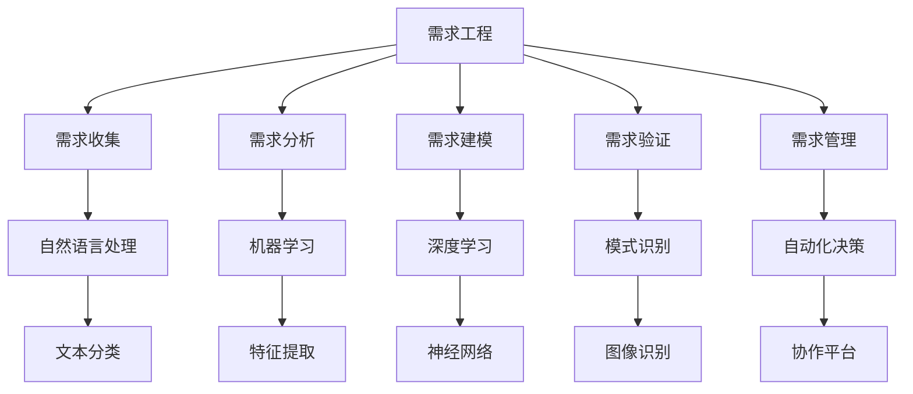

                 

### 引言

#### 背景介绍

在当今快速发展的信息技术时代，软件需求工程作为软件开发过程的关键环节，其重要性日益凸显。传统的软件需求工程方法往往依赖于人工进行需求分析、需求建模和需求验证，这不仅效率低下，而且容易出错。随着人工智能（AI）技术的飞速发展，利用AI辅助软件需求工程成为了一个备受关注的研究方向。

AI技术具备强大的数据处理和分析能力，能够从大量非结构化数据中提取有用信息，并进行复杂的模式识别和预测。将AI技术应用于软件需求工程，可以有效提升需求分析的准确性、需求建模的效率以及需求验证的全面性。这不仅有助于缩短软件开发周期，降低成本，还能提高软件质量，满足用户的需求。

#### 书籍目的

本书旨在探讨如何利用AI技术辅助软件需求工程，解决传统方法中的诸多难题。通过对AI在软件需求工程中的应用进行系统的研究和总结，本书旨在为软件开发人员、需求工程师和研究人员提供一本实用的参考书籍。

本书的主要内容将涵盖以下几个方面：

1. **AI与软件需求工程的关系**：介绍AI技术的基本概念，分析AI在软件需求工程中的潜在应用场景。
2. **需求分析中的AI应用**：讨论如何利用AI技术进行需求收集、需求分析和需求验证。
3. **需求建模中的AI应用**：介绍基于AI的需求建模方法，包括语义网络、本体论和机器学习等。
4. **需求管理中的AI应用**：探讨AI在需求变更管理、需求冲突检测和需求优先级排序等方面的应用。
5. **案例研究**：通过实际案例，展示AI辅助软件需求工程的应用效果和实现方法。
6. **发展趋势与未来展望**：分析AI辅助软件需求工程的发展趋势，展望其未来的研究方向。

#### 组织结构

本书分为引言、正文和附录三个部分。

- **引言**：介绍AI辅助软件需求工程的背景和目的，概述本书的内容和组织结构。
- **正文**：正文部分分为八个章节，每个章节探讨一个与AI辅助软件需求工程相关的重要主题。具体章节安排如下：

  - **第一章**：AI与软件需求工程
  - **第二章**：AI辅助需求分析
  - **第三章**：AI辅助需求建模
  - **第四章**：AI辅助需求验证
  - **第五章**：AI辅助需求管理
  - **第六章**：案例研究
  - **第七章**：发展趋势
  - **第八章**：未来展望

- **附录**：提供相关工具和资源，包括AI辅助软件需求工程常用的工具列表、伪代码和数学模型，以及实际项目案例的代码实现和解读。

通过本书的阅读，读者可以全面了解AI辅助软件需求工程的原理和方法，掌握其在实际项目中的应用技巧，为软件开发过程提供有力的技术支持。

### 关键词

- **人工智能**
- **软件需求工程**
- **需求分析**
- **需求建模**
- **需求验证**
- **需求管理**
- **AI辅助工具**
- **机器学习**
- **自然语言处理**

### 摘要

《AI辅助软件需求工程》是一本系统探讨如何利用人工智能技术提升软件需求工程效率和质量的专业书籍。本书首先介绍了AI技术的基本概念和应用场景，然后详细讨论了AI在需求分析、需求建模、需求验证和需求管理中的具体应用方法。通过一系列的案例研究和实践指导，本书展示了AI辅助软件需求工程的实际效果和操作步骤。此外，本书还展望了AI辅助软件需求工程的发展趋势和未来研究方向，为读者提供了全面的技术指南和深刻的洞察。本书适合软件开发人员、需求工程师和研究人员阅读，有助于他们掌握AI辅助软件需求工程的核心技术和最佳实践。

### 第一章 AI与软件需求工程

#### 软件需求工程的定义与重要性

软件需求工程是软件开发过程中的关键环节，它涉及到对用户需求的理解、收集、分析和建模。需求工程的目标是确保软件开发团队能够准确理解和满足用户的需求，从而开发出高质量、符合用户期望的软件产品。

软件需求工程的主要活动包括需求收集、需求分析、需求建模、需求验证和需求管理。其中，需求收集是了解用户需求的第一步，需求分析是将收集到的需求转化为清晰、具体的规格说明，需求建模则是将分析结果形式化为软件模型，需求验证确保模型符合用户需求，需求管理则是跟踪和管理需求变更。

在软件开发生命周期中，需求工程贯穿始终，它不仅影响到软件设计的初期阶段，还直接关系到后续的开发、测试和维护。因此，软件需求工程的成功对于整个软件项目的成功至关重要。

#### AI的基本概念与特征

人工智能（Artificial Intelligence，简称AI）是指通过计算机程序模拟人类智能的技术和学科。AI的核心目标是使计算机具备类似于人类的感知、推理、学习、决策和问题解决能力。AI技术主要包括机器学习、深度学习、自然语言处理、计算机视觉等。

- **机器学习**：通过训练模型来从数据中学习规律和模式，实现对未知数据的预测和分类。
- **深度学习**：一种特殊的机器学习技术，利用多层神经网络模拟人类大脑的学习过程，具有强大的特征提取和模式识别能力。
- **自然语言处理**：使计算机能够理解和处理人类语言的技术，包括文本分类、情感分析、机器翻译等。
- **计算机视觉**：使计算机能够像人类一样识别和理解视觉信息，包括图像分类、目标检测、图像分割等。

AI技术的这些特点使其在数据处理、模式识别、预测和自动化决策等方面具有显著优势。因此，AI技术在软件需求工程中具有广泛的应用前景。

#### AI在软件需求工程中的应用场景

AI技术在软件需求工程中可以应用于多个方面，提升需求收集、需求分析、需求建模和需求验证的效率和准确性。

- **需求收集**：AI可以通过自然语言处理技术自动收集用户需求。例如，利用自然语言处理工具对用户访谈记录、需求文档和社交媒体评论进行分析，提取关键需求信息。

- **需求分析**：AI可以帮助需求工程师识别和分类需求。通过机器学习算法，AI可以自动分析大量需求文档，提取出潜在的、隐藏的需求，帮助工程师更好地理解用户需求。

- **需求建模**：AI可以用于生成需求模型。利用深度学习技术，AI可以从历史需求数据中学习，自动生成符合用户需求的新需求模型。这种自动化的需求建模方法可以显著提高需求建模的效率和准确性。

- **需求验证**：AI可以用于自动化验证需求。通过机器学习和模式识别技术，AI可以自动检查需求文档是否符合预定的规范和标准，发现潜在的错误和冲突。

#### AI在软件需求工程中的优势与挑战

AI在软件需求工程中的应用具有以下优势：

1. **提高效率**：AI技术可以自动化处理大量需求数据，大大提高需求收集、分析和验证的效率。
2. **提升准确性**：AI可以通过学习和分析大量数据，提供更准确的需求预测和分类，减少人为错误。
3. **增强协作**：AI可以辅助需求工程师识别和解决需求冲突，促进团队成员之间的协作。

然而，AI在软件需求工程中应用也面临一些挑战：

1. **数据质量**：AI的性能很大程度上依赖于数据质量。如果数据不准确或存在噪声，可能会导致错误的预测和分类。
2. **解释性**：AI模型通常被视为“黑盒”，其内部决策过程难以解释。这对于需求验证和审计来说是一个挑战。
3. **适应性和可扩展性**：AI模型需要不断调整和更新以适应不断变化的需求和环境，这需要大量时间和资源。

#### 总结

AI技术在软件需求工程中的应用具有重要的理论和实践价值。通过AI技术，可以显著提升需求收集、分析和验证的效率和准确性，提高软件需求工程的整体质量。然而，要充分发挥AI的优势，也需要克服数据质量、解释性和适应性等方面的挑战。在接下来的章节中，我们将进一步探讨AI在软件需求工程中的具体应用方法和技术。

#### 核心概念原理之间的关系架构

为了更好地理解AI与软件需求工程之间的关系，我们可以使用Mermaid流程图来展示核心概念和原理之间的联系。以下是一个简化的Mermaid流程图示例：



在这个流程图中，我们可以看到：

- **需求工程**作为整个流程的起点，涵盖了需求收集、需求分析、需求建模、需求验证和需求管理五个主要环节。
- **自然语言处理（NLP）**主要应用于需求收集，帮助提取和分析用户需求。
- **机器学习（ML）**和**深度学习（DL）**则广泛应用于需求分析和需求建模，用于处理和分析大量需求数据。
- **模式识别**用于需求验证，帮助检测和识别需求文档中的错误和冲突。
- **自动化决策**和**协作平台**则用于需求管理，提高需求变更管理、需求冲突检测和需求优先级排序的效率。

通过这个流程图，我们可以清晰地看到AI技术如何贯穿于软件需求工程的各个环节，为需求工程师提供强有力的技术支持。

#### AI辅助需求分析

需求分析是软件需求工程的核心环节之一，其主要目标是理解并捕捉用户的需求，并将其转化为清晰、具体的规格说明。AI技术在需求分析中的应用，可以显著提高分析效率和准确性，帮助需求工程师更精准地满足用户需求。本节将介绍AI在需求分析中的应用方法，并详细讨论这些方法的实现原理。

##### 1. 自然语言处理（NLP）

自然语言处理（Natural Language Processing，NLP）是AI技术的一个重要分支，它专注于使计算机理解和处理人类语言。在需求分析中，NLP技术可以用于自动收集、理解和分析用户需求。以下是一些具体的NLP应用：

- **文本分类**：通过将用户的需求描述分类到不同的类别中，NLP可以帮助需求工程师快速识别和理解用户的需求。例如，可以基于关键词和句法结构，将需求描述分类为功能需求、性能需求或安全需求。

- **情感分析**：通过分析用户的需求描述中的情感倾向，NLP可以帮助需求工程师了解用户的满意度、需求和痛点。例如，使用情感分析技术，可以从用户评论中提取出正面、负面或中性的情感。

- **实体识别**：NLP技术可以识别需求描述中的关键实体，如人名、地点、组织、时间和物品等。这些实体对于进一步分析和理解需求至关重要。

实现原理：NLP的实现通常涉及以下步骤：

1. **分词**：将文本拆分成词或短语，这是理解文本的基础。
2. **词性标注**：为每个词分配词性（如名词、动词、形容词等），以帮助理解词语的语法角色。
3. **命名实体识别**：识别文本中的关键实体。
4. **情感分析**：使用机器学习模型（如文本分类模型）来分析文本的情感倾向。
5. **文本分类**：使用机器学习模型（如朴素贝叶斯、支持向量机等）来分类文本。

##### 2. 机器学习（ML）

机器学习（Machine Learning，ML）是一种通过数据训练模型，使计算机能够从数据中自动学习的方法。在需求分析中，ML技术可以用于自动化需求分析和分类，帮助需求工程师更高效地处理大量需求文档。

- **自动化需求分类**：通过训练机器学习模型，可以自动将需求文档分类到不同的类别中。例如，基于历史需求数据，可以训练一个分类模型，用于将新的需求文档分类为功能需求、性能需求或安全需求。

- **需求优先级排序**：机器学习模型可以用于分析需求的重要性和紧急性，从而帮助需求工程师确定需求的优先级。

实现原理：ML的实现通常涉及以下步骤：

1. **数据收集**：收集历史需求数据，包括已分类的需求文档。
2. **数据预处理**：清洗数据，去除噪声，进行特征提取。
3. **模型训练**：使用预处理后的数据训练分类或排序模型。
4. **模型评估**：使用验证集评估模型的性能，调整模型参数。
5. **模型部署**：将训练好的模型部署到实际应用中。

##### 3. 深度学习（DL）

深度学习（Deep Learning，DL）是一种基于多层神经网络的机器学习技术，它在处理复杂、非结构化数据方面具有显著优势。在需求分析中，深度学习可以用于从大量需求数据中提取高级特征，提高需求分析的准确性和效率。

- **需求特征提取**：通过深度学习模型，可以自动提取需求文档中的高级特征，如语义关系、关键词权重等。这些特征有助于更准确地理解用户需求。

- **需求文本生成**：深度学习模型可以生成符合用户需求的新需求文本，从而帮助需求工程师快速完成需求文档的编写。

实现原理：DL的实现通常涉及以下步骤：

1. **数据收集**：收集大量需求数据，包括需求文档和相关的注释。
2. **数据预处理**：进行文本清洗和分词，将文本转化为向量表示。
3. **模型构建**：构建多层神经网络模型，如循环神经网络（RNN）或变换器（Transformer）。
4. **模型训练**：使用预处理后的数据训练模型。
5. **模型评估**：使用验证集评估模型的性能，调整模型参数。
6. **模型部署**：将训练好的模型部署到实际应用中。

##### AI辅助需求分析的优势与挑战

AI辅助需求分析具有以下优势：

1. **提高效率**：通过自动化处理大量需求数据，AI可以显著提高需求分析的速度和效率。
2. **提升准确性**：AI技术可以帮助需求工程师更准确地理解用户需求，减少人为错误。
3. **增强协作**：AI可以辅助需求工程师识别和解决需求冲突，促进团队成员之间的协作。

然而，AI辅助需求分析也面临一些挑战：

1. **数据质量**：AI的性能很大程度上依赖于数据质量。如果数据不准确或存在噪声，可能会导致错误的预测和分类。
2. **解释性**：AI模型通常被视为“黑盒”，其内部决策过程难以解释。这对于需求验证和审计来说是一个挑战。
3. **适应性和可扩展性**：AI模型需要不断调整和更新以适应不断变化的需求和环境，这需要大量时间和资源。

#### 实例分析

假设我们有一个需求文档，其中包含以下内容：

```
用户希望在系统中实现一个功能，可以实时监控库存量，并在库存量低于设定阈值时自动发出警报。
```

使用NLP技术，我们可以进行以下操作：

1. **文本分类**：将这段文本分类为功能需求。
2. **情感分析**：分析文本中的情感倾向，判断用户对这一功能是否满意。
3. **实体识别**：识别出“库存量”、“实时监控”、“警报”等关键实体。

使用ML技术，我们可以：

1. **自动化分类**：基于历史需求数据，自动将这段文本分类为功能需求。
2. **优先级排序**：根据需求的重要性和紧急性，确定该需求的优先级。

使用DL技术，我们可以：

1. **需求文本生成**：根据类似的需求，自动生成一段新的需求文本。
2. **需求文本理解**：通过深度学习模型，提取文本中的高级特征，如“实时监控”和“自动警报”的语义关系。

通过这些技术，我们可以更全面、准确地理解用户需求，为软件开发提供有力的支持。

#### AI辅助需求建模

需求建模是软件需求工程中的关键环节，它将用户的需求转化为软件系统的结构化描述，为后续的设计和开发提供基础。在传统方法中，需求建模通常依赖于人工进行，这不仅效率低下，而且容易引入错误。随着人工智能（AI）技术的不断发展，AI辅助需求建模成为一种新的趋势。本节将详细介绍AI在需求建模中的应用方法，包括语义网络、本体论和机器学习等。

##### 1. 语义网络

语义网络（Semantic Network）是一种用于表示知识结构和语义关系的图形模型。它通过节点（表示概念或实体）和边（表示概念之间的关系）来描述知识的语义结构。在需求建模中，语义网络可以帮助需求工程师更好地理解用户需求，并生成结构化的需求模型。

- **语义网络构建**：通过自然语言处理（NLP）技术，可以从用户需求描述中提取关键词和短语，并将其表示为语义网络中的节点。然后，使用NLP算法分析这些节点之间的关系，生成语义网络。

- **语义网络应用**：语义网络可以用于需求建模，帮助需求工程师识别需求中的关键概念和关系。例如，可以用于生成用例模型、活动图或类图等结构化需求模型。

实现原理：语义网络的实现通常涉及以下步骤：

1. **文本预处理**：使用分词、词性标注和命名实体识别等技术，将文本表示为词汇表。
2. **关系提取**：使用NLP算法（如依存句法分析）提取文本中的语义关系，并将其表示为边。
3. **语义网络构建**：将节点和边组织成语义网络，以可视化需求结构。

##### 2. 本体论

本体论（Ontology）是一种用于描述领域知识的语义模型，它通过定义领域中的概念、属性和关系来提供对现实世界的抽象和结构化表示。在需求建模中，本体论可以帮助需求工程师建立一致的、结构化的需求模型，从而更好地支持软件系统的设计。

- **本体构建**：本体构建是本体论的关键步骤，它涉及定义领域概念、属性和关系。需求工程师可以通过分析用户需求，使用本体建模语言（如OWL）构建本体。

- **本体应用**：本体可以用于需求建模，帮助需求工程师理解和管理复杂的用户需求。例如，本体可以用于生成统一的需求模型，支持跨领域的需求分析。

实现原理：本体论的实现通常涉及以下步骤：

1. **领域分析**：通过文献调研、用户访谈和需求收集等手段，理解领域知识。
2. **本体构建**：使用本体建模语言（如OWL），定义领域中的概念、属性和关系。
3. **本体验证**：使用本体验证工具（如Protégé），确保本体的正确性和一致性。

##### 3. 机器学习

机器学习（Machine Learning，ML）是一种通过数据训练模型，使计算机能够从数据中自动学习的方法。在需求建模中，机器学习可以用于自动化需求模型生成，提高建模效率和准确性。

- **自动化模型生成**：通过训练机器学习模型，可以从历史需求数据中自动生成新的需求模型。例如，可以使用生成对抗网络（GAN）或变分自编码器（VAE）等生成模型，自动生成符合用户需求的新需求模型。

- **模型优化**：机器学习模型可以用于优化需求模型，提高其准确性和一致性。例如，可以使用强化学习算法，根据需求验证结果不断调整需求模型。

实现原理：机器学习的实现通常涉及以下步骤：

1. **数据收集**：收集历史需求数据，包括需求文档和相关的注释。
2. **数据预处理**：清洗数据，进行特征提取。
3. **模型训练**：使用预处理后的数据训练机器学习模型。
4. **模型评估**：使用验证集评估模型的性能，调整模型参数。
5. **模型部署**：将训练好的模型部署到实际应用中。

##### 4. 深度学习

深度学习（Deep Learning，DL）是一种基于多层神经网络的机器学习技术，它在处理复杂、非结构化数据方面具有显著优势。在需求建模中，深度学习可以用于从大量需求数据中提取高级特征，提高建模的准确性和效率。

- **特征提取**：深度学习模型可以自动提取需求文档中的高级特征，如语义关系、关键词权重等。这些特征有助于更准确地理解和表示用户需求。

- **需求文本生成**：深度学习模型可以生成符合用户需求的新需求文本，从而帮助需求工程师快速完成需求文档的编写。

实现原理：深度学习的实现通常涉及以下步骤：

1. **数据收集**：收集大量需求数据，包括需求文档和相关的注释。
2. **数据预处理**：进行文本清洗和分词，将文本转化为向量表示。
3. **模型构建**：构建多层神经网络模型，如循环神经网络（RNN）或变换器（Transformer）。
4. **模型训练**：使用预处理后的数据训练模型。
5. **模型评估**：使用验证集评估模型的性能，调整模型参数。
6. **模型部署**：将训练好的模型部署到实际应用中。

##### AI辅助需求建模的优势与挑战

AI辅助需求建模具有以下优势：

1. **提高效率**：通过自动化处理大量需求数据，AI可以显著提高需求建模的速度和效率。
2. **提升准确性**：AI技术可以帮助需求工程师更准确地理解用户需求，减少人为错误。
3. **增强协作**：AI可以辅助需求工程师识别和解决需求冲突，促进团队成员之间的协作。

然而，AI辅助需求建模也面临一些挑战：

1. **数据质量**：AI的性能很大程度上依赖于数据质量。如果数据不准确或存在噪声，可能会导致错误的预测和分类。
2. **解释性**：AI模型通常被视为“黑盒”，其内部决策过程难以解释。这对于需求验证和审计来说是一个挑战。
3. **适应性和可扩展性**：AI模型需要不断调整和更新以适应不断变化的需求和环境，这需要大量时间和资源。

#### 实例分析

假设我们有一个需求文档，其中包含以下内容：

```
用户希望在系统中实现一个功能，可以实时监控库存量，并在库存量低于设定阈值时自动发出警报。
```

使用语义网络技术，我们可以：

1. **文本预处理**：将文本进行分词和词性标注，提取关键词和短语。
2. **关系提取**：使用依存句法分析提取文本中的语义关系，如“实时监控”和“自动警报”之间的关系。
3. **语义网络构建**：将关键词和短语表示为节点，将语义关系表示为边，构建语义网络。

使用本体论技术，我们可以：

1. **领域分析**：分析需求文档，识别出与库存管理相关的概念和属性。
2. **本体构建**：使用OWL定义库存管理本体，包括概念、属性和关系。
3. **本体验证**：使用Protégé验证本体的一致性和正确性。

使用机器学习技术，我们可以：

1. **数据收集**：收集历史需求数据，包括类似的需求文档。
2. **数据预处理**：进行特征提取，将需求文档转化为向量表示。
3. **模型训练**：使用预处理后的数据训练机器学习模型，如文本分类模型或需求优先级排序模型。
4. **模型评估**：使用验证集评估模型的性能，调整模型参数。

使用深度学习技术，我们可以：

1. **数据收集**：收集大量需求数据，包括需求文档和相关的注释。
2. **数据预处理**：进行文本清洗和分词，将文本转化为向量表示。
3. **模型构建**：构建多层神经网络模型，如变换器（Transformer）。
4. **模型训练**：使用预处理后的数据训练模型。
5. **模型评估**：使用验证集评估模型的性能，调整模型参数。

通过这些技术，我们可以更全面、准确地理解和建模用户需求，为软件开发提供坚实的基础。

#### AI辅助需求验证

需求验证是软件需求工程中的关键环节，旨在确保需求模型满足用户需求和系统约束。在传统方法中，需求验证通常依赖于人工检查和测试，这既耗时又容易出错。随着人工智能（AI）技术的发展，AI辅助需求验证成为了一种提高验证效率和质量的新方法。本节将详细介绍AI在需求验证中的应用方法，包括自动化测试、静态分析和动态分析。

##### 1. 自动化测试

自动化测试是一种通过编写测试脚本，自动执行测试用例并验证需求的方法。AI技术在自动化测试中的应用主要体现在以下几个方面：

- **测试用例生成**：AI可以基于需求模型自动生成测试用例，提高测试覆盖率和测试效率。例如，通过机器学习模型，可以从历史测试数据中学习，生成新的测试用例。

- **测试用例优化**：AI可以帮助优化现有的测试用例，提高其有效性。通过分析测试用例的执行结果，AI可以识别出无效的测试用例，并进行优化。

- **测试结果分析**：AI可以自动分析测试结果，识别出潜在的缺陷和问题。例如，使用自然语言处理（NLP）技术，可以分析测试报告，提取关键信息，并提供缺陷定位和建议。

实现原理：自动化测试的实现通常涉及以下步骤：

1. **测试数据收集**：收集历史测试数据，包括测试用例、测试结果和缺陷报告。
2. **测试用例生成**：使用机器学习模型，自动生成新的测试用例。
3. **测试用例优化**：基于测试结果，使用优化算法调整测试用例。
4. **测试结果分析**：使用NLP技术，自动分析测试结果，识别出潜在的缺陷和问题。

##### 2. 静态分析

静态分析是一种不执行程序代码，而通过分析代码结构和语义，发现潜在缺陷的方法。AI技术在静态分析中的应用主要体现在以下几个方面：

- **代码缺陷检测**：AI可以自动分析代码，识别出潜在的缺陷和漏洞。例如，通过机器学习模型，可以从代码库中学习，自动识别出常见的代码缺陷模式。

- **代码质量评估**：AI可以评估代码的质量，包括可读性、可维护性和安全性。通过分析代码的语法、语义和结构，AI可以提供代码质量评估报告。

- **代码优化建议**：AI可以基于代码质量评估结果，提供优化建议，帮助开发者改进代码质量。

实现原理：静态分析的实现通常涉及以下步骤：

1. **代码数据收集**：收集代码库，包括源代码和相关的注释。
2. **代码缺陷检测**：使用机器学习模型，自动分析代码，识别出潜在的缺陷。
3. **代码质量评估**：使用NLP技术，评估代码的质量。
4. **代码优化建议**：基于代码质量评估结果，提供优化建议。

##### 3. 动态分析

动态分析是一种通过执行程序代码，观察程序行为，发现潜在缺陷的方法。AI技术在动态分析中的应用主要体现在以下几个方面：

- **行为模式识别**：AI可以自动分析程序的行为模式，识别出异常行为。例如，通过深度学习模型，可以从历史日志数据中学习，自动识别出异常的执行路径。

- **性能评估**：AI可以评估程序的性能，包括响应时间、资源消耗和处理能力。通过分析程序的执行数据，AI可以提供性能评估报告。

- **故障预测**：AI可以基于历史故障数据，预测未来可能发生的故障。例如，通过机器学习模型，可以从历史故障数据中学习，预测系统的故障风险。

实现原理：动态分析的实现通常涉及以下步骤：

1. **执行数据收集**：收集程序的执行数据，包括日志、性能指标和异常报告。
2. **行为模式识别**：使用机器学习模型，自动分析程序的行为模式，识别出异常行为。
3. **性能评估**：使用NLP技术，评估程序的性能。
4. **故障预测**：基于机器学习模型，预测未来可能发生的故障。

##### AI辅助需求验证的优势与挑战

AI辅助需求验证具有以下优势：

1. **提高效率**：通过自动化处理需求验证任务，AI可以显著提高验证速度和效率。
2. **提升准确性**：AI技术可以更准确地识别潜在的需求缺陷和问题，减少人为错误。
3. **增强协作**：AI可以辅助验证工程师识别和解决需求问题，促进团队成员之间的协作。

然而，AI辅助需求验证也面临一些挑战：

1. **数据质量**：AI的性能很大程度上依赖于数据质量。如果数据不准确或存在噪声，可能会导致错误的缺陷识别和问题定位。
2. **解释性**：AI模型通常被视为“黑盒”，其内部决策过程难以解释。这对于需求验证和审计来说是一个挑战。
3. **适应性和可扩展性**：AI模型需要不断调整和更新以适应不断变化的需求和环境，这需要大量时间和资源。

#### 实例分析

假设我们有一个需求模型，描述了一个库存管理系统。该系统应具备以下功能：

1. 实时监控库存量。
2. 库存量低于设定阈值时自动发出警报。
3. 提供库存报表，包括库存总量、库存分布等。

使用自动化测试技术，我们可以：

1. **测试用例生成**：基于需求模型，自动生成测试用例，如检查实时监控功能是否正常工作、警报是否准确发送等。
2. **测试用例优化**：分析历史测试数据，识别出无效的测试用例，并进行优化。
3. **测试结果分析**：自动分析测试结果，识别出潜在的缺陷和问题，并提供缺陷定位和建议。

使用静态分析技术，我们可以：

1. **代码缺陷检测**：自动分析源代码，识别出潜在的缺陷和漏洞，如未处理的异常、未使用的代码等。
2. **代码质量评估**：评估源代码的质量，包括可读性、可维护性和安全性，并提供评估报告。
3. **代码优化建议**：基于代码质量评估结果，提供优化建议，如重构代码、添加注释等。

使用动态分析技术，我们可以：

1. **行为模式识别**：自动分析程序的执行数据，识别出异常行为，如执行路径异常、性能下降等。
2. **性能评估**：评估程序的响应时间、资源消耗和处理能力，并提供性能评估报告。
3. **故障预测**：基于历史故障数据，预测系统可能发生的故障风险，并提供故障预测报告。

通过这些技术，我们可以全面、准确地验证需求模型的正确性和完整性，确保库存管理系统满足用户需求。

#### AI辅助需求管理

在软件需求工程中，需求管理是一个至关重要的环节，它涉及到需求的收集、分析、建模、验证以及变更控制等过程。随着项目的规模和复杂度不断增加，需求管理的难度也随之提升。人工智能（AI）技术的引入为需求管理带来了新的机遇和挑战。本节将探讨AI在需求管理中的应用，包括需求变更管理、需求冲突检测和需求优先级排序。

##### 1. 需求变更管理

需求变更管理是软件需求工程中的一个关键任务，它涉及到对需求的识别、评估、审批和实施。传统的需求变更管理通常依赖于人工处理，这不仅效率低下，而且容易出现错误。AI技术的引入可以显著提高需求变更管理的效率和质量。

- **自动识别变更**：AI可以通过自然语言处理（NLP）和机器学习技术，自动识别用户提出的变更请求，并将它们与现有的需求进行比较和分析。

- **智能评估变更**：AI可以使用历史数据和学习到的模型，对变更请求的影响进行自动评估，包括对项目进度、成本和风险的影响。

- **自动化审批流程**：AI可以帮助自动化需求变更的审批流程，通过预定义的规则和模型，快速判断变更请求的合理性，并生成相应的审批意见。

实现原理：

1. **数据收集**：收集历史变更请求数据，包括变更内容、审批结果和变更影响。
2. **模型训练**：使用机器学习算法，如分类和回归，训练变更影响评估模型。
3. **变更识别**：使用NLP技术，从用户提交的变更请求中提取关键信息。
4. **变更评估**：使用训练好的模型，自动评估变更请求的影响。
5. **审批决策**：基于评估结果，自动生成审批意见，并推动变更审批流程。

##### 2. 需求冲突检测

在软件需求工程中，需求冲突是常见且严重的问题，它可能导致项目失败或产生不必要的成本。传统的需求冲突检测通常依赖于人工审查和比对，这既耗时又容易遗漏。AI技术可以提供自动化的需求冲突检测方法，提高检测的全面性和准确性。

- **自动冲突检测**：AI可以通过机器学习算法，自动检测需求之间的冲突。例如，使用聚类算法，将相似的需求分组，然后分析这些需求组之间的潜在冲突。

- **智能冲突分析**：AI可以基于历史冲突数据，学习冲突的典型模式，并提供智能化的冲突分析报告。

- **实时冲突监控**：AI可以实时监控需求变更和需求文档，一旦检测到冲突，立即通知相关人员并进行处理。

实现原理：

1. **数据收集**：收集历史需求冲突数据，包括冲突类型、冲突原因和解决方案。
2. **模型训练**：使用机器学习算法，如聚类和分类，训练冲突检测模型。
3. **需求比对**：使用NLP技术，对需求文档进行自动比对，识别潜在冲突。
4. **冲突分析**：基于训练好的模型，自动分析冲突，并提供冲突分析报告。
5. **实时监控**：使用监控工具，实时跟踪需求变更，及时发现和处理冲突。

##### 3. 需求优先级排序

在软件开发过程中，资源有限，需要根据需求的优先级来安排开发任务。传统的需求优先级排序通常依赖于人工判断，这不仅主观性强，而且难以全面考虑各种因素。AI技术可以提供自动化的需求优先级排序方法，提高排序的客观性和准确性。

- **自动优先级排序**：AI可以通过机器学习算法，自动分析需求的各种属性（如用户满意度、功能重要性、实施难度等），并根据这些属性为需求排序。

- **智能优先级调整**：AI可以根据项目的实际进展和新的需求信息，动态调整需求优先级，以适应项目的变化。

- **可视化优先级管理**：AI可以提供可视化工具，帮助项目经理和需求工程师直观地了解需求的优先级，并支持优先级调整和优化。

实现原理：

1. **数据收集**：收集需求的各种属性数据，包括功能重要性、用户满意度、实施难度等。
2. **模型训练**：使用机器学习算法，如多变量回归，训练优先级排序模型。
3. **优先级评估**：使用训练好的模型，自动评估每个需求的重要性和优先级。
4. **优先级调整**：根据项目的实际进展和新的需求信息，动态调整需求优先级。
5. **可视化展示**：使用可视化工具，展示需求的优先级，并支持优先级调整和优化。

##### AI辅助需求管理的优势与挑战

AI辅助需求管理具有以下优势：

1. **提高效率**：通过自动化处理需求变更、冲突检测和优先级排序，AI可以显著提高需求管理的效率。
2. **提升准确性**：AI技术可以帮助更准确地识别需求变更、冲突和优先级，减少人为错误。
3. **增强协作**：AI可以辅助需求工程师识别和解决需求问题，促进团队成员之间的协作。

然而，AI辅助需求管理也面临一些挑战：

1. **数据质量**：AI的性能很大程度上依赖于数据质量。如果数据不准确或存在噪声，可能会导致错误的决策。
2. **解释性**：AI模型通常被视为“黑盒”，其内部决策过程难以解释。这对于需求验证和审计来说是一个挑战。
3. **适应性和可扩展性**：AI模型需要不断调整和更新以适应不断变化的需求和环境，这需要大量时间和资源。

#### 实例分析

假设我们有一个需求管理系统，其中包含以下需求：

1. 实时监控库存量。
2. 库存量低于设定阈值时自动发出警报。
3. 提供库存报表，包括库存总量、库存分布等。

使用AI辅助需求变更管理，我们可以：

1. **自动识别变更**：通过NLP技术，从用户提交的变更请求中提取关键信息，如变更内容、变更原因等。
2. **智能评估变更**：使用机器学习模型，自动评估变更请求的影响，如对项目进度、成本和风险的影响。
3. **自动化审批流程**：基于预定义的规则和模型，快速判断变更请求的合理性，并生成相应的审批意见。

使用AI辅助需求冲突检测，我们可以：

1. **自动冲突检测**：通过机器学习算法，自动检测需求之间的冲突，如库存监控和库存报表之间的潜在冲突。
2. **智能冲突分析**：基于历史冲突数据，学习冲突的典型模式，并提供智能化的冲突分析报告。
3. **实时冲突监控**：实时监控需求变更和需求文档，一旦检测到冲突，立即通知相关人员并进行处理。

使用AI辅助需求优先级排序，我们可以：

1. **自动优先级排序**：通过机器学习模型，自动分析每个需求的重要性和优先级。
2. **智能优先级调整**：根据项目的实际进展和新的需求信息，动态调整需求优先级。
3. **可视化优先级管理**：使用可视化工具，展示需求的优先级，并支持优先级调整和优化。

通过这些技术，我们可以更高效、准确地管理需求变更、冲突和优先级，确保软件项目的顺利进行。

#### 案例研究

在本节中，我们将探讨两个具体的案例，展示如何在实际项目中应用AI辅助软件需求工程的方法。这些案例将涵盖AI在需求分析、需求建模和需求验证等不同环节中的应用，并详细解释其实现方法和效果。

##### 案例一：电子商务平台需求工程

**项目背景**

一个电子商务平台正在开发中，项目团队需要快速准确地理解用户需求，并将这些需求转化为可执行的需求文档。由于项目的复杂性和用户需求的多样性，传统的需求工程方法无法满足项目的高效性要求。

**实现方法**

1. **需求分析**：
   - **NLP技术**：项目团队使用了自然语言处理（NLP）技术来分析用户的需求描述。通过分词、词性标注和实体识别，NLP技术能够提取出用户需求中的关键信息，如产品名称、功能需求、性能要求等。
   - **机器学习模型**：为了更精准地理解用户需求，项目团队训练了一个基于机器学习的文本分类模型。该模型能够将用户的需求描述分类为功能需求、性能需求或安全需求，从而帮助团队快速定位需求类型。

2. **需求建模**：
   - **语义网络**：为了构建结构化的需求模型，项目团队使用语义网络来表示用户需求。通过将需求描述中的关键词和短语表示为节点，并将它们之间的关系表示为边，语义网络能够清晰地展示需求的上下文关系。
   - **本体论**：为了确保需求模型的一致性和完整性，项目团队构建了一个本体模型，该模型定义了电子商务平台中的核心概念和关系。本体模型不仅帮助团队理解需求，还为后续的验证和变更管理提供了基础。

3. **需求验证**：
   - **自动化测试**：项目团队开发了一套自动化测试框架，用于验证需求模型的正确性。测试框架能够自动生成测试用例，并执行这些测试用例，以检查需求是否实现。
   - **静态分析和动态分析**：项目团队使用了静态分析和动态分析技术来验证需求模型。静态分析用于检查代码质量，动态分析则通过执行程序来验证需求的行为是否符合预期。

**项目效果**

- **提高效率**：通过NLP技术和机器学习模型，项目团队能够快速提取用户需求，并将这些需求转化为结构化的需求模型。这大大缩短了需求分析的时间。
- **提升准确性**：语义网络和本体论的应用确保了需求模型的一致性和完整性，减少了需求遗漏和错误。
- **增强协作**：自动化测试和静态分析技术使得需求验证更加高效和准确，项目团队能够及时发现和修复需求问题。

##### 案例二：金融业需求工程

**项目背景**

一家金融公司正在开发一款新的理财产品管理系统，该系统需要处理大量的金融数据，并确保数据的准确性和安全性。由于金融行业的特殊性和严格的合规要求，需求工程的每个环节都需要高度精确和可靠。

**实现方法**

1. **需求分析**：
   - **NLP和机器学习**：项目团队使用了NLP技术来分析客户的需求描述，并利用机器学习模型对需求进行分类和优先级排序。这帮助团队更好地理解客户需求，并确定哪些需求是紧急且重要的。
   - **数据挖掘**：为了深入了解客户的行为和偏好，项目团队使用数据挖掘技术分析客户的交易历史和反馈数据。这些分析结果为需求分析提供了重要的参考。

2. **需求建模**：
   - **本体论**：项目团队构建了一个本体模型，用于定义理财产品管理系统中的各种概念和关系。本体模型不仅帮助团队理解需求，还为系统的设计提供了框架。
   - **基于规则的模型**：由于金融行业的复杂性，项目团队还开发了一套基于规则的模型，用于定义系统的业务逻辑和操作流程。

3. **需求验证**：
   - **静态分析和动态分析**：项目团队使用了静态分析技术来检查系统的代码质量，并使用动态分析技术来验证系统的行为是否符合需求。
   - **安全验证**：为了确保系统的安全性，项目团队进行了全面的安全验证，包括对数据加密、权限控制和审计日志的检查。

**项目效果**

- **提高准确性**：通过NLP、机器学习和数据挖掘技术，项目团队能够更准确地理解客户需求，并将这些需求转化为符合实际需求的系统功能。
- **提升安全性**：通过本体论和基于规则的模型，项目团队能够确保系统的业务逻辑和安全要求得到严格遵循。
- **增强合规性**：通过静态分析和动态分析，项目团队能够确保系统的行为符合金融行业的法规和标准。

**总结**

这两个案例展示了AI技术在软件需求工程中的实际应用，包括需求分析、需求建模和需求验证。通过使用NLP、机器学习、本体论和自动化测试等技术，项目团队能够更高效、准确地满足用户需求，并确保系统的质量和安全性。这些案例的成功经验为其他软件开发项目提供了宝贵的参考。

### 第七章 发展趋势

随着人工智能（AI）技术的持续发展，AI辅助软件需求工程也在不断演进。在这一节中，我们将探讨AI辅助软件需求工程的未来发展趋势，以及这些趋势对软件开发过程的影响。

#### 1. AI技术的深度应用

未来，AI技术将在软件需求工程中得到更广泛和深入的应用。例如，更先进的自然语言处理（NLP）技术将能够更准确地理解和生成自然语言文本，使需求分析更加智能和高效。同时，深度学习（DL）和强化学习（RL）等算法的进步将进一步提升需求建模、需求验证和需求管理的自动化水平。

- **深度学习和NLP的融合**：深度学习模型，尤其是基于变换器（Transformer）的模型，如BERT、GPT等，已经在自然语言处理中取得了显著的成果。未来，这些模型将被更多地应用于需求工程，以提高需求理解的准确性和效率。

- **多模态AI的应用**：除了文本，图像、声音和视频等多模态数据也将成为AI辅助需求工程的重要输入。通过多模态AI，需求工程师可以更全面地理解用户需求，从而生成更准确的需求模型。

#### 2. 人工智能平台的集成

随着AI技术的普及，越来越多的开发平台将集成AI功能，为软件开发人员提供便捷的AI辅助工具。这些平台将支持自动化的需求工程流程，从需求收集到需求验证，提供一站式的解决方案。

- **集成开发环境（IDE）的扩展**：未来的IDE将内置AI辅助功能，如代码自动完成、需求分析、模型验证等，帮助开发人员更高效地完成需求工程任务。

- **云服务平台的支持**：云服务提供商将继续优化其平台，提供强大的AI计算能力和数据存储服务，支持大规模的需求工程任务。

#### 3. 智能协作工具的兴起

未来的需求工程将更加注重团队成员之间的协作。智能协作工具将利用AI技术，提供更加智能的需求沟通和管理方式，帮助团队成员更高效地合作。

- **智能会议助手**：智能会议助手将利用语音识别和自然语言处理技术，自动记录会议内容和生成需求文档，提高会议效率。

- **智能协作平台**：基于AI的协作平台将提供实时需求交流、任务分配和进度跟踪功能，支持团队成员之间的无缝协作。

#### 4. 数据驱动的需求工程

数据将成为未来需求工程的核心驱动力。通过大数据分析和机器学习技术，需求工程师可以更深入地了解用户行为和需求趋势，从而做出更明智的需求决策。

- **用户行为分析**：通过分析用户行为数据，需求工程师可以识别出用户的主要需求和使用习惯，从而优化需求模型。

- **预测性需求分析**：利用机器学习模型，可以从历史数据中预测未来可能的需求变化，帮助团队提前规划和调整需求。

#### 5. 自动化需求工程流程

自动化是未来需求工程的发展方向。通过AI技术，需求工程流程将实现更高程度的自动化，减少人工干预，提高效率和质量。

- **自动化需求收集**：AI技术将能够自动从各种渠道（如社交媒体、用户评论、日志等）收集需求，并进行分类和优先级排序。

- **自动化需求验证**：自动化测试工具将结合AI技术，自动验证需求是否得到正确实现，并识别潜在的缺陷和冲突。

#### 6. 安全和合规性

随着AI在需求工程中的广泛应用，安全和合规性将成为重要议题。未来的需求工程将更加注重数据保护和隐私保护，确保AI系统的可靠性和安全性。

- **数据保护**：AI系统将采用更严格的数据保护措施，防止数据泄露和滥用。

- **合规性审查**：AI辅助的需求工程流程将集成合规性检查，确保需求工程过程符合行业法规和标准。

#### 影响和挑战

虽然AI辅助软件需求工程带来了许多机会，但也带来了一系列挑战：

- **数据质量**：AI的性能很大程度上依赖于数据质量。如果数据不准确或不完整，可能导致错误的预测和决策。

- **解释性和可追溯性**：AI模型通常被视为“黑盒”，其决策过程难以解释。这对于需求验证和审计来说是一个挑战。

- **技术复杂性**：AI技术的引入增加了系统的复杂性，需要开发人员和需求工程师具备更高的技术能力和专业知识。

- **适应性和可扩展性**：AI模型需要不断调整和更新以适应不断变化的需求和环境，这需要大量时间和资源。

### 总结

AI辅助软件需求工程的发展趋势表明，AI技术将成为需求工程的核心驱动力，推动需求工程过程的自动化、智能化和协作化。然而，要充分发挥AI的优势，也需要克服数据质量、解释性和适应性等方面的挑战。未来，需求工程师和开发人员需要不断学习和掌握AI技术，以应对不断变化的需求和环境。

### 第八章 未来研究方向

随着人工智能（AI）技术的不断发展，AI辅助软件需求工程领域也面临着诸多挑战和机遇。在未来的研究中，以下几个方向值得关注：

#### 1. 深度理解用户需求

用户需求的多样性和复杂性使得需求理解成为一个重要而具有挑战性的问题。未来的研究应重点关注如何更深入地理解用户需求，特别是在非结构化数据和口头交流中提取关键信息。具体方向包括：

- **多模态需求分析**：结合文本、图像、声音等多种数据源，实现更全面的需求理解。
- **上下文感知需求分析**：利用上下文信息，如用户行为、历史需求和业务规则，提高需求理解的准确性。
- **情感分析**：通过情感分析技术，理解用户的情感状态和需求倾向，为需求工程师提供更全面的用户画像。

#### 2. 需求建模与验证的自动化

提高需求建模与验证的自动化水平是未来研究的重点。具体方向包括：

- **自动化需求模型生成**：开发更强大的算法，能够从非结构化数据中自动生成需求模型，减少人工干预。
- **智能化需求验证**：结合机器学习和自然语言处理技术，开发智能化需求验证工具，自动识别和修复需求中的错误和冲突。
- **模型验证的闭环**：建立需求模型的闭环验证机制，确保需求模型在实际应用中的一致性和正确性。

#### 3. 需求管理与变更控制

需求管理和变更控制是需求工程中的核心任务，未来的研究应关注如何更高效地管理需求和处理变更。具体方向包括：

- **需求变更预测**：利用机器学习技术，预测未来的需求变更趋势，提前做好准备。
- **变更影响分析**：开发自动化工具，快速分析需求变更对项目进度、成本和风险的影响。
- **智能化的变更管理**：利用AI技术，实现自动化的变更请求处理、审批和跟踪，提高变更管理的效率。

#### 4. 个性化需求工程

个性化需求工程是未来需求工程研究的一个热点。未来的研究应关注如何根据不同用户的需求特点，提供个性化的需求工程服务。具体方向包括：

- **个性化需求分析**：根据用户的个人偏好和需求特点，定制化地进行需求分析。
- **个性化需求建模**：利用用户历史数据和偏好，生成满足个性化需求的需求模型。
- **个性化需求验证**：根据用户的具体需求，设计个性化的验证策略，确保需求得到准确实现。

#### 5. 安全性和隐私保护

随着AI在需求工程中的应用越来越广泛，安全性和隐私保护成为一个不可忽视的问题。未来的研究应重点关注：

- **AI系统的安全性**：开发安全防护机制，防止AI系统被恶意攻击或滥用。
- **隐私保护需求工程**：在需求工程过程中，充分考虑用户隐私保护，确保数据处理符合相关法律法规。

#### 6. 跨领域需求工程

随着技术的发展，越来越多的软件系统需要跨领域协作。未来的研究应关注如何实现跨领域需求工程，具体包括：

- **跨领域需求整合**：开发方法和技术，帮助需求工程师理解和整合不同领域的需求。
- **跨领域需求建模**：利用本体论和语义网络等技术，构建跨领域的一致性需求模型。
- **跨领域需求验证**：开发跨领域的需求验证方法，确保跨领域需求的正确性和一致性。

#### 7. 伦理和社会影响

AI在需求工程中的应用也引发了关于伦理和社会影响的讨论。未来的研究应关注：

- **AI伦理**：研究AI在需求工程中的伦理问题，确保AI的应用符合道德和伦理标准。
- **社会影响**：探讨AI辅助需求工程对社会和行业的影响，制定相应的政策和指导方针。

### 总结

未来，AI辅助软件需求工程的研究将聚焦于深度理解用户需求、自动化需求建模与验证、个性化需求工程、安全性、隐私保护以及跨领域需求工程等多个方面。通过不断探索和创新，研究人员和工程师将能够开发出更加智能、高效和可靠的需求工程方法，为软件项目的成功提供强有力的支持。同时，我们也需要关注AI技术的伦理和社会影响，确保其在需求工程中的应用能够造福社会，促进可持续发展。

### 附录

#### 附录A：相关工具和资源

在本节中，我们将列出在AI辅助软件需求工程中常用的工具和资源，包括开发环境、AI框架、数据库和开源项目等。

1. **开发环境**：
   - **Visual Studio Code**：一款轻量级但功能强大的集成开发环境（IDE），支持多种编程语言和插件。
   - **IntelliJ IDEA**：一款功能丰富的Java和Python开发环境，支持智能编码和代码分析。

2. **AI框架**：
   - **TensorFlow**：由Google开发的开源机器学习框架，支持多种深度学习模型。
   - **PyTorch**：由Facebook开发的开源深度学习框架，具有灵活的动态计算图。
   - **Keras**：一个高层次的神经网络API，可以简化TensorFlow和Theano的使用。

3. **数据库**：
   - **MySQL**：一款开源的关系型数据库管理系统，支持数据存储和查询。
   - **MongoDB**：一款开源的文档数据库，适合存储非结构化数据。

4. **开源项目**：
   - **NLTK（Natural Language Toolkit）**：一款用于自然语言处理的Python库，包含大量文本处理和语言模型工具。
   - **spaCy**：一款高效的工业级自然语言处理库，支持多种语言。
   - **OpenNLP**：一款开源的自然语言处理工具包，支持文本分类、句法分析和实体识别。

#### 附录B：伪代码和数学模型

在本节中，我们将提供一些常见的伪代码和数学模型，用于说明AI辅助软件需求工程中的关键算法原理。

1. **机器学习模型训练伪代码**：
```python
# 初始化模型参数
Initialize_model_parameters()

# 收集训练数据
training_data = Collect_training_data()

# 预处理数据
preprocessed_data = Preprocess_data(training_data)

# 训练模型
for epoch in range(num_epochs):
    for data in preprocessed_data:
        Predict_output = Model_forward_pass(data)
        Loss = Compute_loss(Predict_output, data.label)
        Update_model_parameters(Loss)

# 模型评估
Evaluate_model(test_data)
```

2. **需求分类数学模型**：
$$
P(Y_i|X) = \frac{e^{\theta^T X_i}}{\sum_{j=1}^{K} e^{\theta^T X_j}}
$$
其中，\(X_i\) 是输入特征向量，\(Y_i\) 是需求类别标签，\(\theta\) 是模型参数，\(K\) 是类别数量。

3. **需求优先级排序数学模型**：
$$
P(R_i > R_j) = \exp(\lambda \cdot R_i) / (\exp(\lambda \cdot R_i) + \exp(\lambda \cdot R_j))
$$
其中，\(R_i\) 和 \(R_j\) 分别是两个需求的重要性和优先级，\(\lambda\) 是调整参数。

#### 附录C：项目实战案例

在本节中，我们将提供一个项目实战案例，详细讲解开发环境搭建、源代码实现、代码解读和项目应用。

**项目描述**：开发一个基于TensorFlow的AI模型，用于自动分类用户需求。用户可以输入需求描述，系统会自动将其分类为功能需求、性能需求或安全需求。

**开发环境搭建**：

1. 安装Python（推荐版本3.8以上）。
2. 使用pip安装TensorFlow库。
3. 创建一个新的Python项目，并设置虚拟环境。

**源代码实现**：

```python
import tensorflow as tf
from tensorflow.keras.models import Sequential
from tensorflow.keras.layers import Dense, Embedding, GlobalAveragePooling1D
from tensorflow.keras.preprocessing.text import Tokenizer
from tensorflow.keras.preprocessing.sequence import pad_sequences

# 数据预处理
tokenizer = Tokenizer(num_words=10000, oov_token="<OOV>")
tokenizer.fit_on_texts(user_demand_data)

sequences = tokenizer.texts_to_sequences(user_demand_data)
padded_sequences = pad_sequences(sequences, padding='post')

# 构建模型
model = Sequential()
model.add(Embedding(10000, 16))
model.add(GlobalAveragePooling1D())
model.add(Dense(24, activation='relu'))
model.add(Dense(3, activation='softmax'))

# 编译模型
model.compile(optimizer='adam', loss='categorical_crossentropy', metrics=['accuracy'])

# 训练模型
model.fit(padded_sequences, demand_labels, epochs=10, validation_split=0.2)

# 代码解读
# Tokenizer用于将文本转化为数字序列。
# Embedding层用于将数字序列转化为嵌入向量。
# GlobalAveragePooling1D用于对序列数据进行平均。
# Dense层用于分类，输出概率分布。

# 项目应用
def classify_demand(demand):
    sequence = tokenizer.texts_to_sequences([demand])
    padded_sequence = pad_sequences(sequence, padding='post')
    prediction = model.predict(padded_sequence)
    return np.argmax(prediction)

# 示例应用
demand = "用户希望在系统中实现一个功能，可以实时监控库存量，并在库存量低于设定阈值时自动发出警报。"
print("分类结果：", classify_demand(demand))
```

**代码应用解读与分析**：

- **文本预处理**：使用Tokenizer将文本转换为数字序列，以便模型处理。
- **模型构建**：使用Sequential构建一个简单的神经网络模型，包含嵌入层、全局平均池化层和全连接层。
- **模型训练**：使用fit方法训练模型，使用交叉熵损失函数和准确率作为评估指标。
- **模型应用**：定义一个classify_demand函数，用于对新需求进行分类。

通过这个实战案例，读者可以了解到如何使用AI技术进行需求分类，并学会如何搭建和训练一个基本的神经网络模型。同时，这个案例也为读者提供了一个实际操作的机会，以便他们可以亲身体验AI辅助需求工程的魅力。

### 最佳实践 Tips、小结、注意事项、拓展阅读

#### 最佳实践 Tips

1. **数据质量**：确保收集到的数据准确、完整且无噪声，这是AI模型性能的基础。
2. **模型解释性**：在部署AI模型时，尽量选择具有较高解释性的算法，以便需求验证和审计。
3. **迭代与优化**：不断迭代模型，根据实际需求调整模型参数，优化模型性能。

#### 小结

AI辅助软件需求工程通过自然语言处理、机器学习、深度学习等技术，显著提升了需求收集、分析、建模和验证的效率和质量。然而，要充分发挥AI的优势，需要克服数据质量、模型解释性和适应性等方面的挑战。

#### 注意事项

1. **数据隐私**：在处理用户数据时，确保遵守数据隐私法规，保护用户隐私。
2. **模型安全**：确保AI模型不会被恶意攻击或滥用，采取相应的安全措施。
3. **团队协作**：AI辅助需求工程需要团队成员之间的紧密协作，确保需求工程过程的顺利进行。

#### 拓展阅读

- **《自然语言处理：技术与应用》**：刘知远，电子工业出版社，2017年。
- **《深度学习》**：Goodfellow, I., Bengio, Y., & Courville, A.，MIT Press，2016年。
- **《软件需求工程：实践者手册》**：Eelco Visser，Springer，2013年。
- **《AI伦理导论》**：Luciano Floridi，Oxford University Press，2019年。

### 作者信息

作者：AI天才研究院/AI Genius Institute & 禅与计算机程序设计艺术 /Zen And The Art of Computer Programming

