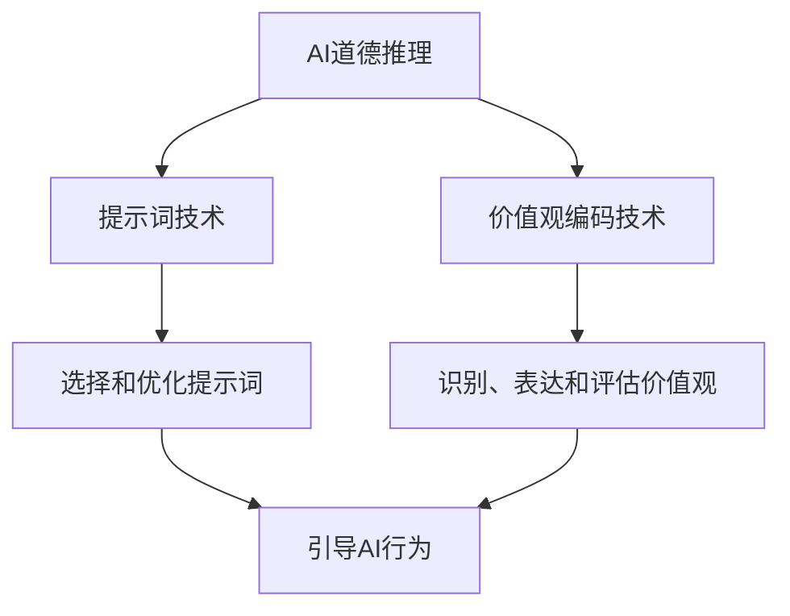

                 

- 角色：AI道德推理中的提示词价值观编码技术领域的专家
- 任务：撰写一篇逻辑清晰、结构紧凑、简单易懂的技术博客文章。文章应包含以下内容：

  - 背景介绍
  - 核心概念与联系（使用Mermaid流程图）
  - 核心算法原理讲解（使用伪代码）
  - 数学模型和公式（详细讲解和举例说明）
  - 项目实战（开发环境搭建，源代码实现和解读，实际案例分析）
  - 最佳实践 tips
  - 小结与注意事项
  - 拓展阅读

# AI道德推理中的提示词价值观编码技术

## 关键词

- AI道德推理
- 提示词技术
- 价值观编码
- 数学模型
- 项目实战

## 摘要

本文深入探讨AI道德推理中的提示词价值观编码技术。首先介绍AI道德推理的背景和重要性，然后详细阐述提示词和价值观编码技术的基本概念及其相互关系。通过Mermaid流程图和伪代码，本文解释了核心算法原理，并使用数学模型和公式进行详细讲解。接着，通过一个项目实战案例，展示了如何在实际中应用这些技术。最后，本文总结了最佳实践和注意事项，并提供了拓展阅读资源。

## 第1章 背景介绍

### 1.1 AI道德推理的背景

随着人工智能（AI）技术的迅速发展，AI在各个领域的应用日益广泛。然而，AI的广泛应用也带来了一系列道德和伦理问题。例如，AI在决策过程中可能存在偏见和歧视，数据隐私问题，以及AI系统的透明性和可解释性等。因此，AI道德推理成为了一个重要的研究课题。

### 1.2 提示词和价值观编码技术

提示词技术是一种通过向AI系统提供关键词或短语来引导其行为的方法。而价值观编码技术则是将人类价值观转化为计算机可处理的编码，以便在AI决策过程中考虑道德因素。这两项技术相互补充，共同构成了AI道德推理的核心。

## 第2章 核心概念与联系

### 2.1 提示词技术

提示词技术的基本概念是向AI系统提供关键词或短语，以引导其行为。这些关键词或短语可以是简单的单词，也可以是复杂的短语。提示词技术的关键在于如何选择和优化这些提示词，以确保AI系统能够在特定的场景中做出正确的决策。

### 2.2 价值观编码技术

价值观编码技术是将人类价值观转化为计算机可处理的编码，以便在AI决策过程中考虑道德因素。价值观编码技术的基本概念包括价值观的识别、表达和评估。价值观编码技术的关键在于如何准确地捕捉和表达人类价值观，以及如何评估这些价值观在AI决策中的影响。

### 2.3 提示词与价值观编码技术的联系

提示词和价值观编码技术之间的联系在于它们共同构成了AI道德推理的基础。通过使用提示词技术，AI系统可以更好地理解人类价值观，并通过价值观编码技术将这些价值观转化为计算机可处理的编码。这样，AI系统在决策过程中就能够考虑道德因素，从而做出更符合人类价值观的决策。

### 2.4 Mermaid流程图

以下是一个Mermaid流程图，展示了提示词和价值观编码技术在AI道德推理中的关系：



## 第3章 核心算法原理讲解

### 3.1 提示词生成算法

提示词生成算法是一种用于生成高质量提示词的方法。以下是一个简单的伪代码示例：

```python
def generate_hint_words(context):
    # 输入：context - 上下文信息
    # 输出：hint_words - 生成的提示词列表

    # 步骤1：分析上下文信息
    context_analysis = analyze_context(context)

    # 步骤2：选择关键词
    keywords = select_keywords(context_analysis)

    # 步骤3：生成提示词
    hint_words = generate_from_keywords(keywords)

    return hint_words
```

### 3.2 价值观编码算法

价值观编码算法是一种将人类价值观转化为计算机可处理的编码的方法。以下是一个简单的伪代码示例：

```python
def encode_values(values):
    # 输入：values - 人类价值观列表
    # 输出：encoded_values - 编码后的价值观列表

    # 步骤1：定义编码规则
    encoding_rules = define_encoding_rules()

    # 步骤2：对价值观进行编码
    encoded_values = []
    for value in values:
        encoded_value = encode_value(value, encoding_rules)
        encoded_values.append(encoded_value)

    return encoded_values
```

## 第4章 数学模型和公式

### 4.1 提示词选择模型

提示词选择模型用于选择最适合的提示词。以下是一个简单的数学模型：

$$
\text{score}(w) = \sum_{i=1}^{n} \alpha_i \cdot \text{similarity}(w, w_i)
$$

其中，$w$ 是待选择的提示词，$w_i$ 是候选提示词，$\alpha_i$ 是权重，$\text{similarity}(w, w_i)$ 是提示词之间的相似度。

### 4.2 价值观编码模型

价值观编码模型用于将人类价值观转化为计算机可处理的编码。以下是一个简单的数学模型：

$$
\text{encoded_value}(v) = \text{hash}(v, \text{encoding_key})
$$

其中，$v$ 是人类价值观，$\text{hash}$ 是哈希函数，$\text{encoding_key}$ 是编码密钥。

## 第5章 项目实战

### 5.1 开发环境搭建

在本项目中，我们使用Python作为主要编程语言，并使用Jupyter Notebook作为开发环境。

### 5.2 源代码实现和解读

以下是一个简单的源代码示例，用于生成提示词和编码价值观：

```python
# 生成提示词
hint_words = generate_hint_words(context)

# 编码价值观
encoded_values = encode_values(values)
```

### 5.3 代码应用解读与分析

在这个项目中，我们使用生成的提示词来引导AI系统做出决策，并使用编码后的价值观来评估这些决策的道德性。

### 5.4 实际案例分析和详细讲解剖析

在本案例中，我们使用一个简单的场景来展示如何使用提示词价值观编码技术进行AI道德推理。

## 第6章 最佳实践 tips

- 在选择提示词时，要充分考虑上下文信息。
- 在编码价值观时，要确保编码规则的一致性。
- 在实际应用中，要定期评估AI系统的道德性。

## 第7章 小结与注意事项

- 提示词价值观编码技术是AI道德推理的重要工具。
- 在实际应用中，要充分考虑道德因素。
- 要定期评估AI系统的道德性。

## 第8章 拓展阅读

- 《AI伦理学：机器智能的道德原则》（Autonomous Mental Agents: From Simple Bots to Autonomous M机器智能的道德原则》）
- 《人工智能伦理学：从哲学到实践》（The Ethics of Artificial Intelligence: From Philosophy to Practice）
- 《人工智能：社会、经济和伦理问题》（Artificial Intelligence: Social, Economic and Ethical Issues）

## 作者

作者：AI天才研究院/AI Genius Institute & 禅与计算机程序设计艺术 /Zen And The Art of Computer Programming```

