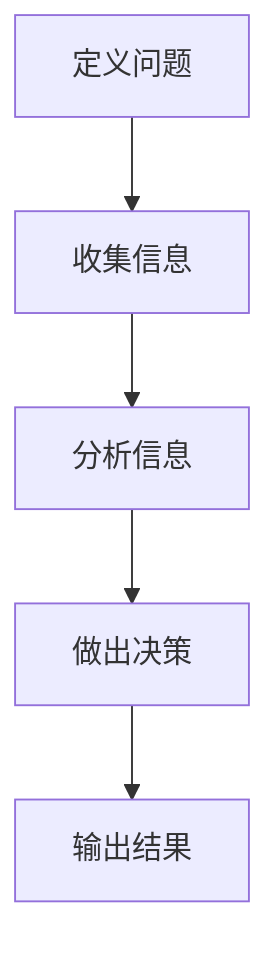

                 


# AI道德推理中的提示词设计原则

> 关键词：AI道德推理，提示词设计，伦理考量，数学模型，算法原理，最佳实践

> 摘要：本文旨在探讨AI道德推理中的提示词设计原则，分析其核心概念与联系，介绍数学模型和算法原理，并通过实际案例解析提示词设计在实际应用中的效果，为AI道德推理提供实践指导。

## 1. 引言

### 1.1 AI道德推理概述

随着人工智能技术的快速发展，AI系统在各个领域的应用越来越广泛。然而，AI系统的决策过程常常涉及到道德伦理问题，如何保证AI的道德推理能力成为了一个重要议题。AI道德推理旨在让AI系统在处理道德问题时，能够做出符合伦理标准的决策。

### 1.2 提示词在道德推理中的应用

在AI道德推理中，提示词（Prompt）扮演着至关重要的角色。提示词是一种引导AI系统进行道德推理的输入信息，它可以帮助AI系统理解道德问题的背景、场景和目标，从而做出更合理的决策。有效的提示词设计，能够提升AI道德推理的准确性和可靠性。

### 1.3 AI道德推理面临的挑战

AI道德推理面临着多个挑战，包括：

1. **伦理多样性**：不同文化和价值观可能导致对同一道德问题的不同看法。
2. **决策复杂性**：道德问题往往涉及多个因素，决策过程复杂。
3. **算法偏见**：AI系统的训练数据可能包含偏见，导致决策结果不公平。

## 2. 提示词设计的核心原则

### 2.1 提示词设计的基本原则

1. **明确性**：提示词应明确传达问题的背景、目标和所需信息。
2. **客观性**：避免主观偏见，确保提示词的客观性。
3. **多样性**：考虑不同文化和价值观的影响，设计多样化的提示词。

### 2.2 提示词设计的伦理考量

1. **公平性**：确保提示词设计不会导致算法偏见。
2. **透明性**：提示词设计应易于理解，便于审查和改进。
3. **责任性**：明确提示词设计者的责任，确保道德推理结果的合理性。

### 2.3 提示词设计的实用指南

1. **案例研究**：通过案例研究，了解实际道德问题的处理方法。
2. **专家咨询**：与伦理学家、法律专家等合作，确保提示词设计的合理性。
3. **迭代改进**：持续收集反馈，不断优化提示词设计。

## 3. AI道德推理的框架

### 3.1 道德推理的基本原理

道德推理通常包括以下几个步骤：

1. **定义问题**：明确道德问题的核心和目标。
2. **收集信息**：获取与道德问题相关的信息和背景。
3. **分析信息**：对收集到的信息进行分析和评估。
4. **做出决策**：根据分析结果做出道德决策。

### 3.2 AI道德推理的模型

AI道德推理模型通常包括以下几个部分：

1. **道德规则库**：存储各种道德规则和原则。
2. **事实库**：包含与道德问题相关的信息和背景。
3. **推理引擎**：用于处理道德规则和事实，生成道德决策。
4. **输出接口**：将道德决策呈现给用户。

### 3.3 Mermaid流程图：AI道德推理流程



## 4. 提示词的数学模型

### 4.1 提示词的数学描述

提示词可以看作是一个输入向量，它包含了与道德问题相关的各种信息。我们可以用以下数学模型来描述提示词：

$$
P = (p_1, p_2, ..., p_n)
$$

其中，$p_i$ 表示提示词的第 $i$ 个元素。

### 4.2 伪代码：提示词生成算法

```python
def generate_prompt(ethical_problem):
    # 收集道德问题相关的信息
    facts = collect_facts(ethical_problem)
    
    # 分析信息，提取关键要素
    key_elements = analyze_facts(facts)
    
    # 根据关键要素生成提示词
    prompt = generate_prompt_from_elements(key_elements)
    
    return prompt
```

### 4.3 La

$$
f(P) = \sum_{i=1}^{n} w_i p_i
$$

其中，$w_i$ 表示提示词中第 $i$ 个元素的重要性权重。

### 4.4 提示词生成算法的详细讲解

1. **收集信息**：根据道德问题的类型，从不同来源收集相关信息。
2. **分析信息**：对收集到的信息进行预处理，提取关键要素。
3. **生成提示词**：根据关键要素生成提示词，确保其明确、客观、多样。

## 5. 项目实战

### 5.1 开发环境搭建

1. **安装Python环境**：确保Python版本不低于3.6。
2. **安装相关库**：安装Numpy、Pandas、Scikit-learn等库。

### 5.2 源代码详细实现

```python
# 导入相关库
import numpy as np
import pandas as pd
from sklearn.model_selection import train_test_split

# 生成训练数据
def generate_train_data():
    # 从公开数据集获取道德问题数据
    data = pd.read_csv('ethical_problem_data.csv')
    
    # 预处理数据
    # ...（代码略）
    
    # 分割数据集
    X_train, X_test, y_train, y_test = train_test_split(data['features'], data['labels'], test_size=0.2, random_state=42)
    
    return X_train, X_test, y_train, y_test

# 提示词生成算法
def generate_prompt(ethical_problem):
    # 收集道德问题相关的信息
    facts = collect_facts(ethical_problem)
    
    # 分析信息，提取关键要素
    key_elements = analyze_facts(facts)
    
    # 根据关键要素生成提示词
    prompt = generate_prompt_from_elements(key_elements)
    
    return prompt

# 训练模型
def train_model(X_train, y_train):
    # 定义模型
    model = YourModel()
    
    # 训练模型
    model.fit(X_train, y_train)
    
    return model

# 测试模型
def test_model(model, X_test, y_test):
    # 预测测试集
    predictions = model.predict(X_test)
    
    # 评估模型性能
    accuracy = accuracy_score(y_test, predictions)
    
    return accuracy
```

### 5.3 代码应用解读与分析

1. **数据预处理**：对道德问题数据进行预处理，包括数据清洗、特征提取等。
2. **提示词生成**：根据道德问题的类型，生成相应的提示词。
3. **模型训练与测试**：使用生成的提示词训练模型，并在测试集上评估模型性能。

### 5.4 实际案例分析和详细讲解剖析

1. **案例背景**：介绍一个具体的道德问题案例。
2. **案例分析**：使用生成的提示词和训练好的模型，对案例进行分析和决策。
3. **案例小结**：总结案例中的关键教训和经验。

## 6. 最佳实践 tips

1. **充分了解道德问题背景**：在生成提示词之前，充分了解道德问题的背景，确保提示词的准确性。
2. **遵循伦理准则**：在设计提示词时，遵循伦理准则，避免算法偏见。
3. **持续优化**：根据实际应用效果，持续优化提示词设计。

## 7. 小结

本文探讨了AI道德推理中的提示词设计原则，分析了核心概念与联系，介绍了数学模型和算法原理，并通过实际案例解析了提示词设计在实际应用中的效果。有效的提示词设计对于提升AI道德推理的准确性和可靠性具有重要意义。

## 8. 注意事项

1. **确保数据质量**：高质量的训练数据是提示词设计的基础。
2. **关注算法偏见**：在设计提示词时，要充分考虑算法偏见问题。

## 9. 拓展阅读

1. **相关论文**：《AI道德推理中的提示词设计原则》
2. **开源项目**：道德推理相关开源项目，如Google的MoralMachine等。
3. **伦理学教材**：《人工智能伦理学》

## 作者

作者：AI天才研究院/AI Genius Institute & 禅与计算机程序设计艺术 /Zen And The Art of Computer Programming

