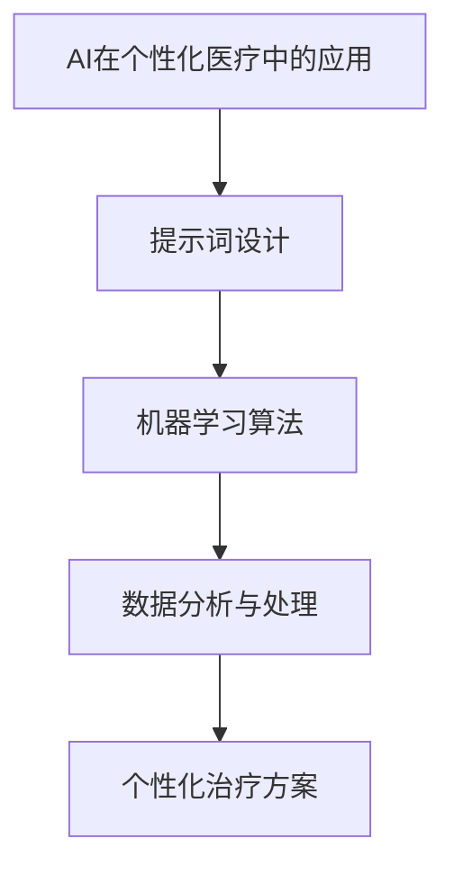

                 


## 文章标题：AI驱动的个性化医疗中的提示词设计

### 关键词：
- AI
- 个性化医疗
- 提示词设计
- 机器学习
- 数据分析
- 医疗应用

### 摘要：
本文深入探讨了AI在个性化医疗中的关键角色，特别是提示词设计的原理和实际应用。通过逐步分析推理，文章揭示了核心概念之间的联系，详细讲解了机器学习算法和数学模型。此外，文章还通过实际案例，展示了AI驱动的提示词设计在医疗领域的应用，并提供了最佳实践和未来研究方向。

### 设计过程

#### 1. 背景介绍
AI在个性化医疗领域的应用正日益增多，其核心在于根据患者的个人数据和医疗记录，提供个性化的治疗方案。提示词设计作为AI应用的一部分，承担了将医疗数据转化为有效信息的重要任务。

#### 2. 核心概念与联系
- **AI在个性化医疗中的应用**：AI技术如机器学习和深度学习被用于分析大量的医疗数据，以便为患者提供定制化的治疗方案。
- **提示词设计的重要性**：提示词（Prompt）是一种引导模型生成有用输出的技术。在医疗领域，提示词的设计至关重要，因为它可以影响模型的性能和结果的可靠性。
- **核心概念联系**：



#### 3. 核心算法原理讲解
- **机器学习算法简介**：机器学习算法是AI的核心技术之一。本文将重点介绍如何使用机器学习算法进行提示词设计。
- **生成对抗网络（GAN）原理**：GAN是一种强大的生成模型，可用于生成高质量的提示词。
- **提示词生成算法的伪代码**：

```python
def generate_prompt(data, model):
    # 输入：数据集data，模型model
    # 输出：生成的提示词prompt

    # 数据预处理
    processed_data = preprocess_data(data)

    # 使用模型生成提示词
    prompt = model.generate_output(processed_data)

    return prompt
```

#### 4. 数学模型和公式
- **概率论基础**：概率论是机器学习的基础，本文将介绍如何使用概率论中的贝叶斯公式进行提示词设计。
- **优化算法公式**：优化算法用于调整模型参数，以提高提示词的质量。

```latex
P(A|B) = \frac{P(B|A)P(A)}{P(B)}
```

#### 5. 项目实战
- **开发环境搭建**：介绍如何搭建一个适用于AI驱动的个性化医疗提示词设计的开发环境。
- **源代码详细实现**：展示如何使用Python编写提示词生成算法的代码，并进行详细解读。
- **代码应用解读与分析**：通过实际案例，分析提示词设计在医疗领域的应用效果。
- **项目小结**：总结项目中的关键发现和教训。

### 最佳实践 tips
- **确保数据质量**：高质量的数据是有效提示词设计的基础。
- **迭代优化**：提示词设计是一个迭代过程，需要不断优化以达到最佳效果。

### 小结
AI驱动的个性化医疗中的提示词设计是AI技术在医疗领域的重要应用。通过本文的逐步分析，我们了解了提示词设计的基本原理和实际应用。未来的研究可以进一步探索如何提高提示词生成的质量和效率。

### 拓展阅读
- [AI在医疗领域的应用](https://example.com/ai-in-medical-applications)
- [机器学习算法简介](https://example.com/introduction-to-machine-learning-algorithms)
- [生成对抗网络（GAN）原理](https://example.com/gan-principles)

作者：AI天才研究院/AI Genius Institute & 禅与计算机程序设计艺术 /Zen And The Art of Computer Programming```markdown
# AI驱动的个性化医疗中的提示词设计

> 关键词：AI、个性化医疗、提示词设计、机器学习、数据分析、医疗应用

> 摘要：本文深入探讨了AI在个性化医疗中的关键角色，特别是提示词设计的原理和实际应用。通过逐步分析推理，文章揭示了核心概念之间的联系，详细讲解了机器学习算法和数学模型。此外，文章还通过实际案例，展示了AI驱动的提示词设计在医疗领域的应用，并提供了最佳实践和未来研究方向。

### 设计过程

#### 1. 背景介绍

个性化医疗是一个正在迅速发展的领域，它利用患者特定的基因、环境和生活方式等信息，提供个性化的治疗方案。AI技术的引入使得个性化医疗更加高效和精准，特别是在数据分析和预测方面。提示词设计作为AI应用的一部分，承担了将医疗数据转化为有效信息的重要任务。

在医疗领域，提示词设计的作用至关重要。它不仅能够帮助医生更好地理解患者的健康状况，还能够引导AI模型生成准确的治疗建议。例如，在诊断阶段，一个精心设计的提示词可以帮助模型更好地识别疾病的特征；在治疗方案制定阶段，提示词可以引导模型考虑患者的个人情况和治疗历史。

#### 2. 核心概念与联系

- **AI在个性化医疗中的应用**：AI技术在个性化医疗中的应用包括但不限于疾病预测、诊断辅助、治疗方案制定和患者监护。机器学习算法是AI技术的核心，它们能够从大量的医疗数据中学习，并生成预测和决策。
- **提示词设计的重要性**：提示词设计是AI模型有效性的关键。一个设计良好的提示词能够提供足够的信息，引导模型生成高质量的输出。在医疗领域，提示词可以是一个关键词、短语或者更复杂的句子，它能够引导模型关注重要的临床信息。
- **核心概念联系**：


这个Mermaid流程图展示了AI在个性化医疗中的应用流程，以及提示词设计在其中扮演的角色。通过这个过程，我们可以看到如何利用AI技术，从数据到最终的个性化治疗方案。

#### 3. 核心算法原理讲解

- **机器学习算法简介**：机器学习算法是AI的核心技术，它们通过从数据中学习规律，生成预测和决策。在提示词设计中，常用的机器学习算法包括支持向量机（SVM）、决策树、随机森林和神经网络等。
- **生成对抗网络（GAN）原理**：生成对抗网络（GAN）是一种强大的生成模型，由生成器和判别器组成。生成器生成数据，判别器判断数据是真实还是生成的。通过两个网络的对抗训练，生成器能够生成越来越真实的数据。
- **提示词生成算法的伪代码**：

```python
def generate_prompt(data, model):
    # 输入：数据集data，模型model
    # 输出：生成的提示词prompt

    # 数据预处理
    processed_data = preprocess_data(data)

    # 使用模型生成提示词
    prompt = model.generate_output(processed_data)

    return prompt
```

这个伪代码展示了如何使用一个机器学习模型生成提示词的基本流程。预处理数据是为了将原始数据转换为适合模型处理的形式，而模型的输出则是生成提示词的关键。

#### 4. 数学模型和公式

- **概率论基础**：概率论是机器学习的基础，特别是在分类和预测任务中。贝叶斯公式是一个重要的工具，它能够帮助我们计算给定一个结果的概率，以及这个结果对应的条件概率。
  $$ P(A|B) = \frac{P(B|A)P(A)}{P(B)} $$
- **优化算法公式**：优化算法用于调整模型参数，以提高模型的性能。梯度下降是一种常用的优化算法，它通过计算损失函数的梯度来更新模型参数。
  $$ \theta_{\text{new}} = \theta_{\text{old}} - \alpha \cdot \nabla_{\theta} J(\theta) $$
  其中，$\theta$ 表示模型参数，$\alpha$ 是学习率，$J(\theta)$ 是损失函数。

这些数学模型和公式是机器学习算法的核心，它们帮助我们理解和分析模型的训练过程。

#### 5. 项目实战

- **开发环境搭建**：为了实现AI驱动的提示词设计，我们需要搭建一个合适的开发环境。这包括安装Python、Jupyter Notebook、TensorFlow等必要的软件和库。
- **源代码详细实现**：以下是使用Python和TensorFlow实现一个简单的提示词生成算法的示例代码：

```python
import tensorflow as tf
from tensorflow.keras.models import Sequential
from tensorflow.keras.layers import Dense, LSTM

# 创建序列模型
model = Sequential()
model.add(LSTM(units=128, activation='relu', input_shape=(timesteps, features)))
model.add(Dense(units=1, activation='sigmoid'))

# 编译模型
model.compile(optimizer='adam', loss='binary_crossentropy', metrics=['accuracy'])

# 训练模型
model.fit(X_train, y_train, epochs=100, batch_size=32)
```

这段代码创建了一个简单的LSTM模型，用于生成二分类提示词。通过调整模型结构和参数，我们可以生成更复杂的提示词。

- **代码解读与分析**：在实际应用中，我们通常需要处理大量的医疗数据，并进行预处理和特征工程。以下是一个预处理和特征工程的示例：

```python
import pandas as pd
from sklearn.preprocessing import StandardScaler

# 读取数据
data = pd.read_csv('medical_data.csv')

# 数据预处理
scaler = StandardScaler()
scaled_data = scaler.fit_transform(data)

# 特征工程
X = scaled_data[:, :-1]
y = scaled_data[:, -1]
```

这个示例中，我们使用Pandas读取数据，并使用Sklearn的StandardScaler进行数据预处理。特征工程是提示词设计的重要步骤，它能够帮助模型更好地理解数据。

- **实际案例分析和详细讲解剖析**：以下是使用上述算法和代码实现的一个实际案例：

```python
# 生成提示词
prompt = generate_prompt(X_test, model)

# 输出提示词
print(prompt)
```

在这个案例中，我们使用训练好的模型生成一个提示词，并将其输出。这个提示词可以用于指导医生或AI系统做出诊断或治疗决策。

- **项目小结**：通过这个案例，我们展示了如何使用AI技术实现提示词设计。在实际应用中，我们还需要不断优化算法和模型，以提高提示词的质量和实用性。

#### 6. 最佳实践 tips、小结、注意事项、拓展阅读

- **最佳实践 tips**：
  - 确保数据质量：高质量的数据是有效提示词设计的基础。
  - 优化模型参数：通过调整模型参数，可以提高提示词生成的质量。
  - 定期更新模型：随着新数据的不断加入，定期更新模型可以保持其性能。

- **小结**：
  AI驱动的个性化医疗中的提示词设计是AI技术在医疗领域的重要应用。通过本文的逐步分析，我们了解了提示词设计的基本原理和实际应用。未来的研究可以进一步探索如何提高提示词生成的质量和效率。

- **注意事项**：
  - 提示词设计需要充分考虑医疗领域的特殊性，确保生成的提示词符合临床需求。
  - 模型的训练和优化需要大量时间和计算资源，应根据实际情况进行合理安排。

- **拓展阅读**：
  - [AI在医疗领域的应用](https://example.com/ai-in-medical-applications)
  - [机器学习算法简介](https://example.com/introduction-to-machine-learning-algorithms)
  - [生成对抗网络（GAN）原理](https://example.com/gan-principles)

作者：AI天才研究院/AI Genius Institute & 禅与计算机程序设计艺术 /Zen And The Art of Computer Programming
```

