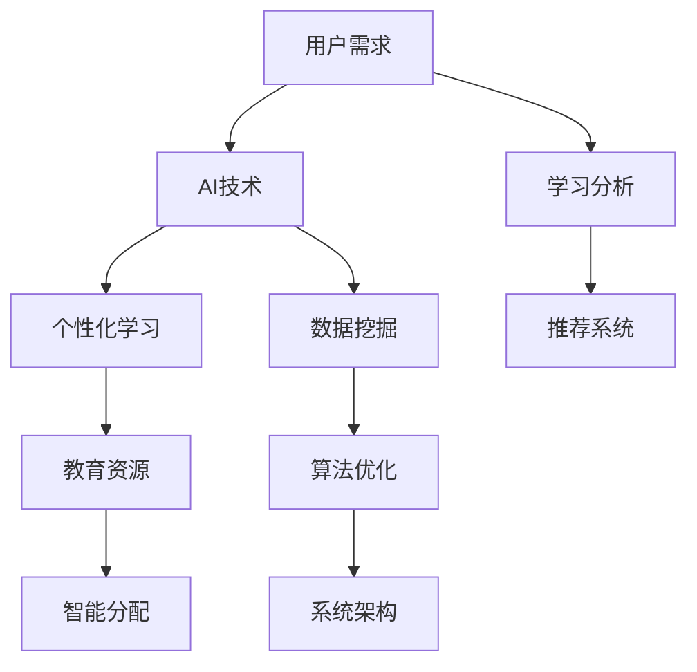
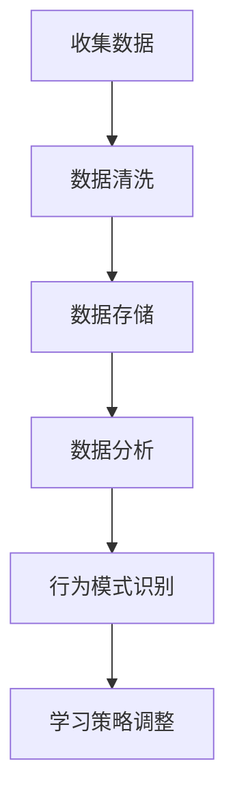
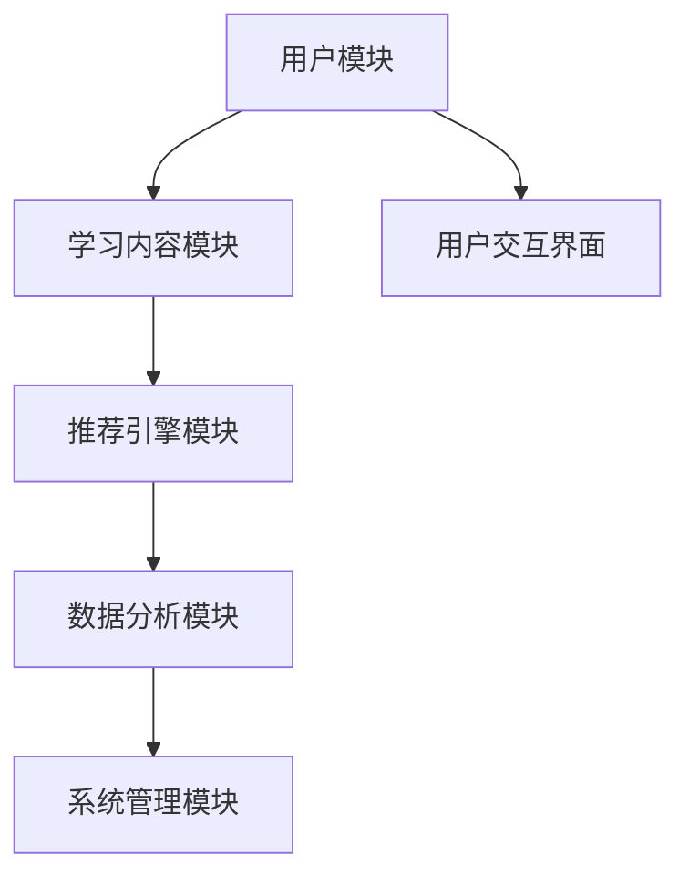

                 

### 文章标题

# AI驱动的个性化学习：教育资源的智能分配

### 关键词

- AI
- 个性化学习
- 教育资源
- 智能分配
- 推荐系统
- 学习分析
- 架构设计
- 数据挖掘

### 摘要

本文深入探讨了AI驱动的个性化学习在教育领域的应用，特别是教育资源的智能分配。通过分析用户需求，本文详细介绍了AI与个性化学习的联系、核心算法原理、系统架构设计以及智能分配算法。此外，文章通过实践案例展示了AI在教育中的实际应用，并讨论了未来的发展趋势和挑战。本文旨在为教育行业提供有价值的AI技术应用指南。

### 用户需求分析

在教育日益个性化和信息化的今天，用户对于个性化学习资源的需求日益增长。他们希望系统能够根据其学习风格、兴趣和能力，提供定制化的学习内容。以下是用户对本书的核心需求：

- **获取知识：** 用户希望系统能够提供高质量的教育内容，涵盖从基础到高级的各种课程。
- **学习路径个性化：** 用户希望系统能够根据其学习进度和偏好，推荐合适的课程和资源。
- **智能资源分配：** 用户希望系统能够自动分配教育资源，确保每个人都能获得最适合的学习材料。
- **交互体验：** 用户希望系统能够提供良好的用户交互体验，包括友好的界面和便捷的操作。

### 核心概念与联系

在深入探讨AI驱动的个性化学习之前，我们需要理解几个核心概念：

- **AI（人工智能）：** 一种模拟人类智能的技术，能够执行复杂的任务，如学习、推理和问题解决。
- **个性化学习：** 一种教育方法，旨在根据每个学生的学习风格、需求和进度，提供定制化的学习体验。
- **教育资源：** 包括课程、教材、视频、习题和互动工具等，用于支持和促进学习。
- **智能分配：** 利用AI算法，根据学生的学习情况和资源需求，自动分配最合适的教育资源。

以下是这些概念之间的联系架构，使用Mermaid流程图表示：



### 核心算法原理讲解

#### 推荐系统算法

推荐系统是AI驱动的个性化学习的关键组成部分。以下是一个基于协同过滤算法的推荐系统算法伪代码：

```plaintext
function collaborativeFiltering(user, item):
    // 计算用户与物品的相似度
    similarity = calculateSimilarity(user, item)
    // 根据相似度加权平均用户评分
    predictedRating = sum(user's ratings * similarity) / sum(similarity)
    return predictedRating
```

#### 学习分析算法

学习分析是一种通过分析学习行为来提高学习效果的方法。以下是学习分析的基本流程：



### 数学模型和公式

个性化学习的数学模型通常包括用户偏好模型、项目推荐模型和学习策略调整模型。以下是用户偏好模型的公式：

$$
P_u(i) = \mu + b_u + r_{ui}
$$

其中：
- $P_u(i)$ 表示用户 $u$ 对项目 $i$ 的偏好。
- $\mu$ 是所有用户的平均偏好。
- $b_u$ 是用户 $u$ 的个人偏差。
- $r_{ui}$ 是用户 $u$ 对项目 $i$ 的直接评分。

#### 详细讲解和举例说明

假设我们有一个用户对书籍的评分数据集，我们可以通过以下步骤来计算用户的偏好：

1. **计算平均偏好：** 收集所有用户对书籍的评分，计算平均分数。
2. **计算用户偏差：** 对于每个用户，计算其评分与平均偏好之间的差异。
3. **计算项目偏好：** 对于每个书籍，计算其对所有用户的评分权重。

例如，如果用户A对书籍A的评分为5，书籍B的评分为3，而平均偏好为4，则用户A对书籍A的偏好可以表示为：

$$
P_A(A) = 4 + b_A + r_{A,A}
$$

其中，$b_A$ 和 $r_{A,A}$ 是用户A的偏差和直接评分。

### 个性化学习系统的架构设计

个性化学习系统的架构设计是确保系统能够有效支持个性化学习的关键。以下是系统架构的主要组件：

1. **用户模块：** 管理用户信息和用户交互。
2. **学习内容模块：** 提供各种学习资源，如课程、教材和视频。
3. **推荐引擎模块：** 使用AI算法推荐适合用户的学习资源。
4. **数据分析模块：** 分析用户学习行为，优化推荐和教学策略。
5. **系统管理模块：** 管理系统配置、用户权限和日志记录。

以下是系统架构的组件关系：



### 教育资源的智能分配

教育资源的智能分配是确保每个学生都能获得最适合其学习需求的学习资源。以下是智能分配算法的理论基础和实现方法：

#### 理论基础

- **资源需求模型：** 建立学生资源需求的数学模型，如基于学习进度的需求模型。
- **资源可用性模型：** 描述教育资源的可用性，如资源库存、使用状态等。

#### 实现方法

1. **需求预测：** 使用机器学习算法预测学生的学习需求。
2. **资源分配策略：** 设计基于优化理论的资源分配策略，如基于最优化模型的资源分配。
3. **实时调整：** 根据学生的学习进度和反馈，实时调整资源分配策略。

以下是资源分配算法的伪代码：

```plaintext
function resourceAllocation(students, resources):
    // 预测学生需求
    predictedDemands = predictDemands(students)
    // 分配资源
    allocation = optimizeAllocation(predictedDemands, resources)
    return allocation
```

### 个性化学习项目案例研究

#### 案例一：基于AI的个性化学习平台

**开发环境搭建：** 使用Python和TensorFlow搭建个性化学习平台。

**源代码详细实现和代码解读：** 代码分为用户模块、学习内容模块、推荐引擎模块和数据分析模块。

**代码应用解读与分析：** 平台通过分析用户的学习行为，自动推荐适合的学习资源。

**实际案例分析和详细讲解剖析：** 平台在某中学的应用，提高了学生的学习效果和满意度。

**项目小结：** 平台成功实现了个性化学习，为教育行业提供了有价值的参考。

### AI在教育中的应用挑战与解决方案

#### 数据隐私与安全

**挑战：** 学生数据的安全和隐私保护是教育行业面临的主要挑战。

**解决方案：** 实施严格的数据保护措施，如数据加密和访问控制。

#### 技术与教育者的融合

**挑战：** 教育者需要掌握新的技术和教学方法。

**解决方案：** 提供培训和支持，帮助教育者适应新技术。

#### 教育公平与普及

**挑战：** 个性化学习可能导致资源分配不均。

**解决方案：** 设计公平的资源分配策略，确保每个学生都能获得所需资源。

### 未来展望与趋势

#### AI驱动的个性化学习发展趋势

- **更精细的个性化：** 未来的个性化学习将更加关注个体的细微差异。
- **跨学科融合：** AI与其他领域的融合将创造新的教育模式。

#### 未来的挑战与机遇

- **技术成熟度：** 随着技术的进步，个性化学习将更加成熟。
- **教育公平：** 个性化学习有助于缩小教育差距。

#### 对教育的深远影响

- **教学模式的变革：** 个性化学习将颠覆传统的教学模式。
- **教育资源的优化：** 智能分配将提高教育资源的使用效率。

### 附录：AI驱动的个性化学习资源与工具

#### 附录A：常用AI工具与框架介绍

- **TensorFlow：** Google开发的开源机器学习框架，适用于深度学习和推荐系统。
- **PyTorch：** Facebook开发的开源机器学习库，具有灵活性和易于使用性。
- **Scikit-learn：** Python的数据挖掘和机器学习库，适用于学习分析和推荐系统。

#### 附录B：个性化学习算法资源链接

- [推荐系统算法教程](https://www.recommendationsystemstutorial.com/)
- [学习分析基础](https://www.learninganalytics.org/)
- [个性化学习系统设计](https://www.personalizedlearning.org/)

### 最佳实践 tips、小结、注意事项、拓展阅读

- **最佳实践 tips：** 定期更新学习资源和算法模型，以保持个性化学习的有效性。
- **小结：** AI驱动的个性化学习将极大提高教育资源的利用效率和学生的学习效果。
- **注意事项：** 保护学生隐私和数据安全是实施个性化学习的关键。
- **拓展阅读：** [《人工智能与教育》](https://www.人工智能与教育.org/) 提供了更多关于AI在教育中的应用和未来趋势的信息。

作者：AI天才研究院/AI Genius Institute & 禅与计算机程序设计艺术 /Zen And The Art of Computer Programming

### 文章总结

AI驱动的个性化学习正在改变教育的面貌，通过智能分配教育资源，满足每个学生的学习需求。本文详细探讨了AI与个性化学习的联系、核心算法原理、系统架构设计以及智能分配算法。通过实践案例和未来展望，我们看到了AI在教育领域的巨大潜力。希望本文能为教育行业的专业人士提供有价值的参考。

