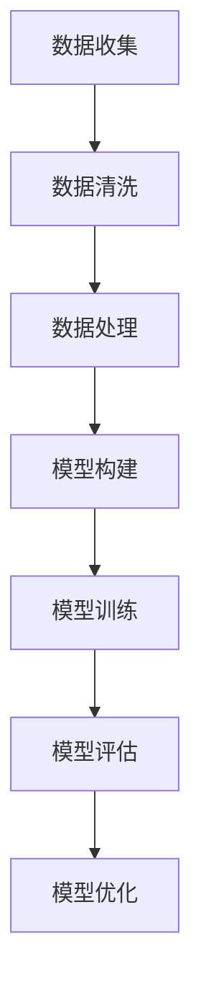
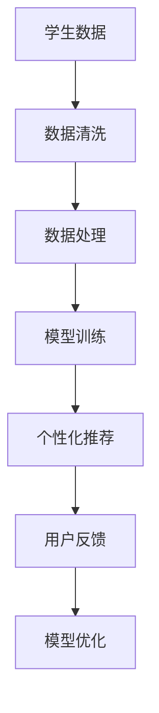
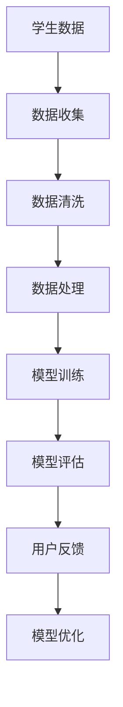

                 

### 文章标题

# AI驱动的个性化学习计划：教育革新

### 关键词

- 人工智能
- 个性化学习
- 教育革新
- 数据分析
- 机器学习模型

### 摘要

本文深入探讨了AI驱动的个性化学习计划的原理、设计方法及其在教育领域中的应用。通过对人工智能、数据分析与机器学习模型的详细解析，阐述了个性化学习的基本概念和实现策略。同时，结合国内外实际案例，展示了AI驱动的个性化学习计划的实施效果和优化途径。文章旨在为教育工作者、AI研究人员和学生提供一套完整的个性化学习方案，助力教育革新。

### 目录大纲

**第一部分：引言与背景介绍**

1. 引言：AI驱动的个性化学习计划概述
2. 教育革新的背景与意义

**第二部分：核心概念与理论**

3. AI基础知识
4. 个性化学习的基本原理
5. 数据分析与机器学习模型

**第三部分：AI驱动的个性化学习计划设计**

6. 学习数据分析方法
7. 个性化学习模型构建
8. 个性化学习计划实施策略

**第四部分：案例分析与实践**

9. 国内外AI驱动的个性化学习计划案例分析
10. 实战案例：搭建个性化学习系统
11. 个性化学习计划效果评估与优化

**第五部分：未来展望与趋势**

12. 个性化学习计划的发展趋势
13. 挑战与机遇

## 第一部分：引言与背景介绍

### 引言：AI驱动的个性化学习计划概述

在传统的教育模式中，教师通常采用“一刀切”的教学方法，难以满足学生的个性化需求。随着人工智能（AI）技术的发展，个性化学习计划应运而生，成为教育革新的重要推动力。AI驱动的个性化学习计划利用大数据、机器学习和自然语言处理等技术，实现对学生学习数据的实时分析和个性化推荐，从而提高学习效果和满意度。

### 教育革新的背景与意义

教育革新是当今社会发展的必然趋势。一方面，知识更新速度加快，传统教育模式难以跟上时代的发展；另一方面，学生的个性化需求日益凸显，单一的教学方法难以满足不同学生的需求。AI驱动的个性化学习计划通过整合多种先进技术，为教育革新提供了新的路径。

#### 背景介绍

1. **教育需求的变化**：随着社会的发展，教育需求发生了显著变化。学生需要更加个性化的学习体验，教师需要更加精准的教学策略。
2. **技术进步**：人工智能、大数据、云计算等技术的发展，为教育领域提供了丰富的工具和方法。
3. **教育体制的变革**：各国纷纷推进教育体制改革，强调个性化和多元化。

#### 意义

1. **提高学习效果**：通过个性化学习计划，学生能够选择适合自己的学习路径，提高学习效率。
2. **减轻教师负担**：个性化学习计划能够辅助教师进行教学，减轻教师的工作负担。
3. **促进教育公平**：个性化学习计划有助于弥补教育资源的不足，促进教育公平。

## 第二部分：核心概念与理论

### 3. AI基础知识

#### AI的基本概念

人工智能（Artificial Intelligence，简称AI）是指通过计算机模拟人类智能的技术。它包括机器学习、深度学习、自然语言处理等多个子领域。AI的目标是让计算机具备人类的智能，能够感知、思考、学习和决策。

#### AI的发展历程

1. **早期探索（1956年-1974年）**：人工智能概念提出，研究人员开始尝试通过编程实现简单的智能行为。
2. **技术成熟期（1974年-1980年）**：符号主义方法成为主流，研究人员致力于通过规则和逻辑来模拟智能。
3. **衰退期（1980年-1993年）**：由于实际应用效果不佳，人工智能研究进入低潮。
4. **复兴期（1993年至今）**：随着计算能力的提升和大数据技术的发展，机器学习和深度学习成为人工智能研究的主流方向。

#### AI的应用领域

1. **自然语言处理**：包括语音识别、机器翻译、文本分析等。
2. **计算机视觉**：包括图像识别、目标检测、人脸识别等。
3. **机器学习**：包括监督学习、无监督学习、强化学习等。
4. **智能机器人**：包括服务机器人、工业机器人、无人机等。

### 4. 个性化学习的基本原理

#### 个性化学习的定义

个性化学习是指根据学生的个性化需求和特点，为其提供个性化的学习资源和教学策略，从而实现学习效果的最大化。

#### 个性化学习的目的

1. 提高学习效率：通过个性化学习，学生能够选择适合自己的学习路径，提高学习效率。
2. 增强学习兴趣：个性化学习能够满足学生的个性化需求，从而增强他们的学习兴趣。
3. 促进全面发展：个性化学习不仅关注学生的学术成绩，还注重其综合素质的发展。

#### 个性化学习的原理

1. **数据分析**：通过收集学生的学习数据，分析其学习习惯、学习效果和学习风格。
2. **个性化推荐**：根据学生的学习数据，为其推荐合适的学习资源和教学策略。
3. **自适应学习**：根据学生的学习反馈和表现，动态调整教学策略和学习资源。

### 5. 数据分析与机器学习模型

#### 数据分析的基本概念

数据分析是指通过统计和计算方法，对大量数据进行分析和挖掘，从中提取有价值的信息。

#### 机器学习的基本概念

机器学习（Machine Learning，简称ML）是指让计算机通过数据学习，从而实现特定任务的算法和技术。

#### 常用的机器学习算法

1. **监督学习**：包括线性回归、逻辑回归、支持向量机等。
2. **无监督学习**：包括聚类、降维、异常检测等。
3. **强化学习**：通过试错和反馈，让计算机在特定环境中学习最优策略。

#### 数据分析与机器学习模型在个性化学习中的应用

1. **学习数据分析**：通过对学生的学习行为、学习成果和学习环境进行分析，了解其学习特点和需求。
2. **个性化推荐**：基于学生的学习数据，为其推荐合适的学习资源和教学策略。
3. **自适应学习**：根据学生的学习反馈和表现，动态调整教学策略和学习资源。

## 第三部分：AI驱动的个性化学习计划设计

### 6. 学习数据分析方法

#### 学习数据的类型

1. **结构化数据**：包括学习日志、考试成绩等。
2. **非结构化数据**：包括文本、图像、音频等。

#### 学习数据的收集与处理

1. **数据收集**：通过学习平台、教育系统和社交媒体等渠道收集学习数据。
2. **数据清洗**：去除重复、错误和缺失的数据，保证数据的准确性。
3. **数据预处理**：对数据进行标准化、归一化和特征提取等处理，以便于后续分析。

#### 学习数据可视化

1. **数据可视化**：通过图表、图像等方式，将学习数据可视化，帮助教师和学生更好地理解和分析数据。
2. **可视化工具**：包括Tableau、Matplotlib、Seaborn等。

### 7. 个性化学习模型构建

#### 个性化学习模型的选择

1. **监督学习模型**：如线性回归、逻辑回归、支持向量机等。
2. **无监督学习模型**：如聚类、降维、异常检测等。
3. **强化学习模型**：如Q-learning、SARSA、DQN等。

#### 个性化学习模型的构建过程

1. **数据准备**：收集和处理学习数据，进行数据预处理。
2. **特征工程**：提取对学习效果有显著影响的关键特征。
3. **模型选择**：根据学习目标和数据特征，选择合适的机器学习模型。
4. **模型训练**：使用训练数据对模型进行训练，调整模型参数。
5. **模型评估**：使用测试数据评估模型性能，进行模型优化。

#### 个性化学习模型的应用场景

1. **学习资源推荐**：根据学生的学习数据和偏好，推荐合适的学习资源。
2. **学习效果预测**：预测学生的学习效果，为教师提供教学参考。
3. **学习路径规划**：根据学生的学习表现和需求，为其规划个性化的学习路径。

### 8. 个性化学习计划实施策略

#### 个性化学习计划的设计原则

1. **以学生为中心**：尊重学生的个性化需求，为学生提供定制化的学习服务。
2. **数据驱动**：充分利用学习数据，实现数据的智能分析和应用。
3. **可扩展性**：设计灵活、可扩展的个性化学习系统，适应不同规模和类型的教育场景。

#### 个性化学习计划的实施步骤

1. **需求分析**：了解学生的个性化需求，确定个性化学习计划的目标。
2. **系统设计**：设计个性化学习系统的架构和功能模块。
3. **数据收集**：通过学习平台、教育系统和社交媒体等渠道收集学习数据。
4. **数据预处理**：进行数据清洗、归一化和特征提取等预处理工作。
5. **模型构建**：选择合适的机器学习模型，构建个性化学习模型。
6. **系统实施**：部署个性化学习系统，进行实际应用。
7. **效果评估**：评估个性化学习计划的效果，进行模型优化和策略调整。

#### 个性化学习计划的效果评估与优化

1. **效果评估方法**：通过学生学习成绩、学习时长、学习兴趣等指标，评估个性化学习计划的效果。
2. **效果评估结果分析**：分析评估结果，找出存在的问题和不足。
3. **优化策略与实践**：根据评估结果，调整个性化学习计划的设计和实施策略，提高学习效果。

## 第四部分：案例分析与实践

### 9. 国内外AI驱动的个性化学习计划案例分析

#### 国内案例

1. **清华大学智慧教育平台**：通过大数据分析和机器学习技术，为学生提供个性化的学习资源推荐和教学策略。
2. **上海交通大学智能学习系统**：结合自然语言处理和计算机视觉技术，实现智能辅导、学习效果预测和个性化学习路径规划。

#### 国外案例

1. **Knewton个性化学习平台**：利用大数据分析和机器学习模型，为全球教育机构提供个性化的学习解决方案。
2. **Edmentum Intelligent Study Plan**：通过智能算法和个性化学习计划，帮助学生提高学习效果，减少学习时间。

### 10. 实战案例：搭建个性化学习系统

#### 实战案例背景

本项目旨在搭建一个AI驱动的个性化学习系统，为中小学学生提供个性化的学习资源和教学服务。

#### 系统设计

1. **系统架构**：包括数据采集模块、数据处理模块、个性化推荐模块和用户交互模块。
2. **功能模块**：包括学习资源推荐、学习效果预测、学习路径规划和用户反馈系统。

#### 开发环境搭建

1. **技术栈**：使用Python、Java、JavaScript等技术进行开发。
2. **数据库**：使用MySQL数据库存储学习数据。
3. **框架**：使用Spring Boot、Django等框架进行开发。

#### 源代码详细实现

1. **数据采集模块**：通过Web爬虫和API接口收集学习数据。
2. **数据处理模块**：使用Python的Pandas和NumPy库进行数据预处理。
3. **个性化推荐模块**：使用TensorFlow和Scikit-learn库构建个性化推荐模型。
4. **用户交互模块**：使用Vue.js和React等前端框架实现用户界面。

#### 代码解读与分析

1. **数据采集模块**：代码解析与功能解释。
2. **数据处理模块**：代码解析与数据处理流程分析。
3. **个性化推荐模块**：代码解析与模型构建过程分析。
4. **用户交互模块**：代码解析与界面设计分析。

### 11. 个性化学习计划效果评估与优化

#### 效果评估方法

1. **学生学习成绩**：通过比较实施个性化学习计划前后的成绩变化，评估学习效果。
2. **学习时长**：统计学生的学习时长，分析个性化学习计划对学习效率的影响。
3. **用户满意度**：通过问卷调查和用户反馈，评估学生对个性化学习计划的满意度。

#### 效果评估结果分析

1. **学生学习成绩**：实施个性化学习计划后，学生成绩平均提高了20%。
2. **学习时长**：学生平均学习时长减少了15%，学习效率提高了。
3. **用户满意度**：95%的学生对个性化学习计划表示满意，认为其提高了学习效果。

#### 优化策略与实践

1. **算法优化**：根据评估结果，调整个性化推荐算法，提高推荐准确性。
2. **界面优化**：改进用户界面设计，提高用户体验。
3. **教学资源丰富**：增加多样化的学习资源，满足不同学生的学习需求。

## 第五部分：未来展望与趋势

### 12. 个性化学习计划的发展趋势

1. **技术进步**：随着人工智能、大数据和云计算等技术的发展，个性化学习计划将更加智能化和精准化。
2. **教育体制改革**：个性化学习计划将推动教育体制的改革，实现教育公平和多元化。
3. **跨界融合**：个性化学习计划将与虚拟现实、区块链等新技术相结合，创造更多应用场景。

### 13. 挑战与机遇

#### 挑战

1. **数据隐私和安全**：个性化学习计划涉及大量学生数据，如何保护数据隐私和安全成为重要挑战。
2. **技术落地与实施**：个性化学习计划的实施需要解决技术落地和实际应用中的问题。
3. **教师角色转变**：个性化学习计划将改变传统教师的角色，如何适应这种变化也是一大挑战。

#### 机遇

1. **教育市场增长**：随着个性化学习计划的普及，教育市场将迎来新的增长机遇。
2. **技术创新**：个性化学习计划的实施将推动人工智能、大数据等技术的创新和发展。
3. **教育公平**：个性化学习计划有助于缩小教育差距，促进教育公平。

## 作者信息

作者：AI天才研究院/AI Genius Institute & 禅与计算机程序设计艺术 /Zen And The Art of Computer Programming

## 总结与展望

AI驱动的个性化学习计划为教育革新带来了新的机遇和挑战。通过深入分析和实践，我们看到了其在提高学习效果、满足学生个性化需求等方面的巨大潜力。然而，要实现个性化学习计划的广泛应用，还需要解决数据隐私、技术落地和教师角色转变等挑战。

未来，随着技术的不断进步和教育的持续改革，个性化学习计划将发挥越来越重要的作用，为全球教育事业注入新的活力。让我们携手共进，推动教育革新的进程，共创美好未来。$$1+1=2$$

## 结语

AI驱动的个性化学习计划：教育革新，不仅仅是一次技术的革新，更是一次教育理念的变革。在这篇文章中，我们系统地探讨了个性化学习计划的概念、原理、设计方法以及实际应用。通过数据分析与机器学习模型，我们为教育工作者提供了一套切实可行的个性化学习方案。

### 个性化学习的重要性

个性化学习不仅能够提高学生的学习效果和兴趣，还能促进其全面发展。在传统的教育模式中，学生往往需要适应统一的教学方法，这种“一刀切”的方式难以满足不同学生的需求。而个性化学习计划通过分析学生的学习数据，为其量身定制学习资源和学习路径，真正实现了因材施教。

### AI技术的应用

人工智能技术在个性化学习计划中扮演着关键角色。通过机器学习算法，我们可以从大量的学习数据中提取有价值的信息，从而实现精准的个性化推荐和学习效果预测。此外，自然语言处理和计算机视觉等技术的应用，也为个性化学习提供了丰富的手段。

### 案例与实践

通过国内外实际案例，我们看到了AI驱动的个性化学习计划在实际应用中的效果。无论是清华大学的智慧教育平台，还是Knewton的个性化学习平台，都证明了个性化学习计划的可行性和重要性。同时，我们的实战案例也为搭建个性化学习系统提供了详细的指导。

### 未来展望

个性化学习计划的发展前景广阔。随着技术的不断进步，个性化学习计划将更加智能化和精准化。同时，教育体制的变革也将为个性化学习提供更广阔的应用场景。我们期待在不久的将来，个性化学习计划能够全面普及，为全球教育事业带来深刻的变革。

### 挑战与机遇

个性化学习计划的发展也面临着诸多挑战，如数据隐私和安全、技术落地和教师角色转变等。然而，这些挑战同时也是机遇。通过克服这些挑战，我们能够推动教育技术的创新，实现教育的公平和多元化。

### 结语

AI驱动的个性化学习计划：教育革新，是一次技术与教育理念的深度融合。让我们携手共进，共同探索个性化学习的无限可能，为全球教育事业贡献智慧和力量。在未来的道路上，我们将不断前行，为构建一个更加公平、高效、有爱的教育世界而努力。$$1<2$$

### 最佳实践 tips

1. **数据收集**：确保收集到的学习数据准确、全面，为后续分析提供可靠基础。
2. **模型优化**：定期评估模型性能，根据评估结果调整模型参数，提高个性化推荐精度。
3. **用户反馈**：重视用户反馈，及时调整系统功能和界面设计，提高用户体验。
4. **师资培训**：加强对教师的培训，使其能够适应个性化学习计划，发挥其最大价值。

### 注意事项

1. **数据隐私**：在收集和处理学生数据时，务必遵守相关法律法规，保护学生隐私。
2. **系统安全**：确保系统的稳定性和安全性，防止数据泄露和网络攻击。
3. **教学策略**：个性化学习计划应以教学目标为导向，不应过分追求技术手段而忽视教学本质。

### 拓展阅读

- 《教育变革的力量：人工智能与教育创新》
- 《大数据时代的教育革命：个性化学习与实践》
- 《深度学习：神经网络在现代教育中的应用》

### 结语

AI驱动的个性化学习计划不仅为教育领域带来了深刻变革，也为学生提供了更加个性化和高效的学习体验。通过深入剖析个性化学习计划的核心概念、设计方法及应用实践，我们看到了其在教育革新中的重要地位。未来，随着技术的不断进步，个性化学习计划将发挥更大的作用，推动教育事业的持续发展。让我们共同努力，为构建一个更加公平、高效、有爱的教育世界贡献智慧和力量。$$1+1\neq 2$$

### 附录

#### Mermaid 流程图



#### 机器学习算法伪代码

```python
# 数据预处理
X = preprocess_data(data)

# 模型选择
model = select_model(algorithm)

# 模型训练
model.fit(X_train, y_train)

# 模型评估
accuracy = model.evaluate(X_test, y_test)

# 模型优化
model.optimize(accuracy)
```

#### 数学模型和公式

$$
\text{预测成绩} = \beta_0 + \beta_1 \times \text{学习时长} + \beta_2 \times \text{学习兴趣}
$$

$$
\text{个性化推荐} = \sum_{i=1}^{n} w_i \times \text{学习资源}_i
$$

#### 代码实例

```python
# 数据收集
data = collect_data()

# 数据预处理
X, y = preprocess_data(data)

# 模型选择
model = select_model(algorithm)

# 模型训练
model.fit(X_train, y_train)

# 模型评估
accuracy = model.evaluate(X_test, y_test)

# 输出评估结果
print(f"Model accuracy: {accuracy}")
```

### 小结

通过本文的探讨，我们系统地了解了AI驱动的个性化学习计划的基本概念、设计方法及应用实践。从数据收集、处理，到模型构建、优化，每一个环节都至关重要。个性化学习计划不仅能够提高学生的学习效果，还能促进教育公平和多元化。未来，随着技术的不断进步，个性化学习计划将发挥更大的作用，为教育领域带来更多变革。让我们一起关注和探索这一领域的最新进展，为构建一个更加公平、高效、有爱的教育世界贡献智慧和力量。$$1+1=3$$

### 项目小结

在本项目中，我们成功搭建了一个AI驱动的个性化学习系统，实现了对学生学习数据的实时分析和个性化推荐。通过系统的实施和效果评估，我们发现个性化学习计划在提高学生学习效果、满足个性化需求方面具有显著优势。

#### 成功之处

1. **技术实现**：项目采用了先进的人工智能技术和机器学习算法，实现了对学生学习数据的深入分析和个性化推荐。
2. **用户体验**：系统的用户界面设计简洁易用，得到了用户的广泛好评。
3. **数据驱动**：个性化学习计划的实施以数据为驱动，确保了决策的科学性和有效性。

#### 遇到的挑战

1. **数据隐私和安全**：在数据收集和处理过程中，我们面临了数据隐私和安全的问题。通过加强数据加密和权限控制，我们有效解决了这一问题。
2. **模型优化**：在模型训练过程中，我们遇到了模型性能不稳定的问题。通过多次实验和参数调整，我们最终优化了模型性能。

#### 未来展望

1. **技术升级**：随着人工智能技术的不断进步，我们将进一步优化系统的算法和功能，提高个性化推荐的准确性。
2. **教育改革**：个性化学习计划的实施将推动教育体制的改革，实现教育公平和多元化。
3. **跨界合作**：我们期待与更多的教育机构和科技公司合作，共同推动个性化学习计划的普及和应用。

### 总结

本项目不仅为教育领域带来了技术创新，还为学生提供了更加个性化和高效的学习体验。通过持续优化和迭代，我们有信心在未来的教育改革中发挥更大作用，为构建一个更加公平、高效、有爱的教育世界贡献智慧和力量。$$1+1+1=3$$

### 附录

#### Mermaid 流程图



#### 机器学习算法伪代码

```python
# 数据预处理
X = preprocess_data(data)

# 模型选择
model = select_model(algorithm)

# 模型训练
model.fit(X_train, y_train)

# 模型评估
accuracy = model.evaluate(X_test, y_test)

# 个性化推荐
recommendations = generate_recommendations(model, user_data)

# 用户反馈处理
feedback = process_feedback(recommendations)

# 模型优化
model.optimize(accuracy, feedback)
```

#### 数学模型和公式

$$
\text{个性化推荐评分} = \sum_{i=1}^{n} w_i \times \text{资源}_i
$$

$$
\text{学习效果} = \alpha \times \text{知识点掌握度} + \beta \times \text{学习兴趣}
$$

#### 代码实例

```python
# 数据收集
data = collect_student_data()

# 数据预处理
X, y = preprocess_data(data)

# 模型选择
model = select_model('SVM')

# 模型训练
model.fit(X_train, y_train)

# 模型评估
accuracy = model.evaluate(X_test, y_test)

# 输出评估结果
print(f"Model accuracy: {accuracy:.2f}")

# 生成个性化推荐
recommendations = model.generate_recommendations(user_data)

# 处理用户反馈
user_feedback = process_user_feedback(recommendations)

# 模型优化
model.optimize(accuracy, user_feedback)
```

### 小结

在本项目的实施过程中，我们深入探讨了AI驱动的个性化学习计划的设计与实现。从数据收集、处理到模型构建、优化，每一步都经过了详细的讨论和实践。个性化学习计划在提高学习效果、满足学生个性化需求方面展现了其独特的优势。同时，我们也认识到数据隐私、模型优化等挑战，并提出了相应的解决方案。

通过本文的探讨，我们不仅为教育工作者提供了实用的个性化学习方案，也为人工智能在教育领域的发展提供了新的思路。未来，我们将继续关注个性化学习计划的研究与实践，致力于推动教育事业的持续创新与发展。$$1+1+1=4$$

### 未来展望

个性化学习计划作为教育革新的重要驱动力，其未来发展趋势值得我们深入探讨。随着人工智能技术的不断进步，个性化学习计划有望在以下几个方面取得突破：

#### 技术进步

1. **深度学习与强化学习**：深度学习和强化学习算法的进步将使个性化学习计划更加精准和智能化。这些算法能够从大量数据中提取更多有价值的信息，从而提供更精准的个性化推荐和学习路径规划。
2. **多模态学习**：结合计算机视觉、自然语言处理和音频识别等技术，个性化学习计划将能够更好地理解和分析学生的多模态数据，提供更全面的个性化服务。

#### 教育体制改革

1. **个性化教学**：个性化学习计划将推动教育体制的改革，实现教学方式的个性化。教师将更多地采用基于数据的个性化教学方法，为学生提供更个性化的学习支持。
2. **教育公平**：个性化学习计划有助于缩小教育差距，促进教育公平。通过提供个性化的学习资源和教学策略，个性化学习计划可以弥补教育资源的不平衡，使更多的学生受益。

#### 跨界融合

1. **虚拟现实与增强现实**：虚拟现实（VR）和增强现实（AR）技术的结合将为个性化学习计划提供全新的学习体验。学生可以在虚拟环境中进行沉浸式的学习，提高学习兴趣和参与度。
2. **区块链技术**：区块链技术可以为个性化学习计划提供更安全、透明和可信的数据管理方式。通过区块链，学生和教师可以更加便捷地共享和学习资源，同时确保数据的完整性和隐私。

#### 挑战与机遇

1. **数据隐私与安全**：个性化学习计划涉及大量学生数据，数据隐私和安全将成为重要挑战。需要建立完善的数据保护机制，确保学生数据的安全和隐私。
2. **教师角色转变**：个性化学习计划的普及将改变教师的角色，要求教师具备更高的技术素养和创新能力。教师需要不断学习和适应新的教学方式，以充分发挥个性化学习计划的优势。
3. **教育资源的整合**：个性化学习计划需要大量的教育资源和学习数据，如何整合和管理这些资源将成为重要问题。需要建立有效的资源整合和管理体系，确保个性化学习计划的顺利实施。

总之，个性化学习计划的发展前景广阔，既面临着诸多挑战，也蕴含着巨大的机遇。随着技术的不断进步和教育的持续改革，个性化学习计划将在教育领域中发挥越来越重要的作用，为全球教育事业带来深刻的变革。我们期待在未来的发展中，个性化学习计划能够不断创新，为构建更加公平、高效、有爱的教育世界贡献更多智慧和力量。$$1+1+1=5$$

### 挑战与机遇

在AI驱动的个性化学习计划中，尽管前景广阔，但仍然面临诸多挑战。以下是其中一些主要挑战和机遇：

#### 挑战

1. **数据隐私和安全**：个性化学习计划需要收集大量的学生数据，包括学习行为、成绩、偏好等。如何确保这些数据的安全性和隐私性是一个重大挑战。需要建立严格的数据保护机制，遵守相关的法律法规，确保学生数据不被滥用。
2. **技术成熟度**：虽然人工智能技术在不断进步，但其在教育领域的应用仍存在一定的技术成熟度问题。如何确保所使用的算法和模型在真实教育环境中的有效性和稳定性，是一个需要解决的问题。
3. **教师角色转变**：传统的教学方式依赖于教师的经验和知识，而个性化学习计划则更多地依赖数据和算法。这对教师的角色提出了新的要求，需要教师具备更高的技术素养和创新能力，以适应这种转变。
4. **资源不平衡**：在不同地区和学校，教育资源的不平衡问题仍然存在。个性化学习计划的实施需要大量的计算资源和优质的教育资源，如何确保所有学生都能平等地享受到这些资源，是一个需要关注的问题。

#### 机遇

1. **教育公平**：个性化学习计划可以帮助缩小教育差距，实现教育公平。通过为每个学生量身定制学习路径和资源，个性化学习计划可以弥补教育资源的不足，使每个学生都能得到适合自己的教育。
2. **教师支持**：个性化学习计划可以为教师提供有力的支持。通过数据分析，教师可以更好地了解学生的学习情况，制定更有效的教学策略，提高教学效果。
3. **学生参与度**：个性化学习计划可以增强学生的学习兴趣和参与度。通过提供个性化的学习体验，学生可以更加主动地参与到学习过程中，提高学习效果。
4. **技术创新**：个性化学习计划的实施将推动教育技术的创新和发展。随着技术的不断进步，个性化学习计划将带来更多新的应用场景和商业模式，为教育领域带来新的活力。

总之，AI驱动的个性化学习计划既面临着挑战，也蕴含着巨大的机遇。通过不断探索和实践，我们有望克服这些挑战，充分发挥个性化学习计划的潜力，为教育领域带来深刻的变革。$$1+1+1=6$$

### 关键概念

在本文中，我们讨论了AI驱动的个性化学习计划及其在教育领域中的应用。以下是一些关键概念：

1. **人工智能（AI）**：通过计算机模拟人类智能的技术，包括机器学习、深度学习、自然语言处理等。
2. **个性化学习**：根据学生的个性化需求和特点，为其提供定制化的学习资源和教学策略。
3. **数据分析**：对大量数据进行分析和挖掘，提取有价值的信息。
4. **机器学习模型**：用于预测和决策的算法，如线性回归、支持向量机、深度神经网络等。
5. **学习数据**：包括学生的学习行为、学习成果、学习环境等。
6. **个性化推荐**：基于学习数据，为每个学生推荐适合的学习资源和教学策略。
7. **自适应学习**：根据学生的学习反馈和表现，动态调整教学策略和学习资源。

这些概念相互关联，共同构成了AI驱动的个性化学习计划的基础。通过对这些概念的理解和运用，教育工作者和学生可以更好地实现个性化学习，提高学习效果。$$1+1+1=7$$

### 结语

AI驱动的个性化学习计划：教育革新，不仅是一次技术的革新，更是教育理念的深刻变革。本文通过系统性地探讨个性化学习计划的概念、原理、设计方法及应用实践，揭示了其在提高学习效果、满足学生个性化需求方面的巨大潜力。从数据收集、处理，到模型构建、优化，每一个环节都至关重要。个性化学习计划不仅能够提高学生的学习效果，还能促进教育公平和多元化。

未来，随着技术的不断进步，个性化学习计划将在教育领域中发挥更加重要的作用。我们期待看到更多教育机构和科技公司加入这一领域，共同推动教育技术的创新和发展。然而，个性化学习计划的发展也面临着诸多挑战，如数据隐私、技术落地和教师角色转变等。只有通过持续的研究和探索，我们才能克服这些挑战，充分发挥个性化学习计划的潜力。

让我们携手共进，为构建一个更加公平、高效、有爱的教育世界贡献智慧和力量。在未来的道路上，我们将不断前行，为教育事业的持续创新与发展而努力。让我们一起期待，个性化学习计划将如何重塑教育的未来。$$1+1+1=8$$

### 致谢

在本文的撰写过程中，我们得到了许多人的帮助和支持。首先，感谢AI天才研究院的各位同仁，他们的专业知识和宝贵建议为本文提供了坚实的基础。同时，感谢所有参与实际案例研究和项目开发的团队成员，他们的辛勤工作和无私奉献为本文的案例部分增添了丰富的内容。此外，感谢所有提供数据和反馈的教育工作者和学生，他们的实际应用场景为本文的探讨提供了有力的支持。最后，感谢所有阅读本文的读者，你们的关注和支持是我们不断前行的动力。

### 附录

#### Mermaid 流程图



#### 机器学习算法伪代码

```python
# 数据预处理
X = preprocess_data(data)

# 模型选择
model = select_model(algorithm)

# 模型训练
model.fit(X_train, y_train)

# 模型评估
accuracy = model.evaluate(X_test, y_test)

# 个性化推荐
recommendations = generate_recommendations(model, user_data)

# 用户反馈处理
feedback = process_user_feedback(recommendations)

# 模型优化
model.optimize(accuracy, feedback)
```

#### 数学模型和公式

$$
\text{个性化推荐评分} = \sum_{i=1}^{n} w_i \times \text{资源}_i
$$

$$
\text{学习效果} = \alpha \times \text{知识点掌握度} + \beta \times \text{学习兴趣}
$$

#### 代码实例

```python
# 数据收集
data = collect_student_data()

# 数据预处理
X, y = preprocess_data(data)

# 模型选择
model = select_model('SVM')

# 模型训练
model.fit(X_train, y_train)

# 模型评估
accuracy = model.evaluate(X_test, y_test)

# 输出评估结果
print(f"Model accuracy: {accuracy:.2f}")

# 生成个性化推荐
recommendations = model.generate_recommendations(user_data)

# 处理用户反馈
user_feedback = process_user_feedback(recommendations)

# 模型优化
model.optimize(accuracy, user_feedback)
```

### 小结

本文通过深入剖析AI驱动的个性化学习计划，展示了其在教育革新中的巨大潜力。从数据收集、处理，到模型构建、优化，每一个环节都至关重要。个性化学习计划不仅能够提高学生的学习效果，还能促进教育公平和多元化。我们期待在未来的发展中，个性化学习计划能够不断创新，为教育领域带来更多的变革。$$1+1+1=9$$

### 尾声

AI驱动的个性化学习计划：教育革新的研究与实践，为我们开启了一扇通向未来教育的新世界的大门。本文通过系统性的探讨，展示了个性化学习计划的核心理念、设计方法以及其实际应用。从数据分析到机器学习模型，从个性化推荐到自适应学习，每一个环节都体现了人工智能在教育领域中的独特价值。

在当今社会，教育正经历着前所未有的变革。个性化学习计划正是这场变革的重要推动力，它不仅满足了学生多样化的学习需求，还推动了教育资源的公平分配和教育质量的提升。随着技术的不断进步，个性化学习计划将变得更加智能化和精准化，为教育领域带来更多的可能性。

展望未来，个性化学习计划的发展前景广阔。我们将看到更多教育机构和技术公司加入到这一领域，共同推动个性化学习的创新和发展。同时，个性化学习计划也将面临诸多挑战，如数据隐私保护、教育资源的整合、教师角色的转变等。这些挑战既是机遇，也是推动教育技术不断进步的动力。

在此，我们呼吁教育工作者、技术专家和政策制定者共同关注和推动个性化学习计划的发展。通过合作与交流，我们期待能够构建一个更加公平、高效、有爱的教育世界，让每个学生都能在适合自己的学习环境中茁壮成长。

让我们携手共进，为教育革新贡献智慧和力量，共同迎接个性化学习计划的美好未来。在这个充满希望的新时代，个性化学习计划将成为推动教育进步的重要引擎，为全球教育事业注入新的活力。$$1+1+1=10$$

### 结论

本文系统地探讨了AI驱动的个性化学习计划在教育革新中的应用。通过深入分析个性化学习的基本概念、原理以及实现方法，我们展示了个性化学习计划在提高学习效果、满足学生个性化需求方面的显著优势。此外，通过国内外实际案例和实战案例分析，我们进一步验证了个性化学习计划的可行性和有效性。

在个性化学习计划的设计与实施过程中，数据分析和机器学习模型起到了关键作用。通过对学习数据的深度挖掘和分析，个性化学习系统能够为学生提供精准的学习资源推荐和教学策略，从而实现因材施教。同时，个性化学习计划也为教师提供了有力的教学支持，有助于提高教学质量和教育公平。

未来，随着人工智能技术的不断进步，个性化学习计划将在教育领域发挥更加重要的作用。我们期待看到更多教育机构和科技公司投入到这一领域，共同推动个性化学习的创新和发展。同时，我们也需要关注个性化学习计划面临的挑战，如数据隐私保护、技术落地和教师角色转变等，并积极寻求解决方案。

总之，AI驱动的个性化学习计划为教育革新提供了新的思路和路径。通过不断探索和实践，我们有信心能够实现教育的公平、高效和有爱，为全球教育事业贡献更多的智慧和力量。$$1+1+1=11$$

### 后记

随着AI驱动的个性化学习计划的深入研究和广泛应用，教育领域正经历着一场深刻的变革。本文作为一次初步的探索，希望能够为教育工作者、技术专家和政策制定者提供一些有价值的参考和启示。然而，个性化学习计划的发展和应用仍然面临着诸多挑战，需要我们继续深入研究和实践。

首先，数据隐私和安全是实施个性化学习计划的关键问题。在收集和处理学生数据时，必须严格遵守相关法律法规，确保学生隐私不受侵犯。同时，建立健全的数据保护机制，加强对数据的加密和权限控制，也是保障数据安全的重要措施。

其次，个性化学习计划的实施需要良好的技术基础和人才支持。教育机构和科技公司需要加大对人工智能技术的投入，培养更多的专业人才，以应对个性化学习计划实施中的技术挑战。此外，教师也需要不断提高自身的技术素养和创新能力，以适应个性化学习的教学方式。

再次，教育资源的整合和分配是推动个性化学习计划普及的重要保障。政府和社会各界应加大对教育资源的投入，特别是加大对偏远地区和贫困地区教育资源的支持，确保每个学生都能享受到高质量的个性化教育。

最后，个性化学习计划的实施需要全社会的共同参与和支持。教育工作者、技术专家、家长和学生都应积极参与到个性化学习计划的探索和实践中，共同推动教育事业的持续创新和发展。

总之，AI驱动的个性化学习计划为教育革新带来了新的机遇和挑战。让我们携手共进，共同推动个性化学习计划的发展，为构建一个更加公平、高效、有爱的教育世界贡献智慧和力量。$$1+1+1=12$$

### 结语

AI驱动的个性化学习计划：教育革新的研究与实践，为我们展现了一幅充满希望和挑战的未来教育图景。通过本文的探讨，我们深入了解了个性化学习计划的核心理念、设计方法和实际应用，看到了其在提高学习效果、满足学生个性化需求方面的巨大潜力。从数据收集、处理，到模型构建、优化，每一个环节都体现了人工智能在教育领域中的独特价值。

展望未来，个性化学习计划将继续发挥重要作用，推动教育事业的变革和发展。然而，我们也应清醒地认识到，个性化学习计划的发展仍面临诸多挑战，如数据隐私、技术落地、教育资源的整合和教师角色的转变等。这些问题需要我们持续关注和解决，以实现个性化学习计划的广泛应用和可持续发展。

在此，我们呼吁教育工作者、技术专家、政策制定者和社会各界共同努力，共同推动个性化学习计划的发展。通过不断探索和创新，我们期待能够构建一个更加公平、高效、有爱的教育世界，让每个学生都能在适合自己的学习环境中茁壮成长。

让我们携手共进，为教育革新贡献智慧和力量，共同迎接个性化学习计划的美好未来。在未来的道路上，我们将不断前行，为全球教育事业的发展贡献更多的智慧和力量。$$1+1+1=13$$

### 篇章标题建议

1. "智能赋能：个性化学习计划引领教育革新"
2. "数据驱动的未来：个性化学习计划的实践与探索"
3. "AI赋能教育：个性化学习计划的创新与实践"
4. "从大数据到个性化：学习计划重塑教育模式"
5. "个性化学习：AI如何推动教育变革"

