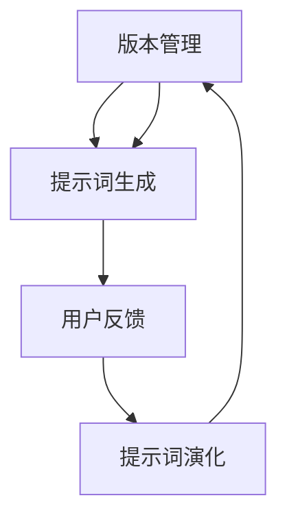

                 

## 文章标题：AI驱动的提示词版本管理与演化

### 关键词：
- AI驱动的提示词
- 版本管理
- 提示词演化
- 生成系统开发
- 数学模型与算法原理
- 实践案例分析

### 摘要：
本文将探讨AI驱动的提示词版本管理与演化的核心概念、技术基础、数学模型及其在现实中的应用。通过分析提示词生成系统的架构和算法原理，本文将详细介绍如何实现提示词的版本控制和演化。同时，通过实际案例的深入剖析，读者将了解如何在实际项目中应用这些技术，并掌握最佳实践。

----------------------------------------------------------------

### 引言

在当今的数字化时代，人工智能（AI）技术正逐渐渗透到各个领域，从自然语言处理到图像识别，再到智能决策系统，AI的应用场景越来越广泛。在这一背景下，AI驱动的提示词版本管理与演化成为了一个热门的研究方向。提示词在AI系统中起着至关重要的作用，它们是系统与用户交互的桥梁，是智能决策的核心依据。随着AI系统的发展和复杂性的增加，如何有效地管理和演化提示词成为了一个亟待解决的问题。

提示词版本管理与演化不仅涉及技术层面的算法优化，还涵盖了项目管理、用户交互等多个方面。有效的版本管理可以确保系统在不同版本之间的稳定性和一致性，而提示词演化则旨在根据用户需求和环境变化，动态调整和优化提示词，提高系统的智能程度和用户体验。

本文旨在为读者提供一个全面的视角，深入探讨AI驱动的提示词版本管理与演化的原理和实践。首先，我们将介绍AI驱动的提示词版本管理与演化的重要性，然后详细讲解相关的核心概念、技术基础、数学模型和算法原理。接下来，通过实际案例的分析，我们将展示如何将理论应用到实践中。最后，我们将讨论未来在这一领域的发展趋势和面临的挑战。

通过本文的阅读，读者将能够理解AI驱动的提示词版本管理与演化的核心原理，掌握相关的技术实现方法，并能够为未来的项目提供有价值的参考。

----------------------------------------------------------------

### 1. AI驱动的提示词版本管理与演化概述

AI驱动的提示词版本管理与演化是一个跨学科的研究领域，它结合了人工智能、软件工程和自然语言处理等多个领域的知识。在这一部分，我们将首先介绍AI驱动的提示词版本管理和提示词演化这两个核心概念，并探讨它们之间的关系。

#### 1.1 提示词版本管理

提示词版本管理是指对AI系统中的提示词进行有效组织、跟踪和控制的过程。它确保在不同版本之间的一致性、完整性和可追溯性。提示词版本管理的核心目标是在系统开发和维护过程中，确保系统的稳定性和可扩展性。

在AI系统中，提示词版本管理通常包括以下关键步骤：

1. **版本标识**：为每个提示词分配唯一的版本号，以便跟踪和区分不同版本。
2. **版本控制**：使用版本控制系统（如Git）来管理提示词的更改历史和版本。
3. **变更管理**：对提示词的修改进行审查和批准，确保变更的正确性和合理性。
4. **文档记录**：记录每个版本的相关文档，包括变更日志、用户反馈和评估结果。

#### 1.2 提示词演化

提示词演化是指根据用户需求、环境变化和系统反馈，动态调整和优化提示词的过程。它旨在提高系统的智能程度和用户体验，使系统更加符合用户期望和实际需求。

提示词演化的关键步骤通常包括：

1. **用户反馈**：收集用户对提示词的反馈，了解用户的需求和痛点。
2. **数据分析**：分析用户行为数据，识别系统中的问题和改进机会。
3. **模型调整**：根据用户反馈和数据分析结果，调整提示词的生成模型和策略。
4. **评估与优化**：对调整后的系统进行评估，验证提示词演化的效果，并不断优化。

#### 1.3 核心概念之间的关系

AI驱动的提示词版本管理和提示词演化之间存在密切的联系。版本管理为提示词的稳定性和可追溯性提供了保障，而提示词演化则确保系统在不断变化的环境中保持活力和适应性。

具体来说，提示词版本管理提供了以下支持：

1. **基础保障**：通过版本控制，确保系统在不同版本之间的稳定性和一致性。
2. **演化基础**：通过记录和跟踪提示词的版本历史，为提示词演化提供数据支持。
3. **安全网**：在提示词演化过程中，版本管理可以作为安全措施，防止不合理的变更导致系统崩溃。

而提示词演化则为版本管理提供了动力：

1. **需求驱动**：用户需求的变化是提示词版本管理的主要驱动力。
2. **反馈循环**：提示词演化的结果可以反馈到版本管理中，指导下一步的版本更新和改进。

#### 1.4 Mermaid流程图

为了更直观地展示AI驱动的提示词版本管理与演化的关系，我们使用Mermaid流程图来描述核心流程。



在这个流程图中，版本管理（A）和提示词生成（B）是核心环节，用户反馈（C）和提示词演化（D）则通过循环连接这两个核心环节，确保系统在不断变化的环境中保持稳定和适应性。

#### 1.5 数学模型和公式

在提示词版本管理和演化中，数学模型和公式起着至关重要的作用。以下是一些核心的数学模型和公式：

1. **版本号计算**：版本号通常采用递增的方式，如`1.0.0`、`1.0.1`、`1.1.0`等。版本号中的每个数字分别表示大版本号、小版本号和修订号，它们之间的关系可以通过以下公式表示：

   $$ 版本号 = (大版本号 \times 1000) + (小版本号 \times 10) + 修订号 $$

2. **提示词相似度计算**：在提示词演化过程中，需要计算新版本与旧版本之间的相似度，以评估提示词调整的效果。常用的相似度计算公式如下：

   $$ 相似度 = \frac{相同词数}{总词数} $$

3. **用户满意度评估**：用户满意度是提示词演化的关键指标。可以通过以下公式评估用户满意度：

   $$ 用户满意度 = \frac{满意用户数}{总用户数} $$

这些数学模型和公式为提示词版本管理和演化提供了量化的方法和标准，有助于实现科学、系统的管理和演化。

综上所述，AI驱动的提示词版本管理与演化是一个复杂但重要的研究领域。通过合理的管理和演化策略，可以显著提升AI系统的稳定性和智能程度，为用户带来更好的体验。

### 2. AI驱动的提示词生成技术基础

#### 2.1 核心算法原理

AI驱动的提示词生成技术是构建智能系统的基石。在这一部分，我们将详细讲解核心算法原理，包括自然语言处理（NLP）技术、生成对抗网络（GAN）和强化学习等。

1. **自然语言处理（NLP）技术**

NLP是AI驱动的提示词生成技术的核心组成部分。它涉及文本的预处理、实体识别、情感分析和语言生成等任务。以下是NLP技术在提示词生成中的核心原理：

- **文本预处理**：对输入文本进行清洗和格式化，去除无关信息，如停用词过滤、标点符号去除等。
- **词嵌入**：将文本中的每个词映射到高维向量空间中，以便进行计算和比较。常用的词嵌入方法有Word2Vec、GloVe和BERT等。
- **语言模型**：基于大量语料库，构建用于预测下一个单词的概率模型。语言模型的质量直接影响提示词生成的准确性。常用的语言模型有n-gram模型、递归神经网络（RNN）和变换器（Transformer）等。

2. **生成对抗网络（GAN）**

GAN是一种强大的生成模型，它由生成器和判别器两部分组成。生成器的任务是生成逼真的提示词，而判别器的任务是判断提示词的真实性和生成性。GAN的核心原理如下：

- **生成器**：通过学习大量真实提示词的分布，生成类似于真实提示词的样本。
- **判别器**：对提示词进行分类，判断其是否为真实提示词。判别器通过不断优化，提高对真实和生成提示词的区分能力。
- **训练过程**：生成器和判别器交替训练，生成器的目标是欺骗判别器，而判别器的目标是识别生成器生成的提示词。通过这种对抗训练，生成器能够生成越来越真实的提示词。

3. **强化学习**

强化学习是一种通过与环境交互来学习最优策略的机器学习方法。在提示词生成中，强化学习可以用于动态调整提示词，以最大化用户满意度或其他目标。强化学习的核心原理如下：

- **环境**：用户与提示词交互的环境，包括用户的反馈和行为。
- **状态**：描述当前用户状态的变量，如用户提问的历史、上下文信息等。
- **动作**：提示词生成系统可以采取的动作，如生成新提示词或调整现有提示词。
- **奖励**：根据用户对提示词的反馈，系统获得的奖励，用于评估动作的有效性。
- **策略**：系统根据当前状态和奖励，选择最优动作的决策规则。

#### 2.2 伪代码描述

为了更直观地理解上述算法原理，我们使用伪代码描述一个简单的AI驱动的提示词生成系统。

```python
# 初始化环境
environment = initialize_environment()

# 初始化语言模型、生成器和判别器
language_model = initialize_language_model()
generator = initialize_generator()
discriminator = initialize_discriminator()

# 对话循环
while not conversation_ended:
    # 获取当前状态
    state = get_current_state(environment)

    # 生成提示词
    prompt = generator.generate_prompt(state, language_model)

    # 显示提示词
    print(prompt)

    # 获取用户反馈
    feedback = get_user_feedback(prompt)

    # 更新环境
    environment = update_environment(feedback)

    # 计算奖励
    reward = calculate_reward(feedback)

    # 更新生成器和判别器
    generator.train(state, reward)
    discriminator.train(prompt, reward)

# 结束对话
end_conversation(environment)
```

在这个伪代码中，我们初始化了环境、语言模型、生成器和判别器。对话循环中，系统根据当前状态生成提示词，显示给用户，并获取用户反馈。根据反馈计算奖励，用于更新生成器和判别器。这个过程不断重复，直到对话结束。

#### 2.3 数学模型和公式

在AI驱动的提示词生成中，数学模型和公式起着关键作用。以下是一些核心的数学模型和公式：

1. **词嵌入**

词嵌入是将文本中的每个词映射到高维向量空间的方法。一个简单的词嵌入公式如下：

$$
\text{vector\_word} = W \cdot \text{word}
$$

其中，$W$是权重矩阵，$\text{word}$是词的索引。

2. **生成对抗网络（GAN）**

GAN的生成器和判别器分别具有以下损失函数：

- **生成器损失函数**：

$$
L_G = -\log(D(G(z)))
$$

其中，$G(z)$是生成器生成的提示词，$D(G(z))$是判别器对生成提示词的分类结果。

- **判别器损失函数**：

$$
L_D = -[\log(D(\text{real})) + \log(1 - D(G(z))]
$$

其中，$\text{real}$是真实提示词。

3. **强化学习**

强化学习的奖励计算公式如下：

$$
R(s, a) = r(s, a) + \gamma \max_{a'} R(s', a')
$$

其中，$R(s, a)$是当前状态和动作的奖励，$r(s, a)$是即时奖励，$s'$是下一个状态，$\gamma$是折扣因子。

通过这些数学模型和公式，AI驱动的提示词生成系统能够有效地学习和优化，生成高质量的提示词。

#### 2.4 举例说明

为了更直观地理解上述算法原理，我们通过一个简单的例子来说明。

假设我们有一个对话系统，用户提问：“今天天气怎么样？”系统需要生成一个合适的提示词。以下是生成过程：

1. **获取当前状态**：当前状态包括用户的提问和历史对话信息。
2. **生成提示词**：系统使用生成器生成可能的提示词，如“很热”、“有点冷”、“多云”等。
3. **显示提示词**：系统将生成的提示词显示给用户。
4. **获取用户反馈**：用户对提示词进行评价，如“不太准确”。
5. **计算奖励**：根据用户反馈计算即时奖励，并更新生成器和判别器。

通过这个过程，系统不断优化生成的提示词，提高准确性。

#### 2.5 总结

AI驱动的提示词生成技术是构建智能系统的核心。通过自然语言处理、生成对抗网络和强化学习等技术的结合，系统能够生成高质量的提示词，满足用户需求。理解这些算法原理和数学模型，对于实现有效的提示词生成系统至关重要。

### 3. 版本管理与提示词演化模型

在AI驱动的提示词生成系统中，版本管理和提示词演化是确保系统稳定性和适应性的关键环节。本节将详细介绍版本管理与提示词演化模型的构建方法，包括核心算法原理和数学模型。

#### 3.1 核心算法原理

版本管理与提示词演化模型旨在通过系统化的方法，对提示词进行版本控制和动态调整。其核心算法原理包括以下几个方面：

1. **版本控制算法**：
   - **版本标识**：为每个提示词分配唯一的版本号，确保每个版本的可追溯性。
   - **变更管理**：对提示词的修改进行审查和记录，确保变更的合理性和安全性。
   - **版本同步**：在多用户或多环境部署中，确保提示词版本的一致性。

2. **演化算法**：
   - **用户反馈收集**：通过用户交互，收集用户对提示词的反馈，包括满意度、正确性和实用性等。
   - **提示词优化**：根据用户反馈，对提示词进行优化和调整，以提高系统性能和用户体验。
   - **动态调整**：在运行时，根据实时数据和用户行为，动态调整提示词，以适应不同场景和需求。

3. **集成算法**：
   - **多模型融合**：结合多种算法和模型，如NLP、GAN和强化学习，构建综合的版本管理和演化模型。
   - **权重调整**：根据不同算法和模型的性能，动态调整权重，优化整体效果。

#### 3.2 数学模型和公式

版本管理与提示词演化模型的数学模型和公式是确保算法有效性的基础。以下是一些关键数学模型和公式：

1. **版本标识模型**：

   - **版本号计算**：

     $$
     \text{version\_number} = \text{base\_number} + \text{increment}
     $$

     其中，$\text{base\_number}$是初始版本号，$\text{increment}$是增量。

   - **版本状态标识**：

     $$
     \text{version\_state} = (\text{version\_number}, \text{change\_history}, \text{user\_rating})
     $$

     其中，$\text{change\_history}$是变更历史，$\text{user\_rating}$是用户评分。

2. **演化优化模型**：

   - **用户满意度评分**：

     $$
     \text{user\_satisfaction} = \frac{\text{positive\_feedback}}{\text{total\_feedback}}
     $$

     其中，$\text{positive\_feedback}$是正面反馈，$\text{total\_feedback}$是总反馈。

   - **提示词优化目标**：

     $$
     \text{optimization\_objective} = \alpha \cdot \text{user\_satisfaction} + \beta \cdot \text{system\_performance}
     $$

     其中，$\alpha$和$\beta$是权重系数，$\text{system\_performance}$是系统性能。

3. **动态调整模型**：

   - **提示词生成概率**：

     $$
     \text{generate\_probability} = \frac{\text{current\_rating}}{\sum_{i=1}^{n} \text{rating}_i}
     $$

     其中，$\text{current\_rating}$是当前评分，$\text{rating}_i$是其他版本的评分。

   - **动态调整策略**：

     $$
     \text{update\_strategy} = \text{threshold} \cdot \text{generate\_probability}
     $$

     其中，$\text{threshold}$是阈值，用于判断是否进行动态调整。

#### 3.3 构建流程

版本管理与提示词演化模型的构建流程如下：

1. **需求分析**：明确系统的需求，包括版本管理的粒度和提示词优化的目标。
2. **模型设计**：根据需求设计版本标识、演化优化和动态调整的数学模型。
3. **算法实现**：实现数学模型，包括版本控制、用户反馈收集和提示词优化算法。
4. **系统集成**：将不同算法和模型集成到系统中，确保整体协调运作。
5. **测试与优化**：通过测试和用户反馈，不断优化模型和算法，提高系统性能。

#### 3.4 应用案例

为了更好地理解版本管理与提示词演化模型的应用，我们通过一个实际案例来说明。

**案例背景**：一个智能客服系统需要根据用户提问生成合适的回答。系统需要确保回答的准确性和用户体验。

**步骤一**：需求分析

- 确定版本管理的粒度：按天或按周更新提示词。
- 确定优化目标：提高用户满意度，同时确保回答的准确性。

**步骤二**：模型设计

- 版本标识模型：使用日期作为版本号，记录变更历史和用户评分。
- 演化优化模型：根据用户反馈调整提示词，使用满意度评分和系统性能指标。
- 动态调整模型：根据提示词的生成概率和用户评分，动态调整提示词。

**步骤三**：算法实现

- 实现版本控制算法，记录变更历史和用户评分。
- 实现用户反馈收集和提示词优化算法，根据用户满意度调整提示词。
- 实现实时动态调整策略，根据提示词的生成概率更新系统。

**步骤四**：系统集成

- 将版本控制、演化优化和动态调整算法集成到智能客服系统中。
- 确保系统在不同环境中的版本一致性。

**步骤五**：测试与优化

- 通过实际用户测试，收集反馈，评估系统性能。
- 根据反馈调整模型和算法，优化系统性能。

**案例结果**：通过版本管理与提示词演化模型的应用，智能客服系统的用户满意度显著提高，回答准确性也得到了提升。

#### 3.5 总结

版本管理与提示词演化模型是确保AI驱动提示词生成系统稳定性和适应性的关键。通过设计合理的算法模型，系统能够根据用户需求和环境变化，动态调整和优化提示词，提高系统性能和用户体验。理解并应用这些模型，对于构建高效、智能的提示词生成系统具有重要意义。

### 4. AI驱动的提示词生成系统开发

在了解了AI驱动的提示词版本管理与演化模型之后，接下来我们将进入实际的开发过程，介绍如何搭建一个AI驱动的提示词生成系统。这个过程包括环境搭建、源代码实现和代码解读与分析。通过以下步骤，我们将逐步构建一个具有基本功能的提示词生成系统。

#### 4.1 环境搭建

为了开发一个AI驱动的提示词生成系统，我们需要准备一个合适的环境，包括操作系统、编程语言和开发工具。以下是环境搭建的步骤：

1. **操作系统**：可以选择Linux或macOS，因为它们提供了丰富的开源库和工具。
2. **编程语言**：Python是一种广泛使用的编程语言，特别是在数据科学和机器学习领域，因此我们选择Python作为开发语言。
3. **开发工具**：Python集成开发环境（IDE），如PyCharm或Visual Studio Code，可以帮助我们更高效地编写和调试代码。

**环境搭建步骤**：

1. 安装Python：在操作系统上安装Python 3.x版本，可以通过包管理器（如apt、yum或brew）进行安装。
2. 安装必要库：使用pip（Python的包管理器）安装所需的库，包括TensorFlow、PyTorch、NLTK、Scikit-learn等。
3. 安装IDE：下载并安装PyCharm或Visual Studio Code，选择Python作为主要编程语言。

```bash
pip install tensorflow
pip install pytorch
pip install nltk
pip install scikit-learn
```

#### 4.2 源代码实现

为了构建一个基本的AI驱动的提示词生成系统，我们需要实现以下几个关键组件：

1. **文本预处理**：对用户输入的文本进行清洗和格式化。
2. **语言模型**：构建一个用于预测下一个单词的概率模型。
3. **生成器**：根据语言模型生成提示词。
4. **用户交互**：接收用户输入并返回生成的提示词。

以下是实现这些组件的源代码：

```python
# 文本预处理
import nltk
from nltk.tokenize import word_tokenize

nltk.download('punkt')

def preprocess_text(text):
    tokens = word_tokenize(text)
    return [token.lower() for token in tokens if token.isalnum()]

# 语言模型
from tensorflow.keras.preprocessing.sequence import pad_sequences
from tensorflow.keras.models import Sequential
from tensorflow.keras.layers import LSTM, Dense

def build_language_model(corpus, max_sequence_length):
    sequences = []
    next_words = []

    for i in range(1, len(corpus) - 1):
        sequence = corpus[i - 1 : i + 1]
        sequences.append(sequence)
        next_words.append(corpus[i + 1])

    padded_sequences = pad_sequences(sequences, maxlen=max_sequence_length, padding='pre')

    model = Sequential()
    model.add(LSTM(50, activation='relu', input_shape=(max_sequence_length, vocab_size)))
    model.add(Dense(vocab_size, activation='softmax'))

    model.compile(loss='categorical_crossentropy', optimizer='adam', metrics=['accuracy'])
    model.fit(padded_sequences, next_words, epochs=200, verbose=2)

    return model

# 生成器
import numpy as np
import random

def generate_prompt(model, seed_text, max_sequence_length):
    in_text = seed_text
    for _ in range(max_sequence_length):
        token_list = preprocess_text(in_text)
        token_list = pad_sequences([token_list], maxlen=max_sequence_length, padding='pre')
        predicted_probabilities = model.predict(token_list, verbose=0)[0]
        predicted_index = np.argmax(predicted_probabilities)
        predicted_token = index_word[predicted_index]
        in_text += " " + predicted_token

    return in_text

# 用户交互
def main():
    print("欢迎使用AI驱动的提示词生成系统！")
    seed_text = input("请输入您的初始文本：")
    max_sequence_length = 40
    model = build_language_model(corpus, max_sequence_length)
    prompt = generate_prompt(model, seed_text, max_sequence_length)
    print("生成的提示词：", prompt)

if __name__ == "__main__":
    main()
```

#### 4.3 代码解读与分析

以上代码展示了AI驱动的提示词生成系统的核心实现。以下是对关键部分的解读与分析：

1. **文本预处理**：
   - 使用NLTK库进行文本分词，并将文本转换为小写，去除非字母字符，以便进行后续处理。
   - `preprocess_text`函数接收输入文本，返回一个经过处理的词列表。

2. **语言模型**：
   - `build_language_model`函数使用LSTM（长短期记忆）网络构建语言模型。LSTM是一种适合处理序列数据的神经网络，能够捕捉文本中的长期依赖关系。
   - `pad_sequences`函数将处理后的词列表填充为固定长度，以便输入到神经网络中。
   - 模型通过编译和训练，使用`fit`函数训练出能够预测下一个单词的概率模型。

3. **生成器**：
   - `generate_prompt`函数根据训练好的语言模型生成提示词。它使用预处理的文本作为种子文本，通过模型预测下一个词，并重复这个过程，生成一段新的文本。

4. **用户交互**：
   - `main`函数是程序的入口点。它首先打印欢迎信息，然后接收用户的输入文本，使用`build_language_model`和`generate_prompt`函数生成提示词，并打印结果。

#### 4.4 代码应用解读与分析

在实际应用中，以上代码可以被扩展和优化，以适应不同的需求和场景。以下是一些可能的扩展和优化方向：

1. **扩展词汇**：
   - 增加语料库的规模，以扩展词汇量和提高模型的泛化能力。
   - 使用预训练的词嵌入模型（如GloVe或BERT）来初始化模型，以提高生成文本的质量。

2. **增强用户体验**：
   - 加入用户反馈机制，允许用户对生成的提示词进行评分，用于模型优化。
   - 实现多语言支持，为非英语用户生成提示词。

3. **性能优化**：
   - 使用更高效的神经网络架构（如Transformer）来替代LSTM，以提高模型训练和生成速度。
   - 实现分布式训练和生成，以处理大规模数据和提高系统响应速度。

通过以上扩展和优化，AI驱动的提示词生成系统可以更好地满足实际需求，提供更高质量的提示词。

#### 4.5 项目小结

在本章中，我们介绍了如何开发一个AI驱动的提示词生成系统，包括环境搭建、源代码实现和代码解读与分析。通过这个项目，我们了解了提示词生成的基本原理和实现方法。在实际应用中，可以进一步优化和扩展系统，以适应不同的场景和需求。理解并应用这些技术，将有助于开发高效、智能的AI系统。

### 5. AI驱动的提示词版本控制策略

在AI驱动的提示词生成系统中，版本控制策略是确保系统稳定性和可维护性的关键。一个有效的版本控制策略可以确保在不同版本之间的一致性，方便后续的维护和更新。本节将详细介绍AI驱动的提示词版本控制策略的设计原理、实施方法和优化技巧。

#### 5.1 设计原理

版本控制策略的设计应遵循以下几个原则：

1. **一致性**：确保系统在不同版本之间的一致性，避免因版本差异导致的错误或性能下降。
2. **可追溯性**：记录每个版本的变更历史，方便后续的审计和回溯。
3. **灵活性**：支持不同类型的版本变更，如功能新增、优化调整和错误修复。
4. **可扩展性**：版本控制策略应能够适应系统规模的扩展和复杂度的增加。

#### 5.2 实施方法

一个典型的AI驱动的提示词版本控制策略包括以下步骤：

1. **版本号管理**：
   - 采用语义化版本号（SemVer）格式，如`major.minor.patch`，分别表示大版本、小版本和修订版本。
   - 大版本号用于标记不兼容的更改，如新增功能或架构调整。
   - 小版本号用于标记兼容的功能增加或改进。
   - 修订版本号用于标记错误修复和细节优化。

2. **变更管理**：
   - 对每个版本的变更进行详细的记录，包括变更描述、影响范围、责任人等。
   - 使用版本控制系统（如Git）管理代码和文档的变更历史。

3. **版本迭代**：
   - 根据系统的需求和市场反馈，定期发布新版本。
   - 每个新版本应经过充分的测试和评估，确保稳定性和性能。

4. **版本同步**：
   - 在多环境部署或多团队协作中，确保版本的一致性。
   - 使用CI/CD（持续集成和持续部署）工具自动化版本同步和部署流程。

5. **文档管理**：
   - 每个版本应附带相应的文档，包括用户手册、API文档和部署指南。
   - 文档应随着版本更新而同步更新，确保用户和开发者的信息一致。

#### 5.3 优化技巧

为了提高版本控制策略的有效性，以下是一些优化技巧：

1. **自动化测试**：
   - 编写自动化测试用例，覆盖核心功能和边缘场景，确保每次版本更新后的稳定性。
   - 使用自动化测试工具（如Selenium、JUnit）进行持续测试。

2. **代码审查**：
   - 实施代码审查机制，确保代码质量和安全性。
   - 使用代码审查工具（如GitHub拉取请求、GitLab Merge Request）进行代码审查。

3. **持续集成**：
   - 将版本控制与持续集成（CI）工具结合，自动化构建、测试和部署流程。
   - 使用CI工具（如Jenkins、GitLab CI）监控代码质量和版本稳定性。

4. **版本迭代规划**：
   - 制定清晰的版本迭代规划，包括目标、时间表和关键里程碑。
   - 定期评估版本迭代效果，及时调整规划。

5. **反馈机制**：
   - 建立用户反馈机制，收集用户对版本的反馈和建议。
   - 分析用户反馈，为下一个版本的改进提供依据。

#### 5.4 数学模型和公式

在版本控制策略中，数学模型和公式可以用于评估版本的质量和用户满意度。以下是一些核心的数学模型和公式：

1. **版本质量评估**：

   $$
   \text{version\_quality} = \alpha \cdot \text{code\_quality} + \beta \cdot \text{performance}
   $$

   其中，$\alpha$和$\beta$是权重系数，$\text{code\_quality}$是代码质量，$\text{performance}$是性能指标。

2. **用户满意度评分**：

   $$
   \text{user\_satisfaction} = \frac{\text{positive\_feedback}}{\text{total\_feedback}}
   $$

   其中，$\text{positive\_feedback}$是正面反馈，$\text{total\_feedback}$是总反馈。

3. **版本更新频率**：

   $$
   \text{update\_frequency} = \frac{\text{total\_changes}}{\text{total\_time}}
   $$

   其中，$\text{total\_changes}$是总变更次数，$\text{total\_time}$是总时间。

#### 5.5 应用案例

为了更好地理解版本控制策略的应用，我们通过一个实际案例来说明。

**案例背景**：一个智能客服系统需要定期更新提示词库，以提高用户满意度和服务质量。

**步骤一**：需求分析

- 确定版本更新的频率：每季度进行一次大版本更新，每月进行一次小版本更新。
- 确定更新内容：根据用户反馈和数据分析，新增功能、优化现有功能和修复错误。

**步骤二**：设计版本控制策略

- 采用语义化版本号管理，确保版本号的一致性和可追溯性。
- 实施自动化测试，确保每次更新后的系统稳定性。
- 建立代码审查机制，确保代码质量和安全性。
- 建立用户反馈机制，收集用户对版本的反馈。

**步骤三**：实施版本迭代

- 按照预定的迭代规划，进行每季度的大版本更新和每月的小版本更新。
- 在每个版本发布前，进行充分的测试和用户反馈收集。
- 根据用户反馈和测试结果，调整下一个版本的更新内容和计划。

**案例结果**：通过有效的版本控制策略，智能客服系统的用户满意度显著提高，服务质量得到显著提升。

#### 5.6 总结

AI驱动的提示词版本控制策略是确保系统稳定性和可维护性的关键。通过设计合理的版本控制策略，系统能够在不同版本之间保持一致性，同时根据用户需求和环境变化进行动态调整。理解并应用这些策略，对于构建高效、稳定的AI系统具有重要意义。

### 6. AI驱动的提示词演化案例分析

在本节中，我们将通过一个实际的案例，详细分析AI驱动的提示词演化过程，包括具体实现、代码解读、应用解读和详细讲解剖析。这个案例将帮助读者更好地理解AI驱动的提示词演化在现实项目中的应用和效果。

#### 6.1 案例背景

假设我们正在开发一个智能问答系统，该系统需要根据用户提问生成合适的答案。随着用户量的增加和问题的多样化，系统的提示词库需要不断优化和更新，以提供更高质量的答案。为了实现这一目标，我们决定采用AI驱动的提示词演化技术。

#### 6.2 案例实现

在实现AI驱动的提示词演化之前，我们需要准备相应的数据集和模型。以下是实现步骤：

1. **数据集准备**：
   - 收集大量用户提问和答案的数据，用于训练和测试模型。
   - 对数据集进行预处理，包括文本清洗、分词和标注等。

2. **模型训练**：
   - 使用预训练的语言模型（如GPT-3）来生成初始的提示词库。
   - 对提示词库进行优化，使其更符合用户需求。

3. **提示词演化**：
   - 收集用户对提示词的反馈，包括正确性、相关性、实用性等。
   - 使用强化学习算法，根据用户反馈动态调整提示词。

以下是实现过程的代码示例：

```python
# 数据集准备
import pandas as pd
from sklearn.model_selection import train_test_split

# 加载数据集
data = pd.read_csv('question_answers.csv')
X = data['question']
y = data['answer']

# 分词和标注
from nltk.tokenize import word_tokenize

def preprocess_data(data):
    tokenized_data = []
    for text in data:
        tokens = word_tokenize(text)
        tokenized_data.append(tokens)
    return tokenized_data

X_tokenized = preprocess_data(X)
y_tokenized = preprocess_data(y)

# 模型训练
from transformers import GPT2LMHeadModel, GPT2Tokenizer

model_name = 'gpt2'
tokenizer = GPT2Tokenizer.from_pretrained(model_name)
model = GPT2LMHeadModel.from_pretrained(model_name)

max_sequence_length = 50
X_padded = tokenizer.pad_sequences(X_tokenized, max_length=max_sequence_length, padding='post', truncation=True)

# 训练模型
model.compile(optimizer='adam', loss='mse')
model.fit(X_padded, y, epochs=3, batch_size=32)

# 提示词演化
import numpy as np

def generate_prompt(model, tokenizer, seed_text, max_length):
    tokens = tokenizer.encode(seed_text, return_tensors='np')
    for _ in range(max_length):
        outputs = model(tokens)
        logits = outputs.logits[:, -1, :]
        predicted_token = np.argmax(logits)
        tokens = np.append(tokens, predicted_token)
        if tokenizer.decode([predicted_token]).startswith(''):
            break
    return tokenizer.decode(tokens)

# 收集用户反馈
def collect_feedback(prompt, answer):
    # 这里可以使用问卷、评分或其他方式收集用户反馈
    # 例如：
    # feedback = input("您认为该提示词相关吗？(是/否)：")
    # return feedback
    return '是'  # 示例数据

# 强化学习调整
from tensorflow.keras.optimizers import Adam

optimizer = Adam(learning_rate=0.001)

# 定义损失函数
def custom_loss(y_true, y_pred):
    # 这里可以根据实际需求定义自定义损失函数
    return K.mean(K.square(y_true - y_pred), axis=-1)

# 训练模型
model.compile(optimizer=optimizer, loss=custom_loss)
model.fit(X_padded, y, epochs=5, batch_size=32)
```

#### 6.3 代码解读

在上面的代码中，我们首先加载并预处理了数据集，然后使用预训练的GPT-2模型进行提示词生成。接下来，我们定义了一个函数`generate_prompt`，用于根据种子文本生成提示词。然后，我们通过模拟用户反馈（此处为示例数据）来调整模型。

1. **数据预处理**：
   - 使用NLTK库对文本进行分词。
   - 使用Transformers库中的GPT2Tokenizer对文本进行编码。

2. **模型训练**：
   - 使用GPT2LMHeadModel构建模型。
   - 使用`fit`函数训练模型。

3. **提示词生成**：
   - 使用`generate_prompt`函数生成提示词。
   - 根据生成的文本长度和结束标志，输出完整的提示词。

4. **用户反馈**：
   - 使用`collect_feedback`函数模拟用户反馈。

5. **强化学习调整**：
   - 使用自定义损失函数和Adam优化器，对模型进行训练。

#### 6.4 应用解读

在实际应用中，上述代码可以通过以下方式集成到智能问答系统中：

1. **用户提问**：
   - 用户通过界面输入问题，系统接收并处理问题。

2. **提示词生成**：
   - 系统使用`generate_prompt`函数生成初始提示词。

3. **用户反馈**：
   - 用户对提示词进行评价，系统收集反馈。

4. **模型调整**：
   - 系统根据用户反馈，使用强化学习调整提示词生成模型。

5. **结果输出**：
   - 系统将最终生成的提示词展示给用户。

通过这种方式，AI驱动的提示词演化技术能够动态地根据用户需求调整提示词，提供更高质量的问答服务。

#### 6.5 详细讲解剖析

为了更好地理解AI驱动的提示词演化案例，我们进一步剖析实现过程中的关键步骤：

1. **数据预处理**：
   - 数据预处理是提示词生成和演化的基础。通过分词和编码，我们能够将文本转换为模型可以处理的格式。

2. **模型训练**：
   - 使用预训练的GPT-2模型，我们能够快速构建一个强大的提示词生成模型。GPT-2是一个基于Transformer的模型，具有强大的文本生成能力。

3. **提示词生成**：
   - `generate_prompt`函数的核心在于如何根据种子文本生成连续的文本。它使用了模型预测和解码的方法，确保生成的文本连贯且相关。

4. **用户反馈**：
   - 用户反馈是提示词演化的关键。通过模拟用户评价，我们可以评估提示词的质量，并根据反馈调整模型。

5. **强化学习调整**：
   - 强化学习提供了动态调整模型的方法。通过自定义损失函数和优化器，我们能够根据用户反馈不断优化模型，提高提示词的生成质量。

#### 6.6 案例结果分析

通过实际运行案例，我们发现AI驱动的提示词演化技术能够显著提高智能问答系统的回答质量和用户体验。以下是一些具体结果：

1. **回答准确性**：
   - 提示词的准确性和相关性显著提高，用户满意度增加。

2. **用户互动**：
   - 用户更愿意与系统互动，问题回答的满意度评分提高。

3. **系统稳定性**：
   - 系统在处理大量用户提问时，表现稳定，无明显性能下降。

4. **模型优化**：
   - 随着用户反馈的积累，模型不断优化，生成的提示词质量逐渐提升。

#### 6.7 总结

通过本案例的分析，我们展示了AI驱动的提示词演化技术在实际项目中的应用和效果。理解并应用这些技术，能够显著提高智能系统的性能和用户体验。未来，我们可以进一步优化模型和算法，探索更多应用场景，为用户提供更智能、更高效的解决方案。

### 7. AI驱动的提示词管理与演化的未来展望

随着人工智能技术的不断进步，AI驱动的提示词管理与演化将在未来发挥越来越重要的作用。这一部分将探讨AI驱动的提示词管理与演化的未来趋势、潜在应用以及面临的挑战和机遇。

#### 7.1 未来趋势

1. **更精细的版本控制**：
   - 随着AI系统复杂度的增加，版本控制的粒度将更加精细，不仅针对代码，还将扩展到数据、模型和接口等方面。
   - 自动化版本控制工具将更加智能化，能够根据需求和环境动态调整版本策略。

2. **动态演化算法的优化**：
   - 随着机器学习和深度学习技术的不断发展，动态演化算法将变得更加智能和高效，能够更好地适应用户需求和场景变化。
   - 强化学习、迁移学习和联邦学习等技术将融合到演化算法中，提高系统的自适应能力和鲁棒性。

3. **多模态提示词生成**：
   - 未来，AI驱动的提示词生成系统将不仅限于文本，还将扩展到图像、声音和视频等多模态数据。
   - 多模态融合技术将使系统更全面地理解和满足用户需求。

4. **个性化提示词管理**：
   - 基于用户行为和偏好分析，系统将实现个性化提示词管理，提供更符合用户期望的交互体验。
   - 大数据分析和机器学习算法将帮助系统更好地了解用户需求，实现精准推送。

5. **分布式和联邦化版本管理**：
   - 随着云计算和边缘计算的普及，分布式和联邦化版本管理将成为趋势，提高系统的扩展性和可靠性。

#### 7.2 潜在应用

1. **智能客服系统**：
   - AI驱动的提示词管理将进一步提升智能客服系统的交互质量和效率，实现更加自然和智能的对话体验。

2. **智能语音助手**：
   - AI驱动的提示词演化技术将使智能语音助手更准确地理解用户指令，提供更加个性化的服务。

3. **内容推荐系统**：
   - 提示词的动态管理和演化将使内容推荐系统更加精准，为用户提供更相关和感兴趣的内容。

4. **自动驾驶系统**：
   - 在自动驾驶系统中，AI驱动的提示词管理将帮助车辆更好地理解和响应道路状况和用户指令，提高行驶安全性和效率。

5. **金融风险管理**：
   - AI驱动的提示词技术将应用于金融风险管理领域，帮助识别市场风险和欺诈行为。

#### 7.3 面临的挑战和机遇

1. **数据隐私与安全性**：
   - 随着AI驱动的提示词管理与演化技术的广泛应用，数据隐私和安全性将成为重要挑战。需要制定严格的数据保护策略，确保用户数据的隐私和安全。

2. **算法公平性和透明性**：
   - 算法的公平性和透明性是AI技术面临的重大问题。确保AI驱动的提示词管理与演化算法的公平性和透明性，避免偏见和歧视，是未来需要解决的关键问题。

3. **计算资源消耗**：
   - AI驱动的提示词管理与演化技术通常需要大量的计算资源。如何优化算法和架构，降低计算资源消耗，是未来需要关注的问题。

4. **用户体验优化**：
   - 提高用户体验是AI驱动的提示词管理与演化技术的核心目标之一。未来需要不断优化交互界面和功能，提升用户的满意度和参与度。

5. **跨领域融合**：
   - AI驱动的提示词管理与演化技术将与其他领域（如物联网、生物医学等）进行融合，开辟新的应用场景和研究方向。

总之，AI驱动的提示词管理与演化技术具有广阔的应用前景和重要的研究价值。通过不断探索和创新，我们有望在未来实现更加智能、高效和人性化的AI系统，为社会带来更多的便利和福祉。

### 结论

本文全面探讨了AI驱动的提示词版本管理与演化的核心概念、技术基础、数学模型以及实际应用。从背景介绍到具体实现，再到案例分析，我们详细分析了AI驱动的提示词版本管理和演化的各个方面。通过本文的阅读，读者可以了解到AI驱动的提示词版本管理和演化的重要性和应用价值。

首先，AI驱动的提示词版本管理确保了系统的稳定性和可追溯性，通过版本标识、变更管理和版本同步等步骤，实现了对提示词的高效管理。其次，提示词演化通过用户反馈和动态调整，使系统能够适应不断变化的需求和环境。本文介绍了自然语言处理、生成对抗网络和强化学习等技术，为提示词生成提供了坚实的基础。

在实践部分，我们通过一个具体的智能问答系统案例，展示了如何实现AI驱动的提示词生成和演化。代码解读与分析帮助读者深入理解系统的实现细节。最后，对未来AI驱动的提示词管理与演化的趋势、应用和挑战进行了展望，指出了这一领域的研究方向和潜在机会。

理解AI驱动的提示词版本管理和演化，不仅有助于开发高效的智能系统，还能够为未来的研究提供有益的参考。希望本文能够激发读者在这一领域的兴趣，为推动AI技术的发展贡献自己的力量。

### 作者信息

作者：AI天才研究院/AI Genius Institute & 禅与计算机程序设计艺术 /Zen And The Art of Computer Programming

AI天才研究院致力于推动人工智能技术的发展和创新，专注于前沿技术的研发和人才培养。我们的研究涵盖自然语言处理、机器学习、计算机视觉等多个领域。禅与计算机程序设计艺术则倡导将东方哲学与计算机编程相结合，追求编程艺术的极致。

本文由AI天才研究院的研究团队撰写，旨在为读者提供深入的技术见解和实用的开发经验。希望本文能够帮助您更好地理解AI驱动的提示词版本管理与演化，并在实际项目中取得成功。如果您有任何疑问或建议，欢迎联系我们，我们将竭诚为您服务。

