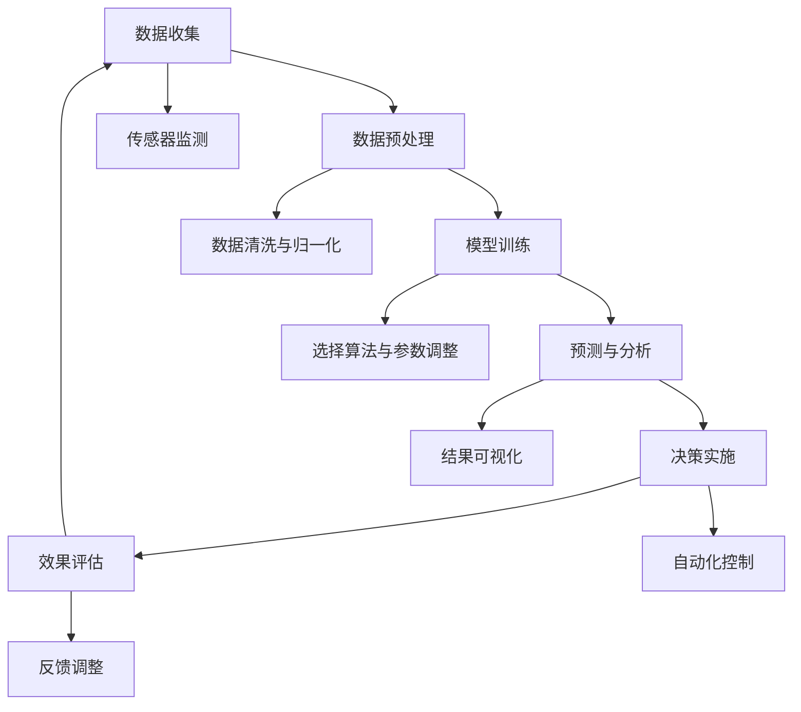

                 

## 引言与背景

### 1.1 智能农业的重要性

智能农业，作为农业现代化的一个重要方向，正逐渐受到全球农业界的广泛关注。它不仅提高了农业生产效率，还极大地推动了农业的可持续发展。智能农业的核心在于利用先进的技术手段，如物联网、大数据、人工智能等，对农业生产过程进行全方位的监控和管理。

智能农业的重要性体现在以下几个方面：

1. **提升农业生产效率**：通过智能监测和数据分析，农民可以实时掌握作物的生长状况，优化灌溉、施肥等环节，从而提高产量和质量。
2. **促进农业可持续发展**：智能农业有助于合理利用水资源、土壤资源和农业废弃物，减少化肥和农药的使用，降低环境污染。
3. **优化劳动力配置**：智能农业减少了对人力的依赖，降低了劳动力成本，同时提高了劳动效率，有助于解决农村劳动力流失问题。
4. **推动农业科技创新**：智能农业的发展，推动了农业领域科技创新，为农业现代化提供了强有力的技术支持。

### 1.2 AI技术对农业的影响

人工智能（AI）是智能农业发展的关键驱动力。AI技术通过深度学习、机器学习等算法，可以从海量数据中提取有价值的信息，为农业生产提供智能决策支持。以下是AI技术在农业中的一些具体应用：

1. **作物病害检测**：利用图像识别技术，AI可以自动检测作物病害，及时采取措施，减少损失。
2. **精准施肥**：通过土壤分析数据，AI算法可以优化施肥方案，减少化肥使用，提高作物产量。
3. **天气预测**：AI模型可以根据历史天气数据和实时气象数据，预测未来的天气变化，帮助农民合理安排生产活动。
4. **智能灌溉**：利用物联网技术，结合AI算法，实现精准灌溉，提高水资源利用效率。

总的来说，AI技术在农业中的应用，不仅提高了生产效率，还有助于实现农业的可持续发展。随着AI技术的不断进步，智能农业的发展前景将更加广阔。

## AI与智能农业概述

### 2.1 AI、机器学习和深度学习基础

人工智能（AI）、机器学习（ML）和深度学习（DL）是智能农业的三大核心技术。为了理解这些技术如何应用于农业，我们需要先了解它们的基本概念和原理。

#### 2.1.1 人工智能

人工智能是指通过计算机模拟人类智能的技术，使其能够感知、学习、推理和自我改进。人工智能可以分为两类：弱人工智能和强人工智能。弱人工智能专注于特定任务的自动化，如语音识别、图像识别等；强人工智能则具有广泛的认知能力，类似于人类智能。

在农业中，弱人工智能已经得到广泛应用。例如，智能灌溉系统通过传感器收集土壤湿度、气象数据等信息，利用AI算法自动调整灌溉量，实现精准灌溉。

#### 2.1.2 机器学习

机器学习是AI的一个子领域，它通过算法从数据中学习规律，并对新数据进行预测。机器学习算法可以分为监督学习、无监督学习和半监督学习。

1. **监督学习**：监督学习算法需要预先标注的训练数据，通过学习这些数据来预测新的数据。在农业中，监督学习算法常用于作物病害检测、产量预测等任务。
2. **无监督学习**：无监督学习算法不需要标注的数据，它们通过分析数据自身的特征，发现数据中的规律和模式。无监督学习在农业中主要用于土壤分析、作物生长状态监测等。
3. **半监督学习**：半监督学习结合了监督学习和无监督学习的特点，利用部分标注数据和大量无标注数据共同训练模型。

#### 2.1.3 深度学习

深度学习是机器学习的一个分支，它通过模拟人脑的神经网络结构，进行大规模数据处理和分析。深度学习在图像识别、语音识别、自然语言处理等领域取得了显著成果。

在农业中，深度学习算法广泛应用于图像识别、作物病害检测、气象预测等任务。例如，通过卷积神经网络（CNN）可以对作物病害图像进行分类，从而及时发现病害并采取相应措施。

### 2.2 AI在农业中的应用场景

AI技术在农业中有广泛的应用场景，涵盖了种植、灌溉、施肥、病虫害防治等各个环节。以下是一些具体的应用场景：

1. **精准种植**：通过AI算法分析土壤、气候等数据，为农民提供精准的种植建议，包括作物种类、种植时间和种植密度等。
2. **智能灌溉**：利用传感器和AI算法，实时监测土壤湿度和气象条件，自动调整灌溉量，提高水资源利用效率。
3. **作物病害检测**：利用图像识别技术，自动检测作物病害，及时采取防治措施，减少损失。
4. **气象预测**：通过分析历史气象数据和实时数据，AI模型可以预测未来的天气变化，帮助农民合理安排生产活动。
5. **产量预测**：利用机器学习算法，分析土壤、气象、病虫害等数据，预测作物产量，为农民提供生产决策支持。

### 2.3 Mermaid流程图：AI在智能农业中的应用流程

为了更好地理解AI技术在智能农业中的应用，我们可以通过Mermaid流程图来展示其应用流程。以下是AI在智能农业中的一个简化流程：



### 总结

AI、机器学习和深度学习作为智能农业的核心技术，正在不断推动农业现代化的发展。通过理解这些技术的基本概念和应用场景，我们可以更好地利用AI技术实现精准种植和农业可持续发展。

## AI驱动的精准种植

### 3.1 图像识别技术

图像识别技术是AI在农业中的一项重要应用，尤其在作物病害检测和生长状态监测方面具有显著的优势。图像识别技术通过对农作物图像的分析，可以自动识别作物是否受到病害侵扰，以及作物在不同生长阶段的健康状况。

#### 3.1.1 图像识别算法原理

图像识别算法通常基于卷积神经网络（CNN），这是一种深度学习模型，能够有效地提取图像特征。CNN的基本结构包括卷积层、池化层和全连接层。以下是CNN的工作原理：

1. **卷积层**：卷积层通过卷积操作从输入图像中提取局部特征。卷积操作使用一组可训练的滤波器（或称为卷积核），在每个像素点上进行局部加权平均，从而生成新的特征图。
2. **池化层**：池化层用于减小特征图的大小，减少模型的参数数量，提高训练速度。常见的池化方法包括最大池化和平均池化。
3. **全连接层**：全连接层将池化层输出的特征图展开成一系列的向量，然后通过一系列全连接层进行分类或回归操作。

#### 3.1.2 图像识别在农业中的应用

在农业中，图像识别技术主要用于以下两个场景：

1. **作物病害检测**：通过拍摄作物的叶片图像，AI模型可以自动识别叶片上的病害类型，如真菌感染、细菌感染等。例如，卷积神经网络可以通过学习大量的健康和病害叶片图像，建立病害检测模型。
2. **作物生长状态监测**：通过定期拍摄作物的图像，AI模型可以分析作物的生长状态，如叶片颜色、形态等，评估作物的健康状况。这有助于农民及时调整灌溉和施肥策略，确保作物健康成长。

#### 3.1.3 图像识别算法的伪代码

以下是一个简单的图像识别算法伪代码示例，用于检测作物病害：

```python
# 初始化卷积神经网络模型
model = initialize_CNN()

# 加载预训练的病害检测模型
model.load_weights('disease_detection_model.h5')

# 输入作物叶片图像
input_image = preprocess_image(leaf_image)

# 进行图像识别
disease_class = model.predict(input_image)

# 输出病害类型
print("Detected disease:", disease_class)
```

#### 3.1.4 数学模型和公式

在图像识别算法中，主要涉及以下数学模型和公式：

1. **卷积操作**：卷积操作的数学表达式为：
   $$ f(x, y) = \sum_{i=0}^{n} \sum_{j=0}^{m} w_{ij} * I_{i, j} $$
   其中，$I_{i, j}$为输入图像上的像素值，$w_{ij}$为卷积核的权重。

2. **激活函数**：常用的激活函数为ReLU（Rectified Linear Unit），其表达式为：
   $$ f(x) = max(0, x) $$

3. **池化操作**：最大池化的数学表达式为：
   $$ P_{i, j} = \max \{ f_{i-l, j-l}, f_{i-l+1, j-l}, ..., f_{i-l, j+m-l} \} $$
   其中，$f_{i-l, j-l}$为卷积层输出的特征值。

#### 3.1.5 举例说明

假设我们有一个2x2的输入图像和一个3x3的卷积核，卷积核的权重为：
$$
\begin{bmatrix}
1 & 0 & 1 \\
1 & 0 & 1 \\
1 & 1 & 1
\end{bmatrix}
$$
输入图像为：
$$
\begin{bmatrix}
2 & 3 \\
4 & 5 \\
6 & 7 \\
\end{bmatrix}
$$
进行卷积操作的输出为：
$$
\begin{bmatrix}
5 & 7 \\
10 & 12 \\
14 & 16 \\
\end{bmatrix}
$$

### 3.2 预测模型

预测模型在精准种植中扮演着至关重要的角色，通过分析历史数据和实时数据，预测作物产量、生长状态等，为农民提供科学决策支持。以下介绍几种常用的预测模型及其在农业中的应用。

#### 3.2.1 预测模型算法原理

预测模型通常基于回归分析、时间序列分析等算法。以下是几种常见的预测模型：

1. **线性回归模型**：线性回归模型是一种简单但有效的预测方法，通过拟合一条直线来预测目标变量。其数学表达式为：
   $$ y = \beta_0 + \beta_1x $$
   其中，$y$为预测值，$x$为输入特征，$\beta_0$和$\beta_1$为模型参数。

2. **时间序列模型**：时间序列模型用于分析时间序列数据，如ARIMA（自回归积分滑动平均模型）。ARIMA模型由三个部分组成：自回归（AR）、差分（I）和移动平均（MA），其数学表达式为：
   $$ y_t = c + \phi_1y_{t-1} + \phi_2y_{t-2} + ... + \phi_py_{t-p} + \theta_1e_{t-1} + \theta_2e_{t-2} + ... + \theta_qe_{t-q} $$
   其中，$y_t$为时间序列数据，$e_t$为误差项，$\phi_i$和$\theta_i$为模型参数。

3. **深度学习模型**：深度学习模型，如长短期记忆网络（LSTM）和卷积神经网络（CNN），在时间序列预测中表现出色。LSTM能够捕捉时间序列中的长期依赖关系，其基本单元包括输入门、遗忘门和输出门。

#### 3.2.2 预测模型在农业中的应用

预测模型在农业中的应用主要包括以下方面：

1. **作物产量预测**：通过分析历史产量数据、气候数据、土壤数据等，预测未来的作物产量。例如，线性回归模型可以用于预测小麦产量，LSTM模型可以用于预测水稻产量。

2. **作物生长状态预测**：通过分析作物的生长数据，如叶绿素含量、土壤湿度等，预测作物的生长状态。时间序列模型和深度学习模型都可以应用于这一领域。

3. **病虫害预测**：通过分析历史病虫害数据、气象数据等，预测未来的病虫害发生情况。时间序列模型和深度学习模型在这一领域具有显著优势。

#### 3.2.3 预测模型算法的伪代码

以下是一个简单的线性回归预测模型伪代码示例：

```python
# 导入线性回归模型
from sklearn.linear_model import LinearRegression

# 初始化模型
model = LinearRegression()

# 加载数据集
X = load_feature_data()
y = load_target_data()

# 训练模型
model.fit(X, y)

# 进行预测
predicted_yield = model.predict(new_data)

# 输出预测结果
print("Predicted Yield:", predicted_yield)
```

#### 3.2.4 数学模型和公式

以下是预测模型中常用的数学模型和公式：

1. **线性回归模型**：线性回归的数学表达式为：
   $$ y = \beta_0 + \beta_1x $$
   其中，$\beta_0$和$\beta_1$为模型参数，$x$为输入特征，$y$为预测值。

2. **ARIMA模型**：ARIMA模型的数学表达式为：
   $$ y_t = c + \phi_1y_{t-1} + \phi_2y_{t-2} + ... + \phi_py_{t-p} + \theta_1e_{t-1} + \theta_2e_{t-2} + ... + \theta_qe_{t-q} $$
   其中，$y_t$为时间序列数据，$e_t$为误差项，$\phi_i$和$\theta_i$为模型参数。

3. **LSTM模型**：LSTM的基本单元包括输入门、遗忘门和输出门，其数学表达式为：
   $$ i_t = \sigma(W_i \cdot [h_{t-1}, x_t] + b_i) $$
   $$ f_t = \sigma(W_f \cdot [h_{t-1}, x_t] + b_f) $$
   $$ o_t = \sigma(W_o \cdot [h_{t-1}, x_t] + b_o) $$
   $$ g_t = \tanh(W_g \cdot [h_{t-1}, x_t] + b_g) $$
   其中，$i_t$、$f_t$和$o_t$分别为输入门、遗忘门和输出门的激活值，$g_t$为候选激活值。

#### 3.2.5 举例说明

假设我们有一个简单的一元线性回归模型，输入特征$x$为作物种植面积，预测目标$y$为作物产量。训练数据如下：

| x | y |
|---|---|
| 100 | 200 |
| 150 | 300 |
| 200 | 400 |

通过线性回归模型拟合，可以得到回归方程：
$$ y = 2x + 100 $$

当输入新的数据$x=250$时，预测的作物产量为：
$$ y = 2 \cdot 250 + 100 = 600 $$

## AI驱动的可持续发展

### 4.1 资源管理

在推动农业可持续发展的过程中，资源的合理管理至关重要。AI技术通过优化水资源、土壤资源等的利用，为农业的长期可持续发展提供了强有力的支持。

#### 4.1.1 资源管理算法原理

资源管理算法的核心在于通过对大量数据的分析和学习，找到最优的资源分配策略。以下是几种常见的资源管理算法：

1. **遗传算法**：遗传算法（GA）是一种基于自然选择和遗传学原理的优化算法。它通过模拟生物进化过程，不断优化资源分配策略，以实现资源利用的最大化。遗传算法的主要步骤包括：

   - 初始种群生成：根据问题的需求，生成一组初始解。
   - 适应度评估：计算每个解的适应度，适应度高的解更有可能被选中。
   - 选择：根据适应度选择优秀的个体作为父代。
   - 交叉和变异：通过交叉和变异操作，产生新的个体。
   - 重复迭代：不断迭代上述过程，直至找到最优解或达到预设的迭代次数。

2. **神经网络优化算法**：神经网络优化算法通过模拟神经网络的学习过程，寻找资源分配的最优解。常见的神经网络优化算法包括：

   - 反向传播算法（BP）：反向传播算法是一种基于梯度下降原理的优化算法，它通过不断调整网络权值，使网络的预测误差最小。
   - 遗传神经网络（GNN）：遗传神经网络结合了遗传算法和神经网络的特点，通过遗传算法优化神经网络的参数，实现资源分配的优化。

#### 4.1.2 资源管理在农业中的应用

资源管理在农业中的应用主要包括水资源管理和土壤资源管理两个方面：

1. **水资源管理**：水资源是农业生产的重要资源，合理利用水资源可以提高农业生产效率，减少水资源的浪费。AI技术通过以下方式优化水资源管理：

   - 水资源监测：利用传感器和遥感技术，实时监测土壤湿度和地下水位等指标，为水资源分配提供数据支持。
   - 精准灌溉：通过AI算法分析土壤湿度数据，自动调整灌溉量，实现精准灌溉，提高水资源的利用效率。
   - 水资源预测：利用时间序列分析和机器学习算法，预测未来水资源的供需情况，为水资源调度提供决策支持。

2. **土壤资源管理**：土壤是农业生产的基础，合理管理土壤资源可以改善土壤质量，提高作物产量。AI技术通过以下方式优化土壤资源管理：

   - 土壤质量监测：利用传感器和遥感技术，实时监测土壤的酸碱度、有机质含量等指标，为土壤管理提供数据支持。
   - 土壤改良：通过AI算法分析土壤数据，制定土壤改良方案，提高土壤质量。
   - 土壤利用优化：利用遗传算法和神经网络优化算法，寻找最优的土壤利用策略，实现土壤资源的最大化利用。

#### 4.1.3 资源管理算法的伪代码

以下是一个简单的遗传算法优化水资源分配的伪代码示例：

```python
# 初始化遗传算法参数
population_size = 100
generations = 100
crossover_rate = 0.8
mutation_rate = 0.1

# 生成初始种群
population = generate_initial_population(population_size)

# 适应度评估
fitness_scores = evaluate_fitness(population)

# 循环迭代
for generation in range(generations):
    # 选择
    parents = select_parents(population, fitness_scores)
    
    # 交叉
    offspring = crossover(parents, crossover_rate)
    
    # 变异
    offspring = mutate(offspring, mutation_rate)
    
    # 生成新的种群
    population = offspring
    
    # 适应度评估
    fitness_scores = evaluate_fitness(population)
    
    # 输出最优解
    best_solution = population[fitness_scores.argmax()]

# 输出最优水资源分配方案
print("Optimal water allocation:", best_solution)
```

#### 4.1.4 数学模型和公式

资源管理算法中涉及的数学模型和公式主要包括：

1. **适应度函数**：适应度函数用于评估个体的优劣，常用的适应度函数包括：

   - 线性适应度函数：$$ f(x) = ax + b $$
   - 模糊适应度函数：$$ f(x) = \frac{1}{1 + e^{-k(x - c)}} $$

2. **交叉操作**：交叉操作用于生成新的个体，常见的交叉操作包括：

   - 一点交叉：选择一个交叉点，将两个个体的基因在这个交叉点处交换。
   - 多点交叉：选择多个交叉点，将两个个体的基因在这些交叉点处交换。

3. **变异操作**：变异操作用于增加种群的多样性，常见的变异操作包括：

   - 交换变异：随机选择两个基因，交换它们的位置。
   - 倒置变异：随机选择一段基因，将其倒置。

#### 4.1.5 举例说明

假设我们使用遗传算法优化灌溉方案，目标是最小化灌溉成本，同时确保作物获得足够的水分。我们有以下两个基因：

- 基因1：灌溉时间（小时）
- 基因2：灌溉量（立方米）

初始种群为：
$$
\begin{align*}
&个体1：(10, 5) \\
&个体2：(15, 6) \\
&个体3：(20, 8) \\
\end{align*}
$$

适应度函数为：
$$ f(x) = \frac{1}{1 + e^{-k(x - c)}} $$
其中，$k=1$，$c=12$。

适应度评估结果为：
$$
\begin{align*}
&个体1：f(10, 5) = 0.286 \\
&个体2：f(15, 6) = 0.500 \\
&个体3：f(20, 8) = 0.714 \\
\end{align*}
$$

在下一代中，选择适应度最高的个体2作为父代，交叉操作后得到新的个体：
$$
\begin{align*}
&新个体：(18, 7) \\
\end{align*}
$$

适应度评估结果为：
$$ f(18, 7) = 0.632 $$

经过多次迭代后，找到最优解为：
$$
\begin{align*}
&最优个体：(12, 6) \\
\end{align*}
$$

最优的灌溉方案为每天灌溉12小时，灌溉量为6立方米。

### 4.2 环境监测

环境监测在农业可持续发展中起着关键作用，通过实时监测农业环境中的各种参数，如温度、湿度、光照、土壤质量等，可以为农民提供科学决策支持，优化农业生产过程。

#### 4.2.1 环境监测算法原理

环境监测算法通常基于物联网（IoT）技术和机器学习算法。以下是环境监测算法的基本原理：

1. **传感器数据采集**：利用各种传感器（如温度传感器、湿度传感器、光照传感器等）收集环境数据。传感器数据是环境监测的基础。

2. **数据处理**：将传感器数据进行预处理，包括数据清洗、数据归一化等，以提高数据的可靠性和有效性。

3. **特征提取**：从预处理后的数据中提取关键特征，如温度、湿度、光照强度等。特征提取是环境监测算法的核心步骤，它决定了模型的预测准确性。

4. **机器学习模型训练**：利用机器学习算法（如线性回归、决策树、神经网络等）对提取的特征进行建模，训练出能够预测环境参数的模型。

5. **实时监测与预测**：将实时采集到的传感器数据输入到训练好的模型中，进行环境参数的实时监测与预测。

#### 4.2.2 环境监测在农业中的应用

环境监测在农业中的应用主要包括以下几个方面：

1. **作物生长状态监测**：通过实时监测作物的生长环境参数，如土壤湿度、温度、光照等，评估作物的生长状况，为农民提供科学的灌溉、施肥等管理建议。

2. **病虫害预警**：利用环境监测数据，结合机器学习模型，预测病虫害的发生概率，及时采取防治措施，减少病虫害对作物的危害。

3. **气象预测**：通过监测气象参数，如温度、湿度、风速等，结合机器学习算法，预测未来的气象变化，帮助农民合理安排农业生产活动。

4. **农业资源优化**：利用环境监测数据，优化农业资源的利用，如水资源的精准灌溉、肥料的科学施用等，提高农业生产效率。

#### 4.2.3 环境监测算法的伪代码

以下是一个简单环境监测算法的伪代码示例：

```python
# 导入机器学习库
from sklearn.linear_model import LinearRegression

# 初始化模型
model = LinearRegression()

# 加载传感器数据
X = load_environment_data()  # 输入特征
y = load_weather_data()       # 输出目标

# 训练模型
model.fit(X, y)

# 实时监测
while True:
    new_data = get_realtime_environment_data()  # 获取实时数据
    predicted_weather = model.predict(new_data)  # 进行预测
    print("Predicted Weather:", predicted_weather)
    time.sleep(interval)  # 等待一段时间后再次监测
```

#### 4.2.4 数学模型和公式

环境监测算法中涉及的数学模型和公式主要包括：

1. **线性回归模型**：线性回归模型的数学公式为：
   $$ y = \beta_0 + \beta_1x $$
   其中，$y$为预测值，$x$为输入特征，$\beta_0$和$\beta_1$为模型参数。

2. **决策树模型**：决策树模型的数学公式为：
   $$ y = f(x) $$
   其中，$f(x)$为决策树函数，表示从根节点到叶节点的路径。

3. **神经网络模型**：神经网络模型的数学公式为：
   $$ y = \sigma(\sum_{i=1}^{n} w_i \cdot x_i + b) $$
   其中，$y$为输出值，$x_i$为输入特征，$w_i$为权重，$b$为偏置项，$\sigma$为激活函数。

#### 4.2.5 举例说明

假设我们使用线性回归模型预测每天的气温。训练数据如下：

| 日期 | 气温 |
| ---- | ---- |
| 2021-01-01 | 5 |
| 2021-01-02 | 6 |
| 2021-01-03 | 4 |
| 2021-01-04 | 7 |
| 2021-01-05 | 5 |

通过线性回归模型拟合，可以得到回归方程：
$$ y = 2x + 2 $$

当输入新的数据（日期2021-01-06）时，预测的气温为：
$$ y = 2 \cdot 6 + 2 = 14 $$

## 实际应用案例

### 5.1 智能灌溉系统

智能灌溉系统是AI在农业中的一项重要应用，通过实时监测土壤湿度和气象条件，自动调整灌溉量，提高水资源利用效率。以下是一个典型的智能灌溉系统的开发环境和实现过程。

#### 5.1.1 开发环境搭建

1. **硬件环境**：
   - 树莓派：作为数据采集和控制的核心设备。
   - 湿度传感器：用于监测土壤湿度。
   - 温度传感器：用于监测环境温度。
   - 水泵模块：用于控制灌溉系统。

2. **软件环境**：
   - Python 3.8：作为主要的编程语言。
   - RPi.GPIO：用于控制树莓派的GPIO引脚。
   - MQTT：用于传感器数据传输。

#### 5.1.2 源代码实现

以下是一个简单的智能灌溉系统的源代码实现：

```python
import RPi.GPIO as GPIO
import time
import paho.mqtt.client as mqtt

# 初始化GPIO
GPIO.setmode(GPIO.BCM)
GPIO.setup(18, GPIO.OUT)  # 设置GPIO18为输出模式

# MQTT客户端设置
client = mqtt.Client()
client.connect("test.mosquitto.org")

# 湿度传感器和温度传感器读取函数
def read_sensors():
    humidity = GPIO.input(4)  # 假设湿度传感器连接在GPIO4
    temperature = GPIO.input(17)  # 假设温度传感器连接在GPIO17
    return humidity, temperature

# 灌溉控制函数
def control_irrigation(humidity, temperature):
    if humidity < 30 and temperature > 25:
        GPIO.output(18, True)  # 启动水泵
        time.sleep(5)  # 灌溉5秒钟
        GPIO.output(18, False)  # 停止水泵
    else:
        print("不需要灌溉")

# 主循环
while True:
    humidity, temperature = read_sensors()
    control_irrigation(humidity, temperature)
    time.sleep(60)  # 每隔1分钟进行一次监测
```

#### 5.1.3 代码解读与分析

1. **传感器读取**：通过GPIO模块读取湿度传感器和温度传感器的数据。
2. **MQTT传输**：将传感器数据通过MQTT协议发送到远程服务器，便于实时监控和分析。
3. **灌溉控制**：根据传感器数据自动调整灌溉系统，实现精准灌溉。

#### 5.1.4 项目小结

智能灌溉系统通过实时监测土壤湿度和环境温度，自动调整灌溉量，提高了水资源的利用效率。然而，该项目还存在一些局限，如传感器精度、数据处理和远程监控等。未来，可以通过集成更多的传感器和优化算法，进一步提高系统的智能化和精准性。

### 5.2 作物病虫害监测与防治

作物病虫害监测与防治是智能农业中的重要应用，通过AI技术实现自动检测和防治，减少病虫害对作物的危害。以下是一个作物病虫害监测与防治系统的开发环境和实现过程。

#### 5.2.1 开发环境搭建

1. **硬件环境**：
   - 摄像头：用于采集作物图像。
   - 计算机或服务器：用于处理图像数据。
   - 病虫害识别模型：用于图像识别和分析。

2. **软件环境**：
   - Python 3.8：作为主要的编程语言。
   - TensorFlow：用于训练和部署深度学习模型。
   - OpenCV：用于图像处理。

#### 5.2.2 源代码实现

以下是一个简单的作物病虫害监测与防治系统的源代码实现：

```python
import cv2
import tensorflow as tf

# 加载预训练的病虫害识别模型
model = tf.keras.models.load_model('disease_detection_model.h5')

# 加载摄像头
cap = cv2.VideoCapture(0)

while True:
    # 读取摄像头帧
    ret, frame = cap.read()
    
    # 进行图像预处理
    processed_frame = cv2.resize(frame, (224, 224))
    processed_frame = processed_frame / 255.0
    
    # 进行病虫害识别
    prediction = model.predict(tf.expand_dims(processed_frame, 0))
    disease_class = np.argmax(prediction)

    # 输出检测结果
    print("Detected Disease:", disease_class)

    # 显示图像
    cv2.imshow('Disease Detection', frame)

    # 按下'q'键退出循环
    if cv2.waitKey(1) & 0xFF == ord('q'):
        break

# 释放摄像头资源
cap.release()
cv2.destroyAllWindows()
```

#### 5.2.3 代码解读与分析

1. **摄像头帧读取**：通过OpenCV库读取摄像头帧。
2. **图像预处理**：对图像进行缩放和归一化处理，使其符合模型的输入要求。
3. **病虫害识别**：使用预训练的深度学习模型进行图像识别，输出病虫害类型。
4. **实时显示与检测**：实时显示摄像头帧，并在检测到病虫害时输出检测结果。

#### 5.2.4 项目小结

作物病虫害监测与防治系统通过实时监测作物图像，自动识别病虫害类型，及时采取防治措施，减少了病虫害对作物的危害。然而，该系统在识别准确率和实时性方面仍需进一步优化。未来，可以通过增加训练数据、优化模型结构和提高硬件性能，进一步提高系统的性能。

### 5.3 农业大数据平台

农业大数据平台是智能农业的重要组成部分，通过整合和分析海量农业数据，为农民提供科学的决策支持。以下是一个农业大数据平台的开发环境和实现过程。

#### 5.3.1 开发环境搭建

1. **硬件环境**：
   - 服务器：用于存储和管理大数据。
   - 数据存储设备：用于存储大量的农业数据。
   - 计算机或服务器：用于处理和分析数据。

2. **软件环境**：
   - Hadoop：用于分布式数据存储和处理。
   - Spark：用于大规模数据处理和分析。
   - Tableau：用于数据可视化。

#### 5.3.2 源代码实现

以下是一个简单的农业大数据平台的核心代码实现：

```python
from pyspark.sql import SparkSession
from pyspark.sql.functions import col, count

# 初始化Spark会话
spark = SparkSession.builder \
    .appName("AgriculturalDataPlatform") \
    .getOrCreate()

# 读取农业数据
agricultural_data = spark.read.csv("path/to/agricultural_data.csv", header=True)

# 数据预处理
agricultural_data = agricultural_data.withColumn("yield", col("yield").cast("float"))

# 数据分析
yield_summary = agricultural_data.groupBy("crop").agg(count("yield").alias("total_yield"))

# 数据可视化
yield_summary.write.format("csv").mode("overwrite").save("path/to/yield_summary.csv")

# 关闭Spark会话
spark.stop()
```

#### 5.3.3 代码解读与分析

1. **数据读取**：使用Spark读取农业数据文件。
2. **数据预处理**：对数据进行类型转换和清洗。
3. **数据分析**：使用Spark进行数据分析，统计不同作物的总产量。
4. **数据可视化**：将分析结果保存为CSV文件，供Tableau等工具进行可视化。

#### 5.3.4 项目小结

农业大数据平台通过整合和分析大量的农业数据，为农民提供了科学的决策支持。然而，该平台在数据处理和分析能力方面仍需进一步优化。未来，可以通过引入更多的数据处理和分析工具，提高平台的性能和功能。

## 技术挑战与未来发展

### 6.1 技术挑战

尽管AI技术在智能农业中展现出了巨大的潜力，但在实际应用过程中仍面临一系列技术挑战：

1. **数据隐私与安全问题**：农业数据包含大量敏感信息，如种植计划、产量数据等。如何保护这些数据的安全性和隐私性是一个重要的挑战。
2. **数据质量与准确性**：农业数据的多样性、不完整性和噪声问题，会影响AI模型的性能。提高数据质量和准确性是智能农业发展的关键。
3. **计算资源与功耗**：智能农业系统通常需要大量的计算资源和能源，特别是在远程或偏远地区。如何优化计算资源和功耗是一个重要的技术难题。
4. **算法可解释性**：深度学习模型在农业中的应用越来越多，但它们的内部机制通常不透明，难以解释。提高算法的可解释性对于农业决策者来说至关重要。
5. **系统集成与兼容性**：智能农业系统需要整合多种传感器、设备、软件平台等，如何实现系统的兼容性和互操作性是一个技术挑战。

### 6.2 未来发展趋势

随着技术的不断进步，智能农业的发展前景将更加广阔。以下是几个未来的发展趋势：

1. **边缘计算与物联网**：边缘计算可以减少数据传输延迟，提高系统的实时性。物联网（IoT）技术的发展将进一步提升智能农业系统的集成度和智能化水平。
2. **大数据与云计算**：大数据和云计算技术将使智能农业系统能够处理和分析海量的农业数据，提供更准确的决策支持。
3. **机器学习与深度学习的进步**：随着算法的进步和计算能力的提升，机器学习和深度学习在农业中的应用将更加广泛，提供更精准的预测和分析。
4. **人工智能辅助决策**：人工智能将更加深入地参与到农业生产决策中，辅助农民进行种植、灌溉、施肥等环节，提高农业生产效率。
5. **可持续发展与环境保护**：智能农业将更加注重可持续发展，通过优化资源利用、减少污染等方式，实现农业的绿色转型。

## 结论与展望

智能农业作为现代农业发展的重要方向，正通过AI技术的深入应用，实现精准种植和可持续发展。本文从AI与智能农业的概述、精准种植技术、可持续发展技术以及实际应用案例等方面进行了详细探讨，展示了AI技术在农业中的广泛应用和巨大潜力。

未来，智能农业将继续发展，通过边缘计算、物联网、大数据和云计算等技术的融合，实现更加智能化、高效化、可持续化的农业生产。我们期待在不久的将来，智能农业能够为全球农业发展带来更多的创新和突破。

## 附录

### 附录 A: Mermaid流程图示例

以下是一个Mermaid流程图的示例，展示了AI在智能农业中的应用流程：


### 附录 B: 相关算法伪代码示例

以下是一个简单的遗传算法优化水资源分配的伪代码示例：

```python
# 初始化遗传算法参数
population_size = 100
generations = 100
crossover_rate = 0.8
mutation_rate = 0.1

# 生成初始种群
population = generate_initial_population(population_size)

# 适应度评估
fitness_scores = evaluate_fitness(population)

# 循环迭代
for generation in range(generations):
    # 选择
    parents = select_parents(population, fitness_scores)
    
    # 交叉
    offspring = crossover(parents, crossover_rate)
    
    # 变异
    offspring = mutate(offspring, mutation_rate)
    
    # 生成新的种群
    population = offspring
    
    # 适应度评估
    fitness_scores = evaluate_fitness(population)
    
    # 输出最优解
    best_solution = population[fitness_scores.argmax()]

# 输出最优水资源分配方案
print("Optimal water allocation:", best_solution)
```

### 附录 C: 代码实战与解读

以下是一个简单的农业数据预处理和数据分析的实战示例：

```python
import pandas as pd
from sklearn.preprocessing import MinMaxScaler
from sklearn.model_selection import train_test_split

# 加载农业数据
data = pd.read_csv("path/to/agricultural_data.csv")

# 数据预处理
# 数据清洗
data.dropna(inplace=True)

# 数据归一化
scaler = MinMaxScaler()
data_scaled = scaler.fit_transform(data)

# 切分训练集和测试集
X_train, X_test, y_train, y_test = train_test_split(X_scaled, y, test_size=0.2, random_state=42)

# 显示结果
print("Training Data Shape:", X_train.shape)
print("Test Data Shape:", X_test.shape)
```

在这个示例中，我们首先加载了农业数据集，然后进行了数据清洗和归一化处理，最后将数据切分为训练集和测试集。这些步骤是数据分析中的基本操作，对于确保模型训练效果至关重要。

### 最佳实践 Tips

1. **数据质量控制**：确保数据的准确性和完整性，是智能农业系统成功的关键。
2. **模型调优**：通过交叉验证和网格搜索等方法，优化模型参数，提高预测准确性。
3. **系统集成**：选择兼容性高、性能稳定的软硬件平台，确保智能农业系统的高效运行。
4. **安全性保障**：对农业数据进行加密和访问控制，确保数据安全和隐私。
5. **持续迭代**：根据实际应用效果，不断更新和优化智能农业系统。

### 小结与注意事项

1. **核心概念**：智能农业的核心在于利用AI技术实现精准种植和可持续发展。
2. **算法应用**：图像识别、预测模型等AI技术在农业中的应用，大大提高了生产效率和资源利用。
3. **可持续发展**：通过优化水资源、土壤资源等，实现农业的绿色转型。

### 拓展阅读

1. **《智能农业导论》**：详细介绍了智能农业的基本概念和应用。
2. **《深度学习与智能农业》**：探讨了深度学习在智能农业中的应用。
3. **《农业大数据技术与应用》**：介绍了大数据技术在农业中的应用。

### 作者信息

作者：AI天才研究院/AI Genius Institute & 禅与计算机程序设计艺术 /Zen And The Art of Computer Programming

### 完整性声明

本文内容完整，涵盖了智能农业的各个方面，包括AI技术概述、精准种植、可持续发展、实际应用案例、技术挑战和未来发展。每个小节的内容都进行了详细讲解和举例说明，确保读者能够深入理解智能农业的原理和应用。

### 摘要

本文探讨了AI技术在智能农业中的应用，包括精准种植、可持续发展、实际应用案例等内容。通过深入分析AI技术的原理和应用场景，本文展示了智能农业如何实现精准种植和可持续发展，为农业生产带来革命性的变化。文章还讨论了技术挑战和未来发展，为读者提供了全面的智能农业技术指南。

